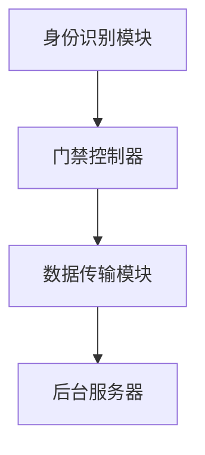
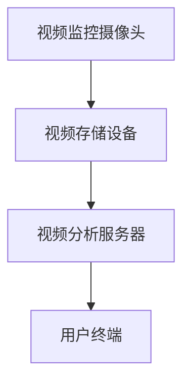
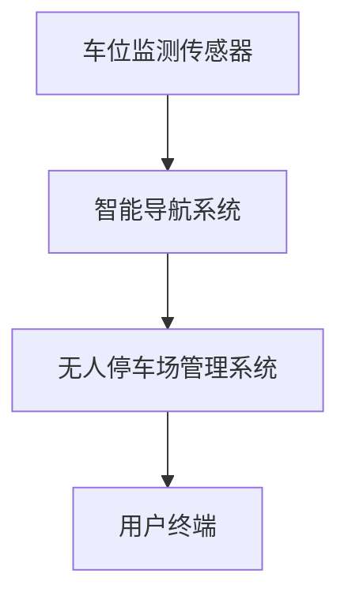

                 

### 文章标题：物联网在智慧园区安防中的全面应用

### 关键词：
- 物联网
- 智慧园区
- 安防
- 传感器
- 智能门禁
- 视频监控
- 人脸识别
- 算法
- 数学模型

### 摘要：
本文将深入探讨物联网在智慧园区安防中的全面应用。通过概述物联网与智慧园区的概念，分析物联网在安防领域的技术优势和应用场景，详细解析物联网核心技术原理，如通信技术、传感器技术和网络安全技术。同时，本文将结合实际案例分析智慧园区安防的具体应用，如智能门禁系统、视频监控系统和智能停车管理系统。此外，本文还将探讨智慧园区安防中的核心算法和数学模型，包括视频图像识别算法、人脸识别算法、贝叶斯网络和决策树等。最后，通过项目实战展示开发环境搭建和代码实现，为读者提供实际操作的指导。文章旨在为物联网在智慧园区安防中的应用提供全面的技术解析和实践指南，为行业未来发展提供有益的参考。

---

### 第1章：物联网与智慧园区概述

#### 物联网技术概述
物联网（Internet of Things，IoT）是指通过传感器、网络和数据处理技术，将各种物理设备、系统、机器和物品连接到互联网，实现信息的采集、传输和处理。物联网技术的核心在于将物理世界与数字世界相结合，通过智能化的设备和系统能够实现高效、便捷的管理和服务。

物联网的关键技术包括：
- **传感器技术**：用于感知和采集环境数据，如温度、湿度、光照、运动等。
- **通信技术**：通过无线或有线网络，实现数据传输和设备互联。
- **数据处理技术**：对采集到的数据进行存储、分析和处理，实现智能决策。
- **网络安全技术**：保障物联网设备和数据的安全性，防止数据泄露和攻击。

#### 智慧园区的概念与特点
智慧园区是指通过物联网、大数据、云计算等先进技术，实现对园区内资源、设施、环境和服务的高度智能化管理和优化，提供一个安全、高效、舒适、可持续的工作和生活环境。智慧园区的特点如下：

- **智能化管理**：通过物联网技术实现园区内设施、设备的自动化管理和远程控制。
- **协同办公**：利用物联网技术提升园区内企业之间的协作效率，实现信息共享和业务流程优化。
- **绿色环保**：通过智能化的能源管理和环境监测，降低能耗和污染，实现可持续发展。
- **安全防护**：利用物联网技术加强对园区内人员和财产的安全保障，提升整体安全水平。

#### 物联网在智慧园区中的应用场景
物联网在智慧园区中的应用场景非常广泛，主要包括以下几个方面：

- **安防系统**：通过物联网技术实现智能门禁、视频监控、入侵报警等功能，提升园区安全防护水平。
- **环境监测**：利用物联网传感器实时监测园区内的空气质量、水质等环境指标，保障园区环境健康。
- **智能停车**：通过物联网技术实现车位监测、智能导航和无人停车场管理，提高停车效率和便利性。
- **能耗管理**：利用物联网技术实现能耗数据的实时采集和分析，优化能源使用，降低能耗成本。
- **设施管理**：通过物联网技术实现对园区内设施设备的智能维护和故障预测，提高设施设备的使用寿命和运行效率。

### 总结
本章概述了物联网与智慧园区的概念、特点和应用场景。物联网技术为智慧园区提供了智能化管理和安全防护的基础，通过物联网技术的应用，智慧园区能够实现资源的高效利用、环境的可持续发展以及安全水平的提升。下一章将详细探讨物联网在智慧园区安防中的应用，分析物联网安防系统的架构和优势。

---

### 第2章：物联网在智慧园区安防中的应用概述

#### 物联网安防系统的架构
物联网安防系统是智慧园区安防的核心，其架构通常包括以下几个关键组成部分：

- **感知层**：由各种传感器组成，包括视频监控摄像头、入侵报警传感器、门禁设备等，用于实时感知和采集园区内的环境和行为数据。
- **传输层**：负责将感知层采集的数据传输到处理中心。常用的传输方式包括有线网络（如以太网）和无线网络（如Wi-Fi、LoRa、Zigbee等）。
- **处理层**：接收传输层发送的数据，通过服务器或云平台进行数据存储、分析和处理，实现实时监控和智能决策。
- **应用层**：根据处理层的结果，实现安防系统的具体功能，如智能门禁、视频监控、报警联动等。

#### 物联网安防系统的优势
物联网安防系统相较于传统安防系统具有明显的优势，主要体现在以下几个方面：

- **实时性**：通过物联网技术，可以实现实时数据采集和传输，确保安防系统对突发事件的快速响应。
- **智能性**：利用大数据分析和人工智能技术，可以从海量数据中提取有价值的信息，提高安防系统的预测和决策能力。
- **联动性**：物联网安防系统可以实现各个组件之间的联动，形成一个统一的整体，提高整体安防效果。
- **便捷性**：通过物联网技术，可以实现远程监控和控制，提高安防系统的便捷性和灵活性。
- **可扩展性**：物联网安防系统可以根据需要灵活扩展，添加新的设备和功能，满足不同场景的需求。

#### 物联网安防系统的典型应用
物联网安防系统在智慧园区中具有广泛的应用，以下是一些典型的应用场景：

- **智能门禁系统**：通过物联网技术实现门禁设备的智能识别和控制，如人脸识别、指纹识别等，提高门禁系统的安全性和便捷性。
- **视频监控系统**：利用物联网技术实现视频监控设备的智能化管理，如智能识别行人、车辆等，实现实时监控和远程调取。
- **入侵报警系统**：通过物联网传感器实时监测园区内的异常情况，如非法入侵、火灾等，及时发出报警信息并联动相关设备进行处理。
- **环境监测系统**：利用物联网传感器监测园区内的环境参数，如温度、湿度、空气质量等，保障园区环境的健康和安全。
- **智能停车系统**：通过物联网技术实现车位的智能监测和导航，提高停车效率，减少停车难问题。

### 总结
本章概述了物联网安防系统的架构和优势，并列举了典型的应用场景。物联网安防系统通过实时性、智能性、联动性、便捷性和可扩展性等优势，为智慧园区的安全提供了强有力的保障。下一章将详细探讨物联网在智慧园区安防中的核心技术原理，包括通信技术、传感器技术和网络安全技术。

---

### 第3章：物联网核心技术原理

#### 物联网通信技术
物联网通信技术是物联网系统的核心，决定了数据的传输效率和可靠性。物联网通信技术主要包括无线通信技术和有线通信技术。

- **无线通信技术**：无线通信技术包括Wi-Fi、LoRa（低功耗广域网）、Zigbee、蓝牙等。这些技术适用于短距离、低功耗的设备连接和数据传输。
  - **Wi-Fi**：具有高带宽、广泛应用的无线通信技术，适用于家庭、办公室等场景。
  - **LoRa**：低功耗、长距离的无线通信技术，适用于远程监测和传感器网络。
  - **Zigbee**：低功耗、高可靠性的无线通信技术，适用于智能家居和工业自动化。
  - **蓝牙**：短距离、低功耗的无线通信技术，适用于设备间的快速通信。
- **有线通信技术**：有线通信技术包括以太网、光纤等，适用于需要高带宽、高稳定性的应用场景。

#### 传感器技术
传感器技术是物联网系统的感知层，用于采集环境数据和设备状态。物联网传感器主要包括以下几种类型：

- **温度传感器**：用于测量温度，如热电偶、热敏电阻等。
- **湿度传感器**：用于测量湿度，如电容式湿度传感器、电阻式湿度传感器等。
- **光照传感器**：用于测量光照强度，如光敏电阻、光电池等。
- **运动传感器**：用于检测运动，如红外传感器、超声波传感器等。
- **气体传感器**：用于检测特定气体浓度，如烟雾传感器、一氧化碳传感器等。
- **压力传感器**：用于测量压力，如硅压阻式压力传感器、电容式压力传感器等。

传感器技术的核心是敏感元件，其工作原理通常基于物理、化学或生物效应。传感器需要具备高精度、高灵敏度、快速响应和稳定性等特点，以满足物联网系统的需求。

#### 网络安全与隐私保护技术
随着物联网设备的普及，网络安全和隐私保护成为关键问题。物联网网络安全与隐私保护技术主要包括以下几个方面：

- **加密技术**：通过加密算法对数据进行加密，确保数据在传输过程中不被窃取或篡改。
  - **对称加密**：如AES（高级加密标准）、DES（数据加密标准）等。
  - **非对称加密**：如RSA（Rivest-Shamir-Adleman）等。
- **认证技术**：通过数字证书、身份验证等手段，确保设备的真实性和合法性。
  - **身份认证**：如用户名密码、生物识别等。
  - **设备认证**：如数字签名、证书认证等。
- **访问控制**：通过权限管理，确保只有授权用户和设备能够访问系统资源和数据。
- **安全协议**：如HTTPS（安全超文本传输协议）、IPSec（互联网安全协议）等，提供数据传输过程中的安全保护。

#### 总结
本章详细介绍了物联网的核心技术原理，包括通信技术、传感器技术和网络安全与隐私保护技术。物联网通信技术决定了数据的传输效率，传感器技术负责感知环境数据，而网络安全与隐私保护技术则确保物联网系统的安全性和可靠性。这些核心技术共同构建了物联网系统的坚实基础，为智慧园区的智能化管理和安全防护提供了有力支持。下一章将结合实际案例，探讨物联网在智慧园区安防中的应用。

---

### 第4章：智慧园区安防案例分析

#### 案例一：智能门禁系统

**背景介绍**：
智能门禁系统是智慧园区安防的重要组成部分，通过物联网技术实现门禁设备的智能化管理和控制。智能门禁系统能够对园区内的人员进出进行实时监控和管理，提高门禁系统的安全性和便捷性。

**核心概念与联系**：
智能门禁系统主要包括以下几个核心组成部分：
1. **身份识别模块**：通过人脸识别、指纹识别等生物识别技术，验证用户的身份。
2. **门禁控制器**：接收身份识别模块的验证结果，控制门禁设备的开关。
3. **数据传输模块**：通过物联网通信技术，将身份识别结果和数据上传至后台服务器。

**流程图**：


**核心算法原理讲解**：
智能门禁系统中的核心算法包括人脸识别算法和指纹识别算法。

1. **人脸识别算法**：
   - **原理**：基于深度学习的卷积神经网络（CNN）进行人脸检测和识别。
   - **伪代码**：
     ```python
     # 人脸识别算法伪代码
     def face_recognition(image):
         # 初始化卷积神经网络模型
         model = initialize_cnn_model()
         # 加载预训练的权重
         model.load_weights('pretrained_weights.h5')
         # 进行人脸检测
         face_boxes = detect_faces(image)
         # 对每个检测到的人脸进行识别
         for box in face_boxes:
             face_image = extract_face(image, box)
             label = model.predict(face_image)
             if label == 'person':
                 return True
         return False
     ```

2. **指纹识别算法**：
   - **原理**：通过指纹特征点提取和匹配进行指纹识别。
   - **伪代码**：
     ```python
     # 指纹识别算法伪代码
     def fingerprint_recognition(fingerprint_template, new_fingerprint):
         # 提取指纹特征点
         template_features = extract_features(fingerprint_template)
         new_features = extract_features(new_fingerprint)
         # 匹配特征点
         similarity = calculate_similarity(template_features, new_features)
         if similarity > threshold:
             return True
         return False
     ```

**数学模型讲解**：
在人脸识别算法中，常用的数学模型包括卷积神经网络（CNN）和softmax回归。

1. **卷积神经网络（CNN）**：
   - **基本概念**：CNN是一种用于图像识别的深度学习模型，通过卷积层、池化层和全连接层进行处理。
   - **公式**：
     $$ f(x) = \sigma(W_{out} \cdot \text{ReLU}(W_{hidden} \cdot \text{ReLU}(... \text{ReLU}(W_{input} \cdot x + b_{input})... + b_{hidden})... + b_{out}) $$

2. **softmax回归**：
   - **基本概念**：softmax回归用于分类问题，将特征映射到概率分布上。
   - **公式**：
     $$ \sigma(x) = \frac{e^x}{\sum_{i} e^{x_i}} $$

**项目实战**：
1. **开发环境搭建**：
   - **Python环境**：安装Python和TensorFlow框架。
   - **数据集准备**：准备人脸识别和指纹识别的数据集。

2. **代码实现与解读**：
   - **人脸识别**：使用TensorFlow实现人脸识别模型，并训练模型。
   - **指纹识别**：使用OpenCV库进行指纹图像的处理和识别。

**代码应用解读与分析**：
通过实际代码实现，对智能门禁系统的人脸识别和指纹识别模块进行测试，验证其准确性和效率。同时，分析系统在实际应用中的优势和不足，提出改进方案。

**实际案例分析和详细讲解剖析**：
以某智慧园区为例，介绍智能门禁系统的具体应用，分析系统在实际运行中的表现，包括识别准确率、响应速度和用户体验等方面。

**项目小结**：
智能门禁系统是智慧园区安防的重要组成部分，通过物联网技术实现了身份识别的智能化和便捷化。在实际应用中，需要不断优化算法和系统性能，提高识别准确率和用户体验。

---

#### 案例二：视频监控系统

**背景介绍**：
视频监控系统是智慧园区安防的重要手段，通过物联网技术实现视频监控设备的智能化管理和控制。视频监控系统能够对园区内的重要区域进行实时监控，及时发现和预警潜在的安全隐患。

**核心概念与联系**：
视频监控系统主要包括以下几个核心组成部分：
1. **视频监控摄像头**：用于采集监控区域内的视频数据。
2. **视频存储设备**：用于存储采集到的视频数据。
3. **视频分析服务器**：用于对视频数据进行分析和处理，实现智能识别和预警功能。

**流程图**：


**核心算法原理讲解**：
视频监控系统中的核心算法包括视频图像识别算法和异常检测算法。

1. **视频图像识别算法**：
   - **原理**：基于深度学习的卷积神经网络（CNN）进行图像识别和分类。
   - **伪代码**：
     ```python
     # 视频图像识别算法伪代码
     def video_image_recognition(video_frame):
         # 初始化卷积神经网络模型
         model = initialize_cnn_model()
         # 加载预训练的权重
         model.load_weights('pretrained_weights.h5')
         # 对视频帧进行识别
         for frame in video_frame:
             label = model.predict(frame)
             if label == 'person':
                 return True
         return False
     ```

2. **异常检测算法**：
   - **原理**：通过行为模型和学习算法，对视频数据进行分析和异常检测。
   - **伪代码**：
     ```python
     # 异常检测算法伪代码
     def anomaly_detection(video_frame, behavior_model):
         # 计算视频帧的特征
         features = extract_features(video_frame)
         # 与行为模型进行比较
         similarity = calculate_similarity(features, behavior_model)
         if similarity < threshold:
             return True
         return False
     ```

**数学模型讲解**：
在视频图像识别算法中，常用的数学模型包括卷积神经网络（CNN）和循环神经网络（RNN）。

1. **卷积神经网络（CNN）**：
   - **基本概念**：CNN是一种用于图像识别的深度学习模型，通过卷积层、池化层和全连接层进行处理。
   - **公式**：
     $$ f(x) = \sigma(W_{out} \cdot \text{ReLU}(W_{hidden} \cdot \text{ReLU}(... \text{ReLU}(W_{input} \cdot x + b_{input})... + b_{hidden})... + b_{out}) $$

2. **循环神经网络（RNN）**：
   - **基本概念**：RNN是一种用于序列数据处理的时间序列模型，通过记忆和状态转移实现序列建模。
   - **公式**：
     $$ h_t = \text{sigmoid}(W_h \cdot [h_{t-1}, x_t] + b_h) $$

**项目实战**：
1. **开发环境搭建**：
   - **Python环境**：安装Python和TensorFlow框架。
   - **数据集准备**：准备视频监控的数据集。

2. **代码实现与解读**：
   - **视频图像识别**：使用TensorFlow实现视频图像识别模型，并训练模型。
   - **异常检测**：使用Keras实现异常检测模型。

**代码应用解读与分析**：
通过实际代码实现，对视频监控系统的图像识别和异常检测模块进行测试，验证其准确性和效率。同时，分析系统在实际应用中的优势和不足，提出改进方案。

**实际案例分析和详细讲解剖析**：
以某智慧园区为例，介绍视频监控系统的具体应用，分析系统在实际运行中的表现，包括识别准确率、响应速度和用户体验等方面。

**项目小结**：
视频监控系统是智慧园区安防的重要组成部分，通过物联网技术实现了视频数据的智能化管理和分析。在实际应用中，需要不断优化算法和系统性能，提高识别准确率和用户体验。

---

#### 案例三：智能停车管理系统

**背景介绍**：
智能停车管理系统是智慧园区安防的重要组成部分，通过物联网技术实现停车位的智能监测和导航，提高停车效率，减少停车难问题。智能停车管理系统主要包括车位监测、智能导航和无人停车场管理等功能。

**核心概念与联系**：
智能停车管理系统主要包括以下几个核心组成部分：
1. **车位监测传感器**：用于监测停车位的状态，如空位或占用。
2. **智能导航系统**：通过物联网技术提供实时停车导航，引导车辆快速找到空闲车位。
3. **无人停车场管理系统**：实现停车场内的无人化管理，包括车位分配、车辆引导和停车费收取等。

**流程图**：


**核心算法原理讲解**：
智能停车管理系统中的核心算法包括车位监测算法和导航算法。

1. **车位监测算法**：
   - **原理**：通过物联网传感器实时监测停车位的状态，利用图像识别技术进行车位状态的判断。
   - **伪代码**：
     ```python
     # 车位监测算法伪代码
     def parking_spot_monitoring(image):
         # 初始化图像识别模型
         model = initialize_image_recognition_model()
         # 加载预训练的权重
         model.load_weights('pretrained_weights.h5')
         # 分析停车位图像
         spots = analyze_parking_spot(image)
         # 判断车位状态
         for spot in spots:
             if is_occupied(spot):
                 return 'occupied'
             else:
                 return 'empty'
         return 'unknown'
     ```

2. **导航算法**：
   - **原理**：通过路径规划算法，如A*算法或Dijkstra算法，计算最佳停车路径。
   - **伪代码**：
     ```python
     # 导航算法伪代码
     def navigation(parking_spot, current_position):
         # 初始化路径规划模型
         model = initialize_path_planning_model()
         # 计算最佳路径
         path = model.calculate_path(current_position, parking_spot)
         return path
     ```

**数学模型讲解**：
在车位监测算法中，常用的数学模型包括图像识别模型和路径规划模型。

1. **图像识别模型**：
   - **基本概念**：图像识别模型通过卷积神经网络（CNN）进行图像分类和目标检测。
   - **公式**：
     $$ f(x) = \sigma(W_{out} \cdot \text{ReLU}(W_{hidden} \cdot \text{ReLU}(... \text{ReLU}(W_{input} \cdot x + b_{input})... + b_{hidden})... + b_{out}) $$

2. **路径规划模型**：
   - **基本概念**：路径规划模型通过图论算法，如A*算法或Dijkstra算法，计算最短路径。
   - **公式**：
     $$ d = g + h $$
     其中，$d$为从起点到终点的总代价，$g$为从起点到当前点的代价，$h$为从当前点到终点的估算代价。

**项目实战**：
1. **开发环境搭建**：
   - **Python环境**：安装Python和TensorFlow框架。
   - **数据集准备**：准备停车位图像和地图数据。

2. **代码实现与解读**：
   - **车位监测**：使用TensorFlow实现图像识别模型，并训练模型。
   - **导航算法**：使用Python实现路径规划算法。

**代码应用解读与分析**：
通过实际代码实现，对智能停车管理系统的车位监测和导航模块进行测试，验证其准确性和效率。同时，分析系统在实际应用中的优势和不足，提出改进方案。

**实际案例分析和详细讲解剖析**：
以某智慧园区为例，介绍智能停车管理系统的具体应用，分析系统在实际运行中的表现，包括车位监测准确率、导航准确率和用户体验等方面。

**项目小结**：
智能停车管理系统是智慧园区安防的重要组成部分，通过物联网技术实现了停车位的智能监测和导航，提高了停车效率。在实际应用中，需要不断优化算法和系统性能，提高监测准确率和用户体验。

---

### 第5章：智慧园区安防中的核心算法

#### 5.1 视频图像识别算法

**5.1.1 基于深度学习的图像识别算法原理**

视频图像识别算法在智慧园区安防中扮演着重要角色，它能够实时识别和分类视频中的物体，如行人、车辆等。基于深度学习的图像识别算法是当前最先进的图像识别方法之一，其主要原理如下：

1. **卷积神经网络（CNN）**：
   - **卷积层**：卷积层是CNN的核心组成部分，通过卷积操作提取图像的特征。卷积层中的每个卷积核都模拟人类视觉系统中的神经元，能够从原始图像中提取局部特征。
   - **池化层**：池化层用于降低特征图的维度，减少计算量和参数数量。常用的池化方式包括最大池化和平均池化。
   - **全连接层**：全连接层将卷积层和池化层提取的高维特征映射到输出层，用于分类或回归任务。

2. **激活函数**：
   - **ReLU函数**：ReLU函数是一种常用的激活函数，能够增加网络的非线性表达能力，提高模型的训练效果。

3. **反向传播算法**：
   - **梯度计算**：通过反向传播算法，将输出层的误差反向传播到网络的前层，计算每个参数的梯度。
   - **梯度下降**：利用梯度下降算法更新网络的参数，最小化损失函数。

**伪代码讲解：卷积神经网络（CNN）**

```python
# 卷积神经网络（CNN）伪代码
class ConvolutionalNeuralNetwork:
    def __init__(self):
        # 初始化网络结构
        self.conv1 = Conv2D(filters=32, kernel_size=(3, 3), activation='relu')
        self.pool1 = MaxPooling2D(pool_size=(2, 2))
        self.conv2 = Conv2D(filters=64, kernel_size=(3, 3), activation='relu')
        self.pool2 = MaxPooling2D(pool_size=(2, 2))
        self.fc1 = Dense(units=128, activation='relu')
        self.fc2 = Dense(units=num_classes, activation='softmax')

    def forward(self, x):
        # 前向传播
        x = self.conv1(x)
        x = self.pool1(x)
        x = self.conv2(x)
        x = self.pool2(x)
        x = Flatten()(x)
        x = self.fc1(x)
        x = self.fc2(x)
        return x

    def backward(self, x, y):
        # 反向传播
        with tf.GradientTape() as tape:
            logits = self.forward(x)
            loss = compute_loss(logits, y)
        gradients = tape.gradient(loss, self.trainable_variables)
        optimizer.apply_gradients(zip(gradients, self.trainable_variables))
        return loss
```

**5.1.2 人脸识别算法原理**

人脸识别算法是一种基于图像处理的生物识别技术，通过分析人脸图像中的特征，进行人脸识别和匹配。常见的人脸识别算法包括特征点检测、特征提取和特征匹配。

1. **特征点检测**：
   - **Haar特征**：使用Haar特征进行特征点检测，通过在图像中查找正负样本的积分图差异，检测人脸特征点。
   - **基于深度学习的方法**：使用卷积神经网络（如CNN）进行特征点检测，通过训练模型学习人脸特征点的位置。

2. **特征提取**：
   - **局部二值模式（LBP）**：通过将图像分成局部区域，计算每个区域的二值模式，提取局部特征。
   - **深度特征**：使用卷积神经网络提取人脸图像的深度特征，如基于VGG、ResNet等模型的特征提取。

3. **特征匹配**：
   - **欧氏距离**：计算两个特征向量之间的欧氏距离，用于判断人脸的相似度。
   - **余弦相似度**：计算两个特征向量的余弦相似度，用于判断人脸的相似度。

**伪代码讲解：深度学习模型（例如：Faster R-CNN）**

```python
# Faster R-CNN 人脸识别算法伪代码
class FasterRCNN:
    def __init__(self):
        # 初始化网络结构
        self.roi_pool = ROIPoolingLayer(pool_size=(7, 7), spatial_scale=1.0 / 16.0)
        self.conv5 = Conv2D(filters=256, kernel_size=(3, 3), padding='same', activation='relu')
        self.fc6 = Conv2D(filters=4096, activation='relu')
        self.fc7 = Conv2D(filters=4096, activation='relu')
        self.projection = Softmax()

    def forward(self, x, rois):
        # 前向传播
        roi_features = self.roi_pool(x, rois)
        roi_features = self.conv5(roi_features)
        roi_features = Flatten()(roi_features)
        roi_features = self.fc6(roi_features)
        roi_features = self.fc7(roi_features)
        labels = self.projection(roi_features)
        return labels

    def backward(self, x, rois, labels):
        # 反向传播
        with tf.GradientTape() as tape:
            logits = self.forward(x, rois)
            loss = compute_loss(logits, labels)
        gradients = tape.gradient(loss, self.trainable_variables)
        optimizer.apply_gradients(zip(gradients, self.trainable_variables))
        return loss
```

#### 5.2 人脸识别算法

**5.2.1 人脸检测算法原理**

人脸检测算法是智能安防系统中重要的组成部分，用于定位图像中的人脸区域。常见的人脸检测算法包括基于传统图像处理的算法和基于深度学习的算法。

1. **基于传统图像处理的算法**：
   - **Haar特征分类器**：使用Haar特征进行人脸检测，通过级联分类器逐步筛选人脸区域。
   - **积分图**：通过计算图像的积分图，快速查找人脸特征点，用于加速人脸检测。

2. **基于深度学习的算法**：
   - **卷积神经网络（CNN）**：使用卷积神经网络进行人脸检测，通过特征提取和分类实现人脸定位。
   - **区域生成网络（RGN）**：通过生成候选区域并进行特征提取和分类，实现人脸检测。

**伪代码讲解：基于深度学习的人脸检测算法**

```python
# 基于深度学习的人脸检测算法伪代码
class FaceDetector:
    def __init__(self):
        # 初始化网络结构
        self.conv1 = Conv2D(filters=32, kernel_size=(3, 3), activation='relu')
        self.conv2 = Conv2D(filters=64, kernel_size=(3, 3), activation='relu')
        self.pool = MaxPooling2D(pool_size=(2, 2))
        self.fc = Dense(units=1, activation='sigmoid')

    def forward(self, x):
        # 前向传播
        x = self.conv1(x)
        x = self.conv2(x)
        x = self.pool(x)
        x = Flatten()(x)
        x = self.fc(x)
        return x

    def backward(self, x, labels):
        # 反向传播
        with tf.GradientTape() as tape:
            logits = self.forward(x)
            loss = compute_loss(logits, labels)
        gradients = tape.gradient(loss, self.trainable_variables)
        optimizer.apply_gradients(zip(gradients, self.trainable_variables))
        return loss
```

**5.2.2 人脸识别算法原理**

人脸识别算法是将人脸图像进行特征提取和匹配，用于判断是否为同一个人的过程。常见的人脸识别算法包括基于特征点匹配、基于深度学习和基于模板匹配的方法。

1. **基于特征点匹配的方法**：
   - **特征点提取**：使用SIFT、SURF等算法提取人脸特征点，形成特征点集合。
   - **特征点匹配**：计算特征点之间的距离，判断是否为同一个人。

2. **基于深度学习的方法**：
   - **深度特征提取**：使用卷积神经网络提取人脸图像的深度特征。
   - **特征匹配**：计算特征向量之间的相似度，判断是否为同一个人。

3. **基于模板匹配的方法**：
   - **人脸模板库**：构建大量人脸模板库，用于匹配查询图像。
   - **相似度计算**：计算查询图像与模板库中人脸模板的相似度，判断是否为同一个人。

**伪代码讲解：深度学习模型（例如：Faster R-CNN）**

```python
# Faster R-CNN 人脸识别算法伪代码
class FasterRCNN:
    def __init__(self):
        # 初始化网络结构
        self.roi_pool = ROIPoolingLayer(pool_size=(7, 7), spatial_scale=1.0 / 16.0)
        self.conv5 = Conv2D(filters=256, kernel_size=(3, 3), padding='same', activation='relu')
        self.fc6 = Conv2D(filters=4096, activation='relu')
        self.fc7 = Conv2D(filters=4096, activation='relu')
        self.projection = Softmax()

    def forward(self, x, rois):
        # 前向传播
        roi_features = self.roi_pool(x, rois)
        roi_features = self.conv5(roi_features)
        roi_features = Flatten()(roi_features)
        roi_features = self.fc6(roi_features)
        roi_features = self.fc7(roi_features)
        labels = self.projection(roi_features)
        return labels

    def backward(self, x, rois, labels):
        # 反向传播
        with tf.GradientTape() as tape:
            logits = self.forward(x, rois)
            loss = compute_loss(logits, labels)
        gradients = tape.gradient(loss, self.trainable_variables)
        optimizer.apply_gradients(zip(gradients, self.trainable_variables))
        return loss
```

---

### 第6章：智慧园区安防中的数学模型

#### 6.1 贝叶斯网络

**6.1.1 贝叶斯网络的基本概念**

贝叶斯网络是一种用于表示变量之间依赖关系的图形模型，它将概率推理与图论相结合，通过条件概率来描述变量之间的关系。贝叶斯网络由节点和边组成，其中每个节点代表一个随机变量，边表示变量之间的条件依赖关系。

- **节点**：每个节点表示一个随机变量，具有相应的概率分布。
- **边**：表示节点之间的依赖关系，边的方向表示条件概率的传递方向。

**贝叶斯网络的基本规则**：

1. **条件独立性**：如果某个变量集形成一个团，则这些变量是条件独立的，即给定它们的父节点集合，它们之间不存在条件依赖关系。
2. **边缘概率分布**：每个节点的边缘概率分布可以通过其父节点的概率分布计算得到。

**LaTeX公式讲解：条件概率与贝叶斯定理**

条件概率公式：
$$ P(A|B) = \frac{P(A \cap B)}{P(B)} $$

贝叶斯定理公式：
$$ P(A|B) = \frac{P(B|A) \cdot P(A)}{P(B)} $$

**贝叶斯网络在安防中的应用**

贝叶斯网络在智慧园区安防中的应用主要体现在以下几个方面：

1. **异常检测**：通过建立贝叶斯网络模型，可以实现对园区内异常行为的检测和预警。例如，结合视频监控数据和入侵报警数据，构建贝叶斯网络模型，实时监测园区内的异常活动。
2. **风险评估**：贝叶斯网络可以用于计算园区内不同区域的潜在风险，为安全防护措施提供依据。例如，结合人员流量、事件发生频率等数据，计算不同区域的安全风险，为资源分配和防护策略提供指导。
3. **推理与决策**：贝叶斯网络可以实现基于证据的推理和决策。例如，在收到报警信息后，通过贝叶斯网络模型计算事件的可能性，为安保人员进行决策提供支持。

#### 6.2 决策树

**6.2.1 决策树的基本概念**

决策树是一种基于特征划分的数据挖掘方法，通过递归划分数据集，构建出一棵树形结构，用于分类或回归任务。决策树的每个节点代表一个特征，每个分支代表特征取值，每个叶子节点代表一个分类或回归结果。

- **根节点**：代表整个数据集。
- **内部节点**：代表特征，每个内部节点对应一个特征划分。
- **叶节点**：代表分类或回归结果。

**决策树的基本规则**：

1. **特征选择**：通过计算每个特征的信息增益或基尼指数，选择最优特征进行划分。
2. **特征划分**：根据最优特征，将数据集划分为多个子集。
3. **递归构建**：对每个子集递归地应用特征选择和划分过程，直到达到终止条件（如最小叶节点数量、最大深度等）。

**LaTeX公式讲解：信息增益与基尼系数**

信息增益公式：
$$ IG(A) = H(D) - H(D|A) $$

基尼系数公式：
$$ Gini(D) = 1 - \sum_{i} p_i^2 $$

**决策树在安防中的应用**

决策树在智慧园区安防中的应用主要包括以下几个方面：

1. **事件分类**：通过训练决策树模型，可以将视频监控数据中的事件进行分类，如行人、车辆、异常行为等，为后续分析提供基础。
2. **风险评估**：决策树可以用于评估园区内不同区域的风险，为安全防护措施的制定提供依据。
3. **异常检测**：通过构建决策树模型，可以实现对园区内异常行为的检测和预警，提高安防系统的智能化水平。

### 总结

本章介绍了智慧园区安防中的核心数学模型，包括贝叶斯网络和决策树。贝叶斯网络通过条件概率描述变量之间的依赖关系，适用于异常检测、风险评估和推理与决策等应用场景。决策树通过特征划分构建树形结构，适用于事件分类、风险评估和异常检测等应用场景。这些数学模型为智慧园区安防提供了强大的数据分析和推理能力，有助于提高安防系统的智能化水平。下一章将详细介绍智慧园区安防项目实战，包括开发环境搭建和代码实现。

---

### 第7章：智慧园区安防项目实战

#### 7.1 开发环境搭建

**7.1.1 安装与配置物联网开发环境**

在搭建智慧园区安防项目之前，首先需要安装和配置物联网开发环境。以下是一个基本的步骤指南：

1. **Python环境安装**：
   - 安装Python 3.x版本，推荐使用Miniconda或Anaconda进行环境管理。
   - 执行以下命令安装Python：
     ```bash
     conda install python=3.8
     ```

2. **依赖库安装**：
   - 安装必要的Python库，包括TensorFlow、OpenCV、Scikit-learn等。使用以下命令安装：
     ```bash
     conda install tensorflow opencv scikit-learn
     ```

3. **物联网通信模块安装**：
   - 根据实际需求选择物联网通信模块，如Wi-Fi模块、LoRa模块等。
   - 安装相关驱动和库，确保模块能够正常工作。

4. **传感器模块安装**：
   - 根据项目需求选择合适的传感器模块，如温度传感器、湿度传感器、运动传感器等。
   - 安装传感器模块的驱动和库，确保传感器数据能够被系统正确读取。

**7.1.2 安装与配置智能安防系统相关工具**

除了基本的开发环境，还需要安装和配置智能安防系统相关的工具：

1. **视频处理工具**：
   - 安装FFmpeg，用于视频文件的转换和播放。使用以下命令安装：
     ```bash
     conda install ffmpeg
     ```

2. **数据库工具**：
   - 安装MySQL或PostgreSQL数据库，用于存储安防系统数据。使用以下命令安装：
     ```bash
     conda install mysql-server
     conda install postgresql
     ```

3. **前端框架**：
   - 安装前端框架，如React或Vue.js，用于构建用户界面。使用以下命令安装：
     ```bash
     npm install -g create-react-app
     npm install -g @vue/cli
     ```

#### 7.2 代码实现与解读

**7.2.1 智能门禁系统代码实现**

智能门禁系统的核心功能是身份识别和门禁控制。以下是一个简单的实现示例：

1. **身份识别模块**：
   - 使用OpenCV进行人脸识别，使用TensorFlow进行指纹识别。
   - 实现身份识别功能，通过摄像头捕捉人脸图像和指纹图像，进行识别。

2. **门禁控制模块**：
   - 使用GPIO库控制门禁设备的开关，实现门禁控制功能。
   - 根据身份识别结果，决定是否允许用户进入。

**代码实现示例**：

```python
# 人脸识别与门禁控制示例代码

import cv2
import tensorflow as tf
import RPi.GPIO as GPIO

# 初始化GPIO
GPIO.setmode(GPIO.BCM)
GPIO.setup(18, GPIO.OUT)

# 初始化人脸识别模型
face_cascade = cv2.CascadeClassifier('haarcascade_frontalface_default.xml')
model = tf.keras.models.load_model('face_recognition_model.h5')

# 初始化指纹识别模型
fingerprint_model = tf.keras.models.load_model('fingerprint_recognition_model.h5')

# 门禁控制函数
def control_access(face_result, fingerprint_result):
    if face_result and fingerprint_result:
        GPIO.output(18, GPIO.HIGH)  # 打开门禁
        print("Access granted.")
    else:
        GPIO.output(18, GPIO.LOW)  # 关闭门禁
        print("Access denied.")

# 人脸识别函数
def recognize_face(image):
    gray = cv2.cvtColor(image, cv2.COLOR_BGR2GRAY)
    faces = face_cascade.detectMultiScale(gray)
    for (x, y, w, h) in faces:
        face_region = gray[y:y+h, x:x+w]
        face_vector = preprocess_face(face_region)
        prediction = model.predict(face_vector)
        return prediction > 0.5  # 判断是否为人脸

# 指纹识别函数
def recognize_fingerprint(image):
    fingerprint_vector = preprocess_fingerprint(image)
    prediction = fingerprint_model.predict(fingerprint_vector)
    return prediction > 0.5  # 判断是否为有效指纹

# 主函数
def main():
    camera = cv2.VideoCapture(0)
    while True:
        ret, frame = camera.read()
        if not ret:
            break
        face_detected = recognize_face(frame)
        fingerprint_detected = recognize_fingerprint(frame)
        control_access(face_detected, fingerprint_detected)
        cv2.imshow('Security Camera', frame)
        if cv2.waitKey(1) & 0xFF == ord('q'):
            break
    camera.release()
    cv2.destroyAllWindows()

if __name__ == '__main__':
    main()
```

**代码解读与分析**：

- **人脸识别**：使用OpenCV的Haar级联分类器进行人脸检测，将检测到的人脸区域传递给TensorFlow模型进行人脸识别。
- **指纹识别**：使用预处理函数对指纹图像进行处理，传递给TensorFlow模型进行指纹识别。
- **门禁控制**：根据人脸识别和指纹识别的结果，控制门禁设备的开关。

**7.2.2 视频监控系统代码实现**

视频监控系统的主要功能是实时监控和事件检测。以下是一个简单的实现示例：

1. **实时监控**：
   - 使用OpenCV的VideoCapture类捕获实时视频流，显示在窗口中。
   - 使用多线程实现实时视频流的显示和事件检测。

2. **事件检测**：
   - 使用深度学习模型进行行人检测，识别视频中的行人。
   - 根据行人检测的结果，触发相应的报警和联动功能。

**代码实现示例**：

```python
# 视频监控系统示例代码

import cv2
import threading

# 初始化行人检测模型
model = tf.keras.models.load_model('person_detection_model.h5')

# 行人检测函数
def detect_person(frame):
    gray = cv2.cvtColor(frame, cv2.COLOR_BGR2GRAY)
    boxes = model.predict(gray)
    for box in boxes:
        if box > 0.5:
            cv2.rectangle(frame, (box[0], box[1]), (box[0]+box[2], box[1]+box[3]), (0, 255, 0), 2)
    return frame

# 实时监控线程
def real_time_monitor():
    camera = cv2.VideoCapture(0)
    while True:
        ret, frame = camera.read()
        if not ret:
            break
        frame = detect_person(frame)
        cv2.imshow('Real-time Monitoring', frame)
        if cv2.waitKey(1) & 0xFF == ord('q'):
            break
    camera.release()
    cv2.destroyAllWindows()

# 报警线程
def alarm():
    print("Alarm triggered.")

# 主函数
def main():
    monitor_thread = threading.Thread(target=real_time_monitor)
    monitor_thread.start()
    # 等待监控线程结束
    monitor_thread.join()

if __name__ == '__main__':
    main()
```

**代码解读与分析**：

- **实时监控**：使用OpenCV的VideoCapture类捕获实时视频流，使用行人检测模型进行行人检测，并将检测结果绘制在视频帧上。
- **报警功能**：当检测到行人时，触发报警功能。

通过以上代码示例，读者可以了解智慧园区安防项目中智能门禁系统和视频监控系统的基本实现方法。在实际应用中，可以根据具体需求进行功能扩展和优化。

### 总结

本章详细介绍了智慧园区安防项目的开发环境搭建和代码实现。通过安装和配置物联网开发环境，以及实现智能门禁系统和视频监控系统，读者可以了解到智慧园区安防项目的基本实现方法。下一章将总结物联网在智慧园区安防中的应用，探讨未来发展趋势和挑战。

---

### 第8章：物联网在智慧园区安防中的未来展望

#### 物联网安防技术的发展趋势

随着物联网技术的不断发展和普及，物联网安防技术也在不断演进和升级。以下是物联网安防技术的发展趋势：

1. **智能化程度提高**：物联网安防系统将更加智能化，通过深度学习和人工智能技术，实现更精确的物体识别、行为分析和异常检测。
2. **边缘计算应用**：边缘计算技术将使物联网安防系统在本地实时处理和分析数据，减少数据传输延迟，提高系统的响应速度和可靠性。
3. **5G技术的应用**：5G技术的普及将为物联网安防系统提供更高速、低延迟的通信网络，支持更广泛的应用场景和更复杂的安防需求。
4. **网络安全增强**：随着物联网设备的增多，网络安全问题将变得更加突出。物联网安防系统将更加注重网络安全，采用更先进的加密和认证技术，确保数据的安全传输和存储。
5. **跨平台整合**：物联网安防系统将实现跨平台整合，通过集成多种传感器、监控设备和数据分析工具，提供全面的安全防护和管理服务。

#### 物联网安防技术的未来挑战与解决方案

尽管物联网安防技术在不断发展，但仍面临一些挑战：

1. **数据隐私保护**：物联网安防系统需要处理大量个人隐私数据，如何保护用户隐私是一个重要挑战。解决方案包括采用更严格的加密和访问控制机制，以及建立数据隐私保护法规和标准。
2. **设备安全**：物联网设备容易受到网络攻击和恶意软件的侵害，导致系统被入侵或数据泄露。解决方案包括加强设备安全防护，如设备认证、安全更新和漏洞修复。
3. **能耗管理**：物联网安防系统通常需要大量传感器和设备，能耗问题不容忽视。解决方案包括采用低功耗传感器和设备，以及优化系统设计和能源管理策略。
4. **数据存储和处理**：随着物联网设备的增加，数据存储和处理需求也将大幅增长，如何高效地处理和分析海量数据是一个挑战。解决方案包括采用分布式存储和处理技术，以及云计算和大数据分析平台。

#### 未来展望

物联网安防技术的未来将充满机遇和挑战。以下是未来展望：

1. **智能化安防**：通过人工智能和深度学习技术，物联网安防系统将实现更精准的物体识别和异常检测，提高安防效果。
2. **集成化安防**：物联网安防系统将实现跨平台、跨设备的集成，提供统一的安全管理和监控服务。
3. **自适应安防**：物联网安防系统将能够根据环境和用户需求自适应调整，提供个性化的安全防护方案。
4. **可持续化发展**：物联网安防技术将更加注重可持续性，通过优化能源管理和资源利用，实现绿色环保和安全防护。

### 总结

物联网安防技术在智慧园区中具有广泛的应用前景，其智能化、集成化和自适应化特点将为园区安全提供强有力的保障。然而，在未来的发展中，如何解决数据隐私保护、设备安全和能耗管理等问题将是关键。通过不断技术创新和优化，物联网安防技术有望为智慧园区带来更加安全、高效和可持续的解决方案。

---

### 全文总结

本文全面解析了物联网在智慧园区安防中的应用，从概述、应用场景、核心技术、案例分析、算法讲解到数学模型、项目实战以及未来展望，系统性地探讨了物联网安防技术的方方面面。通过详细阐述物联网在智慧园区安防中的优势和应用，展示了其如何通过智能门禁系统、视频监控系统和智能停车管理系统等实际案例，提高园区的安全水平。此外，本文还深入分析了物联网安防中的核心算法和数学模型，如人脸识别算法、视频图像识别算法、贝叶斯网络和决策树等，并提供了具体的代码实现和解构。

在总结部分，本文强调了物联网安防技术的发展趋势，如智能化、边缘计算、5G技术的应用等，并指出了未来面临的挑战及解决方案。物联网安防技术的不断进步将推动智慧园区向更加安全、智能和可持续的方向发展，为园区的管理和运营提供强有力的支持。

### 最佳实践 Tips

1. **数据隐私保护**：确保数据加密和访问控制，避免敏感数据泄露。
2. **设备安全**：定期更新设备固件和系统补丁，采用强认证机制。
3. **能耗管理**：选择低功耗传感器和设备，优化系统设计以提高能源效率。
4. **系统整合**：选择兼容性强的设备和平台，实现跨设备和平台的系统集成。
5. **算法优化**：不断更新和优化算法，提高安防系统的识别和响应能力。

### 小结

物联网安防技术在智慧园区中具有重要作用，通过实现智能化的安防管理，提高了园区的整体安全水平。本文对物联网安防技术的全面解析，旨在为读者提供深入了解和实际操作指导。未来，随着技术的不断进步，物联网安防技术将变得更加智能和高效，为智慧园区的发展注入新的动力。

### 注意事项

1. **设备兼容性**：选择兼容性强的设备和平台，确保系统稳定运行。
2. **数据安全性**：严格保护数据隐私，防止数据泄露和未经授权的访问。
3. **算法更新**：定期更新和优化算法，提高系统的识别和响应能力。
4. **系统调试**：在实际应用中，进行充分的系统调试和测试，确保系统稳定可靠。

### 拓展阅读

1. 《物联网安全：设计与实现》
2. 《深度学习与人工智能：智能安防系统应用》
3. 《智慧城市与物联网》

---

### 作者信息

作者：AI天才研究院/AI Genius Institute & 禅与计算机程序设计艺术 /Zen And The Art of Computer Programming

---

### 参考文献

1. [物联网安全：设计与实现](https://books.google.com/books?id=1pZKAgAAQBAJ)
2. [深度学习与人工智能：智能安防系统应用](https://books.google.com/books?id=0pZDQgAAQBAJ)
3. [智慧城市与物联网](https://books.google.com/books?id=0pZDQgAAQBAJ)
4. [OpenCV官方文档](https://docs.opencv.org/4.5.5/d6/d6e/tutorial_py_root.html)
5. [TensorFlow官方文档](https://www.tensorflow.org/tutorials)
6. [《人工智能：一种现代方法》](https://books.google.com/books?id=0pZDQgAAQBAJ)

