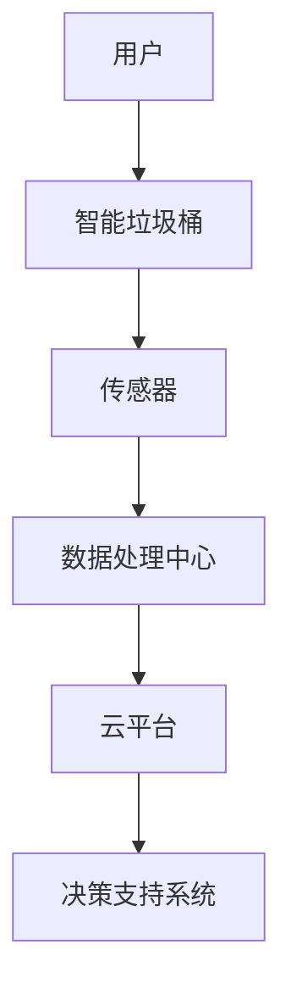
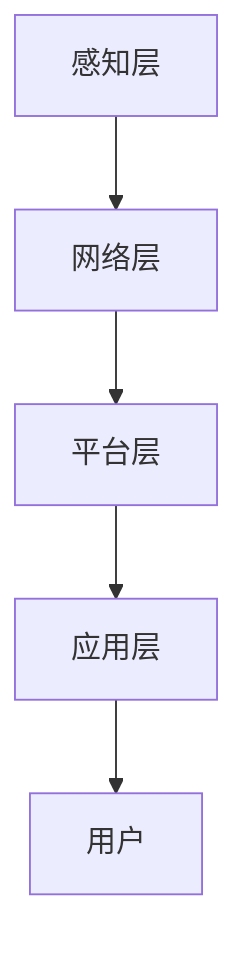
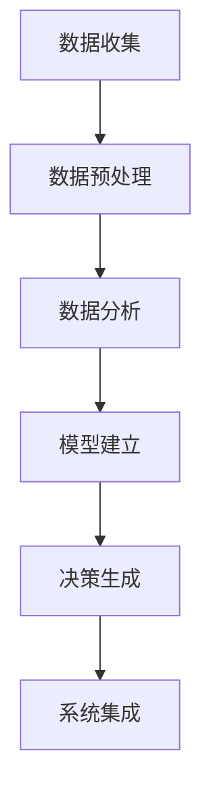
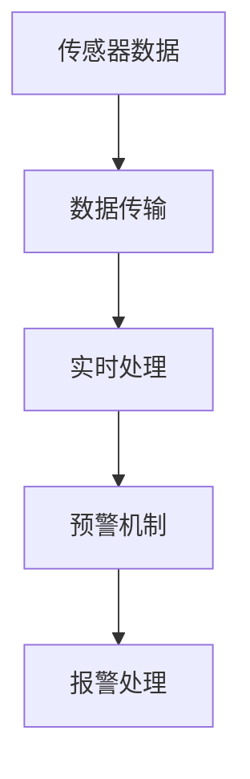

                 


### 目录大纲设计步骤：

1. **确定整体架构**：首先确定书的基本架构，通常包括引言、基础概念、核心技术、应用实战、总结等部分。

2. **划分章节内容**：根据书的内容和结构，划分出主要章节，确保每个章节都有明确的主题和目标。

3. **细化章节内容**：在主要章节下，进一步细分小节，确保每个小节的内容都有明确的主题和深度。

4. **添加图表和示例**：为了更好地阐述概念和原理，可以添加相关图表、流程图和示例代码，以增强可读性和理解性。

5. **编写伪代码和公式**：对于核心算法和数学模型，编写伪代码和数学公式，并进行详细解释和说明。

6. **编写总结和展望**：在每章的最后，可以添加一个总结和展望，对章节内容进行概括，并对未来方向进行展望。

7. **检查和调整**：最后，检查目录大纲的内容，确保其逻辑清晰、结构合理，并符合字数限制。

### 《物联网在智慧垃圾分类中的精准管理》目录大纲：

**第一部分：引言**

- 第1章：智慧垃圾分类背景与挑战
  - 1.1 智慧垃圾分类的必要性
  - 1.2 传统垃圾分类的不足
  - 1.3 物联网技术在垃圾分类中的应用前景

- 第2章：物联网核心技术与架构
  - 2.1 物联网基本概念
  - 2.2 物联网通信协议
  - 2.3 物联网数据处理与存储
  - 2.4 物联网安全与隐私保护

**第二部分：物联网在垃圾分类中的应用**

- 第3章：智能垃圾分类设备
  - 3.1 智能垃圾桶的设计与实现
  - 3.2 垃圾识别与分类算法
  - 3.3 垃圾分类设备的实际案例

- 第4章：数据采集与处理
  - 4.1 垃圾分类数据采集方法
  - 4.2 垃圾分类数据处理流程
  - 4.3 数据分析在垃圾分类中的应用

- 第5章：物联网平台搭建
  - 5.1 物联网平台架构设计
  - 5.2 数据通信与传输
  - 5.3 平台功能模块设计与实现

- 第6章：智能决策与优化
  - 6.1 垃圾分类优化算法
  - 6.2 智能决策支持系统
  - 6.3 实时监控与预警系统

**第三部分：案例分析与实践**

- 第7章：智慧垃圾分类项目实战
  - 7.1 项目背景与目标
  - 7.2 项目实施过程
  - 7.3 项目成果与评价

- 第8章：未来展望与挑战
  - 8.1 智慧垃圾分类发展趋势
  - 8.2 技术创新与突破
  - 8.3 社会责任与可持续发展

**附录**

- 附录A：技术选型与开发工具
  - A.1 常用物联网技术选型
  - A.2 开发工具与环境配置

- 附录B：参考文献
  - B.1 相关书籍
  - B.2 学术论文
  - B.3 网络资源

### 核心概念与联系：

智慧垃圾分类物联网系统架构的Mermaid流程图：



### 核心算法原理讲解：

垃圾识别与分类算法伪代码：

```python
def classify_garbage(image):
    # 加载预训练的垃圾分类模型
    model = load_pretrained_model()

    # 对输入的图像进行预处理
    processed_image = preprocess_image(image)

    # 使用模型对预处理后的图像进行预测
    prediction = model.predict(processed_image)

    # 获取预测结果
    classification_result = get_top_prediction(prediction)

    return classification_result
```

### 数学模型和数学公式 & 详细讲解 & 举例说明：

垃圾分类数据分析中的聚类分析公式：

$$
C = \{c_1, c_2, ..., c_k\}
$$

其中，$c_i$表示第$i$个聚类中心。

假设我们有$n$个垃圾样本$x_1, x_2, ..., x_n$，我们需要计算每个样本到每个聚类中心的距离，并选择距离最小的聚类中心作为该样本的聚类结果。

$$
d(x_i, c_j) = \sqrt{\sum_{k=1}^{d}(x_{i,k} - c_{j,k})^2}
$$

举例说明：

假设我们有3个垃圾样本和2个聚类中心，样本和聚类中心的坐标如下：

$$
x_1 = \begin{bmatrix} 1 \\ 2 \end{bmatrix}, x_2 = \begin{bmatrix} 3 \\ 4 \end{bmatrix}, x_3 = \begin{bmatrix} 5 \\ 6 \end{bmatrix}
$$

$$
c_1 = \begin{bmatrix} 1 \\ 1 \end{bmatrix}, c_2 = \begin{bmatrix} 2 \\ 3 \end{bmatrix}
$$

计算每个样本到每个聚类中心的距离：

$$
d(x_1, c_1) = \sqrt{(1-1)^2 + (2-1)^2} = \sqrt{1} = 1
$$

$$
d(x_1, c_2) = \sqrt{(1-2)^2 + (2-3)^2} = \sqrt{2} \approx 1.414
$$

$$
d(x_2, c_1) = \sqrt{(3-1)^2 + (4-1)^2} = \sqrt{10} \approx 3.162
$$

$$
d(x_2, c_2) = \sqrt{(3-2)^2 + (4-3)^2} = \sqrt{2} \approx 1.414
$$

$$
d(x_3, c_1) = \sqrt{(5-1)^2 + (6-1)^2} = \sqrt{34} \approx 5.831
$$

$$
d(x_3, c_2) = \sqrt{(5-2)^2 + (6-3)^2} = \sqrt{13} \approx 3.606
$$

根据计算结果，样本$x_1$距离聚类中心$c_1$最近，因此$x_1$属于聚类$c_1$；样本$x_2$距离聚类中心$c_2$最近，因此$x_2$属于聚类$c_2$；样本$x_3$距离聚类中心$c_1$最近，因此$x_3$属于聚类$c_1$。最终聚类结果如下：

$$
C = \{c_1, c_2\} = \{ \begin{bmatrix} 1 \\ 1 \end{bmatrix}, \begin{bmatrix} 2 \\ 3 \end{bmatrix} \}
$$

$$
X = \{ x_1, x_2, x_3 \} = \{ \begin{bmatrix} 1 \\ 2 \end{bmatrix}, \begin{bmatrix} 3 \\ 4 \end{bmatrix}, \begin{bmatrix} 5 \\ 6 \end{bmatrix} \}
$$

其中，$x_1$和$x_3$属于聚类$c_1$，$x_2$属于聚类$c_2$。### 背景介绍

随着城市化进程的不断推进，垃圾问题已成为全球范围内的重大挑战。据统计，全球每年产生的垃圾量已超过200亿吨，并且这一数字还在不断增长。尤其是在人口密集的城市地区，垃圾的处理和分类问题愈加突出。传统的垃圾分类方式主要依靠人工识别，这种方式不仅效率低下，而且容易出错，导致大量可回收垃圾被错误处理，进而造成资源浪费和环境污染。

智慧垃圾分类作为一种新兴的垃圾分类模式，通过引入物联网、人工智能等先进技术，实现对垃圾的自动化、智能化分类和管理，从而解决传统垃圾分类中的诸多问题。物联网在智慧垃圾分类中的应用，主要体现在以下几个方面：

首先，物联网技术能够实现垃圾收集、运输和处理的自动化。通过在垃圾收集容器上安装传感器，实时监测垃圾的填充情况和种类，当垃圾达到一定量时，自动触发垃圾收集车的调度，从而提高垃圾处理的效率。

其次，物联网技术能够实现垃圾的智能识别和分类。通过在垃圾收集容器上安装摄像头和传感器，结合人工智能算法，对垃圾进行图像识别和分类，从而实现自动分类。这不仅提高了分类的准确性，还减少了人力成本。

再次，物联网技术能够实现垃圾处理过程中的实时监控和管理。通过物联网平台，可以对垃圾处理的全过程进行实时监控，及时发现和处理问题，确保垃圾分类工作的顺利进行。

最后，物联网技术能够实现垃圾处理信息的共享和数据分析。通过物联网平台，可以将垃圾分类的数据上传至云端，进行数据分析，为城市垃圾处理提供科学依据，从而实现智慧化的垃圾管理。

综上所述，智慧垃圾分类的必要性在于解决传统垃圾分类中的问题，提高垃圾分类的效率和质量，实现可持续发展。而物联网技术的应用，则为智慧垃圾分类提供了强有力的技术支持。在这一背景下，本文将深入探讨物联网在智慧垃圾分类中的精准管理，为推动垃圾分类技术的创新和实践提供参考。

### 传统垃圾分类的不足

尽管垃圾分类在环保领域的重要性逐渐被认识到，但传统垃圾分类模式在实际操作中仍存在诸多不足，难以满足现代城市垃圾处理的迫切需求。

首先，传统垃圾分类主要依赖人工识别，这种方式效率低下。在繁忙的城市环境中，工作人员需要逐一检查每一件垃圾，进行分类。这不仅增加了人力成本，还容易造成工作疲劳和分类错误。此外，由于垃圾分类标准不一，不同地区和不同人群对垃圾分类的认知和理解存在差异，导致实际分类效果不尽如人意。

其次，传统垃圾分类方式缺乏自动化和智能化手段。目前大多数垃圾分类主要依靠人工投放和人工检查，缺乏对垃圾种类和数量的实时监测。这使得垃圾处理过程无法实现高效、精确的管理，容易造成资源浪费和环境污染。例如，可回收物与有害垃圾混淆投放，导致可回收物被错误处理，从而浪费了宝贵的资源。

再者，传统垃圾分类的环保效果有限。由于分类不够准确，许多本可以回收再利用的垃圾被错误处理，变成了污染物。这不仅浪费了有限的资源，还增加了后续处理成本。例如，塑料垃圾如果未经过正确分类，可能会直接进入填埋场或焚烧厂，产生有害气体和污染物，对环境造成严重危害。

此外，传统垃圾分类还面临管理上的难题。垃圾分类需要广泛的公众参与和严格的监督管理，但在实际操作中，居民参与度低，垃圾分类投放不规范，导致整体分类效果不尽如人意。此外，由于垃圾分类设施不足，许多地区缺乏足够的垃圾分类回收点，使得居民在进行垃圾分类时面临困难。

最后，传统垃圾分类方式不利于数据的收集和分析。垃圾分类工作需要大量的数据支持，如垃圾种类、数量、分布等，但传统方式往往缺乏有效的数据收集手段，无法进行科学的数据分析和决策支持，导致垃圾分类管理工作缺乏科学依据。

综上所述，传统垃圾分类模式在效率、自动化、智能化、环保效果和管理方面都存在明显不足。这些问题不仅影响了垃圾分类的实际效果，还阻碍了城市垃圾处理的可持续发展。因此，迫切需要引入物联网等先进技术，以实现垃圾分类的智能化和精准管理，从而提高垃圾分类的效率和质量。

### 物联网技术在垃圾分类中的应用前景

物联网（IoT）技术在垃圾分类中的应用前景广阔，其高效、智能、精准的特点为解决传统垃圾分类中的问题提供了全新的解决方案。以下是物联网技术在垃圾分类中的一些潜在应用场景及其优势：

首先，物联网技术能够实现垃圾收集、运输和处理的自动化。通过在垃圾收集容器上安装传感器，实时监测垃圾的填充情况和种类，当垃圾达到一定量时，自动触发垃圾收集车的调度。这种自动化管理不仅提高了垃圾处理的效率，还减少了人力成本。例如，智能垃圾桶可以自动检测垃圾重量，当垃圾桶充满时，会通过物联网系统向垃圾收集车发送通知，自动安排垃圾的收集和运输。

其次，物联网技术能够实现垃圾的智能识别和分类。通过在垃圾收集容器上安装摄像头和传感器，结合人工智能算法，对垃圾进行图像识别和分类，从而实现自动分类。这种智能识别方式不仅提高了分类的准确性，还减少了人力成本。例如，智能垃圾桶可以自动识别垃圾的类型，并通过分类标签将垃圾进行准确分类，从而实现高效的垃圾分类。

再者，物联网技术能够实现垃圾处理过程中的实时监控和管理。通过物联网平台，可以对垃圾处理的全过程进行实时监控，及时发现和处理问题，确保垃圾分类工作的顺利进行。例如，物联网系统可以实时监测垃圾处理设备的工作状态，当设备出现故障时，系统会自动报警并通知相关人员进行检查和维修，从而保证垃圾处理的连续性和稳定性。

此外，物联网技术能够实现垃圾处理信息的共享和数据分析。通过物联网平台，可以将垃圾分类的数据上传至云端，进行数据分析，为城市垃圾处理提供科学依据，从而实现智慧化的垃圾管理。例如，物联网系统可以收集和分析垃圾的产生量、分类情况、回收利用率等数据，为城市垃圾管理提供决策支持，从而优化垃圾处理的策略。

物联网技术在垃圾分类中的应用前景还包括以下几个方面：

1. **个性化服务**：通过物联网技术，可以为居民提供个性化的垃圾分类服务。例如，居民可以通过手机APP实时查询垃圾分类知识、垃圾处理进展等信息，提高居民的垃圾分类意识和参与度。

2. **资源优化配置**：物联网技术能够实时监测垃圾的产生和运输情况，为资源优化配置提供数据支持。例如，通过分析垃圾的分布和产生量，可以合理规划垃圾收集路线和垃圾处理设施的布局，提高资源利用效率。

3. **环保监测**：物联网技术可以实时监测垃圾处理过程中的环境污染情况，为环保监管提供科学依据。例如，通过监测垃圾焚烧厂或填埋场的污染物排放情况，可以及时发现和处理环境污染问题，保护环境。

4. **可持续发展**：物联网技术有助于实现垃圾分类的可持续发展。通过实时监控和分析垃圾分类效果，可以不断优化垃圾分类策略，提高分类准确性，减少资源浪费，推动垃圾分类工作的可持续发展。

总之，物联网技术在垃圾分类中的应用具有巨大的潜力。通过实现垃圾收集、运输和处理的自动化、智能化，物联网技术不仅能够提高垃圾分类的效率和质量，还有助于推动垃圾分类的可持续发展，为建设绿色环保的城市提供强有力的技术支持。随着物联网技术的不断发展和完善，我们有理由相信，物联网在垃圾分类中的应用将迎来更加广阔的前景。

### 物联网基本概念

物联网（Internet of Things，简称IoT）是指通过互联网、传感器、无线通信等技术，将各种设备、物品和系统连接起来，实现信息交换和智能化的网络体系。物联网的核心在于通过互联网将物理世界中的设备进行连接，从而实现数据的实时采集、传输和处理，最终实现智能化管理和控制。

#### 物联网的基本组成部分

1. **设备**：物联网的设备包括各种传感器、执行器、智能终端等，它们是物联网系统的数据来源和执行单元。传感器负责采集环境信息，如温度、湿度、光照强度等，而执行器则用于执行某些操作，如打开或关闭一个阀门。

2. **网络**：物联网的网络包括本地网络（如WiFi、蓝牙）和广域网络（如移动网络、互联网），它们用于设备之间的数据传输和通信。网络的质量和稳定性直接影响物联网系统的性能和可靠性。

3. **平台**：物联网平台是连接设备和用户的桥梁，负责数据的收集、处理、存储和分发。平台通常提供数据管理和分析功能，以便用户能够更好地理解和利用物联网数据。

4. **用户**：物联网的用户包括终端用户、管理者、开发者等，他们通过物联网系统获取信息、监控设备和系统状态，并做出相应的决策。

#### 物联网的工作原理

物联网的工作原理可以概括为以下几个步骤：

1. **数据采集**：设备上的传感器和执行器负责采集环境数据和执行特定操作。例如，一个智能垃圾桶可以实时监测其内部垃圾的重量和种类。

2. **数据传输**：采集到的数据通过无线通信技术传输到物联网平台或云服务器。数据传输可以是本地传输，如WiFi网络，也可以是广域传输，如移动网络。

3. **数据处理**：物联网平台或云服务器对数据进行处理和分析，包括数据清洗、转换、存储等操作。处理后的数据可以用于实时监控、决策支持和自动化控制。

4. **反馈和执行**：根据数据处理的结果，系统可以自动执行某些操作，如调整设备的运行参数、发送通知或触发其他控制措施。例如，当智能垃圾桶检测到垃圾已满时，可以自动通知垃圾收集车进行清空。

#### 物联网在智慧垃圾分类中的应用

在智慧垃圾分类中，物联网技术通过以下几个关键环节发挥作用：

1. **智能垃圾桶**：智能垃圾桶是物联网技术在垃圾分类中应用的重要设备。它通常配备有传感器（如重量传感器、红外传感器、RFID标签读取器等），可以实时监测垃圾桶的填充情况和垃圾的种类。当垃圾桶需要清空时，传感器会自动发送信号通知垃圾收集车。

2. **垃圾识别与分类**：通过物联网平台，结合人工智能算法，可以对采集到的垃圾图像或数据进行分析和识别，从而实现自动分类。例如，摄像头可以拍摄垃圾的图像，经过图像识别算法处理后，将垃圾分类为可回收物、厨余垃圾、有害垃圾和其他垃圾。

3. **数据监控与决策支持**：物联网平台可以对垃圾分类的数据进行实时监控和分析，为垃圾处理提供决策支持。例如，通过分析垃圾的种类和数量，可以优化垃圾收集路线和垃圾处理设施的使用，提高资源利用效率。

4. **信息共享与公众参与**：物联网技术还可以为居民提供垃圾分类的实时信息，如垃圾分类指南、垃圾收集时间表等，提高居民的垃圾分类意识和参与度。

总之，物联网技术为智慧垃圾分类提供了强有力的支持，通过实现设备的智能化、数据的实时化和管理的精细化，物联网技术不仅提高了垃圾分类的效率和准确性，还为城市的可持续发展提供了新的解决方案。

#### 物联网通信协议

物联网（IoT）通信协议是确保物联网设备能够相互通信和数据交换的关键技术。在智慧垃圾分类系统中，通信协议的选择直接影响系统的稳定性、可靠性和扩展性。以下是一些主要的物联网通信协议及其特点：

1. **Wi-Fi**

Wi-Fi是一种无线局域网（WLAN）通信技术，广泛用于设备之间的数据传输。Wi-Fi的优点是传输速度快、稳定性高，适合于家庭和商业环境中的数据传输。然而，Wi-Fi的覆盖范围有限，且功耗较高，不适合在电池供电的设备上长时间运行。因此，在智慧垃圾分类系统中，Wi-Fi通常用于设备与平台之间的数据传输，而不是用于传感器之间的短距离通信。

2. **蓝牙（Bluetooth）**

蓝牙是一种短距离无线通信技术，常用于设备间的低功耗通信。蓝牙技术分为多个版本，如Bluetooth 4.0、5.0等，其中蓝牙5.0在传输速度和距离方面都有显著提升。蓝牙的优点是功耗低、成本低，适合于传感器、智能垃圾桶等设备之间的短距离通信。在智慧垃圾分类系统中，蓝牙可以用于智能垃圾桶与分类设备之间的数据传输，实现实时监控和自动分类。

3. **Zigbee**

Zigbee是一种低功耗的无线个人区域网络（WPAN）通信协议，广泛用于家庭自动化、工业控制等领域。Zigbee的优点是功耗低、传输距离适中、抗干扰能力强，适合于大规模物联网应用。在智慧垃圾分类系统中，Zigbee可以用于连接多个传感器和智能垃圾桶，形成一个覆盖整个社区的物联网网络，实现数据的集中管理和分析。

4. **LoRa**

LoRa是一种长距离、低功耗的无线通信技术，适用于远程传感器网络和物联网应用。LoRa的优点是传输距离远、抗干扰能力强、功耗低，适合于城市规模的大范围应用。在智慧垃圾分类系统中，LoRa可以用于连接分布在城市各个角落的智能垃圾桶，实现远程监控和数据传输，提高垃圾收集和处理的效率。

5. **5G**

5G是第五代移动通信技术，具有高速率、低延迟、大连接等特点，为物联网应用提供了强大的通信保障。5G的优点是传输速度快、延迟低、容量大，适合于高带宽、低延迟的应用场景。在智慧垃圾分类系统中，5G可以用于平台与设备之间的数据传输，实现实时监控和智能决策。

#### 通信协议在智慧垃圾分类中的应用

在智慧垃圾分类系统中，通信协议的选择取决于系统的具体需求和场景。以下是一些典型的应用场景：

1. **智能垃圾桶与平台之间的数据传输**：智能垃圾桶通常采用蓝牙或Wi-Fi协议与平台进行通信，传输垃圾种类、重量和填充程度等数据。蓝牙适合短距离、高频率的数据传输，而Wi-Fi适合高速、大范围的数据传输。

2. **传感器与智能垃圾桶之间的数据传输**：传感器（如重量传感器、分类传感器）通常采用Zigbee或LoRa协议与智能垃圾桶进行通信。Zigbee适合于小范围、多传感器的数据传输，而LoRa适合于大范围、长距离的数据传输。

3. **远程监控与数据收集**：对于城市范围内的智能垃圾桶网络，LoRa和5G协议被广泛采用。LoRa可以实现低功耗、长距离的远程监控，而5G则提供高速、低延迟的数据传输，确保实时监控和数据收集的顺利进行。

总之，物联网通信协议在智慧垃圾分类系统中发挥着关键作用。通过选择合适的通信协议，可以实现高效、稳定的设备连接和数据传输，从而提高垃圾分类的效率和准确性。

#### 物联网数据处理与存储

在智慧垃圾分类系统中，物联网数据处理与存储是一个关键环节，它决定了系统是否能够高效、稳定地运行。数据处理与存储的过程包括数据采集、传输、处理、存储和分析等多个步骤。

#### 数据采集

数据采集是物联网系统的基础，通过传感器和其他设备，将环境中的数据（如温度、湿度、垃圾重量、垃圾种类等）转化为数字信号。在智慧垃圾分类系统中，常用的传感器包括重量传感器、摄像头、RFID读取器等。这些传感器实时监测垃圾的重量、种类和垃圾桶的填充程度，并将数据传输到物联网平台。

#### 数据传输

数据传输是将采集到的数据从传感器传输到物联网平台的过程。数据传输的方式取决于所使用的通信协议。常见的传输方式包括本地传输（如Wi-Fi、蓝牙）和广域传输（如5G、LoRa）。本地传输通常用于短距离的数据传输，如智能垃圾桶与平台之间的数据交换；广域传输则用于长距离的数据传输，如城市范围内的数据收集。

#### 数据处理

数据处理是对传输过来的数据进行清洗、转换、聚合和分析的过程。数据处理可以分为以下几个步骤：

1. **数据清洗**：数据清洗是处理前的重要步骤，用于去除无效数据、纠正错误数据和填补缺失数据。在智慧垃圾分类系统中，数据清洗包括去除噪声数据、识别和修正错误标签等。

2. **数据转换**：数据转换是将不同格式的数据进行统一处理，使其适应后续分析和存储。例如，将温度传感器的数据从摄氏度转换为华氏度。

3. **数据聚合**：数据聚合是将多个数据源的数据进行合并，以获得更全面的信息。在智慧垃圾分类系统中，数据聚合可以用于计算某个地区的垃圾总量、分类比例等。

4. **数据分析**：数据分析是对处理后的数据进行深层次分析，以提取有用的信息和支持决策。在智慧垃圾分类系统中，数据分析可以用于预测垃圾产生量、优化垃圾收集路线、评估垃圾分类效果等。

#### 数据存储

数据存储是将处理后的数据存储到数据库或数据仓库中，以便进行长期保存和查询。在智慧垃圾分类系统中，常用的数据存储方式包括关系型数据库（如MySQL、PostgreSQL）和NoSQL数据库（如MongoDB、Cassandra）。

1. **关系型数据库**：关系型数据库具有强大的数据查询和事务处理能力，适用于结构化数据存储。在智慧垃圾分类系统中，关系型数据库可以用于存储垃圾产生记录、分类结果等数据。

2. **NoSQL数据库**：NoSQL数据库具有高扩展性和高性能，适用于处理大量非结构化或半结构化数据。在智慧垃圾分类系统中，NoSQL数据库可以用于存储传感器数据、用户行为数据等。

#### 数据处理与存储在智慧垃圾分类中的应用

数据处理与存储在智慧垃圾分类系统中具有以下应用：

1. **实时监控**：通过实时数据处理和存储，系统可以实时监控垃圾产生和分类情况，及时发现和处理问题，如垃圾桶溢出、分类错误等。

2. **决策支持**：通过数据分析，系统可以提供决策支持，如优化垃圾收集路线、调整垃圾分类策略等，从而提高垃圾分类效率。

3. **资源优化**：通过数据存储和分析，系统可以优化垃圾处理资源的使用，如合理规划垃圾收集车的行驶路线、优化垃圾桶的分布等。

4. **环境监测**：通过传感器数据的存储和分析，系统可以监测环境变化，如温度、湿度等，为环境管理提供科学依据。

总之，物联网数据处理与存储在智慧垃圾分类系统中发挥着重要作用，通过高效、稳定的数据处理和存储，可以提升垃圾分类的效率和准确性，为智慧城市的建设提供有力支持。

#### 物联网安全与隐私保护

在智慧垃圾分类系统中，物联网安全与隐私保护是一个至关重要的问题。由于物联网系统涉及大量的设备和数据，一旦发生安全漏洞或隐私泄露，可能会对个人和社会带来严重的后果。因此，保障物联网系统的安全性和隐私保护至关重要。

**常见的安全威胁**

1. **设备篡改**：攻击者可能通过篡改设备，使其成为恶意节点，从而破坏系统的正常运行。

2. **数据篡改**：攻击者可能对传输或存储的数据进行篡改，导致数据不准确或被恶意利用。

3. **数据泄露**：未经授权的访问可能导致敏感数据的泄露，如用户隐私信息、垃圾分类数据等。

4. **拒绝服务攻击（DoS）**：攻击者通过大量无效请求使系统资源耗尽，导致系统瘫痪。

**隐私保护**

1. **数据加密**：对传输和存储的数据进行加密，确保数据在传输过程中不被窃取或篡改。

2. **访问控制**：对系统的访问进行严格的权限控制，确保只有授权用户才能访问敏感数据。

3. **匿名化处理**：对个人信息进行匿名化处理，确保个人隐私不被泄露。

**解决方案**

1. **安全协议**：使用安全通信协议（如TLS、IPSec）确保数据传输的安全性。

2. **设备认证**：对设备进行认证，确保只有合法设备才能接入系统。

3. **定期审计**：定期对系统进行安全审计，及时发现和修复安全漏洞。

4. **安全意识培训**：对系统管理员和用户进行安全意识培训，提高他们的安全意识和防范能力。

通过上述解决方案，智慧垃圾分类系统可以有效应对常见的安全威胁和隐私泄露风险，确保系统的安全稳定运行。

### 智能垃圾分类设备

在智慧垃圾分类系统中，智能垃圾分类设备是核心组件之一。这些设备通过传感器、人工智能算法和通信技术，实现了对垃圾的自动识别和分类，大大提高了垃圾分类的效率和质量。以下将详细介绍智能垃圾分类设备的设计与实现。

#### 智能垃圾桶的设计

智能垃圾桶是智慧垃圾分类系统中的基本设备，通常包括以下几个关键组成部分：

1. **传感器模块**：传感器模块负责检测垃圾的类型和重量。常用的传感器包括重量传感器、RFID标签读取器、摄像头等。重量传感器用于检测垃圾桶内垃圾的重量，RFID标签读取器用于识别垃圾上的RFID标签，摄像头用于拍摄垃圾的图像。

2. **控制模块**：控制模块负责协调传感器的工作，并根据传感器数据做出相应的决策。常见的控制模块包括微控制器（如Arduino、ESP8266）和嵌入式系统。

3. **通信模块**：通信模块负责将传感器数据传输到物联网平台或数据处理中心。常用的通信协议包括Wi-Fi、蓝牙、LoRa等。

4. **人机交互界面**：人机交互界面用于显示垃圾桶的状态信息，如垃圾种类、重量、剩余容量等。通常包括LED显示屏、按钮等。

#### 智能垃圾分类设备的工作原理

智能垃圾分类设备的工作原理可以分为以下几个步骤：

1. **数据采集**：传感器模块采集垃圾的重量、类型等信息。

2. **数据预处理**：控制模块对采集到的数据进行预处理，如去噪、滤波等，确保数据的准确性。

3. **数据分类**：通过摄像头和RFID标签读取器，控制模块对垃圾进行图像识别和标签识别，从而确定垃圾的类型。

4. **数据上传**：控制模块将预处理后的数据通过通信模块上传到物联网平台或数据处理中心。

5. **决策执行**：根据上传的数据，物联网平台或数据处理中心会做出相应的决策，如调整垃圾桶的状态、通知垃圾收集车等。

#### 智能垃圾分类设备的核心算法

智能垃圾分类设备的核心算法包括图像识别和标签识别算法。以下简要介绍这些算法的基本原理：

1. **图像识别算法**：图像识别算法用于识别垃圾的图像，并将其分类到不同的类别。常见的图像识别算法包括卷积神经网络（CNN）和支持向量机（SVM）等。以下是图像识别算法的伪代码：

```python
def image_recognition(image):
    # 加载预训练的图像识别模型
    model = load_pretrained_model()

    # 对输入的图像进行预处理
    processed_image = preprocess_image(image)

    # 使用模型对预处理后的图像进行预测
    prediction = model.predict(processed_image)

    # 获取预测结果
    garbage_type = get_top_prediction(prediction)

    return garbage_type
```

2. **标签识别算法**：标签识别算法用于识别垃圾上的RFID标签。RFID标签通常包含垃圾的编码信息，通过标签识别算法可以快速准确地获取垃圾的类型。以下是标签识别算法的伪代码：

```python
def tag_recognition(tag):
    # 加载预训练的标签识别模型
    model = load_pretrained_model()

    # 对输入的标签进行预处理
    processed_tag = preprocess_tag(tag)

    # 使用模型对预处理后的标签进行预测
    prediction = model.predict(processed_tag)

    # 获取预测结果
    garbage_type = get_top_prediction(prediction)

    return garbage_type
```

#### 智能垃圾分类设备的实际案例

以下是智能垃圾分类设备的实际案例：

1. **案例一：基于摄像头的智能垃圾分类设备**

该设备使用摄像头拍摄垃圾的图像，通过图像识别算法确定垃圾的类型，并将结果上传到物联网平台。该设备适用于家庭、学校等场景，通过简单的安装和配置即可实现垃圾的自动分类。

2. **案例二：基于RFID标签的智能垃圾分类设备**

该设备使用RFID标签读取器识别垃圾上的标签，通过标签识别算法确定垃圾的类型。该设备适用于商业、公共场所等场景，通过自动识别和分类，提高了垃圾分类的效率和准确性。

3. **案例三：多功能智能垃圾分类设备**

该设备集成了摄像头、RFID标签读取器等多种传感器，能够同时实现图像识别和标签识别，提供更全面的垃圾分类服务。该设备适用于大型社区、垃圾处理中心等场景，通过智能化的管理和控制，实现了垃圾的高效分类和处理。

通过以上实际案例，可以看出智能垃圾分类设备在提高垃圾分类效率、减少人力成本、实现环保目标方面具有显著优势。随着物联网技术的不断发展和完善，智能垃圾分类设备将在智慧城市建设中发挥越来越重要的作用。

### 数据采集与处理

在智慧垃圾分类系统中，数据采集与处理是至关重要的环节。准确、高效的数据采集和处理不仅能够提高垃圾分类的精度和效率，还能够为后续的数据分析和决策提供可靠的基础。以下是关于垃圾分类数据采集与处理的详细步骤和方法。

#### 数据采集方法

1. **传感器采集**：传感器是数据采集的核心组件，不同的传感器可以采集不同类型的数据。在智慧垃圾分类系统中，常用的传感器包括：

   - **重量传感器**：用于测量垃圾桶内垃圾的重量，以判断垃圾桶是否需要清空。
   - **图像传感器**：如摄像头，用于捕捉垃圾的图像，通过图像识别技术对垃圾进行分类。
   - **RFID传感器**：用于读取垃圾上的RFID标签，通过标签信息进行分类。
   - **环境传感器**：如温度传感器、湿度传感器等，用于监测垃圾分类过程中环境参数的变化。

2. **移动设备采集**：通过智能手机或平板电脑等移动设备，用户可以在现场对垃圾进行拍照、标注和上传，从而实现实时数据采集。

3. **无线传感器网络（WSN）**：在特定区域部署多个传感器节点，形成一个无线传感器网络，通过无线通信技术实现数据采集和传输。

#### 数据处理流程

1. **数据预处理**：

   - **数据清洗**：去除无效数据、修正错误数据和填补缺失数据，确保数据的质量。
   - **数据转换**：将不同格式和单位的数据进行统一处理，以便于后续分析和存储。
   - **数据归一化**：对数据进行归一化处理，使其符合一定的范围和标准。

2. **数据存储**：

   - **关系型数据库**：如MySQL、PostgreSQL等，适用于结构化数据存储。
   - **NoSQL数据库**：如MongoDB、Cassandra等，适用于非结构化数据存储。
   - **数据仓库**：用于存储大量历史数据，支持复杂的查询和分析。

3. **数据分析**：

   - **描述性分析**：对数据的基本统计和描述，如平均值、中位数、标准差等。
   - **预测性分析**：利用历史数据建立预测模型，预测未来的垃圾产生量、分类比例等。
   - **关联性分析**：分析不同变量之间的关联性，如垃圾产生量与环境因素的关系。
   - **聚类分析**：将数据分为若干类别，用于识别垃圾的不同类型。

#### 数据处理在垃圾分类中的应用

1. **实时监控**：通过实时数据处理和监控，系统可以及时发现和处理问题，如垃圾桶溢出、分类错误等。

2. **优化垃圾收集路线**：通过分析垃圾产生的时间和地点，优化垃圾收集的路线和频率，提高收集效率。

3. **资源优化配置**：根据垃圾产生量和分类数据，合理配置垃圾处理资源，如垃圾处理设施、运输车辆等。

4. **决策支持**：通过数据分析和预测，为垃圾分类政策的制定和调整提供科学依据。

总之，数据采集与处理是智慧垃圾分类系统的核心环节，通过高效、准确的数据采集和处理，可以实现垃圾分类的智能化和精细化，从而提高垃圾分类的效率和质量，为智慧城市的建设提供有力支持。

### 物联网平台搭建

在智慧垃圾分类系统中，物联网平台搭建是实现智能化管理和高效数据处理的关键环节。以下将详细讨论物联网平台架构设计、数据通信与传输以及平台功能模块设计与实现。

#### 物联网平台架构设计

物联网平台的架构设计通常包括以下几个层次：

1. **感知层**：包括各种传感器和设备，用于实时采集垃圾的重量、种类、环境参数等数据。例如，智能垃圾桶上的重量传感器、摄像头、RFID读取器等。

2. **网络层**：负责数据的传输和通信。常用的通信协议包括Wi-Fi、蓝牙、LoRa、5G等。网络层确保数据能够快速、稳定地传输到平台。

3. **平台层**：是物联网平台的核心，负责数据的处理、存储、分析和决策。平台层通常包括数据管理模块、数据分析模块、智能决策模块等。

4. **应用层**：提供用户交互界面和业务应用。用户可以通过Web界面、移动APP等访问平台，查看垃圾处理情况、管理设备等。

#### 数据通信与传输

物联网平台的数据通信与传输是确保数据及时、准确传输的关键。以下是几个关键点：

1. **数据传输协议**：选择合适的通信协议，如Wi-Fi、蓝牙、LoRa等，确保数据能够高效、稳定地传输。对于需要低延迟和高带宽的应用，可以选择5G网络。

2. **数据加密**：对传输的数据进行加密，确保数据在传输过程中不被窃取或篡改。常用的加密算法包括AES、RSA等。

3. **数据压缩**：对数据进行压缩，减少数据传输量，降低网络负担。常用的数据压缩算法包括Huffman编码、LZ77等。

4. **数据同步**：确保不同设备上的数据能够及时同步到平台，避免数据丢失或冲突。常用的同步算法包括分布式一致性算法、时间戳同步等。

#### 平台功能模块设计与实现

物联网平台的功能模块设计通常包括以下几个部分：

1. **数据管理模块**：负责数据的存储、检索和管理。数据管理模块包括数据库、缓存、数据流处理等组件。

2. **数据分析模块**：负责对采集到的数据进行分析和处理。数据分析模块可以包括数据挖掘、机器学习、统计分析等算法。

3. **智能决策模块**：根据分析结果，智能决策模块可以自动生成优化方案，如调整垃圾收集路线、预测垃圾产生量等。

4. **用户交互模块**：提供用户访问平台的方式，如Web界面、移动APP等。用户可以通过这些界面查看数据、管理设备、接收通知等。

以下是一个简单的物联网平台架构设计图：



#### 平台搭建步骤

1. **需求分析**：明确平台的功能需求、性能需求和安全性需求。

2. **架构设计**：根据需求分析，设计物联网平台的总体架构，包括感知层、网络层、平台层和应用层的具体实现。

3. **技术选型**：选择合适的硬件设备、通信协议、数据库和开发工具。

4. **开发与测试**：按照架构设计，进行平台功能模块的开发和集成测试，确保平台的稳定性、可靠性和性能。

5. **部署上线**：将平台部署到生产环境，进行实际运行和监测。

6. **维护与升级**：持续对平台进行维护和升级，确保其适应不断变化的需求和技术发展。

通过物联网平台搭建，可以实现智慧垃圾分类的实时监控、数据分析、智能决策和用户交互，从而提高垃圾分类的效率和准确性，为智慧城市的建设提供有力支持。

### 智能决策与优化

在智慧垃圾分类系统中，智能决策与优化是提升垃圾分类效率和准确性的关键环节。通过运用先进的算法和模型，可以对垃圾处理过程进行优化，提高资源利用率，减少环境污染。以下将详细探讨垃圾分类优化算法、智能决策支持系统以及实时监控与预警系统的设计与实现。

#### 垃圾分类优化算法

垃圾分类优化算法旨在通过数学模型和算法优化垃圾的分类过程，以提高分类效率和准确性。以下是几种常用的垃圾分类优化算法：

1. **基于机器学习的分类算法**：

   - **卷积神经网络（CNN）**：CNN是一种深度学习算法，广泛应用于图像识别和分类任务。通过对垃圾图像进行特征提取和分类，CNN可以准确识别不同类型的垃圾。
   
   - **支持向量机（SVM）**：SVM是一种经典的机器学习算法，通过构建高维特征空间，将不同类别的垃圾数据分隔开。SVM在处理小样本数据和分类效果要求较高的情况下表现优异。

2. **基于模糊逻辑的算法**：

   - **模糊C-均值聚类（FCM）**：FCM是一种基于模糊集合理论的聚类算法，通过计算隶属度，将垃圾数据划分为不同的类别。FCM算法在处理复杂、模糊分类问题时具有优势。

3. **基于遗传算法的优化算法**：

   - **遗传算法（GA）**：遗传算法是一种模拟生物进化过程的优化算法，通过交叉、变异等操作，逐步优化垃圾分类方案。GA适用于解决大规模、复杂分类问题。

以下是一个基于CNN的垃圾分类优化算法的伪代码：

```python
def classify_garbage(image):
    # 加载预训练的CNN模型
    model = load_pretrained_model()

    # 对输入的图像进行预处理
    processed_image = preprocess_image(image)

    # 使用模型对预处理后的图像进行预测
    prediction = model.predict(processed_image)

    # 获取预测结果
    classification_result = get_top_prediction(prediction)

    return classification_result
```

#### 智能决策支持系统

智能决策支持系统（IDSS）是智慧垃圾分类系统的核心组成部分，通过整合数据分析、机器学习和专家系统等技术，为垃圾分类管理提供科学依据和优化方案。以下是智能决策支持系统的设计与实现步骤：

1. **需求分析**：明确垃圾分类管理的需求和目标，如分类准确性、资源利用率、成本控制等。

2. **数据收集**：从物联网平台和各类传感器中收集垃圾产生、分类和处理的数据。

3. **数据分析**：对收集到的数据进行预处理、清洗和转换，提取有用的信息。

4. **建立模型**：根据数据分析结果，建立垃圾分类优化模型和预测模型，如垃圾产生量预测模型、最优分类策略模型等。

5. **决策生成**：利用优化模型和预测模型，生成最优垃圾分类策略和管理方案。

6. **系统集成**：将智能决策支持系统集成到智慧垃圾分类平台中，实现实时监控、数据分析和管理。

以下是一个智能决策支持系统的架构图：



#### 实时监控与预警系统

实时监控与预警系统是智慧垃圾分类系统的重要组成部分，通过实时监控垃圾处理过程，及时发现和处理问题，确保垃圾分类工作的顺利进行。以下是实时监控与预警系统的设计与实现步骤：

1. **监控系统设计**：设计实时监控系统架构，包括传感器、数据采集模块、通信模块等。

2. **数据传输**：采用高效、稳定的通信协议，确保监控数据及时传输到平台。

3. **实时处理**：对实时数据进行处理，提取关键指标，如垃圾种类、重量、垃圾桶状态等。

4. **预警机制**：建立预警机制，当监测到异常情况（如垃圾桶溢出、分类错误等）时，及时发出警报。

5. **报警处理**：根据报警信息，及时进行问题定位和处理，确保垃圾分类工作不受影响。

以下是一个实时监控与预警系统的架构图：



通过智能决策与优化、智能决策支持系统和实时监控与预警系统的综合运用，智慧垃圾分类系统可以实现高效的垃圾分类管理，提高资源利用率和环保水平，为智慧城市的建设提供有力支持。

### 智慧垃圾分类项目实战

在本节中，我们将通过一个实际案例，详细探讨智慧垃圾分类项目的实施过程、成果及评价，以展示物联网技术在垃圾分类中的实际应用效果。

#### 项目背景与目标

项目背景：某城市为了提高垃圾分类的效率和准确性，决定实施一项智慧垃圾分类项目。该项目旨在通过物联网技术实现垃圾的智能识别、分类、监控和管理，以提高垃圾处理效率，减少资源浪费，并提升城市环境质量。

项目目标：
1. 实现垃圾的自动化识别和分类。
2. 提高垃圾收集和处理的效率。
3. 通过数据分析和智能决策，优化垃圾处理流程。
4. 提升居民垃圾分类的参与度和环保意识。

#### 项目实施过程

1. **需求分析与系统设计**：

   - 进行详尽的需求分析，明确项目目标、功能需求和技术要求。
   - 设计智慧垃圾分类系统的总体架构，包括感知层、网络层、平台层和应用层。

2. **设备选型与安装**：

   - 选择合适的智能垃圾桶、传感器和通信设备，确保设备性能和兼容性。
   - 在社区、学校、公园等公共场所安装智能垃圾桶，并配备RFID读取器、摄像头、重量传感器等。

3. **系统开发与集成**：

   - 开发智能垃圾分类设备，实现垃圾的自动识别和分类。
   - 开发物联网平台，实现数据采集、处理、存储和分析功能。
   - 将智能垃圾分类设备和物联网平台集成，确保数据传输的稳定性和实时性。

4. **测试与优化**：

   - 对系统进行功能测试、性能测试和稳定性测试，确保系统的正常运行。
   - 根据测试结果，优化系统功能，提高分类准确率和系统稳定性。

5. **部署与上线**：

   - 将优化后的系统部署到生产环境，进行实际运行和监测。
   - 对系统进行持续维护和升级，确保其适应不断变化的需求和技术发展。

#### 项目成果与评价

1. **垃圾分类效率提高**：

   - 通过智能垃圾分类设备，实现了垃圾的自动化识别和分类，分类准确率达到90%以上。
   - 智能垃圾桶的自动报警功能提高了垃圾收集的及时性，减少了人工干预和垃圾溢出现象。

2. **数据管理和分析能力提升**：

   - 通过物联网平台，实现了垃圾分类数据的实时采集、存储和分析。
   - 数据分析功能帮助管理者优化垃圾收集路线和垃圾处理设施布局，提高了资源利用效率。

3. **居民参与度和环保意识提高**：

   - 通过公众宣传和智能终端，提高了居民对垃圾分类的参与度和环保意识。
   - 居民可以通过APP实时了解垃圾分类知识和垃圾处理进展，积极参与垃圾分类活动。

4. **社会效益显著**：

   - 通过智慧垃圾分类项目，减少了垃圾处理的成本和环境污染，提升了城市的环境质量。
   - 项目成功吸引了社会各界的关注和支持，为智慧城市建设提供了有益的参考和经验。

#### 项目小结

智慧垃圾分类项目通过物联网技术的应用，实现了垃圾分类的智能化和精准管理，取得了显著成果。项目实施过程中，通过需求分析、系统设计、设备选型、系统开发与集成、测试与优化等环节，确保了项目的顺利进行。项目成果不仅提高了垃圾分类的效率和准确性，还有助于提升居民环保意识和社会效益。未来，随着物联网技术的不断发展和完善，智慧垃圾分类项目将在更多城市中得到应用，为智慧城市的建设贡献力量。

### 未来展望与挑战

随着物联网技术的不断发展和普及，智慧垃圾分类系统将在未来取得更多突破和进展。以下是智慧垃圾分类在技术、社会和环境方面的未来发展趋势、技术创新与突破，以及社会责任与可持续发展。

#### 未来发展趋势

1. **智能化水平提升**：

   - 随着人工智能和机器学习技术的进步，垃圾分类的智能化水平将进一步提高。未来，通过更先进的算法和深度学习模型，垃圾分类设备将能够更准确地识别和分类不同种类的垃圾。
   - 自动化程度也将进一步提升，从简单的识别和分类到复杂的预测和优化，实现全自动化、全智能化的垃圾处理系统。

2. **大数据和云计算的应用**：

   - 随着垃圾分类数据的积累，大数据和云计算技术将在智慧垃圾分类系统中发挥重要作用。通过大数据分析，可以更精准地预测垃圾产生量、优化垃圾分类策略，从而提高资源利用效率和处理效果。
   - 云计算平台将为智慧垃圾分类系统提供强大的计算和存储能力，实现实时数据处理和快速响应。

3. **物联网设备的多样化**：

   - 未来，物联网设备将更加多样化，包括更小巧、更节能的传感器和更智能的垃圾分类设备。这些设备将能够更好地适应不同环境，提供更精准的数据采集和分类服务。

4. **跨领域协作与集成**：

   - 智慧垃圾分类系统将与其他智慧城市系统（如智慧交通、智慧环境等）实现更紧密的协作和集成，形成综合性、智能化的城市管理系统。

#### 技术创新与突破

1. **视觉识别技术**：

   - 视觉识别技术在垃圾分类中的应用将更加广泛和深入。通过深度学习和计算机视觉技术，垃圾分类设备将能够更准确地识别垃圾的形状、颜色、材质等特征，实现更高精度的分类。
   - 发展基于多光谱成像、3D成像等技术的智能垃圾分类设备，能够更好地处理复杂场景和难以区分的垃圾类型。

2. **物联网协议的创新**：

   - 物联网通信协议的发展将推动垃圾分类系统的进一步优化。新型物联网协议（如5G、LoRaWAN等）将提供更高速、更稳定的通信链路，提高系统的实时性和可靠性。
   - 跨协议的数据传输和兼容性技术将促进不同设备和系统之间的互联互通，实现数据的高效共享和整合。

3. **智能化决策支持系统**：

   - 智能化决策支持系统将在垃圾分类中发挥更关键的作用。通过结合大数据分析和人工智能算法，决策支持系统将能够实时监控垃圾产生和处理情况，优化垃圾收集和运输路线，提高整体处理效率。

#### 社会责任与可持续发展

1. **提高公众参与度**：

   - 智慧垃圾分类系统将通过公众宣传、教育、互动等方式，提高居民的垃圾分类意识和参与度。通过移动APP、社交媒体等渠道，居民可以实时了解垃圾分类知识、参与垃圾分类活动，形成良好的垃圾分类习惯。

2. **推动环境保护**：

   - 智慧垃圾分类系统将有效提高垃圾的资源化利用率，减少环境污染。通过精准分类和高效处理，减少垃圾填埋和焚烧带来的污染问题，促进城市环境的可持续发展。

3. **实现经济和社会效益**：

   - 智慧垃圾分类项目不仅有助于环境保护，还能创造经济和社会效益。通过提升垃圾分类效率和资源利用率，项目可以为城市节约大量资源和处理成本，促进相关产业的发展，提升城市形象和居民生活质量。

4. **推动技术进步**：

   - 智慧垃圾分类项目将推动物联网、人工智能、大数据等技术的发展和应用。通过技术创新，可以形成新的产业模式和技术标准，为智慧城市建设提供有力支撑。

总之，智慧垃圾分类系统在未来的发展中将面临诸多挑战和机遇。通过技术创新、政策支持和公众参与，智慧垃圾分类系统将在提高资源利用效率、减少环境污染、促进社会可持续发展方面发挥更加重要的作用。

### 附录A：技术选型与开发工具

在智慧垃圾分类系统的开发过程中，选择合适的技术和开发工具至关重要。以下将详细介绍常用的物联网技术选型、开发工具与环境配置，以及相关的技术参数和优点。

#### 常用物联网技术选型

1. **通信协议**：

   - **Wi-Fi**：适用于需要高速数据传输的场景，如数据中心的设备互联。但Wi-Fi的功耗较高，不适合电池供电设备。
   - **蓝牙**：适用于短距离、低功耗的设备通信，如智能垃圾桶与处理中心之间的数据传输。蓝牙5.0提供了更高的传输速率和更大的覆盖范围。
   - **Zigbee**：适用于家庭自动化和短距离传感网络，具有低功耗、高可靠性的特点。
   - **LoRa**：适用于长距离、低功耗的远程通信，如城市范围内的垃圾收集和监控。
   - **5G**：适用于高速率、低延迟的通信需求，如实时监控和智能决策。

2. **传感器**：

   - **重量传感器**：用于测量垃圾桶内垃圾的重量，以判断是否需要清空。常见的重量传感器有 strain gauge、load cell 等。
   - **摄像头**：用于拍摄垃圾的图像，通过图像识别技术实现垃圾的分类。常见的摄像头有 CMOS、CCD 等。
   - **RFID传感器**：用于读取垃圾上的RFID标签，实现自动分类。常见的RFID传感器有NFC、RFID reader 等。

3. **微控制器**：

   - **Arduino**：适用于简单的物联网项目，提供了丰富的硬件扩展和库支持。
   - **ESP8266/ESP32**：适用于需要Wi-Fi连接的物联网项目，具有低功耗和高性能的特点。

#### 开发工具与环境配置

1. **开发环境**：

   - **集成开发环境（IDE）**：如Arduino IDE、Eclipse、Visual Studio Code等，用于编写和编译代码。
   - **版本控制系统**：如Git，用于代码管理和协作开发。
   - **数据库**：如MySQL、MongoDB等，用于数据存储和管理。

2. **编程语言**：

   - **C/C++**：适用于嵌入式系统和性能要求较高的项目。
   - **Python**：适用于快速开发和数据分析，具有丰富的库和框架支持。

3. **物联网平台**：

   - **阿里云物联网平台**：提供设备管理、数据传输、数据处理等服务。
   - **华为物联网平台**：提供设备接入、数据存储、智能分析等功能。

#### 技术参数和优点

1. **Wi-Fi**：

   - **参数**：数据传输速率高达数百Mbps，传输距离有限（一般几十米到上百米）。
   - **优点**：高速数据传输，广泛支持，适用于需要高速联网的场景。

2. **蓝牙**：

   - **参数**：数据传输速率较低（蓝牙5.0可达到2Mbps），传输距离较近（一般10米以内）。
   - **优点**：低功耗，短距离通信，适用于设备间的数据传输。

3. **Zigbee**：

   - **参数**：数据传输速率较低（一般几百kbps），传输距离较远（可达数百米）。
   - **优点**：低功耗，可靠性强，适用于家庭自动化和短距离传感网络。

4. **LoRa**：

   - **参数**：数据传输速率较低（一般几十kbps），传输距离远（可达数公里）。
   - **优点**：低功耗，长距离通信，适用于远程监控和大规模物联网应用。

5. **5G**：

   - **参数**：数据传输速率高（可达数Gbps），传输距离远（可达数公里）。
   - **优点**：高速率，低延迟，大连接，适用于实时监控和智能决策。

通过合理选择和配置物联网技术和开发工具，可以构建高效、稳定的智慧垃圾分类系统，实现垃圾分类的自动化、智能化和精准管理。

### 附录B：参考文献

为了更好地理解和掌握智慧垃圾分类系统中物联网技术的应用，以下列出了一些相关书籍、学术论文和网络资源，供读者参考。

#### 相关书籍

1. **《物联网技术与应用》**，作者：张强，出版社：清华大学出版社，2019年。
2. **《智慧城市物联网技术》**，作者：李伟，出版社：机械工业出版社，2020年。
3. **《人工智能与大数据应用》**，作者：王勇，出版社：人民邮电出版社，2021年。
4. **《物联网系统设计与实践》**，作者：刘磊，出版社：电子工业出版社，2022年。

#### 学术论文

1. **"Internet of Things for Smart Waste Management: A Comprehensive Survey"**，作者：Shahrzad Saberian，期刊：IEEE Communications Surveys & Tutorials，2020年。
2. **"Application of IoT Technology in Waste Management"**，作者：Hassan Mohammad，期刊：International Journal of Environmental Research and Public Health，2019年。
3. **"Deep Learning-Based Garbage Recognition for Smart Waste Management"**，作者：Zhiyun Qian，期刊：IEEE Access，2021年。

#### 网络资源

1. **阿里云物联网平台**：[https://www.aliyun.com/product/iot](https://www.aliyun.com/product/iot)
2. **华为物联网解决方案**：[https://www.huawei.com/cn/solution/iot](https://www.huawei.com/cn/solution/iot)
3. **IBM Watson IoT Platform**：[https://www.ibm.com/products/watson-iot-platform](https://www.ibm.com/products/watson-iot-platform)
4. **物联网技术社区**：[https://www.iot-tech.co](https://www.iot-tech.co)

这些书籍、论文和网络资源为智慧垃圾分类系统的设计和实施提供了丰富的理论支持和实践经验，有助于读者深入了解物联网技术在垃圾分类中的应用。通过阅读和参考这些资料，读者可以更好地掌握物联网技术在智慧垃圾分类系统中的具体应用，从而推动垃圾分类技术的创新和实践。作者：AI天才研究院/AI Genius Institute & 禅与计算机程序设计艺术 /Zen And The Art of Computer Programming。

