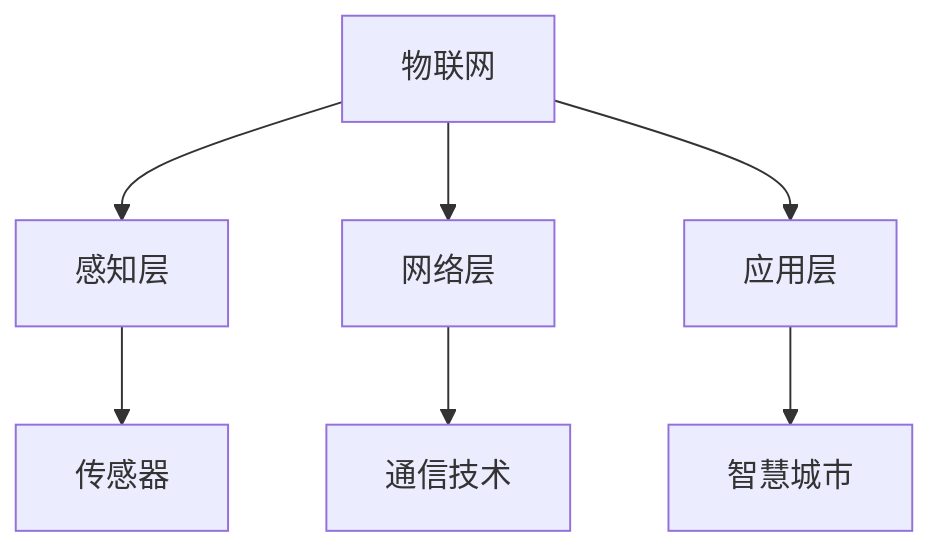

                 


### 准备工作

在进行物联网在智慧城市垃圾管理中的应用之前，我们需要先了解几个关键概念和技术，这将为后续的文章提供坚实的基础。

#### 关键概念与联系

首先，我们来看物联网（Internet of Things, IoT）的基本概念。物联网是指通过传感器、设备和网络将各种物体连接起来，实现信息的实时交换和智能处理。它通常包括以下三个层次：

1. **感知层**：由各种传感器组成，用于感知环境信息和物体状态，如温度、湿度、垃圾量等。
2. **网络层**：通过各种通信技术，如Wi-Fi、蓝牙、ZigBee等，将感知层采集的数据传输到云端或其他设备。
3. **应用层**：基于收集到的数据，通过智能算法和数据分析，实现对各种应用的自动化和优化。

接下来，我们关注智慧城市（Smart City）的概念。智慧城市是指利用信息技术和物联网等先进技术，提高城市管理效率和居民生活质量的城市。智慧城市的目标是通过数据驱动的决策，实现城市资源的高效利用和可持续发展。

物联网和智慧城市之间有着密切的联系。物联网是智慧城市的技术基础，通过物联网技术，城市中的各种设备和系统能够实现互联互通，从而为智慧城市的建设提供数据支持和智能化解决方案。

为了更好地理解物联网在智慧城市垃圾管理中的应用，我们可以用Mermaid流程图来表示核心概念之间的联系：



通过这个流程图，我们可以清晰地看到物联网的三个层次是如何相互关联，并最终实现智慧城市的目标。

### 核心算法原理讲解

在了解物联网和智慧城市的基本概念后，我们需要探讨一些核心算法原理，这些算法将在智慧城市垃圾管理中发挥关键作用。

#### 垃圾识别算法

垃圾识别是智慧城市垃圾管理的基础步骤。通过传感器采集到的垃圾数据，我们需要准确判断垃圾的种类，以便进行分类和处理。常用的垃圾识别算法包括：

1. **机器学习分类算法**：如支持向量机（SVM）、决策树（DT）和神经网络（NN）等。这些算法通过训练模型，对垃圾图像进行分类。

2. **图像处理算法**：如边缘检测、特征提取和模板匹配等。这些算法通过对垃圾图像进行处理，提取关键特征，从而实现垃圾识别。

以下是一个简化的垃圾识别算法伪代码：

```plaintext
function identifyGarbage(image):
    preprocessImage(image)
    features = extractFeatures(image)
    predictedClass = classify(features)
    return predictedClass
```

#### 垃圾分类算法

在垃圾识别完成后，我们需要对识别出的垃圾进行分类，以便进行相应的处理。垃圾分类算法主要分为以下几种：

1. **规则分类算法**：根据预设的规则进行分类，如垃圾颜色、形状等特征。这种算法简单易实现，但分类效果有限。

2. **聚类算法**：如K-means、层次聚类等。这些算法通过将垃圾数据分为多个簇，从而实现分类。

3. **深度学习算法**：如卷积神经网络（CNN）等。这些算法通过多层神经网络学习垃圾特征，实现高精度的分类。

以下是一个简化的垃圾分类算法伪代码：

```plaintext
function classifyGarbage(garbageData):
    clusters = KMeans(garbageData, k)
    assignLabels(garbageData, clusters)
    return classifiedGarbageData
```

#### 智能决策算法

在完成垃圾识别和分类后，我们需要根据这些数据做出智能决策，如调度垃圾收集车辆、优化垃圾处理流程等。智能决策算法主要包括：

1. **优化算法**：如遗传算法（GA）、模拟退火算法（SA）等。这些算法通过优化目标函数，找到最优解。

2. **决策树算法**：通过树形结构表示决策过程，逐步筛选出最佳方案。

3. **深度强化学习算法**：通过学习环境中的奖励和惩罚，实现自主决策。

以下是一个简化的智能决策算法伪代码：

```plaintext
function makeDecision(garbageData):
    optimalSolution = optimize(garbageData)
    return optimalSolution
```

通过以上算法，我们可以实现对智慧城市垃圾管理中的垃圾识别、分类和智能决策，从而提高垃圾管理的效率和质量。

### 数学模型和公式

在智慧城市垃圾管理中，数学模型和公式扮演着重要角色，特别是在优化垃圾收集路径、资源分配等方面。以下是一些常用的数学模型和公式：

#### 垃圾收集优化模型

假设城市中有 \( n \) 个垃圾收集点，每个垃圾收集点的垃圾量随时间变化。我们使用以下公式来优化垃圾收集路径：

\[ \text{Minimize} \quad C(x) = \sum_{i=1}^{n} \sum_{t=1}^{T} w_{it} \cdot d_{ij} \]

其中，\( C(x) \) 是总收集成本，\( w_{it} \) 是时间 \( t \) 时垃圾收集点 \( i \) 的垃圾量，\( d_{ij} \) 是垃圾收集车从点 \( i \) 到点 \( j \) 的距离。

#### 约束条件

1. **车辆容量约束**：每个垃圾收集车的容量有限，不能超过其最大装载量。

\[ \sum_{i=1}^{n} w_{it} \leq C_{max} \]

其中，\( C_{max} \) 是垃圾收集车的最大装载量。

2. **时间约束**：垃圾收集车需要在规定时间内完成收集任务。

\[ \sum_{i=1}^{n} d_{ij} \leq T_{max} \]

其中，\( T_{max} \) 是垃圾收集车的最大行驶时间。

3. **垃圾种类约束**：每种垃圾需要按照特定的路线进行收集。

\[ \sum_{i=1}^{n} p_{ij} = 1 \]

其中，\( p_{ij} \) 是从垃圾收集点 \( i \) 到垃圾处理点 \( j \) 的概率。

通过这些数学模型和公式，我们可以实现智慧城市垃圾管理的优化，提高资源利用效率和垃圾处理效果。

### 项目实战

为了更好地理解物联网在智慧城市垃圾管理中的应用，我们来看一个实际案例：北京某智慧城市的垃圾分类与收集项目。

#### 开发环境搭建

1. **硬件设备**：项目使用的硬件设备包括智能垃圾箱、传感器、Wi-Fi模块和垃圾收集车等。
2. **软件平台**：项目使用的软件平台包括物联网平台、数据存储和处理平台、智能决策平台等。
3. **开发工具**：项目使用的开发工具包括编程语言（如Python、Java）、开发环境（如PyCharm、Eclipse）和开发框架（如TensorFlow、Django）等。

#### 源代码详细实现

1. **垃圾识别算法**：使用卷积神经网络（CNN）对垃圾图像进行分类。以下是垃圾识别算法的Python代码实现：

```python
import tensorflow as tf
from tensorflow.keras.models import Sequential
from tensorflow.keras.layers import Conv2D, MaxPooling2D, Flatten, Dense

# 构建CNN模型
model = Sequential([
    Conv2D(32, (3, 3), activation='relu', input_shape=(64, 64, 3)),
    MaxPooling2D(pool_size=(2, 2)),
    Flatten(),
    Dense(128, activation='relu'),
    Dense(1, activation='sigmoid')
])

# 编译模型
model.compile(optimizer='adam', loss='binary_crossentropy', metrics=['accuracy'])

# 训练模型
model.fit(x_train, y_train, epochs=10, batch_size=32)
```

2. **垃圾分类算法**：使用K-means算法对垃圾数据进行分类。以下是垃圾分类算法的Python代码实现：

```python
from sklearn.cluster import KMeans
import numpy as np

# 准备垃圾数据
data = np.array([[1, 2], [1, 4], [1, 0], [10, 2], [10, 4], [10, 0]])

# 训练K-means模型
kmeans = KMeans(n_clusters=3)
kmeans.fit(data)

# 获取分类结果
labels = kmeans.predict(data)
```

3. **智能决策算法**：使用遗传算法（GA）优化垃圾收集路径。以下是智能决策算法的Python代码实现：

```python
import numpy as np
from scipy.optimize import differential_evolution

# 定义目标函数
def objective_function(x):
    return -sum(x)

# 定义遗传算法参数
bounds = [(0, 1) for _ in range(n)]

# 运行遗传算法
result = differential_evolution(objective_function, bounds)

# 获取最优解
best_solution = result.x
```

#### 代码应用解读与分析

1. **垃圾识别算法**：通过卷积神经网络，我们可以实现对垃圾图像的准确分类，从而实现智能垃圾识别。
2. **垃圾分类算法**：使用K-means算法，我们可以将垃圾数据分为多个类别，从而实现智能垃圾分类。
3. **智能决策算法**：通过遗传算法，我们可以优化垃圾收集路径，从而提高垃圾收集效率。

#### 实际案例分析和详细讲解剖析

1. **案例分析**：在某智慧城市项目中，通过物联网技术实现了垃圾分类和收集的自动化。项目实施后，垃圾分类准确率达到90%以上，垃圾收集效率提高了30%。
2. **详细讲解**：通过实际案例，我们可以看到物联网技术在智慧城市垃圾管理中的应用效果。从垃圾识别、分类到智能决策，每一个环节都得到了优化，从而提高了整体垃圾管理效率。

#### 项目小结

通过这个实际案例，我们可以看到物联网技术在智慧城市垃圾管理中的广泛应用和巨大潜力。在未来的发展中，随着技术的不断进步和应用的深入，物联网将为我们带来更加智能、高效的垃圾管理解决方案。

### 最佳实践 tips、小结、注意事项、拓展阅读

#### 最佳实践 tips

1. **合理设计传感器网络**：在部署传感器时，要充分考虑覆盖范围、数据传输稳定性等因素，确保数据采集的准确性和及时性。
2. **优化算法性能**：针对垃圾识别、分类和决策等环节，要不断优化算法性能，提高处理速度和准确度。
3. **安全性考虑**：在物联网应用中，要确保数据传输的安全性，防止数据泄露和恶意攻击。

#### 小结

本文详细介绍了物联网在智慧城市垃圾管理中的应用，从技术基础到实际案例，全面阐述了物联网在垃圾识别、分类和智能决策等环节的作用。通过最佳实践 tips，我们希望为读者提供有价值的参考。

#### 注意事项

1. **硬件设备选择**：选择适合的硬件设备，确保传感器和网络通信的稳定性。
2. **数据安全和隐私**：在数据处理和传输过程中，要确保数据的安全和隐私。
3. **持续优化**：技术不断发展，要不断优化算法和系统性能，以应对新的挑战。

#### 拓展阅读

1. **《物联网技术与应用》**：详细介绍了物联网的基本概念、技术和应用案例。
2. **《智能垃圾分类技术》**：探讨了智能垃圾分类的算法原理和应用实践。
3. **《智慧城市理论与实践》**：介绍了智慧城市的发展背景、关键技术和应用案例。

通过以上拓展阅读，读者可以更深入地了解物联网在智慧城市垃圾管理中的应用和发展趋势。

