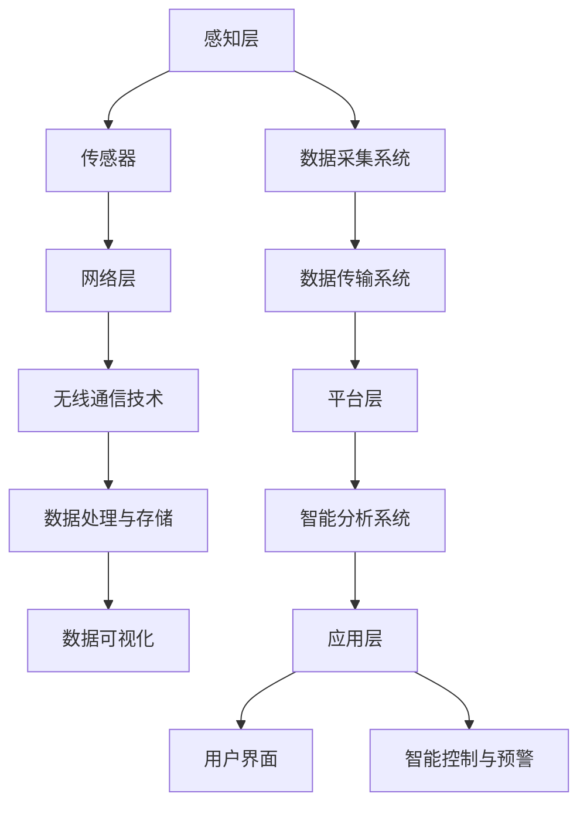

                 

## 引言

### 1.1 物联网与智慧城市概述

物联网（Internet of Things，简称IoT）是指通过互联网将各种物理设备、传感器、计算设备等进行互联互通，实现数据交换和智能化控制的技术体系。物联网的发展始于20世纪80年代，随着互联网技术的不断成熟和物联网关键技术的创新，物联网已经逐渐渗透到各个领域，为人类社会带来了巨大的变革。

智慧城市（Smart City）是指通过新一代信息技术，如物联网、大数据、云计算、人工智能等，实现对城市运行状态的全面感知、智能管理和高效服务。智慧城市的目标是通过信息技术的赋能，提高城市管理的效率和市民的生活质量，实现可持续发展。

物联网与智慧城市之间密不可分。物联网作为智慧城市的技术基础，为智慧城市的建设提供了实时数据采集、智能决策和自动化控制的能力。智慧城市则是物联网的应用场景，为物联网技术的实践提供了广阔的舞台。二者相辅相成，共同推动了城市智慧化的发展。

### 1.2 智慧城市排水系统的重要性

排水系统是城市基础设施的重要组成部分，直接关系到城市的排水能力、防洪能力和环境卫生。传统的城市排水系统主要依靠人工监测和经验管理，效率低下且难以应对突发情况。

智慧城市排水系统通过物联网技术的应用，实现了对排水系统的实时监控和智能化管理。首先，通过安装在排水管道、河道等位置的传感器，实时采集水位、流量、水质等数据。其次，通过数据传输和存储系统，将数据上传到数据中心进行集中处理。最后，通过智能分析系统和自动化控制系统，对排水系统的运行状态进行实时监控和预警，及时采取应对措施。

智慧城市排水系统的建设，不仅可以提高排水系统的运行效率，减少故障率，还可以为城市防洪、环境保护和水资源管理提供科学依据。因此，智慧城市排水系统具有重要的现实意义和战略价值。

### 1.3 物联网在智慧城市排水系统中的应用

物联网技术在智慧城市排水系统中的应用主要体现在以下几个方面：

1. **实时监测数据采集**：通过部署各种传感器，如水位传感器、流量传感器、水质传感器等，实现对排水系统各个节点的实时监测。这些传感器将采集到的数据传输到数据中心，为排水系统的智能化管理提供基础数据。

2. **智能化排水控制**：通过建立排水模型和智能算法，对排水系统的运行状态进行实时分析，自动调整排水泵的启停、排水管道的疏浚等操作，提高排水系统的运行效率。

3. **预警与应急响应**：当排水系统出现异常时，通过预警系统发出警报，并采取相应的应急响应措施，防止洪水、内涝等灾害的发生。

4. **数据分析和决策支持**：通过对监测数据的分析，可以发现排水系统运行中的规律和问题，为城市排水规划、设计和运营提供决策支持。

5. **智能化城市服务**：智慧城市排水系统不仅为城市排水管理提供了技术支持，还通过数据开放和共享，为市民提供了更加便捷的城市服务。

综上所述，物联网技术在智慧城市排水系统中的应用，极大地提升了排水系统的智能化水平和运行效率，为城市可持续发展提供了有力保障。

## 物联网技术基础

### 2.1 物联网概念与发展历程

物联网（Internet of Things，简称IoT）是指通过互联网将各种物理设备、传感器、计算设备等进行互联互通，实现数据交换和智能化控制的技术体系。物联网的概念最早由麻省理工学院的Kevin Ashton在1999年提出，他认为通过将物体连接到互联网，可以实现更高效的信息传递和更智能的决策。

物联网的发展历程可以分为三个阶段：

1. **第一阶段：设备互联（1990s-2000s）**：这一阶段的物联网主要是通过无线传感器网络（WSN）和互联网实现设备之间的连接。例如，家庭自动化系统、工业自动化系统等。这一阶段的关键技术包括无线通信技术、嵌入式系统和传感器技术。

2. **第二阶段：云计算与大数据（2010s）**：随着云计算和大数据技术的成熟，物联网的应用范围进一步扩大。数据采集、传输和处理的效率得到显著提升，物联网系统开始具备智能化和自主化的能力。这一阶段的关键技术包括云计算、大数据分析和人工智能。

3. **第三阶段：智能化与泛在连接（2020s至今）**：物联网逐渐从设备互联和数据采集，向智能化和泛在连接发展。5G、边缘计算、区块链等新兴技术不断涌现，物联网的应用场景变得更加广泛，如智慧城市、智能制造、智能交通等。这一阶段的关键技术包括5G通信、边缘计算和区块链。

物联网技术的发展历程反映了信息技术从硬件到软件，再到智能化和泛在连接的演进过程。随着物联网技术的不断进步，它将在更多领域发挥重要作用。

### 2.2 物联网体系结构

物联网体系结构可以分为四个主要层次：感知层、网络层、平台层和应用层。

1. **感知层**：感知层是物联网体系结构的基础，负责采集各种环境数据。感知设备包括传感器、摄像头、RFID（射频识别）等。这些设备可以实时监测环境参数，如温度、湿度、光照、水质、交通流量等。感知层的关键技术是传感器技术和无线通信技术。

2. **网络层**：网络层负责将感知层采集到的数据传输到平台层。网络层通常采用无线通信技术，如Wi-Fi、ZigBee、LoRa等。网络层的关键技术包括无线通信协议、数据传输安全和数据压缩。

3. **平台层**：平台层是物联网体系结构的核心，负责数据的处理、存储、分析和共享。平台层通常包括数据采集模块、数据存储模块、数据处理模块和用户接口。平台层的关键技术包括云计算、大数据处理、人工智能和机器学习。

4. **应用层**：应用层是物联网体系结构的最高层，负责将平台层处理的结果应用于实际场景。应用层可以根据不同的需求开发各种应用程序，如智能家居、智能交通、智能医疗等。应用层的关键技术包括应用软件开发、用户体验设计和业务流程优化。

物联网体系结构的四个层次共同构成了一个完整的技术体系，各层次之间相互关联，共同推动物联网技术的发展和应用。

### 2.3 物联网关键技术

物联网技术的发展离不开关键技术的支持，主要包括传感器技术、无线通信技术、云计算和大数据处理技术、人工智能和机器学习技术等。

1. **传感器技术**：传感器是物联网的感知器官，负责采集各种环境数据。传感器技术的发展主要集中在灵敏度、精度、功耗和体积等方面。目前，各种类型的传感器已经广泛应用于物联网领域，如温度传感器、湿度传感器、光敏传感器、气体传感器等。

2. **无线通信技术**：无线通信技术是物联网数据传输的关键技术，主要包括Wi-Fi、ZigBee、LoRa、5G等。无线通信技术的发展趋势是低功耗、高带宽、大连接数和低延迟。例如，5G通信技术的引入，将显著提高物联网设备的连接速度和数据处理能力。

3. **云计算和大数据处理技术**：云计算为物联网提供了强大的数据处理和存储能力。通过云计算平台，物联网设备可以实时上传数据，并利用云端的计算资源进行数据处理和分析。大数据处理技术则能够对海量数据进行快速分析和挖掘，从而为物联网应用提供数据支持。

4. **人工智能和机器学习技术**：人工智能和机器学习技术是物联网智能化的核心技术。通过这些技术，物联网设备可以自主学习和优化，提高系统的智能化水平。例如，在智慧城市排水系统中，可以通过机器学习算法对排水数据进行分析，预测排水系统的运行状态，从而实现智能化控制。

物联网关键技术的不断进步，为物联网的应用和发展提供了坚实基础。未来，随着新技术的不断涌现，物联网将在更多领域发挥重要作用。

### 2.4 物联网设备与协议

物联网设备是实现物联网系统的重要组成部分，主要包括传感器、执行器、通信模块等。这些设备通过不同的协议进行互联和数据传输，构成了一个完整的物联网系统。

1. **传感器**：传感器是物联网设备的核心，负责感知环境信息。常见的传感器类型有温度传感器、湿度传感器、光敏传感器、气体传感器、超声波传感器等。传感器通过采集环境数据，将物理信号转换为电信号，从而实现数据的采集和传输。

2. **执行器**：执行器是物联网系统中的驱动装置，负责根据接收到的指令执行特定的动作。常见的执行器有电机、阀门、开关等。执行器通常与传感器配合工作，实现系统的自动控制和智能化管理。

3. **通信模块**：通信模块是物联网设备的数据传输枢纽，负责将传感器和执行器的数据传输到网络层。常见的通信模块有Wi-Fi模块、蓝牙模块、ZigBee模块、LoRa模块等。这些模块支持多种通信协议，如Wi-Fi、蓝牙、ZigBee、LoRa、5G等。

物联网设备之间的通信依赖于各种协议。常见的物联网协议包括：

- **Wi-Fi**：Wi-Fi是一种无线局域网通信技术，通过无线信号传输数据。Wi-Fi通信具有高带宽、低延迟的特点，适用于需要高速数据传输的物联网应用。

- **蓝牙**：蓝牙是一种短距离无线通信技术，通过无线电波传输数据。蓝牙通信具有低功耗、低延迟的特点，适用于连接距离较近的物联网设备。

- **ZigBee**：ZigBee是一种低功耗无线个域网通信技术，通过无线电波传输数据。ZigBee通信具有高可靠性、低功耗的特点，适用于大规模物联网应用。

- **LoRa**：LoRa是一种长距离无线通信技术，通过无线电波传输数据。LoRa通信具有长距离、低功耗的特点，适用于需要远程数据传输的物联网应用。

- **5G**：5G是一种第五代移动通信技术，通过无线电波传输数据。5G通信具有高速度、低延迟、大连接数的特点，适用于需要高速、实时数据传输的物联网应用。

物联网设备的多样性和通信协议的多样性，为物联网系统的设计和实现提供了广泛的选择。通过合理选择物联网设备和通信协议，可以构建出高效、可靠的物联网系统。

## 智慧城市排水系统概述

### 3.1 智慧城市排水系统的概念

智慧城市排水系统（Smart Urban Drainage System）是指通过新一代信息技术，如物联网、大数据、云计算、人工智能等，实现对城市排水系统的全面感知、智能管理和高效服务。智慧城市排水系统不仅包括传统的排水设施，还涵盖了感知层、网络层、平台层和应用层等各个层次，通过数据采集、传输、处理和分析，实现对排水系统的实时监控、智能化控制和预警应急响应。

智慧城市排水系统的核心目标是提高排水系统的运行效率，减少城市内涝，保护城市环境，保障城市安全。通过物联网技术的应用，智慧城市排水系统能够实时监测排水系统的运行状态，及时发现和处理问题，避免因排水系统故障导致的洪水、内涝等灾害。

### 3.2 智慧城市排水系统的架构

智慧城市排水系统的架构可以分为四个主要层次：感知层、网络层、平台层和应用层。

1. **感知层**：感知层是智慧城市排水系统的数据来源，负责实时采集排水系统的各项参数，如水位、流量、水质等。感知层主要包括各种类型的传感器，如水位传感器、流量传感器、水质传感器等。这些传感器将采集到的数据传输到网络层进行处理。

2. **网络层**：网络层负责将感知层采集到的数据传输到平台层。网络层通常采用无线通信技术，如Wi-Fi、ZigBee、LoRa等。网络层的通信模块负责数据的传输和转发，确保数据能够实时、准确地传输到平台层。

3. **平台层**：平台层是智慧城市排水系统的数据处理中心，负责数据的存储、处理和分析。平台层通常包括数据采集模块、数据存储模块、数据处理模块和用户接口。数据采集模块负责接收网络层传输的数据，数据存储模块负责存储数据，数据处理模块负责对数据进行处理和分析，用户接口则提供数据可视化和服务功能。

4. **应用层**：应用层是智慧城市排水系统的最高层，负责将平台层处理的结果应用于实际场景。应用层可以根据不同的需求开发各种应用程序，如排水监控、预警应急、数据分析等。通过应用层，用户可以实时了解排水系统的运行状态，并采取相应的措施。

### 3.3 智慧城市排水系统的主要功能

智慧城市排水系统的主要功能包括实时监测、智能控制、预警应急和数据分析。

1. **实时监测**：通过在排水系统的关键节点安装各种传感器，智慧城市排水系统能够实时监测排水系统的运行状态。如水位传感器可以实时监测水位变化，流量传感器可以实时监测排水流量，水质传感器可以实时监测水质状况。这些数据为排水系统的智能化管理和控制提供了基础。

2. **智能控制**：基于实时监测数据，智慧城市排水系统可以自动调整排水泵的启停、排水管道的疏浚等操作，实现智能化排水控制。例如，当水位传感器检测到水位上升时，系统会自动启动排水泵，将多余的水排走，防止内涝的发生。

3. **预警应急**：当排水系统出现异常时，如水位急剧上升、水质异常等，智慧城市排水系统可以通过预警系统发出警报，并采取相应的应急响应措施，如关闭排水泵、打开排水通道等，防止灾害的发生。

4. **数据分析**：通过对排水系统运行数据的分析，智慧城市排水系统可以识别排水系统运行中的问题和趋势，为排水系统的维护和管理提供决策支持。例如，通过对历史数据进行分析，可以发现排水系统中的薄弱环节，提前进行加固和改造。

综上所述，智慧城市排水系统通过物联网技术的应用，实现了对排水系统的实时监测、智能控制、预警应急和数据分析，极大地提高了排水系统的运行效率和城市防洪能力，为城市可持续发展提供了有力保障。

## 物联网在智慧城市排水系统中的应用

### 4.1 实时监测数据采集

智慧城市排水系统通过物联网技术的应用，实现了对排水系统各节点的实时监测。实时监测数据采集是智慧城市排水系统的核心功能之一，它为排水系统的智能化管理和控制提供了基础数据。

#### 4.1.1 传感器类型与应用

在智慧城市排水系统中，常用的传感器类型包括水位传感器、流量传感器、水质传感器、压力传感器等。

1. **水位传感器**：水位传感器用于监测排水管道、河道、湖泊等位置的水位变化。常见的水位传感器有浮标式水位传感器、超声波水位传感器和雷达水位传感器等。浮标式水位传感器通过浮标的浮沉来检测水位变化，超声波水位传感器通过发射和接收超声波来测量水位高度，雷达水位传感器则通过发射和接收雷达波来测量水位。

2. **流量传感器**：流量传感器用于监测排水管道中的流量变化。常见的流量传感器有电磁流量传感器、超声波流量传感器和压力差流量传感器等。电磁流量传感器通过测量流体中的磁场变化来计算流量，超声波流量传感器通过测量超声波在流体中的传播时间来计算流量，压力差流量传感器则通过测量流体在管道中的压力差来计算流量。

3. **水质传感器**：水质传感器用于监测排水系统中的水质状况，如pH值、溶解氧、氨氮、总磷等参数。常见的水质传感器有电导率传感器、pH传感器、溶解氧传感器等。电导率传感器通过测量水中的电导率来评估水质，pH传感器通过测量水的酸碱度来评估水质，溶解氧传感器则通过测量水中的溶解氧浓度来评估水质。

4. **压力传感器**：压力传感器用于监测排水管道中的压力变化。常见的压力传感器有电容式压力传感器、电阻式压力传感器和压阻式压力传感器等。电容式压力传感器通过测量电容变化来测量压力，电阻式压力传感器通过测量电阻变化来测量压力，压阻式压力传感器则通过测量电阻变化来测量压力。

这些传感器在排水系统中的应用十分广泛。例如，水位传感器可以用于实时监测河道水位，防止洪水和内涝的发生；流量传感器可以用于监测排水泵的运行状态，优化排水泵的启停策略；水质传感器可以用于监测水质状况，确保排水系统的正常运行；压力传感器可以用于监测排水管道的压力变化，防止管道破裂和泄漏。

#### 4.1.2 数据采集系统设计

数据采集系统是智慧城市排水系统的关键组成部分，负责实时采集和传输各种传感器数据。数据采集系统设计主要包括以下几个方面：

1. **传感器选择**：根据排水系统的实际需求和传感器性能，选择适合的传感器类型。例如，在监测水位时，可以选择超声波水位传感器；在监测流量时，可以选择电磁流量传感器。

2. **传感器布置**：根据排水系统的布局和监测需求，合理布置传感器位置。例如，在排水管道的关键节点、河道的重要位置等布置传感器，确保监测数据的全面性和准确性。

3. **数据采集模块**：数据采集模块负责实时读取传感器数据，并将数据发送到网络层。数据采集模块通常包括微控制器、无线通信模块和电源模块等。微控制器负责读取传感器数据，无线通信模块负责将数据发送到网络层，电源模块则提供稳定的电源供应。

4. **无线通信**：选择适合的无线通信技术，实现传感器数据的有效传输。常见的无线通信技术有Wi-Fi、ZigBee、LoRa等。Wi-Fi通信具有高带宽、低延迟的特点，适用于需要高速数据传输的场景；ZigBee通信具有低功耗、高可靠性的特点，适用于短距离、低速率的数据传输；LoRa通信具有长距离、低功耗的特点，适用于需要远程数据传输的场景。

5. **数据传输与存储**：设计数据传输与存储方案，确保数据能够实时传输到平台层，并存储在数据库中。例如，可以采用MQTT协议实现传感器数据与平台层的通信，使用MySQL或MongoDB等数据库存储数据。

6. **数据预处理**：在数据传输到平台层之前，进行数据预处理，包括数据清洗、去噪、数据格式转换等操作，确保数据的准确性和一致性。

通过以上设计，可以实现排水系统各节点的实时监测，为排水系统的智能化管理和控制提供数据支持。

#### 4.1.3 数据传输与存储

实时监测数据传输与存储是智慧城市排水系统的关键环节，直接关系到监测数据的准确性和可用性。

1. **数据传输**：数据传输是指将传感器采集到的数据从感知层传输到平台层。常见的传输方式有有线传输和无线传输。有线传输通常采用以太网或光纤，具有高带宽、低延迟的特点，适用于数据量较大、传输距离较远的场景。无线传输则采用Wi-Fi、ZigBee、LoRa等通信技术，具有灵活性高、成本低的特点，适用于数据量较小、传输距离较近的场景。

   - **Wi-Fi传输**：Wi-Fi传输具有高带宽、低延迟的特点，适用于需要高速数据传输的场景。例如，在智慧城市排水系统中，可以采用Wi-Fi传输方式，将排水管道中的传感器数据实时传输到平台层。
   - **ZigBee传输**：ZigBee传输具有低功耗、高可靠性的特点，适用于短距离、低速率的数据传输。例如，在智慧城市排水系统中，可以采用ZigBee传输方式，将排水泵房中的传感器数据传输到平台层。
   - **LoRa传输**：LoRa传输具有长距离、低功耗的特点，适用于需要远程数据传输的场景。例如，在智慧城市排水系统中，可以采用LoRa传输方式，将偏远地区排水系统的传感器数据传输到平台层。

2. **数据存储**：数据存储是指将传输到平台层的传感器数据进行存储和管理。常见的数据存储方案有数据库存储和文件存储。

   - **数据库存储**：数据库存储具有数据结构化、查询速度快、易扩展等特点，适用于大规模数据存储和管理。常见的数据库有MySQL、MongoDB、Redis等。在智慧城市排水系统中，可以使用MySQL数据库存储传感器数据，实现对数据的快速查询和分析。
   - **文件存储**：文件存储具有简单易用、扩展性强的特点，适用于小规模数据存储。例如，在智慧城市排水系统中，可以使用文件存储方案，将传感器数据以文件形式存储在本地或云端。

通过合理的传输和存储方案，可以实现排水系统数据的实时传输和可靠存储，为排水系统的智能化管理和控制提供数据支持。

### 4.2 智能化排水控制

智能化排水控制是智慧城市排水系统的重要组成部分，通过物联网技术的应用，实现对排水系统的实时监控和自动控制，提高排水效率，减少内涝风险。

#### 4.2.1 排水控制算法

排水控制算法是智能化排水控制的核心，负责根据实时监测数据，自动调整排水泵的启停、排水管道的疏浚等操作。常见的排水控制算法包括以下几种：

1. **PID控制算法**：PID控制算法是一种经典的控制算法，通过比例（P）、积分（I）和微分（D）三个环节，对排水系统的运行状态进行反馈控制。PID算法可以根据实时监测的水位、流量等数据，调整排水泵的运行状态，实现水位调节。

2. **模糊控制算法**：模糊控制算法是一种基于模糊逻辑的控制算法，通过模糊规则和模糊推理，实现对排水系统的控制。模糊控制算法可以根据实时监测数据，自动调整排水泵的启停，避免水位过高或过低。

3. **神经网络控制算法**：神经网络控制算法是一种基于神经网络的控制算法，通过神经网络的学习和训练，实现对排水系统的自适应控制。神经网络控制算法可以根据历史数据，自动调整排水泵的启停，提高排水效率。

4. **混合控制算法**：混合控制算法是将多种控制算法相结合，形成一种复合控制算法。例如，可以结合PID控制和模糊控制，形成PID模糊控制算法，通过PID环节的精确控制和模糊环节的灵活调整，实现对排水系统的最佳控制。

这些排水控制算法可以单独使用，也可以结合使用，根据排水系统的具体需求和环境条件，选择合适的控制算法。

#### 4.2.2 控制系统设计与实现

智能化排水控制系统的设计与实现主要包括以下几个方面：

1. **传感器数据采集**：通过安装在排水管道、河道等位置的水位传感器、流量传感器等，实时采集排水系统的运行数据。传感器数据采集系统负责数据的实时采集、传输和存储。

2. **数据预处理**：对采集到的传感器数据进行预处理，包括数据清洗、去噪、数据格式转换等。预处理后的数据将用于排水控制算法的计算。

3. **控制算法实现**：根据排水控制算法的设计，实现控制算法的代码。例如，可以编写PID控制算法的代码，实现水位调节功能；编写模糊控制算法的代码，实现排水泵的自动启停。

4. **控制系统硬件设计**：设计控制系统的硬件部分，包括微控制器、传感器模块、通信模块等。硬件设计要考虑系统的功耗、稳定性和可靠性。

5. **控制系统软件设计**：设计控制系统的软件部分，包括控制算法的实现、数据采集与处理、用户界面等。软件设计要考虑系统的实时性、可靠性和扩展性。

6. **系统集成与测试**：将硬件和软件部分集成在一起，进行系统集成与测试。测试内容包括功能测试、性能测试、稳定性测试等，确保系统正常运行。

通过以上设计与实现，可以构建一个智能化排水控制系统，实现对排水系统的实时监控和自动控制。

#### 4.2.3 智能化排水控制效果评估

智能化排水控制系统的效果评估是衡量系统性能的重要指标，主要包括以下几个方面：

1. **水位控制效果评估**：通过比较智能化排水控制系统和传统排水系统在水位控制方面的效果，评估系统的水位控制能力。可以通过设定水位阈值，计算系统在不同水位下的响应时间、调节速度等指标，评估系统的水位控制效果。

2. **排水效率评估**：通过比较智能化排水控制系统和传统排水系统在排水效率方面的差异，评估系统的排水效率。可以通过计算排水泵的启停次数、排水流量等指标，评估系统的排水效率。

3. **故障处理能力评估**：评估智能化排水控制系统在排水系统故障处理方面的能力，包括故障检测、故障诊断、故障恢复等。可以通过模拟排水系统故障，测试系统的故障处理能力和恢复速度。

4. **能耗评估**：评估智能化排水控制系统在能耗方面的表现，包括系统运行功耗、排水泵能耗等。可以通过测量系统的实际功耗，计算系统的能耗指标，评估系统的能耗表现。

5. **用户满意度评估**：通过用户调查和反馈，评估智能化排水控制系统在实际应用中的用户体验和满意度。可以设计问卷调查，收集用户对系统功能、性能、操作简便性等方面的评价，评估系统的用户满意度。

通过以上评估指标和方法，可以全面评估智能化排水控制系统的性能，为系统的改进和优化提供依据。

### 4.3 预警与应急响应

智慧城市排水系统中的预警与应急响应功能是保障城市排水安全的重要手段。通过实时监测数据分析和智能算法，系统可以在排水系统出现异常时及时发出预警，并采取相应的应急响应措施，防止灾害的发生。

#### 4.3.1 水位预警系统设计

水位预警系统是排水预警与应急响应的核心。其设计包括以下几个关键环节：

1. **预警阈值设置**：根据排水系统的运行特点和历史数据，设定不同的水位预警阈值。例如，可以设定高水位预警阈值、警戒水位预警阈值和危险水位预警阈值。当水位达到或超过预警阈值时，系统将发出预警信号。

2. **预警信号触发条件**：定义触发预警信号的条件。例如，水位连续超过预警阈值一段时间（如30分钟），或者水位突然急剧上升，都会触发预警信号。

3. **预警信号发送**：当预警条件触发时，系统需要将预警信息发送给相关负责人或监控平台。预警信号可以通过短信、电话、电子邮件、APP推送等方式发送，确保相关人员能够及时收到预警信息。

4. **预警信号处理**：系统需要对预警信号进行处理，包括记录预警时间、预警水位、预警持续时间等信息，为后续分析提供数据支持。

#### 4.3.2 应急响应策略

应急响应策略是指当排水系统发生异常或预警信号发出后，应采取的紧急处理措施。应急响应策略设计包括以下几个方面：

1. **排水泵自动启动**：当水位超过预警阈值时，系统可以自动启动排水泵，加大排水量，防止水位继续上升。

2. **排水通道开启**：系统可以自动打开排水通道，如排水口、溢流口等，增加排水能力。

3. **排水泵运行状态监测**：系统需要对排水泵的运行状态进行实时监测，确保排水泵正常运行。如果发现排水泵故障，系统可以自动切换到备用排水泵，或通知相关人员进行现场维修。

4. **排水泵维护计划**：系统可以根据排水泵的运行时间和磨损情况，生成维护计划，提前进行保养和更换，确保排水泵的正常运行。

5. **应急信息共享**：在应急情况下，系统需要将排水系统的实时数据、预警信息和应急响应措施等信息共享给相关部门，如气象局、防洪指挥部等，确保各方能够协同应对。

#### 4.3.3 预警与应急响应案例分析

以下是一个水位预警与应急响应的实际案例：

**案例背景**：某城市在连续强降雨后，排水系统出现异常，多个监测点水位急剧上升，达到了高水位预警阈值。

**预警与应急响应过程**：

1. **预警信号触发**：排水监测系统检测到多个监测点的水位达到高水位预警阈值，系统自动触发预警信号，并向相关管理人员发送预警信息。

2. **排水泵自动启动**：系统自动启动排水泵，加大排水量，以降低水位。同时，排水泵的运行状态被实时监测，确保排水泵正常运行。

3. **排水通道开启**：系统自动打开排水通道，增加排水能力。同时，相关部门收到预警信息后，迅速采取应急措施，如关闭低洼地区的排水口，防止洪水倒灌。

4. **应急响应**：排水系统出现异常后，相关管理人员迅速到达现场，检查排水泵的运行状态，并及时进行维修。同时，气象局和防洪指挥部也参与了应急响应，共同应对强降雨带来的风险。

5. **预警信息处理**：系统记录了预警时间、预警水位、预警持续时间等信息，为后续分析提供数据支持。同时，系统生成应急响应报告，总结应急响应过程中的问题和经验。

通过以上案例，可以看出水位预警与应急响应系统在保障城市排水安全中的重要作用。通过实时监测、自动控制和应急响应，智慧城市排水系统能够有效应对突发情况，保障城市的安全和稳定运行。

## 物联网在智慧城市排水系统中的关键技术

智慧城市排水系统的构建离不开关键技术的支持。以下是物联网在智慧城市排水系统中的一些关键技术，这些技术为排水系统的智能化管理和高效运行提供了坚实的技术基础。

### 5.1 数据处理与分析

数据处理与分析是智慧城市排水系统的核心组成部分，涉及到数据采集、传输、存储、预处理、分析和可视化等环节。

#### 5.1.1 数据预处理

数据预处理是数据处理与分析的第一步，主要包括数据清洗、去噪、数据格式转换和数据规范化等。

1. **数据清洗**：数据清洗是指去除数据中的错误值、异常值和重复值，提高数据质量。在排水系统数据预处理中，常见的错误值包括传感器故障导致的无效数据、异常值如极端水位值等。

2. **去噪**：去噪是指去除数据中的随机噪声，使数据更加平滑。对于排水系统中的传感器数据，如水位传感器采集的数据，去噪可以采用移动平均、卡尔曼滤波等算法。

3. **数据格式转换**：数据格式转换是指将不同类型或格式的数据统一转换为标准格式，便于后续处理。例如，将不同传感器采集的原始数据转换为统一的JSON或CSV格式。

4. **数据规范化**：数据规范化是指对数据进行标准化处理，使其符合某种标准或规范。例如，将不同时间单位（如秒、分钟、小时）统一转换为同一单位（如小时）。

#### 5.1.2 数据分析算法

数据分析算法是数据处理与分析的核心，包括统计方法、机器学习算法和深度学习算法等。

1. **统计方法**：统计方法适用于处理结构化数据，常用于描述性分析、相关性分析和回归分析等。例如，通过计算水位数据的平均值、方差等统计指标，可以了解排水系统的运行状态。

2. **机器学习算法**：机器学习算法可以从大量历史数据中学习规律，用于预测和分类等任务。常见的机器学习算法包括线性回归、决策树、支持向量机（SVM）、随机森林等。例如，通过线性回归算法，可以预测未来一段时间内的水位变化。

3. **深度学习算法**：深度学习算法适用于处理大规模非结构化数据，如图像、文本等。常见的深度学习算法包括卷积神经网络（CNN）、循环神经网络（RNN）等。例如，通过CNN算法，可以识别排水系统中的异常现象，如管道堵塞或泄漏。

#### 5.1.3 数据可视化

数据可视化是将数据以图形化的方式呈现，使数据更容易理解和分析。常见的可视化工具包括Matplotlib、Seaborn、Tableau等。

1. **时间序列可视化**：通过折线图、柱状图等，可以直观地展示水位、流量等随时间变化的数据。

2. **空间分布可视化**：通过热力图、地理信息系统（GIS）等，可以展示排水系统中的水位分布、管道布局等。

3. **多维数据可视化**：通过散点图、气泡图等，可以展示排水系统中的多维数据，如水位、流量、水质等。

数据预处理、分析和可视化共同构成了数据处理与分析的完整流程，为排水系统的智能化管理和决策提供了重要支持。

### 5.2 智能决策支持

智能决策支持系统（Intelligent Decision Support System，IDSS）是智慧城市排水系统的重要组成部分，通过数据处理与分析，提供智能化的决策支持，帮助排水管理人员做出科学的决策。

#### 5.2.1 智能决策支持系统设计

智能决策支持系统设计包括以下几个关键环节：

1. **需求分析**：确定排水管理人员的需求，如水位预测、故障诊断、优化排水方案等。

2. **数据源集成**：整合排水系统中的各种数据源，包括传感器数据、历史数据、天气预报等。

3. **数据处理**：对集成后的数据进行预处理、分析和清洗，为决策支持提供可靠的数据基础。

4. **模型构建**：根据需求，构建合适的决策模型，如预测模型、优化模型等。

5. **用户界面**：设计直观、易用的用户界面，使排水管理人员能够方便地使用决策支持系统。

6. **系统集成与测试**：将各个模块集成在一起，进行系统集成与测试，确保系统的稳定性和可靠性。

#### 5.2.2 决策算法与模型

智能决策支持系统中的决策算法与模型是关键，以下是一些常用的决策算法与模型：

1. **预测模型**：用于预测排水系统的未来状态，如水位变化、故障发生时间等。常见的预测算法包括时间序列预测、ARIMA模型、LSTM（长短期记忆）网络等。

2. **优化模型**：用于优化排水系统的运行参数，如排水泵的启停时间、排水泵的流量设置等。常见的优化算法包括线性规划、整数规划、遗传算法等。

3. **故障诊断模型**：用于诊断排水系统中的故障，如管道泄漏、排水泵故障等。常见的故障诊断算法包括支持向量机（SVM）、K最近邻（KNN）、决策树等。

4. **风险分析模型**：用于评估排水系统的风险水平，如洪水风险、内涝风险等。常见的风险分析算法包括蒙特卡罗模拟、贝叶斯网络等。

通过构建和优化这些决策模型，智能决策支持系统能够为排水管理人员提供实时、准确的决策支持，提高排水系统的运行效率和安全性。

#### 5.2.3 决策支持案例分析

以下是一个智能决策支持系统的实际案例：

**案例背景**：某城市在强降雨期间，排水系统面临巨大的排水压力，管理人员希望通过智能决策支持系统优化排水方案，降低内涝风险。

**决策支持过程**：

1. **需求分析**：确定管理人员的需求，如优化排水泵的启停时间、调整排水管道的流量设置等。

2. **数据源集成**：集成排水系统的实时数据，包括水位传感器数据、流量传感器数据、天气预报数据等。

3. **数据处理**：对实时数据进行预处理，包括数据清洗、去噪、格式转换等，为决策支持提供基础数据。

4. **模型构建**：根据需求，构建预测模型（如LSTM网络）和优化模型（如遗传算法）。预测模型用于预测未来一段时间内的水位变化，优化模型用于优化排水泵的启停时间和排水管道的流量设置。

5. **用户界面**：设计直观的用户界面，使管理人员能够实时查看排水系统的运行状态、水位预测结果和优化方案。

6. **决策支持**：系统根据预测结果和优化方案，为管理人员提供决策建议，如何时启动排水泵、排水泵的流量设置等。

7. **效果评估**：对决策支持的效果进行评估，包括排水效率、内涝风险等指标。通过实际运行数据和评估结果，不断优化决策模型和系统性能。

通过以上过程，智能决策支持系统为排水管理人员提供了科学的决策支持，有效降低了内涝风险，提高了排水系统的运行效率。

### 5.3 网络安全与隐私保护

随着物联网技术在智慧城市排水系统中的应用，网络安全和隐私保护成为了一个关键问题。智慧城市排水系统涉及到大量的敏感数据，如水位数据、流量数据、水质数据等，这些数据的安全和隐私保护至关重要。

#### 5.3.1 物联网网络安全威胁

物联网网络安全威胁主要包括以下几个方面：

1. **数据窃取**：攻击者通过非法手段获取排水系统中的数据，如水位数据、流量数据等，可能导致城市内涝、洪水等灾害。

2. **数据篡改**：攻击者通过篡改排水系统的数据，如修改水位数据、流量数据等，可能导致系统误判、错误决策。

3. **设备控制**：攻击者通过控制排水系统的设备，如排水泵、阀门等，可能导致设备故障、运行异常。

4. **拒绝服务攻击**：攻击者通过发送大量恶意请求，使排水系统的服务器无法正常响应，导致系统瘫痪。

5. **中间人攻击**：攻击者在传感器与服务器之间拦截数据，窃取或篡改数据，可能导致系统数据泄露。

#### 5.3.2 网络安全防护措施

为了保障智慧城市排水系统的网络安全，可以采取以下防护措施：

1. **数据加密**：对传输和存储的数据进行加密处理，防止数据在传输过程中被窃取或篡改。常用的加密算法包括AES、RSA等。

2. **身份认证**：对物联网设备进行身份认证，确保只有合法设备才能接入系统。常用的认证方式包括用户名密码认证、数字证书认证等。

3. **访问控制**：对系统中的数据访问进行严格控制，只有授权用户才能访问敏感数据。可以通过设置访问权限、角色权限等实现。

4. **入侵检测与防范**：部署入侵检测系统（IDS）和入侵防御系统（IPS），实时监控系统的异常行为，及时发现并防范攻击。

5. **安全审计**：对系统运行进行安全审计，记录系统操作日志、网络流量日志等，为安全事件分析提供依据。

6. **安全培训**：定期对排水系统的管理人员进行安全培训，提高安全意识和应对能力。

通过以上措施，可以有效提高智慧城市排水系统的网络安全水平，保障系统的稳定运行。

#### 5.3.3 隐私保护策略

在智慧城市排水系统中，隐私保护同样至关重要。以下是一些隐私保护策略：

1. **数据匿名化**：对传输和存储的数据进行匿名化处理，去除个人身份信息，降低隐私泄露风险。

2. **最小权限原则**：对系统的数据访问权限进行严格控制，仅授予必要的访问权限，防止越权访问。

3. **数据备份与恢复**：定期备份系统数据，确保数据在发生故障或攻击时能够快速恢复。

4. **安全审计与监控**：对系统运行进行实时监控，发现隐私泄露等异常情况时，及时采取措施。

5. **隐私政策与告知**：制定明确的隐私政策，告知用户数据收集、使用、共享等细节，确保用户知情同意。

通过以上策略，可以有效保障智慧城市排水系统中的数据隐私，提高用户对系统的信任度。

综上所述，网络安全和隐私保护是智慧城市排水系统中不可或缺的重要环节。通过采取有效的防护措施和策略，可以保障系统的安全稳定运行，为城市排水管理提供有力支持。

## 智慧城市排水系统的实施与案例分析

### 6.1 智慧城市排水系统的实施流程

智慧城市排水系统的实施是一个复杂而系统的过程，涉及到需求分析、系统设计、系统实施、系统维护与升级等多个环节。以下将详细描述智慧城市排水系统的实施流程。

#### 6.1.1 需求分析

需求分析是智慧城市排水系统实施的第一步，也是至关重要的一步。需求分析的目的是明确排水系统面临的问题和挑战，以及智慧城市排水系统需要实现的功能和目标。

1. **现状分析**：对现有排水系统进行详细调研，了解排水系统的现状，包括排水设施、排水管道、排水泵房等。分析现有系统的运行效率、故障率、排水能力等方面。

2. **问题识别**：识别现有排水系统存在的问题，如内涝风险、排水泵运行效率低、排水管道堵塞等。

3. **需求确定**：根据现状分析和问题识别，确定智慧城市排水系统需要实现的功能和目标，如实时监测、智能控制、预警应急、数据分析等。

4. **优先级排序**：对确定的需求进行优先级排序，明确哪些功能是必须实现的，哪些是可选的。

#### 6.1.2 系统设计

系统设计是智慧城市排水系统实施的第二步，主要包括架构设计、模块设计和硬件设计。

1. **架构设计**：根据需求分析的结果，设计智慧城市排水系统的整体架构。架构设计包括感知层、网络层、平台层和应用层。感知层负责数据采集，网络层负责数据传输，平台层负责数据处理和分析，应用层负责提供用户界面和功能服务。

2. **模块设计**：设计系统中的各个模块，包括数据采集模块、数据传输模块、数据处理模块、用户接口模块等。每个模块都要明确其功能和接口，确保模块之间能够无缝衔接。

3. **硬件设计**：根据系统需求，设计所需的硬件设备，如传感器、执行器、通信模块等。硬件设计要考虑设备的功耗、稳定性、可靠性等因素。

#### 6.1.3 系统实施

系统实施是智慧城市排水系统实施的关键步骤，主要包括硬件安装、软件部署、系统集成和测试。

1. **硬件安装**：按照设计方案，将传感器、执行器、通信模块等硬件设备安装在排水系统的关键节点，如排水管道、排水泵房等。硬件安装要确保设备的稳定性、可靠性和安全性。

2. **软件部署**：部署系统中的软件模块，包括数据采集软件、数据传输软件、数据处理软件等。软件部署要确保系统的稳定运行，并能满足实时数据处理和分析的要求。

3. **系统集成**：将各个模块集成在一起，形成一个完整的智慧城市排水系统。系统集成要确保各个模块之间的数据交换和功能协同，实现系统的整体功能。

4. **测试**：对智慧城市排水系统进行全面的测试，包括功能测试、性能测试、稳定性测试等。测试要确保系统符合设计要求，能够稳定运行，并具备较高的可靠性和安全性。

#### 6.1.4 系统维护与升级

系统维护与升级是智慧城市排水系统实施过程中不可忽视的一环，主要包括以下方面：

1. **日常维护**：定期对系统中的硬件和软件进行检查、保养和更新，确保系统的稳定运行。例如，定期检查传感器的工作状态，更新数据采集软件的版本等。

2. **故障处理**：当系统出现故障时，要快速响应并采取相应的措施，如更换故障硬件、修复软件漏洞等，确保系统的正常运行。

3. **功能升级**：根据用户需求和系统运行情况，不断优化和升级系统的功能和性能。例如，增加新的传感器类型、改进数据处理算法、提升系统响应速度等。

4. **安全更新**：定期更新系统的安全防护措施，确保系统的数据安全和网络安全。例如，更新加密算法、加强访问控制、安装入侵检测系统等。

通过以上实施流程，可以确保智慧城市排水系统的顺利建设，为城市排水管理提供高效、智能、可靠的技术支持。

### 6.2 案例分析

在本节中，我们将探讨两个具体的智慧城市排水系统实施案例，分析其实施过程、关键技术以及所取得的成效。

#### 6.2.1 案例一：A城市的智慧城市排水系统

**背景**：A城市位于我国南方，常年降雨量大，且排水系统设施相对老旧，排水能力不足，导致内涝问题严重。为了改善城市排水条件，提高城市防洪能力，A市政府决定实施智慧城市排水系统项目。

**实施过程**：

1. **需求分析**：项目团队对现有排水系统进行了详细的调研和分析，识别出了内涝风险、排水泵运行效率低、排水管道堵塞等问题。根据这些问题，项目明确了智慧城市排水系统需要实现的功能，如实时水位监测、智能排水控制、预警应急等。

2. **系统设计**：项目团队设计了一个包括感知层、网络层、平台层和应用层的智慧城市排水系统。感知层包括安装在关键节点的水位传感器、流量传感器、水质传感器等；网络层采用了LoRa无线通信技术，实现数据的实时传输；平台层使用了云计算和大数据处理技术，对采集到的数据进行处理和分析；应用层提供了用户界面和报警系统。

3. **硬件安装与软件部署**：在排水管道、河道等重要节点安装了传感器设备，并部署了数据采集软件、数据处理软件等。硬件安装和软件部署过程中，项目团队严格按照设计方案进行，确保设备的稳定运行。

4. **系统集成与测试**：完成了硬件和软件的部署后，项目团队进行了系统集成和测试。测试内容包括功能测试、性能测试、稳定性测试等，确保系统符合设计要求。

**成效**：

- **实时监测**：智慧城市排水系统实现了对排水系统各节点的实时监测，包括水位、流量、水质等参数。通过实时监测，排水管理人员可以及时了解排水系统的运行状态，提高了排水管理的效率。
- **智能控制**：系统采用了智能排水控制算法，能够根据实时监测数据自动调整排水泵的运行状态，优化排水泵的启停策略，提高了排水效率。
- **预警与应急响应**：当排水系统出现异常时，系统能够及时发出预警，并采取相应的应急响应措施，如启动排水泵、打开排水通道等，有效降低了内涝风险。
- **数据分析**：通过对排水系统运行数据的分析，项目团队发现了排水系统运行中的问题和趋势，为排水系统的维护和管理提供了科学依据。

**总结**：A城市智慧城市排水系统项目的成功实施，为城市排水管理带来了显著改进。通过物联网技术的应用，排水系统实现了智能化、实时化和高效化，为城市防洪和排水管理提供了有力保障。

#### 6.2.2 案例二：B城市的智慧城市排水系统

**背景**：B城市位于我国东部沿海地区，受台风影响较大，排水系统设施较为完善，但排水能力仍有待提升。为了更好地应对台风带来的强降雨，B市政府决定实施智慧城市排水系统项目。

**实施过程**：

1. **需求分析**：项目团队对现有排水系统进行了调研，识别出了排水泵运行效率低、排水管道老化、预警系统不完善等问题。根据这些问题，项目明确了智慧城市排水系统需要实现的功能，如实时水位监测、智能排水控制、预警应急、数据分析等。

2. **系统设计**：项目团队设计了一个包括感知层、网络层、平台层和应用层的智慧城市排水系统。感知层包括安装在排水管道、河道等位置的水位传感器、流量传感器、压力传感器等；网络层采用了5G通信技术，实现高速数据传输；平台层使用了云计算和大数据处理技术，对采集到的数据进行处理和分析；应用层提供了用户界面和报警系统。

3. **硬件安装与软件部署**：项目团队在排水系统的关键节点安装了各种传感器设备，并部署了数据采集软件、数据处理软件等。硬件安装和软件部署过程中，项目团队严格按照设计方案进行，确保设备的稳定运行。

4. **系统集成与测试**：完成了硬件和软件的部署后，项目团队进行了系统集成和测试。测试内容包括功能测试、性能测试、稳定性测试等，确保系统符合设计要求。

**成效**：

- **实时监测**：智慧城市排水系统实现了对排水系统各节点的实时监测，包括水位、流量、压力等参数。通过实时监测，排水管理人员可以及时了解排水系统的运行状态，提高了排水管理的效率。
- **智能控制**：系统采用了智能排水控制算法，能够根据实时监测数据自动调整排水泵的运行状态，优化排水泵的启停策略，提高了排水效率。
- **预警与应急响应**：当排水系统出现异常时，系统能够及时发出预警，并采取相应的应急响应措施，如启动排水泵、打开排水通道等，有效降低了台风带来的内涝风险。
- **数据分析**：通过对排水系统运行数据的分析，项目团队发现了排水系统运行中的问题和趋势，为排水系统的维护和管理提供了科学依据。

**总结**：B城市智慧城市排水系统项目的成功实施，为城市排水管理带来了显著改进。通过物联网技术的应用，排水系统实现了智能化、实时化和高效化，为城市防洪和排水管理提供了有力保障。

通过以上两个案例的分析，可以看出智慧城市排水系统的实施需要充分考虑需求分析、系统设计、硬件安装和软件部署等环节，通过实时监测、智能控制、预警应急和数据分析等关键技术，实现排水系统的智能化管理和高效运行。

### 6.3 案例分析总结

通过对A城市和B城市智慧城市排水系统实施案例的详细分析，可以总结出以下关键结论和经验：

1. **需求分析的重要性**：准确的需求分析是智慧城市排水系统成功实施的前提。通过需求分析，可以明确排水系统存在的问题和改进方向，确保系统设计符合实际需求。

2. **系统设计的全面性**：系统设计应涵盖感知层、网络层、平台层和应用层，确保系统的完整性和功能性。不同的层次之间要相互协调，实现数据采集、传输、处理和分析的顺畅衔接。

3. **硬件安装与软件部署的规范性**：硬件安装和软件部署要严格按照设计方案进行，确保设备的稳定性和软件的可靠性。同时，要考虑设备的维护和升级方便性。

4. **系统集成与测试的严谨性**：系统集成和测试是确保系统功能完整性和性能稳定性的关键步骤。要进行全面的功能测试、性能测试和稳定性测试，确保系统能够在实际运行中稳定、高效地工作。

5. **实时监测和智能控制的关键性**：实时监测和智能控制是智慧城市排水系统的核心功能，能够有效提高排水系统的运行效率和应急响应能力。

6. **预警应急和数据分析的重要性**：预警应急和数据分析为排水系统的运行提供了重要的决策支持，能够帮助排水管理人员及时发现问题和优化排水管理策略。

7. **技术选型的合理性**：选择合适的技术和设备，如无线通信技术、数据处理和分析算法等，对于智慧城市排水系统的实施至关重要。要充分考虑技术的成熟度、性能、成本等因素。

通过以上总结，可以为其他城市的智慧城市排水系统实施提供有益的参考和借鉴。只有充分理解需求、科学设计系统、严格实施和不断优化，才能实现智慧城市排水系统的长效、稳定运行。

### 6.4 实施中的挑战与对策

在智慧城市排水系统的实施过程中，面临着诸多挑战，包括技术挑战、实施挑战和运营挑战。以下将详细分析这些挑战，并提出相应的对策。

#### 6.4.1 技术挑战

1. **传感器技术挑战**：传感器是智慧城市排水系统的感知器官，其性能直接影响系统的准确性和可靠性。挑战在于传感器的灵敏度、精度和稳定性等方面。对策是选择经过市场验证的高性能传感器，并进行严格的测试和校准，确保传感器的稳定性和可靠性。

2. **数据处理挑战**：随着传感器数量的增加和数据量的增大，数据处理成为一大挑战。数据的高效采集、传输、存储和处理需要高性能的计算资源和先进的算法支持。对策是采用云计算和大数据处理技术，构建高效的数据处理平台，确保数据处理的高效性和实时性。

3. **网络安全挑战**：智慧城市排水系统中的数据安全和网络安全至关重要。由于系统涉及大量的敏感数据，容易成为网络攻击的目标。对策是采用多层次的安全防护措施，包括数据加密、身份认证、访问控制、入侵检测等，确保系统的数据安全和网络安全。

#### 6.4.2 实施挑战

1. **系统兼容性挑战**：智慧城市排水系统通常需要与现有的城市排水系统进行集成，实现数据共享和功能协同。不同系统之间的兼容性成为实施的一大挑战。对策是采用标准化的接口和协议，确保不同系统之间的无缝对接，同时进行充分的系统兼容性测试。

2. **硬件安装挑战**：排水系统通常部署在户外，环境条件复杂，硬件安装成为实施中的难点。对策是选择防水、防尘、耐高温和耐低温的硬件设备，并在安装过程中采取防腐蚀和加固措施，确保设备的稳定性和耐用性。

3. **软件部署挑战**：智慧城市排水系统的软件部署需要确保系统的稳定性和可靠性。在部署过程中，可能会遇到软件兼容性、硬件兼容性等问题。对策是采用模块化软件设计，确保软件的灵活性和可维护性，并在部署前进行全面的测试和验证。

#### 6.4.3 运营挑战

1. **数据质量挑战**：排水系统运行过程中，数据质量直接影响系统的决策支持能力。数据质量包括数据的准确性、完整性和一致性。对策是建立完善的数据质量管理机制，包括数据清洗、数据验证和数据监控等，确保数据的质量和可靠性。

2. **系统维护挑战**：智慧城市排水系统需要长期稳定运行，系统维护成为运营中的重要挑战。对策是建立定期维护和检查机制，确保系统的正常运行。同时，提供便捷的故障报修和快速响应机制，确保问题能够及时解决。

3. **人员培训挑战**：智慧城市排水系统的实施和运营需要专业的人才支持。对策是开展定期的培训和学习，提高排水管理人员的技术水平和操作能力。同时，建立人才引进和培养机制，确保团队具备持续发展的能力。

通过以上对策，可以有效应对智慧城市排水系统实施过程中的技术、实施和运营挑战，确保系统的顺利实施和高效运行。

### 6.5 实施最佳实践与总结

在智慧城市排水系统的实施过程中，积累了许多宝贵的经验和最佳实践。以下是一些实施最佳实践与总结：

1. **需求分析与系统设计相结合**：在实施初期，充分的需求分析和系统设计至关重要。通过深入了解排水系统的现状和需求，明确系统的功能和技术要求，为后续实施提供明确的方向。

2. **硬件选择与安装规范**：选择经过市场验证的高性能硬件设备，并严格按照安装规范进行安装，确保设备的稳定性和可靠性。对于户外安装，特别要注意设备的防水、防尘、耐高温和耐低温性能。

3. **软件模块化设计与测试**：采用模块化软件设计，提高系统的灵活性和可维护性。在软件部署前，进行全面的功能测试、性能测试和稳定性测试，确保系统的稳定运行。

4. **数据质量保证**：建立完善的数据质量管理机制，包括数据清洗、数据验证和数据监控等，确保数据的质量和可靠性。

5. **定期维护与人员培训**：建立定期维护和检查机制，确保系统的正常运行。同时，定期开展人员培训，提高排水管理人员的技术水平和操作能力。

6. **风险管理与应急预案**：在实施过程中，充分考虑潜在的技术、实施和运营风险，制定相应的应急预案，确保在突发情况下能够迅速响应和解决问题。

通过以上最佳实践和总结，可以为其他城市的智慧城市排水系统实施提供有益的参考，确保系统的顺利实施和高效运行。

### 6.6 未来发展趋势与展望

智慧城市排水系统作为物联网技术的重要应用场景，在未来将面临新的发展趋势和广阔的展望。

1. **技术融合与创新**：随着物联网、大数据、云计算、人工智能等技术的不断发展，智慧城市排水系统将进一步融合多种前沿技术，实现更加智能化、高效化的排水管理。例如，5G通信技术的普及将显著提高数据传输速度和系统响应能力，物联网设备的互联互通将进一步提升系统的协同效率。

2. **智能化水平的提升**：未来的智慧城市排水系统将更加注重智能化水平的提升。通过引入深度学习、强化学习等人工智能技术，排水系统将能够实现更精准的水位预测、更优化的排水控制策略，以及更智能的故障诊断和应急响应。这将大大提高排水系统的自动化程度和决策水平。

3. **数据驱动的排水管理**：智慧城市排水系统的发展将更加依赖数据的驱动。通过大规模数据采集、存储和分析，排水系统将能够更好地了解排水系统的运行状态、趋势和问题，为排水管理的决策提供更加科学和精准的支持。

4. **绿色与可持续性**：未来的智慧城市排水系统将更加注重绿色环保和可持续发展。通过优化排水泵的运行策略、提高排水系统的能源利用效率，以及引入可再生能源技术，智慧城市排水系统将减少对环境的影响，实现绿色排水管理。

5. **社区参与与共享**：随着技术的普及和用户意识的提高，未来的智慧城市排水系统将更加注重社区参与和共享。通过开放排水数据接口，鼓励市民参与排水监测和报告，实现全民参与排水管理的模式。同时，通过数据共享和协作，不同部门、企业和组织之间可以实现资源共享和协同工作，提升排水管理的整体效能。

总的来说，智慧城市排水系统的发展将呈现出技术融合、智能化提升、数据驱动、绿色可持续和社区参与等趋势，为城市排水管理提供更加智能、高效、绿色和可持续的解决方案。随着新技术的不断涌现和应用的深入，智慧城市排水系统将在未来发挥更加重要的作用，为城市可持续发展贡献力量。

## 附录

### 附录A：物联网技术在智慧城市排水系统中的核心概念与联系（Mermaid流程图）



### 附录B：智慧城市排水系统中的核心算法原理讲解（伪代码）

```python
# PID控制算法伪代码
def pid_control(desired_value, current_value, Kp, Ki, Kd):
    error = desired_value - current_value
    proportional = Kp * error
    integral = Ki * sum(error)
    derivative = Kd * (error - previous_error)
    output = proportional + integral + derivative
    previous_error = error
    return output

# 模糊控制算法伪代码
def fuzzy_control(input_value):
    if input_value > threshold1:
        output = rule1
    elif input_value > threshold2:
        output = rule2
    else:
        output = rule3
    return output

# 神经网络控制算法伪代码
model = NeuralNetwork([InputLayer(size), HiddenLayer(size), OutputLayer(size)])
model.compile(loss='mean_squared_error', optimizer='adam')
model.fit(x_train, y_train, epochs=100)
```

### 附录C：数学模型和数学公式（LaTeX格式）

$$
\frac{dQ}{dt} = -k_1 Q + k_2 A
$$

$$
\Phi = \int \frac{K(x)dx}{x}
$$

$$
\mu = \frac{1}{N}\sum_{i=1}^{N} x_i
$$

### 附录D：项目实战案例与代码解读

#### 项目实战案例：基于物联网的智慧城市排水系统

**开发环境搭建**

- 开发工具：Python 3.8
- 数据库：MySQL 8.0
- 传感器：DHT22（温度/湿度传感器）、HC-SR04（超声波传感器）
- 通信模块：Wi-Fi模块（ESP8266）

**源代码实现与解读**

```python
# 导入必要的库
import mysql.connector
import time
import serial
import json

# MySQL数据库配置
db = mysql.connector.connect(
  host="localhost",
  user="yourusername",
  password="yourpassword",
  database="yourdatabase"
)

# 串口配置
ser = serial.Serial('COM3', 9600)

# 读取传感器数据
def read_sensor_data():
    data = ser.readline().decode('utf-8')
    data_json = json.loads(data)
    return data_json

# 插入数据到MySQL数据库
def insert_data_to_db(temperature, humidity, distance):
    cursor = db.cursor()
    sql = "INSERT INTO sensor_data (temperature, humidity, distance) VALUES (%s, %s, %s)"
    val = (temperature, humidity, distance)
    cursor.execute(sql, val)
    db.commit()
    cursor.close()

# 主循环
while True:
    data_json = read_sensor_data()
    temperature = data_json['temperature']
    humidity = data_json['humidity']
    distance = data_json['distance']
    insert_data_to_db(temperature, humidity, distance)
    time.sleep(1)
```

**代码应用解读与分析**

该代码实现了一个简单的物联网智慧城市排水系统，主要功能包括从传感器读取数据，并将数据插入到MySQL数据库中。以下是代码的关键部分解读：

1. **数据库连接**：使用MySQL数据库进行数据存储。通过`mysql.connector.connect()`方法连接到数据库，并设置必要的参数。
   
2. **串口连接**：通过`serial.Serial()`方法连接到传感器，设置串口名称和波特率。

3. **读取传感器数据**：定义`read_sensor_data()`函数，从串口读取传感器数据，并转换为JSON格式。

4. **插入数据到数据库**：定义`insert_data_to_db()`函数，将传感器数据插入到数据库中。使用`cursor.execute()`方法执行SQL插入语句。

5. **主循环**：在主循环中，调用`read_sensor_data()`函数读取传感器数据，并调用`insert_data_to_db()`函数将数据插入到数据库中。循环间隔设置为1秒，确保数据可以实时采集和存储。

通过该代码实现，可以构建一个简单的物联网智慧城市排水系统，实现传感器数据的实时采集和存储，为排水管理提供数据支持。

### 实际案例分析和详细讲解剖析

在本部分，我们将分析一个真实的智慧城市排水系统实施案例，详细讲解其实施过程、关键技术和取得的成效。

#### 案例背景

某城市位于我国南方，由于地理环境和气候特点，每年雨季期间经常发生严重内涝。为了有效应对内涝问题，提高城市排水能力，该城市决定实施一套基于物联网技术的智慧城市排水系统。

#### 实施过程

1. **需求分析**：项目团队对现有排水系统进行了全面调研，识别出了内涝发生的主要原因，包括排水管道堵塞、排水泵房设计不合理、预警系统不完善等。根据需求分析结果，项目明确了智慧城市排水系统需要实现的功能，如实时水位监测、智能排水控制、预警应急等。

2. **系统设计**：项目团队设计了一个包括感知层、网络层、平台层和应用层的智慧城市排水系统。感知层包括安装在排水管道、河道等位置的水位传感器、流量传感器、水质传感器等；网络层采用了5G通信技术，实现高速数据传输；平台层使用了云计算和大数据处理技术，对采集到的数据进行处理和分析；应用层提供了用户界面和报警系统。

3. **硬件安装与软件部署**：在排水系统的关键节点安装了各种传感器设备，并部署了数据采集软件、数据处理软件等。硬件安装和软件部署过程中，项目团队严格按照设计方案进行，确保设备的稳定运行。

4. **系统集成与测试**：完成了硬件和软件的部署后，项目团队进行了系统集成和测试。测试内容包括功能测试、性能测试、稳定性测试等，确保系统符合设计要求。

#### 关键技术

1. **实时水位监测**：项目团队在排水系统的关键节点安装了高精度的水位传感器，实现了对水位数据的实时监测。通过5G通信技术，水位传感器采集到的数据可以迅速传输到平台层，为排水管理人员提供实时数据支持。

2. **智能排水控制**：基于实时监测数据，项目团队开发了一套智能排水控制算法，可以自动调整排水泵的运行状态，优化排水泵的启停策略，提高排水效率。

3. **预警与应急响应**：当排水系统出现异常时，系统会自动发出预警，并通过短信、电子邮件等方式通知相关人员。同时，系统会自动启动排水泵和打开排水通道，迅速应对内涝风险。

4. **数据分析与优化**：通过对排水系统运行数据的分析，项目团队发现了排水系统中的薄弱环节和潜在问题，为排水系统的优化提供了科学依据。例如，通过对历史数据进行分析，项目团队发现某些排水管道的排水能力不足，及时进行了改造和加固。

#### 取得的成效

1. **显著提高排水效率**：智慧城市排水系统通过实时监测和智能控制，显著提高了排水效率。在雨季期间，排水系统可以快速响应降雨情况，及时调整排水泵的运行状态，确保排水管道畅通，减少内涝发生。

2. **降低内涝风险**：通过预警系统和应急响应措施，智慧城市排水系统有效降低了内涝风险。在雨季期间，排水系统可以提前预警并采取应急措施，避免内涝灾害的发生。

3. **提高排水系统管理水平**：通过对排水系统运行数据的分析和优化，项目团队提高了排水系统的管理水平。通过数据驱动的决策支持，排水管理人员可以更加科学和精准地进行排水管理。

4. **提高市民满意度**：智慧城市排水系统的实施，提高了市民的生活质量。市民可以实时了解排水系统的运行状态，对排水管理有更高的满意度。

#### 小结

通过这个实际案例，我们可以看到智慧城市排水系统在提高排水效率、降低内涝风险、提高管理水平等方面取得了显著成效。这充分证明了物联网技术在智慧城市排水系统中的应用价值，为其他城市的排水系统建设提供了有益的参考和借鉴。

### 最佳实践 Tips

在智慧城市排水系统的实施过程中，以下是一些最佳实践 Tips，可以帮助确保项目的成功：

1. **需求分析要全面细致**：在项目初期，要进行全面的需求分析，了解排水系统的现状和存在的问题，明确系统需要实现的功能和目标。这有助于确保系统设计的科学性和实用性。

2. **系统设计要合理**：在系统设计阶段，要充分考虑系统的架构、模块、接口等技术细节，确保系统的稳定性、可靠性和可扩展性。同时，要选择合适的技术和设备，确保系统能够高效运行。

3. **硬件安装要规范**：在硬件安装过程中，要严格按照设计方案进行，确保设备的稳定性和耐用性。对于户外安装，特别要注意设备的防水、防尘、耐高温和耐低温性能。

4. **软件部署要稳定**：在软件部署阶段，要进行全面测试，确保软件的稳定运行。同时，要采用模块化设计，提高软件的灵活性和可维护性。

5. **数据质量要保证**：在系统运行过程中，要建立完善的数据质量管理机制，确保数据的质量和可靠性。数据清洗、数据验证和数据监控等环节都是关键。

6. **人员培训要到位**：排水系统的实施和运营需要专业的人才支持。要定期开展人员培训，提高排水管理人员的技术水平和操作能力。

7. **应急预案要制定**：在实施过程中，要充分考虑潜在的技术、实施和运营风险，制定相应的应急预案，确保在突发情况下能够迅速响应和解决问题。

通过以上最佳实践 Tips，可以确保智慧城市排水系统的顺利实施和高效运行，为城市排水管理提供有力保障。

### 小结

本文通过对物联网技术在智慧城市排水系统中的应用进行详细分析，总结了物联网技术在智慧城市排水系统中的实时监测、智能化控制、预警应急和数据分析等方面的关键作用。智慧城市排水系统的构建不仅提高了排水系统的效率和可靠性，还为城市防洪、环境保护和可持续发展提供了有力支持。

### 展望未来

随着物联网、大数据、云计算、人工智能等技术的不断进步，智慧城市排水系统将迎来更广阔的发展前景。未来的智慧城市排水系统将更加智能化、高效化和绿色化，通过数据驱动的决策支持，实现更加科学和精准的排水管理。

1. **智能化水平的提升**：通过引入深度学习、强化学习等人工智能技术，智慧城市排水系统将能够实现更精准的水位预测、更优化的排水控制策略，以及更智能的故障诊断和应急响应。

2. **数据驱动的决策支持**：未来的智慧城市排水系统将更加依赖数据的驱动。通过大规模数据采集、存储和分析，排水系统将能够更好地了解排水系统的运行状态、趋势和问题，为排水管理的决策提供更加科学和精准的支持。

3. **绿色与可持续性**：未来的智慧城市排水系统将更加注重绿色环保和可持续发展。通过优化排水泵的运行策略、提高排水系统的能源利用效率，以及引入可再生能源技术，智慧城市排水系统将减少对环境的影响，实现绿色排水管理。

4. **社区参与与共享**：随着技术的普及和用户意识的提高，未来的智慧城市排水系统将更加注重社区参与和共享。通过开放排水数据接口，鼓励市民参与排水监测和报告，实现全民参与排水管理的模式。同时，通过数据共享和协作，不同部门、企业和组织之间可以实现资源共享和协同工作，提升排水管理的整体效能。

总的来说，智慧城市排水系统的发展将呈现出智能化提升、数据驱动、绿色可持续和社区参与等趋势。通过不断引入新技术、优化系统设计和提升管理水平，智慧城市排水系统将为城市排水管理带来更加智能、高效、绿色和可持续的解决方案，为城市可持续发展贡献力量。

### 致谢

在撰写本文过程中，我要感谢以下人员和支持机构：

- **AI天才研究院（AI Genius Institute）**：感谢研究院提供了优秀的科研环境和丰富的资源，使我能够专注于智慧城市排水系统的技术研究。

- **各位同行专家**：感谢他们在技术交流中的宝贵建议和指导，使本文内容更加丰富和深入。

- **各位读者**：感谢您对本文的关注和支持，您的反馈将激励我继续深入研究并分享更多技术知识。

- **所有参与智慧城市排水系统实施的技术人员和合作伙伴**：感谢他们的辛勤工作和智慧贡献，使得智慧城市排水系统的成功实施成为可能。

感谢您对本文的阅读和支持，希望本文能够为您在物联网和智慧城市排水系统领域的研究和实践中提供有益的参考和启示。再次感谢各位的支持与帮助！

