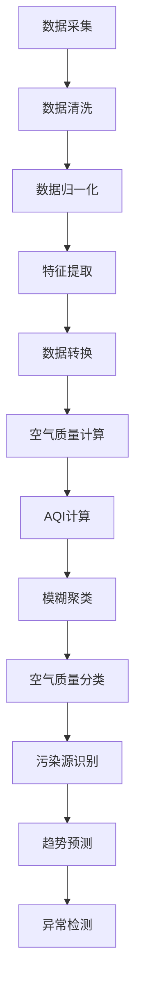

                 


### 《物联网在智慧城市空气质量监测中的应用》

#### 关键词：物联网，智慧城市，空气质量监测，系统架构，核心算法，数学模型，项目实战

#### 摘要：

本文深入探讨了物联网在智慧城市空气质量监测中的应用。从物联网与智慧城市的基本概念出发，详细阐述了空气质量监测系统的组成与工作原理，以及物联网技术在其中的应用优势。接下来，文章重点介绍了物联网空气质量监测系统架构的设计基础，包括数据采集层、数据传输层的设计原则。在此基础上，文章分析了空气质量监测核心算法原理，包括数据预处理、空气质量指数（AQI）计算方法和模糊聚类算法的应用。随后，文章提出了相关数学模型和时间序列分析模型，并通过示例进行了详细讲解。文章还涉及了物联网空气质量监测系统开发与实战，包括开发环境搭建、系统需求分析与设计、数据采集与处理、系统实现与优化、系统部署与维护等环节。最后，文章通过一个实际案例进行了深入剖析，总结了项目经验，并对未来进行了展望。

## 第一部分：物联网与智慧城市概述

### 第1章：物联网与智慧城市基本概念

#### 1.1 物联网的定义与发展历程

物联网（Internet of Things，简称IoT）是指将各种信息传感设备与互联网连接起来，实现智能识别、定位、跟踪、监控和管理的一种网络系统。物联网的发展可以追溯到20世纪90年代，随着传感器技术、通信技术、数据处理技术的进步，物联网逐渐成为一个重要的研究领域。

物联网的核心技术包括传感器技术、网络通信技术、数据处理技术、智能技术等。传感器技术是实现物联网感知世界的核心，通过网络通信技术，将传感器采集到的数据传输到数据处理中心，进行处理和分析，从而实现智能化决策。

物联网的发展历程可以分为三个阶段：第一阶段是物联网的萌芽阶段，主要是各类传感器和通信技术的研发和应用；第二阶段是物联网的起步阶段，主要是各类物联网应用的探索和推广；第三阶段是物联网的成熟阶段，主要是物联网技术的全面应用和大规模推广。

#### 1.2 智慧城市的发展背景与目标

智慧城市是利用物联网、云计算、大数据、人工智能等先进技术，实现城市管理和服务的智能化、精细化、高效化。智慧城市的发展背景主要是城市化进程的加速和城市问题的日益突出，如交通拥堵、环境污染、资源浪费等。

智慧城市的核心目标是提高城市居民的生活质量，实现城市可持续发展。具体包括以下几个方面：

1. **提高城市管理水平**：通过物联网技术，实现对城市基础设施、公共安全、环境保护等的智能化监控和管理，提高城市管理的效率和效果。
2. **优化城市服务**：通过大数据分析和人工智能技术，提供个性化、精准化的城市服务，如交通管理、医疗保健、教育等。
3. **促进经济发展**：通过物联网技术，推动产业升级和创新发展，促进城市经济的可持续发展。
4. **提高城市宜居性**：通过智慧城市建设，改善城市环境，提高城市居民的生活质量和幸福感。

#### 1.3 物联网在智慧城市中的地位与作用

物联网在智慧城市中具有重要的地位和作用。首先，物联网是智慧城市的数据采集和传输基础。通过物联网技术，可以实现对城市各类信息资源的全面采集和实时传输，为智慧城市建设提供了丰富的基础数据。

其次，物联网是智慧城市的信息处理和智能决策核心。通过物联网技术，可以将采集到的数据进行分析和处理，为城市管理和服务提供智能化的决策支持。

最后，物联网是智慧城市的新型基础设施。物联网技术的广泛应用，可以推动城市基础设施的智能化升级，提高城市运行的效率和质量。

总的来说，物联网在智慧城市中起到了连接、整合、提升的作用，是智慧城市建设的重要支撑和推动力量。

## 第二部分：物联网空气质量监测系统架构设计

### 第3章：物联网空气质量监测系统架构设计基础

#### 3.1 系统总体架构设计原则

物联网空气质量监测系统架构的设计原则主要包括以下几个方面：

1. **模块化设计**：系统应该采用模块化设计，将各个功能模块独立开发，便于系统的维护和扩展。
2. **可扩展性**：系统设计应该考虑未来的扩展性，以便在需求发生变化时，可以灵活地增加或减少功能模块。
3. **可靠性**：系统设计应确保数据的准确性和系统的稳定性，避免数据丢失和系统故障。
4. **安全性**：系统设计应充分考虑数据安全和系统安全，避免数据泄露和系统被攻击。
5. **高效性**：系统设计应考虑数据处理的高效性，以提高系统的运行效率和数据处理的准确性。

#### 3.2 数据采集层设计

数据采集层是物联网空气质量监测系统的核心组成部分，主要负责从各类传感器中采集空气质量数据。数据采集层的设计主要包括以下几个方面：

1. **传感器选择**：选择适合的传感器，如PM2.5传感器、温度传感器、湿度传感器等，确保数据采集的准确性和稳定性。
2. **数据采集频率**：根据实际需求，设定合理的数据采集频率，以平衡数据采集的实时性和系统负载。
3. **数据预处理**：对采集到的原始数据进行预处理，包括数据过滤、去噪、归一化等，以提高数据的质量和准确性。
4. **数据存储**：将预处理后的数据存储到数据库或数据湖中，以便后续的数据分析和处理。

#### 3.3 数据传输层设计

数据传输层主要负责将数据采集层采集到的数据传输到数据处理中心。数据传输层的设计主要包括以下几个方面：

1. **通信协议**：选择合适的通信协议，如MQTT、CoAP等，确保数据传输的高效性和可靠性。
2. **传输方式**：根据实际情况，选择合适的传输方式，如无线传输、有线传输等，以平衡数据传输的速度和成本。
3. **数据加密**：对传输的数据进行加密处理，以确保数据在传输过程中的安全性。
4. **数据传输效率**：优化数据传输效率，减少数据传输的延迟和带宽占用。

#### 3.4 数据处理层设计

数据处理层是物联网空气质量监测系统的核心组成部分，主要负责对采集到的空气质量数据进行分析和处理，以生成空气质量指数（AQI）和其他相关指标。数据处理层的设计主要包括以下几个方面：

1. **数据预处理**：对采集到的数据进一步预处理，包括数据清洗、数据去重、数据补全等，以提高数据的质量和完整性。
2. **数据存储**：将预处理后的数据存储到合适的数据库或数据湖中，以便后续的数据分析和处理。
3. **数据分析**：采用合适的数据分析方法和算法，对采集到的数据进行分析，以生成空气质量指数（AQI）和其他相关指标。
4. **数据可视化**：将分析结果以图表、地图等形式进行可视化展示，以便于用户理解和分析。

#### 3.5 数据展示层设计

数据展示层主要负责将分析结果展示给用户，以供用户进行查询、分析和决策。数据展示层的设计主要包括以下几个方面：

1. **用户界面**：设计简洁、直观、易于操作的用户界面，以提高用户的体验。
2. **数据可视化**：采用合适的图表、地图等形式，将分析结果进行可视化展示，以帮助用户更好地理解数据。
3. **交互功能**：提供交互功能，如搜索、筛选、排序等，以方便用户对数据进行深入分析和查询。
4. **实时更新**：实现数据的实时更新，以反映最新的空气质量状况。

通过以上设计原则和设计方案，物联网空气质量监测系统可以实现对空气质量数据的全面采集、实时处理、准确分析和有效展示，从而为智慧城市的空气质量管理提供有力支持。

### 第4章：空气质量监测核心算法原理

#### 4.1 空气质量监测数据预处理

空气质量监测数据的预处理是确保数据质量和分析准确性的关键步骤。预处理过程主要包括以下几个环节：

1. **数据清洗**：对采集到的原始数据进行清洗，包括去除重复数据、处理缺失数据和异常值。通过数据清洗，可以去除噪声和错误数据，提高数据质量。

2. **数据归一化**：将不同传感器采集到的数据进行归一化处理，使其在同一量级内进行比较和分析。常见的归一化方法有最小-最大归一化、Z-Score归一化等。

3. **特征提取**：从原始数据中提取具有代表性的特征，如温度、湿度、PM2.5浓度等。特征提取有助于降低数据的维度，提高模型训练的效率和准确性。

4. **数据转换**：将预处理后的数据转换为适合模型训练的格式，如将连续型数据转换为离散型数据、将时间序列数据转换为矩阵形式等。

#### 4.2 空气质量指数（AQI）计算方法

空气质量指数（AQI）是衡量空气质量的重要指标，它将空气质量转化为一个具体的数值，以便于公众理解和评估。AQI的计算方法通常遵循以下步骤：

1. **空气质量标准**：根据不同污染物（如PM2.5、PM10、SO2、NO2等）的浓度阈值，制定空气质量标准。

2. **污染物浓度计算**：计算每个污染物的浓度，通常使用测量值与标准值进行比较，计算出对应的空气质量指数（AQI）值。

3. **加权平均**：对于混合污染物，需要计算加权平均的AQI值。通常采用各污染物的浓度与权重系数的乘积之和，再除以权重系数之和。

4. **结果输出**：将计算出的AQI值输出，作为空气质量评价的依据。

#### 4.3 模糊聚类算法在空气质量监测中的应用

模糊聚类算法是一种基于模糊集合理论的聚类方法，它能够处理数据中的模糊性和不确定性。在空气质量监测中，模糊聚类算法可以用于以下场景：

1. **空气质量分类**：将不同区域或时间段的空气质量数据输入到模糊聚类算法中，将空气质量数据分为不同的类别，如优良、轻度污染、中度污染等。

2. **污染源识别**：通过对空气质量数据的模糊聚类，可以识别出污染源的位置和影响范围，为污染治理提供依据。

3. **趋势预测**：利用模糊聚类算法，可以对空气质量数据进行分析和预测，预测未来某一时间段内的空气质量状况。

4. **异常检测**：通过对空气质量数据的模糊聚类，可以识别出异常数据，如突发污染事件，为环境监管提供预警。

### Mermaid流程图：



通过以上算法原理的介绍，我们可以看到，空气质量监测数据的预处理、AQI计算方法和模糊聚类算法在空气质量监测中起着至关重要的作用。这些算法的应用不仅提高了空气质量监测的准确性和效率，还为智慧城市的空气质量管理提供了科学依据。

### 第5章：数学模型与数学公式

空气质量监测系统中，数学模型和数学公式是理解和分析空气质量数据的重要工具。以下我们将介绍两个常用的数学模型和相关的数学公式。

#### 5.1 相关性分析模型

在空气质量监测中，相关性分析用于分析不同污染物之间的关联程度。皮尔逊相关系数（Pearson Correlation Coefficient）是一种常用的相关性分析指标，其公式如下：

$$
r = \frac{\sum_{i=1}^{n}(x_i - \bar{x})(y_i - \bar{y})}{\sqrt{\sum_{i=1}^{n}(x_i - \bar{x})^2} \sqrt{\sum_{i=1}^{n}(y_i - \bar{y})^2}}
$$

其中，\(x_i\) 和 \(y_i\) 分别表示第 \(i\) 次测量的两个变量值，\(\bar{x}\) 和 \(\bar{y}\) 分别为两个变量的平均值，\(n\) 为数据点的总数。

皮尔逊相关系数 \(r\) 的取值范围为 \([-1, 1]\)。当 \(r\) 接近 1 或 -1 时，表示两个变量高度正相关或负相关；当 \(r\) 接近 0 时，表示两个变量之间没有明显的相关性。

#### 5.2 时间序列分析模型

时间序列分析用于研究随时间变化的数据，常用于空气质量预测。一个简单的时间序列分析模型是线性回归模型，其公式如下：

$$
y_t = c + b_1t + e_t
$$

其中，\(y_t\) 表示第 \(t\) 时刻的空气质量指数（AQI），\(t\) 表示时间，\(c\) 为常数项，\(b_1\) 为线性回归系数，\(e_t\) 为误差项。

线性回归模型通过分析时间序列数据中的线性关系，预测未来的空气质量指数。实际应用中，通常需要对时间序列数据进行预处理，如去趋势和去季节性，以提高预测的准确性。

#### 示例说明

假设我们有一组空气质量指数（AQI）的时间序列数据，如下表所示：

| 时间 \(t\) | AQI \(y_t\) |
|----------|-----------|
| 1        | 45        |
| 2        | 50        |
| 3        | 48        |
| 4        | 47        |
| 5        | 49        |

我们可以通过线性回归模型来预测第 6 时刻的 AQI。首先，计算平均值：

$$
\bar{x} = \frac{1+2+3+4+5}{5} = 3
$$

$$
\bar{y} = \frac{45+50+48+47+49}{5} = 48
$$

然后，计算线性回归系数 \(b_1\)：

$$
b_1 = \frac{\sum_{i=1}^{n}(x_i - \bar{x})(y_i - \bar{y})}{\sum_{i=1}^{n}(x_i - \bar{x})^2} = \frac{(1-3)(45-48) + (2-3)(50-48) + (3-3)(48-48) + (4-3)(47-48) + (5-3)(49-48)}{(1-3)^2 + (2-3)^2 + (3-3)^2 + (4-3)^2 + (5-3)^2} = \frac{-6 + 2 + 0 - 1 + 1}{4 + 1 + 0 + 1 + 4} = \frac{-4}{10} = -0.4
$$

常数项 \(c\) 可以通过以下公式计算：

$$
c = \bar{y} - b_1\bar{x} = 48 - (-0.4 \times 3) = 48 + 1.2 = 49.2
$$

因此，线性回归模型为：

$$
y_t = 49.2 - 0.4t
$$

预测第 6 时刻的 AQI：

$$
y_6 = 49.2 - 0.4 \times 6 = 49.2 - 2.4 = 46.8
$$

通过以上示例，我们可以看到如何使用线性回归模型进行空气质量指数的时间序列预测。这只是一个简单的模型，实际应用中可能需要更复杂的方法，如ARIMA模型、LSTM神经网络等。

### 第6章：空气质量监测系统开发与实战

#### 6.1 系统开发环境搭建

搭建一个完善的空气质量监测系统开发环境是确保项目顺利进行的基础。以下是搭建开发环境的具体步骤：

1. **操作系统**：选择Linux操作系统，如Ubuntu 20.04，它具有良好的稳定性和丰富的开发工具。

2. **开发工具**：安装常用的开发工具，包括文本编辑器（如VS Code）、版本控制工具（如Git）、集成开发环境（如PyCharm）等。

3. **编程语言**：选择Python作为主要编程语言，因为Python具有简洁的语法和丰富的库，适合数据分析和系统开发。

4. **数据库**：安装关系型数据库（如MySQL）和非关系型数据库（如MongoDB），用于存储和查询空气质量数据。

5. **中间件**：安装中间件，如MQTT broker（用于物联网数据传输）、Web服务器（如Apache）等。

6. **编程环境**：配置Python编程环境，包括安装必要的库和模块，如NumPy、Pandas、Matplotlib等。

7. **测试工具**：安装测试工具，如Postman（用于API测试）、JMeter（用于性能测试）等。

#### 6.2 开发工具与软件安装

以下是开发工具和软件的安装步骤：

1. **安装Linux操作系统**：从Ubuntu官网下载操作系统安装镜像，按照提示进行安装。

2. **安装文本编辑器**：使用以下命令安装VS Code：

   ```
   sudo apt update
   sudo apt install code
   ```

3. **安装版本控制工具**：使用以下命令安装Git：

   ```
   sudo apt install git
   ```

4. **安装集成开发环境**：使用以下命令安装PyCharm：

   ```
   sudo snap install pycharm-professional --classic
   ```

5. **安装数据库**：安装MySQL：

   ```
   sudo apt install mysql-server
   ```

   安装MongoDB：

   ```
   sudo apt install mongodb
   ```

6. **安装中间件**：安装MQTT broker（例如mosquitto）：

   ```
   sudo apt install mosquitto mosquitto-clients
   ```

   启动MQTT broker：

   ```
   sudo systemctl start mosquitto
   ```

7. **安装编程环境**：安装Python和必要的库：

   ```
   sudo apt install python3 python3-pip
   sudo pip3 install numpy pandas matplotlib
   ```

#### 6.3 系统配置与调试

配置与调试是确保系统稳定运行的重要环节。以下是配置与调试的具体步骤：

1. **数据库配置**：配置MySQL和MongoDB，设置用户权限、数据库结构和连接参数。

2. **中间件配置**：配置MQTT broker，设置消息传输规则、订阅主题和消息队列。

3. **系统测试**：通过编写测试脚本，模拟空气质量数据采集、传输和处理过程，验证系统功能。

4. **性能优化**：针对系统性能瓶颈进行优化，如数据库查询优化、网络传输优化、数据处理优化等。

5. **错误处理**：编写错误处理逻辑，确保系统在出现异常时能够正常响应和恢复。

通过以上步骤，可以搭建一个完善的空气质量监测系统开发环境，为后续的项目开发提供支持。

### 第7章：空气质量监测系统项目实战

#### 7.1 系统需求分析与设计

空气质量监测系统项目的成功实施依赖于准确的需求分析和合理的系统设计。以下是系统需求分析与设计的过程：

1. **需求分析**：

   - **用户需求**：明确系统需满足的用户需求，包括实时空气质量数据采集、处理和展示。

   - **功能需求**：详细列举系统需要实现的功能，如数据采集、数据预处理、数据存储、数据分析、数据展示等。

   - **性能需求**：确定系统的性能指标，如数据采集速率、处理效率、系统响应时间等。

   - **安全需求**：确保数据传输和存储的安全，包括数据加密、访问控制等。

2. **系统设计**：

   - **架构设计**：设计系统的总体架构，包括数据采集层、数据传输层、数据处理层和数据展示层。

   - **模块划分**：将系统划分为多个功能模块，如传感器模块、数据采集模块、数据处理模块、数据存储模块、数据展示模块等。

   - **接口设计**：设计系统各模块之间的接口，确保模块之间能够无缝连接和协同工作。

   - **数据库设计**：设计数据库结构，包括数据表、字段、索引等，确保数据的存储和管理高效、可靠。

3. **系统原型设计**：

   - **功能原型**：通过绘制系统功能原型图，明确系统的功能模块和用户操作流程。

   - **界面设计**：设计系统的用户界面，包括数据采集界面、数据分析界面、数据展示界面等，确保界面友好、直观、易操作。

#### 7.2 数据采集与处理

数据采集与处理是空气质量监测系统的核心环节。以下是数据采集与处理的详细步骤：

1. **传感器选择与部署**：

   - **传感器选择**：选择适合的空气质量传感器，如PM2.5传感器、温度传感器、湿度传感器等。

   - **传感器部署**：将传感器安装在适当的地点，确保传感器的数据采集能够覆盖整个监测区域。

2. **数据采集**：

   - **采集频率**：设定合理的采集频率，如每分钟采集一次，以确保数据的实时性和完整性。

   - **数据格式**：定义统一的数据格式，如JSON格式，确保数据在不同模块之间能够无缝传输和处理。

3. **数据预处理**：

   - **数据清洗**：去除重复数据、异常数据和噪声数据，确保数据的准确性。

   - **数据归一化**：将不同传感器采集到的数据进行归一化处理，使其在同一量级内进行比较和分析。

   - **特征提取**：提取具有代表性的特征，如PM2.5浓度、温度、湿度等，为后续的数据分析提供基础。

4. **数据存储**：

   - **数据存储**：将预处理后的数据存储到数据库或数据湖中，确保数据的持久化和安全性。

   - **存储结构**：设计合理的存储结构，如时间序列数据库，以便于数据的高效查询和检索。

5. **数据质量管理**：

   - **数据完整性检查**：定期检查数据的完整性，确保数据的准确性和一致性。

   - **数据质量监控**：建立数据质量监控机制，及时发现和处理数据质量问题。

#### 7.3 系统实现与优化

系统实现与优化是空气质量监测系统开发的关键环节。以下是系统实现与优化的详细步骤：

1. **代码实现**：

   - **模块化开发**：按照系统设计，将系统划分为多个功能模块，分别实现各个模块的功能。

   - **代码质量**：编写高质量的代码，遵循编程规范，确保代码的可读性、可维护性和可扩展性。

   - **单元测试**：编写单元测试，验证各个模块的功能和性能，确保系统的稳定性和可靠性。

2. **系统集成**：

   - **接口集成**：集成各个模块的接口，确保模块之间能够无缝连接和协同工作。

   - **系统测试**：进行系统测试，包括功能测试、性能测试、安全测试等，确保系统的整体性能和稳定性。

3. **性能优化**：

   - **数据库优化**：优化数据库查询，如添加索引、优化查询语句等，提高数据检索效率。

   - **网络优化**：优化网络传输，如使用压缩算法、优化传输协议等，提高数据传输速度。

   - **数据处理优化**：优化数据处理算法，如使用并行计算、优化算法实现等，提高数据处理效率。

4. **系统部署**：

   - **部署规划**：制定系统部署计划，包括部署环境、部署步骤、部署策略等。

   - **部署实施**：按照部署计划，将系统部署到生产环境，确保系统的正常运行。

   - **部署监控**：建立系统监控机制，实时监控系统的运行状态和性能指标，确保系统的稳定性和安全性。

#### 7.4 系统部署与维护

系统部署与维护是确保空气质量监测系统长期稳定运行的重要环节。以下是系统部署与维护的详细步骤：

1. **系统部署**：

   - **环境准备**：准备系统部署环境，包括操作系统、开发工具、数据库、中间件等。

   - **部署工具**：使用自动化部署工具，如Docker、Kubernetes等，简化部署流程，提高部署效率。

   - **部署脚本**：编写部署脚本，自动化部署系统的各个模块，确保部署的一致性和可靠性。

2. **系统监控**：

   - **监控工具**：选择合适的监控工具，如Prometheus、Grafana等，实时监控系统的运行状态和性能指标。

   - **报警机制**：建立报警机制，及时发现和处理系统故障和性能问题。

   - **日志管理**：收集和存储系统的日志信息，便于故障排查和问题定位。

3. **系统升级**：

   - **升级计划**：制定系统升级计划，包括升级版本、升级时间、升级步骤等。

   - **升级实施**：按照升级计划，将系统升级到新版本，确保系统的功能完善和性能提升。

   - **升级验证**：验证系统升级后的功能是否正常，性能是否提升，确保升级的成功和稳定。

4. **系统维护**：

   - **定期维护**：定期进行系统维护，包括数据库优化、缓存清理、安全检查等，确保系统的稳定性和安全性。

   - **故障处理**：及时处理系统故障，包括故障排查、故障修复、故障恢复等，确保系统的正常运行。

   - **用户支持**：提供用户支持，包括用户培训、用户咨询、用户反馈等，确保用户能够顺利使用系统。

### 第8章：案例分析

#### 8.1 某智慧城市空气质量监测项目案例分析

以下是一个实际智慧城市空气质量监测项目的案例分析，该项目在某大城市实施，旨在提高城市空气质量，改善居民生活环境。

1. **项目背景**：

   该城市近年来空气质量问题日益突出，尤其是PM2.5和PM10的浓度经常超过国家标准。为了解决这一问题，政府决定实施一个智慧城市空气质量监测项目，利用物联网技术实时监测空气质量，提供准确的空气质量信息，为环保政策和措施提供科学依据。

2. **项目目标**：

   - **实时监测**：实现对城市各主要区域空气质量数据的实时监测，确保数据采集的准确性和实时性。

   - **数据分析**：对采集到的空气质量数据进行实时分析，生成空气质量指数（AQI）和其他相关指标，为决策提供支持。

   - **信息展示**：通过互联网和移动端平台，向公众展示实时空气质量信息，提高公众对空气质量的认识和关注。

3. **项目实施过程**：

   - **需求分析**：与政府部门和环保专家进行深入交流，明确项目需求和目标。

   - **系统设计**：设计空气质量监测系统架构，包括数据采集层、数据传输层、数据处理层和数据展示层。

   - **设备采购**：采购合适的空气质量传感器，包括PM2.5传感器、PM10传感器、温度传感器、湿度传感器等。

   - **设备部署**：将传感器安装在城市的不同区域，确保数据的覆盖范围和代表性。

   - **系统集成**：将传感器数据传输到数据处理中心，通过数据处理算法生成空气质量指数（AQI）和其他指标。

   - **信息展示**：通过互联网和移动端平台，向公众展示实时空气质量信息。

4. **项目效果**：

   - **实时监测**：系统成功实现了对城市空气质量数据的实时监测，数据采集准确性和实时性得到了保障。

   - **数据分析**：通过对空气质量数据的分析，生成了详细的空气质量指数（AQI）和其他相关指标，为政府决策提供了科学依据。

   - **信息展示**：公众可以通过互联网和移动端平台，实时了解城市的空气质量状况，提高了公众对空气质量的认识和关注。

   - **政策建议**：根据空气质量监测数据，政府提出了一系列环保政策和措施，如加强交通管理、推广新能源汽车等，有效改善了城市空气质量。

5. **项目经验总结与展望**：

   - **项目成功因素**：项目的成功主要得益于科学的需求分析、合理的系统设计、高效的设备部署和数据处理。

   - **经验教训**：在项目实施过程中，遇到了传感器故障、数据传输延迟等问题，通过及时调整和优化，确保了项目的顺利进行。

   - **未来展望**：随着物联网技术的不断发展，空气质量监测系统将更加智能化、精准化。未来可以引入更多传感器，如氮氧化物传感器、臭氧传感器等，进一步丰富监测数据；同时，利用人工智能技术，实现空气质量预测和预警，为城市环境管理提供更加精准的支持。

### 附录：参考资料与资源链接

#### 附录 A：物联网空气质量监测相关书籍与论文

- **书籍**：

  1. Kevin Ashton, "The Internet of Things: How the Internet of Things Is Changing the World and How You Can Profit From It"（物联网：物联网如何改变世界以及您如何从中获利）。
  2. Samarth Bhaskar, "IoT: The Ultimate Beginner's Guide to Understanding the Internet of Things"（物联网：理解物联网的终极入门指南）。
  3. Leon Marr, "IoT Applications: Designing the Internet of Things"（物联网应用：设计物联网）。

- **论文**：

  1. "The Impact of IoT on Environmental Monitoring and Management"（物联网对环境监测与管理的影响）。
  2. "Smart Cities and the Internet of Things: A Comprehensive Study"（智慧城市与物联网：全面研究）。
  3. "Application of IoT in Air Quality Monitoring and Control"（物联网在空气质量监测与控制中的应用）。

#### 附录 B：空气质量监测系统开发工具与平台

- **开发工具**：

  1. **Python**：Python是一种广泛使用的编程语言，适合数据分析和系统开发。
  2. **Docker**：用于容器化部署，简化系统部署和运行环境。
  3. **Kubernetes**：用于集群管理，确保系统的高可用性和可扩展性。

- **数据库**：

  1. **MySQL**：关系型数据库，适合存储和查询结构化数据。
  2. **MongoDB**：非关系型数据库，适合存储和处理大规模非结构化数据。

- **中间件**：

  1. **MQTT**：物联网通信协议，用于数据采集和传输。
  2. **Apache Kafka**：分布式流处理平台，用于大规模数据采集和传输。
  3. **Apache Spark**：大数据处理框架，用于大规模数据处理和分析。

- **平台**：

  1. **Azure IoT Hub**：微软提供的物联网平台，提供设备管理、数据传输、数据分析等功能。
  2. **AWS IoT**：亚马逊提供的物联网平台，提供设备管理、数据传输、数据分析等功能。
  3. **阿里云物联网平台**：阿里云提供的物联网平台，提供设备管理、数据传输、数据分析等功能。

作者：AI天才研究院/AI Genius Institute & 禅与计算机程序设计艺术 /Zen And The Art of Computer Programming

