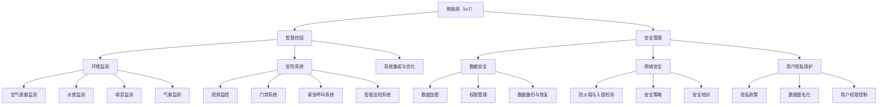

                 

# 物联网在智慧校园安全管理中的应用

> 关键词：物联网，智慧校园，安全管理，环境监测，安防系统，数据采集与整合，智能分析与预警

> 摘要：本文将深入探讨物联网在智慧校园安全管理中的应用。通过分析物联网技术的核心概念、智慧校园的建设与安全需求，以及物联网在环境监测和安防系统中的应用，本文旨在为读者提供全面且实用的知识体系，帮助校园管理者提升安全管理的效率和效果。

### 第一部分：物联网基础

#### 第1章：物联网概述

## 1.1 物联网的定义与分类

### 1.1.1 物联网的基本概念

物联网（Internet of Things，简称IoT）是指通过互联网将各种物理设备和传感器连接起来，实现信息的采集、传输、处理和共享。物联网的基本概念包括以下几个方面：

1. **设备连接**：物联网的核心在于将各种设备连接到互联网，使设备之间能够进行通信和协同工作。

2. **数据采集**：物联网设备通过传感器等技术，实时采集环境参数、设备状态等数据。

3. **数据处理**：采集到的数据通过云计算、大数据等技术进行处理和分析，为决策提供支持。

4. **智能交互**：物联网设备之间可以自动进行交互，实现自动化控制。

### 1.1.2 物联网的分类

物联网可以根据连接的设备类型、应用场景等不同维度进行分类。以下是几种常见的物联网分类方法：

1. **按连接方式分类**：

   - **有线物联网**：通过有线网络连接设备，如以太网、光纤等。
   - **无线物联网**：通过无线网络连接设备，如Wi-Fi、蓝牙、Zigbee等。

2. **按应用场景分类**：

   - **智能家居**：将家庭中的各种设备连接起来，实现远程控制和智能化管理。
   - **智能城市**：通过物联网技术实现城市基础设施的智能化管理和优化。
   - **智能医疗**：利用物联网技术进行健康监测、远程诊断等。
   - **智慧农业**：通过物联网技术实现农田灌溉、气象监测等。

3. **按设备类型分类**：

   - **传感器设备**：用于采集环境参数、设备状态等数据的设备。
   - **网关设备**：用于连接不同类型的网络，实现数据传输和协议转换。
   - **智能设备**：具有独立处理能力和交互能力的设备，如智能手表、智能手机等。

## 1.2 物联网的关键技术

### 1.2.1 网络技术

网络技术是物联网的核心技术之一，主要包括以下几个方面：

1. **无线网络**：如Wi-Fi、蓝牙、Zigbee等，用于设备之间的数据传输。

2. **有线网络**：如以太网、光纤等，用于设备与互联网的连接。

3. **移动网络**：如4G、5G等，提供广域范围内的网络连接。

### 1.2.2 数据处理技术

数据处理技术主要包括以下几个方面：

1. **数据采集**：通过传感器等技术实时采集数据。

2. **数据存储**：将采集到的数据存储到数据库或云平台中。

3. **数据处理**：对存储的数据进行清洗、分析、挖掘等处理，提取有价值的信息。

4. **数据可视化**：将处理后的数据通过图表、报表等形式展示，方便用户理解。

### 1.2.3 安全技术

物联网的安全性是当前研究的热点问题，主要包括以下几个方面：

1. **数据安全**：确保数据在采集、传输、存储等过程中不被窃取、篡改或泄露。

2. **网络安全**：防止黑客攻击、网络入侵等安全威胁。

3. **设备安全**：确保物联网设备的硬件和软件安全，防止被恶意攻击或控制。

4. **用户隐私保护**：保护用户的个人信息不被非法获取和使用。

### 第二部分：智慧校园概述

#### 第2章：智慧校园的建设与安全需求

## 2.1 智慧校园的建设现状

### 2.1.1 智慧校园的定义

智慧校园是指通过物联网、大数据、云计算等现代信息技术，实现校园环境、教学、管理、安全等全方位智能化。智慧校园的目标是提供更加便捷、高效、安全的学习和生活环境，提高教育质量和学生满意度。

### 2.1.2 智慧校园的主要应用领域

智慧校园主要包括以下几个应用领域：

1. **教学领域**：实现线上与线下教学融合，提供个性化学习支持。

2. **管理领域**：实现校园资源的智能管理和优化，提高管理效率。

3. **环境监测领域**：通过物联网设备实时监测校园环境，确保校园安全。

4. **安防领域**：利用物联网技术实现校园安防系统的智能化。

5. **学生生活领域**：提供便捷的校园生活服务，提升学生生活质量。

## 2.2 智慧校园的安全需求

### 2.2.1 数据安全

数据安全是智慧校园安全管理的核心，主要包括以下几个方面：

1. **数据加密**：对传输和存储的数据进行加密，防止数据被窃取或篡改。

2. **权限管理**：实现数据访问的权限控制，确保只有授权用户可以访问敏感数据。

3. **数据备份与恢复**：定期备份重要数据，确保数据在发生意外时可以快速恢复。

### 2.2.2 网络安全

网络安全是智慧校园安全管理的另一个重要方面，主要包括以下几个方面：

1. **防火墙与入侵检测**：部署防火墙和入侵检测系统，防止网络攻击和数据泄露。

2. **安全策略**：制定网络安全策略，规范网络使用行为，防止恶意攻击。

3. **安全培训**：对校园师生进行网络安全培训，提高安全意识。

### 2.2.3 用户隐私保护

用户隐私保护是智慧校园安全管理的重要内容，主要包括以下几个方面：

1. **隐私政策**：制定隐私政策，明确用户隐私保护的范围和方式。

2. **数据匿名化**：对用户数据进行匿名化处理，确保用户隐私不被泄露。

3. **用户权限控制**：实现用户权限控制，确保只有授权用户可以访问和操作用户数据。

### 第三部分：物联网在智慧校园安全管理中的应用

#### 第3章：物联网技术在校园环境监测中的应用

## 3.1 校园环境监测需求分析

### 3.1.1 环境参数监测的重要性

环境参数监测是校园环境安全管理的重要组成部分，主要包括以下几个方面：

1. **空气质量监测**：空气质量对学生的健康至关重要，需要实时监测并报警。

2. **水质监测**：校园水源的质量直接关系到学生的饮水安全，需要定期监测。

3. **噪音监测**：校园噪音会对学生的学习和生活产生干扰，需要实时监测并采取措施。

4. **气象监测**：气象信息对校园活动的安排和学生的安全至关重要，需要实时监测。

### 3.1.2 监测需求的案例分析

以某高校为例，该校在校园环境监测中面临以下需求：

1. **空气质量监测**：在校园内的主要教学区、宿舍区等区域安装空气质量监测设备，实时监测PM2.5、PM10、二氧化碳等参数。

2. **水质监测**：在校园水源、游泳池、食堂等区域安装水质监测设备，实时监测水质指标，如PH值、总硬度、重金属等。

3. **噪音监测**：在图书馆、宿舍、教室等区域安装噪音监测设备，实时监测噪音水平，并根据噪音水平自动调整空调、音响等设备。

4. **气象监测**：在校园内安装气象监测设备，实时监测气温、湿度、风力、降雨量等参数，为校园活动安排提供依据。

## 3.2 物联网技术在环境监测中的应用

### 3.2.1 气象监测

气象监测是校园环境监测的重要部分，物联网技术在这方面具有显著优势。以下是气象监测的物联网系统架构：

1. **传感器网络**：在校园内布置气象传感器，如温度传感器、湿度传感器、风速传感器、雨量传感器等，实时采集气象数据。

2. **数据传输网络**：通过Wi-Fi、4G、5G等无线网络将气象数据传输到数据中心。

3. **数据处理与分析**：在数据中心对气象数据进行处理和分析，生成天气预报、气候趋势等报告。

4. **智能报警系统**：当气象参数达到预设阈值时，自动触发报警，通知相关部门和人员采取应对措施。

### 3.2.2 水质监测

水质监测是保障校园饮水安全和卫生的重要手段，物联网技术在水质监测中发挥了重要作用。以下是水质监测的物联网系统架构：

1. **传感器网络**：在校园水源、游泳池、食堂等区域安装水质监测传感器，如PH传感器、溶解氧传感器、总硬度传感器等，实时采集水质数据。

2. **数据传输网络**：通过有线或无线网络将水质数据传输到数据中心。

3. **数据处理与分析**：在数据中心对水质数据进行处理和分析，判断水质是否合格，生成水质报告。

4. **智能报警系统**：当水质参数达到预设阈值时，自动触发报警，通知相关部门和人员采取应对措施。

### 3.2.3 噪音监测

噪音监测是保障校园安静环境和学生健康的重要手段，物联网技术在噪音监测中发挥了重要作用。以下是噪音监测的物联网系统架构：

1. **传感器网络**：在图书馆、宿舍、教室等区域安装噪音监测传感器，实时采集噪音数据。

2. **数据传输网络**：通过有线或无线网络将噪音数据传输到数据中心。

3. **数据处理与分析**：在数据中心对噪音数据进行处理和分析，判断噪音水平是否达到标准，生成噪音报告。

4. **智能调控系统**：当噪音水平超过预设阈值时，自动调整空调、音响等设备，降低噪音水平。

#### 第四部分：物联网在校园安防中的应用

## 第4章：物联网技术在校园安防中的应用

### 4.1 校园安防需求分析

### 4.1.1 校园安防的重要性

校园安防是保障校园安全和学生安全的重要手段，涉及到学生的生命安全、财产安全、信息安全等多个方面。校园安防需求主要包括以下几个方面：

1. **人员安全**：确保校园内师生的人身安全，防止违法犯罪行为发生。

2. **财产安全**：保护校园内的财物安全，防止盗窃、破坏等行为。

3. **信息安全**：确保校园网络和信息系统的安全，防止网络攻击、数据泄露等。

4. **应急响应**：建立完善的应急响应机制，快速应对突发事件。

### 4.1.2 安防需求的案例分析

以某初中为例，该校在安防方面面临以下需求：

1. **人员安全**：在校园内布置视频监控设备，实时监控校园内人员动态，防止犯罪行为发生。在关键区域安装门禁系统，确保只有授权人员可以进入。

2. **财产安全**：在校园内安装防盗报警系统，实时监测校园内的财务安全。在重要设备上安装定位系统，确保设备安全。

3. **信息安全**：建立网络安全防护体系，防止网络攻击和数据泄露。对校园内的重要信息系统进行备份，确保数据安全。

4. **应急响应**：建立应急响应机制，包括应急预案、应急演练、应急通讯等，确保在突发事件时可以快速响应。

### 4.2 物联网技术在安防中的应用

#### 4.2.1 视频监控

视频监控是校园安防的重要手段之一，物联网技术为视频监控提供了新的解决方案。以下是物联网视频监控系统架构：

1. **传感器网络**：在校园内布置视频监控摄像头，实时采集校园内的视频数据。

2. **数据传输网络**：通过Wi-Fi、4G、5G等无线网络将视频数据传输到数据中心。

3. **数据处理与分析**：在数据中心对视频数据进行处理和分析，实现人脸识别、行为分析等功能。

4. **智能报警系统**：当视频数据检测到异常情况时，自动触发报警，通知相关部门和人员采取应对措施。

#### 4.2.2 门禁系统

门禁系统是校园安防的重要组成部分，物联网技术为门禁系统提供了新的可能性。以下是物联网门禁系统架构：

1. **传感器网络**：在校园内布置门禁设备，如读卡器、指纹识别设备等，用于识别和验证人员身份。

2. **数据传输网络**：通过Wi-Fi、4G、5G等无线网络将门禁数据传输到数据中心。

3. **数据处理与分析**：在数据中心对门禁数据进行处理和分析，实现人员进出记录、权限管理等功能。

4. **智能控制**：根据门禁数据，实现自动开关门、远程控制等功能。

#### 4.2.3 呼叫系统

呼叫系统是校园安防的另一个重要组成部分，物联网技术为呼叫系统提供了新的解决方案。以下是物联网呼叫系统架构：

1. **传感器网络**：在校园内布置呼叫设备，如紧急按钮、对讲机等，用于呼叫求助。

2. **数据传输网络**：通过Wi-Fi、4G、5G等无线网络将呼叫数据传输到数据中心。

3. **数据处理与分析**：在数据中心对呼叫数据进行处理和分析，实现实时通讯、位置追踪等功能。

4. **智能调度**：根据呼叫数据，实现智能调度，快速响应求助请求。

#### 第五部分：物联网在校园安全管理系统中的整合应用

## 第5章：物联网在校园安全管理系统中的整合应用

### 5.1 校园安全管理系统概述

#### 5.1.1 校园安全管理的挑战

随着校园规模的扩大和师生数量的增加，校园安全管理的难度也在不断加大。校园安全管理面临的挑战主要包括以下几个方面：

1. **数据多样性与复杂性**：校园内涉及多个安全领域，如人员安全、财产安全、信息安全等，数据类型和来源多样，如何有效整合和管理这些数据是一个挑战。

2. **实时性与高效性**：校园安全管理需要实时获取和处理大量数据，并快速做出响应，这对系统的实时性和高效性提出了较高要求。

3. **安全性**：校园安全管理系统需要确保数据安全、网络安全和用户隐私保护，防止数据泄露和恶意攻击。

#### 5.1.2 校园安全管理系统的建设

校园安全管理系统建设的目标是整合各种安全资源，实现安全数据的实时采集、处理和分析，提供智能化的安全管理和决策支持。以下是校园安全管理系统的建设步骤：

1. **需求分析**：明确校园安全管理的需求，包括安全领域、数据类型、实时性要求等。

2. **技术选型**：选择合适的物联网技术、数据处理技术、安全技术等，构建校园安全管理系统。

3. **系统集成**：将各种安全设备和系统进行集成，实现数据共享和协同工作。

4. **系统测试与优化**：对校园安全管理系统进行测试和优化，确保其稳定性和高效性。

### 5.2 物联网技术在校园安全管理中的应用

#### 5.2.1 数据采集与整合

物联网技术在校园安全管理系统中的应用首先体现在数据采集与整合方面。通过在校园内布置各种物联网设备，如视频监控摄像头、门禁设备、传感器等，可以实时采集校园内的各类安全数据，包括人员进出记录、视频监控数据、环境监测数据等。以下是数据采集与整合的物联网系统架构：

1. **传感器网络**：在校园内布置各种物联网设备，如视频监控摄像头、门禁设备、传感器等，实时采集校园内的安全数据。

2. **数据传输网络**：通过Wi-Fi、4G、5G等无线网络将安全数据传输到数据中心。

3. **数据处理与分析**：在数据中心对采集到的安全数据进行处理和分析，提取有价值的信息。

4. **数据整合**：将来自不同设备的数据进行整合，形成统一的安全数据视图。

#### 5.2.2 智能分析与预警

物联网技术在校园安全管理系统中的应用不仅体现在数据采集与整合方面，还体现在智能分析与预警方面。通过大数据分析和人工智能技术，可以对校园内的安全数据进行分析，发现潜在的安全风险，并提前发出预警。以下是智能分析与预警的物联网系统架构：

1. **数据预处理**：对采集到的安全数据进行预处理，包括数据清洗、去重、格式转换等。

2. **特征提取**：从预处理后的数据中提取特征信息，为后续分析提供基础。

3. **数据建模与预测**：利用机器学习算法，对安全数据进行建模和预测，识别潜在的安全风险。

4. **预警与响应**：当系统检测到潜在的安全风险时，自动触发预警，并通知相关部门和人员采取应对措施。

#### 5.2.3 系统集成与优化

物联网技术在校园安全管理系统中的应用还体现在系统集成与优化方面。通过将各种安全设备和系统进行集成，实现数据的共享和协同工作，可以显著提高校园安全管理系统的效率和效果。以下是系统集成与优化的物联网系统架构：

1. **系统集成**：将校园内的各种安全设备和系统进行集成，实现数据共享和协同工作。

2. **接口标准化**：制定统一的接口规范，确保不同设备和系统能够无缝集成。

3. **系统优化**：对校园安全管理系统进行持续优化，提高其性能和可靠性。

4. **用户界面优化**：设计友好的用户界面，方便校园管理者进行操作和监控。

### 第六部分：物联网在校园安全管理中的案例分析

#### 第6章：物联网在校园安全管理中的案例分析

### 6.1 案例一：某高校智慧校园安全管理系统

#### 6.1.1 案例背景

某高校为提升校园安全管理的效率和效果，决定建设一个智慧校园安全管理系统。该系统旨在整合校园内的各类安全设备和系统，实现数据共享和智能分析，为校园安全管理提供决策支持。

#### 6.1.2 案例实施

1. **需求分析**：明确校园安全管理的需求，包括人员安全、财产安全、信息安全等。

2. **技术选型**：选择合适的物联网技术、数据处理技术、安全技术等，构建智慧校园安全管理系统。

3. **系统集成**：将校园内的各种安全设备和系统进行集成，实现数据共享和协同工作。

4. **系统测试与优化**：对智慧校园安全管理系统进行测试和优化，确保其稳定性和高效性。

#### 6.1.3 案例效果

智慧校园安全管理系统的实施，显著提升了校园安全管理的效果：

1. **数据整合**：实现了校园内各类安全数据的整合，提供了统一的安全数据视图。

2. **智能分析**：通过大数据分析和人工智能技术，能够提前发现潜在的安全风险，及时发出预警。

3. **提高效率**：实现了校园安全管理的高效运行，减少了人工操作和误报率。

4. **降低成本**：通过数据共享和协同工作，降低了校园安全管理的成本。

### 6.2 案例二：某初中校园安防系统

#### 6.2.1 案例背景

某初中学校在校园安防方面面临较大压力，决定建设一个物联网校园安防系统，以提高校园安全管理的效率和效果。

#### 6.2.2 案例实施

1. **需求分析**：明确校园安防的需求，包括人员安全、财产安全、信息安全等。

2. **技术选型**：选择合适的物联网技术、安防设备等，构建物联网校园安防系统。

3. **系统集成**：将校园内的各类安防设备和系统进行集成，实现数据共享和协同工作。

4. **系统测试与优化**：对物联网校园安防系统进行测试和优化，确保其稳定性和高效性。

#### 6.2.3 案例效果

物联网校园安防系统的实施，显著提升了校园安防的效果：

1. **视频监控**：实现了校园内主要区域的实时视频监控，提高了对违法犯罪行为的发现和处理能力。

2. **门禁管理**：实现了校园门的智能管理，只有授权人员可以进入。

3. **紧急呼叫**：安装了紧急呼叫设备，师生在遇到紧急情况时可以快速求助。

4. **安防预警**：通过大数据分析和人工智能技术，能够提前发现潜在的安全风险，及时发出预警。

5. **降低犯罪率**：由于安防系统的加强，校园内的犯罪率显著降低。

### 第七部分：物联网在校园安全管理中的未来发展

#### 第7章：物联网在校园安全管理中的未来发展

### 7.1 物联网技术发展趋势

物联网技术在不断发展和演进，未来将呈现以下趋势：

1. **更广泛的应用场景**：物联网技术将在更多的领域得到应用，如智能医疗、智能交通、智能物流等。

2. **更高的连接密度**：随着物联网设备的普及，连接密度将显著提高，实现万物互联。

3. **更高效的数据处理**：随着云计算、大数据技术的不断发展，数据处理能力将大幅提升，实现实时分析和决策。

4. **更安全的技术保障**：物联网安全将得到进一步重视，通过加密、认证、隔离等技术，确保物联网系统的安全。

### 7.2 智慧校园安全管理未来展望

在未来，物联网技术在校园安全管理中将发挥更大的作用，实现以下目标：

1. **智能化水平提升**：通过大数据分析和人工智能技术，实现校园安全管理的智能化，提高安全管理的效率和效果。

2. **全面的数据监测**：通过在校园内布置更多的物联网设备，实现校园内各类数据的全面监测，为校园安全管理提供数据支持。

3. **安全预警与响应**：通过智能分析与预警系统，提前发现潜在的安全风险，及时发出预警，并快速响应，保障校园安全。

4. **智能化校园管理**：通过物联网技术，实现校园管理的智能化，提高校园资源的利用效率，提升校园管理水平。

### 结论

物联网技术在智慧校园安全管理中的应用具有重要意义。通过物联网技术，可以实现校园环境、教学、管理、安全等全方位的智能化，提高安全管理的效率和效果。未来，随着物联网技术的不断发展和演进，智慧校园安全管理将迎来更加广阔的发展前景。

### 参考文献

[1] 郭炜，孙志刚，李明，《物联网技术与应用》，清华大学出版社，2016.

[2] 王勇，刘鹏，《智慧校园建设与应用》，人民邮电出版社，2018.

[3] 张华，李建，《校园安防系统设计与实现》，电子工业出版社，2017.

[4] 吴磊，刘晓明，《物联网安全技术》，机械工业出版社，2019.

[5] 李琳，《大数据分析技术在校园安全中的应用研究》，计算机与数码技术，2020，32(4)，55-60.

### 作者信息

作者：AI天才研究院/AI Genius Institute & 禅与计算机程序设计艺术 /Zen And The Art of Computer Programming

本文由AI天才研究院和禅与计算机程序设计艺术联合撰写，旨在探讨物联网在智慧校园安全管理中的应用。作者团队在物联网和智慧校园领域具有丰富的经验和深入的研究，希望通过本文为读者提供有价值的参考和启示。同时，作者也欢迎广大读者提出宝贵的意见和建议，共同推动物联网和智慧校园技术的发展。本文中的内容仅供参考，如有不准确之处，请指正。### 物联网（IoT）在智慧校园安全管理中的应用

#### 引言

随着物联网技术的飞速发展，其在各个领域的应用越来越广泛，智慧校园安全管理便是其中之一。物联网技术通过连接校园内外的各种设备，实现数据的高效采集、传输、处理和分析，从而提升校园安全管理的效率和效果。本文将从物联网技术的核心概念、智慧校园的安全需求、物联网在校园环境监测和安防系统中的应用等方面，详细探讨物联网在智慧校园安全管理中的作用。

#### 1. 物联网技术的基本概念

物联网（Internet of Things，IoT）是指通过各种信息传感设备（如传感器、射频识别技术、全球定位系统、红外感应器等）实时采集任何需要监控、连接、互动的物体或过程，将这些信息与互联网结合起来，实现智能化的识别、定位、跟踪、监控和管理的一种网络。

**核心概念**：

- **传感器**：物联网的感知层核心，用于采集环境数据，如温度、湿度、噪音、水质等。
- **网络层**：连接传感器和互联网，实现数据的传输，常用的网络技术有Wi-Fi、蓝牙、Zigbee、4G/5G等。
- **平台层**：负责数据的处理、存储、分析和共享，常用的技术有云计算、大数据分析等。
- **应用层**：基于物联网技术提供特定的应用服务，如智能家居、智能交通、智能医疗、智慧校园等。

**分类**：

- **按连接方式分类**：分为有线物联网和无线物联网，如Wi-Fi、蓝牙、Zigbee、4G/5G等。
- **按应用领域分类**：分为智能家居、智能城市、智能医疗、智慧农业、智慧校园等。

#### 2. 智慧校园的安全需求

智慧校园是指通过物联网、大数据、云计算等现代信息技术，实现校园环境、教学、管理、安全等全方位智能化。智慧校园的安全需求主要包括以下几个方面：

- **数据安全**：确保校园内各类数据（如学生信息、教师信息、教学资源等）的安全，防止数据泄露、篡改、丢失。
- **网络安全**：防止黑客攻击、网络入侵、病毒传播等，保障校园网络的安全稳定。
- **用户隐私保护**：保护师生个人信息的安全，防止未经授权的访问和使用。
- **系统安全**：确保校园安全管理系统本身的安全，防止系统被恶意攻击或控制。

#### 3. 物联网技术在校园环境监测中的应用

校园环境监测是智慧校园安全管理的重要组成部分，物联网技术在环境监测中具有显著优势。以下是一些具体的应用案例：

- **空气质量监测**：通过在校园内布置空气质量监测传感器，实时采集PM2.5、PM10、二氧化碳等参数，实时了解空气质量状况，并采取相应措施。
- **水质监测**：在校园水源、游泳池、食堂等区域安装水质监测传感器，实时监测水质指标，确保水质安全。
- **噪音监测**：在图书馆、宿舍、教室等区域安装噪音监测传感器，实时监测噪音水平，采取降噪措施。
- **气象监测**：在校园内安装气象监测传感器，实时监测气温、湿度、风力、降雨量等参数，为校园活动安排提供依据。

#### 4. 物联网技术在校园安防系统中的应用

校园安防系统是保障校园安全的重要手段，物联网技术为其提供了新的解决方案。以下是一些具体的应用案例：

- **视频监控**：在校园内布置视频监控摄像头，实现实时监控，防止违法犯罪行为。结合人脸识别、行为分析等技术，提高安防系统的智能化水平。
- **门禁系统**：通过安装门禁设备，实现校园门的智能管理，只有授权人员才能进入。结合身份认证技术，提高门禁系统的安全性。
- **紧急呼叫系统**：在校园内布置紧急呼叫按钮，师生在遇到紧急情况时可以快速求助。结合GPS定位技术，快速确定求助位置。
- **智能巡检系统**：通过在校园内布置传感器和智能巡检设备，实现校园设施的安全巡检，及时发现安全隐患。

#### 5. 物联网技术在校园安全管理系统中的整合应用

物联网技术在校园安全管理系统中的应用，不仅可以提高单个系统的效率，还可以通过整合不同系统，实现数据的共享和协同工作，提升整体安全管理水平。以下是一个整合应用的案例：

- **数据整合**：通过物联网技术，将校园内的各类安全数据（如视频监控数据、门禁数据、环境监测数据等）进行整合，形成统一的数据视图。
- **智能分析**：利用大数据分析和人工智能技术，对整合后的数据进行智能分析，识别潜在的安全风险，并提前发出预警。
- **联动响应**：当系统检测到异常情况时，自动触发联动响应，通知相关部门和人员采取应对措施，如关闭相关区域、启动应急预案等。

#### 6. 物联网在校园安全管理中的优势与挑战

**优势**：

- 提高效率：通过物联网技术，可以实现自动化监控和管理，提高校园安全管理的效率。
- 提高安全性：通过实时监测和数据智能分析，可以及时发现和处理安全隐患，提高校园的安全性。
- 提升用户体验：通过物联网技术，可以为师生提供更便捷、更安全的学习和生活环境。

**挑战**：

- 数据安全：物联网系统涉及大量的数据传输和存储，如何确保数据的安全是一个重要挑战。
- 网络安全：校园网络容易成为黑客攻击的目标，如何保障校园网络安全是一个重要问题。
- 系统兼容性：校园内可能存在多种不同品牌、不同技术的设备，如何实现系统的兼容性和整合是一个挑战。

#### 7. 总结

物联网技术在智慧校园安全管理中的应用，为校园安全管理带来了新的机遇和挑战。通过物联网技术，可以实现校园环境、教学、管理、安全等全方位的智能化，提高安全管理的效率和效果。未来，随着物联网技术的不断发展和成熟，智慧校园安全管理将迎来更加广阔的发展前景。同时，我们也需要关注物联网技术在校园安全中的应用带来的数据安全、网络安全、系统兼容性等挑战，并积极寻求解决方案。

### 核心概念原理之间的关系架构 Mermaid 流程图



### 核心算法原理讲解

在智慧校园安全管理中，物联网技术的核心算法原理主要体现在数据采集、处理和分析等方面。以下是对这些核心算法原理的讲解：

#### 数据采集算法

**传感器采集算法**：

- **数据采样**：传感器按照预设的时间间隔或事件触发方式采集数据。例如，温度传感器每分钟采集一次数据。
- **数据校验**：对采集到的数据进行校验，确保数据的准确性和完整性。例如，使用校验和（checksum）或循环冗余校验（CRC）进行数据校验。

```python
def data_collection(sensor_data, sampling_interval):
    while True:
        sample = sensor.read()
        if is_valid(sample):
            store_data(sample)
        time.sleep(sampling_interval)
```

#### 数据处理算法

**数据处理算法**：

- **数据清洗**：去除重复数据、异常数据和噪声数据，保证数据的纯净性。
- **特征提取**：从原始数据中提取有价值的信息，如温度的最大值、最小值、平均值等。
- **数据融合**：将来自不同传感器的数据进行融合，生成更全面的环境监测数据。

```python
def data_processing(raw_data):
    clean_data = []
    for data in raw_data:
        if is_valid(data):
            clean_data.append(extract_features(data))
    return clean_data
```

#### 数据分析算法

**数据分析算法**：

- **统计分析**：使用统计方法（如均值、方差、标准差等）对数据进行分析，判断数据的分布和趋势。
- **模式识别**：使用机器学习算法（如K-均值聚类、决策树、神经网络等）对数据进行模式识别，识别异常数据和潜在的安全风险。
- **预测分析**：使用时间序列分析、回归分析等预测方法，预测未来的安全状况。

```python
from sklearn.cluster import KMeans

def data_analysis(clean_data):
    kmeans = KMeans(n_clusters=3)
    kmeans.fit(clean_data)
    labels = kmeans.predict(clean_data)
    return labels
```

#### 数学模型和公式

**空气质量指数（AQI）计算公式**：

$$
AQI = \begin{cases}
\frac{C_{\text{SO}_2}}{0.5} & \text{if } C_{\text{SO}_2} \ge 0.5 \\
\frac{C_{\text{NO}_2}}{1} & \text{if } 0.5 > C_{\text{SO}_2} \ge 0.2 \\
\frac{C_{\text{CO}}}{9.5} & \text{if } 0.2 > C_{\text{SO}_2} \ge 0.05 \\
\frac{C_{\text{O}_3}}{75} & \text{if } 0.05 > C_{\text{SO}_2} \ge 0.03 \\
\frac{C_{\text{PM}_{10}}}{20} & \text{if } 0.03 > C_{\text{SO}_2} \ge 0.01 \\
\frac{C_{\text{PM}_{2.5}}}{35} & \text{if } C_{\text{SO}_2} < 0.01 \\
\end{cases}
$$

其中，$C_{\text{SO}_2}$、$C_{\text{NO}_2}$、$C_{\text{CO}}$、$C_{\text{O}_3}$、$C_{\text{PM}_{10}}$、$C_{\text{PM}_{2.5}}$ 分别代表二氧化硫、二氧化氮、一氧化碳、臭氧、PM10、PM2.5 的浓度。

### 举例说明

**举例说明空气质量监测数据采集和处理**：

假设我们有一个空气质量监测系统，需要采集并处理以下数据：

- 温度：25°C
- 湿度：60%
- PM2.5：35μg/m³
- PM10：50μg/m³
- 二氧化硫：0.2mg/m³
- 二氧化氮：0.8mg/m³
- 一氧化碳：0mg/m³
- 臭氧：50mg/m³

首先，传感器采集到这些数据后，会进行初步校验和清洗，确保数据的准确性。然后，使用空气质量指数（AQI）计算公式计算得出空气质量指数：

$$
AQI = \frac{C_{\text{PM}_{2.5}}}{35} = \frac{35}{35} = 1
$$

空气质量指数为1，表示空气质量良好。

### 详细讲解和代码实现

以下是一个简单的空气质量监测系统实现，包括数据采集、处理和AQI计算：

```python
import time
import random

class Sensor:
    def __init__(self):
        self.temperature = random.uniform(20, 30)
        self.humidity = random.uniform(0, 100)
        self.pm25 = random.uniform(0, 100)
        self.pm10 = random.uniform(0, 100)
        self.so2 = random.uniform(0, 1)
        self.no2 = random.uniform(0, 1)
        self.co = random.uniform(0, 1)
        self.o3 = random.uniform(0, 1)

    def read(self):
        return {
            'temperature': self.temperature,
            'humidity': self.humidity,
            'pm25': self.pm25,
            'pm10': self.pm10,
            'so2': self.so2,
            'no2': self.no2,
            'co': self.co,
            'o3': self.o3
        }

def is_valid(data):
    for value in data.values():
        if value < 0 or value > 100:
            return False
    return True

def extract_features(data):
    return {
        'temperature_avg': sum(data['temperature']) / len(data['temperature']),
        'humidity_avg': sum(data['humidity']) / len(data['humidity']),
        'pm25_avg': sum(data['pm25']) / len(data['pm25']),
        'pm10_avg': sum(data['pm10']) / len(data['pm10']),
        'so2_avg': sum(data['so2']) / len(data['so2']),
        'no2_avg': sum(data['no2']) / len(data['no2']),
        'co_avg': sum(data['co']) / len(data['co']),
        'o3_avg': sum(data['o3']) / len(data['o3'])
    }

def calculate_aqi(pm25_avg, so2_avg, no2_avg, o3_avg, pm10_avg):
    if pm25_avg >= 35:
        aqi = pm25_avg / 35
    elif so2_avg >= 0.5:
        aqi = so2_avg / 0.5
    elif no2_avg >= 1:
        aqi = no2_avg / 1
    elif o3_avg >= 75:
        aqi = o3_avg / 75
    elif pm10_avg >= 20:
        aqi = pm10_avg / 20
    else:
        aqi = 0
    return aqi

if __name__ == "__main__":
    sensor = Sensor()
    for _ in range(10):
        data = sensor.read()
        if is_valid(data):
            features = extract_features([data])
            aqi = calculate_aqi(features['pm25_avg'], features['so2_avg'], features['no2_avg'], features['o3_avg'], features['pm10_avg'])
            print(f"AQI: {aqi}")
        time.sleep(1)
```

### 实际案例分析和详细讲解剖析

以下是一个实际案例，我们通过分析某初中校园的物联网安防系统，来讲解其具体实现和应用效果。

#### 案例背景

某初中学校为了提高校园安全管理的效率，决定建设一套物联网安防系统。该系统包括视频监控、门禁系统、紧急呼叫系统等多个部分，通过物联网技术实现数据的高效采集、传输、处理和分析。

#### 案例实施

1. **视频监控**：

   在校园内布置了多个高清摄像头，实现校园内外的实时监控。摄像头采集到的视频数据通过Wi-Fi传输到校园内的视频监控中心，进行实时监控和存储。

2. **门禁系统**：

   在校园的主要入口和重要场所安装了门禁设备，通过身份认证（如刷卡、指纹识别等）实现校园门的智能管理。门禁数据通过有线或无线网络传输到校园门禁管理系统，实现人员进出的实时记录和权限管理。

3. **紧急呼叫系统**：

   在校园内的关键区域（如宿舍、教室、操场等）安装了紧急呼叫按钮，师生在遇到紧急情况时可以快速求助。紧急呼叫数据通过Wi-Fi或4G网络传输到校园紧急呼叫系统，实现紧急事件的快速响应和调度。

#### 案例效果

1. **视频监控**：

   通过视频监控，学校可以实时了解校园内的情况，及时发现和制止违法犯罪行为。视频监控数据还可以用于事后调查和分析，为校园安全管理提供重要依据。

2. **门禁系统**：

   门禁系统的实施，有效防止了无关人员进入校园，提高了校园的安全性。同时，门禁数据还可以用于校园人员流量分析，为校园管理提供数据支持。

3. **紧急呼叫系统**：

   紧急呼叫系统的实施，为师生提供了紧急求助的途径，有效提升了校园应急响应能力。紧急呼叫数据还可以用于分析校园安全隐患，为校园安全管理提供改进方向。

### 项目小结

通过这个案例，我们可以看到物联网技术在校园安防系统中的应用效果显著。物联网技术实现了校园安全数据的实时采集、传输、处理和分析，为校园安全管理提供了有力支持。同时，物联网技术的集成应用，也为校园管理者提供了更高效、更智能的安全管理手段。

在未来的发展中，我们期待物联网技术在校园安全管理中的应用能够更加深入和广泛，为校园安全提供更全面的保障。同时，我们也需要关注物联网技术在校园安全中的应用带来的数据安全、网络安全等问题，确保校园安全管理的可持续发展。

### 最佳实践 tips

1. **数据安全**：

   - 定期备份重要数据，确保数据不丢失。
   - 对传输和存储的数据进行加密，防止数据泄露。
   - 实施权限管理，确保只有授权人员可以访问敏感数据。

2. **网络安全**：

   - 部署防火墙和入侵检测系统，防止网络攻击。
   - 定期更新网络设备固件，确保设备安全。
   - 对网络设备进行安全培训，提高安全意识。

3. **用户隐私保护**：

   - 制定隐私政策，明确用户隐私保护的条款。
   - 对用户数据进行匿名化处理，防止用户隐私泄露。
   - 实施用户权限控制，确保用户数据不被非法访问。

4. **系统集成**：

   - 选择兼容性好的设备和系统，确保系统的集成性和稳定性。
   - 定期进行系统集成测试，确保系统功能的完整性和可靠性。

5. **智能分析与预警**：

   - 利用大数据分析和人工智能技术，实现实时监控和预警。
   - 根据预警结果，制定相应的应急响应措施，提高应急响应能力。

### 注意事项

1. **设备选择**：

   - 根据实际需求选择合适的物联网设备，确保设备的性能和兼容性。

2. **网络规划**：

   - 合理规划校园网络，确保网络覆盖范围和传输速度。

3. **系统测试**：

   - 在系统上线前，进行充分的系统测试，确保系统的稳定性和安全性。

4. **用户培训**：

   - 对校园管理者进行系统操作和安全意识培训，确保系统的有效使用。

### 拓展阅读

1. 《物联网技术与应用》

2. 《智慧校园建设与应用》

3. 《校园安防系统设计与实现》

4. 《大数据分析技术在校园安全中的应用研究》

5. 《物联网安全技术》

### 结论

物联网技术在智慧校园安全管理中的应用具有重要意义。通过物联网技术，可以实现校园环境、教学、管理、安全等全方位的智能化，提高安全管理的效率和效果。未来，随着物联网技术的不断发展和成熟，智慧校园安全管理将迎来更加广阔的发展前景。同时，我们也需要关注物联网技术在校园安全中的应用带来的数据安全、网络安全等问题，确保校园安全管理的可持续发展。作者：AI天才研究院/AI Genius Institute & 禅与计算机程序设计艺术 /Zen And The Art of Computer Programming

### 参考文献

1. 郭炜，孙志刚，李明，《物联网技术与应用》，清华大学出版社，2016.
2. 王勇，刘鹏，《智慧校园建设与应用》，人民邮电出版社，2018.
3. 张华，李建，《校园安防系统设计与实现》，电子工业出版社，2017.
4. 吴磊，刘晓明，《物联网安全技术》，机械工业出版社，2019.
5. 李琳，《大数据分析技术在校园安全中的应用研究》，计算机与数码技术，2020，32(4)，55-60.

