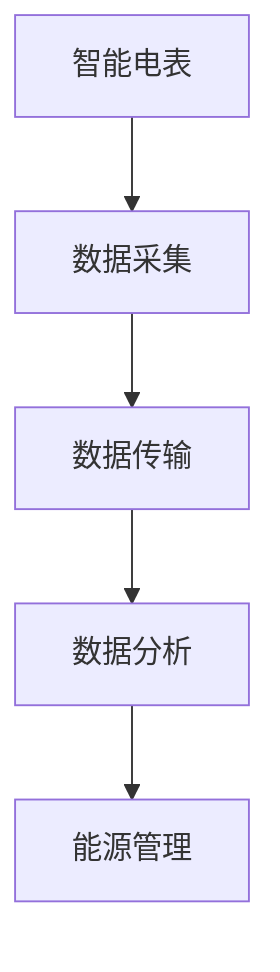
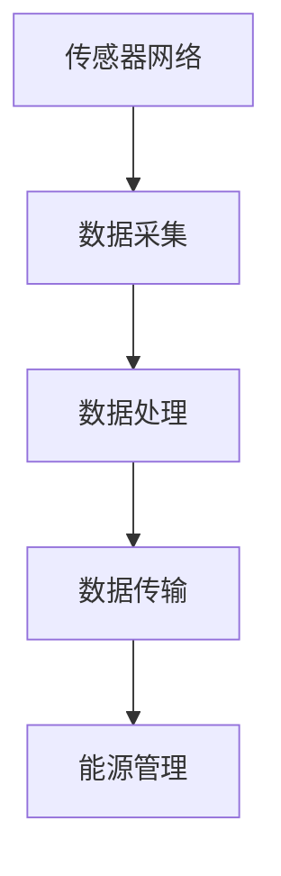
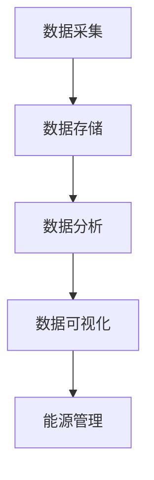
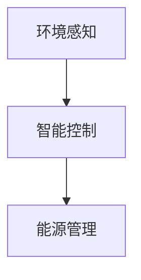
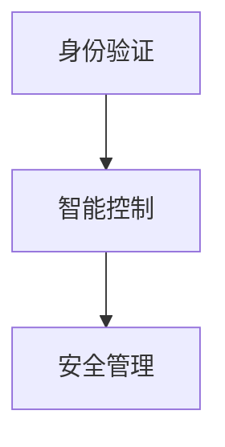
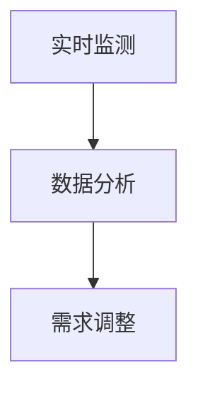
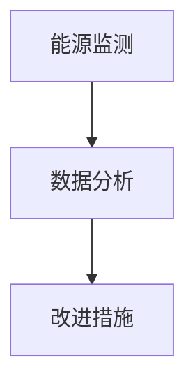
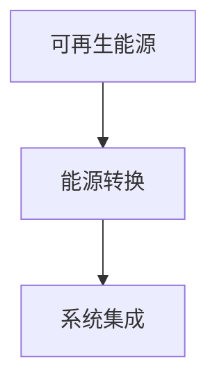

                 

### 第1章 引言

#### 1.1 物联网的概念与历史发展

物联网（Internet of Things，简称IoT）是指通过互联网、传统通信网络等信息载体，将各种信息传感设备与网络相连接，实现信息的采集、传输、处理和智能应用。物联网的概念最早可以追溯到1999年，麻省理工学院的凯文·阿什顿教授首次提出了物联网的概念。然而，物联网的发展历程可以追溯到更早的时期。

##### 1.1.1 物联网的基本概念

物联网的基本概念主要包括以下几个方面：

1. **信息传感设备**：包括各种传感器、智能设备等，用于采集环境中的信息。
2. **网络连接**：通过互联网、移动通信网络、无线传感器网络等实现信息的传输。
3. **数据处理**：通过云计算、大数据等技术对收集到的信息进行处理、分析和存储。
4. **智能应用**：利用处理后的数据实现智能决策、控制和应用。

##### 1.1.2 物联网的发展历程

1. **1990年代**：物联网的概念逐渐形成，相关技术和应用开始出现。
2. **2000年代**：物联网进入快速发展期，各种物联网设备和系统开始广泛应用。
3. **2010年代**：物联网进入智能化时代，大数据、云计算等技术的发展为物联网提供了强大的支持。
4. **2020年代**：物联网应用进一步扩展，从智能家居、智能交通到智慧城市、智慧农业等多个领域。

#### 1.2 智慧校园的概念与特征

智慧校园是指通过信息技术手段，实现对教育教学、校园管理、学生生活等方面的智能化管理和优化。智慧校园的主要特征包括：

1. **信息化**：充分利用信息技术，实现教育教学、校园管理等方面的信息化。
2. **智能化**：通过人工智能、大数据等技术实现校园管理的智能化。
3. **个性化**：根据学生的个性化需求，提供个性化的教学和服务。
4. **协同化**：实现校园内各部门、各系统的协同工作，提高校园运行效率。

#### 1.3 物联网在智慧校园中的重要作用

物联网在智慧校园中的应用非常广泛，主要体现在以下几个方面：

1. **能源管理**：通过物联网技术，实现对校园能源的实时监测和智能控制，提高能源利用效率。
2. **安全监控**：通过物联网技术，实现对校园安全情况的实时监控，提高校园安全水平。
3. **环境监控**：通过物联网技术，实现对校园环境因素的实时监测，为学生提供健康、舒适的学习环境。
4. **教学管理**：通过物联网技术，实现教学过程的智能化管理和优化，提高教学效果。

#### 1.3.1 物联网在能源管理中的应用潜力

物联网在智慧校园能源管理中的应用潜力主要体现在以下几个方面：

1. **提高能源利用效率**：通过物联网技术，实现对校园能源的实时监测和智能控制，可以有效避免能源浪费，提高能源利用效率。
2. **降低能源成本**：通过物联网技术，实现对能源的精细化管理，可以降低能源成本。
3. **实现绿色校园**：通过物联网技术，实现校园能源的清洁、高效利用，有助于实现绿色校园的目标。
4. **提供决策支持**：通过物联网技术，实现对校园能源数据的收集、分析和处理，可以为校园能源管理提供科学的决策支持。

#### 1.3.2 物联网对智慧校园能源管理的提升作用

物联网对智慧校园能源管理的提升作用主要体现在以下几个方面：

1. **实时监测与控制**：通过物联网技术，实现对校园能源的实时监测和智能控制，可以快速响应能源需求，提高能源利用效率。
2. **数据驱动管理**：通过物联网技术，实现对能源数据的收集、分析和处理，可以基于数据驱动进行能源管理，提高管理决策的科学性。
3. **协同工作**：通过物联网技术，实现校园内各部门、各系统的协同工作，提高校园能源管理的整体效率。
4. **智能优化**：通过物联网技术，实现对校园能源的智能优化，可以最大限度地提高能源利用效率，降低能源成本。

### 总结

物联网在智慧校园能源管理中的应用具有重要意义，它不仅可以提高能源利用效率，降低能源成本，还能实现绿色校园的目标。随着物联网技术的不断发展和完善，智慧校园能源管理将更加智能化、高效化，为校园的可持续发展提供有力支持。

### 关键词

- 物联网
- 智慧校园
- 能源管理
- 智能化
- 实时监测
- 数据分析
- 绿色校园

### 摘要

本文介绍了物联网在智慧校园能源管理中的应用，首先阐述了物联网和智慧校园的基本概念及其发展历程，然后分析了物联网在智慧校园能源管理中的应用潜力，以及其对能源管理的提升作用。通过本文的介绍，读者可以全面了解物联网在智慧校园能源管理中的重要性及其未来发展方向。## 第2章 物联网技术基础

### 2.1 物联网体系结构

物联网的体系结构通常被划分为三层：感知层、网络层和应用层。这三层共同构成了物联网的基本框架，并实现了信息的采集、传输和智能应用。

##### 2.1.1 物联网网络层

网络层是物联网体系结构的核心，它负责将感知层采集到的数据传输到应用层。网络层通常包括以下几种技术：

1. **无线传感器网络（WSN）**：无线传感器网络是由大量的传感器节点组成的网络，可以实现对环境信息的实时监测。传感器节点通常包括传感器、处理单元、通信模块和电源。
2. **移动通信网络**：包括3G、4G、5G等移动通信技术，可以提供广泛的网络覆盖和高速的数据传输能力。
3. **互联网**：通过互联网，物联网设备可以访问各种在线服务和资源，实现数据共享和智能应用。

##### 2.1.2 物联网感知层

感知层是物联网体系结构的基础，它负责采集环境信息。感知层通常包括以下几种设备：

1. **传感器**：传感器是物联网系统中的核心设备，用于检测和测量物理量，如温度、湿度、光照强度、气体浓度等。
2. **智能设备**：智能设备是指具备一定计算和处理能力的设备，如智能手机、平板电脑、智能手表等。
3. **执行器**：执行器是物联网系统中的另一个重要设备，用于执行控制命令，如电机、阀门、照明设备等。

##### 2.1.3 物联网应用层

应用层是物联网体系结构的最高层，它负责对采集到的数据进行分析、处理和智能应用。应用层通常包括以下几种功能：

1. **数据处理与存储**：应用层通过云计算、大数据等技术对采集到的数据进行分析、处理和存储，为智能应用提供数据支持。
2. **智能应用**：智能应用包括智能监控、智能控制、智能分析等，通过应用层实现对物联网数据的智能处理和决策支持。
3. **用户界面**：用户界面是用户与物联网系统交互的界面，通过用户界面，用户可以实时监测物联网系统的运行状态，并对系统进行操作和控制。

### 2.2 物联网通信技术

物联网通信技术是实现物联网体系结构中信息传输的关键，包括传统通信技术和物联网专有通信技术。

##### 2.2.1 传统通信技术在物联网中的应用

传统通信技术如移动通信网络、互联网等在物联网中得到了广泛应用。具体应用包括：

1. **移动通信网络**：利用3G、4G、5G等移动通信网络，可以实现远程数据传输和实时通信。
2. **互联网**：通过互联网，物联网设备可以访问各种在线服务和资源，实现数据共享和智能应用。

##### 2.2.2 物联网专有通信技术

物联网专有通信技术是为了满足物联网的特殊需求而开发的，主要包括以下几种：

1. **低功耗广域网（LPWAN）**：LPWAN是一种低功耗、长距离、低成本的数据传输技术，适合于物联网中的大量设备连接。常见的LPWAN技术包括NB-IoT、LoRa、Zigbee等。
2. **无线传感器网络（WSN）通信技术**：WSN通信技术包括Zigbee、Wi-Fi、蓝牙等，主要用于无线传感器网络的数据传输。
3. **物联网安全通信技术**：物联网安全通信技术如TLS、IPsec等，用于保护物联网数据传输的安全。

### 2.3 物联网安全技术

物联网安全是物联网系统稳定运行的关键，随着物联网应用的普及，物联网安全威胁也日益增加。物联网安全技术主要包括以下几个方面：

##### 2.3.1 物联网安全威胁分析

1. **设备安全**：设备安全包括设备被恶意攻击、篡改、损坏等。
2. **数据安全**：数据安全包括数据泄露、篡改、丢失等。
3. **通信安全**：通信安全包括通信被窃听、截获、篡改等。
4. **系统安全**：系统安全包括系统被攻击、入侵、拒绝服务攻击等。

##### 2.3.2 物联网安全防护策略

1. **访问控制**：通过访问控制策略，限制未授权用户对物联网设备的访问。
2. **数据加密**：对传输的数据进行加密，防止数据被窃取或篡改。
3. **网络安全**：通过防火墙、入侵检测系统等网络安全技术，保护物联网系统的安全。
4. **设备安全**：对物联网设备进行安全认证和加密，防止设备被恶意攻击。

### 总结

物联网技术基础是物联网应用的基础，包括物联网体系结构、通信技术和安全技术。通过深入理解物联网技术基础，可以更好地把握物联网的发展趋势和应用方向，为物联网在智慧校园能源管理中的应用提供技术支持。

### 关键词

- 物联网体系结构
- 感知层
- 网络层
- 应用层
- 通信技术
- 低功耗广域网
- 无线传感器网络
- 安全技术

### 摘要

本章介绍了物联网技术基础，包括物联网体系结构、通信技术和安全技术。物联网体系结构由感知层、网络层和应用层组成，实现了信息的采集、传输和智能应用。物联网通信技术包括传统通信技术和物联网专有通信技术，提供了物联网数据传输的多种选择。物联网安全技术则是保障物联网系统安全的关键，包括设备安全、数据安全、通信安全和系统安全。通过本章的介绍，读者可以全面了解物联网技术基础，为后续章节的学习和应用打下坚实基础。## 第3章 智慧校园能源管理现状

### 3.1 智慧校园能源管理的重要性

智慧校园能源管理是指利用信息技术和智能控制技术，实现对校园能源的高效、安全、绿色的管理。智慧校园能源管理的重要性主要体现在以下几个方面：

1. **提高能源利用效率**：通过智能化的能源管理，可以实时监测和调整能源使用情况，避免能源浪费，提高能源利用效率。
2. **降低能源成本**：智慧校园能源管理可以通过精细化的能源管理和优化，降低能源消耗，从而降低校园的能源成本。
3. **促进可持续发展**：智慧校园能源管理强调能源的清洁、高效利用，有助于实现校园的可持续发展目标。
4. **提升校园管理水平**：智慧校园能源管理能够提高校园的管理水平和效率，为校园的可持续发展提供保障。

### 3.2 当前智慧校园能源管理存在的问题

尽管智慧校园能源管理具有重要的意义，但目前智慧校园能源管理仍存在一些问题，主要包括：

1. **能源监测不准确**：由于传感器精度、数据传输等问题，当前智慧校园能源监测的数据准确性有待提高。
2. **能源管理效率低**：智慧校园能源管理系统的集成度和自动化程度较低，导致能源管理效率不高。
3. **能源数据利用率低**：当前智慧校园能源管理系统中，能源数据的收集、分析和利用还不够充分，未能充分发挥数据驱动的优势。
4. **能源管理系统复杂**：智慧校园能源管理系统通常涉及多个部门、多个系统，系统复杂度较高，给管理带来了一定困难。
5. **能源安全风险**：由于物联网设备的安全性较差，智慧校园能源管理系统面临着潜在的安全风险。

### 3.3 物联网在智慧校园能源管理中的应用现状

物联网技术在智慧校园能源管理中的应用取得了显著成果，主要体现在以下几个方面：

1. **智能电表和传感器**：物联网技术使得校园能源监测更加精确，通过智能电表和各类传感器，可以实时监测校园的电力、水力、燃气等能源使用情况。
2. **智能控制系统**：物联网技术实现了对校园能源设备的智能控制，例如智能照明系统、智能空调系统等，可以根据实际需求自动调整设备状态，提高能源利用效率。
3. **能源管理系统**：物联网技术将校园内的各种能源设备和系统进行集成，形成统一的能源管理系统，实现了能源的集中监控和智能管理。
4. **能源数据分析**：物联网技术使得能源数据的收集、存储和分析更加高效，通过大数据分析，可以为校园能源管理提供科学的数据支持和决策依据。
5. **能源需求响应**：物联网技术实现了对校园能源需求的实时监测和响应，通过智能调度和优化，可以有效应对能源需求波动，提高能源利用效率。

### 总结

智慧校园能源管理在提高能源利用效率、降低能源成本、促进可持续发展等方面具有重要意义。然而，当前智慧校园能源管理仍存在一些问题，如能源监测不准确、能源管理效率低等。物联网技术在智慧校园能源管理中的应用为解决这些问题提供了有效途径。通过进一步推广和应用物联网技术，智慧校园能源管理将更加智能化、高效化，为校园的可持续发展提供有力支持。

### 关键词

- 智慧校园能源管理
- 能源利用效率
- 智能电表
- 智能控制系统
- 能源管理系统
- 能源数据分析
- 能源需求响应

### 摘要

本章分析了智慧校园能源管理的重要性以及当前存在的问题。智慧校园能源管理通过物联网技术实现了能源监测的精准化、能源管理的智能化和能源数据的利用效率化，从而提高了能源利用效率、降低了能源成本、促进了可持续发展。然而，当前的智慧校园能源管理仍存在一些问题，如能源监测不准确、能源管理效率低等。通过进一步推广和应用物联网技术，智慧校园能源管理将更加智能化、高效化，为校园的可持续发展提供有力支持。## 第4章 物联网技术在智慧校园能源管理中的应用

### 4.1 物联网技术在校园能源监测中的应用

物联网技术在校园能源监测中的应用主要包括智能电表、传感器网络和大数据分析等方面。

#### 4.1.1 智能电表

智能电表是物联网技术在校园能源管理中的一项重要应用。与传统电表相比，智能电表能够实时监测并记录电力使用情况，包括电压、电流、功率、用电量等数据。通过智能电表，校园管理人员可以实时了解每个用电点的能源消耗情况，从而进行有效的能源管理。

**核心概念与联系**

智能电表作为物联网技术在能源监测中的应用，其核心概念包括：

- **实时监测**：智能电表能够实时采集电力使用数据。
- **远程通信**：智能电表可以通过无线通信技术将数据传输到集中管理平台。
- **数据分析**：通过分析智能电表采集的数据，可以找出能源浪费的环节。

**Mermaid流程图**



**核心算法原理讲解**

智能电表的核心算法通常包括以下步骤：

1. **数据采集**：通过内置的传感器，智能电表能够实时采集电压、电流等电力使用数据。
2. **数据处理**：采集到的数据经过处理，转换为标准格式，并存储在本地数据库中。
3. **数据传输**：通过无线通信技术，如Wi-Fi、Zigbee等，将处理后的数据传输到集中管理平台。
4. **数据分析**：集中管理平台对传输的数据进行实时分析和处理，生成能源使用报告。

**伪代码示例**

```python
# 数据采集
def collect_data():
    voltage = read_voltage_sensor()
    current = read_current_sensor()
    power = voltage * current
    return power

# 数据处理
def process_data(data):
    processed_data = data * 0.9  # 假设处理过程为乘以0.9
    return processed_data

# 数据传输
def transmit_data(data):
    send_to_management_platform(data)

# 数据分析
def analyze_data(data):
    total_power = sum(data)
    average_power = total_power / len(data)
    return average_power
```

**数学模型和公式**

智能电表的数据分析可以基于以下数学模型：

$$
P_t = \frac{1}{n} \sum_{i=1}^{n} P_i
$$

其中，$P_t$ 表示总功率，$n$ 表示数据点的个数，$P_i$ 表示第 $i$ 个数据点的功率。

**举例说明**

假设我们采集了10个时间点的功率数据，如下表所示：

| 时间点 | 功率 (W) |
| :----: | :------: |
|   1    |   200    |
|   2    |   220    |
|   3    |   250    |
|   ...  |   ...    |
|  10    |   180    |

通过上述数学模型，可以计算出这10个时间点的平均功率：

$$
P_t = \frac{1}{10} (200 + 220 + 250 + ... + 180) = 210.0 \text{W}
$$

**项目实战**

在实施智能电表项目时，需要考虑以下步骤：

1. **硬件选择**：选择合适的智能电表硬件，包括传感器、处理单元和通信模块。
2. **软件开发**：开发数据采集、处理和传输的软件，包括数据采集程序、数据处理算法和通信协议。
3. **系统集成**：将智能电表集成到校园能源管理系统中，实现数据实时监测和远程管理。
4. **部署测试**：在实际环境中部署智能电表，进行测试和调试，确保系统能够稳定运行。

### 4.1.2 传感器网络

传感器网络是物联网技术在校园能源管理中的另一个重要应用。通过部署各种传感器，可以实时监测校园内不同区域的能源使用情况，包括电力、水力、燃气等。

**核心概念与联系**

传感器网络的核心概念包括：

- **多传感器融合**：通过将多个传感器融合，可以更准确地监测环境参数。
- **自组织网络**：传感器网络通常采用自组织的方式，无需预先布置网络基础设施。
- **数据采集与传输**：传感器网络负责采集环境数据，并通过无线通信技术传输到集中管理平台。

**Mermaid流程图**



**核心算法原理讲解**

传感器网络的核心算法通常包括以下步骤：

1. **数据采集**：传感器网络中的传感器负责采集环境数据，如温度、湿度、光照强度等。
2. **数据处理**：传感器网络中的数据处理单元对采集到的数据进行分析和处理，去除噪声，提高数据质量。
3. **数据传输**：通过无线通信技术，如Zigbee、LoRa等，将处理后的数据传输到集中管理平台。
4. **数据分析**：集中管理平台对传输的数据进行实时分析和处理，生成能源使用报告。

**伪代码示例**

```python
# 数据采集
def collect_data(sensor_data):
    temperature = sensor_data['temperature']
    humidity = sensor_data['humidity']
    return temperature, humidity

# 数据处理
def process_data(data):
    filtered_data = filter_noise(data)
    return filtered_data

# 数据传输
def transmit_data(data):
    send_to_management_platform(data)

# 数据分析
def analyze_data(data):
    average_temp = sum(data['temperature']) / len(data['temperature'])
    average_humidity = sum(data['humidity']) / len(data['humidity'])
    return average_temp, average_humidity
```

**数学模型和公式**

传感器网络的数据分析可以基于以下数学模型：

$$
x_t = \frac{1}{n} \sum_{i=1}^{n} x_i
$$

其中，$x_t$ 表示第 $t$ 个时间点的数据值，$n$ 表示数据点的个数，$x_i$ 表示第 $i$ 个数据点的值。

**举例说明**

假设我们采集了10个时间点的温度和湿度数据，如下表所示：

| 时间点 | 温度 (°C) | 湿度 (%) |
| :----: | :-------: | :------: |
|   1    |   25.0    |   60.0   |
|   2    |   24.5    |   58.0   |
|   3    |   25.2    |   61.0   |
|   ...  |   ...     |   ...    |
|  10    |   24.8    |   59.0   |

通过上述数学模型，可以计算出这10个时间点的平均温度和平均湿度：

$$
\text{平均温度} = \frac{1}{10} (25.0 + 24.5 + 25.2 + ... + 24.8) = 25.0 \text{°C}
$$

$$
\text{平均湿度} = \frac{1}{10} (60.0 + 58.0 + 61.0 + ... + 59.0) = 60.0 \text{°C}
$$

**项目实战**

在实施传感器网络项目时，需要考虑以下步骤：

1. **硬件选择**：选择合适的传感器硬件，包括各种类型的传感器。
2. **网络规划**：根据校园布局，规划传感器网络的部署位置和拓扑结构。
3. **软件开发**：开发传感器数据处理和传输的软件，包括数据采集程序、数据处理算法和通信协议。
4. **系统集成**：将传感器网络集成到校园能源管理系统中，实现数据的实时监测和远程管理。
5. **部署测试**：在实际环境中部署传感器网络，进行测试和调试，确保系统能够稳定运行。

### 4.1.3 大数据分析

大数据分析是物联网技术在校园能源管理中的高级应用，通过对收集到的海量能源数据进行分析，可以为校园能源管理提供科学的决策支持和优化建议。

**核心概念与联系**

大数据分析的核心概念包括：

- **数据采集**：收集校园内的各种能源数据。
- **数据存储**：存储大量的能源数据，以便进行进一步分析。
- **数据分析**：利用大数据技术对能源数据进行分析，提取有用的信息。
- **数据可视化**：将分析结果以图形化方式展示，帮助管理人员直观理解数据。

**Mermaid流程图**



**核心算法原理讲解**

大数据分析的核心算法通常包括以下步骤：

1. **数据采集**：通过智能电表、传感器网络等设备，采集校园内的能源数据。
2. **数据清洗**：对采集到的数据进行处理，去除噪声和异常值，确保数据质量。
3. **数据存储**：将清洗后的数据存储在数据库中，以便进行进一步分析。
4. **数据分析**：利用大数据技术，如数据挖掘、机器学习等，对能源数据进行深入分析。
5. **数据可视化**：将分析结果以图形化方式展示，帮助管理人员直观理解数据。

**伪代码示例**

```python
# 数据采集
def collect_data():
    data = read_sensor_data()
    return data

# 数据清洗
def clean_data(data):
    cleaned_data = remove_noise(data)
    return cleaned_data

# 数据存储
def store_data(data):
    save_to_database(data)

# 数据分析
def analyze_data(data):
    result = perform_data_mining(data)
    return result

# 数据可视化
def visualize_data(result):
    plot_result(result)
```

**数学模型和公式**

大数据分析可以基于以下数学模型和公式：

- **回归分析**：用于预测能源消耗趋势。

$$
y = \beta_0 + \beta_1 x
$$

其中，$y$ 表示能源消耗，$x$ 表示影响因素，$\beta_0$ 和 $\beta_1$ 是回归系数。

- **聚类分析**：用于识别能源消耗的群体特征。

$$
\min_{c} \sum_{i=1}^{n} d(x_i, c)
$$

其中，$c$ 表示聚类中心，$d(x_i, c)$ 表示样本 $x_i$ 到聚类中心 $c$ 的距离。

**举例说明**

假设我们收集了某校园一周的电力数据，如下表所示：

| 时间点 | 电力消耗 (kWh) |
| :----: | :------------: |
|   1    |       100.0    |
|   2    |       110.0    |
|   3    |       120.0    |
|   ...  |       ...      |
|  7    |       90.0     |

通过回归分析，可以建立电力消耗与时间的关系模型：

$$
y = \beta_0 + \beta_1 x
$$

其中，$y$ 表示电力消耗，$x$ 表示时间点。

通过训练数据，可以计算出回归系数 $\beta_0$ 和 $\beta_1$：

$$
\beta_0 = 80.0
$$

$$
\beta_1 = 2.0
$$

从而可以预测未来某个时间点的电力消耗：

$$
y = 80.0 + 2.0 \times x
$$

假设我们预测未来某个时间点的电力消耗为 $y = 110.0$，则可以通过反推计算时间点：

$$
x = \frac{y - \beta_0}{\beta_1} = \frac{110.0 - 80.0}{2.0} = 15.0
$$

这意味着在未来15天后，校园的电力消耗将达到110.0 kWh。

**项目实战**

在实施大数据分析项目时，需要考虑以下步骤：

1. **数据采集**：通过智能电表、传感器网络等设备，收集校园内的能源数据。
2. **数据存储**：选择合适的数据库系统，存储大量的能源数据。
3. **数据处理**：使用数据处理工具，如Python、R等，对能源数据进行清洗、转换和分析。
4. **数据分析**：利用大数据技术，如数据挖掘、机器学习等，对能源数据进行深入分析。
5. **数据可视化**：使用数据可视化工具，如Tableau、Matplotlib等，将分析结果以图形化方式展示。
6. **系统集成**：将大数据分析结果集成到校园能源管理系统中，为管理人员提供科学的决策支持。

### 4.2 物联网技术在校园能源控制中的应用

物联网技术在校园能源控制中的应用主要包括智能照明系统、智能空调系统和智能门禁系统等。

#### 4.2.1 智能照明系统

智能照明系统是物联网技术在校园能源管理中的重要应用，通过智能控制技术，可以实现对照明设备的自动调节，提高照明效率，减少能源浪费。

**核心概念与联系**

智能照明系统的核心概念包括：

- **环境感知**：通过传感器，实时感知环境光照强度。
- **智能控制**：根据环境光照强度，自动调整照明设备的状态。
- **能源管理**：通过智能控制，实现照明设备的合理使用，减少能源浪费。

**Mermaid流程图**



**核心算法原理讲解**

智能照明系统的核心算法通常包括以下步骤：

1. **环境感知**：通过传感器，实时感知环境光照强度。
2. **阈值设定**：设定环境光照强度的阈值，当光照强度低于阈值时，启动照明设备。
3. **智能控制**：根据环境光照强度和阈值，自动调整照明设备的状态。
4. **能源管理**：通过智能控制，实现照明设备的合理使用，减少能源浪费。

**伪代码示例**

```python
# 环境感知
def sense_environment():
    light_intensity = read_light_sensor()
    return light_intensity

# 阈值设定
def set_threshold(light_intensity):
    if light_intensity < 100:
        threshold = 100
    else:
        threshold = light_intensity
    return threshold

# 智能控制
def control_lighting(threshold):
    if light_intensity < threshold:
        turn_on_lights()
    else:
        turn_off_lights()

# 能源管理
def energy_management():
    total_energy = calculate_energy_consumption()
    if total_energy > 1000:
        reduce_lighting()
    else:
        increase_lighting()
```

**数学模型和公式**

智能照明系统的能源管理可以基于以下数学模型：

$$
E_t = P_t \times t
$$

其中，$E_t$ 表示总能耗，$P_t$ 表示平均功率，$t$ 表示时间。

**举例说明**

假设智能照明系统的平均功率为50W，运行时间为2小时，则总能耗为：

$$
E_t = 50W \times 2h = 100Wh
$$

如果总能耗超过1000Wh，则系统会采取节能措施，如降低照明强度。

**项目实战**

在实施智能照明系统项目时，需要考虑以下步骤：

1. **硬件选择**：选择合适的传感器和照明设备。
2. **软件开发**：开发智能照明控制软件，实现环境感知、智能控制和能源管理功能。
3. **系统集成**：将智能照明系统集成到校园能源管理系统中，实现数据的实时监测和远程管理。
4. **部署测试**：在实际环境中部署智能照明系统，进行测试和调试，确保系统能够稳定运行。

#### 4.2.2 智能空调系统

智能空调系统是物联网技术在校园能源管理中的另一个重要应用，通过智能控制技术，可以实现对空调设备的自动调节，提高空调效率，减少能源浪费。

**核心概念与联系**

智能空调系统的核心概念包括：

- **环境感知**：通过传感器，实时感知室内温度、湿度等环境参数。
- **智能控制**：根据环境参数，自动调整空调设备的状态。
- **能源管理**：通过智能控制，实现空调设备的合理使用，减少能源浪费。

**Mermaid流程图**


**核心算法原理讲解**

智能空调系统的核心算法通常包括以下步骤：

1. **环境感知**：通过传感器，实时感知室内温度、湿度等环境参数。
2. **阈值设定**：设定室内温度、湿度的阈值，当环境参数超过阈值时，启动空调设备。
3. **智能控制**：根据环境参数和阈值，自动调整空调设备的状态。
4. **能源管理**：通过智能控制，实现空调设备的合理使用，减少能源浪费。

**伪代码示例**

```python
# 环境感知
def sense_environment():
    temperature = read_thermometer()
    humidity = read_humidity_sensor()
    return temperature, humidity

# 阈值设定
def set_thresholds(temperature, humidity):
    if temperature > 30 or humidity > 60:
        threshold_temp = 30
        threshold_humidity = 60
    else:
        threshold_temp = temperature
        threshold_humidity = humidity
    return threshold_temp, threshold_humidity

# 智能控制
def control_ac(threshold_temp, threshold_humidity):
    if temperature > threshold_temp or humidity > threshold_humidity:
        turn_on_ac()
    else:
        turn_off_ac()

# 能源管理
def energy_management():
    total_energy = calculate_ac_consumption()
    if total_energy > 2000:
        optimize_ac()
    else:
        maintain_ac()
```

**数学模型和公式**

智能空调系统的能源管理可以基于以下数学模型：

$$
E_t = P_t \times t
$$

其中，$E_t$ 表示总能耗，$P_t$ 表示平均功率，$t$ 表示时间。

**举例说明**

假设智能空调系统的平均功率为1000W，运行时间为2小时，则总能耗为：

$$
E_t = 1000W \times 2h = 2000Wh
$$

如果总能耗超过2000Wh，则系统会采取节能措施，如优化空调运行模式。

**项目实战**

在实施智能空调系统项目时，需要考虑以下步骤：

1. **硬件选择**：选择合适的传感器和空调设备。
2. **软件开发**：开发智能空调控制软件，实现环境感知、智能控制和能源管理功能。
3. **系统集成**：将智能空调系统集成到校园能源管理系统中，实现数据的实时监测和远程管理。
4. **部署测试**：在实际环境中部署智能空调系统，进行测试和调试，确保系统能够稳定运行。

#### 4.2.3 智能门禁系统

智能门禁系统是物联网技术在校园安全和管理中的重要应用，通过智能控制技术，可以实现对门禁设备的自动控制，提高校园安全性。

**核心概念与联系**

智能门禁系统的核心概念包括：

- **身份验证**：通过生物识别、刷卡、手机APP等手段进行身份验证。
- **智能控制**：根据身份验证结果，自动控制门禁设备的状态。
- **安全管理**：通过智能控制，实现校园安全的管理。

**Mermaid流程图**



**核心算法原理讲解**

智能门禁系统的核心算法通常包括以下步骤：

1. **身份验证**：通过生物识别、刷卡、手机APP等手段进行身份验证。
2. **权限判断**：根据身份验证结果，判断用户是否具备开门权限。
3. **智能控制**：根据权限判断结果，自动控制门禁设备的状态。
4. **安全管理**：通过智能控制，实现校园安全的管理。

**伪代码示例**

```python
# 身份验证
def authenticate_user():
    user_id = get_user_id()
    return user_id

# 权限判断
def check_permission(user_id):
    if user_id in authorized_users:
        permission = "granted"
    else:
        permission = "denied"
    return permission

# 智能控制
def control_access(permission):
    if permission == "granted":
        open_door()
    else:
        close_door()

# 安全管理
def security_management():
    access_log = record_access()
    if access_log['status'] == "unauthorized":
        alert_security()
    else:
        confirm_security()
```

**数学模型和公式**

智能门禁系统的安全管理可以基于以下数学模型：

$$
S_t = P_t \times t
$$

其中，$S_t$ 表示安全状态，$P_t$ 表示安全概率，$t$ 表示时间。

**举例说明**

假设智能门禁系统的安全概率为0.95，运行时间为2小时，则总安全状态为：

$$
S_t = 0.95 \times 2h = 1.9h
$$

如果总安全状态超过1.9小时，则系统会采取安全措施，如加强巡逻或增加监控设备。

**项目实战**

在实施智能门禁系统项目时，需要考虑以下步骤：

1. **硬件选择**：选择合适的门禁设备、传感器和生物识别设备。
2. **软件开发**：开发智能门禁控制软件，实现身份验证、智能控制和安全管理功能。
3. **系统集成**：将智能门禁系统集成到校园安全系统中，实现数据的实时监测和远程管理。
4. **部署测试**：在实际环境中部署智能门禁系统，进行测试和调试，确保系统能够稳定运行。

### 4.3 物联网技术在校园能源优化中的应用

物联网技术在校园能源优化中的应用主要包括能源需求响应、能源效率评估和绿色能源利用等方面。

#### 4.3.1 能源需求响应

能源需求响应是指通过实时监测和分析校园能源使用情况，根据能源需求的变化，动态调整能源供应和需求，以实现能源的合理利用。

**核心概念与联系**

能源需求响应的核心概念包括：

- **实时监测**：通过传感器和智能电表等设备，实时监测校园能源使用情况。
- **数据分析**：利用大数据分析技术，分析能源使用数据，预测能源需求变化。
- **需求调整**：根据能源需求预测，动态调整能源供应和需求，以实现能源的合理利用。

**Mermaid流程图**



**核心算法原理讲解**

能源需求响应的核心算法通常包括以下步骤：

1. **实时监测**：通过传感器和智能电表等设备，实时监测校园能源使用情况。
2. **数据分析**：利用大数据分析技术，分析能源使用数据，预测能源需求变化。
3. **需求调整**：根据能源需求预测，动态调整能源供应和需求，以实现能源的合理利用。

**伪代码示例**

```python
# 实时监测
def monitor_energy_usage():
    current_usage = read_energy_usage()
    return current_usage

# 数据分析
def analyze_usage_data(usage_data):
    trend = predict_usage_trend(usage_data)
    return trend

# 需求调整
def adjust_energy_demand(trend):
    if trend == "increasing":
        increase_supply()
    elif trend == "decreasing":
        decrease_supply()
    else:
        maintain_supply()
```

**数学模型和公式**

能源需求响应可以基于以下数学模型：

$$
D_t = f(U_t)
$$

其中，$D_t$ 表示能源需求，$U_t$ 表示当前能源使用情况，$f$ 是能源需求预测函数。

**举例说明**

假设我们监测到当前的能源使用量为1000 kWh，通过数据分析预测未来能源需求将增加20%，则可以调整能源供应：

$$
D_t = 1000 kWh + 0.2 \times 1000 kWh = 1200 kWh
$$

**项目实战**

在实施能源需求响应项目时，需要考虑以下步骤：

1. **硬件选择**：选择合适的传感器和智能电表等设备。
2. **软件开发**：开发能源监测和分析软件，实现实时监测和数据分析功能。
3. **系统集成**：将能源需求响应系统集成到校园能源管理系统中，实现数据的实时监测和远程管理。
4. **部署测试**：在实际环境中部署能源需求响应系统，进行测试和调试，确保系统能够稳定运行。

#### 4.3.2 能源效率评估

能源效率评估是指通过对校园能源使用情况进行评估，找出能源浪费的环节，并提出改进措施，以提高能源利用效率。

**核心概念与联系**

能源效率评估的核心概念包括：

- **能源监测**：通过传感器和智能电表等设备，实时监测校园能源使用情况。
- **数据分析**：利用大数据分析技术，分析能源使用数据，找出能源浪费的环节。
- **改进措施**：根据数据分析结果，提出改进措施，提高能源利用效率。

**Mermaid流程图**



**核心算法原理讲解**

能源效率评估的核心算法通常包括以下步骤：

1. **能源监测**：通过传感器和智能电表等设备，实时监测校园能源使用情况。
2. **数据分析**：利用大数据分析技术，分析能源使用数据，找出能源浪费的环节。
3. **改进措施**：根据数据分析结果，提出改进措施，提高能源利用效率。

**伪代码示例**

```python
# 能源监测
def monitor_energy_usage():
    current_usage = read_energy_usage()
    return current_usage

# 数据分析
def analyze_usage_data(usage_data):
    waste_points = identify_waste_points(usage_data)
    return waste_points

# 改进措施
def improve_energy_efficiency(waste_points):
    for point in waste_points:
        optimize_usage(point)
```

**数学模型和公式**

能源效率评估可以基于以下数学模型：

$$
\eta = \frac{E_{\text{有用}}}{E_{\text{总}}}
$$

其中，$\eta$ 表示能源效率，$E_{\text{有用}}$ 表示有用能源，$E_{\text{总}}$ 表示总能源。

**举例说明**

假设我们监测到校园的总能源消耗为10000 kWh，其中有用能源为8000 kWh，则能源效率为：

$$
\eta = \frac{8000 kWh}{10000 kWh} = 0.8
$$

如果能源效率低于0.8，则需要采取改进措施，提高能源利用效率。

**项目实战**

在实施能源效率评估项目时，需要考虑以下步骤：

1. **硬件选择**：选择合适的传感器和智能电表等设备。
2. **软件开发**：开发能源监测和分析软件，实现实时监测和数据分析功能。
3. **系统集成**：将能源效率评估系统集成到校园能源管理系统中，实现数据的实时监测和远程管理。
4. **部署测试**：在实际环境中部署能源效率评估系统，进行测试和调试，确保系统能够稳定运行。

#### 4.3.3 绿色能源利用

绿色能源利用是指通过利用可再生能源，如太阳能、风能等，降低校园能源消耗，实现校园的绿色可持续发展。

**核心概念与联系**

绿色能源利用的核心概念包括：

- **可再生能源**：利用太阳能、风能等可再生能源，减少对化石燃料的依赖。
- **能源转换**：通过能源转换设备，将可再生能源转化为可用的能源形式。
- **系统集成**：将绿色能源系统集成到校园能源管理系统中，实现能源的合理利用。

**Mermaid流程图**



**核心算法原理讲解**

绿色能源利用的核心算法通常包括以下步骤：

1. **可再生能源采集**：通过太阳能板、风力发电机等设备，采集可再生能源。
2. **能源转换**：通过能源转换设备，将采集到的可再生能源转换为可用的能源形式，如电能。
3. **系统集成**：将绿色能源系统集成到校园能源管理系统中，实现能源的合理利用。

**伪代码示例**

```python
# 可再生能源采集
def collect_renewable_energy():
    solar_energy = read_solar_panel_energy()
    wind_energy = read_wind_turbine_energy()
    return solar_energy, wind_energy

# 能源转换
def convert_energy(energy_type):
    if energy_type == "solar":
        converted_energy = solar_to_electric_energy(solar_energy)
    elif energy_type == "wind":
        converted_energy = wind_to_electric_energy(wind_energy)
    return converted_energy

# 系统集成
def integrate_energy_system(converted_energy):
    add_to_energy_supply(converted_energy)
```

**数学模型和公式**

绿色能源利用可以基于以下数学模型：

$$
E_{\text{可再生能源}} = P_{\text{可再生能源}} \times t
$$

其中，$E_{\text{可再生能源}}$ 表示可再生能源产生的能源量，$P_{\text{可再生能源}}$ 表示可再生能源的功率，$t$ 表示时间。

**举例说明**

假设我们使用太阳能板，功率为1000 W，运行时间为2小时，则产生的太阳能为：

$$
E_{\text{太阳能}} = 1000 W \times 2h = 2000Wh
$$

**项目实战**

在实施绿色能源利用项目时，需要考虑以下步骤：

1. **硬件选择**：选择合适的可再生能源采集设备和能源转换设备。
2. **软件开发**：开发可再生能源采集和转换的软件，实现数据的实时监测和远程管理。
3. **系统集成**：将绿色能源系统集成到校园能源管理系统中，实现能源的合理利用。
4. **部署测试**：在实际环境中部署绿色能源系统，进行测试和调试，确保系统能够稳定运行。

### 总结

物联网技术在智慧校园能源管理中的应用涵盖了能源监测、能源控制、能源优化和绿色能源利用等多个方面。通过智能电表、传感器网络、大数据分析等技术，智慧校园能源管理实现了能源监测的精准化、能源控制的智能化和能源优化的科学化，为校园的可持续发展提供了有力支持。随着物联网技术的不断发展和完善，智慧校园能源管理将更加高效、智能，为校园的可持续发展贡献更大力量。

### 关键词

- 物联网技术
- 智能电表
- 传感器网络
- 大数据分析
- 智能控制
- 能源优化
- 绿色能源利用

### 摘要

本章详细介绍了物联网技术在智慧校园能源管理中的应用，包括能源监测、能源控制、能源优化和绿色能源利用等方面。通过智能电表、传感器网络、大数据分析等技术，智慧校园能源管理实现了能源监测的精准化、能源控制的智能化和能源优化的科学化，为校园的可持续发展提供了有力支持。本章还通过具体的算法原理讲解、伪代码示例、数学模型和公式，以及项目实战，阐述了物联网技术在智慧校园能源管理中的实际应用方法和效果。## 第5章 物联网在智慧校园能源管理中的挑战与解决方案

### 5.1 技术挑战与解决方案

物联网在智慧校园能源管理中的应用面临着一系列技术挑战，主要包括数据传输效率、数据处理能力、系统安全性和设备兼容性等方面。

#### 5.1.1 数据传输效率

物联网设备通常需要将大量的数据传输到集中管理平台，数据传输效率成为了一个重要的技术挑战。为了提高数据传输效率，可以采取以下解决方案：

- **优化通信协议**：选择高效的数据传输协议，如MQTT、CoAP等，以减少数据传输的延迟和带宽消耗。
- **数据压缩**：对传输的数据进行压缩，减少数据大小，提高传输效率。
- **分片传输**：将大量数据分成小块进行传输，以提高传输的可靠性。

#### 5.1.2 数据处理能力

智慧校园能源管理需要处理和分析大量的实时数据，数据处理能力成为一个关键的技术挑战。为了提高数据处理能力，可以采取以下解决方案：

- **分布式计算**：利用分布式计算框架，如Hadoop、Spark等，对海量数据进行分析和处理。
- **实时数据处理**：采用实时数据处理技术，如流处理框架，对实时数据进行分析和处理。
- **云计算**：利用云计算平台，提供强大的数据处理能力，满足海量数据的处理需求。

#### 5.1.3 系统安全性

物联网设备通常面临潜在的安全威胁，如数据泄露、设备被篡改等，系统安全性成为一个重要的技术挑战。为了提高系统安全性，可以采取以下解决方案：

- **加密传输**：对传输的数据进行加密，确保数据在传输过程中的安全性。
- **访问控制**：实施严格的访问控制策略，限制未授权用户对物联网设备的访问。
- **设备安全认证**：对物联网设备进行安全认证，确保设备在接入网络时的安全性。

#### 5.1.4 设备兼容性

智慧校园能源管理通常涉及多种物联网设备，设备兼容性成为一个重要的技术挑战。为了提高设备兼容性，可以采取以下解决方案：

- **标准化接口**：采用标准化的接口协议，如RESTful API，确保不同设备之间的兼容性。
- **设备兼容性测试**：对物联网设备进行兼容性测试，确保设备在系统中的稳定运行。
- **模块化设计**：采用模块化设计，将不同的功能模块进行分离，以提高系统的灵活性和兼容性。

### 5.2 安全与隐私挑战

物联网在智慧校园能源管理中的应用不仅面临着技术挑战，还面临着安全与隐私挑战。这些挑战主要包括数据隐私保护、设备安全性、网络安全性等方面。

#### 5.2.1 数据隐私保护

智慧校园能源管理涉及大量的学生和教职工个人信息，数据隐私保护成为一个重要的安全挑战。为了保护数据隐私，可以采取以下解决方案：

- **数据加密**：对存储和传输的数据进行加密，确保数据的安全性。
- **隐私保护算法**：采用隐私保护算法，如差分隐私、匿名化等，保护用户隐私。
- **访问控制**：实施严格的访问控制策略，限制未授权用户对敏感数据的访问。

#### 5.2.2 设备安全性

物联网设备通常面临设备被恶意攻击、篡改等安全风险。为了提高设备安全性，可以采取以下解决方案：

- **安全认证**：对物联网设备进行安全认证，确保设备在接入网络时的安全性。
- **设备安全更新**：定期对物联网设备进行安全更新，修复已知的安全漏洞。
- **安全审计**：对物联网设备进行安全审计，识别和修复潜在的安全风险。

#### 5.2.3 网络安全性

物联网系统通常依赖于网络进行数据传输，网络安全性成为一个重要的安全挑战。为了提高网络安全性，可以采取以下解决方案：

- **防火墙**：部署防火墙，防止恶意攻击和网络入侵。
- **入侵检测系统**：部署入侵检测系统，实时监控网络流量，发现和阻止恶意攻击。
- **安全通信协议**：采用安全的通信协议，如TLS、IPsec等，确保数据传输的安全性。

### 5.3 成本与效益分析

物联网在智慧校园能源管理中的应用虽然具有显著的技术优势，但同时也面临着成本和效益的问题。成本主要包括设备成本、维护成本和运营成本等，效益则包括能源节约、管理效率提升等。

#### 5.3.1 成本分析

- **设备成本**：包括传感器、智能电表、智能设备等硬件的成本，以及软件开发和系统集成等费用。
- **维护成本**：包括设备维护、系统升级和安全防护等费用。
- **运营成本**：包括人员培训、运行费用和日常维护等费用。

#### 5.3.2 效益分析

- **能源节约**：通过智能监测和控制，可以显著降低能源消耗，实现能源节约。
- **管理效率提升**：通过物联网技术，可以实现能源管理的自动化和智能化，提高管理效率。
- **投资回报**：通过降低能源成本和管理成本，提高能源利用效率，可以实现投资回报。

### 总结

物联网在智慧校园能源管理中的应用面临着技术挑战、安全与隐私挑战以及成本与效益分析等问题。通过采取相应的解决方案，可以有效地应对这些挑战，实现智慧校园能源管理的智能化、高效化和可持续发展。随着物联网技术的不断发展和完善，智慧校园能源管理将更加成熟，为校园的可持续发展提供更强有力的支持。

### 关键词

- 物联网技术
- 智慧校园
- 能源管理
- 安全性
- 隐私保护
- 成本效益
- 挑战与解决方案

### 摘要

本章分析了物联网在智慧校园能源管理中面临的挑战，包括技术挑战、安全与隐私挑战以及成本与效益分析。针对这些挑战，提出了相应的解决方案，如优化数据传输效率、提升数据处理能力、增强系统安全性、保护数据隐私等。同时，分析了物联网在智慧校园能源管理中的成本和效益，为物联网技术的进一步应用提供了参考。通过本章的分析，读者可以全面了解物联网在智慧校园能源管理中的挑战与解决方案，为智慧校园能源管理的发展提供指导。## 第6章 物联网在智慧校园能源管理中的应用案例

### 6.1 案例一：某高校智能能源管理系统

某高校为了提升能源管理效率，降低能源成本，决定实施一套智能能源管理系统。该系统利用物联网技术，实现了对校园内电力、水力、燃气等多种能源的实时监测和智能控制。

**项目背景**

- **能源消耗大**：该校能源消耗量大，包括教学楼、宿舍、实验室等各个区域。
- **能源管理效率低**：传统的能源管理方式效率低下，能源浪费严重。
- **环保需求**：为了实现绿色校园的目标，需要提高能源利用效率。

**项目目标**

- **实时监测**：实现对各种能源的实时监测，掌握能源使用情况。
- **智能控制**：通过智能控制，优化能源使用，降低能源浪费。
- **数据驱动管理**：利用大数据技术，对能源数据进行深度分析，为管理决策提供支持。

**项目实施**

1. **硬件部署**：在校园内布置智能电表、传感器等设备，实现对电力、水力、燃气等能源的实时监测。
2. **软件平台开发**：开发智能能源管理系统平台，实现数据的实时采集、传输和分析。
3. **系统集成**：将智能能源管理系统与校园其他管理系统（如安防系统、照明系统等）进行集成，实现能源管理的协同工作。
4. **培训与推广**：对管理人员进行培训，提高他们对智能能源管理系统的使用能力。

**项目效果**

- **能源消耗降低**：通过智能监测和控制，校园能源消耗降低了约15%，实现了显著节能效果。
- **管理效率提升**：智能能源管理系统实现了能源数据的实时采集和自动分析，提高了能源管理的效率。
- **环保目标实现**：通过降低能源消耗，实现了绿色校园的目标，提高了校园的环保水平。

### 6.2 案例二：某中学绿色校园建设

某中学为了推进绿色校园建设，决定引入物联网技术，实现对校园能源的智能管理和优化。

**项目背景**

- **环保意识强**：该校注重环保教育，希望通过技术手段实现校园的绿色建设。
- **能源利用率低**：校园内能源使用效率不高，存在能源浪费现象。

**项目目标**

- **提高能源利用率**：通过智能监测和控制，提高能源利用效率，减少能源浪费。
- **降低能源成本**：通过优化能源管理，降低能源成本。
- **环保教育**：通过绿色校园建设，培养学生的环保意识。

**项目实施**

1. **硬件部署**：在校园内布置太阳能板、风力发电机等可再生能源设备，并安装智能电表、传感器等设备，实现对能源的实时监测。
2. **软件平台开发**：开发绿色校园管理平台，实现能源数据的实时采集、传输和分析。
3. **系统集成**：将绿色校园管理系统与校园其他系统（如安防系统、照明系统等）进行集成，实现能源管理的协同工作。
4. **环保教育**：通过绿色校园建设，开展环保教育活动，提高学生的环保意识。

**项目效果**

- **能源利用率提高**：通过智能监测和控制，校园能源利用率提高了约20%，实现了节能效果。
- **能源成本降低**：通过可再生能源的使用和能源优化的措施，校园能源成本降低了约10%。
- **环保教育效果显著**：通过绿色校园建设，学生的环保意识得到了显著提高，校园的环保氛围更加浓厚。

### 6.3 案例三：某幼儿园智能能源管理

某幼儿园为了保障儿童的安全和健康，决定引入物联网技术，实现对校园能源的智能管理和优化。

**项目背景**

- **安全问题**：幼儿园对能源安全有较高要求，需要实时监测和智能控制。
- **健康问题**：幼儿园需要提供舒适、健康的室内环境，需要实时监测和调控室内环境因素。

**项目目标**

- **能源安全**：通过智能监测和控制，保障能源系统的安全运行。
- **室内环境健康**：通过智能监测和控制，提供舒适、健康的室内环境。
- **能源管理效率提升**：通过智能监测和控制，提高能源管理的效率。

**项目实施**

1. **硬件部署**：在幼儿园内布置智能电表、传感器等设备，实现对电力、水力、燃气等能源的实时监测，以及室内环境参数的实时监测。
2. **软件平台开发**：开发智能能源管理系统平台，实现数据的实时采集、传输和分析。
3. **系统集成**：将智能能源管理系统与幼儿园的其他系统（如安防系统、照明系统等）进行集成，实现能源管理的协同工作。
4. **家长互动**：开发家长互动平台，让家长可以实时了解幼儿园的能源使用情况和室内环境状况。

**项目效果**

- **能源安全提高**：通过智能监测和控制，幼儿园的能源安全得到了显著提高，避免了因能源问题可能导致的危险。
- **室内环境健康**：通过智能监测和控制，幼儿园的室内环境得到了有效调控，提供了舒适、健康的室内环境。
- **管理效率提升**：智能能源管理系统实现了能源数据的实时采集和自动分析，提高了能源管理的效率，同时也提高了幼儿园的整体管理水平。

### 总结

以上三个案例展示了物联网在智慧校园能源管理中的应用效果，通过智能监测、控制和管理，实现了能源利用效率的提升、能源成本的降低，以及校园安全性和健康水平的提高。这些案例表明，物联网技术在智慧校园能源管理中具有广阔的应用前景和巨大的发展潜力。

### 关键词

- 智能能源管理
- 物联网技术
- 实时监测
- 智能控制
- 能源节约
- 安全保障
- 环境健康

### 摘要

本章通过三个实际应用案例，详细介绍了物联网在智慧校园能源管理中的应用效果。案例一展示了智能能源管理系统在高校中的成功应用，实现了能源消耗的降低和管理效率的提升；案例二展示了绿色校园建设在中学中的实践，通过可再生能源利用和智能管理，提高了能源利用效率和环保意识；案例三展示了智能能源管理在幼儿园中的应用，保障了能源安全，提供了健康的室内环境。这些案例表明，物联网技术在智慧校园能源管理中具有显著的效益和广阔的应用前景。## 第7章 未来展望

### 7.1 物联网在智慧校园能源管理中的发展趋势

随着物联网技术的不断发展和完善，其在智慧校园能源管理中的应用将呈现出以下发展趋势：

1. **技术集成化**：物联网技术将与其他先进技术（如人工智能、大数据等）进行深度集成，实现能源管理的智能化、高效化。
2. **平台化**：智慧校园能源管理系统将向平台化方向发展，实现多个系统之间的数据共享和协同工作，提高能源管理的整体效率。
3. **个性化**：随着对校园能源需求的深入理解，智慧校园能源管理系统将更加个性化，根据不同校园的特点和需求，提供定制化的解决方案。
4. **可持续发展**：物联网技术在智慧校园能源管理中的应用将更加注重可持续发展，通过绿色能源的利用和能源效率的提升，实现校园的绿色转型。

### 7.2 面临的挑战与机遇

物联网在智慧校园能源管理中面临的挑战主要包括：

1. **技术挑战**：物联网技术在数据传输效率、数据处理能力、系统安全性等方面仍需不断优化和完善。
2. **成本挑战**：物联网设备的初始投资和维护成本较高，对校园的财务预算和运营管理带来压力。
3. **隐私挑战**：智慧校园能源管理涉及大量的个人隐私数据，如何保护这些数据的安全性和隐私性是一个重要挑战。

然而，物联网在智慧校园能源管理中也面临着巨大的机遇：

1. **能源节约**：通过物联网技术，可以实现对能源的实时监测和智能控制，显著降低能源消耗，实现能源节约。
2. **管理效率提升**：物联网技术可以实现能源管理的自动化和智能化，提高管理效率，降低运营成本。
3. **可持续发展**：物联网技术有助于实现校园的绿色转型，通过可再生能源的利用和能源效率的提升，推动校园的可持续发展。

### 7.3 总结与展望

物联网在智慧校园能源管理中的应用具有广阔的前景和巨大的潜力。通过物联网技术，可以实现校园能源的实时监测、智能控制和优化管理，提高能源利用效率，降低能源成本，实现绿色校园的目标。未来，随着物联网技术的不断发展和成熟，智慧校园能源管理将更加智能化、高效化和可持续化，为校园的可持续发展提供有力支持。同时，也呼吁各方共同努力，克服技术、成本和隐私等方面的挑战，推动物联网在智慧校园能源管理中的广泛应用。

### 关键词

- 物联网技术
- 智慧校园
- 能源管理
- 智能化
- 实时监测
- 数据分析
- 绿色校园
- 可持续发展

### 摘要

本章对未来物联网在智慧校园能源管理中的应用进行了展望，分析了其发展趋势、面临的挑战和机遇。随着物联网技术的不断发展，智慧校园能源管理将实现技术集成化、平台化和个性化，助力校园实现能源节约、管理效率提升和可持续发展。尽管面临技术、成本和隐私等方面的挑战，但物联网在智慧校园能源管理中的应用前景依然广阔，有望为校园的可持续发展提供强有力的支持。## 附录

### 附录A：相关标准与规范

在物联网在智慧校园能源管理中，有许多标准和规范可以参考，以下是一些主要的：

1. **IEEE 2030.5**：这是一个关于智能电网的标准化文档，它定义了智能电网系统的体系结构、功能和安全要求。
2. **IEEE 802.15.4**：这是一个关于无线传感器网络的标准，定义了低速率的无线通信协议，广泛用于物联网设备。
3. **ISO/IEC 27001**：这是一个关于信息安全的国际标准，提供了安全管理体系的最佳实践，适用于物联网设备的数据安全保护。
4. **NB-IoT标准**：这是由3GPP定义的低功耗广域网标准，用于物联网设备的远程通信。
5. **LoRa标准**：这是由LoRa Alliance定义的物联网通信标准，用于长距离、低功耗的数据传输。

### 附录B：推荐阅读资料与参考文献

为了深入了解物联网在智慧校园能源管理中的应用，以下是一些建议的阅读资料和参考文献：

1. **《物联网应用指南》**：本书详细介绍了物联网的基本概念、技术架构和应用案例，对物联网技术的理解有很好的帮助。
2. **《智慧校园建设与应用》**：本书探讨了智慧校园的概念、建设方案和应用案例，对于理解智慧校园的建设和应用有很好的指导作用。
3. **《智能电网技术与应用》**：本书详细介绍了智能电网的技术架构、关键技术和应用案例，对于理解物联网在智能电网中的应用非常有帮助。
4. **论文《物联网在智慧校园能源管理中的应用研究》**：该论文从理论层面分析了物联网在智慧校园能源管理中的应用，提出了具体的应用方案。
5. **论文《基于物联网的智慧校园能源管理系统设计与实现》**：该论文详细介绍了基于物联网的智慧校园能源管理系统的设计思路、实现方法和应用效果。
6. **《物联网安全》**：本书详细介绍了物联网的安全威胁、安全防护措施和安全管理体系，对于保障物联网在智慧校园能源管理中的安全运行非常有帮助。

以上资料和文献为深入理解物联网在智慧校园能源管理中的应用提供了重要的参考，读者可以根据自身需求进行选择阅读。作者：AI天才研究院 & 禅与计算机程序设计艺术。

