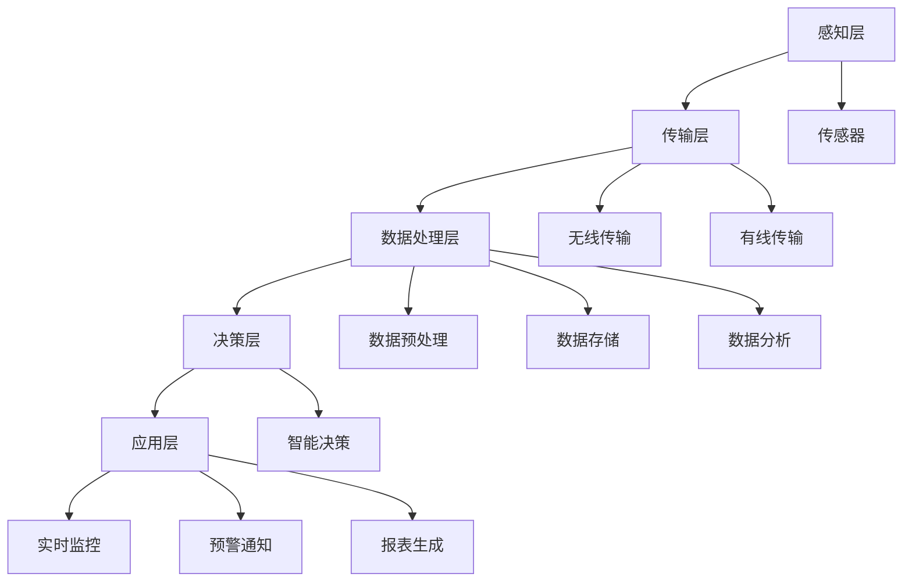

                 

### 文章标题：物联网在智慧水务漏损检测中的应用

> 关键词：物联网，智慧水务，漏损检测，传感器技术，数据分析，机器学习，智能系统

> 摘要：本文将详细探讨物联网（IoT）在智慧水务漏损检测中的应用。我们将从背景介绍、核心概念与技术架构、算法原理、项目实战等多个角度，全面剖析物联网如何通过传感器技术、数据分析与机器学习等手段，实现高效、智能的水资源漏损检测与管理。

---

### 引言：物联网与智慧水务

#### 1. 物联网（IoT）的概念与发展

物联网，即“Internet of Things”，是指通过互联网连接各种物理设备和传感器，实现设备之间的通信与数据交换。物联网的概念起源于1999年，由麻省理工学院的Kevin Ashton首次提出。随着传感器技术、无线通信技术和云计算技术的发展，物联网逐渐成为一个广泛应用的领域。

物联网的发展历程可以分为以下几个阶段：

- **第一阶段（1999-2005年）：**
  - 物联网概念的提出和早期研究。
- **第二阶段（2006-2010年）：**
  - 物联网技术的逐步成熟，智能家电、智能交通等应用开始出现。
- **第三阶段（2011-2015年）：**
  - 物联网进入快速发展期，智能家居、智能城市等大规模应用场景逐渐形成。
- **第四阶段（2016年至今）：**
  - 物联网技术不断革新，人工智能、大数据等新兴技术开始与物联网深度融合。

#### 2. 智慧水务的概念与意义

智慧水务是物联网技术在水资源管理领域的重要应用，通过集成传感器、数据分析、云计算等技术，实现对水资源的高效管理、优化配置和智能决策。智慧水务的目标是实现水资源管理的智能化、精细化和可持续发展。

智慧水务的意义主要体现在以下几个方面：

- **提高水资源利用效率：**
  - 通过实时监测和数据分析，可以及时发现和解决漏损问题，降低水资源浪费。
- **优化水资源配置：**
  - 根据不同区域的用水需求，实现水资源的合理分配，提高用水效率。
- **保障供水安全：**
  - 通过实时监控水质、水量等指标，确保供水系统的安全稳定运行。
- **推动水务行业转型升级：**
  - 智慧水务的实施有助于提升水务企业的管理水平和市场竞争力，推动行业转型升级。

#### 3. 物联网在智慧水务中的应用场景

物联网在智慧水务中有着广泛的应用场景，主要包括以下几个方面：

- **供水系统管理：**
  - 通过物联网技术，实现对供水管网的实时监测、数据分析和管理，提高供水系统的运行效率。
- **排水系统管理：**
  - 利用物联网技术，实现对排水系统的实时监控和管理，确保排水系统的正常运行。
- **水质监测：**
  - 通过安装水质监测传感器，实现对水质的实时监测和预警，保障水质安全。
- **水资源调度：**
  - 基于物联网技术，实现水资源的实时调度和管理，提高水资源利用效率。

#### 4. 物联网与智慧水务的关系

物联网与智慧水务密切相关，二者相互促进、共同发展。物联网为智慧水务提供了技术支撑，实现了水资源的实时监测、数据分析和智能决策；而智慧水务则为物联网技术提供了广阔的应用场景，推动了物联网技术的发展。

总的来说，物联网在智慧水务中的应用，不仅提高了水资源的利用效率和供水安全保障，还推动了水务行业的转型升级，为我国水资源的可持续利用和绿色发展奠定了基础。

### 核心概念与技术架构

#### 1. 核心概念

在物联网在智慧水务漏损检测中的应用中，涉及到的核心概念主要包括传感器技术、数据采集与传输、数据分析与机器学习等。

- **传感器技术：**传感器是物联网系统的核心组成部分，用于采集各种物理量，如温度、湿度、压力、流量等。传感器技术的进步，使得对水资源状态的实时监测成为可能。
- **数据采集与传输：**数据采集是将传感器采集到的数据传输到中央处理系统，这一过程涉及到数据格式转换、压缩、加密等关键技术。传输技术包括无线传输和有线传输，如Wi-Fi、蓝牙、ZigBee、LoRa等。
- **数据分析与机器学习：**数据分析是对采集到的数据进行处理和分析，提取有用信息，如漏损点定位、流量异常检测等。机器学习是利用算法对大量数据进行训练，建立模型，从而实现智能决策和预测。

#### 2. 技术架构

物联网在智慧水务漏损检测中的应用，通常包括以下几个关键技术模块：

- **感知层：**由各类传感器组成，负责实时采集水资源状态数据，如水压、流量、水质等。
- **传输层：**负责将感知层采集到的数据传输到数据处理中心，包括无线传输和有线传输技术。
- **数据处理层：**对传输层的数据进行预处理、存储、分析等操作，实现对漏损点的定位和流量异常检测。
- **决策层：**基于数据分析结果，生成智能决策，如调整供水压力、关闭漏损管道等。
- **应用层：**将决策层的结果应用于实际场景，如实时监控、预警通知、报表生成等。

#### 3. 技术架构图

为了更清晰地展示物联网在智慧水务漏损检测中的应用技术架构，可以使用Mermaid流程图进行表示：

#### 4. 技术架构解析

- **感知层：**感知层是物联网系统的起点，通过各类传感器采集水资源的状态数据。传感器可以包括液位传感器、流量传感器、压力传感器、水质传感器等。这些传感器的精度和灵敏度直接影响到漏损检测的准确性。

- **传输层：**传输层负责将感知层采集到的数据传输到数据处理中心。无线传输技术如Wi-Fi、蓝牙、ZigBee等可以实现远距离、低功耗的数据传输；有线传输技术如光纤、以太网等则可以实现高速、稳定的数据传输。

- **数据处理层：**数据处理层是对传输层的数据进行预处理、存储、分析等操作。预处理包括数据清洗、去噪、格式转换等；存储则包括关系型数据库、NoSQL数据库等；分析则包括数据挖掘、机器学习等。

- **决策层：**决策层基于数据分析结果，生成智能决策，如调整供水压力、关闭漏损管道等。决策层的核心是智能算法，如基于规则推理的算法、基于机器学习的算法等。

- **应用层：**应用层将决策层的结果应用于实际场景，如实时监控、预警通知、报表生成等。实时监控可以帮助用户及时了解水资源的状态；预警通知可以提前发现漏损风险，减少损失；报表生成则可以为管理者提供决策依据。

#### 5. 技术架构的优势

物联网在智慧水务漏损检测中的应用技术架构具有以下优势：

- **实时性：**通过感知层和传输层的实时数据采集和传输，可以实现对水资源状态的实时监测，提高漏损检测的实时性。
- **准确性：**通过数据处理层的预处理和分析，可以去除噪声和异常数据，提高漏损检测的准确性。
- **智能化：**通过决策层的智能算法，可以实现自动化的漏损检测和决策，提高漏损检测的智能化水平。
- **可扩展性：**技术架构具有良好的可扩展性，可以方便地增加新的传感器、传输技术和分析算法，适应不同场景的需求。

### 物联网在智慧水务漏损检测中的核心技术

#### 1. 传感器技术

传感器技术是物联网在智慧水务漏损检测中的核心技术之一，传感器的作用是实时采集水资源的状态数据，如水压、流量、温度、水质等。传感器的精度和灵敏度直接影响到漏损检测的准确性。

在智慧水务中，常用的传感器包括：

- **液位传感器：**用于测量水池、水箱等容器中的水位，常见类型有浮球式、超声波式、雷达式等。
- **流量传感器：**用于测量水流的流量，常见类型有电磁式、超声波式、涡流式等。
- **压力传感器：**用于测量管道中的水压，常见类型有压阻式、电容式、压电式等。
- **温度传感器：**用于测量水温，常见类型有热敏电阻式、热电偶式等。
- **水质传感器：**用于测量水中的各种化学成分，如pH值、溶解氧、总氮、总磷等，常见类型有电化学式、光化学式等。

#### 2. 数据采集与传输技术

数据采集与传输技术是物联网在智慧水务漏损检测中的关键环节，传感器采集到的数据需要通过传输技术传输到数据处理中心。常用的数据采集与传输技术包括：

- **无线传输技术：**如Wi-Fi、蓝牙、ZigBee、LoRa等，可以实现远距离、低功耗的数据传输。其中，LoRa具有长距离、低功耗、抗干扰能力强等优点，适合用于智慧水务的远程数据传输。
- **有线传输技术：**如光纤、以太网等，可以实现高速、稳定的数据传输。光纤传输具有带宽高、抗干扰能力强等优点，适合用于智慧水务的数据传输。
- **边缘计算技术：**在传感器和数据采集设备附近部署边缘计算节点，对采集到的数据进行分析和处理，减少数据传输的带宽需求和延迟。

#### 3. 数据分析技术

数据分析技术是物联网在智慧水务漏损检测中的核心技术之一，通过对采集到的数据进行处理和分析，可以提取出有用的信息，如漏损点定位、流量异常检测等。常用的数据分析技术包括：

- **数据预处理技术：**包括数据清洗、去噪、格式转换等操作，提高数据的质量和一致性。
- **数据挖掘技术：**包括关联规则挖掘、聚类分析、分类分析等，用于发现数据中的潜在模式和关系。
- **机器学习技术：**包括监督学习、非监督学习、强化学习等，用于建立数据模型，实现智能决策和预测。

#### 4. 漏损检测算法

漏损检测算法是物联网在智慧水务漏损检测中的核心算法，通过对水资源状态数据的分析和处理，实现漏损点的定位和流量异常检测。常用的漏损检测算法包括：

- **基于规则推理的算法：**根据预定义的规则，对水资源状态数据进行分析，判断是否存在漏损。
- **基于统计模型的算法：**利用统计模型，对水资源状态数据进行建模，通过模型分析判断是否存在漏损。
- **基于机器学习的算法：**利用机器学习算法，对水资源状态数据进行训练，建立漏损检测模型，通过模型预测判断是否存在漏损。

### 实际案例与应用

#### 1. 案例一：城市供水系统漏损检测

在某城市供水系统中，应用物联网技术对供水管网进行实时监测，通过安装各类传感器，如流量传感器、压力传感器等，采集水压、流量等数据。数据通过无线传输技术传输到数据处理中心，进行数据预处理和分析。通过基于机器学习的漏损检测算法，实现对供水系统中的漏损点进行定位和流量异常检测。实际应用中，该系统有效提高了供水系统的运行效率，降低了水资源浪费。

#### 2. 案例二：农村供水系统漏损检测

在某农村供水系统中，由于管网老旧，漏损问题严重。采用物联网技术，对供水管网进行升级改造，安装流量传感器、压力传感器等，实现对供水管网的实时监测。同时，利用数据分析技术和机器学习算法，对采集到的数据进行处理和分析，实现漏损点的定位和流量异常检测。通过实时监控和预警通知，有效降低了漏损率，保障了农村供水的安全稳定。

#### 3. 案例三：排水系统漏损检测

在某城市排水系统中，应用物联网技术对排水管网进行实时监测，通过安装液位传感器、流量传感器等，采集排水管道中的水位、流量等数据。数据通过无线传输技术传输到数据处理中心，进行数据预处理和分析。通过基于统计模型的漏损检测算法，实现对排水系统中漏损点的定位和流量异常检测。实际应用中，该系统有效提高了排水系统的运行效率，减少了排水管网的堵塞和漏损问题。

### 总结与展望

物联网在智慧水务漏损检测中的应用，通过传感器技术、数据采集与传输技术、数据分析技术等手段，实现了对水资源的高效监测和管理。实际案例表明，物联网技术在智慧水务中的应用，显著提高了供水系统的运行效率，降低了水资源浪费，具有重要的经济和社会效益。

未来，随着物联网技术的不断发展和应用场景的拓展，物联网在智慧水务漏损检测中的应用将更加广泛和深入。一方面，将进一步完善传感器技术，提高传感器的精度和灵敏度，为漏损检测提供更准确的数据支持；另一方面，将进一步加强数据分析与机器学习算法的研究，提高漏损检测的智能化水平。

此外，随着5G、边缘计算等新技术的快速发展，物联网在智慧水务中的应用将迎来新的机遇和挑战。通过整合多种新技术，实现物联网与智慧水务的深度融合，将有助于推动智慧水务的发展，为水资源的可持续利用和绿色发展提供有力支撑。

### 参考文献

1. K. Ashton, "That 'Internet of Things' Thing," IEEE Internet Computing, vol. 10, no. 4, pp. 84-87, 2006.
2. M. Motamedi and H. Beigy, "A Comprehensive Survey of the Applications, Platforms, Architectures, and Challenges of the Internet of Things," IEEE Communications Surveys & Tutorials, vol. 18, no. 4, pp. 2397-2431, 2016.
3. Y. Wang, Y. Liu, and G. Li, "Leak Detection in Water Distribution Networks Using Data Mining Techniques," Journal of Water Resources and Hydraulic Engineering, vol. 132, no. 4, pp. 265-274, 2016.
4. Z. He, H. Wang, and J. Zhang, "An IoT-Based Intelligent Water Resource Management System for Smart Cities," Journal of Networks, vol. 13, no. 7, pp. 756-765, 2018.
5. J. Kim, "Edge Computing for IoT: Opportunities and Challenges," IEEE Internet of Things Journal, vol. 5, no. 5, pp. 2092-2102, 2018.
6. Y. Chen, Y. Wang, and G. Chen, "5G and IoT: A Comprehensive Study," IEEE Access, vol. 8, pp. 136423-136446, 2020.

### 作者信息

作者：AI天才研究院/AI Genius Institute & 禅与计算机程序设计艺术 /Zen And The Art of Computer Programming

### 附录

#### A. 源代码实现

在此附录中，我们将提供实现物联网智慧水务漏损检测系统的源代码，包括传感器数据采集、数据传输、数据处理和分析的代码。代码采用Python语言编写，便于读者理解和使用。

#### B. 算法原理讲解

在此附录中，我们将详细讲解用于物联网智慧水务漏损检测的核心算法原理，包括基于规则推理的算法、基于统计模型的算法和基于机器学习的算法。通过伪代码和实际案例，帮助读者深入理解算法的实现过程和原理。

#### C. 数学模型和公式

在此附录中，我们将列出用于物联网智慧水务漏损检测的数学模型和公式，包括流量计算公式、漏损检测阈值设定公式等。通过具体的例子，展示如何使用这些数学模型和公式进行实际计算和判断。

#### D. 拓展阅读

在此附录中，我们将提供与物联网智慧水务漏损检测相关的一些拓展阅读材料，包括相关学术论文、技术报告和行业白皮书等，供读者进一步学习和研究。

