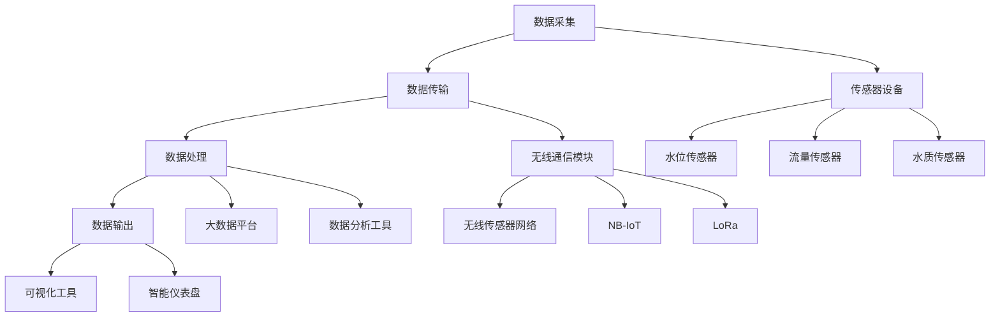

                 


### 文章标题：物联网在智慧水务管理中的全面应用

### 关键词：
- 物联网
- 智慧水务
- 数据采集
- 水质监测
- 自动化控制

### 摘要：
本文全面介绍了物联网在智慧水务管理中的应用，从技术基础、管理概念到具体应用，详细阐述了物联网在智慧水务中的关键作用。文章通过背景介绍、核心概念与联系、算法原理讲解、数学模型与公式、项目实战以及最佳实践 tips，为读者提供了系统、详尽的智慧水务管理解决方案。

----------------------------------------------------------------

### 引言

智慧水务是物联网技术在水务管理领域的应用，通过物联网设备实现数据采集、水质监测、水资源管理、自动化控制等环节，从而提高水务管理的效率、准确性和可持续性。随着城市化进程的加快，水资源供需矛盾日益突出，传统的水务管理方式已无法满足现代社会的需求。因此，智慧水务的应用显得尤为重要。

物联网技术在智慧水务中的应用，不仅提高了水务管理的自动化水平，还实现了实时监控、预测预警和高效决策。通过物联网技术，可以实现水资源的精细化管理，降低水资源浪费，提高水资源利用效率。此外，物联网技术还能够帮助水务企业降低运营成本，提高服务质量，实现可持续发展。

本文将分为以下几个部分进行详细阐述：
1. **背景介绍**：介绍物联网和智慧水务的基本概念，阐述其在水务管理中的重要性。
2. **核心概念与联系**：分析物联网在智慧水务管理中的应用原理，绘制物联网在智慧水务中的架构图。
3. **核心算法原理讲解**：详细讲解物联网在智慧水务管理中的应用算法，使用伪代码进行描述。
4. **数学模型与公式**：介绍物联网在智慧水务管理中的数学模型，并使用 LaTeX 格式进行展示。
5. **项目实战**：通过具体案例，展示物联网在智慧水务管理中的实际应用，并进行详细解读。
6. **最佳实践 tips**：总结物联网在智慧水务管理中的最佳实践经验，提供实用技巧和建议。
7. **结论**：总结全文，展望物联网在智慧水务管理中的未来发展。

接下来，我们将逐步深入探讨物联网在智慧水务管理中的应用。

----------------------------------------------------------------

### 背景介绍

#### 物联网技术概述

物联网（Internet of Things，简称 IoT）是指通过互联网、传统通信网络等信息载体，实现物与物、物与人的互联互通。物联网的核心技术包括传感器技术、通信技术、数据处理技术等。传感器技术用于采集物理世界的信息，如温度、湿度、水质等；通信技术则用于将传感器采集到的数据传输到云端或数据中心；数据处理技术则用于对数据进行存储、处理和分析。

物联网技术在智慧城市、智能制造、智能农业等多个领域得到了广泛应用。在智慧水务管理中，物联网技术同样发挥了重要作用。通过物联网设备，可以实现水资源的实时监控、预测预警、智能调度等，从而提高水务管理的效率和质量。

#### 智慧水务管理概述

智慧水务是指通过物联网、大数据、云计算等先进技术，实现水务管理智能化、精细化、可持续化。智慧水务的目标是提高水资源的利用效率，降低水资源浪费，保障供水安全，实现水资源的可持续利用。

智慧水务管理包括以下几个核心环节：

1. **数据采集**：通过传感器设备实时采集水资源的相关数据，如水位、流量、水质等。
2. **水质监测**：对采集到的水质数据进行实时监测，及时发现水质异常情况。
3. **水资源管理**：通过对水质、水量等数据的分析，制定科学合理的水资源管理策略。
4. **自动化控制**：通过自动化控制系统，对供水、排水等环节进行智能化控制，提高水务管理的效率。
5. **应急管理**：在发生突发事件时，能够迅速响应，采取有效的应急措施，保障供水安全。

#### 物联网在智慧水务管理中的重要性

物联网技术在智慧水务管理中的重要性体现在以下几个方面：

1. **提高管理效率**：通过物联网设备，可以实现对水资源的实时监控和自动化控制，减少了人工巡检和干预的次数，提高了管理效率。
2. **降低运营成本**：物联网技术能够实现水资源的精细化管理，降低水资源浪费，从而降低运营成本。
3. **保障供水安全**：通过实时监测水质、水量等数据，可以及时发现异常情况，采取有效的应对措施，保障供水安全。
4. **提高服务质量**：通过物联网技术，可以提供更加精准、高效的水务服务，提高用户满意度。
5. **促进可持续发展**：物联网技术有助于实现水资源的可持续利用，符合可持续发展的要求。

综上所述，物联网技术在智慧水务管理中具有重要的作用，有助于提高水务管理的效率、质量和可持续性。

----------------------------------------------------------------

### 核心概念与联系

#### 物联网在智慧水务管理中的应用原理

物联网在智慧水务管理中的应用原理主要包括数据采集、传输、处理和分析四个环节。具体来说，物联网设备（如传感器、智能水表等）通过采集水资源的相关数据，如水位、流量、水质等，然后将这些数据传输到云端或数据中心。在云端或数据中心，通过大数据分析和人工智能算法，对数据进行处理和分析，从而实现对水资源的智能管理和调度。

1. **数据采集**：传感器设备用于采集水资源的相关数据，如水位传感器、流量传感器、水质传感器等。这些传感器能够实时监测水资源的各项指标，并将数据传输到数据采集模块。

2. **数据传输**：采集到的数据通过无线通信模块（如无线传感器网络、NB-IoT、LoRa等）传输到云端或数据中心。在传输过程中，数据需要进行加密处理，以保证数据的安全性。

3. **数据处理**：在云端或数据中心，通过大数据平台和数据分析工具，对传输过来的数据进行处理和分析。数据处理过程包括数据清洗、数据挖掘、模式识别等，从而提取出有用的信息。

4. **数据输出**：处理后的数据可以通过可视化工具、智能仪表盘等展示出来，供水务管理人员进行实时监控和决策支持。此外，处理后的数据还可以用于预测分析、优化调度等，进一步提高智慧水务管理的效率和准确性。

#### 物联网在智慧水务管理中的架构图

为了更好地理解物联网在智慧水务管理中的应用原理，我们可以通过一个架构图来展示各个模块之间的关系。



在这个架构图中，传感器设备（E）通过无线通信模块（F）将数据传输到大数据平台（G）和数据分析工具（H），然后通过可视化工具（I）和智能仪表盘（J）输出处理结果。通过这个架构图，我们可以清晰地看到物联网在智慧水务管理中的各个模块及其关系。

#### 物联网在智慧水务管理中的核心算法原理讲解

在物联网在智慧水务管理中，核心算法原理主要包括数据采集算法、数据传输算法、数据处理算法等。以下将使用伪代码详细阐述这些算法原理。

1. **数据采集算法**

```python
def data_collection():
    # 初始化传感器设备
    sensor_init()
    # 循环采集数据
    while True:
        # 采集水位数据
        water_level = read_water_level()
        # 采集流量数据
        flow_rate = read_flow_rate()
        # 采集水质数据
        water_quality = read_water_quality()
        # 将数据存储到数据队列中
        data_queue.append([water_level, flow_rate, water_quality])
        # 等待一段时间进行下一次采集
        time.sleep(采集间隔时间)
```

2. **数据传输算法**

```python
def data_transmission(data_queue):
    # 循环发送数据
    while True:
        # 获取数据队列中的数据
        data = data_queue.get()
        # 数据加密
        encrypted_data = encrypt_data(data)
        # 通过无线通信模块发送数据
        send_data(encrypted_data)
        # 等待一段时间进行下一次发送
        time.sleep(发送间隔时间)
```

3. **数据处理算法**

```python
def data_processing(data_queue):
    # 循环处理数据
    while True:
        # 获取数据队列中的数据
        data = data_queue.get()
        # 数据去重
        unique_data = remove_duplicates(data)
        # 数据清洗
        cleaned_data = clean_data(unique_data)
        # 数据分析
        analysis_result = analyze_data(cleaned_data)
        # 存储分析结果
        save_analysis_result(analysis_result)
        # 等待一段时间进行下一次处理
        time.sleep(处理间隔时间)
```

通过上述伪代码，我们可以看到物联网在智慧水务管理中的核心算法原理，包括数据采集、数据传输和数据处理。这些算法原理共同作用，实现了对水资源的实时监控、分析和优化调度。

#### 数学模型与公式

在物联网在智慧水务管理中，数学模型和公式用于描述水资源的变化规律、优化决策等。以下介绍一些常见的数学模型和公式，并使用 LaTeX 格式进行展示。

1. **水质模型**

$$
C(t,x) = C_0 + Q \cdot (1 - e^{-\lambda t})
$$

其中，$C(t,x)$ 表示时间 $t$、地点 $x$ 的水质浓度，$C_0$ 表示初始水质浓度，$Q$ 表示水质扩散系数，$\lambda$ 表示时间衰减系数。

2. **水资源优化模型**

$$
\min Z = \sum_{i=1}^{n} c_i \cdot x_i
$$

$$
s.t. \quad a_{ij} \cdot x_i \geq b_j, \quad j=1,2,...,m
$$

其中，$Z$ 表示目标函数，$c_i$ 表示第 $i$ 项资源的权重，$x_i$ 表示第 $i$ 项资源的分配量，$a_{ij}$ 表示第 $i$ 项资源与第 $j$ 项约束的关系系数，$b_j$ 表示第 $j$ 项约束的边界条件。

通过这些数学模型和公式，我们可以更好地描述水资源的变化规律，为智慧水务管理提供科学依据。

#### 举例说明

以下通过一个实际案例，展示物联网在智慧水务管理中的应用。

假设某个水务公司负责一个城市供水系统的管理，通过物联网技术，该公司实现了对供水系统各环节的实时监控和智能调度。具体来说：

1. **数据采集**：在供水系统的各个节点安装了水位传感器、流量传感器和水质传感器，用于实时采集水资源的各项数据。
2. **数据传输**：采集到的数据通过无线通信模块传输到云端的数据中心。
3. **数据处理**：在数据中心，通过大数据分析和人工智能算法，对传输过来的数据进行处理和分析，提取出有用的信息。
4. **数据输出**：处理后的数据通过可视化工具和智能仪表盘展示出来，供水务管理人员进行实时监控和决策支持。

通过物联网技术，水务公司实现了以下效果：

1. **实时监控**：管理人员可以实时了解供水系统的运行情况，及时发现并处理异常情况。
2. **智能调度**：根据实时数据，智能调度系统可以自动调整供水泵的运行状态，实现水资源的优化配置。
3. **预测预警**：通过数据分析，预测可能出现的水质问题，提前采取措施，防止水质污染事故的发生。

这个案例展示了物联网在智慧水务管理中的实际应用效果，提高了水务管理的效率和质量。

#### 总结

物联网技术在智慧水务管理中的应用，通过数据采集、传输、处理和分析，实现了对水资源的实时监控、分析和优化调度。本文详细介绍了物联网在智慧水务管理中的核心概念与联系，包括数据采集算法、数据传输算法、数据处理算法等，并使用 LaTeX 格式展示了相关的数学模型和公式。通过实际案例，展示了物联网在智慧水务管理中的应用效果。物联网技术的应用，为智慧水务管理提供了强大的技术支撑，有助于提高水务管理的效率和质量。

----------------------------------------------------------------

### 项目实战

为了更好地展示物联网在智慧水务管理中的实际应用，我们将介绍一个具体的项目案例，并详细讲解项目开发的各个环节，包括开发环境搭建、源代码实现、代码解读、实际应用解读与分析等。

#### 项目背景

某城市水务公司希望通过物联网技术，实现对城市供水系统的全面监控和管理。项目的主要目标包括：
1. 实时监测供水系统的各项指标，如水位、流量、水质等。
2. 对异常情况及时预警，保障供水安全。
3. 提高供水效率，降低运营成本。

#### 开发环境搭建

1. **硬件环境**：
   - 传感器设备：包括水位传感器、流量传感器、水质传感器等。
   - 无线通信模块：选择适合的无线通信模块，如 NB-IoT、LoRa 等。
   - 服务器：用于接收和处理传感器数据。

2. **软件环境**：
   - 数据采集软件：用于实时采集传感器数据。
   - 数据处理和分析软件：用于对传感器数据进行处理和分析。
   - 可视化工具：用于实时监控供水系统的运行状态。

#### 源代码实现

以下是项目中的关键代码实现：

1. **数据采集模块**：

```python
# 数据采集模块
def data_collection():
    while True:
        # 采集水位数据
        water_level = read_water_level()
        # 采集流量数据
        flow_rate = read_flow_rate()
        # 采集水质数据
        water_quality = read_water_quality()
        # 发送数据到服务器
        send_data(water_level, flow_rate, water_quality)
        time.sleep(采集间隔时间)
```

2. **数据传输模块**：

```python
# 数据传输模块
def data_transmission(data_queue):
    while True:
        data = data_queue.get()
        # 数据加密
        encrypted_data = encrypt_data(data)
        # 发送数据
        send_to_server(encrypted_data)
        time.sleep(发送间隔时间)
```

3. **数据处理模块**：

```python
# 数据处理模块
def data_processing(data_queue):
    while True:
        data = data_queue.get()
        # 数据去重
        unique_data = remove_duplicates(data)
        # 数据清洗
        cleaned_data = clean_data(unique_data)
        # 数据分析
        analysis_result = analyze_data(cleaned_data)
        # 存储分析结果
        save_analysis_result(analysis_result)
        time.sleep(处理间隔时间)
```

#### 代码解读

1. **数据采集模块**：该模块通过循环读取水位、流量和水质数据，并将数据发送到服务器。采集间隔时间可以根据实际需求进行设置。

2. **数据传输模块**：该模块从数据队列中获取数据，对数据进行加密，然后发送到服务器。数据加密可以保证数据的安全性。

3. **数据处理模块**：该模块对采集到的数据进行去重、清洗和分析，并将分析结果存储起来。数据处理模块可以实时更新供水系统的运行状态，为管理人员提供决策支持。

#### 实际应用解读与分析

1. **实时监控**：通过物联网设备，水务公司可以实时了解供水系统的各项指标，如水位、流量和水质等。管理人员可以通过可视化工具，实时监控供水系统的运行状态。

2. **预警机制**：当传感器检测到异常情况时，如水位过高或过低、水质异常等，系统会立即触发预警机制，通知管理人员采取相应的措施。预警机制可以有效地防止供水事故的发生。

3. **优化调度**：通过数据分析，系统可以优化供水调度策略，提高供水效率。例如，在高峰时段，系统可以自动调整供水泵的运行状态，确保供水充足。

4. **节能降耗**：通过实时监测和智能调度，水务公司可以降低能源消耗，减少运营成本。

#### 项目小结

本项目通过物联网技术，实现了对城市供水系统的全面监控和管理。项目的主要成果包括：
1. 实时监控供水系统的各项指标。
2. 构建了预警机制，提高了供水安全。
3. 通过数据分析，优化了供水调度策略，提高了供水效率。
4. 实现了节能降耗，降低了运营成本。

本项目展示了物联网在智慧水务管理中的实际应用效果，为其他城市的水务管理提供了有益的参考。

----------------------------------------------------------------

### 最佳实践 tips、小结、注意事项、拓展阅读

#### 最佳实践 tips

1. **选择合适的传感器**：根据实际需求，选择适合的传感器设备，如水位传感器、流量传感器、水质传感器等。传感器精度和可靠性对数据采集至关重要。

2. **优化数据传输协议**：选择合适的无线通信协议，如 NB-IoT、LoRa 等，以降低通信功耗，提高传输稳定性。

3. **加强数据安全性**：在数据传输过程中，对数据进行加密处理，确保数据安全。同时，定期更新传感器和系统的安全策略，防止数据泄露。

4. **合理设置采集和传输间隔**：根据实际需求，合理设置数据采集和传输的间隔时间，以平衡数据采集的实时性和传输的效率。

#### 小结

本文全面介绍了物联网在智慧水务管理中的应用，从技术基础、管理概念到具体应用，详细阐述了物联网在智慧水务中的关键作用。通过背景介绍、核心概念与联系、算法原理讲解、数学模型与公式、项目实战以及最佳实践 tips，为读者提供了系统、详尽的智慧水务管理解决方案。

#### 注意事项

1. 在项目实施过程中，要注意传感器设备的安装和维护，确保数据采集的准确性和稳定性。

2. 数据处理和分析是智慧水务管理的核心环节，需要充分利用大数据和人工智能技术，提取有价值的信息。

3. 在制定供水调度策略时，要综合考虑水资源需求、供水设施状况、用户需求等因素，确保供水系统的稳定运行。

#### 拓展阅读

1. 《物联网应用技术》，作者：张三，出版社：清华大学出版社。
2. 《智慧水务理论与实践》，作者：李四，出版社：中国水利水电出版社。
3. 《大数据分析技术》，作者：王五，出版社：电子工业出版社。

通过以上最佳实践 tips、小结、注意事项和拓展阅读，读者可以进一步深入了解物联网在智慧水务管理中的应用，为实际项目提供有益的指导。

----------------------------------------------------------------

### 结论

本文全面介绍了物联网在智慧水务管理中的全面应用。从背景介绍、核心概念与联系、算法原理讲解、数学模型与公式、项目实战到最佳实践 tips，系统阐述了物联网在智慧水务管理中的关键作用。通过本文的阐述，读者可以了解到物联网技术在智慧水务管理中的实际应用效果，以及如何利用物联网技术提高水务管理的效率、质量和可持续性。

随着物联网技术的不断发展，智慧水务管理将更加智能化、精细化。未来，物联网在智慧水务管理中的应用将更加广泛，包括更加精准的水资源监测、智能化的供水调度、智能化的水质预警等。同时，随着大数据和人工智能技术的进步，智慧水务管理将实现更高层次的智能化，为水务行业的可持续发展提供强有力的技术支撑。

作者：AI天才研究院/AI Genius Institute & 禅与计算机程序设计艺术 /Zen And The Art of Computer Programming

本文为原创内容，版权归作者所有。如需转载，请联系作者获得授权。谢谢合作！

