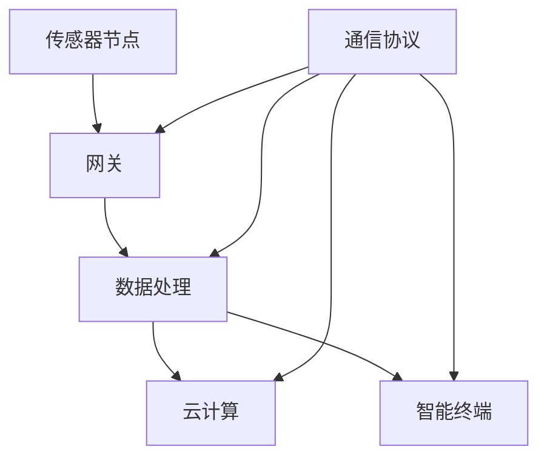
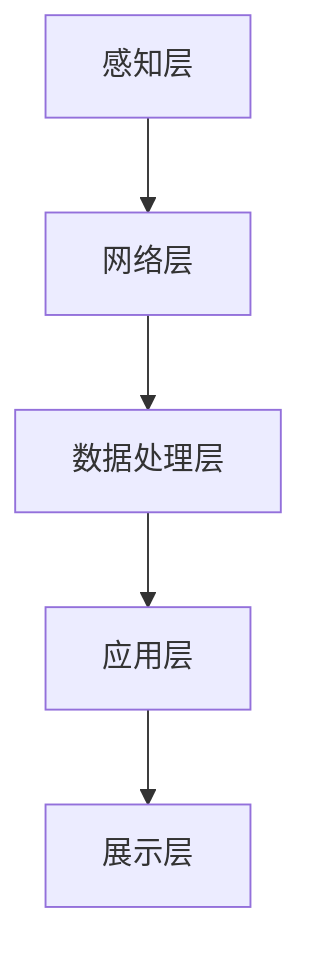

                 

### 文章标题：物联网在智慧水务管理中的实践

> 关键词：物联网、智慧水务、数据采集、智能决策、系统架构

> 摘要：本文深入探讨了物联网在智慧水务管理中的应用。首先，介绍了智慧水务的背景和意义，然后详细阐述了物联网技术的基础知识。接着，文章重点讨论了物联网在智慧水务中的具体应用，包括数据采集与处理、智能决策与分析、系统设计与实现等方面。最后，通过具体的项目案例研究，展示了物联网在智慧水务管理中的实际应用效果。本文旨在为从事智慧水务管理的技术人员提供全面的技术指导和实践参考。

### 引言

随着城市化进程的加速和人口增长，水资源管理成为全球面临的一项重大挑战。传统的粗放型水资源管理方式已经无法满足现代社会对高效、精细化的水资源管理需求。为了应对这一挑战，智慧水务管理逐渐成为研究热点和应用方向。智慧水务利用物联网、大数据、人工智能等先进技术，实现对水资源的智能监测、管理和优化配置，从而提高水资源的利用效率和可持续性。

物联网（Internet of Things, IoT）作为实现智慧水务的核心技术之一，其重要性日益凸显。物联网通过将各种传感器、设备和系统连接起来，形成一个高度集成的信息网络，能够实时采集和传输大量的水资源数据，为智慧水务管理提供了丰富的数据支持。此外，物联网技术还可以实现远程控制、自动化管理，提高水务系统的运行效率和可靠性。

本文旨在深入探讨物联网在智慧水务管理中的应用，包括物联网技术的基础知识、物联网在智慧水务中的具体应用、数据采集与处理、智能决策与分析、系统设计与实现等方面。通过具体的项目案例研究，本文将展示物联网在智慧水务管理中的实际应用效果，为从事智慧水务管理的技术人员提供全面的技术指导和实践参考。本文结构如下：

1. 智慧水务管理的背景和意义
2. 物联网技术基础
3. 智慧水务中的物联网应用
4. 数据采集与处理
5. 智能决策与分析
6. 系统设计与实现
7. 项目案例研究
8. 总结与展望

### 智慧水务管理的背景和意义

水资源作为地球上最基本的自然资源之一，对于人类的生存和发展具有重要意义。然而，随着全球人口的增长、城市化进程的加速和工农业用水需求的增加，水资源短缺、污染和浪费等问题日益严重。特别是在一些发展中国家，水资源的供需矛盾更加突出，严重制约了社会经济的可持续发展。因此，如何高效、合理地管理水资源成为各国政府、企业和科研机构关注的焦点。

智慧水务管理是指利用物联网、大数据、云计算、人工智能等先进技术，对水资源进行智能化监测、管理和优化配置。智慧水务管理的目标是通过数据驱动和智能分析，实现对水资源的精细化管理，提高水资源的利用效率，减少浪费，降低污染，保障水资源的可持续利用。智慧水务管理具有以下背景和意义：

1. **背景**：

   - **水资源短缺**：全球约有28%的人口生活在面临水资源短缺的地区，而中国的水资源总量虽然位居世界前列，但人均水资源量仅为世界平均水平的四分之一。水资源短缺问题已经成为全球范围内亟待解决的重要问题。

   - **水资源污染**：水污染问题日益严重，工业废水、生活污水和农业面源污染导致了大量水体的污染，使得可供人类直接使用和农业灌溉的淡水资源进一步减少。

   - **传统管理方式的局限性**：传统的粗放型水资源管理方式主要依赖于人工监测和经验判断，缺乏科学的数据支持和有效的管理手段，难以实现水资源的精细化管理。

2. **意义**：

   - **提高水资源利用效率**：智慧水务管理通过实时监测和数据分析，能够精确掌握水资源的分布和利用情况，从而优化水资源的调配，减少浪费，提高水资源的利用效率。

   - **降低水污染**：智慧水务管理可以通过实时监测水质，及时发现污染源和污染问题，采取相应的治理措施，从而有效降低水污染，保护水环境。

   - **增强应急响应能力**：在水资源短缺、洪水、干旱等突发情况下，智慧水务管理系统能够实时提供数据支持，为决策者提供科学的决策依据，提高应急响应能力。

   - **推动水务行业的数字化转型**：智慧水务管理是水务行业数字化转型的关键步骤，通过引入物联网、大数据、人工智能等先进技术，能够提升水务企业的运营效率和服务水平，推动整个行业的升级和发展。

总之，智慧水务管理是应对水资源短缺、污染和浪费问题的重要手段，具有广泛的应用前景和重要的社会意义。通过本文的探讨，旨在为智慧水务管理的研究和应用提供理论支持和实践指导。

### 物联网技术基础

物联网（Internet of Things，IoT）是指通过将各种物理设备、传感器、软件和网络连接起来，形成一个智能化的网络系统，使设备能够互相通信、协作和数据交换。物联网的核心在于将现实世界的物理设备和信息网络相结合，通过数据采集、传输、处理和反馈，实现智能化的管理和控制。以下是物联网技术的一些基础概念、通信协议和硬件设备：

#### 基本概念

- **设备联网**：物联网中的设备通过有线或无线方式连接到互联网，使其能够进行数据传输和通信。

- **传感器**：传感器是物联网系统中的关键组成部分，用于检测和收集环境中的各种物理量，如温度、湿度、压力、流量、水质等。

- **数据处理**：物联网系统能够对采集到的数据进行实时处理和分析，为决策和智能控制提供支持。

- **云计算和大数据**：物联网系统通常需要将大量数据进行存储、处理和分析，云计算和大数据技术为其提供了强大的支持。

#### 通信协议

- **Zigbee**：Zigbee是一种低功耗、短距离的无线通信协议，常用于智能家居、工业自动化等场景。

- **Z-Wave**：Z-Wave是一种无线通信协议，主要用于家庭自动化领域，具有高可靠性和低功耗的特点。

- **Wi-Fi**：Wi-Fi是一种无线局域网技术，适用于各种场景下的数据传输。

- **蓝牙（Bluetooth）**：蓝牙是一种短距离无线通信技术，常用于设备之间的数据传输和通信。

- **LoRa**：LoRa是一种低功耗、广域网的无线通信技术，适用于远程监控和长距离通信。

#### 硬件设备

- **传感器节点**：传感器节点是物联网系统中的基本单元，包括传感器、微控制器、存储器和无线通信模块等。

- **网关**：网关是连接物联网设备和互联网的桥梁，用于数据的收集、处理和传输。

- **智能终端**：智能终端如智能手机、平板电脑等，可以通过应用软件对物联网设备进行远程监控和控制。

#### 物联网核心概念与联系流程图

为了更好地理解物联网的组成和运行机制，我们使用Mermaid流程图来描述物联网核心概念之间的联系。



在这个流程图中，传感器节点通过通信协议（如Zigbee、Wi-Fi等）将数据传输到网关。网关负责数据的初步处理和传输，然后数据通过网关进入数据处理层，包括云计算和大数据分析。最终，处理后的数据可以通过智能终端进行展示和用户交互。

通过上述基础概念的介绍和Mermaid流程图的展示，我们可以更好地理解物联网技术在智慧水务管理中的应用。在接下来的章节中，我们将详细探讨物联网在智慧水务中的具体应用，包括数据采集与处理、智能决策与分析、系统设计与实现等方面。

### 智慧水务中的物联网应用

物联网技术在智慧水务中的应用，使得水资源管理变得更加高效、智能化。智慧水务通过物联网技术，实现了水资源的实时监测、智能调控和优化管理。以下是物联网在智慧水务中的几个主要应用领域：

#### 智慧水务需求分析

智慧水务的需求分析是整个系统的设计基础。首先，需要明确智慧水务的目标和关键需求。智慧水务的目标是提高水资源利用效率，降低水资源浪费，减少水污染，保障水资源的可持续利用。关键需求包括：

- **实时监测**：对水源、水质、水量进行实时监测，掌握水资源的动态变化。
- **数据采集**：通过传感器和智能设备，采集水资源相关的数据，包括温度、湿度、流量、pH值、电导率等。
- **智能决策**：基于实时数据和分析结果，实现智能决策，优化水资源调配和管理。
- **自动化控制**：实现水处理设施的自动化控制，提高运营效率。
- **应急预案**：在水资源短缺、洪水、污染等突发情况下，快速响应和处置。

#### 智能监测系统设计

智能监测系统是智慧水务的核心组成部分，它通过物联网设备实现水资源的实时监测。以下是智能监测系统设计的关键要素：

- **传感器节点**：分布在水源、取水口、输水管道、污水处理设施等关键位置，用于采集各种水资源数据。常见的传感器包括水质传感器、流量传感器、温度传感器等。
- **数据传输网络**：传感器节点通过无线或有线网络将数据传输到中心控制系统。常用的传输网络包括Wi-Fi、LoRa、Zigbee等。
- **中心控制系统**：接收和处理传感器数据，进行实时分析和决策。中心控制系统通常包括服务器、数据库、云计算平台等。
- **数据展示和监控平台**：通过图形用户界面（GUI）展示水资源数据，供管理人员实时监控和查询。

#### 水资源管理应用

物联网技术在水资源管理中的应用，主要体现在以下几个方面：

- **水资源监控与管理**：通过实时监测和数据分析，实现对水源、水质、水量的全面监控和管理。系统可以根据实时数据，自动调整水资源的调配和分配。
- **水质监测与预警**：利用物联网传感器，实时监测水质指标，如pH值、氨氮、总氮、总磷等。当监测到水质异常时，系统可以自动发出预警信号，提醒管理人员及时采取治理措施。
- **水资源优化配置**：基于大数据分析和智能算法，优化水资源调配，实现水资源的合理利用。例如，根据不同时间段和不同地区的用水需求，调整水资源的分配，最大限度地提高水资源利用效率。

#### 智能决策支持系统

智能决策支持系统（IDSS）是智慧水务管理的重要组成部分，它利用物联网采集的数据，结合人工智能技术，为水资源管理提供决策支持。以下是智能决策支持系统的关键组件：

- **数据采集与处理**：通过物联网传感器，采集水资源相关的数据，包括水源、水质、水量、用水需求等。系统对数据进行实时处理、清洗和存储。
- **数据分析与建模**：利用大数据技术和机器学习算法，对采集到的数据进行分析和建模。通过分析历史数据和当前数据，预测水资源的未来变化趋势。
- **决策生成与优化**：基于数据分析结果，生成水资源管理决策。决策系统可以根据不同场景和需求，自动调整水资源的调配和分配，优化水资源利用效率。
- **用户交互界面**：通过图形用户界面，展示水资源管理决策和实时数据，供管理人员进行监控和操作。

通过智能决策支持系统，智慧水务管理可以更加科学、高效，实现水资源的精细化管理和优化配置。

综上所述，物联网技术在智慧水务管理中的应用，大大提升了水资源管理的智能化和效率。智能监测系统、水资源管理应用和智能决策支持系统共同构成了智慧水务的三大核心部分，为实现水资源的可持续利用提供了强有力的技术支持。

### 数据采集与处理

在智慧水务管理中，数据采集与处理是至关重要的一环。通过物联网设备，智慧水务系统能够实时采集大量的水资源数据，包括水源、水质、水量等参数。这些数据不仅为实时监控提供了基础，也为智能决策提供了重要依据。下面，我们将详细探讨数据采集与处理的方法、技术和关键步骤。

#### 数据采集技术

数据采集技术是智慧水务系统的核心组成部分，主要包括传感器节点和通信网络。以下是数据采集技术的关键要素：

1. **传感器节点**：
   - **水质传感器**：用于测量水中的各项指标，如pH值、氨氮、总氮、总磷、浊度等。
   - **流量传感器**：用于测量水的流量，常见类型包括电磁流量计、超声波流量计等。
   - **温度传感器**：用于测量水温，常见类型包括热电偶、热敏电阻等。
   - **压力传感器**：用于测量水的压力，常见类型包括压阻式、电容式等。
   - **其他传感器**：如湿度传感器、光照传感器、气体传感器等，用于监测水质和环境的其他参数。

2. **通信网络**：
   - **无线通信**：如Wi-Fi、LoRa、Zigbee等，适用于短距离、低功耗的数据传输。
   - **有线通信**：如以太网、光纤等，适用于长距离、高带宽的数据传输。

#### 数据预处理

采集到的原始数据通常包含噪声、误差和冗余信息，因此需要进行预处理，以提高数据的质量和可靠性。数据预处理包括以下步骤：

1. **数据清洗**：去除数据中的噪声和错误值，例如去除传感器故障产生的异常数据。
2. **数据集成**：将来自不同传感器和不同数据源的数据进行整合，形成一个统一的数据集。
3. **数据转换**：将不同格式、不同单位的数据进行统一转换，以便进行后续处理和分析。

#### 数据存储和管理

预处理后的数据需要存储和管理，以供后续的查询、分析和应用。以下是数据存储和管理的关键步骤：

1. **数据库设计**：根据数据的特点和需求，设计合适的数据库系统。常用的数据库系统包括关系型数据库（如MySQL、PostgreSQL）和NoSQL数据库（如MongoDB、Cassandra）。
2. **数据存储策略**：根据数据的重要性和访问频率，制定不同的存储策略。例如，将实时数据存储在内存数据库中，以便快速查询；将历史数据存储在磁盘数据库中，以节省存储空间。
3. **数据备份与恢复**：定期对数据进行备份，以防止数据丢失。同时，制定数据恢复方案，确保在发生故障时能够快速恢复数据。

#### 数据处理方法

数据采集与处理不仅仅包括数据的存储和管理，还涉及对数据进行深入分析，以提取有价值的信息。以下是几种常用的数据处理方法：

1. **统计分析**：利用统计分析方法，对数据进行描述性统计、相关性分析和回归分析等，以了解数据的分布特征和关系。
2. **机器学习**：利用机器学习方法，如分类、聚类、回归等，对数据进行建模和分析，以发现数据中的规律和趋势。
3. **数据挖掘**：利用数据挖掘技术，从大量数据中提取隐藏的知识和模式，以支持决策和优化。
4. **实时处理**：对于需要实时响应的应用，如水资源监控和预警系统，采用实时数据处理技术，以快速处理和响应数据。

#### 数据处理流程

数据处理流程通常包括以下几个步骤：

1. **数据采集**：从传感器和通信网络获取数据。
2. **数据预处理**：对数据进行清洗、集成和转换。
3. **数据存储**：将预处理后的数据存储到数据库中。
4. **数据分析**：利用统计分析、机器学习和数据挖掘等方法，对数据进行深入分析。
5. **数据展示**：通过可视化工具，将分析结果展示给用户。

#### 伪代码示例

以下是一个简单的数据处理伪代码示例，用于说明数据处理的基本流程：

```plaintext
function processData(inputData):
    cleanedData = cleanData(inputData)
    integratedData = integrateData(cleanedData)
    transformedData = transformData(integratedData)
    storeData(transformedData)
    return transformedData

function cleanData(data):
    # 去除噪声和错误值
    cleanedData = []
    for datum in data:
        if isValid(datum):
            cleanedData.append(datum)
    return cleanedData

function integrateData(data):
    # 集成来自不同传感器和源的数据
    integratedData = {}
    for sensor in sensors:
        integratedData[sensor] = sensorData[sensor]
    return integratedData

function transformData(data):
    # 数据转换，如单位换算、格式统一等
    transformedData = {}
    for sensor in data:
        transformedData[sensor] = transform(data[sensor])
    return transformedData

function storeData(data):
    # 将数据存储到数据库中
    database.insert(data)

function isValid(datum):
    # 判断数据是否有效
    return datum is not null and datum is within acceptable range
```

通过以上数据处理方法和技术，智慧水务系统能够对海量水资源数据进行高效、准确的采集、预处理、存储和分析，为水资源管理和优化提供有力支持。

### 智能决策与分析

在智慧水务管理中，智能决策与分析起着至关重要的作用。通过物联网技术，智慧水务系统能够实时获取大量水资源数据，这些数据不仅包括水源、水质和水量等基础信息，还涉及到用水需求、环境变化等多种因素。智能决策与分析通过深入挖掘这些数据，为水资源管理和优化提供了科学依据。以下是智能决策与分析的基本原理、流程和应用。

#### 智能算法原理讲解

智能决策与分析主要依赖于机器学习和数据挖掘算法。以下是几种常用的智能算法原理：

1. **线性回归**：线性回归是一种常用的预测算法，通过建立自变量和因变量之间的线性关系，实现对未来值的预测。线性回归的伪代码如下：

   ```plaintext
   function linearRegression(X, Y):
       # X为自变量矩阵，Y为因变量向量
       theta = [0] * n
       for i in range(n):
           theta[i] = X[i] * Y[i]
       return theta
   ```

2. **决策树**：决策树通过一系列的规则和条件，对数据进行分类和预测。每个节点代表一个条件，每个分支代表一个结果。决策树的伪代码如下：

   ```plaintext
   function decisionTree(data):
       if data is homogeneous:
           return most common value in data
       else:
           select attribute A with highest information gain
           split data on attribute A
           for each value v of A:
               recursive call on subset of data where attribute A has value v
           return combination of recursive calls
   ```

3. **支持向量机（SVM）**：SVM通过找到一个最优超平面，将不同类别的数据分开。SVM的伪代码如下：

   ```plaintext
   function SVM(X, Y):
       # X为训练数据，Y为标签
       theta = optimize(X, Y)
       return theta
   ```

4. **神经网络**：神经网络通过多层感知器（MLP）模拟人脑的神经网络结构，实现对数据的分类和预测。神经网络的伪代码如下：

   ```plaintext
   function neuralNetwork(X, Y):
       # X为输入层，Y为输出层
       hiddenLayer = activate(function(X), theta)
       outputLayer = activate(function(hiddenLayer), theta)
       return outputLayer
   ```

#### 数据分析流程

智能决策与分析的流程通常包括以下几个步骤：

1. **数据采集**：从物联网传感器和系统中采集水资源数据，包括水源、水质、水量、用水需求等。

2. **数据预处理**：对采集到的数据进行清洗、转换和集成，确保数据的质量和一致性。

3. **特征提取**：从预处理后的数据中提取有助于分析和预测的特征，如时间、地点、水质指标等。

4. **模型训练**：利用机器学习和数据挖掘算法，对特征数据进行建模和训练，以建立预测模型。

5. **模型评估**：通过交叉验证和测试集，对训练好的模型进行评估，确保模型的准确性和可靠性。

6. **决策生成**：利用训练好的模型，对实时数据进行预测和决策，如水资源调配、水质预警等。

7. **结果展示**：将决策结果通过可视化界面展示给用户，供用户进行监控和操作。

#### 智能决策模型

智能决策模型是智能决策与分析的核心，通过结合多种算法和技术，实现对水资源管理的高效决策。以下是智能决策模型的基本组成部分：

1. **预测模型**：通过机器学习算法，对水资源未来的变化趋势进行预测，为水资源调配提供科学依据。

2. **优化模型**：通过优化算法，如线性规划、整数规划等，对水资源进行优化调配，以实现最大化的资源利用效率。

3. **决策支持系统**：结合预测模型和优化模型，为水资源管理提供全方位的决策支持，如水资源分配、水质调控等。

#### 数据分析工具

在智能决策与分析过程中，常用的数据分析工具包括：

1. **Python**：Python拥有丰富的机器学习库，如Scikit-learn、TensorFlow和Keras，可以方便地进行数据建模和预测。

2. **R**：R是一个专门用于统计分析和数据挖掘的编程语言，具有强大的数据处理和分析功能。

3. **Tableau**：Tableau是一个数据可视化工具，可以将数据分析结果以直观的图表形式展示给用户。

4. **SQL**：SQL用于数据库管理和数据查询，是进行数据预处理和特征提取的重要工具。

通过智能决策与分析，智慧水务系统能够实现对水资源的精准监测、科学预测和高效管理，从而提高水资源的利用效率和可持续发展能力。在接下来的章节中，我们将进一步探讨智慧水务系统的设计与实现，包括系统架构、开发流程和性能优化等方面。

### 系统设计与实现

在智慧水务管理中，系统设计与实现是关键的一步，它决定了智慧水务系统是否能够高效、稳定地运行。系统设计与实现需要考虑多个方面，包括系统架构、开发流程和性能优化。以下将详细探讨这些内容。

#### 系统架构设计

系统架构设计是智慧水务系统的蓝图，决定了系统的模块划分、数据流转和功能分布。一个典型的智慧水务系统架构包括以下几个层次：

1. **感知层**：由各种传感器节点组成，负责实时采集水资源相关的数据，如水质、水量、温度、压力等。这些传感器节点通过无线或有线网络将数据传输到下一层。

2. **网络层**：负责数据传输和通信，包括无线通信协议（如Wi-Fi、LoRa、Zigbee等）和有线通信网络（如以太网、光纤等）。这一层确保传感器数据能够可靠、高效地传输到中心控制系统。

3. **数据处理层**：包括数据预处理、存储和计算功能。数据处理层对传感器数据进行清洗、转换和存储，并提供数据存储和管理服务，如数据库和缓存系统。同时，数据处理层还负责对数据进行实时分析和处理，为上层应用提供数据支持。

4. **应用层**：包括智能决策支持系统、水资源监控与管理系统、用户交互界面等。应用层利用数据处理层提供的数据，实现水资源的智能监控、预测和优化管理。

5. **展示层**：通过图形用户界面（GUI）和Web应用，将水资源数据和分析结果展示给用户，供用户进行监控、查询和操作。

以下是系统架构的Mermaid流程图：



#### 系统开发流程

系统开发流程是确保智慧水务系统能够按时、高质量交付的重要环节。以下是一个典型的系统开发流程：

1. **需求分析**：与用户和相关部门沟通，明确智慧水务系统的功能需求、性能需求和用户体验需求。

2. **系统设计**：根据需求分析结果，进行系统架构设计和详细设计，包括数据库设计、接口设计、模块划分等。

3. **编码实现**：根据系统设计文档，进行代码编写和单元测试，确保每个模块的功能正确、性能稳定。

4. **集成测试**：将各个模块集成到一起，进行系统级测试，验证系统的整体功能、性能和稳定性。

5. **用户验收测试**：与用户合作，进行用户验收测试，确保系统符合用户需求，并且用户体验良好。

6. **部署上线**：将系统部署到生产环境，进行上线运行，并监控系统的运行状况。

7. **运维维护**：对系统进行日常运维和维护，确保系统的稳定运行，及时修复发现的问题。

#### 系统性能优化

系统性能优化是确保智慧水务系统高效运行的重要手段。以下是一些常见的性能优化方法：

1. **数据缓存**：在数据处理层使用缓存技术，减少对数据库的查询频率，提高数据读取速度。

2. **数据库优化**：通过索引优化、查询优化和存储优化，提高数据库的查询效率和存储空间利用率。

3. **负载均衡**：通过负载均衡技术，将系统负载分配到多个服务器上，避免单点瓶颈，提高系统的处理能力。

4. **分布式计算**：利用分布式计算技术，将数据处理和分析任务分布到多个节点上，提高系统的计算效率。

5. **系统监控**：通过监控系统，实时监控系统的运行状态，及时发现和处理性能瓶颈。

#### 代码实现与解读

以下是数据处理模块的一部分伪代码，用于展示数据处理的基本逻辑：

```plaintext
function processData(sensorData):
    # 数据清洗
    cleanedData = cleanData(sensorData)
    # 数据转换
    transformedData = transformData(cleanedData)
    # 数据存储
    storeData(transformedData)
    # 数据分析
    analysisResults = analyzeData(transformedData)
    # 数据展示
    displayData(analysisResults)
    return analysisResults

function cleanData(data):
    # 去除噪声和异常值
    cleanedData = []
    for datum in data:
        if isValid(datum):
            cleanedData.append(datum)
    return cleanedData

function transformData(data):
    # 数据转换，如单位换算、格式统一等
    transformedData = {}
    for sensor in data:
        transformedData[sensor] = transform(data[sensor])
    return transformedData

function storeData(data):
    # 存储数据到数据库
    database.insert(data)

function analyzeData(data):
    # 数据分析，如趋势预测、异常检测等
    analysisResults = {}
    for sensor in data:
        analysisResults[sensor] = analyze(data[sensor])
    return analysisResults
```

通过上述系统设计与实现方法，智慧水务系统能够高效、稳定地运行，为水资源管理提供有力支持。

### 项目案例研究

在本节中，我们将通过两个实际案例，深入探讨物联网在智慧水务管理中的应用。这两个案例展示了如何通过物联网技术实现水资源的实时监测、智能决策和优化管理。

#### 案例一：智慧水务监测系统的实施

**背景**：某城市面临严重的水资源短缺和水质污染问题，传统的监测方式已经无法满足实时、高效的管理需求。为了解决这些问题，该城市决定引入物联网技术，建设一个智慧水务监测系统。

**目标**：通过物联网技术，实现对水源、水质、水量等关键指标的实时监测，提高水资源管理的精度和效率。

**实现过程**：

1. **数据采集**：在城市的主要水源、取水口、输水管道和污水处理设施等关键位置安装各类传感器，包括水质传感器、流量传感器、温度传感器和压力传感器等。这些传感器通过Wi-Fi和LoRa等无线通信技术，将实时数据传输到中心控制系统。

2. **数据处理**：中心控制系统接收到传感器数据后，进行初步的数据清洗和转换，确保数据的一致性和准确性。随后，数据被存储到云数据库中，供后续分析和应用。

3. **智能分析**：利用机器学习和数据挖掘算法，对采集到的数据进行实时分析和预测。系统可以根据实时数据和预测结果，自动调整水资源的调配和分配，以优化水资源的利用效率。

4. **决策生成**：基于分析结果，系统生成水资源管理的决策建议，如调整供水计划、优化污水处理流程等。决策结果通过Web界面展示给管理人员，供其进行监控和操作。

**效果评估**：

- **数据精度和可靠性**：通过物联网技术，实现了对水资源数据的实时、精准监测，监测数据的准确性和可靠性得到了显著提升。
- **管理效率**：智能分析系统和自动化决策功能显著提高了水资源管理的效率和精度，减少了人为操作的误差。
- **环境效益**：通过实时监测和智能调控，有效降低了水资源的浪费和污染，提升了水资源的利用效率。

#### 案例二：水资源管理智能决策系统的开发

**背景**：某中型水务公司希望提高水资源管理的智能化水平，降低运营成本，提升服务质量。

**目标**：开发一个智能决策支持系统，实现对水资源调配、水质监控和供水计划的智能决策。

**实现过程**：

1. **需求分析**：与水务公司管理层和业务人员沟通，明确系统需求，包括实时监测、数据分析和智能决策等功能。

2. **系统设计**：根据需求分析结果，设计系统架构，包括感知层、网络层、数据处理层、应用层和展示层。系统采用模块化设计，便于后续的扩展和维护。

3. **数据采集与预处理**：在水源、水质监测点和供水设施等位置安装传感器，通过LoRa和Wi-Fi等无线通信技术，将实时数据传输到中心控制系统。系统对采集到的数据进行预处理，包括数据清洗、转换和存储。

4. **智能算法开发**：利用机器学习和数据挖掘算法，对预处理后的数据进行分析和建模。系统开发了多个智能算法，如线性回归、决策树和支持向量机等，用于预测水质变化和优化供水计划。

5. **决策支持**：基于智能算法分析结果，系统生成水资源管理的决策建议，如调整供水计划、优化污水处理流程等。决策结果通过Web界面展示给管理人员，供其进行监控和操作。

**效果评估**：

- **智能化水平提升**：通过智能决策支持系统，水务公司实现了对水资源管理的智能化，降低了人为操作的误差，提升了管理效率。
- **运营成本降低**：智能决策系统能够优化水资源调配，减少浪费，降低运营成本。
- **服务质量提升**：通过实时监测和智能决策，水务公司能够更好地满足用户需求，提升服务质量。

### 案例分析与讨论

这两个案例展示了物联网技术在智慧水务管理中的实际应用效果。通过物联网技术，智慧水务系统实现了对水资源的实时监测、智能分析和优化管理，显著提升了水资源管理的效率和质量。

**成功因素**：

1. **技术成熟**：物联网技术已经相对成熟，传感器、通信协议、数据处理和分析算法等方面都有丰富的技术积累。
2. **数据驱动**：智慧水务管理依赖于大量实时数据，通过数据驱动，系统能够实现精准监测和智能决策。
3. **系统整合**：通过整合感知层、网络层、数据处理层、应用层和展示层，智慧水务系统能够实现全方位的监测和管理。

**挑战与改进**：

1. **数据安全和隐私**：随着物联网技术的发展，数据安全和隐私保护成为重要挑战。需要加强对数据传输和存储的安全保护，确保用户隐私不受侵犯。
2. **系统维护**：智慧水务系统需要长期运行，系统维护和故障排除是重要挑战。需要建立完善的维护体系，确保系统的稳定运行。
3. **用户体验**：智慧水务系统的用户体验直接影响用户满意度。需要优化用户界面，提高系统的易用性和可操作性。

通过不断优化和完善，物联网技术在智慧水务管理中的应用将更加广泛和深入，为水资源管理提供更加智能、高效的解决方案。

### 总结与展望

物联网技术在智慧水务管理中的应用，为水资源管理带来了前所未有的变革。通过物联网技术，智慧水务系统能够实现对水资源的实时监测、智能分析和优化管理，大大提高了水资源管理的效率和质量。本文从多个方面详细探讨了物联网在智慧水务管理中的应用，包括技术基础、具体应用、数据采集与处理、智能决策与分析、系统设计与实现以及实际案例研究。通过这些内容，我们可以看到物联网技术在智慧水务管理中的重要性和广阔的应用前景。

**未来展望**：

1. **技术提升**：随着物联网技术的不断发展和成熟，如5G通信、人工智能、大数据等新技术的引入，智慧水务系统将变得更加高效、智能和可靠。

2. **数据安全与隐私**：在物联网技术广泛应用的同时，数据安全和隐私保护将成为一个重要议题。需要加强对数据传输和存储的安全保护，确保用户隐私不受侵犯。

3. **跨领域融合**：智慧水务管理不仅仅是水资源管理的问题，还涉及到环境监测、城市管理等多个领域。未来的智慧水务管理将更加注重跨领域的数据融合和协同治理。

4. **用户体验优化**：智慧水务系统的用户体验直接影响用户满意度。未来将更加注重用户界面设计和操作体验，提高系统的易用性和可操作性。

5. **政策支持与推广**：政府和企业需要加大对智慧水务管理技术的支持力度，通过政策引导和资金投入，推动物联网技术在水资源管理中的应用和推广。

总之，物联网技术在智慧水务管理中的应用前景广阔，将为水资源管理带来更加智能化、高效化的解决方案。通过不断的技术创新和应用推广，智慧水务管理将在未来发挥更加重要的作用，为水资源的可持续利用和生态环境的保护做出积极贡献。

### 附录

#### 常用物联网设备和协议介绍

1. **传感器节点**：
   - **水质传感器**：用于测量水中的pH值、氨氮、总氮、总磷、浊度等指标。
   - **流量传感器**：用于测量水的流量，常见类型包括电磁流量计、超声波流量计等。
   - **温度传感器**：用于测量水温，常见类型包括热电偶、热敏电阻等。
   - **压力传感器**：用于测量水的压力，常见类型包括压阻式、电容式等。

2. **通信协议**：
   - **Wi-Fi**：广泛用于短距离无线通信，适用于家庭、办公等环境。
   - **LoRa**：适用于低功耗、长距离的无线通信，常用于远程监控。
   - **Zigbee**：低功耗、短距离的无线通信协议，适用于智能家居、工业自动化等。
   - **Z-Wave**：无线通信协议，主要用于家庭自动化领域。

#### 技术细节参考

1. **数据处理算法**：
   - **线性回归**：通过建立自变量和因变量之间的线性关系，实现对未来值的预测。
   - **决策树**：通过一系列的规则和条件，对数据进行分类和预测。
   - **支持向量机（SVM）**：通过找到一个最优超平面，将不同类别的数据分开。
   - **神经网络**：通过多层感知器模拟人脑的神经网络结构，实现对数据的分类和预测。

2. **数据库设计与优化**：
   - **关系型数据库**：如MySQL、PostgreSQL，适用于结构化数据存储。
   - **NoSQL数据库**：如MongoDB、Cassandra，适用于非结构化数据存储。
   - **数据库索引**：提高数据库查询效率。
   - **数据库分片**：提高数据库的存储和处理能力。

3. **系统监控与性能优化**：
   - **系统监控工具**：如Prometheus、Grafana，用于实时监控系统性能。
   - **负载均衡**：通过负载均衡技术，提高系统的处理能力。
   - **分布式计算**：通过分布式计算技术，提高系统的计算效率。

#### 进一步学习资源

1. **书籍**：
   - 《物联网基础教程》
   - 《大数据技术基础》
   - 《智能决策支持系统》

2. **在线课程**：
   - Coursera：物联网、大数据分析、机器学习等课程
   - edX：数据科学、人工智能等课程

3. **开源项目**：
   - Scikit-learn：机器学习库
   - TensorFlow：深度学习库
   - Keras：深度学习框架
   - Prometheus：系统监控工具
   - Grafana：数据可视化工具

通过以上资源，读者可以进一步深入了解物联网技术及其在智慧水务管理中的应用，为自己的学习和实践提供有力支持。作者：AI天才研究院/AI Genius Institute & 禅与计算机程序设计艺术 /Zen And The Art of Computer Programming。

