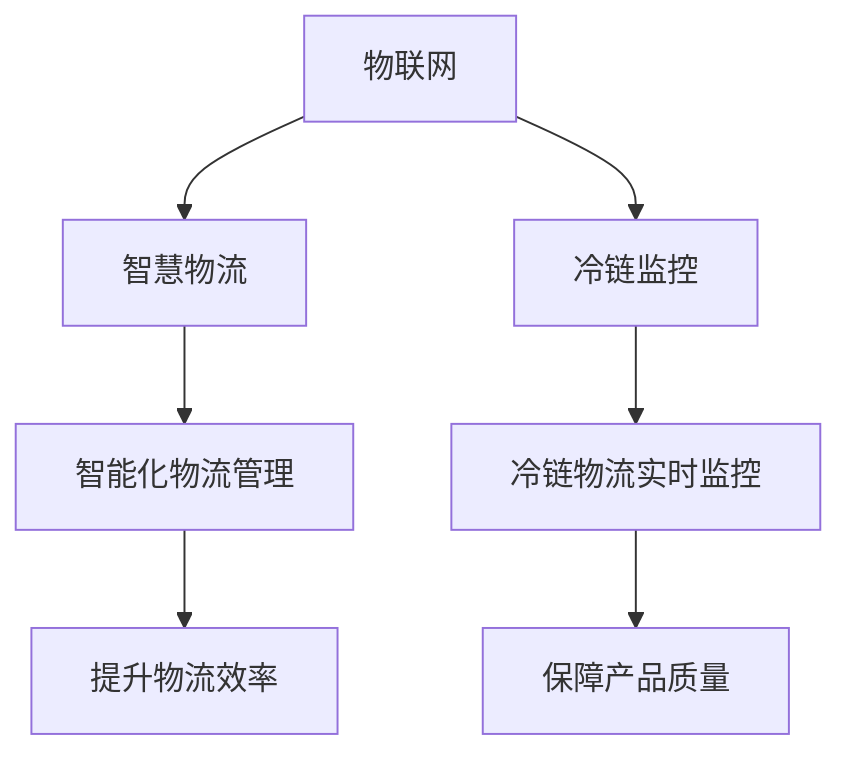
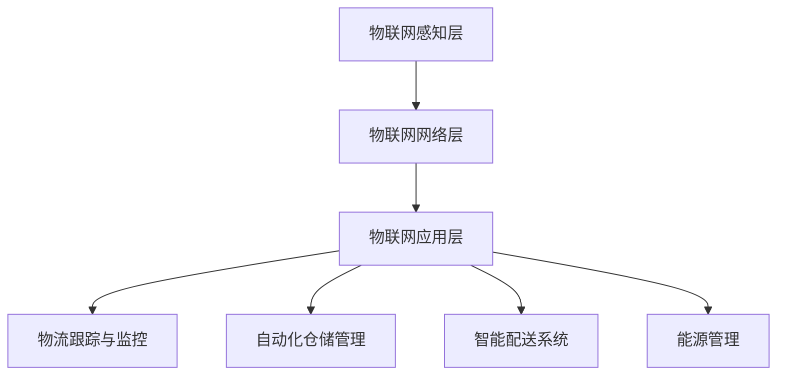
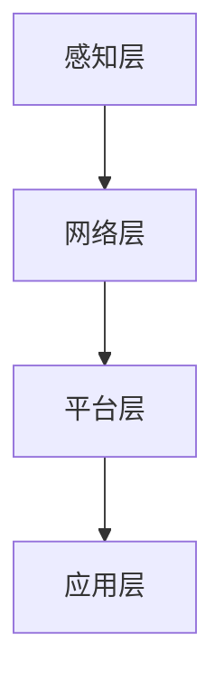
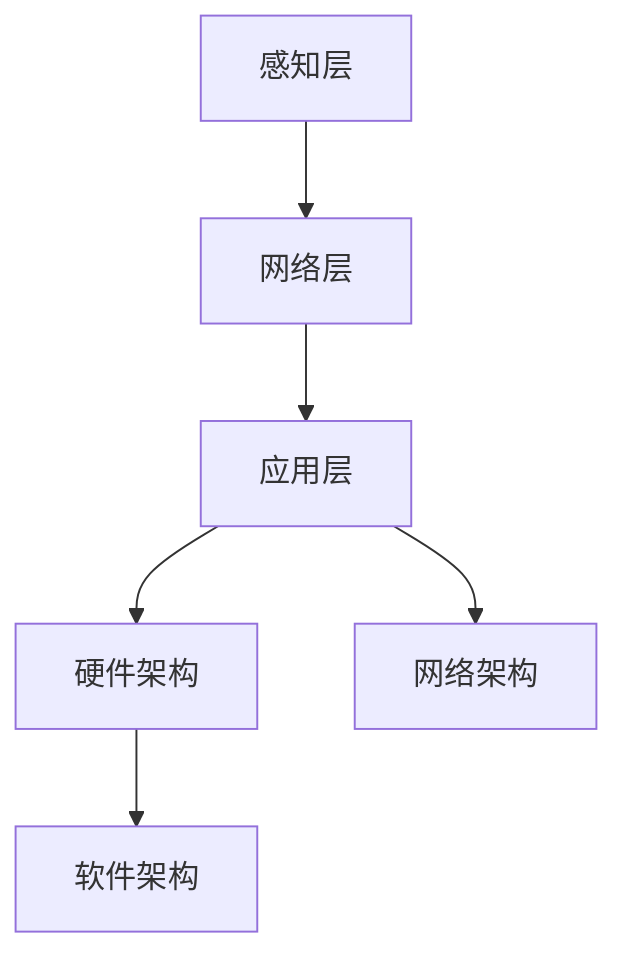
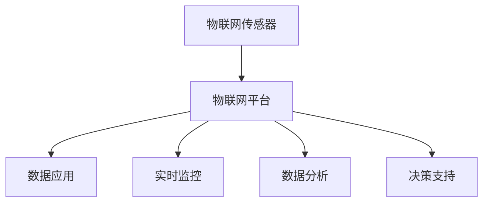
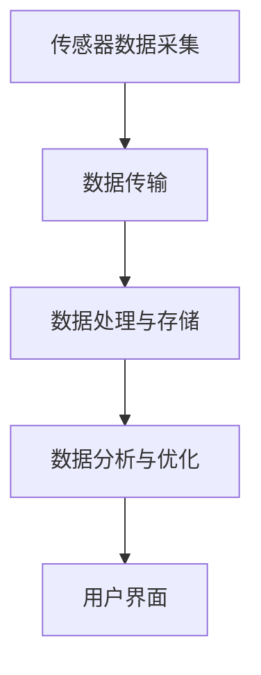
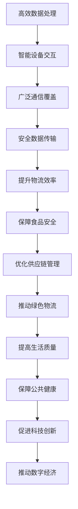

                 

### 引言

#### 1.1 物联网的基本概念

物联网（Internet of Things，简称IoT）是指通过互联网将各种物理设备、传感器、软件和网络连接起来，实现设备与设备之间、设备与人之间的互联互通。物联网技术最早可以追溯到20世纪80年代，当时美国卡内基梅隆大学的研究人员首次提出了物联网的概念。随着互联网技术的快速发展，物联网逐渐成为一项热门技术，并在各个领域得到了广泛应用。

物联网的基本原理是通过传感器、控制器和网络技术，将物理世界中的各种设备连接到互联网上，从而实现数据的采集、传输和处理。物联网的核心技术包括传感器技术、网络通信技术、数据处理技术和安全技术等。物联网的架构可以分为感知层、网络层和应用层。感知层负责数据采集，网络层负责数据传输，应用层负责数据处理和业务应用。

#### 1.1.1 物联网的定义

物联网是一个基于互联网、传统通信网等信息载体，实现智能设备之间互联互通的网络。它通过将各种传感器、设备通过网络连接起来，实现数据的采集、传输和处理，从而实现智能化管理和控制。

#### 1.1.2 物联网的特点

1. **互联互通**：物联网的核心在于连接，它将各种物理设备、传感器、网络连接起来，实现设备与设备之间、设备与人之间的互联互通。
2. **智能化**：物联网通过数据的采集、传输和处理，实现对物理世界的智能化管理和控制。
3. **海量数据**：物联网通过连接大量设备，产生海量数据，这些数据为大数据分析提供了基础。
4. **实时性**：物联网通过实时数据传输和处理，实现对物理世界的实时监控和管理。

#### 1.1.3 物联网的发展历程

1. **萌芽阶段（1980s-1990s）**：物联网的概念首次提出，各种传感器技术开始发展。
2. **初级阶段（2000s）**：互联网的普及推动物联网技术的发展，各种智能设备开始出现。
3. **发展阶段（2010s）**：物联网技术逐渐成熟，智能家居、智能交通、智能医疗等应用场景逐渐普及。
4. **融合阶段（2020s）**：物联网与云计算、大数据、人工智能等技术的深度融合，推动物联网进入智能化时代。

#### 1.2 智慧物流的概念

智慧物流是指通过物联网、大数据、云计算、人工智能等技术，实现物流系统智能化、高效化、绿色化的一种新型物流模式。智慧物流的核心在于通过技术手段，提升物流系统的运作效率，降低物流成本，提升物流服务质量。

#### 1.2.1 智慧物流的定义

智慧物流是一种基于物联网、大数据、云计算、人工智能等先进技术的物流模式，它通过智能化手段，实现物流系统的自动化、智能化管理，提高物流效率，降低物流成本，提升物流服务质量。

#### 1.2.2 智慧物流的组成部分

1. **感知层**：通过传感器、RFID等设备，实现物流信息的实时采集和感知。
2. **网络层**：通过互联网、移动互联网、物联网等技术，实现物流信息的传输和共享。
3. **平台层**：通过大数据、云计算等技术，实现物流信息的处理和分析，提供物流管理、决策支持等服务。
4. **应用层**：通过智慧物流平台，实现物流业务的智能化、自动化管理。

#### 1.2.3 智慧物流的发展背景

随着全球化经济的发展，物流需求日益增长，传统物流模式已无法满足市场需求。智慧物流通过技术手段，提升物流效率，降低物流成本，提升物流服务质量，成为现代物流发展的重要方向。

#### 1.3 冷链监控的概念

冷链监控是指通过物联网技术，对冷链物流过程中的温度、湿度等环境参数进行实时监控，确保冷链物流过程中的产品质量和安全。冷链监控在食品、医药等行业的应用具有重要意义。

#### 1.3.1 冷链监控的定义

冷链监控是指利用物联网技术，对冷链物流过程中的温度、湿度等环境参数进行实时监控，以确保冷链物流过程中的产品质量和安全。

#### 1.3.2 冷链监控的重要性

1. **保证产品质量**：冷链监控可以实时监测冷链环境参数，确保冷链物流过程中的产品质量。
2. **确保食品安全**：在食品冷链物流过程中，冷链监控可以实时监测食品温度，防止食品腐败变质，确保食品安全。
3. **提升物流效率**：冷链监控可以实时监控冷链物流过程中的问题，及时采取措施，提升物流效率。

#### 1.3.3 冷链监控的发展现状

随着物联网技术的快速发展，冷链监控技术在食品、医药等行业的应用越来越广泛。目前，冷链监控技术已趋于成熟，但仍面临一些挑战，如技术成本、数据安全问题等。

### 总结

物联网、智慧物流和冷链监控是现代物流领域的重要技术和发展趋势。物联网通过连接各种设备和传感器，实现信息的实时采集和传输；智慧物流通过物联网、大数据等技术，提升物流效率，降低物流成本；冷链监控通过物联网技术，确保冷链物流过程中的产品质量和安全。这三大技术相辅相成，共同推动现代物流的智能化发展。

#### 1.4 物联网、智慧物流和冷链监控的关系

物联网作为智慧物流和冷链监控的基础技术，起到了核心支撑作用。智慧物流通过物联网技术，实现物流系统的智能化、自动化管理，提高物流效率，降低物流成本。冷链监控则利用物联网技术，对冷链物流过程中的温度、湿度等环境参数进行实时监控，确保冷链物流过程中的产品质量和安全。

这三者之间的关系可以形象地表示为一个金字塔结构：

1. **物联网**：作为底层技术，提供设备连接和数据传输的基础。
2. **智慧物流**：作为中间层，利用物联网技术实现物流系统的智能化管理。
3. **冷链监控**：作为顶层应用，利用物联网和智慧物流技术，实现冷链物流过程的实时监控。

通过这个金字塔结构，我们可以清晰地看到物联网、智慧物流和冷链监控之间的内在联系和层次结构。物联网技术为智慧物流和冷链监控提供了基础，智慧物流和冷链监控则分别代表了物联网技术在物流和冷链领域的具体应用。

在物联网、智慧物流和冷链监控的共同推动下，现代物流正朝着智能化、高效化、绿色化的方向发展。未来，随着技术的不断进步和应用的不断深入，物联网、智慧物流和冷链监控将在物流领域发挥更加重要的作用，为物流行业带来革命性的变化。

### 总结

本文对物联网、智慧物流和冷链监控的基本概念、特点和发展历程进行了详细阐述，并分析了这三者之间的关系。物联网作为基础技术，为智慧物流和冷链监控提供了数据采集和传输的支持；智慧物流通过物联网技术实现物流系统的智能化管理，提升物流效率；冷链监控则利用物联网和智慧物流技术，确保冷链物流过程中的产品质量和安全。这三者的融合，共同推动了现代物流的智能化发展。

随着技术的不断进步和应用场景的不断拓展，物联网、智慧物流和冷链监控将在物流领域发挥越来越重要的作用。未来，我们可以期待这三个领域的技术进一步融合，带来更加智能化、高效化的物流解决方案，为物流行业的发展注入新的动力。同时，我们也需要关注这些技术在应用过程中可能面临的技术挑战、安全问题和成本问题，以确保物联网、智慧物流和冷链监控的健康发展。

---

**图1：物联网、智慧物流和冷链监控的关系金字塔结构**

通过这个Mermaid流程图，我们可以更加直观地理解物联网、智慧物流和冷链监控之间的关系及其在物流领域中的具体作用。图中的每个节点都代表了相关技术的核心功能和应用场景，箭头则表示技术之间的依赖和联系。

### 物联网技术基础

#### 2.1 物联网的基本原理

物联网（IoT）是一个由各种设备、传感器、网络和系统组成的网络，这些设备能够相互通信、共享数据并协同工作，以实现智能化管理和自动化控制。物联网的基本原理主要围绕数据采集、传输和处理三个核心环节展开。

#### 2.1.1 物联网的核心技术

1. **传感器技术**：传感器是物联网系统的感知器官，负责将物理世界的各种信息转换为电信号或其他形式的数据。常见的传感器包括温度传感器、湿度传感器、压力传感器、光敏传感器等。

2. **网络通信技术**：网络通信技术是物联网系统的传输层，负责将传感器采集到的数据传输到中心处理系统。常用的网络通信技术包括Wi-Fi、蓝牙、Zigbee、NB-IoT、LoRa等。

3. **数据处理技术**：数据处理技术负责对收集到的数据进行分析、处理和存储，从而提取有用的信息。大数据技术和云计算技术在数据处理中发挥着重要作用。

4. **安全技术**：随着物联网系统的日益复杂，安全成为不可忽视的问题。安全技术包括数据加密、身份认证、访问控制等，旨在保护数据的安全和隐私。

#### 2.1.2 物联网的架构

物联网的架构通常分为三个层次：感知层、网络层和应用层。

1. **感知层**：感知层是物联网系统的最底层，负责数据采集。它由各种传感器、执行器和采集设备组成，能够实时监测和采集物理世界的各种信息。

2. **网络层**：网络层负责数据的传输和共享。它通过有线和无线网络将感知层采集到的数据传输到中心处理系统。网络层通常包括传感器网络、移动通信网络和互联网。

3. **应用层**：应用层是物联网系统的最高层，负责数据处理和业务应用。它利用收集到的数据提供各种智能化服务和应用，如智能监控、智能交通、智能家居等。

#### 2.1.3 物联网的通信协议

物联网通信协议是物联网系统中的通信规则，用于确保不同设备和系统之间的有效通信。以下是一些常见的物联网通信协议：

1. **Wi-Fi**：无线局域网通信协议，广泛用于家庭和商业环境中的无线网络连接。

2. **蓝牙**：短距离无线通信协议，常用于智能家居设备和可穿戴设备之间的通信。

3. **Zigbee**：低功耗无线通信协议，适用于智能家居、工业自动化等领域。

4. **NB-IoT**：窄带物联网通信协议，主要用于远程监控和低功耗设备通信。

5. **LoRa**：广域网通信协议，适用于长距离、低功耗的物联网应用。

#### 2.2 物联网在智慧物流中的应用

物联网技术在智慧物流中的应用主要体现在物流过程的自动化、实时监控和优化管理上。以下是物联网在智慧物流中的几个关键应用：

1. **物流跟踪与监控**：物联网技术可以实现物流运输过程中的实时跟踪和监控。通过在货物上安装传感器和RFID标签，可以实时追踪货物的位置、状态和温度等参数。

2. **自动化仓储管理**：物联网技术可以实现仓储管理的自动化。通过传感器和执行器，仓库可以自动进行货物的存取和分类，提高仓储效率。

3. **智能配送**：物联网技术可以实现智能配送。通过智能路由和实时交通信息，配送车辆可以自动选择最优路线，提高配送效率。

4. **能源管理**：物联网技术可以实现仓库和运输过程中的能源管理。通过监测和优化能源使用，降低能源消耗和成本。

#### 2.2.1 物联网在智慧物流中的作用

物联网在智慧物流中的作用主要体现在以下几个方面：

1. **提高物流效率**：物联网技术可以实现物流过程的自动化和智能化，减少人工干预，提高物流效率。

2. **降低物流成本**：通过实时监控和优化管理，物联网技术可以帮助企业降低物流成本。

3. **提升物流服务质量**：物联网技术可以实现物流过程的实时监控和预警，提高物流服务质量。

4. **增强供应链管理**：物联网技术可以帮助企业更好地管理供应链，提高供应链的透明度和灵活性。

#### 2.2.2 物联网在智慧物流中的应用案例

以下是一些物联网在智慧物流中的应用案例：

1. **智能仓储系统**：通过物联网技术，企业可以实现仓储管理的自动化，提高仓库运作效率。例如，京东的无人仓库采用物联网技术，实现货物的自动存取和分类。

2. **冷链物流监控**：物联网技术可以实现对冷链物流过程的实时监控，确保冷链产品的质量和安全。例如，某医药公司通过物联网技术监控疫苗的运输过程，确保疫苗在运输过程中的温度保持在规定范围内。

3. **智能配送系统**：通过物联网技术，企业可以实现智能配送，提高配送效率。例如，亚马逊的无人机配送系统利用物联网技术实现无人配送，提高了配送速度。

4. **物流跟踪系统**：物联网技术可以实现对物流运输过程的实时跟踪和监控，提高物流过程的透明度。例如，顺丰的物流跟踪系统利用物联网技术，实现物流信息的实时更新，提高了客户满意度。

#### 2.2.3 物联网在智慧物流中的挑战

尽管物联网在智慧物流中具有巨大的潜力，但在实际应用过程中仍面临一些挑战：

1. **数据安全和隐私保护**：物联网系统涉及大量的数据采集和传输，如何确保数据的安全和隐私是一个重要问题。

2. **技术成本**：物联网技术的部署和维护成本较高，特别是对于中小企业来说，这可能是一个巨大的负担。

3. **标准化**：物联网技术涉及多种协议和标准，缺乏统一的标准化，导致不同设备和系统之间的互操作性成为难题。

4. **技术成熟度**：尽管物联网技术已经取得了显著进展，但一些关键技术的成熟度仍需提高，如高性能传感器、低功耗通信技术等。

#### 2.3 物联网在智慧物流中的解决方案

为了应对物联网在智慧物流中的挑战，可以采取以下解决方案：

1. **数据安全和隐私保护**：采用加密技术和安全协议，确保数据在传输和存储过程中的安全。同时，建立数据隐私保护机制，确保用户数据不被非法访问。

2. **降低技术成本**：通过规模化生产和技术创新，降低物联网设备的成本。对于中小企业，可以提供成本效益更高的物联网解决方案。

3. **标准化**：推动物联网技术的标准化，提高不同设备和系统之间的互操作性。国际标准化组织（ISO）和国际电工委员会（IEC）等机构已经在开展相关工作。

4. **技术成熟度**：加大研发投入，推动物联网关键技术的成熟和应用。同时，加强产业链上下游的合作，共同推动物联网技术的发展。

### 总结

物联网技术在智慧物流中的应用，为物流行业带来了前所未有的变革。通过物联网技术，企业可以实现物流过程的自动化、实时监控和优化管理，提高物流效率，降低物流成本，提升物流服务质量。然而，物联网在智慧物流中仍面临一些挑战，如数据安全和隐私保护、技术成本、标准化和技术成熟度等。通过采取有效的解决方案，可以克服这些挑战，推动物联网在智慧物流中的广泛应用。

---

**图2：物联网在智慧物流中的应用架构**

通过这个Mermaid流程图，我们可以直观地了解物联网在智慧物流中的应用架构及其关键作用。每个节点代表了物联网架构的一个层次或应用领域，箭头则表示不同层次和应用之间的联系和协同。

### 智慧物流的发展背景

#### 3.1.1 传统物流的局限

传统物流模式在全球化经济快速发展的背景下，面临着一系列的局限和挑战。首先，传统物流主要依赖于人工操作和纸质记录，导致物流过程效率低下。其次，传统的物流信息管理系统较为单一，无法实现全流程的实时监控和数据分析。此外，传统物流在应对紧急情况时，反应速度较慢，难以满足现代物流对灵活性和响应速度的要求。

#### 3.1.2 智慧物流的兴起

随着信息技术、物联网技术、大数据技术和人工智能技术的快速发展，智慧物流作为一种新型物流模式应运而生。智慧物流通过引入这些先进技术，实现了物流过程的自动化、智能化和高效化，有效解决了传统物流的局限。

智慧物流的兴起源于以下几个方面：

1. **需求驱动**：随着消费者对物流服务质量和效率的要求越来越高，传统物流模式已无法满足市场需求，智慧物流成为提升物流服务质量的重要手段。

2. **技术进步**：信息技术的飞速发展，为物流行业提供了丰富的技术手段，如物联网、大数据、云计算、人工智能等，这些技术的融合为智慧物流的发展提供了坚实基础。

3. **政策支持**：各国政府纷纷出台相关政策，鼓励和推动智慧物流的发展，如我国发布的《中国智能物流发展报告》等，为智慧物流的发展创造了良好的政策环境。

#### 3.1.3 智慧物流的机遇与挑战

智慧物流在发展过程中既面临着巨大的机遇，也面临诸多挑战。

**机遇：**

1. **提升物流效率**：智慧物流通过自动化和智能化手段，大幅提升了物流效率，降低了物流成本，为企业创造了更大的价值。

2. **优化供应链管理**：智慧物流可以实现全流程的实时监控和数据分析，帮助企业优化供应链管理，提高供应链的透明度和灵活性。

3. **提升客户体验**：智慧物流可以提供更加精准和高效的物流服务，提升客户满意度，增强企业的市场竞争力。

**挑战：**

1. **技术成本**：智慧物流的部署和维护成本较高，特别是对于中小企业来说，这可能是巨大的负担。

2. **数据安全和隐私保护**：智慧物流涉及大量的数据采集和传输，如何确保数据的安全和隐私是一个重要问题。

3. **标准化**：智慧物流涉及多种技术和协议，缺乏统一的标准化，导致不同设备和系统之间的互操作性成为难题。

4. **技术成熟度**：尽管智慧物流技术已取得显著进展，但一些关键技术的成熟度仍需提高，如高性能传感器、低功耗通信技术等。

#### 3.2 智慧物流的关键技术

智慧物流的发展离不开一系列关键技术的支持，这些技术包括物联网技术、大数据技术、云计算技术和人工智能技术等。

1. **物联网技术**：物联网技术是实现智慧物流的基础，通过传感器和设备连接，实现物流信息的实时采集和传输。

2. **大数据技术**：大数据技术用于处理和分析大量的物流数据，为智慧物流提供数据支持，优化物流流程。

3. **云计算技术**：云计算技术提供强大的计算和存储能力，支持智慧物流平台的运行，实现物流数据的集中管理和处理。

4. **人工智能技术**：人工智能技术用于智慧物流的智能决策和优化，如智能路由规划、智能配送等。

#### 3.3 智慧物流的发展趋势

智慧物流的发展趋势主要体现在以下几个方面：

1. **智能化**：随着人工智能技术的进步，智慧物流将进一步实现智能化，提高物流系统的自组织和自适应能力。

2. **绿色化**：智慧物流将更加注重环保和可持续发展，通过优化物流流程和减少运输距离，降低碳排放和能源消耗。

3. **协同化**：智慧物流将实现物流产业链的协同化，通过信息共享和资源共享，提高物流系统的整体效率。

4. **全球化**：随着全球化的深入发展，智慧物流将更加注重跨国的物流服务和供应链管理，提高全球物流的效率。

#### 3.4 智慧物流的组成部分

智慧物流由感知层、网络层、平台层和应用层四个部分组成。

1. **感知层**：感知层由各种传感器和执行器组成，负责实时采集物流过程中的各种数据。

2. **网络层**：网络层由通信网络组成，负责数据的传输和共享。

3. **平台层**：平台层由数据处理和分析系统组成，负责对收集到的数据进行分析和处理，提供物流管理和决策支持。

4. **应用层**：应用层由各种物流服务应用组成，如物流跟踪、智能仓储、智能配送等。

### 总结

智慧物流作为现代物流发展的重要方向，通过引入物联网、大数据、云计算和人工智能等先进技术，实现了物流过程的智能化、高效化和绿色化。尽管智慧物流在发展过程中面临一些挑战，但其在提升物流效率、优化供应链管理和提升客户体验等方面具有巨大的潜力。未来，随着技术的不断进步和应用场景的不断拓展，智慧物流将在物流领域发挥更加重要的作用，推动物流行业的转型升级。

---

**图3：智慧物流的组成部分**

通过这个Mermaid流程图，我们可以清晰地了解智慧物流的组成部分及其相互关系。每个部分都代表了智慧物流体系中的一个关键环节，箭头则表示不同层次之间的联系和协同。

### 冷链监控的基本原理

#### 4.1 冷链监控的定义

冷链监控是指通过物联网技术，对冷链物流过程中的温度、湿度等环境参数进行实时监控，以确保冷链物流过程中的产品质量和安全。冷链监控在食品、医药等行业的应用具有重要意义。

#### 4.1.1 冷链监控的定义

冷链监控是一种利用物联网技术，对冷链物流过程中的环境参数进行实时监测和控制的系统。它主要包括对温度、湿度、压力等关键参数的监测，以确保冷链物流过程中的产品质量和安全性。

#### 4.1.2 冷链监控的目标

冷链监控的主要目标是：

1. **确保产品质量**：通过实时监测温度、湿度等环境参数，确保冷链产品在整个运输过程中的质量不受影响。
2. **保障食品安全**：在食品冷链物流过程中，通过实时监测食品温度，防止食品腐败变质，保障食品安全。
3. **提高物流效率**：通过实时监控冷链物流过程中的问题，及时采取措施，提高物流效率。

#### 4.1.3 冷链监控的必要性

冷链监控在食品、医药等行业的必要性体现在以下几个方面：

1. **食品安全保障**：食品在冷链运输过程中，如果温度控制不当，会导致食品腐败变质，影响食品质量和安全。冷链监控可以实时监测温度，确保食品在适宜的温度下运输，保障食品安全。
2. **药品质量保障**：药品在运输过程中，温度和湿度等因素会直接影响药品的有效性和安全性。冷链监控可以实时监测药品运输过程中的温度、湿度等环境参数，确保药品质量。
3. **提高物流效率**：通过冷链监控，可以实时了解冷链物流过程中的问题，及时采取措施，减少因环境参数异常导致的物流延误和损失，提高物流效率。

#### 4.2 冷链监控的技术原理

冷链监控的技术原理主要包括传感器技术、通信技术和数据处理技术。

##### 4.2.1 传感器技术

传感器技术是冷链监控的核心，负责采集冷链物流过程中的温度、湿度、压力等环境参数。常用的传感器包括：

1. **温度传感器**：用于监测冷链物流过程中的温度变化，常见的有热电偶、热敏电阻等。
2. **湿度传感器**：用于监测冷链物流过程中的湿度变化，常见的有电容式、电阻式等。
3. **压力传感器**：用于监测冷链物流过程中的压力变化，常见的有电容式、电阻式等。

##### 4.2.2 通信技术

通信技术负责将传感器采集到的环境参数传输到监控中心。常用的通信技术包括：

1. **无线通信技术**：如Wi-Fi、蓝牙、Zigbee等，适合短距离、高数据传输率的场景。
2. **有线通信技术**：如以太网、光纤等，适合长距离、高稳定性的场景。
3. **卫星通信技术**：在偏远地区，卫星通信可以提供可靠的通信服务。

##### 4.2.3 数据处理技术

数据处理技术负责对传感器采集到的环境参数进行处理和分析，提取有用信息，为冷链监控提供决策支持。常用的数据处理技术包括：

1. **数据采集与存储**：将传感器采集到的数据实时传输到数据中心进行存储，便于后续分析和处理。
2. **数据清洗与预处理**：去除数据中的噪声和异常值，提高数据质量。
3. **数据分析与挖掘**：使用统计分析、机器学习等方法，对数据进行分析和挖掘，提取有价值的信息。

#### 4.3 冷链监控的架构

冷链监控的架构可以分为三个层次：感知层、网络层和应用层。

##### 4.3.1 硬件架构

冷链监控的硬件架构主要由传感器、数据采集模块和通信模块组成。

1. **传感器**：负责监测冷链物流过程中的温度、湿度、压力等环境参数。
2. **数据采集模块**：将传感器采集到的数据转换为数字信号，并通过通信模块传输到监控中心。
3. **通信模块**：负责数据传输，常用的通信技术有Wi-Fi、蓝牙、Zigbee等。

##### 4.3.2 软件架构

冷链监控的软件架构主要包括数据采集与传输模块、数据处理与分析模块和用户界面模块。

1. **数据采集与传输模块**：负责采集传感器数据，并通过通信模块将数据传输到数据中心。
2. **数据处理与分析模块**：负责对传感器数据进行处理和分析，提取有用信息，为冷链监控提供决策支持。
3. **用户界面模块**：提供数据可视化功能，用户可以通过用户界面实时监控冷链物流过程中的环境参数，并接收报警信息。

##### 4.3.3 网络架构

冷链监控的网络架构可以分为有线网络和无线网络两部分。

1. **有线网络**：主要用于数据传输，常用的技术有以太网、光纤等。
2. **无线网络**：主要用于传感器和监控中心之间的数据传输，常用的技术有Wi-Fi、蓝牙、Zigbee等。

#### 4.4 冷链监控的应用领域

冷链监控在食品、医药、化工等多个行业都有广泛的应用。

##### 4.4.1 食品行业

在食品行业，冷链监控主要用于生鲜食品、冷冻食品和加工食品的运输和储存过程中。通过实时监测食品的温度、湿度等环境参数，确保食品在适宜的环境下运输和储存，防止食品腐败变质。

##### 4.4.2 医药行业

在医药行业，冷链监控主要用于疫苗、血液、药品等需要低温储存和运输的产品。通过实时监测运输过程中的温度、湿度等环境参数，确保医药产品在规定的温度范围内运输，保证药品的有效性和安全性。

##### 4.4.3 化工行业

在化工行业，冷链监控主要用于易燃易爆、有毒有害等危险化学品的运输和储存过程中。通过实时监测环境参数，确保化学品在安全的环境下运输和储存，防止事故发生。

### 总结

冷链监控作为物联网技术在物流领域的一个重要应用，通过实时监测冷链物流过程中的环境参数，确保产品的质量和安全，对食品、医药等行业的健康发展具有重要意义。冷链监控的技术原理主要包括传感器技术、通信技术和数据处理技术，其架构包括感知层、网络层和应用层。未来，随着物联网技术的不断进步，冷链监控将发挥更加重要的作用，为各行业的物流过程提供更加智能、高效和安全的管理方案。

---

**图4：冷链监控的技术架构**

通过这个Mermaid流程图，我们可以清晰地了解冷链监控的技术架构及其组成部分。每个部分都代表了冷链监控系统的一个关键环节，箭头则表示不同层次和部分之间的联系和协同。

### 物联网在冷链监控中的应用

#### 5.1 物联网在冷链监控中的应用场景

物联网技术在冷链监控中的应用场景广泛，涵盖了食品、医药、化工等多个行业。以下是几个典型的应用场景：

##### 5.1.1 食品冷链监控

在食品冷链监控中，物联网技术主要用于生鲜食品、冷冻食品和加工食品的运输和储存过程中。通过在食品运输车辆、仓库等地方安装传感器，实时监测食品的温度、湿度等环境参数，确保食品在整个物流过程中的质量和安全。例如，某生鲜电商平台利用物联网技术，对生鲜食品的运输过程进行全程监控，实现了对食品质量的精确控制。

##### 5.1.2 医药冷链监控

在医药冷链监控中，物联网技术主要用于疫苗、血液、药品等需要低温储存和运输的产品。通过实时监测运输过程中的温度、湿度等环境参数，确保医药产品在规定的温度范围内运输，保证药品的有效性和安全性。例如，某药品生产企业通过物联网技术，对其生产的疫苗进行全程监控，确保疫苗在运输过程中始终处于安全的温度范围内。

##### 5.1.3 电商冷链监控

在电商冷链监控中，物联网技术主要用于电商平台的生鲜食品、冷冻食品等商品的运输和配送过程中。通过在配送车辆、仓库等地方安装传感器，实时监测商品的温度、湿度等环境参数，确保商品在运输过程中的质量和安全。例如，某电商巨头通过物联网技术，对其冷链配送过程进行全程监控，提高了冷链配送的效率和客户满意度。

##### 5.1.4 化工冷链监控

在化工冷链监控中，物联网技术主要用于易燃易爆、有毒有害等危险化学品的运输和储存过程中。通过实时监测环境参数，确保化学品在安全的环境下运输和储存，防止事故发生。例如，某化工公司通过物联网技术，对其运输过程中的危险化学品进行全程监控，确保化学品在运输过程中的安全。

#### 5.2 物联网在冷链监控中的解决方案

物联网在冷链监控中的应用解决方案主要包括传感器、物联网平台和数据应用三个方面。

##### 5.2.1 物联网传感器

物联网传感器是冷链监控系统的核心组成部分，负责监测冷链物流过程中的温度、湿度等环境参数。常见的物联网传感器包括温度传感器、湿度传感器、压力传感器等。这些传感器可以实时采集环境参数，并通过物联网技术将数据传输到物联网平台。

##### 5.2.2 物联网平台

物联网平台是冷链监控系统的中枢，负责接收和处理传感器采集到的数据，并提供数据存储、分析和可视化功能。物联网平台通常包括以下几个模块：

1. **数据采集与传输模块**：负责接收传感器数据，并通过无线或有线网络将数据传输到平台。
2. **数据处理与分析模块**：负责对传感器数据进行处理和分析，提取有用信息，如温度变化趋势、异常值检测等。
3. **数据存储模块**：负责将处理后的数据存储到数据库中，便于后续分析和查询。
4. **数据可视化模块**：负责将数据以图表、仪表盘等形式展示，提供直观的监控界面。

##### 5.2.3 数据应用

物联网在冷链监控中的数据应用主要体现在以下几个方面：

1. **实时监控**：通过物联网平台，用户可以实时监控冷链物流过程中的温度、湿度等环境参数，及时发现和处理异常情况。
2. **数据分析**：通过物联网平台的数据处理和分析功能，可以对冷链物流过程中的数据进行分析，如温度变化趋势、异常值检测等，为物流优化提供数据支持。
3. **决策支持**：基于物联网平台的数据分析结果，用户可以做出更加科学的决策，如调整运输路线、优化仓储布局等，提高冷链物流的效率和安全性。

#### 5.3 物联网在冷链监控中的挑战

尽管物联网在冷链监控中具有巨大的应用潜力，但在实际应用过程中仍面临一些挑战：

##### 5.3.1 技术挑战

1. **传感器性能**：传感器是冷链监控系统的核心组件，其性能直接影响到系统的监测效果。如何提高传感器的灵敏度、精度和稳定性，是当前面临的重要技术挑战。
2. **通信稳定性**：冷链物流过程中，通信网络的稳定性和覆盖范围是保证数据传输的关键。特别是在偏远地区，通信网络的不稳定会影响冷链监控的效果。

##### 5.3.2 安全与隐私挑战

1. **数据安全**：冷链监控涉及大量的敏感数据，如温度、湿度等，如何确保数据在传输和存储过程中的安全，防止数据泄露，是重要的安全挑战。
2. **隐私保护**：在冷链监控过程中，涉及用户隐私信息的收集和传输，如配送地址、联系电话等，如何保护用户隐私，防止隐私泄露，是重要的隐私挑战。

##### 5.3.3 成本与效益挑战

1. **成本问题**：物联网技术在冷链监控中的应用，需要大量的传感器、通信设备和数据处理系统，成本较高，特别是对于中小企业来说，可能难以承受。
2. **效益问题**：物联网在冷链监控中的应用，虽然可以提高物流效率和安全性，但需要一定的时间和过程来体现其经济效益。如何平衡投入与产出，是当前面临的重要问题。

#### 5.4 物联网在冷链监控中的解决方案

为了应对物联网在冷链监控中面临的挑战，可以采取以下解决方案：

##### 5.4.1 技术优化

1. **提高传感器性能**：通过技术创新，提高传感器的灵敏度、精度和稳定性，确保冷链监控系统的监测效果。
2. **优化通信技术**：选择合适的通信技术，提高通信网络的稳定性和覆盖范围，确保数据传输的可靠性。

##### 5.4.2 安全与隐私保护

1. **数据安全措施**：采用加密技术和安全协议，确保数据在传输和存储过程中的安全，防止数据泄露。
2. **隐私保护机制**：建立隐私保护机制，对涉及用户隐私的信息进行加密和脱敏处理，确保用户隐私不被非法访问。

##### 5.4.3 成本控制

1. **规模化生产**：通过规模化生产，降低物联网设备的成本，提高性价比。
2. **需求分析**：根据实际需求，合理选择物联网设备和系统，避免过度投入。

### 总结

物联网在冷链监控中的应用，为冷链物流的智能化、高效化和安全化提供了重要支持。通过物联网传感器、物联网平台和数据应用，可以实现冷链物流过程的实时监控和数据分析，提高冷链物流的效率和安全性。尽管在应用过程中面临一些技术、安全和成本等方面的挑战，但通过技术创新和合理规划，可以有效解决这些问题，推动物联网在冷链监控中的广泛应用。未来，随着物联网技术的不断进步和应用场景的不断拓展，物联网在冷链监控中的作用将更加重要，为冷链物流的发展注入新的动力。

---

**图5：物联网在冷链监控中的应用架构**

通过这个Mermaid流程图，我们可以直观地了解物联网在冷链监控中的应用架构及其关键功能。每个节点代表了物联网在冷链监控中的一个关键组成部分，箭头则表示不同功能之间的联系和协同。

### 项目实战

#### 6.1 项目背景

随着电子商务的快速发展，生鲜食品、冷冻食品等冷链物流的需求日益增加。然而，冷链物流过程中环境参数的异常变化可能导致食品腐败变质，影响食品质量和安全性。为了提高冷链物流的效率和安全性，本项目旨在设计和实现一个基于物联网技术的冷链监控系统。

#### 6.1.1 项目简介

本项目通过在冷链物流过程中部署物联网传感器，实时监测食品运输车辆和仓库中的温度、湿度等环境参数，并将数据传输到物联网平台进行分析和处理。通过物联网平台，用户可以实时监控冷链环境参数，及时发现问题并采取措施，确保食品质量和安全。

#### 6.1.2 项目目标

本项目的主要目标包括：

1. **实时监控**：实现冷链物流过程中温度、湿度等环境参数的实时监控，确保食品质量和安全。
2. **数据分析和处理**：对监测数据进行分析和处理，提取有价值的信息，为冷链物流优化提供数据支持。
3. **提高效率**：通过实时监控和数据分析，提高冷链物流的效率和安全性，降低物流成本。

#### 6.1.3 项目意义

本项目具有重要的实际意义，主要体现在以下几个方面：

1. **保障食品安全**：通过实时监测冷链环境参数，确保食品在适宜的温度和湿度下运输和储存，防止食品腐败变质，保障食品安全。
2. **提高物流效率**：通过实时监控和数据分析，及时发现问题并采取措施，提高冷链物流的效率和准确性，降低物流成本。
3. **促进技术创新**：本项目是一个典型的物联网应用案例，通过实际项目的开发和实现，可以促进物联网技术的创新和应用。

#### 6.2 项目实施过程

本项目的实施过程主要包括以下阶段：

##### 6.2.1 需求分析

在项目启动阶段，我们对冷链物流过程中的环境参数进行了详细分析，明确了需要监测的关键参数，如温度、湿度等。同时，我们对用户需求进行了调研，确定了项目的主要功能和要求。

##### 6.2.2 系统设计

在系统设计阶段，我们根据需求分析的结果，设计了物联网冷链监控系统的架构和功能模块。系统架构包括感知层、网络层和应用层，主要功能模块包括传感器数据采集、数据传输、数据处理和分析、用户界面等。

##### 6.2.3 系统实现

在系统实现阶段，我们根据系统设计的结果，开发了物联网冷链监控系统的各个模块。具体实现过程如下：

1. **传感器数据采集**：我们选择了适合冷链环境监测的温度传感器和湿度传感器，并编写了相应的数据采集程序，实现了对温度和湿度数据的实时采集。
2. **数据传输**：我们采用了Wi-Fi技术，将传感器数据传输到物联网平台。为了提高数据传输的稳定性，我们设计了数据传输的冗余机制，确保数据能够可靠地传输到平台。
3. **数据处理和分析**：我们在物联网平台上实现了数据处理和分析功能，通过数据分析算法，提取有价值的信息，如温度变化趋势、异常值检测等。
4. **用户界面**：我们开发了用户界面，用户可以通过界面实时监控冷链环境参数，查看历史数据和报警信息。

##### 6.2.4 系统测试与优化

在系统测试与优化阶段，我们对系统进行了全面的测试和优化。具体测试内容包括：

1. **功能测试**：测试各个功能模块是否按照设计要求正常工作，如数据采集、传输、处理和分析等。
2. **性能测试**：测试系统的响应速度、数据处理能力和稳定性，确保系统能够在实时监控和数据传输方面满足要求。
3. **安全性测试**：测试系统的数据安全性和隐私保护机制，确保系统在数据传输和存储过程中能够保护用户隐私。

通过测试和优化，我们确保了物联网冷链监控系统的稳定性和可靠性，为实际应用奠定了基础。

#### 6.3 项目结果

在项目实施过程中，我们取得了以下主要成果：

1. **实时监控**：通过物联网传感器和平台，实现了冷链物流过程中温度、湿度等环境参数的实时监控，确保了食品在适宜的环境下运输和储存。
2. **数据分析**：通过数据处理和分析功能，提取了温度变化趋势、异常值检测等有用信息，为冷链物流优化提供了数据支持。
3. **提高效率**：通过实时监控和数据分析，及时发现问题并采取措施，提高了冷链物流的效率和准确性，降低了物流成本。
4. **用户满意度**：用户界面设计简洁易用，用户可以方便地实时监控冷链环境参数，提高了用户满意度。

#### 6.4 项目小结

本项目通过物联网技术，实现了冷链物流过程中的实时监控和数据管理，提高了物流效率和安全性。主要收获包括：

1. **技术积累**：在项目实施过程中，我们积累了丰富的物联网技术经验和实际应用案例，为后续项目的开发提供了参考。
2. **团队协作**：项目实施过程中，团队成员密切协作，共同解决了各种技术难题，提高了团队协作能力。
3. **用户反馈**：通过用户的实际反馈，我们了解到用户对冷链监控系统的需求，为后续产品的改进提供了方向。

未来，我们将继续优化物联网冷链监控系统，提升系统的性能和用户体验，为冷链物流的发展做出更大贡献。

---

**图6：物联网冷链监控系统架构**

通过这个Mermaid流程图，我们可以清晰地了解物联网冷链监控系统的架构及其主要功能模块。每个节点代表了系统中的一个关键环节，箭头则表示不同模块之间的数据流和功能协同。

### 结论与展望

#### 7.1 全书总结

本文从物联网、智慧物流和冷链监控的基本概念出发，深入探讨了物联网技术在智慧物流和冷链监控中的应用。通过对物联网技术基础、智慧物流概述、冷链监控基本原理以及物联网在冷链监控中的应用场景、解决方案、项目实战的详细分析，我们系统地了解了物联网在物流领域的应用价值和前景。

物联网通过连接各种设备和传感器，实现信息的实时采集和传输，为智慧物流和冷链监控提供了数据基础和技术支撑。智慧物流通过物联网技术，实现物流系统的智能化、高效化管理和优化，提高了物流效率和客户满意度。冷链监控则利用物联网技术，实现对冷链物流过程中环境参数的实时监控，确保产品质量和安全。

#### 7.1.1 物联网在智慧物流冷链监控中的应用

物联网在智慧物流和冷链监控中的应用主要体现在以下几个方面：

1. **实时监控**：通过物联网传感器，实时监测物流过程中的温度、湿度等环境参数，确保冷链产品的质量和安全。
2. **数据采集与处理**：利用物联网技术，采集大量的物流数据，通过大数据分析和云计算技术，提取有价值的信息，优化物流流程。
3. **自动化管理**：通过物联网技术，实现物流系统的自动化管理，提高物流效率，降低物流成本。
4. **决策支持**：基于物联网平台的数据分析结果，为物流管理提供科学的决策支持，提高物流系统的灵活性和响应速度。

#### 7.1.2 未来的发展方向

未来，物联网在智慧物流冷链监控中的应用将朝着以下几个方向发展：

1. **智能化**：随着人工智能技术的进步，物联网在物流领域的应用将更加智能化，实现自主决策和优化。
2. **绿色化**：物联网技术将更加注重环保和可持续发展，通过优化物流流程和减少运输距离，降低碳排放和能源消耗。
3. **全球化**：随着全球化的深入发展，物联网将助力跨国物流和全球供应链管理，提高全球物流的效率和透明度。
4. **标准化**：物联网技术的标准化将更加完善，提高不同设备和系统之间的互操作性，促进物联网技术的广泛应用。

#### 7.1.3 对未来的展望

未来，物联网在智慧物流冷链监控领域的应用将带来以下几方面的变革：

1. **物流效率的提升**：通过物联网技术的应用，物流系统将更加智能化、自动化，提高物流效率，降低物流成本。
2. **物流安全的保障**：物联网技术将实现对物流过程的全流程监控，提高物流安全性，保障冷链产品的质量和安全。
3. **客户体验的优化**：通过物联网技术，用户可以实时了解物流状态，提高物流服务的透明度和满意度。
4. **产业链的协同**：物联网技术将实现物流产业链各环节的协同，提高供应链的透明度和灵活性，推动产业链的优化和升级。

### 总结

物联网、智慧物流和冷链监控是现代物流领域的重要技术和发展趋势。物联网为智慧物流和冷链监控提供了数据采集和传输的支持，智慧物流通过物联网技术实现物流系统的智能化管理，提高物流效率，降低物流成本；冷链监控则利用物联网技术，确保冷链物流过程中的产品质量和安全。这三者的融合，共同推动了现代物流的智能化发展。

未来，随着技术的不断进步和应用场景的不断拓展，物联网、智慧物流和冷链监控将在物流领域发挥更加重要的作用，为物流行业带来革命性的变化。我们期待物联网技术能够为智慧物流和冷链监控带来更多创新和突破，推动物流行业的持续发展和进步。

### 展望未来

#### 7.2.1 技术发展趋势

未来，物联网技术在智慧物流和冷链监控中的应用将呈现出以下发展趋势：

1. **更高效的数据处理**：随着大数据技术和云计算技术的发展，物联网将能够更加高效地处理和分析海量物流数据，为物流决策提供更加精准的支持。
2. **更智能的设备交互**：随着人工智能和机器学习技术的应用，物联网设备将能够实现更智能的交互和协作，提高物流系统的自动化和智能化水平。
3. **更广的通信覆盖**：5G、LoRa等新型通信技术的应用，将使物联网在冷链监控中的通信覆盖范围更加广泛，尤其是在偏远和恶劣环境下的应用将得到提升。
4. **更安全的数据传输**：随着数据安全技术的不断进步，物联网在数据传输和存储过程中的安全性将得到显著提升，有效保护用户隐私和数据安全。

#### 7.2.2 行业前景

物联网技术在智慧物流和冷链监控领域的应用前景广阔，主要体现在以下几个方面：

1. **提升物流效率**：物联网技术将显著提升物流系统的运行效率，通过自动化和智能化管理，降低物流成本，提高物流服务质量。
2. **保障食品安全**：在食品冷链物流过程中，物联网技术能够实时监控食品运输环境，保障食品安全，减少食品浪费。
3. **优化供应链管理**：物联网技术将提升供应链的透明度和灵活性，实现供应链全过程的实时监控和优化，提高供应链的协同效率。
4. **推动绿色物流**：物联网技术将通过优化物流流程和减少运输距离，降低碳排放和能源消耗，推动绿色物流的发展。

#### 7.2.3 社会影响

物联网在智慧物流和冷链监控中的应用不仅对物流行业产生深远影响，也将对社会产生重要影响：

1. **提高生活质量**：物联网技术将提高物流效率，减少物流过程中的时间消耗，提升人们的日常生活质量。
2. **保障公共健康**：在医药冷链监控方面，物联网技术能够有效保障疫苗、药品等医疗产品的质量和安全，对公共卫生事业具有重要意义。
3. **促进科技创新**：物联网技术的发展将推动相关领域的技术创新，促进物联网产业链的快速发展，带动相关产业的转型升级。
4. **推动数字经济**：物联网技术在智慧物流和冷链监控中的应用，将促进数字经济的快速发展，推动社会经济的转型升级。

### 结语

物联网、智慧物流和冷链监控作为现代物流领域的重要技术，正在不断推动物流行业的智能化、高效化和绿色化发展。未来，随着技术的不断进步和应用场景的不断拓展，物联网技术将在智慧物流和冷链监控领域发挥更加重要的作用，为物流行业带来革命性的变化。我们期待物联网技术能够为智慧物流和冷链监控带来更多创新和突破，推动物流行业的持续发展和进步。

---

**图7：物联网在智慧物流冷链监控中的未来发展趋势**

通过这个Mermaid流程图，我们可以直观地了解物联网在智慧物流冷链监控中的未来发展趋势及其对社会产生的广泛影响。每个节点代表了技术发展的一个方向或对社会产生的一个积极影响，箭头则表示不同方向和影响之间的联系和协同。

