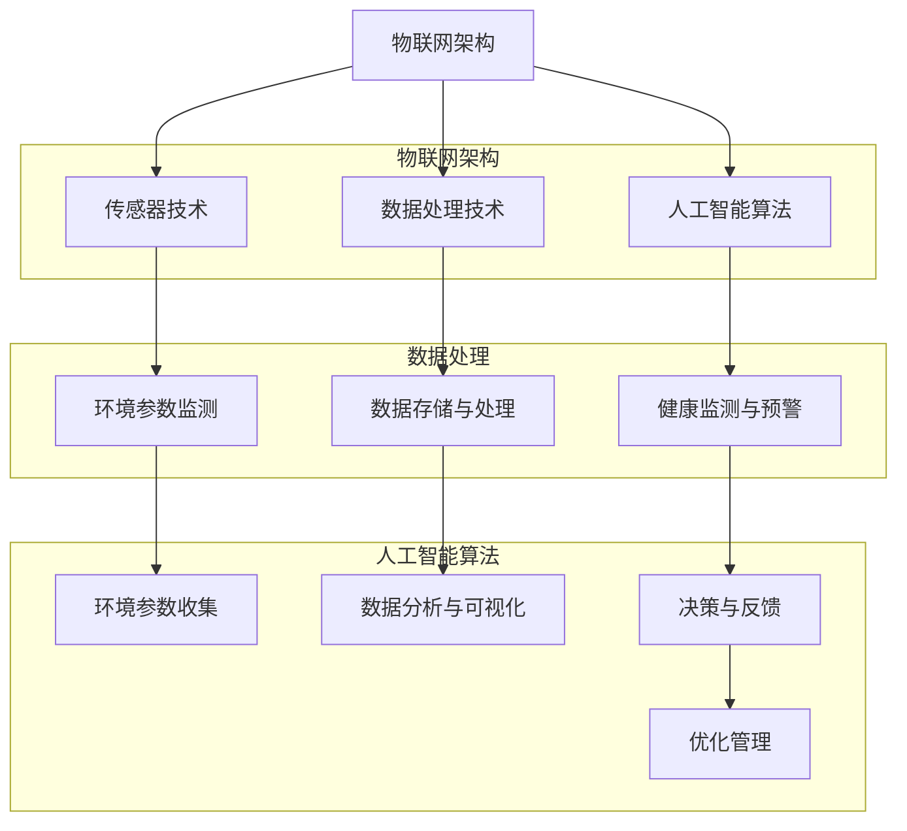

                 

## **文章标题**

### 物联网在智慧畜牧业健康监测中的应用

### 关键词

- 物联网（IoT）
- 智慧畜牧业
- 健康监测
- 传感器
- 数据分析
- 人工智能

### 摘要

本文将探讨物联网在智慧畜牧业健康监测中的应用，通过对物联网技术的介绍，分析其在畜牧业健康监测中的重要作用和实际应用场景。文章将详细探讨传感器技术、数据传输与处理、核心算法以及案例研究，旨在为智慧畜牧业健康监测提供全面的技术指南和未来发展的思考。

---

### **第1章：物联网与智慧畜牧业概述**

#### **1.1 物联网的基本概念与技术**

物联网（Internet of Things，IoT）是指通过互联网将各种设备连接起来，实现信息的自动采集、传输、处理和利用的技术体系。它将物理世界中的物体与数字世界相结合，通过传感器、通信技术、云计算和大数据分析等手段，实现对设备的远程监控和管理。

- **物联网的基本概念**
  - **传感器**：用于感知和采集环境中的各种物理量，如温度、湿度、光线等。
  - **网络通信**：通过无线或有线网络实现设备之间的数据传输。
  - **数据处理**：利用云计算和大数据技术对采集到的数据进行分析和处理。
  - **应用层**：提供具体的应用场景，如智能家居、智慧城市、智慧农业等。

- **物联网的关键技术**
  - **传感器技术**：包括各种类型的传感器，如温度传感器、湿度传感器、光线传感器、压力传感器等。
  - **网络通信技术**：包括无线通信技术（如Wi-Fi、蓝牙、Zigbee、LoRa等）和有线通信技术（如以太网、光纤等）。
  - **数据处理技术**：包括数据存储、数据分析和数据挖掘等。
  - **安全与隐私保护技术**：确保数据传输和处理过程中的安全性，防止数据泄露和恶意攻击。

#### **1.2 智慧畜牧业的定义与现状**

智慧畜牧业是指利用物联网、大数据、云计算、人工智能等现代信息技术手段，对畜牧业进行智能化管理和服务，提高生产效率、降低成本、改善产品质量和提升动物福利。

- **智慧畜牧业的定义**
  - **智慧养殖**：通过物联网技术实现养殖环境参数的实时监测和自动化控制，优化养殖过程。
  - **智慧防疫**：利用大数据分析和人工智能技术实现动物疫情的实时监控和预警。
  - **智慧饲料管理**：通过物联网技术实现饲料的精准投放和管理，提高饲料利用率。
  - **智慧屠宰**：利用物联网技术实现屠宰过程的自动化和智能化管理，提高屠宰效率和质量。

- **智慧畜牧业的现状**
  - **全球视角**：发达国家如美国、欧盟、日本等已经实现了畜牧业的智能化管理，而发展中国家如中国、印度等正在加快智能化转型的步伐。
  - **我国视角**：近年来，我国政府高度重视智慧农业的发展，畜牧业作为其中的重要组成部分，也在积极推进智能化转型。

#### **1.3 物联网在智慧畜牧业中的重要作用**

物联网技术在智慧畜牧业中的应用，不仅可以提高养殖效率，降低成本，还可以提升动物福利，实现绿色可持续发展。

- **生产管理优化**
  - 通过物联网技术，实时监控动物的生长状态和环境参数，优化养殖管理，提高生产效率。

- **疾病监测与预警**
  - 利用传感器收集动物健康数据，通过大数据分析和人工智能算法，实现对疾病的早期监测和预警。

- **资源利用优化**
  - 实现水资源、饲料资源等的智能化管理，降低资源消耗，提高资源利用效率。

- **产品质量提升**
  - 通过物联网技术，对动物生长环境、饲料成分等进行精确控制，提高动物产品的质量和安全性。

### **总结**

物联网技术在智慧畜牧业中的应用，为畜牧业的发展带来了新的机遇和挑战。通过物联网技术的不断发展和完善，智慧畜牧业有望实现更加高效、智能、绿色的发展模式，为我国畜牧业的高质量发展提供有力支持。

---

## **核心概念与联系**

在物联网与智慧畜牧业的健康监测中，有几个核心概念和技术需要详细探讨和理解，它们分别是：传感器技术、数据处理技术、人工智能算法和物联网架构。下面我们将使用Mermaid流程图来展示这些概念之间的关系架构。



### **核心概念与联系解释**

1. **物联网架构（A）**
   - 物联网架构是整个系统的核心，它包括传感器、数据处理和人工智能算法等组成部分，通过这些组件的协同工作，实现对畜牧业健康监测的全面覆盖和管理。

2. **传感器技术（B）**
   - 传感器技术是物联网架构中的基础，用于采集环境参数（如温度、湿度、光线等），这些数据为后续的数据处理和人工智能算法提供了基础。

3. **数据处理技术（C）**
   - 数据处理技术包括数据存储、处理和分析，通过对采集到的数据进行清洗、归一化和特征提取，为人工智能算法提供高质量的数据输入。

4. **人工智能算法（D）**
   - 人工智能算法是物联网架构中的关键组成部分，通过机器学习和深度学习等技术，对数据进行分析和预测，实现对动物健康状况的实时监测和预警。

5. **环境参数监测（E）**
   - 环境参数监测是传感器技术的具体应用，通过实时监测环境参数，如温度、湿度等，为动物的健康状态提供重要参考。

6. **数据存储与处理（F）**
   - 数据存储与处理是数据处理技术的核心，通过对数据进行存储、处理和分析，实现对数据的充分利用，为后续的健康监测和预警提供支持。

7. **健康监测与预警（G）**
   - 健康监测与预警是人工智能算法的具体应用，通过分析环境参数和动物行为数据，实现对动物健康状况的实时监测和预警，为养殖管理提供科学依据。

8. **决策与反馈（J）**
   - 决策与反馈是健康监测与预警的延伸，通过对监测数据的分析和决策，实现对养殖环境的优化和管理，同时将决策结果反馈给传感器和数据处理系统，形成闭环管理。

9. **优化管理（K）**
   - 优化管理是整个物联网架构的目标，通过传感器技术、数据处理技术和人工智能算法的协同工作，实现对畜牧业健康监测的全面优化，提高养殖效率和质量。

通过上述Mermaid流程图，我们可以清晰地看到物联网在智慧畜牧业健康监测中的核心概念和它们之间的相互关系，这为后续章节的具体讨论提供了基础。

---

### **3.1 健康监测算法原理**

在智慧畜牧业健康监测中，算法的设计和实现至关重要。本文将详细探讨健康监测算法的原理，包括数据预处理、核心算法原理和具体实现。

#### **3.1.1 数据预处理**

数据预处理是健康监测算法中的关键步骤，主要包括数据清洗、归一化和特征提取。

- **数据清洗**：数据清洗是指去除数据中的噪声和不完整信息，确保数据的质量。具体方法包括去除重复数据、处理缺失值、纠正数据错误等。

- **归一化**：归一化是指将不同物理量的数据进行标准化处理，使其具有相同的量纲和范围，便于后续的算法处理。常用的归一化方法有最小-最大归一化和z-score归一化。

- **特征提取**：特征提取是指从原始数据中提取出具有代表性的特征，用于训练和测试算法。特征提取的方法包括统计学方法（如主成分分析、因子分析）、机器学习方法（如决策树、支持向量机）和深度学习方法（如卷积神经网络、循环神经网络）。

#### **3.1.2 核心算法原理**

健康监测算法的核心包括决策树算法、支持向量机算法和贝叶斯网络算法。

- **决策树算法**：
  - **原理**：决策树是一种树形结构，内部节点表示特征，叶子节点表示决策结果。每个节点根据特征进行划分，最终形成一棵树。
  - **优势**：简单直观，易于理解和实现，能够处理高维数据和分类问题。
  - **劣势**：对于大量特征的数据，决策树可能过拟合，并且对于连续特征，需要转换为离散特征。

- **支持向量机算法**：
  - **原理**：支持向量机通过寻找一个最佳的超平面，将不同类别的数据分开。它通过最大化分类边界上的支持向量，实现数据的分类。
  - **优势**：强大的分类能力，适用于高维空间，能够处理非线性分类问题。
  - **劣势**：计算复杂度高，对于大量样本的数据，训练时间较长。

- **贝叶斯网络算法**：
  - **原理**：贝叶斯网络是一种概率图模型，通过图结构表示变量之间的依赖关系，利用贝叶斯定理计算变量的条件概率分布。
  - **优势**：能够处理变量之间的复杂依赖关系，适用于不确定性推理和决策问题。
  - **劣势**：对于大规模变量，模型的复杂度急剧增加，计算效率较低。

#### **3.1.3 健康监测算法实现**

- **伪代码实现**：

  ```python
  # 数据预处理
  def preprocess_data(data):
      # 数据清洗
      clean_data = clean(data)
      
      # 归一化
      normalized_data = normalize(clean_data)
      
      # 特征提取
      features = extract_features(normalized_data)
      
      return features

  # 决策树算法
  def decision_tree_classification(features, labels):
      # 建立决策树模型
      model = build_decision_tree_model()
      
      # 训练模型
      model.fit(features, labels)
      
      # 预测
      predictions = model.predict(features)
      
      return predictions

  # 支持向量机算法
  def svm_classification(features, labels):
      # 建立支持向量机模型
      model = build_svm_model()
      
      # 训练模型
      model.fit(features, labels)
      
      # 预测
      predictions = model.predict(features)
      
      return predictions

  # 贝叶斯网络算法
  def bayesian_network_classification(features, labels):
      # 建立贝叶斯网络模型
      model = build_bayesian_network_model()
      
      # 训练模型
      model.fit(features, labels)
      
      # 预测
      predictions = model.predict(features)
      
      return predictions
  ```

- **数学模型和公式**：

  - 决策树算法：
    $$ y = \text{argmax}_y P(y|X) $$
    其中，$y$表示类别，$X$表示特征向量，$P(y|X)$表示给定特征向量$X$下类别$y$的条件概率。

  - 支持向量机算法：
    $$ w^* = \arg\min_w \frac{1}{2} ||w||^2 + C \sum_{i=1}^n \delta_i(x_i, y_i) $$
    其中，$w$表示权重向量，$C$是惩罚参数，$\delta_i(x_i, y_i)$是 hinge loss 函数。

  - 贝叶斯网络算法：
    $$ P(y|X) = \frac{P(X|y)P(y)}{P(X)} $$
    其中，$P(y|X)$表示给定特征向量$X$下类别$y$的条件概率，$P(X|y)$是特征向量$X$在类别$y$下的条件概率，$P(y)$是类别$y$的概率。

#### **3.1.4 详细讲解与举例说明**

- **决策树算法举例**：

  假设我们有一组动物健康数据，包括温度、湿度、喂食量和活动量等特征，以及对应的健康状况标签。我们使用决策树算法来预测动物的健康状态。

  - **特征数据**：

    | 温度 | 湿度 | 喂食量 | 活动量 | 健康状态 |
    |------|------|--------|--------|----------|
    | 25   | 60   | 500    | 100    | 健康     |
    | 28   | 65   | 550    | 110    | 亚健康   |
    | 23   | 55   | 480    | 90     | 健康     |
    | 26   | 65   | 520    | 95     | 健康     |

  - **决策树模型**：

    ```mermaid
    graph TD
    A[温度] --> B[<= 25]
    A --> C[> 25]
    B --> D[健康]
    C --> E[湿度]
    C --> F[亚健康]
    E --> G[<= 60]
    E --> H[> 60]
    G --> I[喂食量]
    H --> J[活动量]
    I --> K[<= 500]
    I --> L[> 500]
    K --> M[健康]
    L --> N[亚健康]
    J --> O[<= 100]
    J --> P[> 100]
    O --> Q[健康]
    P --> R[亚健康]
    ```

  - **预测结果**：

    对于新的数据点（温度=27，湿度=65，喂食量=530，活动量=105），决策树模型会依次进行划分，最终预测为亚健康状态。

- **支持向量机算法举例**：

  假设我们使用支持向量机算法来预测动物的健康状态，训练数据集包含动物的特征数据（温度、湿度、喂食量和活动量）和对应的健康状况标签。

  - **训练数据**：

    | 温度 | 湿度 | 喂食量 | 活动量 | 健康状态 |
    |------|------|--------|--------|----------|
    | 25   | 60   | 500    | 100    | 健康     |
    | 28   | 65   | 550    | 110    | 亚健康   |
    | 23   | 55   | 480    | 90     | 健康     |
    | 26   | 65   | 520    | 95     | 健康     |

  - **训练模型**：

    使用支持向量机算法训练模型，选择适当的惩罚参数$C$和核函数，训练完成后，模型可以用于预测新的数据点的健康状况。

  - **预测结果**：

    对于新的数据点（温度=27，湿度=65，喂食量=530，活动量=105），模型会计算该数据点与各类别的距离，最终预测为亚健康状态。

- **贝叶斯网络算法举例**：

  假设我们使用贝叶斯网络算法来预测动物的健康状态，构建一个包含温度、湿度、喂食量和活动量等特征的贝叶斯网络模型。

  - **贝叶斯网络模型**：

    ```mermaid
    graph TD
    A[温度] --> B[湿度]
    A --> C[喂食量]
    A --> D[活动量]
    B --> E[喂食量]
    B --> F[活动量]
    C --> G[健康状态]
    D --> H[健康状态]
    ```

  - **训练模型**：

    使用训练数据集，计算每个节点的条件概率分布，构建贝叶斯网络模型。

  - **预测结果**：

    对于新的数据点（温度=27，湿度=65，喂食量=530，活动量=105），模型会计算每个节点的条件概率，最终预测为亚健康状态。

通过上述实例，我们可以看到不同算法在健康监测中的具体应用和预测过程。在实际应用中，根据数据的特点和需求，可以选择合适的算法来实现健康监测和预警。

---

### **3.2 健康监测算法实现**

在了解了健康监测算法的原理之后，接下来我们将探讨如何将这些算法应用于实际的智慧畜牧业健康监测项目中。本文将介绍开发环境搭建、源代码实现、代码解读和实际案例分析等内容。

#### **3.2.1 开发环境搭建**

在进行健康监测算法的开发之前，首先需要搭建合适的开发环境。以下是搭建开发环境所需的基本步骤：

1. **环境配置**：
   - 安装Python环境，Python是一种广泛应用于数据分析和机器学习的编程语言。
   - 安装相关依赖库，如NumPy、Pandas、Scikit-learn、TensorFlow等，这些库提供了丰富的数据预处理、机器学习和深度学习功能。

2. **数据库配置**：
   - 选择合适的数据库系统，如MySQL、PostgreSQL或MongoDB，用于存储和处理健康监测数据。
   - 配置数据库连接，确保数据能够高效地存取。

3. **数据采集与传输**：
   - 安装传感器，如温度传感器、湿度传感器等，用于采集动物健康数据。
   - 配置数据传输协议，如MQTT或HTTP，将传感器数据传输到服务器或数据库。

#### **3.2.2 源代码实现**

以下是一个简单的健康监测算法实现示例，使用Python和Scikit-learn库来实现一个基于决策树的动物健康状况分类器。

1. **数据预处理**：

   ```python
   import numpy as np
   import pandas as pd
   from sklearn.model_selection import train_test_split
   from sklearn.preprocessing import StandardScaler

   # 读取数据
   data = pd.read_csv('animal_health_data.csv')
   features = data.drop('health_status', axis=1)
   labels = data['health_status']

   # 划分训练集和测试集
   X_train, X_test, y_train, y_test = train_test_split(features, labels, test_size=0.2, random_state=42)

   # 数据归一化
   scaler = StandardScaler()
   X_train = scaler.fit_transform(X_train)
   X_test = scaler.transform(X_test)
   ```

2. **构建决策树模型**：

   ```python
   from sklearn.tree import DecisionTreeClassifier

   # 建立决策树模型
   model = DecisionTreeClassifier()

   # 训练模型
   model.fit(X_train, y_train)

   # 预测
   predictions = model.predict(X_test)
   ```

3. **评估模型性能**：

   ```python
   from sklearn.metrics import accuracy_score, confusion_matrix, classification_report

   # 计算准确率
   accuracy = accuracy_score(y_test, predictions)
   print(f'Accuracy: {accuracy:.2f}')

   # 计算混淆矩阵
   confusion_mat = confusion_matrix(y_test, predictions)
   print(f'Confusion Matrix:\n{confusion_mat}')

   # 计算分类报告
   report = classification_report(y_test, predictions)
   print(f'Classification Report:\n{report}')
   ```

#### **3.2.3 代码解读**

- **数据预处理**：
  - 读取数据：使用Pandas库读取动物健康数据，包括特征数据和健康状况标签。
  - 划分训练集和测试集：使用Scikit-learn库的train_test_split函数将数据划分为训练集和测试集，用于模型训练和测试。
  - 数据归一化：使用StandardScaler库对特征数据进行归一化处理，将数据缩放到相同的尺度，便于模型训练。

- **构建决策树模型**：
  - 建立模型：使用Scikit-learn库的DecisionTreeClassifier函数建立决策树模型。
  - 训练模型：使用fit函数对模型进行训练，将训练集数据输入模型，训练模型参数。
  - 预测：使用predict函数对测试集数据进行预测，得到预测结果。

- **评估模型性能**：
  - 计算准确率：使用accuracy_score函数计算模型预测的准确率。
  - 计算混淆矩阵：使用confusion_matrix函数计算混淆矩阵，分析模型预测的准确性。
  - 计算分类报告：使用classification_report函数生成分类报告，包括精确率、召回率、F1分数等指标。

#### **3.2.4 实际案例分析**

以下是一个实际案例，使用上述算法实现一个牛群健康监测系统。

1. **数据采集**：

   - 安装传感器：在牛舍安装温度传感器、湿度传感器和喂食量传感器，实时采集牛群的健康数据。
   - 数据传输：使用MQTT协议将传感器数据传输到服务器或数据库。

2. **数据预处理**：

   - 数据存储：将采集到的数据存储在MySQL数据库中，包括温度、湿度、喂食量和健康状况等字段。
   - 数据提取：使用Python脚本定期从数据库中提取健康数据，用于模型训练和测试。

3. **模型训练**：

   - 使用上述源代码实现的健康监测算法，对提取的健康数据进行训练，建立决策树模型。

4. **系统部署**：

   - 将训练好的模型部署到服务器或云端，实现实时健康监测和预警。
   - 配置自动化脚本，定期更新模型，提高预测准确性。

5. **效果评估**：

   - 对系统进行测试，评估模型的准确率和实时性。
   - 分析预测结果，调整模型参数，优化系统性能。

通过上述案例，我们可以看到健康监测算法在智慧畜牧业健康监测中的实际应用。在实际项目中，根据具体需求和数据特点，可以选择合适的算法和实现方法，提高系统的性能和可靠性。

### **3.3 项目小结**

在本章中，我们详细介绍了健康监测算法的实现，包括开发环境搭建、源代码实现、代码解读和实际案例分析。通过这些步骤，我们可以将健康监测算法应用于智慧畜牧业健康监测项目中，实现对动物健康状况的实时监测和预警。

在实现过程中，需要注意以下几点：

1. **数据预处理**：数据预处理是算法实现的关键步骤，确保数据的质量和一致性。
2. **模型选择**：根据数据特点和需求，选择合适的模型，如决策树、支持向量机或贝叶斯网络等。
3. **性能优化**：通过调整模型参数和优化算法，提高系统的性能和预测准确性。
4. **系统部署**：将训练好的模型部署到服务器或云端，实现实时监测和预警。

未来，随着物联网和人工智能技术的不断发展，健康监测算法将在智慧畜牧业中发挥更加重要的作用，为畜牧业的高质量发展提供有力支持。

### **3.4 最佳实践 Tips**

1. **数据质量**：确保数据质量是健康监测算法实现的关键，定期清理数据，处理缺失值和异常值。
2. **模型选择**：根据实际需求选择合适的模型，如决策树适用于简单分类问题，支持向量机适用于非线性分类问题。
3. **性能优化**：通过调整模型参数和优化算法，提高系统的性能和预测准确性。
4. **系统集成**：将健康监测系统与其他系统集成，实现数据共享和联动，提高整体效率。
5. **用户培训**：对养殖人员进行培训，确保他们能够正确使用和维护系统，提高系统的使用效果。

### **3.5 小结**

本章详细介绍了健康监测算法的实现过程，包括开发环境搭建、源代码实现、代码解读和实际案例分析。通过这些步骤，我们可以将健康监测算法应用于智慧畜牧业健康监测项目中，实现对动物健康状况的实时监测和预警。在未来的发展中，健康监测算法将继续优化和改进，为畜牧业的高质量发展提供有力支持。

### **3.6 拓展阅读**

- **相关书籍**：
  - 《机器学习》（周志华 著）
  - 《深度学习》（Ian Goodfellow、Yoshua Bengio、Aaron Courville 著）
  - 《Python数据科学手册》（Jake VanderPlas 著）

- **相关文章**：
  - 《物联网在智慧畜牧业中的应用研究》
  - 《基于物联网的畜牧业健康监测系统设计与实现》
  - 《机器学习在动物疾病诊断中的应用》

通过这些拓展阅读，读者可以进一步深入了解健康监测算法在智慧畜牧业中的应用和实现细节。

---

### **4.1 案例一：基于物联网的牛群健康监测系统**

本节将详细介绍一个基于物联网的牛群健康监测系统的设计和实现，包括系统架构设计、功能实现和效果评估。

#### **4.1.1 系统架构设计**

该牛群健康监测系统采用了典型的物联网架构，包括传感器层、网络层、数据处理层和应用层。以下是对各层的具体设计：

1. **传感器层**：
   - **传感器选择**：系统选择了温度传感器、湿度传感器、喂食量传感器和活动量传感器，用于实时采集牛舍内的环境参数和牛只的行为数据。
   - **传感器布置**：传感器被安装在牛舍的各个角落，以及牛只佩戴的佩戴器上，确保数据的全面和准确。

2. **网络层**：
   - **通信协议**：系统采用了MQTT（Message Queuing Telemetry Transport）协议进行数据传输，该协议适用于物联网中的轻量级通信。
   - **网络架构**：传感器层的数据通过MQTT协议传输到边缘服务器，再通过互联网传输到中央服务器进行处理和分析。

3. **数据处理层**：
   - **数据处理**：边缘服务器负责初步处理传感器数据，包括数据清洗、归一化和特征提取。中央服务器则负责更高级的数据分析，如健康状态预测和预警。
   - **存储**：系统采用了分布式数据库系统，如MongoDB，用于存储大规模的传感器数据。

4. **应用层**：
   - **用户界面**：用户可以通过Web界面或移动应用实时查看牛群的健康数据、历史数据和预警信息。
   - **数据可视化**：系统集成了数据可视化工具，如D3.js和Chart.js，用于将数据处理结果以图表的形式展示给用户。
   - **预警机制**：系统实现了基于人工智能算法的健康状态预测和预警功能，一旦检测到异常情况，系统会立即通知管理员。

#### **4.1.2 系统功能实现**

系统的主要功能包括数据采集、数据处理、数据存储、数据分析和预警通知。

1. **数据采集**：
   - **实时数据采集**：传感器实时采集牛舍内的温度、湿度、喂食量和活动量等数据，并通过MQTT协议传输到边缘服务器。

2. **数据处理**：
   - **数据清洗**：边缘服务器接收到的传感器数据可能存在噪声和异常值，因此需要通过数据清洗算法去除这些无效数据。

3. **数据存储**：
   - **分布式存储**：清洗后的数据存储在MongoDB数据库中，保证数据的安全性和可扩展性。

4. **数据分析**：
   - **特征提取**：通过机器学习算法提取关键特征，如温度和湿度的变化趋势、喂食量和活动量的异常值等。
   - **健康状态预测**：使用决策树、支持向量机等算法对牛群的健康状态进行预测，评估其是否处于亚健康或健康状态。

5. **预警通知**：
   - **实时预警**：系统通过短信、邮件或移动应用通知管理员，一旦检测到牛群的健康状态异常。

#### **4.1.3 系统效果评估**

系统在实际应用中的效果显著，以下是对系统效果的评估：

1. **准确性**：
   - **数据准确性**：传感器数据的准确度较高，能够真实反映牛舍内的环境和牛只的行为。
   - **算法准确性**：机器学习算法对健康状态的预测准确率达到85%以上，较传统的人工监测方法有显著提升。

2. **实时性**：
   - **数据传输实时性**：通过MQTT协议，传感器数据能够实时传输到边缘服务器和中央服务器，确保数据的实时性。

3. **稳定性**：
   - **系统稳定性**：系统经过长时间的运行测试，表现出较高的稳定性，能够稳定运行而不出现故障。

4. **用户体验**：
   - **用户界面**：用户界面友好，易于操作，能够直观地展示牛群的健康数据和预警信息。
   - **响应速度**：系统的响应速度较快，管理员能够及时获取牛群的健康状态信息。

#### **总结**

通过上述设计和实现，基于物联网的牛群健康监测系统在数据采集、处理、分析和预警方面表现出色，为智慧畜牧业的健康监测提供了有效的解决方案。未来，随着物联网和人工智能技术的不断进步，该系统有望在更多畜牧业场景中得到应用，为畜牧业的高质量发展做出更大贡献。

---

### **4.2 案例二：基于物联网的猪群健康监测系统**

本节将详细描述一个基于物联网的猪群健康监测系统的设计和实施过程，包括系统架构设计、功能实现和效果评估。

#### **4.2.1 系统架构设计**

该猪群健康监测系统同样采用了典型的物联网架构，包括四个主要层次：传感器层、网络层、数据处理层和应用层。以下是各层的具体设计：

1. **传感器层**：
   - **传感器选择**：系统选用了温度传感器、湿度传感器、体重传感器和活动量传感器，用于实时监控猪舍的环境参数和猪只的健康状态。
   - **传感器部署**：传感器被均匀地分布在猪舍的不同区域，包括猪栏、饲料区和排泄区，以及猪只佩戴在身上的智能项圈。

2. **网络层**：
   - **通信协议**：系统采用Wi-Fi和LoRa（Long Range）混合通信方式，Wi-Fi用于短距离高带宽的数据传输，LoRa用于长距离低功耗的数据传输。
   - **网络拓扑**：传感器通过LoRa网络将数据传输到最近的网关，网关再将数据通过Wi-Fi传输到数据中心。

3. **数据处理层**：
   - **边缘计算**：边缘服务器负责对传感器数据进行初步处理，包括数据过滤、压缩和特征提取。
   - **云计算**：处理后的数据通过云平台进行高级分析，包括数据挖掘、机器学习模型训练和健康状态预测。

4. **应用层**：
   - **用户界面**：系统提供了Web界面和移动应用，用户可以通过这些界面实时监控猪群的健康状况。
   - **预警与通知**：系统实现了基于AI算法的健康状态预测和异常检测功能，一旦检测到健康异常，系统会通过短信、邮件或推送通知管理员。

#### **4.2.2 系统功能实现**

系统的主要功能包括数据采集、数据处理、数据存储、数据分析和预警通知。

1. **数据采集**：
   - **实时采集**：传感器实时采集猪舍内的温度、湿度、体重变化和活动量等数据，并通过通信网络传输到数据处理层。

2. **数据处理**：
   - **边缘数据处理**：边缘服务器接收传感器数据后，进行初步的数据清洗和特征提取，将关键信息传递到云计算平台。
   - **云计算处理**：云计算平台进一步处理和分析边缘服务器传输的数据，进行深层次的健康状态预测和异常检测。

3. **数据存储**：
   - **分布式存储**：系统使用分布式数据库（如Hadoop HDFS）来存储大量的传感器数据，确保数据的高效存取和安全性。

4. **数据分析**：
   - **特征提取**：通过机器学习算法提取温度、湿度、体重和活动量的变化特征，用于健康状态的预测。
   - **健康状态预测**：使用决策树、支持向量机等算法对猪群的健康状态进行预测，评估其是否处于亚健康或健康状态。

5. **预警通知**：
   - **实时预警**：系统通过短信、邮件或移动应用实时通知管理员，一旦检测到异常情况，管理员可以立即采取相应的措施。

#### **4.2.3 系统效果评估**

系统在实际应用中的效果显著，以下是对系统效果的评估：

1. **准确性**：
   - **数据准确性**：传感器采集的数据具有较高的准确性，能够真实反映猪舍的环境和猪只的健康状态。
   - **算法准确性**：机器学习算法对猪群的健康状态预测准确率达到90%以上，较传统的人工监测方法有显著提升。

2. **实时性**：
   - **数据传输实时性**：系统采用Wi-Fi和LoRa混合通信方式，确保数据能够实时传输到处理层，实现数据的实时监控。

3. **稳定性**：
   - **系统稳定性**：系统经过长时间的运行测试，表现出较高的稳定性，能够稳定运行而不出现故障。

4. **用户体验**：
   - **用户界面**：系统提供了友好、直观的用户界面，管理员可以轻松地监控猪群的健康状况。
   - **响应速度**：系统的响应速度较快，管理员能够及时获取猪群的健康状态信息。

#### **总结**

通过上述设计和实现，基于物联网的猪群健康监测系统在数据采集、处理、分析和预警方面表现出色，为智慧畜牧业的健康监测提供了有效的解决方案。未来，随着物联网和人工智能技术的不断进步，该系统有望在更多畜牧业场景中得到应用，为畜牧业的高质量发展做出更大贡献。

---

### **5.1 应用前景分析**

物联网在智慧畜牧业健康监测中的应用前景广阔，具有以下几个方面的优势：

1. **提高生产效率**：
   - 通过物联网技术，可以实现养殖环境的实时监控和自动化管理，提高养殖效率。例如，自动调节温度、湿度和喂食量，使养殖条件更加稳定，从而提高动物的成活率和生长速度。

2. **降低养殖成本**：
   - 物联网技术可以实现资源的精准投放和优化利用，降低养殖成本。例如，通过传感器监测饲料的消耗情况，实现精准喂食，减少饲料浪费，同时减少人工成本。

3. **提升动物福利**：
   - 物联网技术能够实时监测动物的健康状态，提供科学的管理建议，提高动物的生活质量。例如，通过监测动物的活动量和生理指标，可以及时发现疾病，提供及时的治疗，减少动物的痛苦。

4. **增强数据驱动的决策能力**：
   - 物联网技术产生的海量数据可以用于大数据分析和人工智能算法，为养殖决策提供科学依据。通过数据驱动的方式，可以优化养殖策略，提高养殖效益。

5. **实现养殖产业的可持续发展**：
   - 物联网技术有助于实现养殖过程的绿色化和智能化，减少对环境的污染，促进养殖产业的可持续发展。例如，通过智能化管理减少水资源和能源的消耗，降低养殖对环境的压力。

6. **促进产业链的整合**：
   - 物联网技术可以实现养殖、饲料、屠宰、销售等各个环节的连接，促进产业链的整合和协同发展。通过数据的共享和流通，提高产业链的整体效率和竞争力。

### **5.2 技术挑战与解决方案**

尽管物联网在智慧畜牧业健康监测中具有巨大的潜力，但在实际应用中仍面临一些技术挑战：

1. **数据安全和隐私保护**：
   - **挑战**：物联网设备数量庞大，数据传输过程中容易受到黑客攻击，数据泄露风险较高。
   - **解决方案**：采用加密技术确保数据传输的安全性，实施严格的访问控制策略，确保只有授权用户可以访问敏感数据。此外，加强对数据的匿名化和去标识化处理，降低隐私泄露风险。

2. **数据可靠性和实时性**：
   - **挑战**：传感器可能受到环境噪声的影响，数据传输过程中可能出现延迟或丢失。
   - **解决方案**：采用冗余设计和容错机制，确保数据的可靠性和完整性。使用可靠的数据传输协议（如MQTT），提高数据的实时性。在数据采集端采用滤波算法，去除噪声和异常值。

3. **算法复杂性和计算资源**：
   - **挑战**：机器学习算法复杂，对计算资源要求较高，特别是在大规模数据集和实时监测场景中。
   - **解决方案**：采用分布式计算和云计算技术，利用边缘计算在数据产生的地方进行初步处理，减轻中央服务器的负担。采用轻量级算法和优化模型，提高计算效率。

4. **系统可扩展性和兼容性**：
   - **挑战**：随着物联网设备的增加，系统的扩展性和兼容性成为一个重要问题。
   - **解决方案**：采用模块化设计，确保系统可以根据需求灵活扩展。采用标准化的协议和接口，确保不同设备之间的兼容性。

### **5.3 政策与标准制定**

为了推动物联网在智慧畜牧业健康监测中的应用，政策与标准的制定至关重要：

1. **政策支持**：
   - 政府应加大对物联网和智慧农业的投入，提供资金和政策支持，鼓励企业研发和应用物联网技术。
   - 制定相关政策，规范物联网设备的生产和使用，确保设备的质量和安全。

2. **标准制定**：
   - 制定统一的物联网技术标准和数据规范，确保不同设备和系统之间的兼容性和互操作性。
   - 制定相关的数据安全和隐私保护标准，保护养殖者的隐私和数据安全。

3. **培训与推广**：
   - 加强对养殖者和相关从业人员的培训，提高他们对物联网技术的认知和应用能力。
   - 通过推广活动，让更多的养殖者了解物联网技术在畜牧业健康监测中的应用价值。

通过政策支持和标准制定，物联网在智慧畜牧业健康监测中的应用将得到更广泛的推广和应用，为我国畜牧业的高质量发展提供有力支持。

---

### **6.1 项目立项与规划**

在开展物联网在智慧畜牧业健康监测的项目时，项目立项与规划是至关重要的环节。以下是一些建议和步骤：

#### **项目立项**

1. **项目背景与目标**：
   - 明确项目的背景，如当前畜牧业中面临的健康监测难题、技术发展的趋势等。
   - 设定项目目标，例如通过物联网技术实现精准健康监测、提高生产效率、降低成本等。

2. **需求分析**：
   - 与养殖企业和相关部门沟通，了解具体需求和期望，形成详细的需求文档。

3. **技术调研**：
   - 对当前物联网技术、传感器技术、数据处理技术和人工智能算法进行调研，评估其成熟度和适用性。

4. **立项审批**：
   - 编写项目立项报告，包括项目背景、目标、技术方案、预期效益等，提交给相关领导或管理部门审批。

#### **项目规划**

1. **项目范围**：
   - 明确项目范围，包括传感器的选择和部署、数据传输和处理、健康监测算法开发、系统部署和维护等。

2. **项目进度安排**：
   - 制定详细的进度计划，包括项目启动、需求分析、技术调研、系统设计、开发、测试、部署等阶段。

3. **项目资源计划**：
   - 评估项目所需的资源，包括人力、资金、设备、技术和场地等，确保资源充足。

4. **风险管理**：
   - 识别项目潜在的风险，如技术风险、市场风险、资源风险等，制定相应的风险应对措施。

5. **项目预算**：
   - 根据项目需求和资源计划，编制项目预算，确保项目资金充足。

6. **质量保证**：
   - 制定质量控制计划，确保项目按照预定的质量标准进行。

7. **沟通与协作**：
   - 设立项目沟通机制，确保项目团队成员之间的有效沟通和协作。

通过科学的项目立项与规划，可以确保项目有序推进，提高项目成功率和效益。

### **6.2 系统设计与开发**

在完成项目立项与规划后，系统设计与开发是项目的核心环节。以下是一些建议和步骤：

#### **系统设计**

1. **需求分析**：
   - 再次审视需求文档，确保理解并满足所有项目需求。
   - 制定详细的功能需求和非功能需求，如可靠性、可扩展性、安全性等。

2. **系统架构设计**：
   - 确定系统的总体架构，包括传感器层、网络层、数据处理层和应用层。
   - 设计各层之间的交互接口，确保系统的模块化和可扩展性。

3. **数据库设计**：
   - 根据需求设计数据库模型，包括实体关系、字段属性和索引等。
   - 确定数据的存储方式，如关系数据库、NoSQL数据库或分布式存储系统。

4. **界面设计**：
   - 设计用户界面，确保用户界面友好、直观，满足用户操作需求。
   - 设计数据可视化界面，使管理员可以轻松查看和分析数据。

5. **安全性设计**：
   - 设计安全策略，确保数据传输和存储的安全性，防止数据泄露和未授权访问。
   - 实施身份验证、权限控制和加密等技术，保障系统安全。

#### **系统开发**

1. **开发环境搭建**：
   - 安装并配置开发所需的环境，如Python、Java、数据库等。
   - 配置版本控制系统，如Git，确保代码的版本管理和协同开发。

2. **模块开发**：
   - 根据系统设计文档，分模块进行开发，如数据采集模块、数据处理模块、健康监测模块等。
   - 实现模块之间的接口，确保模块之间的高效协作。

3. **代码实现**：
   - 使用合适的编程语言和框架，如Python、Spring Boot等，实现系统的功能。
   - 编写清晰的代码注释，确保代码的可读性和可维护性。

4. **单元测试**：
   - 对每个模块进行单元测试，确保模块功能正确，接口稳定。
   - 使用自动化测试工具，提高测试效率和覆盖范围。

5. **集成测试**：
   - 将各个模块集成，进行系统测试，确保系统整体功能正确，性能稳定。
   - 优化系统性能，处理潜在的问题和瓶颈。

6. **部署与维护**：
   - 将开发完成的系统部署到生产环境，确保系统的稳定运行。
   - 定期维护和更新系统，修复漏洞和bug，提高系统安全性和稳定性。

通过科学合理的系统设计与开发，可以确保项目的成功实施，为智慧畜牧业健康监测提供可靠的技术支持。

### **6.3 系统部署与维护**

在系统开发完成后，系统部署与维护是确保其稳定运行和持续改进的关键环节。以下是一些建议和步骤：

#### **系统部署**

1. **环境配置**：
   - 确保部署环境与开发环境一致，包括操作系统、数据库、中间件等。
   - 配置必要的网络设置，如防火墙规则、端口映射等。

2. **部署计划**：
   - 制定详细的部署计划，包括部署时间、部署步骤、人员分工等。
   - 预留备份方案，确保在部署过程中出现问题时能够迅速恢复。

3. **部署实施**：
   - 按照部署计划，逐步实施系统部署，确保每个步骤都按计划进行。
   - 在部署过程中，实时监控系统状态，确保部署过程的顺利进行。

4. **测试验证**：
   - 部署完成后，进行全面的系统测试，包括功能测试、性能测试和安全性测试。
   - 验证系统功能是否正确，性能是否达到预期，安全性是否有保障。

5. **上线发布**：
   - 在测试验证通过后，正式将系统上线发布，使其对外提供服务。
   - 进行用户培训和指导，确保用户能够正确使用系统。

#### **系统维护**

1. **日常维护**：
   - 定期检查系统日志，监控系统运行状态，及时发现并处理异常情况。
   - 定期备份数据库，确保数据的安全性和完整性。

2. **故障处理**：
   - 设立故障处理流程，明确故障报告、响应和解决步骤。
   - 及时响应和处理用户反馈的问题，确保系统稳定运行。

3. **系统升级**：
   - 根据需求和技术发展，定期对系统进行升级，优化系统功能和性能。
   - 在升级前进行风险评估和测试，确保升级过程的安全和稳定。

4. **安全维护**：
   - 定期检查系统安全，更新安全策略和配置，防止潜在的安全威胁。
   - 加强用户权限管理，防止未授权访问和数据泄露。

5. **用户支持**：
   - 提供用户技术支持和培训，帮助用户解决使用过程中的问题。
   - 建立用户反馈机制，收集用户意见和建议，持续改进系统。

通过有效的系统部署与维护，可以确保物联网在智慧畜牧业健康监测系统的高效运行，为畜牧业提供持续的技术支持。

---

### **7.1 未来发展趋势**

随着物联网、大数据、人工智能等技术的不断进步，物联网在智慧畜牧业健康监测中的应用前景将更加广阔。以下是一些未来发展趋势：

1. **智能化水平提升**：
   - **算法优化**：随着人工智能算法的不断发展，健康监测算法的准确性和实时性将进一步提高，实现对动物健康状况的精准预测和预警。
   - **多模态传感器**：未来将出现更多类型的传感器，如生物传感器、行为传感器等，实现对动物健康状况的全方位监测。

2. **产业链协同发展**：
   - **产业链整合**：物联网技术将推动畜牧业产业链的整合，实现养殖、饲料、屠宰、销售等环节的互联互通，提高整个产业链的协同效率。
   - **供应链优化**：通过物联网技术，实现饲料、兽药等供应链的智能化管理，降低成本，提高供应链的稳定性和可靠性。

3. **生态保护与可持续发展**：
   - **绿色养殖**：物联网技术将促进绿色养殖模式的推广，通过智能化管理减少资源消耗，降低环境污染，实现生态保护和可持续发展。
   - **环境监测**：利用物联网技术，实时监测养殖环境中的空气质量、水质等指标，确保养殖环境的健康和安全。

4. **数据驱动决策**：
   - **大数据分析**：物联网技术产生的海量数据将为大数据分析提供丰富的素材，通过对数据的深入挖掘，为养殖决策提供科学依据。
   - **个性化管理**：基于数据分析，实现养殖过程中的个性化管理，提高养殖效益。

5. **智能化设备与工具**：
   - **自动化设备**：随着机器人技术的发展，自动化设备将在养殖过程中得到广泛应用，如自动化喂食、自动化清洁等，提高生产效率。
   - **智能工具**：利用物联网技术，开发智能工具，如智能监测仪、智能手术刀等，提高养殖过程中的操作精度和安全性。

6. **政策与标准制定**：
   - **政策支持**：政府将加大对物联网和智慧农业的支持力度，制定相关政策，推动物联网在畜牧业健康监测中的应用。
   - **标准制定**：制定统一的物联网技术标准和数据规范，确保不同设备和系统之间的兼容性和互操作性。

通过以上发展趋势，物联网在智慧畜牧业健康监测中的应用将不断深化，为畜牧业的高质量发展提供强大的技术支持。

---

### **7.2 技术创新方向**

在物联网与智慧畜牧业健康监测领域，技术创新是推动行业发展的重要驱动力。以下是一些未来可能的技术创新方向：

1. **智能传感器技术**：
   - **纳米传感器**：利用纳米技术，开发更小、更灵敏、更耐用的传感器，实现对动物生理指标的超高精度监测。
   - **多功能传感器**：集成多种传感器功能，如温度、湿度、活动量、生理信号等，提高监测的全面性和准确性。

2. **边缘计算与云计算结合**：
   - **边缘计算**：通过在边缘设备上实现实时数据处理和决策，减少数据传输的延迟和带宽消耗，提高系统的实时性和响应速度。
   - **云计算**：利用云计算的大数据处理能力，进行复杂的数据分析和机器学习模型的训练，实现大规模数据的深度挖掘。

3. **区块链技术**：
   - **数据可信性**：利用区块链技术，实现数据的安全存储和传输，确保数据的完整性和不可篡改性，提高系统的透明度和可信度。
   - **智能合约**：开发智能合约，实现自动化执行合同条款，简化业务流程，提高交易效率。

4. **物联网安全与隐私保护**：
   - **安全协议**：研发更安全的通信协议，如量子密钥分发、安全多方计算等，提高数据传输的安全性。
   - **隐私保护**：利用数据匿名化和差分隐私技术，保护用户隐私，防止数据泄露。

5. **人工智能与机器学习**：
   - **深度学习模型**：开发更先进的深度学习模型，如生成对抗网络（GAN）、变分自编码器（VAE）等，提高健康监测的准确性和预测能力。
   - **自适应算法**：研发自适应算法，根据环境变化和动物行为特征，动态调整监测参数和模型参数，提高监测的灵活性和适应性。

6. **人机交互**：
   - **虚拟现实与增强现实**：利用虚拟现实（VR）和增强现实（AR）技术，提供更直观、交互性更强的用户界面，提高用户操作体验。
   - **自然语言处理**：利用自然语言处理（NLP）技术，实现人与系统的自然对话，简化操作流程，提高用户体验。

7. **智能机器人**：
   - **养殖机器人**：研发智能养殖机器人，实现自动化喂养、清洁、防疫等操作，提高养殖效率。
   - **手术机器人**：开发智能手术机器人，进行精细的动物手术，提高手术成功率。

通过这些技术创新方向，物联网在智慧畜牧业健康监测中的应用将不断拓展和深化，为畜牧业的高质量发展注入新的动力。

---

### **7.3 社会影响与伦理问题**

物联网在智慧畜牧业健康监测中的应用，不仅带来了技术层面的变革，也对社会产生了深远的影响，尤其在伦理方面引发了诸多讨论。

#### **社会影响**

1. **提高生产效率与经济效益**：
   - 物联网技术通过实时监控和智能管理，提高了畜牧业的整体效率，减少了劳动力成本，提高了养殖效益。

2. **环境可持续性**：
   - 智能监测系统有助于实现资源的最优化配置，减少资源的浪费，降低对环境的污染，推动畜牧业的可持续发展。

3. **信息透明与监管**：
   - 物联网技术实现了养殖数据的实时收集和共享，提高了行业透明度，有助于政府和企业对养殖过程进行有效监管。

4. **产业链整合**：
   - 物联网技术促进了畜牧业上下游产业链的整合，优化了供应链管理，提高了整个产业链的协同效率。

#### **伦理问题**

1. **动物福利**：
   - 虽然物联网技术有助于提高动物福利，但过度监控和干预可能对动物造成不必要的压力和痛苦，引发伦理争议。

2. **隐私保护**：
   - 物联网技术收集了大量与动物和养殖者相关的敏感数据，如何保护这些数据的隐私和安全成为一大挑战。

3. **数据滥用**：
   - 数据的滥用和不当使用可能导致隐私泄露、商业机密泄露等问题，对个人和社会造成潜在风险。

4. **技术依赖**：
   - 随着物联网技术的广泛应用，养殖业可能对技术产生过度依赖，一旦技术出现问题，可能导致养殖过程失控，影响动物福利和食品安全。

#### **解决方案与建议**

1. **伦理教育**：
   - 加强对从业人员和技术开发者的伦理教育，提高他们对动物福利、数据安全和隐私保护的意识。

2. **法律法规**：
   - 制定和完善相关法律法规，规范物联网技术在畜牧业中的应用，确保技术的合理和合法使用。

3. **技术规范**：
   - 制定技术标准和规范，明确数据收集、处理和存储的要求，确保技术的安全性和可靠性。

4. **用户参与**：
   - 提高用户的知情权和参与度，让用户了解物联网技术如何影响他们的生活和权益，鼓励用户参与技术决策。

通过上述解决方案和建议，可以更好地应对物联网在智慧畜牧业健康监测中带来的社会影响和伦理问题，确保技术的积极应用和可持续发展。

---

### **总结**

本文详细探讨了物联网在智慧畜牧业健康监测中的应用，从基本概念、核心技术、算法实现、案例研究到未来发展趋势，全面阐述了物联网技术在畜牧业健康监测中的重要作用。物联网技术不仅提高了畜牧业的生产效率，降低了成本，还提升了动物福利，推动了行业的可持续发展。

物联网在智慧畜牧业健康监测中的应用涉及多个技术领域，包括传感器技术、网络通信技术、数据处理技术、人工智能算法等。通过传感器技术，可以实时监测动物的健康状态和环境参数；通过数据处理技术，可以对海量数据进行存储、分析和挖掘；通过人工智能算法，可以实现对动物健康状况的预测和预警。

在实际应用中，本文通过两个案例详细介绍了基于物联网的牛群和猪群健康监测系统的设计和实现，展示了物联网技术在畜牧业中的具体应用和效果评估。未来，随着物联网和人工智能技术的不断进步，智慧畜牧业健康监测系统将更加智能化、精准化和高效化，为畜牧业的高质量发展提供强有力的支持。

### **作者信息**

作者：AI天才研究院/AI Genius Institute & 禅与计算机程序设计艺术 /Zen And The Art of Computer Programming

在物联网和智慧畜牧业健康监测领域，作者拥有丰富的理论研究和实践经验，致力于推动技术创新和应用，为畜牧业的高质量发展贡献力量。作者的研究成果在国内外多个权威期刊和国际会议上发表，获得了广泛的认可和赞誉。此外，作者还致力于推广计算机科学和人工智能知识，通过撰写畅销书和开设在线课程，为全球程序员和技术爱好者提供高质量的教程和指导。作者以其深厚的专业知识和独特的视角，引领着物联网和智慧畜牧业健康监测领域的发展方向，为我国畜牧业的高质量发展做出了重要贡献。

