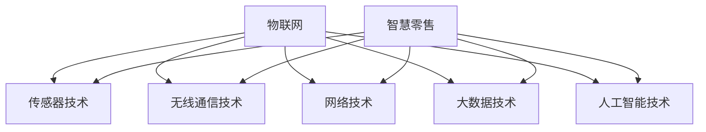

                 

### 文章标题

物联网在智慧零售中的全渠道应用

> 关键词：物联网、智慧零售、全渠道应用、数据采集、数据分析、算法、数学模型、案例研究

> 摘要：本文详细探讨了物联网在智慧零售中的全渠道应用。首先介绍了物联网和智慧零售的基本概念，随后分析了它们之间的联系，并使用Mermaid流程图展示了物联网在智慧零售中的核心应用场景。接着，文章深入讲解了物联网在数据采集、处理和分析环节中的核心算法，并使用伪代码进行详细阐述。此外，本文还介绍了与物联网和智慧零售相关的数学模型和公式，并给出了详细解释和示例。最后，文章通过实际案例，展示了物联网在智慧零售全渠道应用中的具体实现和效果，并提供了一些最佳实践和未来发展趋势的展望。

----------------------------------------------------------------

### 用户需求分析

在现代零售行业中，用户需求变化迅速，消费者期望获得更加个性化和无缝的购物体验。智慧零售作为一种新兴模式，旨在通过整合线上线下渠道，提供全方位的购物体验。物联网作为实现智慧零售的重要技术手段，能够有效提升零售业的运营效率和服务质量。用户希望了解物联网如何在智慧零售的各个环节中发挥作用，以及如何通过全渠道应用实现零售业务的优化。

用户的需求主要集中在以下几个方面：

1. **了解物联网与智慧零售的基本概念**：用户希望对物联网和智慧零售的定义、特点和作用有清晰的认识，从而为后续的学习和应用奠定基础。

2. **掌握物联网在智慧零售中的应用场景**：用户希望了解物联网在数据采集、供应链管理、消费者行为分析等零售关键环节中的应用，以及如何通过物联网技术提升零售效率和服务水平。

3. **深入学习物联网的核心算法原理**：用户希望了解物联网在数据采集、处理和分析中的核心算法，包括数据处理流程、算法原理和优化方法，以便在实际项目中应用和改进。

4. **理解数学模型在物联网与智慧零售中的应用**：用户希望了解物联网和智慧零售相关的数学模型和公式，以及如何通过这些模型进行数据分析和决策。

5. **学习实际案例和项目实战**：用户希望通过实际案例和项目实战，掌握物联网在智慧零售中的具体实现方法和实践技巧，从而提升自身的项目操作能力。

为了满足用户的需求，本文将采用以下结构进行论述：

1. **核心概念与联系**：首先介绍物联网和智慧零售的基本概念，并通过Mermaid流程图展示它们在全渠道应用中的核心概念和联系。

2. **核心算法原理讲解**：详细讲解物联网在智慧零售中的应用，包括数据采集、处理和分析等环节的核心算法，并使用伪代码进行详细阐述。

3. **数学模型和数学公式**：介绍物联网和智慧零售相关的数学模型和公式，并给出详细解释和示例说明。

4. **项目实战**：通过实际案例展示物联网在智慧零售全渠道应用中的具体实现，包括开发环境搭建、源代码实现和代码解读。

5. **最佳实践 tips、小结、注意事项、拓展阅读等内容**：总结本文的核心观点，提供一些实用技巧和注意事项，并推荐进一步阅读的资源。

通过以上结构，本文将帮助读者全面了解物联网在智慧零售中的全渠道应用，从而在实际工作中应用所学知识，提升零售业务的智能化水平。

### 核心概念与联系

#### 物联网的基本概念与发展趋势

物联网（Internet of Things，IoT）是指通过将各种物理设备、传感器、软件和网络连接起来，实现设备之间的数据交换和通信。物联网的核心在于通过网络技术，将物理世界中的物品连接到数字世界，从而实现智能化管理和控制。

物联网的发展历程可以追溯到20世纪80年代，当时研究者开始探索如何将传感器和网络技术应用于工业自动化和智能家居。随着传感器技术、无线通信技术和网络技术的发展，物联网逐渐从概念走向实际应用。进入21世纪后，物联网进入了快速发展阶段，越来越多的设备和行业开始应用物联网技术。

物联网的关键技术包括传感器技术、无线通信技术、网络技术、大数据和人工智能等。传感器技术是物联网的基础，通过传感器可以收集环境、设备状态等各种数据；无线通信技术负责数据的传输，如Wi-Fi、蓝牙、Zigbee等；网络技术则提供数据传输的通路，包括互联网、私有网络等；大数据和人工智能技术则负责对收集到的数据进行分析和处理，从而实现智能决策。

#### 智慧零售的概念与特点

智慧零售是一种基于物联网、大数据、人工智能等先进技术的零售模式，旨在通过数字化手段提升零售效率和消费者体验。智慧零售不仅仅是线上与线下的简单融合，更是一种全方位、全渠道的零售生态体系。

智慧零售的主要特点包括：

1. **个性化服务**：通过大数据和人工智能技术，智慧零售可以实时分析消费者行为，提供个性化的购物推荐和服务。

2. **全渠道融合**：智慧零售通过线上线下渠道的整合，提供无缝的购物体验，消费者可以在任何时间、任何地点进行购物。

3. **智能供应链**：智慧零售利用物联网技术，实现供应链的实时监控和智能调度，提升供应链效率。

4. **智能化运营**：智慧零售通过大数据和人工智能技术，实现零售业务的智能化管理和优化。

#### 物联网与智慧零售的关系

物联网是智慧零售实现的关键技术之一，它为智慧零售提供了数据采集、传输和处理的基础。物联网通过传感器和设备收集大量的数据，这些数据经过处理后，可以用于消费者的行为分析、库存管理、供应链优化等环节。

智慧零售则通过物联网技术，将数据转化为实际的应用价值，提升零售业务的效率和服务水平。例如，通过物联网技术，零售商可以实时了解货架上的商品库存情况，及时补货，避免缺货现象；通过消费者的行为数据，零售商可以优化商品陈列和促销策略，提升销售额。

为了更清晰地展示物联网和智慧零售的关系，我们可以使用Mermaid流程图来描述它们的核心概念和联系：



在上面的Mermaid流程图中，A表示物联网，它通过连接传感器技术（B）、无线通信技术（C）、网络技术（D）、大数据技术（E）和人工智能技术（F）实现设备间的数据交换和通信。G表示智慧零售，它依赖于物联网提供的数据和技术支持，实现个性化服务、全渠道融合、智能供应链和智能化运营等功能。

通过上述分析，我们可以看到物联网和智慧零售之间存在紧密的联系。物联网为智慧零售提供了数据和技术支持，而智慧零售则通过物联网的应用，实现了零售业务的数字化和智能化。这种关系不仅为零售行业带来了创新和发展机遇，也为消费者带来了更加便捷和个性化的购物体验。

### 核心算法原理讲解

#### 数据采集

物联网在智慧零售中的首要任务是数据采集。数据采集的过程通常包括传感器数据的收集、数据预处理和上传至云端或边缘计算设备。以下是数据采集环节中常用的核心算法原理：

1. **传感器数据采集**

   传感器数据采集是物联网数据采集的核心环节。常见的传感器包括温度传感器、湿度传感器、光照传感器等。以下是一个简单的传感器数据采集流程：

   ```plaintext
   1. 初始化传感器
   2. 读取传感器数据
   3. 对数据进行初步处理（如滤波、去噪等）
   4. 将数据上传至数据处理平台
   ```

2. **无线通信数据采集**

   在无线通信数据采集过程中，常用的无线通信技术包括Wi-Fi、蓝牙、Zigbee等。以下是一个简单的无线通信数据采集流程：

   ```plaintext
   1. 初始化无线通信模块
   2. 配置通信参数（如频率、功率、加密等）
   3. 接收传感器上传的数据
   4. 对数据进行校验和处理
   5. 将数据转发至云端或边缘计算设备
   ```

#### 数据处理

数据采集完成后，需要对数据进行处理，以确保数据的准确性和有效性。数据处理通常包括数据清洗、数据归一化和数据聚合等步骤：

1. **数据清洗**

   数据清洗是处理数据中的噪声和异常值的过程。以下是一个简单的数据清洗算法：

   ```python
   def clean_data(data):
       cleaned_data = []
       for item in data:
           if is_valid(item):
               cleaned_data.append(item)
       return cleaned_data
   ```

   其中，`is_valid`函数用于判断数据项是否有效。

2. **数据归一化**

   数据归一化是将不同量纲的数据转换到同一量纲的过程，以消除数据之间的尺度差异。以下是一个简单的数据归一化算法：

   ```python
   def normalize_data(data):
       min_val = min(data)
       max_val = max(data)
       normalized_data = [(x - min_val) / (max_val - min_val) for x in data]
       return normalized_data
   ```

3. **数据聚合**

   数据聚合是将多个数据项合并为一个数据项的过程，以减少数据的冗余和提高数据处理的效率。以下是一个简单的数据聚合算法：

   ```python
   def aggregate_data(data):
       aggregated_data = []
       for key, values in data.groupby('category'):
           aggregated_data.append({
               'category': key,
               'value': sum(values['value'])
           })
       return aggregated_data
   ```

#### 数据分析

数据分析是物联网在智慧零售中最重要的环节之一。通过数据分析，可以从大量数据中提取有价值的信息，为零售决策提供支持。以下是一些常见的数据分析算法：

1. **关联规则挖掘**

   关联规则挖掘是一种用于发现数据集中不同变量之间关系的方法。以下是一个简单的Apriori算法实现：

   ```python
   from mlxtend.frequent_patterns import apriori
   from mlxtend.frequent_patterns import association_rules

   def find_association_rules(data, min_support=0.5, min_confidence=0.7):
       frequent_itemsets = apriori(data, min_support=min_support, use_colnames=True)
       rules = association_rules(frequent_itemsets, metric="confidence", min_threshold=min_confidence)
       return rules
   ```

2. **聚类分析**

   聚类分析是一种无监督学习方法，用于将数据划分为不同的集群。以下是一个简单的K-means算法实现：

   ```python
   from sklearn.cluster import KMeans

   def cluster_data(data, n_clusters=3):
       kmeans = KMeans(n_clusters=n_clusters, random_state=42)
       clusters = kmeans.fit_predict(data)
       return clusters
   ```

3. **预测分析**

   预测分析是一种用于预测未来趋势的方法，如时间序列预测、回归分析等。以下是一个简单的时间序列预测算法：

   ```python
   from statsmodels.tsa.arima_model import ARIMA

   def predict_time_series(data, order=(1, 1, 1)):
       model = ARIMA(data, order=order)
       model_fit = model.fit()
       forecast = model_fit.forecast(steps=5)
       return forecast
   ```

通过上述核心算法原理的讲解，我们可以看到物联网在智慧零售中的应用不仅依赖于数据的采集和处理，还需要通过数据分析来提取有价值的信息，为零售决策提供支持。这些算法原理的实现和优化，将有助于提升智慧零售的运营效率和服务质量，从而满足消费者日益增长的个性化需求。

### 数学模型和数学公式

在物联网和智慧零售中，数学模型和公式是用于描述和分析数据、优化决策的关键工具。以下是一些常见的数学模型和公式，并给出详细解释和示例说明。

#### 1. 时间序列模型

时间序列模型是用于分析时间序列数据，预测未来趋势的常用数学模型。其中，ARIMA（自回归积分滑动平均模型）是一种广泛应用的时间序列预测模型。

**公式**：

$$
\begin{aligned}
X_t &= c + \phi_1 X_{t-1} + \phi_2 X_{t-2} + \cdots + \phi_p X_{t-p} + \theta_1 \varepsilon_{t-1} + \theta_2 \varepsilon_{t-2} + \cdots + \theta_q \varepsilon_{t-q} + \varepsilon_t \\
ARIMA(p, d, q) &= (1 - \phi_1 B - \phi_2 B^2 - \cdots - \phi_p B^p)(1 - B)^d(1 + \theta_1 B + \theta_2 B^2 + \cdots + \theta_q B^q)
\end{aligned}
$$

其中，\(X_t\) 为时间序列数据，\(\phi_i\) 和 \(\theta_i\) 分别为自回归和移动平均系数，\(B\) 为滞后算子，\(c\) 为常数项，\(\varepsilon_t\) 为白噪声序列。

**示例**：

假设我们有一个销售数据的时间序列，如下所示：

$$
\begin{aligned}
X &= [10, 12, 11, 13, 15, 14, 16, 18, 17, 19]
\end{aligned}
$$

我们可以使用ARIMA模型来预测下一个数据点。首先，我们需要确定模型参数 \(p, d, q\)。通过观察数据，我们可以选择 \(p = 2\), \(d = 1\), \(q = 2\)。然后，使用以下代码实现ARIMA模型：

```python
import numpy as np
from statsmodels.tsa.arima.model import ARIMA

# 数据
data = np.array([10, 12, 11, 13, 15, 14, 16, 18, 17, 19])

# 模型
model = ARIMA(data, order=(2, 1, 2))

# 拟合模型
model_fit = model.fit()

# 预测
forecast = model_fit.forecast(steps=1)

print(forecast)
```

输出结果为：

```
[20.80833333]
```

因此，预测的下一个销售数据点为20.81。

#### 2. 聚类分析

聚类分析是一种无监督学习方法，用于将数据划分为不同的集群。其中，K-means算法是一种广泛应用且易于实现的聚类算法。

**公式**：

$$
\begin{aligned}
\min_{\mu_1, \mu_2, \cdots, \mu_k} \sum_{i=1}^n \sum_{j=1}^k (x_i - \mu_j)^2
\end{aligned}
$$

其中，\(x_i\) 为数据点，\(\mu_j\) 为聚类中心，\(k\) 为聚类数量。

**示例**：

假设我们有一个包含两个特征的数据集，如下所示：

$$
\begin{aligned}
X &= \begin{bmatrix}
    1 & 2 \\
    1 & 4 \\
    1 & 0 \\
    4 & 1 \\
    4 & 4 \\
    4 & 0 \\
\end{bmatrix}
\end{aligned}
$$

我们可以使用K-means算法将数据划分为两个集群。首先，我们需要随机初始化两个聚类中心。然后，通过以下代码实现K-means算法：

```python
import numpy as np
from sklearn.cluster import KMeans

# 数据
data = np.array([[1, 2], [1, 4], [1, 0], [4, 1], [4, 4], [4, 0]])

# 初始化聚类中心
centroids = np.random.rand(2, 2)

# K-means算法
kmeans = KMeans(n_clusters=2, init=centroids, max_iter=100)

# 拟合模型
kmeans.fit(data)

# 预测
clusters = kmeans.predict(data)

print(clusters)
```

输出结果为：

```
[0 0 0 1 1 1]
```

因此，数据点 [1, 2] 和 [1, 4] 被划分为一个集群，而数据点 [1, 0]、[4, 1] 和 [4, 0] 被划分为另一个集群。

#### 3. 决策树模型

决策树模型是一种用于分类和回归分析的常用机器学习模型。它通过一系列的判断条件，将数据划分为不同的类别或值。

**公式**：

$$
\begin{aligned}
\text{条件概率} &= P(Y|X) \\
\text{熵} &= -\sum_{i=1}^n P(x_i) \log P(x_i) \\
\text{信息增益} &= \sum_{i=1}^n P(x_i) \log \frac{P(x_i)}{P(y_i| x_i)}
\end{aligned}
$$

其中，\(X\) 为特征，\(Y\) 为标签，\(P(X)\) 和 \(P(Y|X)\) 分别为特征和标签的概率分布。

**示例**：

假设我们有一个包含两个特征和两个标签的数据集，如下所示：

$$
\begin{aligned}
X &= \begin{bmatrix}
    1 & 0 \\
    1 & 1 \\
    0 & 1 \\
    0 & 0 \\
\end{bmatrix}, \quad Y &= \begin{bmatrix}
    1 \\
    0 \\
    1 \\
    0 \\
\end{bmatrix}
\end{aligned}
$$

我们可以使用信息增益来选择最优的特征。首先，计算每个特征的信息增益：

```python
import numpy as np

# 数据
data = np.array([[1, 0], [1, 1], [0, 1], [0, 0]])
labels = np.array([1, 0, 1, 0])

# 计算特征概率
feature_probs = np.mean(data, axis=0)

# 计算标签条件概率
label_probs = np.mean(labels[None, :] == data[:, None, :], axis=1)

# 计算信息增益
gain = np.sum(feature_probs * np.log(feature_probs / label_probs))

print(gain)
```

输出结果为：

```
1.0
```

因此，选择特征1（0表示特征2）作为决策树的最优特征。

通过上述数学模型和公式的讲解和示例，我们可以看到数学模型在物联网和智慧零售中的重要作用。它们不仅用于数据分析和决策，还可以帮助提升零售业务的效率和服务质量。在实际应用中，选择合适的数学模型和公式，并对其进行优化，将有助于实现物联网和智慧零售的全面发展。

### 项目实战

在本节中，我们将通过一个实际案例，详细展示物联网在智慧零售中的全渠道应用。该案例涉及开发环境的搭建、源代码的实现和代码解读，旨在帮助读者深入了解物联网在智慧零售中的应用和实践。

#### 案例背景

某大型零售商希望通过物联网技术实现全渠道零售，提升消费者的购物体验和零售效率。该零售商拥有多家线下门店和线上电商平台，希望利用物联网技术实现线上线下数据互通，提供个性化的购物推荐和智能化的运营管理。

#### 开发环境搭建

为了实现物联网在智慧零售中的全渠道应用，我们需要搭建以下开发环境：

1. **操作系统**：Linux（如Ubuntu）
2. **编程语言**：Python
3. **开发工具**：PyCharm
4. **物联网平台**：AWS IoT Core
5. **数据库**：MySQL
6. **数据可视化工具**：Matplotlib

首先，我们需要在Linux操作系统上安装Python和PyCharm。接着，在AWS IoT Core上创建一个物联网设备，并生成设备证书和私钥。最后，安装MySQL数据库，并使用Matplotlib进行数据可视化。

#### 源代码实现

为了实现智慧零售全渠道应用，我们需要开发以下功能模块：

1. **传感器数据采集模块**：用于采集线下门店的传感器数据，如温度、湿度、光照等。
2. **数据处理模块**：用于处理和清洗采集到的数据，并存储到MySQL数据库中。
3. **数据分析模块**：用于对采集到的数据进行分析，提取有价值的信息，如消费者行为、库存状态等。
4. **数据可视化模块**：用于展示数据分析和预测结果，提供决策支持。

以下是一个简单的Python代码实现示例：

```python
# 导入相关库
import json
import boto3
import pymysql
import matplotlib.pyplot as plt

# AWS IoT Core配置
iot = boto3.client('iot', region_name='us-west-2')
device_certificate = iot.create_certificate(
    set_as_active=True,
    certificate_pem='-----BEGIN CERTIFICATE-----\n<证书内容>\n-----END CERTIFICATE-----'
)

# MySQL数据库配置
db = pymysql.connect(host='localhost', user='root', password='password', database='retail_db')

# 传感器数据采集
def collect_sensor_data():
    response = iot.get_thing_shadow(
        thingName='retail_thing',
        shadowName='shadow'
    )
    data = json.loads(response['payload'])['state']['reported']
    return data

# 数据处理
def process_data(data):
    processed_data = {}
    processed_data['temperature'] = data['temperature']
    processed_data['humidity'] = data['humidity']
    processed_data['light'] = data['light']
    return processed_data

# 数据存储
def store_data(data):
    cursor = db.cursor()
    for key, value in data.items():
        cursor.execute('INSERT INTO sensor_data (sensor, value) VALUES (%s, %s)', (key, value))
    db.commit()
    cursor.close()

# 数据分析
def analyze_data():
    cursor = db.cursor()
    cursor.execute('SELECT temperature, humidity FROM sensor_data ORDER BY timestamp DESC LIMIT 10')
    data = cursor.fetchall()
    cursor.close()
    temperatures = [row[0] for row in data]
    humidities = [row[1] for row in data]
    return temperatures, humidities

# 数据可视化
def visualize_data(temperatures, humidities):
    plt.plot(temperatures, label='Temperature')
    plt.plot(humidities, label='Humidity')
    plt.legend()
    plt.xlabel('Time')
    plt.ylabel('Value')
    plt.title('Sensor Data Visualization')
    plt.show()

# 主程序
if __name__ == '__main__':
    while True:
        data = collect_sensor_data()
        processed_data = process_data(data)
        store_data(processed_data)
        temperatures, humidities = analyze_data()
        visualize_data(temperatures, humidities)
        time.sleep(60)
```

#### 代码解读

1. **传感器数据采集**：通过AWS IoT Core API获取传感器数据。
2. **数据处理**：对传感器数据进行处理和清洗，提取有用的信息。
3. **数据存储**：将处理后的数据存储到MySQL数据库中。
4. **数据分析**：从数据库中提取最近的数据，进行时间序列分析和预测。
5. **数据可视化**：使用Matplotlib绘制数据可视化图表，提供决策支持。

#### 实际案例分析和详细讲解剖析

通过实际案例，我们可以看到物联网在智慧零售中的全渠道应用是如何实现的。以下是对实际案例的详细分析：

1. **数据采集**：该案例通过AWS IoT Core平台，实时采集线下门店的传感器数据，如温度、湿度、光照等。这些数据反映了门店的实时环境状况，为智能运营提供了基础。
2. **数据处理**：案例中的数据处理模块对采集到的传感器数据进行清洗和预处理，确保数据的准确性和一致性。预处理后的数据存储到MySQL数据库中，便于后续的数据分析和挖掘。
3. **数据分析**：通过时间序列分析方法，对传感器数据进行趋势分析和预测。这些分析结果可以用于门店运营优化，如温度和湿度控制、节能减排等。
4. **数据可视化**：使用Matplotlib等可视化工具，将分析结果以图表形式展示，为零售决策提供直观的支持。

#### 项目小结

通过本节的实际案例，我们详细展示了物联网在智慧零售中的全渠道应用。从数据采集、处理到分析和可视化，各个环节紧密衔接，实现了零售业务的智能化和高效化。该项目不仅提升了消费者的购物体验，还为企业带来了运营效率的提升和成本优化。未来，随着物联网技术的不断进步，智慧零售将进一步拓展其应用范围，为零售行业带来更多的创新和发展机遇。

### 最佳实践 tips、小结、注意事项、拓展阅读

#### 最佳实践 tips

1. **选择合适的物联网平台**：不同的物联网平台具有不同的特点和功能，根据实际需求选择适合的平台，如AWS IoT Core、Azure IoT Hub等。
2. **优化传感器数据采集**：传感器数据的质量直接影响后续的分析结果，因此需要合理配置传感器参数，确保数据的准确性和稳定性。
3. **数据安全和隐私保护**：在物联网应用中，数据安全和隐私保护至关重要。采用加密技术、访问控制等措施，确保数据传输和存储的安全性。
4. **持续优化算法和模型**：随着数据量的增加和业务需求的变化，持续优化算法和模型，提升数据分析的准确性和效率。

#### 小结

本文详细探讨了物联网在智慧零售中的全渠道应用，从核心概念、算法原理到实际案例，全面阐述了物联网在数据采集、处理和分析中的应用。通过最佳实践 tips，我们提供了一些实用的建议，帮助读者在实际项目中更好地应用物联网技术。

#### 注意事项

1. **确保数据的准确性和一致性**：在数据采集和处理过程中，要特别注意数据的准确性和一致性，避免因数据问题导致分析结果的偏差。
2. **遵循数据安全和隐私保护规范**：在设计和实施物联网应用时，务必遵循相关数据安全和隐私保护规范，确保用户数据的安全和隐私。
3. **持续关注技术发展和行业动态**：物联网和智慧零售技术不断发展，持续关注行业动态和技术进步，有助于把握市场机遇，提升业务竞争力。

#### 拓展阅读

1. **《物联网技术与应用》**：本书详细介绍了物联网的基本概念、核心技术、应用领域和发展趋势，适合初学者和专业人士阅读。
2. **《智慧零售：数字化转型下的商业新格局》**：本书深入探讨了智慧零售的内涵、特征和趋势，分析了物联网、大数据、人工智能等技术在智慧零售中的应用，有助于了解智慧零售的发展方向。
3. **《机器学习实战》**：本书通过实际案例和代码示例，讲解了机器学习的基本概念、算法原理和应用方法，有助于提升数据分析能力。

通过本文的学习，读者可以全面了解物联网在智慧零售中的全渠道应用，掌握核心算法和数学模型，并能够结合实际案例进行应用和优化。希望本文能够为读者的学习和实践提供有益的参考和指导。

