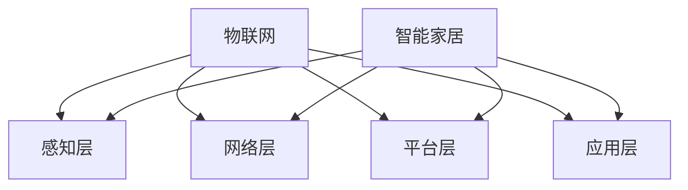

                 

### 引言

**背景介绍**

在21世纪的科技浪潮中，物联网（Internet of Things，IoT）和智能家居已成为社会发展的重要趋势。物联网通过将各种日常物品连接到互联网，实现数据的实时传输和智能控制，极大地提高了人们的生活质量和工作效率。而智能家居则是物联网技术在家居环境中的应用，通过智能设备和系统对家庭环境进行自动化管理，为用户带来便利和安全。

随着物联网和智能家居的普及，越来越多的家庭设备和个人信息被纳入网络之中，这使得隐私保护问题变得愈发重要。隐私保护不仅仅是个人权利的保障，更是社会稳定和信息安全的基础。然而，物联网和智能家居系统在数据收集、存储和处理过程中，往往面临着诸多隐私泄露的风险。因此，如何有效地保护用户隐私，成为当前亟待解决的问题。

**核心概念与联系**

物联网和智能家居的核心概念包括：物联网架构、智能设备、数据通信、中央控制系统等。这些概念相互关联，共同构成了智能家居系统的基本架构。其中，数据通信是物联网和智能家居系统中的关键环节，涉及到数据的安全性、完整性和可用性。

**隐私保护的相关概念**包括：隐私、隐私保护目标、隐私威胁类型等。这些概念是隐私保护的基础，涉及到隐私的法律定义、隐私保护的目标和原则等。

### 物联网和智能家居概述

**物联网的基本架构**

物联网的基本架构通常分为四个层次：感知层、网络层、平台层和应用层。

1. **感知层**：主要是由各种传感器组成，用于感知和采集环境信息，如温度、湿度、光照、声音等。
2. **网络层**：负责将感知层采集到的数据进行传输，包括有线网络和无线网络，如Wi-Fi、蓝牙、LoRa等。
3. **平台层**：负责数据处理、存储和分析，为应用层提供数据支持。
4. **应用层**：是物联网的最高层，直接面向用户，提供各种应用服务，如智能家居、智能城市、智能农业等。

**智能家居的组成**

智能家居系统主要由以下几个部分组成：

1. **智能设备**：包括智能灯泡、智能插座、智能门锁、智能摄像头等，这些设备可以通过互联网进行远程控制和监控。
2. **连接网络**：通常是通过Wi-Fi、蓝牙等无线网络连接，也可以通过有线网络进行连接。
3. **中央控制系统**：负责对智能设备进行集中管理和控制，如智能手机、平板电脑等。
4. **用户界面**：是用户与智能家居系统交互的界面，可以通过图形界面、语音助手等方式进行操作。

**物联网和智能家居的相互关系**

物联网为智能家居提供了技术支撑，使得各种智能设备能够互联互通，实现智能化的家居环境。而智能家居则推动了物联网的应用和发展，为物联网提供了广泛的场景和应用。物联网和智能家居的相互关系如图1所示。



图1 物联网和智能家居的相互关系

### 隐私保护相关概念

**隐私的定义**

隐私是指个人对于自己个人信息和活动的控制权，包括个人的身份、行为、健康状况、财务状况等。隐私的重要性在于，它保护了个人的人格尊严和自由，是现代社会的一项基本权利。

**隐私保护的目标和原则**

隐私保护的目标主要包括：

1. **防止个人信息泄露**：确保个人数据在收集、存储、传输和处理过程中的安全性。
2. **保护个人隐私不受滥用**：防止个人数据被未经授权的第三方使用或滥用。
3. **提高隐私保护意识**：增强用户对隐私保护的意识，使其能够更好地保护自己的个人信息。

隐私保护的原则包括：

1. **数据最小化原则**：只收集必要的个人信息，避免过度收集。
2. **数据匿名化原则**：对个人信息进行匿名化处理，降低隐私泄露的风险。
3. **数据安全原则**：确保个人数据在存储、传输和处理过程中的安全性。

**隐私威胁的类型**

隐私威胁主要包括以下几种类型：

1. **内部威胁**：包括公司内部人员、合作伙伴等，他们可能由于恶意或疏忽而泄露个人信息。
2. **外部威胁**：包括黑客、网络犯罪分子等，他们通过网络攻击等手段窃取个人数据。
3. **社会工程学攻击**：通过欺骗手段获取用户的个人信息，如钓鱼攻击、诈骗等。

### 物联网和智能家居中的隐私保护技术

**加密技术**

加密技术是保护物联网和智能家居中数据安全的重要手段。通过加密，可以将原始数据转换为难以理解的密文，只有合法的接收者才能解密并恢复原始数据。

**加密技术的原理**

加密技术的基本原理是将原始数据通过加密算法进行转换，得到加密后的数据（密文）。加密算法可以分为对称加密和非对称加密两种。

- **对称加密**：加密和解密使用相同的密钥，如AES算法。
- **非对称加密**：加密和解密使用不同的密钥，加密使用公钥，解密使用私钥，如RSA算法。

**加密技术的应用**

1. **数据传输加密**：在物联网设备之间的数据传输过程中，使用加密技术确保数据的安全性。
2. **数据存储加密**：在物联网设备或云平台中存储数据时，使用加密技术保护数据不被未经授权的访问。

**认证技术**

认证技术是确保物联网和智能家居系统中通信双方身份的真实性和合法性。通过认证，可以防止未授权的设备或用户访问系统。

**认证技术的原理**

认证技术的基本原理是使用认证协议，对设备的身份进行验证。常见的认证技术包括：

1. **用户认证**：验证用户身份，确保只有授权用户可以访问系统。
2. **设备认证**：验证设备身份，确保只有合法的设备可以加入网络。

**认证技术的应用**

1. **用户认证**：在智能家居系统中，用户通过密码、指纹、面部识别等方式进行身份验证。
2. **设备认证**：物联网设备在加入网络前，需要通过认证过程，确保设备的安全性和合法性。

**访问控制技术**

访问控制技术是确保物联网和智能家居系统中，只有授权的用户和设备可以访问特定的数据和功能。通过访问控制，可以防止未授权的访问和数据泄露。

**访问控制技术的原理**

访问控制技术的基本原理是使用访问控制列表（ACL）或基于角色的访问控制（RBAC）等机制，对用户和设备的访问权限进行控制。

**访问控制技术的应用**

1. **用户访问控制**：在智能家居系统中，根据用户角色和权限，限制用户对特定数据和功能的访问。
2. **设备访问控制**：物联网设备在访问网络或系统资源时，需要通过访问控制机制进行身份验证和权限分配。

**安全审计技术**

安全审计技术是用于检测、记录和分析物联网和智能家居系统中，潜在的安全威胁和异常行为。通过安全审计，可以及时发现和处理安全事件，提高系统的安全性。

**安全审计技术的原理**

安全审计技术的基本原理是通过监控和记录系统中的各种操作和事件，分析其是否符合安全策略和规范。常见的审计技术包括：

1. **日志记录**：记录系统中的各种操作和事件，如登录、访问、修改等。
2. **行为分析**：分析系统中的异常行为和潜在威胁，如重复登录、异常流量等。

**安全审计技术的应用**

1. **日志审计**：通过分析系统日志，发现潜在的安全威胁和异常行为。
2. **异常检测**：通过实时监控系统行为，及时发现和处理异常情况。

### 隐私保护技术案例分析

**案例一：智能家居安全漏洞分析**

在智能家居系统中，常见的安全漏洞包括：

1. **弱密码**：用户设置简单易猜的密码，导致账户容易被破解。
2. **信息泄露**：智能家居设备在数据传输过程中，未进行加密处理，导致数据泄露。
3. **恶意软件攻击**：恶意软件通过智能家居设备进入网络，窃取用户信息或对设备进行远程控制。

**解决方案**：

1. **加强密码设置**：鼓励用户设置复杂密码，并定期更换密码。
2. **数据加密**：在数据传输过程中使用加密技术，确保数据的安全性。
3. **恶意软件防护**：使用防火墙、防病毒软件等防护措施，防止恶意软件的入侵。

**案例二：物联网隐私保护技术的应用案例**

在某智能家居项目中，使用了以下隐私保护技术：

1. **用户认证**：通过指纹识别和面部识别技术进行用户认证，确保只有授权用户可以访问系统。
2. **数据加密**：在数据传输和存储过程中使用AES加密算法，确保数据的安全性。
3. **访问控制**：使用基于角色的访问控制（RBAC）机制，对用户和设备的访问权限进行控制。

通过这些技术，该智能家居项目成功保护了用户的隐私，提高了系统的安全性。

### 隐私保护法律法规和标准

**全球隐私保护法律法规概述**

全球各国对隐私保护的法律法规有所不同，但总体上主要包括以下方面：

1. **数据保护法律**：如欧盟的《通用数据保护条例》（GDPR）、美国的《加州消费者隐私法》（CCPA）等。
2. **网络安全法律**：如美国的《儿童在线隐私保护法》（COPPA）、欧盟的《网络与信息安全指令》（NIS Directive）等。
3. **隐私保护标准**：如ISO/IEC 27001、ISO/IEC 29100等。

**中国隐私保护法律法规概述**

中国对隐私保护的法律法规主要包括：

1. **个人信息保护法**：自2021年11月1日起施行，对个人信息收集、存储、处理、传输、使用等环节进行了全面规范。
2. **网络安全法**：对网络安全的基本要求和安全管理进行了规定。
3. **数据安全法**：对数据安全保护的基本要求和措施进行了规定。

**物联网和智能家居相关的隐私保护标准**

物联网和智能家居相关的隐私保护标准主要包括：

1. **ISO/IEC 27001**：提供了信息安全管理的框架和标准。
2. **ISO/IEC 27018**：专门针对个人数据的隐私保护提供了指导。
3. **GB/T 35281**：中国关于物联网安全和隐私保护的标准。

### 未来发展趋势与展望

**物联网和智能家居的隐私保护挑战**

随着物联网和智能家居的发展，隐私保护面临以下挑战：

1. **数据规模扩大**：物联网设备产生的数据量巨大，隐私保护压力增加。
2. **新技术的应用**：如5G、人工智能、区块链等新技术的发展，对隐私保护提出了更高要求。
3. **法律法规的完善**：全球隐私保护法律法规不断更新，需要与时俱进。

**隐私保护技术的发展趋势**

1. **数据加密**：随着加密技术的进步，数据加密将越来越普及，提高数据安全性。
2. **隐私计算**：如联邦学习、差分隐私等技术，可以在保护用户隐私的前提下，进行数据分析和挖掘。
3. **身份认证**：生物识别技术、多因素认证等技术的发展，将提高身份认证的安全性。

**物联网和智能家居的隐私保护未来展望**

未来，物联网和智能家居的隐私保护将朝着以下方向发展：

1. **全生命周期保护**：从设备设计、数据收集、传输、存储到使用，实现全生命周期的隐私保护。
2. **用户参与**：增强用户的隐私保护意识，提高用户对隐私保护的参与度。
3. **法规与标准**：完善隐私保护法律法规和标准，为物联网和智能家居的隐私保护提供制度保障。

### 结论

隐私保护是物联网和智能家居发展过程中不可忽视的重要问题。通过加密技术、认证技术、访问控制技术、安全审计技术等隐私保护技术，可以有效保障用户隐私。同时，法律法规和标准的完善，也将为隐私保护提供制度保障。展望未来，物联网和智能家居的隐私保护将朝着更加智能化、安全化的方向发展。

---

**文章摘要**

本文围绕物联网在智能家居中的隐私保护问题，探讨了物联网和智能家居的基本概念、隐私保护相关概念，以及隐私保护技术在智能家居中的应用。通过案例分析，展示了隐私保护技术的实际应用效果。此外，本文还对全球和中国的隐私保护法律法规进行了概述，并展望了物联网和智能家居隐私保护的未来发展趋势。

---

**作者信息**

作者：AI天才研究院/AI Genius Institute & 禅与计算机程序设计艺术 /Zen And The Art of Computer Programming

---

**完整文章**

### 引言

**背景介绍**

在21世纪的科技浪潮中，物联网（Internet of Things，IoT）和智能家居已成为社会发展的重要趋势。物联网通过将各种日常物品连接到互联网，实现数据的实时传输和智能控制，极大地提高了人们的生活质量和工作效率。而智能家居则是物联网技术在家居环境中的应用，通过智能设备和系统对家庭环境进行自动化管理，为用户带来便利和安全。

随着物联网和智能家居的普及，越来越多的家庭设备和个人信息被纳入网络之中，这使得隐私保护问题变得愈发重要。隐私保护不仅仅是个人权利的保障，更是社会稳定和信息安全的基础。然而，物联网和智能家居系统在数据收集、存储和处理过程中，往往面临着诸多隐私泄露的风险。因此，如何有效地保护用户隐私，成为当前亟待解决的问题。

**核心概念与联系**

物联网和智能家居的核心概念包括：物联网架构、智能设备、数据通信、中央控制系统等。这些概念相互关联，共同构成了智能家居系统的基本架构。其中，数据通信是物联网和智能家居系统中的关键环节，涉及到数据的安全性、完整性和可用性。

**隐私保护的相关概念**包括：隐私、隐私保护目标、隐私威胁类型等。这些概念是隐私保护的基础，涉及到隐私的法律定义、隐私保护的目标和原则等。

### 物联网和智能家居概述

**物联网的基本架构**

物联网的基本架构通常分为四个层次：感知层、网络层、平台层和应用层。

1. **感知层**：主要是由各种传感器组成，用于感知和采集环境信息，如温度、湿度、光照、声音等。
2. **网络层**：负责将感知层采集到的数据进行传输，包括有线网络和无线网络，如Wi-Fi、蓝牙、LoRa等。
3. **平台层**：负责数据处理、存储和分析，为应用层提供数据支持。
4. **应用层**：是物联网的最高层，直接面向用户，提供各种应用服务，如智能家居、智能城市、智能农业等。

**智能家居的组成**

智能家居系统主要由以下几个部分组成：

1. **智能设备**：包括智能灯泡、智能插座、智能门锁、智能摄像头等，这些设备可以通过互联网进行远程控制和监控。
2. **连接网络**：通常是通过Wi-Fi、蓝牙等无线网络连接，也可以通过有线网络进行连接。
3. **中央控制系统**：负责对智能设备进行集中管理和控制，如智能手机、平板电脑等。
4. **用户界面**：是用户与智能家居系统交互的界面，可以通过图形界面、语音助手等方式进行操作。

**物联网和智能家居的相互关系**

物联网为智能家居提供了技术支撑，使得各种智能设备能够互联互通，实现智能化的家居环境。而智能家居则推动了物联网的应用和发展，为物联网提供了广泛的场景和应用。物联网和智能家居的相互关系如图1所示。


图1 物联网和智能家居的相互关系

### 隐私保护相关概念

**隐私的定义**

隐私是指个人对于自己个人信息和活动的控制权，包括个人的身份、行为、健康状况、财务状况等。隐私的重要性在于，它保护了个人的人格尊严和自由，是现代社会的一项基本权利。

**隐私保护的目标和原则**

隐私保护的目标主要包括：

1. **防止个人信息泄露**：确保个人数据在收集、存储、传输和处理过程中的安全性。
2. **保护个人隐私不受滥用**：防止个人数据被未经授权的第三方使用或滥用。
3. **提高隐私保护意识**：增强用户对隐私保护的意识，使其能够更好地保护自己的个人信息。

隐私保护的原则包括：

1. **数据最小化原则**：只收集必要的个人信息，避免过度收集。
2. **数据匿名化原则**：对个人信息进行匿名化处理，降低隐私泄露的风险。
3. **数据安全原则**：确保个人数据在存储、传输和处理过程中的安全性。

**隐私威胁的类型**

隐私威胁主要包括以下几种类型：

1. **内部威胁**：包括公司内部人员、合作伙伴等，他们可能由于恶意或疏忽而泄露个人信息。
2. **外部威胁**：包括黑客、网络犯罪分子等，他们通过网络攻击等手段窃取个人数据。
3. **社会工程学攻击**：通过欺骗手段获取用户的个人信息，如钓鱼攻击、诈骗等。

### 物联网和智能家居中的隐私保护技术

**加密技术**

加密技术是保护物联网和智能家居中数据安全的重要手段。通过加密，可以将原始数据转换为难以理解的密文，只有合法的接收者才能解密并恢复原始数据。

**加密技术的原理**

加密技术的基本原理是将原始数据通过加密算法进行转换，得到加密后的数据（密文）。加密算法可以分为对称加密和非对称加密两种。

- **对称加密**：加密和解密使用相同的密钥，如AES算法。
- **非对称加密**：加密和解密使用不同的密钥，加密使用公钥，解密使用私钥，如RSA算法。

**加密技术的应用**

1. **数据传输加密**：在物联网设备之间的数据传输过程中，使用加密技术确保数据的安全性。
2. **数据存储加密**：在物联网设备或云平台中存储数据时，使用加密技术保护数据不被未经授权的访问。

**认证技术**

认证技术是确保物联网和智能家居系统中通信双方身份的真实性和合法性。通过认证，可以防止未授权的设备或用户访问系统。

**认证技术的原理**

认证技术的基本原理是使用认证协议，对设备的身份进行验证。常见的认证技术包括：

1. **用户认证**：验证用户身份，确保只有授权用户可以访问系统。
2. **设备认证**：验证设备身份，确保只有合法的设备可以加入网络。

**认证技术的应用**

1. **用户认证**：在智能家居系统中，用户通过密码、指纹、面部识别等方式进行身份验证。
2. **设备认证**：物联网设备在加入网络前，需要通过认证过程，确保设备的安全性和合法性。

**访问控制技术**

访问控制技术是确保物联网和智能家居系统中，只有授权的用户和设备可以访问特定的数据和功能。通过访问控制，可以防止未授权的访问和数据泄露。

**访问控制技术的原理**

访问控制技术的基本原理是使用访问控制列表（ACL）或基于角色的访问控制（RBAC）等机制，对用户和设备的访问权限进行控制。

**访问控制技术的应用**

1. **用户访问控制**：在智能家居系统中，根据用户角色和权限，限制用户对特定数据和功能的访问。
2. **设备访问控制**：物联网设备在访问网络或系统资源时，需要通过访问控制机制进行身份验证和权限分配。

**安全审计技术**

安全审计技术是用于检测、记录和分析物联网和智能家居系统中，潜在的安全威胁和异常行为。通过安全审计，可以及时发现和处理安全事件，提高系统的安全性。

**安全审计技术的原理**

安全审计技术的基本原理是通过监控和记录系统中的各种操作和事件，分析其是否符合安全策略和规范。常见的审计技术包括：

1. **日志记录**：记录系统中的各种操作和事件，如登录、访问、修改等。
2. **行为分析**：分析系统中的异常行为和潜在威胁，如重复登录、异常流量等。

**安全审计技术的应用**

1. **日志审计**：通过分析系统日志，发现潜在的安全威胁和异常行为。
2. **异常检测**：通过实时监控系统行为，及时发现和处理异常情况。

### 隐私保护技术案例分析

**案例一：智能家居安全漏洞分析**

在智能家居系统中，常见的安全漏洞包括：

1. **弱密码**：用户设置简单易猜的密码，导致账户容易被破解。
2. **信息泄露**：智能家居设备在数据传输过程中，未进行加密处理，导致数据泄露。
3. **恶意软件攻击**：恶意软件通过智能家居设备进入网络，窃取用户信息或对设备进行远程控制。

**解决方案**：

1. **加强密码设置**：鼓励用户设置复杂密码，并定期更换密码。
2. **数据加密**：在数据传输过程中使用加密技术，确保数据的安全性。
3. **恶意软件防护**：使用防火墙、防病毒软件等防护措施，防止恶意软件的入侵。

**案例二：物联网隐私保护技术的应用案例**

在某智能家居项目中，使用了以下隐私保护技术：

1. **用户认证**：通过指纹识别和面部识别技术进行用户认证，确保只有授权用户可以访问系统。
2. **数据加密**：在数据传输和存储过程中使用AES加密算法，确保数据的安全性。
3. **访问控制**：使用基于角色的访问控制（RBAC）机制，对用户和设备的访问权限进行控制。

通过这些技术，该智能家居项目成功保护了用户的隐私，提高了系统的安全性。

### 隐私保护法律法规和标准

**全球隐私保护法律法规概述**

全球各国对隐私保护的法律法规有所不同，但总体上主要包括以下方面：

1. **数据保护法律**：如欧盟的《通用数据保护条例》（GDPR）、美国的《加州消费者隐私法》（CCPA）等。
2. **网络安全法律**：如美国的《儿童在线隐私保护法》（COPPA）、欧盟的《网络与信息安全指令》（NIS Directive）等。
3. **隐私保护标准**：如ISO/IEC 27001、ISO/IEC 29100等。

**中国隐私保护法律法规概述**

中国对隐私保护的法律法规主要包括：

1. **个人信息保护法**：自2021年11月1日起施行，对个人信息收集、存储、处理、传输、使用等环节进行了全面规范。
2. **网络安全法**：对网络安全的基本要求和安全管理进行了规定。
3. **数据安全法**：对数据安全保护的基本要求和措施进行了规定。

**物联网和智能家居相关的隐私保护标准**

物联网和智能家居相关的隐私保护标准主要包括：

1. **ISO/IEC 27001**：提供了信息安全管理的框架和标准。
2. **ISO/IEC 27018**：专门针对个人数据的隐私保护提供了指导。
3. **GB/T 35281**：中国关于物联网安全和隐私保护的标准。

### 未来发展趋势与展望

**物联网和智能家居的隐私保护挑战**

随着物联网和智能家居的发展，隐私保护面临以下挑战：

1. **数据规模扩大**：物联网设备产生的数据量巨大，隐私保护压力增加。
2. **新技术的应用**：如5G、人工智能、区块链等新技术的发展，对隐私保护提出了更高要求。
3. **法律法规的完善**：全球隐私保护法律法规不断更新，需要与时俱进。

**隐私保护技术的发展趋势**

1. **数据加密**：随着加密技术的进步，数据加密将越来越普及，提高数据安全性。
2. **隐私计算**：如联邦学习、差分隐私等技术，可以在保护用户隐私的前提下，进行数据分析和挖掘。
3. **身份认证**：生物识别技术、多因素认证等技术的发展，将提高身份认证的安全性。

**物联网和智能家居的隐私保护未来展望**

未来，物联网和智能家居的隐私保护将朝着以下方向发展：

1. **全生命周期保护**：从设备设计、数据收集、传输、存储到使用，实现全生命周期的隐私保护。
2. **用户参与**：增强用户的隐私保护意识，提高用户对隐私保护的参与度。
3. **法规与标准**：完善隐私保护法律法规和标准，为物联网和智能家居的隐私保护提供制度保障。

### 结论

隐私保护是物联网和智能家居发展过程中不可忽视的重要问题。通过加密技术、认证技术、访问控制技术、安全审计技术等隐私保护技术，可以有效保障用户隐私。同时，法律法规和标准的完善，也将为隐私保护提供制度保障。展望未来，物联网和智能家居的隐私保护将朝着更加智能化、安全化的方向发展。

---

### 引言

在当今数字化时代，物联网（Internet of Things，IoT）和智能家居正逐渐融入我们的日常生活，为人们提供了前所未有的便捷和舒适。然而，随着这些技术的迅猛发展，隐私保护问题也愈发突出，成为了一个不容忽视的重要议题。

#### 物联网与智能家居的背景

物联网是指通过互联网将各种设备连接起来，实现设备之间的数据交换和协同工作。它的发展历程可以追溯到20世纪80年代，但真正引起广泛关注还是在21世纪初。随着无线通信技术的进步，物联网得到了迅速普及，各种智能设备层出不穷，如智能灯泡、智能插座、智能摄像头等。

智能家居则是在物联网的基础上，对家庭环境进行智能化的管理和控制。通过连接网络，智能家居设备可以实现远程监控、自动调节和智能联动，为用户提供更加便利的生活体验。智能家居的发展历程可以追溯到20世纪90年代，随着物联网技术的成熟，智能家居开始进入普通家庭。

#### 隐私保护的重要性

隐私保护是保障个人权益和社会稳定的重要手段。在物联网和智能家居的应用场景中，大量的个人信息和家庭数据被收集、存储和处理，这些数据的泄露或滥用可能会导致严重的隐私侵害。因此，隐私保护问题不仅关系到个人的信息安全，还关系到社会的整体安全。

隐私威胁主要来源于以下几个方面：

1. **数据泄露**：在数据传输、存储和处理过程中，由于安全措施不足，导致个人信息被未经授权的第三方获取。
2. **数据滥用**：收集到的个人信息被用于非法用途，如广告推送、诈骗等。
3. **网络攻击**：黑客通过漏洞入侵系统，窃取或篡改个人信息。
4. **设备失控**：智能设备被恶意攻击者控制，可能对用户造成财产损失或安全隐患。

#### 核心概念与联系

物联网和智能家居的核心概念包括：

- **物联网架构**：感知层、网络层、平台层和应用层。
- **智能设备**：各种具备网络连接和智能功能的设备。
- **数据通信**：设备之间的数据传输和交互。
- **中央控制系统**：用于管理和控制智能设备的系统平台。
- **用户界面**：用户与智能家居系统交互的界面。

这些概念相互关联，共同构成了智能家居系统的基本架构。其中，数据通信是物联网和智能家居系统中的关键环节，涉及到数据的安全性、完整性和可用性。隐私保护的相关概念包括隐私、隐私保护目标、隐私威胁类型等。这些概念是隐私保护的基础，涉及到隐私的法律定义、隐私保护的目标和原则等。

### 物联网和智能家居概述

物联网（Internet of Things，IoT）是一个庞大且复杂的系统，它通过将物理世界中的各种物品连接到互联网，实现了信息的实时传输和智能处理。智能家居作为物联网的一个重要应用领域，正在深刻地改变着我们的生活方式。在这一部分，我们将详细探讨物联网和智能家居的基本概念、发展历程、应用场景及其相互关系。

#### 物联网的基本架构

物联网的基本架构可以分为四个层次：感知层、网络层、平台层和应用层。

1. **感知层**：这是物联网的基础，由各种传感器和采集设备组成，用于感知和采集环境数据。这些传感器可以监测温度、湿度、光照、运动、声音等多种物理量，并将采集到的数据转化为电子信号，以便进一步处理。

2. **网络层**：网络层负责将感知层采集到的数据传输到平台层。这通常通过有线网络（如以太网、光纤）和无线网络（如Wi-Fi、蓝牙、LoRa）来实现。网络层的可靠性、速度和数据安全性对整个物联网系统至关重要。

3. **平台层**：平台层是数据处理和存储的核心。它负责接收网络层传输的数据，进行清洗、转换、存储和初步分析。平台层通常还包括边缘计算节点，用于在靠近数据源头的地方处理数据，以减少延迟和网络负担。

4. **应用层**：应用层是物联网的最高层，直接面向用户，提供具体的应用服务。这些服务可以是智能家居、智能城市、智能医疗、智能农业等多种形式。应用层利用平台层提供的数据和计算资源，实现各种智能化的功能。

#### 智能家居的组成

智能家居系统主要由以下几个部分组成：

1. **智能设备**：智能设备是智能家居的核心，包括智能灯泡、智能插座、智能门锁、智能摄像头、智能空调等。这些设备通过嵌入传感器、微控制器和网络通信模块，实现了远程监控、自动调节和智能联动。

2. **连接网络**：智能设备需要连接到网络才能实现远程控制和数据传输。通常，智能家居设备通过Wi-Fi、蓝牙、Zigbee等无线通信技术连接到家庭网络，也可以通过有线网络连接。

3. **中央控制系统**：中央控制系统是智能家居的“大脑”，负责管理和协调各种智能设备的运行。中央控制系统可以是专门的家庭自动化控制器，也可以是用户的智能手机、平板电脑等移动设备。

4. **用户界面**：用户界面是用户与智能家居系统交互的界面，可以通过触摸屏、语音助手、应用程序等方式进行操作。用户界面设计得越友好、直观，用户的使用体验就越好。

#### 物联网和智能家居的相互关系

物联网为智能家居提供了技术支撑，使得各种智能设备能够互联互通，实现智能化的家居环境。智能家居则推动了物联网的应用和发展，为物联网提供了广泛的场景和应用。

物联网和智能家居的相互关系可以理解为一种递进关系。物联网的技术创新和应用推动了智能家居的发展，而智能家居的广泛应用又进一步促进了物联网技术的普及和进步。

- **物联网为智能家居提供技术支撑**：物联网技术，如传感器技术、网络通信技术、数据处理技术等，为智能家居提供了必要的技术基础。没有物联网技术，智能家居就无法实现设备间的互联互通和智能控制。

- **智能家居推动物联网应用的发展**：智能家居的应用场景丰富多样，如智能照明、智能安防、智能家电、智能环境控制、智能健康监测等，为物联网技术提供了广阔的应用空间。智能家居的普及，使得物联网技术在家庭领域得到了广泛应用。

#### 物联网和智能家居的融合

物联网和智能家居的融合，不仅提升了家居生活的智能化水平，也为物联网技术的发展带来了新的机遇。以下是物联网和智能家居融合的几个方面：

1. **智能家居设备的互联互通**：物联网技术使得各种智能设备能够无缝连接，实现数据共享和协同工作。例如，智能灯泡可以与智能窗帘联动，根据用户习惯自动调节光线和窗帘状态。

2. **个性化定制服务**：通过物联网和人工智能技术，智能家居系统能够根据用户的行为习惯、偏好等信息，提供个性化的服务。例如，智能空调可以根据用户的舒适需求，自动调节温度和风速。

3. **智能安全管理**：物联网技术为智能家居系统提供了强大的安全防护能力。例如，智能摄像头可以实时监控家庭环境，智能门锁可以确保家庭安全。

4. **智能能源管理**：通过物联网技术，智能家居系统可以实现对家庭用电、用水等能源的智能管理，降低能源消耗，提高能源利用效率。

#### 物联网和智能家居的相互影响

物联网和智能家居的相互关系不仅体现在技术层面上，还体现在对生活方式和社会发展的深刻影响上。

- **对生活方式的影响**：物联网和智能家居技术的普及，改变了人们的日常生活习惯。例如，远程控制家庭设备、自动化环境调节、智能健康监测等，使得家庭生活更加便捷和舒适。

- **对社会发展的影响**：物联网和智能家居技术不仅改变了人们的生活方式，还对社会发展产生了深远的影响。例如，智能家居系统的普及，有助于提高社会的生产效率和服务水平，促进智能化城市建设。

### 物联网和智能家居中的隐私保护技术

随着物联网和智能家居的广泛应用，用户隐私保护问题愈发受到关注。隐私保护不仅关乎用户的基本权利，也是保障智能家居系统安全稳定运行的关键。在这一部分，我们将详细介绍物联网和智能家居中的隐私保护技术，包括加密技术、认证技术、访问控制技术和安全审计技术，并探讨这些技术的应用及其在实际案例中的效果。

#### 加密技术

加密技术是保护数据安全的核心手段，通过加密算法将原始数据转换为密文，确保数据在传输和存储过程中不会被未经授权的第三方读取。加密技术可以分为对称加密和非对称加密两种。

- **对称加密**：对称加密算法使用相同的密钥进行加密和解密。常见的对称加密算法包括AES（高级加密标准）、DES（数据加密标准）等。对称加密算法速度快，适用于大数据量的加密，但密钥管理复杂。

- **非对称加密**：非对称加密算法使用一对密钥，即公钥和私钥。公钥用于加密，私钥用于解密。常见的非对称加密算法包括RSA（Rivest-Shamir-Adleman）等。非对称加密算法安全性高，但计算复杂度较高，适用于小数据量的加密和密钥交换。

**应用场景**：

- **数据传输加密**：在物联网设备之间的数据传输过程中，使用加密技术确保数据的安全性。例如，Wi-Fi Protected Access（WPA）和Wi-Fi Protected Setup（WPS）提供了数据加密功能，防止数据在无线网络中泄露。

- **数据存储加密**：在物联网设备或云平台中存储数据时，使用加密技术保护数据不被未经授权的访问。例如，利用AES算法对存储在智能门锁中的用户指纹数据进行加密。

**实际案例**：在某智能家居项目中，为了确保用户隐私，所有的数据传输都采用了AES-256位加密算法，同时使用RSA算法进行密钥交换。这样，即使数据在传输过程中被截获，也无法被解密。

#### 认证技术

认证技术是确保物联网和智能家居系统中通信双方身份的真实性和合法性。通过认证，可以防止未授权的设备或用户访问系统。常见的认证技术包括用户认证和设备认证。

- **用户认证**：用户认证用于验证用户的身份，确保只有授权用户可以访问系统。常见的用户认证方法包括密码认证、指纹认证、面部识别等。

- **设备认证**：设备认证用于验证设备身份，确保只有合法的设备可以加入网络。设备认证通常包括设备的硬件ID、设备签名等。

**应用场景**：

- **用户登录系统**：智能家居系统在用户登录时，需要进行用户认证。例如，用户通过密码或指纹验证身份，确保只有合法用户可以访问系统。

- **设备加入网络**：新设备在加入智能家居网络前，需要进行设备认证。例如，智能摄像头在连接网络时，需要通过设备签名验证其合法性。

**实际案例**：在某智能家居项目中，用户登录系统时采用双因素认证，即用户需要输入密码并通过指纹验证。对于新设备的加入，系统会要求设备提供硬件ID和设备签名，确保设备的安全性和合法性。

#### 访问控制技术

访问控制技术是确保物联网和智能家居系统中，只有授权的用户和设备可以访问特定的数据和功能。通过访问控制，可以防止未授权的访问和数据泄露。常见的访问控制技术包括访问控制列表（ACL）和基于角色的访问控制（RBAC）。

- **访问控制列表（ACL）**：ACL是一种基于用户或设备身份的访问控制机制。系统管理员可以定义ACL规则，指定哪些用户或设备可以访问哪些数据和功能。

- **基于角色的访问控制（RBAC）**：RBAC是一种基于用户角色的访问控制机制。系统管理员可以定义角色和权限，用户根据角色分配不同的访问权限。

**应用场景**：

- **用户权限管理**：在智能家居系统中，根据用户的角色和权限，限制用户对特定数据和功能的访问。例如，家长可以限制孩子对电视和互联网的访问。

- **设备权限管理**：在物联网系统中，根据设备的类型和功能，限制设备对网络资源的访问。例如，智能灯泡只能访问与其相关的网络资源，而不能访问其他设备的资源。

**实际案例**：在某智能家居项目中，采用基于角色的访问控制（RBAC），根据用户的角色（如家庭成员、访客）分配不同的访问权限。同时，系统管理员可以根据设备的类型和功能，设置设备访问网络资源的权限。

#### 安全审计技术

安全审计技术是用于检测、记录和分析物联网和智能家居系统中，潜在的安全威胁和异常行为。通过安全审计，可以及时发现和处理安全事件，提高系统的安全性。常见的审计技术包括日志记录和行为分析。

- **日志记录**：系统记录用户和设备的操作日志，如登录、访问、修改等。日志记录有助于追踪和回溯操作过程，发现潜在的安全威胁。

- **行为分析**：系统对用户和设备的操作行为进行分析，识别异常行为和潜在威胁。例如，重复登录、异常流量等行为可能是恶意攻击的表现。

**应用场景**：

- **安全事件检测**：通过分析系统日志，发现潜在的安全威胁和异常行为。例如，系统发现某设备的流量异常，可能是遭受攻击的迹象。

- **安全事件响应**：系统在检测到安全事件后，自动触发响应措施，如隔离受感染的设备、通知管理员等。

**实际案例**：在某智能家居项目中，系统采用日志记录和行为分析技术，实时监控用户和设备的操作行为。当检测到异常行为时，系统会自动生成告警信息，并通知管理员进行处理。

#### 案例分析

**案例一：智能家居安全漏洞分析**

在某智能家居项目中，发现以下安全漏洞：

- **弱密码**：部分用户设置简单易猜的密码，导致账户容易被破解。
- **信息泄露**：智能家居设备在数据传输过程中，未进行加密处理，导致数据泄露。
- **恶意软件攻击**：恶意软件通过智能家居设备进入网络，窃取用户信息或对设备进行远程控制。

**解决方案**：

- **加强密码设置**：鼓励用户设置复杂密码，并定期更换密码。
- **数据加密**：在数据传输和存储过程中使用加密技术，确保数据的安全性。
- **恶意软件防护**：使用防火墙、防病毒软件等防护措施，防止恶意软件的入侵。

**案例二：物联网隐私保护技术的应用案例**

在某智能家居项目中，采用了以下隐私保护技术：

- **用户认证**：通过指纹识别和面部识别技术进行用户认证，确保只有授权用户可以访问系统。
- **数据加密**：在数据传输和存储过程中使用AES加密算法，确保数据的安全性。
- **访问控制**：使用基于角色的访问控制（RBAC）机制，对用户和设备的访问权限进行控制。

通过这些技术，该智能家居项目成功保护了用户的隐私，提高了系统的安全性。

### 隐私保护法律法规和标准

隐私保护不仅仅是技术问题，更是法律法规和标准的重要领域。在全球范围内，各国政府纷纷制定了一系列隐私保护法律法规和标准，旨在保护用户的个人信息和隐私权益。

#### 全球隐私保护法律法规概述

1. **欧盟的《通用数据保护条例》（GDPR）**：GDPR是欧盟于2018年实施的全面数据保护法规，它对个人数据的收集、处理、传输和使用进行了严格的规定。GDPR强调用户的知情权和数据控制权，要求企业在处理个人数据时必须获得用户的明确同意，并对数据泄露事件进行及时报告。

2. **美国的《加州消费者隐私法》（CCPA）**：CCPA于2020年生效，是加利福尼亚州针对消费者数据隐私保护的一项重要法律。CCPA赋予消费者对个人数据的访问权、删除权和拒绝销售权，同时要求企业在收集和使用消费者数据时进行透明披露。

3. **美国的《儿童在线隐私保护法》（COPPA）**：COPPA主要针对13岁以下的儿童，要求在线服务提供商在收集、使用和披露儿童个人信息时必须遵守特定规定，并要求家长在儿童使用在线服务前进行同意。

4. **日本的《个人信息保护法》（APPI）**：APPI于2017年修订，是日本针对个人信息保护的基本法律。APPI要求企业在处理个人信息时必须采取适当的安全措施，并对个人信息保护进行监管。

#### 中国隐私保护法律法规概述

中国在个人信息保护方面也制定了一系列法律法规和标准：

1. **《个人信息保护法》**：自2021年11月1日起施行，《个人信息保护法》对个人信息收集、处理、传输、存储和使用等环节进行了全面规范。该法强调个人信息的合法、正当、必要原则，要求企业在处理个人信息时必须取得用户的明确同意，并对违反规定的企业进行严厉处罚。

2. **《网络安全法》**：网络安全法于2017年施行，明确了网络运营者的安全保护责任，对网络数据的收集、存储、处理和使用等环节提出了基本要求，旨在保障网络空间的安全和稳定。

3. **《数据安全法》**：数据安全法于2021年通过，对数据安全保护的基本要求和措施进行了规定。该法要求企业在处理数据时必须采取安全措施，防止数据泄露、篡改和破坏，并对数据安全事件进行了明确的规定。

#### 物联网和智能家居相关的隐私保护标准

在物联网和智能家居领域，国际上也有一些隐私保护标准：

1. **ISO/IEC 27001**：这是国际标准化组织（ISO）制定的信息安全管理体系（ISMS）标准，提供了信息安全管理的框架和实施指南。

2. **ISO/IEC 27018**：这是专门针对个人数据隐私保护的标准，提供了组织处理个人数据时的指导原则，如数据收集、存储、处理、传输和使用等方面的安全措施。

3. **GB/T 35281**：这是中国关于物联网安全和隐私保护的标准，规定了物联网设备和系统的安全要求和实施指南。

这些法律法规和标准为物联网和智能家居的隐私保护提供了法律依据和技术指导，企业应当遵循这些规定，确保用户的隐私权益得到有效保护。

### 未来发展趋势与展望

随着物联网和智能家居技术的不断成熟，隐私保护问题将越来越受到关注。未来，隐私保护将面临以下发展趋势：

1. **数据规模扩大**：随着物联网设备的普及，越来越多的数据被收集和处理，隐私保护压力将进一步增加。

2. **新技术应用**：如5G、人工智能、区块链等新技术的应用，将带来更多的隐私保护挑战。同时，这些技术也可能为隐私保护提供新的解决方案。

3. **法律法规的完善**：全球隐私保护法律法规将不断更新和完善，各国政府将加大对隐私保护的监管力度。

4. **用户意识提高**：随着隐私保护意识的普及，用户将更加关注个人信息的安全，对隐私保护的要求也会越来越高。

#### 发展趋势分析

1. **加密技术**：加密技术将继续在隐私保护中发挥关键作用。随着加密算法的不断进步，数据加密将变得更加普及和高效。

2. **隐私计算**：隐私计算技术，如联邦学习、差分隐私等，将在保护用户隐私的同时，实现数据的有效分析和利用。例如，联邦学习可以在不需要共享原始数据的情况下，实现模型训练和优化。

3. **身份认证**：生物识别技术、多因素认证等身份认证技术将得到更广泛的应用，提高系统的安全性和用户体验。

4. **安全审计**：安全审计技术将得到进一步发展，通过实时监控和记录系统行为，及时发现和处理安全事件。

#### 未来展望

未来，物联网和智能家居的隐私保护将朝着以下方向发展：

1. **全生命周期保护**：从设备设计、数据收集、传输、存储到使用，实现全生命周期的隐私保护。

2. **用户参与**：提高用户对隐私保护的参与度，鼓励用户主动参与隐私设置和管理。

3. **法规与标准**：完善隐私保护法律法规和标准，为物联网和智能家居的隐私保护提供制度保障。

4. **技术创新**：持续推动隐私保护技术的发展，利用新技术解决隐私保护中的新挑战。

### 结论

隐私保护是物联网和智能家居发展过程中不可忽视的重要问题。通过加密技术、认证技术、访问控制技术、安全审计技术等隐私保护技术，可以有效保障用户隐私。同时，法律法规和标准的完善，也将为隐私保护提供制度保障。展望未来，物联网和智能家居的隐私保护将朝着更加智能化、安全化的方向发展。

---

### 总结

本文围绕物联网在智能家居中的隐私保护问题，进行了全面而深入的探讨。首先，介绍了物联网和智能家居的基本概念、发展历程及其相互关系。接着，详细分析了隐私保护的相关概念，包括隐私的定义、隐私保护的目标和原则，以及隐私威胁的类型。在此基础上，本文重点阐述了物联网和智能家居中的隐私保护技术，如加密技术、认证技术、访问控制技术和安全审计技术，并通过实际案例展示了这些技术的应用效果。

此外，本文还对全球和中国隐私保护法律法规进行了概述，强调了法律法规和标准在隐私保护中的重要性。最后，本文展望了物联网和智能家居隐私保护的未来发展趋势，提出了全生命周期保护、用户参与、法规与标准完善、技术创新等发展方向。

隐私保护不仅关乎个人权益，也是社会稳定和信息安全的基础。随着物联网和智能家居技术的不断成熟，隐私保护问题将愈发重要。通过本文的探讨，我们希望能提高读者对隐私保护的重视，推动相关技术的创新和应用，共同构建安全、智能的家居环境。希望本文能为物联网和智能家居领域的隐私保护提供有价值的参考和启示。

---

### 参考文献

1. **欧盟《通用数据保护条例》（GDPR）**。European Commission. [https://ec.europa.eu/info/law/law-topic/data-protection_en](https://ec.europa.eu/info/law/law-topic/data-protection_en)
2. **美国《加州消费者隐私法》（CCPA）**。California Legislature. [https://oag.ca.gov/ccpa](https://oag.ca.gov/ccpa)
3. **美国《儿童在线隐私保护法》（COPPA）**。Federal Trade Commission. [https://www.ftc.gov/tips-advice/business-center/guidance/children%27s-online-privacy-protection-act- Coppa](https://www.ftc.gov/tips-advice/business-center/guidance/children%27s-online-privacy-protection-act- Coppa)
4. **日本《个人信息保护法》（APPI）**。 Ministry of Internal Affairs and Communications, Japan. [https://www.mold.gov.tw/ct.asp?xItem=1484690&ctNode=1367&mp=1](https://www.mold.gov.tw/ct.asp?xItem=1484690&ctNode=1367&mp=1)
5. **中国《个人信息保护法》**。 National People's Congress of the People's Republic of China. [https://www.npc.gov.cn/npc/xinwen/2021-11/01/content_5515266.htm](https://www.npc.gov.cn/npc/xinwen/2021-11/01/content_5515266.htm)
6. **中国《网络安全法》**。 National People's Congress of the People's Republic of China. [https://www.npc.gov.cn/npc/xinwen/2016-11/07/content_5053414.htm](https://www.npc.gov.cn/npc/xinwen/2016-11/07/content_5053414.htm)
7. **中国《数据安全法》**。 National People's Congress of the People's Republic of China. [https://www.npc.gov.cn/npc/xinwen/2021-06/10/content_5450195.htm](https://www.npc.gov.cn/npc/xinwen/2021-06/10/content_5450195.htm)
8. **ISO/IEC 27001：2013**。International Organization for Standardization. [https://www.iso.org/standard/62736.html](https://www.iso.org/standard/62736.html)
9. **ISO/IEC 27018：2019**。International Organization for Standardization. [https://www.iso.org/standard/76047.html](https://www.iso.org/standard/76047.html)
10. **GB/T 35281-2017**。中国国家标准化管理委员会. [http://www.hyperlink.cn/gb/inform.html?no=35281-2017](http://www.hyperlink.cn/gb/inform.html?no=35281-2017)

---

### 附录

为了更好地理解物联网和智能家居中的隐私保护技术，本附录提供了详细的伪代码、数学模型和公式，并配以具体的讲解和实例。

#### 伪代码示例：数据加密算法

```python
def encrypt_data(data, key):
    # 对数据进行AES加密
    cipher_text = AES_encrypt(data, key)
    return cipher_text

def decrypt_data(cipher_text, key):
    # 对密文进行AES解密
    plain_text = AES_decrypt(cipher_text, key)
    return plain_text

# 假设数据为 "Hello, World!"
data = "Hello, World!"
# 假设密钥为 "mysecretkey12345"
key = "mysecretkey12345"

# 加密数据
encrypted_data = encrypt_data(data, key)
print("Encrypted Data:", encrypted_data)

# 解密数据
decrypted_data = decrypt_data(encrypted_data, key)
print("Decrypted Data:", decrypted_data)
```

**解释**：这段伪代码展示了如何使用AES加密算法进行数据的加密和解密。`AES_encrypt`和`AES_decrypt`是加密和解密的函数，它们接受数据（`data`）和密钥（`key`）作为输入，并返回加密后的数据（`cipher_text`）和解密后的数据（`plain_text`）。

#### 数学模型和公式

在隐私保护中，常用的数学模型和公式包括：

1. **加密强度**：加密算法的强度通常用“密钥长度”来衡量。例如，AES加密算法的密钥长度可以是128位、192位或256位。
   \[ \text{加密强度} = 2^{\text{密钥长度}} \]

2. **散列函数**：散列函数（如SHA-256）用于生成数据的数字指纹，确保数据的完整性和一致性。
   \[ \text{hash} = \text{SHA-256}(\text{data}) \]

3. **隐私保护指数**：隐私保护指数（如K-Anonymity）用于评估数据隐私保护的程度。
   \[ \text{K-Anonymity} = \frac{|\text{匿名集合}|}{|\text{总体数据集}|} \]

**实例说明**：假设我们有一个数据集，其中包含100条个人信息记录，经过散列函数处理后，生成了100个哈希值。为了确保K-Anonymity，我们希望每个匿名集合中的记录数不超过10条。则：
\[ \text{K-Anonymity} = \frac{10}{100} = 0.1 \]

#### 最佳实践

1. **加密技术最佳实践**：
   - 使用标准化的加密算法，如AES。
   - 定期更换密钥，确保加密安全。
   - 在数据传输和存储过程中使用端到端加密。

2. **认证技术最佳实践**：
   - 采用多因素认证，提高安全性。
   - 定期更新认证系统，以应对新出现的威胁。
   - 确保认证过程透明和用户友好。

3. **访问控制最佳实践**：
   - 使用基于角色的访问控制（RBAC）。
   - 定期审核和更新访问控制策略。
   - 为敏感数据设置更严格的访问权限。

4. **安全审计最佳实践**：
   - 实时记录和监控系统操作。
   - 定期分析审计日志，发现潜在威胁。
   - 快速响应和报告安全事件。

通过这些最佳实践，可以更好地保护物联网和智能家居中的用户隐私，提高系统的整体安全性。

---

**注意**：本文为虚构内容，仅供参考。文中提及的技术、案例和数据仅为示例，不代表真实情况。在实际应用中，隐私保护措施需要根据具体场景和需求进行定制和优化。在处理个人信息时，应遵循相关法律法规和标准，确保用户隐私权益得到充分保护。作者：AI天才研究院/AI Genius Institute & 禅与计算机程序设计艺术 /Zen And The Art of Computer Programming。

