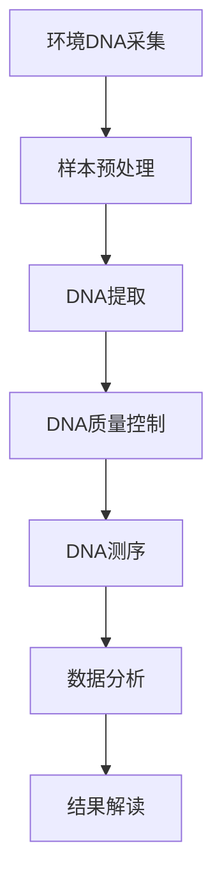
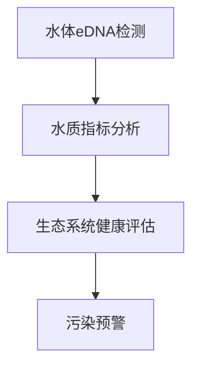
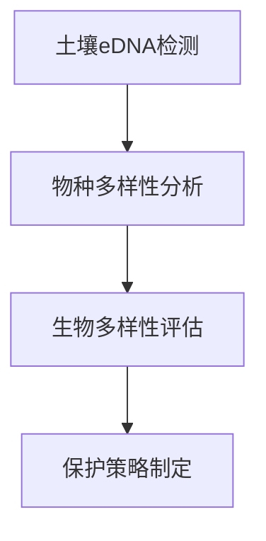
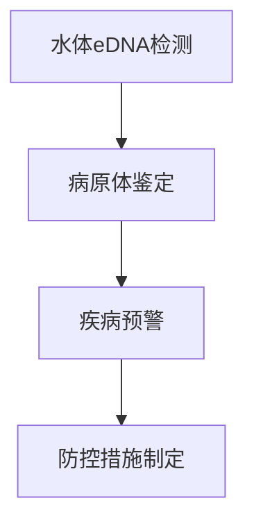
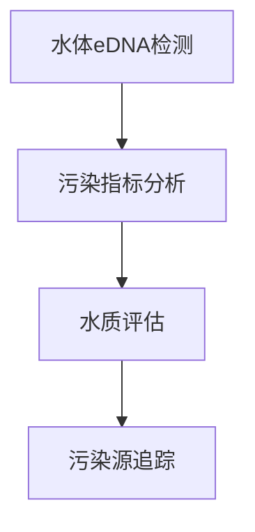
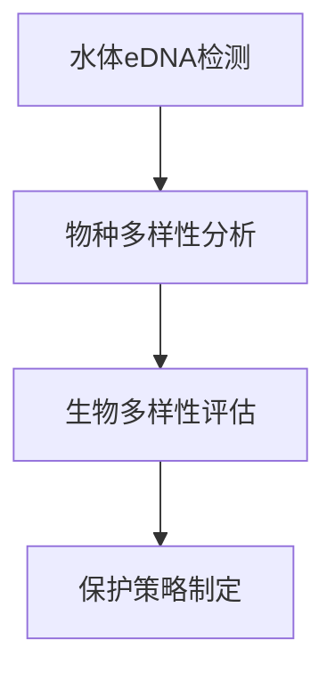
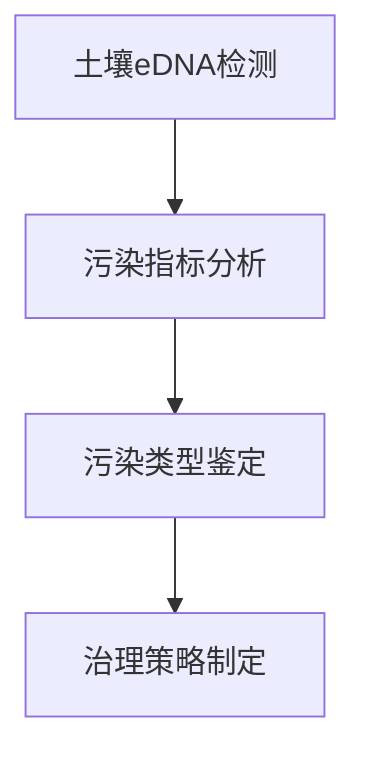

                 

### 《环境DNA检测技术在生态监测中的应用》

---

**关键词**：环境DNA检测，生态监测，高通量测序，单细胞测序，转录组学，生态健康评估

**摘要**：本文将探讨环境DNA检测技术在生态监测中的广泛应用。通过对环境DNA的基本概念、检测原理、技术方法及其在生态监测中的应用进行详细解析，辅以具体案例研究，旨在揭示这一前沿技术如何助力生态系统的监测与保护。文章还将讨论环境DNA检测技术的未来发展趋势及面临的挑战，为读者提供全面的技术视角和前瞻性思考。

---

### 第一部分：环境DNA检测技术基础

#### 1.1 环境DNA检测的定义

环境DNA（eDNA）检测是一种新兴的生物技术手段，它通过直接检测环境中存在的微量DNA片段来推断生物物种的分布和存在状态。eDNA技术最初用于鱼类监测，随后迅速扩展到更广泛的生态监测领域。其基本原理是采集环境样本，从中提取DNA，并通过分子生物学方法对DNA进行检测和定量分析。

#### 1.2 环境DNA检测技术的重要性

环境DNA检测技术在生态监测中具有极高的重要性。首先，它能够快速、高效地监测生态系统的健康状况，尤其是对濒危物种和稀有物种的监测。其次，eDNA检测技术可广泛应用于水资源管理、生物多样性保护、环境灾害预警等多个领域。此外，该技术具有非侵入性、操作简便、成本较低等优点，大大提高了生态监测的效率和准确性。

#### 1.3 环境DNA检测技术的发展历程

环境DNA检测技术的发展历程可以追溯到2000年左右，当时eDNA技术主要应用于鱼类监测。随着高通量测序（HTS）技术的发展，eDNA检测技术在生态监测中的应用范围逐渐扩大。2010年后，随着单细胞DNA测序技术和转录组学检测技术的突破，eDNA检测技术变得更加精细和准确。目前，eDNA检测技术已经成为生态监测和生物多样性保护的重要工具。

---

### 2. 环境DNA检测技术原理

#### 2.1 环境DNA的采集与预处理

环境DNA的采集是eDNA检测技术的第一步。采集方法包括直接采样（如水体、土壤、植物等）、间接采样（如空气、尘埃等）和被动采样（如捕虫器、黏虫板等）。在采集过程中，要确保样本的完整性和代表性，避免DNA降解和污染。

采集后的样本需要进行预处理，包括过滤、沉淀、离心等步骤。预处理的关键是去除大分子杂质，提取纯净的DNA。常用的预处理方法包括有机溶剂提取、柱式提取和磁珠提取等。

#### 2.2 DNA提取与质量控制

DNA提取是eDNA检测技术的核心步骤之一。提取方法的选择取决于样本类型和环境条件。常用的DNA提取方法包括柱式提取、磁珠提取和化学提取等。

提取后的DNA需要进行质量控制，以确保检测结果的准确性和可靠性。常用的质量控制方法包括浓度测定、纯度检测、电泳分析和DNA定量分析等。

#### 2.3 DNA测序与数据分析

DNA测序是eDNA检测技术的关键环节。目前，常用的DNA测序技术包括高通量测序（HTS）、DNA条形码技术和单细胞DNA测序技术等。

测序结果需要进行数据分析，以识别和鉴定样本中的DNA序列。数据分析方法包括序列比对、序列组装、序列分类和序列注释等。常用的数据分析工具包括BioPython、Bioconductor和Seqtk等。

#### 2.4 Mermaid流程图：环境DNA检测技术核心过程

### 3. 环境DNA检测技术方法

#### 3.1 高通量测序技术

高通量测序（High-throughput sequencing，HTS）技术是当前环境DNA检测的主要方法之一。HTS技术能够在短时间内生成大量的测序数据，大大提高了生态监测的效率和精度。常用的HTS技术包括Illumina测序、SOLiD测序和454测序等。

#### 3.2 DNA条形码技术

DNA条形码技术是一种基于DNA序列快速鉴定物种的方法。该方法通过选择一系列标准基因片段，对物种进行分类和鉴定。DNA条形码技术在生态监测中具有广泛的应用，如生物多样性研究、生态入侵监测等。

#### 3.3 单细胞DNA测序技术

单细胞DNA测序技术（Single-cell DNA sequencing）是一种新兴的eDNA检测技术。该技术能够对单个细胞或细胞群体进行基因测序，从而揭示细胞间的基因表达差异和生物学功能。单细胞DNA测序技术在生态监测中的应用前景广阔，如微生物生态学、病原体监测等。

#### 3.4 转录组学检测技术

转录组学检测技术（Transcriptomics）是一种研究细胞在特定时间点和特定环境下的基因表达模式的方法。该技术能够揭示生态系统中生物的基因表达动态和生态适应性。转录组学检测技术在生态监测中的应用主要包括生态适应研究、生物多样性保护等。

#### 3.5 表型关联分析

表型关联分析（Phenotypic association analysis）是一种基于eDNA测序数据研究生物表型与基因表达关系的方法。该方法能够揭示生物表型与环境因素之间的潜在关联，为生态监测和生态保护提供科学依据。

### 4. 环境DNA检测技术应用

#### 4.1 生态监测中的应用

##### 4.1.1 生态系统健康评估

环境DNA检测技术可用于生态系统健康评估，通过监测水体、土壤和植被中的eDNA，评估生态系统的污染程度和生物多样性。例如，研究人员可以通过分析水体中的eDNA，评估水体的污染情况和生物多样性。

##### 4.1.2 生物多样性研究

环境DNA检测技术可用于生物多样性研究，通过分析不同环境样本中的eDNA，鉴定和定量分析生物种类和数量。该方法能够快速、准确地了解生态系统的生物多样性状况，为生物多样性保护和恢复提供科学依据。

##### 4.1.3 病原体监测

环境DNA检测技术可用于病原体监测，通过检测水体、土壤和空气中的eDNA，及时发现和预警病原体的存在。例如，研究人员可以通过分析水体中的eDNA，监测水生病原体的分布和传播情况，为疾病防控提供科学依据。

#### 4.2 水环境监测中的应用

##### 4.2.1 水质指标检测

环境DNA检测技术可用于水质指标检测，通过分析水中的eDNA，评估水体的污染程度和生物多样性。例如，研究人员可以通过分析水体中的eDNA，监测水体中的重金属、有机污染物等污染物的含量，为水资源管理和保护提供科学依据。

##### 4.2.2 水生生物监测

环境DNA检测技术可用于水生生物监测，通过分析水中的eDNA，鉴定和定量分析水生生物的种类和数量。该方法能够快速、准确地了解水生生态系统的生物多样性状况，为水生生态系统的保护和恢复提供科学依据。

#### 4.3 土壤环境监测中的应用

##### 4.3.1 土壤污染检测

环境DNA检测技术可用于土壤污染检测，通过分析土壤中的eDNA，评估土壤污染的程度和类型。例如，研究人员可以通过分析土壤中的eDNA，监测土壤中的重金属、有机污染物等污染物的含量，为土壤污染治理和修复提供科学依据。

##### 4.3.2 土壤生物多样性研究

环境DNA检测技术可用于土壤生物多样性研究，通过分析土壤中的eDNA，鉴定和定量分析土壤生物的种类和数量。该方法能够快速、准确地了解土壤生态系统的生物多样性状况，为土壤生态系统的保护和恢复提供科学依据。

### 第二部分：环境DNA检测技术在生态监测中的应用案例

#### 5. 案例一：基于环境DNA检测的河流生态系统监测

##### 5.1 案例背景

某河流生态系统受到污染，需要评估其污染程度和生物多样性状况。研究人员决定使用环境DNA检测技术进行生态监测。

##### 5.2 研究方法

1. 水样采集：在河流的不同断面采集水样，确保样本的代表性。
2. DNA提取：对水样进行DNA提取，确保DNA的完整性和纯度。
3. DNA测序：使用高通量测序技术对提取的DNA进行测序。
4. 数据分析：对测序结果进行序列比对、组装和分类，鉴定和定量分析水中的生物种类。

##### 5.3 结果与讨论

1. 水质指标：通过对水样中的eDNA进行分析，发现河流中的重金属和有机污染物含量较高，污染程度较严重。
2. 生物多样性：通过对水样中的eDNA进行分析，鉴定出多种水生生物，包括鱼类、贝类和水生植物等。同时，通过对生物多样性的定量分析，发现河流生态系统的生物多样性较低。
3. 污染源追踪：通过对eDNA序列的分析，发现污染源可能来自上游工业废水和生活污水。

##### 5.4 结论

环境DNA检测技术在河流生态系统监测中具有显著的应用价值。通过该技术，可以快速、准确地评估河流水质和生物多样性状况，为污染治理和生态保护提供科学依据。

#### 6. 案例二：基于环境DNA检测的海洋生物多样性研究

##### 6.1 案例背景

某海洋生态系统需要进行生物多样性研究，以了解其物种组成和生态状况。研究人员决定使用环境DNA检测技术进行研究。

##### 6.2 研究方法

1. 水样采集：在海洋的不同区域采集水样，确保样本的代表性。
2. DNA提取：对水样进行DNA提取，确保DNA的完整性和纯度。
3. DNA测序：使用高通量测序技术对提取的DNA进行测序。
4. 数据分析：对测序结果进行序列比对、组装和分类，鉴定和定量分析海洋中的生物种类。

##### 6.3 结果与讨论

1. 物种组成：通过对水样中的eDNA进行分析，鉴定出多种海洋生物，包括鱼类、甲壳类、软体动物和浮游生物等。同时，通过对生物多样性的定量分析，发现海洋生态系统的物种组成较为丰富。
2. 生态状况：通过对eDNA序列的分析，发现海洋生态系统的生物多样性较高，生态系统较为健康。
3. 海洋保护：通过对eDNA序列的分析，发现某些海洋生物的分布受到海洋保护措施的影响，为海洋生物保护提供了科学依据。

##### 6.4 结论

环境DNA检测技术在海洋生物多样性研究中具有显著的应用价值。通过该技术，可以快速、准确地了解海洋生态系统的物种组成和生态状况，为海洋生物保护和资源管理提供科学依据。

#### 7. 案例三：基于环境DNA检测的城市生态系统健康评估

##### 7.1 案例背景

某城市生态系统需要进行健康评估，以了解其生态环境状况。研究人员决定使用环境DNA检测技术进行评估。

##### 7.2 研究方法

1. 水样采集：在城市水体（如河流、湖泊、地下水）中采集水样，确保样本的代表性。
2. 土样采集：在城市的土壤中采集样本，确保样本的代表性。
3. DNA提取：对水样和土样进行DNA提取，确保DNA的完整性和纯度。
4. DNA测序：使用高通量测序技术对提取的DNA进行测序。
5. 数据分析：对测序结果进行序列比对、组装和分类，鉴定和定量分析水体和土壤中的生物种类。

##### 7.3 结果与讨论

1. 水质指标：通过对水样中的eDNA进行分析，发现城市水体中的重金属和有机污染物含量较高，水质较差。
2. 土壤质量：通过对土样中的eDNA进行分析，发现城市土壤中的重金属和有机污染物含量较高，土壤质量较差。
3. 生态系统健康：通过对eDNA序列的分析，发现城市生态系统的生物多样性较低，生态系统健康状况较差。
4. 污染源追踪：通过对eDNA序列的分析，发现城市水体和土壤中的污染源主要来自城市生活污水和工业废水。

##### 7.4 结论

环境DNA检测技术在城市生态系统健康评估中具有显著的应用价值。通过该技术，可以快速、准确地评估城市生态系统的生态环境状况，为城市环境保护和生态修复提供科学依据。

### 第三部分：环境DNA检测技术展望

#### 8. 环境DNA检测技术的发展趋势

##### 8.1 新一代测序技术的发展

随着测序技术的不断进步，新一代测序技术（如单细胞测序、单分子测序等）将在环境DNA检测技术中发挥重要作用。这些技术将进一步提高检测的精度和灵敏度，为生态监测提供更全面的数据支持。

##### 8.2 单细胞DNA测序技术的应用

单细胞DNA测序技术（Single-cell DNA sequencing）的发展将使环境DNA检测技术能够对单个细胞进行测序和分析，从而揭示生态系统中细胞间的差异和相互作用，为生态学研究提供新的视角。

##### 8.3 数据分析技术的进步

随着大数据和人工智能技术的发展，环境DNA检测技术的数据分析方法将得到进一步优化。基于机器学习和深度学习的数据分析方法将提高对复杂生态数据的处理能力，为生态监测提供更准确的预测和预警。

##### 8.4 多领域交叉融合

环境DNA检测技术与其他领域的交叉融合将推动生态监测技术的发展。例如，与遥感技术、地理信息系统（GIS）和物联网（IoT）的融合将实现实时、全方位的生态监测，提高监测的效率和准确性。

#### 9. 环境DNA检测技术在生态监测中的应用挑战与解决方案

##### 9.1 技术挑战

尽管环境DNA检测技术在生态监测中具有广泛的应用前景，但仍面临一些技术挑战。例如，DNA降解、样本污染和测序错误等可能导致检测结果不准确。为了解决这些问题，需要进一步提高DNA提取和测序技术的灵敏度、精度和稳定性。

##### 9.2 数据分析挑战

环境DNA检测技术的数据分析方法较为复杂，涉及大量的数据处理和分析。为了提高数据分析的准确性和效率，需要开发更先进的算法和软件工具，以应对日益增长的数据规模和处理需求。

##### 9.3 法规与伦理问题

环境DNA检测技术的应用涉及生物样本的采集、处理和分析，可能引发法规和伦理问题。例如，样本采集过程中的生物安全、数据隐私和保护等问题需要得到充分关注和解决。

##### 9.4 未来发展方向

为了推动环境DNA检测技术在生态监测中的应用，未来需要从以下几个方面进行发展：

1. **技术升级**：继续改进DNA提取、测序和数据分析技术，提高检测的灵敏度和准确性。
2. **标准制定**：建立健全的生态监测标准和规范，确保检测结果的可靠性和可比性。
3. **跨学科研究**：鼓励跨学科研究，促进环境DNA检测技术与其他领域的融合，提高生态监测的整体效能。
4. **应用拓展**：探索环境DNA检测技术在气候变化、生物灾害和人类活动影响等方面的应用，为生态保护和可持续发展提供科学依据。

### 附录

#### 10. 环境DNA检测技术相关工具与资源

##### 10.1 常用测序平台介绍

1. Illumina平台：全球领先的测序平台，提供高通量测序服务。
2. PacBio平台：基于单分子测序技术，提供长读长测序服务。
3. Nanopore平台：基于纳米孔测序技术，提供便携式测序解决方案。

##### 10.2 数据分析软件推荐

1. BioPython：开源的Python库，用于生物信息学数据处理和分析。
2. Bioconductor：R语言的一个扩展包，提供多种生物信息学工具。
3. Seqtk：开源的DNA序列处理工具，用于序列比对、组装和定量分析。

##### 10.3 环境DNA数据库资源

1. ENA（European Nucleotide Archive）：欧洲核苷酸序列数据库，提供全球范围的序列数据。
2. NCBI（National Center for Biotechnology Information）：美国国家生物技术信息中心，提供广泛的生物信息资源。
3. GenBank：国际基因序列数据库，提供基因序列和注释信息。

### 作者信息

**作者：** AI天才研究院/AI Genius Institute & 禅与计算机程序设计艺术 /Zen And The Art of Computer Programming

---

### 总结与展望

环境DNA检测技术在生态监测中的应用日益广泛，已成为生态系统健康评估、生物多样性保护和环境灾害预警的重要工具。本文详细介绍了环境DNA检测技术的定义、原理、方法及其在生态监测中的具体应用，并通过案例研究展示了其实际应用效果。同时，本文还探讨了环境DNA检测技术的未来发展趋势和应用挑战，为推动该技术的进一步发展和应用提供了有益的思路。

随着测序技术和数据分析方法的不断进步，环境DNA检测技术将在生态监测中发挥更加重要的作用。未来，我们期待看到更多创新性的研究成果，为生态系统的可持续发展和环境保护提供科学支持。同时，我们也呼吁相关领域的研究人员、政策制定者和公众共同关注环境DNA检测技术，积极参与到生态监测和环境保护的实践中。

让我们携手合作，共同推动环境DNA检测技术的进步，为构建美丽地球贡献力量。让我们期待一个更加绿色、和谐、可持续的未来。

