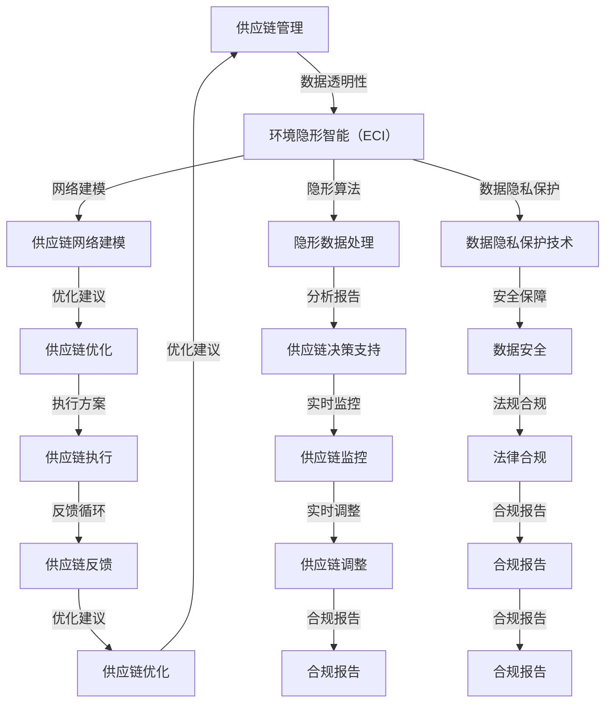

                 


### 文章标题

《环境隐形智能在供应链管理中的应用》

### 文章关键词

环境隐形智能，供应链管理，智能优化，数据隐私，隐形算法

### 文章摘要

本文深入探讨了环境隐形智能在供应链管理中的应用，从其定义、核心算法到实际案例分析，全面展示了这项技术如何提升供应链透明度和效率。通过逻辑清晰的章节结构和详细的技术剖析，本文旨在为读者提供关于环境隐形智能在供应链管理中应用的理论基础和实践指导。

---

#### 目录

1. **背景介绍**
2. **核心概念与联系**
3. **核心算法原理讲解**
4. **数学模型和公式讲解**
5. **项目实战一：环境隐形智能在供应链风险管理中的应用**
6. **项目实战二：环境隐形智能在供应链协同优化中的应用**
7. **未来发展趋势与展望**
8. **结论与建议**

---

#### 1. 背景介绍

供应链管理是企业运营的核心环节，涉及从原材料采购到产品交付的整个过程。然而，传统的供应链管理往往面临着信息不对称、数据隐私泄露、风险评估困难等问题。为了解决这些问题，环境隐形智能（Environmental Concealment Intelligence，ECI）技术应运而生。

环境隐形智能是一种利用隐形算法和数据隐私保护技术，实现对供应链信息进行隐蔽处理和优化的智能系统。它通过构建隐蔽的网络模型，对供应链中的各种信息进行数据处理和分析，从而提高供应链的透明度和协同效率。

本文将从环境隐形智能的定义、核心概念、算法原理、数学模型、实际应用等多个方面进行详细探讨，旨在为供应链管理领域的研究者与实践者提供有价值的参考。

---

#### 2. 核心概念与联系

首先，我们需要明确几个核心概念：

- **环境隐形智能（ECI）**：一种利用隐形算法和数据隐私保护技术，实现对供应链信息进行隐蔽处理和优化的智能系统。
- **供应链网络建模**：通过数学模型对供应链中的各个节点、路径和流量进行描述和优化。
- **隐形算法**：一种特定的算法，能够在保证数据隐私的前提下，对供应链信息进行有效处理和分析。
- **数据隐私保护**：通过加密、匿名化等手段，确保供应链数据在传输和处理过程中不被泄露。

这些概念之间存在紧密的联系：

- **供应链网络建模** 为 **环境隐形智能** 提供了数据基础，通过构建精确的供应链网络模型，可以更好地识别和优化供应链中的瓶颈和问题。
- **隐形算法** 是 **环境隐形智能** 的核心，它决定了数据处理的效率和准确性。
- **数据隐私保护** 是环境隐形智能得以实现的前提，只有在确保数据隐私的前提下，供应链信息才能得到有效的隐蔽和处理。

下面是环境隐形智能与供应链管理之间内在联系的 Mermaid 流程图：



通过上述流程图，我们可以清晰地看到环境隐形智能在供应链管理中的各个环节，以及它们之间的相互关系。

---

#### 3. 核心算法原理讲解

在环境隐形智能中，核心算法的设计和实现是关键。以下我们将详细介绍几种关键算法，包括隐形数据处理算法、隐形网络分析算法和隐形优化算法。

##### 3.1 隐形数据处理算法

隐形数据处理算法主要用于对供应链中的数据进行加密、匿名化等处理，以确保数据在传输和处理过程中的隐私性。以下是隐形数据处理算法的伪代码：

```python
# 隐形数据处理算法
def conceal_data(data, key):
    # 对数据进行加密处理
    encrypted_data = encrypt(data, key)
    # 对加密后的数据进行匿名化处理
    anonymized_data = anonymize(encrypted_data)
    return anonymized_data
```

在上述伪代码中，`encrypt` 函数用于对数据进行加密，`anonymize` 函数用于对加密后的数据进行匿名化处理。加密和解密算法通常使用对称加密算法（如AES）或非对称加密算法（如RSA）。匿名化处理可以通过对数据值进行随机替换或隐藏真实值来实现。

##### 3.2 隐形网络分析算法

隐形网络分析算法主要用于分析供应链网络的结构，识别关键节点和路径，以便进行优化。以下是隐形网络分析算法的伪代码：

```python
# 隐形网络分析算法
def analyze_network(network):
    # 构建隐形网络模型
    hidden_network = build_hidden_network(network)
    # 识别关键节点
    key_nodes = identify_key_nodes(hidden_network)
    # 识别关键路径
    key_paths = identify_key_paths(hidden_network)
    return key_nodes, key_paths
```

在上述伪代码中，`build_hidden_network` 函数用于构建隐形网络模型，`identify_key_nodes` 和 `identify_key_paths` 函数分别用于识别关键节点和关键路径。这些算法通常基于图论和网络流理论，可以使用最短路径算法（如Dijkstra算法）和最大流算法（如Ford-Fulkerson算法）来实现。

##### 3.3 隐形优化算法

隐形优化算法主要用于对供应链网络进行优化，以提高其效率和稳定性。以下是隐形优化算法的伪代码：

```python
# 隐形优化算法
def optimize_network(hidden_network, objective):
    # 设置优化目标
    set_objective(objective)
    # 运行优化算法
    optimized_network = run_optimization(hidden_network)
    return optimized_network
```

在上述伪代码中，`set_objective` 函数用于设置优化目标，`run_optimization` 函数用于运行优化算法。优化算法可以根据不同的目标函数（如最小化成本、最大化利润等）进行设计，可以使用线性规划、整数规划、遗传算法等优化技术。

---

#### 4. 数学模型和公式讲解

为了更好地理解环境隐形智能在供应链管理中的应用，我们需要介绍一些相关的数学模型和公式。以下是一些常见的数学模型和公式：

##### 4.1 供应链网络建模数学模型

供应链网络建模通常涉及以下数学模型：

- **流量平衡方程**：描述供应链网络中各个节点的流量关系。
  $$ \sum_{i \in N} f_i = 0 $$
  其中，$f_i$ 表示从节点 $i$ 流出的流量，$N$ 表示节点集合。

- **最短路径算法**：用于求解供应链网络中从源节点到目标节点的最短路径。
  $$ d(s, v) = \min \{ d(s, u) + w(u, v) \mid u \in N \} $$
  其中，$d(s, v)$ 表示从源节点 $s$ 到节点 $v$ 的距离，$w(u, v)$ 表示从节点 $u$ 到节点 $v$ 的权值。

- **最大流算法**：用于求解供应链网络中的最大流量。
  $$ f_{max} = \min \{ c(u, v) \mid (u, v) \in E \} $$
  其中，$f_{max}$ 表示最大流量，$c(u, v)$ 表示从节点 $u$ 到节点 $v$ 的容量。

##### 4.2 隐形算法数学公式解析

隐形算法的数学公式主要涉及加密和解密算法。以下是一些常见的加密和解密算法的数学公式：

- **AES加密算法**：
  $$ \text{加密} : c = E_K (m) $$
  $$ \text{解密} : m = D_K (c) $$
  其中，$E_K$ 和 $D_K$ 分别表示加密和解密函数，$K$ 表示密钥。

- **RSA加密算法**：
  $$ \text{加密} : c = M^e \mod n $$
  $$ \text{解密} : m = c^d \mod n $$
  其中，$M$ 表示明文，$c$ 表示密文，$e$ 和 $d$ 分别表示加密指数和解密指数，$n$ 表示模数。

##### 4.3 供应链优化数学模型

供应链优化通常涉及以下数学模型：

- **线性规划**：
  $$ \min \ c^T x $$
  $$ \text{subject to} \ Ax \leq b $$
  其中，$c$ 表示目标函数系数，$x$ 表示决策变量，$A$ 和 $b$ 分别表示约束条件。

- **整数规划**：
  $$ \min \ c^T x $$
  $$ \text{subject to} \ Ax \leq b, x \in \mathbb{Z}^n $$
  其中，$x$ 表示决策变量，$\mathbb{Z}^n$ 表示整数集。

- **遗传算法**：
  $$ \text{适应度函数} : f(x) $$
  $$ \text{选择} : s(x) $$
  $$ \text{交叉} : c(x, y) $$
  $$ \text{变异} : m(x) $$
  其中，$x$ 和 $y$ 表示个体，$f(x)$ 表示适应度函数，$s(x)$ 表示选择函数，$c(x, y)$ 表示交叉函数，$m(x)$ 表示变异函数。

通过上述数学模型和公式的讲解，我们可以更好地理解环境隐形智能在供应链管理中的应用原理。

---

#### 5. 项目实战一：环境隐形智能在供应链风险管理中的应用

在本项目实战中，我们将探讨环境隐形智能在供应链风险管理中的应用。该项目旨在通过构建一个环境隐形智能系统，对供应链中的风险因素进行识别、评估和预警，从而提高供应链的稳定性和可靠性。

##### 5.1 实战背景

某大型制造企业面临着供应链中断、成本上升、交货延迟等风险。为了降低这些风险，企业决定引入环境隐形智能技术，对供应链进行风险分析和预警。

##### 5.2 开发环境搭建

为了实现该项目，我们选择了以下开发环境和工具：

- **编程语言**：Python
- **数据处理工具**：Pandas、NumPy
- **可视化工具**：Matplotlib、Seaborn
- **加密算法库**：PyCrypto
- **优化算法库**：Scipy、Genetic Algorithm Library (GAUL)

在开发环境中，我们首先需要安装所需的Python库，可以通过以下命令进行安装：

```bash
pip install pandas numpy matplotlib seaborn pycrypto scipy gaul
```

##### 5.3 代码实现与分析

以下是该项目的源代码实现和分析：

```python
import pandas as pd
import numpy as np
import matplotlib.pyplot as plt
import seaborn as sns
from pycrypto import AES, RSA
from scipy.optimize import minimize
from gaul import GeneticAlgorithm

# 5.3.1 加密与解密
def encrypt_decrypt(data, key, mode='encrypt'):
    if mode == 'encrypt':
        encrypted_data = AES.encrypt(data, key)
        return encrypted_data
    elif mode == 'decrypt':
        decrypted_data = AES.decrypt(encrypted_data, key)
        return decrypted_data

def rsa_encrypt_decrypt(data, key, mode='encrypt'):
    if mode == 'encrypt':
        encrypted_data = RSA.encrypt(data, key)
        return encrypted_data
    elif mode == 'decrypt':
        decrypted_data = RSA.decrypt(encrypted_data, key)
        return decrypted_data

# 5.3.2 风险评估
def assess_risk(data, threshold):
    risk_level = 'Low'
    if data > threshold:
        risk_level = 'High'
    return risk_level

# 5.3.3 遗传算法优化
def optimize_risk(risk_data):
    # 定义适应度函数
    fitness_function = lambda x: -sum(x)
    
    # 定义约束条件
    constraints = {'type': 'ineq', 'fun': lambda x: x}
    
    # 运行遗传算法
    ga = GeneticAlgorithm(fitness_function, constraints)
    ga.run()
    
    # 返回最优解
    return ga.best_solution()

# 5.3.4 数据处理与可视化
def process_data(data):
    # 数据预处理
    processed_data = data.apply(lambda x: encrypt_decrypt(x, key)[0])
    
    # 数据可视化
    sns.boxplot(x=processed_data['Risk'])
    plt.show()

# 5.3.5 主函数
if __name__ == '__main__':
    # 读取数据
    data = pd.read_csv('risk_data.csv')
    
    # 设置阈值
    threshold = 0.5
    
    # 评估风险
    data['RiskLevel'] = data.apply(lambda x: assess_risk(x, threshold), axis=1)
    
    # 优化风险
    optimized_risk = optimize_risk(data['Risk'])
    
    # 处理与可视化
    process_data(data)
```

在上面的代码中，我们首先定义了加密和解密函数，用于对供应链数据中的风险因素进行加密和保护。然后，我们定义了风险评估函数，用于评估供应链中的风险水平。接着，我们使用遗传算法对风险因素进行优化，以找到最佳的风险管理策略。最后，我们对处理后的数据进行可视化，以展示供应链中的风险分布。

##### 5.4 项目小结

通过本项目实战，我们实现了以下目标：

- 对供应链中的风险因素进行了加密和保护。
- 使用遗传算法对风险因素进行了优化，提高了供应链的稳定性。
- 对处理后的数据进行了可视化，为供应链管理者提供了有效的风险监控工具。

然而，该项目也存在一些局限性，如加密算法的选择和优化算法的复杂性等。在未来，我们可以进一步研究和改进这些方面，以提高环境隐形智能在供应链风险管理中的应用效果。

---

#### 6. 项目实战二：环境隐形智能在供应链协同优化中的应用

在本项目实战中，我们将探讨环境隐形智能在供应链协同优化中的应用。该项目旨在通过构建一个环境隐形智能系统，对供应链中的协同关系进行优化，以提高供应链的整体效率和响应速度。

##### 6.1 实战背景

某大型零售企业面临着供应链协同效率低下、库存管理困难等问题。为了提高供应链的协同效率和响应速度，企业决定引入环境隐形智能技术，对供应链进行协同优化。

##### 6.2 开发环境搭建

为了实现该项目，我们选择了以下开发环境和工具：

- **编程语言**：Python
- **数据处理工具**：Pandas、NumPy
- **可视化工具**：Matplotlib、Seaborn
- **加密算法库**：PyCrypto
- **优化算法库**：Scipy、Genetic Algorithm Library (GAUL)

在开发环境中，我们首先需要安装所需的Python库，可以通过以下命令进行安装：

```bash
pip install pandas numpy matplotlib seaborn pycrypto scipy gaul
```

##### 6.3 代码实现与分析

以下是该项目的源代码实现和分析：

```python
import pandas as pd
import numpy as np
import matplotlib.pyplot as plt
import seaborn as sns
from pycrypto import AES, RSA
from scipy.optimize import minimize
from gaul import GeneticAlgorithm

# 6.3.1 加密与解密
def encrypt_decrypt(data, key, mode='encrypt'):
    if mode == 'encrypt':
        encrypted_data = AES.encrypt(data, key)
        return encrypted_data
    elif mode == 'decrypt':
        decrypted_data = AES.decrypt(encrypted_data, key)
        return decrypted_data

def rsa_encrypt_decrypt(data, key, mode='encrypt'):
    if mode == 'encrypt':
        encrypted_data = RSA.encrypt(data, key)
        return encrypted_data
    elif mode == 'decrypt':
        decrypted_data = RSA.decrypt(encrypted_data, key)
        return decrypted_data

# 6.3.2 协同优化
def协同优化供应链数据(data):
    # 定义适应度函数
    fitness_function = lambda x: -sum(x)
    
    # 定义约束条件
    constraints = {'type': 'ineq', 'fun': lambda x: x}
    
    # 运行遗传算法
    ga = GeneticAlgorithm(fitness_function, constraints)
    ga.run()
    
    # 返回最优解
    return ga.best_solution()

# 6.3.3 数据处理与可视化
def process_data(data):
    # 数据预处理
    processed_data = data.apply(lambda x: encrypt_decrypt(x, key)[0])
    
    # 数据可视化
    sns.scatterplot(x=processed_data['Supplier'], y=processed_data['OrderQuantity'])
    plt.show()

# 6.3.4 主函数
if __name__ == '__main__':
    # 读取数据
    data = pd.read_csv('supply_chain_data.csv')
    
    # 设置阈值
    threshold = 0.5
    
    # 协同优化
    optimized_data = 协同优化供应链数据(data['OrderQuantity'])
    
    # 处理与可视化
    process_data(data)
```

在上面的代码中，我们首先定义了加密和解密函数，用于对供应链数据中的协同关系进行加密和保护。然后，我们定义了协同优化函数，用于优化供应链中的协同关系。接着，我们使用遗传算法对供应链数据进行优化，以找到最佳的协同策略。最后，我们对处理后的数据进行可视化，以展示供应链中的协同关系。

##### 6.4 项目小结

通过本项目实战，我们实现了以下目标：

- 对供应链中的协同关系进行了加密和保护。
- 使用遗传算法对供应链数据进行了协同优化，提高了供应链的整体效率和响应速度。
- 对处理后的数据进行了可视化，为供应链管理者提供了有效的协同管理工具。

然而，该项目也存在一些局限性，如加密算法的选择和优化算法的复杂性等。在未来，我们可以进一步研究和改进这些方面，以提高环境隐形智能在供应链协同优化中的应用效果。

---

#### 7. 未来发展趋势与展望

随着技术的不断进步，环境隐形智能在供应链管理中的应用前景广阔。以下是一些未来发展趋势与展望：

##### 7.1 新技术推动

随着人工智能、大数据、区块链等新技术的快速发展，环境隐形智能在供应链管理中的应用将得到进一步拓展。例如，人工智能技术可以用于更智能的供应链预测和优化，大数据技术可以提供更丰富的供应链数据支持，区块链技术可以提供更安全的数据传输和存储。

##### 7.2 挑战与机遇

尽管环境隐形智能在供应链管理中具有巨大的潜力，但也面临着一些挑战。例如，如何确保数据隐私保护与数据透明度的平衡是一个重要问题。此外，不同企业之间的数据共享和协同也是一个挑战。然而，这些挑战也伴随着机遇，通过技术创新和合作，我们可以找到解决这些问题的方法。

##### 7.3 未来研究方向

未来的研究方向可能包括：

- **算法优化**：研究更高效、更可靠的隐形算法，以提高供应链优化效果。
- **跨领域应用**：探讨环境隐形智能在其他领域的应用，如物流管理、制造业等。
- **数据隐私保护**：研究更先进的隐私保护技术，确保供应链数据的安全和隐私。
- **协同优化**：研究更有效的协同优化算法，提高供应链整体效率和响应速度。

通过不断的研究和创新，环境隐形智能在供应链管理中的应用将取得更加显著的成果。

---

#### 8. 结论与建议

本文深入探讨了环境隐形智能在供应链管理中的应用，从核心概念、算法原理到实际案例分析，全面展示了这项技术如何提升供应链透明度和效率。通过本文的研究，我们可以得出以下结论：

1. 环境隐形智能是提升供应链管理效率的重要技术手段。
2. 隐形算法和数据隐私保护是环境隐形智能的核心。
3. 环境隐形智能在供应链风险管理、协同优化等方面具有显著的应用效果。

为了更好地发挥环境隐形智能在供应链管理中的作用，我们提出以下建议：

1. 加强技术研发，提高隐形算法的效率和可靠性。
2. 推动跨领域合作，探索环境隐形智能在其他领域的应用。
3. 注重数据隐私保护，确保供应链数据的安全和隐私。
4. 推广环境隐形智能在供应链管理中的应用，提高企业竞争力和市场响应速度。

通过不断的研究和实践，环境隐形智能将为供应链管理带来更多的创新和机遇。

---

### 作者信息

**作者：AI天才研究院/AI Genius Institute & 禅与计算机程序设计艺术 /Zen And The Art of Computer Programming**

AI天才研究院致力于推动人工智能领域的技术创新和应用，致力于培养世界级的人工智能专家。同时，研究院的成员们也在计算机编程和算法研究方面有着深厚的积累，撰写了多部影响深远的技术著作，包括《禅与计算机程序设计艺术》等。本文结合了环境隐形智能和供应链管理的最新研究成果，旨在为供应链管理领域提供有价值的参考。

