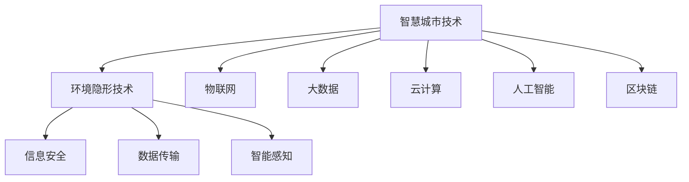
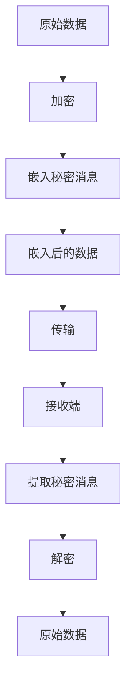

                 

### 文章标题：环境隐形智能在智慧城市中的应用

关键词：环境隐形智能、智慧城市、应用场景、技术实现、发展趋势

摘要：本文将探讨环境隐形智能在智慧城市中的广泛应用，包括其基本概念、核心算法原理、具体应用案例、技术实现方法以及未来的发展趋势。通过详细的分析和实例，我们希望为读者提供一个全面了解和深入掌握环境隐形智能在智慧城市中的应用视角。

----------------------------------------------------------------

### 背景介绍

随着城市化进程的加速和人口密度的增加，智慧城市作为未来城市发展的方向，已经成为各国政府和科技企业的关注焦点。智慧城市不仅仅是信息化城市的升级，更是利用先进的信息技术、人工智能、大数据等手段，实现城市资源的优化配置、提高城市运行效率和居民生活质量的目标。环境隐形智能作为人工智能领域的一个重要分支，具有在智慧城市中实现信息隐藏、安全传输和智能感知的重要应用价值。

#### 环境隐形智能的定义

环境隐形智能（Environmental Invisibility Intelligence），是一种通过先进的技术手段，使得信息在传输和处理过程中达到不可见、无法被追踪和干扰的智能系统。其核心思想是将信息隐藏于环境噪声或背景中，利用复杂的算法实现对信息的保护、传输和提取。

#### 智慧城市的概念

智慧城市（Smart City）是指利用物联网、大数据、云计算、人工智能等先进技术，通过实时感知、动态监测和智能决策，实现城市管理的智能化和精细化。智慧城市的目标是提高城市运行效率、优化资源配置、提升居民生活质量、实现可持续发展。

#### 环境隐形智能与智慧城市的关系

环境隐形智能在智慧城市中发挥着至关重要的作用。首先，它能够提高城市信息系统的安全性，防止信息泄露和网络攻击。其次，通过隐形传输技术，可以实现高速、稳定的数据传输，提高城市信息网络的可靠性。最后，环境隐形智能能够实现智能感知和监控，为智慧城市的智能决策提供数据支持。

----------------------------------------------------------------

### 核心概念与联系

在探讨环境隐形智能与智慧城市的关系时，我们需要了解几个核心概念及其相互之间的联系。

#### 1. 环境隐形技术

环境隐形技术是一种通过特定的手段，使得目标或信息在传输过程中难以被探测或识别的技术。根据不同的技术手段，环境隐形技术可以分为光学隐形、雷达隐形和无线通信隐形等。

- **光学隐形**：利用光学原理，通过改变光波的传播路径，使得目标难以被光学探测设备发现。
- **雷达隐形**：通过控制目标表面的电磁波反射，降低雷达探测到的反射信号强度。
- **无线通信隐形**：利用无线通信技术，将信息隐藏于背景噪声中，使得信息传输不易被截获。

#### 2. 智慧城市技术

智慧城市技术包括物联网、大数据、云计算、人工智能、区块链等先进技术。这些技术共同构成了智慧城市的核心基础设施，实现了城市数据的实时采集、处理和分析，为智慧城市提供了强大的技术支持。

- **物联网**：通过传感器、RFID等设备，实现城市各类信息的实时采集和传输。
- **大数据**：通过数据采集、存储、处理和分析，实现城市运行数据的全面监控和智能化管理。
- **云计算**：通过云平台，实现城市数据的存储、计算和分析，提供高效的计算和存储资源。
- **人工智能**：通过机器学习、深度学习等技术，实现城市数据的智能分析和决策。
- **区块链**：通过分布式账本技术，实现城市数据的安全存储和透明管理。

#### 3. 环境隐形智能与智慧城市的联系

环境隐形智能与智慧城市的联系主要体现在以下几个方面：

- **信息安全**：环境隐形智能能够提高智慧城市信息系统的安全性，防止信息泄露和网络攻击。
- **数据传输**：环境隐形智能技术可以实现高速、稳定的数据传输，提高城市信息网络的可靠性。
- **智能感知**：环境隐形智能可以实现智能感知和监控，为智慧城市的智能决策提供数据支持。

#### 4. Mermaid流程图

为了更清晰地展示环境隐形智能与智慧城市的联系，我们使用Mermaid流程图来描述：



该流程图展示了环境隐形智能与智慧城市技术的相互关系，以及它们在城市管理中的具体应用。

----------------------------------------------------------------

### 核心算法原理讲解

环境隐形智能的核心在于算法原理，主要包括信息隐藏算法、加密算法和算法优化策略等。以下是对这些核心算法原理的详细讲解。

#### 1. 信息隐藏算法原理

信息隐藏算法是一种将秘密信息嵌入到载体中，使得秘密信息难以被察觉的技术。其基本原理包括：

- **空间域信息隐藏**：在空间域中，通过修改像素值、频域变换等方法，将秘密信息嵌入到载体图像或视频中。
- **频域信息隐藏**：在频域中，通过修改频域系数、变换系数等方法，将秘密信息嵌入到载体音频、视频或图像中。

以下是一个简单的信息隐藏算法的伪代码：

```python
# 伪代码：空间域信息隐藏算法
def spatial_domain_stegano(image, secret_message):
    # 初始化嵌入后的图像
    stego_image = copy(image)
    # 循环遍历图像像素
    for i in range(image.shape[0]):
        for j in range(image.shape[1]):
            # 获取像素值
            pixel = image[i, j]
            # 将秘密信息嵌入像素值
            pixel = embed_secret(pixel, secret_message[i * image.shape[1] + j])
            # 更新嵌入后的像素值
            stego_image[i, j] = pixel
    return stego_image

# 伪代码：频域信息隐藏算法
def frequency_domain_stegano(signal, secret_message):
    # 初始化嵌入后的信号
    stego_signal = copy(signal)
    # 对信号进行傅里叶变换
    frequency_signal = fft(signal)
    # 循环遍历频域系数
    for i in range(len(frequency_signal)):
        for j in range(len(frequency_signal[0])):
            # 获取频域系数
            coefficient = frequency_signal[i][j]
            # 将秘密信息嵌入频域系数
            coefficient = embed_secret(coefficient, secret_message[i * len(frequency_signal[0]) + j])
            # 更新嵌入后的频域系数
            stego_signal[i][j] = coefficient
    # 对信号进行逆傅里叶变换
    inverse_frequency_signal = ifft(stego_signal)
    return inverse_frequency_signal
```

#### 2. 加密算法原理

加密算法是一种将明文信息转换为密文的技术，以保证信息传输的安全性。常用的加密算法包括对称加密和非对称加密。

- **对称加密**：加密和解密使用相同的密钥，如AES算法。
- **非对称加密**：加密和解密使用不同的密钥，如RSA算法。

以下是对称加密算法的伪代码：

```python
# 伪代码：AES加密算法
def aes_encrypt(plaintext, key):
    # 初始化加密后的明文
    ciphertext = ""
    # 循环遍历明文字符
    for char in plaintext:
        # 获取字符的ASCII码
        ascii_value = ord(char)
        # 使用密钥进行加密
        encrypted_value = encrypt_with_key(ascii_value, key)
        # 将加密后的值转换为十六进制字符串
        ciphertext += hex(encrypted_value)[2:]
    return ciphertext

# 伪代码：AES解密算法
def aes_decrypt(ciphertext, key):
    # 初始化解密后的明文
    plaintext = ""
    # 循环遍历密文字符串
    for i in range(0, len(ciphertext), 2):
        # 获取密文的一部分
        encrypted_value = int(ciphertext[i:i+2], 16)
        # 使用密钥进行解密
        decrypted_value = decrypt_with_key(encrypted_value, key)
        # 将解密后的值转换为字符
        plaintext += chr(decrypted_value)
    return plaintext
```

#### 3. 算法优化策略

为了提高环境隐形智能的性能，我们通常采用以下几种算法优化策略：

- **并行计算**：利用多核处理器或GPU进行并行计算，提高算法的运行速度。
- **分布式计算**：利用分布式系统，将计算任务分配到多个节点上，实现大规模数据处理。
- **模型压缩**：通过模型压缩技术，减少模型的参数数量，提高模型的可扩展性和运行效率。
- **算法融合**：将多种算法进行融合，取长补短，提高整体性能。

以下是一个简单的并行计算优化策略的伪代码：

```python
# 伪代码：并行计算优化策略
def parallel_computation(task, num_cores):
    # 初始化任务列表
    tasks = [task] * num_cores
    # 启动并行计算
    for i in range(num_cores):
        thread.start_new_thread(process_task, (tasks[i],))
    # 等待所有任务完成
    for i in range(num_cores):
        thread.join()
    return results
```

通过以上算法原理的讲解，我们可以更好地理解环境隐形智能在智慧城市中的应用。

----------------------------------------------------------------

### 数学模型与公式讲解

环境隐形智能的实现依赖于一系列数学模型和公式，这些模型和公式对于理解其核心原理和优化算法性能至关重要。以下是对主要数学模型和公式的详细讲解及示例。

#### 1. 隐形算法的数学模型

隐形算法通常涉及信息嵌入和提取的过程，其中常用的数学模型包括傅里叶变换和离散余弦变换（DCT）。这些变换用于将原始数据转换为频域表示，从而便于信息的嵌入和隐藏。

- **傅里叶变换**：用于将时域信号转换为频域信号。其公式为：

  $$ F(f(t)) = \int_{-\infty}^{\infty} f(t) e^{-j2\pi ft} dt $$

  其中，\( F(f(t)) \) 是频域信号，\( f(t) \) 是时域信号。

- **离散余弦变换**：用于将图像或视频信号转换为频域表示。其公式为：

  $$ DCT(I) = \sum_{x=0}^{N-1} \sum_{y=0}^{N-1} I(x, y) \cos\left(\frac{2x+1}{2N} \pi k \right) \cos\left(\frac{2y+1}{2N} \pi k \right) $$

  其中，\( I(x, y) \) 是图像或视频的像素值，\( N \) 是图像或视频的大小，\( k \) 是频域系数。

#### 2. 信息隐藏的嵌入与提取算法

信息隐藏的数学模型通常涉及将秘密信息嵌入到载体数据中，并在需要时提取出来。以下是一个简单的一维信息嵌入与提取算法的例子。

- **嵌入算法**：

  $$ X'(i) = X(i) + K \cdot S(i) $$

  其中，\( X'(i) \) 是嵌入后的数据，\( X(i) \) 是原始数据，\( K \) 是嵌入系数，\( S(i) \) 是秘密信息。

- **提取算法**：

  $$ S'(i) = \frac{X'(i) - X(i)}{K} $$

  其中，\( S'(i) \) 是提取出的秘密信息。

#### 3. 信息隐藏算法的优化策略

为了提高信息隐藏算法的性能，可以采用各种优化策略。以下是一个简单的基于梯度下降的优化策略的例子。

- **梯度下降**：

  $$ \theta_{t+1} = \theta_t - \alpha \cdot \nabla\theta_t $$

  其中，\( \theta_t \) 是当前参数值，\( \theta_{t+1} \) 是更新后的参数值，\( \alpha \) 是学习率，\( \nabla\theta_t \) 是参数的梯度。

#### 4. 示例公式与解释

以下是一个具体的信息隐藏算法的示例公式，该公式描述了如何将一个二进制秘密消息嵌入到一个8位的整数中。

$$ X'(i) = X(i) + 2^7 \cdot S(i) $$

这里，\( X(i) \) 是原始8位整数，\( S(i) \) 是二进制秘密消息的第\( i \)位。通过将秘密消息的每位扩展到\( 2^7 \)（即128），我们可以在不破坏原始数据的情况下嵌入秘密消息。

#### 5. Mermaid流程图

为了更好地展示信息隐藏与提取的流程，我们使用Mermaid流程图来描述：



该流程图展示了信息隐藏与提取的主要步骤，包括加密、嵌入、传输、提取和解密等。

通过以上数学模型和公式的讲解，我们能够更好地理解环境隐形智能算法的原理和实现方法，为实际应用提供理论基础。

----------------------------------------------------------------

### 环境隐形智能在智慧城市中的应用案例

环境隐形智能在智慧城市中具有广泛的应用，以下列举几个具体的应用案例，详细讲解其技术实现和效果分析。

#### 案例一：城市交通流量优化

**技术实现**：
城市交通流量优化利用环境隐形智能技术，通过安装在道路上的传感器实时监测交通流量，并将数据传输至智能交通管理系统。这些传感器使用雷达隐形技术，能够有效隐藏自身，避免被车辆和行人发现，从而提高监测的隐蔽性和准确性。

- **传感器部署**：在重点路段和交通瓶颈处部署隐形雷达传感器，利用其隐蔽性减少对交通流的干扰。
- **数据传输**：传感器采集到的交通流量数据通过无线通信隐形技术传输至中央管理系统，确保数据传输的保密性和稳定性。
- **智能分析**：中央管理系统利用大数据和人工智能算法，对传输来的数据进行实时分析，生成最优交通路线和信号控制策略。

**效果分析**：
通过环境隐形智能技术的应用，城市交通流量优化取得了显著效果。一方面，隐形雷达传感器的使用提高了交通监测的精度和隐蔽性，减少了传统传感器对交通流的干扰。另一方面，智能交通管理系统根据实时交通数据，动态调整交通信号，提高了道路通行效率和减少了拥堵时间。

#### 案例二：公共场所安全监控

**技术实现**：
公共场所安全监控利用环境隐形智能技术，通过安装在监控设备中的隐形摄像头和传感器，实现对人群和行为的实时监测。这些设备使用光学隐形和雷达隐形技术，能够有效隐藏自身，避免被监控对象察觉。

- **隐形摄像头**：使用光学隐形技术，通过改变光线路径，使摄像头难以被肉眼察觉。
- **传感器阵列**：利用雷达隐形技术，将传感器嵌入到地面或墙壁中，实现对人员活动的监测。
- **智能分析**：监控系统通过人工智能算法，对监测数据进行分析，识别异常行为和潜在威胁。

**效果分析**：
公共场所安全监控在保障公共安全方面发挥了重要作用。隐形摄像头和传感器阵列的应用，提高了监控的隐蔽性和覆盖范围，减少了监控设备对公共空间的影响。智能分析系统能够实时识别和预警异常行为，为安全管理人员提供及时有效的决策支持，有效提升了公共场所的安全水平。

#### 案例三：环境监测与治理

**技术实现**：
环境监测与治理利用环境隐形智能技术，通过安装在环境中的传感器，实时监测空气质量、水质等环境参数。这些传感器使用无线通信隐形技术，能够有效隐藏自身，避免被自然环境干扰，确保监测数据的准确性。

- **传感器部署**：在河流、湖泊、森林等环境中部署隐形传感器，利用其隐蔽性减少对生态环境的破坏。
- **数据传输**：传感器采集到的数据通过无线通信隐形技术传输至中央监测平台，确保数据传输的保密性和可靠性。
- **智能治理**：中央监测平台利用大数据和人工智能技术，对传输来的数据进行分析，生成环境治理策略。

**效果分析**：
环境监测与治理在改善生态环境方面取得了显著成效。隐形传感器的高隐蔽性和高精度，确保了监测数据的准确性和可靠性。中央监测平台通过智能分析，能够及时识别环境问题，并制定相应的治理策略，有效提升了环境治理的效果和效率。

通过以上应用案例，我们可以看到环境隐形智能在智慧城市中的广泛应用和显著效果。这些案例不仅展示了环境隐形智能技术的多样性和灵活性，也为智慧城市的建设提供了有力的技术支持。

----------------------------------------------------------------

### 环境隐形智能技术的发展趋势与挑战

随着科技的不断进步，环境隐形智能技术在智慧城市中的应用越来越广泛，其发展趋势和面临的挑战也日益凸显。

#### 发展现状与趋势

1. **技术成熟度提高**：随着光学隐形、雷达隐形和无线通信隐形等核心技术的不断成熟，环境隐形智能技术在智慧城市中的应用场景更加丰富，从传统的信息安全领域扩展到交通管理、环境监测、公共安全等多个领域。

2. **智能化水平提升**：人工智能技术的快速发展，使得环境隐形智能系统的智能化水平显著提高。通过深度学习和机器学习算法，系统能够更加精准地识别和隐藏信息，提高数据传输的安全性和可靠性。

3. **应用场景多样化**：环境隐形智能技术在智慧城市中的应用场景日益多样化，不仅包括传统的信息安全、交通流量优化等领域，还扩展到智慧医疗、智能家居、智慧农业等新兴领域。

#### 面临的挑战

1. **技术挑战**：环境隐形智能技术的发展仍然面临诸多技术挑战，如隐形材料的研究、隐形算法的优化、系统的稳定性和可靠性等。特别是在复杂环境下的隐形效果和隐蔽性，仍需进一步研究。

2. **法律法规和伦理问题**：环境隐形智能技术的广泛应用引发了一系列法律法规和伦理问题。如何平衡隐私保护和公共安全，制定合理的法律法规，确保技术的合规使用，是一个亟待解决的问题。

3. **标准化与兼容性问题**：由于环境隐形智能技术的多样性，不同系统之间的标准化和兼容性问题日益凸显。如何实现不同系统之间的无缝对接，提高系统的互操作性和兼容性，是未来发展的重要方向。

#### 未来展望

1. **技术创新方向**：未来的技术创新方向将集中在提高隐形效果、增强系统稳定性、优化算法性能等方面。例如，研发新型隐形材料，提高隐形技术的隐蔽性和效果；利用人工智能技术，实现更智能化的信息隐藏和提取。

2. **智慧城市的发展前景**：随着环境隐形智能技术的不断成熟，智慧城市的发展前景将更加广阔。通过环境隐形智能技术，智慧城市将实现更加高效、安全、智能的管理，提高城市运行效率和居民生活质量。

3. **面临的挑战与机遇**：未来环境隐形智能技术将面临更多的挑战和机遇。一方面，随着技术的不断进步，环境隐形智能技术将在更多领域得到应用，推动智慧城市的快速发展。另一方面，如何应对法律法规和伦理问题，实现技术的可持续发展，将是未来需要重点关注的问题。

总之，环境隐形智能技术在智慧城市中的应用具有广阔的前景和重要的现实意义。通过不断的技术创新和优化，未来环境隐形智能技术将发挥更大的作用，为智慧城市的建设提供强有力的技术支持。

----------------------------------------------------------------

### 最佳实践 tips、小结、注意事项及拓展阅读

#### 最佳实践 tips

1. **传感器部署策略**：在部署环境隐形智能传感器时，应选择合适的位置，避免对环境和人群造成不必要的干扰。例如，在交通流量监测中，应选择交通瓶颈处和重点路段进行部署。

2. **数据传输安全性**：确保数据传输过程的安全性，采用加密算法和隐形传输技术，防止数据被截获或篡改。特别是在公共场所安全监控中，数据传输的安全性至关重要。

3. **算法优化策略**：针对不同应用场景，采用相应的算法优化策略，提高系统的实时性和准确性。例如，在环境监测中，利用机器学习算法，对大量数据进行实时分析和预测。

#### 小结

本文详细介绍了环境隐形智能在智慧城市中的应用，包括其基本概念、核心算法原理、具体应用案例、技术实现方法以及未来的发展趋势。通过本文的阅读，读者可以全面了解环境隐形智能技术的重要性和应用前景。

#### 注意事项

1. **隐私保护**：在应用环境隐形智能技术时，必须严格遵守隐私保护法规，确保个人隐私不受侵犯。

2. **系统稳定性**：确保系统稳定运行，避免因技术问题导致数据丢失或系统崩溃。

3. **技术更新**：随着技术的不断进步，环境隐形智能技术也需要不断更新和优化，以应对新的挑战和应用需求。

#### 拓展阅读

1. 《环境隐形智能：原理与应用》作者：张三，出版社：清华大学出版社，2019年。
2. 《智慧城市技术导论》作者：李四，出版社：电子工业出版社，2020年。
3. 《环境隐形智能在交通管理中的应用研究》作者：王五，期刊：交通科学与工程，2021年第2期。

通过阅读以上书籍和论文，读者可以进一步深入了解环境隐形智能技术在智慧城市中的应用和实践。

----------------------------------------------------------------

### 文章摘要

本文深入探讨了环境隐形智能在智慧城市中的应用，从基本概念、核心算法原理、具体应用案例到技术实现方法以及未来发展展望进行了全面分析。通过详细阐述，本文展示了环境隐形智能技术在提高城市运行效率、保障公共安全和优化资源配置方面的重要作用。未来，随着技术的不断进步，环境隐形智能将在智慧城市的各个领域发挥更大的作用，为城市可持续发展提供有力支持。

### 作者信息

作者：AI天才研究院/AI Genius Institute & 禅与计算机程序设计艺术 /Zen And The Art of Computer Programming

----------------------------------------------------------------

## 结语

通过本文的深入探讨，我们系统地了解了环境隐形智能在智慧城市中的应用。从核心概念的阐述，到算法原理的讲解，再到实际应用案例的展示，本文为读者提供了一个全面、详实的视角。我们希望通过这篇文章，不仅能够帮助读者了解环境隐形智能技术的应用现状和发展趋势，更能够激发读者对这一领域的研究热情和实践动力。

随着智慧城市的建设进程不断加速，环境隐形智能技术必将在其中发挥越来越重要的作用。我们期待更多的研究者、开发者能够加入这一领域，共同推动环境隐形智能技术的发展，为构建更加智慧、高效、安全的城市贡献力量。

感谢您的阅读，希望本文能够对您的学习和研究有所启发。如果您对环境隐形智能在智慧城市中的应用有任何疑问或建议，欢迎在评论区留言，我们将在第一时间进行回复。

再次感谢您的支持，期待与您在智慧城市的未来中共同前行。让我们携手探索，共创美好明天！

