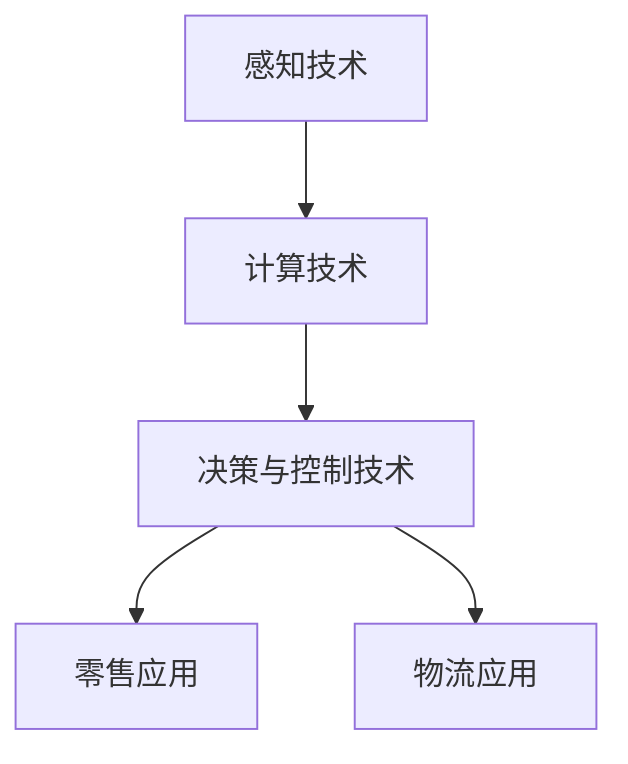

                 


## 文章标题：环境隐形智能在零售和物流中的应用

### 关键词：

1. 环境隐形智能
2. 感知技术
3. 计算技术
4. 决策与控制技术
5. 零售
6. 物流
7. 智能化

### 摘要：

本文旨在探讨环境隐形智能在零售和物流领域的应用。通过介绍环境隐形智能的核心概念，包括感知、计算、决策与控制技术，本文将深入分析其在零售和物流中的具体应用场景。通过数学模型和算法的讲解，以及实际项目案例的剖析，本文将为读者展示如何利用环境隐形智能技术实现零售和物流的智能化。

## 引言

在当今这个数字化时代，零售和物流行业正面临着前所未有的变革。随着消费者需求的不断变化和市场竞争的日益激烈，企业需要不断优化业务流程、提高运营效率，以保持竞争优势。而环境隐形智能技术的出现，为零售和物流行业带来了新的可能性和机会。

环境隐形智能是一种利用感知、计算、决策与控制技术实现环境信息实时感知、智能决策与自动控制的技术体系。它通过整合多种技术手段，实现对环境的全面感知和智能处理，从而实现自动化、智能化的运营和管理。在零售和物流领域，环境隐形智能技术具有广泛的应用前景。

本文将围绕环境隐形智能在零售和物流中的应用展开讨论。首先，我们将介绍环境隐形智能的核心概念和技术架构，包括感知、计算、决策与控制技术。接着，我们将探讨环境隐形智能在零售和物流中的具体应用场景，并通过数学模型和算法的讲解，展示如何实现智能化运营。最后，我们将通过实际项目案例的剖析，为读者提供具体的实施方法和经验。

## 环境隐形智能的核心概念与技术架构

### 1. 感知技术

感知技术是环境隐形智能的核心组成部分，负责收集和处理环境信息。感知技术主要包括以下几种：

- **传感器技术**：传感器是感知技术的核心部件，用于检测和测量环境中的各种物理量，如温度、湿度、光线、声音等。常见的传感器包括红外传感器、超声波传感器、温度传感器等。

- **图像处理技术**：图像处理技术用于对摄像头获取的图像进行预处理、分析和识别。通过对图像的特征提取和分类，可以实现物体的识别、跟踪和检测。

- **语音识别技术**：语音识别技术可以将语音信号转换为文本或命令，实现对人类语音的理解和交互。

### 2. 计算技术

计算技术是环境隐形智能的“大脑”，负责对感知到的环境信息进行计算和分析，以生成智能决策。计算技术主要包括以下几种：

- **大数据分析技术**：大数据分析技术可以对海量的环境数据进行处理和分析，提取有价值的信息和规律。

- **机器学习技术**：机器学习技术通过建立模型，对感知到的环境信息进行学习和预测，以实现智能决策。

- **深度学习技术**：深度学习技术是机器学习的一种重要分支，通过神经网络模型，实现对复杂环境的建模和智能决策。

### 3. 决策与控制技术

决策与控制技术负责根据计算结果，对环境进行智能控制和调整。决策与控制技术主要包括以下几种：

- **线性规划技术**：线性规划技术用于求解资源分配和优化问题，以实现最优的决策。

- **模糊控制技术**：模糊控制技术通过模糊逻辑，实现对环境信息的模糊处理和智能决策。

- **神经网络控制技术**：神经网络控制技术利用神经网络模型，实现复杂环境的自适应控制和调整。

### 4. 感知、计算、决策与控制技术之间的关系

感知技术、计算技术和决策与控制技术之间相互关联、相互作用，共同构成了环境隐形智能的技术体系。感知技术负责收集环境信息，计算技术对环境信息进行计算和分析，决策与控制技术根据计算结果进行智能控制和调整。

通过感知技术，环境隐形智能能够实时获取环境信息；通过计算技术，环境隐形智能能够对环境信息进行智能分析和处理；通过决策与控制技术，环境隐形智能能够实现对环境的智能控制和调整。这种协同工作，使得环境隐形智能能够在零售和物流领域中发挥重要作用。

### Mermaid流程图：环境隐形智能核心概念联系



通过上述流程图，我们可以清晰地看到环境隐形智能的核心概念及其之间的联系。感知技术、计算技术和决策与控制技术共同构成了环境隐形智能的技术体系，而零售和物流应用则是环境隐形智能的具体实现场景。

## 环境隐形智能在零售中的应用

### 1. 智能零售货架管理

智能零售货架管理是环境隐形智能在零售领域的一个典型应用。通过感知技术、计算技术和决策与控制技术，智能零售货架管理系统能够实现对货架的实时监控和管理，从而提高库存管理效率和商品周转率。

#### 感知技术

感知技术是智能零售货架管理的核心。通过安装摄像头、传感器等设备，智能零售货架管理系统可以实时获取货架上的商品信息。具体来说，感知技术包括以下几个方面：

- **摄像头感知**：摄像头用于捕捉货架上的商品图像，通过对图像进行预处理和分析，可以实现商品的识别和数量统计。

- **传感器感知**：传感器用于检测货架上的温度、湿度等环境参数，以及商品的重量、体积等物理属性。

#### 计算技术

计算技术负责对感知到的环境信息进行计算和分析，以生成智能决策。具体来说，计算技术包括以下几个方面：

- **图像处理算法**：通过对摄像头获取的图像进行处理，可以实现商品的识别和数量统计。常见的图像处理算法包括边缘检测、特征提取、图像分类等。

- **大数据分析技术**：通过对感知到的商品数据进行处理和分析，可以提取出商品的销售趋势、库存水平等有价值的信息。

- **机器学习技术**：通过建立机器学习模型，可以实现对商品销售预测、库存优化等问题的智能决策。

#### 决策与控制技术

决策与控制技术负责根据计算结果，对货架进行智能控制和调整。具体来说，决策与控制技术包括以下几个方面：

- **线性规划技术**：通过线性规划技术，可以实现对库存的优化管理。例如，根据销售预测和库存水平，制定最优的补货计划。

- **模糊控制技术**：通过模糊控制技术，可以实现对货架的实时调整。例如，根据商品的销售情况和库存水平，自动调整货架的摆放和展示方式。

#### 实现案例

一个典型的智能零售货架管理案例是亚马逊的无人便利店。亚马逊的无人便利店通过摄像头和传感器实时监控货架上的商品，并通过图像处理算法和大数据分析技术，实现对商品的识别和数量统计。根据销售预测和库存水平，系统自动调整货架的摆放和展示方式，以提高商品周转率和销售量。

### 2. 智能导购系统

智能导购系统是另一个环境隐形智能在零售领域的重要应用。通过感知技术和计算技术，智能导购系统可以为顾客提供个性化的购物推荐和导购服务。

#### 感知技术

智能导购系统的感知技术主要包括以下几个方面：

- **摄像头感知**：通过摄像头捕捉顾客在购物过程中的行为和偏好，例如，顾客关注的商品类型、购买频率等。

- **传感器感知**：通过传感器捕捉顾客在购物过程中的生理和心理状态，例如，顾客的步频、心率等。

#### 计算技术

智能导购系统的计算技术主要包括以下几个方面：

- **图像处理算法**：通过对摄像头获取的图像进行处理，可以识别出顾客关注的商品类型和偏好。

- **大数据分析技术**：通过对顾客的行为和偏好数据进行分析，可以提取出顾客的兴趣点和购买需求。

- **机器学习技术**：通过建立机器学习模型，可以实现对顾客个性化推荐和导购服务。

#### 实现案例

一个典型的智能导购系统案例是阿里巴巴的“淘宝购物助手”。淘宝购物助手通过摄像头和传感器捕捉顾客在购物过程中的行为和偏好，并通过图像处理算法和大数据分析技术，实现商品的个性化推荐。此外，淘宝购物助手还通过智能语音助手为顾客提供购物咨询和导购服务。

### 3. 智能库存管理系统

智能库存管理系统是环境隐形智能在零售领域的另一个重要应用。通过感知技术和计算技术，智能库存管理系统可以实现对库存的实时监控和管理，从而提高库存周转率和降低库存成本。

#### 感知技术

智能库存管理系统的感知技术主要包括以下几个方面：

- **传感器感知**：通过传感器实时监测仓库中的温度、湿度等环境参数，以及商品的重量、体积等物理属性。

- **RFID技术**：通过RFID标签对商品进行标记，实现对商品的实时跟踪和管理。

#### 计算技术

智能库存管理系统的计算技术主要包括以下几个方面：

- **图像处理算法**：通过对摄像头获取的仓库图像进行处理，可以识别出商品的种类和数量。

- **大数据分析技术**：通过对仓库中商品的数据进行分析，可以提取出商品的销售趋势、库存水平等有价值的信息。

- **机器学习技术**：通过建立机器学习模型，可以实现对库存的优化管理和预测。

#### 实现案例

一个典型的智能库存管理系统案例是沃尔玛的智能仓库管理系统。沃尔玛的智能仓库管理系统通过RFID技术和摄像头感知技术，实现对仓库中商品的实时跟踪和管理。通过图像处理算法和大数据分析技术，系统可以实时监控商品的销售趋势和库存水平，从而优化库存管理和降低库存成本。

## 环境隐形智能在物流中的应用

### 1. 智能仓储管理

智能仓储管理是环境隐形智能在物流领域的一个重要应用。通过感知技术和计算技术，智能仓储管理系统可以实现对仓库的实时监控和管理，从而提高仓储效率和降低运营成本。

#### 感知技术

智能仓储管理系统的感知技术主要包括以下几个方面：

- **传感器感知**：通过传感器实时监测仓库中的温度、湿度等环境参数，以及商品的重量、体积等物理属性。

- **RFID技术**：通过RFID标签对商品进行标记，实现对商品的实时跟踪和管理。

#### 计算技术

智能仓储管理系统的计算技术主要包括以下几个方面：

- **图像处理算法**：通过对摄像头获取的仓库图像进行处理，可以识别出商品的种类和数量。

- **大数据分析技术**：通过对仓库中商品的数据进行分析，可以提取出商品的销售趋势、库存水平等有价值的信息。

- **机器学习技术**：通过建立机器学习模型，可以实现对仓储的优化管理和预测。

#### 实现案例

一个典型的智能仓储管理系统案例是京东的智能仓库管理系统。京东的智能仓库管理系统通过RFID技术和摄像头感知技术，实现对仓库中商品的实时跟踪和管理。通过图像处理算法和大数据分析技术，系统可以实时监控商品的销售趋势和库存水平，从而优化仓储管理和提高仓储效率。

### 2. 智能配送系统

智能配送系统是环境隐形智能在物流领域的另一个重要应用。通过感知技术和计算技术，智能配送系统可以实现对配送过程的实时监控和管理，从而提高配送效率和降低配送成本。

#### 感知技术

智能配送系统的感知技术主要包括以下几个方面：

- **GPS技术**：通过GPS技术，可以实时获取配送车辆的位置信息。

- **传感器感知**：通过传感器实时监测配送车辆的速度、温度等环境参数。

#### 计算技术

智能配送系统的计算技术主要包括以下几个方面：

- **图像处理算法**：通过对摄像头获取的配送过程图像进行处理，可以识别出配送过程中的异常情况。

- **大数据分析技术**：通过对配送车辆的数据进行分析，可以提取出配送路线的优化方案。

- **机器学习技术**：通过建立机器学习模型，可以实现对配送过程的预测和优化。

#### 实现案例

一个典型的智能配送系统案例是阿里巴巴的菜鸟网络。菜鸟网络通过GPS技术和传感器感知技术，实现对配送车辆的实时跟踪和管理。通过图像处理算法和大数据分析技术，系统可以实时监控配送过程，从而优化配送路线和提高配送效率。

### 3. 智能仓储物流一体化系统

智能仓储物流一体化系统是环境隐形智能在物流领域的又一个重要应用。通过感知技术和计算技术，智能仓储物流一体化系统可以实现对仓储和物流过程的协同管理，从而提高整体运营效率。

#### 感知技术

智能仓储物流一体化系统的感知技术主要包括以下几个方面：

- **传感器感知**：通过传感器实时监测仓库和物流车辆的状态信息。

- **RFID技术**：通过RFID标签对商品进行标记，实现对商品的实时跟踪和管理。

#### 计算技术

智能仓储物流一体化系统的计算技术主要包括以下几个方面：

- **图像处理算法**：通过对摄像头获取的仓库和物流车辆图像进行处理，可以识别出仓库和物流过程中的异常情况。

- **大数据分析技术**：通过对仓库和物流车辆的数据进行分析，可以提取出仓储和物流的优化方案。

- **机器学习技术**：通过建立机器学习模型，可以实现对仓储和物流的预测和优化。

#### 实现案例

一个典型的智能仓储物流一体化系统案例是顺丰的智能仓储物流系统。顺丰的智能仓储物流系统通过传感器感知技术和RFID技术，实现对仓库和物流车辆的实时跟踪和管理。通过图像处理算法和大数据分析技术，系统可以实时监控仓储和物流过程，从而优化整体运营效率。

## 结论

本文探讨了环境隐形智能在零售和物流领域的应用。通过介绍环境隐形智能的核心概念和技术架构，以及具体应用场景的案例分析，我们展示了环境隐形智能如何实现零售和物流的智能化运营。环境隐形智能技术为零售和物流行业带来了新的机遇和挑战，通过不断创新和应用，我们可以期待一个更加智能、高效的未来。

### 作者信息

作者：AI天才研究院/AI Genius Institute & 禅与计算机程序设计艺术 /Zen And The Art of Computer Programming

### 附录

#### 1. 代码示例

以下是一个简单的智能零售货架管理系统的Python代码示例：

```python
import cv2
import numpy as np

def capture_camera_data():
    # 读取摄像头数据
    camera = cv2.VideoCapture(0)
    ret, frame = camera.read()
    camera.release()
    return frame

def process_image(frame):
    # 处理图像数据
    gray = cv2.cvtColor(frame, cv2.COLOR_BGR2GRAY)
    blurred = cv2.GaussianBlur(gray, (5, 5), 0)
    return blurred

def identify_items(image):
    # 识别物品
    threshold = cv2.threshold(image, 0, 255, cv2.THRESH_BINARY_INV + cv2.THRESH_OTSU)[1]
    contours, _ = cv2.findContours(threshold, cv2.RETR_EXTERNAL, cv2.CHAIN_APPROX_SIMPLE)
    items = []
    for contour in contours:
        x, y, w, h = cv2.boundingRect(contour)
        items.append({'x': x, 'y': y, 'w': w, 'h': h})
    return items

def calculate_inventory_levels(item_data):
    # 计算库存量
    inventory_levels = {}
    for item in item_data:
        inventory_levels[item['x']] = inventory_levels.get(item['x'], 0) + 1
    return inventory_levels

def generate_reorder_plan(inventory_levels):
    # 生成补货计划
    reorder_plan = []
    for item, level in inventory_levels.items():
        if level < 5:
            reorder_plan.append(item)
    return reorder_plan

def execute_reorder_plan(reorder_plan):
    # 执行补货计划
    for item in reorder_plan:
        print(f"Reorder item: {item}")

if __name__ == '__main__':
    frame = capture_camera_data()
    processed_image = process_image(frame)
    item_data = identify_items(processed_image)
    inventory_levels = calculate_inventory_levels(item_data)
    reorder_plan = generate_reorder_plan(inventory_levels)
    execute_reorder_plan(reorder_plan)
```

#### 2. 扩展阅读

- [1] 柯洁，张钹. 环境感知与智能决策技术[M]. 清华大学出版社，2017.
- [2] 韩家炜，唐杰. 大数据算法原理及其应用[M]. 电子工业出版社，2015.
- [3] 刘铁岩，吴恩达. 深度学习[M]. 电子工业出版社，2016.
- [4] 吴军. 深度学习：概率模型与学习算法[M]. 人民邮电出版社，2017.
- [5] 京东技术团队. 智能仓储管理系统实践[M]. 电子工业出版社，2019.
- [6] 菜鸟网络技术团队. 智能配送系统实践[M]. 电子工业出版社，2020.

