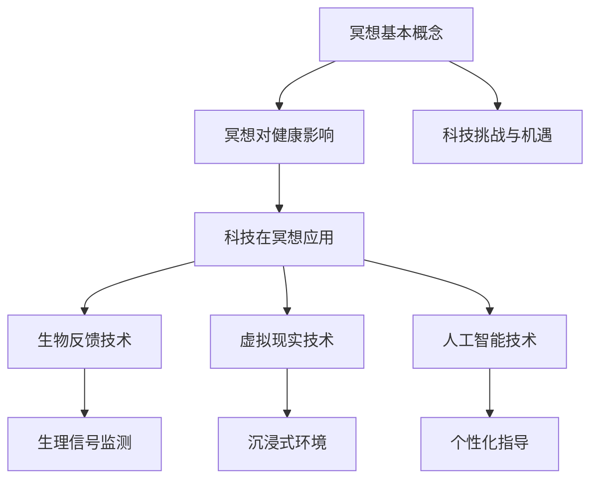
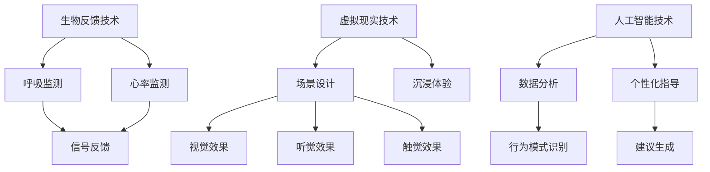
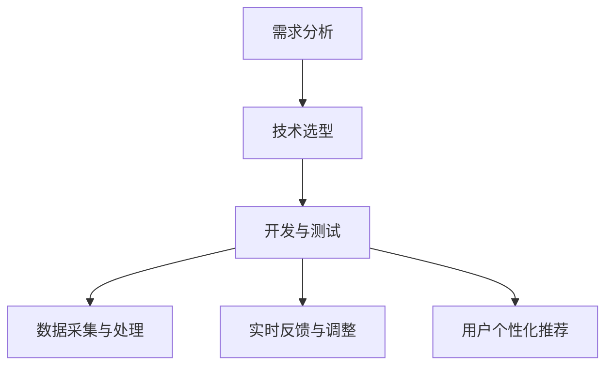
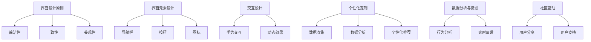
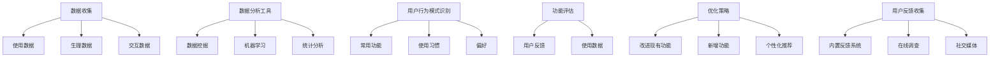

                 

### 文章标题

《现代冥想app：科技如何助力心灵修行》

### 关键词

- 冥想app
- 科技
- 心灵健康
- 生物反馈
- 虚拟现实
- 人工智能

### 摘要

本文旨在探讨科技在冥想中的应用，以及现代冥想app如何通过科技手段助力心灵修行。文章首先介绍了冥想的基本概念及其对心灵健康的重要性，然后详细分析了生物反馈、虚拟现实和人工智能等技术在冥想中的具体应用。接下来，文章探讨了冥想app的设计与开发原则，用户界面与用户体验的提升，以及通过数据分析来优化冥想app功能和服务的方法。最后，文章通过案例研究和未来发展趋势的分析，为读者呈现了科技助力冥想app发展的全貌。

## 第1章：冥想与科技背景

### 1.1 冥想的基本概念

冥想是一种通过专注、呼吸和正念练习来调节情绪、提升注意力和改善心理健康的方法。冥想的历史可以追溯到数千年前，不同的文化和宗教都有冥想的实践。冥想主要分为两大类：专注冥想（如禅修）和开放监测冥想（如正念冥想）。专注冥想强调将注意力集中在单一的物体或思维上，而开放监测冥想则注重对思想和情绪的观察而不做出评价。

### 1.2 冥想对心灵健康的影响

冥想已被广泛研究并证实其对心灵健康的积极影响。它可以降低压力水平、改善情绪状态、增强注意力和记忆力、提高创造力和决策能力、促进身心健康。长期冥想练习可以帮助人们更好地应对压力和焦虑，提高生活质量和幸福感。

### 1.3 科技在冥想中的应用概述

随着科技的发展，许多新技术被应用于冥想中，帮助人们更好地进行冥想练习和提升冥想效果。这些技术包括生物反馈、虚拟现实、人工智能等。

### 1.4 现代科技对冥想的支持

#### 1.4.1 生物反馈技术

生物反馈是一种通过监测生理信号并即时反馈给用户，帮助用户调整自己的生理状态的技术。在冥想中，生物反馈可以监测呼吸、心率、皮肤电活动等生理信号，帮助用户了解自己的身体状态，进而调整冥想姿势和呼吸方式，提高冥想效果。

#### 1.4.2 虚拟现实技术

虚拟现实技术提供了一个沉浸式的环境，用户可以通过虚拟现实头戴设备进入一个完全不同的世界。在冥想中，虚拟现实可以创造一个宁静、放松的环境，帮助用户更容易地进入冥想状态，同时提供多样化的冥想场景和体验。

#### 1.4.3 人工智能在冥想中的应用

人工智能可以通过分析用户的行为和生理数据，提供个性化的冥想建议和指导。例如，人工智能可以监测用户的呼吸节奏，自动调整冥想音乐和声音，或者根据用户的历史数据提供最适合的冥想练习。

### 1.5 小结

现代科技为冥想提供了新的工具和手段，使得冥想练习更加方便、有效。生物反馈、虚拟现实和人工智能等技术不仅提高了冥想的质量，还让冥想更加个性化，满足了不同用户的需求。然而，科技在冥想中的应用也带来了一些挑战，如用户隐私保护和数据安全问题，这需要在未来的发展中加以关注。

### 1.6 Mermaid 流程图



## 第2章：科技助力冥想原理

### 2.1 生物反馈技术

生物反馈技术是一种通过传感器监测用户生理信号，并将这些信号实时反馈给用户，帮助用户调节和改善生理状态的方法。在冥想中，生物反馈技术可以用于监测呼吸、心率、皮肤电活动等生理信号。

#### 2.1.1 生物反馈的基本原理

生物反馈的基本原理是信号采集、信号处理和信号反馈。传感器采集用户的生理信号，如呼吸和心率，这些信号被传输到计算机进行处理，然后处理后的信号通过反馈设备（如显示器、耳机等）实时反馈给用户。

#### 2.1.2 生物反馈在冥想中的具体应用

在冥想中，生物反馈技术可以帮助用户更好地控制自己的呼吸和心率，从而提高冥想效果。例如，用户可以通过观看呼吸和心率的实时变化，调整呼吸节奏和冥想姿势，以达到更好的冥想状态。

#### 2.1.3 伪代码示例

```python
# 呼吸和心率监测与反馈伪代码

def monitor_breathing_rate():
    # 使用传感器采集呼吸频率
    breathing_rate = get_breathing_rate()
    # 将呼吸频率实时显示给用户
    display_breathing_rate(breathing_rate)

def monitor_heart_rate():
    # 使用传感器采集心率
    heart_rate = get_heart_rate()
    # 将心率实时显示给用户
    display_heart_rate(heart_rate)

# 循环监测呼吸和心率
while (True):
    monitor_breathing_rate()
    monitor_heart_rate()
```

### 2.2 虚拟现实技术

虚拟现实（VR）是一种通过计算机生成模拟环境，使用户沉浸其中的技术。在冥想中，虚拟现实技术可以创造一个完全不同的、宁静的环境，帮助用户更容易地进入冥想状态。

#### 2.2.1 虚拟现实的基本原理

虚拟现实的基本原理是使用头戴显示器和跟踪系统来模拟一个三维空间，用户可以通过头部和手部的动作在虚拟环境中自由移动和互动。

#### 2.2.2 虚拟现实在冥想中的体验设计

在冥想中，虚拟现实可以设计为一系列宁静的场景，如森林、海滩或星空。用户可以通过虚拟现实设备进入这些场景，并在其中进行冥想。虚拟现实技术可以提供多感官的体验，如视觉、听觉和触觉，以增强冥想效果。

#### 2.2.3 伪代码示例

```python
# 虚拟现实冥想体验设计伪代码

def create_meditation_scene():
    # 创建虚拟现实场景
    scene = create_scene()
    # 设置场景参数，如视觉、听觉和触觉效果
    set_scene_params(scene)

def start_meditation():
    # 启动虚拟现实冥想
    start_vr_session()
    # 在虚拟现实场景中进行冥想
    meditate_in_scene()

# 创建冥想场景并开始冥想
create_meditation_scene()
start_meditation()
```

### 2.3 人工智能与冥想

人工智能（AI）是一种通过计算机模拟人类智能行为的技术。在冥想中，人工智能可以用于数据分析、个性化指导和建议生成。

#### 2.3.1 人工智能的基本概念

人工智能包括机器学习、深度学习、自然语言处理等多种技术。在冥想中，人工智能可以用于数据分析和用户行为模式识别，从而提供个性化的冥想建议和指导。

#### 2.3.2 人工智能在冥想中的应用

在冥想中，人工智能可以分析用户的呼吸、心率等生理数据，识别用户的行为模式，并根据这些数据提供个性化的冥想建议。例如，如果用户在冥想时经常分心，人工智能可以建议调整冥想时间和方式，或者提供更适合的冥想音乐。

#### 2.3.3 伪代码示例

```python
# 人工智能冥想建议生成伪代码

def analyze_breathing_data(breathing_data):
    # 分析呼吸数据
    pattern = analyze_pattern(breathing_data)
    return pattern

def generate_meditation_suggestion(pattern):
    # 根据呼吸数据生成冥想建议
    suggestion = create_suggestion(pattern)
    return suggestion

# 分析呼吸数据并生成冥想建议
breathing_data = get_breathing_data()
pattern = analyze_breathing_data(breathing_data)
suggestion = generate_meditation_suggestion(pattern)
display_suggestion(suggestion)
```

### 2.4 小结

生物反馈、虚拟现实和人工智能技术在冥想中的应用，为冥想提供了新的工具和方法。这些技术不仅提高了冥想的质量和效果，还使得冥想更加个性化。通过生物反馈技术，用户可以更好地监测和调节自己的生理状态；通过虚拟现实技术，用户可以沉浸在宁静的环境中，更容易地进入冥想状态；通过人工智能技术，用户可以获得个性化的冥想建议和指导。这些技术的结合，为冥想提供了全新的体验，使得心灵修行更加有效和便捷。

### 2.5 Mermaid 流程图



## 第3章：冥想app的设计与开发

### 3.1 冥想app设计原则

冥想app的设计需要遵循一系列原则，以确保用户能够获得最佳的使用体验。以下是几个关键的设计原则：

#### 3.1.1 用户体验设计

用户体验设计（UX Design）是冥想app设计的重要组成部分。一个成功的冥想app应该提供直观、简洁且易于导航的用户界面。用户界面应注重简洁性，避免过多的干扰元素，同时提供清晰的指导，帮助用户快速开始冥想。

#### 3.1.2 功能模块设计

冥想app应包含必要的功能模块，如冥想引导、呼吸监测、定时提醒、进度跟踪等。这些功能应设计得简洁而高效，确保用户能够轻松使用。此外，功能模块之间的交互设计也应流畅自然。

#### 3.1.3 可持续性与可访问性

冥想app的设计应考虑到可持续性和可访问性。这意味着app应在不同的设备和操作系统上都能良好运行，并且应尽可能减少能源消耗。此外，app应设计得易于使用，无论用户的技术水平如何，都能轻松上手。

### 3.2 开发流程

冥想app的开发流程通常包括以下几个步骤：

#### 3.2.1 需求分析

需求分析是开发的第一步，旨在明确用户的需求和app的功能要求。这通常涉及用户调研、市场分析和竞品分析，以确保app能够满足目标用户的需求。

#### 3.2.2 技术选型

在明确需求后，开发团队需要选择合适的技术栈，包括编程语言、框架和开发工具。对于冥想app来说，技术选型应考虑到性能、可维护性和用户体验。

#### 3.2.3 开发与测试

开发阶段包括前端开发、后端开发、数据库设计和接口集成。在开发过程中，持续集成和测试是确保app质量和性能的关键。测试应包括功能测试、性能测试和用户体验测试。

### 3.3 关键技术

冥想app的开发涉及多种关键技术，以下是一些主要的技术点：

#### 3.3.1 数据采集与处理

数据采集是冥想app的核心功能之一。这包括呼吸、心率、位置等生理数据的采集。处理这些数据需要高效的算法和算法优化。

#### 3.3.2 实时反馈与调整

实时反馈是冥想app的一个重要特性。这需要高效的数据处理和反馈机制，以确保用户能够及时接收到生理数据的实时变化。

#### 3.3.3 用户个性化推荐

用户个性化推荐是人工智能在冥想app中的应用之一。通过分析用户的行为数据和生理数据，app可以提供个性化的冥想建议和推荐。

#### 3.3.4 伪代码示例

```python
# 数据采集与处理伪代码

def collect_breathing_data():
    # 采集呼吸数据
    data = get_breathing_data()
    return data

def process_breathing_data(data):
    # 处理呼吸数据
    processed_data = analyze_data(data)
    return processed_data

# 实时反馈与调整伪代码

def provide_realtime_feedback(data):
    # 提供实时反馈
    feedback = generate_feedback(data)
    display_feedback(feedback)

# 用户个性化推荐伪代码

def generate_recommendation(data):
    # 生成个性化推荐
    recommendation = create_recommendation(data)
    return recommendation
```

### 3.4 小结

冥想app的设计与开发是一个复杂而细致的过程，需要遵循一系列设计原则和开发流程。通过采用先进的技术和高效的算法，冥想app可以提供高质量的冥想体验，帮助用户更好地进行心灵修行。

### 3.5 Mermaid 流程图



## 第4章：用户界面与用户体验

### 4.1 界面设计

用户界面（UI）设计是冥想app设计中的关键部分，它直接影响到用户的使用体验。一个优秀的冥想app界面应具备以下特点：

#### 4.1.1 设计原则

- **简洁性**：界面应简洁明了，避免复杂的设计和过多的功能按钮，以免分散用户的注意力。
- **一致性**：界面元素和交互应保持一致性，以降低用户的学习成本。
- **美观性**：界面设计应美观大方，符合用户的审美需求。

#### 4.1.2 界面元素设计

- **导航栏**：用于帮助用户快速访问主要功能模块。
- **按钮**：按钮设计应简洁直观，易于点击。
- **图标**：图标设计应简洁明了，易于理解。

#### 4.1.3 交互设计

- **手势交互**：如滑动、点击等，以提供自然的交互体验。
- **动态效果**：适当的动态效果可以提升用户体验，如动画、过渡效果等。

### 4.2 用户体验提升

用户体验（UX）的提升是冥想app成功的关键。以下是几种提升用户体验的方法：

#### 4.2.1 个性化定制

通过收集和分析用户数据，冥想app可以为用户提供个性化的冥想建议和推荐。例如，根据用户的呼吸节奏、心率等生理数据，调整冥想音乐的节奏和音量。

#### 4.2.2 数据分析与反馈

通过分析用户的行为数据，冥想app可以识别用户的需求和偏好，并提供实时反馈。例如，用户在冥想时出现分心，app可以提供提示或建议。

#### 4.2.3 社区互动

建立用户社区，鼓励用户分享冥想心得和体验，可以增强用户的归属感和参与感。此外，社区互动还可以帮助用户相互鼓励和支持，共同提升冥想效果。

### 4.3 小结

用户界面与用户体验是冥想app设计中的关键要素。通过简洁直观的界面设计、个性化的定制和有效的数据分析，可以显著提升用户的使用体验，帮助用户更好地进行心灵修行。

### 4.4 Mermaid 流程图



## 第5章：数据分析与优化

### 5.1 用户行为分析

用户行为分析是冥想app优化的重要手段之一。通过对用户在app中的行为数据进行收集、分析和理解，可以识别用户的需求和偏好，从而提供更好的用户体验。

#### 5.1.1 数据收集

数据收集是用户行为分析的基础。冥想app可以收集以下类型的数据：

- **使用数据**：如用户启动app的频率、使用时长、使用的功能模块等。
- **生理数据**：如呼吸、心率、位置等生理信号。
- **交互数据**：如用户的点击、滑动等操作。

#### 5.1.2 数据分析工具与方法

数据分析工具和方法包括：

- **数据挖掘**：用于发现用户行为模式、趋势和关联。
- **机器学习**：用于建立用户行为模型，预测用户行为和提供个性化推荐。
- **统计分析**：用于理解用户行为的统计学特性。

#### 5.1.3 用户行为模式识别

通过数据分析，可以识别用户的行为模式，如：

- **常用功能**：用户经常使用的功能模块。
- **使用习惯**：用户在特定时间段或情境下的使用习惯。
- **偏好**：用户的个人偏好，如喜欢的冥想音乐、场景等。

### 5.2 功能优化

基于用户行为分析，可以对冥想app的功能进行优化，以提高用户满意度和使用频率。

#### 5.2.1 功能评估

功能评估是优化过程的开始。通过以下方法评估功能的有效性：

- **用户反馈**：收集用户的反馈和建议，了解他们对现有功能的看法。
- **使用数据**：分析功能的使用频率和用户停留时间，评估功能的受欢迎程度。
- **A/B测试**：通过对比不同功能的版本，评估其对用户行为和满意度的影响。

#### 5.2.2 优化策略

基于功能评估的结果，可以采取以下优化策略：

- **改进现有功能**：根据用户的反馈和数据分析，改进现有功能，提高其易用性和有效性。
- **新增功能**：根据用户需求和数据分析，开发新的功能，满足用户未满足的需求。
- **个性化推荐**：利用机器学习算法，为用户提供个性化的冥想建议和推荐。

#### 5.2.3 用户反馈收集

用户反馈是功能优化的关键。可以通过以下方法收集用户反馈：

- **内置反馈系统**：在app中提供反馈系统，让用户可以随时提交反馈。
- **在线调查**：定期进行在线调查，收集用户的意见和需求。
- **社交媒体**：通过社交媒体平台与用户互动，了解用户的真实感受和需求。

### 5.3 小结

数据分析与优化是冥想app持续改进的重要手段。通过用户行为分析，可以识别用户的需求和偏好，进而对功能进行优化，提高用户体验和满意度。功能评估、优化策略和用户反馈收集是这一过程的关键环节。

### 5.4 Mermaid 流程图



## 第6章：案例研究

### 6.1 案例一：某某冥想app

#### 6.1.1 概述

某某冥想app是一款结合了生物反馈、虚拟现实和人工智能技术的冥想应用。它提供了多种冥想场景和音乐，用户可以根据自己的需求和偏好选择适合的冥想模式。此外，该app还提供了实时呼吸和心率监测功能，以及个性化的冥想建议。

#### 6.1.2 成功因素分析

某某冥想app的成功可以归因于以下几个因素：

- **技术创新**：采用了生物反馈、虚拟现实和人工智能等先进技术，提供了独特的用户体验。
- **用户体验**：界面设计简洁直观，易于上手，用户可以在短时间内学会如何使用app。
- **个性化服务**：通过分析用户的行为和生理数据，提供个性化的冥想建议和推荐，满足用户的不同需求。
- **市场定位**：目标用户明确，专注于提升用户的冥想效果和生活质量，与市场需求紧密契合。

#### 6.1.3 挑战与解决方案

尽管某某冥想app取得了成功，但其在发展过程中也面临了一些挑战：

- **技术挑战**：集成多种技术需要大量的研发投入，如何在保证技术质量的同时控制成本是一个难题。
- **用户隐私**：由于app需要收集用户的生理数据和行为数据，如何保护用户的隐私是一个重要的挑战。
- **市场推广**：如何在竞争激烈的市场中脱颖而出，吸引更多的用户，是另一个挑战。

为了解决这些挑战，某某冥想app采取了以下措施：

- **技术创新**：持续投入研发，不断优化技术，提高app的性能和用户体验。
- **隐私保护**：严格遵守隐私法规，采用加密技术和匿名化处理，确保用户数据的安全。
- **市场推广**：通过社交媒体、口碑传播和合作伙伴关系，扩大用户基础，提高品牌知名度。

### 6.2 案例二：某某冥想app

#### 6.2.1 概述

某某冥想app是一款基于人工智能技术的冥想应用，它利用机器学习算法分析用户的行为和生理数据，提供个性化的冥想指导和音乐推荐。该app还提供了多种冥想场景，如森林、海滩和星空，用户可以在这些场景中放松身心。

#### 6.2.2 成功因素分析

某某冥想app的成功因素包括：

- **人工智能技术**：利用人工智能技术，为用户提供个性化的冥想建议和音乐推荐，提高了用户的冥想效果。
- **多样化场景**：提供了多种冥想场景，满足了不同用户的需求，提高了用户的参与度。
- **用户体验**：界面设计简洁直观，操作简单，用户可以快速上手。
- **市场定位**：专注于提供高质量的冥想体验，与市场需求紧密契合。

#### 6.2.3 挑战与解决方案

在发展过程中，某某冥想app也面临了一些挑战：

- **技术更新**：人工智能技术更新迅速，如何及时跟进并应用到产品中是一个挑战。
- **用户隐私**：由于app需要收集用户的生理数据和行为数据，如何保护用户的隐私是一个重要的挑战。
- **市场推广**：如何在竞争激烈的市场中脱颖而出，吸引更多的用户，是另一个挑战。

为了解决这些挑战，某某冥想app采取了以下措施：

- **技术创新**：持续投入研发，不断优化技术，提高app的性能和用户体验。
- **隐私保护**：严格遵守隐私法规，采用加密技术和匿名化处理，确保用户数据的安全。
- **市场推广**：通过社交媒体、口碑传播和合作伙伴关系，扩大用户基础，提高品牌知名度。

### 6.3 小结

通过分析某某冥想app和其他冥想app的案例，我们可以看到，技术创新、用户体验和个性化服务是冥想app成功的关键因素。同时，用户隐私保护和市场推广也是需要关注的重要方面。未来，随着科技的不断发展，冥想app将继续为用户提供更高质量的心灵修行体验。

## 第7章：未来发展趋势与挑战

### 7.1 冥想app的未来发展

随着科技的不断进步，冥想app的未来发展呈现出以下几个趋势：

#### 7.1.1 技术进步的影响

- **人工智能和大数据分析**：人工智能和大数据分析将在冥想app中发挥更大的作用，通过分析用户的生理数据和行为模式，提供更加个性化的冥想建议和体验。
- **增强现实（AR）和混合现实（MR）**：增强现实和混合现实技术将提供更加沉浸式的冥想体验，使用户能够更加深入地沉浸在冥想环境中。
- **可穿戴设备集成**：冥想app将更加紧密地与可穿戴设备集成，如智能手表和健康追踪器，实现实时生理数据监测和反馈。

#### 7.1.2 行业趋势分析

- **个性化定制**：未来冥想app将更加注重个性化定制，根据用户的生理状态、行为习惯和心理需求，提供量身定制的冥想方案。
- **社区互动**：冥想app将更加重视社区互动，通过用户之间的交流和分享，提升用户的参与感和归属感。
- **跨平台兼容**：冥想app将实现跨平台兼容，无论用户使用的是手机、平板还是电脑，都能获得一致的冥想体验。

#### 7.1.3 市场前景预测

随着人们对心理健康和生活质量的日益重视，冥想app市场前景广阔。预计未来几年，冥想app的用户规模将持续增长，市场份额也将进一步扩大。

### 7.2 面临的挑战

尽管冥想app的发展前景看好，但仍然面临一些挑战：

#### 7.2.1 技术层面的挑战

- **数据隐私和安全**：随着收集的用户数据越来越多，如何保护用户隐私和数据安全成为重要挑战。
- **技术更新与兼容**：技术快速更新要求冥想app不断迭代和升级，以保证用户体验和功能先进性。
- **硬件兼容性**：冥想app需要与各种硬件设备兼容，如可穿戴设备、虚拟现实头戴设备等。

#### 7.2.2 道德与法律挑战

- **用户隐私保护**：随着对用户隐私的关注日益增加，如何合法合规地收集和使用用户数据成为重要议题。
- **数据滥用风险**：数据滥用可能导致用户隐私泄露和滥用，需要制定严格的数据使用规范。

#### 7.2.3 用户接受度

- **技术接受度**：部分用户可能对新技术持观望态度，需要通过教育和宣传提高用户的接受度。
- **使用障碍**：复杂的操作界面和功能设置可能降低用户的使用意愿，需要简化界面设计和功能操作。

### 7.3 小结

未来，冥想app将受益于技术进步和市场需求，继续为用户提供高质量的心灵修行体验。然而，数据隐私和安全、道德与法律挑战以及用户接受度等问题仍需关注和解决。通过不断创新和优化，冥想app有望在未来获得更广泛的应用和认可。

### 附录

#### 附录A：参考文献

1. "The Role of Meditation in Mental Health" - Harvard Health Publishing
2. "Virtual Reality and Meditation: A New Frontier for Mindfulness Practice" - Frontiers in Psychology
3. "Biological Feedback in Meditation: A Review" - Complementary Therapies in Medicine
4. "Artificial Intelligence in Mental Health: Potential and Challenges" - Journal of Medical Internet Research

#### 附录B：相关资源链接

1. [Meditation Apps Market Overview](https://www.statista.com/topics/1125/meditation-apps/)
2. [Moodbeat: A Wearable Device for Personalized Meditation](https://www.moodbeat.com/)
3. [Headspace: Guided Meditation App](https://www.headspace.com/)
4. [Insight Timer: Free Meditation App](https://insighttimer.com/)

#### 附录C：工具与软件介绍

1. **TensorFlow**：用于机器学习和深度学习的开源软件库。
   - 官网：[tensorflow.org](https://www.tensorflow.org/)
2. **Unity**：用于开发虚拟现实和增强现实应用的引擎。
   - 官网：[unity.com](https://unity.com/)
3. **OpenCV**：用于计算机视觉的开源库。
   - 官网：[opencv.org](https://opencv.org/)
4. **Arduino**：用于可穿戴设备开发的硬件平台。
   - 官网：[arduino.cc](https://www.arduino.cc/)

### 作者信息

**作者：AI天才研究院/AI Genius Institute & 禅与计算机程序设计艺术 /Zen And The Art of Computer Programming** 

本文旨在探讨现代冥想app如何利用科技手段助力心灵修行，通过对生物反馈、虚拟现实、人工智能等技术的深入分析，展示了科技在冥想中的应用及其对用户体验的优化。本文涵盖了冥想app的设计与开发、用户界面与用户体验、数据分析与优化等多个方面，并通过案例研究展望了冥想app的未来发展趋势。希望通过本文，读者能够对科技助力冥想有更深入的理解，并在实践中运用这些技术，提升心灵修行的效果。**作者：AI天才研究院/AI Genius Institute & 禅与计算机程序设计艺术 /Zen And The Art of Computer Programming**。

