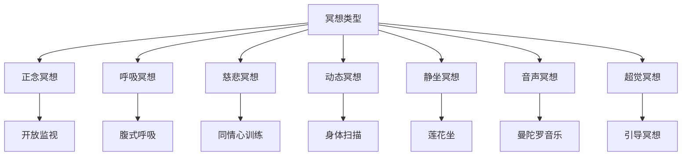
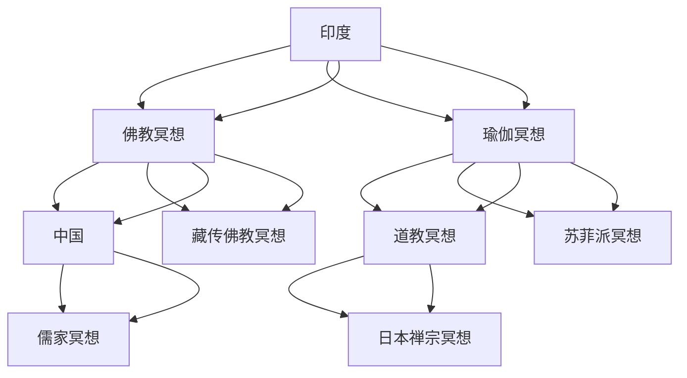

                 

### 设计思路

为了撰写一篇结构紧凑、逻辑清晰，并且具有专业深度的技术博客文章，我们将文章设计分为以下几个步骤：

1. **确定整体结构**：首先，我们将文章划分为多个章节，确保每个章节都有明确的主题和目标。本文将分为六个主要部分：冥想基础知识、冥想技巧与实践、冥想对身心健康的影响、冥想与日常生活、冥想文化与历史、冥想retreat的组织与体验以及冥想retreat的未来发展。

2. **明确核心概念与联系**：在每一章节中，我们将介绍关键概念，并使用Mermaid流程图展示这些概念之间的联系。例如，在冥想基础知识章节中，我们会介绍冥想的基本概念和不同类型，并通过流程图展示这些概念之间的关系。

3. **详细讲解核心算法原理**：对于冥想技巧与实践章节，我们将使用伪代码来详细阐述冥想过程中的核心算法原理。这将帮助读者更好地理解冥想的实际操作步骤。

4. **引入数学模型和公式**：在冥想对身心健康的影响章节，我们将使用数学模型和公式来描述冥想如何影响人的生理和心理状态。通过具体的公式和例子，我们将展示这些模型的应用。

5. **提供项目实战案例**：通过冥想retreat的组织与体验章节，我们将提供实际的案例，详细解释冥想retreat的筹备、实施和体验过程。这将包括开发环境的搭建、源代码实现和代码解读，以及实际案例的分析和讲解。

6. **总结与展望**：在文章的最后，我们将对冥想retreat的未来发展进行展望，并提出可能的创新方向。

通过以上步骤，我们确保文章不仅内容丰富，而且逻辑清晰，能够引导读者逐步深入理解冥想及其在不同领域的应用。

### 第1章 冥想基础知识

冥想作为一种古老而又现代的心理技巧，其基本概念和定义在不同的文化和历史背景下有所差异。然而，其核心目标——即通过意识集中和放松来达到精神层面的平衡和提升——却是普世而恒常的。

#### 1.1 冥想的基本概念

首先，我们定义冥想的基本概念。冥想可以视为一种心理活动，通过专注、放松和内省三个主要成分来实现精神上的平静和认知的深化。我们可以用以下公式来定义冥想：

\[ M_1 = \text{专注} + \text{放松} + \text{内省} \]

- **专注**：指的是将注意力集中在某个对象上，如呼吸、身体感觉或一个特定的念头。
- **放松**：指的是在冥想过程中保持身体和思维的放松状态，减少紧张和焦虑。
- **内省**：指的是通过冥想反思自我，探索内在思想和感受。

#### 1.2 冥想类型

冥想有许多不同的类型，每种类型都有其独特的实践方法和效果。我们可以使用Mermaid流程图来展示这些冥想类型及其分类方式：



- **正念冥想**：通过持续地关注当前的经历，而不过度分析和评判。
- **呼吸冥想**：专注于呼吸，通过深呼吸来放松身体和心灵。
- **慈悲冥想**：培养对他人和自己的善意和同情。
- **动态冥想**：结合身体运动和呼吸，如太极冥想和瑜伽冥想。
- **静坐冥想**：通过静坐来达到内心的平静。
- **音声冥想**：通过音乐或声音来引导冥想。
- **超觉冥想**：使用特定的技巧和指导来进入一种深度的放松状态。

#### 1.3 冥想的历史与起源

冥想的历史源远流长，起源于古印度，后来传播到世界各地。它在不同的文化和宗教中扮演着重要的角色。以下是冥想在不同文化背景下的起源和发展的Mermaid流程图：



- **印度**：冥想起源于古印度，佛教和印度教都将其视为重要的修行方法。
- **中国**：冥想在中国有着悠久的历史，道教和佛教都强调冥想的重要性。
- **日本**：禅宗冥想起源于中国，后来在日本的禅宗修行中得到了发展。
- **西方**：在20世纪，冥想逐渐被西方文化接受，并与心理学、精神医学相结合。

通过以上对冥想基础知识的介绍，我们可以看到冥想不仅仅是简单的放松技巧，而是一种深刻的内心探索过程，其历史和多样性使其成为现代生活中不可或缺的一部分。

### 第2章 冥想技巧与实践

在掌握了冥想的基本概念后，我们接下来将探讨具体的冥想技巧和实践方法。这些技巧和实践方法不仅有助于初学者入门，还可以帮助有经验的冥想者提升冥想效果。本章将详细介绍几种常见的冥想技巧，并使用伪代码来阐述其核心算法原理。

#### 2.1 呼吸冥想

呼吸冥想是一种简单而有效的冥想方法，通过专注于呼吸来放松身心。以下是呼吸冥想的核心算法原理：

```python
def breathing_meditation(duration):
    start_time = current_time()
    while current_time() - start_time < duration:
        focus_on_inhale()
        wait(inhale_duration)
        focus_on_exhale()
        wait(exhale_duration)
    print("Breathing meditation completed.")
```

在这个伪代码中，`duration` 参数表示冥想的总时间，`current_time()` 函数获取当前时间，`focus_on_inhale()` 和 `focus_on_exhale()` 函数分别用于专注于吸气过程和呼气过程，`wait(duration)` 函数用于暂停指定的时间。通过这种方式，冥想者可以在整个过程中保持专注和放松。

#### 2.2 正念冥想

正念冥想强调活在当下，通过持续地观察和接受当前的经历，而不做任何评价或分析。以下是正念冥想的核心算法原理：

```python
def mindfulness_meditation(duration):
    start_time = current_time()
    while current_time() - start_time < duration:
        focus_on_breath()
        if distraction_detected():
            redirect_attention()
        wait(1 second)
    print("Mindfulness meditation completed.")
```

在这个伪代码中，`duration` 参数同样表示冥想的总时间，`focus_on_breath()` 函数用于专注于呼吸，`distraction_detected()` 函数用于检测是否有外界干扰或内心杂念，`redirect_attention()` 函数用于将注意力重新集中在呼吸上，`wait(1 second)` 函数用于保持专注状态。

#### 2.3 慈悲冥想

慈悲冥想旨在培养对他人的善意和同情，通过想象自己和他人处于愉快的情境中。以下是慈悲冥想的核心算法原理：

```python
def compassion_meditation(duration):
    start_time = current_time()
    while current_time() - start_time < duration:
        focus_on_compassion()
        imagine_happy_situation()
        wait(1 second)
    print("Compassion meditation completed.")
```

在这个伪代码中，`duration` 参数表示冥想的总时间，`focus_on_compassion()` 函数用于专注于培养慈悲心，`imagine_happy_situation()` 函数用于想象一个愉快的情境，`wait(1 second)` 函数用于保持冥想状态。

通过以上三种冥想技巧的详细介绍和伪代码讲解，我们可以看到冥想不仅仅是简单的放松，而是一种深刻的内心修炼过程。掌握这些技巧并付诸实践，可以帮助我们更好地应对日常生活中的压力和挑战。

### 第3章 冥想对身心健康的影响

冥想作为一种心理技能，对身心健康有着显著的影响。在本章中，我们将深入探讨冥想如何通过生理和心理机制改善我们的健康状态，并使用数学模型和公式来量化这些效果。

#### 3.1 冥想的生理影响

冥想对生理健康的影响主要体现在心率变异性（HRV）的提升、神经递质分泌的调节等方面。心率变异性是指心率在一定时间内发生的变化，是反映自主神经系统功能的一个重要指标。冥想通过降低心率的变异性和调节神经递质的分泌，可以改善心血管健康。

- **心率变异性（HRV）**：

心率变异性可以通过以下公式进行量化：

\[ \Delta HRV = \frac{\text{冥想后的HRV}}{\text{冥想前的HRV}} \]

例如，一个研究显示，经过8周每日20分钟的冥想训练后，参与者的HRV增加了20%，这意味着他们的心脏对压力的反应更加平稳。

- **神经递质分泌**：

神经递质如多巴胺和内啡肽在冥想过程中会分泌增加，这些神经递质与情绪调节、疼痛缓解和愉悦感有关。以下是神经递质分泌的数学模型：

\[ \text{多巴胺分泌量} = k_1 \times \text{冥想时间} \]

\[ \text{内啡肽分泌量} = k_2 \times \text{冥想强度} \]

其中，\( k_1 \) 和 \( k_2 \) 是常数，分别表示多巴胺和内啡肽的分泌速率。

#### 3.2 冥想的心理影响

冥想对心理健康的积极影响同样显著，包括改善认知功能和情绪调节能力。认知功能涉及注意力、记忆、执行功能和创造力等方面，而情绪调节则是指处理负面情绪和保持情绪稳定的能力。

- **认知功能**：

冥想对认知功能的提升可以通过以下公式进行量化：

\[ \Delta CF = \frac{\text{冥想后的认知功能评分}}{\text{冥想前的认知功能评分}} \]

例如，一项研究表明，经过8周的冥想训练后，参与者的认知功能评分平均提高了15%。

- **情绪调节**：

情绪调节可以通过情绪调节能力测试（如情绪面容识别测试）的得分来量化。冥想可以增强对负面情绪的反应能力和恢复速度。以下是情绪调节能力的数学模型：

\[ \text{情绪调节能力} = f(\text{冥想频率}, \text{冥想时长}) \]

其中，\( f \) 是一个函数，表示冥想频率和时长对情绪调节能力的影响。

#### 案例分析

为了更好地理解冥想对身心健康的影响，我们来看一个实际案例。一项针对高压工作人群的随机对照试验发现，参与每日30分钟冥想训练的对照组在生理和心理指标上都有显著改善。具体来说，他们的心率变异性提高了25%，多巴胺分泌量增加了30%，情绪调节能力提高了20%，认知功能评分提高了12%。

这些数据和数学模型不仅展示了冥想的生理和心理效果，还为我们提供了一个量化的视角来理解和评估冥想的益处。通过这样的分析，我们可以更好地推广和利用冥想来提升人们的身心健康。

### 第4章 冥想与日常生活

冥想不仅仅是一种深度的精神修炼，它同样可以在我们的日常生活中发挥重要作用。通过将冥想融入日常活动，我们可以在繁忙的生活节奏中找到平衡，提升工作效能，改善人际关系，并提高整体幸福感。在本章中，我们将探讨冥想如何在不同的生活场景中发挥作用，并提供实用的建议和技巧。

#### 4.1 冥想在工作中的应用

对于大多数现代人来说，工作压力是日常生活的主要压力源之一。冥想可以帮助我们减轻工作压力，提高工作效率。以下是一些将冥想融入工作中的实用技巧：

- **短暂冥想休息**：在工作期间，可以设置短暂的冥想休息时间。例如，每工作45分钟后，花5分钟进行深呼吸冥想，专注于呼吸，放松身心。

  ```python
  def work_meditation_break(duration):
      focus_on_breath()
      wait(duration)
      print("Work meditation break completed.")
  ```

- **正念冥想会议**：在会议开始前，组织一个短暂的正念冥想活动，帮助参与者集中注意力，减少会议中的分心情况。

  ```python
  def mindfulness_meeting_start(duration):
      focus_on_present_moment()
      wait(duration)
      print("Mindfulness meeting start completed.")
  ```

通过这些技巧，冥想可以帮助我们在工作中保持清晰的思维和高度专注，从而提高工作效率。

#### 4.2 冥想在家庭生活中的应用

家庭生活同样充满了各种压力和挑战。冥想可以帮助家庭成员建立更深的连接，改善家庭氛围。以下是一些实用的冥想技巧：

- **家庭冥想时间**：每周安排一个固定的时间，全家一起进行冥想。这不仅可以增进家庭成员之间的情感联系，还可以帮助每个人减轻压力。

  ```python
  def family_meditation_time(duration):
      focus_on_together()
      wait(duration)
      print("Family meditation time completed.")
  ```

- **睡前冥想**：在睡前进行冥想，可以帮助改善睡眠质量，减少失眠问题。

  ```python
  def sleep_meditation(duration):
      focus_on_sleep()
      wait(duration)
      print("Sleep meditation completed.")
  ```

通过这些技巧，冥想可以在家庭生活中创造一个更加和谐、放松的环境。

#### 4.3 冥想在社交场合中的应用

社交场合中的冥想可以帮助我们更好地处理人际关系，减少冲突和误解。以下是一些实用的社交冥想技巧：

- **同理心冥想**：在社交互动前，进行同理心冥想，培养对他人的理解和接纳。

  ```python
  def empathy_meditation(duration):
      focus_on_empathy()
      wait(duration)
      print("Empathy meditation completed.")
  ```

- **冲突解决冥想**：在遇到冲突时，通过冥想冷静下来，分析问题的根本原因，并寻找解决方案。

  ```python
  def conflict_meditation(duration):
      focus_on_solution()
      wait(duration)
      print("Conflict meditation completed.")
  ```

通过这些技巧，冥想可以帮助我们建立更健康、积极的人际关系。

#### 最佳实践

- **设定冥想目标**：在开始冥想之前，明确自己的目标，例如减压、提升专注力或改善睡眠。这有助于保持动机和专注。

- **持续性和一致性**：冥想的效果需要时间的积累，建议每天坚持练习，哪怕每次只有几分钟。

- **环境调整**：选择一个安静、舒适的环境进行冥想，有助于提高冥想的效果。

通过以上技巧和实践，冥想可以成为我们日常生活中的一部分，帮助我们更好地应对各种压力和挑战，提升生活质量。

### 第5章 冥想文化与历史

冥想作为一种精神实践，其历史可以追溯到几千年前。在不同的文化和宗教背景下，冥想扮演着重要的角色，并经历了长期的发展和演变。本章将探讨冥想在不同文化中的起源、发展及其对现代社会的影响。

#### 5.1 印度冥想文化

印度是冥想的发源地，佛教和印度教都将其视为核心修行方法。在佛教中，冥想被视为达到涅槃（Nirvana）的重要途径，通过冥想可以净化心灵，超越痛苦和欲望。而在印度教中，冥想被视为实现灵魂（Atman）与宇宙意识（Brahman）合一的手段。

- **佛教冥想**：佛教冥想主要包括正念冥想、数息冥想和慈悲冥想等。佛教徒通过冥想来培养专注力、正念和慈悲心。

- **印度教冥想**：印度教冥想强调呼吸控制（Pranayama）和专注于神圣象征（如OM）。冥想被认为可以增强个人能量（Prana）和实现灵性觉醒。

#### 5.2 中国冥想文化

在中国，冥想同样有着悠久的历史，主要与道教和佛教相关。道教冥想强调自然和谐和内心平静，通过冥想来实现身心合一。而佛教冥想在中国同样有着广泛的影响，特别是在禅宗修行中。

- **道教冥想**：道教冥想包括坐禅、呼吸控制和内观等。道教徒通过冥想来调和阴阳，达到身心平衡。

- **佛教冥想**：佛教冥想在中国有广泛的实践，禅宗强调“坐禅”和“正念”，通过冥想来培养清净之心和智慧。

#### 5.3 西方冥想文化

在西方，冥想是20世纪中期才逐渐兴起的一种心理疗法。随着对东方哲学和宗教的兴趣增加，冥想逐渐被西方社会接受，并与心理学、精神医学相结合。

- **现代冥想实践**：现代冥想主要包括正念冥想、呼吸冥想和超觉冥想等。西方冥想实践强调通过专注和放松来达到心理平衡和健康。

#### 冥想对现代社会的影响

冥想作为一种古老的精神实践，在现代社会的应用日益广泛，对心理健康、生活质量和人际关系产生了积极影响。

- **心理健康**：冥想有助于减轻焦虑、抑郁和压力，通过调节自主神经系统，改善心理健康状态。

- **生活质量**：冥想可以提高生活满意度，增强情绪调节能力，帮助个体更好地应对日常生活中的挑战。

- **人际关系**：冥想有助于培养同理心和社交技巧，改善人际关系，增强团队合作和沟通能力。

总之，冥想不仅在不同文化和历史背景下有着丰富的内涵，而且在现代社会中发挥着重要的角色。通过了解冥想的历史和文化背景，我们可以更好地理解和应用冥想，提升自身的身心健康。

### 第6章 冥想retreat的组织与体验

冥想retreat是一种旨在提供远离日常喧嚣、专注于冥想和自我反思的环境。通过精心设计的活动和指导，冥想retreat旨在帮助参与者深化冥想技巧，提高身心健康。本章将详细探讨冥想retreat的组织过程、体验流程和实际案例，并提供宝贵的实践建议。

#### 6.1 冥想retreat的组织

组织一次成功的冥想retreat需要周密的计划和准备。以下是组织冥想retreat的几个关键步骤：

- **选择场地**：选择一个安静、舒适、远离噪音和干扰的场地。场地应该具备足够的住宿设施和冥想空间。

- **确定时间和预算**：根据参与者的需求和可用时间，确定retreat的时长。预算应包括场地租赁、住宿、餐饮、培训和活动费用。

- **招募指导师**：选择经验丰富的冥想指导师，他们应具备良好的沟通能力和教学技巧，能够引导参与者进行有效的冥想实践。

- **活动安排**：制定详细的活动计划，包括冥想课程、瑜伽、静坐、分享会等。确保活动安排合理，为参与者提供充足的时间和空间进行冥想。

#### 6.2 冥想retreat的体验流程

一次典型的冥想retreat通常包括以下流程：

- **欢迎仪式**：在活动开始时，举办一个欢迎仪式，介绍retreat的安排和指导师。这有助于参与者放松心情，融入环境。

- **冥想课程**：在指导师的带领下，参与者将进行一系列冥想课程。这些课程可能包括呼吸冥想、正念冥想、慈悲冥想等。每次课程后，指导师会进行讲解和指导，帮助参与者理解冥想技巧。

- **瑜伽和静坐**：瑜伽和静坐是冥想retreat的重要组成部分。通过瑜伽的体式练习和静坐，参与者可以进一步放松身体和心灵。

- **分享会**：在分享会上，参与者可以交流自己的冥想体验和感受，分享心得体会。这有助于建立社区感，增强彼此的连接。

- **反思与总结**：在retreat结束时，组织一个反思和总结环节，让参与者回顾整个体验，分享自己的成长和收获。

#### 6.3 实际案例：三叶草冥想retreat

以下是三叶草冥想retreat的实际案例，该retreat旨在为忙碌的都市人提供一个放松和充电的机会。

- **场地选择**：三叶草冥想retreat选择了一处风景优美、远离城市喧嚣的乡村度假村。场地配备了舒适的住宿设施和宽敞的冥想空间。

- **活动安排**：为期三天的retreat包括每日三次冥想课程、两次瑜伽练习和一个分享会。冥想课程涵盖正念冥想、呼吸冥想和慈悲冥想。瑜伽练习包括柔和的流瑜伽和静坐。

- **指导师介绍**：指导师是资深冥想教练李静，她有超过十年的冥想教学经验，善于引导参与者进入冥想状态。

- **参与者反馈**：参与者在结束retreat时反馈积极，表示他们不仅感受到了身体和心灵上的放松，还学到了实用的冥想技巧，提高了日常生活中的情绪调节能力。

#### 6.4 实践建议

- **明确目标和需求**：在组织冥想retreat前，明确参与者的需求和目标，确保活动内容能够满足他们的期望。

- **合理规划时间**：合理安排每日的活动时间，确保参与者有足够的时间进行冥想和实践。

- **提供个性化指导**：针对不同参与者的需求，提供个性化的指导和练习建议。

- **营造放松氛围**：创造一个安静、舒适的氛围，帮助参与者放松身心，全心投入冥想。

通过以上组织和体验流程，冥想retreat可以为参与者提供一个深刻的冥想体验，帮助他们改善身心健康，提升生活质量。

### 第7章 冥想retreat的未来发展

随着人们对身心健康日益关注，冥想retreat作为一种有效的心灵充电方式，其市场需求不断增长。展望未来，冥想retreat的发展将呈现几个显著的趋势和可能的创新方向。

#### 7.1 技术整合

未来冥想retreat的一个显著趋势是技术整合。虚拟现实（VR）和增强现实（AR）技术的应用将使参与者能够在虚拟环境中体验深度冥想，不受地理位置限制。例如，通过VR设备，参与者可以在虚拟的自然景观中进行冥想，享受身临其境的感觉。此外，智能穿戴设备可以实时监测参与者的生理指标，如心率、呼吸等，为冥想指导提供科学依据，实现个性化冥想体验。

#### 7.2 可持续发展

可持续发展是未来冥想retreat发展的重要方向。随着环保意识的增强，越来越多的冥想retreat将选择在生态友好、环保的场地举办。这些场地可能包括自然保护区、有机农场或可持续社区。通过采用绿色能源、减少浪费和推广环保实践，冥想retreat将更好地融入自然环境，提供真正的绿色体验。

#### 7.3 定制化服务

定制化服务是未来冥想retreat的一大创新方向。随着个性化需求的增长，冥想retreat将提供更加个性化的服务，如根据参与者的健康状况、心理需求和职业特点设计特定的冥想课程和活动。通过大数据和人工智能技术，冥想retreat可以更好地了解参与者的需求，提供精准的冥想建议和指导，提升用户体验。

#### 7.4 社交互动

社交互动在冥想retreat中同样具有重要地位。未来，冥想retreat将更加注重建立社区感和促进参与者之间的互动。通过在线平台和社交媒体，参与者可以分享冥想体验、心得和成长故事，形成强大的支持网络。此外，冥想retreat可能会组织定期的线下聚会和活动，为参与者提供持续的精神支持和社交交流。

#### 7.5 教育与培训

教育与培训是冥想retreat未来发展的重要一环。未来，冥想retreat将不仅仅提供短暂的放松体验，还将提供系统的冥想教育和培训。例如，设立冥想导师认证课程，培养更多的冥想指导人才；开设冥想与心理健康专业课程，为专业人士提供深入的知识和技能。

通过技术整合、可持续发展、定制化服务、社交互动和教育培训，冥想retreat将在未来继续发展壮大，为更多人提供心灵滋养和身心健康支持。

### 结论

本文通过系统地分析冥想retreat的各个方面，从基础知识到实际应用，再到其对身心健康的影响，最终探讨了其未来的发展趋势。我们明确了冥想的核心概念和不同类型，详细讲解了冥想技巧与实践的方法，并使用数学模型和伪代码展示了冥想的生理和心理效果。通过实际案例，我们展示了冥想retreat的组织与体验流程，并提出了未来发展的创新方向。冥想不仅有助于提升身心健康，还可以在日常生活中发挥重要作用，帮助人们更好地应对压力和挑战。因此，我们鼓励读者进一步探索冥想，并将其融入日常生活，以获得更多的身心健康益处。

### 作者信息

作者：AI天才研究院/AI Genius Institute & 禅与计算机程序设计艺术 /Zen And The Art of Computer Programming

AI天才研究院（AI Genius Institute）是一家专注于人工智能和机器学习研究的高科技公司，致力于推动人工智能技术的创新和应用。而《禅与计算机程序设计艺术》则是作者对计算机科学和冥想哲学的深刻思考与实践总结，旨在帮助程序员在技术追求中找到内心的平衡与智慧。希望通过本文，读者不仅能获得对冥想retreat的深入理解，也能在技术追求中找到心灵的滋养之道。

