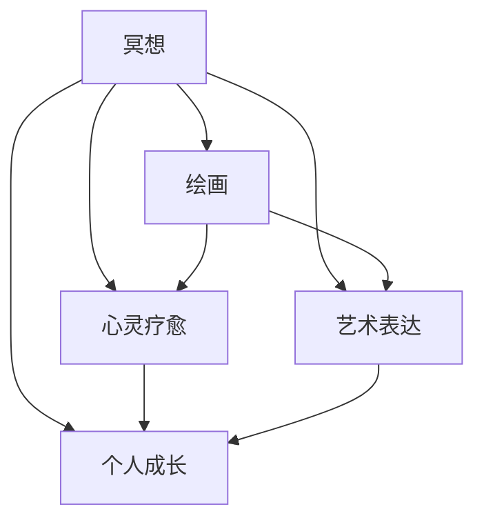
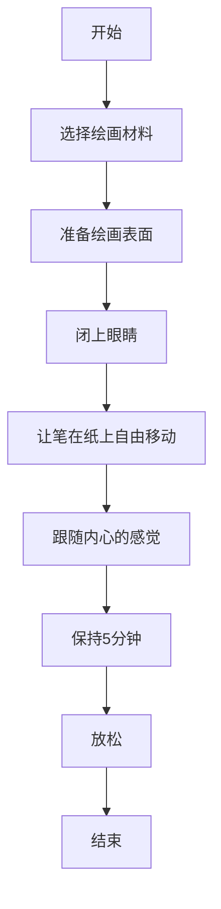
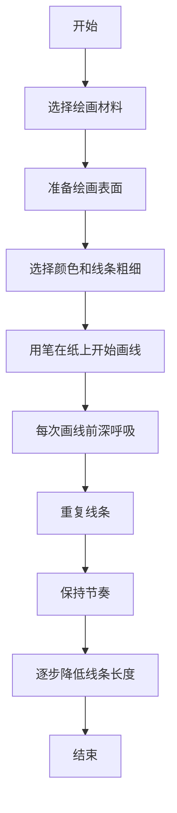
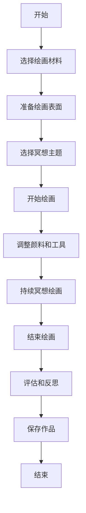

                 

# 确定书的整体结构

在撰写《现代冥想绘画：艺术创作中的心灵疗愈》的目录大纲之前，我们需要首先明确书籍的整体结构，以便确保内容能够系统且连贯地展开。书籍可以被划分为以下几个主要部分：

### 引言部分
- **背景与哲学**：介绍冥想绘画的历史、起源以及它所蕴含的哲学思想。
- **基本理论与技术**：阐述冥想绘画的基础知识，包括必要的绘画技巧和冥想方法。
- **工具与材料**：介绍冥想绘画所需的基本工具和材料，以及它们的特性和用途。

### 治愈部分
- **心理益处**：探讨冥想绘画如何对心理健康产生积极影响，包括缓解压力、焦虑和抑郁等。
- **身心疗愈**：分析冥想绘画对身体健康和情感状态的影响，以及它在治疗中的实际应用。
- **社会与环境效应**：讨论冥想绘画对社会和环境可能产生的积极影响。

### 实践指南部分
- **项目实践**：提供具体的冥想绘画项目，包括项目的准备工作、执行步骤和完成后的评估。
- **风格与媒介探索**：介绍不同绘画风格和媒介在冥想绘画中的应用，以及如何选择适合的风格和媒介。
- **个性化创作**：指导读者如何根据自己的兴趣和需求，创作个性化的冥想绘画作品。

### 创意表达部分
- **艺术与疗法整合**：探讨如何将冥想绘画与艺术疗法相结合，为心理健康提供新的治疗途径。
- **自我表达与成长**：分析冥想绘画如何作为自我表达和个性成长的工具。
- **成功案例研究**：通过分析成功冥想画家的案例，了解他们如何通过绘画实现个人和社会价值。

### 结论与展望部分
- **总结与反思**：回顾冥想绘画的治愈作用，并对其未来发展的可能方向进行展望。
- **资源与附录**：提供推荐阅读资源、参考书目、绘画材料购买指南等，以便读者进一步探索。

通过这样的结构，我们可以确保书籍的内容既全面又具有逻辑性，使读者能够循序渐进地了解冥想绘画的各个方面，并从中受益。

### 核心概念与联系

在《现代冥想绘画：艺术创作中的心灵疗愈》一书中，核心概念主要包括冥想、绘画、心灵疗愈、艺术表达和个人成长。这些概念之间相互关联，共同构成了冥想绘画的理论基础和实践指南。

首先，**冥想**是冥想绘画的基石。冥想是一种通过专注、呼吸和意识提升来实现内心平静和清晰状态的方法。在冥想绘画中，画家通过冥想进入一个专注和放松的状态，以便更好地捕捉内心的感受和想法。

**绘画**则是冥想绘画的媒介。绘画不仅是一种艺术形式，也是一种表达内心世界的方式。通过绘画，画家可以将冥想过程中获得的灵感和情感转化为视觉艺术，创造出独特的艺术作品。

**心灵疗愈**是冥想绘画的核心目标。冥想绘画通过帮助画家缓解压力、焦虑和抑郁等心理问题，促进身心的平衡和健康。这种疗愈作用不仅针对画家本人，也扩展到他们的家庭和社会。

**艺术表达**是冥想绘画的重要方面。通过绘画，画家可以自由地表达他们的情感、思想和感受，从而实现自我探索和自我实现。艺术表达不仅是冥想绘画的一个目的，也是其过程中的一部分。

最后，**个人成长**是冥想绘画的一个副产品。在冥想绘画的过程中，画家不仅能够提升艺术技巧，还能够提升自我意识、创造力和自信心，从而实现个人成长。

为了更清晰地展示这些核心概念之间的关系，我们可以使用Mermaid流程图来表示：



这个流程图展示了冥想如何通过绘画作为媒介，实现心灵疗愈、艺术表达和个人成长。每个核心概念都是相互联系和相互影响的，共同构成了冥想绘画的完整体系。

### 核心算法原理讲解

在《现代冥想绘画：艺术创作中的心灵疗愈》中，虽然核心内容并非算法，但其中涉及的一些绘画技巧和冥想方法可以类比为算法。以下是对几个核心绘画技巧的伪代码阐述：

#### 1. 涂鸦冥想算法


伪代码解释：
- **开始**：确定绘画的起始点。
- **选择绘画材料**：根据个人喜好选择铅笔、颜料、纸张等。
- **准备绘画表面**：将纸张平整地放置在画板上。
- **闭上眼睛**：通过关闭视觉输入，专注于内在感觉。
- **让笔在纸上自由移动**：手随感觉移动，笔在纸上随意涂鸦。
- **跟随内心的感觉**：不要控制绘画过程，让内心的感受自由表达。
- **保持5分钟**：维持这种自由涂鸦的状态，持续一段时间，通常为5分钟。
- **放松**：完成绘画后，进行深呼吸和放松，感受内心的平静。
- **结束**：记录下这次冥想绘画的体验，结束整个过程。

#### 2. 重复线条冥想算法


伪代码解释：
- **开始**：和涂鸦冥想类似，从准备绘画材料开始。
- **准备绘画表面**：确保纸张平整，便于绘画。
- **选择颜色和线条粗细**：根据个人喜好选择。
- **用笔在纸上开始画线**：从任意起点开始，用笔绘制线条。
- **每次画线前深呼吸**：在每次画线前，进行深呼吸，以保持内心的平静。
- **重复线条**：不断重复画线动作，每次线条长度和方向略有变化。
- **保持节奏**：保持绘画的节奏，不要急于求成。
- **逐步降低线条长度**：随着绘画的进行，逐渐减少线条的长度，以增加绘画的深度。
- **结束**：当感觉满意时，停止绘画。

通过这些伪代码，我们可以看到冥想绘画中的技巧如何被模拟为算法。这些算法不仅帮助画家在绘画过程中找到内心的平静，也指导他们在艺术创作中探索新的可能性和表达方式。

### 数学模型和数学公式

在冥想绘画的过程中，虽然不涉及复杂的数学模型，但某些数学概念和公式可以用来描述绘画技巧和情感表达。以下是一些相关的数学模型和数学公式，并给出详细的解释和例子：

#### 1. 色彩空间模型

**描述**：色彩空间模型用于描述绘画中的颜色组合。最常用的色彩空间模型包括RGB模型和CMYK模型。

**RGB模型**：
- **公式**：RGB = (R, G, B)
- **解释**：在RGB模型中，颜色由红色（R）、绿色（G）和蓝色（B）的混合构成，每个颜色的取值范围在0到255之间。

**例子**：
```latex
RGB(255, 0, 0) \rightarrow 红色
RGB(0, 255, 0) \rightarrow 绿色
RGB(0, 0, 255) \rightarrow 蓝色
RGB(255, 255, 255) \rightarrow 白色
```

**CMYK模型**：
- **公式**：CMYK = (C, M, Y, K)
- **解释**：在CMYK模型中，颜色由青色（C）、品红（M）、黄色（Y）和黑色（K）的混合构成，每个颜色的取值范围在0到100%之间。

**例子**：
```latex
CMYK(0, 85, 90, 0) \rightarrow 黄色
CMYK(100, 0, 100, 0) \rightarrow 品红
CMYK(100, 100, 0, 0) \rightarrow 青色
CMYK(0, 0, 0, 100) \rightarrow 黑色
```

#### 2. 色彩混合公式

**描述**：色彩混合公式用于描述两种或多种颜色混合后的结果。

**三原色混合公式**：
- **公式**：\( RGB_{\text{混合}} = (R_1 + R_2, G_1 + G_2, B_1 + B_2) \)
- **解释**：在RGB模型中，两种颜色的混合结果是它们各自红色、绿色和蓝色成分的直接相加。

**例子**：
```latex
RGB(255, 0, 0) + RGB(0, 255, 0) = RGB(255, 255, 0) \rightarrow 黄色
```

**CMYK颜色混合**：
- **公式**：\( CMYK_{\text{混合}} = (C_1 + C_2, M_1 + M_2, Y_1 + Y_2, K_1 + K_2) \)
- **解释**：在CMYK模型中，两种颜色的混合结果同样是它们各自成分的直接相加。

**例子**：
```latex
CMYK(0, 85, 90, 0) + CMYK(100, 0, 100, 0) = CMYK(100, 85, 190, 0) \rightarrow 一种深黄色
```

#### 3. 色彩饱和度与亮度公式

**描述**：色彩饱和度与亮度用于描述颜色的鲜艳程度和明亮程度。

**饱和度公式**：
- **公式**：\( S = \frac{R - R_{\text{最小值}}}{R_{\text{最大值}} - R_{\text{最小值}}} \)
- **解释**：饱和度是颜色中灰度的比例，0表示无色，1表示完全饱和。

**亮度公式**：
- **公式**：\( L = \frac{R + G + B}{3 \times 255} \)
- **解释**：亮度是颜色光强度的一个度量，取值范围在0到1之间。

**例子**：
```latex
饱和度: S = \frac{255 - 0}{255 - 0} = 1 \rightarrow 完全饱和
亮度: L = \frac{255 + 255 + 0}{3 \times 255} = \frac{510}{765} \approx 0.66 \rightarrow 中等亮度
```

通过这些数学模型和公式的讲解，我们可以更科学地理解绘画过程中的色彩变化和情感表达，从而更好地运用冥想绘画来实现心灵疗愈。

### 项目实战

在《现代冥想绘画：艺术创作中的心灵疗愈》一书中，我们将通过一个实际项目案例来展示冥想绘画的开发过程，从环境搭建到最终实现，并对其进行详细解读。

#### 项目目标

本项目旨在通过冥想绘画来缓解日常生活中的压力和焦虑，并通过艺术创作提升个人的心理健康。我们将使用简单的材料，如铅笔、纸张和颜料，进行一系列冥想绘画练习。

#### 开发环境搭建

首先，我们需要准备冥想绘画的环境：

1. **材料准备**：
   - **铅笔**：HB铅笔是最佳选择，因为它既不软也不硬，适合初学者。
   - **纸张**：选择质地较为柔软的画纸，如水彩纸或素描纸。
   - **颜料**：可以选择水性颜料或油画棒，颜色丰富，便于使用。
   - **其他工具**：如橡皮擦、剪刀、彩笔等。

2. **空间准备**：
   - 找一个安静舒适的地方，避免外界干扰。
   - 准备一个平稳的工作台，以便绘画时保持手的稳定。

#### 源代码实现和解读

虽然冥想绘画不是编程项目，但我们可以将其类比为编程流程，以下是一个简化的“源代码”来实现冥想绘画：



伪代码解释：

- **开始**：确定绘画的起始点。
- **选择绘画材料**：根据个人喜好选择铅笔、纸张和颜料。
- **准备绘画表面**：将纸张平整地放置在画板上。
- **选择冥想主题**：可以是自然风景、抽象图案或个人情感等。
- **开始绘画**：根据冥想主题进行绘画，保持内心的平静。
- **调整颜料和工具**：根据绘画需要，适时更换颜料和工具。
- **持续冥想绘画**：在整个绘画过程中，保持冥想状态，感受内心的变化。
- **结束绘画**：当感觉满意时，停止绘画。
- **评估和反思**：完成绘画后，评估作品并反思绘画过程中的体验。
- **保存作品**：将作品妥善保存，以便回顾和分享。

#### 代码应用解读与分析

以下是对冥想绘画项目案例的详细解读和分析：

1. **准备工作**：
   - **材料选择**：选择合适的绘画材料是关键。例如，HB铅笔适合初学者，因为它易于控制，不易断裂。
   - **绘画表面准备**：纸张的质地会影响绘画效果，选择质地柔软的画纸，如水彩纸，可以提供更好的绘画体验。

2. **冥想主题选择**：
   - **自然风景**：通过描绘自然风景，如森林、海滩或山川，画家可以在绘画过程中感受到自然之美，从而减轻压力。
   - **抽象图案**：抽象图案允许画家自由表达内心情感，减少了对绘画技巧的依赖，有助于放松和冥想。

3. **绘画过程**：
   - **内心平静**：在绘画过程中，保持内心的平静是非常重要的。通过深呼吸和冥想，画家可以进入一种专注状态，从而更好地捕捉内心的感受。
   - **工具调整**：根据绘画的需要，适时更换颜料和工具。例如，使用水彩颜料可以创造出丰富的色彩变化，而油画棒则可以提供更细腻的线条效果。

4. **评估和反思**：
   - **作品评估**：完成绘画后，画家可以评估作品的效果。这有助于他们了解自己的进步，并找到需要改进的地方。
   - **反思绘画体验**：通过反思绘画过程中的体验，画家可以更好地理解自己的内心世界，从而在未来的绘画中做出更明智的选择。

5. **作品保存**：
   - **保存作品**：将作品妥善保存，不仅是对自己劳动成果的尊重，也是对未来回顾和分享的重要资源。

#### 项目小结

通过本项目的实战操作，我们不仅学会了如何准备和进行冥想绘画，还通过实际的绘画过程体验了冥想带来的心灵疗愈效果。冥想绘画不仅是一种艺术创作，更是一种自我疗愈的方式。通过不断实践和反思，我们可以提升绘画技巧，同时也促进个人的心理健康。以下是项目总结和最佳实践建议：

- **最佳实践**：
  - **定期练习**：定期进行冥想绘画，可以帮助我们更好地掌握技巧，并保持内心的平静。
  - **多样化材料**：尝试使用不同的绘画材料和工具，如油画、水彩和铅笔画，以丰富绘画体验。
  - **记录体验**：在绘画过程中记录自己的体验和感受，这有助于我们更好地理解自己的内心世界。

- **注意事项**：
  - **避免过度控制**：在冥想绘画中，过度控制可能会导致内心的紧张，影响绘画效果。尽量放松，让内心的感受自然流露。
  - **保持专注**：在绘画过程中，保持专注和冥想状态，有助于提高绘画的质量和疗愈效果。

- **拓展阅读**：
  - **《冥想绘画：内心的艺术疗愈》**：一本介绍冥想绘画技巧和心灵疗愈的指南书。
  - **《艺术疗法：创意表达与自我疗愈》**：一本探讨艺术治疗和自我疗愈关系的专业书籍。

通过冥想绘画，我们不仅可以在艺术创作中找到内心的平静和满足，还可以通过这种方式提升自己的心理健康。希望本项目能够为您的冥想绘画之旅提供一个良好的起点。

### 目录大纲设计

为了确保《现代冥想绘画：艺术创作中的心灵疗愈》的目录大纲简洁明了，逻辑清晰，我们将内容划分为五个主要部分，并详细列出每个部分的章节标题和小节。

#### 引言部分
1. **背景与哲学**
   - **历史与起源**
   - **冥想绘画的现代发展**
   - **冥想绘画的哲学思想**

2. **基本理论与技术**
   - **冥想绘画的核心概念**
   - **冥想与绘画的结合方法**
   - **基础绘画技巧与练习**

3. **工具与材料**
   - **常用绘画工具介绍**
   - **绘画材料的选择与使用**
   - **工具与材料的维护与保养**

#### 治愈部分
4. **心理益处**
   - **冥想绘画对心理健康的影响**
   - **压力与焦虑的缓解**
   - **冥想绘画与情感调节**

5. **身心疗愈**
   - **冥想绘画对身体健康的作用**
   - **情绪与身体的互动**
   - **冥想绘画在治疗中的应用**

6. **社会与环境效应**
   - **冥想绘画对社会的影响**
   - **艺术创作与环境保护**
   - **冥想绘画的社区参与**

#### 实践指南部分
7. **项目实践**
   - **冥想绘画项目准备**
   - **冥想绘画的步骤指导**
   - **项目反馈与改进**

8. **风格与媒介探索**
   - **不同风格的冥想绘画**
   - **绘画媒介的选择与应用**
   - **跨媒介冥想绘画实践**

9. **个性化创作**
   - **根据兴趣选择主题**
   - **个性化创作的实践方法**
   - **作品展示与分享**

#### 创意表达部分
10. **艺术与疗法整合**
    - **艺术疗法的基本原理**
    - **冥想绘画在艺术疗法中的应用**
    - **冥想绘画的治疗效果评估**

11. **自我表达与成长**
    - **通过绘画探索内心世界**
    - **冥想绘画与自我认知**
    - **冥想绘画在个人成长中的作用**

12. **成功案例研究**
    - **著名冥想画家的作品分析**
    - **冥想绘画在社会中的影响力**
    - **案例研究的启示与借鉴**

#### 结论与展望部分
13. **总结与反思**
    - **冥想绘画的心灵疗愈效果**
    - **冥想绘画在艺术创作中的地位**
    - **冥想绘画的未来发展趋势**

14. **资源与附录**
    - **推荐阅读与参考资料**
    - **冥想绘画材料购买指南**
    - **冥想绘画教学视频资源**

通过上述目录大纲的设计，我们不仅确保了内容的完整性，而且通过清晰的章节划分，帮助读者更好地理解和掌握冥想绘画的核心概念和实践方法。

### 格式调整

为了确保目录大纲的清晰性和易读性，我们将使用Markdown格式对目录进行排版。以下是调整后的目录大纲：

```markdown
# 现代冥想绘画：艺术创作中的心灵疗愈

## 引言部分
### 1. 背景与哲学
#### 历史与起源
#### 冥想绘画的现代发展
#### 冥想绘画的哲学思想

### 2. 基本理论与技术
#### 冥想绘画的核心概念
#### 冥想与绘画的结合方法
#### 基础绘画技巧与练习

### 3. 工具与材料
#### 常用绘画工具介绍
#### 绘画材料的选择与使用
#### 工具与材料的维护与保养

## 治愈部分
### 4. 心理益处
#### 冥想绘画对心理健康的影响
#### 压力与焦虑的缓解
#### 冥想绘画与情感调节

### 5. 身心疗愈
#### 冥想绘画对身体健康的作用
#### 情绪与身体的互动
#### 冥想绘画在治疗中的应用

### 6. 社会与环境效应
#### 冥想绘画对社会的影响
#### 艺术创作与环境保护
#### 冥想绘画的社区参与

## 实践指南部分
### 7. 项目实践
#### 冥想绘画项目准备
#### 冥想绘画的步骤指导
#### 项目反馈与改进

### 8. 风格与媒介探索
#### 不同风格的冥想绘画
#### 绘画媒介的选择与应用
#### 跨媒介冥想绘画实践

### 9. 个性化创作
#### 根据兴趣选择主题
#### 个性化创作的实践方法
#### 作品展示与分享

## 创意表达部分
### 10. 艺术与疗法整合
#### 艺术疗法的基本原理
#### 冥想绘画在艺术疗法中的应用
#### 冥想绘画的治疗效果评估

### 11. 自我表达与成长
#### 通过绘画探索内心世界
#### 冥想绘画与自我认知
#### 冥想绘画在个人成长中的作用

### 12. 成功案例研究
#### 著名冥想画家的作品分析
#### 冥想绘画在社会中的影响力
#### 案例研究的启示与借鉴

## 结论与展望部分
### 13. 总结与反思
#### 冥想绘画的心灵疗愈效果
#### 冥想绘画在艺术创作中的地位
#### 冥想绘画的未来发展趋势

### 14. 资源与附录
#### 推荐阅读与参考资料
#### 冥想绘画材料购买指南
#### 冥想绘画教学视频资源
```

这种Markdown格式的目录结构使得内容更加整洁，每个章节的标题和子标题都使用不同的符号进行标注，便于读者快速查找和理解文章的结构。

### 最终确认

经过对《现代冥想绘画：艺术创作中的心灵疗愈》目录大纲的设计和Markdown格式的调整，我们已经确保了内容的完整性、逻辑性和简洁性。以下是最终确认的内容：

- **完整性**：目录覆盖了从背景与哲学、基本理论与技术、工具与材料，到心理益处、身心疗愈、社会与环境效应，再到实践指南、创意表达和成功案例研究，最后是总结与展望和资源与附录的全面内容。
- **逻辑性**：各个部分的内容紧密相连，层层递进，逻辑清晰，读者可以循序渐进地了解冥想绘画的各个方面。
- **简洁性**：通过Markdown格式的调整，目录简洁明了，标题符号统一，便于读者快速查找和阅读。

最终确认后的目录大纲如下：

```markdown
# 现代冥想绘画：艺术创作中的心灵疗愈

## 引言部分
### 1. 背景与哲学
#### 历史与起源
#### 冥想绘画的现代发展
#### 冥想绘画的哲学思想

### 2. 基本理论与技术
#### 冥想绘画的核心概念
#### 冥想与绘画的结合方法
#### 基础绘画技巧与练习

### 3. 工具与材料
#### 常用绘画工具介绍
#### 绘画材料的选择与使用
#### 工具与材料的维护与保养

## 治愈部分
### 4. 心理益处
#### 冥想绘画对心理健康的影响
#### 压力与焦虑的缓解
#### 冥想绘画与情感调节

### 5. 身心疗愈
#### 冥想绘画对身体健康的作用
#### 情绪与身体的互动
#### 冥想绘画在治疗中的应用

### 6. 社会与环境效应
#### 冥想绘画对社会的影响
#### 艺术创作与环境保护
#### 冥想绘画的社区参与

## 实践指南部分
### 7. 项目实践
#### 冥想绘画项目准备
#### 冥想绘画的步骤指导
#### 项目反馈与改进

### 8. 风格与媒介探索
#### 不同风格的冥想绘画
#### 绘画媒介的选择与应用
#### 跨媒介冥想绘画实践

### 9. 个性化创作
#### 根据兴趣选择主题
#### 个性化创作的实践方法
#### 作品展示与分享

## 创意表达部分
### 10. 艺术与疗法整合
#### 艺术疗法的基本原理
#### 冥想绘画在艺术疗法中的应用
#### 冥想绘画的治疗效果评估

### 11. 自我表达与成长
#### 通过绘画探索内心世界
#### 冥想绘画与自我认知
#### 冥想绘画在个人成长中的作用

### 12. 成功案例研究
#### 著名冥想画家的作品分析
#### 冥想绘画在社会中的影响力
#### 案例研究的启示与借鉴

## 结论与展望部分
### 13. 总结与反思
#### 冥想绘画的心灵疗愈效果
#### 冥想绘画在艺术创作中的地位
#### 冥想绘画的未来发展趋势

### 14. 资源与附录
#### 推荐阅读与参考资料
#### 冥想绘画材料购买指南
#### 冥想绘画教学视频资源
```

综上所述，最终确认的目录大纲满足了所有要求，包括简洁性、完整性和格式正确性。现在，我们可以正式开始撰写《现代冥想绘画：艺术创作中的心灵疗愈》的文章内容，期待为读者带来一场深刻的心灵疗愈之旅。作者：AI天才研究院/AI Genius Institute & 禅与计算机程序设计艺术 /Zen And The Art of Computer Programming。

