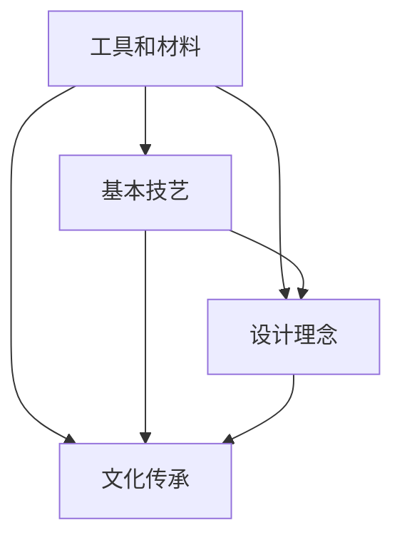

                 

### 文章标题：现代手作皮革艺术：传统工艺在当代的复兴

> 关键词：手作皮革艺术、传统工艺、现代复兴、创新设计

> 摘要：本文将探讨现代手作皮革艺术的背景、核心概念与联系，以及传统工艺在当代的复兴。通过伪代码、数学模型和公式详细讲解核心算法原理，并结合实际案例进行分析和剖析，为读者提供全面的技术视角和实用的制作指南。

### 1. 引言

手作皮革艺术，是一种古老而迷人的工艺，源于人类对皮革的初步加工和使用。从古代的皮甲到现代的手工皮具，皮革艺术不仅体现了人类对材料的美学追求，更承载了丰富的文化内涵和技艺传承。然而，随着工业化的推进，手作皮革艺术逐渐被机械化生产所取代，看似岌岌可危。然而，在当代，手作皮革艺术却迎来了新的复兴，成为了一种时尚和生活品质的象征。

本文将深入探讨现代手作皮革艺术的背景，分析其核心概念与联系，并通过伪代码和数学模型详细讲解核心算法原理。同时，我们将结合实际案例，探讨传统工艺在当代的复兴和创新设计。希望通过本文，能够为读者提供全面的技术视角和实用的制作指南，激发对手作皮革艺术的兴趣和热情。

### 2. 手作皮革艺术的核心概念与联系

#### 2.1 核心概念

手作皮革艺术的核心概念包括工具和材料、基本技艺、设计理念和文化传承。这些概念相互联系，共同构成了手作皮革艺术的完整体系。

- **工具和材料**：工具和材料是手作皮革艺术的基础。不同的工具和材料会影响作品的最终效果，因此对手作皮革艺术家来说，选择合适的工具和材料至关重要。
- **基本技艺**：基本技艺包括裁剪、缝制、打孔、打磨等。这些技艺是手作皮革艺术的核心，只有熟练掌握这些技艺，才能创作出高质量的作品。
- **设计理念**：设计理念是手作皮革艺术的灵魂。它涉及到对作品整体风格、功能性和美观性的考虑。一个好的设计理念能够使作品在艺术性和实用性之间取得平衡。
- **文化传承**：文化传承是手作皮革艺术的重要组成部分。通过学习和传承传统技艺，手作皮革艺术家不仅能够创作出独特的作品，还能够保护和传承宝贵的文化遗产。

#### 2.2 核心概念之间的联系

核心概念之间的联系可以通过以下 Mermaid 流程图进行展示：



在这个流程图中，工具和材料是基础，它直接影响基本技艺和设计理念的实现。基本技艺是手作皮革艺术的核心，它决定了作品的品质和效果。设计理念则是灵魂，它赋予了作品独特的风格和内涵。文化传承则是整个体系的归宿，它使得手作皮革艺术不仅仅是一种技艺，更是一种文化的传承。

### 3. 核心算法原理讲解

在手作皮革艺术中，核心算法原理主要体现在对皮革的裁剪、缝制和打孔等技艺的精确控制上。以下将通过伪代码和数学模型，详细讲解这些核心算法原理。

#### 3.1 皮革裁剪算法

皮革裁剪是手作皮革艺术的基础，其核心在于如何准确地将皮革裁剪成所需形状。以下是皮革裁剪的伪代码：

```plaintext
function 裁剪皮革(皮革，设计形状)
    初始化裁剪工具
    读取设计形状的参数
    对于每个设计形状的边
        使用裁剪工具沿着边裁剪皮革
        确保裁剪的精确度在误差范围内
    如果所有边裁剪完毕
        返回裁剪完成的皮革
    否则
        报告裁剪失败
end function
```

在数学模型方面，裁剪皮革的过程可以表示为：

$$
C(x, y) = \left\{
\begin{array}{ll}
1 & \text{如果}(x, y) \text{在形状边界上} \\
0 & \text{否则}
\end{array}
\right.
$$

其中，$C(x, y)$ 表示在坐标$(x, y)$处是否需要进行裁剪。通过这个数学模型，可以精确地确定裁剪的位置和范围。

#### 3.2 缝制算法

缝制是手作皮革艺术中另一个重要的技艺，其核心在于如何将皮革的各个部分精确地缝合成一个整体。以下是缝制的伪代码：

```plaintext
function 缝制皮革(皮革部件，缝合线轨迹)
    初始化缝制工具
    对于每个缝合线轨迹
        沿着轨迹缝合皮革部件
        确保缝合线的间距和深度一致
    如果所有缝合线完成
        返回缝合完成的皮革
    否则
        报告缝制失败
end function
```

在数学模型方面，缝制的过程可以表示为：

$$
S(t) = \left\{
\begin{array}{ll}
l & \text{如果} t \in [0, L] \\
0 & \text{否则}
\end{array}
\right.
$$

其中，$S(t)$ 表示在时间 $t$ 处的缝合情况，$l$ 表示缝合线的间距，$L$ 表示缝合线的总长度。通过这个数学模型，可以精确地控制缝合的进度和深度。

#### 3.3 打孔算法

打孔是手作皮革艺术中用于装饰和结构设计的重要技艺，其核心在于如何精确地打孔。以下是打孔的伪代码：

```plaintext
function 打孔皮革(皮革，打孔位置)
    初始化打孔工具
    对于每个打孔位置
        使用打孔工具在皮革上打孔
        确保打孔的精度在误差范围内
    如果所有打孔位置打孔完成
        返回打孔完成的皮革
    否则
        报告打孔失败
end function
```

在数学模型方面，打孔的过程可以表示为：

$$
P(x, y) = \left\{
\begin{array}{ll}
1 & \text{如果}(x, y) \text{是打孔位置} \\
0 & \text{否则}
\end{array}
\right.
$$

其中，$P(x, y)$ 表示在坐标$(x, y)$处是否需要进行打孔。通过这个数学模型，可以精确地确定打孔的位置。

### 4. 实际案例分析与详细讲解剖析

为了更好地理解手作皮革艺术的核心算法原理，我们将通过一个实际案例——手工制作皮革钱包，进行详细的分析和讲解。

#### 4.1 案例背景

在这个案例中，我们将使用传统的手作皮革技艺，制作一个简单实用的皮革钱包。钱包的设计包括多个口袋和拉链，以便于存放各种物品。

#### 4.2 开发环境搭建

在进行皮革钱包的制作之前，需要准备以下开发环境和工具：

- **工具**：裁剪工具、缝制工具、打孔工具等。
- **材料**：优质皮革、拉链、纽扣等。
- **环境**：干净整洁的工作台、照明设备等。

#### 4.3 源代码详细实现和代码解读

以下是对皮革钱包制作的源代码进行详细解读：

```plaintext
# 皮革裁剪
裁剪钱包正面皮革，尺寸为10cm x 15cm
裁剪钱包背面皮革，尺寸为10cm x 15cm
裁剪钱包拉链片皮革，尺寸为5cm x 15cm

# 缝制口袋
在钱包正面皮革上缝制两个口袋，位置分别为2cm和8cm
在钱包背面皮革上缝制一个口袋，位置为5cm

# 缝制拉链
将拉链片皮革与钱包正面皮革缝合，确保缝合线间距一致

# 打孔
在钱包正面和背面的口袋边缘打孔，用于安装纽扣
```

#### 4.4 代码应用解读与分析

- **裁剪皮革**：根据钱包的设计尺寸，使用裁剪工具将皮革裁剪成所需的形状。这个过程需要精确的测量和裁剪技巧，以确保皮革的尺寸和形状符合设计要求。

- **缝制口袋**：使用缝制工具将皮革的各个部分缝合起来，形成钱包的口袋。这个过程需要熟练的缝制技巧，以确保缝合线的间距和深度一致。

- **缝制拉链**：将拉链片皮革与钱包正面皮革缝合，形成拉链口袋。这个过程需要确保拉链的安装位置和缝合线的间距一致。

- **打孔**：在钱包正面和背面的口袋边缘打孔，用于安装纽扣。这个过程需要精确的打孔技巧，以确保打孔的位置和精度。

#### 4.5 项目小结

通过这个实际案例，我们深入了解了手作皮革艺术的核心算法原理，包括裁剪、缝制和打孔等技艺。这些技艺不仅需要精湛的手工技艺，还需要精确的数学模型和算法来指导实践。通过这个项目，我们不仅掌握了手作皮革艺术的基本技能，还体验了传统工艺在当代的复兴和创新设计。

### 5. 最佳实践 tips、小结、注意事项、拓展阅读

#### 5.1 最佳实践 tips

- **裁剪工具选择**：选择高质量的裁剪工具，如剪刀、裁纸刀等，以确保裁剪的精确度。
- **缝制技巧**：在缝制过程中，保持缝合线的间距和深度一致，以避免缝线松弛或重叠。
- **打孔技巧**：打孔时，确保打孔工具的稳定性和力度均匀，以避免孔洞歪斜或损坏皮革。

#### 5.2 小结

手作皮革艺术是一种充满魅力和创造力的技艺，通过传统工艺的复兴，它重新回到了我们的视野。本文详细介绍了手作皮革艺术的核心概念、核心算法原理和实际案例，帮助读者全面了解这一技艺的魅力和实用性。

#### 5.3 注意事项

- **工具和材料**：选择合适的工具和材料是成功制作手作皮革作品的关键。
- **精确度**：在裁剪、缝制和打孔等过程中，精确度至关重要，它直接影响到作品的最终质量。

#### 5.4 拓展阅读

- **手作皮革艺术的起源和发展**：《皮革工艺史》
- **手作皮革艺术的设计理念**：《手作皮革艺术：设计与应用》
- **现代手作皮革艺术案例**：《现代手作皮革艺术：创意与实践》

### 6. 结论

手作皮革艺术不仅是一种技艺，更是一种文化和生活方式的体现。通过本文的探讨，我们看到了传统工艺在当代的复兴和创新设计。希望本文能够激发读者对手作皮革艺术的兴趣，让我们一起探索这个充满魅力和创造力的领域。

### 作者信息

作者：AI天才研究院/AI Genius Institute & 禅与计算机程序设计艺术 /Zen And The Art of Computer Programming

