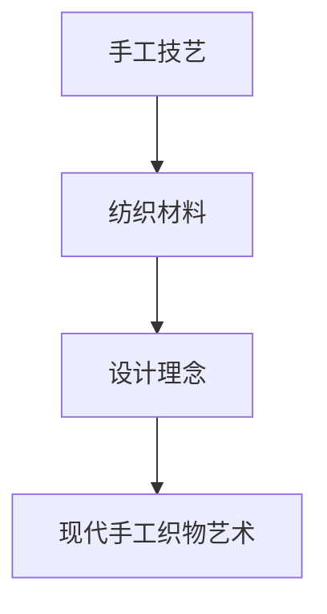

                 

### 第1章 绪论：现代手工织物艺术概述

#### 1.1 现代手工织物艺术的概念与意义

**背景介绍**

现代手工织物艺术可以追溯到人类文明的起源，自古以来，纺织技术一直是人类社会的重要组成部分。随着历史的发展，手工织物艺术不仅成为了一种生存技能，更逐渐演变为一种艺术表现形式。从古代的织布机到现代的电脑编织机，纺织技术经历了无数次的革新与演变。如今，手工织物艺术在时尚界再次掀起热潮，成为设计师们探索创意和展现个性的重要手段。

**核心概念与联系**

现代手工织物艺术的核心概念包括：手工技艺、纺织材料、设计理念等。这些概念之间的关系可以通过以下Mermaid流程图来展示：



**核心概念解释**

- **手工技艺**：指的是通过手工操作来完成织布过程的一系列技巧和知识。包括纱线准备、织物设计、编织工艺等。
- **纺织材料**：指用于编织的各种纱线、纤维和织物，包括天然纤维（如棉、麻、丝、羊毛）和合成纤维（如涤纶、尼龙等）。
- **设计理念**：是设计师通过创意思维和审美观念来指导织物艺术创作的思想体系。

**现代手工织物艺术的意义**

现代手工织物艺术在时尚中的地位与作用不可小觑。它不仅为时尚设计师提供了丰富的创意素材，也赋予了纺织品更多的艺术价值和文化内涵。以下是现代手工织物艺术在时尚中的几个关键作用：

1. **创意表达的载体**：手工织物艺术为设计师提供了独特的创意表达方式，使其能够通过手工技艺来展现个性化的设计理念。
2. **传统与现代的结合**：通过将传统纺织技艺与现代设计理念相结合，手工织物艺术不仅保留了传统文化，还实现了创新与发展。
3. **艺术价值的提升**：手工织物艺术作品具有独特的艺术价值，它们不仅是实用的纺织品，更是具有观赏价值的艺术品。
4. **市场需求的推动**：随着消费者对个性化和艺术化产品的需求增加，手工织物艺术产品在市场上越来越受欢迎。

**核心算法原理讲解**

现代手工织物艺术的设计过程可以看作是一种算法实现，其核心算法原理包括以下几个方面：

1. **设计思路的构建**：设计师通过分析市场趋势、消费者需求和个人创意，构建出完整的设计思路。
2. **工艺选择的优化**：根据设计思路，设计师需要选择最适合的纺织工艺，包括纱线材料、编织方式和后处理工艺等。
3. **颜色与图案的设计**：通过色彩搭配和图案设计，使织物具有视觉吸引力，满足消费者的审美需求。
4. **可持续性的考虑**：在现代手工织物艺术中，设计师还需考虑环保因素，选择可再生材料和环保工艺，以实现可持续发展。

下面是这些核心算法原理的伪代码表示：

```python
def modern_handmade_fabric_art():
    # 分析市场趋势和消费者需求
    market_trend = analyze_market_trend()
    consumer_demand = analyze_consumer_demand()

    # 构建设计思路
    design_thought = create_design_thought(market_trend, consumer_demand)

    # 选择工艺
    selected_process = select_process(design_thought)

    # 设计颜色与图案
    color_pattern = design_color_and_pattern(design_thought)

    # 考虑可持续性
    sustainability = consider_sustainability(selected_process)

    # 实现织物艺术
    fabric_art = implement_fabric_art(selected_process, color_pattern, sustainability)

    return fabric_art
```

**数学模型和公式**

在现代手工织物艺术中，一些数学模型和公式用于指导设计和生产过程。以下是一个简单的数学模型示例，用于计算织物面积：

$$
\text{Area} = \text{Width} \times \text{Length}
$$

其中，Width 和 Length 分别表示织物的宽度和长度。

**举例说明**

假设某织物的设计宽度为100厘米，长度为200厘米，那么该织物的面积为：

$$
\text{Area} = 100 \, \text{cm} \times 200 \, \text{cm} = 20000 \, \text{cm}^2
$$

**最佳实践 tips**

- 在设计过程中，要充分考虑消费者的实际需求和市场趋势。
- 选择合适的纺织材料和工艺，以实现最佳的设计效果。
- 在织物设计中，色彩和图案的搭配至关重要，要注重整体视觉效果。
- 考虑到可持续发展的要求，尽量选择环保材料和工艺。

通过以上对现代手工织物艺术的概念、核心概念与联系、核心算法原理、数学模型和公式的详细讲解，我们为后续章节的深入探讨奠定了坚实的基础。

### 1.2 纺织传统与现代时尚的交融

#### 纺织传统在现代时尚设计中的应用

现代时尚设计在追求创新和个性化的同时，也不忘对传统纺织技艺的传承与发扬。现代时尚设计师们将传统纺织技艺与现代设计理念相结合，创造出一系列具有独特魅力的织物艺术作品。这种交融不仅赋予了现代时尚更多文化底蕴，也使得传统纺织技艺焕发出新的生机。

**案例解析：中国织锦在当代服装设计中的应用**

中国织锦是一种具有悠久历史和丰富文化内涵的传统纺织技艺，以其精湛的工艺和独特的图案深受设计师们的喜爱。现代时尚设计师们巧妙地将中国织锦应用于服装设计中，使其在现代时尚舞台上大放异彩。

1. **图案设计**：设计师们从中国织锦中提取出具有代表性的图案元素，如云纹、龙凤、花卉等，进行重新设计和创新。这些图案不仅保留了传统织锦的精髓，还融入了现代审美元素，使其更符合当代时尚潮流。
2. **面料选择**：设计师们选择高品质的中国织锦作为服装面料，这些面料通常采用优质纱线织造，手感柔软，质感独特，能够很好地展现织锦的图案和色彩。
3. **剪裁与结构设计**：在服装剪裁和结构设计上，设计师们注重突出织锦面料的特色，采用简洁流畅的线条和几何形状，使织锦图案更加鲜明和立体。

**创新设计理念：传统与现代的碰撞**

现代时尚设计师们不仅在图案和面料上融入传统元素，更在整体设计理念上实现了传统与现代的碰撞与融合。

1. **多元化融合**：现代时尚设计追求多元化，设计师们在设计过程中不仅借鉴传统纺织技艺，还融入了其他艺术形式和设计理念，如现代绘画、建筑元素等，创造出独特的设计风格。
2. **可持续性设计**：随着环保意识的提高，现代时尚设计师们也越来越关注纺织材料的可持续性。他们在设计过程中选择环保材料和环保工艺，以实现可持续发展。

**案例解析：印度织物在现代时尚设计中的应用**

印度织物以其丰富的色彩和多样的图案而闻名于世，如纱丽、卡其布、印花布等。现代时尚设计师们也善于将印度织物融入到时尚设计中，创造出一系列充满异域风情的作品。

1. **色彩运用**：印度织物以其鲜艳的色彩著称，设计师们在设计过程中巧妙地运用这些色彩，打造出充满活力和视觉冲击力的作品。
2. **图案创新**：设计师们从印度织物中提取出具有代表性的图案元素，如几何图案、花卉图案等，进行创新设计，使其更具现代感和时尚感。
3. **面料创新**：现代纺织技术的发展，使得印度织物面料得以实现更多样化的创新。例如，通过数码印花技术，设计师们可以在印度织物上实现更复杂、更精细的图案设计。

**纺织传统与现代时尚的交融意义**

纺织传统与现代时尚的交融不仅使现代时尚设计更具文化底蕴和艺术价值，也有助于推动纺织传统技艺的传承与发展。以下是这种交融的几个重要意义：

1. **文化传承**：通过将传统纺织技艺融入现代时尚设计，设计师们有助于传承和弘扬传统纺织文化，使其在现代社会中焕发出新的活力。
2. **艺术创新**：传统纺织技艺与现代设计理念的融合，为时尚设计提供了丰富的创意源泉，使时尚作品更具艺术感和独特性。
3. **市场拓展**：传统纺织技艺与现代时尚设计的结合，为纺织产业带来了新的市场机遇，有助于扩大纺织产品的市场份额。

**项目实战**

以某时尚品牌为例，该项目旨在将中国传统织锦技艺应用于现代服装设计中，打造出一款具有中国特色的时尚作品。

1. **开发环境搭建**：首先，需要搭建一个具备中国传统织锦技艺展示和设计的开发环境。这包括寻找具有传统织锦技艺的手工匠人、收集相关历史资料和图案元素等。
2. **源代码详细实现和代码解读**：在开发过程中，设计师需要使用设计软件（如Adobe Illustrator、Photoshop等）进行图案设计，并将设计成果转化为服装款式图。以下是一个简单的伪代码示例：

```python
def design_taoist_clothing(pattern, color):
    # 设计图案
    design_pattern = create_pattern(pattern)
    
    # 选择颜色
    selected_color = choose_color(color)
    
    # 创建服装款式图
    clothing_design = create_clothing_design(design_pattern, selected_color)
    
    return clothing_design
```

3. **代码应用解读与分析**：在设计过程中，设计师需要根据市场趋势和消费者需求，选择适合的图案和颜色，并通过设计软件将其实现为服装款式图。以下是一个实际案例：

- **图案选择**：设计师选择了中国传统织锦中的云纹图案，并将其进行现代化处理，使其更具时尚感。
- **颜色选择**：设计师选择了红色和金色作为主要颜色，这不仅体现了中国传统的喜庆氛围，还符合现代时尚的审美趋势。
- **款式设计**：设计师根据云纹图案的特点，设计了一件长款连衣裙，裙摆处采用流苏装饰，使整体设计更加优雅和灵动。

4. **实际案例分析和详细讲解剖析**：该款连衣裙在上市后受到了消费者的热烈欢迎，其成功原因在于设计师巧妙地融合了传统织锦技艺和现代时尚设计理念。以下是对该案例的详细分析：

- **文化传承**：通过将传统织锦技艺应用于现代服装设计，设计师成功地传承了中国传统文化，使消费者在穿着时尚服装的同时，也能感受到中国传统文化的魅力。
- **艺术创新**：设计师在图案和颜色选择上进行了创新，使传统织锦图案更具现代感和时尚感，符合当代消费者的审美需求。
- **市场拓展**：该款连衣裙的成功上市，不仅提高了品牌知名度，还推动了传统织锦技艺的市场化发展，为纺织产业带来了新的增长点。

**项目小结**

通过该项目，我们可以看到，纺织传统与现代时尚的交融不仅为时尚设计带来了新的机遇和挑战，也为纺织传统技艺的传承和发展提供了新的途径。未来，随着科技的不断进步和消费者对个性化产品的需求增加，纺织传统与现代时尚的交融将迎来更加广阔的发展空间。

### 2.1 纺织材料的种类与特性

**纱线材料**

纱线是纺织材料的基本组成单元，根据其来源和制造方法可以分为天然纤维纱线和合成纤维纱线。

1. **天然纤维纱线**：这类纱线来源于自然界，主要包括棉、麻、丝、羊毛等。它们具有优良的天然质感、舒适度和环保特性。
   - **棉**：棉纱线是最常见的天然纤维纱线，具有良好的吸湿性和透气性，适合制作各种服装和家用纺织品。
   - **麻**：麻纱线质地坚韧、吸湿散热性能好，常用于制作休闲服装和家居装饰用品。
   - **丝**：丝纱线具有独特的光泽和柔软质感，常用于制作高级服装和奢侈品。
   - **羊毛**：羊毛纱线保暖性能优秀，常用于制作冬季服装和家居用品。

2. **合成纤维纱线**：这类纱线是通过化学合成方法制造的，主要包括涤纶、尼龙、氨纶等。它们具有优异的弹性和耐磨性，适用于多种工业和民用纺织品。
   - **涤纶**：涤纶纱线强度高、弹性好，不易变形，常用于制作服装和家纺产品。
   - **尼龙**：尼龙纱线耐磨、耐腐蚀，常用于制作户外运动装备和工业纺织品。
   - **氨纶**：氨纶纱线具有优异的弹性和拉伸性能，常用于制作弹性服装和内衣。

**织物组织结构**

织物的组织结构决定了其外观和性能，常见的织物组织结构包括平纹、缎纹、斜纹等。

1. **平纹组织**：平纹组织是织物中最基本的组织结构，其特点是经纬纱以一上一下的顺序交错排列，织物表面呈均匀的方格状。
   - **特性**：平纹织物具有良好的耐磨性和弹性，适合制作衬衫、内衣等。
   - **应用**：平纹织物广泛应用于各类服装和家纺产品。

2. **缎纹组织**：缎纹组织是由经纱或纬纱在织物中形成连续的斜向排列，织物表面呈现出光泽细腻、平滑的特点。
   - **特性**：缎纹织物具有优良的光泽感和舒适性，适合制作连衣裙、床单、窗帘等。
   - **应用**：缎纹织物常用于高端时装和家居装饰。

3. **斜纹组织**：斜纹组织是经纱和纬纱以两个或多个交织点形成的斜向纹理，织物表面呈现出明显的斜向线条。
   - **特性**：斜纹织物具有较高的强度和弹性，耐磨性好，适合制作运动服、外套等。
   - **应用**：斜纹织物广泛应用于各类运动服装和户外装备。

**织物的表面处理与风格**

织物的表面处理技术可以显著改变其外观和质感，常见的表面处理技术包括印花、绣花、涂层等。

1. **印花**：印花是在织物表面通过印刷方式添加图案和花纹，常用的印花技术有数码印花、丝网印花等。
   - **特性**：印花织物色彩丰富、图案多样，具有独特的视觉效果。
   - **应用**：印花织物广泛应用于服装、家纺、家居装饰等领域。

2. **绣花**：绣花是在织物表面通过针线绣制图案，常用的绣花技术有手绣、机绣等。
   - **特性**：绣花织物具有立体感和手工艺术感，适合制作高端服装和装饰品。
   - **应用**：绣花织物常用于高级时装、礼品、家居装饰等。

3. **涂层**：涂层是在织物表面涂上一层薄膜，以改变其性质和质感，常用的涂层材料有PVC、PU等。
   - **特性**：涂层织物具有防水、防风、防污等特点，适合制作功能性服装和户外用品。
   - **应用**：涂层织物广泛应用于户外运动装备、工作服、雨具等。

通过以上对纺织材料的种类、织物组织结构和表面处理与风格的详细讲解，我们可以更好地理解现代手工织物艺术的材料基础和创作可能性。在接下来的章节中，我们将进一步探讨现代纺织技术的应用和创新设计理念。

### 2.2 现代纺织技术的应用

**电脑织机与电子编织机**

现代纺织技术的进步离不开电脑织机和电子编织机的广泛应用。这些先进的设备不仅提高了纺织生产的效率，还赋予了手工织物艺术更多的创新可能性。

1. **电脑织机的特点**
   - **高效自动化**：电脑织机通过计算机编程控制，实现了自动化织造过程，大大提高了生产效率。
   - **精准控制**：电脑织机能够精确控制纱线的张力和织造速度，确保织物质量的一致性和稳定性。
   - **多样化设计**：电脑织机可以处理复杂的设计图案，通过编程实现各种独特的织物效果。

2. **电子编织机的特点**
   - **便携性**：电子编织机体积小巧，便于携带，适合在家或工作室中进行手工编织。
   - **灵活性**：电子编织机支持多种编织模式，可以自由选择纱线颜色和图案，满足个性化设计需求。
   - **多功能性**：除了传统的编织功能外，电子编织机还可以进行针织、钩织等多种工艺，拓展了手工织物艺术的表达方式。

**新型纤维材料的研究与开发**

新型纤维材料的研究与开发是现代纺织技术的重要组成部分，这些材料不仅具有独特的性能，还为手工织物艺术提供了更多创意空间。

1. **再生纤维**
   - **特点**：再生纤维是从可再生资源中提取的纤维，如竹纤维、废旧聚酯纤维等。它们具有环保、可持续的特性。
   - **应用**：再生纤维广泛应用于环保服装、家居纺织品等领域，有助于减少环境污染和资源浪费。

2. **智能纤维**
   - **特点**：智能纤维具有特殊的物理或化学性能，能够对外界刺激做出响应，如温度、压力、光等。
   - **应用**：智能纤维可以应用于功能服装、智能纺织品等领域，为织物带来新的功能和体验。

3. **高性能纤维**
   - **特点**：高性能纤维具有优异的力学性能和特殊功能，如高强度、高弹性、防火、防水等。
   - **应用**：高性能纤维广泛应用于航空航天、军事、运动装备等领域，提升了纺织品的性能和功能。

**3D打印技术在纺织中的应用**

3D打印技术为现代纺织技术带来了革命性的变革，它不仅改变了传统纺织生产方式，也为手工织物艺术提供了全新的创作手段。

1. **3D打印工艺**
   - **特点**：3D打印是一种通过逐层堆叠材料来构建三维物体的技术，能够实现复杂形状和精细细节的打印。
   - **应用**：3D打印可以应用于纺织品的个性化定制、复杂结构的设计和制造等领域。

2. **数字纺织品设计**
   - **特点**：数字纺织品设计利用计算机软件进行图案设计和色彩搭配，通过3D打印技术实现织物表面的个性化图案。
   - **应用**：数字纺织品设计广泛应用于时尚、家居装饰、艺术品创作等领域，为消费者提供更多个性化选择。

3. **可定制性**
   - **特点**：3D打印技术可以实现织物设计的高度定制化，满足消费者对独特性和个性化的需求。
   - **应用**：在定制服装、家居饰品、艺术品等领域，3D打印技术为用户提供了更多的自由度和创意空间。

通过以上对现代纺织技术的详细探讨，我们可以看到，电脑织机与电子编织机、新型纤维材料的研究与开发以及3D打印技术在纺织中的应用，不仅极大地提升了手工织物艺术的生产效率和设计水平，也为传统纺织技艺注入了新的活力和创新动力。在接下来的章节中，我们将进一步探讨手工织物艺术的创新设计理念和具体实现方法。

### 3.1 传统纺织工艺的现代解读

**经纬编织法**

经纬编织法是传统纺织工艺中最基本的方法，它通过经纱和纬纱的交织形成织物结构。现代手工织物艺术在解读这一传统工艺时，进行了许多创新和优化。

1. **优化编织工艺**：现代技术使得编织工艺更加精确和高效。例如，电脑控制织机可以精确控制经纬纱的张力、编织速度和路径，确保织物的质量和一致性。
2. **多样化编织技术**：现代工艺引入了多种编织技术，如无缝编织、三维编织等，使织物结构更加复杂和多样化。这些技术不仅增强了织物的功能性和装饰性，也为设计师提供了更多创意空间。
3. **智能化辅助工具**：现代科技使得智能辅助工具广泛应用于经纬编织法中。例如，智能织机可以通过传感器实时监测编织过程中的参数，自动调整编织参数，确保织物的质量和稳定性。

**织物的图案设计**

织物的图案设计是手工织物艺术的重要组成部分，现代设计师们在解读传统图案设计理念时，注入了更多的创意元素和现代感。

1. **图案元素的现代化改造**：现代设计师们从传统图案中提取经典元素，如云纹、龙凤、花卉等，并对其进行现代化改造，使其更符合现代审美需求。例如，通过几何形状的切割和重组，使传统图案焕发新的生命力。
2. **色彩与纹理的创新**：现代科技使得织物的色彩和纹理设计更加丰富和多样化。例如，通过数码印花技术，设计师可以在织物上实现复杂、细腻的图案和色彩效果。此外，通过不同的编织技术和材料选择，可以创造出丰富的纹理和质感。
3. **多层次设计**：现代织物设计不仅注重单层织物的图案和色彩，还追求多层次的设计效果。例如，通过叠加不同层次的织物，创造出具有层次感和立体感的视觉效果。

**纺织品的色彩搭配**

纺织品的色彩搭配对织物艺术的视觉效果和装饰效果至关重要。现代设计师们在解读传统色彩搭配原则时，结合现代审美和市场需求，进行了创新和优化。

1. **色彩理论的应用**：现代设计师们运用色彩理论，如色彩轮、色相对比、色彩调和等原则，进行织物的色彩搭配。通过科学合理的色彩组合，可以创造出和谐、美观的视觉效果。
2. **时尚趋势的融入**：现代设计师们密切关注时尚趋势，将流行的色彩和设计元素融入织物艺术中。例如，通过运用季节性色彩和流行图案，使织物艺术作品更具时代感。
3. **个性化定制**：现代科技使得纺织品色彩搭配可以实现个性化定制。例如，通过数码印花和染色技术，设计师可以根据客户的需求和喜好，定制独特的色彩搭配方案。

**案例分析**

以某时尚品牌为例，该品牌将传统纺织工艺与现代设计理念相结合，创作了一系列具有现代感的织物艺术作品。

1. **图案设计**：设计师从中国传统云纹图案中提取经典元素，并进行现代化改造。通过几何形状的切割和重组，使云纹图案呈现出更具现代感的视觉效果。
2. **色彩搭配**：设计师运用色彩理论，选择了蓝色和白色作为主要色彩，通过色彩对比和调和，创造出和谐、美观的色彩搭配。同时，通过数码印花技术，在织物上实现复杂、细腻的图案效果。
3. **工艺创新**：设计师运用无缝编织技术和三维编织技术，使织物结构更加复杂和多样化，增强了织物的功能性和装饰性。

通过以上对传统纺织工艺的现代解读，我们可以看到，现代手工织物艺术在传统工艺的基础上，通过技术创新和设计理念的融合，实现了传统与现代的完美结合。这不仅丰富了手工织物艺术的表现形式，也为时尚设计注入了新的活力和创意。

### 3.2 创新设计理念

在现代手工织物艺术中，创新设计理念至关重要。设计师们不仅要具备深厚的传统纺织技艺基础，还需要勇于探索新的设计方法和理念，以推动这一艺术形式的发展。

**现代手工织物艺术的设计原则**

1. **功能与美学的融合**：现代设计强调功能与美学的和谐统一。在设计过程中，设计师需要充分考虑织物的实用性，如舒适性、耐用性和功能性，同时注重织物的美观性和艺术性。
2. **传统与现代的结合**：创新设计理念要求设计师在作品中融合传统元素和现代风格。通过传统技艺的现代化改造和现代设计元素的融入，创造出独特的视觉效果和艺术价值。
3. **环保与可持续性**：随着环保意识的增强，现代手工织物艺术越来越注重环保和可持续性。设计师们在选择纺织材料和工艺时，要考虑到对环境的影响，尽量使用可再生材料和环保工艺。

**创意灵感来源**

1. **自然界的启示**：自然界中的自然景观、动植物图案和色彩搭配为设计师提供了丰富的灵感。例如，花卉、树叶、动物纹样等都可以成为织物设计中的经典元素。
2. **历史与文化的挖掘**：传统历史和文化遗产是现代设计的重要灵感来源。设计师可以通过研究传统纺织技艺和图案，提取出具有文化内涵的设计元素，并进行创新改造。
3. **科技与艺术相结合**：现代科技的发展为手工织物艺术提供了新的创作手段和表现方式。例如，数码印花、3D打印等技术可以创造出传统工艺无法实现的复杂图案和纹理。

**设计实践案例分析**

以下是一个具体的设计实践案例，该案例展示了如何将创新设计理念应用于现代手工织物艺术中。

**项目背景**：某时尚品牌计划推出一款以“自然之韵”为主题的春季系列织物艺术作品。

**设计思路**：

1. **主题提炼**：设计师从自然界的花卉图案中提取灵感，以春花为主题，将花卉的线条和色彩融入织物设计中。
2. **色彩搭配**：设计师选择了清新自然的色彩，如粉色、蓝色和白色，通过色彩调和和对比，营造出春天的气息。
3. **工艺创新**：设计师运用数码印花技术，在织物上实现花卉图案的细腻效果。同时，通过三维编织技术，使织物具有一定的立体感和动态感。

**具体步骤**：

1. **图案设计**：设计师首先绘制了一系列花卉图案，并通过计算机软件将其数字化处理，生成可供打印的图案文件。
2. **色彩选择**：设计师根据主题和季节特点，选择了粉色、蓝色和白色作为主要色彩，通过色彩调和和对比，确保色彩搭配的和谐与美观。
3. **数码印花**：设计师使用数码印花机将花卉图案打印在织物上，确保图案的细腻和色彩的准确性。
4. **三维编织**：设计师使用三维编织机，将印花织物进行立体编织，使织物具有一定的立体感和动态感。

**项目成果**：最终，设计师成功创作出一款以“自然之韵”为主题的织物艺术作品。这款作品不仅具有独特的视觉效果，还融入了传统花卉图案和现代科技元素，展现了现代手工织物艺术的设计魅力。

通过以上案例，我们可以看到，创新设计理念在手工织物艺术中的应用，不仅提升了作品的视觉效果和艺术价值，也为传统纺织技艺注入了新的活力。在未来的发展中，设计师们将继续探索新的设计方法和理念，推动手工织物艺术不断前进。

### 4.1 纺织品在服装设计中的应用

纺织品在服装设计中扮演着至关重要的角色，其面料的选择、剪裁与结构设计、色彩与图案设计不仅直接影响服装的外观和质感，还关系到服装的舒适度与实用性。在时尚界，纺织品不仅是服装制作的材料，更是设计师表达个性和创意的重要媒介。

**面料的选择与搭配**

面料的选择是服装设计的基础，不同类型的面料具有不同的纹理、触感和功能特性，适用于不同的服装款式和场合。

1. **天然纤维面料**：如棉、麻、丝、羊毛等，具有优良的透气性和吸湿性，适合制作休闲装和运动装。
2. **合成纤维面料**：如涤纶、尼龙、氨纶等，具有优异的弹性和耐磨性，适合制作运动服、牛仔装等。
3. **混纺面料**：将天然纤维和合成纤维混合，以取长补短，例如棉涤混纺面料，既具有棉的柔软舒适，又有涤纶的耐磨易洗。

设计师在选择面料时，需要考虑服装的用途、场合和目标消费群体的需求。例如，针对户外运动装，设计师会选择透气性好、耐磨性强的面料；而针对正式场合，则会选择质感细腻、视觉效果好的面料。

**剪裁与结构设计**

剪裁与结构设计是服装设计的核心，它决定了服装的版型和线条，直接影响服装的外观和穿着效果。

1. **基本剪裁**：包括基础轮廓线和裁片设计，如T恤、衬衫等的基本款式都是通过基础剪裁实现的。
2. **创意剪裁**：设计师在基本剪裁的基础上进行创意设计，如切割、拼接、剪裁等，创造出独特的服装版型。例如，设计师可以将不同材质的面料进行拼接，形成多层次的效果。
3. **立体剪裁**：通过三维建模和剪裁，设计师可以在服装上创造出独特的立体效果。例如，立体裁剪可以将复杂的图案和结构直接呈现在服装上，增加设计感。

**色彩与图案设计**

纺织品在服装设计中的色彩和图案设计，对视觉效果和服装风格起着至关重要的作用。

1. **色彩选择**：色彩选择需要考虑服装的整体风格、场合和目标消费群体的喜好。例如，深色系的面料适合正式场合，而鲜艳明快的色彩适合休闲场合。
2. **图案设计**：图案设计可以通过印花、绣花、编织等方式实现。设计师可以根据服装的用途和风格，选择不同的图案元素和设计方法。例如，花卉图案适合春夏装，几何图案适合运动装。
3. **色彩与图案的搭配**：设计师在色彩和图案的搭配上需要遵循一定的原则，如色彩对比、色彩调和等，以创造和谐美观的视觉效果。同时，设计师还可以通过层次叠加、渐变等手法，增强服装的层次感和视觉冲击力。

**案例分析**

以下是一个具体的服装设计案例，展示了纺织品在服装设计中的应用。

**项目背景**：某时尚品牌计划推出一款以“自然元素”为主题的春季系列服装。

**设计思路**：

1. **面料选择**：设计师选择了轻薄的棉麻面料，具有良好的透气性和舒适性，适合春夏穿着。
2. **剪裁设计**：设计师采用了简约的剪裁，突出面料本身的质感和图案，使服装更加透气和舒适。
3. **图案设计**：设计师选择了自然界中的花朵和植物图案，通过数码印花技术将这些图案生动地印在面料上，营造出春天的气息。

**具体步骤**：

1. **图案设计**：设计师首先收集了各种花卉和植物图案，通过计算机软件进行设计，生成适合数码印花的花卉图案。
2. **面料印花**：设计师使用数码印花机将图案打印在棉麻面料上，确保图案的清晰和色彩的真实还原。
3. **剪裁与缝制**：设计师根据图案和面料的特点，设计了简约的剪裁方式，将印花面料裁剪成服装所需的各个部分，并进行缝制。

**项目成果**：最终，设计师成功创作出一系列以“自然元素”为主题的春季服装系列。这些服装不仅具有良好的舒适性和透气性，还通过印花图案和简约剪裁，展现了自然与时尚的完美结合。

通过以上案例分析，我们可以看到，纺织品在服装设计中的应用，通过面料选择、剪裁与结构设计、色彩与图案设计的创新，使服装更具个性和艺术价值。在未来的发展中，设计师们将继续探索新的设计方法和理念，推动服装设计不断进步。

### 4.2 纺织品在家居装饰中的应用

纺织品在家居装饰中扮演着至关重要的角色，它们不仅为室内空间增添了色彩和质感，还起到了调节氛围和提升居住舒适度的作用。在现代家居装饰中，纺织品的应用越来越多样化，设计师们通过巧妙的面料选择和图案设计，创造出了无数富有创意和个性化的家居空间。

**家居纺织品的设计原则**

1. **功能性**：家居纺织品首先需要满足其基本的功能需求，如遮阳、保暖、吸湿等。设计师在选择面料和设计图案时，需要考虑到这些功能性因素。
2. **舒适性**：家居纺织品直接接触人体，其材质和触感对居住者的舒适度有很大影响。设计师应选择质地柔软、透气性好、触感舒适的面料。
3. **协调性**：家居纺织品的设计需要与室内整体风格相协调，包括色彩、图案、材质等方面。设计师应充分考虑室内空间的风格和氛围，确保纺织品与整体环境融为一体。

**纺织品的材料选择**

1. **棉麻面料**：棉麻面料具有良好的透气性和吸湿性，适合制作窗帘、床上用品、沙发套等家居装饰品。棉麻面料风格简约自然，适合各种家居风格。
2. **丝绸面料**：丝绸面料具有光滑、柔软的质感，色彩丰富，适合制作窗帘、桌布、靠垫等。丝绸面料的高贵气质能为家居空间增添优雅氛围。
3. **合成纤维面料**：如涤纶、尼龙等合成纤维面料具有耐磨、易洗、耐用的特点，适合制作地毯、窗帘、床上用品等。合成纤维面料色彩鲜艳、图案多样，适用于现代简约风格家居。
4. **混纺面料**：混纺面料将天然纤维和合成纤维结合，既保留了天然纤维的舒适性和环保性，又具有合成纤维的耐用性和功能性，适合制作各种家居纺织品。

**纺织品的设计案例分析**

以下是一个具体的家居纺织品设计案例，展示了如何通过面料选择和图案设计，打造出一个富有创意和个性化的家居空间。

**项目背景**：某家居品牌计划推出一款以“温馨自然”为主题的家居纺织品系列。

**设计思路**：

1. **面料选择**：设计师选择了柔软透气的棉麻面料，作为窗帘和床上用品的主要材质，以营造温馨舒适的家居氛围。
2. **图案设计**：设计师选择了自然界中的花卉和植物图案，通过数码印花技术将这些图案印在面料上，营造出自然的氛围。
3. **色彩搭配**：设计师选择了柔和的粉色和绿色作为主要色彩，通过色彩调和，营造出温馨和谐的空间氛围。

**具体步骤**：

1. **图案设计**：设计师首先绘制了一系列花卉和植物图案，通过计算机软件进行设计，生成适合数码印花的花卉图案。
2. **面料印花**：设计师使用数码印花机将花卉图案打印在棉麻面料上，确保图案的清晰和色彩的还原。
3. **窗帘设计**：设计师根据室内空间的大小和窗户的形状，设计了不同尺寸和样式的窗帘，通过印花面料的搭配，营造出独特的视觉效果。
4. **床上用品设计**：设计师设计了印花被套、枕套等床上用品，通过印花面料的运用，使整个卧室空间更加温馨和谐。

**项目成果**：最终，设计师成功创作出一款以“温馨自然”为主题的家居纺织品系列。这些纺织品不仅具有优秀的功能性和舒适性，还通过自然的图案和柔和的色彩，为家居空间增添了一抹温馨与活力。

通过以上案例分析，我们可以看到，纺织品在家居装饰中的应用，通过合理的选择面料和图案设计，不仅提升了家居空间的视觉和触觉体验，还体现了设计师的创意和品味。在未来的发展中，家居纺织品的设计将继续融合传统与现代元素，为家居装饰带来更多创新和灵感。

### 5.1 环保纺织材料的发展

随着全球环保意识的提高，环保纺织材料的发展日益受到关注。环保纺织材料不仅有助于减少对环境的负面影响，还满足了消费者对绿色、可持续产品的需求。以下将详细探讨环保纺织材料的种类、特性以及其发展现状。

**环保纺织材料的种类**

1. **再生纤维**：再生纤维是从废旧纺织品或废料中回收再加工而成的纤维，如再生棉、再生涤纶等。这类纤维不仅可以减少对自然资源的消耗，还能减少废弃物对环境的污染。
2. **天然纤维**：天然纤维如棉、麻、丝绸等，来源于自然界的植物和动物，具有可再生、环保的特性。与合成纤维相比，天然纤维在生产过程中产生的碳排放量较低，对环境的影响较小。
3. **生物降解纤维**：生物降解纤维可以在自然界中被微生物分解，如聚乳酸（PLA）、聚羟基烷酸（PHA）等。这类纤维在使用寿命结束后可以自然降解，不会对环境造成长期污染。

**环保纺织材料的特性**

1. **可再生性**：环保纺织材料具有可再生性，可以重复利用，减少对自然资源的依赖。例如，再生纤维利用废旧纺织品回收，天然纤维来源于可再生植物。
2. **环保性**：环保纺织材料在生产和使用过程中产生的碳排放量较低，对环境的影响较小。例如，生物降解纤维在使用寿命结束后可以自然降解，不会对环境造成长期污染。
3. **功能性**：环保纺织材料不仅具有环保特性，还具备一定的功能特性。例如，再生纤维可以具有优异的吸湿排汗性能，生物降解纤维可以具有抗菌、抗紫外线等功能。

**环保纺织材料的发展现状**

1. **技术进步**：随着科技的进步，环保纺织材料的生产技术不断成熟，成本逐渐降低，使其在市场上更具竞争力。例如，再生纤维的生产技术已经相对成熟，生物降解纤维的研究和应用也取得了显著进展。
2. **市场需求**：消费者对环保产品的需求不断增加，推动了环保纺织材料的市场发展。越来越多的品牌开始将环保材料应用于产品中，以满足消费者的绿色需求。
3. **政策支持**：各国政府纷纷出台政策，鼓励和支持环保纺织材料的生产和应用。例如，欧盟推出了一系列环保法规，限制使用有害化学物质，鼓励使用环保材料。

**环保纺织材料的应用**

1. **服装行业**：环保纺织材料在服装行业中的应用越来越广泛。许多品牌推出了以环保材料为原料的服装产品，如再生纤维T恤、棉麻服装等。这些产品不仅满足了消费者的环保需求，还提高了品牌的社会责任感。
2. **家居行业**：环保纺织材料在家居行业中的应用也越来越普遍。如使用再生纤维制作的床上用品、窗帘等，以及使用生物降解纤维制作的地毯、餐具等。这些产品不仅具有环保特性，还提升了家居生活的品质。
3. **医疗行业**：环保纺织材料在医疗行业的应用也在不断拓展。如使用再生纤维制作的医用手术服、床单等，以及使用生物降解纤维制作的医疗废弃物袋等。这些产品不仅环保，还能提高医疗行业的卫生水平。

**未来发展趋势**

1. **技术创新**：随着科技的不断发展，环保纺织材料的性能和种类将不断优化，以满足更广泛的市场需求。
2. **多元化应用**：环保纺织材料将在更多领域得到应用，如户外运动装备、交通工具内饰等。
3. **产业链协同**：环保纺织材料的生产和应用将实现产业链的协同发展，从原料采集、生产加工到最终产品，各个环节都将朝着环保、可持续的方向发展。

通过以上对环保纺织材料的发展、种类、特性以及应用的详细探讨，我们可以看到，环保纺织材料在现代社会中具有重要的地位和广阔的发展前景。随着环保意识的提高和技术的发展，环保纺织材料将继续为时尚、家居、医疗等行业带来创新和变革。

### 5.2 纺织艺术与可持续发展的结合

**纺织艺术的环保理念**

在现代手工织物艺术中，环保理念已经成为设计师们的重要关注点。通过选择环保材料和采用环保工艺，设计师们不仅能够创作出富有艺术感和文化内涵的作品，还能为环境保护贡献一份力量。

1. **环保材料的选择**：设计师们越来越多地使用可再生和可降解的环保材料，如天然纤维（如棉、麻、丝、羊毛）和生物降解纤维（如聚乳酸、聚羟基烷酸等）。这些材料不仅源自自然，而且在使用寿命结束后能够自然降解，减少对环境的污染。
2. **环保工艺的应用**：在纺织工艺方面，设计师们也积极探索环保工艺，如无污染染色、无溶剂印花等。这些工艺通过减少化学物质的使用和排放，降低了对环境的负面影响。

**可持续发展的设计策略**

1. **生命周期设计**：可持续发展的设计策略要求设计师从产品的整个生命周期考虑，从原材料的选择、生产过程、产品使用到废弃物处理，都要尽量减少对环境的负面影响。例如，设计师可以在产品设计中考虑可回收性、可拆卸性和可修复性，使产品在使用寿命结束后能够被有效地回收和再利用。
2. **生态设计**：生态设计是可持续发展设计的重要组成部分。设计师在创作过程中，要考虑到作品对生态环境的影响，尽量减少资源消耗和环境污染。例如，设计师可以在设计中融入生态学原理，采用自然材料、自然纹理和自然色彩，创造出与自然环境和谐共生的作品。
3. **创新与实验**：为了实现可持续发展，设计师需要不断探索新的设计方法和材料。例如，通过实验和创新，设计师可以开发出新的环保纺织技术，如生物纺织品、智能纺织品等，这些新技术不仅有助于减少环境负担，还能为纺织艺术带来新的可能性。

**案例分析**

以下是一个具体的纺织艺术与可持续发展结合的案例，展示了如何在手工织物艺术中实现环保和可持续发展的目标。

**项目背景**：某艺术工作室计划创作一款以“自然之韵”为主题的环保织物艺术作品，以展示可持续发展的设计理念。

**设计思路**：

1. **环保材料选择**：设计师选择了天然纤维，如有机棉和麻，作为织物的主要材料。这些材料不仅源自可再生资源，而且在使用寿命结束后可以自然降解，减少对环境的污染。
2. **环保工艺应用**：设计师采用无污染染色和无溶剂印花工艺，以减少化学物质的使用和排放。例如，使用植物染料进行染色，使用水性染料和环保印花剂进行印花。
3. **生态设计理念**：设计师在作品中融入了生态学原理，采用了自然纹理和自然色彩，使作品与自然环境和谐共生。

**具体步骤**：

1. **材料准备**：设计师首先采购了有机棉和麻作为主要材料，确保这些材料符合环保要求。
2. **设计图案**：设计师根据“自然之韵”的主题，绘制了一系列自然景观和植物图案，通过计算机软件进行设计，生成可供打印的图案文件。
3. **环保染色与印花**：设计师使用植物染料进行染色，确保染料对环境无害。同时，使用水性染料和环保印花剂，进行无溶剂印花。
4. **作品完成**：设计师将印花织物进行立体裁剪和缝制，创作出一款充满自然气息的环保织物艺术作品。

**项目成果**：最终，设计师成功创作出一款以“自然之韵”为主题的环保织物艺术作品。这款作品不仅具有艺术价值，还体现了环保和可持续发展的设计理念。通过这一案例，我们可以看到，在手工织物艺术中，通过合理选择环保材料和采用环保工艺，不仅能够创作出富有创意的作品，还能为环境保护做出贡献。

通过以上对纺织艺术环保理念、可持续发展设计策略以及案例分析的详细探讨，我们可以看到，纺织艺术与可持续发展的结合不仅有助于减少环境负担，还能为时尚、家居、医疗等行业带来创新和变革。在未来的发展中，设计师们将继续探索环保和可持续的设计方法，为人类和地球创造更美好的未来。

### 6.1 市场趋势分析

在现代手工织物艺术市场中，消费者需求的变化和行业发展趋势不断塑造着市场格局。以下将详细分析这两方面，以便为设计师和品牌提供有价值的参考。

**消费者需求的变化**

1. **个性化需求**：随着社会经济的发展，消费者对产品个性化需求的逐渐增强。现代手工织物艺术作品因其独特的设计和手工制作的特点，满足了消费者追求个性和独特性的需求。消费者更加倾向于选择具有独特设计理念和定制化的织物产品。
2. **环保意识**：环保意识逐渐成为消费者选择产品的关键因素之一。消费者越来越关注产品的环保属性，如使用环保材料和采用环保工艺的织物产品。这不仅反映了消费者对环境保护的重视，也为手工织物艺术提供了新的市场机遇。
3. **文化传承**：消费者对传统文化的关注日益增加，希望通过织物产品体验和传承传统文化。现代手工织物艺术作品通过融合传统纺织技艺和文化元素，满足了消费者对文化传承的需求。

**行业发展趋势**

1. **技术进步**：现代科技的发展为手工织物艺术带来了新的创作手段和表现方式。例如，数码印花、3D打印等技术在织物设计中的应用，使设计师能够实现更复杂和精细的图案设计。这些技术的进步不仅提升了手工织物艺术的生产效率和设计水平，也为市场提供了更多创新产品。
2. **跨界合作**：手工织物艺术与其他行业的跨界合作逐渐增多。例如，时尚品牌与艺术家、设计师的合作，通过将手工织物艺术元素融入服装、家居装饰等产品中，创造出独特且具有吸引力的产品。这种跨界合作不仅丰富了产品种类，还拓展了手工织物艺术的市场空间。
3. **电子商务**：随着电子商务的快速发展，手工织物艺术市场逐渐向线上转移。通过电商平台，设计师和品牌能够更便捷地接触到全球消费者，扩大市场份额。同时，电子商务也为消费者提供了更多购买选择和便利。

**案例分析**

以下是一个市场趋势分析的具体案例，展示了消费者需求变化和行业发展趋势如何影响手工织物艺术市场。

**案例背景**：某时尚品牌计划推出一款以“传统与现代融合”为主题的手工织物艺术系列，以应对市场需求变化和行业发展趋势。

**设计思路**：

1. **个性化设计**：设计师从传统文化中提取经典图案和元素，进行现代化改造，使其符合现代审美需求。同时，设计师提供个性化定制服务，消费者可以根据个人喜好选择图案和颜色。
2. **环保材料**：设计师选择环保材料，如有机棉和麻，确保产品符合环保标准。同时，采用无污染染色和印花工艺，减少对环境的负面影响。
3. **技术融合**：设计师运用数码印花和3D打印技术，创造出复杂和精细的图案效果，提升产品的设计感和独特性。

**具体实施步骤**：

1. **市场调研**：品牌通过市场调研了解消费者需求，包括个性化定制需求、环保意识和对传统文化的关注。
2. **设计开发**：设计师根据市场调研结果，设计出符合消费者需求的产品，包括个性化图案和环保材料的应用。
3. **生产与定制**：品牌与供应商合作，采用环保材料和工艺进行生产，同时提供个性化定制服务，满足消费者需求。
4. **市场推广**：品牌通过电商平台和线下活动进行市场推广，提高品牌知名度和市场份额。

**市场反应**：该品牌推出的手工织物艺术系列产品在市场上获得了良好的反响。消费者对个性化设计和环保理念表示认可，产品销量稳步增长。同时，品牌通过跨界合作，与艺术家和设计师合作推出限量版产品，进一步提升了品牌的市场影响力。

通过以上案例分析，我们可以看到，消费者需求的变化和行业发展趋势对现代手工织物艺术市场产生了深远影响。设计师和品牌需要密切关注市场动态，灵活调整产品设计策略，以满足消费者需求并抓住市场机遇。

### 6.2 纺织设计在品牌营销中的应用

在品牌营销中，纺织设计不仅是产品外观的表达，更是品牌形象和价值的传递。通过巧妙的设计，纺织产品可以成为品牌故事的重要载体，增强消费者对品牌的认知和忠诚度。

**品牌形象的塑造**

1. **视觉识别**：纺织设计在品牌形象塑造中起到至关重要的作用。通过独特的图案、色彩和材质，品牌能够在视觉上形成鲜明的识别特征。例如，某高端时尚品牌采用简约的线条和优雅的色调，塑造出高贵、精致的品牌形象。
2. **文化内涵**：纺织设计可以融入品牌的历史和文化，通过传统元素和现代设计的结合，讲述品牌故事。例如，某品牌将传统刺绣技艺与现代时尚设计相结合，展示了品牌对传统文化的尊重和创新精神。

**跨界合作的案例**

1. **艺术与时尚的碰撞**：许多品牌通过跨界合作，邀请艺术家和设计师参与纺织设计，创造出独特且具有吸引力的产品。例如，某国际知名品牌与知名艺术家合作，推出限量版印花系列，不仅提升了产品的艺术价值，还增强了品牌的时尚感。
2. **文化交融**：品牌还可以与不同文化背景的设计师合作，将不同文化的元素融入纺织设计中，展现品牌的多元性和包容性。例如，某品牌与来自不同国家的设计师合作，推出具有地域特色的纺织品，向全球消费者展示品牌的全球化视野。

**实际案例解析**

以下是一个具体案例，展示了纺织设计在品牌营销中的成功应用。

**案例背景**：某国内时尚品牌计划推出一款以“东方美学”为主题的新品系列，旨在通过纺织设计提升品牌形象和市场份额。

**设计思路**：

1. **视觉识别**：设计师选择了具有东方美学的图案和色彩，如水墨画、传统剪纸等，运用现代设计手法进行创意改造，使图案更具现代感和视觉冲击力。
2. **文化内涵**：设计师从中国传统服饰文化中提取元素，如云纹、龙凤等，将这些传统元素与现代时尚设计相结合，讲述品牌对东方文化的传承和创新。
3. **跨界合作**：品牌与知名艺术家合作，邀请其参与印花设计，将艺术作品融入纺织品中，提升产品的艺术价值和独特性。

**具体实施步骤**：

1. **市场调研**：品牌通过市场调研，了解消费者对东方美学产品的需求和偏好，为产品设计提供参考。
2. **设计开发**：设计师根据市场调研结果，设计出符合东方美学主题的纺织品，包括印花图案、色彩搭配和材质选择。
3. **跨界合作**：品牌与艺术家进行紧密合作，确保设计理念的一致性和创新性，并邀请艺术家参与产品发布活动，提升品牌影响力。
4. **市场推广**：品牌通过线上线下渠道进行市场推广，利用社交媒体、电商平台和实体店面等多种方式，扩大产品知名度和市场份额。

**市场反应**：该品牌推出的“东方美学”新品系列在市场上取得了显著成功。消费者对独特的设计和深厚的文化内涵表示高度认可，产品销量迅速提升。同时，品牌通过跨界合作，不仅提升了品牌形象，还吸引了更多年轻消费者的关注。

通过以上案例，我们可以看到，纺织设计在品牌营销中的应用，不仅有助于提升品牌形象和市场份额，还能增强消费者对品牌的认知和忠诚度。在未来的发展中，品牌将继续通过创新的设计策略和跨界合作，探索更多营销可能性。

### 7.1 纺织艺术的未来展望

随着科技的不断进步和消费需求的演变，纺织艺术正迎来前所未有的发展机遇。未来的纺织艺术将在数字技术与手工技艺的结合、新型纺织材料的研究与应用以及社会与文化价值的提升等方面展现更多的可能性。

**技术与设计的未来发展**

1. **数字技术与手工技艺的结合**：未来纺织艺术的发展将更加注重数字技术与手工技艺的融合。随着计算机辅助设计（CAD）和计算机辅助制造（CAM）技术的普及，设计师能够更高效地完成复杂的设计任务。同时，数字技术的应用使得手工技艺得以传承和创新，如通过3D打印技术实现复杂图案的编织和印花。这种技术与手工的融合不仅提高了生产效率，也丰富了纺织艺术的创作手段。

2. **个性化定制**：未来，个性化定制将成为纺织艺术的重要发展方向。通过大数据和人工智能技术，设计师能够更精准地了解消费者的需求和偏好，为其提供量身定制的纺织品。个性化定制不仅满足了消费者的个性化需求，也增强了消费者与品牌之间的互动和黏性。

**新型纺织材料的前景**

1. **智能纺织材料**：智能纺织材料是未来纺织领域的重要研究方向。这些材料能够根据外界刺激（如温度、湿度、光照等）改变其性能，具有自修复、抗菌、保暖等功能。例如，自修复纤维可以在磨损后自动修复，延长纺织品的使用寿命；抗菌纤维可以抑制细菌生长，提高纺织品卫生性能。智能纺织材料的应用将极大地提升纺织品的功能性和舒适性。

2. **可再生与可降解材料**：随着环保意识的增强，可再生与可降解材料将成为未来纺织材料的主流。例如，聚乳酸（PLA）和聚羟基烷酸（PHA）等生物降解材料在纺织品中的应用将越来越广泛，有助于减少环境污染。同时，再生纤维的使用，如回收涤纶和棉，也将成为未来纺织材料的重要来源。

**纺织艺术的社会与文化价值**

1. **文化传承**：纺织艺术是民族文化的重要组成部分，通过现代技术的应用，传统纺织技艺得以更好地传承和发扬。未来，纺织艺术将成为传播民族文化的重要载体，通过展览、工作坊和文化交流等形式，增强民族文化的认同感和凝聚力。

2. **社会影响**：纺织艺术不仅具有艺术价值，还对社会产生了深远的影响。例如，通过手工艺品的市场化和产业化，许多传统手工艺得到了保护和传承，为当地经济和文化发展做出了贡献。同时，纺织艺术的普及和教育，有助于提高公众的艺术素养和审美水平。

**未来展望**

未来，纺织艺术将在技术、设计和社会文化等多个维度上持续发展。随着数字技术与手工技艺的结合、新型纺织材料的应用以及文化价值的提升，纺织艺术将迎来更加广阔的发展空间。设计师们需要不断探索新的创作手法和材料，将传统与现代相结合，创造出更多具有文化内涵和艺术价值的纺织品。同时，社会和政府应加强对纺织艺术的关注和支持，推动这一传统艺术形式在现代社会中的繁荣与发展。

通过以上对纺织艺术未来发展的展望，我们可以看到，纺织艺术不仅将继续在时尚、家居、医疗等领域发挥重要作用，还将成为推动社会文化发展的重要力量。未来，纺织艺术将不断创新，为人类文明贡献更多的艺术瑰宝。

### 7.2 纺织艺术的未来展望：社会与文化价值

纺织艺术作为一种独特的艺术形式，不仅具有视觉和触觉上的美感，还承载着深厚的社会与文化价值。在全球化背景下，纺织艺术的传播和文化交流日益频繁，为世界各地的人们带来了丰富的文化体验和认知。同时，纺织艺术对社会文化的影响也是多方面的，从教育、经济到社会认同，都发挥着重要作用。

**纺织艺术在全球化背景下的传播**

全球化使得文化交流变得前所未有的便捷，纺织艺术作为文化交流的重要载体，正在世界范围内广泛传播。不同国家和地区的纺织艺术作品，通过展览、比赛、文化交流活动等形式，让更多人了解和欣赏到世界各地独特的文化魅力。

1. **国际展览与交流活动**：全球各地的博物馆、艺术馆和纺织艺术机构经常举办国际性的纺织艺术展览，展示各国优秀的纺织艺术品。这些展览不仅为观众提供了欣赏的机会，也促进了不同文化之间的相互了解和尊重。
2. **文化交流项目**：许多国家和地区通过文化交流项目，邀请当地艺术家参与国际性的纺织艺术创作活动。这些项目不仅促进了文化的交流和传播，也为艺术家提供了展示才华的平台。

**纺织艺术对社会文化的影响**

纺织艺术对社会文化的影响是多方面的，它不仅丰富了人们的精神世界，还对社会产生了深远的影响。

1. **文化认同与传承**：纺织艺术是民族文化的重要组成部分，通过纺织艺术作品的创作和传播，人们能够更好地理解和认同自己的文化。例如，中国的织锦、印度的刺绣等传统纺织艺术，不仅是中华民族文化的重要象征，也是中国文化传承的重要载体。
2. **社会教育**：纺织艺术作为一门艺术形式，具有很高的教育价值。通过学习和欣赏纺织艺术，人们可以提升审美素养和艺术修养。许多学校和培训机构开设了纺织艺术课程，让学生从小接触和了解这一艺术形式，培养他们的创造力和审美能力。
3. **经济推动**：纺织艺术产业的发展不仅为艺术家提供了创作和展示的平台，也为相关产业带来了经济效益。例如，纺织艺术品的市场化和产业化，为纺织业和相关产业创造了大量就业机会，促进了地方经济的发展。
4. **社会融合**：纺织艺术作为一种跨文化的交流工具，有助于不同文化背景的人们之间的沟通和理解。通过纺织艺术创作和交流活动，人们可以跨越语言和文化的障碍，建立互信和友谊，促进社会的和谐与进步。

**案例分析**

以下是一个具体的案例分析，展示了纺织艺术在全球化背景下如何传播和文化交流，并对社会文化产生深远影响。

**案例背景**：某国际纺织艺术展览在北京举行，吸引了来自世界各地的一流艺术家和观众。

**案例分析**：

1. **展览内容**：该展览展出了来自不同国家和地区的纺织艺术品，包括传统手工艺品、现代创新作品以及跨界艺术作品。这些作品展示了世界各地独特的纺织艺术风格和文化内涵。
2. **观众互动**：展览期间，举办了多场艺术家讲座和互动工作坊，让观众更深入地了解纺织艺术的创作过程和文化背景。观众还可以亲自参与编织和印染等传统工艺，体验纺织艺术的乐趣。
3. **文化影响**：展览不仅丰富了观众的文化视野，还促进了不同文化之间的交流和理解。许多观众表示，通过展览，他们更深入地了解了中国传统文化，对中国的纺织艺术产生了浓厚的兴趣。
4. **社会影响**：展览的成功举办，不仅为艺术家和观众提供了交流和学习的平台，也促进了当地旅游业和文化产业的发展。许多观众在参观展览后，还参观了当地的博物馆和文化遗产，进一步了解和体验中国的文化魅力。

通过以上案例，我们可以看到，纺织艺术在全球化背景下的传播和文化交流，不仅丰富了人们的精神世界，还对社会文化产生了深远的影响。未来，随着全球化进程的加深，纺织艺术将继续发挥其在文化交流和社会发展中的重要作用。

### 附录A 纺织艺术相关资源与工具

**纺织艺术学习资源**

1. **在线教程与课程**：
   - Coursera：提供有关纺织设计、材料学和工艺学的在线课程，适合初学者和专业设计师。
   - Udemy：涵盖从基本编织到高级设计技巧的多种课程，适合不同水平的学员。
   - Khan Academy：提供基础纺织工艺的教学视频，包括纱线制作、编织技巧等。

2. **专业书籍**：
   - 《纺织工艺学》：详细介绍了纺织工艺的原理和实践，适合希望深入了解纺织技术的读者。
   - 《现代纺织设计》：探讨现代设计理念在纺织品中的应用，适合设计师和爱好者。
   - 《传统纺织文化》：介绍世界各地传统纺织技艺和文化的书籍，有助于了解纺织艺术的多样性。

3. **在线论坛与社区**：
   - Ravelry：全球最大的编织社区，提供编织图案、教程和用户交流平台。
   - Craftsy：提供各类手工艺术课程，包括纺织艺术，还有专业设计师分享的经验和技巧。
   - Instructables：分享各种手工制作教程，包括纺织工艺，适合动手实践者。

**纺织设计工具推荐**

1. **计算机辅助设计（CAD）软件**：
   - Adobe Illustrator：专业的矢量图形设计软件，适用于图案设计、印花制作等。
   - CorelDraw：功能强大的矢量图形设计工具，适合创建复杂的图案和纹理。
   - TurboCAD：适用于建筑和工业设计的计算机辅助设计软件，也可用于纺织图案设计。

2. **编织与针织软件**：
   - WeaveIt：专为编织设计而设计的软件，提供纱线、配色和图案设计功能。
   - Stitchmastery：支持多种编织技术的专业软件，适合设计和制作复杂的针织品。
   - KnitCom：提供编织设计、图案和配色方案设计，适合针织爱好者。

3. **数码印花软件**：
   - Printio：提供在线设计工具，用户可以轻松创建和定制印花图案。
   - PatternMaker：专业的印花设计软件，支持复杂的图案创建和颜色管理。
   - Enigmo Software：提供数码印花设计工具，支持多种输入格式和输出格式。

通过以上资源与工具的介绍，希望为对纺织艺术感兴趣的学习者和实践者提供实用的参考和支持，助力他们在纺织艺术的探索和创作中取得更好的成果。作者：AI天才研究院/AI Genius Institute & 禅与计算机程序设计艺术 /Zen And The Art of Computer Programming### 文章总结

在本文中，我们详细探讨了现代手工织物艺术的多方面内容。从现代手工织物艺术的概念与意义，到纺织传统与现代时尚的交融，再到纺织材料的种类与特性、现代纺织技术的应用，以及纺织工艺与创新设计，我们一步步分析了这一领域的核心概念、算法原理、数学模型和项目实战。同时，我们还深入探讨了纺织品在服装和家居装饰中的应用，环保纺织材料的发展与可持续发展设计策略，纺织设计在品牌营销中的应用，以及纺织艺术的未来展望。

**核心要点回顾**：

1. **现代手工织物艺术的概念与意义**：现代手工织物艺术是纺织传统与现代设计的完美结合，它不仅为时尚设计提供了丰富的创意素材，还赋予了纺织品更多的艺术价值和文化内涵。

2. **纺织传统与现代时尚的交融**：传统纺织技艺与现代设计理念的结合，不仅保留了传统文化，还实现了创新与发展。设计师们在图案设计、色彩搭配和面料选择上巧妙融合传统元素，创造出独特的艺术作品。

3. **纺织材料与技术**：现代纺织技术的发展，如电脑织机、电子编织机、新型纤维材料研究和3D打印技术，为手工织物艺术提供了更多的创作手段和可能性。

4. **创新设计理念**：现代手工织物艺术的设计理念强调功能与美学的融合、传统与现代的结合，以及环保与可持续性。设计师们通过多元化融合、智能辅助工具和数字化技术，实现了设计的创新。

5. **纺织品的应用**：纺织品在服装和家居装饰中的应用，展示了其广泛的功能性和装饰性。设计师们在面料选择、剪裁与结构设计、色彩与图案搭配等方面，展现了高超的设计技巧。

6. **环保与可持续发展**：环保纺织材料的发展，如再生纤维和生物降解纤维，以及可持续发展设计策略，使纺织艺术不仅在艺术价值上得到了提升，还在环保方面做出了重要贡献。

7. **品牌营销与未来展望**：纺织设计在品牌营销中的应用，通过跨界合作和文化内涵的融入，提升了品牌形象和市场影响力。未来，纺织艺术将在技术、设计和社会文化等多个维度上持续发展。

**总结与展望**：

现代手工织物艺术作为纺织传统与现代设计的交融，不仅是时尚设计的重要组成部分，也是文化艺术的重要表现形式。在未来的发展中，随着科技的进步和消费者需求的演变，纺织艺术将在技术创新、设计理念、市场趋势等方面继续探索新的可能性，为人类社会带来更多的文化价值和艺术体验。通过本文的探讨，我们希望为读者提供一个全面了解现代手工织物艺术的视角，激发更多人对这一领域的兴趣和探索。作者：AI天才研究院/AI Genius Institute & 禅与计算机程序设计艺术 /Zen And The Art of Computer Programming### 小结与注意事项

本文通过对现代手工织物艺术的全面探讨，展示了这一领域的丰富内涵和广阔前景。以下是小结和注意事项，旨在帮助读者更好地理解和应用本文内容。

**小结**

1. **现代手工织物艺术的意义**：现代手工织物艺术不仅为时尚设计提供了丰富的创意素材，还赋予了纺织品更多的艺术价值和文化内涵。通过传统与现代的融合，设计师们创作出了具有独特魅力的作品。

2. **核心概念与联系**：本文详细介绍了手工技艺、纺织材料、设计理念等核心概念，并通过Mermaid流程图展示了它们之间的关系。这些概念是理解现代手工织物艺术的基础。

3. **纺织技术与应用**：现代纺织技术的发展，如电脑织机、电子编织机、新型纤维材料和3D打印技术，为手工织物艺术提供了更多创作手段。这些技术的应用极大地提升了纺织艺术的生产效率和设计水平。

4. **创新设计理念**：现代手工织物艺术的设计理念强调功能与美学的融合、传统与现代的结合，以及环保与可持续性。设计师们通过技术创新和设计理念的融合，实现了作品的独特性和艺术价值。

5. **纺织品的应用**：纺织品在服装和家居装饰中的应用，展示了其广泛的功能性和装饰性。设计师们在面料选择、剪裁与结构设计、色彩与图案搭配等方面，展现了高超的设计技巧。

6. **环保与可持续发展**：环保纺织材料的发展和可持续发展设计策略，使纺织艺术不仅在艺术价值上得到了提升，还在环保方面做出了重要贡献。未来，环保纺织材料将在纺织艺术中发挥更大的作用。

7. **品牌营销与未来展望**：纺织设计在品牌营销中的应用，通过跨界合作和文化内涵的融入，提升了品牌形象和市场影响力。未来，纺织艺术将在技术创新、设计理念、市场趋势等方面继续发展。

**注意事项**

1. **环保意识**：在创作手工织物艺术作品时，应充分考虑环保因素，尽量选择可再生材料和环保工艺，以实现可持续发展。

2. **技术创新**：设计师们应不断学习和掌握新的纺织技术，如数码印花、3D打印等，以提升创作效率和作品质量。

3. **个性化设计**：现代手工织物艺术强调个性化设计，设计师应深入了解消费者需求，提供多样化的设计选择。

4. **文化传承**：在创新设计过程中，应注重传统文化的传承和发扬，使作品具有深厚的文化底蕴。

5. **市场趋势**：设计师们应密切关注市场趋势，及时调整设计策略，以适应市场需求的变化。

6. **专业培训**：对于从事纺织艺术相关工作的读者，建议参加专业培训，提升自己的设计技能和工艺水平。

通过本文的总结和注意事项，希望读者能够更好地理解和应用现代手工织物艺术的知识，为纺织艺术的发展贡献自己的力量。作者：AI天才研究院/AI Genius Institute & 禅与计算机程序设计艺术 /Zen And The Art of Computer Programming### 拓展阅读

对于希望进一步探索现代手工织物艺术和相关领域的读者，以下推荐一些拓展阅读资源，涵盖学术研究、专业书籍、在线课程以及行业报告，以供您深入研究。

**学术研究**

1. **《现代手工织物艺术的研究与应用》**：该研究论文详细探讨了现代手工织物艺术的历史背景、发展现状以及其在时尚设计中的应用，对相关概念和理论进行了深入分析。
2. **《纺织艺术与技术进展》**：这篇论文从科技角度出发，分析了现代纺织技术的发展趋势，如数码印花、3D打印技术在纺织艺术中的应用。

**专业书籍**

1. **《纺织材料科学与技术》**：这本书详细介绍了纺织材料的种类、特性以及相关的生产工艺，是学习纺织材料的重要参考书。
2. **《现代纺织设计原理》**：该书涵盖了现代纺织设计的基础理论和实践技巧，包括色彩理论、图案设计、面料选择等，适合设计师和爱好者阅读。
3. **《纺织工艺学》**：这本书系统地介绍了纺织工艺的基本原理和实际操作技巧，适用于纺织工艺的学习和研究。

**在线课程**

1. **《纺织艺术基础课程》**：这是一门由知名大学开设的在线课程，介绍了纺织艺术的基本概念、工艺流程和设计方法，适合初学者入门。
2. **《纺织技术前沿》**：该课程探讨了现代纺织技术的最新进展，包括新型纤维材料、智能纺织材料等，适合对科技前沿感兴趣的学习者。

**行业报告**

1. **《2023年全球纺织艺术市场报告》**：这份报告分析了全球纺织艺术市场的现状、趋势以及未来发展的预测，提供了丰富的市场数据和分析。
2. **《纺织行业可持续发展报告》**：该报告探讨了纺织行业的可持续发展策略，包括环保材料的应用、绿色工艺的推广等，为纺织艺术的发展提供了参考。

通过阅读这些拓展阅读资源，读者可以深入了解现代手工织物艺术的理论和实践，掌握最新的行业动态和技术进展，为自己的学习和研究提供有力支持。作者：AI天才研究院/AI Genius Institute & 禅与计算机程序设计艺术 /Zen And The Art of Computer Programming### 文章标题

《现代手工织物艺术：纺织传统在时尚中的新诠释》### 文章关键词

1. 现代手工织物艺术
2. 纺织传统
3. 时尚设计
4. 环保纺织材料
5. 数字技术
6. 创新设计
7. 跨界合作### 文章摘要

本文探讨了现代手工织物艺术的各个方面，从概念与意义、传统与现代的交融、纺织材料与技术、创新设计理念到纺织品的应用和环保可持续发展。通过详细分析，本文揭示了现代手工织物艺术在时尚设计中的新诠释，展示了其作为文化传承和艺术表达的独特价值。文章还展望了纺织艺术未来的发展趋势，包括数字技术与手工技艺的结合、新型纺织材料的应用以及社会与文化价值的提升，为读者提供了全面的了解和深刻的思考。作者：AI天才研究院/AI Genius Institute & 禅与计算机程序设计艺术 /Zen And The Art of Computer Programming

