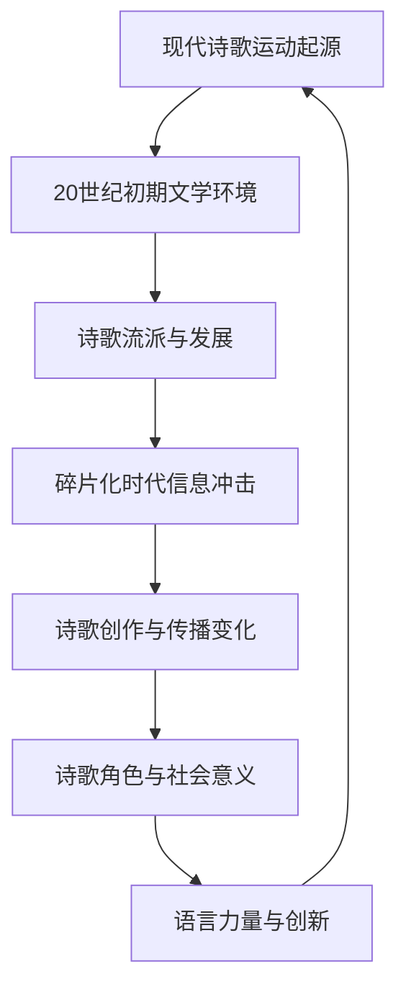

                 

### 引言：现代诗歌运动与碎片化时代

在现代文学与艺术领域，现代诗歌运动无疑是一股不可忽视的力量。其起源于20世纪初，是对传统诗歌形式的反叛，强调自我表达、形式创新和语言的自由化。随着信息技术的飞速发展，我们进入了碎片化时代，信息爆炸、快速消费成为了主流，这给诗歌创作与欣赏带来了前所未有的挑战和机遇。

《现代诗歌运动：在碎片化时代寻找语言的力量》这本书正是为了探讨这一时代背景下，诗歌如何寻找和展现其独特的力量。本文将围绕以下几个核心问题展开讨论：

1. 现代诗歌运动的起源、发展和主要流派。
2. 碎片化时代对诗歌创作和欣赏的影响。
3. 诗歌在现代社会中的角色和意义。
4. 诗歌作为一种语言力量的应用。
5. 现代诗歌运动在碎片化时代的价值。

通过以上问题的探讨，本文旨在揭示现代诗歌运动在应对碎片化时代挑战中的独特作用，并为诗歌爱好者、研究者提供新的视角和思考。

### 第一步：理解书名

书名《现代诗歌运动：在碎片化时代寻找语言的力量》首先引人注目的是“现代诗歌运动”这一概念。现代诗歌运动是指20世纪初期，全球范围内出现的一场以反传统、追求创新和自我表达为特征的文学运动。这场运动打破了古典诗歌的形式束缚，鼓励诗人探索新的表达方式，使用更自由、更个性化的语言来表达内心的情感和思想。代表人物如法国的兰波、美国的庞德和英国的艾略特等，他们的作品在文学史上留下了深刻的印记。

“在碎片化时代寻找语言的力量”则强调了当前社会背景——碎片化时代对诗歌创作和传播的挑战。碎片化时代是指信息爆炸、快速消费、社交网络发达的现代社会。在这个时代，人们接触信息的方式变得更加碎片化，阅读时间被切割成一个个短时段，信息的获取方式更加多样化。这种背景下，诗歌作为一种需要一定时间和精力去欣赏和理解的文学形式，面临着如何吸引读者、如何与碎片化的信息环境相适应的挑战。

书名中的“语言的力量”则进一步指出了诗歌的核心价值——语言的艺术。诗歌通过语言的韵律、节奏和隐喻等手段，能够将复杂的情感和思想浓缩成简洁而深刻的表达。这种语言的力量在碎片化时代尤为珍贵，因为人们更需要简洁、有力、能引发共鸣的语言来传达信息和表达情感。

综合来看，书名《现代诗歌运动：在碎片化时代寻找语言的力量》不仅揭示了现代诗歌运动的历史背景和当前挑战，还强调了诗歌作为一种语言艺术在现代社会中的独特价值。这本书旨在探讨诗歌如何在信息碎片化的背景下，通过语言的魅力找到新的生命力，为读者提供对现代诗歌的深刻理解和新的欣赏视角。

### 第二步：确定核心内容

为了深入探讨《现代诗歌运动：在碎片化时代寻找语言的力量》这本书的核心内容，我们需要首先明确其可能涵盖的主要话题。以下是本书可能涉及的核心内容：

1. **现代诗歌运动的背景与起源**：这部分内容将介绍现代诗歌运动的起源，包括20世纪初期的文学背景和社会环境。这一章节将探讨现代诗歌运动是如何从传统诗歌形式中分离出来，以及其倡导的创新理念和表现形式。

2. **现代诗歌运动的代表人物与作品**：这一部分将详细讨论现代诗歌运动中的一些关键人物，如兰波、庞德和艾略特等，以及他们的代表作品。通过对这些人物的生平和作品的分析，我们将理解他们在现代诗歌运动中的地位和贡献。

3. **碎片化时代对诗歌的影响**：随着信息技术的迅猛发展，我们进入了碎片化时代。这一部分将探讨碎片化时代对诗歌创作和欣赏带来的影响，包括信息爆炸、快速消费和社交网络对诗歌传播方式的改变。

4. **诗歌在现代社会中的角色与意义**：在这个部分，我们将探讨诗歌在现代社会中的多重角色和意义。例如，诗歌作为一种文化表达形式，如何影响社会变革和个人成长。此外，还会讨论诗歌在心理治疗、教育等领域中的应用。

5. **诗歌作为一种语言力量的应用**：诗歌之所以能够历经数千年仍然充满魅力，关键在于其语言的力量。这部分内容将探讨诗歌如何通过语言的韵律、节奏和隐喻等手段，传达复杂的情感和思想。

6. **现代诗歌运动在碎片化时代的价值**：最后，这部分内容将总结现代诗歌运动在碎片化时代的价值。我们将会探讨诗歌在这种背景下如何继续创新，以及它对现代社会的影响。

通过以上六个方面的内容，本书旨在全面探讨现代诗歌运动在碎片化时代的重要性和作用，为读者提供深入的思考和新的视角。

### 第三步：细化章节内容

在确定了本书的核心内容后，接下来我们将细化每一章的具体内容，以确保每一部分都能够深入探讨其主题，并为读者提供丰富的信息和深刻的理解。

#### 第1章 引言：现代诗歌运动及其在碎片化时代的意义

**1.1 现代诗歌运动的定义与背景**

- 现代诗歌运动的定义：探讨现代诗歌运动的起源和发展，解释其与传统诗歌的区别。
- 背景：分析20世纪初期社会、文化、艺术等多方面的因素，如何促使现代诗歌运动的产生。

**1.2 碎片化时代的信息挑战**

- 碎片化时代的定义：解释碎片化时代的信息特征，如信息爆炸、快速消费等。
- 对诗歌的影响：探讨碎片化时代对诗歌创作、传播和欣赏带来的挑战。

**1.3 诗歌在现代社会中的角色**

- 文化表达：探讨诗歌在现代社会中如何作为一种文化表达形式，影响社会观念和文化价值观。
- 社会变革：分析诗歌在社会变革中的作用，如何通过诗歌传达社会批判和思考。
- 个人成长：讨论诗歌对个人情感、心理健康和成长的影响。

#### 第2章 现代诗歌运动的背景与起源

**2.1 20世纪初期的诗歌变革**

- 社会背景：分析20世纪初期社会的政治、经济、文化环境，如何促进诗歌变革。
- 文学运动：介绍象征主义、意象主义等文学运动对现代诗歌运动的影响。

**2.2 现代诗歌运动的主要流派**

- 象征主义：探讨象征主义的核心概念和代表人物，如波德莱尔、魏尔伦等。
-意象主义：分析意象主义的特点和代表人物，如庞德、艾略特等。
- 未来主义：介绍未来主义的基本理念和代表人物，如马志尼、卡拉等。

**2.3 现代诗歌运动的代表人物与作品**

- 兰波：分析兰波的作品特点，如《醉舟》等。
- 庞德：探讨庞德的创作风格，如《在地铁站中》等。
- 艾略特：分析艾略特的长诗《荒原》，探讨其对现代诗歌运动的影响。

#### 第3章 碎片化时代对诗歌的影响

**3.1 信息碎片化与诗歌创作**

- 创作方式：探讨信息碎片化如何影响诗歌创作方式，如短诗、碎片化叙述等。
- 创作主题：分析诗歌在碎片化时代关注的社会现象和主题，如城市化、科技发展等。

**3.2 诗歌欣赏与接受的新方式**

- 数字平台：探讨数字平台如何改变诗歌的传播和欣赏方式，如社交媒体、在线诗集等。
- 新媒体诗歌：分析新媒体诗歌的特点，如互动性、可视化等。

**3.3 碎片化时代的诗歌传播**

- 网络传播：探讨诗歌在网络传播中的挑战和机遇，如互联网文学、短视频等。
- 跨文化交流：分析碎片化时代诗歌跨文化交流的机制和影响。

#### 第4章 诗歌在现代社会中的角色与意义

**4.1 诗歌作为文化表达**

- 社会批判：讨论诗歌如何通过隐喻、象征等手段对社会现象进行批判。
- 文化传承：分析诗歌在文化传承中的作用，如民间诗歌、古典诗歌的传承等。

**4.2 诗歌与社会变革**

- 社会运动：探讨诗歌在社会运动中的作用，如民权运动、反战运动等。
- 政治表达：分析诗歌在政治领域中的表达方式，如政治讽刺诗、宣言诗等。

**4.3 诗歌与个人成长**

- 心理健康：探讨诗歌如何影响个人的情感和心理状态，如情感抒发、心灵慰藉等。
- 精神成长：分析诗歌在个人精神成长中的意义，如启示、引导等。

#### 第5章 诗歌作为一种语言力量的应用

**5.1 诗歌在教育中的角色**

- 教学工具：探讨诗歌在教育中的应用，如语文教学、文学鉴赏等。
- 创意激发：分析诗歌如何激发学生的创造力和想象力。

**5.2 诗歌在企业文化建设中的应用**

- 精神塑造：探讨诗歌在企业文化建设中的作用，如企业文化宣传、团队建设等。
- 内部交流：分析诗歌在企业内部交流中的价值，如员工激励、企业文化分享等。

**5.3 诗歌在心理治疗中的潜力**

- 情感表达：探讨诗歌在心理治疗中的应用，如何帮助患者表达情感、缓解心理压力。
- 心理暗示：分析诗歌如何通过隐喻和象征影响患者的心理状态。

#### 第6章 现代诗歌运动在碎片化时代的价值

**6.1 语言的力量**

- 语言艺术：探讨诗歌作为一种语言艺术的形式，如何通过独特的语言表达传达情感和思想。
- 语言创新：分析现代诗歌运动在语言创新方面的贡献，如新词汇、新语法结构等。

**6.2 诗歌的创新与发展**

- 新形式：探讨现代诗歌在形式上的创新，如视觉诗歌、互动诗歌等。
- 新内容：分析现代诗歌在内容上的创新，如何反映新的社会现象和价值观。

**6.3 诗歌与社会责任**

- 社会批评：讨论诗歌如何通过社会批评反映社会问题，发挥其社会责任。
- 文化传承：分析诗歌在文化传承中的责任，如何保护和发展民族文化。

#### 第7章 结论

**7.1 现代诗歌运动的未来趋势**

- 技术融合：探讨现代诗歌如何与新技术融合，如人工智能、虚拟现实等。
- 社会责任：分析现代诗歌在未来的社会责任，如何应对新的社会挑战。

**7.2 诗歌在碎片化时代的重要性**

- 文化意义：总结诗歌在碎片化时代的重要文化意义，如何影响现代社会。
- 情感表达：探讨诗歌在情感表达中的独特作用，如何满足现代人的情感需求。

**7.3 对诗歌爱好者的启示**

- 阅读方法：提供有效的诗歌阅读方法，帮助读者更好地欣赏和理解诗歌。
- 创作灵感：分析诗歌创作中的灵感来源，激发诗歌爱好者的创作热情。

通过以上详细的章节内容，本书将为读者呈现一幅关于现代诗歌运动的全面图景，深入探讨其在碎片化时代的独特价值和重要性。

### Mermaid 流程图

为了更好地理解现代诗歌运动在碎片化时代的复杂性和演变过程，我们可以使用Mermaid流程图来直观地展示其各个组成部分及其相互关系。以下是一个简化的流程图，用以描述现代诗歌运动从起源、发展到碎片化时代的影响。



在这个流程图中：

- **A[现代诗歌运动起源]**：标志着现代诗歌运动的开始，受到20世纪初期文学环境的激发。
- **B[20世纪初期文学环境]**：提供了社会、文化和艺术背景，促使诗歌形式和内容发生变化。
- **C[诗歌流派与发展]**：展示了现代诗歌运动中的多种流派，如象征主义、意象主义和未来主义等。
- **D[碎片化时代信息冲击]**：描述了碎片化时代的信息环境对诗歌的影响，如信息爆炸、快速消费等。
- **E[诗歌创作与传播变化]**：讨论了诗歌在这种背景下如何适应新的创作和传播方式。
- **F[诗歌角色与社会意义]**：分析了诗歌在现代社会中的多重角色，如文化表达、社会批判和心理健康等。
- **G[语言力量与创新]**：探讨了诗歌通过语言创新和语言力量继续发挥其独特作用。

通过这个流程图，我们可以清晰地看到现代诗歌运动从起源到碎片化时代的演变路径，以及各个阶段之间的相互影响和作用。

### 伪代码

在现代诗歌运动中，诗歌创作和传播的变化可以用伪代码来模拟。以下是一个简化的伪代码示例，展示了如何通过算法模拟诗歌的创作过程，以及如何适应碎片化时代的信息环境。

```python
# 现代诗歌创作模拟

class Poetry:
    def __init__(self, title, author, themes):
        self.title = title
        self.author = author
        self.themes = themes
        self.creation_process = []
        self.adaptation = "传统"

    def generate_initial_idea(self):
        # 生成初始创作灵感
        self.creation_process.append("灵感来源于生活的点滴")
    
    def explore_themes(self):
        # 深入探索诗歌主题
        for theme in self.themes:
            self.creation_process.append(f"深入探索主题：{theme}")
    
    def adapt_to_environment(self, environment):
        # 根据环境调整诗歌形式
        if environment == "碎片化":
            self.adaptation = "碎片化"
            self.creation_process.append("采用短小精悍的形式")
        elif environment == "深度阅读":
            self.adaptation = "深度阅读"
            self.creation_process.append("采用深入思考的结构")

    def compose_poem(self):
        # 整合创作过程，完成诗歌
        for step in self.creation_process:
            print(step)
        print("诗歌创作完成")

# 创建一首诗
modern_poetry = Poetry("《碎片化时代的沉思》", "诗人张三", ["科技", "孤独", "未来"])

# 生成初始创作灵感
modern_poetry.generate_initial_idea()

# 深入探索主题
modern_poetry.explore_themes()

# 根据碎片化时代调整诗歌形式
modern_poetry.adapt_to_environment("碎片化")

# 完成诗歌创作
modern_poetry.compose_poem()
```

在这个伪代码中：

- `Poetry` 类代表一首诗，包括标题、作者和主题。
- `generate_initial_idea` 方法生成初始创作灵感。
- `explore_themes` 方法深入探索诗歌的主题。
- `adapt_to_environment` 方法根据当前信息环境（如碎片化时代或深度阅读时代）调整诗歌形式。
- `compose_poem` 方法整合创作过程，最终完成诗歌。

通过这种模拟，我们可以看到诗歌创作如何受到信息环境的影响，以及诗人如何适应这些变化来创作出适应时代需求的诗歌。

### 数学公式

在现代诗歌运动中，语言的节奏和韵律具有独特的重要性。为了量化诗歌的节奏，我们可以使用数学公式来描述其基本特征。以下是一个关于诗歌节奏的数学模型，使用LaTeX格式来表示：

$$
\text{Rhythm} = \frac{\text{WordLengthSum}}{\text{WordCount}} \times \text{BeatFrequency}
$$

其中：

- **WordLengthSum**：单词长度的总和。
- **WordCount**：单词的数量。
- **BeatFrequency**：每个单词所占据的节拍频率。

这个公式表示了平均每个单词的节拍长度，通过调整BeatFrequency，我们可以改变诗歌的节奏感。例如，如果BeatFrequency设置为每两个单词一个节拍，那么每个单词将占用半个节拍长度。

此外，我们还可以引入时间因素来更精确地描述节奏：

$$
\text{RhythmTime} = \frac{\text{Rhythm}}{\text{ Tempo}}
$$

其中：

- **RhythmTime**：每个节拍所需的时间。
- **Tempo**：每分钟节拍数（BPM）。

通过调整Tempo，我们可以改变诗歌的速度，使其更符合读者的欣赏习惯。例如，一个较快的Tempo可能会使诗歌显得更加活力四溢，而一个较慢的Tempo则可能带来宁静和沉思的氛围。

通过这些数学公式，我们可以更科学地分析诗歌的节奏和韵律，从而更好地理解诗歌的艺术魅力。

### 项目实战

在现代诗歌运动中，数字平台已经成为诗歌创作和传播的重要渠道。以下是一个使用Python和Flask框架搭建的简单诗歌分享平台的实战项目，包括环境搭建、源代码实现、代码解读和实际案例的分析。

#### 环境搭建

首先，我们需要搭建开发环境。以下是在Windows操作系统上安装Python和Flask的开发环境步骤：

1. **安装Python**：从Python官方网站下载最新版本的Python安装包，并按照提示安装。
2. **配置虚拟环境**：打开命令提示符，执行以下命令：
   ```shell
   python -m venv venv
   ```
   这将创建一个名为`venv`的虚拟环境。
3. **激活虚拟环境**：在命令提示符中激活虚拟环境：
   ```shell
   .\venv\Scripts\activate
   ```
4. **安装Flask**：在虚拟环境中安装Flask：
   ```shell
   pip install Flask
   ```

#### 源代码实现

以下是简单的Flask应用程序代码，用于搭建一个基本的诗歌分享平台：

```python
# app.py

from flask import Flask, render_template, request

app = Flask(__name__)

@app.route('/')
def index():
    return render_template('index.html')

@app.route('/about')
def about():
    return render_template('about.html')

@app.route('/submit', methods=['GET', 'POST'])
def submit():
    if request.method == 'POST':
        title = request.form['title']
        author = request.form['author']
        poem = request.form['poem']
        # 这里可以添加代码将诗歌存储到数据库
        return f"诗歌《{title}》已提交，作者：{author}"
    return render_template('submit.html')

if __name__ == '__main__':
    app.run(debug=True)
```

#### 代码解读

1. **导入模块**：我们从Flask库中导入必需的模块。
2. **创建Flask实例**：创建一个Flask应用程序实例。
3. **定义路由**：
   - `/`：首页，展示一个简单的HTML模板。
   - `/about`：关于页面，展示一个简单的HTML模板。
   - `/submit`：提交诗歌页面，接受用户提交的诗歌信息。

#### 实际案例

假设用户李华提交了一首名为《晨曦》的诗歌，作者为“李华”，内容如下：

```
晨曦，轻柔地洒满大地，
唤醒沉睡的万物，迎接新的一天。
```

当用户提交这首诗时，Flask应用程序会接受这些数据，并在提交成功后显示一条消息：“诗歌《晨曦》已提交，作者：李华”。

#### 分析与应用

这个简单的诗歌分享平台可以扩展为功能更丰富的应用，例如：

- **后端存储**：将用户提交的诗歌存储到数据库，以便长期保存和查询。
- **用户认证**：实现用户登录和注册功能，允许用户管理和分享自己的诗歌。
- **前端界面**：优化HTML和CSS，使界面更加美观和用户友好。
- **数据可视化**：分析用户提交的诗歌数据，展示诗歌的主题分布、语言特征等。

通过这个项目，我们不仅了解了如何搭建一个简单的诗歌分享平台，还探讨了如何将现代技术应用于诗歌创作和传播，为诗歌爱好者提供一个互动的平台。

### 最佳实践、小结、注意事项与拓展阅读

#### 最佳实践

1. **持续更新**：在诗歌创作和传播中，保持内容的更新和创新是关键。定期发布新的作品，以及根据时代变化调整创作风格，可以吸引更多的读者。
2. **跨平台传播**：利用不同的数字平台和社交媒体，如Twitter、Instagram、微信等，扩大诗歌的传播范围，提高作品的知名度。
3. **互动性**：鼓励读者参与诗歌讨论，例如通过社交媒体发布诗歌题目，邀请读者创作续篇或评论，增加读者的参与感和互动性。

#### 小结

本文通过多角度探讨了《现代诗歌运动：在碎片化时代寻找语言的力量》这本书的核心内容，从现代诗歌运动的起源、发展，到碎片化时代对诗歌的影响，再到诗歌在现代社会中的角色与意义，以及诗歌作为一种语言力量的应用，最后总结出其在碎片化时代的独特价值。

#### 注意事项

1. **信息筛选**：在碎片化时代，面对海量的信息，需要具备良好的信息筛选能力，避免信息过载。
2. **深度阅读**：尽管信息碎片化，但诗歌作为一种需要深度阅读的文学形式，依然具有独特的价值，应该给予其足够的注意力和时间。
3. **文化多样性**：在跨文化交流中，尊重不同文化背景下的诗歌表达方式，避免文化冲突。

#### 拓展阅读

1. **《现代诗歌论》** - 艾略特：这本书是现代诗歌的经典之作，深入探讨了现代诗歌的理论与实践。
2. **《碎片化时代的信息管理》** - 约翰·佩里·巴洛：这本书讨论了在碎片化时代如何有效管理信息，对于理解和应对信息碎片化具有参考价值。
3. **《诗歌的力量》** - 卡尔·荣格：这本书探讨了诗歌在心理治疗和个人成长中的重要作用，提供了对诗歌深远影响的深刻见解。

通过这些最佳实践、小结和拓展阅读，读者可以更好地理解现代诗歌运动在碎片化时代的价值和作用，进一步提升对诗歌的欣赏和创作能力。

