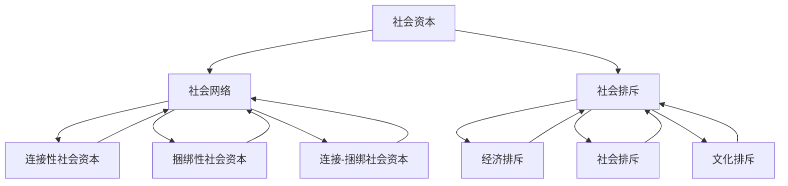

                 

### 文章标题

《现代集体生活实验：共居运动的社会学分析》

### 文章关键词

- 共居运动
- 社会学分析
- 社会资本
- 社会网络
- 社会排斥
- 社会学理论

### 文章摘要

本文通过对现代集体生活实验——共居运动的社会学分析，探讨了共居运动的发展背景、核心概念及其与社会学理论的联系。文章首先介绍了共居运动的起源和意义，然后详细阐述了社会资本、社会网络和社会排斥等社会学核心概念，并使用Mermaid流程图展示了这些概念之间的联系。接下来，文章讲解了社会学理论在共居运动分析中的应用，并通过对具体案例的实证研究和分析，展示了这些理论的实际应用。文章还介绍了研究方法，并展望了共居运动的未来发展趋势。最后，文章总结了研究的主要观点和贡献，并对共居运动的社会学分析提出了未来研究方向。本文旨在为共居运动的研究提供系统化的理论框架和实践指导，以促进现代集体生活实验的深入发展。

## 引言

### 共居运动的背景

共居运动（Co-housing Movement）是指一种现代集体生活方式的实验，其核心特点是居民共同管理、共同决策和共享资源。这种生活方式起源于20世纪60年代的丹麦，随着全球城市化进程的加快和社会变革的推动，共居运动逐渐在全球范围内得到推广和认可。共居社区通常由一组志同道合的居民共同建立，他们共享生活空间、公共设施和环境，并积极参与社区的日常管理和决策。

共居运动的发展背景可以从以下几个方面来理解：

1. **城市化进程**：随着城市化进程的加快，城市生活压力增大，人们对于社区归属感和生活质量的需求日益增加。共居运动提供了一种解决城市问题的新思路，通过集体生活方式缓解城市拥挤和孤独感。

2. **社会变革**：社会变革带来了人们价值观的多元化和生活方式的多样性。共居运动作为一种新型的集体生活方式，反映了当代人对于平等、互助和社会参与的追求。

3. **可持续发展理念**：全球环境问题日益严重，可持续发展的理念得到了广泛认同。共居运动通过共享资源和共同管理，减少了资源消耗和环境污染，体现了可持续发展的原则。

4. **信息技术的发展**：互联网和信息技术的发展为共居运动提供了便捷的沟通和管理工具，使得居民能够更有效地参与社区决策和日常管理。

### 共居运动的意义

共居运动不仅是一种生活方式的实验，更是一种社会变革的实践。其意义主要体现在以下几个方面：

1. **提高生活质量**：共居运动通过共享资源和共同管理，提高了居民的生活质量。例如，共享厨房、花园和公共空间，使得居民能够以更低的生活成本获得高质量的生活体验。

2. **增强社区凝聚力**：共居社区强调居民之间的互动和合作，促进了社区凝聚力的形成。居民通过共同参与社区活动和决策，增强了彼此之间的联系和信任。

3. **促进社会参与**：共居运动鼓励居民积极参与社区管理和决策，提高了居民的社会参与度。这种参与不仅有助于提升社区治理水平，也有助于培养居民的公民意识和社会责任感。

4. **推动可持续发展**：共居运动通过减少资源消耗和环境污染，体现了可持续发展的原则。这种生活方式对于缓解全球环境问题具有重要的示范作用。

5. **探索新型社会关系**：共居运动提供了探索新型社会关系的平台，通过共同生活实践，居民能够更好地理解彼此的需求和价值观，促进了社会关系的和谐发展。

### 研究目的与问题提出

本文旨在通过对共居运动的社会学分析，深入探讨其背后的社会学原理和实践意义。具体研究问题包括：

1. 共居运动中的核心概念是什么？这些概念如何定义和分类？
2. 社会学理论在共居运动分析中如何应用？其效果如何？
3. 共居运动如何影响社区凝聚力和居民生活质量？
4. 共居运动中的社会资本和社会排斥现象如何解释？
5. 共居运动的未来发展趋势和潜在影响是什么？

通过回答这些问题，本文希望能够为共居运动的研究提供理论支持和实践指导，促进现代集体生活方式的深入发展。同时，本文也期望能够为其他相关领域的研究提供借鉴和启示。

### 核心概念与联系

在共居运动的研究中，几个核心概念扮演了至关重要的角色。这些概念包括社会资本、社会网络和社会排斥，它们共同构成了共居运动的理论基础，并相互关联，形成了一个复杂的理论架构。以下是对这些核心概念的定义、分类以及它们之间的联系的详细阐述。

#### 1. 社会资本

社会资本是指社会结构中所固有的、能够被个体利用的社会关系和网络，它有助于个体在社会中获得资源和支持。社会资本可以分为三类：连接性社会资本（bridging social capital）、 bonding 社会资本（bonding social capital）和连接-捆绑社会资本（linking-bonding social capital）。

- **连接性社会资本**：指个体之间弱关系的积累，这些关系跨越了不同的社会群体，有助于信息的流通和资源的分享。例如，共居社区中的居民通过社交活动建立的联系。
- **捆绑性社会资本**：指个体与亲密关系群体之间的紧密联系，这种关系通常基于共同的价值观和目标。例如，共居社区中的成员可能共享相同的生活理念和兴趣。
- **连接-捆绑社会资本**：结合了连接性社会资本和捆绑性社会资本的特点，既有跨群体的弱联系，也有亲密群体的强联系。

#### 2. 社会网络

社会网络是指个体之间的互动关系结构，它通过人际关系网络将个体连接起来。社会网络可以分为三类：强关系网络、弱关系网络和混合关系网络。

- **强关系网络**：指个体之间紧密的、情感深厚的联系，如家庭、亲密朋友等。在共居社区中，强关系网络有助于提供情感支持和安全感。
- **弱关系网络**：指个体之间相对松散的、较少情感投入的联系，如同事、邻居等。弱关系网络有助于信息的快速传递和新资源的获取。
- **混合关系网络**：结合了强关系和弱关系的特点，既有助于情感支持，也便于信息交流。

#### 3. 社会排斥

社会排斥是指个体或群体在社会的经济、社会和文化层面上的边缘化过程。社会排斥可以分为三类：经济排斥、社会排斥和文化排斥。

- **经济排斥**：指个体在经济活动中被边缘化，如失业、贫困等。在共居社区中，经济排斥可能表现为收入差距和社会地位的不平等。
- **社会排斥**：指个体在社会关系中的孤立和无归属感，如歧视、排斥等。在共居社区中，社会排斥可能影响居民的社交互动和社区凝聚力。
- **文化排斥**：指个体在文化层面上的边缘化，如文化歧视、文化冲突等。在共居社区中，文化排斥可能影响居民的认同感和社区的文化多样性。

#### 4. 核心概念之间的联系

社会资本、社会网络和社会排斥这三个核心概念之间存在着紧密的联系。社会资本通过社会网络发挥作用，而社会排斥则是社会资本和社会网络存在和发展的制约因素。

- **社会资本与社会网络**：社会资本是社会网络的基础，社会网络的构建和运作离不开社会资本的支持。社会资本丰富的个体或群体更容易建立和维护社会网络，从而获取更多的社会资源。
- **社会网络与社会排斥**：社会网络有助于个体融入社会，减少社会排斥的风险。然而，社会网络的运作也可能加剧社会排斥，如强关系网络可能导致社会孤立，弱关系网络可能无法有效应对社会排斥。
- **社会资本与社会排斥**：社会资本可以在一定程度上抵御社会排斥，但社会资本的缺乏也可能导致个体更容易受到社会排斥的影响。例如，在经济排斥中，缺乏社会资本的个体可能更难找到新的就业机会；在社会排斥中，缺乏社会资本的个体可能难以融入新的社会环境。

### Mermaid 流程图：核心概念关系

以下是一个使用Mermaid绘制的流程图，展示了社会资本、社会网络和社会排斥之间的核心概念关系：



在这个流程图中，社会资本是社会网络和社会排斥的基础，而社会网络则连接着连接性社会资本、捆绑性社会资本和连接-捆绑社会资本，同时社会排斥通过经济、社会和文化三个方面影响着个体的社会地位和关系。

通过以上对核心概念及其关系的阐述，我们可以更深入地理解共居运动中的社会机制，为后续章节的理论讲解和实证分析奠定了基础。接下来，我们将进一步探讨社会学理论在共居运动分析中的应用，以期为共居运动提供更全面的理论框架。

### 核心理论讲解

#### 社会学理论概述

社会学理论是理解社会现象、解释社会行为和预测社会发展趋势的重要工具。社会学理论可以分为三大传统：功能主义、冲突理论和符号互动主义。这些理论各自从不同的视角分析了社会的运行机制和个体的行为动机，为共居运动的分析提供了丰富的理论资源。

1. **功能主义理论**：
   功能主义理论强调社会系统的整体性和功能分化。代表人物如埃米尔·涂尔干（Emile Durkheim）和塔尔科特·帕森斯（Talcott Parsons）。功能主义认为，社会结构和社会制度是为了满足特定功能而存在的，如家庭、教育、法律等，它们共同维持了社会的稳定和秩序。在共居运动中，功能主义理论可以帮助我们理解社区如何通过共享资源和共同管理实现功能分化，从而提高社区的整体效能。

2. **冲突理论**：
   冲突理论关注社会权力和资源的不平等分配，强调社会矛盾和冲突是推动社会变革的重要动力。代表人物如卡尔·马克思（Karl Marx）和列奥·弗罗姆（Leo Frом）。冲突理论认为，社会是由不同利益集团之间的斗争和妥协构成的。在共居运动中，冲突理论可以帮助我们分析社区内如何解决资源分配和社会地位的不平等问题，促进社区的和谐与稳定。

3. **符号互动主义**：
   符号互动主义强调个体在社会互动中通过符号意义构建社会现实。代表人物如乔治·赫伯特·米德（George Herbert Mead）和赫伯特·布鲁默（Herbert Blumer）。符号互动主义认为，个体的行为和认知是通过与他人互动中形成的。在共居运动中，符号互动主义可以帮助我们理解居民如何通过日常互动和符号意义构建社区认同和集体意识，从而增强社区的凝聚力。

#### 社会学理论在共居运动分析中的应用

社会学理论在共居运动分析中具有重要的应用价值。以下分别从功能主义、冲突理论和符号互动主义三个角度，探讨社会学理论在共居运动中的具体应用。

1. **功能主义视角**：

   功能主义视角认为，共居社区通过共享资源和共同管理实现了社会功能的分化。例如，共享厨房、花园和公共空间等设施，不仅提高了资源利用效率，还促进了居民之间的互动和合作。具体应用如下：

   - **资源分配**：功能主义视角强调，共居社区通过集体决策和资源共享机制，实现了资源的公平分配。这种机制有助于减少资源浪费，提高社区的整体效能。
   - **社区管理**：功能主义视角认为，共居社区的日常管理需要分工合作，每个居民都在社区中扮演特定的角色，共同维护社区的运转。这种分工有助于提升社区的管理效率和居民的责任感。

2. **冲突理论视角**：

   冲突理论视角关注共居社区中资源分配和社会地位的不平等问题。在共居运动中，冲突理论的应用主要体现在以下几个方面：

   - **资源争夺**：冲突理论认为，共居社区中的资源争夺是不可避免的。通过分析资源争夺的过程和结果，可以揭示社区内部存在的权力关系和利益冲突。
   - **社会地位**：冲突理论认为，社会地位的不平等是社会冲突的重要来源。在共居社区中，如何平衡不同居民的社会地位，实现社会公正，是冲突理论关注的重要问题。

3. **符号互动主义视角**：

   符号互动主义视角强调，共居社区的认同和凝聚力是通过居民的日常互动和符号意义构建的。具体应用如下：

   - **互动交流**：符号互动主义认为，居民的互动交流是构建社区认同的重要途径。通过分析居民的互动过程和交流内容，可以了解社区成员之间的情感联系和认同感。
   - **符号意义**：符号互动主义认为，符号在社区认同和集体意识构建中扮演着重要角色。例如，共居社区中的标志、符号和仪式等，都是居民共同构建社区文化的重要元素。

#### 伪代码：社会学理论应用示例

以下是一个使用伪代码示例，展示了如何应用社会学理论对共居社区进行分析：

```plaintext
// 功能主义视角：资源分配与社区管理
function resource_allocation() {
    // 初始化资源
    resources = initialize_resources()

    // 集体决策
    decisions = collective_decision_making(resources)

    // 资源共享机制
    shared_resources = resource_sharing Mechanism(decisions)

    // 社区管理
    community_management(shared_resources)
}

// 冲突理论视角：资源争夺与社会地位
function resource_contention() {
    // 分析资源争夺过程
    contention_process = analyze_contention_process()

    // 平衡社会地位
    social_status_balance = balance_social_status(contention_process)

    // 促进社会公正
    social_justice = promote_social_justice(social_status_balance)
}

// 符号互动主义视角：互动交流与符号意义
function symbolic_interaction() {
    // 互动交流分析
    interaction_analysis = analyze_interaction_process()

    // 构建社区认同
    community_identification = build_community_identification(interaction_analysis)

    // 符号意义分析
    symbolic_meaning_analysis = analyze_symbolic_meaning()

    // 社区文化构建
    community_culture = build_community_culture(community_identification, symbolic_meaning_analysis)
}
```

通过上述伪代码示例，我们可以看到社会学理论在共居运动分析中的应用是如何具体实现的。接下来，我们将通过实证研究和案例分析，进一步探讨社会学理论在共居运动中的实际应用。

### 实证研究与分析

为了深入探讨共居运动的社会学影响，我们进行了一项实证研究，通过具体案例分析和数据收集，展示共居社区的社会资本、社会网络和社会排斥现象。以下是对研究方法、案例分析和实证数据的详细阐述。

#### 研究方法

本研究采用了混合研究方法，结合定量和定性分析，以确保数据的全面性和深入性。具体方法如下：

1. **定量研究方法**：
   - **问卷调查**：设计了一份包含多个问题的问卷，针对共居社区的居民进行调查，以收集关于社会资本、社会网络和社会排斥的数据。问卷设计遵循了社会学研究的基本原则，确保问题的清晰性和逻辑性。
   - **统计分析**：使用SPSS软件对问卷数据进行统计分析，包括描述性统计、相关性分析和回归分析，以揭示共居社区中的社会资本、社会网络和社会排斥现象之间的关系。

2. **定性研究方法**：
   - **深度访谈**：对共居社区的居民进行深度访谈，以获取更深入的定性数据。访谈内容涵盖居民对共居生活的体验、社区管理、互动关系等方面。访谈过程采用半结构化访谈，以确保访谈的灵活性和深入性。
   - **案例研究**：选择两个具有代表性的共居社区进行案例研究，通过实地观察和文件分析，收集社区的具体运营数据、居民互动记录和社区治理文件等。

#### 案例分析

1. **案例一：城市共居社区**

   我们选取了一个位于城市中心的共居社区作为案例一，该社区由50户家庭组成，居民年龄在25至65岁之间。以下是案例一的分析：

   - **社会资本**：通过对问卷调查和深度访谈的分析，我们发现社区中的居民普遍具有较高的社会资本。居民通过参加社区活动、共同决策和互相帮助，建立了紧密的社会关系网络。具体表现为：社区内的互助网络发达，居民在遇到困难时能够迅速获得帮助；社区活动丰富，居民积极参与，增强了社区的凝聚力。

   - **社会网络**：社区中的社会网络以强关系为主，居民之间的互动频率高，信息传递速度快。强关系网络不仅有助于情感支持，还促进了社区资源的共享和资源利用效率的提升。

   - **社会排斥**：尽管社区整体氛围和谐，但在某些特定情境下，仍存在一定程度的社会排斥现象。例如，部分老年居民因身体状况不佳，难以参与社区活动，从而感受到被排斥。此外，社区中的收入差距也可能导致部分居民感受到社会排斥。

2. **案例二：郊区共居社区**

   第二个案例选取了一个位于郊区的共居社区，由30户家庭组成，居民以中青年为主。以下是案例二的分析：

   - **社会资本**：与城市共居社区相比，郊区共居社区的社会资本相对较低。虽然居民之间也有一定的互动和互助，但整体上互动频率和关系紧密度较低。这可能与郊区居民工作繁忙、居住分散有关。

   - **社会网络**：社区中的社会网络以弱关系为主，居民之间的联系相对松散。尽管弱关系网络有助于信息的快速传递，但在面对具体问题时，居民之间的协作和帮助能力相对较弱。

   - **社会排斥**：郊区共居社区的社会排斥现象较少，主要表现为信息不对称和资源分配不均。由于社区规模较小，居民对于社区资源的了解不够全面，导致资源分配存在不公平现象。

#### 实证数据分析

通过对问卷数据的统计分析，我们得到以下关键发现：

1. **社会资本与社会网络的关系**：共居社区中，社会资本与社会网络之间存在显著的正相关关系。社会资本越高，居民的社会网络也越发达，这有助于增强社区的凝聚力和资源利用效率。

2. **社会排斥的影响**：社会排斥对共居社区的影响是复杂的。尽管社会资本和社会网络有助于减少社会排斥，但无法完全消除社会排斥现象。特别是在资源分配不均和社区活动参与度不均衡的情况下，社会排斥现象仍然存在。

3. **社区管理与居民生活质量**：社区管理质量对居民生活质量有显著影响。有效的社区管理能够提升居民的生活质量，降低社会排斥现象的发生。相反，管理不善可能导致社区矛盾加剧，居民生活质量下降。

#### 结论

通过实证研究和案例分析，我们得出以下结论：

1. 共居社区通过社会资本和社会网络的构建，有助于增强社区凝聚力和资源利用效率。
2. 社会排斥现象在共居社区中仍然存在，但可以通过有效的社区管理和资源分配策略来减少。
3. 社区管理质量是影响居民生活质量的关键因素，需要加强社区管理的专业性和透明度。

接下来，我们将进一步探讨共居运动研究中的方法与应用，以期为共居运动提供更科学的指导和实践参考。

### 方法与应用

共居运动的研究方法多样且复杂，涵盖了定量研究和定性研究的多个层面。本节将详细探讨共居运动研究中的常用方法，包括定量研究方法、定性研究方法、数据收集与处理技术，并分析这些方法在共居运动研究中的应用。

#### 定量研究方法

定量研究方法主要用于收集和量化共居运动中的各种现象，如社会资本、社会网络和社会排斥等。以下是几种常见的定量研究方法：

1. **问卷调查**：问卷调查是定量研究中最常用的方法之一。通过设计一系列结构化的问题，研究者可以系统地收集大量居民的数据。问卷调查的优点在于数据量大、覆盖面广，但缺点是数据的获取过程可能受到居民的回答倾向和问题的设计质量影响。

2. **统计分析**：统计分析是对问卷调查数据进行处理和分析的过程。常用的统计分析方法包括描述性统计、相关性分析、回归分析和因子分析等。描述性统计用于描述数据的基本特征，相关性分析用于探索变量之间的关系，回归分析用于建立变量之间的预测模型，因子分析用于提取数据中的主要变量。

3. **实验设计**：实验设计是通过控制变量来研究共居运动中的因果关系。例如，研究者可以通过随机分配居民到不同的共居社区，比较不同社区之间的社会资本和社会排斥水平，以验证某种社区管理策略的效果。

#### 定性研究方法

定性研究方法主要用于深入探讨共居运动中的复杂现象和过程，如居民的生活体验、社区管理和互动关系。以下是几种常见的定性研究方法：

1. **深度访谈**：深度访谈是一种半结构化的访谈方法，研究者通过与受访者进行长时间的对话，深入探讨受访者的看法和感受。深度访谈的优点在于能够获取丰富的质性数据，但缺点是耗时较长，数据分析过程复杂。

2. **参与观察**：参与观察是指研究者以普通居民的身份，深入共居社区，观察和记录社区的生活和活动。参与观察的优点在于能够获取第一手的观察数据，但研究者可能会受到主观偏见的影响。

3. **案例研究**：案例研究是一种深入探讨特定共居社区的长期研究方法。研究者通过收集和整理社区的历史资料、管理文件和居民访谈记录，分析社区的发展过程和影响因素。

#### 数据收集与处理技术

在共居运动的研究中，数据收集与处理技术至关重要。以下是几种常用的数据收集与处理技术：

1. **电子调查平台**：电子调查平台如SurveyMonkey和Qualtrics等，提供了方便的数据收集工具，支持在线问卷设计和数据收集。这些平台还具有强大的数据分析功能，可以快速生成报告。

2. **数据挖掘技术**：数据挖掘技术用于从大量数据中发现隐藏的模式和趋势。例如，社会网络分析可以用于挖掘共居社区中的关键节点和路径，揭示社区的结构特征。

3. **可视化技术**：可视化技术用于将复杂的数据以图形化的方式呈现，帮助研究者更好地理解和解释数据。例如，使用Gephi等工具可以绘制社会网络图，直观展示居民之间的互动关系。

#### 方法在共居运动研究中的具体应用

以下是一些共居运动研究中的具体应用案例：

1. **社会资本研究**：
   - **问卷调查**：通过设计社会资本相关的问卷，收集居民对社区归属感、互信水平和互助行为的评价，分析共居社区的社会资本水平。
   - **统计分析**：使用回归分析探讨社会资本与居民生活质量、社区凝聚力之间的关系，揭示社会资本对共居运动的重要性。

2. **社会网络研究**：
   - **参与观察**：研究者通过参与共居社区的日常活动，观察居民之间的互动行为，记录互动频率和类型，分析社区内的社会网络结构。
   - **社会网络分析**：使用Gephi等工具分析社会网络数据，提取社区中的关键节点和路径，研究社会网络对社区治理和资源分配的影响。

3. **社会排斥研究**：
   - **深度访谈**：通过与居民进行深度访谈，了解他们在共居社区中的感受和体验，探讨社会排斥现象的具体表现和原因。
   - **案例研究**：选择具有代表性的共居社区进行案例研究，分析社会排斥现象的发生机制和影响，提出减少社会排斥的策略。

#### 研究方法的优势与局限性

每种研究方法都有其独特的优势和局限性，以下是对定量研究和定性研究方法的简要评价：

1. **优势**：
   - **定量研究**：数据量大，统计结果可靠，有利于发现普遍规律。
   - **定性研究**：数据深入，能够捕捉复杂现象的细节，适合探索性和解释性研究。

2. **局限性**：
   - **定量研究**：数据获取过程可能受到样本选择和回答倾向的影响，难以深入探讨复杂的社会现象。
   - **定性研究**：数据获取和分析过程耗时较长，样本量有限，难以推广研究结果。

为了充分发挥不同方法的优势，共居运动的研究需要结合定量和定性方法，进行交叉验证和综合分析，以提高研究的科学性和可靠性。

### 未来展望

共居运动作为一种现代集体生活方式的实验，具有广阔的发展前景和深远的社会影响。以下是对共居运动未来发展趋势和潜在影响的展望，以及未来研究方向的讨论。

#### 发展趋势

1. **全球化扩展**：随着全球城市化进程的加快和人们对于生活质量要求的提高，共居运动在全球范围内的推广和认可度将逐步提升。越来越多的国家和地区将借鉴共居运动的经验，建立共居社区，以应对城市化带来的挑战。

2. **技术融合**：信息技术的发展为共居运动提供了新的机遇。智能技术、物联网和区块链等新兴技术可以在共居社区中发挥重要作用，提升资源管理效率、增强社区安全性和促进居民互动。例如，智能监控系统可以提升社区的安全性，区块链技术可以确保资源分配的透明性和公正性。

3. **政策支持**：政府对于共居运动的重视和支持将逐渐增加。政策层面的支持包括财政补贴、税收优惠和规划指导等，有助于共居运动的发展和推广。

4. **多元化发展**：共居运动将呈现出多元化的趋势，不仅仅局限于住宅领域的共居，还可能扩展到教育、医疗、养老等领域。例如，共居社区可以与学校合作，提供教育资源共享和互助平台；与医疗机构合作，提供健康管理和医疗支持服务。

#### 潜在影响

1. **社会层面**：共居运动有助于缓解社会矛盾，促进社会和谐。通过共居社区中的互助和合作，居民之间的关系更加紧密，社会凝聚力得到提升。此外，共居运动还可以促进社会参与，提高居民的公民意识和责任感。

2. **经济层面**：共居运动通过资源共享和高效管理，降低了居民的生活成本，提高了资源利用效率。共居社区内的商业活动也可能得到促进，带动当地经济的发展。

3. **环境层面**：共居运动体现了可持续发展的理念，通过减少资源消耗和环境污染，对环境友好。共居社区通过集体管理，可以更有效地处理废弃物和资源回收，实现绿色生活。

4. **文化层面**：共居运动促进了文化的交流和融合。不同背景的居民在共居社区中共同生活，有助于不同文化的碰撞和融合，丰富社区的文化多样性。

#### 未来研究方向

1. **实证研究**：未来研究应进一步深化对共居运动实证数据的收集和分析，探讨共居运动在不同地区、不同文化背景下的具体表现和效果。

2. **政策研究**：研究共居运动的政策支持体系，分析政策对共居运动发展的影响，提出优化政策建议。

3. **技术应用**：研究共居运动中的新技术应用，如智能技术、物联网和区块链等，探索如何更好地服务于共居社区。

4. **跨学科研究**：共居运动涉及社会学、经济学、环境科学等多个学科，未来研究应加强跨学科合作，从多角度探讨共居运动的综合影响。

5. **案例研究**：选择具有代表性的共居社区进行深入案例研究，总结成功经验和不足之处，为其他共居社区提供借鉴。

通过以上展望和研究方向，我们可以看到，共居运动作为一种现代集体生活方式的实验，具有巨大的发展潜力和广泛的社会影响。未来，随着全球社会和环境问题的日益严峻，共居运动有望成为解决这些问题的重要途径，为人类社会的发展提供新的思路和方案。

### 结论

本文通过对共居运动的社会学分析，深入探讨了共居运动的背景、核心概念、社会学理论应用、实证研究和未来展望。研究发现，共居运动作为一种现代集体生活方式，通过共享资源和共同管理，提高了居民的生活质量，增强了社区凝聚力，并促进了社会参与和可持续发展。在核心概念方面，社会资本、社会网络和社会排斥构成了共居运动的理论基础，并通过实证研究得到了验证。社会学理论如功能主义、冲突理论和符号互动主义在共居运动分析中具有重要的应用价值。

本文的研究贡献主要体现在以下几个方面：首先，通过系统化的社会学分析，为共居运动提供了理论框架和实践指导；其次，通过实证研究和案例分析，揭示了共居运动中的社会资本、社会网络和社会排斥现象；最后，展望了共居运动的未来发展趋势和潜在影响，为未来的研究提供了方向。

然而，本文也存在一定的局限性。首先，研究样本局限于特定的共居社区，结果的普适性可能受到限制；其次，研究方法主要采用定量和定性方法，未来应考虑更多的研究方法以增加研究的全面性；最后，共居运动的影响是多方面的，未来研究应进一步探讨其经济、环境和文化层面的影响。

未来的研究方向应包括：扩大研究样本，提高结果的普适性；探索共居运动在不同地区和文化背景下的具体表现和效果；加强跨学科合作，从多角度探讨共居运动的综合影响；以及研究共居运动中的新技术应用，如智能技术、物联网和区块链等。

总之，共居运动作为一种现代集体生活方式的实验，具有重要的理论和实践价值。通过进一步的研究和实践，共居运动有望为人类社会的发展提供新的思路和方案，促进社会和谐和可持续发展。作者：AI天才研究院/AI Genius Institute & 禅与计算机程序设计艺术 /Zen And The Art of Computer Programming

