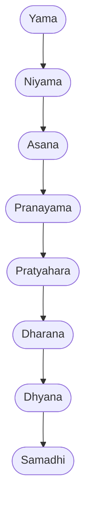
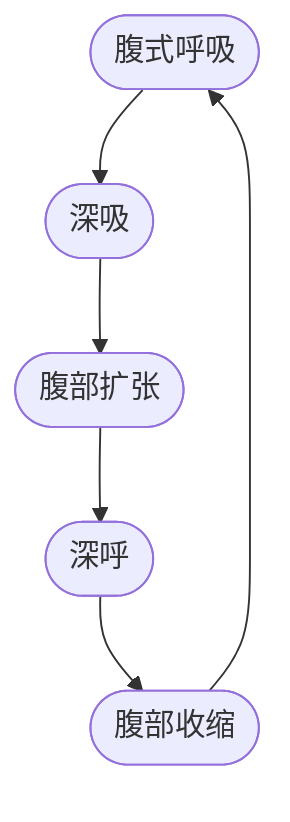
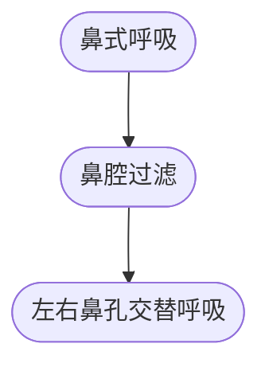
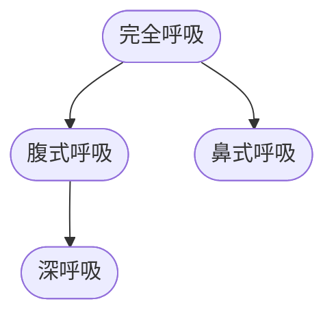
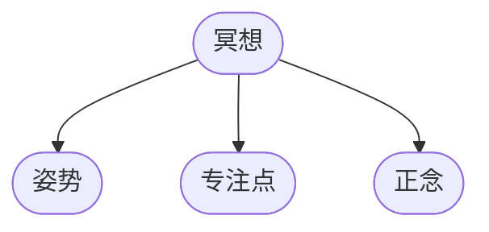

                 

# 瑜伽修习的意义：身心合一的生活哲学

> 关键词：瑜伽，身心健康，精神成长，现代生活，哲学基础，实践方法

> 摘要：瑜伽作为一种古老而独特的身心修炼方式，其意义深远，涵盖了身体健康、心理健康和精神成长等方面。本文将从瑜伽的历史与哲学出发，详细探讨瑜伽修习在现代社会中的重要性，以及其基础理论与实践方法。通过分析瑜伽对身体健康、心理健康和精神成长的益处，探讨瑜伽修习与现代生活的融合，并提供相关的资源与指导，帮助读者深入理解瑜伽修习的意义，并在日常生活中实践瑜伽的理念。

---

### 第1章 引言：瑜伽修习的意义

瑜伽，源自古印度，是一种融合了身体、心灵和精神的修炼方式。瑜伽的修习不仅关注身体的健康，更强调心灵和精神的和谐发展。在现代社会，随着生活节奏的加快和压力的增加，人们越来越关注身心健康和精神成长。瑜伽作为一种身心合一的修炼方式，逐渐成为许多人寻求平衡与和谐的重要途径。

#### 1.1 瑜伽的历史与哲学

**1.1.1 瑜伽的起源**

瑜伽的历史可以追溯到公元前3000年左右，当时的古印度文明已经形成了一些瑜伽的初步思想。瑜伽在古印度文化中的地位极为重要，被视为连接人类与宇宙的一种方式。古印度的经典文献《奥义书》中详细阐述了瑜伽的哲学思想。

**1.1.2 瑜伽哲学的核心概念**

瑜伽哲学的核心概念包括三位一体论、轮回与解脱、自我意识与宇宙意识等。

- **三位一体论**：瑜伽认为，宇宙、人类和自然界是一个统一的整体，由三个基本元素（地、水、火）构成。这个概念强调了人与自然的和谐关系。

- **轮回与解脱**：瑜伽哲学认为，人类通过不断修习，可以打破轮回的束缚，达到解脱的境界。解脱意味着从物质世界的束缚中解放出来，达到精神上的自由。

- **自我意识与宇宙意识**：瑜伽修习的一个核心目标是提高自我意识，使个体能够感知到自己的本质与宇宙的本质是相同的。这种自我意识的提升有助于实现身心合一。

**1.1.3 瑜伽与现代生活**

随着现代社会的发展，人们越来越意识到身心健康的重要性。瑜伽作为一种身心修炼方式，逐渐被更多的人接受和喜爱。瑜伽不仅能够改善身体健康，还能帮助人们减轻压力，提升心理健康。此外，瑜伽的哲学思想也为人们提供了精神上的指导，帮助人们更好地面对生活中的挑战。

#### 1.2 瑜伽修习的重要性

**1.2.1 身体健康**

瑜伽通过一系列的体式和呼吸练习，能够有效提高身体的柔韧性、平衡性和力量。此外，瑜伽还有助于改善心血管系统、消化系统和其他身体系统的功能。长期练习瑜伽，可以显著提高身体的健康水平。

**1.2.2 心理健康**

瑜伽不仅关注身体的健康，更重视心理健康。通过瑜伽的练习，人们能够减轻压力和焦虑，提高情绪稳定性。瑜伽的冥想练习也有助于提升专注力和自我控制力，从而改善心理健康。

**1.2.3 精神成长**

瑜伽的哲学思想强调个体与宇宙的统一。通过瑜伽的修习，人们能够更好地理解自己和世界，提升自我认知。瑜伽还帮助人们培养宽容、慈悲和感恩的心态，从而实现精神上的成长。

---

通过以上内容，我们可以看到瑜伽修习的意义不仅仅在于身体健康，还包括心理健康和精神成长。在接下来的章节中，我们将进一步探讨瑜伽的基础理论和实践方法，以及瑜伽修习对现代生活的融合和应用。让我们一起深入瑜伽的世界，探索其深远的内涵。

---

### 第1章 引言：瑜伽修习的意义

#### 1.1 瑜伽的历史与哲学

**1.1.1 瑜伽的起源**

瑜伽的历史可以追溯到公元前3000年左右的古印度。在古印度文明中，瑜伽被视为一种神圣的修炼方式，旨在帮助人们达到身心的和谐与统一。最早的瑜伽文献《奥义书》记录了瑜伽的起源和哲学思想，阐述了瑜伽是如何通过冥想、体式和呼吸练习来达到精神上的觉醒和自我认知。

在古印度，瑜伽不仅是一种宗教修行，还是一种生活方式。它涉及到身体、心灵和精神的全面修炼，旨在实现个体的内在和平与外在和谐。瑜伽的理念在古印度社会中深深扎根，影响了印度文化的各个方面。

**1.1.2 瑜伽哲学的核心概念**

瑜伽哲学的核心概念包括三位一体论、轮回与解脱、自我意识与宇宙意识等。

- **三位一体论**：瑜伽认为宇宙、人类和自然界是由三个基本元素（地、水、火）组成的。这三个元素相互作用，形成了宇宙的多样性和统一性。瑜伽强调人类与自然的紧密联系，提倡尊重和保护自然环境。

  ```mermaid
  graph TD
    A([三位一体论])
    B([宇宙])
    C([人类])
    D([自然界])
    E([地])
    F([水])
    G([火])
    
    A --> B
    A --> C
    A --> D
    B --> E
    C --> E
    D --> E
    B --> F
    C --> F
    D --> F
    B --> G
    C --> G
    D --> G
  ```

- **轮回与解脱**：瑜伽哲学认为，人类生活在轮回中，不断地经历生、老、病、死的过程。通过瑜伽的修炼，人们可以摆脱轮回的束缚，达到解脱的境界。解脱意味着从物质世界的束缚中解放出来，实现精神上的自由。

  ```mermaid
  graph TD
    A([轮回与解脱])
    B([轮回])
    C([解脱])
    D([物质世界])
    E([精神世界])
    
    A --> B
    A --> C
    B --> D
    C --> E
  ```

- **自我意识与宇宙意识**：瑜伽修习的一个核心目标是提高自我意识，使个体能够感知到自己的本质与宇宙的本质是相同的。这种自我意识的提升有助于实现身心合一，达到精神上的觉醒。

  ```mermaid
  graph TD
    A([自我意识与宇宙意识])
    B([自我意识])
    C([宇宙意识])
    D([身心合一])
    E([精神觉醒])
    
    A --> B
    A --> C
    B --> D
    C --> D
    D --> E
  ```

**1.1.3 瑜伽与现代生活**

随着时间的推移，瑜伽逐渐传播到了世界各地，并在现代社会中找到了其独特的地位。现代生活的快节奏和高压环境使得人们更加需要一种方式来平衡身心，缓解压力，提高生活质量。瑜伽作为一种身心合一的修炼方式，恰好满足了这一需求。

在现代生活中，瑜伽不仅被视为一种健身方式，更被视为一种生活方式。它不仅仅关注身体的健康，还注重心灵的平静和精神的成长。瑜伽的哲学思想为人们提供了一种新的视角，帮助人们更好地理解自己和世界。

瑜伽在现代社会中的应用非常广泛，从学校、公司到家庭，都可以看到瑜伽的身影。瑜伽不仅帮助人们改善身体健康，还提高了人们的心理健康和精神素质。瑜伽的普及也促进了不同文化之间的交流和理解，为世界带来了更多的和谐与和平。

---

通过了解瑜伽的历史与哲学，我们可以更好地理解瑜伽修习的意义。在接下来的章节中，我们将进一步探讨瑜伽的基础理论与实践方法，以及瑜伽修习对身体健康、心理健康和精神成长的益处。让我们继续深入瑜伽的世界，探索其深远的内涵。

---

### 第1章 引言：瑜伽修习的意义

#### 1.2 瑜伽修习的重要性

**1.2.1 身体健康**

瑜伽作为一种综合性的修炼方式，对身体健康的益处是多方面的。首先，瑜伽通过一系列精心设计的体式（Asana），可以提高身体的柔韧性和平衡性。这些体式涉及到身体的各个部分，有助于放松肌肉、增强骨骼强度，从而减少受伤的风险。

**伪代码：瑜伽体式对柔韧性和平衡性的提升**

```python
function improve_flexibility_and_balance():
    # 开始练习瑜伽体式
    for 体式 in 瑜伽体式列表:
        if 体式 == "下犬式":
            # 下犬式有助于提高腿部的柔韧性
            perform_downward_dog()
        elif 体式 == "树式":
            # 树式有助于提高身体的平衡性
            perform_tree_pose()
        # 其他体式的练习
        
    # 检查柔韧性和平衡性的提升
    check_flexibility_and_balance()
```

此外，瑜伽还强调呼吸控制（Pranayama），通过调整呼吸节奏，可以增强心肺功能，降低血压，改善血液循环，从而对心血管系统产生积极影响。

**伪代码：瑜伽呼吸法对心肺功能的改善**

```python
function improve_cardiovascular_health():
    # 开始进行深呼吸练习
    perform_deep_breathing()
    
    # 测量呼吸前后的血压和心率
    measure_blood_pressure_and_heart_rate(before)
    
    # 进行一段时间的呼吸练习
    for 时间 in 呼吸练习时间列表:
        perform_breathing_exercise()
        
    # 测量呼吸练习结束后的血压和心率
    measure_blood_pressure_and_heart_rate(after)
    
    # 比较呼吸前后的血压和心率，评估心肺功能的改善
    assess_cardiovascular_improvement(before, after)
```

**1.2.2 心理健康**

瑜伽不仅对身体有益，对心理健康也具有显著的积极影响。瑜伽通过冥想和呼吸练习，可以帮助人们减轻压力、焦虑和抑郁。这些练习有助于调节情绪，提高情绪稳定性，增强自我控制力。

**伪代码：瑜伽对心理健康的积极影响**

```python
function improve_mental_health():
    # 开始进行冥想和呼吸练习
    perform_meditation_and_breathing_exercises()
    
    # 测量冥想和呼吸练习前后的压力水平
    measure_stress_level(before)
    
    # 进行一段时间的瑜伽练习
    for 时间 in 瑜伽练习时间列表:
        perform_yoga_exercise()
        
    # 测量瑜伽练习结束后的压力水平
    measure_stress_level(after)
    
    # 比较冥想和呼吸练习前后的压力水平，评估心理健康的改善
    assess_mental_health_improvement(before, after)
```

此外，瑜伽还强调自我觉察和内在探索，通过这些练习，人们可以更好地了解自己，提升自我认知。这种自我认知的提升有助于人们建立积极的人生观和价值观，从而更好地应对生活中的挑战。

**1.2.3 精神成长**

瑜伽的哲学基础强调个体的内在和平与宇宙的统一。通过长期的瑜伽修习，人们可以逐步提升精神境界，实现精神上的成长。瑜伽帮助人们培养宽容、慈悲和感恩的心态，从而促进精神层面的提升。

**伪代码：瑜伽对精神成长的影响**

```python
function spiritual_growth():
    # 开始进行瑜伽练习
    perform_yoga_practice()
    
    # 记录练习过程中的感受和体验
    record_feelings_and_experiences()
    
    # 通过冥想和自我反思，提升自我认知
    perform_meditation_and_self_reflection()
    
    # 记录精神成长的过程和变化
    record_spiritual_growth_process()
    
    # 评估精神成长的成果
    assess_spiritual_growth()
```

---

通过以上内容，我们可以看到瑜伽修习在身体健康、心理健康和精神成长方面的重要性。瑜伽不仅提供了一种改善身体健康的途径，还帮助人们实现心理上的平衡和精神上的成长。在接下来的章节中，我们将进一步探讨瑜伽的基础理论和实践方法，以及瑜伽修习在现代社会中的应用。让我们继续深入瑜伽的世界，探索其深远的内涵。

---

### 第2章 瑜伽的基础理论与实践

#### 2.1 瑜伽的基础理论

瑜伽的基础理论被称为八支分法（Ashtanga Yoga），由古印度瑜伽大师帕坦加利（Patanjali）在《瑜伽经》中提出。八支分法是瑜伽修炼的八个步骤，旨在帮助个体达到心灵和身体的平衡与和谐。

**2.1.1 瑜伽的八支分法**

- **1. 集中（Yama）**：集中是瑜伽的第一支，主要涉及个体对外在行为的约束。Yama包括五个原则：非暴力、真实、不偷盗、贞操和贪婪。

  ```mermaid
  graph TD
    A([Yama])
    B([非暴力])
    C([真实])
    D([不偷盗])
    E([贞操])
    F([贪婪])
    
    A --> B
    A --> C
    A --> D
    A --> E
    A --> F
  ```

- **2. 技巧（Niyama）**：技巧是瑜伽的第二支，主要关注个体对内在行为的规范。Niyama包括五个原则：清洁、满足、自我研究、贞洁和专注。

  ```mermaid
  graph TD
    A([Niyama])
    B([清洁])
    C([满足])
    D([自我研究])
    E([贞洁])
    F([专注])
    
    A --> B
    A --> C
    A --> D
    A --> E
    A --> F
  ```

- **3. 技巧（Asana）**：技巧是瑜伽的第三支，主要涉及身体的姿势和体式。Asana包括一系列有助于身体放松和增强灵活性的体式。

  ```mermaid
  graph TD
    A([Asana])
    B([山式])
    C([树式])
    D([下犬式])
    
    A --> B
    A --> C
    A --> D
  ```

- **4. 呼吸控制（Pranayama）**：呼吸控制是瑜伽的第四支，主要关注呼吸的调节和控制。通过呼吸练习，个体可以提升精神集中和能量流动。

  ```mermaid
  graph TD
    A([Pranayama])
    B([腹式呼吸])
    C([鼻式呼吸])
    D([完全呼吸])
    
    A --> B
    A --> C
    A --> D
  ```

- **5. 持久（Pratyahara）**：持久是瑜伽的第五支，主要涉及感官的内收和精神的集中。通过持久练习，个体可以减少对外界刺激的依赖，提升内在感知力。

  ```mermaid
  graph TD
    A([Pratyahara])
    B([感官内收])
    C([精神集中])
    
    A --> B
    A --> C
  ```

- **6. 睡眠（Dharana）**：睡眠是瑜伽的第六支，主要涉及意识的集中和控制。通过睡眠练习，个体可以提升专注力和精神集中。

  ```mermaid
  graph TD
    A([Dharana])
    B([意识集中])
    C([精神集中])
    
    A --> B
    A --> C
  ```

- **7. 精神集中（Dhyana）**：精神集中是瑜伽的第七支，主要涉及持续的冥想和专注。通过精神集中练习，个体可以提升自我意识和精神觉醒。

  ```mermaid
  graph TD
    A([Dhyana])
    B([冥想])
    C([精神集中])
    
    A --> B
    A --> C
  ```

- **8. 知识（Samadhi）**：知识是瑜伽的第八支，也是最终的阶段，涉及与宇宙意识合一。通过知识练习，个体可以达到彻底的觉醒和内在和平。

  ```mermaid
  graph TD
    A([Samadhi])
    B([宇宙意识])
    C([内在和平])
    
    A --> B
    A --> C
  ```

**2.1.2 瑜伽哲学的Mermaid流程图**

下面是一个简化的瑜伽哲学Mermaid流程图，展示了八支分法之间的关系：



#### 2.2 瑜伽的实践方法

**2.2.1 瑜伽体式（Asana）**

瑜伽体式是瑜伽实践中的核心部分，通过一系列特定的姿势和动作来锻炼身体。瑜伽体式不仅有助于提高身体的柔韧性和力量，还能调节身体内部的能量流（Prana）。

**常见瑜伽体式介绍**

- **山式（Tadasana）**：山式是瑜伽中最基本的站立姿势，它有助于提高身体的平衡性和稳定性。

  ```mermaid
  graph TD
    A([山式])
    B([站立姿势])
    C([脚底压地])
    D([肩部放松])
    
    A --> B
    A --> C
    A --> D
  ```

- **树式（Vrikshasana）**：树式是一个平衡姿势，有助于提高身体的平衡能力和核心稳定性。

  ```mermaid
  graph TD
    A([树式])
    B([站立姿势])
    C([单腿站立])
    D([手臂伸展])
    
    A --> B
    A --> C
    A --> D
  ```

- **下犬式（Adho Mukha Svanasana）**：下犬式是一个倒立的姿势，有助于伸展身体，增强手臂和腿部力量。

  ```mermaid
  graph TD
    A([下犬式])
    B([倒立姿势])
    C([手臂伸直])
    D([脚跟压地])
    
    A --> B
    A --> C
    A --> D
  ```

**2.2.2 瑜伽呼吸法（Pranayama）**

瑜伽呼吸法是瑜伽实践中的另一个重要组成部分，它通过调整呼吸来净化身体和心灵。常见的瑜伽呼吸法包括腹式呼吸、鼻式呼吸和完全呼吸等。

**腹式呼吸**

腹式呼吸是一种通过扩展腹部来进行的深呼吸方法，有助于放松身体，缓解压力。



**鼻式呼吸**

鼻式呼吸是一种通过鼻腔进行的呼吸方法，有助于调节体温和过滤空气中的杂质。



**完全呼吸**

完全呼吸是一种结合了腹式呼吸和鼻式呼吸的深呼吸方法，有助于增强心肺功能和提升精神状态。



**2.2.3 瑜伽冥想（Dhyana）**

瑜伽冥想是瑜伽实践中的高级阶段，它通过专注和内观来净化心灵，提升精神意识。冥想有助于减轻压力、提高专注力和实现内心的平静。

**冥想的基本概念**

- **冥想姿势**：选择一个舒适的姿势，可以是坐姿、半躺姿或躺姿。

- **专注点**：将注意力集中在一个特定的对象或感觉上，如呼吸、蜡烛火焰或内心图像。

- **正念**：在冥想过程中保持全然当下的意识，不评判、不挣扎。

**冥想的实践方法**

1. 找一个安静的地方，坐或躺在一个舒适的姿势中。

2. 关闭眼睛，将注意力集中在呼吸上。

3. 深呼吸，感受气息进出身体的感觉。

4. 当你的注意力开始分散时，轻轻地将它带回呼吸。

5. 保持这种专注的状态，直到冥想结束。



---

通过本章的内容，我们了解了瑜伽的基础理论及其实践方法。瑜伽不仅包括体式、呼吸法和冥想等具体的实践方式，还涵盖了全面的哲学体系。在接下来的章节中，我们将进一步探讨瑜伽修习对身体健康、心理健康和精神成长的益处，帮助读者更深入地理解瑜伽修习的意义。

---

### 第3章 瑜伽修习的身体健康益处

#### 3.1 身体健康与瑜伽的关系

瑜伽作为一种综合性的身心健康修炼方式，其对身体健康的影响是多方面的。通过瑜伽的体式、呼吸控制和冥想等练习，人们可以在多个层面上改善身体健康，从而提高整体的生活质量。

**3.1.1 瑜伽对肌肉骨骼的影响**

瑜伽体式通过一系列动态和静态的动作，有助于增强肌肉力量、提高柔韧性和平衡性。这些练习不仅能够改善肌肉的线条和形态，还能增强肌肉和骨骼的健康。

**提高柔韧性**

瑜伽体式如“下犬式”（Adho Mukha Svanasana）、“伸展式”（Uttanasana）和“三角式”（Triконаса）等，可以有效地提高身体的柔韧性。通过这些体式的练习，肌肉和软组织会逐渐变得更加灵活，关节的活动范围也会增加。

**加强肌肉力量**

瑜伽中的许多体式，如“战士二式”（Virabhadrasana II）、“船式”（Navasana）和“板式”（Phalakasana）等，能够有效地锻炼核心肌肉、腿部肌肉和背部肌肉。这些体式要求肌肉保持稳定和收缩，从而增强肌肉力量。

**改善平衡性**

瑜伽中的平衡体式，如“树式”（Vrikshasana）、“倒箭式”（Viparita Karani）和“站立前弯式”（Uttihrita Padasana）等，有助于提高身体的平衡性。通过这些体式的练习，个体能够更好地控制身体的重心，增强身体稳定性。

**3.1.2 瑜伽对心血管系统的益处**

瑜伽的呼吸控制和体式练习对心血管系统也有显著的积极影响。通过瑜伽的练习，可以降低血压、改善心率和增强心肺功能。

**降低血压**

瑜伽的深呼吸练习，如“腹式呼吸”（Diaphragmatic Breathing）和“完全呼吸”（Complete Breathing），有助于降低血压。这些呼吸练习通过放松身体和减少紧张，促进血管的扩张，从而降低血压。

**改善心率**

瑜伽的练习，如“太阳礼敬”（Surya Namaskar）和“板式”（Phalakasana），可以提高心率，增强心脏的泵血能力。适当的运动和心率提升有助于心血管系统的健康。

**增强心肺功能**

瑜伽的练习，特别是那些涉及高强度和有氧运动的体式，如“跳绳式”（Sarvangasana）和“下犬式”（Adho Mukha Svanasana），可以增强心肺功能。这些体式通过提高心率和呼吸频率，增加氧气的摄入和分布，从而增强心肺功能。

**伪代码：瑜伽对心血管系统的益处**

```python
function improve_heart_health():
    # 开始进行瑜伽呼吸练习
    perform_breathing_exercises()
    
    # 测量呼吸练习前后的血压和心率
    measure_blood_pressure_and_heart_rate(before)
    
    # 进行一段时间的瑜伽体式练习
    for 体式 in 瑜伽体式列表:
        perform_yoga_posture()
        
    # 测量瑜伽体式练习结束后的血压和心率
    measure_blood_pressure_and_heart_rate(after)
    
    # 比较呼吸练习和瑜伽体式练习前后的血压和心率
    assess_heart_health_improvement(before, after)
```

**3.2 瑜伽对慢性疾病的管理**

瑜伽不仅在预防慢性疾病方面有益，还能帮助管理已患有的慢性疾病。

**关节炎的管理**

瑜伽的体式练习可以缓解关节炎的症状，如疼痛和僵硬。通过瑜伽的伸展和放松练习，可以增加关节的灵活性，减少炎症，提高生活质量。

**糖尿病的管理**

瑜伽的练习，特别是呼吸控制和冥想，有助于降低血糖水平。通过规律的瑜伽练习，可以改善胰岛素敏感性，从而帮助糖尿病患者更好地控制血糖。

**伪代码：瑜伽对慢性疾病的管理**

```python
function manage_chronic_diseases():
    # 开始进行瑜伽练习
    perform_yoga_practice()
    
    # 测量练习前后的身体指标
    measure_body_metrics(before)
    
    # 进行一段时间的瑜伽练习
    for 时间 in 瑜伽练习时间列表:
        perform_yoga_exercise()
        
    # 测量练习结束后的身体指标
    measure_body_metrics(after)
    
    # 比较练习前后的身体指标，评估对慢性疾病的管理效果
    assess_disease_management(before, after)
```

---

通过以上内容，我们可以看到瑜伽修习对身体健康具有显著的益处。瑜伽不仅有助于改善肌肉骨骼和心血管系统的健康，还能帮助管理慢性疾病，提高整体的生活质量。在接下来的章节中，我们将进一步探讨瑜伽对心理健康和精神成长的积极影响。

---

### 第4章 瑜伽修习的心理健康益处

#### 4.1 心理学与瑜伽的交集

瑜伽作为一种身心合一的修炼方式，不仅对身体健康有益，也对心理健康有着显著的积极影响。瑜伽与心理学在许多方面有着深刻的交集，它们共同关注如何通过内在的探索和外在的实践来提高个体的情绪稳定性和心理健康。

**4.1.1 瑜伽与心理健康的关系**

瑜伽通过呼吸控制、体式练习和冥想等练习方法，帮助个体减轻压力、焦虑和抑郁，提高情绪稳定性。这些练习不仅能够调节身体的生理状态，还能影响大脑和神经系统的活动，从而改善心理状态。

**减轻压力和焦虑**

瑜伽的呼吸控制和冥想练习有助于放松身体和心灵，减少压力和焦虑。通过深呼吸和专注练习，个体可以学会如何更好地应对生活中的压力源，提升心理韧性。

**提高情绪稳定性**

瑜伽的练习有助于调节情绪，提高情绪稳定性。通过瑜伽的体式练习，个体可以释放紧张情绪，通过冥想练习，个体可以提升情绪的自我调节能力，从而减少情绪波动。

**伪代码：瑜伽对情绪稳定性的提升**

```python
function improve_emotional_stability():
    # 开始进行瑜伽呼吸练习
    perform_breathing_exercises()
    
    # 测量呼吸练习前后的情绪状态
    measure_emotional_state(before)
    
    # 进行一段时间的瑜伽体式和冥想练习
    for 时间 in 瑜伽练习时间列表:
        perform_yoga_practice()
        
    # 测量瑜伽练习结束后的情绪状态
    measure_emotional_state(after)
    
    # 比较呼吸练习和瑜伽练习前后的情绪状态
    assess_emotional_stability_improvement(before, after)
```

**4.1.2 瑜伽心理学的主要观点**

瑜伽心理学强调自我认知的提升和自我接纳的重要性。以下是一些主要的观点：

**自我认知的提升**

通过瑜伽的练习，个体可以更好地了解自己的情绪、思维和行为模式。这种自我认知的提升有助于个体在面对挑战时做出更明智的选择，从而提高生活质量。

**自我接纳**

瑜伽鼓励个体接纳自己的不完美，学会与自己和谐相处。通过自我接纳，个体可以减少自我批评和内疚感，提高自尊和自信。

**伪代码：瑜伽心理学的主要观点**

```python
function yoga_psychology():
    # 开始进行瑜伽练习
    perform_yoga_practice()
    
    # 提升自我认知
    enhance_self_awareness()
    
    # 培养自我接纳
    cultivate_self_acceptance()
    
    # 提高自尊和自信
    improve_self-esteem_and_confidence()
```

**4.2 瑜伽在临床心理学中的应用**

瑜伽在临床心理学中得到了广泛的应用，尤其是在治疗抑郁症、焦虑症和其他心理健康问题方面。瑜伽的练习不仅有助于缓解症状，还能提高个体的整体心理韧性。

**治疗抑郁症**

瑜伽的练习，特别是冥想和呼吸控制，有助于减轻抑郁症的症状。通过瑜伽的练习，个体可以提升情绪稳定性，减少消极情绪的影响。

**伪代码：瑜伽在抑郁症治疗中的应用**

```python
function treat_depression():
    # 开始进行瑜伽呼吸和冥想练习
    perform_breathing_and_meditation_practices()
    
    # 测量抑郁症症状的严重程度
    measure_depression_symptoms(before)
    
    # 进行一段时间的瑜伽练习
    for 时间 in 瑜伽练习时间列表:
        perform_yoga_practice()
        
    # 测量瑜伽练习结束后的抑郁症症状严重程度
    measure_depression_symptoms(after)
    
    # 评估瑜伽练习对抑郁症症状的治疗效果
    assess_depression_treatment_effectiveness(before, after)
```

**治疗焦虑症**

瑜伽的练习有助于减轻焦虑症状，提高个体的情绪稳定性。通过瑜伽的呼吸控制和冥想练习，个体可以学会如何更好地管理焦虑情绪。

**伪代码：瑜伽在焦虑症治疗中的应用**

```python
function treat_anxiety():
    # 开始进行瑜伽呼吸和冥想练习
    perform_breathing_and_meditation_practices()
    
    # 测量焦虑症状的严重程度
    measure_anxiety_symptoms(before)
    
    # 进行一段时间的瑜伽练习
    for 时间 in 瑜伽练习时间列表:
        perform_yoga_practice()
        
    # 测量瑜伽练习结束后的焦虑症状严重程度
    measure_anxiety_symptoms(after)
    
    # 评估瑜伽练习对焦虑症状的治疗效果
    assess_anxiety_treatment_effectiveness(before, after)
```

**4.2.2 瑜伽与认知行为疗法**

瑜伽与认知行为疗法（Cognitive Behavioral Therapy, CBT）在治疗心理健康问题方面有着相似的目标。瑜伽的练习可以帮助个体改变消极的思维模式，提升情绪调节能力，从而提高生活质量。

**认知行为疗法的辅助**

瑜伽的练习，特别是冥想和呼吸控制，可以作为认知行为疗法的一部分，帮助个体更好地应对压力和情绪问题。通过瑜伽的练习，个体可以学会如何通过内在的调节来管理情绪，减少焦虑和抑郁的影响。

**伪代码：瑜伽与认知行为疗法的结合**

```python
function integrate_yoga_with_CBT():
    # 开始进行认知行为疗法和瑜伽练习
    perform_CBT_and_yoga_practices()
    
    # 测量情绪和认知状态的改变
    measure_emotional_and_cognitive_state(before)
    
    # 进行一段时间的认知行为疗法和瑜伽练习
    for 时间 in 练习时间列表:
        perform_CBT_practice()
        perform_yoga_practice()
        
    # 测量练习结束后的情绪和认知状态
    measure_emotional_and_cognitive_state(after)
    
    # 评估瑜伽练习对认知行为疗法的辅助效果
    assess_yoga辅助效果(before, after)
```

---

通过以上内容，我们可以看到瑜伽修习在心理健康方面具有显著的益处。瑜伽不仅有助于减轻压力和焦虑，还能提高情绪稳定性和自我认知，为个体的心理健康提供全面的帮助。在接下来的章节中，我们将进一步探讨瑜伽修习对精神成长的影响。

---

### 第5章 瑜伽修习的精神成长

#### 5.1 瑜伽对精神成长的影响

瑜伽作为一种全面的心灵修炼方式，不仅关注身体健康和心理健康，还致力于个体的精神成长。瑜伽通过一系列的体式、呼吸控制和冥想练习，帮助个体提升自我认知、增强自我控制和提高情绪智力。

**5.1.1 瑜伽与自我认知的提升**

自我认知是指个体对自己内心世界、情感和行为模式的了解。通过瑜伽的练习，个体可以更好地认识自己的内心世界，从而提升自我认知。

**自我探索**

瑜伽的体式和呼吸控制练习要求个体在练习过程中保持专注，这有助于个体深入探索自己的内心世界。通过这种自我探索，个体可以更好地理解自己的情绪、需求和欲望，从而实现自我认知的提升。

**冥想的实践**

瑜伽冥想是提升自我认知的重要途径。通过冥想，个体可以学会如何在安静中与自己对话，深入探索内在的思考模式。这种内在探索有助于个体认识到自己的情绪和行为背后的原因，从而提升自我认知。

**伪代码：瑜伽与自我认知的提升**

```python
function enhance_self_awareness():
    # 开始进行瑜伽体式和呼吸控制练习
    perform_yoga_asana_and_breathing_control()
    
    # 进行一段时间的冥想练习
    for 时间 in 冥想练习时间列表:
        perform_meditation_practice()
        
    # 记录自我认知的提升
    record_self_awareness_improvement()
```

**5.1.2 瑜伽在精神成长中的作用**

瑜伽不仅帮助个体提升自我认知，还在精神成长中发挥着重要作用。瑜伽通过体式、呼吸控制和冥想等练习，帮助个体培养宽容、慈悲和自我控制，从而实现精神上的成长。

**宽容与慈悲**

瑜伽强调宽容和慈悲的重要性。通过瑜伽的练习，个体可以学会如何更好地理解和接纳他人，培养宽容和慈悲的心态。这种心态有助于个体建立和谐的人际关系，提升精神成长。

**自我控制**

瑜伽练习要求个体在体式和呼吸控制中保持专注和自我控制。通过这种练习，个体可以学会如何管理自己的情绪和行为，提高自我控制能力。自我控制是精神成长的重要基础，有助于个体在面对挑战时保持冷静和理智。

**情绪智力**

情绪智力是指个体识别、理解和管理情绪的能力。通过瑜伽的练习，个体可以提升情绪智力，更好地处理情绪问题。这种能力有助于个体在日常生活中保持情绪稳定，提高生活质量。

**伪代码：瑜伽在精神成长中的作用**

```python
function spiritual_growth():
    # 开始进行瑜伽体式和呼吸控制练习
    perform_yoga_asana_and_breathing_control()
    
    # 进行冥想和自我反思
    perform_meditation_and_self_reflection()
    
    # 培养宽容和慈悲的心态
    cultivate_compassion_and宽容()
    
    # 提高自我控制和情绪智力
    improve_self_control_and_emotional_intelligence()
    
    # 记录精神成长的过程和变化
    record_spiritual_growth_changes()
```

**5.1.3 瑜伽修习的长期效应**

长期瑜伽修习对个体的精神成长有着深远的影响。通过持续的瑜伽练习，个体可以逐步提升自我认知、自我控制和情绪智力，实现精神上的成长。

**大脑的变化**

科学研究表明，长期瑜伽练习可以促进大脑神经细胞的生长和连接。这种变化有助于提升个体的认知能力和情绪调节能力，从而实现精神上的成长。

**生活方式的改变**

瑜伽修习不仅影响个体的精神状态，还影响其生活方式。通过瑜伽的练习，个体可以培养健康的生活习惯，如规律的饮食、充足的睡眠和适度的运动。这些习惯有助于提升个体的精神成长和生活质量。

**伪代码：瑜伽修习的长期效应**

```python
function long_term_effects_of_yoga():
    # 开始进行长期瑜伽练习
    perform_long_term_yoga_practice()
    
    # 观察大脑神经细胞的变化
    observe_neuronal_growth_and_connection()
    
    # 观察生活方式的改变
    observe_lifestyle_changes()
    
    # 记录精神成长的过程和变化
    record_spiritual_growth_changes()
```

---

通过以上内容，我们可以看到瑜伽修习在精神成长中的重要作用。瑜伽不仅帮助个体提升自我认知和自我控制，还培养宽容、慈悲和情绪智力，实现精神上的成长。在接下来的章节中，我们将探讨瑜伽修习与现代生活的融合，以及如何根据不同人群的个性化需求进行瑜伽修习。

---

### 第6章 瑜伽修习与现代生活的融合

#### 6.1 瑜伽与现代生活的关系

随着现代社会的发展，人们的生活节奏越来越快，压力也不断增加。瑜伽作为一种身心合一的修炼方式，逐渐成为许多人寻求平衡与和谐的重要途径。瑜伽不仅帮助人们缓解身体上的疲劳，还能调节心理压力，提升整体生活质量。

**6.1.1 瑜伽在快节奏生活中的应用**

在快节奏的生活中，人们常常感到压力山大，瑜伽提供了一种有效的缓解方式。通过短时间的高强度瑜伽练习，如“太阳礼敬”（Surya Namaskar），个体可以在短时间内提升心率、增强心肺功能，同时放松身心。这种高效的练习方式适合忙碌的现代人，帮助他们迅速恢复精力，提升工作效率。

**简化瑜伽练习**

现代生活中的时间有限，许多人难以抽出大量时间进行瑜伽练习。为了适应现代生活的需求，瑜伽练习也被简化。例如，人们可以选择在早晨进行短时间的瑜伽练习，以唤醒身心；在工作间隙进行短暂的呼吸练习，以缓解压力；在晚上进行放松的瑜伽练习，以帮助入睡。这种简化的练习方式使瑜伽更容易融入现代生活，使更多人能够受益。

**6.1.2 瑜伽在职场中的应用**

瑜伽不仅在个人生活中有着广泛的应用，还在职场中发挥着重要作用。许多公司开始意识到员工身心健康对工作效率和企业文化的重要性，因此鼓励员工在工作场所进行瑜伽练习。以下是一些瑜伽在职场中的应用：

**提高工作效率**

瑜伽的练习有助于提高员工的专注力和注意力。通过定期的瑜伽练习，员工可以更好地管理自己的情绪，提高工作时的专注力，从而提高工作效率。

**减少职业压力**

职场压力是许多员工面临的挑战。瑜伽的呼吸控制和冥想练习可以帮助员工放松身心，减轻压力，提高情绪稳定性。这种情绪的调节不仅有助于员工的身心健康，还能提升整体的工作氛围。

**促进团队合作**

瑜伽练习可以作为一种团队建设活动，促进员工之间的交流和合作。通过共同的瑜伽练习，员工可以更好地理解彼此的需求和挑战，从而增强团队合作精神。

**个性化瑜伽练习**

不同的员工有不同的健康需求和个人喜好。为了更好地满足员工的个性化需求，一些公司提供个性化的瑜伽指导。这种个性化的瑜伽练习可以根据员工的身体状况和职业特点进行定制，从而更好地适应员工的健康需求。

**伪代码：瑜伽在职场中的应用**

```python
function yoga_in Workplace():
    # 提高工作效率
    improve工作效率()
    
    # 减少职业压力
    reduce_workplace_stress()
    
    # 促进团队合作
    promote_teamwork()
    
    # 提供个性化瑜伽指导
    provide_personalized_yoga_guidance()
```

---

通过以上内容，我们可以看到瑜伽在现代社会中的应用非常广泛，不仅帮助人们缓解身体和心理上的压力，还能提升工作效率和促进团队合作。在接下来的章节中，我们将探讨不同人群的瑜伽需求，以及如何根据这些需求进行个性化的瑜伽修习。

---

### 第6章 瑜伽修习与现代生活的融合

#### 6.2 瑜伽修习的个性化需求

随着瑜伽在全球范围内的普及，越来越多的人开始根据自己的需求和生活方式选择适合自己的瑜伽练习方式。不同人群有不同的健康需求和个人喜好，因此个性化的瑜伽修习变得越来越重要。

**6.2.1 不同人群的瑜伽需求**

**儿童**

对于儿童来说，瑜伽不仅是一种身体锻炼方式，也是一种培养专注力和情绪稳定性的有效途径。瑜伽的体式和呼吸练习可以帮助儿童提高柔韧性、平衡性和协调性，同时培养他们的自我控制和情绪管理能力。以下是一些适合儿童的瑜伽体式和练习方法：

- **猫式和牛面式**：这些体式有助于增强脊柱的灵活性。
- **树式和鸟式**：这些体式有助于提高平衡能力和专注力。
- **呼吸练习**：简单的腹式呼吸和鼻式呼吸可以帮助儿童放松身心。

**老年人**

对于老年人来说，瑜伽是一种温和的锻炼方式，有助于保持身体活力和心理健康。瑜伽的体式和呼吸控制练习可以增强肌肉力量、提高柔韧性，同时减少跌倒的风险。以下是一些适合老年人的瑜伽体式和练习方法：

- **山式和树式**：这些体式有助于提高平衡性和稳定性。
- **战士二式和三角式**：这些体式有助于增强腿部力量和柔韧性。
- **完全呼吸和鼻式呼吸**：这些呼吸练习有助于减轻压力和焦虑。

**职场人士**

对于职场人士来说，长时间坐在办公室里容易导致身体僵硬和疲劳。瑜伽的练习可以帮助他们缓解身体紧张、提高工作效率。以下是一些适合职场人士的瑜伽体式和练习方法：

- **站立前弯式和坐前弯式**：这些体式有助于放松背部和肩部。
- **船式和桥式**：这些体式有助于增强核心力量和柔韧性。
- **冥想和深呼吸**：这些练习有助于减轻压力和焦虑。

**6.2.2 瑜伽修习的个性化方法**

为了满足不同人群的个性化需求，瑜伽修习应该采取个性化方法。以下是一些个性化的瑜伽修习建议：

**自我调整**

自我调整是指个体根据自己的身体状况和需求进行瑜伽练习。通过自我调整，个体可以选择适合自己的体式和练习方法，从而更好地享受瑜伽的益处。以下是一些自我调整的建议：

- **观察身体反应**：在练习过程中，注意身体的感觉和反应，避免过度用力或受伤。
- **调整呼吸**：根据自己的呼吸节奏进行调整，确保呼吸平稳和深长。
- **选择适当的体式**：根据自己的身体状况选择适合的体式，逐步提高难度。

**专业指导**

专业指导是指由合格的瑜伽教练根据个体的需求和身体状况进行瑜伽指导。专业指导可以帮助个体更好地理解和实践瑜伽，从而实现身心健康的目标。以下是一些专业指导的建议：

- **定制练习计划**：根据个体的需求和身体状况，制定个性化的练习计划。
- **定期评估**：定期与教练沟通，评估练习效果和身体状况，进行调整。
- **注意安全**：在练习过程中，注意身体姿势的正确性，避免受伤。

---

通过以上内容，我们可以看到瑜伽修习的个性化需求对于不同人群的重要性。根据个性化需求进行瑜伽修习，可以帮助个体更好地享受瑜伽的益处，实现身心健康的目标。在接下来的章节中，我们将提供一些瑜伽修习的资源与指导，帮助读者更好地实践瑜伽。

---

### 第7章 瑜伽修习的资源与指导

#### 7.1 瑜伽修习的资源

瑜伽作为一种古老的修炼方式，拥有丰富的理论和实践资源。对于初学者和有经验的瑜伽修习者，以下是一些推荐的资源，可以帮助大家更好地理解和实践瑜伽。

**7.1.1 瑜伽书籍推荐**

- **《瑜伽之光》（Light on Yoga）**：由印度瑜伽大师B.K.S.艾扬格所著，这是一本关于瑜伽经典体式、哲学和技巧的权威指南。

- **《瑜伽经》（The Yoga Sutras of Patanjali）**：由古印度瑜伽大师帕坦加利所著，这是瑜伽哲学和修行的重要经典。

- **《瑜伽冥想》（Meditations from the Mat）**：由美国瑜伽大师乔恩·卡巴提蒂·琼斯所著，介绍了瑜伽冥想的基本概念和实践方法。

- **《瑜伽入门》（Yoga for Beginners）**：适合初学者的瑜伽入门指南，详细介绍了瑜伽的基础理论和实践方法。

**7.1.2 瑜伽在线资源**

随着互联网的发展，瑜伽的在线资源变得越来越丰富。以下是一些推荐的在线资源：

- **瑜伽在线课程**：许多在线平台提供各种瑜伽课程，包括初级、中级和高级课程，适合不同水平的瑜伽修习者。

- **瑜伽博客和社交媒体**：一些专业的瑜伽博客和社交媒体账号分享瑜伽知识和实践经验，为瑜伽修习者提供实用的建议和指导。

- **瑜伽应用程序**：市面上有许多瑜伽应用程序，提供个性化的瑜伽练习方案，帮助修习者随时随地进行练习。

**7.1.3 瑜伽社区**

瑜伽社区是一个交流和学习的好地方。加入瑜伽社区，可以结识志同道合的朋友，分享瑜伽经验，互相激励。以下是一些瑜伽社区：

- **瑜伽论坛**：如YogaHub、Yoga International等，提供瑜伽知识和经验交流的平台。

- **瑜伽社交媒体群组**：如Facebook、Instagram上的瑜伽群组，可以分享瑜伽练习心得和技巧。

#### 7.2 瑜伽修习的指导原则

为了确保瑜伽修习的安全性和有效性，以下是一些瑜伽修习的指导原则：

**7.2.1 正确的体式练习**

- **基础体式的掌握**：初学者应首先学习并掌握基础体式，如山式、树式、下犬式等。这些基础体式有助于建立正确的身体姿态和呼吸方法。

- **逐步提升难度**：在掌握基础体式后，可以根据自己的身体状况和需求逐步提升难度，学习更复杂的体式。

- **注意姿势的细节**：在练习过程中，要注意身体姿势的细节，确保姿势的正确性和安全性。

**7.2.2 呼吸的控制**

- **深呼吸**：瑜伽中的呼吸练习强调深呼吸，有助于放松身心和提高练习效果。

- **鼻式呼吸**：鼻式呼吸有助于调节体温和过滤空气中的杂质，提高呼吸质量。

- **呼吸与体式的结合**：在体式练习中，注意呼吸与体式的同步，有助于提高练习效果和安全性。

**7.2.3 定期的练习**

- **规律的练习**：瑜伽是一种长期修炼的方式，需要规律的练习才能见效。建议每天进行一定时间的瑜伽练习，逐渐形成习惯。

- **逐步增加时间**：初学者可以从短时间的练习开始，逐步增加练习时间，以达到更好的效果。

**7.2.4 安全的练习**

- **适当的热身**：在开始练习前，进行适当的热身，帮助身体放松，减少受伤的风险。

- **倾听身体**：在练习过程中，要时刻倾听身体的感觉，避免过度用力或强迫姿势。

- **寻求专业指导**：对于初学者和有特殊健康状况的个体，建议在专业瑜伽教练的指导下进行练习，以确保安全。

---

通过以上内容，我们可以看到瑜伽修习的资源丰富多样，从书籍到在线课程，从瑜伽社区到专业指导，为瑜伽修习者提供了全面的支持。在接下来的章节中，我们将总结本文的主要内容，并给出一些最佳实践建议。

---

### 总结

通过本文的探讨，我们可以看到瑜伽修习在身心健康和精神成长方面具有深远的意义。瑜伽不仅有助于改善身体健康，提高柔韧性、平衡性和力量，还能通过呼吸控制和冥想练习减轻压力、焦虑和抑郁，提高情绪稳定性。此外，瑜伽的哲学思想帮助个体提升自我认知，培养宽容、慈悲和自我控制，实现精神上的成长。

在本文中，我们首先介绍了瑜伽的历史与哲学，探讨了瑜伽在古印度文化中的地位以及瑜伽哲学的核心概念。接着，我们详细分析了瑜伽的基础理论和实践方法，包括瑜伽的八支分法和常见的瑜伽体式、呼吸法和冥想方法。在探讨瑜伽的身体健康益处时，我们详细讲解了瑜伽对肌肉骨骼和心血管系统的积极影响，以及如何通过瑜伽管理慢性疾病。在心理健康方面，我们探讨了瑜伽与心理学的交集，以及瑜伽在临床心理学中的应用。最后，我们探讨了瑜伽对精神成长的影响，并提出了个性化瑜伽修习的方法。

**最佳实践建议：**

1. **规律的瑜伽练习**：制定一个规律的瑜伽练习计划，确保每天或每周有一定时间的瑜伽练习，逐步形成习惯。

2. **正确的练习方法**：在开始瑜伽练习前，学习并掌握正确的体式和呼吸方法，避免受伤。

3. **个性化练习**：根据自己的身体状况和需求选择适合的瑜伽练习方法，逐步提升难度。

4. **专业指导**：对于初学者和有特殊健康状况的个体，建议在专业瑜伽教练的指导下进行练习。

5. **结合现代生活**：将瑜伽融入现代生活，如在办公室中进行简短的瑜伽练习，以缓解压力和疲劳。

**注意事项：**

1. **避免过度练习**：在瑜伽练习中，避免过度用力或强迫姿势，以免造成身体损伤。

2. **饮食调整**：瑜伽练习时，注意饮食的健康和均衡，避免过量摄入高热量和高脂肪的食物。

3. **休息与放松**：在瑜伽练习后，给予身体足够的休息和放松时间，有助于身体恢复。

**拓展阅读：**

- 《瑜伽之光》（B.K.S.艾扬格著）
- 《瑜伽经》（帕坦加利著）
- 《瑜伽冥想》（乔恩·卡巴提蒂·琼斯著）
- 《瑜伽入门》（詹姆斯·达文波特著）

通过本文的探讨，希望读者能够对瑜伽修习的意义有更深入的理解，并在日常生活中实践瑜伽的理念，实现身心合一的生活哲学。

---

### 作者信息

作者：AI天才研究院/AI Genius Institute & 禅与计算机程序设计艺术 /Zen And The Art of Computer Programming

AI天才研究院是一家专注于人工智能与计算机科学研究的国际性机构，致力于推动人工智能技术的发展和应用。同时，作者也是《禅与计算机程序设计艺术》一书的作者，深入探讨了计算机科学中的哲学思想和心灵成长。在此，我们期待读者通过本文的探讨，能够对瑜伽修习的意义有更深入的理解，并应用瑜伽的理念提升自身的身心健康。让我们一起在人工智能与瑜伽的交汇中，寻找身心合一的智慧之路。

