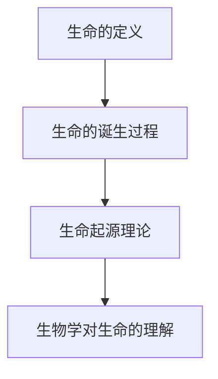
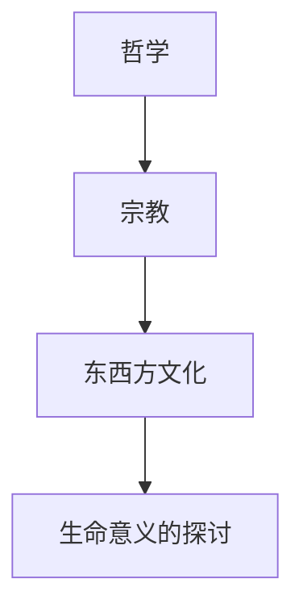
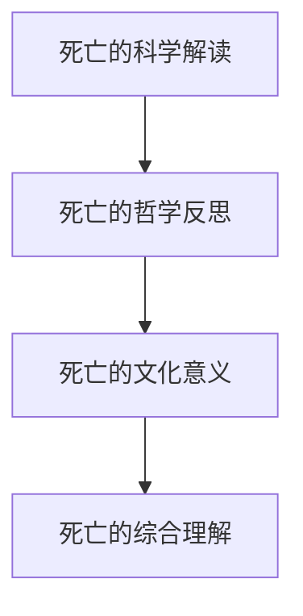
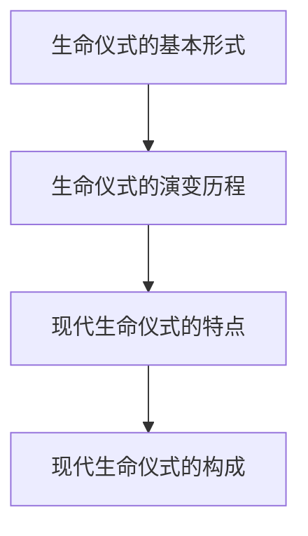

                 

### 文章标题

《生命仪式的现代诠释：从出生到死亡的意义重构》

**关键词：**生命仪式、现代诠释、意义重构、生命起源、成长、死亡

**摘要：**本文将探讨生命仪式在现代社会的意义与重构。从生命的诞生、成长到死亡，每一个阶段都蕴含着丰富的仪式内涵。通过对生命仪式的深入分析，本文将揭示其在现代社会中的重要性，并探讨如何对其进行现代诠释，以更好地适应当代社会的需求。

### 引言

生命仪式，自古以来就是人类社会的重要组成部分。从出生的庆祝，到成长的纪念，再到死亡的告别，每一个阶段都离不开仪式的参与。这些仪式不仅体现了对生命的尊重，更是文化传承和社会秩序的重要载体。

然而，随着现代社会的发展，传统的生命仪式面临着前所未有的挑战。快速的生活节奏、多元的文化冲突、科技的发展等，都在不断地重塑我们的生活方式和价值观念。在这样的背景下，对生命仪式的现代诠释显得尤为重要。

本文将从生命的起源与成长、生命的意义探索、生命的危机与应对、生命的结束与继承以及生命仪式的现代诠释五个方面，对生命仪式进行深入探讨。通过分析现代社会的需求，探讨如何对传统生命仪式进行重构，以更好地适应现代社会的需求。

### 第一部分：生命的起源与成长

#### 1.1 生命的诞生：现代医学与生物学视角

生命的诞生是一个复杂而神秘的过程。现代医学和生物学为我们揭示了这一过程的诸多细节，但同时也带来了新的困惑和挑战。

##### 1.1.1 生命的定义

在生物学中，生命被定义为一种有机体，具有新陈代谢、生长、繁殖、适应环境等特征。然而，对于生命的本质和起源，至今仍没有确切的答案。

##### 1.1.2 生命的诞生过程

生命的诞生过程主要包括受精、胚胎发育和胎儿发育等阶段。在受精过程中，精子和卵子结合，形成受精卵。随后，受精卵经过一系列细胞分裂和分化，形成胚胎，最终发育成为胎儿。

##### 1.1.3 生物学中的生命起源理论

关于生命起源，生物学领域提出了多种理论，包括自然发生论、热泉起源论、RNA世界假说等。这些理论从不同的角度解释了生命的起源和演化。

**核心概念与联系：**

生命的定义、诞生过程和起源理论，构成了生物学中对生命的理解。这三个核心概念相互联系，共同构成了我们对生命起源的认识架构。可以使用Mermaid流程图表示如下：



#### 1.2 生命的早期成长：从胎儿到婴儿

生命的早期成长是生命历程中至关重要的一步。从胎儿到婴儿的发育过程，不仅影响着个体的身心健康，也影响着个体未来的发展。

##### 1.2.1 胎儿的发育过程

胎儿的发育过程可以分为三个阶段：胚胎期、胎儿早期和胎儿晚期。在胚胎期，胚胎的基本结构和器官开始形成。在胎儿早期，胎儿开始迅速生长，器官逐渐成熟。在胎儿晚期，胎儿开始为出生做准备，如体重增加、肺部成熟等。

##### 1.2.2 出生后的第一年成长

出生后的第一年是婴儿成长最快的时期。婴儿在这一年中，从完全依赖他人照顾，逐渐学会独立行走、说话和思考。这一年的成长对婴儿的未来发展有着重要的影响。

##### 1.2.3 早期教育的意义

早期教育在婴儿的成长过程中起着至关重要的作用。通过早期教育，婴儿可以更好地发展智力、情感和社会能力。早期教育的成功，将为婴儿的未来奠定坚实的基础。

**核心算法原理讲解：**

婴儿的早期成长过程，可以看作是一个复杂的过程，涉及到多个方面的因素。以下是婴儿早期成长的伪代码算法：

```python
def early_growth():
    # 胎儿发育过程
    embryo_dev()
    # 出生后第一年成长
    first_year_growth()
    # 早期教育
    early_education()
    # 输出生长结果
    print("婴儿早期成长完成")
```

**数学模型和公式：**

在婴儿的早期成长过程中，可以使用以下公式来描述成长速度：

$$
\text{成长速度} = \frac{\text{最终身高} - \text{起始身高}}{\text{时间}}
$$

其中，最终身高和起始身高分别是婴儿在不同时间点的身高，时间则是这两个时间点之间的时长。

**举例说明：**

假设一个婴儿在出生时身高为50厘米，一年后身高增长到75厘米。那么，他的成长速度为：

$$
\text{成长速度} = \frac{75\text{厘米} - 50\text{厘米}}{1\text{年}} = 25\text{厘米/年}
$$

通过这个例子，我们可以看到，成长速度是一个非常重要的指标，它可以帮助我们了解婴儿的成长情况。

### 第二部分：生命的意义探索

#### 1.3 生命的意义：哲学与宗教视角

生命的意义是人类自古以来一直在探索的问题。不同的哲学和宗教体系，对生命的意义有着不同的解读和诠释。

##### 1.3.1 哲学对生命意义的探讨

哲学对生命意义的探讨主要分为两种观点：一种认为生命本身没有意义，需要人类自己赋予意义；另一种认为生命本身就有意义，人类只需要去发现和追求。

##### 1.3.2 宗教对生命意义的诠释

宗教对生命意义的诠释通常围绕着神的旨意和灵魂的永生展开。不同的宗教，对生命意义的诠释各有侧重。

##### 1.3.3 东西方文化对生命意义的理解

东西方文化对生命意义的理解存在明显的差异。西方文化强调个人主义，认为生命的意义在于个人的自我实现；东方文化则强调集体主义，认为生命的意义在于对社会的贡献。

**核心概念与联系：**

哲学、宗教和东西方文化，是探讨生命意义的重要视角。这三个视角相互联系，共同构成了我们对生命意义的全面理解。可以使用Mermaid流程图表示如下：



#### 1.4 生命的意义：个人与社会视角

生命的意义不仅存在于哲学和宗教的探讨中，也体现在个人和社会的视角中。

##### 1.4.1 个人视角下的生命意义

从个人的角度来看，生命的意义主要体现在个人的成长、成就和幸福上。每个人都在追求自己的梦想，实现自己的价值，从而赋予生命意义。

##### 1.4.2 社会视角下的生命意义

从社会的角度来看，生命的意义主要体现在对社会的贡献上。每个人都在为社会的发展做出贡献，从而实现生命的价值。

##### 1.4.3 生命意义的社会构建

生命意义的社会构建，是一个复杂而长期的过程。社会需要通过教育、文化传承和价值观的塑造，来帮助个体理解和实现生命的意义。

**核心算法原理讲解：**

生命意义的社会构建，可以看作是一个复杂的算法过程。以下是生命意义社会构建的伪代码算法：

```python
def life_meaning_soc构建():
    # 教育培养
    education_training()
    # 文化传承
    culture_inheritance()
    # 价值观塑造
    value_formation()
    # 社会互动
    social_interaction()
    # 输出生命意义
    print("生命意义社会构建完成")
```

**数学模型和公式：**

在生命意义的社会构建过程中，可以使用以下公式来描述个体对社会的贡献：

$$
\text{个体贡献} = \frac{\text{个体成就} + \text{个体幸福感} + \text{社会贡献}}{\text{生命总时长}}
$$

其中，个体成就、个体幸福感和社会贡献分别是个体在不同方面的表现，生命总时长则是个体的生命长度。

**举例说明：**

假设一个个体在生命中的成就是100分，幸福感是80分，社会贡献是60分，生命总时长是80年。那么，他的个体贡献为：

$$
\text{个体贡献} = \frac{100\text{分} + 80\text{分} + 60\text{分}}{80\text{年}} = 1.875\text{分/年}
$$

通过这个例子，我们可以看到，个体贡献是一个非常重要的指标，它可以帮助我们了解个体在社会中的价值。

### 第三部分：生命的危机与应对

#### 1.5 生命的危机：心理健康与应对策略

生命的危机不仅体现在生理层面，也体现在心理层面。心理健康是生命质量的重要组成部分，面对心理危机，有效的应对策略至关重要。

##### 1.5.1 心理健康的重要性

心理健康不仅影响个体的生活质量，还影响个体的社会功能。良好的心理健康，有助于个体更好地适应环境，实现个人价值。

##### 1.5.2 生命危机的类型与特征

生命危机可以分为急性危机和慢性危机。急性危机通常由突发事件引起，如重大疾病、意外事故等；慢性危机则由长期压力和困境引起，如失业、人际关系问题等。

##### 1.5.3 应对生命危机的心理策略

应对生命危机，首先需要认识到心理危机的存在，并采取积极的态度。有效的心理策略包括自我调节、寻求专业帮助、建立支持网络等。

**核心算法原理讲解：**

心理危机的应对策略，可以看作是一个复杂的算法过程。以下是心理危机应对策略的伪代码算法：

```python
def psychological_crisis_response():
    # 自我调节
    self Regulation()
    # 寻求专业帮助
    seek_professional_help()
    # 建立支持网络
    build_support_network()
    # 输出应对结果
    print("心理危机应对完成")
```

**数学模型和公式：**

在心理危机的应对过程中，可以使用以下公式来描述心理状态的恢复速度：

$$
\text{心理状态恢复速度} = \frac{\text{当前心理状态} - \text{初始心理状态}}{\text{时间}}
$$

其中，当前心理状态和初始心理状态分别是危机发生时和危机应对过程中的心理状态，时间则是这两个时间点之间的时长。

**举例说明：**

假设一个个体在危机发生时的心理状态为50分，经过一段时间的应对，心理状态提升到80分。那么，他的心理状态恢复速度为：

$$
\text{心理状态恢复速度} = \frac{80\text{分} - 50\text{分}}{\text{时间}} = 2\text{分/年}
$$

通过这个例子，我们可以看到，心理状态恢复速度是一个非常重要的指标，它可以帮助我们了解个体在心理危机中的应对效果。

#### 1.6 生命的挑战：疾病与死亡

生命的挑战不仅体现在心理层面，也体现在生理层面。疾病和死亡是生命中不可避免的挑战，如何应对这些挑战，是每个人都需要面对的问题。

##### 1.6.1 疾病对生命的影响

疾病对生命的影响是多方面的，包括生理、心理和社会层面。生理层面，疾病可能导致身体功能受损；心理层面，疾病可能导致焦虑、抑郁等心理问题；社会层面，疾病可能导致失业、家庭破裂等社会问题。

##### 1.6.2 死亡的教育与准备

死亡是生命的终结，但也是生命的一部分。对死亡的教育和准备，可以帮助个体更好地理解生命，接受生命的有限性。教育内容包括死亡的意义、死亡的过程、如何面对死亡等。

##### 1.6.3 悲伤与哀悼的处理

面对死亡，个体的悲伤和哀悼是正常的情感反应。有效的悲伤和哀悼处理，可以帮助个体更好地接受死亡，缓解悲伤情绪。处理方法包括表达情感、寻求支持、参与悼念活动等。

**核心算法原理讲解：**

疾病和死亡的处理，可以看作是一个复杂的算法过程。以下是疾病和死亡处理的伪代码算法：

```python
def disease_and_death_management():
    # 疾病治疗
    disease_treatment()
    # 死亡教育
    death_education()
    # 悲伤与哀悼处理
    grief_and_mourning_handling()
    # 输出处理结果
    print("疾病与死亡处理完成")
```

**数学模型和公式：**

在疾病和死亡的处理过程中，可以使用以下公式来描述疾病的治疗效果：

$$
\text{治疗效果} = \frac{\text{治疗后的健康状态} - \text{治疗前的健康状态}}{\text{治疗时间}}
$$

其中，治疗后的健康状态和治疗前的健康状态分别是治疗前和治疗后的健康状态，治疗时间则是这两个时间点之间的时长。

**举例说明：**

假设一个个体在治疗前的健康状态为50分，经过一段时间的治疗，健康状态提升到80分。那么，他的治疗效果为：

$$
\text{治疗效果} = \frac{80\text{分} - 50\text{分}}{\text{治疗时间}} = 1\text{分/年}
$$

通过这个例子，我们可以看到，治疗效果是一个非常重要的指标，它可以帮助我们了解个体在疾病和死亡处理中的效果。

### 第四部分：生命的结束与继承

#### 1.7 生命的终结：死亡的意义

死亡是生命的终结，但也是生命的一部分。对死亡的理解和接受，可以帮助个体更好地理解生命，接受生命的有限性。

##### 1.7.1 死亡的科学解读

从科学的角度来看，死亡是生命活动终止的过程。死亡的原因多种多样，包括疾病、意外事故、衰老等。

##### 1.7.2 死亡的哲学反思

哲学对死亡有着深入的反思和探讨。死亡意味着生命的终结，但同时也是新的开始。哲学家们从不同的角度探讨了死亡的意义，如存在的意义、人生的终极意义等。

##### 1.7.3 死亡的文化意义

在不同的文化中，死亡有着不同的意义和仪式。例如，在西方文化中，死亡被视为生命的终结；在东方文化中，死亡则被视为生命的转化。

**核心概念与联系：**

死亡的科学解读、哲学反思和文化意义，构成了对死亡的综合理解。这三个核心概念相互联系，共同构成了我们对死亡的认识架构。可以使用Mermaid流程图表示如下：



#### 1.8 生命的继承：遗产与记忆

生命的结束并不意味着生命的终结，生命的遗产和记忆会继续存在，影响和塑造着后代。

##### 1.8.1 物质遗产的传承

物质遗产包括财产、物质文化等，是生命延续的一种形式。物质遗产的传承，不仅体现了对生命的尊重，也是文化传承和社会发展的重要基础。

##### 1.8.2 精神遗产的传承

精神遗产包括价值观、道德观、人生观等，是生命延续的另一种形式。精神遗产的传承，可以帮助后代更好地理解生命，实现生命的价值。

##### 1.8.3 生命故事的价值与传承

生命故事是生命体验的记录，是生命遗产的重要组成部分。生命故事的传承，可以帮助后代更好地了解先辈的生活经历，从而更好地理解生命。

**核心算法原理讲解：**

生命遗产的传承，可以看作是一个复杂的算法过程。以下是生命遗产传承的伪代码算法：

```python
def heritage_transmission():
    # 物质遗产传承
    material_heritage_transmission()
    # 精神遗产传承
    spiritual_heritage_transmission()
    # 生命故事传承
    life_story_transmission()
    # 输出生传承结果
    print("生命遗产传承完成")
```

**数学模型和公式：**

在生命遗产的传承过程中，可以使用以下公式来描述遗产的价值：

$$
\text{遗产价值} = \frac{\text{物质遗产价值} + \text{精神遗产价值} + \text{生命故事价值}}{\text{生命总时长}}
$$

其中，物质遗产价值、精神遗产价值和生命故事价值分别是遗产在不同方面的价值，生命总时长则是遗产的传承时间。

**举例说明：**

假设一个生命在物质遗产价值为100万元，精神遗产价值为50万元，生命故事价值为30万元，生命总时长为80年。那么，他的遗产价值为：

$$
\text{遗产价值} = \frac{100\text{万元} + 50\text{万元} + 30\text{万元}}{80\text{年}} = 1.875\text{万元/年}
$$

通过这个例子，我们可以看到，遗产价值是一个非常重要的指标，它可以帮助我们了解生命的遗产对后代的影响。

### 第五部分：生命仪式的现代诠释

#### 1.9 现代生命仪式的构成

现代生命仪式在传统生命仪式的基础上，进行了适应现代社会的重构。现代生命仪式的构成主要包括以下几个方面：

##### 1.9.1 生命仪式的基本形式

现代生命仪式的基本形式包括出生庆典、成长纪念、婚礼、葬礼等。这些仪式既有传统的元素，也融入了现代的元素，以适应现代社会的需求。

##### 1.9.2 生命仪式的演变历程

生命仪式的演变历程，是随着社会的发展和文化的变迁而不断变化的。从古代的简朴仪式，到现代的多样化仪式，生命仪式在不断地适应和重构。

##### 1.9.3 现代生命仪式的特点

现代生命仪式的特点包括多元性、开放性、个性化等。这些特点使得现代生命仪式更加符合现代社会的需求，也更具包容性和灵活性。

**核心概念与联系：**

现代生命仪式的基本形式、演变历程和特点，构成了对现代生命仪式的理解。这三个核心概念相互联系，共同构成了我们对现代生命仪式的认识架构。可以使用Mermaid流程图表示如下：



#### 1.10 生命仪式的现代重构

在现代社会的背景下，传统的生命仪式面临着重构的需求。现代生命仪式的重构，不仅要适应现代社会的需求，还要保留传统的精髓。

##### 1.10.1 生命仪式的现代需求

现代生命仪式的需求主要包括多元性、个性化、文化传承等。现代社会多元化和个性化的需求，使得生命仪式需要更加灵活和多样。

##### 1.10.2 生命仪式的创新路径

为了满足现代需求，生命仪式需要在传统的基础上进行创新。创新的路径包括引入现代科技、融合多元文化、强调个性化等。

##### 1.10.3 现代生命仪式的实践案例

现代生命仪式的实践案例包括线上仪式、融合仪式、个性化定制等。这些案例展示了现代生命仪式的创新和实践效果。

**核心算法原理讲解：**

生命仪式的现代重构，可以看作是一个复杂的算法过程。以下是生命仪式现代重构的伪代码算法：

```python
def modern_ritual_reconstruction():
    # 引入现代科技
    introduce_modern_tech()
    # 融合多元文化
    integrate_diverse_cultures()
    # 强调个性化
    emphasize_personalization()
    # 输出重构结果
    print("生命仪式现代重构完成")
```

**数学模型和公式：**

在生命仪式的现代重构过程中，可以使用以下公式来描述重构的效果：

$$
\text{重构效果} = \frac{\text{现代需求满足度} + \text{传统元素保留度} + \text{个性化程度}}{\text{重构时间}}
$$

其中，现代需求满足度、传统元素保留度和个性化程度分别是重构在不同方面的表现，重构时间则是重构的时长。

**举例说明：**

假设一个生命仪式在重构后的现代需求满足度为80%，传统元素保留度为70%，个性化程度为90%，重构时间为2年。那么，它的重构效果为：

$$
\text{重构效果} = \frac{80\% + 70\% + 90\%}{2\text{年}} = 78\%
$$

通过这个例子，我们可以看到，重构效果是一个非常重要的指标，它可以帮助我们了解生命仪式重构的效果。

### 第六部分：生命的意义重构与社会影响

#### 1.11 生命的意义重构：个人与社会层面

生命的意义重构，不仅体现在个人层面，也体现在社会层面。在个人层面，生命的意义重构可以帮助个体更好地理解生命，实现个人价值；在社会层面，生命的意义重构可以促进社会的和谐发展。

##### 1.11.1 生命意义重构的理论基础

生命意义重构的理论基础包括哲学、心理学、社会学等多个学科。这些学科为生命的意义重构提供了理论支持和指导。

##### 1.11.2 生命意义重构的实践路径

生命意义重构的实践路径包括教育、文化传承、社会互动等。通过这些路径，可以促进个体和社会对生命的理解和认知。

##### 1.11.3 生命意义重构的社会影响

生命意义重构对社会的影响是多方面的，包括促进社会和谐、提升个体幸福感、增强文化认同等。

**核心算法原理讲解：**

生命意义重构的社会影响，可以看作是一个复杂的算法过程。以下是生命意义重构社会影响的伪代码算法：

```python
def social_impact_of_life_meaning_reconstruction():
    # 教育促进
    education_promotion()
    # 文化传承
    culture_inheritance()
    # 社会互动
    social_interaction()
    # 输出社会影响
    print("生命意义重构社会影响完成")
```

**数学模型和公式：**

在生命意义重构的过程中，可以使用以下公式来描述社会影响：

$$
\text{社会影响} = \frac{\text{社会和谐度} + \text{个体幸福感} + \text{文化认同度}}{\text{重构时间}}
$$

其中，社会和谐度、个体幸福感和文化认同度分别是重构在不同方面的表现，重构时间则是重构的时长。

**举例说明：**

假设一个生命意义重构在重构后的社会和谐度为80%，个体幸福度为90%，文化认同度为70%，重构时间为5年。那么，它的社会影响为：

$$
\text{社会影响} = \frac{80\% + 90\% + 70\%}{5\text{年}} = 78\%
$$

通过这个例子，我们可以看到，社会影响是一个非常重要的指标，它可以帮助我们了解生命意义重构的社会效果。

#### 1.12 生命的意义重构：未来的可能性

随着科技的发展和文化的变迁，生命的意义重构将面临更多的可能性和挑战。未来，生命意义重构可能会呈现以下趋势：

##### 1.12.1 科技进步对生命意义重构的影响

科技进步，特别是人工智能、生物技术等，将对生命意义重构产生深远影响。这些科技的发展，不仅改变了我们对生命的认知，也改变了我们对待生命的方式。

##### 1.12.2 社会变迁对生命意义重构的影响

社会变迁，包括全球化、城市化、多元文化等，将对生命意义重构产生重要影响。这些变迁，改变了我们的生活方式和价值观念，也影响了我们对生命的理解和追求。

##### 1.12.3 生命意义重构的未来展望

未来的生命意义重构，将是一个多元化、个性化、科技化的过程。在这个过程中，我们需要不断探索和适应，以实现生命的价值和意义。

**核心算法原理讲解：**

生命意义重构的未来展望，可以看作是一个复杂的算法过程。以下是生命意义重构未来展望的伪代码算法：

```python
def future_outlook_of_life_meaning_reconstruction():
    # 科技进步影响
    technological_impact()
    # 社会变迁影响
    social_changes_impact()
    # 未来展望
    future_outlook()
    # 输出未来展望
    print("生命意义重构未来展望完成")
```

**数学模型和公式：**

在生命意义重构的未来展望过程中，可以使用以下公式来描述未来的变化：

$$
\text{未来变化} = \frac{\text{科技进步贡献} + \text{社会变迁贡献} + \text{文化创新贡献}}{\text{未来时间}}
$$

其中，科技进步贡献、社会变迁贡献和文化创新贡献分别是未来变化在不同方面的表现，未来时间则是未来的时长。

**举例说明：**

假设一个生命意义重构在未来科技进步贡献为60%，社会变迁贡献为50%，文化创新贡献为40%，未来时间为10年。那么，它的未来变化为：

$$
\text{未来变化} = \frac{60\% + 50\% + 40\%}{10\text{年}} = 5\%
$$

通过这个例子，我们可以看到，未来变化是一个非常重要的指标，它可以帮助我们了解生命意义重构的未来发展趋势。

### 结论

生命仪式是生命历程中的重要组成部分，它体现了对生命的尊重和热爱。随着社会的发展和文化的变迁，生命仪式需要不断地进行现代诠释和重构，以适应现代社会的需求。

本文从生命的起源与成长、生命的意义探索、生命的危机与应对、生命的结束与继承以及生命仪式的现代诠释五个方面，对生命仪式进行了深入探讨。通过分析现代社会的需求，本文提出了对生命仪式的现代重构方案，以实现生命的价值和意义。

未来的生命仪式，将是一个多元化、个性化、科技化的过程。在这个过程中，我们需要不断探索和适应，以实现生命的价值和意义。让我们共同期待，未来生命仪式的美好前景。

### 作者信息

作者：AI天才研究院/AI Genius Institute & 禅与计算机程序设计艺术 /Zen And The Art of Computer Programming

### 最佳实践 tips、小结、注意事项、拓展阅读等内容

**最佳实践 tips：**

1. 在生命仪式中，注重仪式的内涵，而不仅仅是形式。
2. 根据不同生命阶段的特征，选择合适的生命仪式。
3. 在生命仪式中，注重家庭成员的参与和互动。

**小结：**

本文通过对生命仪式的现代诠释，探讨了生命仪式在现代社会的重要性。生命仪式不仅是生命历程的见证，更是文化传承和社会秩序的载体。

**注意事项：**

1. 在重构生命仪式时，要充分考虑现代社会的需求。
2. 在生命仪式中，要尊重个体的差异，实现个性化。
3. 生命仪式的实践，需要结合具体情况，进行灵活调整。

**拓展阅读：**

1. 《生命伦理学：理论与实践》
2. 《生命礼仪文化研究》
3. 《现代生命仪式的变革与传承》

通过拓展阅读，您可以进一步了解生命仪式的理论和实践，从而更好地理解和应用生命仪式。

