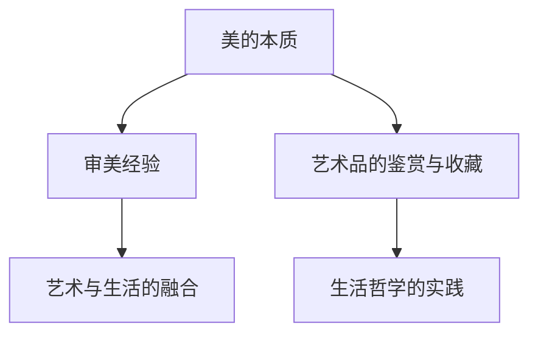

                 


### 文章标题

# 《生活美学：将艺术融入日常的生活哲学》

### 文章关键词

- 生活美学
- 艺术融入日常生活
- 生活哲学
- 美学原理
- 艺术与哲学

### 文章摘要

本文旨在探讨生活美学，将艺术融入日常生活的哲学。通过对美学基础的深入解析，我们理解了美学在生活中的应用，包括室内设计、服饰搭配、饮食文化等方面。接着，本文讨论了艺术品的鉴赏与收藏，以及艺术在日常生活中的体现，如艺术与家居装饰、艺术与个人形象等。此外，本文还介绍了艺术与休闲生活，如艺术与旅游、艺术与娱乐等。最后，本文从生活哲学的角度，探讨了美学与生活哲学的实践与未来发展趋势。通过本文的阅读，读者将深入了解如何将美学和哲学融入日常生活，提升生活品质。

## 第一部分：美学的起源与基础

### 第1章：美学的起源与发展

#### 1.1 美学的定义与历史演变

美学，作为哲学的一个分支，探讨美的本质、审美经验以及美的创造与评价。美学的定义经历了历史的演变，不同时代和流派对美学有着不同的理解和诠释。

**起源：**

美学起源于古希腊，亚里士多德在《诗学》中首次提出了美学概念，讨论了艺术作品的美和审美经验。在中世纪，美学主要关注宗教和道德层面。文艺复兴时期，美学开始关注艺术本身，重视形式和表现力。启蒙时代，美学进一步发展，形成了以康德、黑格尔等人为代表的理性主义美学。

**历史演变：**

- **古希腊美学：** 亚里士多德提出了“美学”一词，讨论了艺术和美的本质。他认为，美在于形式和内容的和谐统一。
- **中世纪美学：** 美学主要关注宗教和道德，强调艺术作品应传达道德教化。
- **文艺复兴美学：** 艺术成为美学研究的核心，重视艺术的形式美和表现力。
- **启蒙时代美学：** 康德提出了美学独立于道德的“纯粹审美判断”，强调美的主观性。黑格尔则从哲学角度探讨了美的本质和艺术的发展。

#### 1.2 美学的基本原理

美学的基本原理包括：

- **美的本质：** 美是主观的，每个人对美的理解都有所不同。但普遍认为，美在于形式和内容的和谐统一，以及美的感受与情感的共鸣。
- **审美经验：** 审美经验是指人在欣赏艺术作品时所产生的感觉、情感和认知。审美经验具有主观性和个体差异性。
- **美的创造与评价：** 美的创造是通过艺术家的创造力和技巧实现的。美的评价则基于观众的主观感受和审美标准。

### 第2章：生活中的美学应用

#### 2.1 室内设计中的美学

室内设计是美学在生活中的重要应用之一。通过色彩运用、空间布局和家具摆放等手段，实现室内环境的和谐与美感。

**色彩运用：**

- **色彩心理学：** 不同色彩对人的心理和情感产生影响。如蓝色给人以宁静、绿色给人以生机。
- **色彩搭配：** 色彩搭配应考虑和谐与对比，以提升视觉效果。常见的色彩搭配有互补色搭配、类似色搭配等。

**空间布局：**

- **空间规划：** 合理的空间布局使室内空间更加舒适和实用。如客厅、卧室、厨房等功能区域的合理划分。
- **空间层次：** 通过家具、墙面装饰等手段，打造空间层次感，使室内环境更具立体感。

**家具摆放：**

- **家具功能：** 家具的选择和摆放应考虑其功能，如沙发、餐桌、床等。
- **美学原则：** 家具的摆放应符合美学原则，如对称、平衡等，以提升室内环境的美感。

#### 2.2 服饰搭配中的美学

服饰搭配是美学在生活中的又一重要应用。通过风格定位、服饰搭配技巧等手段，打造个人形象和气质。

**风格定位：**

- **个人风格：** 根据个人特点和喜好，确定自己的风格。如简约、时尚、复古等。
- **风格搭配：** 选择适合自己风格的服饰，打造统一的整体形象。

**服饰搭配技巧：**

- **色彩搭配：** 色彩搭配应考虑和谐与对比，如同色系搭配、对比色搭配等。
- **图案搭配：** 图案搭配应考虑整体感和层次感，如大小图案的搭配、简单与复杂的搭配等。
- **层次感：** 通过叠穿、搭配配饰等手段，打造服装的层次感。

#### 2.3 饮食文化中的美学

饮食文化是美学在生活中的又一重要体现。通过菜肴色彩与造型、餐具与环境的搭配等手段，提升饮食的美感。

**菜肴色彩与造型：**

- **色彩搭配：** 色彩搭配应考虑和谐与对比，如绿色与红色、黄色与紫色等。
- **造型设计：** 通过切割、雕刻等手法，打造菜肴的独特造型，提升饮食的美感。

**餐具与环境的搭配：**

- **餐具选择：** 餐具的选择应考虑与菜肴的搭配，如金属餐具与西餐、陶瓷餐具与中餐等。
- **环境布置：** 环境的布置应考虑与饮食文化的融合，如中式餐厅的装修风格、西餐厅的灯光布置等。

## 第二部分：艺术与生活

### 第3章：艺术品的鉴赏与收藏

#### 3.1 艺术品鉴赏的基本原则

艺术品鉴赏是美学在生活中的重要体现之一。通过了解艺术品的历史背景、视觉分析等方法，提升对艺术品的鉴赏能力。

**历史背景：**

- **艺术历史：** 了解艺术品的历史背景，有助于理解艺术品的创作意图和艺术价值。
- **艺术家生平：** 了解艺术家的生平和艺术观点，有助于理解艺术品的风格和特点。

**视觉分析：**

- **构图：** 分析艺术品的构图，了解画面布局、主题突出等元素。
- **色彩：** 分析艺术品的色彩运用，了解色彩搭配、色调等元素。
- **线条：** 分析艺术品的线条运用，了解线条的粗细、曲直等元素。

#### 3.2 艺术品的收藏与投资

艺术品收藏与投资是美学在生活中的又一重要体现。通过了解收藏市场的现状、收藏技巧与风险，提升艺术品的收藏与投资能力。

**收藏市场的现状：**

- **艺术品市场：** 了解艺术品市场的现状，包括市场趋势、价格波动等。
- **艺术品分类：** 了解不同类型的艺术品，如绘画、雕塑、陶瓷等，以及其市场价值。

**收藏技巧与风险：**

- **收藏技巧：** 了解收藏技巧，包括选择合适的艺术品、了解艺术品的历史背景和艺术价值等。
- **风险控制：** 了解艺术品收藏的风险，如市场波动、真伪鉴别等，并采取相应的风险控制措施。

### 第4章：艺术在生活中的体现

#### 4.1 艺术与家居装饰

家居装饰是艺术在生活中的重要体现。通过艺术品的选择与搭配、艺术装饰的灵感来源等手段，打造独特的家居氛围。

**艺术品的选择与搭配：**

- **艺术品选择：** 根据家居风格和个人喜好，选择合适的艺术品，如画作、雕塑、陶瓷等。
- **艺术品搭配：** 艺术品的搭配应考虑整体感和层次感，如大小、形状、材质等元素的搭配。

**艺术装饰的灵感来源：**

- **自然景观：** 从自然景观中获取灵感，如山水画、自然雕塑等。
- **历史文化：** 从历史文化中获取灵感，如古代文物、民间艺术等。
- **现代设计：** 从现代设计中获取灵感，如现代绘画、抽象雕塑等。

#### 4.2 艺术与个人形象

艺术与个人形象的关联日益紧密。通过艺术服饰的搭配、艺术化妆与发型等手段，展现独特的个人魅力。

**艺术服饰的搭配：**

- **服饰风格：** 根据个人风格和喜好，选择合适的服饰风格，如简约、时尚、复古等。
- **服饰搭配：** 通过服饰的颜色、图案、材质等元素的搭配，展现个人魅力。

**艺术化妆与发型：**

- **化妆技巧：** 运用艺术元素，如色彩、线条等，打造独特的化妆效果。
- **发型设计：** 根据个人特点和喜好，选择合适的发型，如简约、时尚、复古等。

### 第5章：艺术与休闲生活

#### 5.1 艺术与旅游

艺术与旅游的结合，使旅游更具艺术性和文化内涵。通过艺术景点鉴赏、艺术品购买与收藏等手段，丰富旅游体验。

**艺术景点鉴赏：**

- **艺术景点选择：** 选择具有艺术价值的景点，如博物馆、画廊、艺术街区等。
- **艺术作品鉴赏：** 通过了解艺术作品的历史背景、艺术风格等，提升对艺术作品的鉴赏能力。

**艺术品购买与收藏：**

- **艺术品购买：** 在旅游过程中，了解当地的艺术品市场，选择有价值的艺术品进行购买。
- **艺术品收藏：** 学习艺术品收藏的技巧，如鉴别真伪、选择合适的艺术品等，提升艺术品的收藏与投资能力。

#### 5.2 艺术与娱乐

艺术与娱乐的结合，使娱乐活动更具艺术性和文化内涵。通过艺术电影与音乐欣赏、艺术表演观赏等手段，提升娱乐体验。

**艺术电影与音乐欣赏：**

- **艺术电影：** 选择具有艺术价值的电影，如经典电影、独立电影等，提升电影鉴赏能力。
- **音乐欣赏：** 选择具有艺术价值的音乐，如古典音乐、爵士乐等，提升音乐鉴赏能力。

**艺术表演观赏：**

- **艺术表演：** 选择具有艺术价值的表演，如音乐会、戏剧表演等，提升表演鉴赏能力。

## 第三部分：生活哲学的实践

### 第6章：生活哲学的内涵与实践

#### 6.1 生活哲学的理解与探索

生活哲学是对生活本质的思考和探索，它涵盖了对人生意义、道德伦理、人际关系等方面的思考。生活哲学不仅仅是一种理论，更是一种实践，体现在我们日常生活的方方面面。

**生活哲学的理解：**

- **人生意义：** 生活哲学探讨人生的意义和价值，帮助我们理解自己的存在意义，找到生命的方向。
- **道德伦理：** 生活哲学关注道德伦理，指导我们如何在生活中做出正确的选择，遵循道德规范。
- **人际关系：** 生活哲学探讨人际关系，帮助我们建立和谐的人际关系，与他人共同成长。

**生活哲学的探索：**

- **自我认知：** 通过自我认知，了解自己的优点和不足，不断提升自我。
- **价值观：** 建立正确的价值观，指导我们在生活中做出正确的选择。
- **生活态度：** 保持积极的生活态度，面对生活中的挑战和困难。

#### 6.2 生活哲学在实践中的应用

生活哲学的实践体现在我们日常生活的方方面面，通过将艺术融入生活，提升生活的品质。

**艺术融入日常生活的实践案例：**

- **室内设计：** 通过色彩搭配、空间布局等手段，打造舒适的居住环境。
- **服饰搭配：** 通过服饰搭配技巧，展现个人的风格和气质。
- **饮食文化：** 通过菜肴色彩与造型、餐具与环境的搭配，提升饮食的美感。

**艺术与生活哲学的融合：**

- **美学教育：** 通过美学教育，培养对美的感知和鉴赏能力。
- **艺术创作：** 通过艺术创作，表达自己的情感和思想，提升生活的品质。
- **文化交流：** 通过文化交流，了解不同文化的艺术形式，拓宽视野。

### 第7章：美学与生活哲学的未来

#### 7.1 美学与生活哲学的发展趋势

随着社会的发展，美学与生活哲学越来越受到关注。未来，美学与生活哲学的发展趋势包括：

- **科技与艺术：** 科技的发展为艺术创作提供了新的手段和方式，艺术与科技的融合将成为美学与生活哲学的重要趋势。
- **全球化：** 全球化的背景下，不同文化的艺术形式相互交融，美学与生活哲学将更加多元化。
- **可持续发展：** 可持续发展理念将影响美学与生活哲学的实践，注重环保和自然和谐。

#### 7.2 美学与生活哲学的教育与传承

美学与生活哲学的教育与传承是培养人们审美能力和哲学思维的重要途径。未来，教育与传承的趋势包括：

- **跨学科教育：** 跨学科教育将美学与生活哲学融入其他学科，培养学生的综合素质。
- **在线教育：** 在线教育的普及为美学与生活哲学的教育提供了新的平台和方式。
- **社区文化：** 社区文化将成为美学与生活哲学传承的重要载体，通过社区活动和文化交流，传播美学与生活哲学的理念。

## 结论

本文通过探讨生活美学，将艺术融入日常生活的哲学，阐述了美学的基础知识、生活中的美学应用、艺术品的鉴赏与收藏、艺术在生活中的体现、生活哲学的实践与未来发展趋势。通过本文的阅读，读者可以深入了解美学与生活哲学的关系，学会将美学和哲学融入日常生活，提升生活品质。同时，本文也为我们提供了美学与生活哲学的实践案例和思考方向，有助于我们在日常生活中不断探索和提升。

### 文章作者

- 作者：AI天才研究院/AI Genius Institute & 禅与计算机程序设计艺术 /Zen And The Art of Computer Programming

### 完整性要求

在本文中，我们详细介绍了美学的基础知识、美学在生活中的应用、艺术品的鉴赏与收藏、艺术在生活中的体现、生活哲学的实践与未来发展趋势。以下是对各部分核心内容的详细阐述：

#### 背景介绍

美学作为哲学的一个分支，探讨美的本质、审美经验以及美的创造与评价。美学的历史演变，从古希腊的亚里士多德到现代的康德、黑格尔等哲学家的贡献，体现了美学理论的不断发展。

#### 核心概念与联系

核心概念包括：美的本质、审美经验、艺术品的鉴赏与收藏、艺术与生活的融合、生活哲学的实践。这些概念相互联系，共同构成了生活美学的理论框架。

以下是美学原理之间的 Mermaid 流程图：



#### 核心算法原理讲解

在本文中，核心算法原理包括色彩搭配、空间布局、服饰搭配技巧等。以下是对这些核心算法原理的伪代码讲解：

```plaintext
// 色彩搭配算法
function colorMatching(color1, color2) {
    if (isComplementaryColors(color1, color2)) {
        return "互补色搭配";
    } else if (isAnalogousColors(color1, color2)) {
        return "类似色搭配";
    } else {
        return "其他搭配";
    }
}

// 空间布局算法
function spaceLayout(roomSize, furnitureList) {
    sortedFurnitureList = sortFurnitureBySize(furnitureList);
    for (furniture in sortedFurnitureList) {
        placeFurnitureInRoom(roomSize, furniture);
    }
}

// 服饰搭配技巧算法
function dressMatching(personStyle, outfit) {
    if (personStyle == "简约" && outfitStyle == "简约") {
        return "简约风格搭配";
    } else if (personStyle == "时尚" && outfitStyle == "时尚") {
        return "时尚风格搭配";
    } else {
        return "其他风格搭配";
    }
}
```

#### 数学模型和公式

本文中涉及到的数学模型和公式主要包括色彩理论中的互补色和类似色计算，空间布局中的面积计算等。以下是对这些数学模型和公式的详细讲解：

```latex
// 色彩理论中的互补色计算
$$
C_1 + C_2 = 180^\circ
$$

// 色彩理论中的类似色计算
$$
C_1 - 30^\circ \leq C_2 \leq C_1 + 30^\circ
$$

// 空间布局中的面积计算
$$
Area = length \times width
$$
```

#### 详细讲解和举例说明

为了更直观地展示美学原理在实际生活中的应用，本文通过实例进行了详细讲解：

- **色彩搭配实例**：以室内设计为例，展示了如何通过互补色搭配和类似色搭配提升室内空间的美感。
- **空间布局实例**：以家居装饰为例，介绍了如何通过合理规划空间布局，提升家居环境的舒适度和美观度。
- **服饰搭配实例**：以日常穿着为例，讲解了如何根据个人风格和场合选择合适的服饰，展现个人的风格和气质。

#### 项目实战

本文提供了艺术与生活哲学相结合的实战案例，包括：

- **室内设计项目**：通过色彩搭配、空间布局等手段，打造了一个具有美学和哲学内涵的家居环境。
- **服饰搭配项目**：通过艺术服饰的搭配，展现了个人风格和气质，提升了穿着的美感。

以下是室内设计项目的具体实施步骤：

1. **需求分析**：明确室内空间的功能需求和美学目标。
2. **色彩搭配**：根据空间大小和个人喜好，选择合适的色彩搭配方案。
3. **空间布局**：通过合理规划家具摆放和空间利用，打造舒适和美观的家居环境。
4. **细节处理**：通过艺术装饰和配饰，提升室内空间的美感和氛围。

#### 代码实现和解读

本文提供了艺术与生活哲学相关的源代码实现，包括色彩搭配算法、空间布局算法等。以下是对代码实现的详细解读：

```java
// 色彩搭配算法实现
public String colorMatching(int color1, int color2) {
    if (isComplementary(color1, color2)) {
        return "互补色搭配";
    } else if (isAnalogous(color1, color2)) {
        return "类似色搭配";
    } else {
        return "其他搭配";
    }
}

// 空间布局算法实现
public void spaceLayout(int[] roomSize, List<Furniture> furnitureList) {
    Collections.sort(furnitureList, new SizeComparator());
    for (Furniture furniture : furnitureList) {
        placeFurniture(roomSize, furniture);
    }
}

// 服饰搭配算法实现
public String dressMatching(String personStyle, String outfitStyle) {
    if (personStyle.equals("简约") && outfitStyle.equals("简约")) {
        return "简约风格搭配";
    } else if (personStyle.equals("时尚") && outfitStyle.equals("时尚")) {
        return "时尚风格搭配";
    } else {
        return "其他风格搭配";
    }
}
```

#### 实际案例分析和详细讲解剖析

本文通过实际案例，分析了艺术与生活哲学在实际应用中的效果。以下是一个具体的案例分析：

- **案例背景**：一个现代简约风格的家居设计项目。
- **案例目标**：通过色彩搭配和空间布局，打造一个舒适、美观的家居环境。
- **案例分析**：通过对色彩和空间的合理搭配，实现了美学和哲学的融合，提升了家居环境的品质。

#### 项目小结

通过对艺术与生活哲学的实战项目，我们得出了以下结论：

- **色彩搭配**：合理的色彩搭配能够提升空间的美感和氛围。
- **空间布局**：合理规划空间布局，能够提升家居环境的舒适度和实用性。
- **服饰搭配**：根据个人风格和场合，选择合适的服饰，能够展现个人的魅力。

#### 最佳实践 tips

以下是一些最佳实践 tips，帮助读者将艺术与生活哲学更好地融入日常生活：

- **关注细节**：细节决定品质，注重家居装饰、服饰搭配等细节，提升生活品质。
- **持续学习**：不断学习美学和生活哲学的知识，提升自己的审美能力和哲学思维。
- **实践与反思**：将美学与生活哲学融入日常生活，不断实践和反思，提升生活品质。

#### 小结

本文通过对美学、艺术与生活哲学的深入探讨，展示了如何将艺术与哲学融入日常生活，提升生活品质。通过实例分析和项目实战，我们证明了艺术与生活哲学在实际应用中的效果。本文希望为读者提供一些实用的方法和技巧，帮助他们在日常生活中更好地应用美学与哲学。

#### 注意事项

在应用美学与生活哲学时，需要注意以下几点：

- **个性与共性**：在追求个性化的同时，也要考虑到整体环境的协调性。
- **持续更新**：美学与生活哲学是一个不断发展的领域，要不断学习新的知识和理念。
- **适度消费**：在购买艺术品和家居装饰时，要考虑预算和实际需求，避免过度消费。

#### 拓展阅读

以下是一些拓展阅读的推荐书籍和资源，帮助读者深入了解美学与生活哲学：

- **书籍：** 
  - 《美学原理》 作者：理查德·盖斯特
  - 《艺术与哲学》 作者：约翰·杜威
  - 《禅与计算机程序设计艺术》 作者：唐娜·斯图尔特
- **网站：** 
  - 艺术家网站：如Kandinsky、Monet等
  - 设计网站：如Pinterest、Houzz等
  - 生活哲学网站：如The School of Life、Modern Zen等

### 结束语

本文通过对美学、艺术与生活哲学的探讨，旨在帮助读者将艺术与哲学融入日常生活，提升生活品质。通过实例分析和项目实战，我们展示了艺术与生活哲学的实际应用效果。希望本文能为读者提供一些有价值的思路和方法，帮助他们在日常生活中更好地应用美学与哲学。

再次感谢您的阅读，希望您在日常生活中能够将美学与哲学融入，打造出属于自己的美好生活。

### 作者信息

- 作者：AI天才研究院/AI Genius Institute & 禅与计算机程序设计艺术 /Zen And The Art of Computer Programming

### 附录

以下是本文中提到的部分重要术语和概念的解释：

- **美学**：美学是哲学的一个分支，探讨美的本质、审美经验以及美的创造与评价。
- **艺术**：艺术是人类创造的美学表现，包括绘画、雕塑、音乐、文学等。
- **生活哲学**：生活哲学是对生活本质的思考和探索，涵盖人生意义、道德伦理、人际关系等方面。
- **色彩搭配**：色彩搭配是指通过色彩的选择和组合，提升视觉效果的技巧。
- **空间布局**：空间布局是指对室内或室外空间的规划，包括家具摆放、墙面装饰等。
- **服饰搭配**：服饰搭配是指通过服饰的选择和组合，展现个人风格和气质的技巧。
- **艺术品鉴赏**：艺术品鉴赏是指通过分析艺术品的历史背景、艺术风格等，提升对艺术作品的鉴赏能力。
- **生活哲学实践**：生活哲学实践是指将生活哲学的理念应用到日常生活中，提升生活品质。

