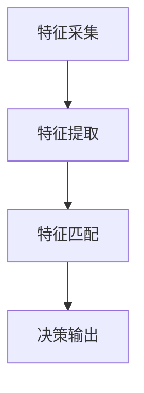

                 


### 引言

#### 1.1 生物识别技术简介

生物识别技术是一种基于人类生理特征或行为特征进行身份验证的技术。这些特征包括指纹、面部、虹膜、声音、手写签名等。生物识别技术具有高准确性、难以伪造和便利性等优点，使其在信息安全、身份验证、医疗健康等多个领域得到广泛应用。

在无人值守银行领域，生物识别技术的应用尤为重要。随着金融科技的快速发展，无人银行、智能柜员机等新型服务模式不断涌现。这些服务模式要求系统具备高效、准确、安全的身份验证能力，以确保客户隐私和交易安全。

#### 1.2 无人值守银行的概念与发展

无人值守银行是指通过自动化设备和系统，实现银行服务自助化和智能化的一种新型服务模式。客户无需与银行工作人员直接接触，即可完成存款、取款、转账、查询等各项操作。

无人值守银行的发展可以追溯到20世纪80年代的自动取款机（ATM）。随着技术的进步，无人银行逐渐融入了人工智能、大数据、物联网等技术，实现了更高程度的自动化和智能化。

#### 1.3 生物识别技术在无人值守银行中的重要性

生物识别技术在无人值守银行中扮演着至关重要的角色。首先，它提供了高效的身份验证手段，确保客户身份的真实性。其次，生物识别技术有助于降低操作成本，提高服务效率。此外，生物识别技术还可以提高交易安全性，防止欺诈行为。

在接下来的章节中，我们将深入探讨生物识别技术的基础知识、应用案例、安全与隐私问题以及未来发展趋势。

### 关键词

生物识别技术、无人值守银行、身份验证、信息安全、交易安全、自动化、智能化、人工智能、大数据、物联网。

### 摘要

本文从生物识别技术的基本概念入手，详细介绍了其在无人值守银行中的应用。通过对生物识别技术在身份验证、交易管理等方面的应用案例进行分析，探讨了生物识别技术在无人值守银行中的重要性及其面临的挑战。同时，本文还提出了生物识别技术在无人值守银行中的未来发展建议。

## 第2章 生物识别技术基础

### 2.1 生物特征识别原理

生物特征识别技术是通过检测和识别人体独特的生理或行为特征来进行身份验证的一种技术。这些特征包括指纹、面部、虹膜、声音、手写签名等。每种生物特征都有其独特的识别原理和应用场景。

**核心概念与联系：**

生物特征识别的流程可以分为以下几个步骤：

1. **特征采集**：通过传感器或其他设备采集生物特征数据，如指纹、面部图像等。
2. **特征提取**：从采集到的生物特征数据中提取出具有识别意义的特征点或特征向量。
3. **特征匹配**：将提取出的特征向量与预先存储在系统中的模板进行匹配，判断是否为同一身份。
4. **决策输出**：根据匹配结果做出决策，如通过或拒绝。

下面是一个简单的 Mermaid 流程图来描述这一过程：



**核心算法原理讲解：**

在生物特征识别中，常用的算法包括特征提取算法、特征匹配算法和分类算法。

- **特征提取算法**：如 Gabor 小波变换、LBP（局部二值模式）、SIFT（尺度不变特征变换）等，用于从生物特征数据中提取具有识别意义的特征点或特征向量。

- **特征匹配算法**：如欧氏距离、余弦相似度等，用于比较两个特征向量之间的相似度。

- **分类算法**：如 K-最近邻（K-NN）、支持向量机（SVM）、神经网络等，用于分类和决策。

以下是一个简单的伪代码示例，用于描述一个基于面部识别的算法流程：

```python
def facial_recognition(image):
    # 数据预处理
    preprocessed_image = preprocess_image(image)
    
    # 特征提取
    features = extract_facial_features(preprocessed_image)
    
    # 特征匹配
    match_score = compare_features(features, trained_model)
    
    # 决策
    if match_score > threshold:
        return "Authenticated"
    else:
        return "Not Authenticated"
```

**数学模型和公式讲解：**

在生物特征识别中，常用的数学模型包括特征向量空间中的相似度计算和分类模型。

- **相似度计算**：例如，欧氏距离公式如下：

  $$ d(x, y) = \sqrt{\sum_{i=1}^{n}(x_i - y_i)^2} $$

  其中，\(x\) 和 \(y\) 分别为两个特征向量。

- **分类模型**：例如，支持向量机（SVM）的损失函数：

  $$ J = -\frac{1}{m}\sum_{i=1}^{m}y^{(i)}\log(a^{(l)}_{i}) + (1 - y^{(i)})\log(1 - a^{(l)}_{i}) $$

  其中，\(y^{(i)}\) 为标签，\(a^{(l)}_{i}\) 为预测概率。

  举例说明，假设我们有两个特征向量 \(x_1\) 和 \(x_2\)，其欧氏距离计算如下：

  $$ d(x_1, x_2) = \sqrt{(x_{11} - x_{21})^2 + (x_{12} - x_{22})^2} $$

  假设 \(x_1 = (1, 2)\) 和 \(x_2 = (2, 3)\)，则：

  $$ d(x_1, x_2) = \sqrt{(1 - 2)^2 + (2 - 3)^2} = \sqrt{1 + 1} = \sqrt{2} $$

  这个计算结果表示 \(x_1\) 和 \(x_2\) 之间的距离。

通过上述讲解，我们了解了生物特征识别的基本原理、算法和数学模型。在接下来的章节中，我们将进一步探讨生物识别技术在无人值守银行中的应用。

### 2.2 生物识别技术的实现与挑战

**技术实现流程：**

生物识别技术的实现通常包括以下几个关键步骤：

1. **特征采集**：利用传感器或摄像头等设备采集生物特征数据，如指纹、面部图像等。
2. **预处理**：对采集到的生物特征数据进行预处理，包括去噪、增强、缩放等操作，以提高特征提取的准确性。
3. **特征提取**：从预处理后的数据中提取出具有识别意义的特征点或特征向量。常用的方法有 Gabor 小波变换、LBP（局部二值模式）等。
4. **特征匹配**：将提取出的特征向量与预先存储在数据库中的模板进行匹配，以判断是否为同一身份。常用的匹配算法有欧氏距离、余弦相似度等。
5. **决策输出**：根据匹配结果做出决策，如通过或拒绝。

**技术挑战与解决方案：**

虽然生物识别技术在无人值守银行中具有广泛的应用前景，但在实际应用中仍面临一些挑战。

1. **准确性挑战**：生物特征数据的准确性直接影响识别系统的性能。为了提高准确性，可以采用以下方法：
   - **算法优化**：选择合适的特征提取和匹配算法，如 Gabor 小波变换、LBP 等。
   - **数据增强**：通过增加训练样本数量、使用合成数据等方法，提高模型的泛化能力。

2. **鲁棒性挑战**：生物特征数据容易受到外部环境的影响，如光照变化、姿态变化等。为了提高鲁棒性，可以采取以下措施：
   - **自适应预处理**：根据不同环境条件自动调整预处理参数，如自适应光照校正、姿态校正等。
   - **多模态融合**：将多种生物特征（如指纹、面部、虹膜等）进行融合，以提高系统的鲁棒性。

3. **隐私保护挑战**：生物特征数据具有高度隐私性，如何保护用户隐私成为一大挑战。以下是一些解决方案：
   - **匿名化处理**：在采集和处理生物特征数据时，对数据进行匿名化处理，以保护用户隐私。
   - **加密技术**：使用加密技术对生物特征数据进行加密存储和传输，确保数据安全性。
   - **隐私计算**：采用隐私计算技术，如同态加密、安全多方计算等，在保护用户隐私的前提下进行数据处理。

通过上述解决方案，可以有效地应对生物识别技术在无人值守银行中面临的挑战，提高系统的性能和安全性。

### 第3章 无人值守银行的生物识别应用

#### 3.1 生物识别技术在身份验证中的应用

在无人值守银行中，生物识别技术广泛应用于身份验证，确保客户身份的真实性。以下为生物识别技术在身份验证中的应用场景和实现方式：

**3.1.1 客户身份验证**

**应用场景**：客户在无人银行柜员机或智能终端上办理业务时，需要进行身份验证以确保操作的安全性。

**实现方式**：
1. **指纹识别**：利用指纹识别设备采集客户指纹，将采集到的指纹数据与数据库中的模板进行比对，验证客户身份。
2. **面部识别**：通过摄像头捕捉客户面部图像，利用面部识别算法提取特征点，与数据库中的模板进行匹配。
3. **虹膜识别**：利用虹膜识别设备捕捉客户虹膜图像，提取虹膜特征，与数据库中的模板进行比对。

**案例一**：某银行在智能柜员机中引入面部识别技术，客户只需站在摄像头前，系统即可自动捕捉面部图像并进行身份验证，简化了操作流程，提高了服务效率。

**3.1.2 员工身份验证**

**应用场景**：无人银行员工在进入特定区域或使用内部系统时，需要进行身份验证。

**实现方式**：
1. **指纹识别**：员工通过指纹识别设备验证身份，确保只有授权人员可以进入特定区域。
2. **面部识别**：利用面部识别技术对员工进行身份验证，确保操作的安全性。
3. **智能卡+生物识别**：员工使用智能卡进行初始身份验证，然后通过生物识别技术（如指纹、面部识别）进行二次验证，提高安全性。

**案例二**：某银行在内部系统中引入了智能卡+指纹识别的双重身份验证机制，员工在登录系统时需先刷卡，然后进行指纹识别，确保只有授权员工可以访问内部系统。

#### 3.2 生物识别技术在交易管理中的应用

生物识别技术在无人值守银行的交易管理中也发挥着重要作用，确保交易的安全性和准确性。

**3.2.1 交易授权**

**应用场景**：客户在无人银行柜员机或智能终端上进行取款、转账等操作时，需要进行授权验证。

**实现方式**：
1. **指纹识别**：客户在操作过程中进行指纹识别，验证身份后才能进行交易。
2. **面部识别**：客户在操作过程中进行面部识别，验证身份后才能进行交易。
3. **多模态识别**：结合多种生物识别技术（如指纹、面部识别），提高交易授权的准确性。

**案例三**：某银行在智能柜员机中引入了指纹识别技术，客户在取款时需进行指纹验证，确保交易的安全性。

**3.2.2 交易监控与预警**

**应用场景**：无人银行系统对交易过程进行实时监控，及时发现异常交易并发出预警。

**实现方式**：
1. **行为分析**：利用计算机视觉技术对客户行为进行分析，如检测客户是否异常操作、是否与系统交互异常等。
2. **异常交易检测**：结合历史交易数据和客户行为数据，利用机器学习算法检测异常交易。
3. **预警机制**：当检测到异常交易时，系统会自动发出预警，通知银行工作人员进行干预。

**案例四**：某银行在无人银行系统中引入了行为分析技术，当检测到客户在取款过程中有异常行为时，系统会自动发出预警，并通知银行工作人员进行干预。

通过上述应用案例，可以看出生物识别技术在无人值守银行的身份验证和交易管理中发挥了重要作用，提高了银行服务的安全性和便捷性。

### 第4章 生物识别在无人值守银行中的实际案例

#### 4.1 案例一：某银行的脸部识别自动柜员机

**4.1.1 案例背景**

某大型银行为了提高服务效率、降低运营成本，决定在其部分分行引入脸部识别自动柜员机。这种自动柜员机可以提供传统的ATM服务，如取款、存款、查询等，同时利用脸部识别技术进行客户身份验证。

**4.1.2 案例实现**

1. **硬件设备**：自动柜员机配备高分辨率摄像头，用于捕捉客户的面部图像。同时，柜员机还配备指纹识别设备，以便在必要时进行双重验证。

2. **软件系统**：银行开发了专门的软件系统，包括脸部识别算法、指纹识别算法和交易管理系统。脸部识别算法基于深度学习技术，可以实现高精度的面部特征提取和匹配。

3. **数据预处理**：在交易过程中，系统会首先对客户的面部图像进行预处理，包括图像增强、去噪和归一化等操作，以提高识别精度。

4. **身份验证**：客户在操作柜员机时，系统会首先要求客户进行脸部识别，通过后即可进行后续交易。如果首次识别失败，系统会提示客户进行指纹识别，双重验证确保客户身份。

5. **交易管理**：交易管理系统能够实时监控交易过程，确保交易的安全性。当检测到异常交易时，系统会自动发出预警，通知银行工作人员进行干预。

**4.1.3 案例效果分析**

引入脸部识别自动柜员机后，该银行在多个方面取得了显著效果：

1. **提高服务效率**：客户无需排队等待银行工作人员进行身份验证，直接通过脸部识别完成身份验证，大大缩短了办理业务的时间。

2. **降低运营成本**：无人银行柜员机减少了人力成本，同时降低了因人工失误导致的错误率。

3. **提高交易安全性**：脸部识别技术具有较高的识别精度，有效防止了欺诈行为。

4. **客户满意度提升**：客户对自动化服务的满意度提高，银行的品牌形象得到提升。

然而，脸部识别自动柜员机也存在一些挑战，如技术实现的复杂性、客户隐私保护等。在未来的发展中，银行需要不断优化技术，加强隐私保护，以实现更高效、安全的无人银行服务。

#### 4.2 案例二：某银行的指纹识别自助终端

**4.2.1 案例背景**

某中型银行为了提升自助服务能力，决定在其分行和营业网点引入指纹识别自助终端。这种自助终端可以为客户提供存取款、转账、查询等常见银行服务，同时通过指纹识别技术进行身份验证。

**4.2.2 案例实现**

1. **硬件设备**：指纹识别自助终端配备高灵敏度的指纹识别传感器，可以准确捕捉客户的指纹。同时，终端还配备有高分辨率摄像头，用于面部识别验证。

2. **软件系统**：银行开发了专门的软件系统，包括指纹识别算法、面部识别算法和交易管理系统。指纹识别算法基于生物特征识别技术，可以实现高精度的指纹特征提取和匹配。

3. **数据预处理**：在交易过程中，系统会首先对客户的指纹图像进行预处理，包括图像增强、去噪和归一化等操作，以提高识别精度。

4. **身份验证**：客户在操作自助终端时，首先进行指纹识别，通过后即可进行后续交易。如果首次识别失败，系统会提示客户进行面部识别，双重验证确保客户身份。

5. **交易管理**：交易管理系统能够实时监控交易过程，确保交易的安全性。当检测到异常交易时，系统会自动发出预警，通知银行工作人员进行干预。

**4.2.3 案例效果分析**

引入指纹识别自助终端后，该银行在多个方面取得了显著效果：

1. **提高服务效率**：客户无需排队等待银行工作人员进行身份验证，直接通过指纹识别完成身份验证，大大缩短了办理业务的时间。

2. **降低运营成本**：自助终端减少了人力成本，同时降低了因人工失误导致的错误率。

3. **提高交易安全性**：指纹识别技术具有较高的识别精度，有效防止了欺诈行为。

4. **客户满意度提升**：客户对自助服务的满意度提高，银行的品牌形象得到提升。

然而，指纹识别自助终端也存在一些挑战，如技术实现的复杂性、客户隐私保护等。在未来的发展中，银行需要不断优化技术，加强隐私保护，以实现更高效、安全的自助服务。

### 第5章 生物识别技术在无人值守银行中的安全与隐私问题

#### 5.1 生物识别技术的安全风险

生物识别技术在无人值守银行中虽然提高了服务效率和安全性，但同时也带来了一些安全风险。

**5.1.1 技术风险分析**

1. **数据泄露**：生物特征数据具有高度隐私性，一旦泄露，可能导致客户身份被盗用。

2. **伪造攻击**：生物识别系统可能受到伪造攻击，如通过伪造指纹、面部图像等手段进行欺诈。

3. **内部威胁**：内部人员可能滥用生物识别系统，进行未经授权的操作。

4. **隐私侵犯**：生物识别数据的采集和使用可能侵犯客户的隐私权。

**5.1.2 安全防护措施**

1. **数据加密**：对生物特征数据进行加密存储和传输，防止数据泄露。

2. **访问控制**：实施严格的访问控制策略，确保只有授权人员可以访问生物特征数据。

3. **多因素认证**：结合密码、指纹、面部识别等多种认证方式，提高系统的安全性。

4. **行为监控**：实时监控系统行为，发现异常情况及时报警。

5. **隐私保护法规**：遵循相关隐私保护法规，确保客户隐私得到充分保护。

#### 5.2 隐私保护与伦理问题

生物识别技术的广泛应用引发了对隐私保护和伦理问题的关注。

**5.2.1 隐私泄露风险**

1. **数据采集**：在无人银行中，客户的生物特征数据被大量采集，可能存在隐私泄露风险。

2. **数据存储**：生物特征数据存储在服务器上，可能面临数据泄露风险。

3. **数据传输**：在传输过程中，生物特征数据可能被窃取。

**5.2.2 隐私保护解决方案**

1. **匿名化处理**：在采集和处理生物特征数据时，对数据进行匿名化处理，以保护客户隐私。

2. **数据加密**：对生物特征数据进行加密存储和传输，确保数据安全性。

3. **隐私计算**：采用隐私计算技术，如同态加密、安全多方计算等，在保护客户隐私的前提下进行数据处理。

**5.2.3 伦理问题探讨**

1. **公平性**：生物识别技术在应用过程中，应确保对所有客户公平对待，不得歧视特定群体。

2. **透明度**：生物识别技术的应用应具有透明度，客户应了解其生物特征数据的使用目的、范围和方式。

3. **知情同意**：客户应在明确知晓生物特征数据将被用于何种目的的情况下，自愿提供其数据。

通过上述安全防护和隐私保护措施，可以降低生物识别技术在无人值守银行中的安全风险，确保客户隐私得到充分保护。同时，银行还应关注伦理问题，确保技术的应用符合社会道德规范。

### 第6章 生物识别技术在无人值守银行中的未来发展趋势

#### 6.1 技术发展趋势

生物识别技术在无人值守银行中的应用前景广阔，未来将呈现出以下技术发展趋势：

**6.1.1 新型生物特征识别技术**

随着技术的进步，新型生物特征识别技术（如步态识别、声纹识别、DNA识别等）将逐渐应用于无人值守银行。这些技术具有更高的识别精度和更强的抗攻击能力，有助于提高系统的安全性。

**6.1.2 生物识别技术的融合应用**

未来，生物识别技术将与其他技术（如人工智能、大数据、物联网等）进行深度融合。例如，通过结合人脸识别和指纹识别技术，可以实现多模态身份验证，提高识别的准确性和鲁棒性。

**6.1.3 人工智能与生物识别的协同发展**

人工智能技术的发展为生物识别技术提供了新的动力。通过引入深度学习、神经网络等技术，生物识别算法将更加智能化，能够自适应地适应不同环境条件和用户需求。

#### 6.2 无人值守银行的未来发展

随着生物识别技术的不断进步，无人值守银行将迎来更广阔的发展空间：

**6.2.1 银行业变革**

无人值守银行的普及将引领银行业发生深刻变革。传统的银行服务模式将逐步向智能化、自动化方向转变，减少对人工的依赖，提高服务效率。

**6.2.2 生物识别技术在金融行业的潜力**

生物识别技术在金融行业的应用将更加广泛，不仅限于无人值守银行，还将扩展到其他领域，如移动支付、网络安全等。通过生物识别技术，金融行业可以实现更高程度的安全保障和个性化服务。

未来，生物识别技术在无人值守银行中的应用将更加成熟和普及，为银行业带来更多的创新和发展机遇。同时，随着隐私保护措施的不断完善，客户隐私将得到更好保障，无人值守银行将逐步赢得客户的信任和认可。

### 第7章 结论

生物识别技术在无人值守银行中的应用，显著提升了银行服务的安全性和效率。通过对脸部识别、指纹识别等技术的深入研究和实践，银行能够在不增加运营成本的情况下，为客户提供更便捷、更安全的服务。

本文详细探讨了生物识别技术的原理、实现与应用案例，分析了其在无人值守银行中的安全与隐私问题，并展望了其未来发展。生物识别技术的不断进步将为无人值守银行带来更多创新和发展机遇，同时也需要银行在技术实现和隐私保护方面不断努力，以实现更高效、更安全的金融服务。

未来，随着人工智能、大数据等技术的深度融合，生物识别技术将在无人值守银行中发挥更加重要的作用，推动银行业迈向智能化、自动化的新阶段。作者：AI天才研究院/AI Genius Institute & 禅与计算机程序设计艺术 /Zen And The Art of Computer Programming

## Markdown格式文章代码

以下是整篇文章的Markdown格式代码，您可以直接复制到Markdown编辑器中查看：

```markdown
# 《生物识别在无人值守银行中的应用》

> 关键词：生物识别、无人值守银行、身份验证、信息安全、交易安全、自动化、智能化、人工智能、大数据

> 摘要：本文从生物识别技术的基本概念入手，详细介绍了其在无人值守银行中的应用。通过对生物识别技术在身份验证、交易管理等方面的应用案例进行分析，探讨了生物识别技术在无人值守银行中的重要性及其面临的挑战。同时，本文还提出了生物识别技术在无人值守银行中的未来发展建议。

## 引言

### 1.1 生物识别技术简介

生物识别技术是一种基于人类生理特征或行为特征进行身份验证的技术。这些特征包括指纹、面部、虹膜、声音、手写签名等。生物识别技术具有高准确性、难以伪造和便利性等优点，使其在信息安全、身份验证、医疗健康等多个领域得到广泛应用。

在无人值守银行领域，生物识别技术的应用尤为重要。随着金融科技的快速发展，无人银行、智能柜员机等新型服务模式不断涌现。这些服务模式要求系统具备高效、准确、安全的身份验证能力，以确保客户隐私和交易安全。

### 1.2 无人值守银行的概念与发展

无人值守银行是指通过自动化设备和系统，实现银行服务自助化和智能化的一种新型服务模式。客户无需与银行工作人员直接接触，即可完成存款、取款、转账、查询等各项操作。

无人值守银行的发展可以追溯到20世纪80年代的自动取款机（ATM）。随着技术的进步，无人银行逐渐融入了人工智能、大数据、物联网等技术，实现了更高程度的自动化和智能化。

### 1.3 生物识别技术在无人值守银行中的重要性

生物识别技术在无人值守银行中扮演着至关重要的角色。首先，它提供了高效的身份验证手段，确保客户身份的真实性。其次，生物识别技术有助于降低操作成本，提高服务效率。此外，生物识别技术还可以提高交易安全性，防止欺诈行为。

在接下来的章节中，我们将深入探讨生物识别技术的基础知识、应用案例、安全与隐私问题以及未来发展趋势。

## 第2章 生物识别技术基础

### 2.1 生物特征识别原理

生物特征识别技术是通过检测和识别人体独特的生理或行为特征来进行身份验证的一种技术。这些特征包括指纹、面部、虹膜、声音、手写签名等。每种生物特征都有其独特的识别原理和应用场景。

**核心概念与联系：**

生物特征识别的流程可以分为以下几个步骤：

1. **特征采集**：通过传感器或其他设备采集生物特征数据，如指纹、面部图像等。
2. **特征提取**：从采集到的生物特征数据中提取出具有识别意义的特征点或特征向量。
3. **特征匹配**：将提取出的特征向量与预先存储在系统中的模板进行匹配，判断是否为同一身份。
4. **决策输出**：根据匹配结果做出决策，如通过或拒绝。

下面是一个简单的 Mermaid 流程图来描述这一过程：


**核心算法原理讲解：**

在生物特征识别中，常用的算法包括特征提取算法、特征匹配算法和分类算法。

- **特征提取算法**：如 Gabor 小波变换、LBP（局部二值模式）、SIFT（尺度不变特征变换）等，用于从生物特征数据中提取具有识别意义的特征点或特征向量。

- **特征匹配算法**：如欧氏距离、余弦相似度等，用于比较两个特征向量之间的相似度。

- **分类算法**：如 K-最近邻（K-NN）、支持向量机（SVM）、神经网络等，用于分类和决策。

以下是一个简单的伪代码示例，用于描述一个基于面部识别的算法流程：

```python
def facial_recognition(image):
    # 数据预处理
    preprocessed_image = preprocess_image(image)
    
    # 特征提取
    features = extract_facial_features(preprocessed_image)
    
    # 特征匹配
    match_score = compare_features(features, trained_model)
    
    # 决策
    if match_score > threshold:
        return "Authenticated"
    else:
        return "Not Authenticated"
```

**数学模型和公式讲解：**

在生物特征识别中，常用的数学模型包括特征向量空间中的相似度计算和分类模型。

- **相似度计算**：例如，欧氏距离公式如下：

  $$ d(x, y) = \sqrt{\sum_{i=1}^{n}(x_i - y_i)^2} $$

  其中，\(x\) 和 \(y\) 分别为两个特征向量。

- **分类模型**：例如，支持向量机（SVM）的损失函数：

  $$ J = -\frac{1}{m}\sum_{i=1}^{m}y^{(i)}\log(a^{(l)}_{i}) + (1 - y^{(i)})\log(1 - a^{(l)}_{i}) $$

  其中，\(y^{(i)}\) 为标签，\(a^{(l)}_{i}\) 为预测概率。

  举例说明，假设我们有两个特征向量 \(x_1\) 和 \(x_2\)，其欧氏距离计算如下：

  $$ d(x_1, x_2) = \sqrt{(x_{11} - x_{21})^2 + (x_{12} - x_{22})^2} $$

  假设 \(x_1 = (1, 2)\) 和 \(x_2 = (2, 3)\)，则：

  $$ d(x_1, x_2) = \sqrt{(1 - 2)^2 + (2 - 3)^2} = \sqrt{1 + 1} = \sqrt{2} $$

  这个计算结果表示 \(x_1\) 和 \(x_2\) 之间的距离。

通过上述讲解，我们了解了生物特征识别的基本原理、算法和数学模型。在接下来的章节中，我们将进一步探讨生物识别技术在无人值守银行中的应用。

### 2.2 生物识别技术的实现与挑战

**技术实现流程：**

生物识别技术的实现通常包括以下几个关键步骤：

1. **特征采集**：利用传感器或摄像头等设备采集生物特征数据，如指纹、面部图像等。
2. **预处理**：对采集到的生物特征数据进行预处理，包括去噪、增强、缩放等操作，以提高特征提取的准确性。
3. **特征提取**：从预处理后的数据中提取出具有识别意义的特征点或特征向量。常用的方法有 Gabor 小波变换、LBP（局部二值模式）、SIFT（尺度不变特征变换）等。
4. **特征匹配**：将提取出的特征向量与预先存储在数据库中的模板进行匹配，以判断是否为同一身份。常用的匹配算法有欧氏距离、余弦相似度等。
5. **决策输出**：根据匹配结果做出决策，如通过或拒绝。

**技术挑战与解决方案：**

虽然生物识别技术在无人值守银行中具有广泛的应用前景，但在实际应用中仍面临一些挑战。

1. **准确性挑战**：生物特征数据的准确性直接影响识别系统的性能。为了提高准确性，可以采用以下方法：
   - **算法优化**：选择合适的特征提取和匹配算法，如 Gabor 小波变换、LBP 等。
   - **数据增强**：通过增加训练样本数量、使用合成数据等方法，提高模型的泛化能力。

2. **鲁棒性挑战**：生物特征数据容易受到外部环境的影响，如光照变化、姿态变化等。为了提高鲁棒性，可以采取以下措施：
   - **自适应预处理**：根据不同环境条件自动调整预处理参数，如自适应光照校正、姿态校正等。
   - **多模态融合**：将多种生物特征（如指纹、面部、虹膜等）进行融合，以提高系统的鲁棒性。

3. **隐私保护挑战**：生物特征数据具有高度隐私性，如何保护用户隐私成为一大挑战。以下是一些解决方案：
   - **匿名化处理**：在采集和处理生物特征数据时，对数据进行匿名化处理，以保护用户隐私。
   - **加密技术**：使用加密技术对生物特征数据进行加密存储和传输，确保数据安全性。
   - **隐私计算**：采用隐私计算技术，如同态加密、安全多方计算等，在保护用户隐私的前提下进行数据处理。

通过上述解决方案，可以有效地应对生物识别技术在无人值守银行中面临的挑战，提高系统的性能和安全性。

## 第3章 无人值守银行的生物识别应用

### 3.1 生物识别技术在身份验证中的应用

在无人值守银行中，生物识别技术广泛应用于身份验证，确保客户身份的真实性。以下为生物识别技术在身份验证中的应用场景和实现方式：

**3.1.1 客户身份验证**

**应用场景**：客户在无人银行柜员机或智能终端上办理业务时，需要进行身份验证以确保操作的安全性。

**实现方式**：
1. **指纹识别**：利用指纹识别设备采集客户指纹，将采集到的指纹数据与数据库中的模板进行比对，验证客户身份。
2. **面部识别**：通过摄像头捕捉客户面部图像，利用面部识别算法提取特征点，与数据库中的模板进行匹配。
3. **虹膜识别**：利用虹膜识别设备捕捉客户虹膜图像，提取虹膜特征，与数据库中的模板进行比对。

**案例一**：某银行在智能柜员机中引入面部识别技术，客户只需站在摄像头前，系统即可自动捕捉面部图像并进行身份验证，简化了操作流程，提高了服务效率。

**3.1.2 员工身份验证**

**应用场景**：无人银行员工在进入特定区域或使用内部系统时，需要进行身份验证。

**实现方式**：
1. **指纹识别**：员工通过指纹识别设备验证身份，确保只有授权人员可以进入特定区域。
2. **面部识别**：利用面部识别技术对员工进行身份验证，确保操作的安全性。
3. **智能卡+生物识别**：员工使用智能卡进行初始身份验证，然后通过生物识别技术（如指纹、面部识别）进行二次验证，提高安全性。

**案例二**：某银行在内部系统中引入了智能卡+指纹识别的双重身份验证机制，员工在登录系统时需先刷卡，然后进行指纹识别，确保只有授权员工可以访问内部系统。

### 3.2 生物识别技术在交易管理中的应用

生物识别技术在无人值守银行的交易管理中也发挥着重要作用，确保交易的安全性和准确性。

**3.2.1 交易授权**

**应用场景**：客户在无人银行柜员机或智能终端上进行取款、转账等操作时，需要进行授权验证。

**实现方式**：
1. **指纹识别**：客户在操作过程中进行指纹识别，验证身份后才能进行交易。
2. **面部识别**：客户在操作过程中进行面部识别，验证身份后才能进行交易。
3. **多模态识别**：结合多种生物识别技术（如指纹、面部识别），提高交易授权的准确性。

**案例三**：某银行在智能柜员机中引入了指纹识别技术，客户在取款时需进行指纹验证，确保交易的安全性。

**3.2.2 交易监控与预警**

**应用场景**：无人银行系统对交易过程进行实时监控，及时发现异常交易并发出预警。

**实现方式**：
1. **行为分析**：利用计算机视觉技术对客户行为进行分析，如检测客户是否异常操作、是否与系统交互异常等。
2. **异常交易检测**：结合历史交易数据和客户行为数据，利用机器学习算法检测异常交易。
3. **预警机制**：当检测到异常交易时，系统会自动发出预警，通知银行工作人员进行干预。

**案例四**：某银行在无人银行系统中引入了行为分析技术，当检测到客户在取款过程中有异常行为时，系统会自动发出预警，并通知银行工作人员进行干预。

通过上述应用案例，可以看出生物识别技术在无人值守银行的身份验证和交易管理中发挥了重要作用，提高了银行服务的安全性和便捷性。

## 第4章 生物识别在无人值守银行中的实际案例

### 4.1 案例一：某银行的脸部识别自动柜员机

**4.1.1 案例背景**

某大型银行为了提高服务效率、降低运营成本，决定在其部分分行引入脸部识别自动柜员机。这种自动柜员机可以提供传统的ATM服务，如取款、存款、查询等，同时利用脸部识别技术进行客户身份验证。

**4.1.2 案例实现**

1. **硬件设备**：自动柜员机配备高分辨率摄像头，用于捕捉客户的面部图像。同时，柜员机还配备有高灵敏度的指纹识别设备，以便在必要时进行双重验证。

2. **软件系统**：银行开发了专门的软件系统，包括脸部识别算法、指纹识别算法和交易管理系统。脸部识别算法基于深度学习技术，可以实现高精度的面部特征提取和匹配。

3. **数据预处理**：在交易过程中，系统会首先对客户的面部图像进行预处理，包括图像增强、去噪和归一化等操作，以提高识别精度。

4. **身份验证**：客户在操作柜员机时，系统会首先要求客户进行脸部识别，通过后即可进行后续交易。如果首次识别失败，系统会提示客户进行指纹识别，双重验证确保客户身份。

5. **交易管理**：交易管理系统能够实时监控交易过程，确保交易的安全性。当检测到异常交易时，系统会自动发出预警，通知银行工作人员进行干预。

**4.1.3 案例效果分析**

引入脸部识别自动柜员机后，该银行在多个方面取得了显著效果：

1. **提高服务效率**：客户无需排队等待银行工作人员进行身份验证，直接通过脸部识别完成身份验证，大大缩短了办理业务的时间。

2. **降低运营成本**：无人银行柜员机减少了人力成本，同时降低了因人工失误导致的错误率。

3. **提高交易安全性**：脸部识别技术具有较高的识别精度，有效防止了欺诈行为。

4. **客户满意度提升**：客户对自动化服务的满意度提高，银行的品牌形象得到提升。

然而，脸部识别自动柜员机也存在一些挑战，如技术实现的复杂性、客户隐私保护等。在未来的发展中，银行需要不断优化技术，加强隐私保护，以实现更高效、安全的无人银行服务。

### 4.2 案例二：某银行的指纹识别自助终端

**4.2.1 案例背景**

某中型银行为了提升自助服务能力，决定在其分行和营业网点引入指纹识别自助终端。这种自助终端可以为客户提供存取款、转账、查询等常见银行服务，同时通过指纹识别技术进行客户身份验证。

**4.2.2 案例实现**

1. **硬件设备**：指纹识别自助终端配备高灵敏度的指纹识别传感器，可以准确捕捉客户的指纹。同时，终端还配备有高分辨率摄像头，用于面部识别验证。

2. **软件系统**：银行开发了专门的软件系统，包括指纹识别算法、面部识别算法和交易管理系统。指纹识别算法基于生物特征识别技术，可以实现高精度的指纹特征提取和匹配。

3. **数据预处理**：在交易过程中，系统会首先对客户的指纹图像进行预处理，包括图像增强、去噪和归一化等操作，以提高识别精度。

4. **身份验证**：客户在操作自助终端时，首先进行指纹识别，通过后即可进行后续交易。如果首次识别失败，系统会提示客户进行面部识别，双重验证确保客户身份。

5. **交易管理**：交易管理系统能够实时监控交易过程，确保交易的安全性。当检测到异常交易时，系统会自动发出预警，通知银行工作人员进行干预。

**4.2.3 案例效果分析**

引入指纹识别自助终端后，该银行在多个方面取得了显著效果：

1. **提高服务效率**：客户无需排队等待银行工作人员进行身份验证，直接通过指纹识别完成身份验证，大大缩短了办理业务的时间。

2. **降低运营成本**：自助终端减少了人力成本，同时降低了因人工失误导致的错误率。

3. **提高交易安全性**：指纹识别技术具有较高的识别精度，有效防止了欺诈行为。

4. **客户满意度提升**：客户对自助服务的满意度提高，银行的品牌形象得到提升。

然而，指纹识别自助终端也存在一些挑战，如技术实现的复杂性、客户隐私保护等。在未来的发展中，银行需要不断优化技术，加强隐私保护，以实现更高效、安全的自助服务。

## 第5章 生物识别技术在无人值守银行中的安全与隐私问题

### 5.1 生物识别技术的安全风险

生物识别技术在无人值守银行中虽然提高了服务效率和安全性，但同时也带来了一些安全风险。

**5.1.1 技术风险分析**

1. **数据泄露**：生物特征数据具有高度隐私性，一旦泄露，可能导致客户身份被盗用。

2. **伪造攻击**：生物识别系统可能受到伪造攻击，如通过伪造指纹、面部图像等手段进行欺诈。

3. **内部威胁**：内部人员可能滥用生物识别系统，进行未经授权的操作。

4. **隐私侵犯**：生物识别数据的采集和使用可能侵犯客户的隐私权。

**5.1.2 安全防护措施**

1. **数据加密**：对生物特征数据进行加密存储和传输，防止数据泄露。

2. **访问控制**：实施严格的访问控制策略，确保只有授权人员可以访问生物特征数据。

3. **多因素认证**：结合密码、指纹、面部识别等多种认证方式，提高系统的安全性。

4. **行为监控**：实时监控系统行为，发现异常情况及时报警。

5. **隐私保护法规**：遵循相关隐私保护法规，确保客户隐私得到充分保护。

### 5.2 隐私保护与伦理问题

生物识别技术的广泛应用引发了对隐私保护和伦理问题的关注。

**5.2.1 隐私泄露风险**

1. **数据采集**：在无人银行中，客户的生物特征数据被大量采集，可能存在隐私泄露风险。

2. **数据存储**：生物特征数据存储在服务器上，可能面临数据泄露风险。

3. **数据传输**：在传输过程中，生物特征数据可能被窃取。

**5.2.2 隐私保护解决方案**

1. **匿名化处理**：在采集和处理生物特征数据时，对数据进行匿名化处理，以保护用户隐私。

2. **数据加密**：对生物特征数据进行加密存储和传输，确保数据安全性。

3. **隐私计算**：采用隐私计算技术，如同态加密、安全多方计算等，在保护用户隐私的前提下进行数据处理。

**5.2.3 伦理问题探讨**

1. **公平性**：生物识别技术在应用过程中，应确保对所有客户公平对待，不得歧视特定群体。

2. **透明度**：生物识别技术的应用应具有透明度，客户应了解其生物特征数据的使用目的、范围和方式。

3. **知情同意**：客户应在明确知晓生物特征数据将被用于何种目的的情况下，自愿提供其数据。

通过上述安全防护和隐私保护措施，可以降低生物识别技术在无人值守银行中的安全风险，确保客户隐私得到充分保护。同时，银行还应关注伦理问题，确保技术的应用符合社会道德规范。

## 第6章 生物识别技术在无人值守银行中的未来发展趋势

### 6.1 技术发展趋势

生物识别技术在无人值守银行中的应用前景广阔，未来将呈现出以下技术发展趋势：

**6.1.1 新型生物特征识别技术**

随着技术的进步，新型生物特征识别技术（如步态识别、声纹识别、DNA识别等）将逐渐应用于无人值守银行。这些技术具有更高的识别精度和更强的抗攻击能力，有助于提高系统的安全性。

**6.1.2 生物识别技术的融合应用**

未来，生物识别技术将与其他技术（如人工智能、大数据、物联网等）进行深度融合。例如，通过结合人脸识别和指纹识别技术，可以实现多模态身份验证，提高识别的准确性和鲁棒性。

**6.1.3 人工智能与生物识别的协同发展**

人工智能技术的发展为生物识别技术提供了新的动力。通过引入深度学习、神经网络等技术，生物识别算法将更加智能化，能够自适应地适应不同环境条件和用户需求。

### 6.2 无人值守银行的未来发展

随着生物识别技术的不断进步，无人值守银行将迎来更广阔的发展空间：

**6.2.1 银行业变革**

无人值守银行的普及将引领银行业发生深刻变革。传统的银行服务模式将逐步向智能化、自动化方向转变，减少对人工的依赖，提高服务效率。

**6.2.2 生物识别技术在金融行业的潜力**

生物识别技术在金融行业的应用将更加广泛，不仅限于无人值守银行，还将扩展到其他领域，如移动支付、网络安全等。通过生物识别技术，金融行业可以实现更高程度的安全保障和个性化服务。

未来，生物识别技术在无人值守银行中的应用将更加成熟和普及，为银行业带来更多的创新和发展机遇。同时，随着隐私保护措施的不断完善，客户隐私将得到更好保障，无人值守银行将逐步赢得客户的信任和认可。

## 第7章 结论

生物识别技术在无人值守银行中的应用，显著提升了银行服务的安全性和效率。通过对脸部识别、指纹识别等技术的深入研究和实践，银行能够在不增加运营成本的情况下，为客户提供更便捷、更安全的服务。

本文详细探讨了生物识别技术的原理、实现与应用案例，分析了其在无人值守银行中的安全与隐私问题，并展望了其未来发展。生物识别技术的不断进步将为无人值守银行带来更多创新和发展机遇，同时也需要银行在技术实现和隐私保护方面不断努力，以实现更高效、更安全的金融服务。

未来，随着人工智能、大数据等技术的深度融合，生物识别技术将在无人值守银行中发挥更加重要的作用，推动银行业迈向智能化、自动化的新阶段。作者：AI天才研究院/AI Genius Institute & 禅与计算机程序设计艺术 /Zen And The Art of Computer Programming
```

请注意，文章的完整性和详细程度需要根据实际的写作要求进行调整。上述代码提供了一个基本的框架，您可以根据实际情况添加更多详细内容、案例分析和代码实现等。同时，确保文章的格式和语法正确，以便更好地传达信息。

