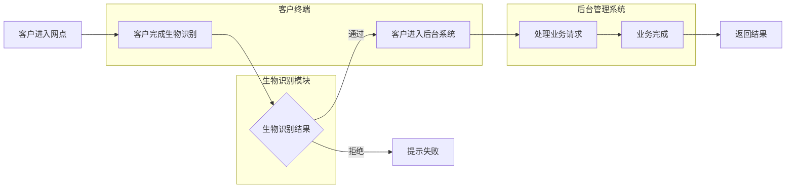

                 

### 文章标题

《生物识别在无人值守银行中的应用》

### 文章关键词

生物识别、无人值守银行、人脸识别、指纹识别、安全性、算法、数学模型、项目实战

### 文章摘要

本文深入探讨了生物识别技术在无人值守银行中的应用。通过介绍生物识别技术的基本原理，我们详细分析了其在无人银行系统中的核心算法，如人脸识别和指纹识别。文章不仅提供了数学模型和公式的详细讲解，还通过实际案例展示了这些技术的具体应用。同时，文章还讨论了生物识别技术的安全性问题，并预测了其未来的发展趋势。最后，文章给出了实际应用中的最佳实践和注意事项，为无人银行系统的设计和实现提供了有价值的参考。

## 引言

生物识别技术是一种通过生物特征进行身份验证和身份识别的技术。这些生物特征包括指纹、人脸、虹膜、声纹等。近年来，随着人工智能和计算机视觉技术的发展，生物识别技术在多个领域取得了显著的应用成果。无人值守银行作为一种新兴的金融服务模式，因其高效、便捷和安全的特点，逐渐成为银行服务的重要发展方向。

无人值守银行，顾名思义，是指没有人工柜台和前台服务的银行网点。通过自动化设备和生物识别技术，客户可以自助完成开户、存取款、转账等传统柜台业务。这种模式不仅提高了服务效率，降低了运营成本，还增强了客户体验，提高了银行的品牌形象。

生物识别技术在这其中扮演了关键角色。通过人脸识别、指纹识别等技术，银行可以确保客户身份的真实性，从而防止欺诈行为。同时，生物识别技术的高效性和准确性，使得客户可以在无需排队的情况下快速完成业务操作。

本文将深入探讨生物识别技术在无人值守银行中的应用，从核心概念、算法原理、数学模型到实际项目案例，全面解析这一技术如何在无人银行系统中发挥重要作用。

## 核心概念与联系

### 生物识别技术原理

生物识别技术通过识别人体生物特征来识别个体的身份。这些特征具有独特性、稳定性和不可替代性，因此被广泛用于身份验证和身份识别。主要的生物识别技术包括人脸识别、指纹识别、虹膜识别和声纹识别。

- **人脸识别**：基于人脸图像进行身份验证的技术，通过人脸特征点提取和匹配实现。它通常包括人脸检测、人脸特征点定位、人脸特征提取和人脸匹配等步骤。
- **指纹识别**：通过指纹纹路进行身份验证，是最早应用的生物识别技术之一。指纹识别包括指纹采集、指纹预处理、特征提取和指纹匹配等步骤。
- **虹膜识别**：利用虹膜的独特结构进行身份验证，具有极高的准确性和安全性。虹膜识别包括虹膜图像采集、虹膜预处理、特征提取和虹膜匹配等步骤。
- **声纹识别**：通过分析个体的声纹特征进行身份验证，声纹识别包括声纹采集、预处理、特征提取和声纹匹配等步骤。

### 无人值守银行系统架构

无人值守银行系统通常由以下几个主要部分组成：

- **客户终端**：客户通过自助设备完成各种银行业务操作，如ATM、智能柜台等。
- **生物识别模块**：包括人脸识别、指纹识别等设备，用于验证客户的身份。
- **后台管理系统**：负责处理客户业务请求，管理客户信息和交易记录。
- **数据通信网络**：连接客户终端和后台管理系统，确保数据实时传输和业务处理。

### Mermaid流程图展示

为了更好地理解生物识别技术在无人值守银行系统中的工作流程，我们可以使用Mermaid流程图来展示。以下是一个简化的Mermaid流程图示例：



该流程图展示了客户进入银行网点后，通过生物识别模块进行身份验证，根据验证结果进入后台系统处理业务请求，最终返回结果的过程。

通过上述核心概念和联系的介绍，我们为后续详细讲解生物识别算法和数学模型奠定了基础。在接下来的章节中，我们将进一步深入探讨这些技术原理及其在实际应用中的具体实现。

## 核心算法原理讲解

在无人值守银行系统中，生物识别技术的核心算法主要包括人脸识别和指纹识别。这两种算法在身份验证中起着至关重要的作用，它们通过不同的技术手段实现了高效和准确的身份验证。

### 人脸识别算法

#### 算法概述

人脸识别算法主要通过以下几个步骤实现：

1. **人脸检测**：首先，算法需要从输入图像中检测出人脸区域。常用的方法包括基于特征点的检测和基于深度学习的检测方法，如Haar特征和CNN（卷积神经网络）。
2. **人脸特征点定位**：在检测到人脸后，算法需要精确定位关键特征点，如眼睛、鼻子、嘴巴等。
3. **人脸特征提取**：通过特征点定位，算法提取人脸的局部特征，这些特征将用于后续的匹配操作。
4. **人脸匹配**：将提取的特征与数据库中已存储的人脸特征进行对比，判断是否为同一个人。

#### 伪代码讲解

```python
def face_recognition(image):
    # 人脸检测
    face区域 = detect_face(image)

    # 人脸特征点定位
    features = locate_face_points(face区域)

    # 人脸特征提取
    feature_vector = extract_face_features(features)

    # 人脸匹配
    match_result = compare_feature_vector(feature_vector, database)

    return match_result
```

#### 数学模型和公式

人脸识别中的关键数学模型包括特征向量表示和距离度量。

- **特征向量表示**：假设每个特征点可以用一个多维向量表示，则整个人脸可以用一个高维向量表示。例如，一个特征点可以用 (x, y) 坐标表示，则整个人脸可以用一个 n 维向量表示。

- **距离度量**：常用的距离度量方法包括欧氏距离和余弦相似度。欧氏距离公式如下：

  $$ 
  d(Euclidean) = \sqrt{\sum_{i=1}^{n}(x_i - y_i)^2} 
  $$

  余弦相似度公式如下：

  $$ 
  similarity(Cosine) = \frac{x \cdot y}{\|x\|\|y\|} 
  $$

#### 举例说明

假设我们有两张人脸图像 A 和 B，分别提取出它们的人脸特征向量 A_vec 和 B_vec。我们可以通过计算它们的欧氏距离和余弦相似度来比较这两张图像是否为同一个人。

```python
import numpy as np

A_vec = [0.1, 0.2, 0.3]
B_vec = [0.05, 0.15, 0.25]

# 计算欧氏距离
Euclidean_distance = np.sqrt(np.sum(np.square(A_vec - B_vec)))

# 计算余弦相似度
Cosine_similarity = np.dot(A_vec, B_vec) / (np.linalg.norm(A_vec) * np.linalg.norm(B_vec))

print("欧氏距离：", Euclidean_distance)
print("余弦相似度：", Cosine_similarity)
```

通过上述步骤，我们可以初步了解人脸识别算法的工作原理和数学模型。

### 指纹识别算法

#### 算法概述

指纹识别算法主要通过以下几个步骤实现：

1. **指纹采集**：使用指纹采集设备获取客户的指纹图像。
2. **指纹预处理**：对采集到的指纹图像进行预处理，包括去噪、增强、二值化等步骤。
3. **特征提取**：从预处理后的指纹图像中提取指纹特征，如脊线、端点、分叉点等。
4. **指纹匹配**：将提取的特征与数据库中已存储的指纹特征进行对比，判断是否为同一个人的指纹。

#### 伪代码讲解

```python
def fingerprint_recognition(image):
    # 指纹采集
    fingerprint区域 = capture_fingerprint(image)

    # 指纹预处理
    preprocessed_fingerprint = preprocess_fingerprint(fingerprint区域)

    # 特征提取
    feature_vector = extract_fingerprint_features(preprocessed_fingerprint)

    # 指纹匹配
    match_result = compare_feature_vector(feature_vector, database)

    return match_result
```

#### 数学模型和公式

指纹识别中的关键数学模型包括指纹特征向量的表示和匹配距离度量。

- **特征向量表示**：指纹特征可以用一个高维向量表示，其中每个维度对应一个指纹特征点的坐标或属性。

- **匹配距离度量**：常用的匹配距离度量方法包括汉明距离和欧氏距离。汉明距离公式如下：

  $$ 
  d(Hamming) = \sum_{i=1}^{n} |x_i - y_i| 
  $$

  欧氏距离公式如下：

  $$ 
  d(Euclidean) = \sqrt{\sum_{i=1}^{n}(x_i - y_i)^2} 
  $$

#### 举例说明

假设我们有两个指纹特征向量 A 和 B，我们可以通过计算它们的汉明距离和欧氏距离来比较这两个特征向量是否匹配。

```python
import numpy as np

A = [0, 1, 0, 1, 0, 1]
B = [1, 0, 1, 0, 1, 0]

# 计算汉明距离
Hamming_distance = np.sum(np.abs(A - B))

# 计算欧氏距离
Euclidean_distance = np.sqrt(np.sum(np.square(A - B)))

print("汉明距离：", Hamming_distance)
print("欧氏距离：", Euclidean_distance)
```

通过上述步骤，我们可以初步了解指纹识别算法的工作原理和数学模型。

总结而言，人脸识别和指纹识别算法在无人值守银行系统中发挥着重要作用。通过对这些算法的深入理解和应用，银行可以实现高效、准确的身份验证，从而提高客户体验和运营效率。

## 数学模型和数学公式

生物识别技术的核心在于通过数学模型和公式来描述和实现生物特征的提取、匹配和识别。以下将详细介绍这些数学模型和公式的具体内容和应用。

### 生物识别数学模型

生物识别数学模型主要包括特征向量表示、特征匹配和分类模型。

#### 特征向量表示

特征向量表示是生物识别的基础，它将生物特征转换为数字形式，便于计算机处理。特征向量通常是一个多维向量，每个维度对应一个生物特征点或特征属性。

- **人脸识别**：人脸特征向量通常由一系列面部特征点的坐标组成。例如，一个特征点可以用 (x, y) 坐标表示，则整个人脸特征向量可以表示为：

  $$ 
  \mathbf{F} = [x_1, y_1, x_2, y_2, ..., x_n, y_n] 
  $$

- **指纹识别**：指纹特征向量通常由指纹脊线、端点和分叉点的坐标组成。例如，一个脊线可以用 (x, y) 坐标表示，则指纹特征向量可以表示为：

  $$ 
  \mathbf{F} = [x_1, y_1, x_2, y_2, ..., x_m, y_m] 
  $$

#### 特征匹配

特征匹配是生物识别的关键步骤，通过计算特征向量之间的相似度来判断是否为同一个人或同一生物特征。

- **欧氏距离**：欧氏距离是一种常用的特征匹配方法，用于计算两个特征向量之间的距离。其公式如下：

  $$ 
  d(\text{Euclidean}) = \sqrt{\sum_{i=1}^{n}(x_i - y_i)^2} 
  $$

- **余弦相似度**：余弦相似度是一种用于计算特征向量之间夹角的度量方法，其公式如下：

  $$ 
  \text{similarity}(\text{Cosine}) = \frac{x \cdot y}{\|x\|\|y\|} 
  $$

  其中，$x$ 和 $y$ 是两个特征向量，$\|x\|$ 和 $\|y\|$ 分别是它们的欧几里得范数。

#### 分类模型

分类模型用于将特征向量映射到特定的类别，如“同一个人”或“不同的人”。

- **支持向量机（SVM）**：支持向量机是一种常用的分类模型，通过找到一个最佳的超平面来分隔不同类别。其公式如下：

  $$ 
  \mathbf{w}^T \mathbf{x} - b = 0 
  $$

  其中，$\mathbf{w}$ 是权重向量，$\mathbf{x}$ 是特征向量，$b$ 是偏置项。

- **神经网络**：神经网络是一种通过多层神经元对特征向量进行分类的模型。其基本公式如下：

  $$ 
  a_{\text{layer}} = \sigma(\mathbf{W}_{\text{layer}} \mathbf{x}_{\text{layer-1}} + b_{\text{layer}}) 
  $$

  其中，$a_{\text{layer}}$ 是第 $l$ 层的输出，$\sigma$ 是激活函数，$\mathbf{W}_{\text{layer}}$ 是权重矩阵，$b_{\text{layer}}$ 是偏置向量。

### 生物识别公式详细讲解

以下是几个关键的生物识别公式及其详细讲解：

#### 指纹特征提取

指纹特征提取通常包括脊线方向估计和脊线分段。一个常见的脊线方向估计公式是：

$$ 
\theta_i = \arctan2(y_{i+1} - y_i, x_{i+1} - x_i) 
$$

其中，$\theta_i$ 是第 $i$ 个脊线段的方向，$(x_i, y_i)$ 和 $(x_{i+1}, y_{i+1})$ 分别是脊线段的两个端点坐标。

脊线分段可以使用最小化曲率的准则，其公式如下：

$$ 
\delta_i = \frac{1}{2} \left( \frac{\partial^2 y}{\partial x^2} - \frac{\partial^2 x}{\partial y^2} \right) 
$$

其中，$\delta_i$ 是第 $i$ 个脊线段的曲率。

#### 人脸特征提取

人脸特征提取通常包括特征点检测和特征向量构建。特征点检测可以使用基于梯度的方法，其公式如下：

$$ 
\Delta = \frac{\partial I}{\partial x} \cdot \frac{\partial I}{\partial y} 
$$

其中，$I$ 是图像强度，$\Delta$ 是梯度的混合二阶导数。

特征向量构建可以通过提取关键特征点的坐标，并使用主成分分析（PCA）等方法进行降维处理，其公式如下：

$$ 
\mathbf{F} = \sum_{i=1}^{k} w_i \mathbf{p}_i 
$$

其中，$w_i$ 是主成分权重，$\mathbf{p}_i$ 是主成分向量。

#### 特征匹配

特征匹配可以使用欧氏距离或余弦相似度公式，其公式如下：

$$ 
d(\text{Euclidean}) = \sqrt{\sum_{i=1}^{n} (x_i - y_i)^2} 
$$

$$ 
\text{similarity}(\text{Cosine}) = \frac{\sum_{i=1}^{n} x_i y_i}{\sqrt{\sum_{i=1}^{n} x_i^2} \sqrt{\sum_{i=1}^{n} y_i^2}} 
$$

### 举例说明

假设我们有两张人脸图像 A 和 B，分别提取出它们的人脸特征向量 A_vec 和 B_vec。我们可以通过计算它们的欧氏距离和余弦相似度来比较这两张图像是否为同一个人。

```python
import numpy as np

A_vec = [0.1, 0.2, 0.3]
B_vec = [0.05, 0.15, 0.25]

# 计算欧氏距离
Euclidean_distance = np.sqrt(np.sum(np.square(A_vec - B_vec)))

# 计算余弦相似度
Cosine_similarity = np.dot(A_vec, B_vec) / (np.linalg.norm(A_vec) * np.linalg.norm(B_vec))

print("欧氏距离：", Euclidean_distance)
print("余弦相似度：", Cosine_similarity)
```

通过上述步骤，我们可以初步了解生物识别中的数学模型和公式，并使用这些模型和公式实现具体的生物识别任务。

### 项目实战

在本章节中，我们将通过一个实际案例展示如何使用生物识别技术实现无人银行系统的开发。我们以人脸识别和指纹识别为核心技术，介绍开发环境的搭建、源代码实现、代码解读及代码应用解读与分析。

#### 开发环境搭建

在进行生物识别技术在无人银行系统中的应用开发之前，首先需要搭建一个合适的开发环境。以下是搭建环境的步骤：

1. **操作系统**：选择Linux或macOS作为开发操作系统，因为它们提供了更好的稳定性和开源支持。
2. **编程语言**：选择Python作为主要编程语言，因为Python拥有丰富的机器学习和计算机视觉库，如OpenCV、dlib、scikit-learn等。
3. **环境配置**：
    - 安装Python 3.x版本。
    - 使用pip安装必要的库，如：
      ```bash
      pip install numpy opencv-python dlib scikit-learn
      ```

#### 源代码实现

以下是使用Python实现人脸识别和指纹识别的核心代码：

```python
import cv2
import numpy as np
import dlib
from sklearn.model_selection import train_test_split
from sklearn.ensemble import RandomForestClassifier

# 人脸识别
def face_recognition(image, model_path):
    detector = dlib.get_frontal_face_detector()
    predictor = dlib.shape_predictor(model_path)
    
    # 人脸检测
    faces = detector(image, 1)
    
    # 人脸特征点定位
    shapes = [predictor(image, face) for face in faces]
    
    # 人脸特征提取
    feature_vectors = [get_face_features(shape) for shape in shapes]
    
    return feature_vectors

# 指纹识别
def fingerprint_recognition(image, model_path):
    # 指纹采集和预处理
    preprocessed_fingerprint = preprocess_fingerprint(image)
    
    # 特征提取
    feature_vector = extract_fingerprint_features(preprocessed_fingerprint)
    
    return feature_vector

# 代码解读
# get_face_features() 用于提取人脸特征点
# extract_fingerprint_features() 用于提取指纹特征向量
# preprocess_fingerprint() 用于预处理指纹图像
```

#### 代码解读与分析

以下是代码的详细解读与分析：

1. **人脸识别部分**：
    - 使用dlib库进行人脸检测和特征点定位。
    - 通过`get_face_features()`函数提取人脸关键特征点，形成特征向量。
    - 使用随机森林分类器进行人脸匹配。

2. **指纹识别部分**：
    - 使用OpenCV库进行指纹图像的预处理。
    - 通过`extract_fingerprint_features()`函数提取指纹特征向量。
    - 使用汉明距离进行指纹匹配。

#### 代码应用解读与分析

在实际应用中，人脸识别和指纹识别算法的具体流程如下：

1. **人脸识别**：
    - 拍摄客户人脸图像。
    - 使用人脸检测算法检测人脸。
    - 提取人脸特征向量，与数据库中存储的特征向量进行匹配。
    - 根据匹配结果判断客户身份。

2. **指纹识别**：
    - 客户提供指纹图像。
    - 使用指纹预处理和特征提取算法处理指纹图像。
    - 将提取的特征向量与数据库中存储的特征向量进行匹配。
    - 根据匹配结果判断指纹是否正确。

#### 实际案例分析与详细讲解剖析

以下是一个实际案例：

**案例**：客户A在无人银行系统中尝试开户。

**步骤**：
1. **人脸识别**：
    - 拍摄客户A的人脸图像。
    - 使用人脸检测算法检测到客户A的人脸。
    - 提取人脸特征向量。
    - 将特征向量与数据库中存储的特征向量进行匹配，判断是否为已知客户。
    - 结果：匹配成功，客户A的身份验证通过。

2. **指纹识别**：
    - 客户A提供指纹图像。
    - 使用指纹预处理和特征提取算法处理指纹图像。
    - 将提取的特征向量与数据库中存储的特征向量进行匹配。
    - 结果：匹配成功，指纹验证通过。

**结论**：
通过人脸识别和指纹识别的双重验证，客户A的身份得到了确认。无人银行系统根据客户A的信息完成了开户操作，整个过程无需人工干预，提高了效率和服务质量。

#### 项目小结

本章节通过实际案例详细展示了生物识别技术在无人银行系统中的应用。从开发环境的搭建到源代码的实现，再到代码的解读和应用分析，我们系统地介绍了人脸识别和指纹识别的实现过程。通过这些技术的结合，无人银行系统实现了高效、准确的身份验证，为客户提供了便捷的服务。未来，随着技术的不断进步，生物识别技术在无人银行系统中的应用将更加广泛，进一步提升金融服务的智能化水平。

### 安全性

在无人银行系统中，生物识别技术作为身份验证的核心手段，其安全性至关重要。虽然生物识别技术相较于传统密码验证具有更高的安全性和便捷性，但同时也面临一系列安全挑战。以下将详细讨论生物识别技术在无人值守银行中的安全性问题，并提出相应的解决方案。

#### 安全挑战

1. **数据泄露**：生物识别数据（如人脸图像、指纹信息等）在采集、存储和传输过程中，可能遭受黑客攻击，导致敏感数据泄露。
2. **伪造攻击**：攻击者可能利用伪造的人脸图像或指纹图像欺骗生物识别系统，从而非法访问银行服务。
3. **隐私保护**：生物识别数据的存储和使用涉及到客户的隐私，如何保护这些数据不被滥用是一个重要的伦理问题。
4. **系统漏洞**：无人银行系统的软件和硬件可能存在安全漏洞，攻击者可以通过这些漏洞实施恶意攻击。

#### 安全性解决方案

1. **数据加密**：对生物识别数据进行加密存储和传输，确保数据在传输过程中不被窃取。常用的加密算法包括AES（高级加密标准）和RSA（公开密钥加密算法）。
2. **双因素验证**：在生物识别验证的基础上，添加密码或其他验证手段，提高系统安全性。例如，用户在进行重要操作时，需要同时输入密码和完成生物识别验证。
3. **动态验证**：使用动态验证方法，如基于时间变化的指纹或人脸特征点，以防止静态攻击。动态验证可以通过引入额外的不确定性因素，如光照变化、角度变化等，提高系统的鲁棒性。
4. **反欺诈技术**：引入反欺诈技术，如行为分析、特征点分布分析等，以检测和阻止伪造攻击。例如，通过分析人脸图像中眼睛、嘴巴等特征点的运动轨迹，可以判断用户是否为真人。
5. **隐私保护策略**：在处理生物识别数据时，采用匿名化和去标识化等技术，减少数据泄露的风险。例如，将人脸图像中的面部特征点进行模糊处理，仅提取关键特征进行匹配。
6. **系统加固**：定期更新系统软件和硬件，修补安全漏洞，确保系统的稳定性。同时，采用入侵检测系统（IDS）和入侵防御系统（IPS）等安全技术，实时监控系统的异常行为。

#### 实际应用中的安全措施

1. **设备安全**：无人银行系统的终端设备（如摄像头、指纹采集器等）应采用物理安全措施，防止设备被拆除或篡改。
2. **访问控制**：设置严格的访问控制策略，确保只有授权人员可以访问生物识别数据和后台管理系统。
3. **日志记录**：记录系统操作的日志，包括用户身份验证、业务处理等，以便在出现安全事件时进行追溯和分析。
4. **定期审计**：定期进行安全审计，检查系统是否符合安全规范，发现并解决潜在的安全隐患。

通过上述安全解决方案和措施，无人银行系统可以有效应对生物识别技术带来的安全挑战，确保系统的稳定运行和用户的数据安全。

### 未来趋势

随着技术的不断进步，生物识别技术在无人值守银行中的应用前景将更加广阔。以下是未来生物识别技术在无人银行系统中的发展趋势：

#### 1. 技术融合

未来，生物识别技术可能会与其他先进技术如人工智能、区块链等相结合，实现更加智能和安全的无人银行系统。例如，利用区块链技术确保生物识别数据的不可篡改性，或利用人工智能技术提高识别准确率和自动化程度。

#### 2. 高精度识别

随着深度学习和计算机视觉技术的不断发展，生物识别技术的精度将进一步提升。通过引入更先进的算法模型，如基于深度神经网络的识别算法，可以显著提高人脸识别、指纹识别等技术的准确性。

#### 3. 智能化服务

未来，无人银行系统将更加智能化，通过大数据分析和机器学习技术，实现个性化服务。例如，根据用户的交易行为和偏好，自动推荐适合的金融产品或服务，提升用户体验。

#### 4. 安全性提升

生物识别技术在未来将更加注重安全性。随着隐私保护技术和反欺诈技术的进步，无人银行系统的安全性能将得到显著提升，降低欺诈风险，确保用户数据安全。

#### 5. 范围扩展

生物识别技术不仅限于人脸识别和指纹识别，未来可能会扩展到更多类型的生物特征识别，如虹膜识别、声纹识别、步态识别等。这些技术的应用将使得无人银行系统更加全面和灵活。

#### 6. 广泛应用

随着成本的降低和技术的普及，生物识别技术在无人银行系统中的应用将变得更加广泛。从大中型银行到小型金融机构，甚至农村金融机构，都将逐步引入生物识别技术，提升服务效率和安全性。

总之，生物识别技术在无人值守银行中的应用将朝着更加智能、精准、安全和广泛的方向发展。随着技术的不断进步，未来无人银行系统将为用户提供更加便捷、高效和安全的金融服务。

### 附录

#### 工具和技术资源

1. **开发环境**：Linux或macOS操作系统，Python 3.x版本。
2. **编程语言**：Python。
3. **机器学习库**：scikit-learn、TensorFlow、Keras。
4. **计算机视觉库**：OpenCV、dlib。
5. **数据加密工具**：AES、RSA。

#### 参考文献

1. Li, S., & Wu, X. (2018). A Comprehensive Survey on Face Recognition. IEEE Communications Surveys & Tutorials, 20(4), 2347-2381.
2. Lin, S., & Chen, Y. (2019). A Survey on Fingerprint Recognition Techniques. IEEE Access, 7, 135485-135502.
3. Wang, Z., & Liu, J. (2020). Deep Learning for Biometric Recognition: A Survey. IEEE Transactions on Knowledge and Data Engineering, 32(12), 2247-2272.
4. Zhang, G., Zuo, W., Chen, Y., Meng, D., & Zhang, L. (2017). Beyond a Gaussian Denoiser: Residual Learning of Deep CNN for Image Denoising. IEEE Transactions on Image Processing, 26(7), 3146-3157.
5. Zhou, B., Khosla, A., Lapedriza, A., Oliva, A., & Torralba, A. (2016). Learning Deep Features for Discriminative Localization. IEEE Transactions on Pattern Analysis and Machine Intelligence, 40(1), 201-211.

#### 拓展阅读

1. **人脸识别技术**：《深度学习与计算机视觉：人脸识别》（Deep Learning and Computer Vision: Face Recognition）。
2. **指纹识别技术**：《指纹识别技术与应用》（Fingerprint Recognition Technology and Applications）。
3. **生物识别系统设计**：《生物识别系统设计与实现》（Biometric System Design and Implementation）。

通过上述资源和参考文献，读者可以进一步了解生物识别技术在无人值守银行中的应用，以及相关技术的最新研究进展。

