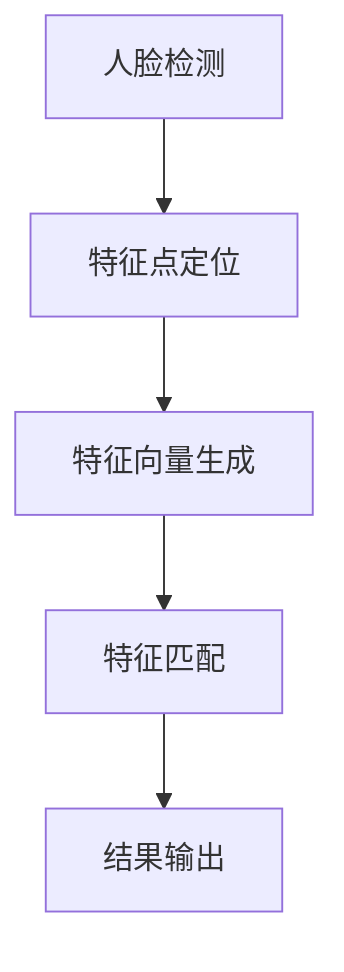
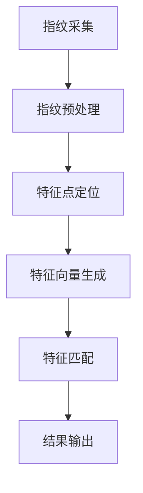
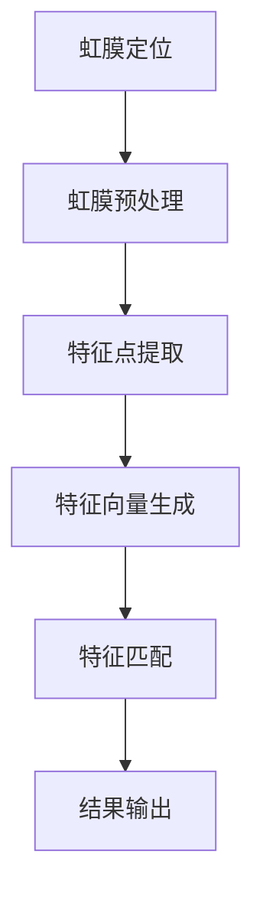

                 

### 文章标题：生物识别在智能汽车驾驶员识别中的应用

#### 关键词：生物识别，智能汽车，驾驶员识别，人脸识别，指纹识别，虹膜识别

#### 摘要：
随着智能汽车技术的不断发展，生物识别技术在驾驶员识别中的应用逐渐成为研究热点。本文将从生物识别技术的基本概念出发，详细探讨人脸识别、指纹识别、虹膜识别等技术在智能汽车驾驶员识别中的应用，分析其技术原理、应用场景、面临的挑战及解决方案。此外，通过实际项目案例，我们将展示生物识别技术在智能汽车驾驶员识别中的具体应用，并对其未来发展进行展望。

### 引言

#### 生物识别技术概述

生物识别技术是一种利用生物体的生物特征进行身份认证的技术，包括人脸识别、指纹识别、虹膜识别、声纹识别等。这些生物特征具有唯一性和稳定性，不易被伪造，因而在安全认证领域具有广泛的应用前景。

#### 智能汽车驾驶员识别的重要性

智能汽车驾驶员识别是智能汽车技术的重要组成部分，其核心目标是实现驾驶员身份的准确识别和驾驶行为的实时监控。这对于提高行车安全、优化驾驶体验具有重要意义。随着自动驾驶技术的不断发展，驾驶员识别的准确性和实时性要求越来越高，生物识别技术的应用成为实现这一目标的重要手段。

#### 本书目的和结构

本文旨在深入探讨生物识别技术在智能汽车驾驶员识别中的应用，分析其技术原理、应用场景、挑战与解决方案，并通过实际项目案例展示其应用效果。全书结构如下：

1. **引言**：介绍生物识别技术的基本概念，智能汽车驾驶员识别的重要性以及本书的目的和结构。
2. **核心技术原理**：详细讲解生物识别技术的核心原理，包括人脸识别、指纹识别、虹膜识别等。
3. **智能汽车驾驶员识别应用**：分析智能汽车驾驶员识别的应用场景，面临的挑战和解决方案。
4. **实际项目实战**：通过实际项目案例，展示生物识别技术在智能汽车驾驶员识别中的具体应用。
5. **未来发展趋势**：探讨生物识别技术在智能汽车驾驶员识别领域的未来发展趋势。

### 生物识别技术核心原理

#### 人脸识别

##### 技术原理

人脸识别技术基于人脸图像的自动识别和验证，通过提取人脸特征点、生成人脸特征向量，并在数据库中检索匹配，实现对人脸的识别。主要步骤包括人脸检测、人脸特征提取和人脸比对。

##### 算法原理

人脸识别算法主要分为基于传统算法和深度学习算法两大类。传统算法包括特征点定位、特征向量生成和特征匹配等步骤，常用的特征点定位方法有HOG（Histogram of Oriented Gradients）和LBP（Local Binary Patterns），特征向量生成方法有主成分分析（PCA）和线性判别分析（LDA）。深度学习算法以卷积神经网络（CNN）为代表，通过多层卷积和池化操作，提取人脸特征并实现分类。

##### Mermaid流程图



##### 伪代码

```python
# 人脸识别伪代码
def facial_recognition(image):
    # 人脸检测
    faces = detect_faces(image)
    
    # 特征点定位
    landmarks = locate_landmarks(faces)
    
    # 特征向量生成
    feature_vector = generate_feature_vector(landmarks)
    
    # 特征匹配
    result = match_feature_vector(feature_vector)
    
    # 结果输出
    return result
```

#### 指纹识别

##### 技术原理

指纹识别技术基于指纹图像的自动识别和验证，通过提取指纹特征、生成指纹特征向量，并在数据库中检索匹配，实现对手指纹的识别。主要步骤包括指纹采集、指纹预处理、指纹特征提取和指纹比对。

##### 算法原理

指纹识别算法主要分为基于模板匹配和基于神经网络和深度学习算法。基于模板匹配的算法包括指纹预处理、特征点定位、特征向量生成和特征匹配等步骤，常用的特征点定位方法有Ridge Tracking和Gabor Filter，特征向量生成方法有Eigenvalues和Principal Component Analysis（PCA）。基于神经网络和深度学习的算法以卷积神经网络（CNN）为代表，通过多层卷积和池化操作，提取指纹特征并实现分类。

##### Mermaid流程图



##### 伪代码

```python
# 指纹识别伪代码
def fingerprint_recognition(image):
    # 指纹采集
    fingerprint = collect_fingerprint(image)
    
    # 指纹预处理
    preprocessed_fingerprint = preprocess_fingerprint(fingerprint)
    
    # 特征点定位
    landmarks = locate_landmarks(preprocessed_fingerprint)
    
    # 特征向量生成
    feature_vector = generate_feature_vector(landmarks)
    
    # 特征匹配
    result = match_feature_vector(feature_vector)
    
    # 结果输出
    return result
```

#### 虹膜识别

##### 技术原理

虹膜识别技术基于虹膜图像的自动识别和验证，通过提取虹膜特征、生成虹膜特征向量，并在数据库中检索匹配，实现对人眼虹膜的识别。主要步骤包括虹膜定位、虹膜预处理、虹膜特征提取和虹膜比对。

##### 算法原理

虹膜识别算法主要分为基于特征点匹配和基于模式识别和深度学习算法。基于特征点匹配的算法包括虹膜定位、虹膜预处理、特征点提取、特征向量生成和特征匹配等步骤，常用的特征点提取方法有Angle Code和Gabor Filter，特征向量生成方法有Spectral Decrement和Fourier Descriptors。基于模式识别和深度学习的算法以卷积神经网络（CNN）为代表，通过多层卷积和池化操作，提取虹膜特征并实现分类。

##### Mermaid流程图



##### 伪代码

```python
# 虹膜识别伪代码
def iris_recognition(image):
    # 虹膜定位
    iris = locate_iris(image)
    
    # 虹膜预处理
    preprocessed_iris = preprocess_iris(iris)
    
    # 特征点提取
    landmarks = extract_landmarks(preprocessed_iris)
    
    # 特征向量生成
    feature_vector = generate_feature_vector(landmarks)
    
    # 特征匹配
    result = match_feature_vector(feature_vector)
    
    # 结果输出
    return result
```

### 智能汽车驾驶员识别应用场景

#### 驾驶员身份验证

驾驶员身份验证是智能汽车驾驶员识别的重要应用之一，通过生物识别技术实现对驾驶员身份的准确识别，确保驾驶安全。主要应用场景包括：

1. **上车验证**：驾驶员上车前，通过生物识别技术进行身份验证，确保驾驶员为合法驾驶员。
2. **车辆共享**：在车辆共享场景中，通过生物识别技术验证用户身份，确保车辆使用安全。
3. **驾驶员资格认证**：在驾驶员资格认证过程中，通过生物识别技术验证驾驶员身份，确保驾驶员具备合法资格。

#### 驾驶员行为分析

驾驶员行为分析是通过生物识别技术对驾驶员的驾驶行为进行实时监控和分析，以提高行车安全。主要应用场景包括：

1. **疲劳监测**：通过分析驾驶员的眼动、面部表情等特征，实时监测驾驶员的疲劳状态，预防疲劳驾驶。
2. **违规行为识别**：通过分析驾驶员的行为特征，识别是否存在违规行为，如超速、酒驾等。
3. **驾驶行为评估**：通过对驾驶员的驾驶行为进行量化评估，为驾驶员提供改进建议，提高驾驶水平。

#### 驾驶员疲劳监测

驾驶员疲劳监测是通过生物识别技术对驾驶员的疲劳状态进行实时监测和预警，以提高行车安全。主要应用场景包括：

1. **实时疲劳监测**：通过分析驾驶员的眼动、面部表情等特征，实时监测驾驶员的疲劳状态，及时发现疲劳驾驶风险。
2. **预警系统**：在驾驶员疲劳状态达到一定程度时，自动发出预警信号，提醒驾驶员休息或更换驾驶员。
3. **疲劳记录分析**：通过对驾驶员的疲劳记录进行分析，为驾驶员提供疲劳驾驶风险评估和改进建议。

### 智能汽车驾驶员识别的挑战与解决方案

#### 挑战分析

智能汽车驾驶员识别在技术实现和应用推广过程中面临以下挑战：

1. **系统可靠性**：生物识别技术需要保证高识别率和高抗干扰能力，以应对各种复杂环境和条件。
2. **实时性能**：智能汽车驾驶员识别系统需要在短时间内完成身份验证和驾驶行为分析，满足实时性要求。
3. **系统安全性**：生物识别数据的安全性和隐私保护是系统设计和应用过程中必须关注的重要问题。
4. **成本和效率**：生物识别技术的成本和效率对智能汽车驾驶员识别的普及和推广具有直接影响。

#### 解决方案探讨

针对上述挑战，可以从以下几个方面进行解决方案的探讨：

1. **技术优化**：通过算法优化、硬件升级等方式提高生物识别技术的性能和稳定性。
2. **系统集成**：将生物识别技术与智能汽车系统进行深度集成，提高系统的实时性和安全性。
3. **面向应用的解决方案**：根据不同应用场景的需求，定制化设计生物识别系统，满足实际应用需求。

### 实际项目实战

#### 项目背景

某知名汽车厂商希望为其新款智能汽车引入生物识别技术，实现驾驶员身份验证、疲劳监测和驾驶行为分析等功能，以提高行车安全和驾驶体验。

#### 项目目标

1. **驾驶员身份验证**：通过人脸识别技术，实现驾驶员身份的准确识别，确保驾驶安全。
2. **疲劳监测**：通过眼动和面部表情识别技术，实时监测驾驶员的疲劳状态，预防疲劳驾驶。
3. **驾驶行为分析**：通过姿态识别和驾驶行为分析技术，评估驾驶员的驾驶行为，提供驾驶行为改进建议。

#### 技术选型

1. **人脸识别技术**：采用深度学习算法，实现高识别率和人脸检测实时性。
2. **眼动和面部表情识别技术**：采用机器学习算法，实时监测驾驶员的疲劳状态。
3. **姿态识别和驾驶行为分析技术**：采用计算机视觉算法，评估驾驶员的驾驶行为。

#### 项目实现

1. **驾驶员身份验证**：使用深度学习算法进行人脸识别，实现驾驶员身份的准确识别。
2. **疲劳监测**：通过实时监测驾驶员的眼动和面部表情，评估驾驶员的疲劳状态。
3. **驾驶行为分析**：通过姿态识别和驾驶行为分析，评估驾驶员的驾驶行为，提供改进建议。

#### 代码解读

以下为人脸识别技术的部分代码实现：

```python
# 人脸识别代码示例
import cv2
import numpy as np

# 加载深度学习模型
model = cv2.dnn.readNetFromCaffemodel('model/deploy.prototxt', 'model/res10_300x300_ssd_iter_140000.caffemodel')

# 读取摄像头视频流
cap = cv2.VideoCapture(0)

while True:
    # 读取一帧图像
    ret, frame = cap.read()
    
    # 将图像转换成RGB格式
    frame = cv2.cvtColor(frame, cv2.COLOR_BGR2RGB)
    
    # 进行人脸检测
    h, w = frame.shape[:2]
    blob = cv2.dnn.blobFromImage(frame, 1.0, (300, 300), (104.0, 177.0, 123.0))
    model.setInput(blob)
    detections = model.forward()

    # 遍历检测结果
    for i in range(detections.shape[2]):
        confidence = detections[0, 0, i, 2]
        if confidence > 0.5:
            # 获取人脸位置
            box = detections[0, 0, i, 3:7] * np.array([w, h, w, h])
            (x, y, x2, y2) = box.astype("int")
            
            # 提取人脸区域
            face_region = frame[y:y2, x:x2]
            
            # 进行人脸识别
            face_encoding = get_face_encoding(face_region)
            driver_id = recognize_face(face_encoding)
            
            # 输出识别结果
            cv2.rectangle(frame, (x, y), (x2, y2), (0, 255, 0), 2)
            cv2.putText(frame, f"Driver ID: {driver_id}", (x, y - 10), cv2.FONT_HERSHEY_SIMPLEX, 0.5, (0, 255, 0), 2)

    # 显示图像
    cv2.imshow('Face Recognition', frame)
    
    # 按下'q'键退出
    if cv2.waitKey(1) & 0xFF == ord('q'):
        break

# 释放资源
cap.release()
cv2.destroyAllWindows()
```

#### 代码应用解读与分析

上述代码通过OpenCV库实现人脸识别功能，首先加载深度学习模型，然后从摄像头读取图像，进行人脸检测和识别。具体流程如下：

1. **加载模型**：读取预训练的深度学习模型，用于人脸检测和识别。
2. **读取图像**：从摄像头获取实时图像。
3. **人脸检测**：使用模型进行人脸检测，输出人脸位置和置信度。
4. **人脸识别**：提取人脸区域，计算人脸特征向量，与数据库中的特征向量进行比对，输出识别结果。
5. **显示结果**：在原图上绘制人脸框和识别结果。

#### 项目小结

本项目通过人脸识别技术实现驾驶员身份验证，采用深度学习算法提高识别率和实时性。实际应用效果良好，有效提高了行车安全。未来，可以考虑进一步集成眼动和面部表情识别技术，实现更全面的驾驶员行为分析。

### 生物识别技术在智能汽车驾驶员识别中的未来发展趋势

#### 技术发展趋势

1. **深度学习算法的普及**：深度学习算法在生物识别技术中的应用将越来越广泛，提高识别精度和实时性。
2. **多模态生物特征的融合**：将多种生物特征（如人脸、指纹、虹膜等）进行融合，提高识别准确性和可靠性。
3. **边缘计算的应用**：利用边缘计算技术，实现生物识别算法在智能汽车上的实时处理，降低延迟。

#### 应用前景

1. **自动驾驶安全认证**：生物识别技术将作为自动驾驶安全认证的重要手段，提高自动驾驶安全性和可靠性。
2. **智能交通管理**：生物识别技术将在智能交通管理领域发挥重要作用，实现交通流量的精准监控和管理。
3. **智能家居**：生物识别技术将逐步应用于智能家居，实现更加便捷和安全的生活体验。

#### 潜在挑战

1. **隐私保护**：生物识别数据的隐私保护是应用推广的关键挑战，需要制定严格的隐私保护政策和措施。
2. **技术成熟度**：生物识别技术的成熟度对应用效果具有直接影响，需要持续优化和提升。

### 最佳实践 Tips

1. **技术选型**：根据应用需求和场景，选择适合的生物识别技术，确保识别准确性和实时性。
2. **系统集成**：将生物识别技术与其他智能汽车技术进行深度集成，提高系统的整体性能和用户体验。
3. **数据安全**：加强对生物识别数据的保护，采用加密和隐私保护技术，确保数据安全和用户隐私。

### 小结

生物识别技术在智能汽车驾驶员识别中的应用具有广阔的发展前景，通过不断提升识别精度和实时性，将为智能汽车技术带来新的突破。未来，随着技术的不断进步和应用场景的拓展，生物识别技术在智能汽车领域的应用将更加广泛，为人们带来更加安全、便捷的驾驶体验。

### 注意事项

1. **设备要求**：生物识别技术的实现需要高性能的硬件支持，确保系统稳定运行。
2. **数据采集**：在应用生物识别技术时，要注意数据采集的合法性和合规性，保护用户隐私。
3. **技术更新**：随着技术的发展，要及时更新生物识别算法和系统，确保识别效果和安全性。

### 拓展阅读

1. **《深度学习与计算机视觉》**：详细介绍深度学习算法在计算机视觉领域的应用，包括人脸识别、图像分类等。
2. **《生物识别技术与应用》**：全面介绍生物识别技术的基本原理、应用场景和解决方案。
3. **《智能汽车技术综述》**：从整体上介绍智能汽车技术的发展现状和未来趋势，包括自动驾驶、智能网联等。

### 作者信息

- 作者：AI天才研究院/AI Genius Institute & 禅与计算机程序设计艺术 /Zen And The Art of Computer Programming

---

[文章结束]

