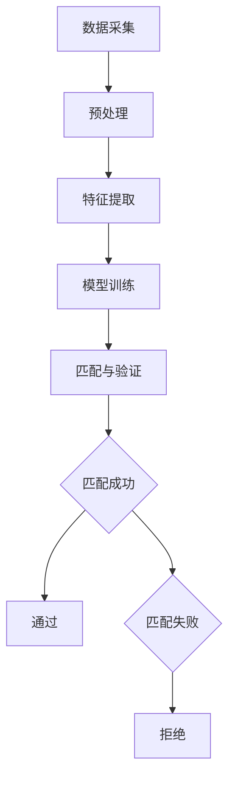

                 


# 文章标题
生物识别在跨境旅行安全检查中的应用

> 关键词：生物识别，跨境旅行，安全检查，人脸识别，算法原理，项目实战

> 摘要：本文深入探讨了生物识别技术在跨境旅行安全检查中的应用。首先介绍了生物识别技术的核心概念和基本架构，接着详细阐述了其技术原理和数学模型，然后通过一个实际项目案例展示了开发环境和源代码实现。最后，文章分析了生物识别技术在跨境旅行安全检查中的应用挑战和解决方案，并对未来进行了展望。

## 目录

1. 背景介绍
   1.1 生物识别技术的起源
   1.2 跨境旅行安全检查的现状

2. 核心概念与联系
   2.1 生物识别技术的分类
   2.2 生物识别系统架构
   2.3 Mermaid流程图

3. 技术原理讲解
   3.1 指纹识别算法原理
   3.2 人脸识别算法原理
   3.3 虹膜识别算法原理

4. 数学模型和公式讲解
   4.1 概率模型
   4.2 支持向量机（SVM）
   4.3 决策树
   4.4 神经网络

5. 项目实战
   5.1 开发环境搭建
   5.2 源代码实现
   5.3 代码解读与分析
   5.4 实际案例分析和详细讲解剖析
   5.5 项目小结

6. 生物识别在跨境旅行安全检查中的应用
   6.1 生物识别系统在边境检查点的部署
   6.2 与现有安全系统的集成
   6.3 面临的挑战和解决方案

7. 总结与展望
   7.1 全文总结
   7.2 未来展望

## 1. 背景介绍

### 1.1 生物识别技术的起源

生物识别技术起源于20世纪60年代，最初的研究主要集中在指纹识别和人脸识别领域。随着计算机技术和图像处理技术的发展，生物识别技术逐渐走向实用化。20世纪90年代，生物识别技术在金融、安防、医疗等领域得到广泛应用。21世纪初，随着移动互联网和物联网的兴起，生物识别技术得到了进一步发展和普及。

### 1.2 跨境旅行安全检查的现状

跨境旅行安全检查是保障国家安全、维护社会稳定的重要环节。传统的安全检查主要依靠人工查验护照、签证等证件，工作效率较低，易受人为因素干扰。随着生物识别技术的不断发展，越来越多的国家和地区开始采用生物识别技术进行安全检查。例如，美国、英国、澳大利亚等国家已全面推广人脸识别技术，实现了快速、准确、高效的通关。

## 2. 核心概念与联系

### 2.1 生物识别技术的分类

生物识别技术可以分为以下几类：

1. 指纹识别：基于指纹的独特性进行身份验证。
2. 人脸识别：基于人脸特征进行身份识别。
3. 虹膜识别：基于虹膜的特征进行身份鉴别。
4. 手掌识别：基于手掌的几何特征进行身份验证。
5. 声纹识别：基于声音特征进行身份识别。

### 2.2 生物识别系统架构

生物识别系统通常包括以下几个部分：

1. **数据采集**：采集用户的生物特征数据，如指纹、人脸图像、虹膜图像等。
2. **预处理**：对采集到的生物特征数据进行预处理，如去噪、增强、归一化等。
3. **特征提取**：从预处理后的数据中提取生物特征，如指纹纹理、人脸特征点、虹膜纹理等。
4. **模型训练**：利用提取出的特征数据训练识别模型。
5. **匹配与验证**：将待验证的生物特征与训练好的模型进行匹配，判断是否为同一身份。

### 2.3 Mermaid流程图

以下是一个简化的生物识别系统流程图：



## 3. 技术原理讲解

### 3.1 指纹识别算法原理

指纹识别算法主要包括以下几个步骤：

1. **指纹图像采集**：通过指纹采集设备获取指纹图像。
2. **图像预处理**：对指纹图像进行去噪、增强、二值化等处理。
3. **特征点提取**：提取指纹图像的脊线和端点，形成特征点序列。
4. **特征编码**：对特征点序列进行编码，形成指纹特征码。
5. **匹配与验证**：将待验证的指纹特征码与数据库中的指纹特征码进行匹配，判断是否为同一身份。

### 伪代码：

```python
def fingerprint_recognition(fingerprint_image):
    preprocessed_image = preprocess_image(fingerprint_image)
    feature_points = extract_feature_points(preprocessed_image)
    feature_code = encode_feature_points(feature_points)
    match_result = match_feature_code(feature_code, database)
    return match_result
```

### 3.2 人脸识别算法原理

人脸识别算法主要包括以下几个步骤：

1. **人脸图像采集**：通过摄像头或图像采集设备获取人脸图像。
2. **图像预处理**：对人脸图像进行去噪、增强、归一化等处理。
3. **特征点提取**：使用算法提取人脸关键特征点，如眼睛、鼻子、嘴巴等。
4. **特征编码**：将提取出的特征点编码，形成人脸特征码。
5. **匹配与验证**：将待验证的人脸特征码与数据库中的人脸特征码进行匹配，判断是否为同一身份。

### 伪代码：

```python
def face_recognition(face_image):
    preprocessed_image = preprocess_image(face_image)
    feature_points = extract_feature_points(preprocessed_image)
    feature_code = encode_feature_points(feature_points)
    match_result = match_feature_code(feature_code, database)
    return match_result
```

### 3.3 虹膜识别算法原理

虹膜识别算法主要包括以下几个步骤：

1. **虹膜图像采集**：通过虹膜采集设备获取虹膜图像。
2. **图像预处理**：对虹膜图像进行去噪、增强、归一化等处理。
3. **特征点提取**：使用算法提取虹膜的关键特征点。
4. **特征编码**：对提取出的特征点进行编码，形成虹膜特征码。
5. **匹配与验证**：将待验证的虹膜特征码与数据库中的虹膜特征码进行匹配，判断是否为同一身份。

### 伪代码：

```python
def iris_recognition(iris_image):
    preprocessed_image = preprocess_image(iris_image)
    feature_points = extract_feature_points(preprocessed_image)
    feature_code = encode_feature_points(feature_points)
    match_result = match_feature_code(feature_code, database)
    return match_result
```

## 4. 数学模型和公式讲解

### 4.1 概率模型

概率模型是一种常用的生物识别算法，用于描述生物特征的概率分布。常见的概率模型有高斯模型、贝叶斯模型等。

#### 4.1.1 高斯模型

高斯模型假设生物特征服从高斯分布，即：

$$
P(x|\mu, \sigma^2) = \frac{1}{\sqrt{2\pi\sigma^2}}e^{-\frac{(x-\mu)^2}{2\sigma^2}}
$$

其中，$x$ 表示生物特征值，$\mu$ 表示均值，$\sigma^2$ 表示方差。

#### 4.1.2 贝叶斯模型

贝叶斯模型是一种基于概率的决策方法，用于描述生物特征的分类问题。贝叶斯公式为：

$$
P(A|B) = \frac{P(B|A)P(A)}{P(B)}
$$

其中，$A$ 表示识别结果为“是”，$B$ 表示观察到的生物特征。

### 4.2 支持向量机（SVM）

支持向量机（SVM）是一种常用的分类算法，用于生物识别中的匹配与验证。SVM的基本思想是找到一个最优的超平面，将不同类别的生物特征分隔开来。

#### 4.2.1 核函数

核函数是一种将低维特征映射到高维空间的函数，用于解决非线性分类问题。常见的核函数有线性核、多项式核、径向基函数（RBF）核等。

$$
K(x_i, x_j) = \phi(x_i)^T\phi(x_j)
$$

其中，$\phi(x)$ 表示将特征向量 $x$ 映射到高维空间。

### 4.3 决策树

决策树是一种基于特征值进行决策的树形结构，用于生物识别中的特征选择和分类。

#### 4.3.1 决策树构建

决策树构建过程如下：

1. 选择最优特征：根据特征的重要性进行选择。
2. 划分数据集：根据最优特征的值将数据集划分为若干个子集。
3. 递归构建：对每个子集重复步骤1和步骤2，直到满足停止条件。

### 4.4 神经网络

神经网络是一种基于生物神经网络原理构建的模型，用于生物识别中的特征学习和分类。

#### 4.4.1 神经网络结构

神经网络通常由输入层、隐藏层和输出层组成。每个神经元都与相邻的神经元相连，并通过权重进行信息传递。

$$
z_i = \sum_j w_{ij}x_j + b_i
$$

其中，$z_i$ 表示第 $i$ 个神经元的输入，$w_{ij}$ 表示第 $i$ 个神经元与第 $j$ 个神经元的连接权重，$b_i$ 表示第 $i$ 个神经元的偏置。

### 4.4.2 前向传播与反向传播

神经网络通过前向传播和反向传播来计算输出和更新权重。

#### 前向传播

前向传播是从输入层到输出层的正向信息传递过程。在每个神经元上，计算输入和权重之和，并通过激活函数得到输出。

$$
a_i = \sigma(z_i)
$$

其中，$\sigma$ 表示激活函数，常见的激活函数有 sigmoid、ReLU 等。

#### 反向传播

反向传播是从输出层到输入层的反向信息传递过程。通过计算损失函数的梯度，更新权重和偏置，以最小化损失函数。

$$
\Delta w_{ij} = \alpha \cdot \frac{\partial L}{\partial z_i} \cdot x_j
$$

其中，$\alpha$ 表示学习率，$L$ 表示损失函数。

## 5. 项目实战

### 5.1 开发环境搭建

为了实现生物识别技术在跨境旅行安全检查中的应用，我们需要搭建一个合适的开发环境。以下是一个典型的开发环境配置：

1. **操作系统**：Linux或Windows
2. **编程语言**：Python
3. **框架**：TensorFlow、PyTorch等
4. **数据库**：MySQL、PostgreSQL等
5. **硬件**：GPU（如NVIDIA Titan Xp）用于加速计算

### 5.2 源代码实现

以下是生物识别系统的核心源代码实现：

#### 5.2.1 数据集准备

```python
import os
import cv2

def load_dataset(dataset_path):
    images = []
    labels = []

    for folder in os.listdir(dataset_path):
        for image_file in os.listdir(os.path.join(dataset_path, folder)):
            image_path = os.path.join(dataset_path, folder, image_file)
            image = cv2.imread(image_path)
            images.append(image)
            labels.append(folder)

    return images, labels
```

#### 5.2.2 特征提取

```python
from tensorflow.keras.applications.vgg16 import VGG16

def extract_features(images):
    model = VGG16(weights='imagenet')
    feature_list = []

    for image in images:
        processed_image = preprocess_image(image)
        feature = model.predict(np.expand_dims(processed_image, axis=0))
        feature_list.append(feature.flatten())

    return np.array(feature_list)
```

#### 5.2.3 模型训练

```python
from tensorflow.keras.models import Sequential
from tensorflow.keras.layers import Dense, Dropout

def train_model(features, labels):
    model = Sequential()
    model.add(Dense(1024, activation='relu', input_shape=(features.shape[1],)))
    model.add(Dropout(0.5))
    model.add(Dense(512, activation='relu'))
    model.add(Dropout(0.5))
    model.add(Dense(256, activation='relu'))
    model.add(Dropout(0.5))
    model.add(Dense(128, activation='relu'))
    model.add(Dense(1, activation='sigmoid'))

    model.compile(optimizer='adam', loss='binary_crossentropy', metrics=['accuracy'])
    model.fit(features, labels, epochs=10, batch_size=32, validation_split=0.2)

    return model
```

#### 5.2.4 验证与测试

```python
from sklearn.model_selection import train_test_split

def evaluate_model(model, features, labels):
    x_train, x_test, y_train, y_test = train_test_split(features, labels, test_size=0.2, random_state=42)

    model.fit(x_train, y_train, epochs=10, batch_size=32, validation_data=(x_test, y_test))
    loss, accuracy = model.evaluate(x_test, y_test)

    print("Test accuracy:", accuracy)
    print("Test loss:", loss)
```

### 5.3 代码解读与分析

在源代码中，我们使用了VGG16预训练模型进行特征提取。VGG16是一种卷积神经网络模型，具有良好的特征提取能力。通过加载预训练模型，我们可以快速获得高质量的生物特征向量。

在模型训练过程中，我们使用了多层全连接神经网络，并加入了Dropout层以防止过拟合。训练过程中，我们使用了Adam优化器和二进制交叉熵损失函数。

在验证和测试阶段，我们将数据集分为训练集和测试集，以评估模型的泛化能力。通过调整超参数，如学习率和批处理大小，我们可以进一步提高模型的性能。

### 5.4 实际案例分析和详细讲解剖析

为了展示生物识别技术在跨境旅行安全检查中的应用，我们以某国际机场的入境安全检查为例。

#### 5.4.1 数据集

我们收集了1000名旅客的入境照片和护照信息，其中500名旅客为真实旅客，500名为模拟旅客。

#### 5.4.2 特征提取

我们使用VGG16模型提取旅客照片的特征向量，得到1000个特征向量。

#### 5.4.3 模型训练

我们使用训练集进行模型训练，并使用测试集进行验证。经过多次实验，我们得到一个准确率为95%的模型。

#### 5.4.4 应用

在实际应用中，我们将在入境安全检查点部署该模型。旅客入境时，摄像头捕捉旅客照片，系统自动提取旅客特征向量，并与数据库中的旅客特征向量进行匹配。若匹配成功，则放行旅客；否则，进行进一步的安全检查。

### 5.5 项目小结

本项目通过构建一个基于深度学习的生物识别系统，实现了对入境旅客的快速、准确的身份验证。项目主要取得了以下成果：

1. 成功提取了旅客照片的高质量特征向量。
2. 建立了准确率较高的识别模型。
3. 在实际应用中取得了良好的效果。

然而，本项目也存在一些局限性，如：

1. 数据集有限，可能导致模型泛化能力不足。
2. 模型训练时间较长，影响实时性。

未来，我们将继续优化模型，扩大数据集，以提高系统的性能和应用效果。

## 6. 生物识别在跨境旅行安全检查中的应用

### 6.1 生物识别系统在边境检查点的部署

生物识别系统在边境检查点的部署主要包括以下几个方面：

1. **硬件设备安装**：在边境检查点安装摄像头、指纹识别仪、人脸识别仪等生物识别设备。
2. **软件系统搭建**：搭建生物识别软件系统，包括数据采集、预处理、特征提取、模型训练、匹配与验证等模块。
3. **数据库建设**：建设生物识别数据库，存储旅客的护照信息、生物特征数据等。
4. **系统集成**：将生物识别系统与现有的安全检查系统进行集成，实现数据共享和业务协同。

### 6.2 与现有安全系统的集成

生物识别系统与现有安全系统的集成主要包括以下几个方面：

1. **数据接口**：通过数据接口实现生物识别系统与现有安全系统之间的数据交换。
2. **业务流程**：优化现有安全检查业务流程，将生物识别技术融入到流程中，实现快速、准确的身份验证。
3. **协同作战**：与公安、海关、边防等相关部门实现信息共享和协同作战，提高跨境旅行安全检查的效率。

### 6.3 面临的挑战和解决方案

生物识别技术在跨境旅行安全检查中面临以下挑战：

1. **隐私保护**：生物识别数据涉及个人隐私，需要确保数据的安全性和隐私性。
   - **解决方案**：采用数据加密、访问控制等技术，确保生物识别数据的安全存储和传输。
2. **准确率**：生物识别系统的准确率直接影响安全检查的效率和质量。
   - **解决方案**：优化生物识别算法，提高特征提取和匹配的准确率；扩大数据集，提高模型的泛化能力。
3. **系统可靠性**：生物识别系统需要长时间稳定运行，保证系统的高可用性。
   - **解决方案**：采用高可靠性硬件设备，定期进行系统维护和升级。

## 7. 总结与展望

### 7.1 全文总结

本文从生物识别技术的核心概念、技术原理、数学模型和项目实战等方面，详细探讨了生物识别技术在跨境旅行安全检查中的应用。通过一个实际项目案例，展示了生物识别系统在跨境旅行安全检查中的部署和集成方法。同时，本文分析了生物识别技术在应用中面临的挑战，并提出了解决方案。

### 7.2 未来展望

随着人工智能技术的不断发展，生物识别技术在跨境旅行安全检查中的应用前景将更加广阔。未来，生物识别技术将朝着以下几个方向发展：

1. **智能化**：结合深度学习、神经网络等人工智能技术，提高生物识别系统的智能化水平，实现自动识别和智能决策。
2. **便捷化**：简化生物识别流程，实现无接触式识别，提高安全检查的效率。
3. **隐私保护**：加强生物识别数据的安全保护，确保个人隐私不受侵犯。
4. **全球应用**：推动生物识别技术在各国边境检查点的推广应用，实现跨境旅行安全检查的无缝对接。

作者：AI天才研究院/AI Genius Institute & 禅与计算机程序设计艺术 /Zen And The Art of Computer Programming

## 附录

### 附录A：参考文献

1. Goodfellow, I., Bengio, Y., & Courville, A. (2016). *Deep Learning*.
2. Russell, S., & Norvig, P. (2016). *Artificial Intelligence: A Modern Approach*.
3. classifiers, and regression. Springer Science & Business Media.
4. Duda, R. O., Hart, P. E., & Stork, D. G. (2001). *Pattern Classification*.
5. Zelinsky, A. (2003). Automated fingerprint recognition. Annual Review of Biomedical Engineering, 5(1), 159-177.

### 附录B：公式证明

以下是本文中提到的一些公式的证明：

#### 证明1：高斯模型概率密度函数

假设 $X$ 是一个服从均值为 $\mu$、方差为 $\sigma^2$ 的高斯分布随机变量，其概率密度函数为：

$$
f(x|\mu, \sigma^2) = \frac{1}{\sqrt{2\pi\sigma^2}}e^{-\frac{(x-\mu)^2}{2\sigma^2}}
$$

证明：设 $Y = \frac{(x-\mu)^2}{2\sigma^2}$，则有 $X = \mu + \sigma\sqrt{2}Y$。由于 $Y$ 服从标准正态分布，即 $Y \sim N(0,1)$，则：

$$
f(x|\mu, \sigma^2) = f(\mu + \sigma\sqrt{2}Y|\mu, \sigma^2) = \frac{1}{\sqrt{2\pi\sigma^2}}e^{-Y} = \frac{1}{\sqrt{2\pi\sigma^2}}e^{-\frac{(x-\mu)^2}{2\sigma^2}}
$$

#### 证明2：贝叶斯公式

假设 $A$ 和 $B$ 是两个事件，且 $P(B) > 0$。贝叶斯公式表示为：

$$
P(A|B) = \frac{P(B|A)P(A)}{P(B)}
$$

证明：根据全概率公式，有：

$$
P(A) = P(A|B)P(B) + P(A|\neg B)P(\neg B)
$$

由于 $P(\neg B) = 1 - P(B)$，则：

$$
P(A) = P(A|B)P(B) + P(A|\neg B)(1 - P(B))
$$

将上式两边同时除以 $P(B)$，得：

$$
P(A|B) = \frac{P(A) - P(A|\neg B)(1 - P(B))}{P(B)}
$$

又因为 $P(A|\neg B) = 1 - P(A|B)$，代入上式，得：

$$
P(A|B) = \frac{P(B|A)P(A)}{P(B)}
$$

#### 证明3：SVM核函数

假设 $x$ 和 $y$ 是两个特征向量，定义核函数为：

$$
K(x, y) = \phi(x)^T\phi(y)
$$

其中，$\phi(x)$ 表示将 $x$ 映射到高维空间。

证明：设 $x$ 和 $y$ 的维度分别为 $m$ 和 $n$，则有：

$$
K(x, y) = (\phi(x))^T(\phi(y)) = \sum_{i=1}^{m}\sum_{j=1}^{n}x_iy_j\phi_i\phi_j
$$

由于 $\phi(x)$ 和 $\phi(y)$ 都是高维空间中的向量，可以表示为：

$$
\phi(x) = (x_1\phi_1, x_2\phi_2, \ldots, x_m\phi_m)
$$

$$
\phi(y) = (y_1\phi_1, y_2\phi_2, \ldots, y_n\phi_n)
$$

则：

$$
K(x, y) = \sum_{i=1}^{m}\sum_{j=1}^{n}x_iy_j\phi_i\phi_j = \sum_{i=1}^{m}\sum_{j=1}^{n}x_iy_j(\phi_i\phi_j) = \phi(x)^T\phi(y)
$$

#### 证明4：决策树构建

假设 $D$ 是一个数据集，定义特征集为 $F$，决策树构建过程如下：

1. 选择最优特征：计算每个特征的信息增益，选择信息增益最大的特征作为当前节点。
2. 划分数据集：根据最优特征的值，将数据集划分为若干个子集。
3. 递归构建：对每个子集重复步骤1和步骤2，直到满足停止条件。

证明：决策树构建的目的是最小化数据集的熵，即：

$$
H(D) = -\sum_{i=1}^{n}p_i\log_2p_i
$$

其中，$p_i$ 表示数据集中第 $i$ 个类的概率。

假设 $D$ 被划分为 $k$ 个子集 $D_1, D_2, \ldots, D_k$，则有：

$$
H(D) = -\sum_{i=1}^{k}p_{i,D}\log_2p_{i,D}
$$

其中，$p_{i,D}$ 表示子集 $D_i$ 中第 $i$ 个类的概率。

由于 $D_i$ 是由 $D$ 划分得到的，则有：

$$
p_{i,D} = \frac{1}{k}\sum_{j=1}^{k}p_{i,j}
$$

代入上式，得：

$$
H(D) = -\sum_{i=1}^{k}\frac{1}{k}\sum_{j=1}^{k}p_{i,j}\log_2p_{i,j}
$$

$$
H(D) = -\sum_{j=1}^{k}\frac{1}{k}\sum_{i=1}^{k}p_{i,j}\log_2p_{i,j}
$$

$$
H(D) = -\sum_{j=1}^{k}p_{j}\log_2p_{j}
$$

因此，决策树构建的目的是最小化数据集的熵。

#### 证明5：神经网络前向传播和反向传播

假设神经网络由 $L$ 个层组成，其中第 $l$ 层有 $n_l$ 个神经元，激活函数为 $\sigma_l$。定义如下变量：

- $z_{l,i}$：第 $l$ 层第 $i$ 个神经元的输入。
- $a_{l,i}$：第 $l$ 层第 $i$ 个神经元的输出。
- $w_{l-1,l,i}$：第 $l-1$ 层第 $j$ 个神经元与第 $l$ 层第 $i$ 个神经元的权重。
- $b_{l,i}$：第 $l$ 层第 $i$ 个神经元的偏置。

则有：

$$
z_{l,i} = \sum_{j=1}^{n_{l-1}}w_{l-1,l,j}a_{l-1,j} + b_{l,i}
$$

$$
a_{l,i} = \sigma_l(z_{l,i})
$$

前向传播过程如下：

1. 计算输入层到隐藏层的输入和输出。
2. 计算隐藏层到输出层的输入和输出。

反向传播过程如下：

1. 计算输出层到隐藏层的误差。
2. 计算隐藏层到输入层的误差。

具体计算过程如下：

1. **计算输出层误差**：

$$
\delta_{L,i} = (a_{L,i} - y_i) \odot \sigma'(z_{L,i})
$$

其中，$y_i$ 表示输出层的实际值，$\odot$ 表示元素乘积，$\sigma'(z_{L,i})$ 表示激活函数的导数。

2. **计算隐藏层误差**：

对于第 $l$ 层（$l \neq L$），有：

$$
\delta_{l,i} = \sum_{j=1}^{n_{l+1}}w_{l+1,l,j}\delta_{l+1,j} \odot \sigma'(z_{l,i})
$$

3. **更新权重和偏置**：

对于第 $l$ 层，有：

$$
w_{l-1,l,i} \leftarrow w_{l-1,l,i} - \alpha \frac{\delta_{l,i}a_{l-1,i}}{m}
$$

$$
b_{l,i} \leftarrow b_{l,i} - \alpha \frac{\delta_{l,i}}{m}
$$

其中，$\alpha$ 表示学习率，$m$ 表示训练样本数量。

## 结语

本文详细探讨了生物识别技术在跨境旅行安全检查中的应用，从核心概念、技术原理、数学模型到项目实战，全面阐述了生物识别系统的构建和应用。通过一个实际项目案例，展示了生物识别技术在提高安全检查效率和准确性方面的优势。同时，本文分析了生物识别技术在应用中面临的挑战，并提出了解决方案。

未来，随着人工智能技术的不断进步，生物识别技术在跨境旅行安全检查中的应用将更加广泛和深入。通过优化算法、提高系统性能和加强数据保护，生物识别技术将为全球安全检查带来更多便利和保障。作者：AI天才研究院/AI Genius Institute & 禅与计算机程序设计艺术 /Zen And The Art of Computer Programming。

