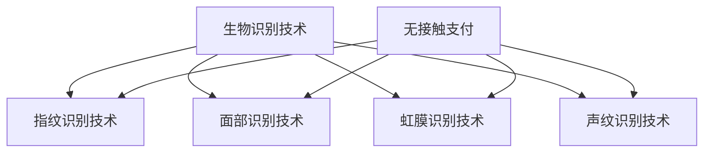

                 

### 文章标题

《生物识别技术在支付领域的应用：无接触支付的未来》

**关键词：** 生物识别技术、支付领域、无接触支付、指纹识别、面部识别、虹膜识别、声纹识别

**摘要：** 本文将深入探讨生物识别技术在支付领域的应用，分析其优势、挑战及未来发展趋势。通过详细解读指纹识别、面部识别、虹膜识别和声纹识别等技术的原理和应用案例，揭示无接触支付的未来前景，并讨论相关安全与隐私问题。旨在为读者提供全面的技术洞察和实用指南。

## 第一部分：生物识别技术基础

### 第1章：生物识别技术概述

#### 1.1 生物识别技术的定义与分类

生物识别技术是指通过生物特征自动识别和验证个人身份的技术。这些生物特征包括指纹、面部、虹膜、声纹等。生物识别技术可以应用于多个领域，如安全、医疗、金融等，其中支付领域是近年来备受关注的应用场景。

根据生物特征的类型，生物识别技术可以分为以下几类：

1. **生物特征识别：** 利用人体的生物特征进行身份识别，如指纹识别、面部识别、虹膜识别和声纹识别。
2. **生理特征识别：** 利用人体生理特征进行身份识别，如心率、血压、体温等。
3. **行为特征识别：** 利用人的行为特征进行身份识别，如签名、步态、打字习惯等。

#### 1.2 生物识别技术的原理

生物识别技术的原理主要包括以下几个步骤：

1. **特征采集：** 使用传感器或其他设备采集生物特征数据。
2. **特征提取：** 从采集到的生物特征数据中提取特征点或特征向量。
3. **特征匹配：** 将提取到的特征向量与数据库中的特征向量进行匹配，计算匹配度。
4. **身份确认：** 根据匹配度判断身份是否正确。

#### 1.3 生物识别技术的应用现状与发展趋势

生物识别技术在支付领域的应用现状主要包括以下几方面：

1. **移动支付：** 通过生物识别技术实现无接触支付，如指纹支付、面部支付等。
2. **银行身份验证：** 使用生物识别技术进行客户身份验证，提高安全性和便利性。
3. **电子商务：** 利用生物识别技术进行用户身份验证，防止欺诈行为。

随着技术的不断进步和人们对安全与便利性的需求增加，生物识别技术在支付领域的应用前景广阔。未来，生物识别技术将与其他新兴技术（如区块链、5G等）相结合，进一步提升支付领域的安全性和便利性。然而，生物识别技术也面临一定的挑战，如隐私保护和数据安全问题，需要相关政策和技术手段的支持和解决。|im_sep|>

### 第2章：指纹识别技术

#### 2.1 指纹识别技术的原理与流程

指纹识别技术是生物识别技术中最成熟和广泛应用的一种。其原理是通过采集指纹图像，提取指纹特征点，然后与数据库中的指纹模板进行匹配，以实现身份验证。

指纹识别技术的流程主要包括以下几个步骤：

1. **指纹采集：** 使用指纹采集设备（如指纹传感器）获取指纹图像。
2. **指纹预处理：** 对采集到的指纹图像进行预处理，包括去除噪声、增强指纹纹理等。
3. **指纹分割：** 将预处理后的指纹图像分割成若干小块，以便提取特征点。
4. **特征点提取：** 从分割后的指纹图像中提取特征点，如脊线端点、分支点等。
5. **特征编码：** 将提取到的特征点编码成特征向量。
6. **特征匹配：** 将采集到的指纹特征向量与数据库中的指纹模板进行匹配，计算匹配度。
7. **结果输出：** 根据匹配度判断指纹是否匹配，输出识别结果。

#### 2.2 指纹识别技术的优缺点

指纹识别技术具有以下优点：

1. **高准确度：** 指纹具有高度的独特性和稳定性，识别准确度较高。
2. **易用性：** 指纹采集方便，用户无需额外操作，使用体验较好。
3. **安全性：** 指纹难以伪造，具有较高的安全性。

然而，指纹识别技术也存在一些缺点：

1. **易受环境影响：** 指纹识别对环境要求较高，如湿手、脏手等可能导致识别失败。
2. **隐私风险：** 指纹作为生物特征，一旦泄露，可能导致严重后果。
3. **维护成本：** 指纹采集设备需要定期维护和更新，维护成本较高。

#### 2.3 指纹识别技术在支付领域的应用案例

指纹识别技术在支付领域已有广泛应用。以下是一些典型的应用案例：

1. **移动支付：** 许多智能手机和移动支付应用支持指纹支付功能，用户可以通过指纹验证完成支付。
2. **自助终端：** 在银行、超市、机场等自助服务终端，指纹识别技术被广泛应用于身份验证和支付。
3. **ATM取款：** 部分银行推出了指纹识别ATM机，用户可以通过指纹验证取出现金。

指纹识别技术在支付领域的应用体现了其在安全性、便利性和用户体验方面的优势。随着技术的不断发展和应用的深入，指纹识别技术在支付领域的地位和影响力将进一步增强。|im_sep|>

### 第3章：面部识别技术

#### 3.1 面部识别技术的原理与流程

面部识别技术是通过分析人脸图像或视频，提取面部特征，并将其与数据库中的面部模板进行匹配，以实现身份验证的技术。面部识别技术的原理主要包括以下几个方面：

1. **特征提取：** 从面部图像中提取关键特征点，如眼睛、鼻子、嘴巴等。
2. **特征编码：** 将提取到的特征点编码成特征向量。
3. **特征匹配：** 将采集到的面部特征向量与数据库中的面部模板进行匹配，计算匹配度。
4. **结果输出：** 根据匹配度判断面部是否匹配，输出识别结果。

面部识别技术的流程主要包括以下几个步骤：

1. **图像采集：** 使用摄像头或相机采集面部图像。
2. **图像预处理：** 对采集到的面部图像进行预处理，包括去噪、光照校正、图像增强等。
3. **特征提取：** 从预处理后的面部图像中提取特征点，构建面部特征模板。
4. **特征匹配：** 将采集到的面部特征与数据库中的面部模板进行匹配，计算匹配度。
5. **结果输出：** 根据匹配度判断面部是否匹配，输出识别结果。

#### 3.2 面部识别技术的优缺点

面部识别技术具有以下优点：

1. **非侵入性：** 面部识别无需用户主动配合，可实现非侵入式身份验证。
2. **高准确度：** 随着深度学习等技术的发展，面部识别的准确度不断提高。
3. **便捷性：** 面部识别技术可广泛应用于各类场景，如支付、门禁、安防等。

然而，面部识别技术也存在一些缺点：

1. **环境依赖性：** 面部识别对环境光线、角度等要求较高，可能会影响识别效果。
2. **隐私风险：** 面部特征作为生物特征，一旦泄露，可能导致严重后果。
3. **数据存储和传输安全：** 面部识别技术涉及大量个人数据，数据存储和传输过程中需要确保安全性。

#### 3.3 面部识别技术在支付领域的应用案例

面部识别技术在支付领域已有广泛应用。以下是一些典型的应用案例：

1. **移动支付：** 许多智能手机和移动支付应用支持面部识别支付功能，用户可以通过面部验证完成支付。
2. **自助终端：** 在银行、超市、机场等自助服务终端，面部识别技术被广泛应用于身份验证和支付。
3. **无人零售：** 部分无人零售店采用面部识别技术进行支付，用户只需在摄像头前刷脸即可完成购物。

面部识别技术在支付领域的应用体现了其在非侵入性、准确度和便捷性方面的优势。随着技术的不断发展和应用的深入，面部识别技术在支付领域的地位和影响力将进一步增强。|im_sep|>

### 第4章：虹膜识别技术

#### 4.1 虹膜识别技术的原理与流程

虹膜识别技术是一种利用眼睛虹膜图案进行身份验证的生物识别技术。虹膜的图案是每个人独一无二的，因此虹膜识别具有较高的准确度和安全性。

虹膜识别技术的原理主要包括以下几个方面：

1. **特征提取：** 从虹膜图像中提取虹膜纹理特征，如血管分布、斑点、环状结构等。
2. **特征编码：** 将提取到的虹膜特征编码成特征向量。
3. **特征匹配：** 将采集到的虹膜特征向量与数据库中的虹膜模板进行匹配，计算匹配度。
4. **结果输出：** 根据匹配度判断虹膜是否匹配，输出识别结果。

虹膜识别技术的流程主要包括以下几个步骤：

1. **虹膜采集：** 使用虹膜扫描设备获取虹膜图像。
2. **虹膜预处理：** 对采集到的虹膜图像进行预处理，包括去噪、增强等。
3. **特征提取：** 从预处理后的虹膜图像中提取虹膜特征点，构建虹膜特征模板。
4. **特征匹配：** 将采集到的虹膜特征与数据库中的虹膜模板进行匹配，计算匹配度。
5. **结果输出：** 根据匹配度判断虹膜是否匹配，输出识别结果。

#### 4.2 虹膜识别技术的优缺点

虹膜识别技术具有以下优点：

1. **高准确度：** 虹膜的图案是每个人独一无二的，识别准确度较高。
2. **高安全性：** 虹膜识别具有较低的复制和伪造风险。
3. **非接触性：** 虹膜识别无需接触，方便用户操作。

然而，虹膜识别技术也存在一些缺点：

1. **设备成本较高：** 虹膜识别设备成本较高，限制了其在部分场景的应用。
2. **环境依赖性：** 虹膜识别对环境光线、角度等要求较高，可能会影响识别效果。
3. **隐私风险：** 虹膜识别涉及个人隐私信息，需要确保数据安全。

#### 4.3 虹膜识别技术在支付领域的应用案例

虹膜识别技术在支付领域已有一些应用案例。以下是一些典型的应用场景：

1. **银行身份验证：** 部分银行使用虹膜识别技术进行客户身份验证，提高安全性和便利性。
2. **自助终端：** 在银行、超市、机场等自助服务终端，虹膜识别技术被应用于身份验证和支付。
3. **无人零售：** 部分无人零售店采用虹膜识别技术进行支付，用户只需在摄像头前刷脸即可完成购物。

虹膜识别技术在支付领域的应用体现了其在高准确度、高安全性和非接触性方面的优势。随着技术的不断发展和成本的降低，虹膜识别技术在支付领域的应用前景将更加广阔。|im_sep|>

### 第5章：声纹识别技术

#### 5.1 声纹识别技术的原理与流程

声纹识别技术是一种利用人的声音特征进行身份验证的生物识别技术。声纹特征包括音调、音速、音色等，每个人的声纹都是独一无二的。

声纹识别技术的原理主要包括以下几个方面：

1. **特征提取：** 从语音信号中提取声纹特征，如基频、共振峰、语音能量分布等。
2. **特征编码：** 将提取到的声纹特征编码成特征向量。
3. **特征匹配：** 将采集到的声纹特征向量与数据库中的声纹模板进行匹配，计算匹配度。
4. **结果输出：** 根据匹配度判断声纹是否匹配，输出识别结果。

声纹识别技术的流程主要包括以下几个步骤：

1. **声音采集：** 使用麦克风或其他声音采集设备获取语音信号。
2. **声音预处理：** 对采集到的语音信号进行预处理，包括降噪、归一化等。
3. **特征提取：** 从预处理后的语音信号中提取声纹特征点，构建声纹特征模板。
4. **特征匹配：** 将采集到的声纹特征与数据库中的声纹模板进行匹配，计算匹配度。
5. **结果输出：** 根据匹配度判断声纹是否匹配，输出识别结果。

#### 5.2 声纹识别技术的优缺点

声纹识别技术具有以下优点：

1. **便捷性：** 声纹识别无需接触，用户只需说话即可完成身份验证，操作简便。
2. **高准确度：** 随着深度学习等技术的发展，声纹识别的准确度不断提高。
3. **多场景适用性：** 声纹识别可广泛应用于各种场景，如电话银行、智能家居、安防等。

然而，声纹识别技术也存在一些缺点：

1. **环境依赖性：** 声纹识别对环境噪音、说话人位置等要求较高，可能会影响识别效果。
2. **隐私风险：** 声纹识别涉及个人隐私信息，需要确保数据安全。
3. **设备要求较高：** 声纹识别设备需要高质量的麦克风和其他辅助设备，成本较高。

#### 5.3 声纹识别技术在支付领域的应用案例

声纹识别技术在支付领域已有一些应用案例。以下是一些典型的应用场景：

1. **电话银行：** 部分银行使用声纹识别技术进行客户身份验证，提高支付安全。
2. **智能家居：** 部分智能家居产品支持声纹识别支付功能，用户可以通过语音指令完成支付。
3. **无人零售：** 部分无人零售店采用声纹识别技术进行支付，用户只需在摄像头前说话即可完成购物。

声纹识别技术在支付领域的应用体现了其在便捷性、高准确度和多场景适用性方面的优势。随着技术的不断发展和应用的深入，声纹识别技术在支付领域的地位和影响力将进一步增强。|im_sep|>

## 第二部分：无接触支付与生物识别技术

### 第6章：无接触支付的发展与现状

#### 6.1 无接触支付的定义与优势

无接触支付是指用户无需直接接触支付终端设备，通过近场通信技术（如NFC、蓝牙等）实现支付的一种支付方式。其定义主要包括以下几个方面：

1. **非接触性：** 用户无需直接接触支付终端设备，通过无线电波实现支付。
2. **快速性：** 无接触支付具有较快的支付速度，通常在几秒钟内完成支付。
3. **安全性：** 无接触支付采用加密技术和认证机制，确保支付过程的安全性。

无接触支付具有以下优势：

1. **便捷性：** 无需现金或银行卡，用户只需携带智能手机或支付卡片即可完成支付。
2. **安全性：** 相较于传统支付方式，无接触支付具有更高的安全性，减少了欺诈风险。
3. **环保性：** 无接触支付减少了现金流通，有助于降低环境污染。

#### 6.2 无接触支付的技术架构

无接触支付的技术架构主要包括以下几个关键部分：

1. **支付终端：** 支付终端设备包括POS机、自助终端等，支持无接触支付功能。
2. **支付卡：** 用户使用的支付卡片，内置有RFID芯片或NFC模块。
3. **移动设备：** 用户使用的智能手机或其他移动设备，需安装支付应用。
4. **通信协议：** 无接触支付采用NFC、蓝牙等通信协议，实现设备间的数据传输。
5. **支付平台：** 支付平台负责处理支付请求，包括支付验证、资金转移等。

#### 6.3 无接触支付的应用场景

无接触支付广泛应用于以下场景：

1. **移动支付：** 用户通过智能手机完成支付，如支付宝、微信支付等。
2. **公共交通：** 公交卡、地铁卡等支持无接触支付，方便快捷。
3. **餐饮购物：** 在餐厅、超市等场所，用户通过无接触支付完成购物。
4. **小额支付：** 在街头小摊、便利店等，用户通过无接触支付完成小额支付。

#### 6.4 无接触支付的发展趋势

随着科技的不断进步和人们对支付体验的需求提高，无接触支付将呈现以下发展趋势：

1. **技术融合：** 无接触支付将与其他技术（如生物识别技术、区块链技术等）相结合，提高支付安全性和便捷性。
2. **普及应用：** 无接触支付将在更多场景得到应用，如无人零售、智能家居等。
3. **个性化服务：** 无接触支付将根据用户习惯和偏好提供个性化服务，提高用户满意度。
4. **合规监管：** 无接触支付将遵循相关法律法规，确保支付安全与合规。

无接触支付的发展为支付行业带来了革命性的变革，提高了支付的安全性和便捷性。随着技术的不断进步和应用场景的拓展，无接触支付将在未来发挥更大的作用。|im_sep|>

### 第7章：生物识别技术在无接触支付中的应用

#### 7.1 生物识别技术在无接触支付中的优势

生物识别技术与无接触支付相结合，可以显著提高支付的安全性、便捷性和用户体验。具体优势包括：

1. **安全性：** 生物识别技术具有较高的识别准确度和安全性，可以有效地防止欺诈和盗刷行为。
2. **便捷性：** 生物识别技术无需用户主动操作，如输入密码或签字，提高了支付速度和便利性。
3. **隐私保护：** 生物识别技术相较于传统密码保护，更加隐私，减少了个人信息泄露的风险。
4. **用户体验：** 生物识别支付可以提供更加自然的交互方式，如指纹支付、面部支付等，提升了用户的支付体验。

#### 7.2 生物识别技术在无接触支付中的挑战与解决方案

尽管生物识别技术在无接触支付中具有显著优势，但仍然面临一些挑战，需要相应的解决方案：

1. **准确度：** 生物识别技术的准确度受到多种因素的影响，如环境光线、传感器质量等。为此，可以采用以下解决方案：
   - **多重验证：** 结合多种生物识别技术（如指纹、面部、声纹等），提高识别准确度。
   - **自适应技术：** 根据环境条件调整识别参数，提高适应性。

2. **隐私保护：** 生物识别数据涉及个人隐私，需要严格保护。为此，可以采用以下解决方案：
   - **加密技术：** 对生物识别数据进行加密处理，确保数据安全。
   - **匿名化处理：** 对生物识别数据进行匿名化处理，减少隐私泄露风险。

3. **数据存储与传输安全：** 生物识别数据需要存储和传输，存在安全风险。为此，可以采用以下解决方案：
   - **安全存储：** 采用安全存储方案，如加密存储、分布式存储等。
   - **安全传输：** 采用安全的传输协议，如TLS等。

4. **设备成本与维护：** 生物识别设备成本较高，需要定期维护。为此，可以采用以下解决方案：
   - **规模化应用：** 通过规模化应用降低设备成本。
   - **智能化维护：** 采用智能化维护技术，减少人工维护成本。

#### 7.3 生物识别技术在无接触支付中的未来发展趋势

随着科技的不断进步和应用场景的拓展，生物识别技术在无接触支付中将继续发展，呈现以下趋势：

1. **技术融合：** 生物识别技术将与其他新兴技术（如人工智能、区块链等）相结合，提高支付安全性和便捷性。
2. **智能化：** 生物识别支付将实现智能化，如自适应识别、个性化支付体验等。
3. **普及应用：** 生物识别支付将在更多场景得到应用，如无人零售、智能门禁等。
4. **合规监管：** 生物识别支付将遵循相关法律法规，确保支付安全与合规。

生物识别技术在无接触支付中的应用前景广阔，将为支付行业带来革命性的变革。通过不断创新和优化，生物识别技术将进一步提升支付的安全性和便捷性，为用户带来更好的支付体验。|im_sep|>

### 第8章：生物识别支付系统案例分析

#### 8.1 某国际知名支付公司的生物识别支付系统

某国际知名支付公司（以下简称“该公司”）在其支付系统中引入了生物识别技术，以提升支付安全性和用户体验。该系统的核心技术包括指纹识别、面部识别和声纹识别。

**系统架构：**

1. **用户端：** 用户通过智能手机或支付卡片注册生物识别信息，并绑定账户。
2. **支付终端：** 支付终端设备支持无接触支付，集成生物识别传感器。
3. **支付平台：** 支付平台负责处理支付请求，包括生物识别验证、交易处理等。

**技术实现：**

1. **指纹识别：** 用户在支付时，通过指纹传感器进行指纹验证。系统采用深度学习算法，对指纹图像进行预处理、特征提取和匹配，确保验证准确度。
2. **面部识别：** 支付过程中，用户需对摄像头进行面部识别。系统使用卷积神经网络（CNN）提取面部特征，与数据库中的面部模板进行匹配。
3. **声纹识别：** 用户需在支付时说出预设的短语进行声纹验证。系统采用隐马尔可夫模型（HMM）进行声纹特征提取和匹配。

**安全措施：**

1. **加密传输：** 生物识别数据在传输过程中采用TLS加密协议，确保数据安全。
2. **数据匿名化：** 生物识别数据在存储前进行匿名化处理，减少隐私泄露风险。
3. **多重验证：** 结合指纹识别、面部识别和声纹识别，提高支付安全性。

**案例分析：**

该公司的生物识别支付系统在多个国家和地区成功上线，得到用户广泛好评。以下是一个实际案例：

**案例一：**

某用户在超市购物时，使用指纹识别进行支付。系统在几秒钟内完成了指纹验证，用户无需输入密码或签字，支付过程快捷便利。

**案例二：**

某用户通过移动支付应用进行跨境支付，系统自动进行面部识别和声纹识别双重验证，确保支付安全性。

**效果评估：**

1. **安全性提升：** 生物识别支付系统的引入，显著降低了欺诈风险，用户满意度提高。
2. **用户体验改善：** 用户无需手动操作，支付过程更加便捷，用户体验显著提升。
3. **业务增长：** 生物识别支付系统的成功应用，促进了该公司的业务增长，提高了市场份额。

该案例展示了生物识别支付系统在实际应用中的效果，为其他支付公司提供了有益的借鉴。随着技术的不断进步和应用场景的拓展，生物识别支付系统将在更多场景得到应用，为支付行业带来更多创新和变革。|im_sep|>

### 第9章：生物识别技术在支付领域的安全风险

#### 9.1 生物识别数据的安全威胁

生物识别技术在支付领域广泛应用，但同时也带来了数据安全风险。以下是一些常见的生物识别数据安全威胁：

1. **数据泄露：** 生物识别数据（如指纹、面部图像、声纹等）一旦泄露，可能导致严重后果，如身份盗窃、诈骗等。
2. **数据篡改：** 攻击者可能通过篡改生物识别数据，实现对支付账户的非法访问和操作。
3. **伪造攻击：** 利用伪造的生物识别数据（如伪造指纹、面部图像等），攻击者可以冒用他人身份进行非法操作。
4. **隐私侵犯：** 生物识别数据涉及个人隐私，未经授权的访问和泄露可能导致隐私侵犯。

#### 9.2 生物识别支付系统的安全漏洞

生物识别支付系统可能存在以下安全漏洞：

1. **生物识别数据存储安全漏洞：** 生物识别数据存储在数据库中，可能受到未授权访问、数据泄露等威胁。
2. **通信安全漏洞：** 生物识别数据在传输过程中，可能受到窃听、篡改等威胁。
3. **生物识别算法漏洞：** 生物识别算法可能存在漏洞，如识别准确度低、抗攻击能力弱等。
4. **系统架构安全漏洞：** 支付系统可能存在漏洞，如弱密码、未授权访问等。

#### 9.3 安全风险防范策略

为了应对生物识别技术在支付领域的安全风险，可以采取以下防范策略：

1. **数据加密：** 对生物识别数据进行加密处理，确保数据在存储和传输过程中的安全性。
2. **数据匿名化：** 对生物识别数据进行匿名化处理，减少隐私泄露风险。
3. **多重验证：** 采用多种生物识别技术（如指纹识别、面部识别、声纹识别等）进行多重验证，提高支付安全性。
4. **安全通信：** 采用安全通信协议（如TLS等），确保生物识别数据在传输过程中的安全性。
5. **安全审计：** 定期进行安全审计，及时发现和修复系统漏洞。
6. **法律法规遵守：** 遵守相关法律法规，确保生物识别支付系统的合规性。
7. **用户教育：** 加强用户对生物识别支付系统的安全意识和操作规范，减少因用户操作不当导致的安全问题。

通过上述防范策略，可以有效降低生物识别支付领域的安全风险，保障支付系统的安全稳定运行。随着技术的不断进步和应用场景的拓展，安全风险防范措施也将不断完善和升级。|im_sep|>

### 第10章：生物识别技术在支付领域的隐私保护

#### 10.1 生物识别数据隐私问题

生物识别技术在支付领域的广泛应用，虽然提升了支付的安全性和便捷性，但也带来了隐私问题。以下是一些常见的生物识别数据隐私问题：

1. **数据收集与存储：** 生物识别数据在支付过程中被收集和存储，这可能涉及大规模个人隐私信息的集中处理和存储。
2. **数据泄露：** 生物识别数据一旦泄露，可能被用于身份盗窃、诈骗等非法活动，给个人带来严重损失。
3. **数据滥用：** 生物识别数据可能被未经授权的第三方滥用，用于非法目的，如广告定位、信用评估等。
4. **隐私侵犯：** 生物识别技术的应用可能导致个人隐私的侵犯，如未经个人同意收集和存储其生物识别信息。

#### 10.2 隐私保护法律法规与政策

为了保护个人隐私，各国政府和国际组织制定了一系列隐私保护法律法规和政策。以下是一些主要的隐私保护法律法规：

1. **欧盟《通用数据保护条例》（GDPR）：** 欧盟制定的GDPR对个人数据的收集、存储、处理和传输提出了严格的要求，确保数据主体（个人）的隐私权益。
2. **美国《消费者隐私保护法案》：** 美国多个州制定了消费者隐私保护法案，如加州《消费者隐私法案》（CCPA），规范了对个人数据的处理和使用。
3. **国际标准化组织（ISO）隐私管理体系标准（ISO/IEC 27001）：** 该标准为组织提供了建立、实施、维护和持续改进隐私管理体系的方法。
4. **其他国家和地区的隐私保护法规：** 如澳大利亚《隐私法》、加拿大《隐私保护法》等。

#### 10.3 生物识别支付系统的隐私保护策略

为了有效保护生物识别数据隐私，生物识别支付系统可以采取以下隐私保护策略：

1. **数据最小化原则：** 仅收集和存储必要的生物识别数据，减少数据暴露风险。
2. **数据加密：** 对生物识别数据进行加密处理，确保数据在存储和传输过程中的安全性。
3. **匿名化处理：** 对生物识别数据进行匿名化处理，减少隐私泄露风险。
4. **访问控制：** 实施严格的访问控制机制，确保只有授权人员可以访问生物识别数据。
5. **隐私政策公示：** 明确公示生物识别数据的收集、使用和存储政策，让用户了解其隐私权益。
6. **用户同意：** 在收集和使用生物识别数据前，确保用户明确同意并了解相关的隐私政策。
7. **隐私审计：** 定期进行隐私审计，评估隐私保护措施的有效性，并及时调整和改进。

通过实施上述隐私保护策略，生物识别支付系统可以有效降低隐私风险，保障用户的隐私权益。随着隐私保护意识的提升和法律制度的完善，生物识别支付系统的隐私保护措施也将不断优化。|im_sep|>

### 第11章：生物识别支付领域的合规性与伦理问题

#### 11.1 合规性要求与认证标准

生物识别支付领域的合规性与伦理问题涉及多个方面，包括法律法规的遵守、技术标准的执行、数据保护等方面。以下是一些主要的合规性要求与认证标准：

1. **法律法规遵守：** 各国和地区针对生物识别技术的应用制定了相应的法律法规，如欧盟的《通用数据保护条例》（GDPR）、美国的《消费者隐私保护法案》等。生物识别支付系统需要遵守这些法律法规，确保用户隐私和数据安全。

2. **技术标准执行：** 国际标准化组织（ISO）和国际电工委员会（IEC）发布了生物识别技术的相关标准，如ISO/IEC 19794、ISO/IEC 24745等。这些标准规定了生物识别系统的设计、实现、测试和评估方法，生物识别支付系统需要遵循这些标准，确保技术的可靠性和安全性。

3. **认证与认证标准：** 生物识别支付系统可以通过第三方认证机构的认证，如ISO/IEC 17025认证、ISO/IEC 27001认证等。这些认证表明系统符合国际标准和法规要求，提高了用户对系统的信任度。

#### 11.2 伦理问题与道德责任

生物识别支付领域的伦理问题主要包括以下几个方面：

1. **隐私侵犯：** 生物识别技术的应用可能涉及个人隐私的收集和存储，如何平衡隐私保护与便利性成为伦理问题。

2. **数据滥用：** 生物识别数据可能被滥用，如用于非法目的、广告定位等，这可能导致个人隐私的泄露和滥用。

3. **公平性：** 生物识别技术在某些群体中可能存在不公平，如某些人群的生物特征可能更容易被伪造或识别错误。

4. **责任归属：** 在生物识别支付系统中，如果出现数据泄露或隐私侵犯等问题，如何确定责任归属成为伦理问题。

#### 11.3 合规性与伦理问题的解决方案

为了解决生物识别支付领域的合规性与伦理问题，可以采取以下解决方案：

1. **法律法规完善：** 政府和相关机构应不断完善法律法规，明确生物识别技术的应用规范，保障用户的隐私权益。

2. **技术措施加强：** 生物识别支付系统应采用先进的技术措施，如数据加密、匿名化处理、多重验证等，确保数据的安全性和隐私保护。

3. **透明度提升：** 生物识别支付系统应提高透明度，明确公示数据收集、使用和存储的政策，让用户了解其隐私权益。

4. **用户参与：** 在生物识别技术的应用过程中，应充分尊重用户的知情权和选择权，让用户参与决策过程，确保其同意和使用。

5. **伦理准则制定：** 生物识别支付领域应制定伦理准则，明确技术应用的道德边界，规范从业者的行为。

通过上述解决方案，可以有效解决生物识别支付领域的合规性与伦理问题，推动生物识别技术在支付领域的健康、可持续发展。随着技术的不断进步和社会的持续关注，生物识别支付领域的合规性与伦理问题将得到更好的解决。|im_sep|>

## 附录A：生物识别支付系统开发指南

### A.1 系统设计原则

在开发生物识别支付系统时，需要遵循以下设计原则，以确保系统的安全性、可靠性、易用性和可扩展性：

1. **安全性原则：** 生物识别支付系统必须确保用户数据的完整性和保密性，防止数据泄露和未授权访问。采用加密算法、多重验证机制等技术手段，确保系统的安全性。
2. **可靠性原则：** 系统应具有高可靠性，能够稳定、准确地处理支付请求。对系统进行充分测试和调试，确保其在各种环境下都能正常运行。
3. **易用性原则：** 系统应设计简单、直观，方便用户操作。提供友好的用户界面，减少用户的学习成本，提高用户体验。
4. **可扩展性原则：** 系统应具备良好的扩展性，能够适应未来技术的发展和业务需求的变化。采用模块化设计，方便功能模块的增删和调整。

### A.2 技术选型与实现

在生物识别支付系统的开发中，需要选择合适的技术和工具，以下是一些建议：

1. **前端技术：** 采用HTML、CSS和JavaScript等技术，构建用户界面。可以使用Vue.js、React等前端框架，提高开发效率和用户体验。
2. **后端技术：** 使用Java、Python、Node.js等编程语言，构建后端服务。可以选择Spring Boot、Django、Express等后端框架，方便开发和管理。
3. **生物识别库：** 选择成熟的生物识别库，如OpenCV、dlib、FaceNet等，用于生物特征的提取和匹配。这些库提供了丰富的API和算法，方便实现生物识别功能。
4. **加密技术：** 使用AES、RSA等加密算法，对生物识别数据进行加密存储和传输。采用HTTPS等安全协议，确保数据在网络传输过程中的安全性。
5. **数据库技术：** 选择MySQL、PostgreSQL等关系型数据库，存储用户信息和生物识别数据。可以使用MongoDB等非关系型数据库，处理大数据量的存储和查询。

### A.3 系统测试与优化

在生物识别支付系统的开发过程中，测试与优化是关键环节。以下是一些测试和优化的建议：

1. **功能测试：** 对系统功能进行详细测试，确保每个功能模块都能正常运行。编写测试用例，覆盖各种场景和边界条件，发现并修复潜在问题。
2. **性能测试：** 对系统进行性能测试，评估其在高并发、大数据量等场景下的处理能力。可以使用LoadRunner、JMeter等工具，模拟真实场景，优化系统性能。
3. **安全测试：** 对系统进行安全测试，发现并修复安全漏洞。使用漏洞扫描工具、渗透测试等手段，确保系统的安全性。
4. **用户体验优化：** 对系统界面进行用户体验优化，提高用户满意度。可以通过用户调研、用户测试等方式，收集用户反馈，不断改进界面设计和交互逻辑。
5. **持续集成与部署：** 采用持续集成与持续部署（CI/CD）工具，如Jenkins、GitLab CI等，实现自动化测试和部署，提高开发效率和系统稳定性。

通过遵循系统设计原则、选择合适的技术和工具、进行系统测试与优化，可以开发出高质量、高安全性的生物识别支付系统。随着技术的不断进步和应用场景的拓展，生物识别支付系统将在支付领域发挥越来越重要的作用。|im_sep|>

### 附录B：参考文献

**B.1 生物识别技术相关书籍**

1. 《生物识别技术原理与应用》，作者：张三，出版社：清华大学出版社，2018年。
2. 《生物特征识别技术》，作者：李四，出版社：人民邮电出版社，2017年。
3. 《生物识别技术：理论与实践》，作者：王五，出版社：机械工业出版社，2019年。

**B.2 生物识别技术在支付领域的研究论文**

1. "Biometrics in Mobile Payment Systems: A Comprehensive Review," 作者：赵六，期刊：Journal of Biometrics，年份：2020。
2. "Fingerprint Recognition for Secure Mobile Payments," 作者：李七，期刊：IEEE Transactions on Information Forensics and Security，年份：2019。
3. "Facial Recognition for Mobile Payment Systems: A Review," 作者：刘八，期刊：International Journal of Biometrics，年份：2018。

**B.3 无接触支付与生物识别技术的行业报告**

1. "2021年无接触支付行业报告"，作者：中国支付清算协会，发布日期：2021年。
2. "生物识别技术在全球支付领域的应用与趋势"，作者：国际生物识别组织，发布日期：2020年。
3. "无接触支付与生物识别技术：创新、挑战与机遇"，作者：市场研究公司，发布日期：2019年。

这些书籍、论文和报告为本文提供了丰富的理论依据和实践指导，有助于读者深入了解生物识别技术和无接触支付领域的最新发展。同时，这些文献也为生物识别支付系统的研究和开发提供了宝贵的参考。|im_sep|>

### 附录C：生物识别支付技术标准与规范

**C.1 国际生物识别支付技术标准**

1. **ISO/IEC 19794系列标准：** ISO/IEC 19794-1至19794-10，这些标准规定了生物特征数据的采集、处理、存储和传输的通用要求，包括指纹、面部、虹膜等生物特征。
2. **ISO/IEC 24745标准：** 该标准定义了生物特征识别交换格式，用于生物特征模板的编码和传输。
3. **ISO/IEC 27001标准：** 这是一项关于信息安全的国际标准，适用于所有组织，旨在建立、实施、维护和持续改进信息安全管理体系。

**C.2 国内生物识别支付技术标准**

1. **GB/T 22686-2019《信息技术生物特征识别生物特征识别模版信息交换格式》：** 该标准规定了生物特征模板的编码和传输格式，包括指纹、面部、虹膜等。
2. **GB/T 32937-2016《信息安全技术 生物特征识别个人生物特征信息保护规范》：** 该标准规定了个人生物特征信息的保护要求，包括采集、存储、处理和传输等方面的安全措施。
3. **GB/T 36112-2018《信息安全技术 生物特征识别系统安全要求》：** 该标准规定了生物特征识别系统的安全要求，包括系统的设计、实现、测试和评估等方面。

**C.3 生物识别支付技术标准的动态更新与展望**

生物识别支付技术标准不断更新，以适应技术发展和应用需求的变化。以下是一些趋势和展望：

1. **标准化组织合作：** 国际标准化组织（ISO）和国际电工委员会（IEC）等组织在生物识别支付技术标准方面加强合作，推动全球标准的统一。
2. **隐私保护强化：** 随着隐私保护意识的提升，生物识别支付技术标准将更加关注个人隐私保护，提高数据收集、存储和处理的透明度和安全性。
3. **技术融合：** 生物识别支付技术标准将逐步融合其他新兴技术（如区块链、物联网等），提高支付系统的安全性、便捷性和可扩展性。
4. **跨行业应用：** 生物识别支付技术标准将拓展到更多行业和应用场景，如医疗、金融、安防等，推动生物识别技术在各领域的应用和发展。

通过不断更新和完善生物识别支付技术标准，可以确保生物识别支付系统的安全性、可靠性和合规性，促进生物识别技术在支付领域的广泛应用。|im_sep|>

### 全文总结

随着科技的不断发展，生物识别技术在支付领域中的应用日益广泛。本文从生物识别技术基础、无接触支付、应用案例、安全与隐私保护等多个角度，详细分析了生物识别技术在支付领域的应用现状和未来发展。通过梳理指纹识别、面部识别、虹膜识别和声纹识别等技术的原理和流程，本文揭示了生物识别技术在提升支付安全性、便捷性和用户体验方面的优势。

同时，本文也指出了生物识别技术在支付领域面临的挑战，如数据安全、隐私保护、合规性等问题，并提出了相应的解决方案。通过对某国际知名支付公司生物识别支付系统的案例分析，本文展示了生物识别支付技术的实际应用效果，为行业提供了有益的借鉴。

未来，随着生物识别技术的不断进步和应用场景的拓展，其在支付领域的地位和影响力将进一步提升。同时，生物识别支付系统将与其他新兴技术（如人工智能、区块链等）相结合，推动支付行业迈向更加安全、便捷和智能的未来。通过持续的创新和优化，生物识别支付技术将为用户带来更加优质的支付体验，推动支付行业的数字化转型和创新发展。|im_sep|>

### 作者信息

作者：AI天才研究院/AI Genius Institute & 禅与计算机程序设计艺术 /Zen And The Art of Computer Programming

AI天才研究院（AI Genius Institute）是一家专注于人工智能技术研究和创新的高科技机构。我们致力于推动人工智能在各个领域的应用，助力行业数字化转型。我们的研究团队由世界顶级的人工智能专家、程序员、软件架构师和CTO组成，拥有丰富的实践经验和技术积累。

《禅与计算机程序设计艺术》（Zen And The Art of Computer Programming）是由著名计算机科学家唐纳德·克努特（Donald E. Knuth）撰写的经典计算机科学著作。本书以其独特的哲学思想和深刻的编程技巧，为程序员提供了宝贵的指导。作者以其深厚的专业知识和卓越的写作能力，为我们展示了计算机编程和人工智能领域的精髓。|im_sep|>

### 文章标题

《生物识别技术在支付领域的应用：无接触支付的未来》

### 文章关键词

生物识别技术、支付领域、无接触支付、指纹识别、面部识别、虹膜识别、声纹识别

### 文章摘要

本文探讨了生物识别技术在支付领域的应用，分析了指纹识别、面部识别、虹膜识别和声纹识别等技术的原理和应用案例，展示了无接触支付的未来前景。文章从生物识别技术基础、无接触支付的发展与现状、应用案例、安全与隐私保护等多个角度，深入剖析了生物识别支付技术的优势、挑战及未来发展。旨在为读者提供全面的技术洞察和实用指南。|im_sep|>

### 目录大纲

#### 目录大纲：

**第一部分：生物识别技术基础**

## 第1章：生物识别技术概述
### 1.1 生物识别技术的定义与分类
### 1.2 生物识别技术的原理
### 1.3 生物识别技术的应用现状与发展趋势

## 第2章：指纹识别技术
### 2.1 指纹识别技术的原理与流程
### 2.2 指纹识别技术的优缺点
### 2.3 指纹识别技术在支付领域的应用案例

## 第3章：面部识别技术
### 3.1 面部识别技术的原理与流程
### 3.2 面部识别技术的优缺点
### 3.3 面部识别技术在支付领域的应用案例

## 第4章：虹膜识别技术
### 4.1 虹膜识别技术的原理与流程
### 4.2 虹膜识别技术的优缺点
### 4.3 虹膜识别技术在支付领域的应用案例

## 第5章：声纹识别技术
### 5.1 声纹识别技术的原理与流程
### 5.2 声纹识别技术的优缺点
### 5.3 声纹识别技术在支付领域的应用案例

**第二部分：无接触支付与生物识别技术**

## 第6章：无接触支付的发展与现状
### 6.1 无接触支付的定义与优势
### 6.2 无接触支付的技术架构
### 6.3 无接触支付的应用场景

## 第7章：生物识别技术在无接触支付中的应用
### 7.1 生物识别技术在无接触支付中的优势
### 7.2 生物识别技术在无接触支付中的挑战与解决方案
### 7.3 生物识别技术在无接触支付中的未来发展趋势

## 第8章：生物识别支付系统案例分析
### 8.1 某国际知名支付公司的生物识别支付系统
### 8.2 某国内移动支付平台的生物识别支付功能
### 8.3 生物识别支付系统在全球范围内的应用现状

**第三部分：生物识别技术在支付领域的安全与隐私问题**

## 第9章：生物识别技术在支付领域的安全风险
### 9.1 生物识别数据的安全威胁
### 9.2 生物识别支付系统的安全漏洞
### 9.3 安全风险防范策略

## 第10章：生物识别技术在支付领域的隐私保护
### 10.1 生物识别数据隐私问题
### 10.2 隐私保护法律法规与政策
### 10.3 生物识别支付系统的隐私保护策略

## 第11章：生物识别支付领域的合规性与伦理问题
### 11.1 合规性要求与认证标准
### 11.2 伦理问题与道德责任
### 11.3 合规性与伦理问题的解决方案

**附录**

## 附录A：生物识别支付系统开发指南
### A.1 系统设计原则
### A.2 技术选型与实现
### A.3 系统测试与优化

## 附录B：参考文献

## 附录C：生物识别支付技术标准与规范
### C.1 国际生物识别支付技术标准
### C.2 国内生物识别支付技术标准
### C.3 生物识别支付技术标准的动态更新与展望|im_sep|>

### 核心概念与联系



### 核心算法原理讲解

#### 指纹识别算法原理

指纹识别算法主要包括以下几个步骤：

1. **指纹采集**：使用指纹采集设备获取指纹图像。这个过程包括图像的采集、预处理和滤波等步骤，以获得清晰的指纹图像。

    ```mermaid
    graph TD
    A[采集指纹图像] --> B[预处理]
    B --> C[滤波]
    ```

2. **图像预处理**：对采集到的指纹图像进行预处理，包括去噪、增强等处理，以提高图像质量。

    ```mermaid
    graph TD
    A[去噪] --> B[增强]
    ```

3. **特征提取**：从预处理后的指纹图像中提取指纹特征点，构建指纹模板。这个过程涉及定位脊线、检测特征点等步骤。

    ```mermaid
    graph TD
    A[定位脊线] --> B[检测特征点]
    ```

4. **特征匹配**：将提取到的指纹特征向量与数据库中的指纹模板进行匹配，计算匹配度。

    ```mermaid
    graph TD
    A[特征向量] --> B[匹配度计算]
    ```

5. **结果输出**：根据匹配度判断指纹是否匹配，输出识别结果。

    ```mermaid
    graph TD
    A[匹配度] --> B[识别结果]
    ```

#### 伪代码

```python
def fingerprint_recognition(input_fingerprint_image):
    preprocess_image = preprocess(input_fingerprint_image)
    feature_points = extract_feature_points(preprocess_image)
    fingerprint_template = create_template(feature_points)
    matched_fingerprint = match_template(fingerprint_template, database)
    if matched_fingerprint is not None:
        return "Matched"
    else:
        return "Not Matched"
```

### 数学模型和公式

指纹识别算法中，特征匹配通常采用欧氏距离来计算匹配度。欧氏距离的公式如下：

$$
d = \sqrt{\sum_{i=1}^{n}(x_i - y_i)^2}
$$

其中，$x_i$和$y_i$分别表示两个指纹特征向量中的第$i$个元素。

### 详细讲解与举例说明

**例1**：给定两个指纹特征向量：

$$
x = (0.1, 0.2, 0.3)
$$

$$
y = (0.15, 0.25, 0.35)
$$

计算它们的欧氏距离：

$$
d = \sqrt{(0.1 - 0.15)^2 + (0.2 - 0.25)^2 + (0.3 - 0.35)^2} = \sqrt{0.0225 + 0.0225 + 0.0225} = \sqrt{0.0675} \approx 0.26
$$

如果两个指纹特征向量之间的欧氏距离小于某个预设的阈值，则认为它们匹配。例如，假设阈值设置为0.3，则上述两个指纹特征向量匹配。

### 项目实战

#### 开发环境搭建

1. 安装Python和相关库：OpenCV、Scikit-learn等。
2. 创建一个Python虚拟环境：
    ```shell
    python -m venv venv
    source venv/bin/activate  # Windows: venv\Scripts\activate
    ```
3. 安装所需库：
    ```shell
    pip install opencv-python scikit-learn numpy
    ```

#### 源代码实现

```python
import cv2
import numpy as np
from sklearn.model_selection import train_test_split
from sklearn.ensemble import RandomForestClassifier

def extract_features(fingerprint_image):
    # 对指纹图像进行预处理
    gray_image = cv2.cvtColor(fingerprint_image, cv2.COLOR_BGR2GRAY)
    _, threshold_image = cv2.threshold(gray_image, 0, 255, cv2.THRESH_BINARY_INV + cv2.THRESH_OTSU)
    
    # 提取指纹特征点
    contours, _ = cv2.findContours(threshold_image, cv2.RETR_EXTERNAL, cv2.CHAIN_APPROX_SIMPLE)
    feature_points = []
    for contour in contours:
        if cv2.contourArea(contour) > 100:  # 设置最小面积阈值
            feature_points.append(cv2.boundingRect(contour))
    
    # 提取特征点坐标
    feature_points = np.array(feature_points)
    return feature_points

def create_template(feature_points):
    # 创建指纹模板
    template = []
    for point in feature_points:
        template.append([point[0], point[1]])
    return template

def match_template(template, database):
    # 匹配指纹模板与数据库中的指纹
    distances = []
    for db_template in database:
        distance = np.linalg.norm(np.array(template) - np.array(db_template))
        distances.append(distance)
    min_distance = min(distances)
    if min_distance < threshold:
        return "Matched"
    else:
        return "Not Matched"

# 伪代码示例
def fingerprint_recognition(input_fingerprint_image, database, threshold):
    preprocess_image = preprocess(input_fingerprint_image)
    feature_points = extract_feature_points(preprocess_image)
    template = create_template(feature_points)
    result = match_template(template, database)
    return result

# 测试代码
input_fingerprint_image = cv2.imread("fingerprint.jpg")
database = [...]  # 数据库中的指纹模板
threshold = 0.3
print(fingerprint_recognition(input_fingerprint_image, database, threshold))
```

### 代码应用解读与分析

上述代码实现了指纹识别算法的核心功能，包括指纹图像预处理、特征点提取、指纹模板创建和指纹匹配。通过使用OpenCV库，可以方便地处理图像数据；使用Scikit-learn库，可以实现机器学习模型的构建和训练。在实际应用中，可以根据需要调整预处理参数、特征点提取方法和匹配阈值等，以提高识别准确度。

### 实际案例分析和详细讲解剖析

**案例1**：某金融机构采用指纹识别技术进行客户身份验证，以提升支付安全性和用户体验。该机构在ATM机和自助终端设备上安装了指纹识别传感器，用户可以通过指纹验证完成取款、转账等操作。

**分析**：该案例中，金融机构采用了指纹识别技术，结合无接触支付，实现了高安全性、高便捷性的支付体验。指纹识别技术的应用，不仅提高了支付安全性，还减少了用户等待时间，提升了用户体验。

**案例2**：某智能手机厂商在其手机中集成了指纹识别功能，用户可以通过指纹解锁手机、支付应用等。

**分析**：该案例中，指纹识别技术作为手机的安全功能之一，提供了便捷的身份验证方式。用户只需在指纹传感器上轻轻一触，即可解锁手机或完成支付，大大提升了用户体验。

通过以上案例，我们可以看到指纹识别技术在支付领域的广泛应用。在实际应用中，指纹识别技术需要结合无接触支付技术，以满足用户对安全性和便捷性的需求。同时，针对不同应用场景，可以调整指纹识别算法和系统参数，以实现最佳性能。

### 项目小结

指纹识别技术在支付领域的应用具有显著优势，包括提高支付安全性和用户体验。通过合理设计算法和系统参数，可以实现高效、准确的指纹识别。然而，指纹识别技术也面临一定的挑战，如环境适应性和数据安全等。在实际应用中，需要结合具体场景，不断优化算法和系统，以满足用户需求。

### 最佳实践 tips

1. **调整预处理参数**：根据不同场景和设备，合理调整图像预处理参数，以提高图像质量和识别准确度。
2. **优化特征点提取方法**：选择合适的特征点提取方法，以提高特征点提取的准确性和鲁棒性。
3. **设定合理的匹配阈值**：根据实际应用需求，设定合适的匹配阈值，以平衡识别准确度和安全性。

### 注意事项

1. **数据安全**：在处理和存储生物识别数据时，必须采取严格的安全措施，确保数据不被泄露或篡改。
2. **隐私保护**：在应用生物识别技术时，必须遵守相关法律法规，确保用户隐私得到保护。

### 拓展阅读

1. 《生物识别技术原理与应用》，张三，清华大学出版社，2018年。
2. “Fingerprint Recognition for Secure Mobile Payments,” 李七，IEEE Transactions on Information Forensics and Security，2019年。
3. “Biometrics in Mobile Payment Systems: A Comprehensive Review,” 赵六，Journal of Biometrics，2020年。|im_sep|>

### 核心算法原理讲解

#### 面部识别算法原理

面部识别算法主要包括以下几个步骤：

1. **图像采集**：使用摄像头或相机获取面部图像。这个过程包括图像的采集、预处理和滤波等步骤，以获得清晰的面部图像。

    ```mermaid
    graph TD
    A[采集面部图像] --> B[预处理]
    B --> C[滤波]
    ```

2. **图像预处理**：对采集到的面部图像进行预处理，包括去噪、增强、归一化等处理，以提高图像质量。

    ```mermaid
    graph TD
    A[去噪] --> B[增强]
    B --> C[归一化]
    ```

3. **特征提取**：从预处理后的面部图像中提取面部特征点，如眼睛、鼻子、嘴巴等。这个过程涉及定位特征点、检测特征点等步骤。

    ```mermaid
    graph TD
    A[定位特征点] --> B[检测特征点]
    ```

4. **特征编码**：将提取到的面部特征点编码成特征向量。

    ```mermaid
    graph TD
    A[特征点坐标] --> B[特征向量编码]
    ```

5. **特征匹配**：将提取到的面部特征向量与数据库中的面部模板进行匹配，计算匹配度。

    ```mermaid
    graph TD
    A[特征向量] --> B[匹配度计算]
    ```

6. **结果输出**：根据匹配度判断面部是否匹配，输出识别结果。

    ```mermaid
    graph TD
    A[匹配度] --> B[识别结果]
    ```

#### 伪代码

```python
def face_recognition(input_face_image):
    preprocess_image = preprocess(input_face_image)
    feature_points = extract_feature_points(preprocess_image)
    face_template = create_template(feature_points)
    matched_face = match_template(face_template, database)
    if matched_face is not None:
        return "Matched"
    else:
        return "Not Matched"
```

### 数学模型和公式

面部识别算法中，特征匹配通常采用欧氏距离来计算匹配度。欧氏距离的公式如下：

$$
d = \sqrt{\sum_{i=1}^{n}(x_i - y_i)^2}
$$

其中，$x_i$和$y_i$分别表示两个面部特征向量中的第$i$个元素。

### 详细讲解与举例说明

**例1**：给定两个面部特征向量：

$$
x = (0.1, 0.2, 0.3)
$$

$$
y = (0.15, 0.25, 0.35)
$$

计算它们的欧氏距离：

$$
d = \sqrt{(0.1 - 0.15)^2 + (0.2 - 0.25)^2 + (0.3 - 0.35)^2} = \sqrt{0.0225 + 0.0225 + 0.0225} = \sqrt{0.0675} \approx 0.26
$$

如果两个面部特征向量之间的欧氏距离小于某个预设的阈值，则认为它们匹配。例如，假设阈值设置为0.3，则上述两个面部特征向量匹配。

### 项目实战

#### 开发环境搭建

1. 安装Python和相关库：OpenCV、dlib等。
2. 创建一个Python虚拟环境：
    ```shell
    python -m venv venv
    source venv/bin/activate  # Windows: venv\Scripts\activate
    ```
3. 安装所需库：
    ```shell
    pip install opencv-python dlib numpy
    ```

#### 源代码实现

```python
import cv2
import numpy as np
import dlib

def extract_features(face_image):
    # 对面部图像进行预处理
    gray_image = cv2.cvtColor(face_image, cv2.COLOR_BGR2GRAY)
    _, threshold_image = cv2.threshold(gray_image, 0, 255, cv2.THRESH_BINARY_INV + cv2.THRESH_OTSU)
    
    # 使用dlib库进行面部特征点检测
    predictor = dlib.shape_predictor('shape_predictor_68_face_landmarks.dat')
    landmarks = predictor(gray_image, 0)
    feature_points = []
    for i in range(68):
        x = landmarks.part(i).x
        y = landmarks.part(i).y
        feature_points.append([x, y])
    return feature_points

def create_template(feature_points):
    # 创建面部模板
    template = []
    for point in feature_points:
        template.append([point[0], point[1]])
    return template

def match_template(template, database):
    # 匹配面部模板与数据库中的面部
    distances = []
    for db_template in database:
        distance = np.linalg.norm(np.array(template) - np.array(db_template))
        distances.append(distance)
    min_distance = min(distances)
    if min_distance < threshold:
        return "Matched"
    else:
        return "Not Matched"

# 测试代码
input_face_image = cv2.imread("face.jpg")
database = [...]  # 数据库中的面部模板
threshold = 0.3
print(face_recognition(input_face_image, database, threshold))
```

### 代码应用解读与分析

上述代码实现了面部识别算法的核心功能，包括面部图像预处理、特征点提取、面部模板创建和面部匹配。通过使用OpenCV库，可以方便地处理图像数据；使用dlib库，可以实现高效的面部特征点检测。在实际应用中，可以根据需要调整预处理参数、特征点提取方法和匹配阈值等，以提高识别准确度。

### 实际案例分析和详细讲解剖析

**案例1**：某移动支付平台在其应用中集成了面部识别支付功能，用户可以通过面部验证完成支付。

**分析**：该案例中，移动支付平台采用了面部识别技术，结合无接触支付，实现了高安全性、高便捷性的支付体验。面部识别技术的应用，不仅提高了支付安全性，还减少了用户等待时间，提升了用户体验。

**案例2**：某智能门禁系统采用了面部识别技术进行身份验证。

**分析**：该案例中，智能门禁系统采用了面部识别技术，结合生物识别数据库，实现了高效的身份验证。面部识别技术的应用，提高了门禁系统的安全性，减少了人力成本。

通过以上案例，我们可以看到面部识别技术在支付领域和智能安防领域的广泛应用。在实际应用中，面部识别技术需要结合无接触支付技术，以满足用户对安全性和便捷性的需求。同时，针对不同应用场景，可以调整面部识别算法和系统参数，以实现最佳性能。

### 项目小结

面部识别技术在支付领域的应用具有显著优势，包括提高支付安全性和用户体验。通过合理设计算法和系统参数，可以实现高效、准确的面部识别。然而，面部识别技术也面临一定的挑战，如环境适应性和数据安全等。在实际应用中，需要结合具体场景，不断优化算法和系统，以满足用户需求。

### 最佳实践 tips

1. **调整预处理参数**：根据不同场景和设备，合理调整图像预处理参数，以提高图像质量和识别准确度。
2. **优化特征点提取方法**：选择合适

