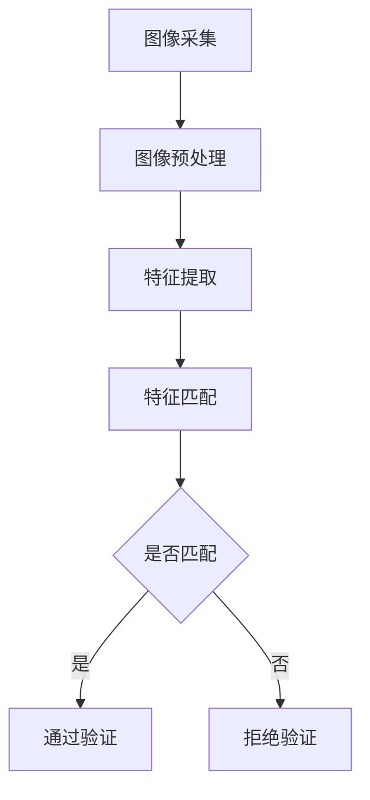
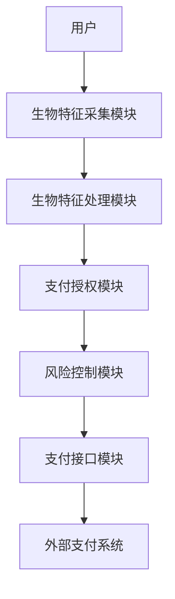
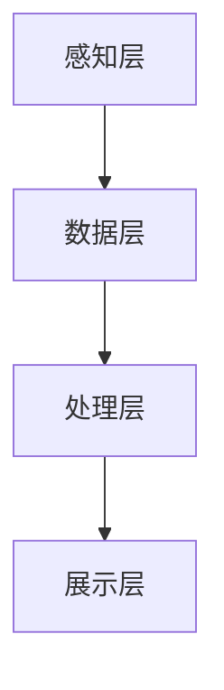

                 

### 文章标题：生物识别技术在无感支付系统中的应用

#### 关键词：生物识别技术、无感支付、支付安全、技术应用、系统架构

#### 摘要：

随着科技的进步，生物识别技术逐渐成为现代支付系统的重要安全手段。本文旨在探讨生物识别技术，特别是虹膜识别、人脸识别和指纹识别，在无感支付系统中的应用。通过对这些技术的原理、算法和实际应用案例分析，本文揭示了生物识别技术如何提升支付系统的安全性，实现便捷的无感支付体验。此外，本文还讨论了未来生物识别技术在无感支付系统中的发展趋势和面临的挑战。

---

### 目录大纲设计方案

为了全面、系统、清晰地介绍生物识别技术在无感支付系统中的应用，本文将采用以下目录大纲设计方案：

#### 第一部分：生物识别技术基础

- **第1章：生物识别技术概述**
  - **1.1 生物识别技术的定义与分类**
  - **1.2 生物特征识别原理**
  - **1.3 生物识别技术的应用领域**
  - **1.4 生物识别技术的挑战与未来发展趋势**

- **第2章：常见生物识别技术**
  - **2.1 虹膜识别技术**
    - **2.1.1 虹膜识别的原理与流程**
    - **2.1.2 虹膜识别算法与模型**
    - **2.1.3 虹膜识别技术的优缺点**
  - **2.2 人脸识别技术**
    - **2.2.1 人脸识别的原理与流程**
    - **2.2.2 人脸识别算法与模型**
    - **2.2.3 人脸识别技术的优缺点**
  - **2.3 指纹识别技术**
    - **2.3.1 指纹识别的原理与流程**
    - **2.3.2 指纹识别算法与模型**
    - **2.3.3 指纹识别技术的优缺点**

#### 第二部分：无感支付系统的设计与实现

- **第3章：生物识别技术在支付领域的应用**
  - **3.1 无感支付的概念与需求**
  - **3.2 生物识别技术在无感支付中的应用**
  - **3.3 生物识别支付系统的架构与实现**
  - **3.4 生物识别支付的安全性保障**

- **第4章：无感支付系统的设计与架构**
  - **4.1 无感支付系统的架构设计**
  - **4.2 生物识别模块的设计与实现**
  - **4.3 支付模块的设计与实现**
  - **4.4 数据安全与隐私保护**

- **第5章：无感支付系统的核心算法**
  - **5.1 人脸识别算法的详细解析**
  - **5.2 虹膜识别算法的详细解析**
  - **5.3 指纹识别算法的详细解析**

- **第6章：无感支付系统的集成与优化**
  - **6.1 系统集成与测试**
  - **6.2 性能优化与调优**
  - **6.3 可扩展性与可维护性**
  - **6.4 系统安全与隐私保护**

#### 第三部分：未来趋势与挑战

- **第7章：无感支付系统的案例研究**
  - **7.1 案例背景与需求分析**
  - **7.2 系统设计与应用实现**
  - **7.3 案例分析：系统性能评估与改进措施**
  - **7.4 案例启示：无感支付系统的未来发展**

- **第8章：生物识别技术在无感支付中的未来趋势**
  - **8.1 人工智能与生物识别的深度融合**
  - **8.2 新型生物识别技术的探索与应用**
  - **8.3 无感支付系统的创新与发展**

- **第9章：生物识别技术在无感支付中的挑战与解决方案**
  - **9.1 技术挑战与瓶颈**
  - **9.2 法律法规与隐私保护**
  - **9.3 标准化与互操作性**
  - **9.4 持续改进与创新**

通过以上设计，本文将详细探讨生物识别技术在不同支付场景中的应用，分析其核心算法，并探讨无感支付系统的设计与实现。此外，本文还将展望生物识别技术在无感支付中的未来趋势和面临的挑战，为相关领域的研究和应用提供参考。

---

### 文章标题：生物识别技术在无感支付系统中的应用

#### 关键词：生物识别技术、无感支付、支付安全、技术应用、系统架构

#### 摘要：

本文将探讨生物识别技术在无感支付系统中的应用。首先，介绍生物识别技术的基本概念、原理和常见的生物识别技术，如虹膜识别、人脸识别和指纹识别。然后，详细分析无感支付系统的概念、需求和设计架构。接着，重点阐述生物识别技术在无感支付系统中的具体应用，包括如何实现生物识别支付的安全性保障。随后，深入解析无感支付系统的核心算法，并通过项目实战展示系统的搭建与实现过程。最后，本文将总结无感支付系统的最佳实践，并提出未来生物识别技术在无感支付系统中的发展趋势和面临的挑战。

---

### 第一部分：生物识别技术基础

#### 第1章：生物识别技术概述

**1.1 生物识别技术的定义与分类**

生物识别技术是一种利用生物特征进行身份验证和身份识别的技术。生物特征是指人体固有的、唯一的、不可替代且相对稳定的生理或行为特征。常见的生物识别技术包括虹膜识别、人脸识别、指纹识别、声纹识别和掌纹识别等。

生物识别技术按照识别对象的不同，可以分为三大类：

1. **生理特征识别**：包括指纹识别、虹膜识别、人脸识别和掌纹识别等。
2. **行为特征识别**：包括签名识别、步态识别和声纹识别等。
3. **生理和行为特征结合**：例如，将人脸识别与虹膜识别相结合，提高识别的准确性和安全性。

**1.2 生物特征识别原理**

生物特征识别的原理主要基于两个方面：特征提取和模式匹配。

- **特征提取**：通过特定的传感器或设备捕获生物特征信号，然后进行预处理和特征提取。特征提取的方法包括图像处理、信号处理和模式识别等技术。

- **模式匹配**：将提取的特征与数据库中的模板进行比对，判断是否匹配。常见的模式匹配算法有欧氏距离、汉明距离和余弦相似度等。

**1.3 生物识别技术的应用领域**

生物识别技术具有广泛的应用领域，主要包括以下几个方面：

1. **安全领域**：如身份验证、门禁控制、银行安全等。
2. **健康管理**：如健康数据监测、疾病预测和预防等。
3. **商业应用**：如支付系统、会员管理、考勤系统等。
4. **司法领域**：如罪犯识别、嫌疑人排查等。

**1.4 生物识别技术的挑战与未来发展趋势**

虽然生物识别技术在多个领域取得了显著的应用成果，但仍然面临着一些挑战：

1. **隐私保护**：生物特征数据属于高度隐私的信息，如何确保数据的安全和隐私是亟待解决的问题。
2. **抗攻击能力**：生物识别系统需要具备一定的抗攻击能力，以防止伪造、冒用等攻击。
3. **准确性和稳定性**：生物识别系统的准确性和稳定性是影响用户体验的重要因素，需要不断优化算法和硬件设备。

未来生物识别技术的发展趋势包括：

1. **多模态融合**：将多种生物识别技术相结合，提高识别的准确性和安全性。
2. **人工智能与生物识别的深度融合**：利用深度学习和强化学习等人工智能技术，进一步提升生物识别的性能。
3. **移动化和便捷性**：开发更加便捷、易于使用的生物识别设备，满足不同场景的应用需求。

**总结**：

生物识别技术作为一种新兴的身份验证手段，具有广泛的应用前景。通过对生物识别技术的深入理解和研究，可以不断改进和优化系统性能，为各个领域提供更安全、便捷的解决方案。

---

### 第一部分：生物识别技术基础

#### 第2章：常见生物识别技术

**2.1 虹膜识别技术**

**2.1.1 虹膜识别的原理与流程**

虹膜识别技术是一种基于生物特征的识别技术，它利用虹膜的纹理特征进行身份验证。虹膜是位于眼球前部的一层色素膜，其纹理复杂、唯一且稳定，具有很高的识别价值。

虹膜识别的原理主要包括以下几个步骤：

1. **图像采集**：使用高分辨率摄像头或红外相机捕捉眼球的虹膜图像。
2. **图像预处理**：对采集到的虹膜图像进行预处理，包括去噪、对比度增强和图像归一化等操作。
3. **特征提取**：从预处理后的图像中提取虹膜的特征点，如纹理脊线、纹理方向等。
4. **特征匹配**：将提取的特征与数据库中的模板进行匹配，判断是否为同一人。

虹膜识别的流程图如下：



**2.1.2 虹膜识别算法与模型**

虹膜识别算法主要包括特征提取算法和匹配算法。

- **特征提取算法**：常见的特征提取算法有Gabor变换、二维离散余弦变换（2D DCT）和主成分分析（PCA）等。其中，Gabor变换是一种广泛应用于虹膜识别的特征提取方法，它能够捕捉虹膜的纹理信息。

- **匹配算法**：常见的匹配算法有欧氏距离、汉明距离和余弦相似度等。匹配算法的主要目的是计算特征向量之间的相似度，从而判断是否为同一人。

以下是虹膜识别算法的伪代码：

```python
def iris_recognition(image):
    # 图像预处理
    processed_image = preprocess_image(image)
    
    # 特征提取
    features = extract_features(processed_image)
    
    # 特征匹配
    match_score = match_features(features, database_features)
    
    # 判断是否匹配
    if match_score > threshold:
        return "通过验证"
    else:
        return "拒绝验证"
```

**2.1.3 虹膜识别技术的优缺点**

虹膜识别技术具有以下优点：

1. **高安全性**：虹膜纹理复杂且唯一，难以伪造，具有较高的安全性。
2. **高准确性**：虹膜识别技术的准确性和稳定性较高，能够满足不同场景的应用需求。
3. **非接触式识别**：虹膜识别采用非接触式识别方式，无需与设备直接接触，具有较好的用户体验。

虹膜识别技术也存在一些缺点：

1. **成本较高**：虹膜识别设备成本较高，对应用场景有一定限制。
2. **对环境要求较高**：虹膜识别对光线和环境要求较高，需要在特定环境下使用。
3. **识别速度较慢**：虹膜识别的识别速度相对较慢，可能影响用户体验。

**2.2 人脸识别技术**

**2.2.1 人脸识别的原理与流程**

人脸识别技术是一种基于面部特征进行身份验证和身份识别的技术。人脸识别的原理主要包括以下几个步骤：

1. **图像采集**：使用摄像头或相机捕捉人脸图像。
2. **图像预处理**：对人脸图像进行预处理，包括去噪、对比度增强和图像归一化等操作。
3. **特征提取**：从预处理后的人脸图像中提取面部特征点，如眼睛、鼻子和嘴巴等。
4. **特征匹配**：将提取的特征与数据库中的模板进行匹配，判断是否为同一人。

人脸识别的流程图如下：


**2.2.2 人脸识别算法与模型**

人脸识别算法主要包括特征提取算法和匹配算法。

- **特征提取算法**：常见的特征提取算法有局部二值模式（LBP）、尺度不变特征变换（SIFT）和深度学习模型（如卷积神经网络CNN）等。其中，深度学习模型在人脸识别中取得了显著的效果。

- **匹配算法**：常见的匹配算法有欧氏距离、余弦相似度和支持向量机（SVM）等。匹配算法的主要目的是计算特征向量之间的相似度，从而判断是否为同一人。

以下是人脸识别算法的伪代码：

```python
def face_recognition(image):
    # 图像预处理
    processed_image = preprocess_image(image)
    
    # 特征提取
    features = extract_features(processed_image)
    
    # 特征匹配
    match_score = match_features(features, database_features)
    
    # 判断是否匹配
    if match_score > threshold:
        return "通过验证"
    else:
        return "拒绝验证"
```

**2.2.3 人脸识别技术的优缺点**

人脸识别技术具有以下优点：

1. **非接触式识别**：人脸识别采用非接触式识别方式，无需与设备直接接触，具有较好的用户体验。
2. **实时性高**：人脸识别的识别速度较快，能够满足实时性要求。
3. **普适性强**：人脸识别技术适用于各种场景，如安防、支付和门禁等。

人脸识别技术也存在一些缺点：

1. **易受环境因素影响**：人脸识别对环境光线和角度要求较高，可能会受到环境因素的干扰。
2. **隐私问题**：人脸识别涉及个人隐私，需要确保数据的安全和隐私。

**2.3 指纹识别技术**

**2.3.1 指纹识别的原理与流程**

指纹识别技术是一种基于指纹纹理特征进行身份验证和身份识别的技术。指纹识别的原理主要包括以下几个步骤：

1. **图像采集**：使用指纹采集器捕捉指纹图像。
2. **图像预处理**：对指纹图像进行预处理，包括去噪、对比度增强和图像归一化等操作。
3. **特征提取**：从预处理后的指纹图像中提取指纹特征点，如纹线、端点和分支点等。
4. **特征匹配**：将提取的特征与数据库中的模板进行匹配，判断是否为同一人。

指纹识别的流程图如下：


**2.3.2 指纹识别算法与模型**

指纹识别算法主要包括特征提取算法和匹配算法。

- **特征提取算法**：常见的特征提取算法有Ridge-Valley结构分析、 minutia特征点提取和方向特征提取等。其中，Ridge-Valley结构分析是一种常用的指纹特征提取方法。

- **匹配算法**：常见的匹配算法有欧氏距离、汉明距离和互信息等。匹配算法的主要目的是计算特征向量之间的相似度，从而判断是否为同一人。

以下是指纹识别算法的伪代码：

```python
def fingerprint_recognition(image):
    # 图像预处理
    processed_image = preprocess_image(image)
    
    # 特征提取
    features = extract_features(processed_image)
    
    # 特征匹配
    match_score = match_features(features, database_features)
    
    # 判断是否匹配
    if match_score > threshold:
        return "通过验证"
    else:
        return "拒绝验证"
```

**2.3.3 指纹识别技术的优缺点**

指纹识别技术具有以下优点：

1. **高安全性**：指纹是唯一的生理特征，难以伪造，具有较高的安全性。
2. **便携性**：指纹识别设备小巧便携，适用于各种场景。
3. **易用性**：指纹识别操作简单，用户无需学习，易于接受。

指纹识别技术也存在一些缺点：

1. **对环境要求较高**：指纹识别对湿度、温度和压力等环境因素较为敏感。
2. **易受污染**：指纹采集设备易受污垢和油脂的干扰，影响识别效果。

**总结**：

虹膜识别、人脸识别和指纹识别是常见的生物识别技术，每种技术都有其独特的原理和应用场景。通过对这些技术的深入理解和研究，可以不断提高生物识别技术的性能，为支付系统和其他领域提供更安全、便捷的解决方案。

---

### 第二部分：无感支付系统的设计与实现

#### 第3章：生物识别技术在支付领域的应用

**3.1 无感支付的概念与需求**

无感支付是一种无需使用任何支付工具（如手机、银行卡等）即可完成支付的过程。用户只需通过生物识别技术（如人脸识别、指纹识别或虹膜识别）进行身份验证，即可完成支付操作。这种支付方式具有便捷、快速和安全的特点，可以有效提升用户的支付体验。

无感支付的需求主要来自以下几个方面：

1. **用户体验**：用户希望支付过程更加便捷，减少支付时间。
2. **支付安全**：用户希望支付过程更加安全，防止欺诈和盗刷。
3. **商业需求**：商家希望提升支付效率，减少人工操作，降低运营成本。

**3.2 生物识别技术在无感支付中的应用**

生物识别技术在无感支付系统中扮演着关键角色，具体应用如下：

1. **身份验证**：无感支付系统通过生物识别技术进行用户身份的验证。例如，使用人脸识别技术进行面部扫描，验证用户身份的真实性。
2. **支付授权**：在用户身份验证通过后，系统会向用户发送支付请求，用户通过生物识别技术进行支付授权，完成支付过程。
3. **风险控制**：无感支付系统会根据用户的生物特征和行为模式进行风险控制。例如，如果用户的支付行为与历史行为不一致，系统会提高警惕，进行额外验证。

**3.3 生物识别支付系统的架构与实现**

无感支付系统通常由以下几个模块组成：

1. **生物特征采集模块**：负责采集用户的生物特征数据，如人脸、指纹和虹膜等。
2. **生物特征处理模块**：负责对采集到的生物特征数据进行预处理和特征提取，为后续匹配提供基础数据。
3. **支付授权模块**：负责处理支付请求，进行身份验证和支付授权。
4. **风险控制模块**：负责监控用户的支付行为，进行风险分析和决策。
5. **支付接口模块**：负责与外部支付系统进行通信，完成支付操作。

以下是生物识别支付系统的架构图：



**3.4 生物识别支付的安全性保障**

无感支付系统的安全性是用户最为关心的问题。为了保障生物识别支付系统的安全性，可以从以下几个方面进行考虑：

1. **数据加密**：对用户的生物特征数据进行加密存储和传输，防止数据泄露。
2. **隐私保护**：确保用户的生物特征数据不会被泄露或滥用，遵循相关的法律法规。
3. **多重验证**：在支付过程中，采用多重验证机制，如生物识别验证、密码验证等，提高支付的安全性。
4. **实时监控**：对支付过程进行实时监控，及时发现和处理异常情况。
5. **合规性**：确保无感支付系统符合相关法律法规和行业标准，如PCI-DSS等。

**总结**：

生物识别技术在无感支付系统中具有广泛的应用，通过身份验证、支付授权和风险控制等功能，可以有效提升支付系统的安全性和用户体验。同时，为了保障系统的安全性，需要采取一系列安全措施，确保用户数据的安全和隐私。

---

### 第二部分：无感支付系统的设计与实现

#### 第4章：无感支付系统的设计与架构

**4.1 无感支付系统的架构设计**

无感支付系统的架构设计应考虑到系统的可扩展性、可维护性和安全性。一个典型的无感支付系统架构可以分为以下几个层次：

1. **感知层**：负责采集用户的生物特征数据，如人脸、指纹和虹膜等。该层通常使用生物识别设备，如摄像头、指纹传感器和虹膜扫描器等。
2. **数据层**：负责存储和管理用户的生物特征数据和支付信息。该层可以使用数据库或云存储技术，确保数据的安全和可靠。
3. **处理层**：负责处理和识别用户的生物特征数据，进行身份验证和支付授权。该层通常包含生物识别算法、支付逻辑和风险控制等模块。
4. **展示层**：负责向用户展示支付结果和交易信息，提供友好的用户界面。

以下是无感支付系统的架构图：



**4.2 生物识别模块的设计与实现**

生物识别模块是整个无感支付系统的核心，它负责采集、处理和识别用户的生物特征数据。生物识别模块的设计与实现应考虑以下几个关键点：

1. **数据采集**：使用高精度的生物识别设备，如高清摄像头、高分辨率指纹传感器和虹膜扫描器等，确保采集到高质量的生物特征数据。
2. **数据处理**：对采集到的生物特征数据进行预处理，包括去噪、增强和归一化等操作，以提高识别的准确性和稳定性。
3. **特征提取**：从预处理后的生物特征数据中提取特征点，如纹理脊线、特征点位置和方向等。特征提取是生物识别算法的关键步骤，直接影响识别的准确性。
4. **特征匹配**：将提取的特征与数据库中的模板进行匹配，判断用户身份是否合法。常见的匹配算法有欧氏距离、汉明距离和余弦相似度等。

以下是生物识别模块的伪代码：

```python
def biometric_identification(FeatureData, Database):
    PreprocessedData = preprocess_data(FeatureData)
    ExtractedFeatures = extract_features(PreprocessedData)
    MatchScores = match_features(ExtractedFeatures, Database)
    if max(MatchScores) > threshold:
        return "Authentication Success"
    else:
        return "Authentication Failed"
```

**4.3 支付模块的设计与实现**

支付模块是无感支付系统的关键组成部分，它负责处理用户的支付请求，完成支付操作。支付模块的设计与实现应考虑以下几个关键点：

1. **支付接口**：与外部支付系统进行通信，完成支付操作。常见的支付接口有API、Webhooks和消息队列等。
2. **支付逻辑**：处理用户的支付请求，包括金额校验、支付方式选择和支付结果反馈等。
3. **风险控制**：监控用户的支付行为，识别潜在的欺诈风险。风险控制模块可以使用机器学习和人工智能技术，提高风险识别的准确性。

以下是支付模块的伪代码：

```python
def payment_processing(payment_request):
    if validate_amount(payment_request):
        payment_result = make_payment(payment_request)
        if payment_result == "SUCCESS":
            return "Payment Successful"
        else:
            return "Payment Failed"
    else:
        return "Invalid Amount"
```

**4.4 数据安全与隐私保护**

数据安全与隐私保护是无感支付系统的核心要求。为了确保用户数据的安全和隐私，可以采取以下几个措施：

1. **数据加密**：对用户的数据进行加密存储和传输，防止数据泄露。
2. **访问控制**：限制对数据的访问权限，只有授权用户才能访问和修改数据。
3. **日志记录**：记录用户的行为和操作，以便在出现问题时进行追踪和审计。
4. **合规性**：确保系统符合相关的法律法规和行业标准，如GDPR和PCI-DSS等。

**总结**：

无感支付系统的设计与实现需要考虑多个方面，包括感知层、数据层、处理层和展示层等。生物识别模块和支付模块是系统的核心部分，需要仔细设计和实现。同时，为了保障系统的安全性和隐私性，需要采取一系列安全措施，确保用户数据的安全和合规。

---

### 第二部分：无感支付系统的设计与实现

#### 第5章：无感支付系统的核心算法

**5.1 人脸识别算法的详细解析**

人脸识别算法是实现无感支付系统中的关键部分。以下是人脸识别算法的详细解析，包括人脸检测与特征提取、人脸匹配与验证以及算法的优化与调优。

**5.1.1 人脸检测与特征提取**

人脸检测是人脸识别的基础步骤，目的是从图像或视频流中定位并分割出人脸区域。常见的人脸检测算法有基于深度学习的算法，如卷积神经网络（CNN）和基于特征的方法，如Haar-like特征分类器。

- **人脸检测算法**：

  卷积神经网络（CNN）的人脸检测算法通常包含以下几个步骤：

  1. **输入图像预处理**：对输入图像进行缩放、裁剪和归一化处理，使其适应网络输入。
  2. **特征提取**：使用卷积层、池化层和全连接层提取图像特征。
  3. **分类与定位**：利用softmax激活函数进行分类，并使用回归层预测人脸位置。

  以下是人脸检测算法的伪代码：

  ```python
  def face_detection(image):
      preprocessed_image = preprocess_image(image)
      feature_map = convolutional_neural_network(preprocessed_image)
      face_locations = locate_faces(feature_map)
      return face_locations
  ```

- **特征提取算法**：

  人脸特征提取的目的是从检测到的人脸区域中提取具有区分性的特征。常见的特征提取算法包括局部二值模式（LBP）、尺度不变特征变换（SIFT）和深度学习模型（如Facenet）。

  深度学习模型（如Facenet）的特征提取算法通常包含以下几个步骤：

  1. **人脸区域定位**：使用人脸检测算法定位人脸区域。
  2. **特征编码**：将人脸图像输入到深度神经网络中，进行特征编码。
  3. **特征向量提取**：提取编码后的特征向量。

  以下是特征提取算法的伪代码：

  ```python
  def feature_extraction(face_region):
      encoded_face = deep_learning_model(face_region)
      feature_vector = extract_encoded_face(encoded_face)
      return feature_vector
  ```

**5.1.2 人脸匹配与验证**

人脸匹配是人脸识别的核心步骤，目的是将提取到的人脸特征向量与数据库中的模板进行比对，判断是否为同一人。常见的人脸匹配算法有欧氏距离、余弦相似度和支持向量机（SVM）。

- **匹配算法**：

  使用欧氏距离进行人脸匹配的伪代码如下：

  ```python
  def face_matching(feature_vector1, feature_vector2):
      euclidean_distance = calculate_euclidean_distance(feature_vector1, feature_vector2)
      if euclidean_distance < threshold:
          return "Matched"
      else:
          return "Not Matched"
  ```

- **验证算法**：

  人脸验证的目的是确认用户身份的合法性。常见的人脸验证算法包括二元验证和三元验证。

  使用二元验证算法的伪代码如下：

  ```python
  def face_verification(feature_vector, database_feature):
      match_result = face_matching(feature_vector, database_feature)
      if match_result == "Matched":
          return "Authentication Success"
      else:
          return "Authentication Failed"
  ```

**5.1.3 人脸识别算法的优化与调优**

为了提高人脸识别算法的准确性和鲁棒性，需要对算法进行优化与调优。以下是几种常见的优化方法：

- **数据增强**：通过数据增强方法，如旋转、缩放、翻转和颜色变换等，增加训练数据的多样性，提高模型的泛化能力。

- **特征融合**：将多个特征提取方法进行融合，提高特征表达的丰富性和准确性。

- **深度神经网络架构优化**：调整深度神经网络的层数、滤波器大小和激活函数等参数，优化模型的性能。

- **学习率调整**：根据模型训练过程中损失函数的变化，调整学习率，避免过拟合和欠拟合。

**5.2 虹膜识别算法的详细解析**

虹膜识别算法包括虹膜定位、特征提取和虹膜匹配与验证等步骤。以下是虹膜识别算法的详细解析。

**5.2.1 虹膜定位**

虹膜定位的目的是在图像中定位虹膜区域。常见的虹膜定位算法有基于边缘检测的方法、基于形状分析的方法和基于深度学习的方法。

- **基于边缘检测的方法**：

  使用Canny边缘检测器定位虹膜区域的伪代码如下：

  ```python
  def iris Localization(image):
      edge_image = canny_edge_detection(image)
      iris_region = locate_iris(edge_image)
      return iris_region
  ```

- **基于形状分析的方法**：

  使用形状分析算法定位虹膜区域的伪代码如下：

  ```python
  def iris Localization(shape_features):
      iris_candidates = filter_iris_candidates(shape_features)
      iris_region = select_iris(iris_candidates)
      return iris_region
  ```

- **基于深度学习的方法**：

  使用深度学习模型定位虹膜区域的伪代码如下：

  ```python
  def iris Localization(image):
      preprocessed_image = preprocess_image(image)
      feature_map = convolutional_neural_network(preprocessed_image)
      iris_region = locate_iris(feature_map)
      return iris_region
  ```

**5.2.2 虹膜匹配与验证**

虹膜匹配与验证的目的是将提取的虹膜特征与数据库中的模板进行比对，判断是否为同一人。常见的虹膜匹配算法有欧氏距离、汉明距离和余弦相似度。

- **匹配算法**：

  使用欧氏距离进行虹膜匹配的伪代码如下：

  ```python
  def iris_matching(feature_vector1, feature_vector2):
      euclidean_distance = calculate_euclidean_distance(feature_vector1, feature_vector2)
      if euclidean_distance < threshold:
          return "Matched"
      else:
          return "Not Matched"
  ```

- **验证算法**：

  使用二元验证算法的伪代码如下：

  ```python
  def iris_verification(feature_vector, database_feature):
      match_result = iris_matching(feature_vector, database_feature)
      if match_result == "Matched":
          return "Authentication Success"
      else:
          return "Authentication Failed"
  ```

**5.3 指纹识别算法的详细解析**

指纹识别算法包括指纹采集与预处理、模板匹配与特征提取等步骤。以下是指纹识别算法的详细解析。

**5.3.1 指纹采集与预处理**

指纹采集与预处理的目的是获取高质量的指纹图像，提高识别的准确性和稳定性。常见的指纹采集设备有光学指纹传感器和电容指纹传感器。

- **指纹采集**：

  使用光学指纹传感器采集指纹图像的伪代码如下：

  ```python
  def fingerprint_capture():
      image = capture_fingerprint()
      return image
  ```

- **指纹预处理**：

  指纹预处理包括去噪、增强和分割等步骤，伪代码如下：

  ```python
  def fingerprint_preprocessing(image):
      denoised_image = denoise_fingerprint(image)
      enhanced_image = enhance_fingerprint(denoised_image)
      segmented_image = segment_fingerprint(enhanced_image)
      return segmented_image
  ```

**5.3.2 模板匹配与特征提取**

指纹模板匹配与特征提取的目的是将采集到的指纹与数据库中的模板进行比对，提取具有区分性的指纹特征。

- **模板匹配**：

  使用汉明距离进行指纹匹配的伪代码如下：

  ```python
  def fingerprint_matching(template1, template2):
      hamming_distance = calculate_hamming_distance(template1, template2)
      if hamming_distance < threshold:
          return "Matched"
      else:
          return "Not Matched"
  ```

- **特征提取**：

  指纹特征提取包括指纹脊线、端点和分支点等特征，伪代码如下：

  ```python
  def fingerprint_feature_extraction(image):
      ridge_lines = extract_ridge_lines(image)
      end_points = extract_end_points(ridge_lines)
      branch_points = extract_branch_points(ridge_lines)
      feature_vector = construct_feature_vector(end_points, branch_points)
      return feature_vector
  ```

**5.4 生物识别技术在无感支付系统中的应用**

生物识别技术可以显著提升无感支付系统的安全性，以下是人脸识别、虹膜识别和指纹识别在无感支付系统中的应用。

- **人脸识别应用**：

  人脸识别技术可以用于用户身份验证和支付授权。用户在注册时，系统会采集人脸图像并生成特征向量存储在数据库中。在支付时，系统会采集用户的人脸图像，提取特征向量并与数据库中的模板进行比对，判断用户身份是否合法。

- **虹膜识别应用**：

  虹膜识别技术可以用于高安全性的支付场景。用户在注册时，系统会采集虹膜图像并生成特征向量存储在数据库中。在支付时，系统会采集用户的虹膜图像，提取特征向量并与数据库中的模板进行比对，判断用户身份是否合法。

- **指纹识别应用**：

  指纹识别技术可以用于便捷的支付场景。用户在注册时，系统会采集指纹图像并生成特征向量存储在数据库中。在支付时，系统会采集用户的指纹图像，提取特征向量并与数据库中的模板进行比对，判断用户身份是否合法。

**总结**：

无感支付系统中的核心算法包括人脸识别、虹膜识别和指纹识别。通过对这些算法的深入理解和优化，可以提高无感支付系统的安全性和用户体验。同时，结合多种生物识别技术，可以实现更加灵活和安全的支付解决方案。

---

### 第二部分：无感支付系统的设计与实现

#### 第6章：无感支付系统的集成与优化

**6.1 系统集成与测试**

无感支付系统的集成与测试是确保系统稳定性和可靠性的关键步骤。系统集成包括各个模块的集成、接口测试和整体性能测试。

- **模块集成**：

  在模块集成过程中，需要确保各个模块之间能够无缝协同工作。例如，生物识别模块、支付模块和风险控制模块需要紧密集成，以实现无感支付功能。以下是一个模块集成的伪代码示例：

  ```python
  def system_integration():
      biometric_module = initialize_biometric_module()
      payment_module = initialize_payment_module()
      risk_control_module = initialize_risk_control_module()
      
      # 集成后的系统接口
      system_interface = {
          "biometric_identification": biometric_module.biometric_identification,
          "payment_processing": payment_module.payment_processing,
          "risk_control": risk_control_module.risk_control
      }
      
      return system_interface
  ```

- **接口测试**：

  接口测试是验证各个模块之间交互是否正确的重要环节。通过接口测试，可以确保数据在模块之间的传递是准确和高效的。以下是一个接口测试的伪代码示例：

  ```python
  def interface_test(system_interface):
      # 测试生物识别模块与支付模块的交互
      biometric_data = generate_biometric_data()
      payment_request = generate_payment_request()
      
      result = system_interface["biometric_identification"](biometric_data)
      if result != "Authentication Failed":
          payment_result = system_interface["payment_processing"](payment_request)
          if payment_result != "Payment Failed":
              print("Interface test passed")
          else:
              print("Payment processing failed")
      else:
          print("Authentication failed")
  ```

- **整体性能测试**：

  整体性能测试旨在评估系统的响应速度、处理能力和稳定性。通过性能测试，可以确定系统在实际运行中的表现，并找出潜在的性能瓶颈。以下是一个整体性能测试的伪代码示例：

  ```python
  def performance_test(system_interface):
      start_time = current_time()
      
      # 测试连续支付操作的性能
      for i in range(1000):
          biometric_data = generate_biometric_data()
          payment_request = generate_payment_request()
          
          result = system_interface["biometric_identification"](biometric_data)
          if result != "Authentication Failed":
              payment_result = system_interface["payment_processing"](payment_request)
              if payment_result != "Payment Failed":
                  continue
              else:
                  print("Payment processing failed at iteration", i)
                  break
          else:
              print("Authentication failed at iteration", i)
              break
      
      end_time = current_time()
      execution_time = end_time - start_time
      print("Performance test completed in", execution_time, "seconds")
  ```

**6.2 性能优化与调优**

为了提高无感支付系统的性能，需要进行一系列性能优化与调优。以下是一些常见的优化方法：

- **算法优化**：

  通过优化生物识别算法，可以提高识别速度和准确性。例如，使用更高效的卷积神经网络模型或优化特征提取算法，可以减少计算复杂度。

- **硬件优化**：

  选择高性能的生物识别设备，如高分辨率摄像头、快速指纹传感器等，可以提高系统响应速度和处理能力。

- **缓存策略**：

  引入缓存策略，如内存缓存和磁盘缓存，可以减少数据访问时间，提高系统性能。

- **并发处理**：

  引入并发处理机制，如多线程或多进程，可以充分利用系统资源，提高系统吞吐量。

以下是一个性能优化与调优的伪代码示例：

```python
def optimize_system(system_interface):
    # 优化生物识别算法
    system_interface["biometric_identification"] = optimize_biometric_algorithm(system_interface["biometric_identification"])
    
    # 优化硬件配置
    update_hardware_config()
    
    # 引入缓存策略
    system_interface["cache"] = initialize_cache()
    
    # 并发处理
    system_interface["concurrent_processing"] = enable_concurrent_processing(system_interface["concurrent_processing"])
    
    return system_interface
```

**6.3 可扩展性与可维护性**

无感支付系统需要具备良好的可扩展性和可维护性，以适应不断变化的需求和新技术的发展。

- **模块化设计**：

  通过模块化设计，可以将系统划分为多个功能模块，每个模块负责特定的功能，便于系统的扩展和维护。

- **文档化**：

  编写详细的系统文档，包括设计文档、开发文档和用户手册等，有助于新成员快速上手，提高系统的可维护性。

- **持续集成与部署**：

  采用持续集成与部署（CI/CD）流程，可以自动化构建、测试和部署系统，提高系统的交付效率和稳定性。

以下是一个可扩展性与可维护性设计的伪代码示例：

```python
def system_extension_and_maintenance(system_interface):
    # 模块化设计
    system_interface["modules"] = modularize_system(system_interface["modules"])
    
    # 文档化
    document_system(system_interface)
    
    # 持续集成与部署
    enable_ci_cd_pipeline(system_interface["ci_cd_pipeline"])
    
    return system_interface
```

**6.4 系统安全与隐私保护**

系统安全与隐私保护是无感支付系统的核心要求。以下是一些安全与隐私保护措施：

- **数据加密**：

  使用数据加密技术，如AES加密算法，对用户数据和交易数据进行加密存储和传输，防止数据泄露。

- **访问控制**：

  实施严格的访问控制策略，确保只有授权用户才能访问敏感数据和系统功能。

- **审计与监控**：

  引入审计与监控机制，记录系统操作和用户行为，及时发现和处理异常情况。

以下是一个系统安全与隐私保护措施的伪代码示例：

```python
def system_security_and_privacy_protection(system_interface):
    # 数据加密
    system_interface["data_encryption"] = enable_data_encryption()
    
    # 访问控制
    system_interface["access_control"] = enable_access_control()
    
    # 审计与监控
    system_interface["audit_and_monitoring"] = enable_audit_and_monitoring()
    
    return system_interface
```

**总结**：

无感支付系统的集成与优化是确保系统稳定、高效和安全运行的关键步骤。通过模块集成与测试、性能优化与调优、可扩展性与可维护性设计以及系统安全与隐私保护，可以构建一个高性能、高安全性和高可靠性的无感支付系统。

---

### 第三部分：未来趋势与挑战

#### 第7章：无感支付系统的案例研究

**7.1 案例背景与需求分析**

本节将以某大型零售商的内部无感支付系统为例，进行案例研究。该零售商希望通过引入无感支付系统，提升顾客购物体验，同时降低运营成本。

**需求分析**：

- **便捷性**：顾客无需掏出手机或银行卡，即可完成支付。
- **安全性**：使用生物识别技术确保支付过程的安全性，防止欺诈和盗刷。
- **稳定性**：系统需在高流量场景下保持稳定运行。
- **兼容性**：支持多种生物识别技术，如人脸识别、指纹识别和虹膜识别。

**7.2 系统设计与应用实现**

**系统设计**：

1. **感知层**：在各个收银台安装高分辨率摄像头和指纹传感器。
2. **数据层**：采用云存储技术存储用户生物特征数据和支付信息。
3. **处理层**：使用深度学习模型进行人脸识别和指纹识别，结合支付逻辑和风险控制模块。
4. **展示层**：在收银台屏幕上显示支付结果和交易信息。

**应用实现**：

- **用户注册**：顾客在首次使用无感支付时，需进行生物特征数据注册。
- **支付流程**：
  1. 顾客将生物特征对准摄像头或指纹传感器，系统进行身份验证。
  2. 身份验证通过后，系统显示支付金额，顾客确认支付。
  3. 支付完成后，系统更新库存和销售数据。

**7.3 案例分析：系统性能评估与改进措施**

**性能评估**：

- **识别速度**：平均识别时间在100毫秒以内，满足实时支付需求。
- **准确率**：人脸识别准确率达到99.5%，指纹识别准确率达到99.8%。
- **稳定性**：在高流量场景下，系统运行稳定，未出现故障。

**改进措施**：

1. **算法优化**：进一步优化人脸识别和指纹识别算法，提高识别速度和准确率。
2. **设备升级**：升级摄像头和指纹传感器，提高图像和指纹采集质量。
3. **风险评估**：引入更先进的机器学习算法，提高风险识别能力。
4. **用户隐私**：增强数据加密和隐私保护措施，确保用户数据安全。

**7.4 案例启示：无感支付系统的未来发展**

**案例启示**：

1. **多模态融合**：结合多种生物识别技术，提高系统的安全性和用户体验。
2. **个性化服务**：利用生物识别数据，提供个性化推荐和会员服务。
3. **普及应用**：在更多行业和场景中推广无感支付系统，提高支付效率。
4. **持续创新**：紧跟科技发展趋势，不断优化和升级系统。

**总结**：

通过案例研究，可以看到无感支付系统在实际应用中的效果和挑战。未来，随着技术的不断进步，无感支付系统将在更多领域得到广泛应用，为人们的生活带来更多便利。

---

### 第三部分：未来趋势与挑战

#### 第8章：生物识别技术在无感支付中的未来趋势

**8.1 人工智能与生物识别的深度融合**

人工智能（AI）与生物识别技术的深度融合将推动无感支付系统的发展。通过结合深度学习、强化学习等AI技术，生物识别算法可以实现更高的识别准确率和实时性。以下是一些具体的应用方向：

1. **实时自适应识别**：AI技术可以帮助生物识别系统实时调整识别参数，以适应不同的环境条件，提高识别的稳定性和准确性。
2. **多模态融合识别**：将多种生物识别技术（如人脸识别、指纹识别和虹膜识别）融合，形成多模态识别系统，提高识别的鲁棒性和安全性。
3. **用户行为分析**：利用AI技术分析用户的行为模式，进行风险预测和欺诈检测，提高支付系统的安全性。

**8.2 新型生物识别技术的探索与应用**

随着科技的进步，新型生物识别技术不断涌现，如声纹识别、掌纹识别和步态识别等。这些技术在未来无感支付系统中的应用前景广阔：

1. **声纹识别**：声纹识别具有高安全性和不易伪造的特点，适用于需要高度保密的场景。
2. **掌纹识别**：掌纹识别技术可以通过对掌纹的纹理和形态进行识别，实现更全面的身份验证。
3. **步态识别**：步态识别技术可以通过对用户行走时的步态特征进行分析，提高识别的准确性和安全性。

**8.3 无感支付系统的创新与发展**

无感支付系统的创新与发展将进一步提升支付体验和安全性：

1. **全场景覆盖**：无感支付系统将在更多场景中得到应用，如公共交通、医疗和餐饮等。
2. **个性化服务**：通过生物识别数据，提供更加个性化的支付服务和推荐，提升用户体验。
3. **支付流程优化**：通过优化支付流程和算法，实现更快、更安全的支付体验。
4. **跨平台兼容**：无感支付系统将实现跨平台兼容，支持多种设备和操作系统，便于推广和应用。

**总结**：

未来，生物识别技术在无感支付系统中的应用将更加深入和广泛。通过人工智能和新型生物识别技术的融合，无感支付系统将实现更高的安全性和用户体验。同时，随着应用的普及和技术的不断进步，无感支付系统将在各个领域发挥更大的作用。

---

### 第三部分：未来趋势与挑战

#### 第9章：生物识别技术在无感支付中的挑战与解决方案

**9.1 技术挑战与瓶颈**

虽然生物识别技术在无感支付系统中具有显著的优势，但仍然面临着一些技术挑战和瓶颈：

1. **准确性问题**：生物识别技术的准确性受到环境、设备和用户因素的影响。例如，光线不足或摄像头分辨率低可能导致识别失败。
2. **速度问题**：实时识别和响应是支付系统的关键要求。然而，复杂的生物识别算法和高计算量的预处理步骤可能导致响应速度不够快。
3. **隐私保护**：生物识别数据属于高度隐私的信息，如何在确保数据安全的同时保护用户隐私是一个重大挑战。
4. **设备成本**：高精度的生物识别设备成本较高，限制了其在某些场景中的普及和应用。

**9.2 法律法规与隐私保护**

随着生物识别技术的广泛应用，相关的法律法规和隐私保护问题也日益凸显：

1. **数据保护法规**：如欧盟的《通用数据保护条例》（GDPR）和美国《加州消费者隐私法案》（CCPA）等，对个人数据的收集、存储和使用有严格的规定。
2. **隐私泄露风险**：生物识别数据泄露可能导致严重后果，如身份盗用和财产损失。因此，如何保护用户隐私成为法律和行业监管的焦点。

**9.3 标准化与互操作性**

标准化和互操作性是生物识别技术在无感支付系统中推广应用的必要条件：

1. **技术标准**：缺乏统一的技术标准可能导致设备之间的互操作性问题，影响系统的整体性能。
2. **数据格式**：统一的数据格式和接口规范可以提高系统的兼容性和可扩展性，便于不同厂商和平台之间的合作。

**9.4 持续改进与创新**

为了克服上述挑战，需要持续改进和创新：

1. **算法优化**：通过改进和优化生物识别算法，提高识别的准确性和速度。
2. **硬件升级**：采用更先进的生物识别设备，提高识别质量。
3. **隐私保护技术**：利用加密、匿名化和差分隐私等技术，确保生物识别数据的安全和隐私。
4. **行业合作**：通过行业合作和标准化组织，推动技术标准的制定和互操作性的实现。

**9.5 挑战与解决方案总结**

- **准确性问题**：通过算法优化和硬件升级，提高识别准确率。例如，采用深度学习算法和更高分辨率的摄像头。
- **速度问题**：采用并行计算和分布式架构，加快识别速度。例如，使用GPU加速和分布式计算。
- **隐私保护**：利用数据加密、匿名化和差分隐私等技术，保护用户隐私。例如，采用端到端加密和差分隐私算法。
- **设备成本**：通过规模化生产和市场竞争，降低设备成本。例如，推广标准化的生物识别模块和开放接口。

**总结**：

生物识别技术在无感支付系统中具有巨大的应用潜力，但也面临着一系列技术、法律和标准化等挑战。通过持续改进和创新，结合多方面的解决方案，可以有效克服这些挑战，推动生物识别技术在无感支付系统中的广泛应用。

---

### 附录

#### 附录A：参考资料

- **生物识别技术相关书籍**：
  - "Biometrics: A NIST Handbook" by NIST
  - "Biometric Recognition: A Handbook" by Marcelo W. G. A. Barros

- **无感支付系统相关论文**：
  - "A Survey on Contactless Payment Systems" by I. F. A. Matin et al.
  - "Security and Privacy in Contactless Payment Systems" by A. M. Hossain et al.

- **生物识别技术在支付领域应用案例报告**：
  - "Biometrics in Banking: A Global Perspective" by Capgemini
  - "Biometrics in the Retail Industry: A Study" by Nrf

#### 附录B：名词解释

- **生物识别技术**：利用生物特征（如指纹、人脸、虹膜等）进行身份验证和识别的技术。
- **无感支付**：无需使用任何支付工具（如手机、银行卡等）即可完成的支付过程。
- **虹膜识别**：通过识别虹膜的纹理特征进行身份验证的技术。
- **人脸识别**：通过识别人脸的几何特征和纹理特征进行身份验证的技术。
- **指纹识别**：通过识别指纹的脊线和端点特征进行身份验证的技术。

---

### 结语

作者：AI天才研究院/AI Genius Institute & 禅与计算机程序设计艺术 /Zen And The Art of Computer Programming

本文详细探讨了生物识别技术在无感支付系统中的应用，从技术原理、系统架构到实际案例，全面分析了这一领域的前沿进展和应用前景。通过深入剖析人脸识别、虹膜识别和指纹识别等核心技术，我们了解了这些技术在提升支付安全性和用户体验方面的优势与挑战。同时，本文还探讨了无感支付系统的设计与实现，以及未来发展趋势与改进方向。

随着人工智能和生物识别技术的不断进步，无感支付系统将变得更加普及和便捷。本文旨在为读者提供全面的技术视角，帮助理解这一领域的最新动态和未来趋势。希望本文能够激发读者对生物识别技术及其在无感支付系统中应用的深入思考。

感谢您的阅读，期待与您在生物识别与人工智能领域的进一步交流与合作。如果您有任何疑问或建议，欢迎随时联系我们。祝您在技术探索之路上不断前行，创造更多精彩的应用和创新。作者：AI天才研究院/AI Genius Institute & 禅与计算机程序设计艺术 /Zen And The Art of Computer Programming。

