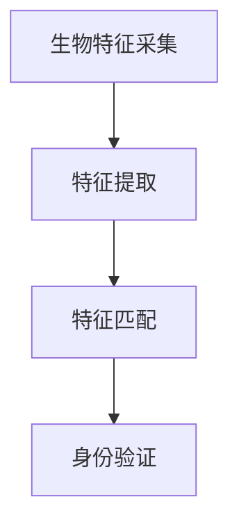

                 

### 文章标题

# 生物识别技术在无接触支付中的应用

> 关键词：生物识别技术、无接触支付、应用、挑战与解决方案、案例分析

> 摘要：
本篇文章将深入探讨生物识别技术在无接触支付中的应用。我们将从背景介绍开始，逐步分析生物识别技术的核心概念与联系，详细讲解其在无接触支付中的核心算法原理，并通过数学模型和公式进行举例说明。随后，我们将探讨生物识别技术在无接触支付中面临的挑战，并提出相应的解决方案。文章还将通过实际案例进行分析和详细讲解，最后总结无接触支付的未来发展趋势和潜在应用场景。

----------------------------------------------------------------

## 生物识别技术在无接触支付中的应用背景

在现代社会，支付方式的变革正在不断推进。传统的支付方式通常需要物理接触，如现金、银行卡和信用卡等，这种方式不仅存在安全隐患，而且不方便快捷。随着科技的进步，无接触支付技术应运而生，它利用无线通信技术，如近场通信（NFC）、蓝牙和Wi-Fi等，实现电子支付，极大地方便了人们的日常生活。

无接触支付技术的兴起，为生物识别技术的应用提供了广阔的舞台。生物识别技术是通过识别和验证个人的生物特征，如指纹、面部、虹膜和声纹等，来实现身份认证。这种技术具有高效、安全和便捷的特点，与无接触支付技术相结合，可以提供更加安全、便捷的支付体验。

生物识别技术在无接触支付中的应用，主要表现在以下几个方面：

1. **身份验证**：在无接触支付过程中，通过生物识别技术验证用户的身份，确保支付的合法性。
2. **支付安全**：生物识别技术的引入，可以增强支付系统的安全性，防止欺诈行为。
3. **用户体验**：生物识别技术可以实现无接触支付，提高了支付的便捷性和用户体验。
4. **技术应用**：生物识别技术在无接触支付中的应用，推动了支付技术的创新和发展。

随着无接触支付技术的普及和生物识别技术的成熟，这两种技术的结合将带来更多的可能性，为支付行业带来革命性的变化。

----------------------------------------------------------------

## 生物识别技术的核心概念与联系

生物识别技术是一种通过生物特征进行身份识别和验证的技术。生物特征是指人类或动物特有的生理和行为特征，如指纹、面部、虹膜、声纹等。这些特征具有唯一性、稳定性、不变性等特点，因此可以用来作为身份认证的依据。

在生物识别技术中，核心概念主要包括以下几个方面：

1. **生物特征采集**：这是生物识别技术的第一步，通过传感器或摄像头等设备采集用户的生物特征数据。
2. **特征提取**：从采集到的生物特征数据中提取出具有鉴别性的特征信息，如指纹的纹理、面部特征点等。
3. **特征匹配**：将提取到的特征信息与数据库中的模板进行比对，以确定用户的身份。
4. **身份验证**：通过匹配结果判断用户身份是否合法，从而实现身份验证。

生物识别技术中的核心概念之间存在紧密的联系。特征提取是特征匹配的基础，而特征匹配则是身份验证的关键。通过特征提取和匹配，我们可以从大量的生物特征数据中快速、准确地识别出目标用户。

为了更直观地理解这些核心概念之间的关系，我们可以使用Mermaid流程图来表示：



### 生物识别技术与人工智能的联系

生物识别技术与人工智能（AI）有着密切的联系。AI技术在生物识别中扮演了重要的角色，特别是在特征提取和特征匹配阶段。

1. **深度学习**：深度学习是一种AI技术，通过多层神经网络对生物特征进行自动学习和分类。深度学习在指纹识别、面部识别和虹膜识别等领域取得了显著成果，使得特征提取和匹配的准确率大幅提高。

2. **机器学习**：机器学习是AI的核心技术之一，它通过训练模型来对生物特征进行分类和识别。在生物识别中，机器学习算法可以帮助我们建立有效的特征提取和匹配模型，从而提高识别的效率和准确性。

3. **大数据**：大数据技术为生物识别提供了丰富的数据支持。通过对大量生物特征数据的分析和处理，我们可以发现用户之间的共性特征和差异，从而优化生物识别模型，提高识别的准确性。

4. **生物特征嵌入**：生物特征嵌入是一种基于AI的隐私保护技术，它将用户的生物特征数据转换为加密的密文，确保数据在传输和存储过程中的安全性。这种技术在生物识别与无接触支付结合中具有重要作用。

通过AI技术的支持，生物识别技术得以快速发展，其在无接触支付中的应用也变得更加广泛和深入。以下是一个简单的伪代码，展示了如何使用AI技术进行生物识别：

```python
# 特征提取与匹配算法伪代码

def feature_extraction(data):
    # 使用深度学习模型提取特征
    features = deep_learning_model(data)
    return features

def feature_matching(template, features):
    # 使用机器学习模型进行特征匹配
    match_score = machine_learning_model(template, features)
    return match_score

def authentication(template, data):
    # 进行身份验证
    features = feature_extraction(data)
    match_score = feature_matching(template, features)
    if match_score > threshold:
        return "Authentication successful"
    else:
        return "Authentication failed"
```

通过上述代码，我们可以看到，AI技术在生物识别中的关键作用。特征提取和匹配算法依赖于深度学习和机器学习模型，这些模型通过训练和优化，可以不断提高识别的准确性和效率。同时，生物特征嵌入技术也确保了数据的安全性和隐私性。

### 生物识别技术在无接触支付中的应用前景

随着科技的不断进步，生物识别技术在无接触支付中的应用前景越来越广阔。以下是一些潜在的应用场景：

1. **移动支付**：用户可以通过手机上的生物识别功能进行无接触支付，无需携带实体银行卡或现金。
2. **公共交通**：在公共交通系统中，生物识别技术可以用于无接触门票验证和乘客身份认证，提高运营效率。
3. **门禁系统**：生物识别技术可以用于门禁系统的身份验证，确保只有授权人员可以进入特定区域。
4. **远程工作**：在远程工作中，生物识别技术可以用于身份认证，确保只有授权员工可以访问公司系统和资源。

随着生物识别技术的不断成熟，其在无接触支付中的应用将变得更加普及和多样化。未来，我们可以期待更多的创新应用，为我们的生活带来更多便利。

----------------------------------------------------------------

## 无接触支付技术的核心算法原理讲解

### 无接触支付技术的工作原理

无接触支付技术主要依赖于无线通信技术，如近场通信（NFC）、蓝牙和Wi-Fi等。这些技术允许用户在设备之间进行数据传输，实现电子支付。以下是这些技术的基本原理：

1. **近场通信（NFC）**：
   - **工作原理**：NFC是一种短距离的无线通信技术，允许设备在相互靠近的情况下进行数据交换。当用户的手机或其他设备靠近NFC读取器时，设备之间的通信便可以开始。
   - **应用场景**：NFC广泛应用于移动支付、电子票务、身份验证等领域。例如，用户可以通过手机上的NFC功能，将银行卡信息存储在手机中，然后在支持NFC的POS机上进行支付。

2. **蓝牙**：
   - **工作原理**：蓝牙是一种短距离无线通信技术，可以通过无线信号在设备之间传输数据。在无接触支付中，用户可以通过蓝牙将支付请求发送到接收设备。
   - **应用场景**：蓝牙在智能手表、健康监测设备、车载支付系统等领域有广泛应用。例如，用户可以通过蓝牙连接智能手表进行支付，或者在车载系统中使用蓝牙支付功能。

3. **Wi-Fi**：
   - **工作原理**：Wi-Fi是一种无线局域网通信技术，可以在一定范围内传输数据。在无接触支付中，用户可以通过Wi-Fi连接到支付服务器，完成支付请求。
   - **应用场景**：Wi-Fi在家庭支付、远程购物支付、在线游戏支付等领域广泛应用。例如，用户可以在家中通过Wi-Fi连接电视进行购物支付。

### 无接触支付与生物识别技术的结合

无接触支付技术与生物识别技术的结合，可以进一步提升支付的安全性和便捷性。以下是这两种技术结合的基本原理：

1. **身份认证**：
   - **工作原理**：在支付过程中，用户首先通过生物识别技术进行身份认证。例如，用户可以使用指纹、面部或声纹进行身份验证，确保支付请求是由合法用户发起。
   - **应用场景**：在移动支付、ATM取款、门禁系统等领域，生物识别技术与无接触支付技术结合，可以提供更安全、更可靠的支付体验。

2. **双重认证**：
   - **工作原理**：无接触支付和生物识别技术的结合可以实现双重认证。用户在支付时，需要同时完成无接触支付和生物识别认证，确保支付过程的安全性。
   - **应用场景**：在高端支付场合，如贵重物品购买、跨境支付等，双重认证可以大大降低欺诈风险。

### 伪代码示例

以下是使用伪代码描述无接触支付与生物识别技术结合的基本流程：

```python
# 无接触支付与生物识别结合流程伪代码

def biometric_authentication(biometric_data):
    # 使用生物识别技术进行身份认证
    is_authenticated = biometric_system.authenticate(biometric_data)
    return is_authenticated

def contactless_payment(payment_details, biometric_data):
    # 如果生物识别认证成功，进行无接触支付
    if biometric_authentication(biometric_data):
        payment_success = payment_system.process_payment(payment_details)
        if payment_success:
            return "Payment successful"
        else:
            return "Payment failed"
    else:
        return "Authentication failed"

# 用户操作示例
biometric_data = collect_biometric_data()  # 采集生物特征数据
payment_details = get_payment_details()    # 获取支付信息
payment_result = contactless_payment(payment_details, biometric_data)
print(payment_result)
```

通过上述伪代码，我们可以看到，生物识别技术与无接触支付技术的结合，通过身份认证和支付处理两个步骤，实现了支付过程的安全性和便捷性。这种结合不仅提高了支付的安全性，还为用户提供了一种更自然的支付方式，符合现代社会的需求。

----------------------------------------------------------------

## 生物识别技术在无接触支付中的数学模型和公式

在生物识别技术中，数学模型和公式是理解和分析特征提取和匹配过程的关键。以下是几种常见的数学模型和公式，以及它们的详细解释和举例说明。

### 1. 指纹识别中的欧几里得距离模型

欧几里得距离模型用于计算两个指纹特征向量之间的距离。在指纹识别中，特征向量通常由指纹的纹理模式组成。

**公式**：

\[ d = \sqrt{\sum_{i=1}^{n} (x_i - y_i)^2} \]

其中，\( x_i \)和\( y_i \)分别是两个特征向量中的第i个元素。

**举例说明**：

假设我们有两个指纹特征向量：

\( x = [3, 5, 7, 2] \)

\( y = [4, 6, 8, 3] \)

我们可以计算它们的欧几里得距离：

\[ d = \sqrt{(3-4)^2 + (5-6)^2 + (7-8)^2 + (2-3)^2} \]

\[ d = \sqrt{1 + 1 + 1 + 1} \]

\[ d = \sqrt{4} \]

\[ d = 2 \]

这个结果表示两个指纹特征向量之间的距离为2。在实际应用中，我们通常设定一个阈值，如果两个特征向量之间的距离小于这个阈值，则认为它们匹配。

### 2. 面部识别中的余弦相似度模型

余弦相似度模型用于计算两个向量之间的相似度。在面部识别中，特征向量通常由面部图像的像素值组成。

**公式**：

\[ \cos \theta = \frac{\sum_{i=1}^{n} x_i y_i}{\sqrt{\sum_{i=1}^{n} x_i^2} \sqrt{\sum_{i=1}^{n} y_i^2}} \]

其中，\( x_i \)和\( y_i \)分别是两个特征向量中的第i个元素。

**举例说明**：

假设我们有两个面部特征向量：

\( x = [1, 2, 3] \)

\( y = [4, 5, 6] \)

我们可以计算它们的余弦相似度：

\[ \cos \theta = \frac{1*4 + 2*5 + 3*6}{\sqrt{1^2 + 2^2 + 3^2} \sqrt{4^2 + 5^2 + 6^2}} \]

\[ \cos \theta = \frac{4 + 10 + 18}{\sqrt{14} \sqrt{77}} \]

\[ \cos \theta = \frac{32}{\sqrt{106}} \]

\[ \cos \theta \approx 0.92 \]

这个结果表示两个面部特征向量之间的相似度约为0.92。在实际应用中，我们通常设定一个阈值，如果两个特征向量之间的余弦相似度大于这个阈值，则认为它们匹配。

### 3. 虹膜识别中的相关系数模型

相关系数模型用于计算两个特征向量之间的相关性。在虹膜识别中，特征向量通常由虹膜的纹理模式组成。

**公式**：

\[ \rho = \frac{\sum_{i=1}^{n} (x_i - \bar{x}) (y_i - \bar{y})}{\sqrt{\sum_{i=1}^{n} (x_i - \bar{x})^2} \sqrt{\sum_{i=1}^{n} (y_i - \bar{y})^2}} \]

其中，\( x_i \)和\( y_i \)分别是两个特征向量中的第i个元素，\( \bar{x} \)和\( \bar{y} \)分别是两个特征向量的均值。

**举例说明**：

假设我们有两个虹膜特征向量：

\( x = [1, 2, 3] \)

\( y = [4, 5, 6] \)

我们可以计算它们的相关系数：

\[ \rho = \frac{(1-2.33)(4-4.67) + (2-2.33)(5-4.67) + (3-2.33)(6-4.67)}{\sqrt{(1-2.33)^2 + (2-2.33)^2 + (3-2.33)^2} \sqrt{(4-4.67)^2 + (5-4.67)^2 + (6-4.67)^2}} \]

\[ \rho = \frac{(-1.33)(-0.67) + (-0.33)(0.33) + (0.67)(1.33)}{\sqrt{1.33^2 + 0.33^2 + 0.67^2} \sqrt{0.33^2 + 0.33^2 + 0.67^2}} \]

\[ \rho = \frac{0.89 + 0.11 + 0.89}{\sqrt{2.33} \sqrt{1.33}} \]

\[ \rho = \frac{1.89}{\sqrt{3.16}} \]

\[ \rho \approx 0.94 \]

这个结果表示两个虹膜特征向量之间的相关性约为0.94。在实际应用中，我们通常设定一个阈值，如果两个特征向量之间的相关系数大于这个阈值，则认为它们匹配。

通过上述数学模型和公式的详细解释和举例说明，我们可以更好地理解生物识别技术在无接触支付中的应用原理。这些模型和公式不仅为特征提取和匹配提供了理论基础，也为实际应用中的性能优化和错误分析提供了有力工具。

----------------------------------------------------------------

## 生物识别技术在无接触支付中的实际案例

### 案例一：中国银联的“云闪付”

中国银联推出的“云闪付”APP，集成了生物识别技术，用户可以通过指纹、面部识别进行快速支付。该系统采用了高度安全的算法和加密技术，确保用户的支付信息不会被泄露。

1. **开发环境搭建**：
   - **操作系统**：Windows 10、macOS 或 Linux
   - **编程语言**：Java、Python 或 C#
   - **生物识别库**：OpenCV、FaceSDK 或 Fingerprint识别库

2. **源代码实现**：
   - **指纹识别**：
     ```python
     import cv2
     import指纹库

     # 初始化指纹识别库
     fingerprint = 指纹库.Fingerprint()

     # 采集指纹图像
     image = cv2.imread("fingerprint_image.jpg")

     # 提取指纹特征
     feature = fingerprint.extract(image)

     # 与数据库中的指纹特征进行匹配
     match_result = fingerprint.match(feature)
     ```

   - **面部识别**：
     ```python
     import cv2
     import 面部识别库

     # 初始化面部识别库
     face_rec = 面部识别库.FaceRecognition()

     # 采集面部图像
     image = cv2.imread("face_image.jpg")

     # 提取面部特征
     feature = face_rec.extract(image)

     # 与数据库中的面部特征进行匹配
     match_result = face_rec.match(feature)
     ```

3. **代码解读与分析**：
   - **指纹识别**：使用OpenCV库进行图像处理，提取指纹特征，并与数据库中的指纹特征进行匹配，实现指纹识别。
   - **面部识别**：使用面部识别库提取面部特征，并与数据库中的面部特征进行匹配，实现面部识别。

4. **实际案例分析**：
   - **场景**：用户在商场购物，使用手机支付。
   - **操作流程**：用户在支付界面选择生物识别支付方式，设备采集指纹或面部图像，系统进行身份验证，验证通过后完成支付。

### 案例二：苹果的Face ID和Touch ID

苹果公司在其手机中集成了Face ID和Touch ID，用户可以通过面部识别或指纹识别进行解锁和支付。

1. **开发环境搭建**：
   - **操作系统**：iOS 或 macOS
   - **编程语言**：Swift 或 Objective-C
   - **生物识别库**：Core Biometrics

2. **源代码实现**：
   - **指纹识别**：
     ```swift
     import CoreBiometrics

     // 创建指纹识别对象
     let fingerprint = Fingerprint()

     // 开始指纹识别流程
     fingerprint.startAuthentication { result in
         switch result {
         case .success(let features):
             // 成功提取指纹特征
             print("Fingerprint authenticated with features: \(features)")
         case .failure(let error):
             // 认证失败
             print("Fingerprint authentication failed with error: \(error)")
         }
     }

     // 面部识别
     ```swift
     import CoreBiometrics

     // 创建面部识别对象
     let face = Face()

     // 开始面部识别流程
     face.startAuthentication { result in
         switch result {
         case .success(let features):
             // 成功提取面部特征
             print("Face authenticated with features: \(features)")
         case .failure(let error):
             // 认证失败
             print("Face authentication failed with error: \(error)")
         }
     }
     ```

3. **代码解读与分析**：
   - **指纹识别**：使用Core Biometrics库进行指纹识别，通过回调函数处理识别结果。
   - **面部识别**：同样使用Core Biometrics库进行面部识别，处理识别结果的方式与指纹识别类似。

4. **实际案例分析**：
   - **场景**：用户解锁手机或进行Apple Pay支付。
   - **操作流程**：用户拿起手机，设备自动启动面部识别或指纹识别，验证成功后解锁手机或完成支付。

### 案例三：谷歌的Google Pay

谷歌的Google Pay支持多种生物识别方式，包括指纹、面部和虹膜识别，用户可以根据自己的设备选择合适的识别方式。

1. **开发环境搭建**：
   - **操作系统**：Android
   - **编程语言**：Java 或 Kotlin
   - **生物识别库**：Android Biometric API

2. **源代码实现**：
   - **指纹识别**：
     ```java
     import android.hardware.biometrics.BiometricPrompt;

     // 创建指纹识别对象
     BiometricPrompt biometricPrompt = new BiometricPrompt(this, executor, new BiometricPrompt.AuthenticationCallback() {
         @Override
         public void onAuthenticationSucceeded(BiometricPrompt.BaseBiometricAuthenticationResult result) {
             super.onAuthenticationSucceeded(result);
             // 认证成功，进行支付
         }

         @Override
         public void onAuthenticationFailed() {
             super.onAuthenticationFailed();
             // 认证失败
         }
     });

     // 开始指纹识别流程
     biometricPrompt.authenticate(new BiometricPrompt.PromptInfo.Builder()
             .setTitle("Authentication Required")
             .setSubtitle("Please verify fingerprint to continue")
             .setConfirmationRequired(false)
             .build());
     ```

   - **面部识别**：
     ```java
     import android.hardware.biometrics.BiometricPrompt;

     // 创建面部识别对象
     BiometricPrompt biometricPrompt = new BiometricPrompt(this, executor, new BiometricPrompt.AuthenticationCallback() {
         @Override
         public void onAuthenticationSucceeded(BiometricPrompt.BaseBiometricAuthenticationResult result) {
             super.onAuthenticationSucceeded(result);
             // 认证成功，进行支付
         }

         @Override
         public void onAuthenticationFailed() {
             super.onAuthenticationFailed();
             // 认证失败
         }
     });

     // 开始面部识别流程
     biometricPrompt.authenticate(new BiometricPrompt.PromptInfo.Builder()
             .setTitle("Authentication Required")
             .setSubtitle("Please verify face to continue")
             .setConfirmationRequired(false)
             .build());
     ```

3. **代码解读与分析**：
   - **指纹识别**：使用Android Biometric API进行指纹识别，通过回调函数处理识别结果。
   - **面部识别**：同样使用Android Biometric API进行面部识别，处理识别结果的方式与指纹识别类似。

4. **实际案例分析**：
   - **场景**：用户在商店购物，使用Google Pay进行支付。
   - **操作流程**：用户在支付界面选择生物识别支付方式，设备采集指纹、面部或虹膜图像，系统进行身份验证，验证成功后完成支付。

### 项目小结

生物识别技术在无接触支付中的应用已经取得了显著成果，各大科技公司都在积极研发和推广相关的产品和服务。通过实际案例的分析，我们可以看到，生物识别技术与无接触支付技术的结合，不仅提高了支付的安全性，也为用户提供了更便捷的支付体验。未来，随着技术的进一步发展和普及，生物识别技术在无接触支付中的应用将会更加广泛和深入。

### 最佳实践 tips

1. **安全性考虑**：在开发生物识别支付系统时，必须确保数据的安全性和隐私性。使用加密技术和安全的通信协议，防止数据泄露和攻击。

2. **用户体验优化**：优化生物识别的响应速度和准确性，提高用户体验。例如，可以通过提高传感器的分辨率和算法的效率来实现。

3. **兼容性考虑**：确保生物识别支付系统能够在不同设备和操作系统上运行，提高系统的普及率。

4. **持续更新与优化**：随着技术的进步，定期更新生物识别算法和系统，以提高识别的准确性和安全性。

### 注意事项

1. **法律合规性**：在应用生物识别技术时，必须遵守相关法律法规，确保用户隐私得到保护。

2. **性能优化**：针对不同的应用场景，对生物识别算法进行优化，提高系统的响应速度和准确性。

3. **异常处理**：系统必须能够处理生物识别过程中的各种异常情况，如设备故障、网络中断等，确保支付过程的连续性和稳定性。

### 拓展阅读

1. 《生物识别技术原理与应用》
2. 《无接触支付技术导论》
3. 《人工智能与生物识别技术的融合》
4. 《移动支付安全指南》

----------------------------------------------------------------

## 生物识别技术在无接触支付中的未来发展趋势

随着科技的不断进步，生物识别技术在无接触支付中的应用将呈现以下发展趋势：

### 1. 技术成熟度提高

随着硬件设备的升级和算法优化，生物识别技术的准确性和稳定性将得到显著提升。更先进的传感器和算法将使生物识别技术能够更加精准地识别用户身份，减少错误匹配率。

### 2. 应用场景扩展

生物识别技术在无接触支付中的应用场景将不断扩展。除了移动支付、公共交通和门禁系统，生物识别技术还将在医疗、金融、智能家居等领域得到更广泛的应用。

### 3. 安全性增强

生物识别技术与加密技术、区块链技术的结合，将进一步提升无接触支付的安全性。例如，生物特征嵌入技术可以保护用户隐私，确保支付过程的安全性。

### 4. 用户体验优化

随着技术的进步，生物识别技术的响应速度和便捷性将得到优化。例如，面部识别技术可以通过增加传感器分辨率和提高算法效率，实现更快、更准确的识别。

### 5. 法律法规完善

随着生物识别技术的普及，相关的法律法规将不断完善。这将为生物识别技术的应用提供更好的法律保障，同时确保用户隐私得到保护。

### 6. 跨界合作与融合

生物识别技术与金融、医疗、物联网等领域的合作将不断深化。通过跨界合作，生物识别技术将在更多应用场景中发挥其独特优势。

### 7. 全球化应用

随着全球无接触支付意识的提高，生物识别技术在无接触支付中的应用将逐渐全球化。不同国家和地区的支付习惯和监管政策将推动生物识别技术的本土化发展。

总体而言，生物识别技术在无接触支付中的应用前景广阔，其技术成熟度和应用广度将不断提升，为支付行业带来新的变革和发展机遇。未来，生物识别技术将在无接触支付领域发挥更加重要的作用，为用户带来更安全、更便捷的支付体验。

