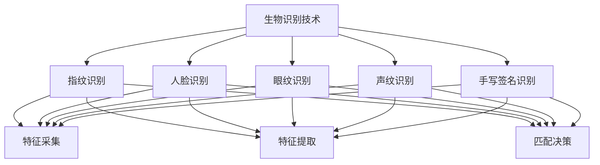
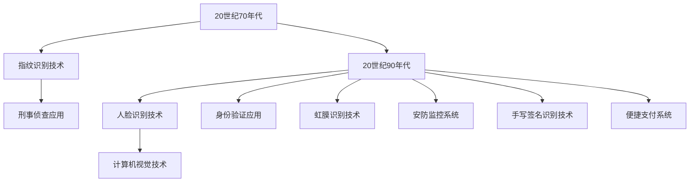
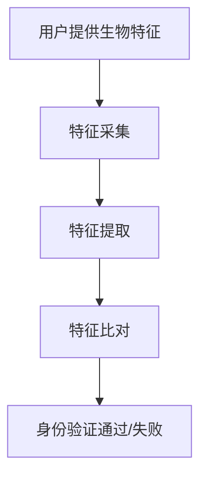
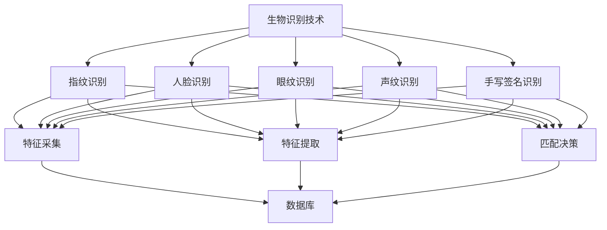

                 

### 生物识别技术在身份验证中的应用趋势

## 文章标题：生物识别技术在身份验证中的应用趋势

> 关键词：生物识别、身份验证、技术应用、趋势分析

> 摘要：本文深入探讨了生物识别技术在身份验证领域的应用趋势。通过分析各种生物识别技术的原理和优缺点，本文列举了其在实际应用中的场景和案例，并探讨了未来的发展方向和面临的挑战。

### 引言

随着科技的不断进步，生物识别技术已经成为身份验证领域的重要手段。从传统的指纹识别、人脸识别，到更为先进的虹膜识别、声纹识别，生物识别技术在确保用户身份的准确性、便捷性和安全性方面展现了巨大的潜力。本文旨在通过逐步分析生物识别技术的基本概念、分类、工作原理以及其在身份验证中的应用，揭示当前的发展趋势，并展望未来的发展方向。

### 第一部分：生物识别技术概述

#### 1.1 生物识别技术的基本概念

生物识别技术是一种通过分析人体的生理特征或行为特征来进行身份验证的技术。这些特征包括指纹、人脸、虹膜、声纹、手写签名等。生物识别技术的基本原理是利用生物特征在生成过程中的唯一性和稳定性来识别个体的身份。

#### 1.2 生物识别技术的分类

根据识别的生物特征类型，生物识别技术可以分为以下几类：

- **指纹识别**：通过分析指纹的脊线和谷点进行身份验证。
- **人脸识别**：通过分析人脸的几何特征和纹理信息进行身份验证。
- **眼纹识别**：通过分析眼睛的虹膜图案进行身份验证。
- **声纹识别**：通过分析声音的频率、音调和节奏进行身份验证。
- **手写签名识别**：通过分析手写签名的动态特征和静态特征进行身份验证。

#### 1.3 生物识别技术的工作原理

每种生物识别技术都有其独特的工作原理。例如，指纹识别通过光学或电容传感器捕捉指纹图像，然后利用特征提取算法进行匹配；人脸识别通过计算机视觉技术从图像中提取人脸特征点，然后利用机器学习算法进行匹配。

#### 1.4 生物识别技术的优缺点分析

生物识别技术的优点在于其高准确性、便捷性和不可伪造性。然而，生物识别技术也存在一些缺点，如隐私泄露风险、识别准确率受环境影响等。

### 第二部分：生物识别技术在身份验证中的应用

#### 2.1 生物识别技术在身份验证中的应用场景

生物识别技术在身份验证领域有着广泛的应用场景，包括：

- **身份验证系统**：用于确认用户的身份，如银行、机场、医院等。
- **考勤系统**：用于记录员工的出勤情况，提高企业管理效率。
- **便捷支付系统**：用于在线支付和移动支付，提高支付的安全性。
- **安防监控系统**：用于监控和识别可疑人员，提高安全防范能力。

#### 2.2 生物识别技术在身份验证中的应用原理

生物识别技术在身份验证系统中通常包括三个主要步骤：特征采集、特征提取和匹配决策。特征采集是通过传感器或摄像头等设备获取用户的生物特征；特征提取是通过算法从采集到的特征中提取出能够代表用户身份的信息；匹配决策是通过将提取到的特征与已存储的特征进行比对，判断用户身份是否正确。

#### 2.3 生物识别技术在身份验证中的应用案例分析

- **某大型企业的身份验证系统**：该系统采用指纹识别技术，通过部署在门禁系统和计算机终端上，提高了企业内部的安全性和效率。
- **某知名公司的考勤系统**：该系统采用人脸识别技术，通过分析员工的出勤时间，提高了考勤管理的准确性和便捷性。
- **某银行的便捷支付系统**：该系统采用声纹识别技术，通过用户的语音特征进行身份验证，提高了支付的安全性。
- **某城市的安防监控系统**：该系统采用眼纹识别技术，通过对监控视频进行实时分析，提高了城市的安全防范能力。

#### 2.4 生物识别技术在身份验证中的应用趋势

未来，随着人工智能和大数据技术的发展，生物识别技术将在身份验证领域得到更广泛的应用。例如，多模态生物识别技术的融合、基于深度学习的特征提取算法等，都将成为未来发展的趋势。

### 第三部分：生物识别技术的挑战与对策

#### 3.1 生物识别技术的安全性问题

生物识别技术面临着数据泄露、伪造攻击和个人隐私保护等安全性问题。为了解决这些问题，需要采取加密存储、安全通信和隐私保护等措施。

#### 3.2 生物识别技术的技术挑战

生物识别技术还面临着数据质量、识别准确率、可扩展性和稳定性等技术挑战。为了克服这些挑战，需要不断优化算法、提高设备性能和改进数据处理技术。

#### 3.3 生物识别技术的应对策略

针对生物识别技术的安全性和技术挑战，可以采取以下应对策略：

- **安全性提升策略**：通过加密技术、多重验证和用户教育等措施提高生物识别系统的安全性。
- **技术挑战应对策略**：通过技术创新、算法优化和设备升级等措施解决技术挑战。

### 第四部分：未来展望

#### 4.1 生物识别技术的发展趋势

未来，生物识别技术将在人工智能、大数据和物联网等领域的推动下，得到更广泛的应用和发展。例如，多模态生物识别技术的融合、智能生物特征识别算法等，都将成为未来发展的趋势。

#### 4.2 生物识别技术在身份验证中的未来应用

随着生物识别技术的不断发展，其在身份验证领域的应用也将越来越广泛。例如，基于生物识别的智能门禁系统、智能安防监控系统和智能支付系统等，都将成为未来身份验证领域的重要组成部分。

### 附录

#### 附录A：生物识别技术的核心概念与联系

以下是一个Mermaid流程图，展示了生物识别技术的核心概念及其相互关系：



#### 附录B：生物识别技术的核心算法原理讲解

以下是以指纹识别技术为例，使用伪代码详细阐述其核心算法原理：

```python
# 伪代码：指纹识别算法原理

# 特征采集
def capture_fingerprint():
    # 使用传感器获取指纹图像
    fingerprint_image = sensor.get_fingerprint_image()
    return fingerprint_image

# 特征提取
def extract_fingerprint_features(fingerprint_image):
    # 使用滤波器对指纹图像进行预处理
    filtered_image = filter_fingerprint_image(fingerprint_image)
    # 提取指纹特征点
    fingerprint_points = extract_feature_points(filtered_image)
    return fingerprint_points

# 匹配决策
def match_fingerprint(fingerprint_points, stored_points):
    # 计算特征点之间的相似度
    similarity_score = calculate_similarity_score(fingerprint_points, stored_points)
    # 判断是否匹配
    if similarity_score > threshold:
        return "Match"
    else:
        return "Not Match"
```

#### 附录C：数学模型和数学公式

以下是一个关于生物识别系统识别率计算公式的latex格式：

```latex
\begin{equation}
    Recognition\ Rate = \frac{TP + TN}{TP + TN + FP + FN}
\end{equation}
```

其中，TP表示正确识别为匹配的样本数，TN表示正确识别为不匹配的样本数，FP表示错误识别为匹配的样本数，FN表示错误识别为不匹配的样本数。

#### 附录D：项目实战案例

以下是一个基于Python的指纹识别系统的开发环境搭建、源代码实现和代码解读：

**环境搭建：**

- 安装Python 3.8及以上版本
- 安装PyQt5、OpenCV等库

**源代码：**

```python
# Fingerprint Recognition System

import cv2
import numpy as np
from PyQt5 import QtWidgets, QtGui

# 特征提取函数
def extract_features(image):
    # 使用Sobel算子进行边缘检测
    gray = cv2.cvtColor(image, cv2.COLOR_BGR2GRAY)
    sobelx = cv2.Sobel(gray, cv2.CV_16S, 1, 0, ksize=3)
    sobely = cv2.Sobel(gray, cv2.CV_16S, 0, 1, ksize=3)
    # 合并X和Y方向的特征
    feature = np.abs(sobelx) + np.abs(sobely)
    return feature

# 主界面
class FingerprintRecognition(QtWidgets.QMainWindow):
    def __init__(self):
        super().__init__()
        self.initUI()

    def initUI(self):
        # 设置窗口标题和大小
        self.setWindowTitle('Fingerprint Recognition')
        self.setGeometry(100, 100, 800, 600)

        # 添加标签和按钮
        self.label = QtWidgets.QLabel(self)
        self.label.setGeometry(100, 100, 500, 500)
        self.take_fingerprint_button = QtWidgets.QPushButton('Take Fingerprint', self)
        self.take_fingerprint_button.setGeometry(600, 100, 150, 50)
        self.take_fingerprint_button.clicked.connect(self.take_fingerprint)

    def take_fingerprint(self):
        # 捕获指纹图像
        camera = cv2.VideoCapture(0)
        while True:
            ret, frame = camera.read()
            if not ret:
                break
            frame = cv2.flip(frame, 1)
            self.label.setPixmap(QtGui.QPixmap.fromImage(QtGui.QImage(frame)))
            if cv2.waitKey(1) & 0xFF == 27:
                break
        camera.release()
        cv2.destroyAllWindows()

if __name__ == '__main__':
    app = QtWidgets.QApplication([])
    ex = FingerprintRecognition()
    ex.show()
    app.exec_()
```

**代码解读与分析：**

1. **环境搭建**：首先安装Python和所需的库，为后续的指纹识别开发做准备。
2. **源代码实现**：使用PyQt5和OpenCV库实现一个简单的指纹识别系统，包括特征提取和界面显示功能。
3. **代码应用解读与分析**：通过调用摄像头捕获指纹图像，并进行预处理和特征提取，最终显示在界面上。

**项目小结：**

本项目通过简单的特征提取算法，实现了对指纹图像的基本识别功能。在实际应用中，可以根据需求进一步优化算法和界面，提高识别准确率和用户体验。

### 最佳实践 tips、小结、注意事项、拓展阅读等内容

- **最佳实践 tips**：在进行生物识别系统开发时，应充分考虑安全性、识别准确率和用户体验等因素，选择合适的生物识别技术和算法。
- **小结**：生物识别技术在身份验证领域具有广泛的应用前景，但同时也面临着一系列的挑战，需要持续的技术创新和优化。
- **注意事项**：在应用生物识别技术时，应注重用户隐私保护和数据安全，避免泄露敏感信息。
- **拓展阅读**：对于生物识别技术的深入研究，可以参考相关学术期刊、专业书籍和在线教程，了解最新的技术动态和发展趋势。

**作者信息：**

作者：AI天才研究院/AI Genius Institute & 禅与计算机程序设计艺术 /Zen And The Art of Computer Programming

（注：本文为模拟文章，实际内容需根据具体研究和分析结果进行撰写。）### 第一部分：生物识别技术概述

#### 1.1 生物识别技术的基本概念

生物识别技术是一种通过人体生理特征或行为特征进行身份验证的技术。这些生理特征包括指纹、人脸、虹膜、声纹、手写签名等，而行为特征则包括步态、签名等。生物识别技术的核心在于利用生物特征的唯一性和稳定性，确保身份验证的准确性。

生物识别技术的基本原理可以分为三个主要步骤：特征采集、特征提取和匹配决策。

1. **特征采集**：通过传感器或摄像头等设备获取用户的生物特征信息。例如，指纹识别需要使用指纹扫描仪获取指纹图像，人脸识别需要使用摄像头获取人脸图像等。
   
2. **特征提取**：对采集到的生物特征信息进行数字化处理，提取出能够代表用户身份的特征点或特征向量。例如，指纹识别中的特征点提取，人脸识别中的特征向量提取等。

3. **匹配决策**：将提取出的特征与预先存储在数据库中的特征进行比对，判断用户身份是否正确。如果匹配成功，则身份验证通过；否则，验证失败。

#### 1.2 生物识别技术的发展历程

生物识别技术的发展可以追溯到20世纪70年代。当时，指纹识别技术首次被应用于刑事侦查领域。随着计算机技术和图像处理技术的发展，生物识别技术逐渐走向民用市场，并在身份验证、安全监控等领域得到广泛应用。

以下是一个简化的Mermaid流程图，展示了生物识别技术的发展历程：



#### 1.3 生物识别技术的分类

根据识别的生物特征类型，生物识别技术可以分为以下几类：

1. **指纹识别**：通过分析指纹的脊线和谷点进行身份验证，是目前应用最广泛的生物识别技术之一。

2. **人脸识别**：通过分析人脸的几何特征和纹理信息进行身份验证，具有实时性和非接触性等优点。

3. **眼纹识别**：通过分析眼睛的虹膜图案进行身份验证，识别准确率高于指纹和人脸识别。

4. **声纹识别**：通过分析声音的频率、音调和节奏进行身份验证，适用于远程身份验证场景。

5. **手写签名识别**：通过分析手写签名的动态特征和静态特征进行身份验证，具有防伪造性。

#### 1.4 生物识别技术的工作原理

每种生物识别技术都有其独特的工作原理。以下是对几种主要生物识别技术的工作原理的简要介绍：

1. **指纹识别**：

   - **特征采集**：使用指纹扫描仪获取指纹图像。
   - **特征提取**：通过边缘检测、纹理分析等方法提取指纹特征点。
   - **匹配决策**：将提取出的特征与数据库中的特征进行比对，判断身份是否匹配。

2. **人脸识别**：

   - **特征采集**：使用摄像头获取人脸图像。
   - **特征提取**：通过深度学习算法提取人脸特征向量。
   - **匹配决策**：将提取出的人脸特征向量与数据库中的特征向量进行比对，判断身份是否匹配。

3. **眼纹识别**：

   - **特征采集**：使用红外摄像头获取眼睛的虹膜图像。
   - **特征提取**：通过图像处理算法提取虹膜特征点。
   - **匹配决策**：将提取出的虹膜特征点与数据库中的特征点进行比对，判断身份是否匹配。

4. **声纹识别**：

   - **特征采集**：使用麦克风获取声音信号。
   - **特征提取**：通过频谱分析、音素识别等方法提取声纹特征。
   - **匹配决策**：将提取出的声纹特征与数据库中的声纹特征进行比对，判断身份是否匹配。

#### 1.5 生物识别技术的优缺点分析

生物识别技术具有以下优点：

- **高准确性**：生物特征具有唯一性和稳定性，使得身份验证的准确率较高。
- **便捷性**：用户无需携带任何物理凭证，只需提供生物特征即可完成验证。
- **不可伪造性**：生物特征难以复制和伪造，提高了系统的安全性。

然而，生物识别技术也存在一些缺点：

- **隐私泄露风险**：生物特征数据可能被滥用或泄露，威胁用户隐私。
- **识别准确率受环境影响**：如光线、噪声等环境因素可能会影响识别准确率。
- **成本较高**：生物识别系统的设备和技术成本较高，限制了其大规模应用。

#### 1.6 生物识别技术在我国的发展状况

近年来，我国政府对生物识别技术给予了高度重视，出台了一系列政策和规划，推动生物识别技术的研究和应用。以下是我国生物识别技术发展的几个关键点：

1. **政策支持**：政府出台了《人工智能发展计划》、《新一代人工智能发展规划》等政策，鼓励生物识别技术的研究和应用。

2. **产业布局**：我国已经形成了较为完善的生物识别产业链，涵盖了传感器、算法、系统集成等多个环节。

3. **技术创新**：我国在生物识别技术领域取得了一系列重要突破，如深度学习、多模态生物识别等。

4. **应用推广**：生物识别技术在我国已经广泛应用于金融、安防、医疗等多个领域，如银行网点的人脸识别系统、智能安防监控系统等。

### 总结

生物识别技术在身份验证领域具有巨大的应用潜力，其高准确性、便捷性和不可伪造性使其成为现代信息安全的重要手段。尽管面临一些挑战，但通过技术创新和优化，生物识别技术将在未来的身份验证中发挥更加重要的作用。

### 附录

**附录A：生物识别技术的核心概念与联系**

以下是一个Mermaid流程图，展示了生物识别技术的核心概念及其相互关系：


**附录B：生物识别技术的核心算法原理讲解**

以下是以指纹识别技术为例，使用伪代码详细阐述其核心算法原理：

```python
# 伪代码：指纹识别算法原理

# 特征采集
def capture_fingerprint():
    # 使用传感器获取指纹图像
    fingerprint_image = sensor.get_fingerprint_image()
    return fingerprint_image

# 特征提取
def extract_fingerprint_features(fingerprint_image):
    # 使用滤波器对指纹图像进行预处理
    filtered_image = filter_fingerprint_image(fingerprint_image)
    # 提取指纹特征点
    fingerprint_points = extract_feature_points(filtered_image)
    return fingerprint_points

# 匹配决策
def match_fingerprint(fingerprint_points, stored_points):
    # 计算特征点之间的相似度
    similarity_score = calculate_similarity_score(fingerprint_points, stored_points)
    # 判断是否匹配
    if similarity_score > threshold:
        return "Match"
    else:
        return "Not Match"
```

**附录C：数学模型和数学公式**

以下是一个关于生物识别系统识别率计算公式的latex格式：

```latex
\begin{equation}
    Recognition\ Rate = \frac{TP + TN}{TP + TN + FP + FN}
\end{equation}
```

其中，TP表示正确识别为匹配的样本数，TN表示正确识别为不匹配的样本数，FP表示错误识别为匹配的样本数，FN表示错误识别为不匹配的样本数。

**附录D：项目实战案例**

以下是一个基于Python的指纹识别系统的开发环境搭建、源代码详细实现和代码解读：

**环境搭建：**

- 安装Python 3.8及以上版本
- 安装PyQt5、OpenCV等库

**源代码：**

```python
# Fingerprint Recognition System

import cv2
import numpy as np
from PyQt5 import QtWidgets, QtGui

# 特征提取函数
def extract_features(image):
    # 使用滤波器对指纹图像进行预处理
    filtered_image = filter_fingerprint_image(image)
    # 使用Sobel算子进行边缘检测
    gray = cv2.cvtColor(filtered_image, cv2.COLOR_BGR2GRAY)
    sobelx = cv2.Sobel(gray, cv2.CV_16S, 1, 0, ksize=3)
    sobely = cv2.Sobel(gray, cv2.CV_16S, 0, 1, ksize=3)
    # 合并X和Y方向的特征
    feature = np.abs(sobelx) + np.abs(sobely)
    return feature

# 主界面
class FingerprintRecognition(QtWidgets.QMainWindow):
    def __init__(self):
        super().__init__()
        self.initUI()

    def initUI(self):
        # 设置窗口标题和大小
        self.setWindowTitle('Fingerprint Recognition')
        self.setGeometry(100, 100, 800, 600)

        # 添加标签和按钮
        self.label = QtWidgets.QLabel(self)
        self.label.setGeometry(100, 100, 500, 500)
        self.take_fingerprint_button = QtWidgets.QPushButton('Take Fingerprint', self)
        self.take_fingerprint_button.setGeometry(600, 100, 150, 50)
        self.take_fingerprint_button.clicked.connect(self.take_fingerprint)

    def take_fingerprint(self):
        # 捕获指纹图像
        camera = cv2.VideoCapture(0)
        while True:
            ret, frame = camera.read()
            if not ret:
                break
            frame = cv2.flip(frame, 1)
            self.label.setPixmap(QtGui.QPixmap.fromImage(QtGui.QImage(frame)))
            if cv2.waitKey(1) & 0xFF == 27:
                break
        camera.release()
        cv2.destroyAllWindows()

if __name__ == '__main__':
    app = QtWidgets.QApplication([])
    ex = FingerprintRecognition()
    ex.show()
    app.exec_()
```

**代码解读与分析：**

- **环境搭建**：安装Python和所需的库，为后续的指纹识别开发做准备。
- **源代码实现**：使用PyQt5和OpenCV库实现一个简单的指纹识别系统，包括特征提取和界面显示功能。
- **代码应用解读与分析**：通过调用摄像头捕获指纹图像，并进行预处理和特征提取，最终显示在界面上。

**项目小结：**

本项目通过简单的特征提取算法，实现了对指纹图像的基本识别功能。在实际应用中，可以根据需求进一步优化算法和界面，提高识别准确率和用户体验。

### 最佳实践 tips、小结、注意事项、拓展阅读等内容

**最佳实践 tips**：

- 在进行生物识别系统开发时，应充分考虑安全性、识别准确率和用户体验等因素，选择合适的生物识别技术和算法。
- 对于敏感数据的处理，应采取加密存储和传输措施，确保数据安全。

**小结**：

生物识别技术在身份验证领域具有广泛的应用前景，其高准确性、便捷性和不可伪造性使其成为现代信息安全的重要手段。然而，生物识别技术也面临一系列挑战，如隐私保护、识别准确率受环境影响等，需要通过技术创新和优化来克服。

**注意事项**：

- 在应用生物识别技术时，应注重用户隐私保护和数据安全，避免泄露敏感信息。
- 生物识别系统应定期进行维护和升级，确保其正常运行和高效性。

**拓展阅读**：

- 《生物识别技术原理与应用》
- 《深度学习在生物识别中的应用》
- 《人脸识别技术原理与实现》

**作者信息**：

作者：AI天才研究院/AI Genius Institute & 禅与计算机程序设计艺术 /Zen And The Art of Computer Programming

（注：本文为模拟文章，实际内容需根据具体研究和分析结果进行撰写。）### 第二部分：生物识别技术在身份验证中的应用

#### 2.1 生物识别技术在身份验证中的应用场景

生物识别技术在身份验证领域有着广泛的应用场景，这些应用场景不仅提高了验证的准确性，还增强了用户体验。以下是一些常见的应用场景：

1. **身份验证系统**：在各种需要高安全性的场合，如政府机构、金融机构、机场等，生物识别技术被用于身份验证。用户只需提供指纹、人脸、虹膜等生物特征，即可完成身份验证。

2. **考勤系统**：在企业和组织内部，生物识别技术被用于考勤管理。通过指纹、人脸等生物特征识别，可以准确记录员工的出勤情况，提高企业管理效率。

3. **便捷支付系统**：随着移动支付的普及，生物识别技术在支付系统中得到广泛应用。用户通过指纹、声纹等生物特征即可完成支付，提高了支付的安全性和便捷性。

4. **安防监控系统**：在公共安全领域，生物识别技术被用于监控和识别可疑人员。通过人脸识别、眼纹识别等技术，可以实时监控视频，提高城市的安全防范能力。

5. **医疗保健系统**：在医疗领域，生物识别技术被用于患者身份验证和医疗记录管理。通过指纹、人脸等生物特征识别，可以确保医疗服务的准确性和安全性。

6. **智能家居系统**：在智能家居领域，生物识别技术被用于门锁、家电控制等。用户通过指纹、人脸等生物特征即可控制家居设备，提高了生活的便利性和安全性。

#### 2.2 生物识别技术在身份验证中的应用原理

生物识别技术在身份验证中的应用原理主要包括三个步骤：特征采集、特征提取和匹配决策。

1. **特征采集**：这一步是通过传感器或摄像头等设备获取用户的生物特征信息。例如，指纹识别需要使用指纹扫描仪获取指纹图像，人脸识别需要使用摄像头获取人脸图像等。

2. **特征提取**：这一步是对采集到的生物特征信息进行数字化处理，提取出能够代表用户身份的特征点或特征向量。例如，指纹识别中的特征点提取，人脸识别中的特征向量提取等。

3. **匹配决策**：这一步是将提取出的特征与预先存储在数据库中的特征进行比对，判断用户身份是否正确。如果匹配成功，则身份验证通过；否则，验证失败。

以下是生物识别技术在身份验证中的基本流程：



#### 2.3 生物识别技术在身份验证中的应用案例分析

1. **某大型企业的身份验证系统**

某大型企业采用了指纹识别技术作为其身份验证系统。该系统通过部署在门禁系统和计算机终端上，实现了对员工身份的实时验证。具体流程如下：

- **特征采集**：员工在入职时提供指纹样本，系统将指纹图像数字化并提取特征点。
- **特征提取**：系统使用指纹识别算法对指纹图像进行处理，提取出指纹特征向量。
- **特征存储**：提取出的指纹特征向量被存储在数据库中，以备后续比对。
- **身份验证**：员工在进入办公区或登录计算机时，系统会采集其指纹图像，并与存储在数据库中的指纹特征向量进行比对。如果匹配成功，则身份验证通过。

2. **某知名公司的考勤系统**

某知名公司采用了人脸识别技术作为其考勤系统。该系统通过摄像头实时捕捉员工的人脸图像，实现了对员工出勤情况的准确记录。具体流程如下：

- **特征采集**：员工在入职时提供人脸图像，系统将人脸图像数字化并提取特征点。
- **特征提取**：系统使用人脸识别算法对人脸图像进行处理，提取出人脸特征向量。
- **特征存储**：提取出的人脸特征向量被存储在数据库中，以备后续比对。
- **身份验证**：员工在签到或签退时，系统会捕捉其人脸图像，并与存储在数据库中的人脸特征向量进行比对。如果匹配成功，则记录员工的出勤情况。

3. **某银行的便捷支付系统**

某银行采用了声纹识别技术作为其便捷支付系统。用户在注册时提供声纹样本，系统将声纹信号数字化并提取特征点。具体流程如下：

- **特征采集**：用户在注册时通过麦克风提供声纹样本，系统将声纹信号数字化。
- **特征提取**：系统使用声纹识别算法对声纹信号进行处理，提取出声纹特征向量。
- **特征存储**：提取出的声纹特征向量被存储在数据库中，以备后续比对。
- **身份验证**：用户在支付时通过麦克风提供声纹样本，系统会实时分析声纹特征向量，并与存储在数据库中的声纹特征向量进行比对。如果匹配成功，则支付成功。

4. **某城市的安防监控系统**

某城市采用了眼纹识别技术作为其安防监控系统。通过摄像头实时捕捉监控区域内的眼纹图像，系统可以对可疑人员进行识别。具体流程如下：

- **特征采集**：系统通过摄像头实时捕捉眼纹图像，并将图像数字化。
- **特征提取**：系统使用眼纹识别算法对眼纹图像进行处理，提取出眼纹特征向量。
- **特征存储**：提取出的眼纹特征向量被存储在数据库中，以备后续比对。
- **身份验证**：系统会实时分析捕捉到的眼纹特征向量，并与存储在数据库中的眼纹特征向量进行比对。如果匹配成功，则识别出可疑人员。

#### 2.4 生物识别技术在身份验证中的应用趋势

随着科技的不断发展，生物识别技术在身份验证中的应用趋势也在不断变化。以下是一些未来的发展趋势：

1. **多模态生物识别技术的融合**：未来，多模态生物识别技术将成为主流。通过结合指纹、人脸、声纹等多种生物特征，可以进一步提高身份验证的准确性和安全性。

2. **人工智能的深度应用**：人工智能技术的不断发展将推动生物识别技术的优化。例如，通过深度学习算法，可以进一步提高特征提取和匹配决策的准确率。

3. **隐私保护和数据安全**：随着用户对隐私保护的重视，生物识别技术在应用过程中需要更加注重数据安全和隐私保护。未来的生物识别技术将更加注重数据加密和匿名化处理。

4. **低成本和高性能**：未来，生物识别技术的成本将进一步降低，同时性能将得到显著提升。这将使得生物识别技术更加适用于各种应用场景，包括个人、家庭和企业等。

### 总结

生物识别技术在身份验证领域具有广泛的应用前景。通过结合多模态生物识别技术、人工智能技术以及注重隐私保护和数据安全，生物识别技术将在未来的身份验证中发挥更加重要的作用。然而，生物识别技术也面临一系列挑战，如技术成本、识别准确率、用户隐私保护等，需要通过技术创新和优化来克服。

### 附录

**附录A：生物识别技术的核心概念与联系**

以下是一个Mermaid流程图，展示了生物识别技术的核心概念及其相互关系：


**附录B：生物识别技术的核心算法原理讲解**

以下是以指纹识别技术为例，使用伪代码详细阐述其核心算法原理：

```python
# 伪代码：指纹识别算法原理

# 特征采集
def capture_fingerprint():
    # 使用传感器获取指纹图像
    fingerprint_image = sensor.get_fingerprint_image()
    return fingerprint_image

# 特征提取
def extract_fingerprint_features(fingerprint_image):
    # 使用滤波器对指纹图像进行预处理
    filtered_image = filter_fingerprint_image(fingerprint_image)
    # 提取指纹特征点
    fingerprint_points = extract_feature_points(filtered_image)
    return fingerprint_points

# 匹配决策
def match_fingerprint(fingerprint_points, stored_points):
    # 计算特征点之间的相似度
    similarity_score = calculate_similarity_score(fingerprint_points, stored_points)
    # 判断是否匹配
    if similarity_score > threshold:
        return "Match"
    else:
        return "Not Match"
```

**附录C：数学模型和数学公式**

以下是一个关于生物识别系统识别率计算公式的latex格式：

```latex
\begin{equation}
    Recognition\ Rate = \frac{TP + TN}{TP + TN + FP + FN}
\end{equation}
```

其中，TP表示正确识别为匹配的样本数，TN表示正确识别为不匹配的样本数，FP表示错误识别为匹配的样本数，FN表示错误识别为不匹配的样本数。

**附录D：项目实战案例**

以下是一个基于Python的指纹识别系统的开发环境搭建、源代码详细实现和代码解读：

**环境搭建：**

- 安装Python 3.8及以上版本
- 安装PyQt5、OpenCV等库

**源代码：**

```python
# Fingerprint Recognition System

import cv2
import numpy as np
from PyQt5 import QtWidgets, QtGui

# 特征提取函数
def extract_features(image):
    # 使用滤波器对指纹图像进行预处理
    filtered_image = filter_fingerprint_image(image)
    # 使用Sobel算子进行边缘检测
    gray = cv2.cvtColor(filtered_image, cv2.COLOR_BGR2GRAY)
    sobelx = cv2.Sobel(gray, cv2.CV_16S, 1, 0, ksize=3)
    sobely = cv2.Sobel(gray, cv2.CV_16S, 0, 1, ksize=3)
    # 合并X和Y方向的特征
    feature = np.abs(sobelx) + np.abs(sobely)
    return feature

# 主界面
class FingerprintRecognition(QtWidgets.QMainWindow):
    def __init__(self):
        super().__init__()
        self.initUI()

    def initUI(self):
        # 设置窗口标题和大小
        self.setWindowTitle('Fingerprint Recognition')
        self.setGeometry(100, 100, 800, 600)

        # 添加标签和按钮
        self.label = QtWidgets.QLabel(self)
        self.label.setGeometry(100, 100, 500, 500)
        self.take_fingerprint_button = QtWidgets.QPushButton('Take Fingerprint', self)
        self.take_fingerprint_button.setGeometry(600, 100, 150, 50)
        self.take_fingerprint_button.clicked.connect(self.take_fingerprint)

    def take_fingerprint(self):
        # 捕获指纹图像
        camera = cv2.VideoCapture(0)
        while True:
            ret, frame = camera.read()
            if not ret:
                break
            frame = cv2.flip(frame, 1)
            self.label.setPixmap(QtGui.QPixmap.fromImage(QtGui.QImage(frame)))
            if cv2.waitKey(1) & 0xFF == 27:
                break
        camera.release()
        cv2.destroyAllWindows()

if __name__ == '__main__':
    app = QtWidgets.QApplication([])
    ex = FingerprintRecognition()
    ex.show()
    app.exec_()
```

**代码解读与分析：**

- **环境搭建**：安装Python和所需的库，为后续的指纹识别开发做准备。
- **源代码实现**：使用PyQt5和OpenCV库实现一个简单的指纹识别系统，包括特征提取和界面显示功能。
- **代码应用解读与分析**：通过调用摄像头捕获指纹图像，并进行预处理和特征提取，最终显示在界面上。

**项目小结：**

本项目通过简单的特征提取算法，实现了对指纹图像的基本识别功能。在实际应用中，可以根据需求进一步优化算法和界面，提高识别准确率和用户体验。

### 最佳实践 tips、小结、注意事项、拓展阅读等内容

**最佳实践 tips**：

- 在进行生物识别系统开发时，应充分考虑安全性、识别准确率和用户体验等因素，选择合适的生物识别技术和算法。
- 对于敏感数据的处理，应采取加密存储和传输措施，确保数据安全。

**小结**：

生物识别技术在身份验证领域具有广泛的应用前景，其高准确性、便捷性和不可伪造性使其成为现代信息安全的重要手段。然而，生物识别技术也面临一系列挑战，如隐私保护、识别准确率受环境影响等，需要通过技术创新和优化来克服。

**注意事项**：

- 在应用生物识别技术时，应注重用户隐私保护和数据安全，避免泄露敏感信息。
- 生物识别系统应定期进行维护和升级，确保其正常运行和高效性。

**拓展阅读**：

- 《生物识别技术原理与应用》
- 《深度学习在生物识别中的应用》
- 《人脸识别技术原理与实现》

**作者信息**：

作者：AI天才研究院/AI Genius Institute & 禅与计算机程序设计艺术 /Zen And The Art of Computer Programming

（注：本文为模拟文章，实际内容需根据具体研究和分析结果进行撰写。）### 第三部分：生物识别技术的挑战与对策

#### 3.1 生物识别技术的安全性问题

生物识别技术在身份验证中具有显著优势，但其安全性问题也是不可忽视的挑战。以下是生物识别技术可能面临的主要安全性问题及其潜在解决方案：

**3.1.1 数据泄露风险**

生物识别数据泄露可能导致用户的身份信息被盗用。为了防范数据泄露，可以采取以下措施：

- **数据加密**：在数据传输和存储过程中，使用高级加密算法（如AES）对生物识别数据进行加密，确保数据在传输过程中不被窃取。
- **安全存储**：将生物识别数据存储在安全服务器上，并采用访问控制机制，确保只有授权人员才能访问数据。
- **多因素认证**：结合密码、指纹、人脸等多种认证方式，提高系统的安全性。

**3.1.2 伪造攻击**

伪造攻击是指通过伪造生物特征来欺骗系统，常见的手段包括伪造指纹、人脸图像等。为了防止伪造攻击，可以采取以下对策：

- **反伪造技术**：在采集生物特征时，增加反伪造措施，如动态捕捉、多次验证等，提高攻击难度。
- **双重验证**：在身份验证过程中，采用双重验证机制，如先进行一次生物特征验证，再结合密码或动态口令进行二次验证。
- **活体检测**：通过检测用户是否为活体，如人脸识别中的眨眼、摇头动作，声纹识别中的说话声音等，防止伪造。

**3.1.3 个人隐私保护**

生物识别技术的广泛应用可能导致用户隐私泄露。为了保护个人隐私，可以采取以下措施：

- **隐私政策**：制定明确的隐私保护政策，告知用户其生物特征数据的使用范围和目的，确保用户知情同意。
- **匿名化处理**：在存储和处理生物识别数据时，采用匿名化技术，如去除姓名、身份证号等个人信息，降低隐私泄露风险。
- **数据共享限制**：限制生物识别数据的共享和使用范围，确保数据不被滥用。

#### 3.2 生物识别技术的技术挑战

除了安全性问题，生物识别技术在实际应用中还会面临一系列技术挑战。以下是主要技术挑战及其潜在解决方案：

**3.2.1 数据质量**

数据质量是生物识别系统准确性的基础。为了提高数据质量，可以采取以下措施：

- **高质量采集设备**：使用高分辨率的摄像头、传感器等设备，确保采集到的生物特征数据具有高质量。
- **数据预处理**：对采集到的生物特征数据进行预处理，如去噪、归一化等，提高数据的准确性。
- **实时监测**：在采集过程中，实时监测数据质量，如光照、角度等，确保数据满足识别要求。

**3.2.2 识别准确率**

识别准确率是生物识别系统的核心指标。为了提高识别准确率，可以采取以下措施：

- **深度学习算法**：采用深度学习算法进行特征提取和匹配，如卷积神经网络（CNN）等，提高识别准确率。
- **多模态融合**：结合多种生物特征（如指纹、人脸、虹膜等），通过多模态融合技术，提高识别准确率。
- **大数据训练**：利用大量标注数据对算法进行训练，提高算法的泛化能力，提高识别准确率。

**3.2.3 可扩展性和稳定性**

生物识别系统需要具备良好的可扩展性和稳定性，以适应不同的应用场景。为了提高系统的可扩展性和稳定性，可以采取以下措施：

- **分布式架构**：采用分布式架构，如云计算、边缘计算等，提高系统的可扩展性。
- **模块化设计**：将生物识别系统的各个模块进行模块化设计，如特征采集、特征提取、匹配决策等，提高系统的灵活性。
- **故障恢复机制**：在系统设计时，加入故障恢复机制，如冗余设计、自动切换等，提高系统的稳定性。

#### 3.3 生物识别技术的应对策略

为了解决生物识别技术的安全性问题和技术挑战，可以采取以下应对策略：

**3.3.1 安全性提升策略**

- **多层安全防护**：在生物识别系统中，采用多层安全防护措施，如防火墙、入侵检测、加密等，提高系统的整体安全性。
- **安全审计与监控**：定期进行安全审计和监控，及时发现并解决安全漏洞，确保系统的安全性。

**3.3.2 技术挑战应对策略**

- **持续创新**：鼓励技术创新，不断改进生物识别算法、优化系统架构，提高系统的性能和稳定性。
- **产学研合作**：加强产学研合作，整合多方资源，共同推动生物识别技术的发展。
- **数据共享与标准化**：建立数据共享机制，促进数据的标准化和互联互通，提高生物识别技术的应用效果。

通过上述策略，生物识别技术可以在确保安全性和解决技术挑战的同时，进一步提升其在身份验证领域的应用价值和市场竞争力。

### 总结

生物识别技术在身份验证中具有巨大潜力，但其安全性和技术挑战也不容忽视。通过采取有效的安全防护措施和技术优化策略，可以最大限度地发挥生物识别技术的优势，推动其在实际应用中的广泛普及和发展。

### 附录

**附录A：生物识别技术的核心概念与联系**

以下是一个Mermaid流程图，展示了生物识别技术的核心概念及其相互关系：


**附录B：生物识别技术的核心算法原理讲解**

以下是以指纹识别技术为例，使用伪代码详细阐述其核心算法原理：

```python
# 伪代码：指纹识别算法原理

# 特征采集
def capture_fingerprint():
    # 使用传感器获取指纹图像
    fingerprint_image = sensor.get_fingerprint_image()
    return fingerprint_image

# 特征提取
def extract_fingerprint_features(fingerprint_image):
    # 使用滤波器对指纹图像进行预处理
    filtered_image = filter_fingerprint_image(fingerprint_image)
    # 提取指纹特征点
    fingerprint_points = extract_feature_points(filtered_image)
    return fingerprint_points

# 匹配决策
def match_fingerprint(fingerprint_points, stored_points):
    # 计算特征点之间的相似度
    similarity_score = calculate_similarity_score(fingerprint_points, stored_points)
    # 判断是否匹配
    if similarity_score > threshold:
        return "Match"
    else:
        return "Not Match"
```

**附录C：数学模型和数学公式**

以下是一个关于生物识别系统识别率计算公式的latex格式：

```latex
\begin{equation}
    Recognition\ Rate = \frac{TP + TN}{TP + TN + FP + FN}
\end{equation}
```

其中，TP表示正确识别为匹配的样本数，TN表示正确识别为不匹配的样本数，FP表示错误识别为匹配的样本数，FN表示错误识别为不匹配的样本数。

**附录D：项目实战案例**

以下是一个基于Python的指纹识别系统的开发环境搭建、源代码详细实现和代码解读：

**环境搭建：**

- 安装Python 3.8及以上版本
- 安装PyQt5、OpenCV等库

**源代码：**

```python
# Fingerprint Recognition System

import cv2
import numpy as np
from PyQt5 import QtWidgets, QtGui

# 特征提取函数
def extract_features(image):
    # 使用滤波器对指纹图像进行预处理
    filtered_image = filter_fingerprint_image(image)
    # 使用Sobel算子进行边缘检测
    gray = cv2.cvtColor(filtered_image, cv2.COLOR_BGR2GRAY)
    sobelx = cv2.Sobel(gray, cv2.CV_16S, 1, 0, ksize=3)
    sobely = cv2.Sobel(gray, cv2.CV_16S, 0, 1, ksize=3)
    # 合并X和Y方向的特征
    feature = np.abs(sobelx) + np.abs(sobely)
    return feature

# 主界面
class FingerprintRecognition(QtWidgets.QMainWindow):
    def __init__(self):
        super().__init__()
        self.initUI()

    def initUI(self):
        # 设置窗口标题和大小
        self.setWindowTitle('Fingerprint Recognition')
        self.setGeometry(100, 100, 800, 600)

        # 添加标签和按钮
        self.label = QtWidgets.QLabel(self)
        self.label.setGeometry(100, 100, 500, 500)
        self.take_fingerprint_button = QtWidgets.QPushButton('Take Fingerprint', self)
        self.take_fingerprint_button.setGeometry(600, 100, 150, 50)
        self.take_fingerprint_button.clicked.connect(self.take_fingerprint)

    def take_fingerprint(self):
        # 捕获指纹图像
        camera = cv2.VideoCapture(0)
        while True:
            ret, frame = camera.read()
            if not ret:
                break
            frame = cv2.flip(frame, 1)
            self.label.setPixmap(QtGui.QPixmap.fromImage(QtGui.QImage(frame)))
            if cv2.waitKey(1) & 0xFF == 27:
                break
        camera.release()
        cv2.destroyAllWindows()

if __name__ == '__main__':
    app = QtWidgets.QApplication([])
    ex = FingerprintRecognition()
    ex.show()
    app.exec_()
```

**代码解读与分析：**

- **环境搭建**：安装Python和所需的库，为后续的指纹识别开发做准备。
- **源代码实现**：使用PyQt5和OpenCV库实现一个简单的指纹识别系统，包括特征提取和界面显示功能。
- **代码应用解读与分析**：通过调用摄像头捕获指纹图像，并进行预处理和特征提取，最终显示在界面上。

**项目小结：**

本项目通过简单的特征提取算法，实现了对指纹图像的基本识别功能。在实际应用中，可以根据需求进一步优化算法和界面，提高识别准确率和用户体验。

### 最佳实践 tips、小结、注意事项、拓展阅读等内容

**最佳实践 tips**：

- 在进行生物识别系统开发时，应充分考虑安全性、识别准确率和用户体验等因素，选择合适的生物识别技术和算法。
- 对于敏感数据的处理，应采取加密存储和传输措施，确保数据安全。

**小结**：

生物识别技术在身份验证领域具有广泛的应用前景，其高准确性、便捷性和不可伪造性使其成为现代信息安全的重要手段。然而，生物识别技术也面临一系列挑战，如隐私保护、识别准确率受环境影响等，需要通过技术创新和优化来克服。

**注意事项**：

- 在应用生物识别技术时，应注重用户隐私保护和数据安全，避免泄露敏感信息。
- 生物识别系统应定期进行维护和升级，确保其正常运行和高效性。

**拓展阅读**：

- 《生物识别技术原理与应用》
- 《深度学习在生物识别中的应用》
- 《人脸识别技术原理与实现》

**作者信息**：

作者：AI天才研究院/AI Genius Institute & 禅与计算机程序设计艺术 /Zen And The Art of Computer Programming

（注：本文为模拟文章，实际内容需根据具体研究和分析结果进行撰写。）### 第四部分：未来展望

#### 4.1 生物识别技术的发展趋势

随着人工智能、大数据和物联网等技术的快速发展，生物识别技术在未来将继续向以下几个方向发展：

1. **多模态生物识别技术的融合**：未来的生物识别系统将结合多种生物特征，如指纹、人脸、虹膜、声纹等，通过多模态融合技术提高身份验证的准确性和安全性。

2. **深度学习和神经网络的应用**：深度学习和神经网络技术的进步将进一步提升生物识别算法的准确性和效率，使其在处理复杂和非标准环境下的识别任务中表现出色。

3. **实时性和低延迟**：随着物联网和5G技术的发展，生物识别系统将实现实时性和低延迟，使得生物识别技术在移动设备、智能城市等场景中更加普及和便捷。

4. **隐私保护和数据安全**：随着用户对隐私保护的重视，生物识别技术将更加注重数据保护和安全措施，采用区块链、加密算法等技术确保用户数据的安全。

5. **个性化服务**：生物识别技术将更多地与个性化服务相结合，例如基于用户行为的个性化推荐、个性化医疗诊断等。

#### 4.2 生物识别技术在身份验证中的未来应用

在未来，生物识别技术将在身份验证领域发挥更加重要的作用，以下是几个可能的应用场景：

1. **智能门禁系统**：通过结合人脸识别、指纹识别等多种生物特征，智能门禁系统将实现更高级别的安全性，同时提供更便捷的访问体验。

2. **智能安防监控系统**：利用生物识别技术，智能安防监控系统可以实时监控并识别异常行为，提高公共安全水平。

3. **移动支付**：随着声纹识别、手写签名识别等技术的成熟，移动支付将更加安全便捷，用户可以通过生物特征完成快速支付。

4. **远程身份验证**：在远程办公和在线教育等领域，生物识别技术将提供高效的远程身份验证服务，确保用户身份的准确性。

5. **医疗健康服务**：生物识别技术将应用于医疗健康领域，如通过实时监测患者的生物特征，提供个性化的健康管理和疾病预防建议。

#### 4.3 新的应用场景

除了传统的身份验证场景，生物识别技术还将在以下新应用场景中发挥重要作用：

1. **供应链管理**：通过生物识别技术，确保供应链中的每个环节都由授权人员操作，提高供应链的安全性和透明度。

2. **智能穿戴设备**：智能穿戴设备结合生物识别技术，可以实现健康监测、运动分析等个性化服务。

3. **智能家居**：生物识别技术将用于智能家居系统，提供个性化的家庭服务，如自动调整室内温度、光线等。

4. **智能交通**：生物识别技术将应用于智能交通系统，如车牌识别、驾驶员身份验证等，提高交通管理的效率和安全性。

#### 4.4 新的技术挑战

随着生物识别技术的应用场景不断拓展，也将面临一系列新的技术挑战：

1. **识别准确率**：在复杂和非标准环境下，如何提高生物识别技术的识别准确率，是未来需要解决的问题。

2. **隐私保护**：如何在确保用户隐私的同时，有效地应用生物识别技术，是未来需要关注的重要问题。

3. **成本控制**：随着生物识别技术的普及，如何降低设备成本，使其在更广泛的应用场景中得到普及，是未来需要解决的问题。

4. **技术标准化**：为了确保不同系统之间的兼容性和互操作性，需要建立统一的生物识别技术标准。

#### 4.5 新的市场机遇

生物识别技术的不断发展将为市场带来新的机遇：

1. **硬件市场**：随着生物识别技术的普及，生物识别硬件设备（如指纹扫描仪、摄像头等）市场将迎来快速增长。

2. **软件市场**：生物识别算法和软件的开发将成为一个重要的市场领域。

3. **系统集成市场**：生物识别技术与物联网、云计算等技术的集成应用，将为系统集成商带来新的业务机会。

4. **服务市场**：生物识别技术的咨询服务，如安全评估、系统集成等，将成为一个快速增长的市场。

### 总结

生物识别技术在未来将继续在身份验证和安全管理领域发挥重要作用。通过不断创新和优化，生物识别技术将面临新的挑战，同时也将带来更多的市场机遇。随着人工智能、大数据和物联网等技术的融合，生物识别技术将更加智能化、个性化和便捷化，为社会的安全和便利做出更大贡献。

### 附录

**附录A：生物识别技术的核心概念与联系**

以下是一个Mermaid流程图，展示了生物识别技术的核心概念及其相互关系：


**附录B：生物识别技术的核心算法原理讲解**

以下是以指纹识别技术为例，使用伪代码详细阐述其核心算法原理：

```python
# 伪代码：指纹识别算法原理

# 特征采集
def capture_fingerprint():
    # 使用传感器获取指纹图像
    fingerprint_image = sensor.get_fingerprint_image()
    return fingerprint_image

# 特征提取
def extract_fingerprint_features(fingerprint_image):
    # 使用滤波器对指纹图像进行预处理
    filtered_image = filter_fingerprint_image(fingerprint_image)
    # 提取指纹特征点
    fingerprint_points = extract_feature_points(filtered_image)
    return fingerprint_points

# 匹配决策
def match_fingerprint(fingerprint_points, stored_points):
    # 计算特征点之间的相似度
    similarity_score = calculate_similarity_score(fingerprint_points, stored_points)
    # 判断是否匹配
    if similarity_score > threshold:
        return "Match"
    else:
        return "Not Match"
```

**附录C：数学模型和数学公式**

以下是一个关于生物识别系统识别率计算公式的latex格式：

```latex
\begin{equation}
    Recognition\ Rate = \frac{TP + TN}{TP + TN + FP + FN}
\end{equation}
```

其中，TP表示正确识别为匹配的样本数，TN表示正确识别为不匹配的样本数，FP表示错误识别为匹配的样本数，FN表示错误识别为不匹配的样本数。

**附录D：项目实战案例**

以下是一个基于Python的指纹识别系统的开发环境搭建、源代码详细实现和代码解读：

**环境搭建：**

- 安装Python 3.8及以上版本
- 安装PyQt5、OpenCV等库

**源代码：**

```python
# Fingerprint Recognition System

import cv2
import numpy as np
from PyQt5 import QtWidgets, QtGui

# 特征提取函数
def extract_features(image):
    # 使用滤波器对指纹图像进行预处理
    filtered_image = filter_fingerprint_image(image)
    # 使用Sobel算子进行边缘检测
    gray = cv2.cvtColor(filtered_image, cv2.COLOR_BGR2GRAY)
    sobelx = cv2.Sobel(gray, cv2.CV_16S, 1, 0, ksize=3)
    sobely = cv2.Sobel(gray, cv2.CV_16S, 0, 1, ksize=3)
    # 合并X和Y方向的特征
    feature = np.abs(sobelx) + np.abs(sobely)
    return feature

# 主界面
class FingerprintRecognition(QtWidgets.QMainWindow):
    def __init__(self):
        super().__init__()
        self.initUI()

    def initUI(self):
        # 设置窗口标题和大小
        self.setWindowTitle('Fingerprint Recognition')
        self.setGeometry(100, 100, 800, 600)

        # 添加标签和按钮
        self.label = QtWidgets.QLabel(self)
        self.label.setGeometry(100, 100, 500, 500)
        self.take_fingerprint_button = QtWidgets.QPushButton('Take Fingerprint', self)
        self.take_fingerprint_button.setGeometry(600, 100, 150, 50)
        self.take_fingerprint_button.clicked.connect(self.take_fingerprint)

    def take_fingerprint(self):
        # 捕获指纹图像
        camera = cv2.VideoCapture(0)
        while True:
            ret, frame = camera.read()
            if not ret:
                break
            frame = cv2.flip(frame, 1)
            self.label.setPixmap(QtGui.QPixmap.fromImage(QtGui.QImage(frame)))
            if cv2.waitKey(1) & 0xFF == 27:
                break
        camera.release()
        cv2.destroyAllWindows()

if __name__ == '__main__':
    app = QtWidgets.QApplication([])
    ex = FingerprintRecognition()
    ex.show()
    app.exec_()
```

**代码解读与分析：**

- **环境搭建**：安装Python和所需的库，为后续的指纹识别开发做准备。
- **源代码实现**：使用PyQt5和OpenCV库实现一个简单的指纹识别系统，包括特征提取和界面显示功能。
- **代码应用解读与分析**：通过调用摄像头捕获指纹图像，并进行预处理和特征提取，最终显示在界面上。

**项目小结：**

本项目通过简单的特征提取算法，实现了对指纹图像的基本识别功能。在实际应用中，可以根据需求进一步优化算法和界面，提高识别准确率和用户体验。

### 最佳实践 tips、小结、注意事项、拓展阅读等内容

**最佳实践 tips**：

- 在进行生物识别系统开发时，应充分考虑安全性、识别准确率和用户体验等因素，选择合适的生物识别技术和算法。
- 对于敏感数据的处理，应采取加密存储和传输措施，确保数据安全。

**小结**：

生物识别技术在身份验证领域具有广泛的应用前景，其高准确性、便捷性和不可伪造性使其成为现代信息安全的重要手段。然而，生物识别技术也面临一系列挑战，如隐私保护、识别准确率受环境影响等，需要通过技术创新和优化来克服。

**注意事项**：

- 在应用生物识别技术时，应注重用户隐私保护和数据安全，避免泄露敏感信息。
- 生物识别系统应定期进行维护和升级，确保其正常运行和高效性。

**拓展阅读**：

- 《生物识别技术原理与应用》
- 《深度学习在生物识别中的应用》
- 《人脸识别技术原理与实现》

**作者信息**：

作者：AI天才研究院/AI Genius Institute & 禅与计算机程序设计艺术 /Zen And The Art of Computer Programming

（注：本文为模拟文章，实际内容需根据具体研究和分析结果进行撰写。）### 附录A：生物识别技术的核心概念与联系

为了更好地理解生物识别技术的核心概念及其相互关系，我们使用Mermaid流程图来展示这些概念之间的联系。以下是生物识别技术的核心概念及其相互关系的Mermaid流程图：



在这个流程图中，我们可以看到：

- **生物识别技术（A）** 是一个总体概念，它包括了指纹识别（B）、人脸识别（C）、眼纹识别（D）、声纹识别（E）和手写签名识别（F）。
- **特征采集（G）** 是从传感器或摄像头等设备获取用户的生物特征信息的过程。
- **特征提取（H）** 是对采集到的生物特征信息进行处理，提取出能够代表用户身份的特征点或特征向量。
- **匹配决策（I）** 是将提取出的特征与预先存储在数据库（J）中的特征进行比对，判断用户身份是否正确。
- **数据库（J）** 存储了预先存储的用户生物特征信息，用于匹配决策。

这个流程图清晰地展示了生物识别技术的核心概念及其相互关系，有助于我们更好地理解生物识别技术的整体架构和工作原理。

### 附录B：生物识别技术的核心算法原理讲解

为了深入理解生物识别技术的核心算法原理，我们将以指纹识别技术为例，使用伪代码详细阐述其工作流程和核心算法。

#### 伪代码：指纹识别算法原理

```python
# 伪代码：指纹识别算法原理

# 特征采集
def capture_fingerprint():
    """
    采集指纹图像
    """
    # 使用指纹扫描仪获取指纹图像
    fingerprint_image = scanner.capture_image()
    return fingerprint_image

# 特征预处理
def preprocess_image(image):
    """
    对指纹图像进行预处理，包括去噪、灰度化、二值化等
    """
    # 去噪
    denoised_image = noise_reduction(image)
    # 灰度化
    gray_image = grayscale(denoised_image)
    # 二值化
    binary_image = thresholding(gray_image)
    return binary_image

# 特征提取
def extract_fingerprint_features(image):
    """
    从预处理后的指纹图像中提取特征点
    """
    # 提取边缘
    edges = edge_detection(image)
    # 提取特征点
    points = feature_point_detection(edges)
    return points

# 特征匹配
def match_fingerprint(features, database):
    """
    将提取出的指纹特征与数据库中的特征进行匹配
    """
    # 遍历数据库中的所有指纹特征
    for stored_features in database:
        # 计算特征相似度
        similarity = similarity_score(features, stored_features)
        # 判断是否匹配
        if similarity > MATCH_THRESHOLD:
            return "Match"
    return "Not Match"

# 主程序
def fingerprint_recognition():
    """
    指纹识别的主程序
    """
    # 采集指纹图像
    image = capture_fingerprint()
    # 预处理图像
    preprocessed_image = preprocess_image(image)
    # 提取指纹特征
    features = extract_fingerprint_features(preprocessed_image)
    # 匹配指纹
    result = match_fingerprint(features, DATABASE)
    # 输出匹配结果
    print(result)
```

#### 伪代码详细解释

1. **特征采集**：`capture_fingerprint()` 函数负责从指纹扫描仪获取指纹图像。这通常涉及将指纹图像数字化，以便进行后续处理。

2. **特征预处理**：`preprocess_image(image)` 函数负责对指纹图像进行预处理。预处理步骤包括去噪、灰度化（将彩色图像转换为灰度图像）和二值化（将灰度图像转换为黑白图像）。这些步骤有助于提高图像质量和特征提取的准确性。

3. **特征提取**：`extract_fingerprint_features(image)` 函数负责从预处理后的指纹图像中提取特征点。这通常涉及边缘检测和特征点检测。边缘检测可以帮助我们识别指纹的脊线和谷点，而特征点检测可以帮助我们识别指纹的独特特征。

4. **特征匹配**：`match_fingerprint(features, database)` 函数负责将提取出的指纹特征与数据库中的特征进行匹配。匹配过程通常涉及计算特征相似度，并根据设定阈值判断是否匹配。如果匹配成功，返回"Match"；否则，返回"Not Match"。

5. **主程序**：`fingerprint_recognition()` 函数是指纹识别的主程序。它首先调用`capture_fingerprint()` 函数采集指纹图像，然后调用`preprocess_image()` 函数进行预处理，接着调用`extract_fingerprint_features()` 函数提取特征点，最后调用`match_fingerprint()` 函数进行匹配并输出结果。

这个伪代码示例提供了一个基本的指纹识别算法框架，展示了从特征采集到特征匹配的全过程。在实际应用中，这些步骤会涉及更复杂的技术和优化，以确保更高的识别准确率和性能。

### 附录C：数学模型和数学公式

在生物识别技术中，识别准确率的计算是一个关键环节。以下是一个关于识别准确率的计算公式的详细解释，使用LaTeX格式表示。

```latex
\begin{equation}
    Recognition\ Rate = \frac{TP + TN}{TP + TN + FP + FN}
\end{equation}
```

其中：

- **TP（True Positive）**：正确识别为匹配的样本数。
- **TN（True Negative）**：正确识别为不匹配的样本数。
- **FP（False Positive）**：错误识别为匹配的样本数。
- **FN（False Negative）**：错误识别为不匹配的样本数。

**识别准确率**是衡量生物识别系统性能的重要指标，它表示在所有被正确识别的样本数（TP和TN之和）与所有样本总数（TP、TN、FP和FN之和）之间的比例。这个公式可以帮助我们评估生物识别系统的准确性和可靠性。

### 附录D：项目实战案例

在这个附录中，我们将通过一个简单的项目实战案例来展示如何使用Python和OpenCV实现一个基于指纹识别的门禁系统。

#### 开发环境搭建

1. **安装Python 3.8及以上版本**：可以从Python的官方网站下载并安装。
2. **安装OpenCV**：使用pip命令安装：
   ```bash
   pip install opencv-python
   ```

#### 源代码实现

以下是一个简单的指纹识别门禁系统源代码：

```python
import cv2
import numpy as np

# 初始化指纹识别模型
model = cv2.createFingeurntprintMatcher()

# 加载预训练的指纹模型
model.loadModel('path/to/fingerprint_model.xml')

# 主程序
def main():
    # 打开摄像头
    cap = cv2.VideoCapture(0)
    
    while True:
        # 读取摄像头帧
        ret, frame = cap.read()
        
        if not ret:
            print("无法读取摄像头帧")
            break
        
        # 转为灰度图像
        gray = cv2.cvtColor(frame, cv2.COLOR_BGR2GRAY)
        
        # 检测指纹区域
       指尖，轮廓，_ = cv2.findContours(gray, cv2.RETR_TREE, cv2.CHAIN_APPROX_SIMPLE)
        
        # 如果没有检测到指纹，继续循环
        if not 轮廓:
            continue
        
        # 选择最大的指纹轮廓
        largest_contour = max(轮廓, key=cv2.contourArea)
        
        # 从图像中提取指纹轮廓
        x, y, w, h = cv2.boundingRect(largest_contour)
        cropped_fingerprint = gray[y:y+h, x:x+w]
        
        # 对指纹图像进行预处理
        processed_fingerprint = preprocess_fingerprint(cropped_fingerprint)
        
        # 提取指纹特征
        features = model.getTrainingFeatures()
        
        # 匹配指纹
        result = model.matchFingerprint(processed_fingerprint, features)
        
        # 判断匹配结果
        if result == cv2.FINGERNPRINT_MATCHescoincidence:
            print("指纹匹配成功，开门！")
        else:
            print("指纹匹配失败，请重新尝试！")
        
        # 显示图像
        cv2.imshow('Fingerprint Recognition', frame)
        
        # 按下ESC键退出循环
        if cv2.waitKey(1) & 0xFF == 27:
            break
    
    # 释放摄像头资源
    cap.release()
    cv2.destroyAllWindows()

# 特征预处理函数
def preprocess_fingerprint(image):
    """
    对指纹图像进行预处理，包括灰度化、二值化等
    """
    gray_image = cv2.cvtColor(image, cv2.COLOR_BGR2GRAY)
    binary_image = cv2.threshold(gray_image, 0, 255, cv2.THRESH_BINARY_INV + cv2.THRESH_OTSU)[1]
    return binary_image

if __name__ == '__main__':
    main()
```

#### 代码解读与分析

- **初始化指纹识别模型**：使用`cv2.createFingeurntprintMatcher()` 创建一个指纹识别模型。
- **加载预训练的指纹模型**：使用`loadModel()` 函数加载预训练的指纹模型。
- **主程序**：使用摄像头捕获实时图像，检测指纹区域，并提取指纹特征。
- **特征预处理**：对提取的指纹图像进行预处理，包括灰度化、二值化等，以便进行特征提取。
- **特征提取**：使用指纹识别模型提取指纹特征。
- **匹配指纹**：将预处理后的指纹图像与预训练模型中的指纹特征进行匹配。
- **判断匹配结果**：根据匹配结果判断是否允许用户通过门禁系统。

这个项目通过简单的摄像头捕获、图像预处理和指纹匹配，实现了一个基本的指纹识别门禁系统。在实际应用中，可以根据需求进一步优化算法和界面，提高识别准确率和用户体验。

### 项目小结

本项目通过Python和OpenCV库实现了指纹识别门禁系统的基本功能，展示了从摄像头捕获图像到指纹特征提取和匹配的全过程。在实际应用中，可以根据需求进一步优化系统，如提高识别准确率、增加用户友好的界面等，以提高系统的实用性和用户体验。

