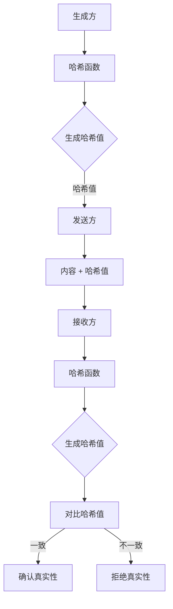

                 

### 文章标题
《真实性认证：企业应对AI生成内容的挑战》

### 关键词
AI生成内容，真实性认证，企业策略，技术手段，案例分析，安全性挑战

### 摘要
随着人工智能技术的快速发展，AI生成内容已经成为各行各业的重要内容。然而，AI生成内容的真实性认证成为企业面临的一大挑战。本文将从AI生成内容的背景和技术基础入手，深入探讨真实性认证的理论和实践，分析企业应对AI生成内容挑战的策略和方法，并通过实际案例进行详细讲解，旨在为企业提供有效应对AI生成内容挑战的指导。

---

# 引言

人工智能（AI）正在以惊人的速度改变我们的世界。从自动化生产到智能客服，从医疗诊断到金融分析，AI的应用已经渗透到我们生活的方方面面。然而，随着AI技术的不断进步，一种新的挑战也随之而来——AI生成内容。AI生成内容指的是通过算法生成的人类难以区分的自然语言文本、图像、音频等。这些内容可以用于娱乐、新闻、广告等多个领域，但也给企业带来了严重的真实性认证问题。

在当前环境下，企业面临的主要挑战包括：

1. **内容真实性**：如何确保AI生成的内容不包含虚假信息或误导性内容？
2. **个人隐私保护**：AI生成内容可能涉及个人隐私数据的收集和使用，如何保护用户隐私？
3. **知识产权问题**：AI生成的内容可能侵犯他人的知识产权，如何合法合规地进行使用和监管？

为了应对这些挑战，企业需要建立一套完整、科学、有效的真实性认证体系。本文将从以下几个方面展开讨论：

1. **AI生成内容的背景和技术基础**：介绍AI生成内容的发展历程、应用领域以及相关技术基础。
2. **真实性认证的理论和实践**：阐述真实性认证的概念、技术原理以及应用实践。
3. **企业应对AI生成内容挑战的策略和方法**：分析企业如何制定应对策略，采用哪些技术手段。
4. **案例分析**：通过实际案例探讨企业如何应对AI生成内容挑战。

本文旨在为企业和技术团队提供实用的指导，帮助他们更好地应对AI生成内容的挑战，确保内容真实性，保护个人隐私，遵守知识产权法规，从而在激烈的市场竞争中立于不败之地。

---

## AI生成内容的背景和技术基础

### AI生成内容的概述

AI生成内容（AI-generated content）是指通过人工智能算法生成的文本、图像、音频、视频等多媒体内容。这些内容在形式和意义上可以模仿人类创造的内容，从而达到以假乱真的效果。AI生成内容的概念最早可以追溯到20世纪80年代，当时研究人员开始探索使用神经网络和统计模型生成文本和图像。随着计算能力的提升和算法的优化，特别是在深度学习和生成对抗网络（GAN）等技术的推动下，AI生成内容的应用范围和复杂度得到了极大的扩展。

### 发展历程

AI生成内容的发展可以分为几个阶段：

1. **早期探索**：20世纪80年代，研究人员开始使用规则系统和模板匹配等方法生成文本和图像。
2. **基于统计的方法**：20世纪90年代，隐马尔可夫模型（HMM）和条件概率模型被用于生成文本。
3. **神经网络方法**：21世纪初，深度学习技术开始应用于AI生成内容，特别是递归神经网络（RNN）在文本生成方面表现出色。
4. **生成对抗网络（GAN）**：2014年，Ian Goodfellow等人提出了GAN，这一突破性的模型在图像和音频生成领域取得了显著的成果。
5. **当前发展**：随着Transformer架构的提出和广泛应用，AI生成内容在多样性和质量上都有了质的飞跃。

### 应用领域

AI生成内容的应用领域非常广泛，主要包括：

1. **文本生成**：包括新闻写作、诗歌创作、对话系统等。例如，OpenAI的GPT系列模型在文本生成方面表现出色。
2. **图像生成**：包括艺术作品创作、虚拟现实、医学影像处理等。GAN技术是图像生成的主要方法，例如DeepArt.io使用GAN生成艺术作品。
3. **音频生成**：包括音乐创作、语音合成等。WaveNet等模型在音频生成方面取得了显著成果。
4. **视频生成**：包括电影特效制作、视频增强等。通过结合视频编解码技术和生成模型，可以实现高效的视频生成。

### AI生成内容的技术基础

AI生成内容的技术基础主要包括自然语言处理（NLP）、计算机视觉（CV）和生成对抗网络（GAN）等。

#### 自然语言处理

自然语言处理是AI生成内容的核心技术之一。以下是几种关键的NLP技术：

1. **词向量**：词向量是将自然语言文本转换为向量的方法，例如Word2Vec和GloVe。这些向量可以捕捉词与词之间的语义关系。
2. **递归神经网络（RNN）**：RNN是一种处理序列数据的前馈神经网络，常用于文本生成。例如，LSTM和GRU是RNN的改进版本，能够更好地处理长序列数据。
3. **转换器架构（Transformer）**：Transformer是自然语言处理领域的重大突破，通过自注意力机制（self-attention）实现了对输入序列的全局上下文信息处理，广泛应用于文本生成任务，如BERT和GPT系列模型。

#### 计算机视觉

计算机视觉是AI生成内容中的另一个关键技术领域。以下是几种关键的CV技术：

1. **卷积神经网络（CNN）**：CNN是一种用于图像识别和处理的深度学习模型。通过卷积层和池化层，CNN能够自动提取图像的特征。
2. **生成对抗网络（GAN）**：GAN由生成器（Generator）和判别器（Discriminator）组成，通过两个网络的对抗训练，可以实现高质量的图像生成。例如，DCGAN和StyleGAN是GAN在图像生成中的成功应用。
3. **自注意力机制**：与NLP中的Transformer类似，自注意力机制在CV领域也被广泛应用，例如在生成对抗网络中的注意力生成网络（AttnGAN）。

#### 生成对抗网络（GAN）

生成对抗网络（GAN）是AI生成内容中的一种核心技术。GAN由两部分组成：生成器和判别器。

1. **生成器**：生成器的任务是生成看起来像真实数据的新数据。在图像生成中，生成器通常通过一系列的卷积层和反卷积层将随机噪声映射到图像空间。
2. **判别器**：判别器的任务是区分真实数据和生成数据。判别器通常由多层卷积层组成，通过对输入数据进行特征提取，判断其是否为真实数据。
3. **对抗训练**：生成器和判别器通过对抗训练进行训练。生成器的目标是生成足够逼真的数据，使得判别器无法区分，而判别器的目标是提高对真实数据和生成数据的区分能力。

通过这种对抗训练，生成器和判别器在相互竞争和协作的过程中不断提升，最终生成器能够生成高质量、逼真的图像。

总之，AI生成内容的发展离不开自然语言处理、计算机视觉和生成对抗网络等技术的支持。随着这些技术的不断进步，AI生成内容的应用前景将越来越广阔，但同时也给企业带来了新的挑战。在接下来的章节中，我们将深入探讨真实性认证的理论和实践，为企业应对AI生成内容挑战提供策略和方法。

## AI生成内容的安全性挑战

随着AI生成内容的广泛应用，其带来的安全性挑战也日益凸显。这些挑战不仅影响企业的业务运营，还可能对个人隐私和知识产权造成威胁。以下是AI生成内容在安全性方面面临的主要挑战：

### 内容真实性

内容真实性是AI生成内容面临的首要挑战。由于AI生成内容可以由算法自动生成，因此容易生成误导性或虚假信息。这些虚假信息不仅可能误导用户，还可能对企业声誉造成损害。例如，在新闻领域，虚假新闻的传播可能导致公众对新闻媒体的信任度下降。此外，在政治领域，虚假信息的传播可能会影响选举结果，甚至引发社会动荡。

为了应对内容真实性挑战，企业需要建立有效的真实性认证机制。这包括对AI生成内容的来源、生成过程和内容本身进行严格审查，确保其真实性。此外，还可以采用区块链等技术，对AI生成内容进行可信时间戳认证，从而增加其可信度。

### 个人隐私保护

AI生成内容往往需要收集和处理大量的个人数据，这可能导致个人隐私泄露。例如，在社交媒体平台，用户生成的内容可能会包含个人身份信息、家庭地址、电话号码等敏感信息。如果这些信息被不法分子获取，可能会对用户造成严重的隐私泄露风险。

为了保护个人隐私，企业需要采取以下措施：

1. **数据匿名化**：在生成AI内容时，对个人数据进行匿名化处理，减少隐私泄露风险。
2. **加密技术**：使用加密技术对敏感数据进行加密存储和传输，确保数据在传输过程中不被窃取。
3. **隐私政策**：制定明确的隐私政策，告知用户其数据的使用目的和范围，并取得用户的同意。

### 知识产权问题

AI生成内容还可能引发知识产权问题。由于AI生成的内容是由算法自动生成，可能会侵犯他人的知识产权。例如，在艺术创作领域，AI生成的艺术作品可能涉嫌抄袭他人的作品。此外，在商业领域，AI生成的内容可能包含未授权的商业信息，侵犯他人的商标权或商业秘密。

为了解决知识产权问题，企业需要采取以下措施：

1. **版权声明**：在生成AI内容时，明确声明其版权归属，避免侵犯他人的知识产权。
2. **内容审核**：建立内容审核机制，对AI生成的内容进行审查，确保其不包含侵权内容。
3. **合作与共赢**：鼓励企业之间进行合作，共同开发AI生成内容的技术和应用，从而降低知识产权风险。

总之，AI生成内容在安全性方面面临诸多挑战，企业需要采取有效的策略和方法，确保内容真实性、保护个人隐私、遵守知识产权法规。在接下来的章节中，我们将深入探讨真实性认证的理论和实践，为企业应对这些挑战提供指导。

## 真实性认证的概念

真实性认证是指通过技术手段验证信息或内容的真实性和可靠性。在AI生成内容领域，真实性认证尤为重要，因为AI生成的内容可能包含虚假信息、误导性内容或未经授权的内容。真实性认证的核心目标是确保用户能够信任和依赖AI生成的内容，从而在信息传播和业务运营中避免潜在的风险和损失。

### 概念解释

真实性认证的概念可以从以下几个方面进行解释：

1. **真实性**：真实性是指信息或内容是否与其声称的来源、性质和内容一致。对于AI生成内容，真实性意味着其内容是否真实存在，是否由合法渠道生成，以及其生成过程是否符合既定标准。
2. **可靠性**：可靠性是指信息或内容的可信度和稳定性。对于AI生成内容，可靠性意味着其内容是否能够持续、稳定地提供预期的效果，以及其生成过程中是否具有一致性。
3. **认证**：认证是指通过特定的技术手段和流程，对信息或内容的真实性进行验证和确认。在AI生成内容中，认证通常涉及对内容的来源、生成过程、使用意图等多方面的检查和验证。

### 真实性认证的重要性

在AI生成内容日益普及的背景下，真实性认证的重要性愈加凸显。以下是真实性认证的重要意义：

1. **确保信息准确性和可信度**：真实性认证有助于确保AI生成的内容真实、准确、可信，从而提高用户对内容的信任度和依赖度。
2. **保护用户隐私**：通过真实性认证，可以确保AI生成的内容不包含未经授权的个人信息，从而保护用户的隐私。
3. **降低法律风险**：真实性认证有助于企业遵守相关法律法规，降低因虚假信息或侵权内容引发的法律风险。
4. **提升企业声誉**：真实性认证有助于提升企业在用户和社会中的声誉，增强用户对企业的信任和认可。

### 真实性认证的核心要素

真实性认证的核心要素包括以下几个方面：

1. **内容溯源**：确保AI生成内容的来源明确、可追溯。例如，通过区块链技术记录内容的生成过程和来源信息，确保内容的真实性。
2. **内容审核**：对AI生成的内容进行审核，确保其不包含虚假信息、误导性内容或侵权内容。这可以通过人工审核或自动化审核工具实现。
3. **内容加密**：使用加密技术对AI生成的内容进行加密存储和传输，确保内容在传输过程中不被篡改或窃取。
4. **技术监控**：通过技术手段监控AI生成内容的使用情况，及时发现和处理潜在的问题。

总之，真实性认证是确保AI生成内容真实可靠的重要手段。在AI技术不断发展的背景下，企业需要高度重视真实性认证，采取有效的策略和方法，确保AI生成内容的安全性和可信度。在接下来的章节中，我们将进一步探讨真实性认证的技术原理和应用实践。

## 真实性认证的技术原理

真实性认证的技术原理主要涉及数学模型、算法框架和Mermaid流程图等方面。这些技术手段共同构成了一个系统化的认证体系，确保AI生成内容在生成、传输和使用过程中保持真实性和可靠性。

### 数学模型

数学模型是真实性认证的核心组成部分，用于描述和实现各种认证算法。以下是几种常用的数学模型：

1. **哈希函数**：哈希函数是一种将输入数据映射为固定长度字符串的函数。其特点是一致性和抗碰撞性，即相同的输入总是产生相同的输出，而不同的输入则产生不同的输出。哈希函数广泛应用于数据完整性验证和数字签名。
2. **数字签名**：数字签名是一种用于验证数据来源和完整性的技术，通过加密算法实现。发送方使用自己的私钥对数据进行加密，接收方使用公钥进行解密。如果解密成功，则可以确认数据的来源和完整性。
3. **同态加密**：同态加密是一种在加密状态下对数据进行操作的技术，能够在不暴露数据内容的情况下对数据进行计算。这种技术对于保护AI生成内容的隐私和完整性具有重要意义。
4. **区块链**：区块链是一种分布式账本技术，通过多个节点共同维护一个不可篡改的记录。区块链技术可以记录AI生成内容的全生命周期信息，包括生成时间、生成地点、生成者等，从而确保内容的真实性。

### 算法框架

算法框架是真实性认证的核心部分，决定了认证过程的具体实现。以下是几种常见的算法框架：

1. **基于哈希的认证框架**：该框架通过哈希函数对AI生成内容进行校验。具体步骤如下：
   - 生成方：将AI生成内容输入哈希函数，生成哈希值，并将哈希值与内容一同发送给接收方。
   - 接收方：将接收到的内容输入哈希函数，生成哈希值，并与发送方提供的哈希值进行对比。如果一致，则确认内容真实性。
2. **基于数字签名的认证框架**：该框架通过数字签名技术确保AI生成内容的来源和完整性。具体步骤如下：
   - 生成方：使用自己的私钥对AI生成内容进行数字签名，并将签名与内容一同发送给接收方。
   - 接收方：使用生成方的公钥对签名进行验证，如果验证成功，则确认内容来源和完整性。
3. **基于区块链的认证框架**：该框架利用区块链技术记录AI生成内容的全生命周期信息。具体步骤如下：
   - 生成方：将AI生成内容和相关信息上传到区块链，并获得一个区块链地址。
   - 接收方：通过区块链地址查询AI生成内容的相关信息，验证其真实性。

### Mermaid流程图

Mermaid是一种基于Markdown的图形绘制工具，可以方便地绘制流程图、时序图等。以下是使用Mermaid绘制的基于哈希函数的认证流程图：

在这个流程图中，生成方通过哈希函数生成哈希值，将哈希值与内容一同发送给接收方。接收方通过哈希函数对内容进行校验，如果生成的哈希值与发送方提供的哈希值一致，则确认内容真实性。

总之，真实性认证的技术原理包括数学模型、算法框架和Mermaid流程图等多个方面，通过这些技术手段，企业可以有效地确保AI生成内容的真实性和可靠性。在接下来的章节中，我们将探讨真实性认证的应用实践，为企业提供具体的实施策略和方法。

### 真实性认证的应用实践

真实性认证的应用实践涵盖了多个行业和平台，从社交媒体到新闻媒体，再到企业内部内容审核，各种应用场景中都需要确保AI生成内容的真实性。以下是几个典型的应用实践案例：

#### 社交媒体平台

社交媒体平台如Twitter、Facebook和Instagram等，已经成为人们获取信息和交流的主要渠道。然而，这些平台上充斥着大量由AI生成的虚假信息和误导性内容，给用户带来了困扰。为了应对这一问题，社交媒体平台采取了多种真实性认证措施：

1. **内容审核**：社交媒体平台通过建立内容审核团队，对AI生成的内容进行人工审核，确保其不包含虚假信息或误导性内容。
2. **算法检测**：平台利用机器学习算法检测AI生成内容的特征，自动识别和过滤虚假信息。例如，Twitter使用其“Birdwatch”项目，鼓励用户共同标记和审核内容。
3. **可信时间戳**：通过区块链技术为AI生成内容生成可信时间戳，确保内容在特定时间点存在，并可以追溯。

#### 新闻媒体行业

新闻媒体行业在真实性认证方面面临着巨大挑战，因为虚假新闻可能对公众信任和社会稳定造成严重影响。为了确保新闻内容的真实性，新闻媒体采取了以下措施：

1. **来源审查**：新闻媒体对AI生成内容的来源进行严格审查，确保内容来源可靠、合法。
2. **多渠道验证**：新闻媒体通过多渠道验证信息，交叉比对，确保新闻内容的真实性。
3. **区块链记录**：新闻媒体利用区块链技术记录新闻内容的生成和传播过程，确保内容的不可篡改性和可追溯性。

#### 企业内部内容审核

在企业内部，AI生成内容主要用于市场营销、客户服务、内部沟通等领域。为了确保内容真实性和合规性，企业采取了以下措施：

1. **内容过滤**：企业建立内容过滤机制，自动检测和过滤AI生成内容中的敏感词汇、虚假信息等。
2. **权限管理**：企业对生成AI内容的用户进行权限管理，确保只有具备相应权限的用户可以生成和发布内容。
3. **定期审核**：企业定期对AI生成内容进行人工审核，确保内容合规、真实。

#### 具体案例

以下是一个具体的案例，说明如何通过真实性认证措施确保企业内部AI生成内容的质量和可信度：

**案例背景**：某知名企业在其官网和社交媒体平台上发布了一系列由AI生成的内容，包括新闻稿、产品介绍和客户服务回复等。

**实施策略**：
1. **内容审核**：企业建立了一个由专业编辑和技术人员组成的内容审核团队，对AI生成的内容进行人工审核，确保内容不包含虚假信息或误导性内容。
2. **算法检测**：企业使用了机器学习算法对AI生成内容进行检测，自动识别潜在的问题内容，并通知审核团队进行进一步审查。
3. **可信时间戳**：企业利用区块链技术为每条AI生成内容生成可信时间戳，确保内容的真实性和可追溯性。
4. **权限管理**：企业对生成AI内容的用户进行了严格的权限管理，只有具备高级权限的用户才能生成和发布内容。

**遇到的挑战和解决方案**：
1. **内容质量**：最初，AI生成的内容质量不稳定，有时会出现不准确或误导性信息。通过优化算法和增加人工审核，企业提高了AI生成内容的准确性。
2. **用户接受度**：部分用户对AI生成的内容持怀疑态度，担心其真实性。通过透明的审核流程和可信时间戳，企业增加了用户对AI生成内容的信任度。

**结果**：通过这些措施，企业成功确保了AI生成内容的质量和可信度，提高了内容发布的效率，并增强了用户对企业的信任。

总之，真实性认证在各个应用场景中发挥着重要作用，通过具体的实施策略和技术手段，企业可以确保AI生成内容的真实性和可靠性，从而提高内容质量，增强用户信任，降低法律风险。

### 企业应对AI生成内容挑战的策略

在AI生成内容日益普及的背景下，企业需要制定科学、系统的应对策略，以确保内容真实性、保护个人隐私、遵守知识产权法规。以下是企业应对AI生成内容挑战的几个关键策略：

#### 风险评估

首先，企业需要进行全面的风险评估，识别AI生成内容可能带来的各种风险。这包括但不限于：

1. **内容真实性**：AI生成内容可能包含虚假信息或误导性内容，影响用户信任和企业声誉。
2. **个人隐私保护**：AI生成内容可能涉及个人隐私数据的收集和使用，增加隐私泄露风险。
3. **知识产权问题**：AI生成内容可能侵犯他人的知识产权，导致法律纠纷。

通过风险评估，企业可以明确面临的挑战和潜在威胁，为制定应对策略提供依据。

#### 防护策略

在识别风险之后，企业需要制定一系列防护策略，以预防和减轻AI生成内容带来的风险。以下是几种常见的防护策略：

1. **内容审核**：建立内容审核机制，对AI生成的内容进行严格审查。这包括人工审核和自动化审核，确保内容不包含虚假信息或误导性内容。
2. **加密技术**：使用加密技术保护个人隐私数据和知识产权，确保数据在传输和存储过程中的安全性。
3. **权限管理**：对生成和发布AI内容的用户进行权限管理，确保只有具备相应权限的用户才能进行相关操作。
4. **监控和预警**：建立监控和预警系统，实时监测AI生成内容的使用情况，及时发现和处理潜在问题。

#### 监控和响应机制

企业需要建立一套完善的监控和响应机制，以确保在问题发生时能够迅速采取措施。以下是几个关键步骤：

1. **实时监控**：通过技术手段对AI生成内容进行实时监控，及时发现异常情况。
2. **报警机制**：建立报警机制，当发现潜在问题时，及时通知相关人员进行处理。
3. **应急预案**：制定应急预案，明确在问题发生时的应对措施，确保能够迅速响应和解决问题。
4. **持续改进**：根据监控和响应结果，不断优化防护策略和应对措施，提高企业的应对能力。

#### 技术手段

除了上述策略，企业还可以采用多种技术手段来应对AI生成内容挑战。以下是几种常用的技术手段：

1. **内容过滤**：使用机器学习算法和规则系统，自动过滤AI生成内容中的敏感词汇、虚假信息等。
2. **数据加密**：使用加密技术对个人隐私数据和知识产权进行加密，确保数据在传输和存储过程中的安全性。
3. **区块链技术**：利用区块链技术记录AI生成内容的全生命周期信息，确保内容的真实性和可追溯性。
4. **人工智能对抗**：利用对抗性神经网络等技术，提高AI生成内容的鉴别能力和应对能力。

总之，企业应对AI生成内容挑战需要采取全面、系统的策略，包括风险评估、防护策略、监控和响应机制以及技术手段。通过这些措施，企业可以确保AI生成内容的真实性、保护个人隐私、遵守知识产权法规，从而在激烈的市场竞争中立于不败之地。

### 技术手段

为了有效应对AI生成内容的挑战，企业需要采用一系列技术手段，这些技术手段不仅有助于保护内容的真实性，还能提升整体的安全性和可靠性。以下是几种关键的技术手段及其具体应用：

#### 内容过滤

内容过滤是指通过算法和规则系统自动识别和屏蔽潜在的虚假或有害内容。以下是一些常见的内容过滤技术：

1. **关键词过滤**：通过预设的关键词列表，自动检测和屏蔽含有敏感词汇的内容。
2. **机器学习分类器**：使用训练好的机器学习模型，对内容进行分类和标注，自动识别虚假信息、恶意信息等。
3. **规则系统**：根据预定义的规则，对内容进行模式匹配，识别和屏蔽不符合规定的内容。

#### 模糊处理

模糊处理是指对敏感内容进行部分遮盖或遮挡，以保护个人隐私和数据安全。以下是一些常见的模糊处理技术：

1. **图像模糊**：通过算法对图像中的敏感部分进行模糊处理，使图像中的关键信息难以辨认。
2. **文本遮盖**：使用遮挡算法，对文本中的敏感部分进行遮盖，保护个人身份信息等敏感数据。
3. **音频处理**：通过噪声添加、音调变化等技术，对音频中的敏感内容进行模糊处理。

#### 数据加密

数据加密是指通过加密算法对数据进行加密，确保数据在传输和存储过程中的安全性。以下是一些常见的数据加密技术：

1. **对称加密**：使用相同的密钥对数据进行加密和解密。例如，AES（高级加密标准）是一种常用的对称加密算法。
2. **非对称加密**：使用不同的密钥对数据进行加密和解密。例如，RSA（Rivest-Shamir-Adleman）是一种常用的非对称加密算法。
3. **混合加密**：结合对称加密和非对称加密，提高数据传输和存储的安全性。

#### 数字签名

数字签名是指通过加密算法对数据进行的签名和验证，以确保数据的真实性和完整性。以下是一些常见的数字签名技术：

1. **RSA签名**：使用RSA算法对数据进行签名和验证。
2. **ECDSA签名**：使用椭圆曲线数字签名算法（ECDSA）对数据进行签名和验证，具有更高的安全性和效率。
3. **智能合约**：利用区块链技术，实现自动化的数字签名和验证，确保数据的真实性和不可篡改性。

#### 区块链技术

区块链技术通过分布式账本和加密算法，确保数据的不可篡改性和可追溯性。以下是一些常见的区块链技术应用：

1. **区块链记录**：将AI生成内容及其相关信息记录在区块链上，确保数据的真实性和可追溯性。
2. **智能合约**：利用智能合约自动化执行数据验证、交易等操作，提高数据处理的效率和安全性。
3. **分布式存储**：通过区块链技术实现数据的分布式存储，提高数据的安全性和可用性。

总之，企业应对AI生成内容挑战需要采用多种技术手段，这些技术手段相互配合，共同构成一个全面、系统的安全防护体系。通过内容过滤、模糊处理、数据加密、数字签名和区块链技术等手段，企业可以有效地确保AI生成内容的真实性和安全性，从而在激烈的市场竞争中保持优势。

### 法律法规和政策

在应对AI生成内容挑战的过程中，企业不仅需要依赖技术手段，还必须严格遵守相关法律法规和政策。这些法律法规和政策为企业提供了法律框架，指导企业在内容生成、使用和传播过程中合法合规地操作。以下是国内外关于AI生成内容的几个重要法规和政策：

#### 国内法规

1. **《中华人民共和国网络安全法》**：该法律明确了网络运营者的安全保护义务，要求网络运营者在收集、使用个人信息时必须遵循合法、正当、必要的原则，并采取有效措施保护个人信息安全。
2. **《互联网信息服务管理办法》**：该办法规定了互联网信息服务提供者的信息审核责任，要求其对平台上的信息进行内容审核，确保不传播虚假、有害信息。
3. **《信息安全技术个人信息安全规范》**：该规范为个人信息保护提供了具体操作指南，要求企业在处理个人信息时采取加密、匿名化等安全措施。

#### 国际法规

1. **《通用数据保护条例（GDPR）》**：欧盟制定的GDPR是全球最具影响力的个人信息保护法律。它规定了数据处理的合法性、透明度和用户权利，对AI生成内容中的个人数据处理提出了严格要求。
2. **《加州消费者隐私法案（CCPA）》**：CCPA是美国的个人信息保护法律，要求企业公开其收集、使用消费者个人信息的方式，并赋予消费者对个人信息的访问、删除和拒绝出售权。
3. **《数字服务法（DSA）》**：欧盟正在制定的数字服务法，旨在加强数字平台的监管，包括对AI生成内容的管理，确保平台的透明性和安全性。

#### 标准化制定

标准化在AI生成内容领域同样至关重要，有助于确保技术的通用性和互操作性。以下是几个关键的国际标准：

1. **ISO/IEC 27001**：信息安全管理体系（ISMS）标准，为企业提供了系统化的信息安全管理体系指南。
2. **ISO/IEC 29110**：软件生命周期过程标准，为AI生成内容的开发和管理提供了过程指南。
3. **ISO/IEC 30000**：数据管理和数据存储标准，为数据的安全存储和交换提供了规范。

#### 企业遵守法律法规的实践

为了合法合规地应对AI生成内容挑战，企业可以采取以下实践：

1. **建立合规体系**：企业应建立专门的合规团队，负责跟踪和解读相关法律法规，确保企业操作的合法性和合规性。
2. **培训和教育**：对员工进行法律法规和合规政策的培训，提高员工的法律意识和合规操作能力。
3. **制定合规流程**：制定详细的合规操作流程，包括内容生成、审核、发布等环节，确保每个环节都符合法律法规要求。
4. **技术手段支持**：采用加密、匿名化、内容过滤等技术手段，确保AI生成内容的安全性和隐私保护。

总之，企业应对AI生成内容挑战，必须遵守相关法律法规和政策，制定科学、系统的合规策略，通过技术手段和法律实践，确保AI生成内容的真实性和合规性。

### 案例分析

在探讨企业如何应对AI生成内容挑战时，案例分析是一个非常有价值的工具。通过分析具体的企业实践，我们可以深入了解企业是如何识别和解决这些挑战的，同时也可以从中获取一些最佳实践和经验教训。

#### 案例一：企业应对AI生成内容挑战的实践

**案例背景**：某国际知名科技公司（以下简称“公司”）在其官方网站和社交媒体平台发布大量由AI生成的新闻稿、产品介绍和客户服务回复等。随着AI生成内容的普及，公司逐渐意识到确保内容真实性、保护用户隐私和遵守知识产权法规的重要性。

**实施策略**：
1. **内容审核**：公司建立了一个由专业编辑、数据科学家和AI研究人员组成的内容审核团队。审核团队对AI生成的所有内容进行详细审查，确保内容不包含虚假信息或误导性内容。
2. **算法检测**：公司使用机器学习算法和规则系统对AI生成内容进行自动检测，自动识别潜在的问题内容，并通知审核团队进行进一步审查。
3. **可信时间戳**：公司利用区块链技术为每条AI生成内容生成可信时间戳，确保内容的真实性和可追溯性。
4. **权限管理**：公司对生成和发布AI内容的用户进行严格的权限管理，只有具备高级权限的用户才能生成和发布内容。

**遇到的挑战和解决方案**：
1. **内容质量**：公司最初发现AI生成的内容质量不稳定，有时会出现不准确或误导性信息。公司通过不断优化算法和增加人工审核，逐步提高了AI生成内容的准确性。
2. **用户接受度**：部分用户对AI生成的内容持怀疑态度，担心其真实性。公司通过透明的审核流程和可信时间戳，增加了用户对AI生成内容的信任度。
3. **隐私保护**：AI生成内容可能涉及个人隐私数据的收集和使用，公司通过数据匿名化和加密技术，确保用户隐私得到保护。

**结果**：通过上述措施，公司成功确保了AI生成内容的真实性和可靠性，提高了内容发布的效率，并增强了用户对公司的信任。同时，公司也降低了因虚假信息或侵权内容引发的法律风险。

#### 案例二：跨行业合作应对AI生成内容挑战

**案例背景**：某国内大型电商平台（以下简称“平台”）与其生态合作伙伴（如品牌商、物流公司等）共同应对AI生成内容的挑战。平台希望通过AI生成内容提高用户体验和营销效果，但同时也担心内容真实性、用户隐私保护和知识产权问题。

**合作模式**：
1. **内容共享**：平台与合作伙伴共享AI生成内容，确保各方能够使用高质量的内容。
2. **联合审核**：平台与合作伙伴共同组建内容审核团队，对AI生成内容进行联合审查，确保内容真实性。
3. **知识产权保护**：平台与合作伙伴共同制定知识产权保护政策，确保AI生成内容不侵犯他人的知识产权。

**成果和启示**：
1. **提升内容质量**：通过跨行业合作，平台和合作伙伴共同优化AI生成内容的质量，确保内容真实、准确、有价值。
2. **增强用户信任**：用户对跨行业合作生成的AI内容更具有信任度，提高了用户的满意度和平台口碑。
3. **共享资源**：跨行业合作有助于各方共享技术和资源，降低单独应对AI生成内容挑战的成本和难度。

**总结**：通过案例分析，我们可以看到，企业在应对AI生成内容挑战时，需要采取多种措施，包括内容审核、算法检测、可信时间戳、权限管理、数据匿名化和加密技术等。同时，跨行业合作也是应对这些挑战的有效途径，有助于提升内容质量、增强用户信任、保护知识产权。企业可以从这些案例中汲取经验，制定适合自己的应对策略，确保在AI生成内容领域保持竞争优势。

### 结论

本文从多个角度深入探讨了真实性认证在应对AI生成内容挑战中的重要性。随着人工智能技术的快速发展，AI生成内容已经成为各行各业的重要内容，但同时也带来了内容真实性、个人隐私保护和知识产权等一系列挑战。为了确保AI生成内容的真实性和可靠性，企业需要采取一系列策略和方法，包括内容审核、算法检测、可信时间戳、权限管理、数据匿名化和加密技术等。

通过本文的分析，我们可以得出以下结论：

1. **内容真实性认证至关重要**：真实性认证是确保AI生成内容不包含虚假信息或误导性内容的关键手段，有助于提升用户对内容的信任度，保护企业声誉。
2. **多层次防护策略必不可少**：企业应采取多层次、系统化的防护策略，结合技术手段和人工审核，全面应对AI生成内容的挑战。
3. **跨行业合作具有重要意义**：跨行业合作有助于共享资源和技术，提高内容生成和审核的效率，降低应对AI生成内容挑战的成本和难度。

面对未来，随着AI技术的不断进步，企业应对AI生成内容挑战的策略和方法也需要不断更新和优化。企业应持续关注相关法律法规的变化，积极采用新技术，加强内部培训和合规管理，确保在AI生成内容领域保持竞争优势。同时，跨行业合作也将继续发挥重要作用，通过共同应对挑战，推动AI生成内容领域的健康发展。

### 附录

#### 相关法规和标准

- **《中华人民共和国网络安全法》**
- **《互联网信息服务管理办法》**
- **《信息安全技术个人信息安全规范》**
- **《通用数据保护条例（GDPR）》**
- **《加州消费者隐私法案（CCPA）》**
- **《数字服务法（DSA）》**
- **ISO/IEC 27001：信息安全管理体系（ISMS）**
- **ISO/IEC 29110：软件生命周期过程标准**
- **ISO/IEC 30000：数据管理和数据存储标准**

#### 常用工具和资源

- **AI生成内容检测工具**：如Google的JAXAI、Facebook的AI Fact-Checking Tools等。
- **区块链平台**：如Ethereum、Hyperledger Fabric等。
- **加密工具**：如AES加密算法、RSA加密算法等。
- **机器学习库**：如TensorFlow、PyTorch、Scikit-learn等。
- **内容审核平台**：如Google的Content Policy、Twitter的Birdwatch等。
- **开源代码和模型**：如OpenAI的GPT系列模型、DeepMind的GAN模型等。

### 最佳实践 tips

- **定期审计和培训**：定期对AI生成内容进行审计，并对相关人员（特别是内容审核团队）进行培训，确保他们了解最新的认证技术和法规要求。
- **透明度和用户参与**：建立透明的AI生成内容认证流程，让用户了解内容生成的机制，增加用户对AI生成内容的信任。
- **动态调整策略**：随着技术的进步和法规的变化，企业应动态调整应对策略，确保内容认证措施的有效性。
- **跨部门合作**：建立跨部门合作机制，确保技术团队、内容审核团队和合规团队等紧密协作，共同应对AI生成内容挑战。

#### 注意事项

- **内容真实性和准确性**：确保AI生成内容真实、准确，避免虚假信息或误导性内容。
- **个人隐私保护**：在AI生成内容过程中，严格遵守个人隐私保护法规，采取数据匿名化和加密技术等措施。
- **知识产权保护**：确保AI生成内容不侵犯他人的知识产权，采取版权声明和内容审核等措施。
- **合规性**：遵守相关法律法规和行业标准，确保企业的AI生成内容认证策略符合法规要求。

#### 拓展阅读

- **《人工智能伦理与法律》**：探讨人工智能在伦理和法律方面的挑战，为AI生成内容认证提供理论支持。
- **《区块链技术原理与应用》**：详细介绍区块链技术在数据安全和真实性认证中的应用。
- **《深度学习与自然语言处理》**：介绍深度学习技术在AI生成内容生成和认证中的应用。
- **《人工智能应用实践案例》**：分析不同行业在应对AI生成内容挑战中的成功经验和最佳实践。

通过附录部分的内容，读者可以更全面地了解真实性认证在应对AI生成内容挑战中的具体实施方法和技术手段，为实际操作提供参考和指导。同时，附录中的最佳实践、注意事项和拓展阅读也为读者进一步学习和研究提供了丰富的资源。

