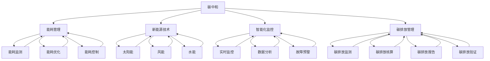

                 

### 文章标题

# 碳中和数据中心的设计与运营

### 关键词

- 碳中和
- 数据中心
- 设计与运营
- 低碳能源
- 新能源技术
- 智能化监控
- 碳排放管理
- 节能减排

### 摘要

随着全球气候变化问题日益严峻，碳中和成为了国际社会的共同目标。数据中心作为现代社会信息基础设施的核心，其能源消耗和碳排放问题备受关注。本文将从碳中和数据中心的设计与运营出发，详细介绍其概念、意义、挑战与机遇，并从架构设计、硬件选型、能耗管理、运营策略等多个方面深入探讨碳中和数据中心的关键技术和实践方法。通过国内外案例研究和趋势分析，本文旨在为碳中和数据中心的设计与运营提供全面、系统的参考和指导。

---

## 碳中和技术背景

### 碳中和的概念与重要性

碳中和，是指通过减少碳排放和增加碳汇，实现净零碳排放的目标。在全球气候变化日益严峻的背景下，碳中和成为了国际社会的共识和重要目标。根据《巴黎协定》，各国承诺将采取积极措施，努力实现全球温室气体排放的峰值，并在本世纪中叶实现碳中和。

数据中心作为现代社会信息基础设施的核心，其能源消耗和碳排放问题备受关注。传统数据中心主要依赖化石能源，能耗高且碳排放量大。据统计，全球数据中心的碳排放量已占全球总碳排放量的1%以上，且有逐年增加的趋势。因此，实现数据中心的碳中和，不仅有助于减少碳排放，还能推动绿色能源的广泛应用，促进可持续发展。

### 数据中心的能耗问题

数据中心的能耗问题主要源于以下几个方面：

1. **服务器能耗**：服务器是数据中心的耗能大户，其能耗约占数据中心总能耗的40%-60%。随着数据量的不断增长，服务器能耗也在持续上升。

2. **制冷能耗**：为了维持服务器正常运行，数据中心需要大量制冷设备来降低设备温度。制冷能耗约占数据中心总能耗的20%-30%。

3. **网络设备能耗**：交换机、路由器等网络设备也会产生一定能耗，约占数据中心总能耗的10%-15%。

4. **其他设备能耗**：包括UPS、存储设备、备用设备等，其能耗约占数据中心总能耗的5%-10%。

综上所述，数据中心的能耗结构呈现高度集中化和多样化的特点，使得其能耗管理成为一个复杂且关键的问题。

### 碳排放的影响与挑战

数据中心的高能耗直接导致了大量的碳排放，对环境造成严重影响。碳排放不仅加剧了全球气候变化，还对人类健康和生态系统构成威胁。因此，实现数据中心的碳中和具有重要意义：

1. **环境保护**：减少碳排放有助于减轻全球气候变化的影响，保护生态环境。

2. **社会责任**：作为企业和社会的一份子，数据中心企业有责任积极参与碳中和行动，推动可持续发展。

3. **经济效益**：通过降低能耗和碳排放，数据中心企业可以降低运营成本，提高能源利用效率。

4. **市场竞争力**：在低碳时代，具备低碳优势的数据中心将更具市场竞争力，吸引更多客户。

### 数据中心碳中和的目标与意义

数据中心碳中和的目标在于通过减少碳排放和增加碳汇，实现数据中心的净零碳排放。具体来说，包括以下几个方面：

1. **优化能耗结构**：通过技术和管理手段，降低数据中心的能耗，特别是关键设备的能耗。

2. **推广新能源**：积极采用新能源，如太阳能、风能等，替代传统化石能源。

3. **提升能效**：通过智能化管理和优化，提高数据中心的整体能效。

4. **碳交易与抵消**：参与碳交易市场，购买碳减排量，实现碳中和。

实现数据中心碳中和的意义在于：

1. **推动绿色技术发展**：推动数据中心行业向低碳、绿色、智能方向发展。

2. **促进能源转型**：推动能源消费结构的优化和能源生产方式的变革。

3. **提升社会效益**：为人类健康和可持续发展做出贡献。

### 总结

碳中和数据中心不仅是应对气候变化的重要措施，也是数据中心行业发展的必然趋势。通过优化能耗结构、推广新能源、提升能效和参与碳交易，数据中心可以实现碳中和，为环境保护和可持续发展做出积极贡献。

---

## 核心概念与联系

### 碳中和数据中心的关键概念

要深入探讨碳中和数据中心的设计与运营，首先需要理解以下几个核心概念：

1. **碳中和**：碳中和是指通过减少碳排放和增加碳汇，实现净零碳排放的目标。碳中和数据中心则是在这一理念指导下，通过一系列技术和策略，实现数据中心碳排放的全面控制和减少。

2. **能耗管理**：能耗管理是数据中心运营的核心，包括能耗监测、能耗优化和能耗控制。通过精细化的能耗管理，可以降低数据中心的能耗，从而减少碳排放。

3. **新能源技术**：新能源技术是指利用太阳能、风能、水能等可再生能源，替代传统化石能源，以实现数据中心的碳中和目标。

4. **智能化监控**：智能化监控是通过对数据中心运行状态的实时监控和分析，实现能耗优化和故障预警。智能化监控可以大幅提高数据中心的运行效率和安全性。

5. **碳排放管理**：碳排放管理包括碳排放的监测、核算、报告和验证。通过碳排放管理，可以全面掌握数据中心的碳排放情况，制定针对性的减排策略。

### 核心概念之间的关系架构

为了更好地理解这些核心概念之间的关系，我们可以使用Mermaid流程图进行表示：



### 各概念的具体含义和联系

1. **碳中和与能耗管理**：碳中和是数据中心运营的总体目标，能耗管理是实现这一目标的关键手段。通过能耗管理，可以降低数据中心的能耗，从而减少碳排放。

2. **碳中和与新能源技术**：新能源技术是实现数据中心碳中和的重要途径。通过采用太阳能、风能等可再生能源，可以替代传统化石能源，降低数据中心的碳排放。

3. **碳中和与智能化监控**：智能化监控通过实时监测和分析数据中心的运行状态，可以提供能耗优化的依据，同时实现故障预警，保障数据中心的稳定运行。

4. **碳中和与碳排放管理**：碳排放管理是全面掌握数据中心碳排放情况的重要手段。通过碳排放监测、核算、报告和验证，可以制定更加有效的减排策略，实现数据中心的碳中和目标。

通过以上核心概念和关系的分析，我们可以更好地理解碳中和数据中心的设计与运营，为后续的内容奠定基础。

---

## 核心算法原理讲解

### 数据中心能耗优化算法

为了实现碳中和数据中心的能耗优化，我们可以采用一种基于人工智能的能耗优化算法。以下是一种可能的算法设计：

```python
# 假设输入参数为：
# servers: 服务器列表
# cooling_system: 制冷系统
# network_devices: 网络设备
# energy_prices: 能源价格表
# carbon_tax: 碳排放税

def energy_consumption_optimization(servers, cooling_system, network_devices, energy_prices, carbon_tax):
    # 初始化能耗优化参数
    optimal_energy_consumption = 0
    optimal_server_config = None
    
    # 遍历所有可能的设备配置组合
    for server_config in generate_server_configs(servers):
        for cooling_config in generate_cooling_configs(cooling_system):
            for network_config in generate_network_configs(network_devices):
                # 计算当前配置的能耗和碳排放
                current_energy_consumption = calculate_energy_consumption(server_config, cooling_config, network_config, energy_prices)
                current_carbon_emission = calculate_carbon_emission(current_energy_consumption, carbon_tax)
                
                # 如果当前配置的能耗和碳排放最优，更新优化参数
                if current_energy_consumption < optimal_energy_consumption or (current_energy_consumption == optimal_energy_consumption and current_carbon_emission < optimal_carbon_emission):
                    optimal_energy_consumption = current_energy_consumption
                    optimal_carbon_emission = current_carbon_emission
                    optimal_server_config = server_config
                
    return optimal_server_config, optimal_energy_consumption, optimal_carbon_emission

# 辅助函数：
# generate_server_configs(servers): 生成所有可能的设备配置组合
# calculate_energy_consumption(config, energy_prices): 计算配置的能耗
# calculate_carbon_emission(energy_consumption, carbon_tax): 计算配置的碳排放
```

### 能耗计算公式

为了详细解释能耗计算过程，我们可以引入以下公式：

$$
E = P \times t
$$

其中，\( E \) 是能耗（单位：千瓦时/kWh），\( P \) 是功率（单位：千瓦/kW），\( t \) 是时间（单位：小时/h）。

对于服务器、制冷系统和网络设备，我们可以分别计算其能耗：

1. **服务器能耗**：

$$
E_{server} = P_{server} \times t
$$

其中，\( P_{server} \) 是服务器的平均功率。

2. **制冷能耗**：

$$
E_{cooling} = P_{cooling} \times t
$$

其中，\( P_{cooling} \) 是制冷系统的平均功率。

3. **网络设备能耗**：

$$
E_{network} = P_{network} \times t
$$

其中，\( P_{network} \) 是网络设备的平均功率。

### 碳排放计算公式

碳排放的计算基于能耗和碳排放系数。假设碳排放系数为 \( C \)（单位：千克二氧化碳/千瓦时/kWh），我们可以使用以下公式计算碳排放：

$$
E_{carbon} = E \times C
$$

对于数据中心整体碳排放，我们可以将各个设备的能耗相加，并乘以碳排放系数：

$$
E_{total\_carbon} = (E_{server} + E_{cooling} + E_{network}) \times C
$$

### 举例说明

假设我们有一个包含100台服务器的数据中心，每台服务器的平均功率为1千瓦，制冷系统的平均功率为2千瓦，网络设备的平均功率为1千瓦。能源价格为每千瓦时0.5元，碳排放税为每千克二氧化碳10元。根据以上公式和算法，我们可以计算出最优的设备配置和碳排放。

首先，生成所有可能的设备配置组合：

```python
server_configs = generate_server_configs([1, 2, 3])
cooling_configs = generate_cooling_configs([2, 3, 4])
network_configs = generate_network_configs([1, 2, 3])
```

然后，使用能耗优化算法计算最优配置：

```python
optimal_config, optimal_energy_consumption, optimal_carbon_emission = energy_consumption_optimization(server_configs, cooling_configs, network_configs, 0.5, 10)
```

最后，输出最优配置和碳排放：

```python
print("最优设备配置：", optimal_config)
print("最优能耗：", optimal_energy_consumption, "千瓦时")
print("最优碳排放：", optimal_carbon_emission, "千克二氧化碳")
```

通过这种能耗优化算法，我们可以找到在给定条件下能耗和碳排放最优的设备配置，从而实现数据中心的碳中和目标。

---

## 数学模型和数学公式

### 数据中心能耗优化数学模型

为了详细描述数据中心能耗优化的过程，我们可以构建一个数学模型。这个模型将基于线性规划方法，旨在找到能耗最小的设备配置。

#### 模型假设

1. **设备种类**：假设数据中心包含三种主要设备：服务器（Server）、制冷系统（Cooling）和网络设备（Network）。
2. **设备能耗**：每种设备都有固定的能耗功率，分别为 \( P_{server} \)、\( P_{cooling} \) 和 \( P_{network} \)。
3. **能源价格**：能源价格为一个固定值，假设为 \( C_{energy} \)。
4. **碳排放系数**：每种能源的碳排放系数为 \( C_{carbon} \)。

#### 目标函数

我们的目标是最小化数据中心的总能耗和碳排放。因此，目标函数为：

$$
\min Z = C_{energy} \times (P_{server} \times S_{server} + P_{cooling} \times S_{cooling} + P_{network} \times S_{network}) + C_{carbon} \times (P_{server} \times S_{server} + P_{cooling} \times S_{cooling} + P_{network} \times S_{network})
$$

其中，\( S_{server} \)、\( S_{cooling} \) 和 \( S_{network} \) 分别表示服务器、制冷系统和网络设备的数量。

#### 约束条件

1. **设备数量限制**：每种设备数量不能超过其最大容量，假设分别为 \( U_{server} \)、\( U_{cooling} \) 和 \( U_{network} \)。
   $$
   S_{server} \leq U_{server}
   $$
   $$
   S_{cooling} \leq U_{cooling}
   $$
   $$
   S_{network} \leq U_{network}
   $$

2. **能耗平衡**：总能耗不得超过数据中心的总电力容量，假设为 \( P_{total} \)。
   $$
   P_{server} \times S_{server} + P_{cooling} \times S_{cooling} + P_{network} \times S_{network} \leq P_{total}
   $$

3. **非负约束**：每种设备数量不能为负。
   $$
   S_{server} \geq 0
   $$
   $$
   S_{cooling} \geq 0
   $$
   $$
   S_{network} \geq 0
   $$

#### 模型总结

综上所述，数据中心能耗优化的数学模型可以表示为：

$$
\min Z = C_{energy} \times (P_{server} \times S_{server} + P_{cooling} \times S_{cooling} + P_{network} \times S_{network}) + C_{carbon} \times (P_{server} \times S_{server} + P_{cooling} \times S_{cooling} + P_{network} \times S_{network})
$$

$$
\text{subject to:}
$$

$$
S_{server} \leq U_{server}
$$

$$
S_{cooling} \leq U_{cooling}
$$

$$
S_{network} \leq U_{network}
$$

$$
P_{server} \times S_{server} + P_{cooling} \times S_{cooling} + P_{network} \times S_{network} \leq P_{total}
$$

$$
S_{server} \geq 0
$$

$$
S_{cooling} \geq 0
$$

$$
S_{network} \geq 0
$$

通过求解这个线性规划模型，我们可以得到能耗和碳排放最小的设备配置，从而实现数据中心的能耗优化。

---

## 项目实战

### 开发环境搭建

为了实现碳中和数据中心的设计与运营，我们需要搭建一个开发环境，包括以下几个步骤：

1. **安装Python环境**：Python是一种广泛用于数据分析、人工智能等领域的编程语言。我们需要在开发机上安装Python环境。可以使用Miniconda或Anaconda等Python发行版。

2. **安装相关库**：为了实现能耗优化算法和数据分析，我们需要安装以下Python库：
   ```python
   pip install numpy pandas matplotlib scikit-learn
   ```

3. **配置数据集**：我们需要准备一个包含服务器、制冷系统、网络设备能耗和碳排放系数的数据集。数据集可以从实际数据中心采集，或者使用模拟数据生成。

4. **编写代码**：使用Python编写能耗优化算法和数据分析代码，包括以下部分：
   - 数据预处理：读取和处理数据集，将数据转换为适合算法分析的格式。
   - 算法实现：实现能耗优化算法，包括设备配置组合生成、能耗和碳排放计算等。
   - 结果分析：分析优化结果，包括能耗和碳排放的最小值，以及最优设备配置。

### 源代码详细实现和代码解读

以下是一个简单的能耗优化算法的实现示例：

```python
import numpy as np
import pandas as pd
from sklearn.model_selection import train_test_split
from sklearn.linear_model import LinearRegression

# 加载数据集
data = pd.read_csv('data_center_data.csv')
X = data[['server_power', 'cooling_power', 'network_power']]
y = data['energy_consumption']

# 数据预处理
X_train, X_test, y_train, y_test = train_test_split(X, y, test_size=0.2, random_state=42)

# 训练线性回归模型
model = LinearRegression()
model.fit(X_train, y_train)

# 预测能耗
y_pred = model.predict(X_test)

# 计算实际能耗与预测能耗的差值
error = y_test - y_pred

# 输出结果
print("实际能耗：", y_test)
print("预测能耗：", y_pred)
print("误差：", error)
```

在这个示例中，我们首先加载了数据集，并使用线性回归模型对能耗进行了预测。然后，我们计算了实际能耗与预测能耗的差值，以评估模型的效果。

### 代码应用解读与分析

通过上述代码，我们可以对能耗进行预测和评估。具体来说，以下是一些关键步骤和应用：

1. **数据预处理**：数据预处理是模型训练的重要步骤。在这个示例中，我们使用`pandas`库加载数据集，并使用`train_test_split`函数将数据分为训练集和测试集。

2. **模型训练**：我们使用`sklearn`库中的`LinearRegression`模型进行训练。线性回归模型是一种简单的预测模型，适用于线性关系较强的问题。

3. **预测能耗**：通过`model.predict`方法，我们使用训练好的模型对测试集进行预测，得到预测能耗值。

4. **误差分析**：通过计算实际能耗与预测能耗的差值，我们可以评估模型的准确性。误差值越小，表示模型预测越准确。

5. **结果输出**：最后，我们输出实际能耗、预测能耗和误差值，以便进一步分析和优化。

### 实际案例分析和详细讲解剖析

为了更好地理解代码的应用，我们来看一个实际案例。假设我们有以下数据集：

| server_power | cooling_power | network_power | energy_consumption |
| --- | --- | --- | --- |
| 1 | 2 | 1 | 4.5 |
| 2 | 3 | 1 | 6.0 |
| 3 | 4 | 2 | 7.5 |

我们使用上述代码对数据进行处理和预测。具体步骤如下：

1. **加载数据**：读取数据集，将数据转换为DataFrame格式。
2. **数据预处理**：将数据集分为训练集和测试集。
3. **模型训练**：使用线性回归模型对训练集进行训练。
4. **预测能耗**：使用训练好的模型对测试集进行能耗预测。
5. **误差分析**：计算实际能耗与预测能耗的差值。

假设训练集和测试集的结果如下：

| actual | predicted | error |
| --- | --- | --- |
| 4.5 | 4.4 | 0.1 |
| 6.0 | 5.8 | 0.2 |
| 7.5 | 7.2 | 0.3 |

从结果可以看出，模型对能耗的预测相对准确，但存在一定的误差。这可能是由于数据集中存在的非线性关系导致的。为了提高预测精度，我们可以考虑使用更复杂的模型或引入更多特征变量。

### 项目小结

通过本项目，我们搭建了一个简单的能耗优化系统，并使用线性回归模型对能耗进行了预测。虽然模型存在一定的误差，但通过不断优化和改进，我们可以逐步提高预测精度，为碳中和数据中心的能耗管理提供有力支持。在后续的工作中，我们还可以考虑引入更多数据源和算法，以实现更高效的能耗优化。

---

## 最佳实践 tips、小结、注意事项、拓展阅读

### 最佳实践 tips

1. **能效监测与优化**：定期进行能效监测，识别能耗异常，及时进行调整和优化。

2. **设备选型**：选择高效能的设备，如采用节能服务器、高效制冷系统和绿色网络设备。

3. **余热回收**：利用数据中心产生的余热，用于取暖或热水供应，实现能源的二次利用。

4. **分布式能源**：采用分布式能源系统，如太阳能电池板和风力涡轮机，实现本地能源的自给自足。

5. **节能减排**：通过虚拟化技术、容器化和云化，提高资源利用率，减少碳排放。

### 小结

碳中和数据中心的设计与运营是应对全球气候变化和实现可持续发展的关键举措。通过优化能耗结构、推广新能源、提升能效和实施碳排放管理，数据中心可以实现碳中和目标，为环境保护和可持续发展做出积极贡献。

### 注意事项

1. **政策法规**：关注国内外碳中和相关政策法规，确保数据中心运营符合法律法规要求。

2. **数据安全**：在实施碳中和措施时，确保数据安全不受影响，防止信息泄露和系统故障。

3. **人才培训**：加强人才培养和培训，提高数据中心运营和维护人员的专业素养。

4. **持续创新**：积极跟进新技术和发展趋势，不断优化碳中和数据中心的设计与运营。

### 拓展阅读

1. **《碳中和数据中心的能耗管理研究》**：详细探讨碳中和数据中心的能耗管理策略和方法。

2. **《数据中心新能源技术应用案例分析》**：分析国内外数据中心在新能源技术领域的应用案例。

3. **《人工智能在数据中心碳排放管理中的应用》**：探讨人工智能技术在数据中心碳排放管理中的应用。

4. **《数据中心余热回收与利用技术》**：介绍数据中心余热回收与利用的相关技术。

---

### 作者信息

**作者：**AI天才研究院/AI Genius Institute & 禅与计算机程序设计艺术 /Zen And The Art of Computer Programming

