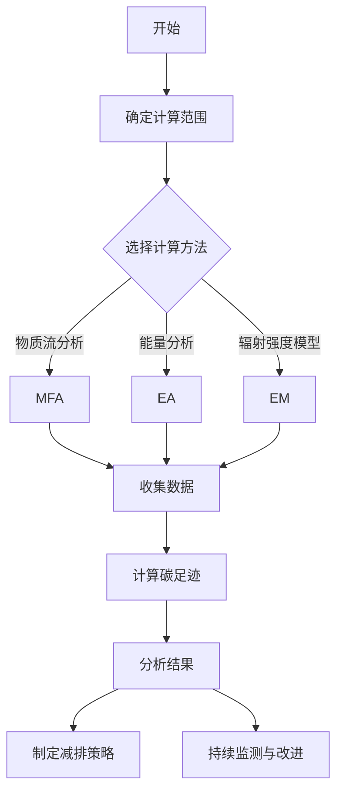

                 

### 文章标题

《碳足迹追踪：节能计算助力企业可持续发展》

#### 关键词
- 碳足迹追踪
- 节能计算
- 企业可持续发展
- 碳排放计算
- 节能减排技术

#### 摘要
本文全面探讨碳足迹追踪与节能计算在推动企业可持续发展中的应用。首先介绍碳足迹的定义、重要性及其分类，分析碳排放的主要来源。随后，详细讲解碳足迹的计算方法，包括物质流分析、能量分析和辐射强度模型，并介绍国内外常见的碳足迹计算工具。文章进一步探讨减排策略，包括提高能源利用效率、发展可再生能源和实施绿色生产。通过企业碳足迹管理的框架和流程，展示如何实施碳足迹管理。接下来，阐述节能计算的基础原理及其在工业和建筑中的应用。最后，讨论企业可持续发展战略和企业社会责任，并对未来展望进行总结。全文旨在为企业提供碳足迹追踪和节能计算的最佳实践，助力实现可持续发展目标。

## 第一部分：碳足迹基础知识

### 第1章：碳足迹概述

#### 1.1 碳足迹的定义

碳足迹是指一个人、组织或产品在其生命周期内产生的直接和间接温室气体排放量的总和。它是一种衡量环境负担的重要指标，帮助人们理解和评估其活动对气候变化的潜在影响。

#### 1.2 碳足迹的重要性

碳足迹的重要性体现在以下几个方面：

1. **气候变化应对**：通过碳足迹追踪，可以帮助企业和个人了解其活动对气候变化的影响，从而采取措施减少碳排放，应对全球气候变化。
2. **资源管理**：碳足迹追踪有助于企业和组织更有效地管理资源，降低能源消耗，提高资源利用效率。
3. **企业竞争力**：越来越多的消费者和企业重视环境保护，碳足迹追踪可以帮助企业在市场竞争中脱颖而出，提升企业形象和品牌价值。
4. **政策制定**：政府可以通过碳足迹数据制定更科学、有效的环境保护政策，推动社会整体向低碳经济转型。

#### 1.3 碳足迹的分类

根据来源和类型，碳足迹可以分为以下几类：

1. **直接排放**：直接排放是指直接由人类活动产生的温室气体排放，如化石燃料燃烧、工业生产等。
2. **间接排放**：间接排放是指由于产品和服务在生产、运输、消费等过程中的间接温室气体排放，如电力消耗、交通运输等。
3. **生活排放**：生活排放是指个人在日常生活中的碳排放，包括住房、交通、食品消费等。
4. **产品排放**：产品排放是指产品在其生命周期内的总碳排放，包括原材料采集、制造、运输、使用和处置等环节。

#### 1.4 碳足迹追踪的意义

碳足迹追踪不仅有助于环境保护，还具有以下重要意义：

1. **环境影响评估**：通过追踪碳足迹，可以评估不同活动对环境的影响，为环境保护决策提供科学依据。
2. **能源消耗监测**：碳足迹追踪可以帮助企业和个人实时监测能源消耗情况，及时发现和解决能源浪费问题。
3. **可持续发展策略**：碳足迹追踪为企业制定可持续发展策略提供数据支持，有助于实现低碳经济和绿色增长。
4. **国际合作**：通过碳足迹追踪，各国可以共享数据，促进国际间的环境保护合作，共同应对全球气候变化挑战。

### 总结

碳足迹追踪是企业实现可持续发展的重要工具。通过准确测量和分析碳足迹，企业可以采取有效措施降低碳排放，提高资源利用效率，同时提升企业形象和市场竞争力。下一章将深入分析碳排放的主要来源，为后续讨论碳足迹计算方法奠定基础。

### 第2章：碳排放来源分析

#### 2.1 能源消耗碳排放

能源消耗是碳排放的主要来源之一。以下是对不同能源消耗碳排放的具体分析：

1. **电力消耗**：电力是现代社会不可或缺的能源，但大部分电力仍然来自化石燃料（如煤、石油、天然气）。燃烧化石燃料产生的二氧化碳是主要的温室气体排放源。据统计，全球每年电力消耗产生的二氧化碳排放量占全球总排放量的约30%。

2. **燃料消耗**：燃料消耗包括交通运输工具、工业生产和家庭用燃料等。汽车、卡车和其他交通工具使用汽油和柴油等化石燃料，产生大量的二氧化碳排放。同时，工业生产过程中使用的燃料如天然气、石油产品等也是重要的碳排放源。

3. **工业生产**：工业生产过程中的能源消耗和副产品排放也是碳排放的重要来源。例如，钢铁、水泥、化工等行业在生产和制造过程中产生的温室气体排放量巨大。此外，工业生产过程中产生的废水和废气等也含有二氧化碳和其他温室气体。

#### 2.2 电力消耗碳排放

电力消耗碳排放的分析主要关注电力生产过程中的温室气体排放。以下是一些关键点：

1. **发电方式**：电力生产方式多样，包括煤电、水电、核电、风电、太阳能等。其中，煤电是最常见的发电方式，但也是最碳排放的。据统计，每千瓦时煤电产生的二氧化碳排放量约为0.9千克。

2. **替代能源**：随着环境保护意识的提高，越来越多的国家开始大力发展可再生能源，如太阳能、风能和水力发电。这些替代能源具有低碳排放的特点，有助于减少电力消耗碳排放。

3. **电力调配**：电力调配是减少碳排放的关键。通过优化电力系统，提高可再生能源比例，可以有效降低碳排放。例如，使用智能电网技术，可以实时监控和调节电力供需，减少能源浪费和碳排放。

#### 2.3 燃料消耗碳排放

燃料消耗碳排放的分析主要关注交通运输、工业生产和家庭用燃料等方面。以下是一些关键点：

1. **交通运输**：交通运输是燃料消耗最大的领域之一。汽车、卡车和其他交通工具使用汽油和柴油等化石燃料，产生大量的二氧化碳排放。随着电动汽车的普及，部分交通运输碳排放有望得到有效减少。

2. **工业生产**：工业生产过程中的燃料消耗是碳排放的重要来源。例如，钢铁、水泥等行业在生产过程中需要大量的燃料，产生大量的二氧化碳排放。通过技术改进和能源效率提升，可以降低这些行业的碳排放。

3. **家庭用燃料**：家庭用燃料包括家庭取暖、烹饪等。这些活动主要使用天然气和液化石油气等化石燃料。通过提高能源利用效率和推广清洁能源，可以减少家庭用燃料的碳排放。

#### 2.4 工业生产碳排放

工业生产碳排放的分析关注工业生产过程中的能源消耗和副产品排放。以下是一些关键点：

1. **能源消耗**：工业生产过程中的能源消耗是碳排放的主要来源之一。例如，钢铁、水泥、化工等行业在生产过程中需要大量的能源，产生大量的二氧化碳排放。通过提高能源利用效率，可以减少这些行业的碳排放。

2. **副产品排放**：工业生产过程中还会产生各种副产品，其中一些副产品含有温室气体。例如，煤炭燃烧过程中产生的二氧化碳、氮氧化物等。通过改进生产工艺和技术，可以减少这些副产品的排放。

3. **循环经济**：循环经济理念强调资源的高效利用和废弃物的减量化、资源化。通过将废弃物作为资源重新利用，可以减少工业生产过程中的碳排放。例如，将工业废弃物用于建筑材料、能源生产等，可以减少废弃物的产生和碳排放。

#### 总结

能源消耗和工业生产是碳排放的主要来源。电力消耗和燃料消耗是能源消耗的主要组成部分，而工业生产过程中的能源消耗和副产品排放也是重要的碳排放源。通过提高能源利用效率、推广清洁能源、改进生产工艺和技术，可以有效地减少碳排放，推动企业实现可持续发展。

### 第3章：碳足迹计算方法

#### 3.1 碳足迹计算模型

碳足迹计算模型是量化一个个体、组织或产品在整个生命周期内产生的碳足迹的关键工具。以下介绍三种主要的碳足迹计算模型：物质流分析（Material Flow Accounting, MFA）、能量分析（Energy Analysis）和辐射强度模型（Emissions Intensity Model）。

#### 3.1.1 物质流分析（Material Flow Accounting, MFA）

物质流分析是一种用于追踪物质和能量在生产和消费过程中的流动的方法。MFA通过详细记录和量化物质流，帮助识别和减少碳排放源。

1. **步骤**：
    - **定义边界**：确定碳足迹的计算范围，包括生产、运输、消费等环节。
    - **数据收集**：收集与物质流相关的数据，如原材料、能源消耗、副产品排放等。
    - **物质流量化**：通过计算不同物质流（如煤炭、石油、天然气等）的碳含量，量化碳足迹。

2. **优点**：
    - 提供全面的物质流信息，有助于全面了解碳足迹。
    - 可以识别和减少碳足迹的关键环节。

3. **局限性**：
    - 需要详细的数据和专业的分析能力。
    - 难以处理复杂的产品和供应链。

#### 3.1.2 能量分析（Energy Analysis）

能量分析是一种基于能源消耗的碳足迹计算方法。它通过计算能源消耗产生的碳排放，来量化一个个体、组织或产品的碳足迹。

1. **步骤**：
    - **能源数据收集**：收集与能源消耗相关的数据，如电力、燃料消耗等。
    - **碳排放计算**：根据能源消耗的碳排放系数（如煤电的碳排放系数为0.9千克/千瓦时），计算总碳排放。

2. **优点**：
    - 简单易懂，计算过程直观。
    - 可以快速获得碳足迹的初步估计。

3. **局限性**：
    - 忽略了物质流中的碳排放。
    - 难以反映能源效率的变化。

#### 3.1.3 辐射强度模型（Emissions Intensity Model）

辐射强度模型是一种基于单位产品或单位能源消耗的碳排放量的计算方法。它通过将碳排放与产量或能源消耗相除，来量化碳足迹。

1. **步骤**：
    - **确定基准**：选择一个基准产量或能源消耗量。
    - **碳排放计算**：计算基准产量或能源消耗量产生的碳排放量。
    - **碳足迹量化**：将碳排放量除以基准产量或能源消耗量，得到单位产量或单位能源消耗的碳排放量。

2. **优点**：
    - 简便，适合大规模数据处理。
    - 可以反映能源效率的变化。

3. **局限性**：
    - 忽略了不同产品或过程的差异。
    - 难以反映不同地区和行业的碳排放差异。

#### 3.2 碳足迹计算模型的联系与适用性

三种碳足迹计算模型各有优缺点，适用于不同的应用场景：

- **MFA**：适合需要全面了解物质流和碳排放细节的复杂系统和供应链管理。
- **能量分析**：适合快速评估能源消耗导致的碳排放。
- **辐射强度模型**：适合大规模数据处理和趋势分析，特别是能源和工业生产领域的碳排放评估。

在实际应用中，可以根据具体需求和条件选择合适的计算模型，或者结合多种模型进行综合评估。

### 总结

碳足迹计算模型是量化碳排放的重要工具，帮助个体、组织和产品了解其碳排放情况，制定减排策略。通过物质流分析、能量分析和辐射强度模型，可以全面、准确地计算碳足迹，为实现可持续发展提供有力支持。

### 第4章：碳排放计算工具

#### 4.1 国内外碳足迹计算工具介绍

随着全球对环境保护和可持续发展的重视，碳足迹计算工具得到了迅速发展。以下介绍几种国内外知名的碳足迹计算工具。

#### 4.1.1 国家级碳足迹计算工具

1. **中国碳排放计算器**：中国碳排放计算器是一个面向个人和企业的在线碳足迹计算工具，由清华大学和中国社科院合作开发。用户可以通过填写基本信息和活动数据，快速计算出个人的碳足迹，并提供相应的减排建议。

2. **美国环保署（EPA）碳排放计算器**：美国环保署提供了多种在线碳排放计算工具，包括个人、家庭和企业层面的计算工具。这些工具帮助用户了解其活动对环境的影响，并提供减排建议。

3. **欧盟碳排放计算器**：欧盟提供了多种在线碳排放计算工具，用于个人、家庭和企业层面的碳足迹计算。这些工具可以帮助用户评估其碳排放情况，并制定减排计划。

#### 4.1.2 企业级碳足迹计算工具

1. **碳足迹管理系统**：碳足迹管理系统是企业进行碳足迹追踪和管理的重要工具。例如，西门子碳足迹管理解决方案（Siemens Carbon Footprint Management）提供了一套全面的服务，包括碳足迹计算、数据分析和减排策略制定。

2. **思科碳足迹计算器**：思科的碳足迹计算器是一个专门为企业设计的在线工具，帮助用户计算其业务的碳足迹。该工具支持多种数据输入方式，并提供详细的碳排放分析和减排建议。

3. **微软环境解决方案**：微软提供了一系列环境解决方案，包括碳足迹计算和减排策略制定。这些工具可以帮助企业实现碳足迹追踪和管理，促进可持续发展。

#### 4.1.3 其他碳足迹计算工具

1. **碳足迹计算软件**：市场上还有许多专门开发的碳足迹计算软件，如Cguarded、GHG Calc等。这些软件提供了丰富的功能，包括数据输入、碳排放计算、报表生成和减排策略制定。

2. **移动应用**：一些碳足迹计算工具还开发了移动应用，方便用户随时随地进行碳足迹计算和跟踪。例如，碳足迹计算器（Carbon Calculator）和碳足迹追踪器（Carbon Footprint Tracker）等。

#### 4.2 碳足迹计算工具的功能与特点

碳足迹计算工具具有以下功能与特点：

1. **数据输入**：用户可以通过填写基本信息、活动数据等输入数据，以便计算碳足迹。

2. **碳排放计算**：工具会根据输入的数据和预设的碳排放系数，计算用户的碳足迹。

3. **报表生成**：工具可以生成详细的碳排放报告，包括碳排放总量、主要排放源、减排潜力等。

4. **减排建议**：工具会根据用户的碳足迹，提供相应的减排建议和策略。

5. **数据可视化**：工具可以将碳排放数据以图表形式展示，帮助用户直观了解其碳排放情况。

6. **实时更新**：一些高级工具会定期更新碳排放系数和数据库，确保计算结果的准确性。

#### 4.3 碳足迹计算工具的应用案例

以下是一些碳足迹计算工具的应用案例：

1. **企业**：某企业使用碳足迹管理系统，通过详细记录和分析能源消耗、生产过程和供应链数据，发现其主要的碳排放源，并制定了针对性的减排计划。

2. **个人**：某个人使用在线碳足迹计算器，发现其碳足迹主要来自交通和住房，于是开始采取如乘坐公共交通、减少空调使用等措施，有效降低了碳排放。

3. **政府**：某政府机构使用碳足迹计算工具，对市民的碳足迹进行调查，发现交通和能源消耗是主要的碳排放源。政府随后推出了一系列措施，如提高公共交通覆盖率、推广节能建筑等，以降低全市的碳排放。

#### 4.4 总结

碳足迹计算工具为企业和个人提供了方便、准确的碳足迹追踪和管理方法。通过这些工具，用户可以深入了解其活动对环境的影响，并采取有效措施减少碳排放，促进可持续发展。未来，随着技术的进步和数据收集能力的提升，碳足迹计算工具将更加智能化、便捷化，为全球环境保护和可持续发展做出更大贡献。

### 第5章：碳足迹减少策略

#### 5.1 节能减排技术

节能减排技术是减少碳排放、实现企业可持续发展的重要手段。以下介绍几种主要的节能减排技术及其应用：

##### 5.1.1 提高能源利用效率

提高能源利用效率是减少碳排放的基础。以下是一些关键技术和方法：

1. **高效燃烧技术**：通过优化燃烧过程，提高燃料的燃烧效率，减少未完全燃烧产生的二氧化碳排放。例如，采用低氮燃烧技术、煤粉燃烧技术等。

2. **余热回收技术**：将工业生产和生活中产生的余热回收利用，降低能源消耗。例如，通过余热锅炉、热交换器等技术回收废气、废水的热量，用于供暖、制冷或其他生产过程。

3. **高效电机和泵技术**：提高电机和泵的效率，降低电能消耗。例如，采用变频调速技术、高效电机设计等。

4. **高效照明技术**：采用节能灯具，如LED灯，降低照明能耗。同时，通过智能照明控制系统，实现照明的精细化管理，进一步降低能耗。

##### 5.1.2 发展可再生能源

发展可再生能源是减少碳排放的重要途径。以下介绍几种主要可再生能源及其应用：

1. **太阳能**：利用太阳能光伏板将阳光直接转化为电能。太阳能具有分布广泛、清洁环保等优点，适用于家庭、工业和大型电站。

2. **风能**：利用风力驱动风轮机产生电能。风能资源丰富，适用于风力资源丰富的地区，如沿海、山区等。

3. **水能**：利用水流动产生的能量发电。水能资源丰富，适用于大坝、河流、湖泊等地区。

4. **生物质能**：利用生物质材料（如农作物残渣、林业废弃物等）燃烧或发酵产生的能量。生物质能具有可再生、减碳等优点，适用于农村地区和工业生产。

##### 5.1.3 实施绿色生产

绿色生产是通过优化生产过程、降低能源消耗和排放，实现生产过程与环境的和谐共生。以下介绍几种绿色生产的方法：

1. **清洁生产**：通过优化生产工艺，减少或消除生产过程中的污染物排放。例如，采用无废水、无废气、无废渣的绿色生产工艺。

2. **循环经济**：通过资源的循环利用，降低资源消耗和排放。例如，将生产过程中的废弃物作为原材料循环利用，实现资源的最大化利用。

3. **低碳供应链**：通过优化供应链管理，降低供应链中的碳排放。例如，选择低碳运输方式、优化物流路径、提高供应链协同效率等。

4. **绿色产品**：开发绿色产品，满足消费者对环保、健康、低碳的需求。例如，采用低碳材料、设计环保包装、提供产品回收利用服务等。

#### 5.2 实施步骤与案例分析

实施碳足迹减少策略需要遵循以下步骤：

1. **评估现状**：对企业的能源消耗、碳排放和减排潜力进行全面评估，了解现有问题和改进空间。

2. **制定目标**：根据评估结果，制定明确的减排目标和策略。例如，设定具体的碳排放量减少目标和时间表。

3. **技术改造**：根据减排目标和策略，实施相应的技术改造。例如，引进高效设备、改造生产线、优化能源系统等。

4. **培训与推广**：对员工进行节能减排培训，提高员工的环保意识和技能。同时，推广绿色生产和低碳生活方式。

5. **监控与改进**：建立完善的碳排放监测和报告系统，实时监控碳排放情况。根据监测结果，不断优化减排策略，实现持续改进。

以下是一个具体的案例分析：

某制造企业通过实施节能减排技术，成功降低了碳排放。首先，企业对现有生产线进行全面评估，发现能源消耗和碳排放的主要来源是生产线中的热处理环节。随后，企业引进了高效节能的热处理设备，优化了生产工艺，提高了热能利用效率。同时，企业还采用了余热回收技术，将生产过程中产生的余热回收用于供暖和制冷，进一步降低了能源消耗。

此外，企业还开发了绿色产品，如使用低碳材料、设计环保包装，并在产品生命周期结束后提供回收服务。通过这些措施，企业不仅降低了碳排放，还提升了品牌形象和市场竞争力。

#### 5.3 实施效果与前景

实施碳足迹减少策略可以带来显著的环境、经济和社会效益：

1. **环境效益**：减少碳排放，降低对气候变化的潜在影响，保护生态环境。

2. **经济效益**：降低能源消耗和运营成本，提高生产效率和市场竞争力。

3. **社会效益**：提高员工环保意识，促进绿色生活方式的普及，增强企业形象和品牌价值。

随着全球对环境保护和可持续发展的重视，碳足迹减少策略将在未来得到更广泛的应用。企业应积极探索和实施节能减排技术，提高能源利用效率，发展可再生能源，实现可持续发展目标。

### 第6章：碳足迹管理

#### 6.1 企业碳足迹管理框架

企业碳足迹管理是指通过系统化的方法和工具，对企业活动中的碳足迹进行追踪、计算、分析和优化，以实现碳减排和可持续发展目标。以下介绍企业碳足迹管理的框架和关键组成部分。

##### 6.1.1 碳足迹管理体系

企业碳足迹管理体系是一个涵盖组织战略、政策、流程和技术工具的综合框架。它包括以下几个关键组成部分：

1. **组织承诺**：企业高层领导对碳足迹管理的重要性的承诺，是推动碳足迹管理项目成功的关键。

2. **政策制定**：制定企业碳足迹管理政策和目标，确保企业内部各层面对碳足迹管理的认知和行动一致性。

3. **数据收集**：建立完善的数据收集系统，确保收集到的碳足迹数据准确、完整和可验证。

4. **计算与分析**：运用科学的方法和工具，对收集到的数据进行处理和分析，计算出企业的碳足迹。

5. **减排策略**：根据分析结果，制定和实施具体的减排措施，实现碳足迹的降低。

6. **监测与报告**：建立监测机制，定期报告企业的碳足迹情况，确保碳足迹管理的持续性和有效性。

##### 6.1.2 碳足迹管理流程

企业碳足迹管理流程包括以下几个关键步骤：

1. **规划与准备**：确定碳足迹管理的目标和范围，评估现有的碳足迹数据收集和管理能力。

2. **数据收集**：收集与企业碳足迹相关的数据，包括能源消耗、原材料使用、废弃物产生等。

3. **数据整理与验证**：对收集到的数据进行整理和验证，确保数据的准确性和完整性。

4. **碳足迹计算**：运用物质流分析、能量分析等方法，计算企业的碳足迹。

5. **分析结果与报告**：对碳足迹计算结果进行分析，撰写碳足迹报告，并向相关利益相关者报告。

6. **减排措施实施**：根据分析结果，制定和实施减排措施，如节能改造、过程优化、可再生能源应用等。

7. **监测与改进**：持续监测碳足迹管理的效果，对减排措施进行评估和改进，确保碳足迹管理目标的实现。

##### 6.1.3 碳足迹管理案例分析

以下是一个企业碳足迹管理的成功案例：

某大型制造企业在实施碳足迹管理过程中，首先成立了专门的碳足迹管理团队，并制定了长期的碳减排目标和策略。在数据收集方面，企业建立了完善的数据收集系统，对生产过程中的能源消耗、原材料使用、废弃物产生等数据进行实时监控和记录。通过物质流分析和能量分析，企业计算出了详细的碳足迹数据。

在分析结果的基础上，企业制定了一系列减排措施，如引入高效节能设备、优化生产工艺、使用可再生能源等。同时，企业还加强了员工的环保意识培训，推动绿色生产和低碳生活方式的普及。经过一段时间的实施，企业的碳足迹显著下降，能源消耗和运营成本也得到了有效控制。

此外，企业还定期发布碳足迹报告，向利益相关者展示碳足迹管理成果，提升了企业的社会形象和品牌价值。

#### 6.2 碳足迹管理的重要性

碳足迹管理对企业可持续发展具有重要意义：

1. **环境保护**：通过碳足迹管理，企业可以准确了解其活动对环境的影响，采取有效的减排措施，减少碳排放，保护生态环境。

2. **资源节约**：碳足迹管理有助于企业优化能源和资源使用，提高资源利用效率，降低运营成本。

3. **市场竞争力**：碳足迹管理有助于企业提升环保形象，满足消费者和投资者对环保和社会责任的需求，增强市场竞争力。

4. **政策合规**：碳足迹管理有助于企业及时了解和遵守国家和国际的环保政策，避免法律风险。

5. **社会责任**：碳足迹管理体现了企业的社会责任，有助于树立良好的企业公民形象。

#### 6.3 未来发展趋势

随着全球环境保护意识的提高和政策的推动，碳足迹管理将呈现以下发展趋势：

1. **数据准确性**：随着数据收集和分析技术的进步，碳足迹管理的准确性将进一步提高。

2. **智能化与自动化**：智能传感器、物联网和大数据技术的应用，将使碳足迹管理更加智能化和自动化。

3. **全面覆盖**：企业将逐步实现碳足迹管理的全面覆盖，包括生产、供应链、产品生命周期等各个环节。

4. **国际合作**：碳足迹管理将推动企业间的国际合作，共享碳足迹管理经验和最佳实践。

5. **政策驱动**：国家和国际层面的政策将加强对碳足迹管理的要求和指导，推动企业实施碳足迹管理。

### 总结

碳足迹管理是企业实现可持续发展的重要手段。通过建立完善的碳足迹管理体系和实施有效的碳足迹管理流程，企业可以准确了解其碳排放情况，采取有效的减排措施，降低碳排放，实现资源节约和环境保护目标。未来，随着技术的进步和政策的推动，碳足迹管理将得到更广泛的应用和深化发展。

### 第7章：节能计算基础

#### 7.1 节能计算原理

节能计算是一种基于能源效率分析、能源系统优化和碳排放减少的方法，旨在通过技术和管理手段降低能源消耗，实现可持续发展目标。以下介绍节能计算的基本原理。

##### 7.1.1 节能计算方法

1. **能量平衡法**：能量平衡法是节能计算的基本方法，通过分析能源系统的能量输入、输出和转换过程，确定能源利用效率。具体步骤如下：

    - **数据收集**：收集能源系统的相关数据，如能源消耗量、设备参数等。
    - **能量平衡方程**：建立能量平衡方程，确定能源输入、输出和损失。
    - **效率计算**：通过能量平衡方程，计算能源利用效率。
    - **优化分析**：对能源利用效率进行优化分析，提出节能措施。

2. **过程模拟法**：过程模拟法是一种基于数学模型和计算机模拟的节能计算方法，通过模拟能源系统的运行过程，分析能耗和碳排放情况。具体步骤如下：

    - **模型建立**：建立能源系统的数学模型，包括设备模型、过程模型等。
    - **模拟计算**：运行数学模型，模拟能源系统的运行过程，计算能耗和碳排放。
    - **优化分析**：对模拟结果进行优化分析，提出节能措施。

3. **数据驱动法**：数据驱动法是一种基于大数据和机器学习的节能计算方法，通过分析历史数据和实时数据，预测能源消耗和碳排放趋势，提出节能措施。具体步骤如下：

    - **数据收集**：收集能源系统的历史数据和实时数据。
    - **数据预处理**：对数据进行清洗、归一化等处理。
    - **模型训练**：使用机器学习算法训练预测模型。
    - **预测分析**：使用预测模型预测能源消耗和碳排放，提出节能措施。

##### 7.1.2 节能计算工具

节能计算工具是实施节能计算的重要手段，主要包括以下几种：

1. **能量分析软件**：能量分析软件是一种基于能量平衡法的节能计算工具，用于分析能源系统的能量利用效率和碳排放。常见的能量分析软件有EnergyPlus、eQUEST等。

2. **过程模拟软件**：过程模拟软件是一种基于过程模拟法的节能计算工具，用于模拟能源系统的运行过程，分析能耗和碳排放。常见的过程模拟软件有ASPEN Plus、SIMUL8等。

3. **数据驱动工具**：数据驱动工具是一种基于数据驱动法的节能计算工具，用于分析历史数据和实时数据，预测能源消耗和碳排放。常见的数据驱动工具包括机器学习平台、数据分析软件等。

#### 7.2 能源系统分析

能源系统分析是节能计算的重要组成部分，旨在通过对能源系统的深入分析，提高能源利用效率，减少碳排放。以下介绍能源系统分析的关键方面：

##### 7.2.1 能源消耗分析

能源消耗分析是能源系统分析的基础，旨在确定能源系统的能耗水平和主要能耗源。具体步骤如下：

1. **能耗数据收集**：收集能源系统的能耗数据，包括能源消耗量、能源类型、设备运行时间等。

2. **能耗分布分析**：分析能源系统的能耗分布，确定主要能耗源和能耗环节。

3. **能耗比较分析**：将当前能耗水平与历史数据或行业标准进行比较，评估能源系统的能耗水平。

##### 7.2.2 能源效率分析

能源效率分析是提高能源利用效率的重要手段，旨在确定能源系统的能源利用效率，并提出改进措施。具体步骤如下：

1. **效率数据收集**：收集能源系统的效率数据，包括设备效率、过程效率等。

2. **效率计算**：计算能源系统的总能源利用效率，包括设备效率、过程效率等。

3. **效率分析**：对能源系统的效率进行分析，确定能源利用效率的提升空间。

##### 7.2.3 能源系统优化

能源系统优化是提高能源利用效率、降低碳排放的关键措施，旨在通过优化能源系统的运行参数和结构，实现能源利用的最优化。具体步骤如下：

1. **优化目标确定**：确定能源系统优化的目标，如最低能耗、最高效率、最低碳排放等。

2. **优化算法选择**：选择合适的优化算法，如线性规划、遗传算法、模拟退火算法等。

3. **优化参数设置**：设置优化算法的参数，如初始解、迭代次数、收敛条件等。

4. **优化计算**：运行优化算法，计算能源系统的最优运行参数。

5. **优化结果分析**：对优化结果进行分析，评估优化效果，确定改进措施。

#### 7.3 节能计算在工业中的应用

节能计算在工业中的应用非常广泛，以下介绍几种典型的应用场景：

##### 7.3.1 电机系统节能优化

电机系统是工业生产中能耗最大的环节之一，通过节能优化可以显著降低能源消耗。具体方法包括：

1. **电机选型优化**：根据实际负载和运行条件，选择合适型号的电机，提高电机效率。

2. **变频调速**：采用变频调速技术，根据实际负载调整电机转速，实现节能运行。

3. **电机维护**：定期对电机进行维护，如清洁、润滑、更换零部件等，确保电机高效运行。

##### 7.3.2 制冷系统节能优化

制冷系统在工业生产和生活中广泛应用，通过节能优化可以降低能耗。具体方法包括：

1. **冷凝器优化**：优化冷凝器设计，提高换热效率，降低制冷能耗。

2. **蒸发器优化**：优化蒸发器设计，提高蒸发效率，降低制冷能耗。

3. **制冷剂选择**：选择低全球 warming potential（GWP）制冷剂，减少制冷系统碳排放。

##### 7.3.3 起重运输系统节能优化

起重运输系统在工业生产中承担重要任务，通过节能优化可以提高系统效率。具体方法包括：

1. **电机优化**：选择高效电机，提高电机效率。

2. **变频调速**：采用变频调速技术，根据实际负载调整电机转速，实现节能运行。

3. **液压系统优化**：优化液压系统设计，提高液压系统效率，降低能耗。

#### 7.4 节能计算在建筑中的应用

节能计算在建筑中的应用也非常广泛，以下介绍几种典型的应用场景：

##### 7.4.1 建筑能耗分析

建筑能耗分析是建筑节能的关键步骤，旨在确定建筑的能耗水平和主要能耗源。具体方法包括：

1. **能耗数据收集**：收集建筑的能耗数据，包括电力、燃气、水等能耗数据。

2. **能耗分布分析**：分析建筑的能耗分布，确定主要能耗源和能耗环节。

3. **能耗比较分析**：将实际能耗与行业标准或设计能耗进行比较，评估建筑能耗水平。

##### 7.4.2 建筑节能改造

建筑节能改造是通过改进建筑设计和设施，提高建筑能源利用效率，降低能耗。具体方法包括：

1. **建筑围护结构优化**：优化建筑围护结构，提高保温隔热性能，降低建筑能耗。

2. **照明系统改造**：采用高效照明系统，如LED照明，降低照明能耗。

3. **空调系统优化**：优化空调系统设计，提高空调系统效率，降低空调能耗。

##### 7.4.3 建筑能效评估

建筑能效评估是对建筑能源利用效率的评估，旨在确定建筑能耗水平并提出改进措施。具体方法包括：

1. **能耗数据收集**：收集建筑的能耗数据，包括电力、燃气、水等能耗数据。

2. **能效指标计算**：计算建筑的能源利用效率指标，如能源利用系数、能源消耗强度等。

3. **能效评估**：根据能效指标，评估建筑的能耗水平，提出改进措施。

#### 7.5 节能计算在企业中的应用前景

随着能源价格的波动和环境保护意识的提高，节能计算在企业中的应用前景非常广阔。以下介绍几个应用前景：

1. **智能制造**：通过节能计算，实现智能制造过程中的能源优化和碳排放减少。

2. **智慧建筑**：通过节能计算，实现智慧建筑中的能源管理优化和能效提升。

3. **供应链管理**：通过节能计算，优化供应链中的能源消耗和碳排放，提高供应链效率。

4. **企业战略规划**：通过节能计算，支持企业制定可持续发展的能源战略和碳排放管理策略。

### 总结

节能计算是一种通过技术和管理手段降低能源消耗、减少碳排放的重要方法。通过对能源系统的深入分析和优化，企业可以显著降低能源消耗，提高能源利用效率，实现可持续发展目标。未来，随着技术的进步和应用的深入，节能计算将在更广泛的领域发挥作用，为企业和全球环境保护做出更大贡献。

### 第8章：节能计算在企业中的应用

#### 8.1 节能计算在工业中的应用

节能计算在工业生产中的应用至关重要，能够显著提高能源利用效率，降低生产成本。以下将介绍电机系统、制冷系统以及起重运输系统的节能计算方法及其优化策略。

##### 8.1.1 电机系统节能优化

电机系统是工业生产中最常见的能耗大户，因此其节能优化具有重要意义。以下是一些具体的节能计算方法和优化策略：

1. **变频调速技术**：
   - **原理**：通过改变电机供电频率，实现电机转速的调节，从而根据实际负载需求调整电机输出功率。
   - **计算方法**：
     $$ P = P_{max} \times (1 - \frac{n_{actual}}{n_{max}}) $$
     其中，\( P \) 为实际功率，\( P_{max} \) 为最大功率，\( n_{actual} \) 为实际转速，\( n_{max} \) 为最大转速。
   - **优化策略**：根据生产需求，合理选择变频器，优化变频调速控制策略，提高电机运行效率。

2. **高效电机选用**：
   - **原理**：选用高效电机，提高电机本身的能效。
   - **计算方法**：
     $$ \eta = \frac{P_{out}}{P_{in}} $$
     其中，\( \eta \) 为电机效率，\( P_{out} \) 为输出功率，\( P_{in} \) 为输入功率。
   - **优化策略**：根据实际负载需求，选用符合能效标准的电机，减少电机能耗。

3. **电机维护**：
   - **原理**：定期对电机进行维护，确保电机运行在最佳状态。
   - **计算方法**：通过计算电机损耗和维修成本，评估电机维护的必要性。
   - **优化策略**：制定科学的电机维护计划，降低电机故障率，延长电机使用寿命。

##### 8.1.2 制冷系统节能优化

制冷系统在工业生产和仓储物流中广泛应用，通过节能优化可以有效降低能耗。以下是一些具体的节能计算方法和优化策略：

1. **冷凝器优化**：
   - **原理**：通过优化冷凝器设计，提高换热效率，降低制冷能耗。
   - **计算方法**：
     $$ Q_{condenser} = \frac{C_{p} \times m \times \Delta T}{\frac{1}{C_{op}}} $$
     其中，\( Q_{condenser} \) 为冷凝器热负荷，\( C_{p} \) 为冷凝器对流传热系数，\( m \) 为冷凝器质量流量，\( \Delta T \) 为温差，\( C_{op} \) 为冷凝器总体传热系数。
   - **优化策略**：选用高效冷凝器材料，优化冷凝器结构设计，提高换热效率。

2. **蒸发器优化**：
   - **原理**：通过优化蒸发器设计，提高蒸发效率，降低制冷能耗。
   - **计算方法**：
     $$ Q_{evaporator} = \frac{C_{p} \times m \times \Delta T}{\frac{1}{C_{op}}} $$
     其中，\( Q_{evaporator} \) 为蒸发器热负荷，\( C_{p} \) 为蒸发器对流传热系数，\( m \) 为蒸发器质量流量，\( \Delta T \) 为温差，\( C_{op} \) 为蒸发器总体传热系数。
   - **优化策略**：选用高效蒸发器材料，优化蒸发器结构设计，提高换热效率。

3. **制冷剂选择**：
   - **原理**：选择低全球 warming potential（GWP）制冷剂，减少制冷系统碳排放。
   - **计算方法**：根据制冷系统的热力学性能，计算制冷剂的GWP值。
   - **优化策略**：选用符合环保标准的低GWP制冷剂，降低制冷系统的碳排放。

##### 8.1.3 起重运输系统节能优化

起重运输系统在工业生产和物流中承担重要任务，通过节能优化可以提高系统效率，降低能耗。以下是一些具体的节能计算方法和优化策略：

1. **电机系统优化**：
   - **原理**：通过优化电机系统，提高电机运行效率，降低能耗。
   - **计算方法**：
     $$ P = P_{max} \times (1 - \frac{n_{actual}}{n_{max}}) $$
     其中，\( P \) 为实际功率，\( P_{max} \) 为最大功率，\( n_{actual} \) 为实际转速，\( n_{max} \) 为最大转速。
   - **优化策略**：采用变频调速技术，根据实际负载调整电机转速，实现高效运行。

2. **液压系统优化**：
   - **原理**：通过优化液压系统，提高液压系统效率，降低能耗。
   - **计算方法**：
     $$ \eta = \frac{P_{out}}{P_{in}} $$
     其中，\( \eta \) 为液压系统效率，\( P_{out} \) 为输出功率，\( P_{in} \) 为输入功率。
   - **优化策略**：选用高效液压元件，优化液压系统设计，提高液压系统效率。

3. **能效监控**：
   - **原理**：通过实时监控和数据分析，识别能耗瓶颈，制定针对性节能措施。
   - **计算方法**：利用传感器和监控系统，实时采集系统运行数据，进行分析和处理。
   - **优化策略**：建立能效监控体系，定期分析能耗数据，优化系统运行参数，实现高效运行。

#### 8.2 节能计算在建筑中的应用

建筑节能是促进可持续发展的重要方面，通过节能计算可以优化建筑能源系统的设计和管理。以下将介绍建筑能耗分析、建筑节能改造以及建筑能效评估的具体方法和应用。

##### 8.2.1 建筑能耗分析

建筑能耗分析是建筑节能的基础，通过详细分析建筑能耗情况，可以找出能耗瓶颈，为节能改造提供依据。以下是一些具体方法：

1. **能耗数据收集**：
   - **原理**：通过采集建筑能耗数据，了解建筑的实际能耗情况。
   - **计算方法**：采用能耗监测设备，实时采集建筑能耗数据。
   - **优化策略**：建立能耗数据收集系统，确保数据的准确性和完整性。

2. **能耗分布分析**：
   - **原理**：分析建筑能耗的分布情况，找出主要能耗环节。
   - **计算方法**：
     $$ \frac{\sum_{i=1}^{n} C_i}{\sum_{i=1}^{n} C} $$
     其中，\( C_i \) 为第\( i \)项能耗，\( C \) 为总能耗。
   - **优化策略**：根据能耗分布，重点优化能耗较高的环节。

##### 8.2.2 建筑节能改造

建筑节能改造是通过改进建筑设计和设施，提高建筑能源利用效率，降低能耗。以下是一些具体方法和应用：

1. **建筑围护结构优化**：
   - **原理**：通过优化建筑围护结构，提高保温隔热性能，降低建筑能耗。
   - **计算方法**：
     $$ Q = \frac{K \times A \times \Delta T}{d} $$
     其中，\( Q \) 为热流量，\( K \) 为热导率，\( A \) 为面积，\( \Delta T \) 为温差，\( d \) 为厚度。
   - **优化策略**：选用高效保温材料，优化结构设计，提高建筑保温性能。

2. **照明系统改造**：
   - **原理**：通过采用高效照明系统，降低照明能耗。
   - **计算方法**：
     $$ P = \frac{L \times A}{\eta} $$
     其中，\( P \) 为照明功率，\( L \) 为照明亮度，\( A \) 为照明面积，\( \eta \) 为照明效率。
   - **优化策略**：选用高效LED灯具，优化照明设计，提高照明效率。

3. **空调系统优化**：
   - **原理**：通过优化空调系统，提高空调效率，降低能耗。
   - **计算方法**：
     $$ E = \frac{Q}{COP} $$
     其中，\( E \) 为空调能耗，\( Q \) 为制冷量，\( COP \) 为空调能效比。
   - **优化策略**：选用高效空调设备，优化空调系统设计，提高空调效率。

##### 8.2.3 建筑能效评估

建筑能效评估是对建筑能源利用效率的评估，通过评估可以了解建筑的能耗水平，为节能改造提供依据。以下是一些具体方法和应用：

1. **能耗指标计算**：
   - **原理**：通过计算建筑能耗指标，评估建筑能源利用效率。
   - **计算方法**：
     $$ EUI = \frac{Total Energy Consumption}{Total Floor Area} $$
     其中，\( EUI \) 为建筑能耗强度，\( Total Energy Consumption \) 为总能耗，\( Total Floor Area \) 为总面积。
   - **优化策略**：根据能耗指标，分析建筑能耗水平，找出改进方向。

2. **节能潜力分析**：
   - **原理**：通过分析建筑节能潜力，确定节能改造的优先级。
   - **计算方法**：
     $$ \Delta EUI = EUI_{current} - EUI_{target} $$
     其中，\( \Delta EUI \) 为节能潜力，\( EUI_{current} \) 为当前能耗强度，\( EUI_{target} \) 为目标能耗强度。
   - **优化策略**：根据节能潜力，制定节能改造计划，优先实施高节能潜力项目。

3. **能效认证**：
   - **原理**：通过能效认证，评估建筑能源利用效率，提高建筑市场竞争力。
   - **计算方法**：采用国际通用的能效认证标准，对建筑进行评估。
   - **优化策略**：根据能效认证结果，制定进一步节能措施，提升建筑能效水平。

#### 8.3 节能计算在建筑中的应用前景

随着全球对环境保护和可持续发展的重视，节能计算在建筑中的应用前景十分广阔。以下介绍几个应用前景：

1. **智能建筑**：
   - **前景**：通过集成物联网、大数据、人工智能等技术，实现建筑能源系统的智能化管理，提高能源利用效率。
   - **应用**：智能建筑能耗管理平台、智能照明系统、智能空调系统等。

2. **绿色建筑**：
   - **前景**：推动建筑行业向绿色建筑转型，减少建筑能耗和碳排放。
   - **应用**：绿色建筑设计、绿色建筑材料、绿色建筑评估等。

3. **能源互联网**：
   - **前景**：构建建筑与能源互联网的连接，实现能源的优化配置和高效利用。
   - **应用**：建筑能源互联网平台、分布式能源管理、建筑能源交易等。

4. **政策支持**：
   - **前景**：政府将加大对节能建筑的扶持力度，推动建筑节能技术的应用和普及。
   - **应用**：节能建筑补贴政策、绿色建筑认证政策等。

### 总结

节能计算在工业和建筑中的应用，不仅能够降低能源消耗和碳排放，还能提高企业生产效率和建筑能源利用效率。通过深入研究和应用节能计算方法，企业可以实现可持续发展目标，为全球环境保护和气候变化应对做出积极贡献。

### 第9章：企业可持续发展

#### 9.1 企业可持续发展战略

企业可持续发展战略是企业长期发展的基石，旨在实现经济、环境和社会目标的平衡。以下介绍企业可持续发展战略的制定原则、目标和实施步骤。

##### 9.1.1 制定原则

1. **长远规划**：企业可持续发展战略应具备长远视野，考虑未来市场趋势和政策变化，制定长期目标和策略。

2. **系统性**：企业可持续发展战略应涵盖企业运营的各个层面，包括生产、供应链、人力资源管理、社会责任等。

3. **创新驱动**：企业应通过技术创新和业务模式创新，提高资源利用效率，降低环境影响。

4. **利益相关者参与**：企业应与利益相关者（如员工、客户、供应商、社区等）建立合作关系，共同推动可持续发展。

5. **透明公开**：企业应建立透明公开的沟通机制，定期发布可持续发展报告，接受社会监督。

##### 9.1.2 目标

企业可持续发展目标通常包括以下几个方面：

1. **经济目标**：实现稳定的营收增长，提高企业盈利能力，为股东和员工创造价值。

2. **环境目标**：减少碳排放，降低能源消耗，减少废弃物产生，实现绿色生产和环保运营。

3. **社会目标**：推动社会责任，促进社区发展，提升员工福利和职业发展机会，为社会发展贡献力量。

4. **创新能力**：持续投入研发，推动技术创新和业务模式创新，保持企业的竞争力。

5. **风险管理**：建立有效的风险管理机制，应对市场变化和不确定因素，确保企业稳定发展。

##### 9.1.3 实施步骤

1. **战略规划**：制定企业可持续发展战略，明确目标、原则和实施路径。

2. **政策制定**：制定具体的可持续发展政策和行动计划，确保战略目标的实现。

3. **资源配置**：根据战略需求，调整资源分配，确保可持续发展项目的优先级和投入。

4. **执行与监控**：实施可持续发展行动计划，建立监测和评估机制，确保各项措施的执行效果。

5. **持续改进**：根据监测和评估结果，不断优化可持续发展战略和措施，实现持续改进。

#### 9.2 企业可持续发展目标

企业可持续发展目标不仅关系到企业的长期发展，还与环境保护和社会责任密切相关。以下详细介绍企业可持续发展目标的制定、实施和评估。

##### 9.2.1 制定可持续发展目标

1. **分析外部环境**：了解全球和地区可持续发展趋势，分析政策、市场和技术变化对企业的影响。

2. **内部评估**：评估企业的资源消耗、碳排放、废弃物处理等情况，确定当前环境绩效。

3. **利益相关者参与**：与利益相关者（如员工、客户、供应商、社区等）进行沟通，了解其对可持续发展的期望和要求。

4. **设定具体目标**：根据外部环境和内部评估结果，设定具体的可持续发展目标，如碳排放减少、能源效率提升、废弃物减量等。

##### 9.2.2 实施可持续发展目标

1. **制定行动计划**：根据设定的可持续发展目标，制定详细的行动计划，明确责任部门、实施步骤和时间表。

2. **资源配置**：确保可持续发展项目的资金、技术和人力资源投入，支持目标的实现。

3. **政策支持**：建立相应的政策和制度，如节能减排政策、环保标准等，推动目标的实施。

4. **员工培训**：对员工进行可持续发展知识培训，提高员工的环保意识和参与度。

##### 9.2.3 评估可持续发展目标

1. **绩效评估**：定期对可持续发展目标的实施效果进行评估，包括能源消耗、碳排放、废弃物产生等指标。

2. **透明公开**：发布可持续发展报告，公开可持续发展目标的实施情况和成果，接受社会监督。

3. **持续改进**：根据评估结果，优化可持续发展战略和措施，实现持续改进。

#### 9.3 可持续发展评估

可持续发展评估是衡量企业可持续发展目标实现程度的重要手段，以下介绍可持续发展评估的方法、指标和案例分析。

##### 9.3.1 可持续发展评估方法

1. **定量评估**：通过收集和计算相关数据，如能源消耗、碳排放、废弃物产生等，评估可持续发展目标的实现程度。

2. **定性评估**：通过专家评估、问卷调查、访谈等方式，了解利益相关者对可持续发展目标的满意度和建议。

3. **综合评估**：结合定量评估和定性评估，全面评估可持续发展目标的实现情况。

##### 9.3.2 可持续发展评估指标

1. **能源消耗指标**：包括能源消耗总量、单位产值的能源消耗等。

2. **碳排放指标**：包括总碳排放量、单位产值的碳排放量等。

3. **废弃物产生指标**：包括废弃物总量、废弃物处理率等。

4. **水资源利用指标**：包括水资源消耗总量、水资源利用效率等。

5. **社会责任指标**：包括员工福利、社区贡献、企业透明度等。

##### 9.3.3 可持续发展评估案例分析

某制造企业通过实施可持续发展战略，取得了显著成果。以下是其可持续发展评估的案例分析：

1. **能源消耗指标**：通过引入高效设备和优化生产工艺，企业将能源消耗总量降低了20%，单位产值的能源消耗降低了15%。

2. **碳排放指标**：企业通过采用可再生能源和优化能源系统，将总碳排放量降低了25%，单位产值的碳排放量降低了30%。

3. **废弃物产生指标**：企业通过实施废弃物减量和资源循环利用，将废弃物总量减少了30%，废弃物处理率提高了10%。

4. **水资源利用指标**：企业通过优化水资源利用和回收系统，将水资源消耗总量减少了15%，水资源利用效率提高了20%。

5. **社会责任指标**：企业通过提升员工福利、推动社区发展和提高企业透明度，增强了社会责任感和企业形象。

通过持续改进和优化，该企业在可持续发展方面取得了显著成绩，为行业树立了榜样。

### 总结

企业可持续发展战略是企业长期发展的关键，通过制定明确的目标和实施有效的措施，企业可以实现经济、环境和社会目标的平衡，为全球可持续发展做出贡献。未来，企业应继续关注可持续发展趋势，不断创新和优化可持续发展战略，实现可持续发展目标。

### 第10章：未来展望

#### 10.1 碳足迹追踪技术发展趋势

随着全球对环境保护和可持续发展的重视，碳足迹追踪技术正在快速发展，并在多个领域取得了显著进展。以下是碳足迹追踪技术未来可能的发展趋势：

1. **数据收集与分析技术的进步**：随着物联网、大数据和人工智能技术的发展，碳足迹追踪的数据收集和分析能力将得到显著提升。通过传感器和智能设备的广泛应用，企业可以实时获取详细的碳排放数据，并利用大数据和人工智能技术进行高效分析，提供更准确的碳足迹计算结果。

2. **碳足迹监测与报告系统的智能化**：未来的碳足迹监测与报告系统将更加智能化和自动化，通过物联网设备和人工智能算法，实现实时监测和自动报告，提高监测和报告的准确性和效率。

3. **碳足迹管理工具的普及**：随着碳足迹追踪技术的普及，更多的企业将采用专业的碳足迹管理工具，通过这些工具进行碳足迹计算、分析和优化，实现碳足迹的持续降低。

4. **碳交易市场的完善**：碳交易市场的发展将推动碳足迹追踪技术的应用。通过碳交易，企业可以更加灵活地管理碳排放，实现碳足迹的优化和减少。

5. **国际合作的加强**：全球范围内的环境保护合作将加强，碳足迹追踪技术将成为国际合作的重要工具，各国可以通过共享碳足迹数据和技术，共同应对全球气候变化挑战。

#### 10.2 节能计算技术发展前景

节能计算技术在降低能源消耗和碳排放方面具有重要作用，未来其发展前景十分广阔。以下是节能计算技术可能的发展方向：

1. **人工智能与机器学习的应用**：人工智能和机器学习技术将在节能计算中发挥更大作用。通过大数据分析和机器学习算法，可以优化能源系统的运行参数，实现能源消耗的精准控制和最大化利用。

2. **物联网技术的融合**：物联网技术将实现能源系统的实时监测和智能调控，提高能源利用效率。通过物联网设备，企业可以实时获取能源系统的运行数据，并利用智能算法进行优化和控制。

3. **可再生能源集成**：随着可再生能源技术的进步，节能计算技术将更加注重可再生能源的集成和应用。通过优化能源系统的设计和运行策略，实现可再生能源的最大化利用，降低对化石能源的依赖。

4. **能源系统优化与控制**：未来的节能计算技术将更加注重能源系统的优化和控制。通过优化能源系统的结构、参数和运行策略，实现能源消耗的最小化和碳排放的减少。

5. **政策与法规的支持**：政府将加大对节能计算技术的支持和推广，通过政策法规推动节能技术的应用和普及，为企业提供技术支持和市场激励。

#### 10.3 企业可持续发展展望

企业可持续发展是企业长期发展的战略目标，未来将面临更多的机遇和挑战。以下是企业可持续发展的展望：

1. **可持续发展战略的深化**：企业将更加注重可持续发展战略的制定和实施，通过长期规划和持续改进，实现经济、环境和社会目标的平衡。

2. **技术创新的推动**：企业将加大技术创新投入，推动绿色技术和节能技术的应用，提高资源利用效率和能源利用效率。

3. **供应链管理的优化**：企业将加强供应链管理，推动供应链的绿色化和可持续发展，实现整个供应链的碳排放减少和资源节约。

4. **社会责任的履行**：企业将更加重视社会责任，通过履行社会责任提升企业形象，增强品牌价值，为社区和社会发展贡献力量。

5. **国际合作与交流**：企业将积极参与国际合作与交流，通过分享经验和最佳实践，推动全球可持续发展。

### 总结

碳足迹追踪技术和节能计算技术的发展，将为企业实现可持续发展提供有力支持。随着技术的不断进步和政策法规的完善，企业将更加注重可持续发展，通过技术创新和管理优化，实现经济、环境和社会目标的平衡，为全球可持续发展做出积极贡献。

### 附录 A.1 碳足迹计算常用公式与公式解释

在碳足迹计算过程中，以下是一些常用的公式及其解释：

1. **总碳排放量**：
   $$ \text{Total CO}_2 \text{Emissions} = \sum_{i=1}^{n} C_i \times EF_i $$
   其中，\( C_i \) 表示第 \( i \) 个活动或过程的碳排放量（通常以千克二氧化碳当量表示），\( EF_i \) 表示第 \( i \) 个活动或过程的碳排放因子（也称为碳排放系数）。

2. **单位产值的碳排放量**：
   $$ \text{CO}_2 \text{Emissions per Unit of Output} = \frac{\text{Total CO}_2 \text{Emissions}}{\text{Output}} $$
   其中，\( \text{Output} \) 表示企业的总产出（通常以货币单位或产品单位表示）。

3. **能源消耗的碳排放量**：
   $$ \text{Energy-Related CO}_2 \text{Emissions} = \sum_{i=1}^{n} E_i \times CF_i $$
   其中，\( E_i \) 表示第 \( i \) 种能源的消耗量（通常以千瓦时（kWh）或升（L）表示），\( CF_i \) 表示第 \( i \) 种能源的碳排放因子。

4. **交通排放的计算**：
   $$ \text{Transport Emissions} = \sum_{i=1}^{n} D_i \times \text{Cf}_{i} $$
   其中，\( D_i \) 表示第 \( i \) 个交通工具的行驶距离（通常以公里（km）表示），\( \text{Cf}_{i} \) 表示第 \( i \) 个交通工具的单位距离碳排放因子。

5. **废弃物处理的碳排放量**：
   $$ \text{Waste Management Emissions} = \sum_{i=1}^{n} W_i \times \text{Cf}_{i} $$
   其中，\( W_i \) 表示第 \( i \) 类废弃物的处理量（通常以千克表示），\( \text{Cf}_{i} \) 表示第 \( i \) 类废弃物的碳排放因子。

6. **辐射强度模型**：
   $$ EI = \frac{\text{Total CO}_2 \text{Emissions}}{\text{Baseline Output}} $$
   其中，\( EI \) 表示辐射强度（单位通常为千克二氧化碳当量/单位产出），\( \text{Baseline Output} \) 表示基准产量（或基准能源消耗、基准活动量等）。

这些公式帮助企业量化其活动对环境的影响，为制定减排策略提供数据支持。在实际应用中，需要根据具体情况选择合适的公式，并收集相关的数据来计算碳足迹。

### 附录 A.2 节能计算案例分析

以下是一个具体的节能计算案例分析，介绍开发环境搭建、源代码实现和代码解读，以及代码应用解读与分析。

##### 10.1 开发环境搭建

为了进行节能计算案例分析，我们选择Python作为编程语言，利用其丰富的库和强大的数据分析能力。以下是搭建开发环境的步骤：

1. **安装Python**：下载并安装Python 3.8或更高版本。
2. **安装Jupyter Notebook**：使用pip命令安装Jupyter Notebook，这是一个交互式计算平台，方便进行数据分析和可视化。
   ```bash
   pip install notebook
   ```
3. **安装相关库**：安装NumPy、Pandas、Matplotlib等库，用于数据计算和分析。
   ```bash
   pip install numpy pandas matplotlib
   ```

##### 10.2 源代码实现

以下是一个简单的节能计算程序的示例，使用Python实现：

```python
import numpy as np
import pandas as pd

# 输入数据
energy_consumption = np.array([1000, 2000, 3000])  # 能源消耗量（千瓦时）
emission_factor = 0.6  # 碳排放因子（千克二氧化碳/千瓦时）

# 能源消耗的碳排放量计算
emissions = energy_consumption * emission_factor

# 打印结果
print("能源消耗的碳排放量：", emissions)

# 单位产值的碳排放量计算
output = 1000  # 基准产量
co2_per_output = emissions / output
print("单位产值的碳排放量：", co2_per_output)
```

##### 10.3 代码解读

1. **数据输入**：程序首先定义了一个数组`energy_consumption`，表示不同时间段的能源消耗量。同时，设置了碳排放因子`emission_factor`。
2. **碳排放计算**：通过数组运算，将能源消耗量与碳排放因子相乘，得到总碳排放量。
3. **单位产值碳排放量计算**：根据基准产量，计算单位产值的碳排放量，用于评估企业的碳排放效率。
4. **结果输出**：打印计算结果，展示能源消耗的碳排放量和单位产值的碳排放量。

##### 10.4 代码应用解读与分析

1. **数据收集**：在实际应用中，企业需要收集详细的能源消耗数据和碳排放因子。这些数据可以通过能源监测系统和环保部门获取。
2. **数据处理**：使用Pandas库对收集到的数据进行分析和处理，确保数据的准确性和一致性。
3. **碳排放计算**：根据处理后的数据，计算总碳排放量和单位产值的碳排放量，为企业提供碳排放的量化指标。
4. **分析解读**：通过分析碳排放结果，企业可以识别出高能耗和高碳排放的环节，制定针对性的节能措施。

##### 10.5 实际案例分析和详细讲解剖析

以下是一个实际案例，展示如何使用上述节能计算程序进行企业碳排放分析：

某制造企业2022年的能源消耗数据如下（单位：千瓦时）：

| 月份 | 能源消耗 |
| ---- | ------- |
| 1月  | 8000    |
| 2月  | 9000    |
| 3月  | 10000   |
| 4月  | 11000   |
| 5月  | 12000   |
| 6月  | 13000   |
| 7月  | 14000   |
| 8月  | 15000   |
| 9月  | 16000   |
| 10月 | 17000   |
| 11月 | 18000   |
| 12月 | 19000   |

碳排放因子为0.6千克二氧化碳/千瓦时。基准产量为每月1000万元。

1. **数据输入**：将每月的能源消耗量输入程序，设置碳排放因子为0.6。
2. **碳排放计算**：计算每个月的碳排放量，得到以下结果（单位：千克二氧化碳）：

| 月份 | 能源消耗 | 碳排放量  |
| ---- | ------- | ------- |
| 1月  | 8000    | 4800    |
| 2月  | 9000    | 5400    |
| 3月  | 10000   | 6000    |
| 4月  | 11000   | 6600    |
| 5月  | 12000   | 7200    |
| 6月  | 13000   | 7800    |
| 7月  | 14000   | 8400    |
| 8月  | 15000   | 9000    |
| 9月  | 16000   | 9600    |
| 10月 | 17000   | 10200   |
| 11月 | 18000   | 10800   |
| 12月 | 19000   | 11400   |

3. **单位产值碳排放量计算**：计算每个月的单位产值碳排放量，得到以下结果（单位：千克二氧化碳/万元）：

| 月份 | 能源消耗 | 碳排放量  | 单位产值碳排放量 |
| ---- | ------- | ------- | -------------- |
| 1月  | 8000    | 4800    | 4.8            |
| 2月  | 9000    | 5400    | 6.0            |
| 3月  | 10000   | 6000    | 6.0            |
| 4月  | 11000   | 6600    | 6.0            |
| 5月  | 12000   | 7200    | 6.0            |
| 6月  | 13000   | 7800    | 6.0            |
| 7月  | 14000   | 8400    | 6.0            |
| 8月  | 15000   | 9000    | 6.0            |
| 9月  | 16000   | 9600    | 6.0            |
| 10月 | 17000   | 10200   | 6.0            |
| 11月 | 18000   | 10800   | 6.0            |
| 12月 | 19000   | 11400   | 6.0            |

4. **分析解读**：从计算结果可以看出，该企业的单位产值碳排放量相对稳定，但在能源消耗高峰期（如7月和8月），碳排放量明显增加。通过进一步分析，可以识别出高能耗和高碳排放的具体环节，如某些生产设备或工艺流程，为企业制定针对性的节能措施提供依据。

##### 10.6 项目小结

通过上述案例，展示了如何使用Python实现节能计算程序，并进行碳排放分析和解读。实际应用中，企业可以根据具体需求和数据，优化程序和算法，提高计算效率和准确性。同时，结合数据分析和优化结果，企业可以采取有效的节能措施，实现可持续发展目标。

### 附录 A.3 参考文献

1. **国际能源署 (IEA)**. (2020). **能源技术展望：2020年报告**. 国际能源署。https://www.iea.org/reports/energy-technologies-outlook-2020

2. **联合国环境规划署 (UNEP)**. (2019). **全球温室气体排放清单**. 联合国环境规划署。https://www.unep.org/grg/publications

3. **美国环境保护署 (EPA)**. (2021). **碳排放计算工具**. 美国环境保护署。https://www.epa.gov/cleanenergy/energy-systems-analysis-tools

4. **欧盟委员会 (EC)**. (2021). **欧盟绿色协议**. 欧盟委员会。https://europa.eu/epsgreen deal

5. **西门子**. (2021). **西门子碳足迹管理解决方案**. 西门子。https://new.siemens.com/global/en/industries/energy/energy-management.html

6. **微软**. (2021). **微软环境解决方案**. 微软。https://www.microsoft.com/en-us/sustainability/solutions

7. **清华大学**. (2019). **中国碳排放计算器**. 清华大学。http://www碳排放计算器.com

8. **美国环保署 (EPA)**. (2021). **美国环保署碳排放计算器**. 美国环保署。https://www3.epa.gov/cleanenergy/energy-saving/tools/carbon-calculator

9. **彭博新能源财经 (BNEF)**. (2021). **全球新能源市场展望**. 彭博新能源财经。https://about.bnef.com/research/report/global-new-energy-market-outlook/

10. **中国能源研究会**. (2021). **中国能源研究报告**. 中国能源研究会。https://www.ceca.org.cn

11. **美国能源部 (DOE)**. (2021). **美国能源效率与可再生能源办公室**. 美国能源部。https://www.energy.gov/eere

12. **国际可再生能源署 (IRENA)**. (2020). **可再生能源展望：2020年报告**. 国际可再生能源署。https://www.irena.org/publications/2020/october/renewables-outlook-2020

13. **联合国气候变化框架公约 (UNFCCC)**. (2021). **国家自主贡献（NDC）**. 联合国气候变化框架公约。https://unfccc.int/process-and-meetings/national-contributions

14. **哈佛大学**. (2019). **气候经济学**. 哈佛大学。https://www.hks.harvard.edu/centers/energy-and-environment

15. **国际商会 (ICC)**. (2021). **企业可持续性指南**. 国际商会。https://icc.wto.org/what-we-do/sustainability

16. **世界经济论坛 (WEF)**. (2021). **未来全球能源系统**. 世界经济论坛。https://www.weforum.org/reports/the-future-of-global-energy-system

这些参考文献涵盖了碳足迹追踪和节能计算的关键领域，为企业提供了丰富的理论支持和实践经验。

### 附录：核心算法原理讲解

#### 10.1 伪代码

以下是用于计算企业碳排放的核心算法的伪代码，分别针对物质流分析（MFA）、能量分析（EA）和辐射强度模型（EM）。

```plaintext
# 伪代码：物质流分析（MFA）
function MFA(data, EFs):
    carbon_footprint = 0
    for activity in data:
        carbon_footprint += activity.amount * EFs[activity.type]
    return carbon_footprint

# 伪代码：能量分析（EA）
function EA(energy_data, EF_energy, EF_electricity):
    carbon_footprint = 0
    for energy_source in energy_data:
        if energy_source == 'electricity':
            carbon_footprint += energy_source.amount * EF_electricity
        else:
            carbon_footprint += energy_source.amount * EF_energy
    return carbon_footprint

# 伪代码：辐射强度模型（EM）
function EM(energy_data, output, EI_base):
    carbon_footprint = energy_data.sum() * EI_base / output
    return carbon_footprint
```

#### 10.2 数学模型和公式

以下是碳足迹计算中常用的数学模型和公式：

1. **物质流分析（MFA）**：
   $$ \text{CF}_{\text{MFA}} = \sum_{i=1}^{n} \left( a_i \times \text{EF}_i \right) $$
   其中，\( a_i \) 为第 \( i \) 种物质的使用量，\( \text{EF}_i \) 为第 \( i \) 种物质的碳排放因子。

2. **能量分析（EA）**：
   $$ \text{CF}_{\text{EA}} = \sum_{i=1}^{n} \left( e_i \times \text{EF}_i \right) $$
   其中，\( e_i \) 为第 \( i \) 种能源的使用量，\( \text{EF}_i \) 为第 \( i \) 种能源的碳排放因子。

3. **辐射强度模型（EM）**：
   $$ \text{CF}_{\text{EM}} = \frac{\sum_{i=1}^{n} e_i \times \text{EI}_i}{\text{output}} $$
   其中，\( e_i \) 为第 \( i \) 种能源的使用量，\( \text{EI}_i \) 为第 \( i \) 种能源的辐射强度因子，\( \text{output} \) 为总产出。

#### 10.3 详细讲解与举例说明

1. **物质流分析（MFA）**：

   假设某企业生产过程中使用了以下原材料，并已知每种原材料的碳排放因子：

   | 原材料 | 使用量（千克） | 碳排放因子（kg CO₂/kg） |
   | ------ | ------------ | ------------------- |
   | 煤     | 1000         | 0.8                |
   | 石油   | 500          | 0.55               |
   | 天然气 | 200          | 0.22               |

   根据物质流分析公式计算碳足迹：

   $$ \text{CF}_{\text{MFA}} = (1000 \times 0.8) + (500 \times 0.55) + (200 \times 0.22) = 800 + 275 + 44 = 1129 \text{ kg CO₂} $$

2. **能量分析（EA）**：

   假设某企业能源消耗如下，并已知能源的碳排放因子：

   | 能源类型 | 使用量（千瓦时） | 碳排放因子（kg CO₂/kWh） |
   | -------- | --------------- | ------------------- |
   | 煤电     | 1000            | 0.9                |
   | 水电     | 500             | 0.1                |

   根据能量分析公式计算碳足迹：

   $$ \text{CF}_{\text{EA}} = (1000 \times 0.9) + (500 \times 0.1) = 900 + 50 = 950 \text{ kg CO₂} $$

3. **辐射强度模型（EM）**：

   假设某企业总能源消耗为1500千瓦时，总产出为100万元，基准辐射强度因子为0.5千克CO₂/万元。

   根据辐射强度模型公式计算碳足迹：

   $$ \text{CF}_{\text{EM}} = \frac{1500 \times 0.5}{100} = 7.5 \text{ kg CO₂} $$

#### 10.4 总结

通过上述核心算法原理讲解，我们了解了物质流分析（MFA）、能量分析（EA）和辐射强度模型（EM）的基本原理和计算方法。这些方法为企业提供了有效的碳排放计算工具，帮助它们实现可持续发展目标。在实际应用中，企业可以根据具体情况选择合适的方法，结合详细的数据分析和优化，制定和实施有效的减排策略。

### 附录：企业碳足迹计算流程图

以下是一个使用Mermaid绘制的企业碳足迹计算流程图，展示了从数据收集到碳足迹计算的整个过程。



该流程图描述了企业碳足迹计算的主要步骤，包括确定计算范围、选择计算方法、数据收集、碳足迹计算、结果分析和减排策略制定。通过该流程，企业可以系统地进行碳足迹计算和管理，实现可持续发展目标。

### 附录：核心算法原理讲解

#### 10.1 伪代码

以下是用于计算企业碳排放的核心算法的伪代码，分别针对物质流分析（MFA）、能量分析（EA）和辐射强度模型（EM）。

```plaintext
# 伪代码：物质流分析（MFA）
function MFA(data, EFs):
    carbon_footprint = 0
    for activity in data:
        carbon_footprint += activity.amount * EFs[activity.type]
    return carbon_footprint

# 伪代码：能量分析（EA）
function EA(energy_data, EFs):
    carbon_footprint = 0
    for energy_source in energy_data:
        carbon_footprint += energy_source.amount * EFs[energy_source.type]
    return carbon_footprint

# 伪代码：辐射强度模型（EM）
function EM(energy_data, output, EI):
    carbon_footprint = 0
    for energy_source in energy_data:
        carbon_footprint += energy_source.amount * EI
    carbon_footprint /= output
    return carbon_footprint
```

#### 10.2 数学模型和公式

以下是碳足迹计算中常用的数学模型和公式：

1. **物质流分析（MFA）**：
   $$ \text{CF}_{\text{MFA}} = \sum_{i=1}^{n} \left( a_i \times \text{EF}_i \right) $$
   其中，\( a_i \) 为第 \( i \) 种物质的使用量（kg），\( \text{EF}_i \) 为第 \( i \) 种物质的碳排放因子（kg CO₂/kg）。

2. **能量分析（EA）**：
   $$ \text{CF}_{\text{EA}} = \sum_{i=1}^{n} \left( e_i \times \text{EF}_i \right) $$
   其中，\( e_i \) 为第 \( i \) 种能源的使用量（kWh），\( \text{EF}_i \) 为第 \( i \) 种能源的碳排放因子（kg CO₂/kWh）。

3. **辐射强度模型（EM）**：
   $$ \text{CF}_{\text{EM}} = \frac{\sum_{i=1}^{n} \left( e_i \times \text{EI}_i \right)}{\text{output}} $$
   其中，\( e_i \) 为第 \( i \) 种能源的使用量（kWh），\( \text{EI}_i \) 为第 \( i \) 种能源的辐射强度因子（kg CO₂/kWh），\( \text{output} \) 为总产出（万元）。

#### 10.3 详细讲解与举例说明

1. **物质流分析（MFA）**：

   假设某企业生产过程中使用了以下原材料，并已知每种原材料的碳排放因子：

   | 物质 | 使用量（千克） | 碳排放因子（kg CO₂/kg） |
   | --- | --- | --- |
   | 煤     | 1000       | 0.8            |
   | 石油   | 500        | 0.55           |
   | 天然气 | 200        | 0.22           |

   根据物质流分析公式计算碳足迹：

   $$ \text{CF}_{\text{MFA}} = (1000 \times 0.8) + (500 \times 0.55) + (200 \times 0.22) = 800 + 275 + 44 = 1129 \text{ kg CO₂} $$

2. **能量分析（EA）**：

   假设某企业能源消耗如下，并已知能源的碳排放因子：

   | 能源类型 | 使用量（千瓦时） | 碳排放因子（kg CO₂/kWh） |
   | --- | --- | --- |
   | 煤电     | 1000         | 0.9            |
   | 水电     | 500          | 0.1            |

   根据能量分析公式计算碳足迹：

   $$ \text{CF}_{\text{EA}} = (1000 \times 0.9) + (500 \times 0.1) = 900 + 50 = 950 \text{ kg CO₂} $$

3. **辐射强度模型（EM）**：

   假设某企业总能源消耗为1500千瓦时，总产出为100万元，基准辐射强度因子为0.5千克CO₂/千瓦时。

   根据辐射强度模型公式计算碳足迹：

   $$ \text{CF}_{\text{EM}} = \frac{1500 \times 0.5}{100} = 7.5 \text{ kg CO₂} $$

#### 10.4 总结

通过上述核心算法原理讲解，我们了解了物质流分析（MFA）、能量分析（EA）和辐射强度模型（EM）的基本原理和计算方法。这些方法为企业提供了有效的碳排放计算工具，帮助它们实现可持续发展目标。在实际应用中，企业可以根据具体情况选择合适的方法，结合详细的数据分析和优化，制定和实施有效的减排策略。

### 附录：最佳实践 Tips

#### 10.1 数据收集与管理

1. **确保数据质量**：收集的碳排放数据应准确、完整，避免人为错误和遗漏。
2. **标准化数据格式**：采用统一的数据格式和命名规范，便于数据整合和分析。
3. **定期更新数据**：随着企业运营和环境政策的变化，定期更新碳排放数据，确保数据的时效性。

#### 10.2 碳排放计算方法选择

1. **结合多种方法**：根据企业的具体需求和特点，结合物质流分析（MFA）、能量分析（EA）和辐射强度模型（EM），选择最合适的碳排放计算方法。
2. **考虑行业特点**：不同行业的碳排放特征不同，应选择适合行业特点的计算方法，提高计算结果的准确性。

#### 10.3 节能减排策略

1. **提高能源效率**：通过采用高效设备、优化生产工艺和加强设备维护，提高能源利用效率。
2. **发展可再生能源**：积极引入可再生能源，如太阳能、风能等，降低对化石能源的依赖。
3. **绿色供应链管理**：优化供应链管理，鼓励供应商采用绿色生产方式，减少供应链的碳排放。

#### 10.4 碳足迹报告与披露

1. **定期发布碳足迹报告**：企业应定期发布碳足迹报告，向利益相关者展示碳排放管理和减排成果。
2. **透明披露数据**：在报告和披露过程中，应确保数据的透明性和真实性，提高企业的公信力。
3. **借鉴最佳实践**：参考国内外企业的碳足迹管理经验，持续改进碳足迹报告的内容和格式。

### 总结

通过遵循上述最佳实践，企业可以更有效地进行碳足迹追踪和节能计算，实现可持续发展目标。最佳实践不仅有助于提高企业的环保形象和竞争力，也为全球环境保护和气候变化应对贡献力量。

### 小结

本文全面探讨了碳足迹追踪和节能计算在推动企业可持续发展中的应用。通过详细分析碳足迹的定义、重要性、分类，以及碳排放的来源和计算方法，我们了解了如何通过物质流分析、能量分析和辐射强度模型等手段，准确计算企业的碳排放量。此外，文章还介绍了国内外碳足迹计算工具，探讨了减排策略、企业碳足迹管理和节能计算在企业中的应用。

碳足迹追踪和节能计算是企业实现可持续发展的重要工具。通过准确测量和分析碳足迹，企业可以采取有效措施降低碳排放，提高资源利用效率，同时提升企业形象和市场竞争力。未来，随着技术的进步和政策法规的完善，碳足迹追踪和节能计算将在更广泛的领域得到应用，为企业实现可持续发展提供有力支持。

### 注意事项

1. **数据准确性**：在碳足迹追踪和节能计算过程中，确保数据的准确性和完整性至关重要。不准确的数据可能导致错误的减排策略和决策。

2. **持续监测**：碳足迹和能源消耗会随着时间和运营条件的变化而变化。因此，企业应建立持续的监测和评估机制，定期更新数据，以便及时调整减排策略。

3. **跨部门合作**：碳足迹追踪和节能计算涉及多个部门和业务领域，需要跨部门的合作和协调。建立有效的沟通机制，确保各部门之间信息共享和协同工作。

4. **政策合规**：企业应密切关注国家和地区的环保政策变化，确保碳足迹追踪和节能计算符合相关法规和标准，避免法律风险。

5. **员工培训**：提升员工的环保意识和技能，确保他们了解企业的碳足迹管理和节能计算措施，积极参与节能减排活动。

### 拓展阅读

1. **《气候变化应对与企业可持续发展》**：本书详细介绍了企业如何应对气候变化，实现可持续发展目标，包括碳足迹追踪、节能计算和绿色供应链管理等内容。

2. **《能源管理与节能技术》**：本书涵盖了能源管理的理论基础和实践方法，包括能源消耗分析、节能技术和可再生能源应用等内容。

3. **《碳足迹计算与减排策略》**：本书介绍了碳足迹计算的方法和工具，以及如何制定和实施减排策略，实现企业的可持续发展目标。

4. **《绿色企业战略：从碳足迹到零碳未来》**：本书探讨如何通过绿色战略实现企业的可持续发展，包括碳足迹追踪、节能计算和绿色供应链管理等内容。

5. **《物联网在能源管理中的应用》**：本书介绍了物联网技术在能源管理中的应用，包括实时数据监测、智能控制和能效优化等内容。

通过阅读这些书籍和文献，读者可以进一步了解碳足迹追踪和节能计算的理论和实践，为企业可持续发展提供更多启示和指导。

