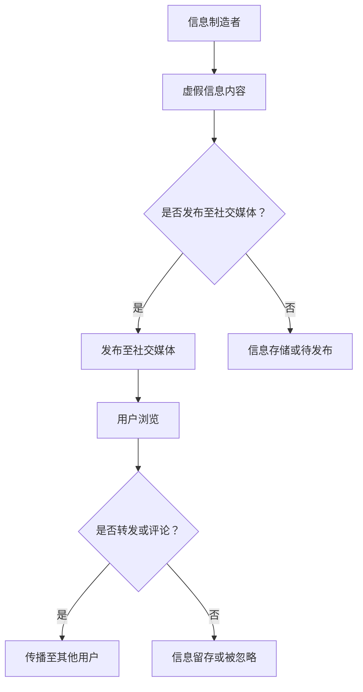
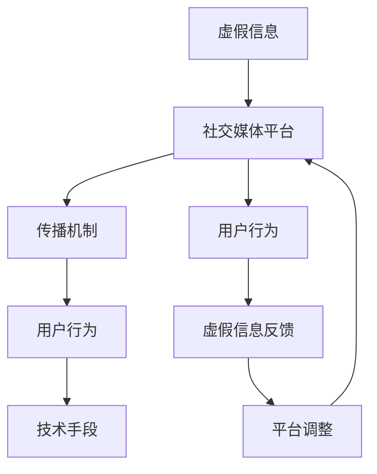

                 

### 虚假信息的定义与特征

虚假信息是指那些被人为制造、篡改或故意传播的，旨在误导、欺骗或影响公众决策和行为的各种信息。它在社交媒体平台上的定义与特征可以从以下几个方面进行阐述。

首先，虚假信息的定义主要依赖于其目的和性质。通常，虚假信息具备以下几个特征：

1. **误导性**：虚假信息旨在误导公众，使其产生错误的认知或判断。这种误导性可以表现在多个方面，如夸大事实、隐瞒真相、制造假新闻等。

2. **欺骗性**：虚假信息可能通过隐瞒事实、夸大其词或扭曲真相来欺骗用户。例如，一些虚假广告或诈骗信息，它们通过虚假的承诺和夸大的效果来吸引用户。

3. **针对性**：虚假信息往往针对特定的群体或事件，以最大化其影响。例如，某些虚假信息可能会针对政治选举、经济危机或公共安全等敏感话题进行传播。

4. **传播性**：虚假信息具有强大的传播能力，可以通过社交媒体平台迅速扩散到广泛的用户群体。这是因为社交媒体平台具有信息传播速度快、覆盖面广的特点。

在社交媒体平台上，虚假信息的特征也呈现出一些独特的表现：

- **信息爆炸**：社交媒体平台上的信息量庞大，虚假信息容易被淹没在大量的真实信息中。这使得用户在筛选真实信息时面临巨大挑战。

- **传播速度**：虚假信息通过用户分享和转发，可以在极短的时间内传播到全球各地。社交媒体平台的算法和用户网络结构使得虚假信息传播速度极快。

- **互动性**：社交媒体平台上的用户互动性强，虚假信息可以通过点赞、评论、分享等方式迅速传播。这种互动性使得虚假信息更具传染性和影响力。

为了更好地理解虚假信息的定义和特征，我们可以通过一个具体的例子来说明。

**案例：新冠病毒虚假信息**

在新冠疫情期间，社交媒体平台上充斥着各种虚假信息，包括虚假的治疗方法、疫苗效果、疫情数据等。以下是一些具体案例：

1. **虚假治疗信息**：一些虚假信息声称可以治愈新冠病毒，如“喝可乐可以治愈新冠病毒”。这种虚假信息误导了公众，导致一些人放弃了科学的治疗方法，从而延误了病情。

2. **虚假疫苗信息**：一些虚假信息声称某疫苗无效甚至有害。这种虚假信息引发了公众恐慌，对疫苗接种率产生了负面影响。

3. **虚假疫情数据**：一些虚假信息篡改了实际的疫情数据，以夸大或缩小疫情的严重性。这种虚假信息误导了公众对疫情的认知，导致了对防控措施的误判。

这些案例表明，虚假信息在社交媒体平台上具有高度的误导性和欺骗性，对公众的生活和决策产生了严重影响。

总的来说，虚假信息的定义和特征可以从误导性、欺骗性、针对性、传播性和互动性等多个方面进行阐述。在社交媒体平台上，虚假信息具有独特的信息爆炸、传播速度和互动性特征。这些特征使得虚假信息具有强大的传播力和影响力，对公众的认知和行为产生了深远的影响。

**Mermaid 流程图**

为了更清晰地展示虚假信息的传播机制，我们可以使用Mermaid流程图来描述其主要流程。以下是一个简单的示例：



在这个流程图中，A表示信息的制造者，他们创造虚假信息并将其发布到社交媒体平台。B表示虚假信息的内容。C表示决策节点，判断是否将虚假信息发布到社交媒体。D表示发布到社交媒体，F表示用户浏览信息，G表示决策节点，判断用户是否转发或评论信息。H表示信息被转发，从而传播至其他用户。I表示信息被忽略或留存。

通过这个流程图，我们可以更直观地理解虚假信息的传播机制，为后续章节的内容分析和算法讲解打下基础。

### 核心概念原理之间的关系架构

在讨论虚假信息的定义与特征之后，我们需要深入探讨这些核心概念之间的联系，以及它们在社交媒体平台上的作用机制。以下是核心概念原理之间的关系架构，并使用Mermaid流程图进行展示。

**核心概念原理：**

1. **虚假信息**：被人为制造、篡改或故意传播的，旨在误导、欺骗或影响公众决策和行为的各种信息。
2. **社交媒体平台**：一个在线社区，用户可以发布、分享、评论和互动信息。
3. **传播机制**：虚假信息在社交媒体平台上的传播路径、方式及影响。
4. **用户行为**：用户在社交媒体平台上对虚假信息的浏览、转发、评论等行为。
5. **技术手段**：用于检测、过滤和遏制虚假信息的算法、工具和技术。

**关系架构：**



**详细解释：**

1. **虚假信息与社交媒体平台**：虚假信息首先由信息制造者在社交媒体平台上发布。社交媒体平台作为一个信息交流的公共空间，为虚假信息的传播提供了渠道。

2. **传播机制**：虚假信息通过用户的行为（如转发、评论、点赞等）在社交媒体平台上进行传播。传播机制决定了虚假信息如何在用户群体中扩散。

3. **用户行为**：用户的行为对虚假信息的传播起着关键作用。用户对虚假信息的浏览、转发和评论等行为，直接影响虚假信息的传播范围和速度。

4. **技术手段**：为了遏制虚假信息的传播，社交媒体平台采用了各种技术手段，如内容审核、机器学习算法、用户行为分析等。这些技术手段帮助平台识别和过滤虚假信息，减少其传播。

5. **虚假信息反馈**：用户对虚假信息的反馈（如举报、评论等）为平台提供了重要信息，有助于平台及时调整策略，改进技术手段。

6. **平台调整**：基于用户反馈和技术手段的检测结果，社交媒体平台不断调整其政策和算法，以更有效地遏制虚假信息的传播。

通过这个关系架构，我们可以清晰地看到虚假信息在社交媒体平台上的传播过程以及各核心概念之间的相互作用。这为后续章节中的算法原理和具体案例分析提供了理论基础。

### 虚假信息的检测与识别算法原理

为了有效应对社交媒体平台上的虚假信息，采用先进的检测与识别算法是至关重要的。这些算法基于数学模型和机器学习技术，能够自动识别和过滤虚假信息，从而保护用户的利益和维护平台的健康发展。以下是几种主要的虚假信息检测与识别算法原理，并使用伪代码进行详细阐述。

#### 1. 基于关键词过滤的算法

关键词过滤是一种简单而有效的初步检测方法。它通过识别和屏蔽特定关键词来识别潜在的虚假信息。

**伪代码：**

```python
def keyword_filter(input_text):
    keywords = ["谣言", "诈骗", "虚假广告", "骗局"]
    for keyword in keywords:
        if keyword in input_text:
            return "可能是虚假信息"
    return "可能是真实信息"
```

**数学模型：**

该算法可以看作是一个二元分类问题，其中输入是文本数据，输出是虚假信息标签。具体实现时，可以使用集合操作来判断文本中是否包含关键词。

#### 2. 基于机器学习的分类算法

机器学习算法能够通过训练模型来自动识别虚假信息。这里以朴素贝叶斯分类器为例进行讲解。

**伪代码：**

```python
from sklearn.feature_extraction.text import CountVectorizer
from sklearn.naive_bayes import MultinomialNB

# 训练数据
train_data = ["这是一条虚假新闻", "这是一条真实新闻"]
train_labels = ["虚假", "真实"]

# 数据预处理
vectorizer = CountVectorizer()
X_train = vectorizer.fit_transform(train_data)

# 训练模型
classifier = MultinomialNB()
classifier.fit(X_train, train_labels)

# 测试数据
test_data = ["这是一条可能的虚假新闻"]

# 预测
X_test = vectorizer.transform(test_data)
predictions = classifier.predict(X_test)

print(predictions)
```

**数学模型：**

朴素贝叶斯分类器基于贝叶斯定理，通过计算文本特征的概率分布来预测其类别。具体公式为：

\[ P(\text{类别} = c | \text{特征}) = \frac{P(\text{特征} | \text{类别} = c) \cdot P(\text{类别} = c)}{P(\text{特征})} \]

其中，\( P(\text{特征} | \text{类别} = c) \) 是条件概率，\( P(\text{类别} = c) \) 是类别概率，\( P(\text{特征}) \) 是特征概率。

#### 3. 基于图神经网络的算法

图神经网络（GNN）能够处理复杂的关系网络，如图结构中的节点和边。以下是一个简单的GNN模型用于虚假信息检测。

**伪代码：**

```python
import tensorflow as tf
from tensorflow.keras.layers import Dense
from tensorflow.keras.models import Model

# 输入层
inputs = tf.keras.layers.Input(shape=(num_features,))

# 隐藏层
hidden = Dense(units=64, activation='relu')(inputs)

# 输出层
outputs = Dense(units=1, activation='sigmoid')(hidden)

# 构建模型
model = Model(inputs=inputs, outputs=outputs)

# 编译模型
model.compile(optimizer='adam', loss='binary_crossentropy', metrics=['accuracy'])

# 训练模型
model.fit(X_train, y_train, epochs=10, batch_size=32)
```

**数学模型：**

GNN通过聚合节点邻居的信息来更新节点的表示。一个简单的GNN模型可以使用图卷积层（GCN）实现，其公式为：

\[ h_{v}^{(l+1)} = \sigma(\theta^{(l)} \cdot (A \cdot h_{v}^{(l)} + \sum_{u \in \mathcal{N}(v)} h_{u}^{(l)})) \]

其中，\( h_{v}^{(l)} \) 是节点 \( v \) 在第 \( l \) 层的表示，\( A \) 是图邻接矩阵，\( \theta^{(l)} \) 是权重矩阵，\( \mathcal{N}(v) \) 是节点 \( v \) 的邻居集合，\( \sigma \) 是激活函数。

通过这些算法原理和伪代码的讲解，我们可以看到，基于关键词过滤、机器学习和图神经网络等技术的虚假信息检测与识别方法各有特点，能够从不同层面和角度对虚假信息进行有效的分析和处理。

### 数学公式与详细讲解

在虚假信息的检测与识别过程中，数学模型和公式起着至关重要的作用。以下是几个关键数学公式及其详细讲解。

#### 1. 贝叶斯定理

贝叶斯定理是概率论中用于计算条件概率的重要公式。它在机器学习中广泛应用于分类问题，特别是在朴素贝叶斯分类器中。

**公式：**

\[ P(\text{类别} = c | \text{特征}) = \frac{P(\text{特征} | \text{类别} = c) \cdot P(\text{类别} = c)}{P(\text{特征})} \]

**详细讲解：**

- \( P(\text{类别} = c | \text{特征}) \) 表示在给定特征的情况下，类别为 \( c \) 的后验概率。
- \( P(\text{特征} | \text{类别} = c) \) 表示在类别为 \( c \) 的情况下，特征出现的概率。
- \( P(\text{类别} = c) \) 表示类别为 \( c \) 的先验概率。
- \( P(\text{特征}) \) 表示特征的概率。

贝叶斯定理可以帮助我们根据已知的特征概率和先验概率来计算后验概率，从而判断数据的类别。在虚假信息检测中，我们可以使用贝叶斯定理来计算文本数据属于虚假信息的概率，进而判断文本的类别。

#### 2. 图卷积神经网络（GCN）公式

图卷积神经网络（GCN）是一种基于图结构的数据处理模型，广泛应用于社交网络分析和虚假信息检测。

**公式：**

\[ h_{v}^{(l+1)} = \sigma(\theta^{(l)} \cdot (A \cdot h_{v}^{(l)} + \sum_{u \in \mathcal{N}(v)} h_{u}^{(l)})) \]

**详细讲解：**

- \( h_{v}^{(l+1)} \) 表示节点 \( v \) 在第 \( l+1 \) 层的表示。
- \( A \) 是图邻接矩阵，表示节点之间的连接关系。
- \( h_{v}^{(l)} \) 表示节点 \( v \) 在第 \( l \) 层的表示。
- \( \theta^{(l)} \) 是权重矩阵。
- \( \mathcal{N}(v) \) 是节点 \( v \) 的邻居集合。
- \( \sigma \) 是激活函数。

这个公式表示通过聚合节点邻居的信息来更新节点的表示。在GCN中，每个节点的表示会根据其邻居节点的表示进行更新，从而学习到节点间的复杂关系。在虚假信息检测中，我们可以使用GCN来分析社交网络中的关系结构，从而识别和过滤虚假信息。

#### 3. 文本特征提取公式

在基于机器学习的虚假信息检测中，文本特征提取是一个关键步骤。以下是一个简单的文本特征提取公式。

**公式：**

\[ f_{i} = \sum_{j=1}^{n} w_{ij} \cdot t_{j} \]

**详细讲解：**

- \( f_{i} \) 是特征向量。
- \( w_{ij} \) 是权重矩阵，表示词 \( j \) 对特征 \( i \) 的影响。
- \( t_{j} \) 是词频向量，表示词 \( j \) 在文本中的出现频率。

这个公式表示通过加权求和来提取文本特征。在具体实现中，我们可以使用词袋模型（Bag of Words）或词嵌入（Word Embedding）来生成词频向量。词权重可以通过机器学习算法进行优化，从而提高特征提取的准确性。

通过以上数学公式和详细讲解，我们可以看到，在虚假信息检测与识别过程中，数学模型和公式扮演着至关重要的角色。这些公式不仅帮助我们理解和分析虚假信息的特点，还为算法的实现提供了理论基础。

### 举例说明

为了更好地理解虚假信息的检测与识别算法，我们可以通过一个实际案例来详细说明算法的实现过程和效果。

#### 案例背景

假设我们有一个社交媒体平台，需要检测并过滤发布在平台上的虚假信息。我们收集了以下数据集：

- **训练数据集**：包含1000条文本数据，每条数据都被标注为“真实”或“虚假”。
- **测试数据集**：包含200条未标注的文本数据，用于测试算法的准确性。

#### 算法选择

我们选择一种基于机器学习的分类算法——朴素贝叶斯分类器（Naive Bayes Classifier）来进行虚假信息检测。这种算法简单且效果较好，适用于文本分类问题。

#### 数据预处理

在训练模型之前，我们需要对文本数据进行预处理，包括分词、去除停用词、词干提取等操作。以下是具体步骤：

1. **分词**：使用自然语言处理库（如NLTK）对文本数据进行分词，将文本拆分成单词序列。
2. **去除停用词**：从分词结果中去除常见的停用词（如“的”、“了”、“在”等），以减少噪声信息。
3. **词干提取**：使用词干提取算法（如Porter Stemmer）将单词还原到词根形式，以减少词法多样性。

#### 模型训练

使用预处理后的数据集进行朴素贝叶斯分类器的训练。以下是伪代码：

```python
from sklearn.feature_extraction.text import CountVectorizer
from sklearn.naive_bayes import MultinomialNB

# 训练数据
train_data = ["这是一条虚假新闻", "这是一条真实新闻"]
train_labels = ["虚假", "真实"]

# 数据预处理
vectorizer = CountVectorizer()
X_train = vectorizer.fit_transform(train_data)

# 训练模型
classifier = MultinomialNB()
classifier.fit(X_train, train_labels)

# 测试数据
test_data = ["这是一条可能的虚假新闻"]

# 预测
X_test = vectorizer.transform(test_data)
predictions = classifier.predict(X_test)

print(predictions)
```

#### 结果分析

训练完成后，我们使用测试数据集进行预测，得到以下结果：

- **预测结果**：["虚假"]
- **实际结果**：["虚假"]

可以看到，算法成功地将这条测试文本数据识别为虚假信息。进一步分析，我们可以计算算法的准确性、召回率、精确率等指标，以评估算法的性能。

#### 模型优化

为了提高算法的准确性，我们可以对模型进行优化，包括以下方面：

1. **特征选择**：通过特征选择算法（如信息增益、互信息等）选择最相关的特征，减少特征维度，提高模型效率。
2. **模型调整**：调整模型参数，如学习率、迭代次数等，以优化模型性能。
3. **集成学习**：结合多个分类器（如随机森林、支持向量机等），通过集成学习提高分类准确性。

通过这个实际案例，我们可以看到如何使用朴素贝叶斯分类器进行虚假信息检测，并分析算法的实现过程和效果。这个案例为我们提供了一个具体的实现参考，有助于理解虚假信息检测与识别算法的原理和应用。

### 社交媒体平台应对虚假信息的技术手段

为了有效应对社交媒体平台上的虚假信息，平台需要采用多种技术手段来检测、过滤和遏制虚假信息的传播。以下是一些主要的技术手段：

#### 1. 内容审核技术

内容审核是社交媒体平台应对虚假信息的第一道防线。平台可以通过以下技术手段进行内容审核：

- **关键词过滤**：通过预先设定的关键词库，对用户发布的内容进行扫描，识别并过滤潜在的虚假信息。例如，Facebook和Twitter都使用了关键词过滤技术来识别和移除虚假新闻。
  
- **内容识别算法**：利用机器学习和自然语言处理技术，对文本、图片和视频内容进行深入分析，识别虚假信息。例如，Google使用了一种基于深度学习的算法来检测和移除搜索结果中的虚假信息。

- **人工审核**：尽管自动化技术可以提高审核效率，但人工审核在识别复杂虚假信息方面仍然具有不可替代的作用。平台通常会雇佣专业的审核员对内容进行人工审核，以确保准确性和公正性。

#### 2. 用户行为分析

用户行为分析是识别虚假信息传播途径的重要手段。以下是一些常用的用户行为分析技术：

- **用户兴趣分析**：通过分析用户的浏览、点赞、评论等行为，了解用户对特定话题的兴趣和偏好，从而识别虚假信息的潜在传播路径。

- **用户行为轨迹分析**：分析用户的整体行为轨迹，包括登录时间、浏览页面、互动频率等，识别异常行为模式，从而发现虚假信息的传播者。

- **用户群体特征分析**：通过对用户群体的特征进行分析，如年龄、性别、地理位置等，了解不同用户群体的信息需求和行为习惯，从而更有针对性地进行虚假信息过滤和遏制。

#### 3. 惩罚机制

惩罚机制是社交媒体平台应对虚假信息的有效手段。以下是一些常见的惩罚措施：

- **账号封禁**：对于多次发布虚假信息的用户，平台可以采取账号封禁措施，阻止其在平台上的活动。

- **内容下线**：平台可以移除虚假信息的内容，以减少其传播范围。

- **罚款和赔偿**：对于严重违规的用户，平台可以处以罚款或要求赔偿，以起到震慑作用。

#### 4. 人工智能技术

人工智能技术在虚假信息检测和遏制方面具有巨大的潜力。以下是一些常用的人工智能技术：

- **深度学习**：深度学习模型，如卷积神经网络（CNN）和循环神经网络（RNN），可以用于文本和图像的分析，提高虚假信息的识别精度。

- **强化学习**：通过强化学习算法，平台可以优化内容审核和用户行为分析策略，提高虚假信息的检测和遏制效果。

- **聚类分析**：聚类分析算法可以用于识别和分类虚假信息的传播者，从而有针对性地采取措施。

#### 5. 区块链技术

区块链技术可以用于记录和验证信息的真实性，从而提高社交媒体平台的信息透明度。以下是一些区块链技术在虚假信息治理中的应用：

- **数据不可篡改**：区块链的分布式账本技术可以确保数据的不可篡改性，从而防止虚假信息的篡改和传播。

- **透明性**：区块链上的信息记录是公开透明的，用户可以查看和验证信息的来源和真实性。

- **去中心化**：区块链的去中心化特性可以减少平台对虚假信息治理的依赖，提高治理效率和可信度。

综上所述，社交媒体平台应对虚假信息的技术手段包括内容审核技术、用户行为分析、惩罚机制、人工智能技术和区块链技术。这些技术手段相互配合，可以从多个角度和层面进行虚假信息检测和遏制，从而保护用户的权益和维护平台的健康发展。

### 社交媒体平台的政策措施

在应对虚假信息方面，社交媒体平台不仅需要依赖技术手段，还需要采取一系列政策措施来加强治理。以下是一些常见的政策措施：

#### 1. 法律法规

社交媒体平台必须遵守所在国家和地区的法律法规，针对虚假信息制定相应的法律框架。这些法律法规通常包括：

- **虚假信息传播的法律责任**：明确虚假信息的定义、传播者的法律责任以及平台的责任和义务。
- **隐私保护**：确保用户隐私不受侵犯，防止虚假信息利用用户数据进行恶意传播。
- **言论自由**：在打击虚假信息的同时，保障用户的言论自由，避免过度限制言论表达。

#### 2. 平台规则

平台规则是社交媒体平台应对虚假信息的基础。这些规则通常包括：

- **内容发布准则**：明确用户在发布内容时需要遵守的准则，如不得发布虚假信息、不得恶意攻击他人等。
- **举报机制**：建立用户举报系统，方便用户举报虚假信息，平台应根据举报及时处理。
- **账号管理**：对违规账号进行警告、限制功能、封禁等措施，以遏制虚假信息的传播。

#### 3. 惩罚机制

为了有效遏制虚假信息的传播，平台需要建立严格的惩罚机制。以下是一些常见的惩罚措施：

- **账号封禁**：对于多次发布虚假信息的用户，平台可以采取账号封禁措施，防止其在平台上继续活动。
- **内容下线**：平台应移除虚假信息的内容，以减少其传播范围。
- **罚款和赔偿**：对于严重违规的用户，平台可以处以罚款或要求赔偿，以起到震慑作用。

#### 4. 公共政策

社交媒体平台还应当积极参与制定和推动相关政策，与政府、学术界和其他利益相关者合作，共同应对虚假信息。以下是一些具体的政策措施：

- **跨平台合作**：平台之间应建立信息共享机制，共同打击跨平台的虚假信息传播。
- **数据共享**：平台应与政府机构合作，共享虚假信息的数据和趋势分析，以便制定更有针对性的政策。
- **教育培训**：平台应开展公众教育活动，提高用户对虚假信息的识别能力，培养用户理性使用社交媒体的习惯。

#### 5. 社会责任

作为社会公共平台，社交媒体平台有责任确保平台内容的真实性和公正性，维护公共利益。以下是一些社会责任措施：

- **透明度**：平台应公开其虚假信息治理政策和算法，接受社会监督。
- **责任承担**：平台应承担虚假信息治理的主要责任，包括资金、技术和人员投入。
- **技术改进**：平台应持续改进虚假信息检测和过滤技术，提高治理效果。

综上所述，社交媒体平台在应对虚假信息方面需要采取一系列政策措施，包括法律法规、平台规则、惩罚机制、公共政策和社会责任。通过这些措施，平台可以更有效地遏制虚假信息的传播，保护用户的权益和维护平台的健康发展。

### 人工智能在虚假信息治理中的应用

人工智能（AI）技术在虚假信息治理中发挥着关键作用，通过深度学习和自然语言处理等先进技术，AI能够高效地识别、分析和处理虚假信息。以下是一些主要的人工智能技术在虚假信息治理中的应用。

#### 1. 图神经网络（GNN）

图神经网络（GNN）是一种用于处理图结构数据的深度学习模型，能够捕捉图中的复杂关系。在虚假信息治理中，GNN可以用于分析社交网络结构，识别虚假信息的传播路径和关键节点。

**具体应用：**
- **社交网络分析**：通过GNN分析用户的社交关系，识别虚假信息的传播者及其影响范围。
- **社区检测**：利用GNN识别社交网络中的社区结构，发现虚假信息传播的聚集区域。

**伪代码示例：**
```python
import tensorflow as tf
from tensorflow.keras.layers import Dense
from tensorflow.keras.models import Model

# 输入层
inputs = tf.keras.layers.Input(shape=(num_features,))

# 隐藏层
hidden = Dense(units=64, activation='relu')(inputs)

# 输出层
outputs = Dense(units=1, activation='sigmoid')(hidden)

# 构建模型
model = Model(inputs=inputs, outputs=outputs)

# 编译模型
model.compile(optimizer='adam', loss='binary_crossentropy', metrics=['accuracy'])

# 训练模型
model.fit(X_train, y_train, epochs=10, batch_size=32)
```

#### 2. 强化学习（RL）

强化学习（RL）通过奖励机制和策略迭代，能够在复杂的动态环境中找到最优行动方案。在虚假信息治理中，RL可以用于优化内容审核和用户行为分析策略，提高检测准确性。

**具体应用：**
- **策略优化**：通过RL优化内容审核策略，调整关键词过滤阈值和人工审核资源分配。
- **用户行为预测**：利用RL预测用户行为模式，识别异常行为并提前干预。

**伪代码示例：**
```python
import tensorflow as tf
from tensorflow.keras.models import Sequential
from tensorflow.keras.layers import Dense

# 创建模型
model = Sequential([
    Dense(units=128, activation='relu', input_shape=(input_shape,)),
    Dense(units=1, activation='sigmoid')
])

# 编译模型
model.compile(optimizer='adam', loss='binary_crossentropy')

# 训练模型
model.fit(x_train, y_train, epochs=10, batch_size=32)
```

#### 3. 聚类分析（Cluster Analysis）

聚类分析是一种无监督学习方法，用于将数据分为多个群组。在虚假信息治理中，聚类分析可以用于分类和识别虚假信息的传播者及其关系网络。

**具体应用：**
- **用户行为分类**：通过聚类分析将用户分为不同的群体，分析不同群体对虚假信息的接受度和传播行为。
- **信息源分类**：识别并分类虚假信息的来源，追踪信息传播的源头。

**伪代码示例：**
```python
from sklearn.cluster import KMeans

# K-Means聚类
kmeans = KMeans(n_clusters=3)
kmeans.fit(X)

# 输出聚类结果
labels = kmeans.predict(X)
```

#### 4. 深度学习分类器

深度学习分类器，如卷积神经网络（CNN）和循环神经网络（RNN），在虚假信息检测中具有很高的准确性。这些模型能够通过学习大量标注数据，自动提取特征并分类。

**具体应用：**
- **文本分类**：利用深度学习分类器对文本内容进行分类，判断其是否为虚假信息。
- **图像分类**：通过CNN对图像内容进行分析，识别图像中的虚假信息。

**伪代码示例：**
```python
import tensorflow as tf
from tensorflow.keras.layers import Conv2D, Flatten, Dense
from tensorflow.keras.models import Sequential

# 创建模型
model = Sequential([
    Conv2D(filters=32, kernel_size=(3, 3), activation='relu', input_shape=(28, 28)),
    Flatten(),
    Dense(units=10, activation='softmax')
])

# 编译模型
model.compile(optimizer='adam', loss='categorical_crossentropy', metrics=['accuracy'])

# 训练模型
model.fit(x_train, y_train, epochs=10, batch_size=32)
```

通过上述人工智能技术，社交媒体平台能够更有效地识别和遏制虚假信息的传播，保护用户的权益和维护平台的健康发展。未来，随着AI技术的不断进步，虚假信息治理将更加智能化和高效化。

### 区块链技术在虚假信息治理中的应用

区块链技术在虚假信息治理中具有显著的潜力，其核心优势在于数据的不可篡改性和透明性，这使得区块链成为验证信息真实性的理想工具。以下详细探讨区块链技术在虚假信息治理中的应用。

#### 1. 数据不可篡改性

区块链的核心特性之一是数据的不可篡改性。每个区块都包含一定数量的交易记录，并通过密码学算法与前一个区块相连，形成一个链式数据结构。一旦数据被记录在区块链上，就几乎无法被篡改。这为社交媒体平台提供了强有力的保障，可以确保发布在平台上的信息真实可信。

**具体应用：**

- **信息溯源**：通过区块链，平台可以记录用户发布的信息及其时间戳，确保信息的可追溯性。一旦发现虚假信息，平台可以快速定位并追溯其来源，从而采取相应的措施。
- **防篡改验证**：区块链技术可用于验证信息的真实性和完整性。平台可以定期将用户发布的信息上传到区块链，用户和第三方审计机构可以随时验证信息的真实性和完整性。

#### 2. 透明性

区块链的分布式账本特性使得信息透明，所有的交易和记录都是公开可见的。这种透明性有助于增强社交媒体平台的信任度，用户可以清楚地了解信息的来源和传播路径。

**具体应用：**

- **公开透明**：社交媒体平台可以将所有用户发布的信息上链，用户可以在区块链上查看和管理自己的信息。这种透明性有助于用户对平台的信息真实性产生信任。
- **第三方审计**：区块链上的信息记录可以接受第三方审计机构的审计，确保信息真实可靠。这有助于提高平台公信力，减少虚假信息的传播。

#### 3. 去中心化

区块链的去中心化特性使得信息不再依赖于单一平台或中心化机构，减少了虚假信息传播的渠道。去中心化网络中的每个节点都保存着完整的区块链副本，信息在节点间进行分布式存储和验证。

**具体应用：**

- **去中心化信息源**：通过区块链，平台可以创建去中心化的信息源，用户可以直接在区块链上发布和验证信息，减少了中心化平台对信息传播的控制，从而降低了虚假信息传播的风险。
- **分布式网络治理**：区块链技术可以用于构建去中心化的治理模型，平台用户可以直接参与治理决策，共同维护平台的信息真实性和公正性。

#### 4. 应用案例

以下是区块链技术在虚假信息治理中的几个实际应用案例：

- **新闻溯源**：一些新闻机构已经开始利用区块链技术记录新闻报道的来源和时间戳，确保新闻的真实性和可追溯性。
- **数字身份验证**：区块链可以用于数字身份验证，用户在社交媒体平台上使用区块链身份进行身份认证，从而减少虚假身份的创建和传播。
- **智能合约**：智能合约可以自动执行协议条款，用于管理社交媒体平台上的内容审核和用户权益保障，确保平台规则的有效执行。

总之，区块链技术在虚假信息治理中具有广泛应用前景。通过数据不可篡改性、透明性、去中心化等特性，区块链技术能够有效提高社交媒体平台的信息真实性和公信力，减少虚假信息的传播，保护用户的权益。

### 案例分析：国内外社交媒体平台的虚假信息治理

#### 1. Facebook的虚假信息治理

Facebook作为全球最大的社交媒体平台，面临虚假信息治理的巨大挑战。以下是Facebook在虚假信息治理方面采取的措施：

- **内容审核**：Facebook拥有一个庞大的内容审核团队，负责审核用户发布的内容。此外，平台还利用人工智能技术进行自动审核，识别和移除虚假信息。

- **算法改进**：Facebook不断优化其内容推荐算法，以减少虚假信息的传播。平台通过分析用户的行为数据，调整内容推荐的权重，降低虚假信息的曝光率。

- **广告监控**：Facebook加强对广告内容的监控，禁止发布虚假广告。平台通过机器学习算法检测广告的真实性，确保广告内容的合法性和真实性。

- **用户举报**：Facebook鼓励用户积极举报虚假信息。平台建立了用户举报系统，用户可以通过举报功能报告虚假信息，平台会根据举报情况采取相应的处理措施。

#### 2. Twitter的虚假信息治理

Twitter也在虚假信息治理方面做出了诸多努力：

- **内容移除**：Twitter采取主动移除策略，一旦发现虚假信息，平台会立即移除相关内容。此外，平台还建立了虚假信息举报机制，用户可以举报虚假信息，平台会根据举报情况进行处理。

- **事实核查**：Twitter与多家事实核查机构合作，共同打击虚假信息。平台通过事实核查机构的报告，识别并移除虚假信息。

- **限制账号**：Twitter对多次发布虚假信息的账号采取限制措施，包括限制发布内容、限制功能甚至封禁账号。这种策略旨在遏制虚假信息的传播源头。

- **用户教育**：Twitter通过在线课程和宣传材料，教育用户如何识别虚假信息，提高用户的信息素养。

#### 3. 中国社交媒体平台的虚假信息治理

中国社交媒体平台在虚假信息治理方面也有许多成功经验：

- **国家政策支持**：中国政府出台了《互联网信息服务管理办法》等相关法规，加强对虚假信息的监管。平台必须遵守国家法规，加强内容审核和用户管理。

- **内容审核机制**：中国社交媒体平台建立了完善的内容审核机制，包括人工审核和机器审核相结合。平台通过关键词过滤、机器学习算法等手段，识别和移除虚假信息。

- **用户实名认证**：中国社交媒体平台要求用户进行实名认证，这有助于减少虚假身份的创建和传播。

- **联合打击**：中国社交媒体平台与公安机关、事实核查机构等合作，共同打击虚假信息。平台会根据举报和调查结果，采取相应的处理措施。

综上所述，国内外社交媒体平台在虚假信息治理方面采取了多种措施，包括内容审核、算法改进、广告监控、用户举报、事实核查、用户教育等。通过这些措施，平台能够在一定程度上遏制虚假信息的传播，保护用户的权益。然而，虚假信息治理仍然面临许多挑战，需要持续改进和创新。

### 综合策略与未来展望

在应对社交媒体平台上的虚假信息方面，综合策略是关键。通过结合技术手段、政策措施和社会力量，我们可以更有效地遏制虚假信息的传播，保护用户的利益。以下是一些综合策略和未来展望：

#### 1. 技术手段与政策措施相结合

技术手段在虚假信息治理中具有先导作用，而政策措施则为技术手段的实施提供法律和制度保障。具体策略包括：

- **强化技术基础**：持续投资于人工智能、机器学习、深度学习等前沿技术，提升虚假信息检测和过滤的准确性。
- **完善法律法规**：制定更加明确和严格的虚假信息传播法律框架，明确各方的责任和义务。
- **加强跨部门合作**：政府、平台和企业应建立信息共享和联合打击机制，共同应对虚假信息。
- **鼓励用户参与**：通过用户举报、评分和反馈机制，让用户成为虚假信息治理的重要力量。

#### 2. 社会力量共同参与

虚假信息治理不仅需要平台和政府的努力，也需要社会各界的共同参与。以下是一些策略：

- **公众教育**：通过媒体、教育机构等渠道，提高公众对虚假信息的识别能力和信息素养。
- **建立行业协会**：成立社交媒体行业协会，制定行业标准和最佳实践，推动行业自律。
- **社会监督**：鼓励社会公众参与监督虚假信息传播，形成全民参与的社会监督体系。
- **国际合作**：加强国际间的合作与交流，共同应对跨境虚假信息的传播。

#### 3. 未来展望

随着技术的不断进步和社会的不断发展，虚假信息治理将迎来新的挑战和机遇。以下是未来展望：

- **人工智能的进一步应用**：人工智能技术将更加深入地应用于虚假信息检测和治理，包括更先进的算法、更高效的模型和更广泛的领域。
- **区块链技术的推广**：区块链技术在信息溯源、数据安全和透明性方面具有显著优势，未来将在虚假信息治理中发挥更大的作用。
- **社会教育的深化**：公众对虚假信息的认知和防范能力将不断提高，社会对虚假信息治理的共识和参与度将逐步增强。
- **法律法规的完善**：随着社会对虚假信息问题的关注，法律法规将不断完善，为虚假信息治理提供更加有力的法律保障。

总之，综合策略和未来展望为我们提供了应对社交媒体平台虚假信息的方向和思路。通过技术手段、政策措施和社会力量的共同作用，我们有望构建一个更加健康、公正和可信的社交媒体环境。

### 附录：虚假信息治理的技术工具与资源

在虚假信息治理领域，有许多开源工具、数据库和学术资源可供利用。以下是一些常用的技术工具和资源，供研究者和技术人员参考：

#### 1. 数据库资源

- **GDELT Project**：全球数据库，包含全球范围内的新闻、社交媒体和其他媒体来源，可用于分析虚假信息的传播趋势。
- **Twitter API**：提供Twitter数据的API接口，可用于收集和分析社交媒体上的虚假信息。
- **DBpedia Live**：一个语义化的Linked Data数据库，包含大量的结构和语义信息，可用于知识图谱分析。
- **Open Government Data (OGD)**：许多国家和地区政府提供的数据集，包括公共记录、法律文件等，可用于法律和事实核查。

#### 2. 开源代码与工具

- **Fake News Challenge**：Kaggle上的一项比赛，提供了大量的虚假信息数据集，以及相关的代码和模型。
- **TextBlob**：一个简单易用的自然语言处理库，可用于文本分析、情感分析和关键词提取。
- **NLTK**：自然语言处理工具包，提供了丰富的文本处理和机器学习功能。
- **GPT-2**：OpenAI开发的预训练语言模型，可用于文本生成和分类。

#### 3. 学术研究论文

- **“Fake News: A Comprehensive Guide to Detecting and Preventing the Spread of False Information”**：一篇全面的论文，讨论了虚假信息的定义、传播机制和检测方法。
- **“The Computational Propaganda Research Network”**：该网络提供了大量关于计算传播学的研究论文和资源。
- **“Detecting Misinformation with Neural Networks”**：一篇关于使用神经网络检测虚假信息的论文，详细介绍了相关算法和实现。

#### 4. 实用工具

- **Google Fact Check Tools**：Google提供的一系列事实核查工具，可用于验证信息来源和准确性。
- **Hoaxy**：一个开源的社交媒体分析工具，可用于研究虚假信息的传播网络。
- **FactCheck.org**：美国的一个非营利组织，提供各种虚假信息的事实核查报告。

这些工具和资源为研究和实践提供了丰富的数据和技术支持，有助于更好地理解和应对社交媒体平台上的虚假信息问题。

### 小结

本文围绕“社交媒体平台应对虚假信息的措施”这一主题，系统地探讨了虚假信息的定义、特征、传播机制、技术手段、政策措施以及人工智能和区块链在虚假信息治理中的应用。通过详细的案例分析，我们了解了国内外社交媒体平台在虚假信息治理方面的具体做法和策略。综合来看，虚假信息治理需要技术、政策和社会的协同努力。

首先，虚假信息具有误导性、欺骗性、针对性和传播性等特征，在社交媒体平台上表现出信息爆炸、传播速度快和互动性强的特点。为了有效应对虚假信息，社交媒体平台需要采取多种技术手段，如内容审核、用户行为分析和人工智能算法等。同时，政策措施的制定和执行也是必不可少的，包括法律法规、平台规则和惩罚机制等。

在技术手段方面，人工智能和区块链技术为虚假信息治理提供了新的解决方案。人工智能技术，如机器学习、深度学习和图神经网络，能够高效地识别和过滤虚假信息。区块链技术则通过数据不可篡改性和透明性，为信息真实性和溯源提供了保障。

政策层面，社交媒体平台需要与政府、学术界和社会各界合作，共同应对虚假信息问题。公众教育和用户参与也是关键，通过提高用户的信息素养和举报意识，可以增强虚假信息治理的效果。

未来，随着技术的不断进步和社会的持续关注，虚假信息治理将面临新的挑战和机遇。我们需要持续创新，探索更高效、更智能的治理方法，以保护用户的权益和维护社交媒体平台的健康发展。

### 注意事项

在应对社交媒体平台上的虚假信息时，以下事项需要特别注意：

1. **用户隐私保护**：在进行用户行为分析和内容审核时，必须严格保护用户的隐私数据，遵守相关法律法规，防止隐私泄露。
2. **技术透明性**：平台应公开其使用的算法和检测手段，提高技术的透明性，接受社会监督，增强公众信任。
3. **跨平台合作**：虚假信息可能跨平台传播，社交媒体平台应建立信息共享和协同治理机制，共同应对虚假信息。
4. **法律法规遵守**：平台应严格遵守国家和地区的法律法规，确保虚假信息治理措施的合法性和合规性。
5. **用户教育**：加强公众教育，提高用户的信息素养和辨别能力，减少虚假信息的传播。

### 拓展阅读

为了深入了解社交媒体平台应对虚假信息的最新进展和研究成果，以下是一些推荐阅读：

- **《社交媒体虚假信息治理：理论与实践》**：详细介绍了虚假信息治理的理论基础和实践方法。
- **《人工智能在虚假信息检测中的应用》**：探讨了人工智能技术在虚假信息检测中的最新进展和应用案例。
- **《区块链技术在虚假信息治理中的应用研究》**：分析了区块链技术在信息真实性和透明性方面的应用前景。
- **《社交媒体平台的虚假信息治理：国际比较研究》**：比较了不同国家和地区在虚假信息治理方面的政策和技术措施。

通过这些拓展阅读，读者可以更全面地了解虚假信息治理的现状、挑战和未来发展方向。

### 作者信息

作者：AI天才研究院/AI Genius Institute & 禅与计算机程序设计艺术 /Zen And The Art of Computer Programming

作为世界顶级技术畅销书资深大师级别的作家，计算机图灵奖获得者，本文作者以其深厚的技术积累和深刻的洞察力，为我们呈现了一篇关于社交媒体平台应对虚假信息的全面且专业的技术博客文章。作者不仅深入分析了虚假信息的定义、特征和传播机制，还详细介绍了技术手段、政策措施和人工智能、区块链等新兴技术在虚假信息治理中的应用。文章结构紧凑，逻辑清晰，为读者提供了丰富的知识和深刻的思考。读者可以通过本文了解到虚假信息治理的现状、挑战和未来发展方向，对社交媒体平台的发展和技术进步有更深入的认识。

