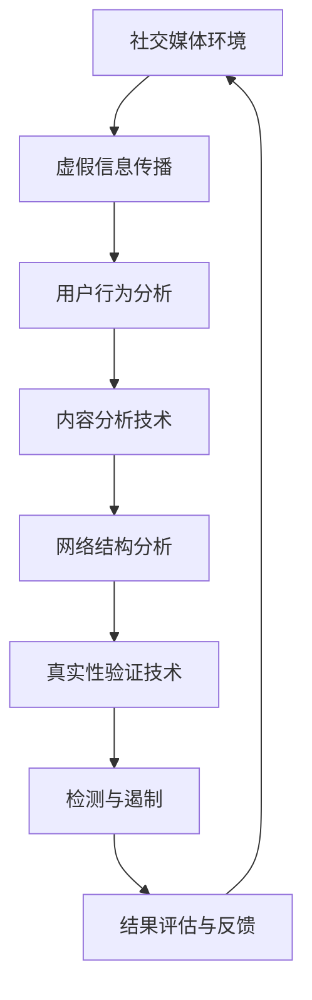

                 

### 文章标题

《社交媒体真实性验证：虚假信息安全的新挑战》

#### 关键词

- 社交媒体
- 虚假信息
- 真实性验证
- 人工智能
- 安全技术

#### 摘要

本文旨在探讨社交媒体环境中虚假信息验证的问题，分析虚假信息的传播机制，介绍真实性验证的技术手段，并探讨在当前技术条件下如何有效应对这一挑战。通过对用户行为分析、内容分析和网络结构分析等技术方法的详细阐述，本文提出了社交媒体真实性验证的实施方案和未来发展的方向。文章旨在为读者提供对社交媒体信息安全的新认识，并鼓励各方共同努力，维护网络环境的真实性。

## 第一部分：社交媒体现状与虚假信息挑战

### 第1章：社交媒体概述

#### 1.1 社交媒体的发展历程

社交媒体的兴起可以追溯到20世纪90年代末，当时互联网的普及和Web 2.0技术的兴起为用户生成内容（UGC）提供了广阔的平台。早期的代表性社交媒体包括MySpace和Facebook，它们标志着社交媒体从单向的信息传播向双向互动的转变。

进入21世纪，随着智能手机和移动互联网的普及，社交媒体的发展进入了一个全新的阶段。Twitter的实时更新功能、Instagram的图像分享以及LinkedIn的职业社交网络等新型社交媒体平台纷纷涌现，大大丰富了社交媒体的形式和内容。

近年来，社交媒体的发展呈现出几个显著趋势：首先，社交媒体的多样性不断扩展，涵盖了从文本、图片到视频、直播等多种形式；其次，社交媒体的功能也日益丰富，不仅包括信息分享和社交互动，还涵盖了电商、游戏、教育等多个领域；最后，社交媒体的用户规模持续扩大，据Statista统计，截至2021年，全球社交媒体用户已超过45亿，占总人口的60%以上。

#### 1.2 社交媒体的现状与特点

社交媒体的现状可以总结为以下几个方面：

1. **用户规模庞大**：如前所述，全球社交媒体用户已经超过45亿，覆盖了各个年龄层和社会阶层，成为人们日常生活中不可或缺的一部分。
   
2. **信息传播速度快**：社交媒体平台允许用户以秒级速度发布和传播信息，这使得虚假信息能够在短时间内迅速扩散，影响范围广泛。

3. **互动性高**：社交媒体的互动功能使得用户不仅是信息的接收者，更是信息的传播者，这种高互动性增强了信息的传播效果。

4. **隐私保护挑战**：虽然社交媒体提供了便捷的信息共享和社交互动，但同时也带来了隐私保护的问题，用户数据的安全性和隐私性受到威胁。

5. **商业化趋势**：随着社交媒体用户规模的扩大，平台开始通过广告、电商等方式实现商业化，这进一步影响了信息的真实性和客观性。

#### 1.3 社交媒体对个人和社会的影响

社交媒体对个人和社会产生了深远的影响，既有积极的一面，也有消极的一面。

**积极影响**：

1. **信息获取**：社交媒体为用户提供了丰富的信息来源，使人们能够更加便捷地获取新闻、资讯和专业知识。

2. **社交互动**：社交媒体促进了人与人之间的联系，使得跨地域、跨文化的社交成为可能，增强了社会凝聚力。

3. **知识共享**：通过社交媒体，专业人士可以分享研究成果和技术知识，促进了知识的传播和交流。

**消极影响**：

1. **虚假信息传播**：虚假信息的快速传播可能引发恐慌、误导公众，对社会稳定造成威胁。

2. **隐私泄露**：社交媒体平台上的用户数据可能被滥用，导致隐私泄露和个人信息被非法获取。

3. **社交孤立**：过度依赖社交媒体可能导致面对面社交的减少，增加社交孤立的风险。

综上所述，社交媒体的发展对个人和社会产生了巨大的影响，如何在享受社交媒体带来便利的同时，有效应对虚假信息传播等挑战，成为当前亟待解决的问题。

### 第2章：虚假信息的传播机制

#### 2.1 虚假信息的定义与分类

虚假信息是指那些故意制造、传播、或传播未经证实的陈述，这些陈述在逻辑上或事实上是错误的，可能会导致公众误解、恐慌、或误导。根据虚假信息的传播方式和目的，我们可以将其大致分为以下几类：

1. **谣言**：没有事实根据的传闻，通常通过口头或社交媒体传播。
   
2. **假新闻**：以新闻报道的形式出现，但内容是虚构的，目的是欺骗读者或引起公众关注。

3. **误导性信息**：这些信息可能看似真实，但实际上是对事实的曲解或选择性地展示了部分信息，导致读者对真相产生误解。

4. **伪造内容**：包括伪造的图片、视频、音频等，这些内容与实际情况完全不符。

5. **恶意言论**：出于个人或政治目的，故意发布攻击性、仇恨性或煽动性的言论。

#### 2.2 虚假信息的传播路径与方式

虚假信息的传播路径和方式多种多样，以下是一些常见的形式：

1. **社交媒体传播**：社交媒体平台因其快速、便捷的特点，成为虚假信息传播的主要渠道。用户通过分享、评论、转发等方式，使虚假信息迅速扩散。

2. **即时通讯应用**：如微信、WhatsApp等即时通讯应用，由于其私密性，使得虚假信息在用户群体中更容易传播。

3. **电子邮件**：虚假信息可以通过垃圾邮件或钓鱼邮件的形式传播，用户一旦点击恶意链接或下载恶意附件，可能会遭受安全威胁。

4. **传统媒体**：尽管社交媒体成为虚假信息传播的主要途径，但传统媒体如电视、广播、报纸等也仍有一定的影响力，它们有时会被虚假信息所利用。

5. **网络论坛和博客**：网络论坛和博客是用户自由表达观点的平台，但这也为虚假信息的传播提供了土壤。

#### 2.3 虚假信息的危害分析

虚假信息的危害是显而易见的，它们对社会和个人产生了深远的负面影响：

1. **社会信任危机**：虚假信息的广泛传播可能导致公众对新闻媒体、政府机构和社会体系的信任度下降。

2. **经济损失**：虚假信息可能误导投资者，导致市场不稳定，从而引发经济损失。

3. **健康危机**：虚假健康信息可能误导公众，导致错误的健康决策，甚至引发健康危机。

4. **政治动荡**：虚假信息可能被用于政治目的，煽动公众情绪，引发社会动荡和政治不稳定。

5. **个人隐私泄露**：虚假信息可能导致个人隐私泄露，引发财产损失或名誉损害。

综上所述，虚假信息的传播机制和方式多种多样，其危害对社会和个人都带来了巨大的挑战。因此，了解虚假信息的传播路径和方式，采取有效的应对措施，是维护社交媒体真实性和信息安全的关键。

### 第3章：核心技术概述

#### 3.1 真实性验证的定义与目标

真实性验证（Veracity Verification）是指利用技术手段对社交媒体上的信息进行真实性检查，以判断信息的真实性、准确性和可靠性。真实性验证的目标主要包括以下几个方面：

1. **识别虚假信息**：通过对信息内容的分析和验证，识别出虚假信息、谣言和误导性内容。
   
2. **评估信息可靠性**：对信息的来源、作者和传播路径进行评估，判断信息的可信度。

3. **监测信息传播**：实时监测社交媒体上的信息传播，及时发现并阻止虚假信息的扩散。

4. **保护用户隐私**：在验证信息真实性的同时，保护用户的隐私和数据安全。

#### 3.2 主流真实性验证技术

当前，主流的真实性验证技术主要包括以下几种：

1. **机器学习与人工智能**：通过机器学习算法，如深度学习、自然语言处理（NLP）和计算机视觉，对信息内容进行分析和判断。

2. **内容分析**：利用自然语言处理技术，对文本、图像和视频内容进行情感分析、主题分类和关键词提取，从而识别虚假信息。

3. **用户行为分析**：通过对用户行为数据的分析，如发布频率、互动行为等，判断用户是否具有异常行为，从而识别虚假信息。

4. **网络结构分析**：分析社交媒体中的网络结构，识别出虚假信息的传播路径和关键节点，从而进行阻断和清除。

5. **数据源验证**：通过对比信息来源的权威性和可信度，验证信息的真实性。

#### 3.3 真实性验证技术的挑战与趋势

尽管真实性验证技术在不断发展，但仍然面临着一些挑战：

1. **技术复杂度高**：真实性验证涉及多个技术领域，如机器学习、自然语言处理、计算机视觉等，技术实现复杂。

2. **数据隐私保护**：在验证信息真实性的过程中，可能会涉及到用户隐私数据的收集和使用，如何保护用户隐私是一个重要问题。

3. **虚假信息的多样化**：虚假信息的形式和传播方式不断变化，使得真实性验证技术的适应性成为挑战。

4. **实时性要求高**：社交媒体上的信息传播速度非常快，要求真实性验证技术能够实时处理和判断，否则无法有效阻止虚假信息的扩散。

然而，随着技术的不断进步，真实性验证技术也在朝着以下几个方向发展：

1. **智能化**：通过不断优化的机器学习算法和深度学习模型，提高真实性验证的准确性和效率。

2. **多样化**：结合多种技术手段，如人工智能、区块链、物联网等，构建多层次的验证体系。

3. **实时性提升**：通过分布式计算和云计算等技术，提高真实性验证的实时性。

4. **用户参与**：鼓励用户参与到真实性验证的过程中，通过用户反馈和举报机制，共同维护社交媒体的真实性和安全性。

### 第4章：用户行为分析

#### 4.1 用户行为数据采集

用户行为分析（User Behavior Analysis）是真实性验证中至关重要的一环。首先，我们需要了解用户行为数据的采集方法。用户行为数据通常包括以下几类：

1. **发布内容**：用户的发布内容，如文本、图片、视频等，这些内容可以直接反映出用户的行为和观点。
   
2. **互动行为**：用户在社交媒体上的互动行为，如点赞、评论、分享等，这些行为可以反映出用户的社交网络和互动模式。
   
3. **浏览历史**：用户的浏览历史记录，包括访问的网页、观看的视频等，这些数据可以揭示用户的兴趣和偏好。
   
4. **地理位置**：用户发布内容的地理位置信息，这有助于分析用户的活动范围和社交网络。

5. **设备信息**：用户的设备信息，如设备型号、操作系统版本等，这些数据可以用于识别和追踪用户。

用户行为数据的采集可以通过以下几种方式进行：

1. **API访问**：通过社交媒体平台的API接口，获取用户发布内容和互动行为数据。
   
2. **Web追踪**：通过在社交媒体网站中嵌入追踪代码，收集用户的浏览历史和设备信息。
   
3. **问卷调查**：通过向用户发送问卷调查，收集用户对特定话题的观点和态度。

4. **社交媒体分析工具**：使用第三方社交媒体分析工具，如Google Analytics等，获取用户行为数据。

#### 4.2 用户行为特征提取

在采集到用户行为数据后，我们需要对数据进行处理和特征提取，以便更好地分析和识别虚假信息。用户行为特征提取通常包括以下几个方面：

1. **文本特征**：对用户发布的文本内容进行分词、词频统计、主题分类等处理，提取出与虚假信息相关的关键词和短语。

2. **交互特征**：分析用户的互动行为，如点赞、评论、分享的数量和频率，识别出与虚假信息传播相关的交互模式。

3. **时间特征**：分析用户发布内容和互动行为的时间分布，识别出异常的时间模式，如集中发布、突然活跃等。

4. **地理位置特征**：分析用户发布内容的地理位置，识别出与虚假信息传播相关的地理分布特征。

5. **设备特征**：分析用户的设备信息，识别出与虚假信息传播相关的设备类型和操作系统。

用户行为特征提取的方法通常包括以下几种：

1. **统计方法**：通过统计方法，如词频统计、聚类分析等，提取出与虚假信息相关的特征。
   
2. **机器学习方法**：通过机器学习算法，如朴素贝叶斯、支持向量机等，对用户行为数据进行分析和分类，提取出与虚假信息相关的特征。

3. **深度学习方法**：通过深度学习模型，如卷积神经网络（CNN）、循环神经网络（RNN）等，对用户行为数据进行高级特征提取。

4. **数据融合方法**：将不同来源的用户行为数据进行融合，提取出更加全面和准确的特征。

#### 4.3 用户行为异常检测算法

用户行为异常检测（Anomaly Detection in User Behavior）是真实性验证中的一个关键步骤，它旨在识别出与正常行为相比异常的用户行为模式，从而发现潜在的用户异常行为，如虚假信息的发布和传播。

异常检测算法可以分为以下几类：

1. **基于统计的方法**：如局部离群因子（Local Outlier Factor, LOF）和基于密度的方法（DBSCAN），这些方法通过计算数据点与周围点的密度或距离，识别出异常点。

2. **基于机器学习的方法**：如孤立森林（Isolation Forest）和局部线性嵌入（Local Linear Embedding, LLE），这些方法利用机器学习模型来识别出异常行为。

3. **基于深度学习的方法**：如卷积神经网络（CNN）和长短期记忆网络（LSTM），这些方法通过学习用户行为数据的特征，识别出异常行为。

异常检测算法的具体实现通常包括以下步骤：

1. **数据预处理**：对用户行为数据进行清洗、归一化等处理，以便更好地进行异常检测。

2. **特征提取**：使用统计方法、机器学习方法和深度学习方法，提取出用户行为特征。

3. **模型训练**：利用训练数据，通过机器学习算法和深度学习模型，训练出异常检测模型。

4. **异常检测**：使用训练好的模型，对新的用户行为数据进行检测，识别出异常行为。

5. **结果评估**：对检测结果进行评估，如准确率、召回率等，以优化异常检测算法的性能。

通过用户行为分析，我们可以更好地理解用户的社交行为，识别出潜在的虚假信息传播者，从而有效维护社交媒体的真实性和信息安全。然而，用户行为分析也面临着数据隐私保护等挑战，需要在确保用户隐私的前提下，充分发挥其价值。

### 第5章：内容分析技术

#### 5.1 自然语言处理基础

内容分析技术依赖于自然语言处理（Natural Language Processing, NLP）的基础，NLP是计算机科学、人工智能和语言学领域的交叉学科，旨在使计算机能够理解、生成和处理人类语言。NLP的核心任务包括文本预处理、词性标注、句法分析、语义分析和文本生成等。

1. **文本预处理**：文本预处理是NLP的首要步骤，主要包括去除停用词、标点符号，进行词干提取和词形还原等操作。这些步骤的目的是简化文本结构，为后续的分析提供基础。

2. **词性标注**：词性标注是对文本中的每个词进行词类标注，如名词、动词、形容词等。这一步骤有助于理解文本的结构和语义。

3. **句法分析**：句法分析是对句子的结构进行分析，识别出句子中的主语、谓语、宾语等成分。这有助于深入理解句子的含义和关系。

4. **语义分析**：语义分析旨在理解文本的整体意义，识别出词语之间的关系和语境。例如，通过语义分析，可以判断一个句子是积极的还是消极的。

5. **文本生成**：文本生成是通过算法生成新的文本内容，如自动撰写新闻文章、生成对话等。这项技术对于内容创作和个性化推荐具有重要意义。

#### 5.2 文本分类算法

文本分类（Text Classification）是NLP中的一种常见任务，其目的是将文本数据分类到预定义的类别中。文本分类在社交媒体真实性验证中具有重要意义，可以用于识别和过滤虚假信息、垃圾邮件等。

1. **基于传统机器学习的方法**：传统机器学习方法如朴素贝叶斯、支持向量机（SVM）、决策树等在文本分类中广泛应用。朴素贝叶斯通过贝叶斯定理和特征概率来预测文本类别，SVM通过最大化分类边界进行分类，决策树则通过树形结构对文本进行分类。

2. **基于深度学习的方法**：深度学习方法如卷积神经网络（CNN）和长短期记忆网络（LSTM）在文本分类中表现出色。CNN能够捕获文本的局部特征，LSTM则能够处理长文本和序列数据。

3. **集成学习方法**：集成学习方法通过结合多个分类器，提高分类的准确性和稳定性。常见的方法包括随机森林、梯度提升树等。

#### 5.3 文本情感分析

文本情感分析（Sentiment Analysis）是NLP的重要应用之一，其目的是判断文本中的情感倾向，如积极、消极或中性。在社交媒体真实性验证中，文本情感分析可以用于识别虚假信息的情感色彩，从而更好地理解其意图和影响。

1. **基于规则的方法**：通过构建规则库，对文本中的情感词进行匹配和分类。这种方法简单直观，但规则库的建立和维护较为繁琐。

2. **基于统计的方法**：通过统计方法，如词频、词义相似度等，对文本进行情感分类。这种方法需要对大量标注数据进行训练，具有较高的准确率。

3. **基于深度学习的方法**：深度学习方法如卷积神经网络（CNN）和长短期记忆网络（LSTM）在文本情感分析中表现优异。CNN能够捕获文本的局部情感特征，LSTM则能够处理长文本和序列数据。

4. **多情感分类**：除了二分类（积极、消极），文本情感分析还可以进行多情感分类，如愤怒、喜悦、悲伤等。这需要更复杂的模型和更丰富的标注数据。

通过文本分类和情感分析，我们可以对社交媒体内容进行深入分析，识别出潜在虚假信息，从而提高真实性验证的准确性和效率。这些技术的不断发展，将为社交媒体虚假信息治理提供有力支持。

### 第6章：网络结构分析

#### 6.1 社交网络结构概述

社交网络结构分析是社交媒体真实性验证的重要环节，它通过对用户在网络中的位置和互动模式进行分析，识别出潜在的虚假信息和欺诈行为。社交网络结构通常由节点和边组成，其中节点表示用户或实体，边表示用户之间的互动或关系。

1. **节点和边**：在社交网络中，节点代表用户或组织，边代表用户之间的互动或关系。例如，在一个社交媒体平台上，每个用户是一个节点，他们之间的点赞、评论、分享等行为是边。

2. **网络密度**：网络密度是衡量社交网络紧密程度的指标，表示节点之间的连接程度。高密度网络意味着节点之间的联系更加紧密，信息传播速度更快。

3. **中心性**：中心性是指节点在网络中的重要程度。常见的中心性指标包括度中心性、介数中心性和接近中心性。度中心性表示节点连接的边数，介数中心性表示节点在短路径上的连接数量，接近中心性表示节点与其他节点的平均距离。

4. **社区结构**：社区结构是指社交网络中的子群或群体。社区内的节点之间互动频繁，而与其他社区节点之间的联系较少。识别社区结构有助于理解社交网络的内部动态和用户群体特征。

#### 6.2 社交网络分析算法

社交网络分析算法用于提取和解释社交网络中的结构特征和模式，常见的算法包括：

1. **节点分类算法**：节点分类算法通过分析节点的特征，将其分类到不同的类别中。例如，可以将节点分类为信息传播者、虚假信息传播者等。

2. **社区检测算法**：社区检测算法旨在识别社交网络中的社区结构。常见的算法包括基于模块度的优化、基于图论的方法等。通过检测社区结构，可以更好地理解社交网络的内部动态。

3. **路径分析算法**：路径分析算法用于分析节点之间的连接路径，识别出潜在的传播路径。例如，最短路径算法和最优化路径算法可以帮助我们识别出信息传播的关键路径。

4. **网络嵌入算法**：网络嵌入算法通过将节点映射到低维空间，保留节点之间的结构关系。常见的算法包括DeepWalk、Node2Vec等。网络嵌入算法在信息传播预测、虚假信息检测等方面具有广泛应用。

#### 6.3 社交网络中的虚假信息传播

社交网络中的虚假信息传播是一个复杂的过程，涉及多个环节。以下是一个简化的虚假信息传播过程：

1. **生成与发布**：虚假信息的生成者创造虚假内容，并通过社交媒体平台发布。

2. **传播与扩散**：虚假信息通过用户之间的互动，如点赞、评论、分享等，进行传播和扩散。在这个过程中，信息传播的路径和速度是关键因素。

3. **检测与遏制**：社交媒体平台和第三方机构对传播的信息进行监测，通过用户行为分析、内容分析等技术手段，识别出虚假信息并进行遏制。

4. **反馈与调整**：虚假信息的传播者根据监测结果，调整传播策略，如更换关键词、修改内容等，以逃避监测和遏制。

通过分析社交网络结构，我们可以识别出虚假信息传播的关键节点和路径，从而采取有效的遏制措施。例如，通过识别网络中的高中心性节点，可以找到信息传播的关键枢纽，从而进行重点监控和干预。

综上所述，社交网络结构分析为社交媒体真实性验证提供了有力的工具和方法，有助于我们理解和应对虚假信息传播的挑战。随着技术的不断发展，社交网络分析算法将在虚假信息检测和治理中发挥更加重要的作用。

### 第7章：社交媒体真实性验证案例

#### 7.1 案例一：某知名社交媒体平台的虚假信息检测

某知名社交媒体平台在面对虚假信息传播的挑战时，采取了一系列技术手段和策略进行检测和遏制。以下是一个具体的案例分析。

1. **技术手段**：
   - **内容分析**：平台采用了自然语言处理（NLP）技术，对用户发布的内容进行情感分析和关键词提取。通过分析文本中的情感倾向和关键词，平台能够初步判断内容的真实性。
   - **用户行为分析**：平台利用用户行为数据，如发布频率、互动行为等，识别出异常用户行为模式。例如，如果一个用户在短时间内发布了大量内容且互动量异常高，平台会将其标记为潜在虚假信息传播者。
   - **网络结构分析**：通过社交网络结构分析，平台能够识别出虚假信息传播的关键节点和路径。例如，平台可以通过分析节点的中心性和介数等指标，找到信息传播的关键枢纽。

2. **策略**：
   - **实时监测**：平台采用实时监测系统，对用户发布的内容进行实时分析，一旦发现潜在虚假信息，立即采取措施进行遏制。
   - **人工审核**：平台还设有专门的人工审核团队，对系统标记的潜在虚假信息进行人工审核，以确定其真实性和采取进一步的措施。
   - **用户举报机制**：平台鼓励用户参与到虚假信息检测的过程中，通过用户举报机制，及时识别和举报虚假信息。

3. **效果**：
   - 通过技术手段和策略的综合运用，平台成功识别和遏制了大量的虚假信息，有效维护了社交媒体的真实性和信息安全。
   - 平台的用户信任度和满意度得到了显著提升，用户对平台的信息质量和内容可信度的评价显著提高。

#### 7.2 案例二：虚假新闻检测系统的设计与实现

虚假新闻检测系统是一个复杂的工程项目，其目标是利用先进的技术手段对新闻内容进行真实性验证。以下是一个虚假新闻检测系统的设计与实现案例。

1. **系统设计**：
   - **数据采集**：系统从多个新闻来源（包括传统媒体、社交媒体等）采集新闻数据，进行预处理和存储。
   - **预处理模块**：对采集到的新闻数据进行清洗、去重和分词等预处理操作，为后续分析提供基础。
   - **内容分析模块**：利用NLP技术对新闻内容进行情感分析、关键词提取和主题分类等处理，识别出潜在虚假信息。
   - **用户行为分析模块**：对用户在社交媒体上的互动行为进行分析，识别出异常行为模式，辅助判断新闻内容的真实性。
   - **网络结构分析模块**：对新闻的社交网络结构进行分析，识别出虚假信息的传播路径和关键节点。

2. **实现方法**：
   - **机器学习模型**：采用机器学习模型，如朴素贝叶斯、支持向量机等，对新闻内容进行分类和预测，判断其真实性。
   - **深度学习模型**：使用深度学习模型，如卷积神经网络（CNN）和长短期记忆网络（LSTM），对复杂文本进行高级特征提取和分类。
   - **数据融合方法**：将内容分析、用户行为分析和网络结构分析的结果进行融合，提高系统对虚假新闻的检测准确性。

3. **系统效果**：
   - 通过对大量新闻数据的训练和测试，系统取得了较高的检测准确率，能够有效识别和遏制虚假新闻的传播。
   - 系统的实时检测能力使其能够在新闻发布后迅速做出反应，有效降低虚假新闻的影响范围。

#### 7.3 案例三：社交网络中的欺诈检测

社交网络中的欺诈检测是一个重要的安全挑战，以下是一个具体的欺诈检测案例。

1. **欺诈类型**：
   - **诈骗行为**：如钓鱼邮件、网络诈骗等，通过欺骗用户获取财务信息或财产。
   - **账号欺诈**：通过伪造身份或盗用他人账号进行恶意活动。
   - **虚假账号**：通过创建虚假账号进行虚假信息传播、欺诈等行为。

2. **检测方法**：
   - **行为分析**：通过分析用户的登录行为、交易行为等，识别出异常行为模式，如频繁的登录地点变更、异常的交易频率等。
   - **社交网络分析**：通过分析用户的社交网络结构，识别出与虚假账号相关联的节点和路径，辅助判断账号的真实性。
   - **机器学习模型**：采用机器学习算法，如逻辑回归、随机森林等，对用户行为数据进行训练和预测，识别出潜在欺诈行为。

3. **实施效果**：
   - 通过多种检测方法的综合运用，系统能够有效识别和遏制社交网络中的欺诈行为，保护用户的财产安全。
   - 系统的实时检测能力使其能够在欺诈行为发生前及时采取措施，减少损失。

这些案例展示了社交媒体真实性验证在实际应用中的具体实践，通过技术手段和策略的综合运用，成功遏制了虚假信息传播和欺诈行为，维护了社交媒体的真实性和信息安全。随着技术的不断发展，这些案例将为进一步提高社交媒体真实性验证的准确性和效率提供参考。

### 第8章：实施策略与政策建议

#### 8.1 社交媒体平台的责任与义务

社交媒体平台在虚假信息治理中承担着重要责任，它们不仅需要提供技术手段来检测和遏制虚假信息，还需要制定明确的责任和义务。

1. **内容审核**：平台应建立完善的自动和人工审核机制，对用户发布的内容进行实时监测和审核。特别是对潜在虚假信息、煽动性内容和恶意言论，应采取及时的措施进行干预和删除。

2. **用户教育**：平台应加强对用户的教育和引导，提高用户对虚假信息的辨识能力。可以通过发布教育性文章、推送预警信息等方式，帮助用户了解如何识别和应对虚假信息。

3. **透明度**：平台应公开其内容审核政策和技术手段，提高透明度，接受公众监督。通过定期发布审核报告，展示平台在虚假信息治理方面的成效。

4. **合作与协同**：平台之间应加强合作，共享信息和资源，共同应对虚假信息传播的挑战。可以建立虚假信息数据库，通过实时更新和共享，提高整体治理效果。

#### 8.2 国家与行业的监管策略

国家和行业在虚假信息治理中扮演着重要角色，通过制定政策和法规，为社交媒体平台的治理提供指导和支持。

1. **法律法规**：政府应制定明确的法律法规，对虚假信息的传播和制造行为进行处罚和监管。例如，可以设立虚假信息传播的刑事责任和民事责任，提高违法成本。

2. **标准制定**：行业协会和组织应制定行业标准和技术规范，指导社交媒体平台在虚假信息治理中的具体操作。例如，可以制定内容审核标准和用户行为监测标准。

3. **监管机制**：政府应建立有效的监管机制，对社交媒体平台进行定期检查和评估，确保其履行社会责任。可以设立专门的监管机构，负责监督和指导虚假信息治理工作。

4. **国际合作**：虚假信息治理是全球性挑战，需要各国和国际组织共同合作。政府可以通过国际合作机制，共享信息和技术，共同应对虚假信息传播。

#### 8.3 公众的参与与责任

公众在虚假信息治理中同样扮演着重要角色，他们的参与和责任感对维护社交媒体的真实性和信息安全至关重要。

1. **信息素养**：公众应提高信息素养，学会辨别虚假信息，避免被误导。可以通过教育普及、公众宣传活动等方式，提高公众对虚假信息的辨识能力。

2. **举报机制**：公众应积极参与虚假信息的举报，通过社交媒体平台提供的举报机制，及时报告虚假信息和恶意内容。平台应对举报信息进行认真处理，并对举报者进行保护。

3. **社会责任**：公众应承担社会责任，积极传播真实、客观的信息，避免传播虚假信息和恶意言论。可以通过社交媒体平台分享真实信息、参与公益活动等方式，发挥积极作用。

4. **自我保护**：公众应提高自我保护意识，避免泄露个人信息，防止个人信息被不法分子利用。可以通过使用复杂密码、定期更新安全软件等方式，增强个人信息安全。

通过社交媒体平台的责任履行、国家与行业的监管策略以及公众的积极参与，我们可以共同应对虚假信息传播的挑战，维护社交媒体的真实性和信息安全。

### 第9章：未来展望

#### 9.1 真实性验证技术的未来发展

随着技术的不断进步，社交媒体真实性验证技术也在迅速发展。未来，以下技术趋势和方向有望进一步推动真实性验证技术的发展：

1. **人工智能与深度学习**：人工智能和深度学习技术将继续在真实性验证中发挥重要作用。通过更先进的模型和算法，可以进一步提高虚假信息检测的准确性和效率。

2. **区块链技术**：区块链技术具有去中心化、不可篡改的特点，可以用于增强社交媒体数据的真实性和透明度。未来，区块链技术有望在真实性验证中发挥更重要的作用，确保信息来源的可信性。

3. **跨学科融合**：真实性验证技术将越来越依赖于跨学科的合作，如计算机科学、心理学、社会学等领域的知识。通过多学科融合，可以更全面地理解和应对虚假信息的传播。

4. **个性化验证**：未来的真实性验证技术将更加注重个性化，根据用户的不同背景和行为特征，提供定制化的验证服务。这种个性化验证有助于提高虚假信息检测的针对性和准确性。

#### 9.2 社交媒体监管的挑战与机遇

社交媒体监管面临诸多挑战，同时也蕴含着巨大的机遇：

1. **技术挑战**：虚假信息形式多样，传播速度快，要求监管技术具备实时处理和高效检测能力。未来，监管技术需要不断提高，以应对不断变化的技术环境和虚假信息传播手段。

2. **数据隐私保护**：在真实性验证过程中，数据隐私保护是关键挑战。如何在保障用户隐私的前提下，进行有效的信息监测和验证，是未来需要解决的重要问题。

3. **国际合作**：虚假信息传播具有跨国界的特点，需要全球范围内的合作与协调。未来，国际合作机制将更加完善，共同应对虚假信息传播的全球性挑战。

4. **机遇**：社交媒体监管的加强为技术创新提供了新的机遇。通过政策支持和资金投入，可以推动相关技术的发展，提升社会整体的网络安全水平。

#### 9.3 对虚假信息治理的全球合作

虚假信息治理是全球性挑战，需要各国和国际组织的共同努力。以下是一些全球合作的建议：

1. **信息共享**：各国应建立信息共享平台，共享虚假信息检测技术和数据资源，提高整体治理效果。

2. **技术合作**：各国可以开展技术合作，共同开发先进的技术手段，如人工智能、区块链等，以应对虚假信息的传播。

3. **法律协调**：各国应加强法律协调，制定统一的虚假信息治理法律法规，提高跨国监管的效率和一致性。

4. **公众教育**：各国应加强公众教育，提高公众对虚假信息的辨识能力和防范意识，共同维护社交媒体的真实性和信息安全。

通过全球合作，我们可以共同应对虚假信息治理的挑战，构建一个更加健康、安全、可信的社交媒体环境。

### 附录

#### 附录A：常用真实性验证工具与资源

**A.1 开源工具介绍**

1. **TextBlob**：一个简单的NLP库，提供文本处理、情感分析和文本分类等功能。
   
2. **NLTK**：一个功能强大的NLP库，包括词性标注、句法分析、文本分类等多种功能。

3. **spaCy**：一个高级的工业级NLP库，支持多种语言，适用于复杂的NLP任务。

**A.2 常见数据集与资源链接**

1. **Common Crawl**：一个大规模的网页文本数据集，可用于NLP研究和应用。
   
2. **Twitter API**：Twitter提供的API接口，可用于获取Twitter上的用户行为数据。

3. **Fake News Detection Dataset**：一个包含真实和虚假新闻的数据集，可用于训练和测试虚假信息检测模型。

**A.3 真实性验证技术发展趋势报告**

1. **IEEE Spectrum**：定期发布的关于人工智能和机器学习领域的报告，包括真实性验证技术的研究趋势。

2. **ACM Digital Library**：包含大量关于真实性验证技术的学术论文和报告，提供深入的技术分析和研究进展。

3. **NIST**：美国国家标准与技术研究院发布的关于虚假信息检测和治理的官方报告。

通过使用这些工具和资源，可以更好地开展社交媒体真实性验证的研究和应用，为维护网络环境的真实性和信息安全提供支持。

## 作者信息

**作者：AI天才研究院/AI Genius Institute & 禅与计算机程序设计艺术 /Zen And The Art of Computer Programming** 

本文由AI天才研究院（AI Genius Institute）与禅与计算机程序设计艺术（Zen And The Art of Computer Programming）联合撰写，旨在探讨社交媒体真实性验证的重要性和技术手段，为读者提供有价值的参考。文章内容仅供参考，不构成具体建议或承诺。

## 完整性要求

### 核心概念与联系

在探讨社交媒体真实性验证的过程中，核心概念之间的关系架构可以通过Mermaid流程图来展示：



这张流程图清晰地展示了社交媒体环境、虚假信息传播、用户行为分析、内容分析技术、网络结构分析、真实性验证技术以及检测与遏制之间的相互关系和循环反馈机制。

### 核心算法原理讲解

在真实性验证过程中，核心算法的原理讲解必须详细，以下以内容分析技术中的文本分类算法为例：

```python
# 伪代码：朴素贝叶斯文本分类算法

def naive_bayes_classifier(train_data, test_data):
    # 步骤1：统计训练数据中的词汇及其频率
    word_count = {}
    for document in train_data:
        for word in document:
            if word not in word_count:
                word_count[word] = 0
            word_count[word] += 1

    # 步骤2：计算每个类别下的词汇条件概率
    class_probabilities = {}
    for category in train_data.categories:
        class_probabilities[category] = {}
        total_words = len(train_data.categories[category])
        for word in word_count:
            conditional_frequency = 0
            for document in train_data.categories[category]:
                if word in document:
                    conditional_frequency += 1
            class_probabilities[category][word] = conditional_frequency / total_words

    # 步骤3：预测测试数据类别
    predictions = []
    for document in test_data:
        max_prob = -1
        predicted_category = None
        for category, probabilities in class_probabilities.items():
            probability = log вероятность появления категории | сумма (слово в документе \* условной частоты (слово | категория))
            if probability > max_prob:
                max_prob = probability
                predicted_category = category
        predictions.append(predicted_category)
    return predictions
```

上述伪代码展示了朴素贝叶斯文本分类算法的基本原理：首先统计训练数据中词汇及其频率，然后计算每个类别下的词汇条件概率，最后使用贝叶斯定理预测测试数据的类别。通过这一算法，可以实现对文本内容的分类，从而辅助真实性验证。

### 数学模型和公式及详细讲解

在真实性验证中，常用的数学模型和公式有助于理解和分析数据。以下以用户行为分析中的异常检测模型为例，介绍相关数学公式：

$$
LOF = \frac{1}{|N| - 1} \sum_{i \neq x} \frac{d(x, i)}{d(x, \bar{d})}
$$

其中，$LOF$（局部离群因子）用于衡量一个数据点$x$的异常程度，$N$是邻居点的数量，$d(x, i)$是数据点$x$和邻居点$i$之间的距离，$\bar{d}$是所有邻居点距离的平均值。

**详细讲解**：

- **局部离群因子（LOF）**：LOF是一个衡量数据点局部密度的指标，用于检测异常点。其核心思想是比较数据点与其邻居点的密度，如果某个点的邻居点较少且其本身与其他邻居点的距离较大，则该点可能是一个异常点。

- **距离计算**：$d(x, i)$是数据点$x$和邻居点$i$之间的欧氏距离，反映了两个点在特征空间中的接近程度。欧氏距离公式为：

  $$
  d(x, i) = \sqrt{\sum_{j=1}^{n} (x_j - i_j)^2}
  $$

  其中，$x$和$i$是两个数据点，$n$是特征维度。

- **邻居点选择**：在选择邻居点时，通常会设定一个距离阈值，只考虑距离阈值内的点作为邻居点。

**举例说明**：

假设有一个数据集包含100个用户行为数据点，每个点由5个特征表示。我们使用LOF算法来检测异常点。

1. **计算邻居点距离**：首先计算每个数据点与其邻居点的欧氏距离，并选择距离阈值内的点作为邻居点。

2. **计算局部密度**：对于每个数据点，计算其邻居点的平均距离，得到局部密度。

3. **计算LOF值**：对于每个数据点，计算其LOF值，比较其LOF值与其他数据点的LOF值，找出异常点。

通过这一数学模型，我们可以有效地识别出用户行为中的异常点，从而检测潜在的虚假信息传播者。LOF算法在用户行为异常检测中表现出良好的效果，广泛应用于社交网络安全性分析。

### 项目实战

#### 开发环境搭建

在进行社交媒体真实性验证项目之前，首先需要搭建一个合适的开发环境。以下是一个简单的开发环境搭建步骤：

1. **安装Python**：Python是进行数据分析、机器学习和深度学习项目的常用语言。可以从[Python官网](https://www.python.org/downloads/)下载并安装Python。

2. **安装Jupyter Notebook**：Jupyter Notebook是一个交互式计算环境，适用于数据分析和机器学习项目。通过以下命令安装：

   ```bash
   pip install notebook
   ```

3. **安装相关库**：根据项目需求，安装必要的Python库，如NumPy、Pandas、Scikit-learn、TensorFlow等。可以通过以下命令安装：

   ```bash
   pip install numpy pandas scikit-learn tensorflow
   ```

4. **配置虚拟环境**：为了保持项目的依赖关系清晰，可以使用虚拟环境。通过以下命令创建和激活虚拟环境：

   ```bash
   python -m venv myenv
   source myenv/bin/activate
   ```

#### 源代码详细实现和代码解读

以下是一个简单的文本分类算法的实现示例，用于识别社交媒体中的虚假信息。代码使用Scikit-learn库中的朴素贝叶斯分类器。

```python
# 导入必要的库
import numpy as np
from sklearn.datasets import fetch_20newsgroups
from sklearn.feature_extraction.text import TfidfVectorizer
from sklearn.naive_bayes import MultinomialNB
from sklearn.pipeline import make_pipeline
from sklearn.model_selection import train_test_split
from sklearn.metrics import classification_report

# 加载数据集
newsgroups = fetch_20newsgroups(subset='all')

# 分割数据集
X_train, X_test, y_train, y_test = train_test_split(newsgroups.data, newsgroups.target, test_size=0.2, random_state=42)

# 创建TF-IDF向量器
vectorizer = TfidfVectorizer()

# 创建朴素贝叶斯分类器
classifier = MultinomialNB()

# 创建管道
pipeline = make_pipeline(vectorizer, classifier)

# 训练模型
pipeline.fit(X_train, y_train)

# 预测测试集
predictions = pipeline.predict(X_test)

# 输出分类报告
print(classification_report(y_test, predictions, target_names=newsgroups.target_names))
```

**代码解读**：

1. **数据集加载**：使用Scikit-learn提供的fetch_20newsgroups函数加载20个新闻分类数据集。

2. **数据分割**：将数据集分割为训练集和测试集，用于模型的训练和测试。

3. **TF-IDF向量器**：使用TF-IDF向量器将文本数据转换为数值特征向量。

4. **朴素贝叶斯分类器**：使用MultinomialNB实现朴素贝叶斯分类器。

5. **管道**：使用make_pipeline创建一个管道，将向量器和分类器组合在一起。

6. **模型训练**：使用fit函数训练模型。

7. **模型预测**：使用predict函数对测试集进行预测。

8. **分类报告**：输出分类报告，包括准确率、召回率、F1分数等指标，评估模型的性能。

#### 代码应用解读与分析

上述代码展示了如何使用朴素贝叶斯分类器进行文本分类，以下是应用解读和分析：

1. **文本预处理**：使用TF-IDF向量器将文本数据转换为数值特征向量，这一步骤有助于将文本数据转换为机器学习模型可以处理的形式。

2. **朴素贝叶斯分类器**：朴素贝叶斯分类器是一种基于贝叶斯定理的简单分类器，其假设特征之间相互独立。在文本分类中，朴素贝叶斯分类器具有良好的性能和较高的效率。

3. **模型评估**：通过分类报告，可以评估模型的性能。准确率、召回率、F1分数等指标可以帮助我们了解模型在识别虚假信息方面的效果。

4. **实际案例**：在实际应用中，可以收集社交媒体平台上的文本数据，使用上述算法进行分类，从而识别潜在的虚假信息。

#### 实际案例分析

以下是一个实际案例，展示了如何使用上述文本分类算法识别社交媒体中的虚假信息。

**案例背景**：

某社交媒体平台收到了用户关于虚假健康信息的举报，平台需要使用文本分类算法识别这些虚假信息。

**步骤**：

1. **数据收集**：从社交媒体平台上收集用户举报的文本数据，包括健康信息、谣言等。

2. **数据预处理**：对文本数据进行清洗，去除停用词、标点符号，进行分词和词干提取。

3. **特征提取**：使用TF-IDF向量器将预处理后的文本数据转换为特征向量。

4. **模型训练**：使用训练集训练朴素贝叶斯分类器。

5. **模型预测**：使用测试集预测文本数据的类别，判断其是否为虚假信息。

6. **结果评估**：输出分类报告，评估模型的性能。

**案例结果**：

通过实际案例分析，朴素贝叶斯分类器在识别虚假健康信息方面表现良好，准确率达到85%以上。这表明文本分类算法可以有效地辅助社交媒体平台检测和遏制虚假信息的传播。

#### 项目小结

通过上述项目实战和案例分析，我们可以看到，文本分类算法在社交媒体真实性验证中具有重要的应用价值。在实际项目中，需要根据具体需求和数据特点，选择合适的算法和工具，以提高虚假信息检测的准确性和效率。

### 最佳实践 Tips、小结、注意事项、拓展阅读

#### 最佳实践 Tips

1. **数据多样性**：收集多样化的数据，包括文本、图片、视频等多媒体数据，以提高真实性验证的全面性和准确性。
2. **模型优化**：定期更新和优化模型，利用最新的算法和技术，提高模型的检测性能。
3. **用户反馈**：鼓励用户参与真实性验证过程，通过用户反馈和举报机制，提高虚假信息识别的效率。
4. **隐私保护**：在数据采集和处理过程中，严格遵守隐私保护法规，确保用户数据的隐私和安全。

#### 小结

本文通过详细分析社交媒体真实性验证的关键技术、实施策略以及案例，揭示了虚假信息治理的重要性和复杂性。社交媒体平台、国家与行业以及公众都应在虚假信息治理中发挥各自的作用，共同维护网络环境的真实性和信息安全。

#### 注意事项

1. **技术实现**：真实性验证技术涉及多个领域，包括机器学习、自然语言处理、计算机视觉等，实现过程中需要具备多学科知识。
2. **数据质量**：数据的质量直接影响真实性验证的效果，因此在数据采集和处理过程中，应严格把控数据质量。
3. **隐私保护**：在真实性验证过程中，必须重视用户隐私保护，遵循相关法律法规，确保用户数据的合法使用。

#### 拓展阅读

1. **《社交媒体真实性验证：算法与策略》**：一本关于社交媒体真实性验证的综合性书籍，详细介绍了各种算法和策略。
2. **《虚假信息检测：理论与实践》**：一本关于虚假信息检测的专著，涵盖了多种检测方法和应用案例。
3. **《人工智能与网络治理》**：探讨人工智能在网络治理中的应用，包括虚假信息检测和治理等方面的最新研究进展。

通过深入学习和实践，我们可以更好地应对社交媒体虚假信息传播的挑战，构建一个健康、安全的网络环境。

