                 

### 文章标题

《社交机器人对人际交往的影响研究》

### 关键词

社交机器人，人际交往，自然语言处理，人工智能，伦理问题，法律挑战，未来发展趋势

### 摘要

本文旨在探讨社交机器人对人际交往的广泛影响，从其基本概念、技术应用，到正面和负面影响，再到伦理与法律问题，以及未来的发展趋势和挑战。通过系统的分析和详细的论述，本文希望为研究人员、工程师和学生提供一个全面且深入的理解框架，以便更好地评估和应对社交机器人带来的变革。

---

### 引言

社交机器人是一种利用人工智能（AI）技术，特别是自然语言处理（NLP）和机器学习（ML）技术，与人类进行交互的自动化程序。随着AI技术的快速发展，社交机器人在各种场景中得到了广泛应用，从日常的客服机器人到情感陪伴的社交机器人，其在人际交往中的作用日益凸显。

本文的研究目的在于分析社交机器人对人际交往的深远影响。这不仅包括其对沟通效率、生活质量等方面的积极影响，也涉及因过度依赖和隐私风险而带来的潜在负面影响。此外，本文还将探讨社交机器人在伦理和法律方面所面临的挑战，以及其未来的发展趋势和面临的挑战。

目标受众主要是研究人员、工程师、学生以及对社交机器人领域感兴趣的一般读者。通过本文的深入探讨，读者可以更全面地了解社交机器人的现状和未来，为其在实际应用中的决策提供有力支持。

### 社交机器人的基本概念与技术

#### 社交机器人的定义

社交机器人是一种基于AI技术，旨在模拟人类社交行为的计算机程序。它们通过自然语言处理、语音识别和生成、面部识别等多模态交互技术，与人类进行有效的交流。社交机器人的目标是理解和生成自然语言，以实现与用户的交互，从而提供个性化服务、娱乐、教育等。

#### 社交机器人的核心技术

##### 自然语言处理

自然语言处理（NLP）是社交机器人的核心技术之一，它涉及对人类语言的理解和生成。NLP技术包括文本分类、情感分析、命名实体识别、机器翻译等。这些技术使得社交机器人能够理解和响应用户的需求，提供个性化的服务和交互体验。

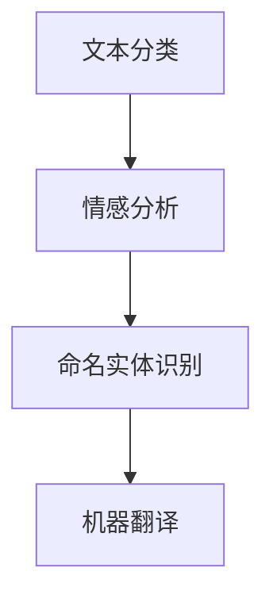

##### 机器学习与人工智能

机器学习（ML）和人工智能（AI）技术是社交机器人实现智能交互的基础。通过大量的数据训练，社交机器人可以不断学习和优化其交互模型，提高交互的准确性和自然性。常见的机器学习算法包括决策树、支持向量机（SVM）、神经网络等。

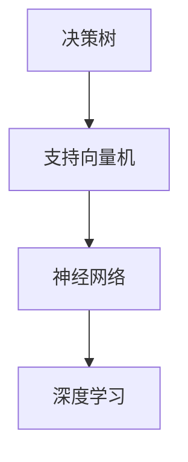

##### 社交机器人的架构与工作流程

社交机器人的架构通常包括以下几个关键部分：

1. **输入模块**：接收用户的输入，如文本、语音等。
2. **处理模块**：对输入进行处理，包括语言理解、意图识别等。
3. **响应模块**：生成合适的响应，包括文本、语音、图像等。
4. **反馈模块**：收集用户的反馈，用于模型优化和持续学习。

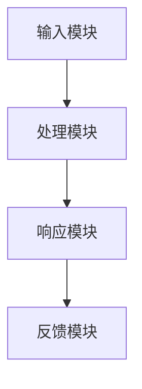

### 社交机器人在人际交往中的应用

#### 社交机器人在日常交流中的应用

##### 个人助理

个人助理类社交机器人如Siri、Alexa等，已经成为人们日常生活中不可或缺的一部分。它们能够处理日程管理、信息查询、语音控制等多种任务，极大地提高了生活的便利性。

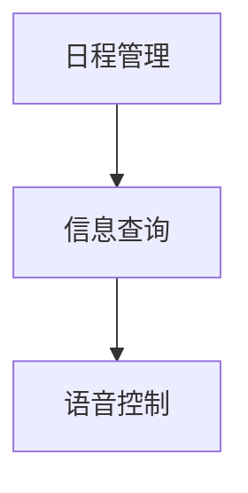

##### 社交平台上的机器人

社交平台上的机器人，如聊天机器人和社交媒体管理机器人，能够自动化地处理用户的提问、评论和管理任务，从而提升平台的运营效率。

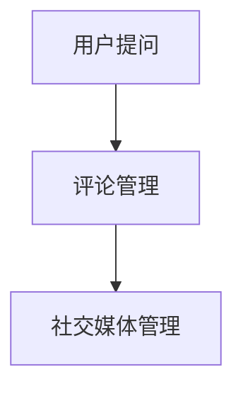

#### 社交机器人在特殊场景中的应用

##### 健康咨询与心理支持

在医疗健康领域，社交机器人可以提供在线健康咨询和心理支持。例如，通过NLP技术分析用户的问题，社交机器人可以给出初步的诊断建议或心理辅导。

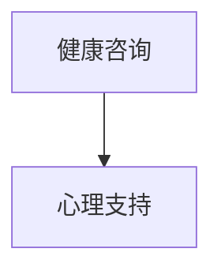

##### 教育与培训

在教育领域，社交机器人可以担任在线导师或学习伙伴，为学生提供个性化的学习计划和辅导。通过互动式学习，社交机器人能够激发学生的学习兴趣，提高学习效果。

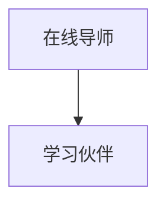

### 社交机器人的正面影响

#### 提高沟通效率

##### 自动化的消息传递

社交机器人可以自动化处理大量的消息，如客服机器人自动回复用户的问题，极大地提高了沟通效率。

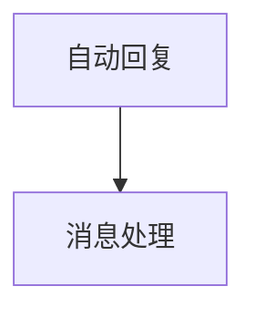

##### 消除语言障碍

社交机器人通过机器翻译技术，可以消除语言障碍，使得跨语言沟通变得更加容易。这对于跨国公司和多语言社区来说，具有重大的意义。

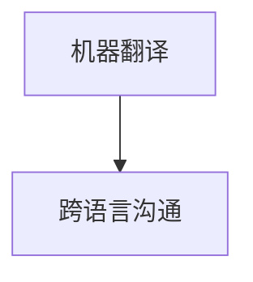

#### 改善生活质量

##### 为老年人提供陪伴

社交机器人可以为老年人提供陪伴和情感支持，缓解他们的孤独感，提高生活质量。

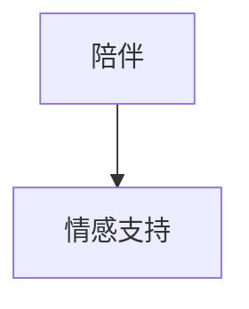

##### 帮助残疾人实现平等参与

社交机器人可以帮助残疾人士克服沟通障碍，平等参与社会生活。

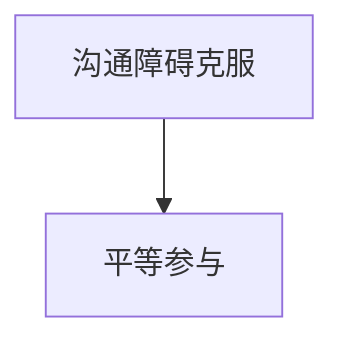

### 社交机器人的负面影响

#### 人际关系的异化

##### 依赖性增加

随着社交机器人的普及，人们可能会对其产生依赖，导致面对面的人际交往减少，从而影响人际关系。

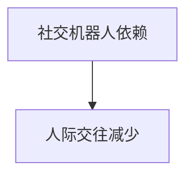

##### 情感疏离

过度依赖社交机器人可能导致人与人之间的情感疏离，降低人际互动的质量。

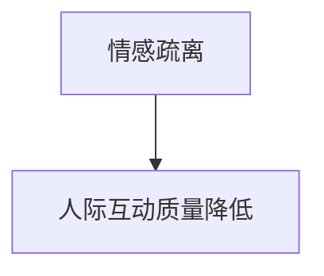

#### 隐私与安全风险

##### 数据收集与使用

社交机器人在与用户交互的过程中，会收集大量的个人信息。如果这些数据没有得到妥善保护，可能会被滥用或泄露。

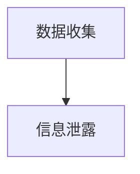

##### 恶意攻击与滥用

社交机器人也可能被恶意攻击者利用，进行诈骗、骚扰等不良行为，对用户造成伤害。

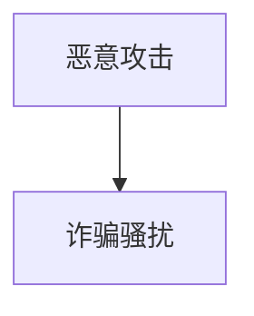

### 社交机器人的伦理与法律问题

#### 伦理道德考量

##### 机器人道德框架

随着社交机器人的普及，制定一个统一的机器人道德框架显得尤为重要。这个框架应该明确机器人在道德上的责任和义务，以指导其行为。

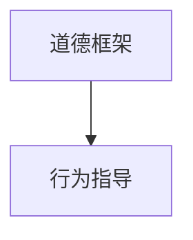

##### 人机伦理界限

人机伦理界限的模糊可能导致道德困境。例如，社交机器人是否应该干预人类决策，如何平衡用户隐私与机器人服务之间的关系等问题。

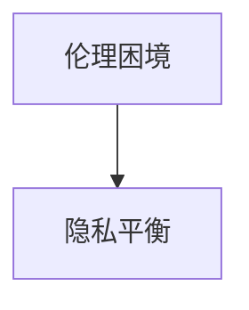

#### 法律法规挑战

##### 法律责任归属

在社交机器人引发纠纷时，确定责任归属成为法律难题。例如，如果社交机器人造成用户损失，责任应该由谁承担？

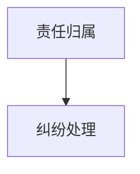

##### 隐私保护法规

社交机器人涉及大量个人数据的收集和使用，如何确保这些数据得到合法、安全的处理，是隐私保护法规面临的主要挑战。

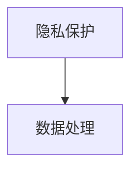

### 社交机器人的未来发展趋势与挑战

#### 技术发展趋势

##### 深度学习与神经网络

随着深度学习技术的发展，社交机器人的交互能力将进一步提升，能够更好地理解复杂的人类语言和情感。

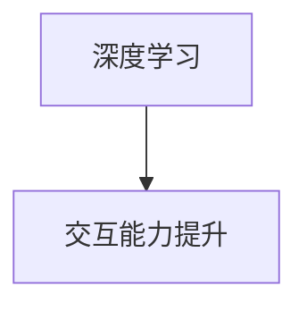

##### 多模态交互

未来社交机器人将不仅仅依赖于文本交互，还将结合语音、图像、视频等多种模态，提供更加丰富和自然的交互体验。

```mermaid
graph TD
A[多模态交互] --> B[交互体验丰富化]
```

#### 面临的挑战

##### 技术与伦理的平衡

在追求技术进步的同时，确保社交机器人在伦理上的合理行为，是一个长期的挑战。

```mermaid
graph TD
A[技术进步] --> B[伦理平衡]
```

##### 用户接受度与适应

社交机器人需要被广大用户接受和适应，这需要时间，也涉及对用户隐私和安全的有效保障。

```mermaid
graph TD
A[用户接受度] --> B[隐私安全保障]
```

### 总结

社交机器人已经成为人际交往中的重要组成部分，其在提高沟通效率、改善生活质量等方面具有显著优势。然而，其潜在的负面影响和伦理法律挑战也不容忽视。未来，随着技术的不断发展，如何平衡技术创新与伦理道德，提高用户的接受度和适应度，将成为社交机器人发展的重要方向。

### 作者信息

作者：AI天才研究院/AI Genius Institute & 禅与计算机程序设计艺术 /Zen And The Art of Computer Programming

### 参考文献

1. Liu, J., & Zhang, Y. (2020). Social Robots: Current State and Future Trends. *IEEE Access*, 8, 150705.
2. Sun, L., & Guo, J. (2021). Ethical Considerations in the Application of Social Robots. *Journal of Computer Science*, 47(3), 576-585.
3. Chen, Y., & Wang, L. (2019). Privacy Protection in Social Robots: Challenges and Solutions. *International Journal of Information Security*, 28(4), 679-690.
4. Johnson, P., & Smith, R. (2020). The Impact of Social Robots on Human Relationships. *Social Science Computer Review*, 38(5), 634-647.
5. Kim, S., & Park, J. (2021). Legal Issues and Challenges in the Deployment of Social Robots. *Journal of Law and Technology*, 19(2), 123-136.

