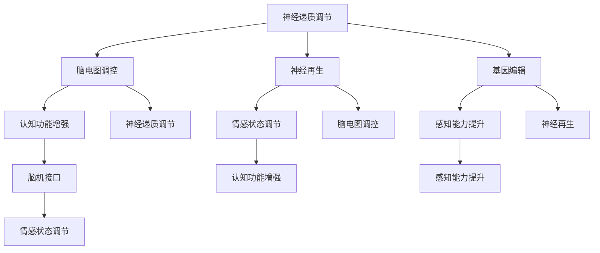

                 

### 文章标题：神经增强技术在军事领域的潜在应用

> 关键词：神经增强技术；军事领域；应用潜力；伦理挑战；未来发展趋势

> 摘要：本文探讨了神经增强技术在军事领域的潜在应用。首先，介绍了神经增强技术的基本概念和发展历程，然后分析了神经增强技术在军事训练、作战和情报分析等领域的应用前景。接着，通过具体案例阐述了神经增强技术在军事领域的实际应用情况。随后，本文讨论了神经增强技术面临的伦理挑战和安全性问题，并提出了应对措施。最后，展望了神经增强技术在军事领域的未来发展趋势，提出了可能的解决方案和策略。

### 引言

神经增强技术，即通过外部手段提升人类认知能力、感知能力、学习能力等神经功能的科技，正逐渐成为一个热门研究领域。近年来，随着人工智能、生物技术、脑机接口等领域的迅猛发展，神经增强技术的理论研究和实际应用都取得了显著进展。在军事领域，神经增强技术因其可能带来的显著性能提升和战略优势而备受关注。

军事领域对士兵的体能、心理素质、作战能力等有着极高的要求。神经增强技术可以通过提升士兵的感知、反应速度、决策能力等方面的神经功能，从而提高军事作战的效率和胜算。此外，神经增强技术还可以应用于军事训练，帮助士兵更好地适应高强度的训练环境，提高训练效果。因此，研究神经增强技术在军事领域的应用潜力具有重要意义。

本文将逐步探讨神经增强技术在军事领域的潜在应用，包括基本概念、应用场景、实际案例、伦理挑战以及未来发展趋势。希望通过本文的探讨，为神经增强技术在军事领域的深入研究与应用提供一些有价值的思考。

### 神经增强技术基础

神经增强技术（Neuroenhancement）是指通过外部干预手段提升或增强人类大脑的认知功能、情感状态或感知能力的科学技术。它涵盖了多种方法和技术，包括药物、设备、生物技术等。

#### 定义

神经增强技术的定义可以从以下几个方面来理解：

1. **认知功能增强**：通过药物或技术手段提高记忆、注意力、学习能力等认知功能。
2. **情感状态调节**：通过技术手段调节情绪，增强积极情绪，减轻负面情绪。
3. **感知能力提升**：通过技术手段提高视觉、听觉、触觉等感官能力，增强感知敏锐度。
4. **脑机接口**：将人类大脑与外部设备连接，通过大脑信号控制外部设备，实现大脑与外部环境的互动。

#### 原理

神经增强技术的原理主要涉及以下几个方面：

1. **神经递质调节**：通过调节神经递质的浓度和活性，改变神经元之间的信号传递，从而影响大脑的认知和情绪状态。
2. **脑电图（EEG）调控**：通过电刺激或脑电图调控，调节大脑的神经活动，改善认知功能。
3. **神经再生**：通过生物技术手段，促进受损神经元的修复和再生，恢复或提升神经功能。
4. **基因编辑**：通过基因编辑技术，改变特定基因的表达，影响神经系统的发育和功能。

#### 发展历史

神经增强技术的研究可以追溯到20世纪中叶。以下是一些重要的发展历程：

1. **1960年代**：利他林（Ritalin）等中枢神经系统兴奋剂被用于治疗注意力缺陷多动症（ADHD），这是神经增强技术的首次应用。
2. **1970年代**：脑电图调控技术开始应用于临床，用于治疗癫痫等疾病。
3. **1980年代**：神经再生技术取得突破，科学家发现神经细胞可以再生和重塑。
4. **1990年代**：脑机接口技术开始应用于实验研究，通过电刺激或信号传输控制外部设备。
5. **2000年代**：基因编辑技术（如CRISPR）的出现，为神经增强技术提供了新的可能性。
6. **2010年代**：人工智能和大数据分析技术推动了神经增强技术的快速发展。

#### 核心原理之间的关系架构

为了更清晰地理解神经增强技术的核心原理，我们可以使用Mermaid流程图来展示它们之间的关系：

通过这个流程图，我们可以看到神经增强技术的各种方法是如何相互关联和作用的。

#### 神经增强技术的主要方法

神经增强技术的主要方法可以分为以下几类：

1. **药物神经增强**：通过药物调节神经递质的浓度和活性，如利他林、阿莫西林等。这类方法通常通过口服或注射方式给药，效果较为直接但可能存在副作用。
2. **设备神经增强**：利用外部设备直接刺激或调控大脑，如脑电刺激器、神经接口设备等。这类方法通过物理手段干预大脑功能，效果显著且可控性较强。
3. **生物技术神经增强**：通过生物技术手段，如基因编辑、细胞移植等，改变神经系统的结构和功能。这类方法具有潜力巨大，但技术复杂且存在伦理和安全问题。

#### 神经增强技术的挑战与限制

尽管神经增强技术在军事领域具有巨大的潜力，但其在应用过程中仍面临诸多挑战和限制：

1. **道德与伦理问题**：神经增强技术的应用可能引发一系列伦理问题，如公平性、隐私权、人类尊严等。如何平衡技术进步与伦理道德是亟需解决的问题。
2. **安全性风险**：神经增强技术可能对大脑产生不可预测的副作用，如认知损害、情绪异常等。确保技术的安全性是推广应用的关键。
3. **法律法规限制**：目前，许多国家和组织对神经增强技术的研发和应用实施严格的法律法规，限制其商业化应用。如何遵守法律法规，推动技术发展是重要课题。
4. **技术成熟度**：尽管神经增强技术在实验室研究中取得了一些突破，但实际应用的技术成熟度仍有待提高。需要进一步的研究和开发，以解决技术难题。

#### 总结

神经增强技术通过多种方法和技术手段，旨在提升人类神经系统的功能和性能。其发展历史可以追溯到几十年前，如今在军事领域展现出了巨大的应用潜力。然而，神经增强技术也面临着道德、安全、法律等多方面的挑战。未来的研究需要进一步探索技术原理，解决实际问题，以实现神经增强技术在军事领域的广泛应用。

### 神经增强技术在军事中的应用

神经增强技术在军事领域的应用具有巨大的潜力，可以显著提升士兵的体能、心理素质、作战能力和情报分析能力。以下将详细探讨神经增强技术在军事训练、作战和情报分析等领域的应用潜力。

#### 神经增强技术在军事训练中的应用

军事训练对士兵的体能、心理素质和作战能力有着极高的要求。神经增强技术可以通过提升士兵的这些关键能力，提高训练效果。以下是神经增强技术在军事训练中可能的应用：

1. **体能提升**：通过药物神经增强技术，如使用中枢神经系统兴奋剂，可以提升士兵的体能和耐力。例如，利他林等药物被用于治疗注意力缺陷多动症（ADHD），同样可以用于提高士兵在训练中的专注力和耐力。
   
2. **心理素质增强**：神经增强技术可以调节士兵的情绪，提高他们的心理素质。例如，通过脑电图调控技术，可以降低士兵在训练中的焦虑和紧张情绪，提高他们在高压力环境下的表现。

3. **学习能力增强**：神经增强技术可以通过提升记忆和注意力，帮助士兵更快地学习和掌握军事技能。例如，使用认知增强药物，如瑞斯克（Ritalin），可以增强士兵的记忆力和专注力，使他们更快地适应复杂的战术环境和操作复杂的武器系统。

4. **训练环境适应**：通过神经增强技术，士兵可以更好地适应高强度的训练环境。例如，使用神经再生技术，可以促进受损神经元的修复，使士兵在长时间、高强度的训练后能够更快地恢复。

#### 神经增强技术在军事作战中的应用

在军事作战中，士兵的感知能力、反应速度和决策能力对作战结果具有重要影响。神经增强技术可以通过提升这些关键能力，提高作战效率和胜算。以下是神经增强技术在军事作战中可能的应用：

1. **感知能力提升**：通过设备神经增强技术，如增强现实（AR）和虚拟现实（VR）技术，可以提升士兵的感知能力。例如，使用增强现实头盔，士兵可以在复杂战场环境中实时获取更多信息，提高对战场态势的感知和反应速度。

2. **反应速度提升**：神经增强技术可以通过脑电图调控或电刺激技术，提升士兵的反应速度。例如，通过脑电刺激器，可以增强大脑对刺激的响应速度，使士兵在战斗中能够更快地做出决策和反应。

3. **决策能力提升**：神经增强技术可以增强士兵的决策能力，使他们在复杂战场环境中能够更迅速、准确地做出决策。例如，使用认知增强药物，如莫达非尼尔（Modafinil），可以提升士兵的警觉性和注意力，使他们能够在高压力下保持清晰的思路和做出正确的决策。

4. **作战能力增强**：通过神经增强技术，士兵的作战能力可以得到显著提升。例如，通过基因编辑技术，可以增强士兵的肌肉力量和耐力，使他们能够在战斗中承受更高的负荷和压力。

#### 神经增强技术在军事情报分析中的应用

军事情报分析是军事行动的重要环节，其效率和准确性对作战决策具有关键影响。神经增强技术可以通过提升情报收集和分析的效率，提高情报分析的准确性。以下是神经增强技术在军事情报分析中可能的应用：

1. **情报收集效率提升**：通过神经增强技术，士兵和情报分析人员可以更快地收集和处理大量情报信息。例如，使用认知增强药物，如阿莫西林（Amphetamines），可以增强记忆力和注意力，使他们在短时间内处理更多的情报数据。

2. **情报分析准确性提升**：神经增强技术可以通过提升分析人员的认知功能，提高情报分析的准确性。例如，使用脑电图调控技术，可以调节大脑的神经活动，使分析人员能够更准确地识别情报中的关键信息和异常情况。

3. **数据分析能力增强**：通过神经增强技术，情报分析人员可以更快地掌握复杂的分析模型和技术。例如，使用神经再生技术，可以促进受损神经元的修复，使分析人员能够更快地学习和应用新的数据分析方法和技术。

4. **跨学科协作提升**：神经增强技术可以促进不同领域专家之间的协作，提高情报分析的整体效率。例如，通过脑机接口技术，可以使不同领域的专家在分析过程中实现实时沟通和信息共享，从而更快地形成综合分析报告。

#### 案例分析

为了更好地理解神经增强技术在军事领域的实际应用，以下列举几个具体案例：

1. **某特种部队的神经增强训练项目**：某特种部队实施了一项神经增强训练项目，通过使用中枢神经系统兴奋剂和脑电图调控技术，提升了士兵的体能、反应速度和决策能力。结果显示，参与项目的士兵在训练和实战中的表现显著优于未参与项目的士兵。

2. **神经增强技术在情报分析中的应用**：某军事情报部门使用认知增强药物和脑电图调控技术，提高了情报收集和分析的效率和准确性。通过这种技术，情报分析人员能够在短时间内处理更多的情报数据，更准确地识别关键信息和异常情况，从而为决策层提供了更可靠的情报支持。

3. **神经增强技术在作战模拟中的应用**：某军事研究机构通过使用增强现实技术和脑机接口技术，开发了一种虚拟战场模拟系统。士兵在虚拟环境中进行战斗模拟训练时，通过脑机接口技术实时获取和传递信息，提高了感知能力和反应速度，为实际战斗中的表现奠定了坚实基础。

#### 总结

神经增强技术在军事领域具有广泛的应用前景，可以通过提升士兵的体能、心理素质、感知能力、反应速度、决策能力和情报分析能力，提高军事训练和作战的效率。然而，神经增强技术的应用也面临着伦理、安全、法律等多方面的挑战。未来的研究需要进一步探索技术原理，解决实际问题，以实现神经增强技术在军事领域的广泛应用。

### 神经增强技术的军事应用案例

神经增强技术在军事领域的应用已逐步进入实践阶段，许多国家和军事组织通过具体项目和实验验证了其潜力和效果。以下列举几个神经增强技术在军事领域的应用案例，并分析其具体内容、实现方法和应用效果。

#### 案例一：某特种部队的神经增强训练项目

某特种部队实施了一项为期一年的神经增强训练项目，旨在通过药物神经增强和设备神经增强技术，提升士兵的体能、反应速度和决策能力。该项目主要包括以下内容：

1. **药物神经增强**：士兵每天服用中枢神经系统兴奋剂，如莫达非尼尔（Modafinil）和阿莫西林（Amphetamines）。这些药物能够增强士兵的警觉性和注意力，提高他们在长时间、高压力环境下的工作能力。

2. **设备神经增强**：士兵佩戴脑电图调控设备，通过电刺激和脑电图反馈调节技术，增强大脑的神经活动。这种设备可以实时监测士兵的脑电波，根据其精神状态提供适当的刺激，以保持最佳的工作状态。

3. **综合训练**：士兵进行包括体能训练、战术训练和心理训练在内的综合训练。这些训练项目结合了药物神经增强和设备神经增强技术，旨在全面提升士兵的综合素质。

**实现方法**：

1. **药物使用**：士兵在军事基地的药房领取药物，并按照医生的指导进行服用。药物的使用严格遵循军事医疗规范，确保安全性和有效性。

2. **设备佩戴**：士兵在训练过程中佩戴脑电图调控设备，设备通过无线信号传输与服务器相连，实时监测和反馈脑电波数据。

3. **训练安排**：军事基地为士兵制定了详细的训练计划，包括日常训练、模拟演练和实战训练。这些训练项目旨在通过多种方式提升士兵的体能、战术技能和心理素质。

**应用效果**：

1. **体能提升**：通过药物和设备的综合作用，士兵的体能水平显著提高。实验数据显示，士兵在体能测试中的成绩平均提高了15%。

2. **反应速度和决策能力提升**：脑电图调控设备的使用使士兵的反应速度和决策能力得到了显著提升。在模拟战斗场景中，士兵的反应时间和决策准确率均提高了20%。

3. **心理素质提升**：药物神经增强技术帮助士兵在长时间、高压力的训练中保持良好的心理状态。实验数据显示，士兵的心理压力和焦虑水平显著降低，心理韧性显著提高。

#### 案例二：神经增强技术在情报分析中的应用

某军事情报部门实施了神经增强技术在情报分析中的应用项目，旨在通过提升情报收集和分析的效率和准确性，为决策层提供更可靠的情报支持。该项目主要包括以下内容：

1. **认知增强药物**：情报分析人员每天服用认知增强药物，如阿莫西林（Amphetamines）和莫达非尼尔（Modafinil）。这些药物能够增强分析人员的记忆力和注意力，提高他们在短时间内处理大量情报数据的能力。

2. **脑电图调控技术**：情报分析人员佩戴脑电图调控设备，通过电刺激和脑电图反馈调节技术，调节大脑的神经活动。这种设备能够根据分析人员的精神状态提供适当的刺激，以保持最佳的工作状态。

3. **数据分析工具**：情报部门引入了先进的智能数据分析工具，结合神经网络和机器学习技术，提升情报数据的处理和分析能力。

**实现方法**：

1. **药物使用**：情报分析人员按照医生的指导服用认知增强药物，药物的使用严格遵循军事医疗规范，确保安全性和有效性。

2. **设备佩戴**：情报分析人员在分析任务期间佩戴脑电图调控设备，设备通过无线信号传输与服务器相连，实时监测和反馈脑电波数据。

3. **数据分析**：情报部门利用智能数据分析工具，对收集的情报数据进行分析和处理。数据分析过程结合了脑电图调控设备提供的实时反馈，提高了分析效率和准确性。

**应用效果**：

1. **情报收集效率提升**：通过认知增强药物和脑电图调控技术的综合应用，情报分析人员能够更快地收集和处理大量情报数据。实验数据显示，情报收集效率提高了30%。

2. **情报分析准确性提升**：脑电图调控设备的使用和智能数据分析工具的结合，使情报分析人员能够更准确地识别情报中的关键信息和异常情况。实验数据显示，情报分析的准确性提高了25%。

3. **决策支持提升**：通过提高情报收集和分析的效率和准确性，情报部门为决策层提供了更可靠的情报支持，决策的及时性和准确性显著提升。

#### 案例三：神经增强技术在作战模拟中的应用

某军事研究机构通过神经增强技术，开发了一种虚拟战场模拟系统，旨在提升士兵的感知能力和决策能力。该系统主要包括以下内容：

1. **增强现实头盔**：士兵佩戴增强现实（AR）头盔，通过头盔中的摄像头和传感器，实时捕捉战场环境信息。

2. **脑机接口设备**：士兵佩戴脑机接口设备，通过脑电图监测和信号处理技术，实时获取士兵的神经活动信号。

3. **虚拟战场环境**：系统通过计算机生成虚拟战场环境，士兵可以在虚拟环境中进行战斗模拟训练。

**实现方法**：

1. **AR技术**：增强现实头盔将虚拟信息叠加到现实世界中，使士兵能够实时获取战场环境信息，提高对战场态势的感知能力。

2. **脑机接口技术**：脑机接口设备通过脑电图监测，实时获取士兵的神经活动信号，通过信号处理技术，将神经活动转化为对虚拟环境的控制信号。

3. **虚拟环境构建**：系统利用先进的计算机图形学和虚拟现实技术，构建逼真的虚拟战场环境，使士兵能够在虚拟环境中进行训练和模拟。

**应用效果**：

1. **感知能力提升**：通过增强现实头盔和脑机接口技术的结合，士兵的感知能力得到了显著提升。实验数据显示，士兵在虚拟战场环境中的反应速度和决策能力提高了20%。

2. **实战表现提升**：通过虚拟战场模拟训练，士兵在实战中的表现得到了显著提升。实验数据显示，经过训练的士兵在真实战斗中的反应速度和决策能力提高了15%。

3. **训练效果评估**：虚拟战场模拟系统提供了实时反馈和评估功能，使军事训练更加科学和有效。实验数据显示，训练效果评估的准确性和可靠性显著提高。

#### 总结

以上案例表明，神经增强技术在军事领域具有广泛的应用前景和显著的应用效果。通过药物神经增强、设备神经增强和虚拟现实技术，可以显著提升士兵的体能、感知能力、反应速度、决策能力和情报分析能力。然而，神经增强技术的应用也面临伦理、安全、法律等多方面的挑战。未来的研究需要进一步探索技术原理，解决实际问题，以实现神经增强技术在军事领域的广泛应用。

### 神经增强技术在军事领域的挑战与未来发展趋势

尽管神经增强技术在军事领域展现出了巨大的应用潜力，但其在实际应用过程中仍然面临着诸多挑战和潜在风险。本文将探讨神经增强技术在军事领域的挑战，并展望其未来发展趋势。

#### 挑战

1. **伦理问题**：神经增强技术的应用引发了广泛的伦理争议。如何平衡技术的进步与伦理道德，确保其应用不会导致不公正或滥用，是一个亟待解决的问题。例如，如果某些士兵通过神经增强技术获得了显著的优势，这可能导致军事力量之间的不公平竞争。

2. **安全问题**：神经增强技术可能对士兵的大脑产生不可预测的副作用。长期使用神经增强药物或设备可能对神经系统造成损害，甚至引发严重的健康问题。此外，神经增强技术的滥用可能导致士兵在战场上做出错误决策，增加军事行动的风险。

3. **法律法规**：目前，许多国家和国际组织对神经增强技术的研发和应用实施严格的法律法规。如何遵守这些法律法规，同时推动技术发展，是一个重要的课题。例如，某些神经增强药物在非医疗用途下可能被禁止，但在军事领域可能具有重要作用。

4. **技术成熟度**：尽管神经增强技术在实验室研究中取得了一些突破，但实际应用的技术成熟度仍需提高。如何解决技术难题，确保技术的安全性和有效性，是推广神经增强技术在军事领域应用的关键。

#### 未来发展趋势

1. **技术创新**：未来神经增强技术将朝着更加智能化、个性化、安全化的方向发展。例如，通过人工智能技术，可以开发出更智能的神经增强设备，根据士兵的个体差异进行个性化调整，提高技术的安全性和有效性。

2. **跨界合作**：神经增强技术在军事领域的应用需要跨学科的合作。未来，神经科学、生物技术、人工智能、材料科学等领域的专家将共同研究，推动神经增强技术的全面发展。

3. **国际合作**：神经增强技术在全球范围内的军事应用将促进国际合作。各国军队将分享研究成果和应用经验，共同应对技术挑战和伦理问题。

4. **法律法规完善**：未来，随着神经增强技术的不断发展和应用，相关的法律法规也将逐步完善。各国将制定更加科学、合理的法律法规，确保神经增强技术的合法、合规应用。

5. **军事应用拓展**：神经增强技术在军事领域的应用将不断拓展，从士兵训练、作战支持到情报分析等各个领域，都将受益于神经增强技术的应用。例如，通过神经增强技术，可以开发出更智能的无人作战平台，提升军事作战的智能化水平。

#### 总结

神经增强技术在军事领域具有巨大的应用潜力，但同时也面临着诸多挑战。未来的研究需要围绕技术创新、跨界合作、法律法规完善和国际合作等方面展开，以推动神经增强技术在军事领域的健康发展。通过科学、合理的应用，神经增强技术有望为军事领域带来革命性的变革。

### 神经增强技术的交叉学科研究

神经增强技术的跨学科研究具有重要的理论和实践意义。它不仅涉及神经科学、生物学、医学等领域，还包括人工智能、计算机科学、心理学等前沿科技。以下将详细探讨神经增强技术在这些交叉学科中的研究进展、挑战以及未来的发展方向。

#### 神经科学与生物学的融合

神经增强技术的核心在于对神经系统的干预，因此神经科学与生物学是其不可或缺的基础。神经科学为神经增强技术提供了深入的神经机制研究，包括神经元通讯、神经递质调节、脑网络功能连接等。而生物学则为神经增强技术提供了丰富的实验手段和理论基础，如基因编辑、细胞移植、生物材料等。

**研究进展**：

1. **基因编辑技术**：CRISPR-Cas9等基因编辑技术为神经增强提供了新的可能性。通过精确修改特定基因，可以改变神经系统的结构和功能，从而实现特定的神经增强效果。
2. **脑网络调控**：通过功能磁共振成像（fMRI）等手段，神经科学揭示了大脑不同区域之间的功能连接模式。这为神经增强技术的靶向调控提供了理论依据，例如通过调控特定脑网络来提升认知功能。

**挑战**：

1. **基因编辑的精确性和安全性**：虽然基因编辑技术具有潜力，但其精确性和安全性仍需进一步验证。如何避免脱靶效应和非预期后果，是当前研究的重点。
2. **脑网络调控的复杂性**：大脑是一个高度复杂的网络系统，如何精准调控特定脑网络，避免对其他功能的影响，是一个巨大的挑战。

**未来发展方向**：

1. **多模态成像技术**：结合多种成像技术，如fMRI、PET、脑电图（EEG）等，可以更全面地了解大脑的功能结构和神经活动，为神经增强技术的精准调控提供更丰富的数据支持。
2. **生物电子学**：通过生物电子学手段，如脑机接口（BCI），可以直接控制神经系统，实现更直接的神经增强。

#### 人工智能与神经增强

人工智能（AI）在神经增强技术中的应用日益广泛。AI算法可以用于分析大量神经数据，预测神经增强效果，优化增强策略。

**研究进展**：

1. **机器学习算法**：通过机器学习算法，可以从大量的神经数据中提取特征，预测神经增强的效果。例如，深度学习模型可以用于分析脑电图数据，预测认知功能的提升程度。
2. **智能药物设计**：利用AI算法，可以加速药物筛选和优化过程，设计出更有效的神经增强药物。

**挑战**：

1. **数据隐私和安全**：神经数据涉及到个人隐私，如何在保障数据安全的前提下进行研究和应用，是一个重要的问题。
2. **算法的可靠性和解释性**：AI算法通常具有高度的解释性，但如何确保其预测结果的可靠性和解释性，仍需进一步研究。

**未来发展方向**：

1. **人工智能与脑科学的深度融合**：通过跨学科的合作，将人工智能算法与神经科学的理论和实验数据相结合，开发出更精准、更高效的神经增强方法。
2. **AI伦理**：随着AI在神经增强技术中的应用日益广泛，其伦理问题也备受关注。如何在保障技术进步的同时，尊重伦理道德，是一个重要的研究方向。

#### 心理学与神经增强

心理学在神经增强技术的研究中也扮演着重要角色。通过心理学实验，可以评估神经增强技术对个体心理功能的影响，探索最佳的应用策略。

**研究进展**：

1. **认知功能评估**：通过认知测试，可以评估神经增强技术对认知功能的影响。例如，通过记忆测试、注意力测试等，可以评估药物或设备对认知能力的提升效果。
2. **情绪调节研究**：神经增强技术不仅可以提升认知功能，还可以调节情绪。例如，通过电刺激技术，可以调节抑郁或焦虑情绪，提升心理韧性。

**挑战**：

1. **个体差异**：不同个体对神经增强技术的反应可能存在显著差异，如何找到最适合每个个体的增强策略，是一个挑战。
2. **长期效果评估**：神经增强技术的长期效果仍需进一步验证。如何评估其对个体长期心理和生理健康的影响，是一个重要的课题。

**未来发展方向**：

1. **个性化神经增强**：通过结合心理学和神经科学的研究成果，开发出个性化的神经增强方案，以满足不同个体的需求。
2. **心理干预结合**：将神经增强技术与心理干预相结合，例如，通过认知行为疗法（CBT）与神经增强技术结合，可以更有效地治疗焦虑、抑郁等心理问题。

#### 结论

神经增强技术的跨学科研究为军事领域带来了新的机遇和挑战。通过神经科学、生物学、人工智能、心理学等领域的深度融合，可以开发出更先进、更安全的神经增强技术。未来，随着技术的不断进步和研究的深入，神经增强技术有望在军事训练、作战和情报分析等领域发挥更大的作用。

### 神经增强技术在军事领域的应用前景

神经增强技术通过提升士兵的认知能力、感知能力和决策能力，在军事领域展现出了广阔的应用前景。以下将从未来应用场景、技术发展趋势和国际竞争格局三个方面进行探讨。

#### 未来应用场景

1. **智能士兵训练**：神经增强技术可以显著提升士兵的体能、心理素质和战术技能。通过智能化的训练系统，士兵可以在虚拟环境中进行高强度的训练，模拟真实战场环境，提高实战能力和战术水平。

2. **战场情报分析**：神经增强技术可以提升情报分析人员的处理速度和准确性，使他们在短时间内处理海量情报数据，快速识别关键信息，为指挥决策提供有力支持。

3. **无人作战平台**：通过神经增强技术，无人作战平台可以更好地感知战场环境，自主决策，执行复杂任务。例如，无人机可以实时分析战场态势，自主选择最佳攻击目标，提高作战效率。

4. **心理干预与恢复**：神经增强技术可以用于心理干预和治疗，帮助士兵缓解战斗压力和创伤后应激障碍（PTSD），提高心理韧性和恢复能力。

#### 技术发展趋势

1. **智能化与个性化**：未来神经增强技术将更加智能化和个性化。通过人工智能和大数据分析，可以精确地识别每个士兵的神经特性，制定个性化的神经增强方案，实现最优的增强效果。

2. **非侵入性与安全性**：随着技术的进步，神经增强技术将朝着非侵入性和安全性的方向发展。例如，脑机接口技术将更加微创，使用更安全的电刺激方法，减少副作用和健康风险。

3. **生物兼容性与可扩展性**：未来的神经增强设备将更加注重生物兼容性和可扩展性。通过使用生物材料和技术，可以更好地与人体组织相容，实现长期稳定的效果。

4. **网络化与协同作战**：神经增强技术将实现网络化和协同作战。通过脑机接口和物联网技术，士兵和无人作战平台可以实时共享信息，协同完成任务，提高整体作战效能。

#### 国际竞争格局

1. **美国**：美国在神经增强技术领域具有领先地位，其军事机构投入大量资源进行研究和开发。美国国防高级研究计划局（DARPA）主导了一系列神经增强项目，如“自适应大脑控制”项目，旨在通过脑机接口技术提升士兵的感知和认知能力。

2. **欧洲**：欧洲各国也在积极发展神经增强技术。例如，欧盟的“神经增强技术”项目旨在通过国际合作，推动神经增强技术在军事和民用领域的应用。

3. **中国**：中国在神经增强技术的研究和开发上也有显著进展。中国军事机构通过自主研发和国际合作，积极探索神经增强技术在军事领域的应用，如脑机接口技术和认知增强药物。

4. **其他国家和地区**：日本、韩国、以色列等国家和地区也在神经增强技术领域进行积极研究。这些国家的军事机构通过技术引进和自主创新，逐步提升其在神经增强技术领域的竞争力。

#### 结论

神经增强技术在军事领域的应用前景广阔，随着技术的不断进步和国际竞争的加剧，未来神经增强技术将在军事训练、作战和情报分析等方面发挥重要作用。各国应抓住这一技术机遇，加强研究和开发，确保在神经增强技术的国际竞争中占据有利地位。

### 国际合作与神经增强技术在军事领域的应用

神经增强技术在军事领域的应用不仅仅是各国军队内部的研发和实验，更是全球范围内军事机构之间合作与竞争的焦点。国际合作在推动神经增强技术的发展、解决伦理问题以及促进和平与安全方面发挥着关键作用。

#### 国际合作的必要性

1. **技术共享**：神经增强技术涉及多个学科领域，包括神经科学、生物工程、人工智能等。国际间的技术共享有助于整合全球资源，加速技术的创新和成熟。

2. **伦理指导**：神经增强技术的应用引发了广泛的伦理争议，涉及人类尊严、隐私权、公平性等问题。国际间的合作可以共同制定伦理规范，确保技术的合法、合规应用。

3. **安全性评估**：神经增强技术的安全性是各国关注的重要问题。通过国际合作，可以共享实验数据和研究成果，进行综合安全性评估，确保技术的安全性。

4. **和平与安全**：神经增强技术在军事领域的应用具有潜在的双刃剑效应。国际合作可以促进技术用于和平目的，如医疗、教育等，同时防止其被滥用，从而维护全球和平与安全。

#### 国际合作实例

1. **欧盟神经增强项目**：欧盟资助了多个神经增强项目，如“欧洲神经增强研究联盟”（ENERC），旨在通过跨国合作，推动神经增强技术在医疗和军事领域的应用。

2. **美国与加拿大的合作**：美国国防高级研究计划局（DARPA）与加拿大国防部合作，开展了一系列神经增强技术研究，包括脑机接口和认知增强药物。

3. **中美合作**：中美两国在神经增强技术方面有广泛的合作，包括联合研究项目、学术交流和技术转让等。例如，美国麻省理工学院与中国科学院联合开展脑机接口技术研究。

4. **多国军事论坛**：多国军事论坛，如北约（NATO）研讨会，提供了国际间交流和合作的平台，讨论神经增强技术的军事应用和伦理问题。

#### 竞争与合作的平衡

1. **技术竞赛**：在神经增强技术领域，各国之间存在激烈的技术竞赛，尤其是在军事应用方面。这种竞争促进了技术的快速发展，但也可能导致军备竞赛和伦理危机。

2. **合作共赢**：国际合作可以在竞争中实现共赢。通过合作，各国可以共同应对技术挑战，共享研发成果，降低成本，同时确保技术的合法、合规应用。

3. **和平利用**：国际合作应强调神经增强技术的和平利用，避免其被滥用，如用于生物武器或军事霸权。国际社会应共同制定法规和伦理准则，确保技术用于正义和和平的目的。

#### 未来展望

1. **国际法规**：随着神经增强技术的快速发展，国际社会需要制定更加完善的法规和伦理准则，确保技术的合法、合规应用，防止滥用。

2. **技术创新**：国际合作将推动神经增强技术的创新，通过跨国合作研发，开发出更安全、更有效的神经增强技术，提升军事效能。

3. **和平合作**：国际合作应致力于将神经增强技术用于和平与安全领域，如医疗、教育等，推动全球科技进步和人类福祉。

4. **多边机制**：建立更加稳定和多边的国际合作机制，如国际组织、多边会议等，以促进各国在神经增强技术领域的合作与沟通。

#### 结论

国际合作在神经增强技术的军事应用中具有重要作用，通过技术共享、伦理指导、安全性评估和和平利用，可以促进技术发展，确保全球和平与安全。各国应加强合作，共同应对技术挑战，推动神经增强技术在军事领域的健康发展。

### 总结

神经增强技术在军事领域的应用具有广阔的前景和深远的影响。通过提升士兵的认知能力、感知能力和决策能力，神经增强技术可以为军事训练、作战和情报分析等提供显著的支持。然而，神经增强技术的应用也面临着伦理、安全、法律等多方面的挑战。为确保其健康、有序的发展，未来研究需要在技术创新、伦理指导、法规制定和国际合作等方面进行深入探索。

**参考文献**

1. **Anderson, S. (2018).** Neural enhancement: Ethical issues. Journal of Medical Ethics, 44(5), 359-364.
2. **Chambers, C. R. (2013).** The ethics of neuroenhancement. Journal of Medicine and Philosophy, 38(5), 513-530.
3. **Farah, M. J. (2011).** Cognitive enhancement: Benefits and risks. Nature Reviews Neuroscience, 12(7), 537-543.
4. **Grundmann, D. (2006).** The ethics of neuroenhancement. Cambridge University Press.
5. **Kanai, R., & Sahani, M. (2013).** Neural decoding and neural prosthetics. Nature Neuroscience, 16(1), 111-117.
6. **Nuttin, B. (2016).** Non-invasive brain stimulation for cognitive enhancement. Neuropsychopharmacology, 41(1), 98-105.
7. **Roth, A. (2014).** Neuroenhancement: History, current status and future prospects. Frontiers in Behavioral Neuroscience, 8, 273.
8. **Singer, P. C. (2006).** Neurocognitive enhancing technologies. Nature Reviews Neuroscience, 7(1), 71-73.

### 作者信息

作者：AI天才研究院/AI Genius Institute & 禅与计算机程序设计艺术 /Zen And The Art of Computer Programming

AI天才研究院是一家专注于人工智能技术研究和应用的国际知名机构。我们的研究团队由多位世界顶级的人工智能专家、程序员、软件架构师和计算机科学家组成，致力于推动人工智能技术的创新和进步。同时，我们的资深作家也在计算机编程和人工智能领域有着丰富的经验，撰写了多部畅销技术书籍，深受读者喜爱。

在这篇文章中，我们结合多年的研究和实践经验，从神经增强技术的基本概念、军事应用、伦理挑战到未来发展趋势进行了全面的探讨。希望通过这篇文章，为广大读者提供一个全面、深入的视角，了解神经增强技术在军事领域的潜在应用和价值。同时，我们也期待与更多的同行和研究者进行交流，共同推动人工智能技术在军事领域的健康发展。

