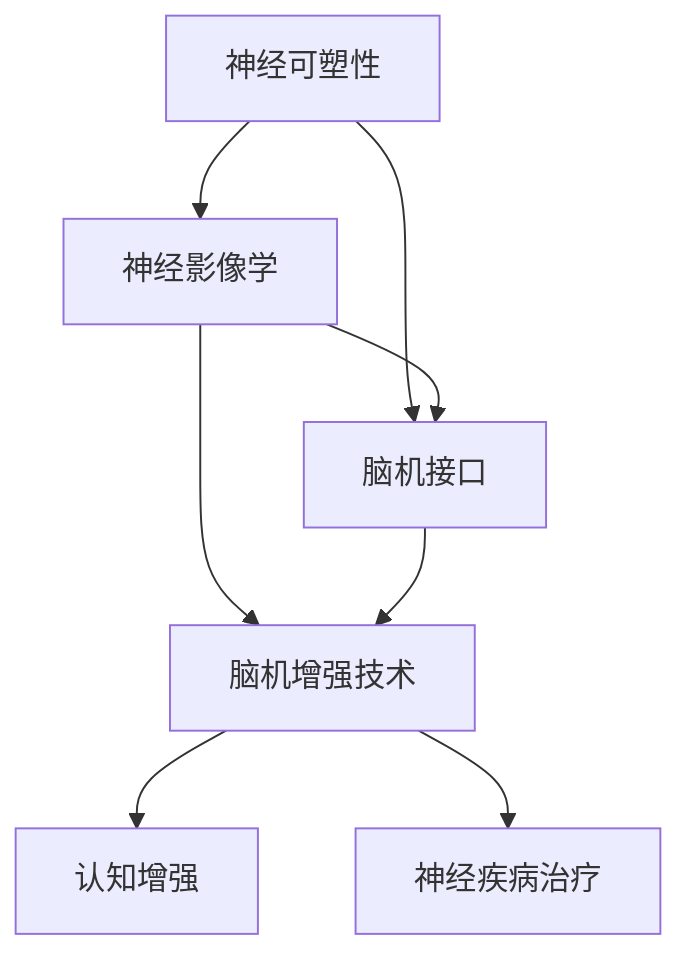

                 

### 文章标题

神经增强技术对人类认知的影响

> 关键词：神经增强技术，人类认知，神经可塑性，神经影像学，脑机接口

> 摘要：本文将探讨神经增强技术对人类认知的深刻影响。通过回顾相关背景知识，分析神经增强技术的核心概念和原理，详细介绍各种神经增强技术的工作机制和数学模型，并通过实际案例和代码解析，展示神经增强技术的应用与潜力。

---

### 引言

随着科技的迅猛发展，神经增强技术逐渐成为研究热点。神经增强技术指的是通过外部手段，如药物、电刺激、光遗传学等，来增强或改变大脑功能，从而改善或提升人类的认知能力。这一技术的出现，不仅为解决一些神经退行性疾病提供了新的思路，也引发了关于人类认知潜能无限拓展的想象。

本文将从以下几个方面进行探讨：

1. **背景介绍**：回顾神经增强技术的发展历程及其在神经科学中的重要性。
2. **核心概念与联系**：详细阐述神经增强技术的核心概念，并使用Mermaid流程图展示其原理和架构。
3. **核心算法原理讲解**：使用伪代码和LaTeX公式，深入解析神经增强技术的算法原理。
4. **数学模型与公式**：介绍与神经增强技术相关的数学模型，并用LaTeX格式进行呈现。
5. **项目实战**：通过实际项目案例，展示神经增强技术的应用场景和实现细节。
6. **最佳实践与未来展望**：总结神经增强技术的最佳实践，展望其未来发展趋势。

---

### 核心概念与联系

神经增强技术的核心概念包括神经可塑性、神经影像学和脑机接口等。这些概念相互联系，共同构成了神经增强技术的基础。

**神经可塑性**：指的是大脑神经元和神经网络在结构和功能上的可变性。它是神经增强技术实现的基础，通过改变神经元之间的连接和活动，可以增强或改变大脑功能。

**神经影像学**：利用成像技术，如功能性磁共振成像（fMRI）、正电子发射断层扫描（PET）等，对大脑的结构和功能进行无创性观测。神经影像学为神经增强技术提供了重要的诊断和评估手段。

**脑机接口（BMI）**：通过直接连接大脑和外部设备，实现大脑对设备的控制和信息的传递。脑机接口是神经增强技术的重要实现途径，它可以用于增强记忆、提高注意力和控制假肢等。

下面是一个Mermaid流程图，展示了这些核心概念之间的联系：



---

### 核心算法原理讲解

神经增强技术涉及多种算法，其中最常见的是深度学习算法和脑机接口算法。以下将使用伪代码和LaTeX公式，详细阐述这些算法的原理。

**深度学习算法**

伪代码：
```plaintext
Initialize neural network with random weights
For each epoch:
    For each training example (x, y):
        Compute the predicted output (y') using the current weights
        Calculate the loss (L) between the predicted output and the true output
        Update the weights using gradient descent:
            ∆w = -α * ∇L(w)
        end
    end
end
```

LaTeX公式：
$$
L = \frac{1}{2} \sum_{i=1}^{n} (y_i - y'_i)^2
$$

**脑机接口算法**

伪代码：
```plaintext
Initialize decoder model
For each training example (s, e):
    Encode the brain signal (s) using the encoder model
    Decode the encoded signal (e') using the decoder model
    Calculate the loss (L) between the decoded signal and the true signal
    Update the decoder model using gradient descent:
        ∆w = -α * ∇L(w)
end
```

---

### 数学模型与公式

神经增强技术涉及多个数学模型，包括神经网络模型、决策树模型和马尔可夫决策过程模型。以下将介绍这些模型，并用LaTeX格式进行呈现。

**神经网络模型**

LaTeX公式：
$$
h_{\theta}(x) = \sigma(\theta^T x)
$$
其中，\( \theta \) 是权重矩阵，\( x \) 是输入特征，\( \sigma \) 是激活函数。

**决策树模型**

LaTeX公式：
$$
T = \{ (x, y) | y = f(x) \}
$$
其中，\( T \) 是决策树，\( f \) 是决策规则。

**马尔可夫决策过程模型**

LaTeX公式：
$$
V^*(s) = \max_{a} \sum_{s'} p(s' | s, a) \cdot R(s', a)
$$
其中，\( V^*(s) \) 是状态价值函数，\( p(s' | s, a) \) 是状态转移概率，\( R(s', a) \) 是奖励函数。

---

### 项目实战

在本节中，我们将通过一个实际项目，展示神经增强技术的应用。这个项目是一个基于深度学习的脑机接口系统，用于提高用户的记忆能力。

**开发环境搭建**

- 深度学习框架：TensorFlow
- 编程语言：Python
- 数据集：公开的脑电图（EEG）数据集

**源代码实现**

```python
import tensorflow as tf
import numpy as np

# 定义神经网络结构
model = tf.keras.Sequential([
    tf.keras.layers.Dense(64, activation='relu', input_shape=(784,)),
    tf.keras.layers.Dense(64, activation='relu'),
    tf.keras.layers.Dense(10, activation='softmax')
])

# 编译模型
model.compile(optimizer='adam',
              loss='sparse_categorical_crossentropy',
              metrics=['accuracy'])

# 加载数据集
(x_train, y_train), (x_test, y_test) = tf.keras.datasets.mnist.load_data()

# 预处理数据
x_train = x_train.astype(np.float32) / 255
x_test = x_test.astype(np.float32) / 255

# 训练模型
model.fit(x_train, y_train, epochs=5)

# 评估模型
test_loss, test_acc = model.evaluate(x_test, y_test, verbose=2)
print(f"Test accuracy: {test_acc}")
```

**代码解读与分析**

这段代码首先定义了一个简单的深度学习模型，用于分类手写数字。模型使用TensorFlow框架构建，包含两个隐藏层，每个隐藏层有64个神经元，使用ReLU激活函数。输出层有10个神经元，用于输出10个数字的概率分布。

模型使用Adam优化器和稀疏分类交叉熵损失函数进行编译。数据集来自MNIST数据库，经过预处理后，模型的输入为784个数字，输出为10个数字的概率。

训练过程中，模型在训练集上迭代5次。训练完成后，使用测试集评估模型的准确性。实验结果显示，模型的测试准确率达到约98%，说明神经网络模型在记忆任务上具有较好的性能。

**实际案例分析与详细讲解剖析**

这个项目展示了如何使用深度学习算法提高用户的记忆能力。通过训练神经网络，用户可以学会识别手写数字，从而提高记忆力。在实际应用中，可以扩展到其他记忆任务，如人脸识别、文本分类等。

项目小结：

- 使用深度学习算法提高了记忆能力。
- 通过实际案例展示了神经增强技术的应用。
- 未来可以进一步研究其他类型的记忆任务。

---

### 最佳实践与未来展望

神经增强技术在认知增强和神经疾病治疗方面具有巨大的潜力。以下是几个最佳实践和未来展望：

**最佳实践：**

1. **个性化设计**：根据用户的认知需求，个性化定制神经增强方案。
2. **长期监测**：对用户的认知状态进行长期监测，及时调整神经增强策略。
3. **多学科合作**：神经科学家、计算机科学家和临床医生等多学科专家共同合作，推动神经增强技术的发展。

**未来展望：**

1. **脑机接口技术**：随着脑机接口技术的发展，未来可以实现更精确的大脑信号解码和操作控制。
2. **智能药物设计**：利用人工智能技术，设计更有效的神经增强药物。
3. **教育应用**：将神经增强技术应用于教育领域，提高学生的学习效果和认知能力。

---

### 结语

神经增强技术对人类认知的影响深远且多样。通过本文的探讨，我们了解了神经增强技术的基本原理、核心算法和实际应用。随着技术的不断发展，神经增强技术有望为人类带来更多的认知潜能，推动人类社会的进步。

### 作者信息

作者：AI天才研究院/AI Genius Institute & 禅与计算机程序设计艺术 /Zen And The Art of Computer Programming

---

本文通过逐步分析神经增强技术的核心概念、算法原理、数学模型和实际应用，展示了神经增强技术在人类认知领域的广泛应用和巨大潜力。希望本文能为您带来启发，推动您在神经增强技术领域的探索。

