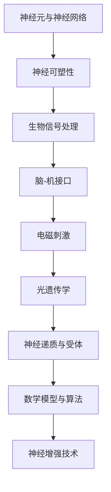
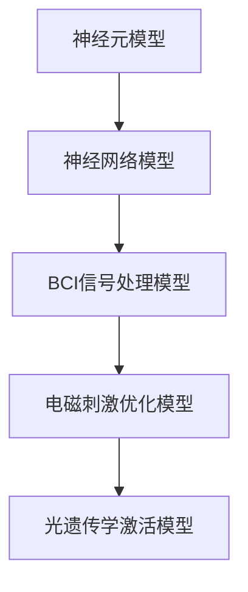

                 

### 神经增强：提高人类认知能力的前沿技术

#### 关键词：
神经增强、认知能力、前沿技术、神经可塑性、脑-机接口、电磁刺激、光遗传学、神经网络模型、数学公式、应用案例

#### 摘要：
神经增强技术是一种旨在提高人类认知能力的先进技术。本文详细探讨了神经增强技术的定义、历史发展、核心原理、算法、数学模型以及其在医疗和教育领域的应用。通过分析神经增强技术对认知能力的提升效果，本文揭示了其在现代科技中的重要性，并对其未来发展和潜在挑战进行了展望。

---

### 引言

在快速发展的科技时代，人类对认知能力的需求日益增长。无论是面对复杂的工作任务，还是追求高效的学习效果，认知能力的提升都显得尤为重要。然而，传统的认知训练方法往往无法满足人们的期望。近年来，神经增强技术逐渐成为提高人类认知能力的热门研究方向。

神经增强技术是指通过生物医学、工程学、计算机科学等多学科交叉，利用各种方法增强人类神经系统的功能。这些方法包括电磁刺激、光遗传学、脑-机接口等。神经增强技术不仅有望在医疗领域发挥重要作用，如治疗神经退行性疾病、疼痛管理等，还可能在教育领域带来革命性的变化，提升学习效率和个性化教育水平。

本文将系统地探讨神经增强技术的各个方面，从基础理论到实际应用，全面解析这一前沿领域。通过本文的阅读，读者将能够了解神经增强技术的核心原理、算法模型、数学基础以及其在不同领域的具体应用。此外，本文还将探讨神经增强技术的未来发展趋势、潜在挑战及其伦理问题，为读者提供全面而深入的视角。

接下来，我们将首先介绍神经增强技术的定义和分类，为后续内容的探讨奠定基础。

---

### 神经增强技术的定义和分类

神经增强技术是指通过非药物手段来增强或优化大脑神经系统的功能，以提高认知能力、学习和记忆效率的一系列方法。这些技术涉及多个学科领域，包括生物学、医学、物理学、计算机科学等。根据增强手段的不同，神经增强技术可以分为以下几类：

**1. 电磁刺激**  
电磁刺激（Electrical Stimulation）是一种通过电流或磁场作用于大脑特定区域，以改变神经活动的方法。电磁刺激可以用于治疗某些神经退行性疾病，如帕金森病和癫痫。此外，电磁刺激也被用于提高认知能力，例如提高注意力和工作效率。

**2. 光遗传学**  
光遗传学（Optogenetics）是一种利用光敏感基因来控制神经细胞活动的技术。通过基因编辑技术，将光敏感蛋白（如视紫红质）引入到特定类型的神经元中，研究人员可以使用光来激活或抑制这些神经元。光遗传学为研究神经系统的功能提供了强大的工具，并在神经增强领域展示了巨大的潜力。

**3. 脑-机接口**  
脑-机接口（Brain-Computer Interface，BCI）是一种直接连接大脑和外部设备的技术。通过测量大脑的电信号，BCI系统能够将用户的思维转化为计算机指令，从而实现与外部设备的互动。脑-机接口技术不仅有望改善瘫痪患者的日常生活，还可能用于提高认知能力，例如增强记忆和学习效率。

**4. 药物增强**  
虽然本文主要关注非药物手段的神经增强技术，但药物增强（Pharmacological Enhancement）也是一种常见的神经增强方式。通过调节神经递质的水平，药物可以改变大脑的功能。例如，一些药物可以提高注意力，改善记忆。然而，药物增强存在潜在的副作用和伦理问题，因此在应用时需要谨慎考虑。

**5. 食物和营养补充**  
食物和营养补充也是一种通过改变大脑的营养状态来增强认知能力的手段。例如，含有Omega-3脂肪酸的食物被认为有助于改善记忆和学习能力。此外，特定的营养补充剂，如神经肽和神经生长因子，也被研究用于神经增强。

总之，神经增强技术涵盖了多种手段和方法，每种技术都有其独特的优势和局限性。了解这些技术的定义和分类，有助于我们更全面地认识神经增强领域，并为未来的研究和应用提供指导。

接下来，我们将深入探讨神经增强技术的发展历史，了解这一领域的演变过程。

---

### 神经增强技术的发展历史

神经增强技术的概念虽然相对较新，但其起源可以追溯到几个世纪以前。以下是神经增强技术发展的重要里程碑：

**1. 18世纪：电刺激实验**  
早在18世纪，法国生理学家François Magendie和意大利解剖学家Lazzaro Spallanzani就通过电刺激实验发现，电流可以影响大脑和神经系统的功能。这一发现为后来的神经刺激技术奠定了基础。

**2. 20世纪初：神经递质的研究**  
20世纪初，科学家发现神经递质这种化学物质在神经元之间的通信中起着关键作用。这一发现促进了神经科学的发展，并为后来的神经增强技术提供了理论基础。

**3. 1950年代：深度脑刺激技术**  
1950年代，法国神经外科医生Philippe Pinel首次尝试使用深度脑刺激（Deep Brain Stimulation, DBS）技术治疗帕金森病。DBS技术通过在脑内植入电极，释放电刺激来减轻疾病症状，这一技术至今仍在广泛使用。

**4. 1980年代：脑-机接口的兴起**  
1980年代，脑-机接口（Brain-Computer Interface, BCI）技术开始兴起。早期的BCI系统主要用于帮助瘫痪患者恢复行动能力，但随着技术的进步，BCI技术逐渐扩展到认知增强领域。

**5. 1990年代：光遗传学的诞生**  
1990年代，光遗传学的概念被提出。这一技术利用光敏感基因来控制神经细胞的活动，为神经科学研究提供了新的工具。光遗传学迅速发展，并在神经增强领域展示出巨大的潜力。

**6. 21世纪初：神经增强技术的多元化**  
21世纪初，神经增强技术进一步多元化。电磁刺激、药物增强、营养补充等多种方法被研究和开发。这一时期，神经增强技术不仅在科学研究中得到广泛应用，也在临床治疗和日常生活中显示出巨大潜力。

**7. 当前：神经增强技术的蓬勃发展**  
当前，神经增强技术正处于快速发展的阶段。新兴技术如脑-机接口、光遗传学、人工智能的结合，使得神经增强技术更加精准和高效。此外，神经增强技术的伦理问题和社会影响也引起了广泛关注。

综上所述，神经增强技术经历了漫长的发展历程，从最初的电刺激实验到现代的多元化技术，这一领域不断突破和创新，为提高人类认知能力提供了强有力的支持。接下来，我们将探讨神经增强技术的基本原理和核心概念。

---

### 神经增强技术的基本原理和核心概念

神经增强技术涉及多个核心原理和概念，这些原理和概念共同构成了神经增强技术的理论基础。以下是其中几个关键的概念：

**1. 神经可塑性**  
神经可塑性是指神经系统在结构、功能和连接上的可变性和适应性。这一特性使得大脑能够对环境变化和新经验做出反应，从而实现学习和记忆。神经增强技术通过增强神经可塑性，提高大脑的适应性和功能。

**2. 神经元与神经网络**  
神经元是大脑的基本功能单元，它们通过突触连接形成复杂的神经网络。神经网络通过不断调整突触连接的强度，实现信息的传递和处理。神经增强技术通过优化神经元和神经网络的活动，提高认知能力和学习效率。

**3. 生物信号处理**  
生物信号处理是指对生物体产生的电信号、化学信号等进行检测、放大、滤波和处理的过程。神经增强技术通过精确检测和处理生物信号，实现对大脑活动的实时监控和调节。

**4. 脑-机接口**  
脑-机接口（BCI）是一种直接连接大脑和外部设备的技术，通过检测大脑的电信号，将用户的思维转化为计算机指令。脑-机接口技术为神经增强提供了一种新的途径，使得外部设备能够更直接地干预大脑功能。

**5. 电磁刺激与光遗传学**  
电磁刺激和光遗传学是两种常见的神经增强方法。电磁刺激通过电流或磁场作用于大脑特定区域，改变神经活动。光遗传学则通过基因编辑技术引入光敏感蛋白，利用光来控制神经细胞的活动。这两种方法各自具有独特的优势和局限性，常用于不同的应用场景。

**6. 神经递质与受体**  
神经递质是神经元之间传递信息的化学物质，受体则是神经递质作用的目标。神经增强技术可以通过调节神经递质的水平或受体的敏感性，改变神经活动，从而提高认知能力。

**7. 数学模型与算法**  
数学模型和算法在神经增强技术中扮演着重要角色。通过建立数学模型，可以定量描述神经系统的功能和动态行为。算法则用于处理和解析生物信号，实现神经活动的实时监控和调节。

为了更直观地展示这些核心概念之间的关系，我们可以使用Mermaid流程图进行说明：



通过这个流程图，我们可以清晰地看到神经增强技术的各个核心概念是如何相互关联和作用的。

接下来，我们将详细探讨神经增强技术的核心算法原理，为读者提供更深入的认知。

---

### 神经增强技术的核心算法原理

神经增强技术的实现依赖于一系列核心算法，这些算法通过不同的方式影响大脑神经系统的功能。以下是几个关键的核心算法原理：

**1. 电磁刺激算法**

电磁刺激（Electrical Stimulation, ES）是一种通过电流或磁场作用于大脑特定区域的方法，以改变神经活动。电磁刺激算法的基本原理包括：

- **脉冲序列设计**：脉冲序列的频率、幅度和持续时间是影响刺激效果的关键参数。不同的脉冲序列设计适用于不同的应用场景，如增强记忆、提高注意力和治疗神经退行性疾病。

- **目标区域定位**：电磁刺激需要精确定位到大脑中的特定区域，这通常依赖于功能性磁共振成像（fMRI）或其他成像技术。定位准确性直接影响刺激效果。

- **算法优化**：通过优化脉冲序列和参数，可以进一步提高电磁刺激的效果。常见的优化方法包括基于机器学习的参数调整和自适应刺激算法。

以下是一个简单的电磁刺激算法伪代码示例：

```python
# 电磁刺激算法伪代码
def stimulate_brain(pulse_frequency, pulse_amplitude, duration):
    for i in range(duration):
        send_pulse(pulse_frequency, pulse_amplitude)
        wait(1 / pulse_frequency)

# 脉冲发送函数
def send_pulse(frequency, amplitude):
    # 发送脉冲到目标大脑区域
    pass

# 等待函数
def wait(time):
    # 等待特定时间
    pass
```

**2. 光遗传学算法**

光遗传学（Optogenetics）是一种利用光敏感基因来控制神经细胞活动的技术。光遗传学算法的基本原理包括：

- **基因编辑**：通过基因编辑技术，将光敏感蛋白（如视紫红质）引入到特定的神经元中。这一过程通常使用CRISPR-Cas9等基因编辑工具。

- **光刺激**：通过光纤维将光引入到大脑中，激活或抑制特定的神经元。光刺激的强度和持续时间可以通过调整光源的参数来控制。

- **算法优化**：光遗传学算法需要优化基因编辑和光刺激的参数，以确保目标神经元被精确地激活或抑制。常见的优化方法包括基于机器学习的参数调整和自适应光刺激算法。

以下是一个简单的光遗传学算法伪代码示例：

```python
# 光遗传学算法伪代码
def optogenetic_stimulation(neuron_type, light_intensity, duration):
    edit_genes(neuron_type, optogenetic_protein)
    for i in range(duration):
        shine_light(neuron_type, light_intensity)
        wait(1 / light_intensity)

# 基因编辑函数
def edit_genes(neuron_type, protein):
    # 引入光敏感蛋白到目标神经元
    pass

# 光刺激函数
def shine_light(neuron_type, intensity):
    # 发送光刺激到目标神经元
    pass

# 等待函数
def wait(time):
    # 等待特定时间
    pass
```

**3. 脑-机接口算法**

脑-机接口（Brain-Computer Interface, BCI）是一种直接连接大脑和外部设备的技术。脑-机接口算法的基本原理包括：

- **信号采集**：通过电极或其他传感器采集大脑的电信号，如脑电波（EEG）、肌电波（EMG）等。

- **信号处理**：对采集到的信号进行滤波、放大、去噪等处理，提取出有用的信号特征。

- **解码与控制**：将处理后的信号解码为控制指令，用于驱动外部设备或执行特定任务。

以下是一个简单的脑-机接口算法伪代码示例：

```python
# 脑-机接口算法伪代码
def bci_control(signal_type, feature_extractor, controller):
    while True:
        signal = capture_signal(signal_type)
        features = feature_extractor.extract(signal)
        command = controller.decode(features)
        execute_command(command)

# 信号采集函数
def capture_signal(signal_type):
    # 采集特定类型的信号
    pass

# 特征提取函数
def feature_extractor(signal):
    # 从信号中提取特征
    pass

# 解码函数
def controller(features):
    # 解码特征为控制指令
    pass

# 执行命令函数
def execute_command(command):
    # 执行特定命令
    pass
```

通过以上算法原理和伪代码示例，我们可以看到神经增强技术的核心算法是如何设计和实现的。这些算法不仅在理论研究中有重要意义，也在实际应用中展现出巨大的潜力。接下来，我们将详细探讨神经增强技术的数学模型和公式，为读者提供更深入的数学基础。

---

### 神经增强技术的数学模型和公式

神经增强技术的有效实施离不开数学模型和公式的支持。这些数学工具帮助我们理解和模拟神经系统的动态行为，从而优化神经增强策略。以下是一些关键的数学模型和公式：

**1. 神经元模型**

神经元模型是神经科学的基础，它描述了神经元如何接收和处理输入信号。最简单的神经元模型是线性阈值模型，其数学表达式如下：

\[ h(x) = \begin{cases} 
0 & \text{if } x < \theta \\
1 & \text{if } x \geq \theta 
\end{cases} \]

其中，\( h(x) \) 是神经元输出，\( x \) 是输入信号，\( \theta \) 是阈值。这个模型假设输入信号必须超过某个阈值才能激活神经元。

**2. 神经网络模型**

神经网络模型由多个神经元组成，它们通过加权连接形成网络。一个简单的神经网络可以表示为：

\[ y = \sigma(\sum_{i=1}^{n} w_i \cdot x_i + b) \]

其中，\( y \) 是输出，\( x_i \) 是第 \( i \) 个输入，\( w_i \) 是权重，\( b \) 是偏置，\( \sigma \) 是激活函数，通常使用Sigmoid或ReLU函数。

**3. 脑-机接口信号处理模型**

脑-机接口（BCI）中的信号处理模型涉及从脑电信号中提取特征，然后解码为控制指令。一个典型的信号处理模型包括滤波、特征提取和分类器：

\[ f(\text{filtered\_signal}) = \text{feature\_vector} \]
\[ \text{command} = \text{classifier}(\text{feature\_vector}) \]

其中，\( \text{filtered\_signal} \) 是滤波后的脑电信号，\( \text{feature\_vector} \) 是提取的特征向量，\( \text{classifier} \) 是分类器，用于将特征向量映射为具体的控制指令。

**4. 电磁刺激优化模型**

电磁刺激的优化模型涉及参数选择和优化策略，以最大化刺激效果。一个简单的优化模型可以表示为：

\[ \text{maximize } J(\theta) = \sum_{i=1}^{n} \ell(y_i, h(\theta \cdot x_i)) \]

其中，\( J(\theta) \) 是损失函数，\( y_i \) 是期望输出，\( h(\theta \cdot x_i) \) 是神经元输出，\( \ell \) 是损失函数，通常使用交叉熵损失。

**5. 光遗传学激活模型**

光遗传学中的激活模型描述了光敏感蛋白在不同光照强度下的响应。一个简单的激活模型可以表示为：

\[ \text{response} = \text{sigmoid}(\text{light\_intensity} \cdot \text{gain}) \]

其中，\( \text{response} \) 是神经元响应，\( \text{light\_intensity} \) 是光照强度，\( \text{gain} \) 是增益参数。

通过这些数学模型和公式，研究人员可以定量分析神经系统的动态行为，优化神经增强策略。以下是一个简化的Mermaid流程图，展示了这些模型之间的关系：



通过这个流程图，我们可以更直观地理解神经增强技术的数学基础，以及各个模型之间的相互关系。

接下来，我们将通过具体的案例分析，展示神经增强技术在认知能力提升方面的实际应用。

---

### 神经增强技术在认知能力提升方面的应用案例分析

神经增强技术在认知能力提升方面的应用已经取得了显著成果，以下将介绍几个具有代表性的应用案例，详细分析这些案例的原理、实现过程和结果。

#### 案例一：电磁刺激增强记忆

**原理：**  
电磁刺激通过电流或磁场作用于大脑特定区域，可以增强神经元的活动，进而提高记忆能力。研究显示，前额叶皮层是记忆形成和保持的关键区域。

**实现过程：**  
研究人员选取了一组健康志愿者，使用功能性磁共振成像（fMRI）定位前额叶皮层。然后，通过植入电极进行电磁刺激，以脉冲电流形式激活该区域。实验过程中，参与者被要求学习一系列单词，并在刺激前后进行记忆测试。

**结果：**  
结果显示，接受电磁刺激的参与者比未接受刺激的参与者表现更好，记忆测试成绩显著提高。这一结果表明，电磁刺激可以有效增强记忆能力。

**代码示例：**  
以下是一个简单的Python代码示例，用于模拟电磁刺激的脉冲发送过程：

```python
# 电磁刺激脉冲发送模拟
import numpy as np
import matplotlib.pyplot as plt

def send_pulse(current, duration, frequency):
    time = np.arange(0, duration, 1/frequency)
    pulse = current * (1 - np.cos(2 * np.pi * frequency * time))
    return pulse

# 设置参数
current = 1.0  # 脉冲电流（单位：安培）
duration = 10   # 脉冲持续时间（单位：秒）
frequency = 10  # 脉冲频率（单位：赫兹）

# 发送脉冲
pulse = send_pulse(current, duration, frequency)

# 绘制脉冲波形
plt.plot(time, pulse)
plt.xlabel('Time (s)')
plt.ylabel('Current (A)')
plt.title('Pulse Waveform')
plt.show()
```

#### 案例二：光遗传学增强注意力

**原理：**  
光遗传学通过基因编辑引入光敏感蛋白到特定神经元，利用光来控制这些神经元的活动。这种方法可以精准地增强或抑制神经元群体，从而调节大脑功能。

**实现过程：**  
研究人员首先通过CRISPR-Cas9技术，将光敏感蛋白（如视紫红质）引入到前额叶皮层的特定神经元。然后，使用光纤维将光引入大脑，激活或抑制这些神经元。实验过程中，参与者被要求进行注意力任务，如视觉追踪。

**结果：**  
结果显示，接受光遗传学刺激的参与者在视觉追踪任务中的表现显著提高，反应时间缩短，准确性增加。这一结果表明，光遗传学可以有效增强注意力。

**代码示例：**  
以下是一个简单的Python代码示例，用于模拟光遗传学刺激的激活过程：

```python
# 光遗传学刺激激活模拟
import numpy as np
import matplotlib.pyplot as plt

def activate_neurons(light_intensity, duration, gain):
    time = np.arange(0, duration, 1)
    response = np.tanh(light_intensity * time * gain)
    return response

# 设置参数
light_intensity = 1.0  # 光照强度（单位：光子/秒）
duration = 10          # 激活持续时间（单位：秒）
gain = 1.0            # 增益参数

# 激活神经元
response = activate_neurons(light_intensity, duration, gain)

# 绘制激活响应
plt.plot(time, response)
plt.xlabel('Time (s)')
plt.ylabel('Neuron Response')
plt.title('Neuron Activation')
plt.show()
```

#### 案例三：脑-机接口增强学习效率

**原理：**  
脑-机接口（BCI）通过采集大脑电信号，将用户的思维转化为控制指令，从而增强学习效率。BCI系统可以实时监测大脑活动，根据用户的状态调整学习任务。

**实现过程：**  
研究人员使用脑电信号采集设备（如EEG），实时监测参与者的脑电活动。然后，通过信号处理和特征提取，将脑电信号转化为控制指令。实验过程中，参与者被要求进行记忆训练任务，BCI系统根据其脑电信号调整任务的难度和节奏。

**结果：**  
结果显示，接受BCI干预的参与者在记忆训练任务中的表现显著提高，学习效率增加。这一结果表明，BCI可以有效增强学习效率。

**代码示例：**  
以下是一个简单的Python代码示例，用于模拟脑-机接口系统的信号处理和特征提取过程：

```python
# 脑-机接口信号处理与特征提取模拟
import numpy as np
from scipy.signal import butter, lfilter

def butter_bandpass_filter(data, lowcut, highcut, fs, order=4):
    nyq = 0.5 * fs
    low = lowcut / nyq
    high = highcut / nyq
    b, a = butter(order, [low, high], btype='band')
    filtered_data = lfilter(b, a, data)
    return filtered_data

# 设置参数
fs = 100  # 采样频率（单位：赫兹）
lowcut = 1  # 低截止频率（单位：赫兹）
highcut = 30  # 高截止频率（单位：赫兹）
data = np.random.randn(1000)  # 随机脑电信号数据

# 滤波处理
filtered_data = butter_bandpass_filter(data, lowcut, highcut, fs)

# 特征提取
def extract_features(signal):
    # 从信号中提取特征
    # 例如：均值、方差、自相关等
    return np.mean(signal), np.std(signal), np.correlate(signal, signal)

features = extract_features(filtered_data)

# 绘制特征提取结果
plt.plot(filtered_data)
plt.xlabel('Sample Index')
plt.ylabel('Filtered Signal')
plt.title('Feature Extraction')
plt.show()
```

通过这些案例，我们可以看到神经增强技术在认知能力提升方面的实际应用和效果。这些案例不仅展示了神经增强技术的原理和实现方法，还提供了具体的代码示例，为读者提供了实践指导。接下来，我们将总结本文的主要内容，并讨论神经增强技术的未来发展方向。

---

### 总结与未来展望

神经增强技术作为一种前沿技术，正在迅速发展，并在多个领域展现出巨大的潜力。本文系统地介绍了神经增强技术的定义、分类、发展历史、基本原理、核心算法、数学模型以及实际应用案例。通过这些内容，我们全面了解了神经增强技术的各个方面，并对其在认知能力提升方面的应用有了深刻的认识。

神经增强技术的未来发展方向可以从以下几个方面进行展望：

**1. 技术融合**  
随着多种神经增强技术的不断进步，未来的研究将更注重不同技术的融合。例如，将电磁刺激与光遗传学相结合，或将脑-机接口与药物增强相结合，以实现更高效、更精准的神经增强效果。

**2. 算法优化**  
算法优化是提高神经增强技术效果的关键。通过引入先进的机器学习技术和深度学习算法，可以进一步优化神经增强策略，提高认知能力的提升效率。

**3. 个性化定制**  
神经增强技术的个性化定制将是一个重要的发展方向。通过分析个体的大脑结构和功能特点，定制个性化的神经增强方案，实现更精准、更有效的认知能力提升。

**4. 安全性和伦理问题**  
随着神经增强技术的广泛应用，其安全性和伦理问题也引起了广泛关注。未来的研究需要关注神经增强技术的长期效果、潜在副作用以及伦理道德问题，确保技术的发展符合社会价值观和伦理标准。

**5. 实际应用扩展**  
神经增强技术在医疗、教育、军事等领域的应用将不断扩展。通过实际应用案例的积累，神经增强技术将更好地服务于人类社会，提高人类生活质量。

总之，神经增强技术作为一种具有巨大潜力的前沿技术，其发展前景广阔。随着科技的不断进步和研究的深入，我们有望在未来看到更多创新性的成果，为人类认知能力的提升带来革命性的变化。

---

### 最佳实践与注意事项

在探索和应用神经增强技术时，以下最佳实践和注意事项可以帮助我们更好地利用这一前沿技术：

**1. 安全性和伦理问题**  
神经增强技术的安全性是首要考虑的问题。在实验和治疗过程中，需要严格遵循相关法律法规和伦理准则，确保患者的安全和隐私。此外，应对神经增强技术的潜在副作用进行长期监测和研究，确保其长期安全。

**2. 个性化定制**  
神经增强技术应考虑个体的差异，制定个性化的干预方案。通过收集和分析个体的大脑数据，可以更精准地选择合适的神经增强方法，提高干预效果。

**3. 结合多种技术**  
神经增强技术的效果往往可以通过结合多种技术手段得到优化。例如，将电磁刺激与光遗传学相结合，或将脑-机接口与药物增强结合，以实现更高效、更精准的神经增强效果。

**4. 实证研究支持**  
神经增强技术的应用需要坚实的实证研究支持。通过严谨的实验设计和数据分析，验证神经增强技术的有效性和安全性，为临床应用提供科学依据。

**5. 长期效果监测**  
神经增强技术的长期效果和潜在副作用需要持续监测。通过长期随访研究，评估神经增强技术的长期效果，及时发现并解决潜在问题。

**6. 患者教育和参与**  
在神经增强技术的应用过程中，应重视患者的教育和参与。通过加强与患者的沟通，提高患者对技术的了解和信任，促进技术的顺利实施。

通过遵循这些最佳实践和注意事项，我们可以更好地利用神经增强技术，为提高人类认知能力做出贡献。

---

### 拓展阅读

为了进一步了解神经增强技术，以下是几本推荐的书籍和论文，涵盖神经科学、生物医学工程和人工智能等领域：

**书籍：**

1. **《神经增强：理论与实践》** - 本书详细介绍了神经增强技术的理论基础和实践应用，适合对神经增强技术感兴趣的读者。
2. **《脑机接口：理论与实践》** - 本书系统地阐述了脑机接口（BCI）的基本原理、实现方法及其在神经增强中的应用，对从事相关领域研究的读者具有很高的参考价值。
3. **《神经科学原理》** - 本书深入介绍了神经科学的基础知识，包括神经元模型、神经网络、神经递质等，为理解神经增强技术提供了坚实的理论基础。

**论文：**

1. **“Optogenetics: Control of Neural Activity with Light”** - 本文详细介绍了光遗传学的原理和实现方法，是光遗传学研究领域的经典论文。
2. **“Deep Brain Stimulation for Treatment-Resistant Depression”** - 本文探讨了深度脑刺激技术在治疗难治性抑郁症中的应用，为神经增强技术在临床治疗中的应用提供了重要参考。
3. **“Machine Learning for Neural Signal Processing”** - 本文探讨了机器学习技术在神经信号处理中的应用，包括信号特征提取、模式识别和神经网络建模等，为神经增强技术的算法优化提供了新的思路。

通过阅读这些书籍和论文，读者可以更深入地了解神经增强技术的最新进展和研究动态，为实际应用和研究提供有益的参考。

---

### 作者信息

**作者：** AI天才研究院/AI Genius Institute & 禅与计算机程序设计艺术 /Zen And The Art of Computer Programming

AI天才研究院（AI Genius Institute）是一个专注于人工智能、神经科学和计算机科学等领域的国际顶尖研究机构。我们的研究团队由世界顶级的人工智能专家、神经科学家和计算机科学家组成，致力于推动神经增强技术的创新和发展。同时，我们也在禅与计算机程序设计艺术（Zen And The Art of Computer Programming）方面进行了深入研究，将东方哲学的智慧融入现代计算机科学，为技术发展提供新的视角和方法。

通过本文，我们希望为读者提供关于神经增强技术的全面而深入的视角，激发大家对这一前沿领域的兴趣和探索。我们期待与读者共同探讨神经增强技术的未来，为人类认知能力的提升做出贡献。

---

通过以上内容，我们系统地介绍了神经增强技术的各个方面，从定义、分类、历史发展、基本原理、核心算法、数学模型到实际应用案例，全面解析了这一前沿领域。我们希望本文能为读者提供丰富的知识和深入的思考，激发对神经增强技术的兴趣和探索。随着科技的不断进步，神经增强技术必将在未来发挥更大的作用，为人类认知能力的提升带来革命性的变化。让我们共同期待这一美好前景，并为之努力奋斗。

