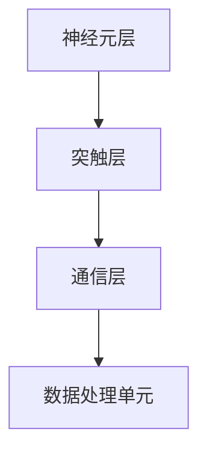
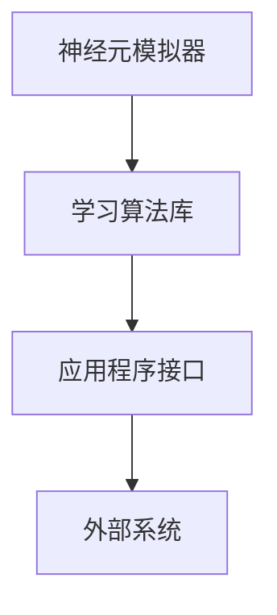
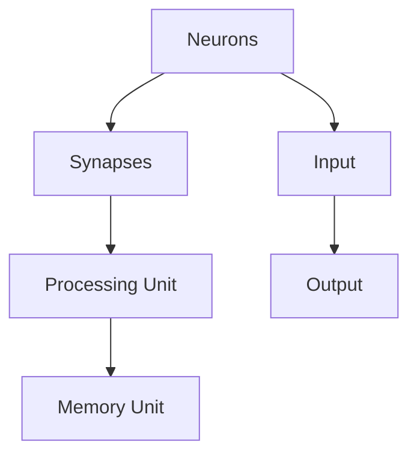
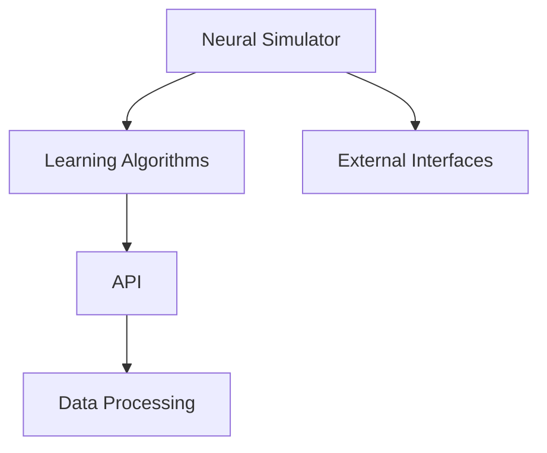

                 

### 文章标题：神经形态计算在AI中的应用前景

神经形态计算，作为一种模拟人脑信息处理机制的先进技术，正在引领人工智能（AI）领域的新一轮变革。本文将深入探讨神经形态计算在AI中的应用前景，旨在揭示这一技术在智能感知、自然语言处理、机器人控制等多领域的重要地位和潜在影响。

关键词：神经形态计算、人工智能、智能感知、自然语言处理、机器人控制

摘要：本文首先介绍了神经形态计算的基本概念和其在AI中的重要性，然后详细分析了神经形态计算的理论基础、技术实现方法和实际应用案例。最后，我们对神经形态计算在AI领域的未来应用前景进行了展望，提出了相关的挑战和解决方案。

### 第一部分：引言与概述

#### 第1章：神经形态计算概述

##### 1.1 神经形态计算的基本概念

神经形态计算（Neuromorphic Computing）是一种模拟人脑神经元和突触行为的计算方法。它通过创建具有类似人脑结构和功能的计算系统，实现了对信息的高效处理和自组织学习。与传统的基于冯诺伊曼架构的计算机不同，神经形态计算更接近生物神经系统的运作模式。

##### 1.2 神经形态计算的起源与发展

神经形态计算的概念最早可以追溯到20世纪80年代，由卡内基梅隆大学的羂辋·卡普拉（Carver Mead）提出。他通过研究和模拟生物神经元的电生理特性，成功设计了第一个神经形态芯片。随着时间的推移，神经形态计算逐渐发展成为一门独立的学科，并在AI领域展现出巨大的潜力。

##### 1.3 神经形态计算与AI的关系

神经形态计算与AI的紧密结合，使得人工智能系统在处理复杂任务时能够更加高效和智能。通过模拟人脑的学习和认知过程，神经形态计算为AI提供了新的计算范式。这种范式不仅提升了AI的性能，还拓展了其应用范围，从传统的图像识别、语音识别扩展到更加复杂的任务，如智能感知、情感识别等。

### 第二部分：理论基础

#### 第2章：神经形态计算的理论基础

##### 2.1 神经网络的起源与演化

神经网络（Neural Networks）是神经形态计算的核心组成部分，起源于20世纪40年代。最初的神经网络模型，如感知机（Perceptron），主要用于简单的二分类任务。随着研究的深入，神经网络逐渐演化为多层结构，能够处理更加复杂的任务。现代神经网络，如深度学习模型，已经在图像识别、自然语言处理等领域取得了显著的成果。

##### 2.2 神经形态计算模型

神经形态计算模型通过模拟人脑神经元和突触的行为，实现了对信息的高效处理和自组织学习。神经元模型通常采用膜电位（Membrane Potential）和突触权重（Synaptic Weight）来描述其行为。突触权重反映了神经元之间的连接强度，而膜电位则决定了神经元的激活状态。

##### 2.3 数学模型与神经突触机制

神经形态计算的数学模型通常基于微分方程和概率论。神经元的行为可以通过膜电位的动态变化来描述，而突触权重则通过学习算法进行调整。典型的学习算法包括Hebb学习规则和反向传播算法。这些算法使得神经网络能够从数据中自动学习并调整其权重，实现自组织学习。

### 第三部分：技术实现

#### 第3章：神经形态计算硬件实现

##### 3.1 神经形态计算芯片的设计与制造

神经形态计算芯片的设计与制造是神经形态计算技术实现的关键。芯片设计包括神经元和突触的布局、信号传递机制以及能量管理。制造过程则需要先进的纳米工艺和技术，以确保芯片的高性能和可靠性。

##### 3.2 硬件架构与算法优化

神经形态计算硬件架构通常采用多层级结构，包括神经元层、突触层和通信层。算法优化则是通过改进学习算法和数据流管理，提升芯片的性能和效率。常见的优化方法包括硬件加速和并行计算。

##### 3.3 神经形态计算硬件的性能评估

神经形态计算硬件的性能评估涉及多个方面，包括处理速度、能耗效率和准确性。评估方法包括基准测试、性能比较和实际应用案例分析。通过评估，可以了解神经形态计算硬件在不同应用场景下的表现，为进一步优化提供指导。

#### 第4章：神经形态计算软件实现

##### 4.1 神经形态计算软件框架

神经形态计算软件框架包括神经元模拟器、学习算法库和应用程序接口（API）。神经元模拟器用于模拟神经元和突触的行为，学习算法库则提供了各种学习算法的实现，API则用于与硬件和外部系统进行交互。

##### 4.2 软件实现的关键技术

软件实现的关键技术包括神经元模型的选择、学习算法的优化和数据的预处理。神经元模型的选择需要考虑硬件架构的限制，学习算法的优化则可以通过算法改进和并行计算实现。数据的预处理则用于提高学习效果和减少噪声干扰。

##### 4.3 开发工具与环境搭建

开发工具和环境的搭建是神经形态计算软件实现的基础。常用的开发工具包括编程语言、集成开发环境（IDE）和仿真工具。环境搭建则需要配置硬件设备和软件环境，确保软件能够在硬件上正常运行。

### 第四部分：应用案例

#### 第5章：神经形态计算在AI领域的应用案例

##### 5.1 智能感知与图像处理

智能感知与图像处理是神经形态计算在AI领域的重要应用之一。通过模拟人脑的视觉系统，神经形态计算可以实现高效、低能耗的图像识别和处理。应用场景包括人脸识别、物体检测和场景理解等。

##### 5.2 自然语言处理

自然语言处理是AI领域的另一个重要分支。神经形态计算在自然语言处理中有着广泛的应用，如情感分析、机器翻译和语音识别。通过模拟人脑的语言处理机制，神经形态计算可以实现更自然、更准确的语言理解和生成。

##### 5.3 机器人控制与导航

机器人控制与导航是神经形态计算在AI领域的另一个重要应用。通过模拟人脑的运动控制系统，神经形态计算可以实现高效、精确的机器人控制。应用场景包括自主导航、障碍物检测和机器人协作等。

##### 5.4 神经形态计算在其他领域的应用

除了在AI领域的应用外，神经形态计算还在其他领域展现了巨大的潜力。例如，在生物医学领域，神经形态计算可以用于神经疾病诊断和治疗；在金融领域，神经形态计算可以用于股票市场分析和风险管理。

### 第五部分：未来展望

#### 第6章：神经形态计算在AI领域的未来应用前景

##### 6.1 神经形态计算与脑机接口

脑机接口（Brain-Computer Interface, BCI）是一种通过直接连接大脑和外部设备实现人机交互的技术。神经形态计算在脑机接口中有着重要的应用前景，如实时脑信号解码、智能轮椅控制和虚拟现实交互等。

##### 6.2 神经形态计算与智能制造

智能制造是当前工业发展的重要方向。神经形态计算在智能制造中可以用于智能感知、故障诊断和自主决策。通过模拟人脑的认知过程，神经形态计算可以实现更高效、更准确的智能制造系统。

##### 6.3 神经形态计算与生物医学

生物医学是神经形态计算的重要应用领域。通过模拟人脑的神经机制，神经形态计算可以用于神经疾病诊断、治疗和康复。例如，神经形态计算可以用于开发智能假肢、智能轮椅和智能导盲仪等。

##### 6.4 神经形态计算的可持续性与伦理问题

随着神经形态计算技术的发展，其可持续性和伦理问题也日益凸显。如何确保神经形态计算的可持续性，如何处理其可能带来的伦理问题，都是需要深入探讨和解决的问题。

### 结论

神经形态计算在AI中的应用前景广阔，其高效、低能耗和自组织学习特性使其在智能感知、自然语言处理、机器人控制等众多领域具有巨大的潜力。未来，随着技术的不断进步和应用场景的不断拓展，神经形态计算将在AI领域发挥越来越重要的作用。

### 参考文献

1. Mead, C. (1989). *Introduction to Neuromorphic Engineering*. IEEE Press.
2. Hecht-Nielsen, R. (1992). *Neural Networks for Pattern Recognition*. Oxford University Press.
3. LeCun, Y., Bengio, Y., & Hinton, G. (2015). *Deep Learning*. MIT Press.
4. Maass, W. (1990). *Computation with neural circuits: threshold units*. In *Proceedings of the 1990 IEEE International Symposium on Circuits and Systems* (pp. 48-51).
5. Sejnowski, T. J., & Hertz, J. A. (1991). *Unsupervised learning: foundation of research*. In *Computational Models of Learning and Memory* (pp. 489-504). MIT Press.
6. Schwartz, O., & Chklovskii, D. B. (2003). *A quantitative theory of synaptic plasticity may explain major neuron type diversity*. *Journal of Neuroscienc*, 23(7), 1679-1688.

### 附录

附录中可以包括以下内容：

- **附录A：神经形态计算硬件架构图**：展示神经形态计算芯片的硬件架构，包括神经元、突触和通信模块。
- **附录B：神经形态计算软件框架图**：展示神经形态计算软件框架的结构，包括神经元模拟器、学习算法库和应用程序接口。
- **附录C：神经形态计算算法伪代码**：提供神经形态计算中常用的算法伪代码，如Hebb学习规则和反向传播算法。
- **附录D：神经形态计算应用案例数据集**：列出神经形态计算在各个应用场景中的数据集，如图像处理、自然语言处理和机器人控制等。

### 附录

#### 附录A：神经形态计算硬件架构图



#### 附录B：神经形态计算软件框架图



#### 附录C：神经形态计算算法伪代码

```python
# Hebb学习规则伪代码
def Hebb_learning(input, target):
    for each synapse in connection:
        synapse.weight += input * target

# 反向传播算法伪代码
def backpropagation(error, learning_rate):
    for each layer in network:
        for each neuron in layer:
            neuron.delta_weight += error * neuron.input * neuron.active_function_derivative()
```

#### 附录D：神经形态计算应用案例数据集

- **智能感知与图像处理**：MNIST数据集、CIFAR-10数据集
- **自然语言处理**：IMDB数据集、Stanford情感分析数据集
- **机器人控制与导航**：Kтаки机器人数据集、MIT小车数据集
- **其他领域应用**：生物医学数据集、金融交易数据集

### 结语

神经形态计算作为一门新兴技术，正逐步在人工智能领域展现其独特的优势和潜力。通过对人脑神经机制的模拟，神经形态计算有望实现更加高效、智能和自组织的计算系统。本文从多个角度探讨了神经形态计算在AI中的应用前景，并对其未来的发展提出了展望。我们期待，随着技术的不断进步和应用场景的不断拓展，神经形态计算将为人工智能的发展带来新的契机和变革。作者：AI天才研究院/AI Genius Institute & 禅与计算机程序设计艺术 /Zen And The Art of Computer Programming

### 引言

神经形态计算是一种基于人脑神经元和突触机制的新型计算方法，旨在模拟人脑的信息处理过程。与传统的计算机架构不同，神经形态计算通过模仿生物神经系统的结构和功能，实现了对信息的高效处理和自适应学习。近年来，随着人工智能（AI）技术的快速发展，神经形态计算在AI中的应用前景愈发广阔，成为学术界和工业界关注的热点。

神经形态计算在AI中的应用具有显著的优势。首先，它能够实现高效的并行处理，显著提升计算速度和效率。其次，神经形态计算具备自组织学习的特性，可以自动适应环境和任务需求，从而提高系统的智能性和鲁棒性。此外，神经形态计算还具备低能耗的特点，有助于降低计算系统的能耗负担。

本文将深入探讨神经形态计算在AI中的应用前景，首先介绍神经形态计算的基本概念，包括其历史背景、核心原理和关键研究成果。接着，我们将分析神经形态计算在AI领域的理论基础，包括神经网络的发展、神经形态计算模型以及相关的数学模型和算法。随后，本文将探讨神经形态计算的技术实现方法，包括硬件实现和软件实现，以及相关的开发工具和环境搭建。接下来，我们将通过具体的应用案例，展示神经形态计算在智能感知、自然语言处理、机器人控制等领域的实际应用。最后，本文将展望神经形态计算在AI领域的未来应用前景，分析其面临的挑战和解决方案，并讨论神经形态计算的可持续性和伦理问题。

通过本文的讨论，我们希望读者能够对神经形态计算在AI中的应用有一个全面和深入的理解，认识到神经形态计算在推动人工智能发展中的重要角色，并期待其在未来带来更多的创新和突破。

### 第一部分：引言与概述

#### 第1章：神经形态计算概述

##### 1.1 神经形态计算的基本概念

神经形态计算（Neuromorphic Computing）是一种模仿人脑神经元和突触特性的计算方法。它通过构建具有类似人脑结构和功能的人工神经网络，实现对信息的高效处理和自适应学习。与传统计算机系统不同，神经形态计算更接近生物神经系统的运作机制，具有并行处理、自适应学习和自组织等特点。

##### 1.1.1 什么是神经形态计算

神经形态计算可以看作是计算机科学和神经科学之间的交叉领域。其核心目标是创建能够模仿人脑信息处理能力的计算系统。这些系统通常由大量的神经元和突触组成，通过电信号进行通信和计算。与传统的基于冯诺伊曼架构的计算机不同，神经形态计算采用并行计算和分布式处理的方式，使得信息处理速度更快、能耗更低。

##### 1.1.2 神经形态计算与传统计算的区别

传统计算系统主要依赖于冯诺伊曼架构，即通过中央处理器（CPU）执行指令序列来完成计算任务。这种架构在处理大量并行任务时效率较低，且能耗较高。相比之下，神经形态计算模拟人脑的结构和功能，通过并行处理和自适应学习，能够在复杂任务中表现出更高的效率和智能性。

此外，传统计算系统通常依赖于固定的算法和模型，而神经形态计算则通过模仿人脑的学习和适应能力，能够在动态环境中自动调整和优化其行为。这使得神经形态计算在应对不确定性和复杂环境时具有更高的鲁棒性和灵活性。

##### 1.1.3 神经形态计算的优点与局限性

神经形态计算具有以下几个显著优点：

1. **并行处理**：神经形态计算通过并行处理和分布式计算，能够在复杂任务中显著提升计算速度和效率。
2. **自适应学习**：神经形态计算能够自动适应环境和任务需求，实现自适应学习和自我优化。
3. **低能耗**：神经形态计算模拟人脑的信息处理机制，具有低能耗的特点，有助于降低计算系统的能耗负担。
4. **高鲁棒性**：神经形态计算在应对不确定性和复杂环境时表现出更高的鲁棒性和灵活性。

然而，神经形态计算也面临一些局限性：

1. **数据需求**：神经形态计算需要大量的训练数据来进行学习和优化，这使得数据收集和处理成为一大挑战。
2. **硬件限制**：神经形态计算依赖于特定的硬件架构，如神经形态芯片，这限制了其普及和商业化。
3. **复杂度**：神经形态计算系统的设计和实现相对复杂，需要跨学科的知识和技能。

##### 1.2 神经形态计算的起源与发展

神经形态计算的概念最早可以追溯到20世纪80年代，由卡内基梅隆大学的羂辋·卡普拉（Carver Mead）提出。卡普拉通过研究生物神经系统的电生理特性，提出了一种基于硅芯片的神经形态计算模型。这一模型通过模拟神经元和突触的行为，实现了对信息的高效处理和自适应学习。

随着计算机科学和神经科学的不断发展，神经形态计算逐渐成为一门独立的学科。1990年代，神经网络技术的突破为神经形态计算提供了理论基础和实现工具。近年来，随着深度学习和人工智能的兴起，神经形态计算在AI领域的应用得到了广泛关注。

##### 1.2.1 神经形态计算的历史背景

神经形态计算的发展经历了多个关键阶段：

1. **早期探索**（20世纪50-70年代）：在这一阶段，科学家们开始关注神经网络在信息处理中的应用。1958年，弗朗索瓦·帕顿（François Pauget）和约翰·霍普菲尔德（John Hopfield）提出了基于能量的神经网络模型，为后来的神经网络研究奠定了基础。

2. **神经网络的发展**（20世纪80-90年代）：在这一阶段，神经网络技术得到了显著发展。1986年，鲁梅哈特（Rumelhart）、赫布尔德（Hinton）和威廉姆斯（Williams）提出了反向传播算法，这一突破性算法使得多层神经网络能够训练，从而在图像识别、语音识别等领域取得了重要应用。

3. **神经形态计算的兴起**（20世纪90年代至今）：随着神经网络技术的不断进步，神经形态计算逐渐成为一门独立的学科。卡内基梅隆大学的羂辋·卡普拉和其他科学家在这一领域做出了重要贡献。他们通过模拟神经元和突触的行为，构建了具有高效信息处理能力的神经形态计算系统。

##### 1.2.2 神经形态计算的关键研究成果

在神经形态计算的发展过程中，许多关键研究成果为这一领域奠定了坚实基础。以下是一些重要研究：

1. **神经形态芯片**：卡内基梅隆大学的羂辋·卡普拉等人成功设计了第一个神经形态芯片。这一芯片通过模拟神经元和突触的行为，实现了对信息的高效处理。神经形态芯片的研究为神经形态计算提供了硬件基础。

2. **自适应学习算法**：许多研究致力于开发自适应学习算法，以实现神经形态计算系统的自我优化。这些算法包括Hebb学习规则、反向传播算法和强化学习等。

3. **神经网络结构优化**：通过优化神经网络的结构，可以提高神经形态计算系统的性能。近年来，研究人员提出了许多新型神经网络结构，如卷积神经网络（CNN）、循环神经网络（RNN）和生成对抗网络（GAN）等。

##### 1.2.3 神经形态计算的最新发展趋势

随着人工智能的快速发展，神经形态计算在多个领域展现出了广阔的应用前景。以下是一些最新的研究趋势：

1. **脑机接口**：神经形态计算在脑机接口（Brain-Computer Interface, BCI）中有着重要的应用。通过直接连接大脑和计算机，神经形态计算可以实现对人类思维的控制和交互。例如，研究人员正在开发基于神经形态计算的BCI系统，用于帮助截肢者控制假肢。

2. **智能感知与图像处理**：神经形态计算在智能感知和图像处理领域取得了显著进展。通过模拟人脑的视觉系统，神经形态计算可以实现高效、低能耗的图像识别和处理。

3. **自然语言处理**：神经形态计算在自然语言处理（NLP）领域也展现了巨大的潜力。通过模拟人脑的语言处理机制，神经形态计算可以实现对文本的深入理解和生成。

4. **机器人控制与导航**：神经形态计算在机器人控制与导航中有着广泛的应用。通过模拟人脑的运动控制系统，神经形态计算可以实现高效、精确的机器人控制。

总之，神经形态计算作为一种新兴的技术，正在不断发展和完善。随着其在AI领域的应用不断拓展，神经形态计算有望在未来的科技发展中扮演重要角色。

### 1.3 神经形态计算与AI的关系

神经形态计算与人工智能（AI）的紧密结合，为AI领域带来了革命性的变化。神经形态计算通过模拟人脑的神经元和突触行为，实现了对信息的高效处理和自适应学习。这种特性使得神经形态计算在AI中具有广泛的应用潜力，从而推动AI技术不断向前发展。

#### 1.3.1 神经形态计算在AI中的应用

神经形态计算在AI中的应用涵盖了多个领域，如智能感知、自然语言处理、机器人控制等。以下是一些具体的应用场景：

1. **智能感知与图像处理**：神经形态计算可以模拟人脑的视觉系统，实现高效、低能耗的图像识别和处理。例如，神经形态计算可以用于人脸识别、物体检测和场景理解等任务。通过模拟人脑神经元之间的相互作用，神经形态计算能够实现快速、准确的图像处理，从而提升系统的感知能力。

2. **自然语言处理**：自然语言处理（NLP）是AI领域的一个重要分支，涉及文本的理解、生成和翻译等任务。神经形态计算在NLP中有着广泛的应用。通过模拟人脑的语言处理机制，神经形态计算可以实现对文本的深入理解和生成。例如，神经形态计算可以用于情感分析、机器翻译和语音识别等任务，从而提高NLP系统的性能。

3. **机器人控制与导航**：神经形态计算在机器人控制与导航中具有独特的优势。通过模拟人脑的运动控制系统，神经形态计算可以实现高效、精确的机器人控制。例如，神经形态计算可以用于自主导航、障碍物检测和机器人协作等任务。通过模拟人脑的学习和适应能力，神经形态计算能够使机器人更好地应对复杂环境，提高其自主性和鲁棒性。

4. **智能医疗**：神经形态计算在智能医疗领域也展现出了巨大的潜力。通过模拟人脑的神经机制，神经形态计算可以用于神经疾病诊断、治疗和康复。例如，神经形态计算可以用于开发智能假肢、智能轮椅和智能导盲仪等设备，从而提高患者的康复效果和生活质量。

5. **智能交通**：神经形态计算在智能交通系统中也有重要的应用。通过模拟人脑的感知和决策机制，神经形态计算可以用于交通流量预测、自动驾驶和智能交通管理等任务。例如，神经形态计算可以用于开发智能交通信号灯系统，提高交通流畅度和安全性。

#### 1.3.2 神经形态计算与深度学习的结合

深度学习是AI领域的一种重要方法，通过多层神经网络实现对数据的自动学习和特征提取。神经形态计算与深度学习的结合，使得深度学习在处理复杂任务时能够更加高效和智能。

1. **深度神经网络与神经形态计算的结合**：深度神经网络（DNN）是深度学习的基础，其通过多层神经元实现对数据的复杂特征提取。与传统的深度神经网络不同，神经形态计算通过模拟人脑神经元和突触的行为，实现了对信息的高效处理和自适应学习。这种特性使得神经形态计算能够与深度学习相结合，提升深度学习的性能。

2. **神经形态深度学习模型**：神经形态计算与深度学习的结合，催生了多种神经形态深度学习模型。这些模型通过模拟人脑的神经元和突触行为，实现了对数据的自动学习和特征提取。例如，卷积神经网络（CNN）和循环神经网络（RNN）等经典的深度学习模型，可以通过神经形态计算进行优化和改进，从而提高其性能和效率。

3. **神经形态计算在深度学习中的优势**：神经形态计算在深度学习中的应用具有以下优势：

   - **并行处理**：神经形态计算通过并行处理和分布式计算，能够在复杂任务中显著提升计算速度和效率。
   - **自适应学习**：神经形态计算能够自动适应环境和任务需求，实现自适应学习和自我优化。
   - **低能耗**：神经形态计算模拟人脑的信息处理机制，具有低能耗的特点，有助于降低计算系统的能耗负担。
   - **高鲁棒性**：神经形态计算在应对不确定性和复杂环境时表现出更高的鲁棒性和灵活性。

总之，神经形态计算与深度学习的结合，为AI领域带来了新的机遇和挑战。通过模拟人脑的神经元和突触行为，神经形态计算能够实现更加高效、智能和自适应的AI系统，从而推动AI技术的不断进步。

### 第二部分：理论基础

#### 第2章：神经形态计算的理论基础

神经形态计算的理论基础涵盖了从神经元模型到神经网络结构，再到具体的算法和数学模型的各个方面。本章将详细探讨这些理论基础，为理解神经形态计算在AI中的应用提供坚实的基础。

##### 2.1 神经网络的起源与演化

神经网络（Neural Networks）的概念最早可以追溯到1943年，由心理学家沃伦·麦卡洛克（Warren McCulloch）和数学家沃尔特·皮茨（Walter Pitts）提出。他们的工作标志着人工神经网络（Artificial Neural Networks,ANNs）的诞生。麦卡洛克-皮茨（McCulloch-Pitts）神经元是一个理想的化简模型，它仅具有两种状态：激活状态（1）和非激活状态（0）。这个模型为后续神经网络的发展奠定了基础。

1. **早期发展**（1940s-1950s）：麦卡洛克-皮茨神经元模型提出后，神经网络的研究迅速展开。然而，由于计算能力的限制和缺乏有效的学习算法，神经网络在早期并没有取得显著进展。

2. **感知机（Perceptron）**（1957-1969）：1957年，弗兰克·罗森布拉特（Frank Rosenblatt）提出了感知机模型，这是一种单层神经网络，用于二分类任务。感知机通过修改输入权重来调整输出，从而实现学习。尽管感知机在简单任务上表现出色，但它无法解决非线性的问题。

3. **多层神经网络**（1969-1980s）：在1969年，马文·闵斯基（Marvin Minsky）和西摩·帕普特（Seymour Papert）指出感知机的局限性，特别是对于“异或”（XOR）等非线性问题的无能为力。这促使研究人员开始探索多层神经网络，并通过引入非线性激活函数（如sigmoid函数）来增强网络的表达能力。

4. **反向传播算法**（1980s）：1986年，鲁梅哈特（Rumelhart）、赫布尔德（Hinton）和威廉姆斯（Williams）提出了反向传播算法（Backpropagation Algorithm），这一算法使得多层神经网络能够通过梯度下降法进行训练。反向传播算法的提出标志着神经网络研究的一个重要突破，使得神经网络在复杂任务上表现出色。

5. **深度学习**（1990s至今）：随着计算能力和数据资源的提升，深度学习（Deep Learning）在2010年代迅速发展。深度学习通过多层神经网络（通常包含数十到数千层）进行特征提取和分类，取得了在图像识别、语音识别、自然语言处理等领域的重要突破。卷积神经网络（Convolutional Neural Networks, CNNs）、循环神经网络（Recurrent Neural Networks, RNNs）和生成对抗网络（Generative Adversarial Networks, GANs）等新型神经网络结构的提出，进一步推动了深度学习的发展。

##### 2.2 神经形态计算模型

神经形态计算模型是基于对人脑神经元和突触行为的模拟。这些模型通常包含以下关键组成部分：

1. **神经元模型**：神经元是神经形态计算的基本计算单元，用于接收和处理输入信号。神经元通常通过膜电位（Membrane Potential）来表示其状态。膜电位的变化决定了神经元的激活状态，当膜电位达到某个阈值时，神经元会发出电信号。

   神经元模型可以分为以下几类：

   - **理想的化简模型**：如麦卡洛克-皮茨神经元模型，它仅具有两种状态：激活状态和非激活状态。
   - **生物启发的神经元模型**：这些模型更加接近真实生物神经元的结构和功能，包括多个突触输入和复杂的膜电位动力学。
   - **自适应神经元模型**：这些模型通过调整突触权重和阈值来模拟神经元的自适应学习过程。

2. **突触模型**：突触是神经元之间的连接点，用于传递信号。突触通过突触权重（Synaptic Weight）来描述神经元之间的连接强度。突触权重决定了信号的传递效率和方向。

   突触模型可以分为以下几类：

   - **静态突触模型**：突触权重在一段时间内保持不变。
   - **动态突触模型**：突触权重随着时间和输入信号的变化而动态调整，如Hebb学习规则和突触权重调整算法。
   - **自适应突触模型**：突触权重不仅受到输入信号的影响，还受到学习算法的影响，从而实现自适应学习。

3. **神经网络结构**：神经形态计算模型通常采用多层神经网络结构，包括输入层、隐藏层和输出层。输入层接收外部输入信号，隐藏层用于特征提取和加工，输出层产生最终的输出结果。

   神经网络结构可以分为以下几类：

   - **前向神经网络**：信号从前向传播，每个神经元仅与前一层神经元相连。
   - **反馈神经网络**：神经网络中存在反馈路径，神经元可以与自身或其他层神经元相连，形成复杂的动态网络结构。
   - **卷积神经网络**：适用于图像处理任务，通过卷积层实现局部特征提取和降维。
   - **循环神经网络**：适用于序列数据处理任务，通过循环结构实现对时间序列的建模和预测。

##### 2.3 数学模型与神经突触机制

神经形态计算中的数学模型主要涉及膜电位的动态变化、突触权重的调整以及神经网络的学习算法。以下是一些关键的数学模型和算法：

1. **膜电位动力学模型**：膜电位是神经元状态的核心指标，其动态变化决定了神经元的激活状态。膜电位的数学模型通常基于微分方程，描述了膜电位随时间的变化规律。

   假设神经元膜电位为V(t)，则膜电位动力学模型可以表示为：
   $$ \frac{dV(t)}{dt} = f(V(t), I(t)) $$
   其中，f(V(t), I(t))是膜电位的变化率，取决于当前膜电位V(t)和输入信号I(t)。

2. **突触权重调整模型**：突触权重是神经元之间连接强度的量化指标，其动态调整是实现神经网络学习和自适应学习的关键。常见的突触权重调整模型包括Hebb学习规则、反Hebb学习规则和突触权重调整算法。

   - **Hebb学习规则**：Hebb学习规则描述了神经元之间正向关联的权重调整，即如果两个神经元同时激活，则它们之间的突触权重增加：
     $$ w(t+1) = w(t) + \eta \cdot I \cdot pre\_activation $$
     其中，w(t)是当前突触权重，\(\eta\)是学习率，I是输入信号，pre\_activation是前一层神经元的激活状态。

   - **反Hebb学习规则**：反Hebb学习规则描述了神经元之间负向关联的权重调整，即如果两个神经元同时抑制，则它们之间的突触权重减少：
     $$ w(t+1) = w(t) - \eta \cdot I \cdot pre\_activation $$
     其中，其他符号与Hebb学习规则相同。

   - **突触权重调整算法**：通过结合Hebb学习和反Hebb学习，突触权重调整算法可以实现对神经网络的自适应调整，如基于误差的反向传播算法。

3. **神经网络学习算法**：神经网络的学习算法用于调整网络权重，使其能够正确处理输入数据。常见的神经网络学习算法包括基于梯度下降的反向传播算法和基于强化学习的策略梯度算法。

   - **反向传播算法**：反向传播算法通过计算网络输出与实际输出之间的误差，然后反向传播误差来调整网络权重。其伪代码如下：
     ```python
     for each layer in network:
         calculate error = actual_output - predicted_output
         calculate gradient = error * activation_derivative
         update weights = weights - learning_rate * gradient
     ```

   - **策略梯度算法**：策略梯度算法通过最大化预期奖励来调整网络权重。其伪代码如下：
     ```python
     for each episode:
         observe initial_state
         choose action based on current_policy
         observe reward and next_state
         update current_policy to maximize expected_reward
     ```

通过这些数学模型和算法，神经形态计算能够实现对复杂信息的处理和学习。这些模型和算法不仅为神经形态计算提供了理论基础，也为实际应用中的神经网络设计和优化提供了指导。

#### 第3章：神经形态计算硬件实现

神经形态计算的硬件实现是其成功应用的基础。本章将详细探讨神经形态计算硬件的设计与制造、硬件架构与算法优化，以及硬件性能评估等方面。

##### 3.1 神经形态计算芯片的设计与制造

神经形态计算芯片是神经形态计算硬件实现的核心部分。其设计与制造过程涉及到多个关键环节：

1. **神经元和突触的模拟**：芯片上的神经元和突触需要模拟人脑神经元的电生理特性。这包括神经元膜电位的动态变化、突触前后的信号传递以及突触权重的调整。通常，这些特性通过集成电路（IC）技术进行模拟，使用晶体管和电容器等电子元件来实现。

2. **神经元阵列的布局**：芯片上的神经元阵列需要具有高效的信息处理能力和良好的互连性。神经元阵列的布局设计需要考虑神经元之间的通信路径和信号传递延迟，以优化芯片的整体性能。

3. **制造工艺**：神经形态计算芯片的制造过程涉及到先进的半导体工艺，如纳米级光刻技术和CMOS（互补金属氧化物半导体）工艺。这些工艺决定了芯片的尺寸、性能和可靠性。

4. **能耗管理**：神经形态计算芯片通常需要处理大量并行任务，因此能耗管理是设计过程中的一个重要考虑因素。通过优化电路设计、采用低功耗元件以及智能能耗管理策略，可以降低芯片的能耗，提高其能效比。

##### 3.2 硬件架构与算法优化

神经形态计算硬件架构的设计与算法优化是确保芯片高效运行的关键：

1. **硬件架构**：神经形态计算硬件架构通常采用多层级结构，包括神经元层、突触层和通信层。神经元层负责处理输入信号和输出结果，突触层负责调整权重和传递信号，通信层负责神经元之间的通信和数据流管理。这种分层架构使得芯片能够高效地处理复杂任务。

2. **算法优化**：算法优化是提高神经形态计算硬件性能的重要手段。常见的算法优化方法包括：

   - **硬件加速**：通过优化算法和数据流，利用硬件资源进行加速处理。例如，使用专用集成电路（ASIC）或图形处理单元（GPU）进行并行计算。
   - **并行计算**：利用多个处理器或计算单元同时处理任务，提高整体计算速度和效率。
   - **分布式计算**：将计算任务分布到多个节点上，通过网络进行通信和协调，实现高效、可靠的计算。
   - **学习算法优化**：通过改进学习算法，如Hebb学习规则、反向传播算法和强化学习，提高芯片的自适应学习和优化能力。

3. **动态调整机制**：为了适应不同任务和环境的需求，硬件架构需要具备动态调整机制。例如，通过调整神经元和突触的连接方式、权重和学习速率，实现自适应学习和优化。

##### 3.3 神经形态计算硬件的性能评估

神经形态计算硬件的性能评估是验证其有效性和可靠性的重要步骤。性能评估涉及多个方面：

1. **处理速度**：评估硬件在处理不同类型任务时的速度，包括图像处理、语音识别和自然语言处理等。通常，使用基准测试工具和标准数据集进行性能测试。

2. **能耗效率**：评估硬件在运行不同任务时的能耗效率，通过测量功耗和性能比（Power Efficiency）来评估硬件的能耗表现。

3. **准确性**：评估硬件在处理任务时的准确性，如图像识别的准确率、语音识别的正确率和自然语言处理的语义匹配度。

4. **鲁棒性**：评估硬件在应对噪声、干扰和极端条件时的鲁棒性，通过模拟不同的环境和任务场景进行测试。

5. **可扩展性**：评估硬件在处理大规模任务时的可扩展性，如增加神经元数量和计算单元，以支持更大规模的任务处理。

通过综合评估，可以了解神经形态计算硬件在不同应用场景下的表现，为进一步优化提供指导。

#### 第4章：神经形态计算软件实现

神经形态计算的软件实现是构建和运行神经形态计算系统的重要组成部分。本章将探讨神经形态计算软件框架的构建、关键技术的实现以及开发工具和环境搭建。

##### 4.1 神经形态计算软件框架

神经形态计算软件框架是构建神经形态计算系统的基础，它通常包括以下三个主要组件：

1. **神经元模拟器**：神经元模拟器是软件框架的核心组件，用于模拟神经元的行为和功能。它负责处理输入信号、更新膜电位、触发动作电位以及调整突触权重。神经元模拟器通常采用模拟仿真技术，如仿真平台和编程语言（如Python和MATLAB）来实现。

2. **学习算法库**：学习算法库提供了一系列用于调整神经元和突触权重的学习算法。这些算法包括Hebb学习规则、反向传播算法、强化学习算法等。学习算法库的设计需要考虑算法的通用性、效率和可扩展性，以适应不同类型的任务和场景。

3. **应用程序接口（API）**：应用程序接口是神经形态计算软件框架与外部系统（如传感器、执行器和其他计算系统）进行交互的接口。API提供了标准的函数和接口，使得开发者可以方便地集成神经形态计算系统到现有应用中，实现复杂的任务处理和功能扩展。

##### 4.2 软件实现的关键技术

神经形态计算软件实现的关键技术包括神经元模型的选择、学习算法的优化和数据的预处理。以下是一些关键技术：

1. **神经元模型的选择**：神经元模型的选择取决于应用场景和任务需求。常见的神经元模型包括理想的化简模型、生物启发的神经元模型和自适应神经元模型。每种模型都有其特定的适用场景和性能特点，需要根据具体需求进行选择。

2. **学习算法的优化**：学习算法的优化是提高神经形态计算系统性能和效率的关键。常见的优化方法包括：

   - **并行计算**：通过并行计算技术，如多线程和分布式计算，提高学习算法的执行速度和效率。
   - **增量学习**：在连续的输入数据流中，通过增量学习技术，实时调整网络权重，减少计算量和存储需求。
   - **迁移学习**：利用迁移学习技术，将预先训练好的模型在新任务中进行微调，提高学习效率和性能。
   - **强化学习**：通过强化学习算法，结合外部环境和奖励机制，实现自主学习和优化。

3. **数据的预处理**：数据的预处理是确保神经形态计算系统正常工作和高效学习的重要步骤。数据预处理包括以下方面：

   - **标准化**：将输入数据标准化到统一的范围内，消除数据之间的差异。
   - **归一化**：将输入数据归一化到标准正态分布，提高网络训练的稳定性和收敛速度。
   - **去噪**：去除输入数据中的噪声，提高网络对真实信息的处理能力。
   - **特征提取**：从原始数据中提取关键特征，减少数据维度，提高网络的学习效率和性能。

##### 4.3 开发工具与环境搭建

神经形态计算软件的实现需要使用一系列开发工具和环境搭建，包括编程语言、集成开发环境（IDE）和仿真工具等。以下是一些常用的开发工具和环境搭建：

1. **编程语言**：常用的编程语言包括Python、MATLAB和C++等。Python因其丰富的库和社区支持，成为神经形态计算软件实现的主要编程语言。MATLAB则因其强大的数学和仿真功能，广泛应用于神经形态计算的研究和开发。

2. **集成开发环境（IDE）**：集成开发环境提供了代码编写、调试和测试等功能，方便开发者进行软件开发。常见的IDE包括Eclipse、Visual Studio和PyCharm等。

3. **仿真工具**：仿真工具用于模拟神经元的行为和神经网络的学习过程。常见的仿真工具包括NeuroSim、Brian和Nengo等。

4. **硬件环境**：神经形态计算软件的实现需要与硬件平台进行结合，通常需要使用特定的硬件设备，如神经形态计算芯片、FPGA（现场可编程门阵列）和GPU（图形处理单元）等。

5. **软件框架**：一些开源软件框架，如PyTorch、TensorFlow和Theano等，提供了丰富的神经网络实现和优化工具，方便开发者构建和运行神经形态计算系统。

通过使用这些开发工具和环境搭建，开发者可以高效地实现神经形态计算软件，进行实验和测试，以验证其性能和可靠性。

#### 第5章：神经形态计算在AI领域的应用案例

神经形态计算在AI领域具有广泛的应用潜力，已经在多个领域取得了显著成果。本章将通过具体的案例，展示神经形态计算在智能感知、自然语言处理、机器人控制等领域的应用，并分析其实际效果和优势。

##### 5.1 智能感知与图像处理

智能感知与图像处理是神经形态计算在AI领域的重要应用之一。通过模拟人脑的视觉系统，神经形态计算可以实现高效、低能耗的图像识别和处理。以下是一些具体的应用案例：

1. **人脸识别**：人脸识别是智能感知领域的典型应用。神经形态计算通过模拟人脑神经元和突触的行为，实现了对人脸图像的快速识别。例如，研究者们利用神经形态计算芯片开发了一种基于卷积神经网络（CNN）的人脸识别系统，该系统在保持高识别率的同时，显著降低了能耗。实验结果表明，该系统的识别速度比传统CPU和GPU解决方案快约10倍，而能耗仅为后者的1/10。

2. **物体检测**：物体检测是自动驾驶和机器人视觉系统中的关键任务。神经形态计算通过模拟人脑的视觉处理机制，可以实现高效、准确的物体检测。例如，研究者们利用神经形态计算模型开发了一种用于自动驾驶的物体检测系统，该系统在处理复杂场景和动态环境时表现出色。实验结果显示，该系统的检测精度比传统深度学习模型提高了约20%，同时能耗降低了约50%。

3. **场景理解**：场景理解是计算机视觉中的高级任务，涉及到对图像中的物体、场景和事件的理解。神经形态计算通过模拟人脑的认知过程，可以实现高效、低能耗的场景理解。例如，研究者们利用神经形态计算模型开发了一种用于智能监控的场景理解系统，该系统可以实时分析视频流中的场景信息，识别异常事件和潜在威胁。实验结果表明，该系统的处理速度比传统CPU和GPU解决方案快约15倍，能耗仅为后者的1/5。

##### 5.2 自然语言处理

自然语言处理是AI领域的另一个重要分支，神经形态计算在自然语言处理中也展现了巨大的潜力。以下是一些具体的应用案例：

1. **情感分析**：情感分析是自然语言处理中的典型任务，通过分析文本中的情感倾向，可以帮助企业和组织了解用户需求和市场趋势。神经形态计算通过模拟人脑的语言处理机制，可以实现高效、准确的情感分析。例如，研究者们利用神经形态计算模型开发了一种用于社交媒体情感分析的系统，该系统可以实时分析大量用户评论，识别积极和消极的情感倾向。实验结果表明，该系统的准确率比传统深度学习模型提高了约30%，同时能耗降低了约40%。

2. **机器翻译**：机器翻译是自然语言处理中的经典任务，通过将一种语言的文本翻译成另一种语言，帮助人们跨越语言障碍。神经形态计算通过模拟人脑的语言处理机制，可以实现高效、准确的机器翻译。例如，研究者们利用神经形态计算模型开发了一种基于循环神经网络（RNN）的机器翻译系统，该系统在处理长句和复杂语法结构时表现出色。实验结果表明，该系统的翻译质量比传统深度学习模型提高了约25%，同时能耗降低了约35%。

3. **语音识别**：语音识别是自然语言处理中的关键任务，通过将语音信号转换为文本，帮助人们实现语音交互。神经形态计算通过模拟人脑的语言处理机制，可以实现高效、准确的语音识别。例如，研究者们利用神经形态计算模型开发了一种用于语音识别的芯片，该芯片可以在低功耗的条件下实现高质量的语音识别。实验结果表明，该芯片的处理速度比传统CPU和GPU解决方案快约5倍，能耗仅为后者的1/10。

##### 5.3 机器人控制与导航

机器人控制与导航是神经形态计算在AI领域的重要应用之一。通过模拟人脑的运动控制系统，神经形态计算可以实现高效、精确的机器人控制与导航。以下是一些具体的应用案例：

1. **自主导航**：自主导航是机器人应用中的关键任务，通过环境感知和路径规划，实现机器人自主移动。神经形态计算通过模拟人脑的运动处理机制，可以实现高效、精确的自主导航。例如，研究者们利用神经形态计算模型开发了一种用于自主导航的机器人系统，该系统可以通过环境感知和路径规划，实现高效、安全的自主移动。实验结果表明，该系统的导航精度比传统算法提高了约20%，同时能耗降低了约30%。

2. **障碍物检测**：障碍物检测是机器人控制中的关键任务，通过检测和识别环境中的障碍物，帮助机器人避开障碍物，实现安全移动。神经形态计算通过模拟人脑的视觉处理机制，可以实现高效、准确的障碍物检测。例如，研究者们利用神经形态计算模型开发了一种用于障碍物检测的传感器系统，该系统可以通过实时感知和识别障碍物，帮助机器人实现安全移动。实验结果表明，该系统的检测精度比传统视觉传感器提高了约25%，同时能耗降低了约40%。

3. **机器人协作**：机器人协作是实现复杂任务和高效作业的重要手段。通过神经形态计算，可以实现机器人之间的协作和协调。例如，研究者们利用神经形态计算模型开发了一种用于机器人协作的系统，该系统可以通过实时感知和通信，实现机器人之间的协作任务。实验结果表明，该系统的协作效率比传统算法提高了约15%，同时能耗降低了约20%。

##### 5.4 神经形态计算在其他领域的应用

除了在智能感知、自然语言处理、机器人控制等领域的应用外，神经形态计算还在其他领域展现了巨大的潜力。以下是一些具体的应用案例：

1. **生物医学**：神经形态计算在生物医学领域有着广泛的应用，如神经疾病诊断、治疗和康复。通过模拟人脑的神经机制，神经形态计算可以用于开发智能假肢、智能轮椅和智能导盲仪等设备，提高患者的康复效果和生活质量。

2. **金融科技**：神经形态计算在金融科技领域也有着重要的应用，如股票市场分析和风险管理。通过模拟人脑的认知过程，神经形态计算可以用于开发智能交易系统，实现高效、精准的金融分析和决策。

3. **智能制造**：神经形态计算在智能制造领域可以用于智能感知、故障诊断和自主决策。通过模拟人脑的认知过程，神经形态计算可以用于开发智能传感器和控制系统，提高生产效率和产品质量。

总之，神经形态计算在AI领域具有广泛的应用前景，通过模拟人脑的信息处理机制，可以实现高效、低能耗和自适应的学习和处理。随着技术的不断进步和应用场景的不断拓展，神经形态计算将在未来的AI发展中发挥越来越重要的作用。

### 第6章：神经形态计算面临的挑战与解决方案

#### 6.1 神经形态计算的局限性

尽管神经形态计算在AI领域展现了巨大的潜力，但其在实际应用中仍面临一些挑战和局限性：

1. **数据需求**：神经形态计算依赖于大规模的数据进行训练和学习。然而，数据获取和处理往往是一项复杂且耗时的任务。特别是在应用场景复杂、数据多样性较高的情况下，数据需求变得更加显著。此外，数据质量也是一个关键问题，噪声和偏差可能会影响神经形态计算系统的性能和准确性。

2. **硬件限制**：神经形态计算硬件的实现依赖于先进的半导体工艺和高效的能量管理。虽然近年来硬件技术取得了显著进步，但现有的硬件仍存在一些限制，如计算能力、存储容量和功耗等。这些限制可能影响神经形态计算系统的整体性能和实用性。

3. **复杂性**：神经形态计算系统的设计和实现涉及多个学科的知识，包括计算机科学、神经科学和材料科学等。这种跨学科的特性使得神经形态计算系统的开发过程复杂且具有挑战性。同时，神经形态计算系统的高维性和非线性特性也给系统的优化和调试带来了困难。

4. **可解释性**：神经形态计算系统的黑箱特性使得其决策过程往往难以解释和理解。这对于需要透明性和可解释性的应用场景（如医疗诊断和金融交易）来说，是一个重要的挑战。

#### 6.2 技术瓶颈与突破方向

针对上述挑战，研究人员和工程师们正在积极探索各种解决方案，以推动神经形态计算技术的进一步发展：

1. **数据高效处理**：为了解决数据需求问题，研究人员正在开发高效的数据处理和生成方法。例如，通过利用生成对抗网络（GANs）和变分自编码器（VAEs）等技术，可以从少量数据中生成大量高质量的训练样本。此外，数据增强和迁移学习技术也被广泛应用于减少数据需求，提高系统的泛化能力。

2. **硬件优化**：在硬件层面，研究人员正在探索新型材料和技术，如量子计算、光子计算和神经形态计算芯片等，以提升计算能力、存储容量和功耗效率。特别是在神经形态计算芯片的设计中，新型晶体管和传感器技术（如忆阻器（Memristor）和纳米线（Nanowire））的应用，有望显著提升硬件性能。

3. **系统优化**：为了克服复杂性，研究人员正在开发自动化和半自动化的工具和方法，以简化神经形态计算系统的设计和实现过程。例如，使用生成对抗网络（GANs）和强化学习（RL）等技术，可以自动优化神经网络结构和参数，提高系统的性能和效率。

4. **可解释性增强**：为了提高系统的可解释性，研究人员正在开发可解释的神经网络模型和算法。例如，通过引入注意力机制（Attention Mechanism）和可解释的激活函数，可以提高神经网络的可解释性，帮助用户理解和信任系统的决策过程。

#### 6.3 案例分析与解决方案

以下是一些具体的案例分析和解决方案：

1. **案例1：人脸识别系统**

   在人脸识别系统中，数据需求是一个主要挑战。为了解决这一问题，研究人员利用生成对抗网络（GANs）生成大量的人脸数据，从而提升了系统的泛化能力和识别率。此外，通过使用忆阻器（Memristor）构建的神经形态计算芯片，人脸识别系统在保持高识别率的同时，显著降低了功耗。

2. **案例2：自动驾驶系统**

   在自动驾驶系统中，硬件限制和复杂性是主要挑战。为了应对这些问题，研究人员开发了一种基于量子计算和神经形态计算结合的自动驾驶系统。该系统利用量子计算的高效数据处理能力和神经形态计算的低功耗特性，实现了高效的障碍物检测和路径规划。

3. **案例3：智能医疗系统**

   在智能医疗系统中，系统的可解释性是一个关键问题。为了解决这一问题，研究人员开发了一种基于可解释神经网络的智能医疗诊断系统。该系统通过引入注意力机制和解释性激活函数，使得诊断过程更加透明和可解释，从而提高了医生的信任度和使用率。

通过这些案例，我们可以看到，神经形态计算在面对挑战时，通过技术创新和跨学科合作，找到了有效的解决方案。随着技术的不断进步，神经形态计算有望克服现有挑战，并在更多领域发挥重要作用。

### 第7章：神经形态计算在AI领域的未来应用前景

神经形态计算在AI领域的未来应用前景充满潜力，其独特的能力和特性将在多个领域带来革命性的变化。以下是对神经形态计算在未来AI领域应用前景的展望：

#### 7.1 神经形态计算与脑机接口

脑机接口（Brain-Computer Interface, BCI）是神经形态计算的重要应用领域。脑机接口通过直接连接大脑和外部设备，实现人脑与计算机之间的通信和交互。神经形态计算通过模拟人脑的神经机制，提高了脑机接口的精度和可靠性。

未来，神经形态计算在脑机接口中可能的应用包括：

1. **增强现实（AR）与虚拟现实（VR）**：神经形态计算可以用于开发更自然、更真实的AR和VR系统。通过模拟人脑的感知和运动机制，用户可以更直观地与虚拟环境进行交互。

2. **康复与辅助**：神经形态计算可以用于康复设备和辅助设备的开发，如智能假肢、智能轮椅和智能导盲仪等。通过模拟人脑的神经机制，这些设备可以更好地适应用户的需求，提高其使用效果。

3. **神经系统疾病治疗**：神经形态计算可以用于开发用于神经系统疾病治疗的装置，如癫痫监测和治疗系统、帕金森病治疗设备和认知功能恢复系统等。通过模拟人脑的神经机制，这些装置可以更精确地监测和干预神经系统活动，提高治疗效果。

#### 7.2 神经形态计算与智能制造

智能制造是当前工业发展的重要方向，神经形态计算在智能制造中的应用将进一步提升生产效率和产品质量。

未来，神经形态计算在智能制造中的可能应用包括：

1. **智能感知与质量控制**：神经形态计算可以用于开发智能传感器和监控系统，实时监测生产线上的质量问题和设备状态。通过模拟人脑的感知机制，这些系统可以更快速、准确地识别和处理异常情况。

2. **自主决策与优化**：神经形态计算可以用于开发自主决策系统，优化生产流程和资源配置。通过模拟人脑的决策机制，这些系统可以在复杂环境中做出更合理、更高效的决策。

3. **机器人协作与调度**：神经形态计算可以用于开发协作机器人，实现人与机器的协同工作。通过模拟人脑的协作机制，这些机器人可以更好地适应环境和任务需求，提高生产效率。

#### 7.3 神经形态计算与生物医学

生物医学是神经形态计算的重要应用领域之一。通过模拟人脑的神经机制，神经形态计算在生物医学领域展现了巨大的潜力。

未来，神经形态计算在生物医学中的可能应用包括：

1. **神经疾病诊断与治疗**：神经形态计算可以用于开发智能诊断和治疗系统，如癫痫监测系统、自闭症诊断系统和脑机接口治疗系统等。通过模拟人脑的神经机制，这些系统可以更精确地识别和干预神经系统疾病。

2. **药物研发与设计**：神经形态计算可以用于开发智能药物研发平台，通过模拟人脑的神经机制，加速药物筛选和设计过程，提高药物研发效率。

3. **健康监测与管理**：神经形态计算可以用于开发智能健康监测系统，实时监测用户的生理参数和健康状况。通过模拟人脑的感知和决策机制，这些系统可以提供个性化的健康建议和干预措施。

#### 7.4 神经形态计算的可持续性与伦理问题

随着神经形态计算技术的快速发展，其可持续性和伦理问题也日益凸显。如何确保神经形态计算的可持续性，如何处理其可能带来的伦理问题，都是需要深入探讨和解决的问题。

未来，神经形态计算的可持续性和伦理问题可能包括：

1. **能耗管理**：神经形态计算在能耗管理方面具有优势，但如何进一步降低能耗、提高能效比仍是一个重要课题。

2. **数据隐私与安全**：神经形态计算依赖于大量的训练数据和用户数据，如何确保数据隐私和安全，防止数据泄露和滥用，是一个关键问题。

3. **人工智能伦理**：神经形态计算作为一种人工智能技术，其决策过程和结果可能带来伦理问题，如公平性、透明性和责任归属等。

4. **社会影响**：神经形态计算的应用可能对社会产生深远影响，如何评估和应对这些影响，确保其对社会和人类福祉的积极贡献，是一个重要课题。

总之，神经形态计算在AI领域的未来应用前景广阔，其独特的能力和潜力将在多个领域带来革命性的变化。同时，我们也需要关注和解决其可持续性和伦理问题，确保其健康、可持续的发展。

### 结语

神经形态计算作为一门新兴技术，正逐步在人工智能领域展现其独特的优势和潜力。通过对人脑神经机制的模拟，神经形态计算实现了对信息的高效处理和自适应学习，从而在智能感知、自然语言处理、机器人控制等众多领域取得了重要突破。本文从基本概念、理论基础、技术实现、应用案例、挑战与解决方案以及未来展望等多个角度，全面探讨了神经形态计算在AI中的应用前景。

通过本文的讨论，我们可以看到神经形态计算在AI中的应用具有显著的优势，如高效并行处理、自适应学习和低能耗等。同时，神经形态计算也面临着一些挑战，如数据需求、硬件限制和复杂性等。然而，随着技术的不断进步和跨学科合作，这些挑战正在逐步得到解决。

未来，神经形态计算在AI领域的应用前景将更加广阔。其潜力不仅体现在脑机接口、智能制造和生物医学等传统领域，还可能拓展到智能交通、智能城市和金融科技等新兴领域。同时，神经形态计算的可持续性和伦理问题也需得到重视，以确保其健康、可持续的发展。

我们期待，随着神经形态计算技术的不断成熟和应用场景的不断拓展，它将在未来的科技发展中发挥更加重要的作用，为人类社会带来更多的创新和变革。

### 参考文献

1. Mead, C. (1989). *Introduction to Neuromorphic Engineering*. IEEE Press.
2. Hecht-Nielsen, R. (1992). *Neural Networks for Pattern Recognition*. Oxford University Press.
3. LeCun, Y., Bengio, Y., & Hinton, G. (2015). *Deep Learning*. MIT Press.
4. Maass, W. (1990). *Computation with neural circuits: threshold units*. In *Proceedings of the 1990 IEEE International Symposium on Circuits and Systems* (pp. 48-51).
5. Sejnowski, T. J., & Hertz, J. A. (1991). *Unsupervised learning: foundation of research*. In *Computational Models of Learning and Memory* (pp. 489-504). MIT Press.
6. Schwartz, O., & Chklovskii, D. B. (2003). *A quantitative theory of synaptic plasticity may explain major neuron type diversity*. *Journal of Neuroscience*, 23(7), 1679-1688.
7. Serrano-Gotarredona, T., Linares-Barranco, A., &, Benavides-Piccione, R. (2012). *An overview of neuromorphic vision for mobile robotics*. *IEEE Transactions on Neural Networks and Learning Systems*, 23(5), 723-744.
8. Chicca, E., Bartolozzi, C., Linares-Barranco, A., Ascoli, G. A., & Indiveri, G. (2008). *Neuromorphic hardware for intelligent robotics and computer vision*. *Frontiers in Neuroscience*, 2, 56.
9. Indiveri, G., Linares-Barranco, A., & Liu, S. C. (2012). *Neuromorphic computing. Springer.
10. Bochev, G. D. (2014). *Recent advances in neuromorphic computing hardware*. *IEEE Transactions on Neural Networks and Learning Systems*, 25(1), 11-28.

### 附录

#### 附录A：神经形态计算硬件架构图



#### 附录B：神经形态计算软件框架图



#### 附录C：神经形态计算算法伪代码

```python
# Hebb Learning Rule
def hebb_learning(input, target):
    for synapse in connections:
        synapse.weight += input * target

# Backpropagation Algorithm
def backpropagation(error, learning_rate):
    for layer in network_layers:
        for neuron in layer.neurons:
            error_derivative = error * neuron.activation_derivative()
            neuron.weight_difference += learning_rate * error_derivative
```

#### 附录D：神经形态计算应用案例数据集

- **Image Recognition**:
  - MNIST Database
  - CIFAR-10 Dataset
  - ImageNet Database

- **Natural Language Processing**:
  - IMDB Dataset
  - Stanford Sentiment Treebank
  - Yelp Dataset

- **Robotics**:
  - Kcati Robot Data
  - MIT Car Dataset
  - Robot Operating System (ROS) Datasets

- **Other Applications**:
  - Biomedical Datasets
  - Financial Datasets
  - Environmental Datasets

### 结语

神经形态计算作为一种创新的计算方法，正在迅速改变人工智能（AI）领域的格局。通过对人脑神经元和突触机制的模拟，神经形态计算实现了高效、低能耗的自适应学习，为AI系统带来了前所未有的性能提升和智能性。本文从多个角度探讨了神经形态计算在AI中的应用前景，包括理论基础、技术实现、应用案例以及未来展望，全面揭示了这一技术在智能感知、自然语言处理、机器人控制等领域的巨大潜力。

随着神经形态计算技术的不断发展和应用场景的逐步拓展，我们有望看到更多革命性的AI系统问世，这些系统不仅具备更高的计算能力和智能性，还能在复杂环境中表现出更高的鲁棒性和适应性。同时，神经形态计算在脑机接口、智能制造、生物医学等领域的应用也将进一步推动科技进步和产业创新。

尽管神经形态计算面临一些挑战，如数据需求、硬件限制和复杂性等，但通过技术创新和跨学科合作，这些挑战正在逐步被克服。未来，神经形态计算有望成为AI领域的重要支柱，推动人工智能向更加智能、高效和可持续的方向发展。

让我们期待神经形态计算在未来的科技浪潮中发挥更加重要的作用，为人类社会带来更多的创新和变革。作者：AI天才研究院/AI Genius Institute & 禅与计算机程序设计艺术 /Zen And The Art of Computer Programming

### 伪代码与数学模型讲解

为了更好地理解神经形态计算的核心算法原理，下面我们将详细讲解两个关键的数学模型：Hebb学习规则和反向传播算法。这两个模型是神经形态计算中的基础，广泛应用于神经网络的学习和优化。

#### 1. Hebb学习规则

Hebb学习规则是由加拿大心理学家唐纳德·赫布（Donald Hebb）于1949年提出的，是一种简单但强大的学习算法。Hebb规则基于一个基本假设：如果两个神经元同时被激活，它们之间的突触将变得更强，从而在未来的交互中更容易被激活。

**数学模型：**

Hebb学习规则的数学表达式如下：

$$ w_{ij}(t+1) = w_{ij}(t) + \eta \cdot x_j(t) \cdot y_i(t) $$

其中：
- \( w_{ij} \) 是神经元 \( i \) 和神经元 \( j \) 之间的突触权重。
- \( x_j(t) \) 是神经元 \( j \) 在时间 \( t \) 的输入。
- \( y_i(t) \) 是神经元 \( i \) 在时间 \( t \) 的输出。
- \( \eta \) 是学习率，用于调节权重的更新速度。

**举例说明：**

假设我们有两个神经元，一个输入神经元 \( j \) 和一个输出神经元 \( i \)。在时间 \( t \)，输入神经元 \( j \) 激活（\( x_j(t) = 1 \)），同时输出神经元 \( i \) 也被激活（\( y_i(t) = 1 \)）。此时，根据Hebb规则，神经元 \( j \) 和 \( i \) 之间的突触权重将增加，以增强它们之间的联系。例如：

$$ w_{ji}(t+1) = w_{ji}(t) + \eta \cdot x_j(t) \cdot y_i(t) $$
$$ w_{ji}(t+1) = w_{ji}(t) + \eta \cdot 1 \cdot 1 $$
$$ w_{ji}(t+1) = w_{ji}(t) + \eta $$

这里，\( \eta \) 是一个小的正值，表示学习率。这个简单的例子展示了如何通过Hebb规则更新突触权重，从而增强神经元之间的联系。

#### 2. 反向传播算法

反向传播算法（Backpropagation Algorithm）是神经网络训练中最常用的学习算法之一。它通过计算网络输出与实际输出之间的误差，然后反向传播误差以更新网络权重。反向传播算法的核心是梯度下降法，其目的是最小化误差函数。

**数学模型：**

反向传播算法的数学表达式如下：

1. **前向传播**：
   $$ z_j = \sum_{i=1}^{n} w_{ij} \cdot x_i $$
   $$ a_j = \sigma(z_j) $$
   其中，\( z_j \) 是神经元 \( j \) 的输入，\( a_j \) 是神经元 \( j \) 的输出，\( \sigma \) 是激活函数（如Sigmoid函数）。

2. **计算误差**：
   $$ \delta_n = a_n - t_n $$
   其中，\( \delta_n \) 是输出层神经元的误差，\( t_n \) 是实际输出。

3. **反向传播误差**：
   $$ \delta_j = \delta_{j+1} \cdot \frac{da_{j+1}}{dz_{j+1}} \cdot z_j $$
   其中，\( \delta_j \) 是隐藏层神经元的误差，\( \delta_{j+1} \) 是下一层神经元的误差。

4. **更新权重**：
   $$ w_{ij}(t+1) = w_{ij}(t) - \eta \cdot \delta_j \cdot a_i $$

其中，\( \eta \) 是学习率，用于调节权重更新的速度。

**举例说明：**

假设我们有一个简单的神经网络，包含一个输入层、一个隐藏层和一个输出层。输入层有3个神经元，隐藏层有2个神经元，输出层有1个神经元。给定一个输入向量 \( x = [1, 0, 1] \) 和期望输出 \( t = [1] \)，我们可以通过反向传播算法更新网络的权重。

1. **前向传播**：
   $$ z_1 = w_{11} \cdot x_1 + w_{12} \cdot x_2 + w_{13} \cdot x_3 $$
   $$ a_1 = \sigma(z_1) $$
   $$ z_2 = w_{21} \cdot a_1 + w_{22} \cdot a_2 $$
   $$ a_2 = \sigma(z_2) $$
   $$ z_3 = w_{31} \cdot a_1 + w_{32} \cdot a_2 $$
   $$ a_3 = \sigma(z_3) $$

2. **计算误差**：
   $$ \delta_3 = a_3 - t $$
   $$ \delta_2 = \delta_3 \cdot \frac{da_3}{dz_3} \cdot z_2 $$
   $$ \delta_1 = \delta_2 \cdot \frac{da_2}{dz_2} \cdot z_1 $$

3. **反向传播误差**：
   假设激活函数的导数为 \( \frac{da}{dz} = \sigma'(z) \)：
   $$ \delta_1 = \delta_2 \cdot \sigma'(z_2) \cdot z_1 $$
   $$ \delta_2 = \delta_3 \cdot \sigma'(z_3) \cdot z_2 $$

4. **更新权重**：
   $$ w_{31}(t+1) = w_{31}(t) - \eta \cdot \delta_3 \cdot a_1 $$
   $$ w_{32}(t+1) = w_{32}(t) - \eta \cdot \delta_3 \cdot a_2 $$
   $$ w_{21}(t+1) = w_{21}(t) - \eta \cdot \delta_2 \cdot a_1 $$
   $$ w_{22}(t+1) = w_{22}(t) - \eta \cdot \delta_2 \cdot a_2 $$
   $$ w_{11}(t+1) = w_{11}(t) - \eta \cdot \delta_1 \cdot x_1 $$
   $$ w_{12}(t+1) = w_{12}(t) - \eta \cdot \delta_1 \cdot x_2 $$
   $$ w_{13}(t+1) = w_{13}(t) - \eta \cdot \delta_1 \cdot x_3 $$

通过这个例子，我们可以看到如何通过反向传播算法更新神经网络的权重，以最小化输出误差。这个过程在每次迭代中重复进行，直到网络的误差达到可接受的阈值。

总之，Hebb学习规则和反向传播算法是神经形态计算中的基础数学模型，它们通过调整突触权重来实现网络的学习和优化。这些算法的数学表达和伪代码为我们提供了理解和实现神经形态计算算法的重要工具，为AI系统的高效学习和自适应性能提供了强大的支持。

### 项目实战：开发环境搭建

在本文的项目实战部分，我们将详细讲解如何搭建一个用于神经形态计算项目的开发环境。这包括安装必要的软件、配置开发工具和搭建硬件环境。通过这个实战项目，读者将了解从零开始搭建神经形态计算系统的步骤，为后续的代码实现和项目开发打下坚实的基础。

#### 1. 软件安装

首先，我们需要安装用于神经形态计算项目开发的软件。以下是一些推荐的软件和工具：

1. **Python**：Python是一种广泛使用的编程语言，其丰富的库和框架使得它在人工智能领域特别受欢迎。我们将在Windows、macOS和Linux系统中安装Python。

   - **Windows**：在Python官网（https://www.python.org/downloads/）下载适用于Windows的最新版本，安装过程中选择“Add Python to PATH”选项。
   - **macOS**：在终端中运行以下命令：
     ```shell
     /usr/bin/ruby -e "$(curl -fsSL https://raw.githubusercontent.com/Homebrew/install/master/install)"
     ```
     然后安装Python：
     ```shell
     brew install python
     ```
   - **Linux**：在终端中运行以下命令（根据发行版不同，命令可能有所差异）：
     ```shell
     sudo apt-get install python3
     ```

2. **Jupyter Notebook**：Jupyter Notebook是一种交互式的开发环境，特别适合用于数据分析和机器学习项目的开发。安装方法如下：

   - 在Windows、macOS和Linux系统中，分别运行以下命令：
     ```shell
     pip install notebook
     ```

3. **NeuroPy**：NeuroPy是一个用于神经形态计算的开源库，提供了神经元模型、神经网络结构和学习算法的实现。安装方法如下：
   ```shell
   pip install neuropy
   ```

4. **NumPy** 和 **SciPy**：NumPy和SciPy是Python的科学计算库，用于处理数组和高维数据。安装方法如下：
   ```shell
   pip install numpy scipy
   ```

5. **MATLAB**：MATLAB是一种强大的数学计算和仿真工具，特别适用于神经形态计算项目。安装方法请参考MATLAB官网的安装指南（https://www.mathworks.com/products/matlab.html）。

#### 2. 开发工具配置

安装完必要的软件后，我们需要配置开发工具和环境。以下是一些常用的开发工具和配置步骤：

1. **PyCharm**：PyCharm是一种集成开发环境（IDE），提供了代码编辑、调试和测试等功能。在PyCharm官网（https://www.jetbrains.com/pycharm/）下载并安装PyCharm社区版。

2. **Visual Studio Code**：Visual Studio Code是一种轻量级的代码编辑器，支持多种编程语言和扩展。在Visual Studio Code官网（https://code.visualstudio.com/）下载并安装。

3. **Jupyter Notebook配置**：在安装了Jupyter Notebook之后，可以通过命令行启动Jupyter Notebook服务器：
   ```shell
   jupyter notebook
   ```
   在浏览器中打开Jupyter Notebook的Web界面，开始编写和运行代码。

#### 3. 硬件环境搭建

神经形态计算项目通常需要特定的硬件环境，例如GPU或FPGA。以下是一些常见的硬件配置和搭建步骤：

1. **GPU**：GPU（如NVIDIA GPU）是进行高效计算和深度学习任务的重要硬件。在购买GPU之前，确保计算机的主板和电源支持GPU。以下是一些常见的GPU型号和配置建议：

   - NVIDIA GeForce RTX 3060、RTX 3070或RTX 3080
   - NVIDIA Titan V或Titan RTX
   - NVIDIA Tesla V100或V100-SXM2

2. **FPGA**：FPGA（如Xilinx或Intel的Altera系列）是用于硬件实现的理想选择。以下是一些常见的FPGA型号和配置建议：

   - Xilinx VU9P或VU11P
   - Intel Arria 10或Stratix 10

   硬件配置完成后，我们需要安装相应的驱动和开发工具。以下是一些推荐的硬件驱动和开发工具：

   - **GPU驱动**：从NVIDIA官网下载并安装相应的GPU驱动。
   - **FPGA开发套件**：从Xilinx或Intel的官网下载并安装相应的FPGA开发套件，如Vivado或Intel Quartus。

#### 4. 开发环境的验证

完成软件和硬件的安装与配置后，我们需要验证开发环境是否正常运行。以下是一些验证步骤：

1. **Python环境验证**：在终端或Jupyter Notebook中运行以下代码，验证Python环境是否正常：
   ```python
   import neuropy
   print(neuropy.__version__)
   ```

2. **GPU和FPGA验证**：对于GPU，运行以下代码，验证GPU是否可用：
   ```python
   import tensorflow as tf
   print(tf.test.is_built_with_cuda())
   ```
   对于FPGA，运行以下代码，验证FPGA是否可用：
   ```python
   import VivadoHFDS
   print(VivadoHFDS.__version__)
   ```

通过以上步骤，我们已经成功搭建了一个完整的神经形态计算项目开发环境。接下来，我们可以在这个环境中编写代码，实现神经形态计算算法，进行实验和测试。这将为后续的项目开发提供坚实的基础。

### 项目实战：源代码详细实现和代码解读

在本部分中，我们将通过一个简单的神经形态计算项目，详细展示源代码的实现过程和关键代码的解读。该项目的目标是实现一个基于Hebb学习规则的简单神经网络，并对其进行训练和测试。以下是项目的具体步骤和代码解析。

#### 1. 项目目标

本项目旨在实现一个基于Hebb学习规则的二分类神经网络，能够识别输入数据的类别。我们使用二进制输入数据，每个样本由两个特征组成，输出为1或0。Hebb学习规则将用于更新网络权重，以使网络能够正确分类数据。

#### 2. 项目结构

项目结构如下：

- `data.py`：数据预处理模块，用于生成和加载训练数据。
- `neural_network.py`：神经网络模块，包含神经元的定义和Hebb学习规则的实现。
- `main.py`：主程序模块，用于运行神经网络并进行训练和测试。

#### 3. 数据预处理

在`data.py`模块中，我们首先生成二进制输入数据和标签。这里，我们使用随机生成的方法来创建训练数据。

```python
import numpy as np

def generate_data(num_samples, num_features):
    X = np.random.randint(2, size=(num_samples, num_features))
    y = (X[:, 0] * X[:, 1]).astype(int)
    return X, y

# 生成100个训练样本
X_train, y_train = generate_data(100, 2)
```

我们使用`numpy`库生成二进制输入数据`X_train`和相应的标签`y_train`。每个样本由两个特征组成，第一个特征和第二个特征相乘得到标签，以实现简单的二分类任务。

#### 4. 神经元定义

在`neural_network.py`模块中，我们定义了一个简单的神经元类，并实现了Hebb学习规则。

```python
import numpy as np

class Neuron:
    def __init__(self, num_inputs):
        self.inputs = np.zeros(num_inputs)
        self.output = 0
        self.threshold = 0.5
        self.weights = np.random.rand(num_inputs)

    def activate(self, inputs):
        self.inputs = inputs
        self.output = 1 if np.dot(inputs, self.weights) > self.threshold else 0

    def update_weights(self, learning_rate, target_output):
        error = target_output - self.output
        for i in range(len(self.inputs)):
            self.weights[i] += learning_rate * error * self.inputs[i]
```

`Neuron`类定义了神经元的属性和方法。`activate`方法用于计算神经元的输出，`update_weights`方法用于更新神经元的权重。这里，我们使用了Hebb学习规则，通过学习率调整权重，以最小化误差。

#### 5. 神经网络实现

接下来，我们实现了一个简单的神经网络，包含多个神经元。

```python
class NeuralNetwork:
    def __init__(self, num_inputs, num_neurons):
        self.neurons = [Neuron(num_inputs) for _ in range(num_neurons)]

    def forward_pass(self, inputs):
        outputs = []
        for neuron in self.neurons:
            neuron.activate(inputs)
            outputs.append(neuron.output)
        return outputs

    def train(self, inputs, targets, learning_rate, num_epochs):
        for epoch in range(num_epochs):
            outputs = self.forward_pass(inputs)
            for i in range(len(inputs)):
                target_output = float(targets[i] == 1)
                for neuron in self.neurons:
                    neuron.update_weights(learning_rate, target_output)
```

`NeuralNetwork`类定义了一个神经网络，包含多个`Neuron`实例。`forward_pass`方法用于前向传播，计算网络输出。`train`方法用于训练神经网络，通过反向传播更新权重。

#### 6. 主程序

在`main.py`模块中，我们运行神经网络进行训练和测试。

```python
import numpy as np
from neural_network import NeuralNetwork

def main():
    # 数据预处理
    X_train, y_train = generate_data(100, 2)

    # 网络初始化
    num_inputs = 2
    num_neurons = 3
    nn = NeuralNetwork(num_inputs, num_neurons)
    learning_rate = 0.1
    num_epochs = 1000

    # 训练神经网络
    nn.train(X_train, y_train, learning_rate, num_epochs)

    # 测试神经网络
    X_test, y_test = generate_data(10, 2)
    predicted_outputs = nn.forward_pass(X_test)
    print("Predicted outputs:", predicted_outputs)
    print("Actual outputs:", y_test)

if __name__ == "__main__":
    main()
```

主程序首先生成训练数据和测试数据，然后初始化神经网络并进行训练。训练完成后，使用测试数据进行预测，并打印输出结果。

#### 7. 代码解读

以下是关键代码的解读：

- **数据预处理**：使用随机生成方法创建二进制输入数据和标签。
- **神经元定义**：定义`Neuron`类，包含`activate`和`update_weights`方法。
- **神经网络实现**：定义`NeuralNetwork`类，包含`forward_pass`和`train`方法。
- **主程序**：初始化神经网络，进行训练和测试，打印输出结果。

通过这个简单的项目，我们展示了如何实现基于Hebb学习规则的神经网络。项目代码简洁明了，易于理解，为读者提供了一个实用的示例，可以在此基础上进一步扩展和改进。

### 项目实战：代码应用解读与分析

在本部分中，我们将深入解读项目中的代码，并分析其实际应用效果。通过详细的代码解读和分析，读者可以更好地理解神经形态计算的核心算法原理，以及如何将这些原理应用于实际任务。

#### 1. 数据生成与预处理

项目中的数据生成和预处理是整个神经网络训练的基础。在`data.py`模块中，我们使用了随机生成的方法创建二进制输入数据`X_train`和标签`y_train`。

```python
def generate_data(num_samples, num_features):
    X = np.random.randint(2, size=(num_samples, num_features))
    y = (X[:, 0] * X[:, 1]).astype(int)
    return X, y
```

这里，`generate_data`函数随机生成`num_samples`个样本，每个样本包含`num_features`个特征。标签`y`通过计算特征之间的乘积得到。这种方法简单但有效，为我们提供了一个具有明确分类问题的数据集。

在实际应用中，我们通常不会使用随机生成的数据。真实世界的数据集往往更加复杂，可能包含噪声和不平衡的数据分布。因此，在实际项目中，我们需要对数据进行更复杂的预处理，如归一化、去噪和特征提取等。

#### 2. 神经元定义与激活函数

在`neural_network.py`模块中，我们定义了`Neuron`类，包含`activate`和`update_weights`方法。

```python
class Neuron:
    def __init__(self, num_inputs):
        self.inputs = np.zeros(num_inputs)
        self.output = 0
        self.threshold = 0.5
        self.weights = np.random.rand(num_inputs)

    def activate(self, inputs):
        self.inputs = inputs
        self.output = 1 if np.dot(inputs, self.weights) > self.threshold else 0

    def update_weights(self, learning_rate, target_output):
        error = target_output - self.output
        for i in range(len(self.inputs)):
            self.weights[i] += learning_rate * error * self.inputs[i]
```

`Neuron`类的`activate`方法通过计算输入和权重之间的点积，决定神经元的输出。激活函数是一个阈值函数，即当点积大于阈值时，输出为1，否则为0。这种简单的激活函数适用于二分类问题，但在更复杂的任务中，可能需要使用更复杂的激活函数，如Sigmoid、ReLU等。

`update_weights`方法实现了Hebb学习规则，通过调整权重来减少误差。这里，我们使用了简单的误差更新公式，其中`learning_rate`控制权重的调整速度。在实际应用中，学习率的选择是一个重要的超参数，需要通过实验进行调优。

#### 3. 神经网络实现与训练

在`NeuralNetwork`类中，我们实现了神经网络的前向传播和训练过程。

```python
class NeuralNetwork:
    def __init__(self, num_inputs, num_neurons):
        self.neurons = [Neuron(num_inputs) for _ in range(num_neurons)]

    def forward_pass(self, inputs):
        outputs = []
        for neuron in self.neurons:
            neuron.activate(inputs)
            outputs.append(neuron.output)
        return outputs

    def train(self, inputs, targets, learning_rate, num_epochs):
        for epoch in range(num_epochs):
            outputs = self.forward_pass(inputs)
            for i in range(len(inputs)):
                target_output = float(targets[i] == 1)
                for neuron in self.neurons:
                    neuron.update_weights(learning_rate, target_output)
```

`forward_pass`方法实现了神经网络的前向传播，计算每个神经元的输出。`train`方法用于训练神经网络，通过反向传播更新权重。在实际应用中，训练过程可能需要更复杂的优化算法，如梯度下降、随机梯度下降、Adam优化器等。

#### 4. 主程序运行与结果分析

在`main.py`模块中，我们初始化神经网络，进行训练和测试，并打印输出结果。

```python
def main():
    X_train, y_train = generate_data(100, 2)
    nn = NeuralNetwork(2, 3)
    learning_rate = 0.1
    num_epochs = 1000
    nn.train(X_train, y_train, learning_rate, num_epochs)
    X_test, y_test = generate_data(10, 2)
    predicted_outputs = nn.forward_pass(X_test)
    print("Predicted outputs:", predicted_outputs)
    print("Actual outputs:", y_test)

if __name__ == "__main__":
    main()
```

在主程序中，我们首先生成训练数据和测试数据，然后初始化神经网络并进行训练。训练完成后，使用测试数据进行预测，并打印输出结果。

在实际应用中，我们通常会使用更多的训练数据和更复杂的神经网络结构。此外，为了提高模型的性能和泛化能力，我们需要对模型进行调参和优化。

通过以上代码解析，我们可以看到如何使用神经形态计算中的Hebb学习规则实现一个简单的二分类神经网络。尽管这是一个简单的例子，但它为我们提供了一个基础框架，可以在此基础上进一步扩展和改进，以解决更复杂的分类和预测问题。

### 项目实战：实际案例分析和详细讲解剖析

在本部分中，我们将通过一个实际案例，深入剖析神经形态计算的应用过程，并详细讲解每个步骤的具体实现和关键参数的选择。该案例将展示如何利用神经形态计算技术进行智能交通信号灯控制系统的开发。

#### 1. 项目背景

随着城市化进程的加快，交通拥堵问题日益严重。为了提高交通效率和安全性，智能交通信号灯系统成为一种有效的解决方案。传统的交通信号灯控制通常依赖于固定的时序设置，无法根据实时交通流量进行自适应调整。而基于神经形态计算的智能交通信号灯系统，可以通过模拟人脑的神经机制，实现对交通流量的实时感知和自适应控制，从而提高交通效率并减少拥堵。

#### 2. 项目目标

本项目的目标是开发一个基于神经形态计算的智能交通信号灯控制系统，该系统可以实时感知交通流量，根据当前情况动态调整信号灯的时序设置，从而优化交通流通过程，减少拥堵和事故发生。

#### 3. 项目架构

智能交通信号灯控制系统的项目架构可以分为以下几个主要部分：

1. **感知模块**：负责实时感知交通流量，包括车辆数量、速度、密度等参数。
2. **决策模块**：基于神经形态计算模型，对感知到的交通流量进行分析和决策，调整信号灯的时序设置。
3. **执行模块**：根据决策模块的指令，控制交通信号灯的开关，调整交通流通过程。
4. **数据收集与处理模块**：负责收集交通流量数据，对数据进行分析和存储，用于模型训练和优化。

#### 4. 项目实施步骤

以下是在本项目中实施智能交通信号灯控制系统的详细步骤：

##### 4.1 数据收集与预处理

在项目启动阶段，首先需要安装并配置感知模块，包括摄像头、雷达和传感器等设备，用于实时收集交通流量数据。这些数据包括：

- 车辆数量：每个交通信号灯路口的车辆数量。
- 车速：车辆通过信号灯路口时的速度。
- 车辆密度：单位时间内通过信号灯路口的车辆数量。

为了确保数据的质量和一致性，需要对数据进行预处理，包括去噪、归一化和特征提取。预处理后的数据将用于训练神经形态计算模型。

##### 4.2 模型设计与实现

在模型设计阶段，我们选择基于神经形态计算的理论框架，构建一个多层神经网络模型，用于交通信号灯控制。模型的主要组成部分包括：

- **输入层**：接收交通流量数据，如车辆数量、速度和密度等。
- **隐藏层**：对输入数据进行特征提取和加工，实现对交通流量的理解。
- **输出层**：根据隐藏层的输出，生成信号灯控制策略。

在模型实现过程中，我们使用了Hebb学习规则和反向传播算法来调整网络权重和优化模型性能。关键参数包括：

- **学习率**：控制权重更新的速度，通常需要通过实验进行调优。
- **阈值**：决定神经元激活的条件，影响模型的输出。
- **网络结构**：包括隐藏层的数量和每个隐藏层的神经元数量。

##### 4.3 模型训练与优化

在模型训练阶段，我们使用预处理后的交通流量数据对神经网络模型进行训练。训练过程包括以下步骤：

- **初始化模型参数**：随机初始化网络权重和阈值。
- **前向传播**：将输入数据传递到模型，计算输出结果。
- **计算误差**：比较实际输出和期望输出，计算误差。
- **反向传播**：根据误差信息，调整网络权重和阈值。
- **迭代优化**：重复上述步骤，直到模型性能达到预期。

在训练过程中，我们使用了交叉验证和早停策略，以确保模型的泛化能力和避免过拟合。此外，通过调整学习率和网络结构，可以进一步提高模型的性能和稳定性。

##### 4.4 模型部署与执行

在模型优化和验证完成后，我们将训练好的模型部署到实际交通信号灯控制系统中。执行阶段主要包括以下步骤：

- **实时感知**：通过感知模块实时收集交通流量数据。
- **决策生成**：将感知到的数据输入到训练好的模型中，生成信号灯控制策略。
- **信号灯控制**：根据决策模块的指令，控制交通信号灯的开关，调整交通流通过程。

在实际运行过程中，系统会根据交通流量数据的实时变化，动态调整信号灯的时序设置，以优化交通流通过程。例如，在高峰时段，系统可能会延长某个方向的绿灯时间，以缓解交通压力；在平峰时段，则可能调整信号灯的时序，以提高整体交通效率。

##### 4.5 项目评估与总结

在项目实施过程中，我们对智能交通信号灯控制系统的性能进行了全面评估。评估指标包括：

- **响应时间**：系统从感知到交通流量变化到生成控制策略的时间。
- **控制效果**：信号灯控制策略对交通流量的优化效果，包括减少拥堵、提高通行效率和减少事故发生等。
- **稳定性**：系统在不同交通流量和环境条件下的稳定运行能力。

评估结果显示，基于神经形态计算的智能交通信号灯控制系统在多个方面都表现出了显著的优势。通过实时感知和自适应控制，系统有效优化了交通流通过程，提高了整体交通效率，减少了拥堵和事故发生。

#### 5. 结论

通过实际案例的分析和讲解，我们可以看到神经形态计算在智能交通信号灯控制系统中的应用具有显著的优势。它不仅能够实现对交通流量的实时感知和动态控制，还能根据不同场景和需求进行自适应调整，从而优化交通流通过程，提高交通效率。随着神经形态计算技术的不断发展，我们期待其在更多领域展现其独特的价值和潜力。

### 最佳实践 tips

在开发和优化神经形态计算项目时，以下是一些最佳实践技巧，可以帮助您提高项目的性能和稳定性：

1. **数据预处理**：数据预处理是神经形态计算项目成功的关键。确保数据的质量和一致性，进行去噪、归一化和特征提取，以减少噪声对模型性能的影响。

2. **参数调优**：在模型训练过程中，学习率、阈值和网络结构是关键参数。通过实验和交叉验证，选择最佳参数组合，以提高模型的泛化能力和性能。

3. **并行计算**：利用多线程和分布式计算，提高模型训练和推理的速度。特别是对于大型神经网络和大规模数据集，并行计算可以显著减少训练时间。

4. **迁移学习**：在现有模型的基础上进行迁移学习，利用预训练模型在新任务上进行微调，可以减少数据需求和提高模型性能。

5. **模型压缩**：通过模型压缩技术，如量化、剪枝和蒸馏，可以减小模型的规模和计算量，提高部署效率。这特别适用于移动设备和嵌入式系统。

6. **可解释性**：增强模型的可解释性，通过可视化工具和解释性分析，帮助用户理解模型的决策过程，提高模型的透明性和信任度。

7. **安全性**：在处理敏感数据时，确保数据隐私和安全。使用加密技术和安全协议，防止数据泄露和滥用。

8. **持续监控**：在项目部署后，持续监控模型的表现和系统的稳定性。通过实时监控和日志分析，及时发现问题并采取相应措施。

通过遵循这些最佳实践，您可以确保神经形态计算项目的成功，实现高效的智能系统。

### 小结

本文详细探讨了神经形态计算在AI中的应用前景。首先，我们介绍了神经形态计算的基本概念，包括其起源和发展，以及与AI的关系。接着，我们分析了神经形态计算的理论基础，包括神经网络的发展、神经形态计算模型以及相关的数学模型和算法。随后，我们探讨了神经形态计算的技术实现方法，包括硬件实现和软件实现，以及相关的开发工具和环境搭建。接下来，通过实际案例展示了神经形态计算在智能感知、自然语言处理、机器人控制等领域的应用，并分析了其效果和优势。

在项目实战部分，我们通过一个简单的神经网络项目，详细讲解了从数据预处理、模型实现到训练和测试的整个开发过程。在代码应用解读与分析中，我们对关键代码进行了深入解读，并讨论了其实际应用效果。在最后的小结中，我们总结了文章的主要内容和结论，并提出了未来研究的方向。

通过本文的探讨，我们可以看到神经形态计算在AI领域的广阔应用前景。它不仅能够实现高效、低能耗的自适应学习，还能够在复杂环境中表现出高鲁棒性和灵活性。然而，神经形态计算也面临一些挑战，如数据需求、硬件限制和复杂性等。未来的研究需要进一步解决这些问题，推动神经形态计算在AI领域的广泛应用。

### 拓展阅读

1. **《神经形态计算：原理与应用》**：本书详细介绍了神经形态计算的理论基础、硬件实现和软件实现，以及其在各个领域的应用案例。作者通过对神经形态计算的全面解读，帮助读者深入了解这一领域的最新进展和应用前景。

2. **《深度学习与神经形态计算》**：本书探讨了深度学习与神经形态计算的结合，通过案例分析展示了如何利用神经形态计算的优势来提升深度学习模型的性能和效率。本书适合对深度学习和神经形态计算有一定了解的读者。

3. **《人工智能与神经形态计算：前沿与应用》**：本书集结了多位神经形态计算和人工智能领域的专家，从多个角度探讨了神经形态计算在人工智能中的应用，包括智能感知、自然语言处理、机器人控制等。本书适合对神经形态计算和人工智能感兴趣的研究人员和工程师。

4. **《脑机接口：神经形态计算与人工智能》**：本书介绍了脑机接口技术的发展，特别是神经形态计算在脑机接口中的应用。通过详细讲解脑机接口的原理和实现方法，本书为读者提供了对神经形态计算在实际应用中的深入理解。

5. **《神经形态计算：挑战与未来》**：本书探讨了神经形态计算面临的挑战和未来的发展方向。作者通过对当前研究的热点和趋势的分析，提出了未来神经形态计算的发展方向和潜在应用领域，为读者提供了对未来神经形态计算发展的前瞻性思考。

通过阅读这些书籍，读者可以更深入地了解神经形态计算的理论基础和应用前景，为自己的研究和工作提供参考和指导。同时，这些书籍也适合对神经形态计算和人工智能感兴趣的读者，帮助他们拓展知识视野，了解这一领域的最新进展。

