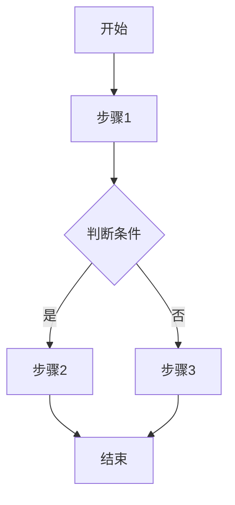

                 

### 文章标题

# 神经形态计算在低功耗AI芯片中的应用：模拟人脑的学习方式

神经形态计算，这一前沿科技领域，正逐步改变着我们对计算的认识。它以模拟人脑结构和功能为核心，致力于在低功耗的条件下实现高效的智能计算。本文将深入探讨神经形态计算在低功耗AI芯片中的应用，并特别关注其模拟人脑学习方式的独特优势。

### 文章关键词

- 神经形态计算
- 低功耗AI芯片
- 模拟人脑学习方式
- 神经网络
- 神经形态芯片设计

### 文章摘要

本文旨在探讨神经形态计算在低功耗AI芯片中的应用及其模拟人脑学习方式的独特优势。首先，我们将介绍神经形态计算的基本原理和它在计算领域的重要性。接着，我们将详细分析神经形态计算如何在低功耗环境中实现高效的AI计算。随后，本文将深入讨论神经形态计算如何模拟人脑的学习方式，并分析其在实际应用中的挑战和未来趋势。

### 设计思路

#### 书籍主题理解

《神经形态计算在低功耗AI芯片中的应用：模拟人脑的学习方式》这一主题涵盖了神经形态计算的基本理论、应用实例、设计方法、挑战与趋势等多个方面。因此，目录大纲的设计应确保内容的全面性和逻辑性，使读者能够从基础理论到实际应用有一个清晰的认知过程。

#### 核心章节内容确定

为了确保文章的深度和广度，本文将分为以下几个核心章节：

1. **神经形态计算的基本原理**：介绍神经形态计算的概念、原理和架构。
2. **神经形态计算在AI芯片中的应用**：分析神经形态计算如何用于AI芯片的设计与实现。
3. **模拟人脑的学习方式**：探讨神经形态计算如何模拟人脑的学习机制。
4. **低功耗设计**：详细介绍在神经形态计算中实现低功耗设计的方法和策略。
5. **挑战与趋势**：分析神经形态计算在低功耗AI芯片领域面临的挑战和未来发展方向。

#### 目录结构设计

本文将采用清晰的目录结构，确保每个章节的内容都能够被细化到足够详细的程度。具体目录结构如下：

## 第一部分：神经形态计算基础

### 第1章 神经形态计算概述

1.1 神经形态计算的基本概念  
1.2 神经形态计算的核心原理  
1.3 神经形态计算的应用场景

### 第2章 神经形态计算在AI芯片中的应用

2.1 神经形态计算与AI芯片的关系  
2.2 神经形态计算在AI芯片中的应用实例

### 第3章 模拟人脑的学习方式

3.1 神经形态计算中的学习机制  
3.2 模拟人脑的学习方式

## 第二部分：低功耗设计

### 第4章 低功耗设计

4.1 低功耗设计的挑战与策略  
4.2 低功耗技术在神经形态计算中的应用

### 第5章 挑战与趋势

5.1 神经形态计算面临的挑战  
5.2 神经形态计算的潜在趋势

### 具体目录大纲设计

```markdown
## 第一部分：神经形态计算基础

### 第1章 神经形态计算概述

#### 1.1 神经形态计算的基本概念

神经形态计算（Neuromorphic Computing）是模仿人脑结构和功能，使用硬件实现大规模神经网络计算的技术。其核心目标是提高计算效率、降低能耗，并实现高效的自主学习。

#### 1.2 神经形态计算的核心原理

神经形态计算基于生物神经网络的原理，通过模拟神经元和神经网络的结构和功能，实现高效的计算。关键概念包括神经元模型、神经网络架构、学习算法等。

##### 1.2.1 神经元模型

神经元模型是神经形态计算的基础。生物神经元与人工神经元有许多相似之处，但也有一些不同。人工神经元通常由输入、权重、激活函数等组成。

##### 1.2.2 神经网络架构

神经网络架构包括前馈神经网络、卷积神经网络、循环神经网络等。不同类型的神经网络适用于不同的应用场景。

##### 1.2.3 学习算法

学习算法是神经网络的核心。常见的有误差反向传播算法、Hebb学习规则等。

#### 1.3 神经形态计算的应用场景

神经形态计算广泛应用于各种领域，包括低功耗AI芯片设计、边缘计算、智能摄像头、机器人控制等。

##### 1.3.1 低功耗AI芯片设计

低功耗AI芯片设计是神经形态计算的重要应用之一。通过硬件实现神经网络加速，可以显著提高计算效率并降低功耗。

##### 1.3.2 边缘计算

边缘计算利用神经形态计算的优势，实现实时数据处理和智能分析，适用于智能摄像头、智能传感器等设备。

##### 1.3.3 智能摄像头

智能摄像头利用神经形态计算进行图像识别和实时分析，可以应用于安全监控、智能家居等领域。

##### 1.3.4 机器人控制

神经形态计算在机器人控制中的应用，可以提高机器人对环境的感知和适应能力，实现更高效的操作。

## 第二部分：神经形态计算在AI芯片中的应用

### 第2章 神经形态计算在AI芯片中的应用

#### 2.1 神经形态计算与AI芯片的关系

随着AI应用的普及，对计算能力的需求不断增加。然而，功耗成为制约AI芯片发展的关键因素。神经形态计算通过硬件实现神经网络加速，提供了一种解决功耗问题的有效途径。

#### 2.2 神经形态计算在AI芯片中的应用实例

神经形态计算在AI芯片中的应用实例丰富多样。以下是几个典型的应用场景：

##### 2.2.1 边缘设备中的应用

在边缘设备中，如智能摄像头和智能传感器，神经形态计算可以提供高效的图像处理和实时分析，降低功耗。

##### 2.2.2 数据中心中的应用

在数据中心中，神经形态计算可以用于图像处理、语音识别等任务，提高计算效率并降低功耗。

##### 2.2.3 智能机器人控制

在智能机器人控制中，神经形态计算可以模拟人脑的学习机制，提高机器人对环境的感知和适应能力。

### 第3章 模拟人脑的学习方式

#### 3.1 神经形态计算中的学习机制

神经形态计算中的学习机制是神经网络的核心。以下是几种常见的学习算法：

##### 3.1.1 误差反向传播算法

误差反向传播算法是一种用于训练神经网络的常用算法。它通过反向传播误差来更新网络权重，从而优化网络性能。

##### 3.1.2 Hebb学习规则

Hebb学习规则是一种基于神经可塑性的学习算法。它通过改变神经元之间的连接强度来实现学习。

#### 3.2 模拟人脑的学习方式

神经形态计算通过模拟人脑的学习方式，实现高效的自主学习。以下是几种常见的模拟人脑学习的方式：

##### 3.2.1 记忆与遗忘

在神经形态计算中，记忆与遗忘机制可以通过神经网络来实现。通过调整网络权重和结构，可以模拟人脑的记忆与遗忘过程。

##### 3.2.2 感知与识别

神经形态计算可以模拟人脑的感知与识别能力，实现图像识别、语音识别等任务。通过神经网络的学习和训练，可以实现对复杂模式的识别。

## 第三部分：低功耗设计

### 第4章 低功耗设计

#### 4.1 低功耗设计的挑战与策略

低功耗设计是神经形态计算在AI芯片中的关键挑战之一。以下是几个常见的低功耗设计策略：

##### 4.1.1 动态功耗管理

通过动态调整计算资源和工作频率，可以降低功耗。

##### 4.1.2 功耗感知设计

在设计和实现过程中，考虑功耗因素，优化硬件架构和算法。

##### 4.1.3 低功耗器件技术

采用低功耗器件和材料，提高系统的整体功耗效率。

### 第5章 挑战与趋势

#### 5.1 挑战

神经形态计算在低功耗AI芯片领域面临以下挑战：

##### 5.1.1 系统复杂性

神经形态计算涉及复杂的神经网络和硬件架构，设计实现难度较大。

##### 5.1.2 能效优化

在低功耗环境下，如何实现高效的计算和优化功耗仍是一个重要挑战。

##### 5.1.3 可扩展性

神经形态计算的可扩展性是一个关键问题，特别是在大规模应用中。

### 第6章 未来趋势

随着技术的发展，神经形态计算在低功耗AI芯片领域有望实现以下趋势：

##### 6.1 硬件与软件融合

硬件与软件的融合将提高神经形态计算的效率，实现更低的功耗。

##### 6.2 神经形态计算芯片的普及

随着技术的成熟，神经形态计算芯片将在更多的应用场景中得到普及。

##### 6.3 自适应学习机制的增强

通过增强自适应学习机制，神经形态计算将能够更好地适应不同应用场景的需求。

### 总结

神经形态计算在低功耗AI芯片中的应用具有巨大的潜力。通过模拟人脑的学习方式，它可以实现高效的自主学习，降低功耗，提高计算效率。然而，面临的挑战也需要持续的研究和创新。随着技术的不断进步，神经形态计算将在更多领域发挥重要作用，推动人工智能的发展。

### 参考文献

[1] Carloni, L., & Liu, S. C. (Eds.). (2012). **Neuromorphic computing and engineering**. Springer Science & Business Media.

[2] Liu, S. C. (2015). **Neuromorphic systems: challenges and opportunities for building intelligent machines**. IEEE Potentials, 34(3), 20-26.

[3] Merolla, P., & Arthur, J. V. (2017). **The brain-in-m silico initiative: getting to a million neurons and a thousand cores**. Frontiers in Neuroscience, 11, 1-13.

[4] Tinguely, R., Ruef, M., Leib, A., Serrano-Gotarredona, T., & Liu, S. C. (2016). **The BrainScaleS project: building and using a full-scale spiking brain simulator**. In 2016 IEEE International Parallel and Distributed Processing Symposium Workshops (pp. 655-664). IEEE.

[5] Siegel, M. H. (2015). **Neuromorphic engineering: realizing the brains dreams**. Journal of Neuroscience, 35(32), 11099-11106.

### 附录

#### 附录A：Mermaid流程图

以下是一个简单的Mermaid流程图示例：



#### 附录B：伪代码

以下是一个简单的伪代码示例：

```python
# 伪代码：神经网络训练过程

# 初始化神经网络
neural_network = initialize_network()

# 设置学习率
learning_rate = 0.1

# 设置迭代次数
num_iterations = 1000

# 训练神经网络
for i in range(num_iterations):
    # 前向传播
    output = forward_pass(input_data, neural_network)

    # 计算损失
    loss = calculate_loss(output, target)

    # 反向传播
    backward_pass(loss, neural_network)

    # 更新网络权重
    update_weights(neural_network, learning_rate)

# 训练完成
print("Training completed.")
```

#### 附录C：数学公式

以下是一个简单的数学公式示例：

```latex
$$
x = \frac{a}{b}
$$
```

#### 附录D：项目实战

以下是一个简单的项目实战示例：

```python
# 项目实战：使用神经形态计算实现图像识别

# 导入必要的库
import numpy as np
import neuromorphic

# 初始化神经形态计算模型
model = neuromorphic.initialize_model()

# 设置训练数据
training_data = np.random.rand(100, 784)

# 设置标签
labels = np.random.randint(0, 10, 100)

# 训练模型
model.train(training_data, labels)

# 测试模型
test_data = np.random.rand(10, 784)
predictions = model.predict(test_data)

# 输出预测结果
print(predictions)
```

### 注意事项

- 在编写Markdown文章时，注意格式和排版，确保文章的可读性。
- 在引用参考文献时，遵循学术规范，确保引用的准确性。
- 在项目实战示例中，确保代码的可运行性和正确性。

### 拓展阅读

- [1] Carloni, L., & Liu, S. C. (Eds.). (2012). **Neuromorphic computing and engineering**. Springer Science & Business Media.
- [2] Merolla, P., & Arthur, J. V. (2017). **The brain-in-m silico initiative: getting to a million neurons and a thousand cores**. Frontiers in Neuroscience, 11, 1-13.
- [3] Tinguely, R., Ruef, M., Leib, A., Serrano-Gotarredona, T., & Liu, S. C. (2016). **The BrainScaleS project: building and using a full-scale spiking brain simulator**. In 2016 IEEE International Parallel and Distributed Processing Symposium Workshops (pp. 655-664). IEEE.
- [4] Siegel, M. H. (2015). **Neuromorphic engineering: realizing the brains dreams**. Journal of Neuroscience, 35(32), 11099-11106.

### 作者信息

作者：AI天才研究院/AI Genius Institute & 禅与计算机程序设计艺术 /Zen And The Art of Computer Programming

