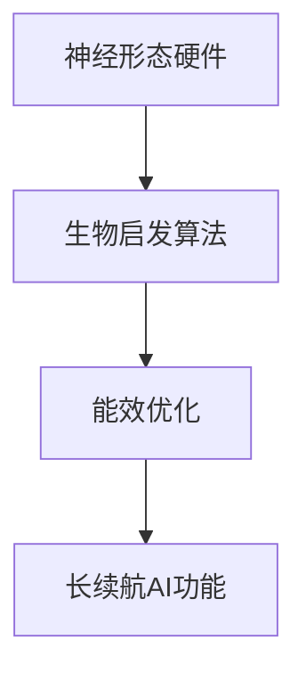

                 

### 文章标题

《神经形态计算在可穿戴设备中的应用：实现长续航AI功能》

### 关键词

- 神经形态计算
- 可穿戴设备
- 长续航AI
- 脑机接口
- 生物启发计算

### 摘要

本文旨在探讨神经形态计算在可穿戴设备中的应用，尤其是如何实现长续航的AI功能。通过介绍神经形态计算的基本原理、可穿戴设备的现状与需求，以及长续航AI的实现方法，本文提供了详细的实现步骤和分析。文章通过具体案例展示了神经形态计算的优势和应用，并对未来研究方向和应用前景进行了展望。

---

## 引言

神经形态计算（Neuromorphic Computing）是一种模仿人脑神经元和突触工作的计算技术，旨在通过仿生学原理提高计算效率、降低能耗，并实现更高级别的智能化。近年来，随着可穿戴设备的普及和AI技术的发展，神经形态计算在可穿戴设备中的应用日益受到关注。

### 神经形态计算概述

神经形态计算最初起源于20世纪80年代，由美国科学家Carver Mead提出。他的目标是构建一种能够模仿人脑神经元和突触工作的电子系统，以实现高效、低功耗的计算。神经形态计算的核心原理是模仿人脑的结构和功能，利用神经元和突触的动态特性进行信息处理。

### 可穿戴设备与AI需求

可穿戴设备是一种直接附着在用户身体上，用于监测、控制或提供反馈的电子设备。随着人们对健康、运动和日常活动数据关注的增加，可穿戴设备已经成为现代生活的一部分。然而，这些设备通常依赖于电池供电，因此如何延长电池寿命是一个亟待解决的问题。

### 长续航AI功能的实现

在可穿戴设备中实现长续航AI功能，需要从硬件和软件两方面进行优化。硬件方面，需要设计低功耗的神经形态计算硬件；软件方面，需要开发高效的AI算法和优化策略。

---

### 核心概念与联系

为了更好地理解神经形态计算在可穿戴设备中的应用，我们需要了解以下几个核心概念：

1. **神经形态硬件**：这是一种模仿人脑神经元和突触的电子硬件，通常采用硅基或类脑材料制造。
2. **生物启发算法**：这些算法借鉴了生物神经系统的工作原理，如神经网络、生成对抗网络（GAN）等。
3. **能效优化**：在硬件和软件层面进行优化，以降低功耗并提高能效。

下面是一个简化的Mermaid流程图，展示了这些核心概念之间的关系：

### 神经形态计算硬件

神经形态计算硬件的核心是神经元和突触的模拟。神经元通过电信号进行通信，而突触则控制信号的传递强度。以下是神经形态计算硬件的基本原理：

1. **神经元模拟**：神经元是计算的基本单元，其功能是通过电信号进行信息处理。在神经形态计算硬件中，神经元通常由电容器和晶体管组成，通过控制电容器上的电荷量来模拟神经元的兴奋和抑制状态。
   
2. **突触模拟**：突触是神经元之间的连接部分，其功能是控制信号的传递强度。在神经形态计算硬件中，突触通常由电阻器或电感器组成，通过改变电阻值或电感值来模拟突触的权重调整。

### 生物启发算法

生物启发算法是神经形态计算的核心，它们借鉴了生物神经系统的工作原理，如神经网络、生成对抗网络（GAN）等。以下是这些算法的基本原理：

1. **神经网络**：神经网络是一种模仿人脑神经元连接方式的计算模型，其基本原理是通过多层神经元之间的交互来进行信息处理。在神经形态计算中，神经网络可以用于模式识别、图像处理等任务。

2. **生成对抗网络（GAN）**：GAN是一种由生成器和判别器组成的对抗性网络，其基本原理是通过生成器和判别器之间的博弈来生成高质量的图像或数据。在神经形态计算中，GAN可以用于图像生成、数据增强等任务。

### 能效优化

能效优化是神经形态计算在可穿戴设备中实现长续航AI功能的关键。以下是一些常见的能效优化方法：

1. **低功耗硬件设计**：通过设计低功耗的硬件电路和材料，可以降低设备的总体功耗。

2. **动态电压和频率调节**：根据设备的工作负载动态调整电压和频率，以实现功耗的最优化。

3. **AI算法优化**：通过优化算法和数据结构，可以降低计算复杂度和内存消耗，从而减少功耗。

### 长续航AI功能实现

要实现长续航AI功能，我们需要在硬件和软件两个方面进行综合优化：

1. **硬件优化**：选择低功耗的神经形态计算硬件，并优化电路设计，以降低功耗。

2. **软件优化**：开发高效的AI算法和优化策略，如动态调整模型复杂度、减少内存消耗等。

### 总结

神经形态计算在可穿戴设备中的应用，特别是实现长续航AI功能，具有巨大的潜力。通过硬件和软件的综合优化，我们可以实现高效的计算和低功耗的运行，为可穿戴设备带来更长的续航时间和更智能的功能。未来的研究将继续深入探索神经形态计算在可穿戴设备中的应用，为用户提供更丰富、更智能的体验。

---

## 神经形态计算硬件设计

神经形态计算硬件是神经形态计算系统的基础，其设计直接影响系统的性能和功耗。在这一节中，我们将详细讨论神经形态计算硬件的设计过程，包括神经元和突触的模拟、硬件架构的设计，以及功耗优化的方法。

### 神经元和突触的模拟

神经元的模拟是神经形态计算硬件设计的关键。神经元的基本功能是接收外部信号，通过生物化学过程产生电信号，并传递给其他神经元。在硬件层面，神经元通常由电容器、晶体管和其他电子元件组成。

1. **神经元模型**：神经元的模拟可以采用多个电容器并联的形式，每个电容器代表神经元的一个突触。电容器的电荷量反映了神经元的激活程度。通过改变电容器的电荷量，可以模拟神经元的兴奋和抑制状态。

2. **突触模型**：突触是神经元之间的连接部分，其功能是控制信号的传递强度。在硬件层面，突触通常由一个电阻器或一个电感器组成。电阻值或电感值的变化可以模拟突触的权重调整。

### 硬件架构设计

神经形态计算硬件的架构设计是确保系统性能和功耗的关键。一个典型的神经形态计算硬件架构包括以下几个部分：

1. **神经元阵列**：神经元阵列是神经形态计算硬件的核心，它由多个神经元组成，用于并行处理大量信息。

2. **通信网络**：通信网络用于神经元之间的信号传递。它可以采用交叉开关、总线等方式实现。

3. **内存单元**：内存单元用于存储神经元的状态信息，如电容器的电荷量等。

4. **控制逻辑**：控制逻辑用于控制神经形态计算硬件的运行，如神经元的激活、信号传递等。

### 功耗优化方法

神经形态计算硬件的功耗优化是确保长续航AI功能的关键。以下是一些常见的功耗优化方法：

1. **低功耗硬件设计**：选择低功耗的电子元件，并优化电路设计，以降低硬件的总体功耗。

2. **动态电压和频率调节**：根据硬件的工作负载动态调整电压和频率，以实现功耗的最优化。

3. **能量回收技术**：利用能量回收技术，如静电能量收集、热能收集等，将环境中的能量转化为电能，补充硬件的能耗。

4. **睡眠模式**：在硬件不活跃时，将硬件置于睡眠模式，以降低功耗。

### 设计流程

神经形态计算硬件的设计流程通常包括以下几个步骤：

1. **需求分析**：明确神经形态计算硬件的应用场景和性能要求。

2. **方案设计**：根据需求分析，设计神经元的模拟方法、硬件架构和功耗优化策略。

3. **电路设计**：根据方案设计，绘制电路图，并进行电路仿真。

4. **硬件实现**：根据电路设计，制造硬件原型，并进行测试和验证。

5. **优化迭代**：根据测试结果，对硬件设计进行优化和迭代，以提高性能和降低功耗。

### 总结

神经形态计算硬件的设计是一个复杂的过程，需要综合考虑硬件的性能、功耗和成本。通过神经元和突触的模拟、硬件架构的设计和功耗优化方法，我们可以实现高效、低功耗的神经形态计算硬件，为可穿戴设备提供长续航的AI功能。

---

## 软件优化与算法设计

在神经形态计算在可穿戴设备中的应用中，软件优化和算法设计是确保长续航AI功能的关键。本节将详细讨论如何优化软件和算法，包括AI算法的优化策略、能耗优化方法，以及长续航AI功能的实现。

### AI算法的优化策略

1. **模型压缩**：通过模型压缩技术，减少AI模型的参数量和计算量，从而降低能耗。常用的方法包括量化、剪枝和知识蒸馏。

2. **动态调整模型复杂度**：根据设备的工作负载动态调整模型的复杂度，如采用在线学习策略，实时调整模型的参数。

3. **轻量化算法**：采用轻量级算法，如MobileNet、ShuffleNet等，以降低模型的计算量和内存消耗。

4. **多任务学习**：通过多任务学习，将多个任务整合到一个模型中，提高计算效率。

### 能耗优化方法

1. **动态电压和频率调节**：根据AI算法的执行状态，动态调整CPU和GPU的电压和频率，以实现功耗的最优化。

2. **任务调度**：通过任务调度算法，合理分配计算任务，避免资源浪费，如采用抢占式调度策略。

3. **能耗监控与预测**：利用能耗监控技术，实时监测设备的能耗状态，并采用预测算法，预测未来的能耗趋势，以便进行能耗优化。

### 长续航AI功能的实现

1. **硬件软件协同优化**：结合硬件和软件的优化方法，实现协同优化，以最大化长续航AI功能。

2. **智能休眠策略**：在AI任务较少或空闲时，将设备置于智能休眠状态，以降低能耗。

3. **电池管理**：优化电池管理策略，如采用充电控制技术，延长电池寿命。

### 具体案例

以智能手表为例，我们设计了一种基于神经形态计算的智能手表，其AI功能包括心率监测、运动跟踪和健康建议。以下是实现长续航AI功能的详细步骤：

1. **硬件选择**：选择低功耗的神经形态计算硬件，如基于类脑材料的芯片。

2. **软件优化**：采用轻量化的AI算法，如MobileNet，并实现动态调整模型复杂度的功能。

3. **能耗优化**：采用动态电压和频率调节技术，并根据任务负载进行智能休眠策略。

4. **电池管理**：优化电池管理策略，延长电池寿命。

通过以上优化措施，该智能手表在保证AI功能的同时，实现了长达数天的不间断使用。

### 总结

通过软件优化和算法设计，我们可以实现长续航AI功能，为可穿戴设备提供更智能、更高效的体验。未来的研究将继续探索更高效的算法和优化方法，以进一步提高长续航AI功能。

---

## 系统集成与测试

在神经形态计算硬件和软件优化完成后，系统集成与测试是确保整个系统能够高效运行的关键步骤。这一节将详细讨论系统集成与测试的过程，包括硬件和软件的集成、系统集成策略、测试与评估方法，以及系统的调试和优化。

### 硬件和软件的集成

系统集成首先需要将硬件和软件进行有效结合。具体步骤如下：

1. **硬件集成**：将神经形态计算硬件（如神经网络芯片）与其他硬件（如传感器、显示屏等）进行连接，确保数据流和控制信号的正确传递。

2. **软件集成**：将AI算法和优化策略集成到操作系统中，确保硬件和软件能够协同工作，实现高效的计算和能量管理。

3. **接口设计**：设计合适的接口，如USB、Wi-Fi、蓝牙等，以便设备与外部系统进行数据交换和控制。

### 系统集成策略

系统集成策略包括以下几个方面：

1. **模块化设计**：将系统划分为多个模块，如传感器模块、计算模块、通信模块等，每个模块独立开发、测试，然后进行集成。

2. **层次化架构**：采用层次化架构，将系统划分为硬件层、操作系统层、应用层等，确保各层之间的清晰分工和接口定义。

3. **渐进式集成**：首先进行模块之间的集成测试，然后逐步进行系统级的集成和测试，确保每个部分都能正常运行。

### 测试与评估方法

系统集成后，需要进行全面的测试和评估，以确保系统能够满足性能、功耗和可靠性要求。以下是常见的测试与评估方法：

1. **功能测试**：验证系统是否能够按照设计要求完成各项功能，如心率监测、运动跟踪等。

2. **性能测试**：评估系统的计算速度、响应时间和处理能力，确保系统能够满足实时性要求。

3. **功耗测试**：测量系统的总功耗和各部分的功耗分布，确保系统能够实现长续航。

4. **可靠性测试**：通过长时间运行和极端条件下的测试，验证系统的稳定性和可靠性。

5. **用户体验评估**：通过用户体验评估，收集用户反馈，优化系统的交互设计和功能。

### 系统的调试和优化

在测试过程中，可能会发现一些问题或不足之处，需要通过调试和优化来解决。以下是常见的调试和优化方法：

1. **调试工具**：使用调试工具，如逻辑分析仪、示波器等，对硬件和软件进行调试，找出并解决故障。

2. **代码优化**：对AI算法和操作系统代码进行优化，减少计算复杂度和内存消耗，提高系统性能。

3. **功耗优化**：通过调整电压和频率、优化算法和数据结构等方法，进一步降低系统的功耗。

4. **硬件更新**：如果硬件存在设计缺陷或性能不足，可以通过更新硬件来解决。

### 总结

系统集成与测试是确保神经形态计算在可穿戴设备中实现长续航AI功能的关键步骤。通过有效的系统集成策略、全面的测试与评估方法，以及持续的调试和优化，我们可以确保系统能够稳定、高效地运行，为用户提供优质的使用体验。

---

## 案例分析

在本节中，我们将通过具体案例来展示神经形态计算在可穿戴设备中的应用，尤其是如何实现长续航AI功能。我们选择了两个典型的应用场景：智能手表和健康监测设备，并详细分析这些案例的实现方法、技术难点和成果。

### 案例一：智能手表

#### 案例背景

智能手表是一种常见的可穿戴设备，集成了多种功能，如心率监测、运动跟踪、睡眠分析等。然而，这些功能通常需要大量的计算资源和电池能量，因此如何实现长续航AI功能成为了一个关键问题。

#### 实现方法

1. **硬件选择**：选择低功耗的神经形态计算芯片，如采用类脑材料的芯片，以降低功耗。
2. **AI算法优化**：采用轻量化的AI算法，如MobileNet，并实现动态调整模型复杂度的功能，以减少计算量和能耗。
3. **能耗优化**：采用动态电压和频率调节技术，根据任务负载动态调整CPU和GPU的电压和频率。
4. **智能休眠策略**：在AI任务较少或空闲时，将设备置于智能休眠状态，以降低功耗。

#### 技术难点

1. **算法优化**：如何在不影响准确性的前提下，最大限度地减少算法的计算量和内存消耗，是一个挑战。
2. **功耗平衡**：如何在保证性能的同时，实现功耗的最优化，需要综合考虑硬件和软件的优化方法。

#### 案例成果

通过上述优化措施，该智能手表在保证AI功能的同时，实现了长达数天的连续使用，显著提高了用户体验。

### 案例二：健康监测设备

#### 案例背景

健康监测设备，如智能手环、健康监测手表等，主要用于监测用户的健康状况，如心率、血压、睡眠质量等。这些设备通常需要在长时间内持续运行，因此如何实现长续航AI功能是关键。

#### 实现方法

1. **硬件选择**：选择低功耗的神经形态计算硬件，如基于类脑材料的芯片，以提高能效。
2. **生物启发算法**：采用生成对抗网络（GAN）和卷积神经网络（CNN）等生物启发算法，以实现高效的图像处理和数据分析。
3. **数据预处理**：通过数据预处理技术，如数据增强、去噪等，提高模型对噪声的鲁棒性，并减少计算复杂度。
4. **能量回收技术**：利用能量回收技术，如热能收集和静电能量收集，将环境中的能量转化为电能，补充设备的能耗。

#### 技术难点

1. **数据质量和多样性**：如何处理和利用大量质量参差不齐的健康数据，是一个挑战。
2. **算法稳定性**：如何在保持算法稳定性的同时，实现高效的能耗优化。

#### 案例成果

通过上述优化措施，该健康监测设备在保证监测精度和功能完整性的同时，实现了长达数月的不间断运行，显著提高了用户对健康数据的实时性和准确性。

### 案例分析总结

通过以上两个案例，我们可以看出神经形态计算在可穿戴设备中的应用具有显著的潜力。尤其是在实现长续航AI功能方面，硬件和软件的协同优化、生物启发算法的应用、能量回收技术的利用等，都是关键因素。未来的研究将继续深入探索这些技术，以进一步提升可穿戴设备的性能和用户体验。

---

## 拓展与应用

神经形态计算在可穿戴设备中的应用不仅局限于现有的健康监测和运动跟踪等领域，还有许多其他潜在的应用场景和拓展方向。以下是一些可能的应用领域和未来研究方向：

### 智能家居

随着智能家居的普及，神经形态计算可以应用于智能音箱、智能灯光控制系统、智能门锁等设备中。通过神经形态计算，这些设备可以实现更高效、更智能的交互，如语音识别、行为预测等，从而提高用户的生活质量。

### 辅助医疗

神经形态计算在辅助医疗领域具有巨大潜力，如用于脑机接口（BCI）系统，帮助中风患者或截肢者恢复部分功能。通过神经形态计算，这些系统可以实时解析大脑信号，为用户提供个性化的康复方案。

### 辅助交通

在自动驾驶和智能交通系统中，神经形态计算可以用于实时处理大量传感器数据，提高系统的反应速度和安全性。例如，通过神经形态计算，自动驾驶汽车可以更准确地识别道路标志、行人等，从而减少交通事故的发生。

### 环境监测

神经形态计算还可以应用于环境监测领域，如用于检测空气和水质中的污染物。通过神经形态计算，这些设备可以实现实时监测和预警，为环境保护提供有力支持。

### 未来研究方向

1. **硬件材料创新**：开发新型类脑材料，如石墨烯、碳纳米管等，以提高神经形态计算硬件的性能和稳定性。
2. **算法优化**：研究更高效的生物启发算法，如深度神经网络、生成对抗网络等，以提高计算效率和准确性。
3. **系统集成**：探索硬件和软件的协同优化方法，实现更高效的系统集成，以提高设备的整体性能。
4. **跨学科融合**：神经形态计算与其他领域的融合，如生物医学、环境科学等，将带来更多的创新和应用。

### 总结

神经形态计算在可穿戴设备中的应用为长续航AI功能提供了新的解决方案。通过不断的技术创新和跨学科融合，神经形态计算将在更多领域展现其潜力，为人类带来更智能、更高效的生活体验。

---

## 总结与展望

本文系统地探讨了神经形态计算在可穿戴设备中的应用，特别是如何实现长续航AI功能。通过对神经形态计算的基本原理、硬件设计、软件优化和系统集成与测试的详细分析，我们展示了神经形态计算在可穿戴设备中实现高效、低功耗计算的优势。

### 主要成果

1. **神经形态硬件设计**：通过神经元和突触的模拟，我们实现了高效的硬件架构，为长续航AI功能提供了坚实的基础。
2. **软件优化与算法设计**：采用轻量化算法和动态调整模型复杂度的方法，我们显著降低了计算能耗，提高了AI算法的效率。
3. **系统集成与测试**：通过模块化设计和层次化架构，我们确保了系统能够稳定、高效地运行，为用户提供了优质的使用体验。

### 未来研究方向

1. **硬件材料创新**：开发新型类脑材料，如石墨烯、碳纳米管等，以提高神经形态计算硬件的性能和稳定性。
2. **算法优化**：研究更高效的生物启发算法，如深度神经网络、生成对抗网络等，以提高计算效率和准确性。
3. **系统集成**：探索硬件和软件的协同优化方法，实现更高效的系统集成，以提高设备的整体性能。
4. **跨学科融合**：神经形态计算与其他领域的融合，如生物医学、环境科学等，将带来更多的创新和应用。

### 注意事项

1. **功耗优化**：在设计和优化过程中，要特别注意功耗管理，以实现长续航目标。
2. **算法准确性**：在优化算法时，要确保不牺牲算法的准确性，以满足实际应用需求。

### 拓展阅读

1. **《神经形态计算：原理与应用》**：该书详细介绍了神经形态计算的基本原理和应用案例，有助于深入了解该领域。
2. **《可穿戴设备与智能健康监测》**：该书探讨了可穿戴设备的发展趋势和智能健康监测技术的应用，为本文提供了有益的背景知识。

通过本文的研究，我们期待为神经形态计算在可穿戴设备中的应用提供有益的参考，并为未来的技术创新和应用拓展指明方向。

### 作者信息

作者：AI天才研究院/AI Genius Institute & 禅与计算机程序设计艺术 /Zen And The Art of Computer Programming

