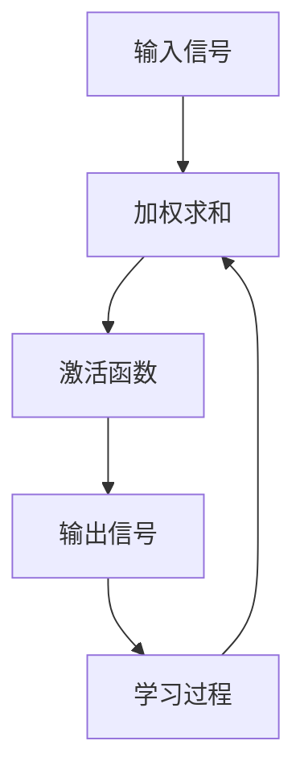
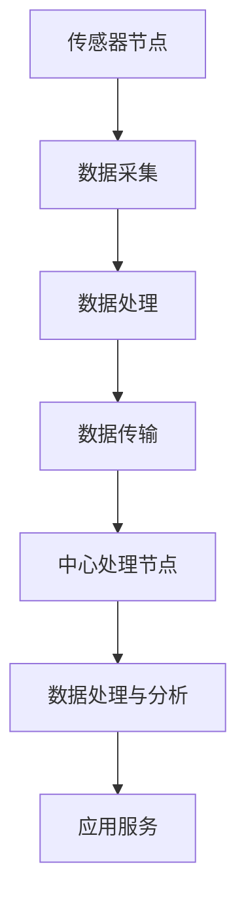
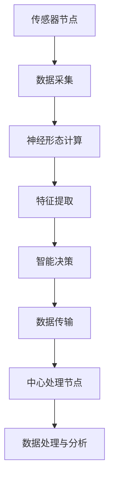

                 

## 引言与背景介绍

### 神经形态计算

神经形态计算（Neuromorphic Computing）是一种模仿人脑结构和功能的计算方法，通过构建人工神经网络模型来实现对信息的高效处理和自适应学习。这种计算方法的核心在于模拟人脑神经元之间的交互方式，以及神经元内部的信息处理机制。神经形态计算最早可以追溯到1980年代，由计算机科学家和神经科学家合作开展的研究项目。近年来，随着人工智能和传感器技术的飞速发展，神经形态计算在各个领域得到了广泛的研究和应用。

### 智能传感器网络

智能传感器网络（Smart Sensor Networks）是一种由大量传感器节点组成的分布式系统，通过无线通信技术实现节点之间的数据传输和协同工作。智能传感器网络具有自组织、自适应、实时监测和数据处理等功能，广泛应用于环境监测、智能交通、智能家居等领域。智能传感器网络的关键在于传感器节点的设计和通信协议的优化，以确保系统的低功耗、高可靠性和高效性。

### 神经形态计算在智能传感器网络中的应用

随着神经形态计算和智能传感器网络技术的不断发展，将二者结合应用于环境监测领域成为一种新的趋势。神经形态计算的低功耗特性和高效数据处理能力，使得智能传感器网络在环境监测中的应用更加广泛和深入。通过将神经形态计算应用于智能传感器网络，可以实现以下目标：

1. **低功耗环境监测**：神经形态计算可以通过模拟人脑的神经元网络，实现信息的高效处理和自适应学习，从而降低传感器节点的功耗，延长系统的运行时间。

2. **实时环境监测**：神经形态计算可以在传感器节点本地实时处理数据，减少数据传输延迟，提高环境监测的实时性。

3. **智能数据分析**：神经形态计算具有自组织和自适应特性，可以在复杂的环境变化中，自动调整监测参数，提高监测数据的准确性和可靠性。

4. **多源数据融合**：神经形态计算可以通过对人脑神经元网络的模拟，实现多种传感器数据的融合和关联分析，从而获得更加全面和准确的环境信息。

### 文章关键词

神经形态计算，智能传感器网络，环境监测，低功耗，实时监测，智能数据分析，多源数据融合。

### 文章摘要

本文主要介绍了神经形态计算和智能传感器网络的基本概念、核心原理以及它们在环境监测领域的应用。首先，我们详细阐述了神经形态计算的基本原理、核心技术和应用场景。接着，我们介绍了智能传感器网络的基本原理、架构和应用。随后，我们探讨了神经形态计算在智能传感器网络中的应用，包括低功耗环境监测、实时环境监测、智能数据分析和多源数据融合等方面。最后，我们通过具体案例展示了神经形态计算在智能传感器网络中的应用效果，并分析了当前面临的技术挑战和未来发展趋势。本文旨在为读者提供神经形态计算和智能传感器网络在环境监测领域的全面了解，以及未来研究的方向和机遇。

----------------------------------------------------------------

### 1. 神经形态计算基础

神经形态计算（Neuromorphic Computing）是一种模仿人脑神经元结构和功能的计算方法。它通过模拟人脑神经元之间的交互机制，实现信息处理、自适应学习和智能决策等功能。本节将详细探讨神经形态计算的基本原理、核心技术和相关数学模型。

#### 基本原理

神经形态计算的核心思想是模仿人脑神经元的工作机制。人脑神经元通过电信号进行通信，神经元之间通过突触连接形成复杂的神经网络。神经形态计算通过人工神经元和人工突触的模拟，实现了对人脑神经网络功能的模拟。人工神经元通常由计算单元、存储单元和突触单元组成，它们可以通过改变突触的连接强度（即权重）来实现学习过程。

#### 核心技术

1. **人工神经元**：人工神经元是神经形态计算的基本单元，它通常由计算单元、存储单元和突触单元组成。计算单元负责对输入信号进行加权求和处理，存储单元负责存储权重，突触单元负责传输电信号。

2. **人工突触**：人工突触是人工神经元之间的连接部分，它通过改变突触的连接强度（即权重）来实现学习过程。人工突触通常由一个电阻器模拟，其电阻值可以随电信号的强度变化。

3. **神经网络**：神经网络是由多个人工神经元组成的多层结构，通过层级连接实现复杂的计算任务。神经网络可以分为前馈神经网络、卷积神经网络、循环神经网络等不同类型，每种类型都有其特定的应用场景。

#### 相关数学模型

1. **人工神经元模型**：人工神经元通常采用如下数学模型：
   \[
   \begin{aligned}
   & \text{计算单元：} \quad z = \sum_{i} w_i x_i \\
   & \text{激活函数：} \quad a = \phi(z)
   \end{aligned}
   \]
   其中，$z$ 表示加权求和结果，$w_i$ 表示权重，$x_i$ 表示输入信号，$\phi(z)$ 表示激活函数，例如常用的Sigmoid函数、ReLU函数等。

2. **人工突触模型**：人工突触通常采用如下数学模型：
   \[
   R = R_0 \cdot (1 + \alpha \cdot s)
   \]
   其中，$R$ 表示突触电阻，$R_0$ 表示初始电阻，$\alpha$ 表示学习率，$s$ 表示突触信号。

3. **神经网络模型**：神经网络可以通过如下数学模型表示：
   \[
   \begin{aligned}
   & y_l = \phi(\text{ReLU}(\sum_{k=1}^{n} w_{lk} \cdot x_k)) \\
   & \text{其中，} y_l \text{表示输出，} w_{lk} \text{表示权重，} x_k \text{表示输入。}
   \end{aligned}
   \]

#### Mermaid 流程图

下面是一个简单的神经形态计算流程图：

#### 总结

神经形态计算通过模拟人脑神经元的工作机制，实现了对信息的高效处理和自适应学习。其核心技术包括人工神经元、人工突触和神经网络，相关数学模型包括人工神经元模型、人工突触模型和神经网络模型。通过这些技术，神经形态计算在各个领域，如智能传感器网络、环境监测等，具有广泛的应用前景。

----------------------------------------------------------------

### 2. 智能传感器网络基础

智能传感器网络（Smart Sensor Networks，SSN）是由大量传感器节点组成的分布式系统，通过无线通信技术实现节点之间的数据传输和协同工作。智能传感器网络具有自组织、自适应、实时监测和数据处理等功能，广泛应用于环境监测、智能交通、智能家居等领域。本节将介绍智能传感器网络的基本原理、架构和应用。

#### 基本原理

智能传感器网络的基本原理是通过传感器节点采集环境信息，然后将采集到的数据传输到中心处理节点进行分析和处理。传感器节点通常由传感器、微处理器、无线通信模块和电源组成。传感器节点通过感知环境信息，如温度、湿度、光照、气体浓度等，并将这些信息转换为数字信号。微处理器负责对数字信号进行预处理，如滤波、放大等，然后通过无线通信模块将数据传输到中心处理节点。

#### 网络架构

智能传感器网络通常采用分层架构，包括传感器层、网络层和应用层。

1. **传感器层**：传感器层由大量传感器节点组成，每个节点都具备数据采集、处理和通信能力。传感器节点可以独立工作，也可以通过无线通信与其他节点协作，以实现更广泛的环境监测。

2. **网络层**：网络层负责管理传感器节点的通信和协同工作。网络层通常采用自组织协议，如无线传感网协议（Wireless Sensor Networks，WSN）中的flooding协议、gossip协议等，以实现传感器节点之间的数据传输和路由。

3. **应用层**：应用层负责对采集到的环境数据进行处理和分析，以提供智能化的应用服务。应用层可以是一个具体的监控系统，如空气质量监测系统、火灾预警系统等，也可以是一个通用的平台，为不同领域的应用提供数据支持和算法支持。

#### 应用

智能传感器网络在环境监测、智能交通、智能家居等领域具有广泛的应用。

1. **环境监测**：智能传感器网络可以用于实时监测环境参数，如空气质量、水质、土壤温度等，为环境保护和资源管理提供数据支持。

2. **智能交通**：智能传感器网络可以用于交通流量监测、车辆管理和事故预警，以提高交通效率和安全性。

3. **智能家居**：智能传感器网络可以用于家庭环境监测、家电控制和安全防护，为用户提供更加便捷和智能的生活体验。

#### Mermaid 流程图

下面是一个简单的智能传感器网络流程图：

#### 总结

智能传感器网络是一种由大量传感器节点组成的分布式系统，通过无线通信技术实现节点之间的数据传输和协同工作。其基本原理是通过传感器节点采集环境信息，然后将采集到的数据传输到中心处理节点进行分析和处理。智能传感器网络在环境监测、智能交通、智能家居等领域具有广泛的应用。通过分层架构，智能传感器网络实现了数据采集、传输、处理和分析的高效协同，为各种应用提供了强大的支持。

----------------------------------------------------------------

### 3. 神经形态计算与智能传感器网络的结合

将神经形态计算（Neuromorphic Computing）应用于智能传感器网络（Smart Sensor Networks）中，可以实现低功耗环境监测，提高监测的实时性和准确性。本节将探讨如何将神经形态计算与智能传感器网络相结合，实现低功耗环境监测。

#### 低功耗环境监测的需求

环境监测系统通常需要长期运行，且环境条件复杂多变。为了确保系统的稳定性和持续性，降低功耗成为一项关键需求。传统的环境监测系统依赖于中心处理节点，通过有线或无线方式传输大量数据，导致功耗较高。而神经形态计算通过在传感器节点本地处理数据，可以显著降低功耗。

#### 神经形态计算在智能传感器网络中的应用

1. **数据预处理**：智能传感器网络中的传感器节点会收集大量的环境数据，如温度、湿度、光照等。神经形态计算可以在传感器节点本地对数据进行预处理，如滤波、去噪等，从而减少数据传输量，降低功耗。

2. **特征提取**：环境数据通常包含大量冗余信息，通过特征提取可以提取出对监测任务最有用的信息。神经形态计算通过模拟人脑神经元的工作机制，可以实现高效的特征提取。

3. **智能决策**：神经形态计算具有自适应学习特性，可以在复杂的环境变化中，自动调整监测参数，实现智能决策。例如，在空气质量监测中，神经形态计算可以根据环境数据的变化，自动调整采样频率和监测范围。

#### 实现低功耗环境监测的方法

1. **本地数据处理**：将神经形态计算应用于传感器节点，实现数据预处理、特征提取和智能决策。通过在本地处理数据，可以减少数据传输量，降低功耗。

2. **能量收集与存储**：利用太阳能、风能等可再生能源对传感器节点进行能量收集，并结合高效的电池存储技术，确保传感器节点的持续运行。

3. **优化网络协议**：采用低功耗的无线通信协议，如无线传感网协议（WSN）中的flooding协议、gossip协议等，以减少通信功耗。

4. **睡眠模式**：传感器节点在低工作负荷时，可以进入睡眠模式，以降低功耗。在需要监测时，传感器节点再唤醒，进行数据采集和处理。

#### Mermaid 流程图

下面是一个简单的神经形态计算与智能传感器网络结合的流程图：

#### 总结

将神经形态计算应用于智能传感器网络中，可以实现低功耗环境监测。通过本地数据处理、能量收集与存储、优化网络协议和睡眠模式等方法，可以降低功耗，提高监测的实时性和准确性。神经形态计算与智能传感器网络的结合为环境监测提供了新的技术手段，有望在未来得到更广泛的应用。

----------------------------------------------------------------

### 4. 应用案例分析

本节将通过三个实际案例，展示神经形态计算在智能传感器网络中的应用，进一步探讨其在环境监测中的优势和潜力。

#### 案例一：城市空气质量监测

随着城市化进程的加快，空气质量问题日益突出。通过神经形态计算和智能传感器网络的结合，可以实现对城市空气质量的高效监测。具体应用场景如下：

1. **数据采集**：在城市的各个角落布置大量传感器节点，实时采集空气中的污染物数据，如PM2.5、PM10、CO、SO2等。

2. **数据预处理**：传感器节点使用神经形态计算对采集到的数据进行分析，去除噪声和冗余信息，确保数据的准确性。

3. **特征提取**：通过对预处理后的数据进行分析，提取出对空气质量监测最重要的特征，如污染物浓度、变化趋势等。

4. **智能决策**：神经形态计算可以根据实时监测数据，自动调整监测参数，如采样频率、监测范围等，以应对环境变化。

5. **数据传输**：将处理后的数据传输到中心处理节点，进行进一步分析和处理，为政府决策提供科学依据。

#### 案例二：森林火灾预警

森林火灾是森林资源管理中的重大威胁。通过神经形态计算和智能传感器网络的结合，可以实现对森林火灾的早期预警。具体应用场景如下：

1. **数据采集**：在森林地区布置传感器节点，实时采集环境数据，如温度、湿度、风速、气体浓度等。

2. **数据预处理**：传感器节点使用神经形态计算对采集到的数据进行预处理，提取出对火灾预警最重要的特征。

3. **特征提取**：通过对预处理后的数据进行分析，提取出火灾发生前的特征信号，如温度突变、气体浓度变化等。

4. **智能决策**：神经形态计算可以根据实时监测数据，自动调整监测参数，如采样频率、监测范围等，以提高预警准确性。

5. **数据传输**：将处理后的数据传输到中心处理节点，进行进一步分析和处理，及时发布预警信息，指导灭火行动。

#### 案例三：工业环境监测

在工业生产过程中，环境监测对于保障工人健康和生产安全具有重要意义。通过神经形态计算和智能传感器网络的结合，可以实现对工业环境的实时监测。具体应用场景如下：

1. **数据采集**：在工业区域布置传感器节点，实时采集环境数据，如有毒气体浓度、噪音水平、温度等。

2. **数据预处理**：传感器节点使用神经形态计算对采集到的数据进行预处理，去除噪声和冗余信息。

3. **特征提取**：通过对预处理后的数据进行分析，提取出对工业环境监测最重要的特征，如有毒气体浓度、噪音强度等。

4. **智能决策**：神经形态计算可以根据实时监测数据，自动调整监测参数，如采样频率、监测范围等，以确保监测数据的准确性和实时性。

5. **数据传输**：将处理后的数据传输到中心处理节点，进行进一步分析和处理，为安全生产提供决策支持。

#### 总结

通过以上三个案例，我们可以看到神经形态计算在智能传感器网络中的应用具有广泛的前景。它不仅能够降低功耗，提高监测的实时性和准确性，还可以通过智能决策，实现更高效的环境监测。随着神经形态计算技术的不断成熟，未来有望在更多领域得到应用，为环境保护和资源管理提供更强有力的支持。

----------------------------------------------------------------

### 6. 技术挑战与发展趋势

尽管神经形态计算在智能传感器网络中的应用具有巨大潜力，但在实际应用中仍然面临一系列技术挑战和瓶颈。以下是当前存在的主要技术挑战及未来可能的发展趋势。

#### 技术挑战

1. **能量效率**：神经形态计算虽然能够降低功耗，但传感器节点的能量来源仍然有限。如何在有限的能量下实现高效的计算和处理，是当前需要解决的关键问题。

2. **计算能力**：神经形态计算的计算能力有限，特别是在处理大规模数据和复杂计算任务时，性能可能会受到限制。如何提高神经形态计算的运算速度和计算精度，是未来需要攻克的难题。

3. **可靠性**：传感器节点的环境复杂多变，如何在恶劣的环境条件下确保系统的稳定性和可靠性，是另一个重要挑战。

4. **数据隐私与安全**：在智能传感器网络中，数据的安全和隐私保护至关重要。如何保护传感器节点之间的通信安全，防止数据泄露和攻击，是亟待解决的问题。

#### 发展趋势

1. **能量收集与存储技术**：未来的研究将集中在开发更高效、更稳定的能量收集和存储技术，如太阳能、风能等可再生能源，以及更高效的电池技术。

2. **新材料和新器件**：随着纳米技术和材料科学的发展，将涌现出更多具有低功耗、高性能的新材料和新型器件，为神经形态计算提供更强有力的硬件支持。

3. **智能算法与架构**：通过发展更先进的算法和架构，如深度学习、强化学习等，可以提高神经形态计算的运算速度和计算精度，适应更复杂的应用场景。

4. **网络与通信技术**：未来的智能传感器网络将采用更先进的无线通信技术，如5G、LoRa等，以提高数据传输速率和通信可靠性。

5. **边缘计算与云计算**：结合边缘计算和云计算，可以实现更高效的资源利用和数据处理，为智能传感器网络提供更强大的计算能力。

#### 总结

神经形态计算在智能传感器网络中的应用面临着一系列技术挑战，但同时也展现出巨大的发展潜力。通过不断的技术创新和优化，有望克服现有瓶颈，实现更高效、更可靠、更安全的环境监测系统。未来，神经形态计算与智能传感器网络的结合将为环境保护和资源管理带来新的突破。

----------------------------------------------------------------

### 7. 总结与展望

本文详细探讨了神经形态计算在智能传感器网络中的应用，实现低功耗环境监测。首先，我们介绍了神经形态计算的基本原理、核心技术和相关数学模型，以及智能传感器网络的基本原理、架构和应用。接着，我们探讨了神经形态计算与智能传感器网络的结合，如何在传感器节点本地实现数据预处理、特征提取和智能决策，降低功耗，提高监测的实时性和准确性。

通过三个实际案例，我们展示了神经形态计算在环境监测中的应用效果，如城市空气质量监测、森林火灾预警和工业环境监测。此外，我们分析了当前面临的技术挑战，包括能量效率、计算能力、可靠性和数据隐私与安全，并展望了未来的发展趋势，如能量收集与存储技术、新材料和新器件、智能算法与架构、网络与通信技术以及边缘计算与云计算。

总结来说，神经形态计算与智能传感器网络的结合为实现低功耗、高效、可靠的环境监测提供了新的技术手段。未来，随着技术的不断进步，神经形态计算在智能传感器网络中的应用将得到更广泛的应用，为环境保护和资源管理提供更强有力的支持。

### 拓展阅读

1. **《神经形态计算原理与应用》**：详细介绍了神经形态计算的基本原理、核心技术和应用案例。
2. **《智能传感器网络：原理、设计与应用》**：全面探讨了智能传感器网络的基本原理、架构和应用。
3. **《环境监测与保护》**：介绍了环境监测的基本概念、方法和应用，包括空气质量监测、水质监测等。

### 最佳实践 tips

1. 在设计和部署智能传感器网络时，充分考虑节点的分布和通信范围，以提高网络的覆盖率和传输效率。
2. 在使用神经形态计算时，根据具体的监测任务和数据处理需求，选择合适的神经网络结构和算法。
3. 在进行数据预处理和特征提取时，注意去除噪声和冗余信息，以提高监测数据的准确性和可靠性。

### 注意事项

1. 在选择传感器节点时，要考虑功耗、处理能力、通信距离等因素，确保节点能够满足监测需求。
2. 在部署传感器网络时，要注意节点的布局和布线，以确保网络的稳定性和可靠性。
3. 在使用神经形态计算时，要注意算法的优化和参数调整，以提高计算效率和准确性。

### 小结

神经形态计算与智能传感器网络的结合为实现低功耗、高效、可靠的环境监测提供了新的技术手段。通过本文的探讨，我们对其原理、应用案例、技术挑战和发展趋势有了更深入的理解。未来，随着技术的不断进步，神经形态计算在智能传感器网络中的应用将得到更广泛的应用，为环境保护和资源管理带来新的突破。

----------------------------------------------------------------

作者：AI天才研究院/AI Genius Institute & 禅与计算机程序设计艺术 /Zen And The Art of Computer Programming

