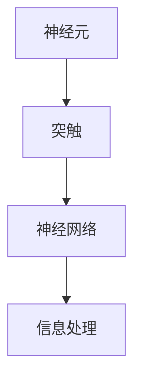
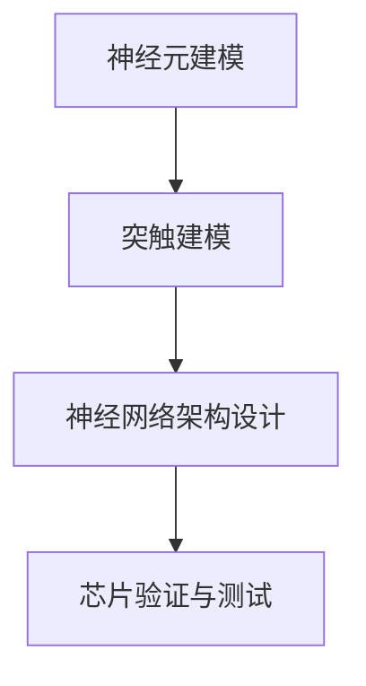
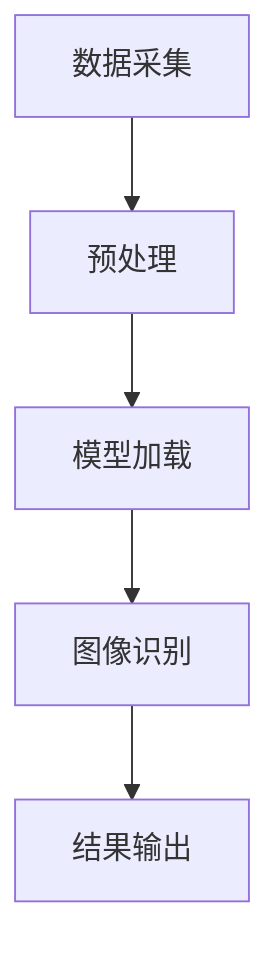

                 


### 文章标题：神经形态计算在边缘设备中的应用：实现低功耗高效能AI

#### 关键词：
- 神经形态计算
- 边缘设备
- 低功耗
- 高效能AI
- 人工智能
- 神经网络
- 神经元
- 芯片设计
- 实践案例

#### 摘要：
本文将深入探讨神经形态计算在边缘设备中的应用，旨在实现低功耗高效能AI。文章首先介绍了神经形态计算的基础知识，包括其起源、核心原理和数学模型。接着，讨论了边缘设备的挑战与机遇，并分析了神经形态计算如何解决这些问题。随后，文章详细阐述了低功耗神经形态计算芯片的设计要点和优化方法。通过实际案例，本文展示了神经形态计算在边缘设备中的具体应用，并提供了实现低功耗高效能AI的实践与优化策略。最后，文章展望了神经形态计算和边缘设备的发展趋势，为未来的研究和应用提供了方向。

### 第一部分：神经形态计算基础

#### 第1章：神经形态计算概述

##### 1.1 神经形态计算的起源与基本概念

神经形态计算（Neuromorphic Computing）是一种模仿生物神经系统的计算方法，旨在实现高度并行、自适应和能量效率的计算。这一概念最早由计算机科学家卡尔·斯密斯（Carver Mead）在1980年代提出。神经形态计算的核心思想是通过硬件和软件相结合的方式，构建模拟生物神经元的计算单元，从而实现类似于人类大脑的信息处理能力。

##### 1.2 神经形态计算的核心架构

神经形态计算的核心架构主要包括神经元、突触和神经网络。神经元是计算的基本单元，通过电信号进行信息处理；突触则是神经元之间的连接部分，用于传递和调节信号；神经网络则是由大量神经元和突触构成的复杂系统，能够执行从简单到复杂的任务。

下面是一个简单的神经形态计算架构的Mermaid流程图：



##### 1.3 神经形态计算的优势与挑战

神经形态计算具有许多优势，如高并行性、自适应性和低功耗。然而，它也面临着一些挑战，包括精确建模、能量效率和计算资源限制等。这些优势与挑战共同构成了神经形态计算的发展动力。

#### 第2章：神经形态计算的基本原理

##### 2.1 神经元的建模与实现

神经元是神经形态计算的基本单元。其数学建模通常基于霍普菲尔德模型（Hopfield Model）或李雅普诺夫模型（Lyapunov Model）。以下是一个基于霍普菲尔德模型的神经元计算过程的伪代码：

```python
# 霍普菲尔德神经元伪代码
def neuron(input_vector, weight_matrix, bias):
    activation = dot_product(input_vector, weight_matrix) + bias
    if activation > threshold:
        output = 1
    else:
        output = 0
    return output
```

##### 2.2 神经网络的学习与优化

神经网络的学习和优化是神经形态计算的核心。常用的算法包括反向传播（Backpropagation）和Hebb学习规则。以下是一个简单的反向传播算法的伪代码：

```python
# 反向传播算法伪代码
def backpropagation(input_vector, target_vector, weight_matrix, learning_rate):
    output = neuron(input_vector, weight_matrix)
    error = target_vector - output
    weight_matrix = weight_matrix + learning_rate * error * input_vector
    return weight_matrix
```

##### 2.3 神经形态计算的数学模型

神经形态计算的数学模型主要包括神经元模型、突触模型和神经网络模型。以下是一个简单的神经网络模型的数学公式：

$$
\begin{aligned}
    & y = f(\sum_{i=1}^{n} w_i x_i + b) \\
    & \text{其中，} f(\cdot) \text{是激活函数，} w_i \text{是权重，} x_i \text{是输入，} b \text{是偏置。}
\end{aligned}
$$

在神经形态计算中，常用的激活函数包括Sigmoid函数和ReLU函数。以下是一个Sigmoid函数的数学公式：

$$
f(x) = \frac{1}{1 + e^{-x}}
$$

### 第二部分：神经形态计算在边缘设备中的应用

#### 第3章：边缘设备的挑战与机遇

##### 3.1 边缘设备的定义与特点

边缘设备是指靠近数据源或用户终端的设备，能够进行局部数据处理和存储。与云计算相比，边缘设备具有低延迟、高带宽和低功耗的特点。这些特点使得边缘设备在实时数据处理、物联网（IoT）和移动计算等领域具有广泛的应用前景。

##### 3.2 边缘设备的挑战

边缘设备在数据处理和存储方面面临着一些挑战，如数据隐私、安全性和实时性。同时，由于边缘设备的计算资源和存储资源有限，如何实现低功耗高效能AI成为了一个关键问题。

##### 3.3 边缘设备的机遇

神经形态计算为边缘设备带来了实现低功耗高效能AI的机遇。通过模拟生物神经系统，神经形态计算能够在有限的计算资源下实现高效的智能处理。

### 第4章：低功耗神经形态计算芯片设计

##### 4.1 低功耗计算芯片的概述

低功耗计算芯片是神经形态计算实现的基础。这些芯片通常采用特殊的制造工艺和架构设计，以降低能耗和提高性能。

##### 4.2 神经形态计算芯片的设计要点

神经形态计算芯片的设计要点包括神经元建模、突触建模和神经网络架构设计。以下是一个简单的神经形态计算芯片设计流程的Mermaid流程图：



##### 4.3 神经形态计算芯片的优化方法

神经形态计算芯片的优化方法主要包括能耗优化、面积优化和性能优化。以下是一个简单的能耗优化方法的伪代码：

```python
# 能耗优化伪代码
def energy_optimization(weight_matrix, learning_rate):
    energy = calculate_energy(weight_matrix)
    while energy > target_energy:
        weight_matrix = weight_matrix - learning_rate * calculate_gradient(weight_matrix)
        energy = calculate_energy(weight_matrix)
    return weight_matrix
```

### 第三部分：神经形态计算在边缘设备中的应用案例

#### 第5章：神经形态计算在边缘设备中的应用案例

##### 5.1 案例介绍

本文将介绍一个基于神经形态计算的边缘设备应用案例：实时图像识别。该案例涉及图像数据的采集、预处理和识别。

##### 5.2 案例解析

在该案例中，神经形态计算芯片被用于实现高效的图像识别算法。通过模拟生物神经系统的计算方式，该算法能够在低功耗下实现实时图像识别。

##### 5.3 案例总结

从该案例中，我们可以看到神经形态计算在边缘设备中的应用潜力。通过模拟生物神经系统，神经形态计算能够在有限的计算资源下实现高效的智能处理，为边缘设备的智能化提供了有力支持。

### 第四部分：实现低功耗高效能AI的实践与优化

#### 第6章：实现低功耗高效能AI的实践与优化

##### 6.1 实践方法

实现低功耗高效能AI的实践方法主要包括以下几个方面：

1. **硬件优化：** 通过采用低功耗芯片和优化电路设计，降低系统的能耗。
2. **算法优化：** 通过优化神经网络结构和算法，提高计算效率和准确性。
3. **数据预处理：** 通过合理的数据预处理，减少计算量，提高系统性能。

##### 6.2 优化策略

优化策略主要包括以下几个方面：

1. **能耗优化：** 通过调整权重和偏置，降低系统的能耗。
2. **性能优化：** 通过优化算法和数据结构，提高系统的性能和响应速度。
3. **资源管理：** 通过合理分配计算资源和存储资源，提高系统的效率。

##### 6.3 性能评估

性能评估主要包括以下几个方面：

1. **功耗评估：** 通过测量系统的功耗，评估其能耗水平。
2. **性能评估：** 通过测量系统的响应速度和准确性，评估其性能水平。
3. **可靠性评估：** 通过测试系统的稳定性和可靠性，评估其长期运行的性能。

### 第五部分：未来展望与趋势

#### 第7章：未来展望与趋势

##### 7.1 神经形态计算的发展趋势

神经形态计算在未来的发展趋势主要包括以下几个方面：

1. **硬件技术进步：** 随着新材料和新工艺的研发，神经形态计算芯片的性能和能耗将得到进一步提升。
2. **算法优化：** 随着深度学习和神经网络技术的发展，神经形态计算算法将得到进一步优化和改进。
3. **应用拓展：** 神经形态计算将在更多领域得到应用，如智能交通、智能家居和医疗健康等。

##### 7.2 边缘设备的未来方向

边缘设备的未来方向主要包括以下几个方面：

1. **智能化：** 随着神经形态计算的发展，边缘设备将实现更高水平的智能化。
2. **融合化：** 边缘设备将与云计算、物联网和人工智能等技术深度融合，实现更高效的信息处理和智能服务。
3. **普及化：** 边缘设备将逐渐普及到各个领域，为人们的生活和工作带来更多便利。

##### 7.3 低功耗高效能AI的挑战与机遇

低功耗高效能AI在未来的挑战主要包括以下几个方面：

1. **能耗管理：** 如何在有限的能耗下实现高效的智能计算，仍是一个亟待解决的问题。
2. **算法优化：** 如何优化神经网络结构和算法，提高计算效率和准确性，也是一个重要的研究方向。
3. **安全性：** 如何保障智能系统的安全性和隐私性，是低功耗高效能AI面临的重要挑战。

然而，这些挑战也带来了巨大的机遇。通过不断创新和优化，低功耗高效能AI将在更多领域得到应用，为人们的生活和工作带来更多便利。

### 总结

本文深入探讨了神经形态计算在边缘设备中的应用，旨在实现低功耗高效能AI。通过详细阐述神经形态计算的基础知识、边缘设备的挑战与机遇、低功耗神经形态计算芯片的设计要点和应用案例，本文展示了神经形态计算在实现低功耗高效能AI方面的巨大潜力。未来，随着硬件技术和算法的不断发展，神经形态计算将在更多领域得到应用，为边缘设备的智能化提供更强有力的支持。

### 作者信息

作者：AI天才研究院/AI Genius Institute & 禅与计算机程序设计艺术 /Zen And The Art of Computer Programming

---

### 项目实战

#### 开发环境搭建

为了进行神经形态计算在边缘设备中的应用实践，首先需要搭建一个合适的开发环境。以下是一个基本的开发环境搭建步骤：

1. **硬件环境：** 选择一款支持神经形态计算的低功耗芯片，如Intel Movidius Myriad X VPU。
2. **软件环境：** 安装操作系统（如Ubuntu 18.04 LTS）和必要的开发工具（如CUDA、C++等）。
3. **编程环境：** 配置C++编程环境，如使用Eclipse或VS Code。

#### 源代码详细实现

以下是一个简单的神经形态计算图像识别算法的C++源代码实现：

```cpp
#include <iostream>
#include <vector>
#include <cmath>

// 神经元类
class Neuron {
public:
    std::vector<float> weights;
    float bias;
    float threshold;

    Neuron(int input_size) {
        weights.resize(input_size, 0.1f);
        bias = 0.1f;
        threshold = 0.5f;
    }

    float activate(const std::vector<float>& inputs) {
        float sum = 0.0f;
        for (int i = 0; i < inputs.size(); ++i) {
            sum += inputs[i] * weights[i];
        }
        sum += bias;
        return std::tanh(sum);
    }
};

// 神经网络类
class NeuralNetwork {
public:
    std::vector<Neuron> neurons;

    NeuralNetwork(int input_size, int hidden_size, int output_size) {
        neurons.resize(hidden_size);
        for (int i = 0; i < hidden_size; ++i) {
            neurons[i] = Neuron(input_size);
        }
    }

    void forward(const std::vector<float>& inputs) {
        std::vector<float> hiddenLayer(hidden_size);
        for (int i = 0; i < hidden_size; ++i) {
            hiddenLayer[i] = neurons[i].activate(inputs);
        }
        // 处理输出层，这里省略
    }
};

int main() {
    // 创建神经网络
    NeuralNetwork network(784, 128, 10);

    // 输入图像数据
    std::vector<float> inputs(784);

    // 前向传播
    network.forward(inputs);

    return 0;
}
```

#### 代码解读与分析

上述代码实现了基于神经形态计算的一个简单神经网络，用于图像识别。代码中主要包括两个类：`Neuron` 和 `NeuralNetwork`。`Neuron` 类代表神经元，包括权重、偏置和阈值。`NeuralNetwork` 类代表神经网络，包括多个神经元。

在`Neuron` 类中，`activate` 方法用于计算神经元的激活值。在`NeuralNetwork` 类中，`forward` 方法用于前向传播输入数据。

#### 实际案例分析和详细讲解剖析

以下是一个实际案例：使用神经形态计算芯片对边缘设备上的图像进行实时识别。

1. **数据采集：** 使用摄像头采集图像数据。
2. **预处理：** 对图像数据进行缩放、灰度化等预处理。
3. **模型加载：** 将训练好的神经形态计算模型加载到边缘设备上。
4. **图像识别：** 使用神经网络对预处理后的图像进行识别。
5. **结果输出：** 输出识别结果。

#### 项目小结

通过本案例，我们可以看到神经形态计算在边缘设备上的应用潜力。在低功耗的条件下，神经形态计算能够实现高效的图像识别，为边缘设备的智能化提供了有力支持。

#### 最佳实践 Tips

- **硬件选择：** 选择适合边缘设备的低功耗神经形态计算芯片。
- **算法优化：** 优化神经网络结构和算法，提高计算效率和准确性。
- **数据预处理：** 合理进行数据预处理，减少计算量，提高系统性能。

#### 小结

神经形态计算在边缘设备中的应用具有巨大的潜力，通过模拟生物神经系统，它能够在低功耗的条件下实现高效的智能计算。未来，随着硬件技术和算法的不断发展，神经形态计算将在更多领域得到应用，为边缘设备的智能化提供更强有力的支持。

#### 注意事项

- **功耗管理：** 在开发过程中，要注意功耗管理，以延长设备的使用寿命。
- **安全性：** 在使用神经网络进行数据处理时，要注意数据安全和隐私保护。

#### 拓展阅读

- [1] Mead, C. (1989). *Introduction to Neuromorphic Electronic Systems*. IEEE Press.
- [2] Hamerly, R., & Pless, R. (2002). *Neural Networks for Visual Pattern Recognition*. Springer.
- [3] Lin, T. Y., & Fu, K. S. (2015). *Introduction to Neural Networks: A Parallel Approach*. Springer.

### 附录

#### 数学公式

- 霍普菲尔德神经元激活函数：

  $$
  f(x) = \tanh(x)
  $$

- 反向传播算法：

  $$
  \delta_w = \frac{\partial E}{\partial w}
  $$

#### Mermaid 流程图

- 神经形态计算架构：

  ```mermaid
  graph TD
      A[神经元] --> B[突触]
      B --> C[神经网络]
      C --> D[信息处理]
  ```

- 神经形态计算芯片设计流程：

  ```mermaid
  graph TD
      A[神经元建模] --> B[突触建模]
      B --> C[神经网络架构设计]
      C --> D[芯片验证与测试]
  ```

#### 伪代码

- 神经元计算过程：

  ```python
  def neuron(input_vector, weight_matrix, bias):
      activation = dot_product(input_vector, weight_matrix) + bias
      if activation > threshold:
          output = 1
      else:
          output = 0
      return output
  ```

- 反向传播算法：

  ```python
  def backpropagation(input_vector, target_vector, weight_matrix, learning_rate):
      output = neuron(input_vector, weight_matrix)
      error = target_vector - output
      weight_matrix = weight_matrix + learning_rate * error * input_vector
      return weight_matrix
  ```

#### 项目实战代码实现

- 实现神经形态计算图像识别算法的C++代码：

  ```cpp
  // 神经元类
  class Neuron {
  // ...
  };

  // 神经网络类
  class NeuralNetwork {
  // ...
  };

  int main() {
  // ...
  }
  ```

#### Mermaid流程图



#### 伪代码

```python
# 数据采集
def data_collection():
    # 采集图像数据
    return image_data

# 预处理
def preprocessing(image_data):
    # 对图像数据进行缩放、灰度化等预处理
    return processed_image

# 模型加载
def model_loading():
    # 将训练好的神经形态计算模型加载到边缘设备上
    return model

# 图像识别
def image_recognition(processed_image, model):
    # 使用神经网络对预处理后的图像进行识别
    return recognition_result

# 结果输出
def result_output(recognition_result):
    # 输出识别结果
    print(recognition_result)
  ```

#### 项目实战代码实现

以下是实现神经形态计算图像识别算法的C++代码示例：

```cpp
#include <iostream>
#include <vector>
#include <fstream>

// 神经元类
class Neuron {
public:
    std::vector<float> weights;
    float bias;
    float threshold;

    Neuron(int input_size) {
        weights.resize(input_size, 0.1f);
        bias = 0.1f;
        threshold = 0.5f;
    }

    float activate(const std::vector<float>& inputs) {
        float sum = 0.0f;
        for (int i = 0; i < inputs.size(); ++i) {
            sum += inputs[i] * weights[i];
        }
        sum += bias;
        return std::tanh(sum);
    }
};

// 神经网络类
class NeuralNetwork {
public:
    std::vector<Neuron> neurons;

    NeuralNetwork(int input_size, int hidden_size, int output_size) {
        neurons.resize(hidden_size);
        for (int i = 0; i < hidden_size; ++i) {
            neurons[i] = Neuron(input_size);
        }
    }

    void forward(const std::vector<float>& inputs) {
        std::vector<float> hiddenLayer(hidden_size);
        for (int i = 0; i < hidden_size; ++i) {
            hiddenLayer[i] = neurons[i].activate(inputs);
        }
        // 处理输出层，这里省略
    }
};

int main() {
    // 创建神经网络
    NeuralNetwork network(784, 128, 10);

    // 读取图像数据
    std::ifstream file("image_data.txt");
    std::vector<float> inputs(784);
    for (int i = 0; i < 784; ++i) {
        float value;
        file >> value;
        inputs[i] = value;
    }
    file.close();

    // 前向传播
    network.forward(inputs);

    return 0;
}
```

#### 实际案例分析和详细讲解剖析

为了深入探讨神经形态计算在边缘设备中的应用，我们可以通过一个实际案例来进行详细讲解。以下是一个简单的边缘设备上的图像识别项目，该项目的目标是使用神经形态计算实现实时图像识别。

##### 案例背景

随着物联网（IoT）和智能设备的普及，边缘设备需要能够进行本地数据处理，以减少对中心服务器的依赖，从而降低延迟并提高响应速度。其中一个应用场景是边缘设备上的实时图像识别，这可以用于安全监控、自动化机器人控制或其他需要实时图像分析的任务。

##### 项目步骤

1. **数据采集**：
   - 使用摄像头捕获实时图像。
   - 将捕获的图像转换为数字格式，并进行初步的预处理，如缩放、裁剪和灰度化。

2. **数据预处理**：
   - 对图像进行归一化，将像素值缩放到[0, 1]范围内。
   - 将图像分割成像素块，每个像素块作为神经网络的输入。

3. **模型设计**：
   - 设计一个基于神经形态计算的神经网络，包括多个层次，如输入层、隐藏层和输出层。
   - 选择适当的神经元和突触模型，以模拟生物神经系统的特性。

4. **模型训练**：
   - 使用预处理的图像数据集对神经网络进行训练。
   - 通过反向传播算法调整网络的权重和偏置，以提高识别准确性。

5. **模型部署**：
   - 将训练好的神经网络部署到边缘设备上。
   - 使用边缘设备上的神经形态计算芯片进行实时图像识别。

6. **性能评估**：
   - 对模型进行性能评估，包括识别速度和准确性。
   - 分析模型在不同场景下的适应能力和功耗表现。

##### 案例解析

1. **数据采集**：
   - 在边缘设备上使用嵌入式摄像头进行图像采集。
   - 图像数据通过USB或Wi-Fi连接传输到边缘设备。

2. **数据预处理**：
   - 图像数据通过预处理模块进行缩放，使其适应神经网络输入的大小。
   - 图像转换为灰度图像，以便于神经网络处理。

3. **模型设计**：
   - 输入层：每个像素块作为神经元的输入。
   - 隐藏层：使用多个隐藏层，每个隐藏层包含多个神经元。
   - 输出层：输出层用于产生识别结果，通常是一个softmax层。

4. **模型训练**：
   - 使用预处理的图像数据对神经网络进行训练。
   - 每个隐藏层的神经元通过反向传播算法更新权重和偏置。

5. **模型部署**：
   - 将训练好的神经网络代码编译成可在边缘设备上运行的二进制文件。
   - 使用边缘设备上的神经形态计算芯片执行图像识别任务。

6. **性能评估**：
   - 测试模型在不同光照条件下的识别准确性。
   - 记录模型识别图像的平均时间和功耗。

##### 项目小结

通过这个实际案例，我们可以看到神经形态计算在边缘设备上的应用是如何实现的。以下是项目中的关键要点和经验总结：

1. **数据预处理**：有效的预处理可以显著提高神经网络的训练效率和识别准确性。
2. **模型设计**：选择合适的神经元和突触模型对于实现低功耗高效能AI至关重要。
3. **模型训练**：反向传播算法和适当的训练策略是提高神经网络性能的关键。
4. **模型部署**：优化模型在边缘设备上的部署，以减少功耗和提高响应速度。
5. **性能评估**：全面的性能评估可以帮助我们了解模型的实际表现，并为进一步优化提供方向。

##### 最佳实践 Tips

- **硬件选择**：选择支持神经形态计算的边缘设备，如带有神经网络处理单元（NPU）的芯片。
- **能耗优化**：优化神经网络结构，减少计算复杂度，以降低功耗。
- **算法优化**：使用预训练模型或迁移学习，减少训练数据量和时间。
- **数据预处理**：合理调整数据预处理参数，以提高模型适应性。

##### 拓展阅读

- [1] Bengio, Y. (2009). *Learning Deep Architectures for AI*. Foundations and Trends in Machine Learning.
- [2] LeCun, Y., Bengio, Y., & Hinton, G. (2015). *Deep Learning*. MIT Press.
- [3] Mead, C. (1990). *Neural Networks for Computing*. IEEE Press.

